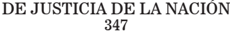

TOMO 347

Volumen 2

2024

## FALLOS DE LA CORTE SUPREMA DE JUSTICIA DE LA NACION

## CONSULTA DE JURISPRUDENCIA DE LA CORTE SUPREMA DE JUSTICIA DE LA NACIÓN

En  la  Colección  'Fallos'  se  publican  solo  las  sentencias  más trascendentes que emite el Tribunal (acordada 37/2003).

En  el  sitio  de  Internet www.csjn.gov.ar , se  puede  consultar la totalidad  de  las  sentencias en  forma  inmediata  a  su  dictado  y mediante diversos parámetros de búsqueda.

Entre las bases disponibles, se hallan las siguientes:

- 1.- Base única de Sumarios de fallos (desde 1863 - a la fecha)
- 2.- Base de Fallos Completos (desde 1994 - a la fecha)
- 3.- La biblioteca completa de los Tomos de la colección 'Fallos' (desde el Tomo 1°)
- 4.- Búsqueda de precedente por la Cita de la colección 'Fallos'
- 5.Suplementos de Actualización Jurisprudencial
- 6.- Posibilidad de consultar todas las sentencias por Acuerdo
- 7.- Las Novedades más importantes sobre la jurisprudencia del Tribunal

## R E P U B L I C A   A R G E N T I N A

FALLOS

DE LA

C o r t e

S u p r e m a

DE

## JuStiCia de la NaCioN

PUBLICACION A CARGO DE LA SECRETARIA DE JURISPRUDENCIA DEL TRIBUNAL

TOMO 347- VOLUMEN II

SEPTIEMBRE-DICIEMBRE

2024

de Justicia de la nación

347

## SEPTIEMBRE

## GORRIEZ, VILMA NOEMI s/ RecuRso extRaoRdinaRio de inaplicabilidad de ley

## RECURSOS LOCALES

La decisión que rechazó el recurso extraordinario local interpuesto contra una sentencia condenatoria debe ser revocada, si el estudio en torno a los recaudos vinculados con la fundamentación de la impugnación se ha efectuado con un injustificado rigor formal, teniendo en cuenta para ello el tiempo transcurrido desde la vinculación de las encausadas al proceso y por medio de afirmaciones dogmáticas, se ha omitido el tratamiento de temas oportunamente propuestos y conducentes para la adecuada solución del litigio en relación con la afectación del plazo razonable y su incidencia en la determinación de la pena.

## RECURSO EXTRAORDINARIO

Si bien las decisiones relativas a la improcedencia de los recursos deducidos por ante los tribunales de la causa no justifican, en principio, el otorgamiento de la apelación extraordinaria, ya que por la índole exclusivamente procesal y de derecho común de las cuestiones que se suscitan, no exceden el marco de las facultades que le son propias, cabe hacer excepción a dicha regla sobre la base de la doctrina de la arbitrariedad, en salvaguarda de las garantías del debido proceso y de la defensa en juicio, cuando la decisión apelada frustra el alcance de la vía utilizada por el justiciable sin fundamentación idónea o suficiente.

## Fallos de la coRte supRema 347

## dictamen de la pRocuRación GeneRal

Suprema Corte:

-I-

La Suprema Corte de Justicia de la provincia de Buenos Aires no hizo lugar a los recursos extraordinarios de inaplicabilidad de ley interpuestos por las defensas de Vilma Noemí Gorriez, Dolinda Basile y Elena Alejandrina Tamiozzo contra la confirmación de las condenas a las penas de tres años y cuatro meses de prisión impuesta a la primera, y cuatro años de prisión impuesta a las otras dos imputadas, por considerárselas coautoras de asociación ilícita en carácter de miembros.

Según surge de esa decisión, las nombradas integraron una organización delictiva que cometió 'crímenes de gran escala y suma gravedad', tales como el ejercicio habitual y clandestino de prácticas abortivas, y también, en caso de embarazos que arribaban a término, asistir a la parturienta y entregar a terceros al recién nacido, todo a cambio de dinero (cf. fs. 69 vta. del principal, según la copia digitalizada que tengo a la vista para dictaminar).

Las defensas no pusieron en discusión la valoración de la prueba, ni las conclusiones sobre la responsabilidad de las acusadas en las que se fundó la condena y su confirmación en segunda instancia, sino que objetaron las penas impuestas. En síntesis, arguyeron que los hechos fueron cometidos hace más de veinte años, por lo que sería irrazonable la pretensión de privarlas de su libertad en una prisión cuando ya el Estado habría perdido su poder de castigarlas por la excesiva duración del proceso. Además, señalaron que la imposición de penas de cumplimiento efectivo carece de sentido en el caso, pues el encarcelamiento no permitiría alcanzar el objetivo que la Constitución le atribuye a esa sanción, en tanto las condenadas ya se habrían reinsertado socialmente durante el período transcurrido desde la comisión de los hechos hasta ahora. Por último, cuestionaron que los magistrados utilizaran como agravante la impresión 'regular' que les habrían causado las imputadas al tomar contacto con ellas (cf. fs. 68/69 y 70 vta./71 ídem).

El a  quo consideró  infundados  los  agravios  reseñados.  Por  un lado, respecto de la extensión del proceso como circunstancia atenuante de la pena, recordó que no existe un plazo determinado en

abstracto  para  apreciar  la  razonabilidad  de  su  duración,  sino  que, según la jurisprudencia internacional que citó en su apoyo, deben tomarse en cuenta factores como la complejidad del caso, la actividad procesal del interesado, la conducta de las autoridades judiciales, el perjuicio ocasionado al acusado y la gravedad del delito imputado. Luego, afirmó que las recurrentes no habían abordado tales factores con relación a las circunstancias concretas del sub examine . Finalmente, señaló que el planteo no tenía ninguna vinculación con los criterios establecidos en las normas aplicables para determinar la medida de la pena (cf. fs. 69 y vta. ídem).

Por otro lado, respecto de la invocada agravante basada en la impresión regular que las imputadas les habrían causado a los magistrados, la suprema corte provincial afirmó que tal impresión, contrariamente a lo alegado por las recurrentes, no tuvo ninguna incidencia en la mensuración de las penas, sino que sólo se la mencionó en el contexto de las entrevistas que el código de procedimiento local exige como requisito de esa función (cf. fs. 70 ídem).

Contra tal decisión, el señor defensor oficial, en representación de  las  tres  condenadas,  interpuso  recurso  extraordinario  federal, en el que sostuvo que el a  quo se  pronunció de manera arbitraria sobre la cuestión del plazo razonable del proceso. En particular, señaló  que  no  existe  ninguna  explicación  vinculada  a  la  complejidad del caso o la gravedad de los hechos que pueda justificar la duración de un proceso que, como en el sub examine , comenzó en 1997 y todavía se encuentra en trámite. Agregó que, si bien la investigación fue  extensa,  en  febrero  de  2006  el  señor  fiscal  ya  había  formulado acusación con base en las pruebas obtenidas durante los primeros meses de la causa, por lo que resulta inaceptable que se invoquen las circunstancias mencionadas para sostener que no son excesivos los dieciséis años que transcurrieron entre el comienzo del proceso y el dictado de la condena, además del resto del tiempo que pasó desde la impugnación de esa sentencia hasta ahora, sin que aún exista una decisión  definitiva  sobre  la  situación  de  las  acusadas.  En  síntesis, con base en jurisprudencia de V .E. que citó en su apoyo, la defensa estimó que la corte provincial debió declarar extinguida la acción penal por prescripción al considerar irrazonable el aludido plazo de duración del proceso, sin perjuicio de que las recurrentes no habían planteado esta cuestión ante aquella corte con ese objetivo, sino con la intención de que se disminuyera el rigor de las penas impuestas (cf. fs. 83/93 vta. ídem).

Ese recurso extraordinario fue declarado inadmisible (fs. 170/172 vta. ídem), lo que motivó la presentación de la queja en la cual la parte insiste con su pretensión de que se declare prescripta la acción penal por haberse superado el plazo razonable del proceso.

## -II-

La Corte ha establecido que las resoluciones por las cuales los superiores tribunales de provincia deciden acerca de la procedencia  o  improcedencia  de  los  recursos  extraordinarios  de  carácter local que se interponen ante ellos no son, en principio, revisables en la instancia del artículo 14 de la ley 48, y que la tacha de arbitrariedad a su respecto es especialmente restrictiva (del dictamen de la Procuración General, al que remitió la Corte Suprema en Fallos: 327:5416; y Fallos: 307:819 y 308:174), aunque la regla puede ceder, con fundamento en la doctrina de la arbitrariedad, ante supuestos de  excesivo  rigor  formal  susceptibles  de  menoscabar  la  garantía de defensa en juicio y el debido proceso legal (del dictamen de la Procuración General al que la Corte hizo remisión al resolver en el  expediente B. 412, L. XLIX. RHE 'Bocazzi, Mariano Marcelo y otros s/causa nº 34126/10' el 12 de mayo de 2015, con cita de Fallos: 315:356; 326:2759 y 3334).

Al examinar el sub judice de conformidad con esos criterios, advierto que no se trata de uno de aquellos casos de excepción. Ello es así, pues como bien señaló en su dictamen el Ministerio Público provincial,  los  argumentos  desarrollados  por  la  defensa  en  su  recurso extraordinario de inaplicabilidad de ley resultan inconsistentes para traslucir la invocada arbitrariedad y, con ello, no permiten que surja 'la relación directa e inmediata que necesariamente debe darse entre las cuestiones debatidas, lo resuelto y las normas constitucionales supuestamente infringidas' (fs. 166 vta. ídem) .

Al respecto, como lo ha afirmado el a quo (cf. supra , punto I), creo conveniente recordar que la Corte ha identificado algunos factores insoslayables para saber si se ha conculcado la garantía a obtener un juicio sin demoras indebidas: la complejidad del asunto; la actividad procesal del interesado; la conducta de las autoridades judiciales; y el  perjuicio  concreto  que  la  dilación  le  ha  irrogado  al  imputado  (cf., entre otros, Fallos: 342:854, esp. considerando 25, y sus citas). Tales factores, si bien son de imprescindible consideración, no pueden ser valorados aisladamente como una condición suficiente, sino que deben ser ponderados y sopesados uno frente al otro, atendiendo a las

circunstancias concretas de la causa (considerando 9° de la disidencia de los ministros Fayt y Bossert en Fallos: 322:360).

Pues bien, como surge de lo dicho, la decisión del a quo se fundó en que la parte omitió el análisis conjunto de esos factores. Es que -cabe añadir- al interponer el recurso extraordinario local se limitó a insistir en su disidencia de opinión acerca de la complejidad de la causa y el tiempo transcurrido desde la comisión del hecho, sin especificar qué perjuicio en concreto le irrogó a las imputadas -quienes se encuentran en libertad- la duración del proceso, más allá del gravamen que pueda derivar de esa condición.

Tal déficit resulta particularmente relevante al advertirse que en esta materia no existen plazos automáticos o absolutos, y, en consecuencia, la referencia a las particularidades del caso aparece como ineludible (Fallos: 332:1512 y 335:1126, entre otros).

En el mismo sentido, la Corte Interamericana de Derechos Humanos, cuya jurisprudencia puede servir de guía para la interpretación de los preceptos convencionales (Fallos: 318:514; 319:1840 y 323:4130), consideró que la complejidad del caso, como uno de los factores con base en los cuales debe medirse la duración razonable del proceso, está determinada por circunstancias tales como la gravedad del hecho, la extensión de la investigación y la cantidad de prueba (caso 'Genie  Lacayo vs.  Nicaragua',  Fondo,  reparaciones y costas, sentencia del 29 de enero de 1997, párr. 78).

Por ello, tampoco se puede omitir que la recurrente no ha puesto en duda que los hechos imputados, como también lo señaló el a quo , deban considerarse graves y que la investigación ha sido extensa.

Por último, no se trata de un proceso en el cual, como sostuvo la defensa (cf. fs. 83 ídem), no parece 'probable que a la brevedad se obtenga una decisión que defina la posición de [las condenadas] frente a la ley y la sociedad'. En rigor, la sentencia dictada el 8 de septiembre de 2014 (cf.  fs.  86  vta.  ídem),  fue  confirmada  dos  años  y  tres  meses después por el tribunal de segunda instancia (cf. fs. 67 ídem), lo cual importó, más allá del sentido de este fallo, la observancia de la garantía de la doble conformidad judicial. A esas decisiones, que oportunamente brindaron razonable certidumbre en cuanto a la situación de las  condenadas frente a la ley,  debe  sumarse que la suprema corte provincial también se pronunció en las actuaciones al declarar inadmisibles los recursos de inaplicabilidad de ley y el extraordinario federal, por lo que aquella alegada improbabilidad de que el litigio culmine a la brevedad no es atendible.

## Fallos de la coRte supRema

En conclusión, aprecio que la parte no ha dado cumplimiento al requisito de fundamentación autónoma suficiente requerido por el artículo 15 de la ley 48 y, en consecuencia, su recurso extraordinario resulta improcedente (Fallos: 303:620; 305:171; 306:1401 y 312:389, entre otros).

Sin perjuicio de lo hasta aquí considerado, resta observar, en virtud del orden público involucrado y de la estrecha vinculación que V .E. ha señalado al afirmar que 'la prescripción ha sido el mecanismo a través del cual esta Corte ha hecho efectiva la garantía del plazo razonable' (cf. Fallos: 344:1952 y sus citas del considerando 3°), que los antecedentes del sub examine acreditan que desde la sentencia condenatoria del 8 de septiembre de 2014 no ha transcurrido el máximo de la pena prevista para el delito de asociación ilícita en el que se han subsumido las conductas de las acusadas (artículos 62, inciso 2°, y 67, sexto párrafo, inciso 'e', del Código Penal).

## -III-

Por todo lo expuesto, opino que V .E. debe desestimar la queja interpuesta. Buenos Aires, 14 de mayo de 2024. Eduardo Ezequiel Casal .

## FALLO DE LA CORTE SUPREMA

Buenos Aires 3 de septiembre de 2024.

Vistos los autos: 'Recurso de hecho deducido por la defensa en la causa Gorriez, Vilma Noemí s/ recurso extraordinario de inaplicabilidad de ley', para decidir sobre su procedencia.

Considerando:

- 1°) Que la descripción de los recursos interpuestos por la defensa de Dolinda Basile, Elema A. Tamiozzo y Vilma N. Gorriez durante el trámite del expediente, así como los agravios que sustentan el recurso extraordinario denegado, han sido correctamente reseñados en el apartado I del dictamen del señor Procurador General de la Nación interino, al que corresponde remitir por razones de brevedad.
- 2°) Que este Tribunal tiene establecido que las decisiones relativas a la improcedencia de los recursos deducidos por ante los tribunales

de la causa no justifican, en principio, el otorgamiento de la apelación extraordinaria, ya que por la índole exclusivamente procesal y de derecho común de las cuestiones que se suscitan, no exceden el marco de las facultades que le son propias (Fallos: 311:357; 311:519; 313:77 y 317:1679, entre otros).

- 3°) Que sin embargo, también se ha sostenido que es posible hacer excepción a dicha regla sobre la base de la doctrina de la arbitrariedad, en salvaguarda de las garantías del debido proceso y de la defensa en juicio, cuando la decisión apelada frustra el alcance de la vía utilizada por el justiciable sin fundamentación idónea o suficiente (Fallos: 313 :1223; 320:2089; 323:1449; 324:3612; CSJ 83/2013(49-A)/CS1 'Albarenque, Claudio Darío s/ causa n° 115.904' resuelta el 19 de mayo de 2015; Fallos: 339:408, entre muchos otros).
- 4°) Que tal es la situación que se ha configurado en el caso ya que el estudio en torno a los recaudos vinculados con la fundamentación de la impugnación local se ha efectuado con un injustificado rigor formal, teniendo en cuenta para ello el tiempo transcurrido desde la vinculación de las encausadas al proceso. De tal modo, y por medio de afirmaciones dogmáticas, el tribunal ha omitido el tratamiento de temas oportunamente propuestos y conducentes para la adecuada solución del litigio en relación con la afectación del plazo razonable y su incidencia en la determinación de la pena.

En tales condiciones y sin que ello implique abrir juicio sobre la solución que en definitiva deba adoptarse sobre el fondo del asunto, ha de acogerse favorablemente el recurso y revocarse el fallo impugnado.

Por ello, oído el señor Procurador General de la Nación interino, se hace lugar a la queja, se declara procedente el recurso extraordinario y se deja sin efecto el pronunciamiento apelado. Vuelvan los autos al tribunal de origen con el fin de que, por quien corresponda, se dicte un nuevo pronunciamiento con arreglo a la presente. Remítase la queja. Notifíquese y cúmplase.

HoRacio Rosatti - Juan caRlos maqueda - RicaRdo luis loRenzetti.

Recurso de queja interpuesto por Vilma Noemí, Gorriez, Dolinda Basile y Elena Alejandra Tamiozzo , asistidas por la Dra. Ana Julia Biasotti, Defensora Adjunta .

Tribunal de origen: Suprema Corte de Justicia de la Provincia de Buenos Aires .

## Fallos de la coRte supRema 347

Tribunal que intervino con anterioridad: Sala Segunda de la Cámara de Apelación y Garantías de San Isidro .

## DE ÁNGELIS, MAURO DARÍO y otRos s/ incidente de incompetencia

## COMPETENCIA TERRITORIAL

Es competente el Juzgado de Garantías del Departamento Judicial de Avellaneda-Lanús, Provincia de Buenos Aires, para entender en la denuncia por el delito de desbaratamiento de derechos acordados, pues dicho delito se consuma cuando, ya realizada la disposición patrimonial, se torna incierto o litigioso el derecho adquirido y en el caso ello habría sucedido al momento de la venta del inmueble en una escribanía ubicada en una localidad de dicha jurisdicción.

-Del dictamen de la Procuración General al que la Corte remite-(*)

ACOSTA, JOSÉ ALBERTO c/ en - m SEGURIDAD - pFa s/ peRsonal militaR y civil de las FFaa y de seG.

## RECURSO DE QUEJA

El  escrito  de  interposición  del  recurso  de  queja,  en  tanto  no  dio cumplimiento a lo dispuesto en el punto I, inc. 5, del anexo II, de la acordada 31/2020, al contrar solamente con la firma del letrado patrocinante, constituye un acto jurídico inexistente e insusceptible de convalidación posterior.

(*)   Sentencia del 3 de septiembre de 2024. Ver fallo.

## de Justicia de la nación 347

## FALLO DE LA CORTE SUPREMA

Buenos Aires 3 de septiembre de 2024.

Vistos los autos: 'Recurso de hecho deducido por la parte actora en la causa Acosta, José Alberto c/ EN - M Seguridad - PFA s/ Personal  Militar  y  Civil  de  las  FFAA  y  de  Seg.',  para  decidir  sobre  su procedencia.

## Considerando:

Que el escrito de interposición del recurso de queja, en tanto no dio cumplimiento a lo dispuesto en el punto I, inc. 5, del anexo II, de la acordada 31/2020, solo cuenta con la firma del letrado patrocinante. En consecuencia, constituye un acto jurídico inexistente e insusceptible de convalidación posterior.

Por  ello,  se  desestima  la  queja.  Notifíquese  y,  oportunamente, archívese.

HoRacio Rosatti - Juan caRlos maqueda - RicaRdo luis loRenzetti.

Recurso de queja interpuesto por José Alberto Acosta , actor en autos , con el patrocinio letrado del Dr. Javier Alejandro Salgado .

Tribunal de origen: Cámara Nacional de Apelaciones en lo Contencioso Administrativo Federal, Sala I .

Tribunal que intervino con anterioridad: Juzgado Nacional de Primera Instancia en lo Contencioso Administrativo Federal n° 12 .

CHIEMENA, UHIARA c/ en MINISTERIO INTERIOR op y v - dnm s/ RecuRso diRecto paRa JuzGados

## MIGRACIONES

Es improcedente ordenar una nueva notificación -personal- al migrante de la orden de expulsión del territorio nacional si de las constancia de la causa surge que dicha decisión fue notificada a su apoderado -conf.

## Fallos de la coRte supRema 347

acta poder otorgada a los integrantes de la Comisión del Migrante de la Defensoría General de la Nación- de acuerdo a lo establecido en el ordenamiento jurídico migratorio y no se han acompañaron elementos objetivos suficientes para demostrar una lesión a la garantía del debido proceso y al derecho de defensa en juicio.

-El  juez  Rosenkrantz, en disidencia, consideró inadmisible el recurso extraordinario (art. 280 CPCCN)-

## MIGRACIONES

El art. 54 de la Ley 25.871 de Migraciones establece, en forma categórica y prístina, no solo la obligación del migrante de informar su domicilio en la República Argentina sino que también dispone que, en toda presentación ante las autoridades de la Dirección Nacional de Migraciones, se debe constituir domicilio y se considera válida la notificación cursada en el último domicilio constituido o aquella efectuada mediante alguna de las formas previstas en la reglamentación supletoria, por lo cual no surge del mencionado artículo, ni de ningún otro de los contenidos por la ley migratoria que los actos de expulsión y prohibición de reingreso deban ser notificados en forma personal al migrante.

## FALLO DE LA CORTE SUPREMA

Buenos Aires 10 de septiembre de 2024.

Vistos los autos: 'Chiemena, Uhiara c/ EN - Ministerio Interior OP y V - DNM s/ recurso directo para juzgados'.

## Considerando:

1°) Que la Sala V de la Cámara Nacional de Apelaciones en lo Contencioso Administrativo Federal, por mayoría, dejó sin efecto la sentencia de primera instancia que había rechazado el recurso judicial directo interpuesto por el migrante contra la disposición SDX 156703/14 -por medio de la cual se había declarado irregular la permanencia en la República Argentina del actor, ordenado su expulsión del territorio nacional y prohibido el reingreso al país con carácter permanente- y de su ratificatoria SDX 11218/17; declaró la nulidad de todo lo actuado y

dispuso que la Dirección Nacional de Migraciones debería arbitrar los medios necesarios para notificar personalmente al actor de lo resuelto en la disposición SDX 11218/17.

Para así decidir, el tribunal entendió que había quedado acreditado en autos que el mandato otorgado por el migrante a la Comisión del Migrante de la Defensoría General de la Nación, en la Carta Poder obrante a fs. 307 había sido conferido expresamente a fin de que pudiera ejercer su defensa ante la Dirección Nacional de Migraciones y en los términos del art. 32 del Reglamento de Procedimientos Administrativos. Destacó que los términos explícitos de dicho instrumento no autorizaban a la referida Comisión a efectuar una interpretación que permitiera reconocerle efectos fuera del procedimiento administrativo para el que había sido otorgado.

En razón de ello, concluyó en que la Defensora Pública Oficial Coadyuvante  carecía  de  facultades  para  cuestionar  judicialmente la  expulsión del señor Uhiara Chiemena, hizo saber a la Dirección Nacional de Migraciones que debería arbitrar los medios necesarios para notificar personalmente al migrante lo resuelto en la disposición SDX 11218/17.

- 2°) Que contra esa decisión la demandada interpuso recurso extraordinario federal, que fue parcialmente concedido.

En sustancial síntesis el recurrente alega que el a quo, al imponer a la Dirección Nacional de Migraciones notificar personalmente al actor lo resuelto en la disposición SDX 11218/17, se apartó de lo dispuesto en la ley 25.871.

- 3°) Que el recurso extraordinario es formalmente admisible toda vez que en autos se discute la validez de un acto emanado de autoridad nacional con fundamento en la interpretación y aplicación de normas de carácter federal y la decisión ha sido contraria a las pretensiones que el recurrente fundó en ellas (Fallos: 314:1234). Por lo demás, los agravios  deducidos  con  apoyo  en  la  doctrina  de  la  arbitrariedad  de sentencia,  al  estar  referidos  a  la  cuestión  federal  indicada,  quedan comprendidos en ella y, por ende, serán tratados en forma conjunta (doctrina de Fallos: 323:1625, entre otros).

- 4°) Que, a los efectos de decidir la cuestión aquí planteada es preciso señalar que en el art. 54 de la ley 25.871 -modificado por el art. 5° del decreto 70/2017-, texto vigente al momento de los hechos, se establecía que:
- 'Los extranjeros deberán informar domicilio en la REPÚBLICA ARGENTINA.

Se considerará domicilio constituido a todos los efectos legales y en el que serán válidas todas las notificaciones, el informado al momento del ingreso al territorio nacional, el constituido en las actas labradas en el marco de inspecciones migratorias o el denunciado en los trámites de residencia o ante el REGISTRO NACIONAL DE LAS PERSONAS.

En toda presentación efectuada ante autoridades migratorias se deberá constituir domicilio.

En todos los casos se considerará válida la notificación cursada en el último domicilio constituido'.

A su vez, cabe tener en cuenta las disposiciones del decreto reglamentario de la ley de procedimiento administrativo -1759/1972-, de aplicación supletoria en la materia según lo dispuesto en el art. 83 de la ley 25.871. Allí se ordena que, en las presentaciones realizadas en soporte papel, el domicilio constituido producirá todos sus efectos y se prevén diferentes formas de notificación entre las que se encuentran el acceso al expediente por la parte interesada o su apoderado y la notificación por cédula que 'se diligenciará en forma similar a la dispuesta por los artículos 140 y 141 del Código Procesal Civil y Comercial de la Nación' (confrontar arts. 19, 21 y 41 del decreto 1759/1972).

- 5°)  Que  esta  Corte  ha  sostenido  reiteradamente  que  la  primera fuente de interpretación de las leyes es su letra y que, cuando esta no exige un esfuerzo para determinar su sentido, debe ser aplicada directamente, con prescindencia de consideraciones que excedan las circunstancias del caso contempladas por la regla ya que de otro modo podría arribarse a una interpretación que, sin declarar la inconstitucionalidad de la disposición legal, equivalga a prescindir de ella (Fallos: 338:488 y sus citas).

Tal como puede advertirse, el citado art. 54 de la ley de migraciones establece, en forma categórica y prístina, no solo la obligación del migrante de informar su domicilio en la República Argentina sino que también dispone que, en toda presentación ante las autoridades de la Dirección Nacional de Migraciones, se debe constituir domicilio. A su vez, a partir del ordenamiento jurídico aplicable en la materia se considera válida la notificación cursada en el último domicilio constituido o aquella efectuada mediante alguna de las formas previstas en la reglamentación supletoria. No surge del mencionado artículo, ni de ningún otro de los contenidos por la ley migratoria que actos como los impugnados en autos deban ser notificados en forma personal al migrante.

- 6°)  Que  de  las  constancias  de  las  actuaciones  administrativas agregadas a estos autos resulta que el señor Uhiara Chiemena otorgó poder especial en favor de los Magistrados y Funcionarios Letrados integrantes de la Comisión del Migrante de la Defensoría General de la Nación para que indistintamente lo representen en todos los actos necesarios ante la Dirección Nacional de Migraciones y el Ministerio del Interior de la Nación, tendientes a evitar su expulsión del territorio argentino.

En razón de tal apoderamiento, el cotitular de la mencionada Comisión interpuso recurso de reconsideración, con jerárquico en subsidio, contra la disposición SDX 156703/14 que había dispuesto la expulsión del migrante (confr. fs. 162/ 171). Tanto en ese escrito, como en la Carta Poder antes referida, el señor Uhiara Chiemena constituyó domicilio en sede de esa dependencia.

Finalmente,  se  advierte  de  las  constancias  mencionadas  que  la disposición  SDX  11218/17  -que  desestimó  los  recursos  interpuestos por el actor contra el acto de expulsión- fue notificada exitosamente al apoderado del migrante a fs. 201.

En tales condiciones, toda vez que la disposición SDX 11218/17 fue notificada de acuerdo a lo establecido en el ordenamiento jurídico migratorio para supuestos como el examinado y que no se han acompañado elementos objetivos suficientes para demostrar una lesión a la  garantía del debido proceso y al derecho de defensa en juicio, no resulta ajustado a las normas aplicables al caso ordenar una nueva notificación de esa decisión.

## Fallos de la coRte supRema

- 7°) Que, por lo tanto, corresponde revocar el pronunciamiento en cuanto dispuso que la Dirección Nacional de Migraciones debía arbitrar los medios necesarios para notificar a la actora personalmente de lo resuelto en la disposición SDX 11218/17.

Por ello, se declara admisible el recurso extraordinario y se revoca la sentencia apelada en cuanto dispuso notificar personalmente al demandante de lo resuelto en la disposición SDX 11218/17. Con costas. Notifíquese y devuélvase.

HoRacio Rosatti - caRlos FeRnando RosenkRantz ( en disidencia )-Juan caRlos maqueda - RicaRdo luis loRenzetti.

disidencia del señoR vicepResidente doctoR don caRlos FeRnando RosenkRantz

Considerando que:

El recurso extraordinario planteado por la demandada es inadmisible (art. 280 del Código Procesal Civil y Comercial de la Nación).

Por ello, se lo desestima. Notifíquese y devuélvase.

caRlos FeRnando RosenkRantz.

Recurso extraordinario interpuesto por la Dirección Nacional de Migraciones , parte demandada representada por el Dr. Luis Alejandro Guasti .

Tribunal de origen: Cámara Nacional de Apelaciones en lo Contencioso Administrativo Federal, Sala V .

Tribunal que intervino con anterioridad: Juzgado Nacional de Primera Instancia en lo Contencioso Administrativo Federal nº 2.

## de Justicia de la nación 347

## ENGEL, RODOLFO MARIO y otRos c/ ESTADO NACIONAL - MINISTERIO de JUSTICIA y ddHH s/ peRsonal militaR y civil de las FFaa y de seG.

## JUBILACION Y PENSION

La ley 13.018 establece sólo un procedimiento de cálculo del haber inicial y el decreto-ley 23.896/56 fija un piso mínimo de garantía para su movilidad a partir de una determinada relación con el haber del personal en actividad.

-Del dictamen de la Procuración General al que la Corte remite-

## JUBILACION Y PENSION

Los artículos 9 y 10 de la ley 13.018 instauran el método de cálculo del haber de retiro para el Servicio Penitenciario Federal, al aplicar sobre la última remuneración del agente el porcentaje que surge de la escala que ella fija y que está directamente relacionada con la antigüedad en la prestación de servicios, es decir la normativa es clara en este punto y no existe elemento alguno que permita interpretar esa disposición como una pauta de movilidad jubilatoria hacia el futuro, ni tampoco como una regla de nivelación entre la jubilación y el haber del personal en actividad.

-Del dictamen de la Procuración General al que la Corte remite-

## JUBILACION Y PENSION

Del texto legal decreto ley 23.896/56 y sus considerandos surge que el mismo se sancionó a fin de resguardar el valor real de los haberes de retiro y las jubilaciones ante los efectos de la inflación y la depreciación monetaria y asimismo surge palmaria la intención de establecer un piso mínimo y móvil equivalente al 82% del haber de actividad para los retirados del régimen de la ley 13.018.

-Del dictamen de la Procuración General al que la Corte remite-

## Fallos de la coRte supRema 347

## INTERPRETACION DE LA LEY

La inconsecuencia o la falta de previsión no se suponen en el legislador y por esto se reconoce como principio que las leyes deben interpretarse siempre evitando darles un sentido que ponga en pugna sus disposiciones, destruyendo las unas por las otras, y adoptando como verdadero el que las concilie y deje a todas con valor y efecto.

-Del dictamen de la Procuración General al que la Corte remite- dictamen de la pRocuRación GeneRal

Suprema Corte:

-I-

Los actores, personal retirado y pensionistas del Servicio Penitenciario  Federal,  interpusieron  demanda contra el Estado Nacional, a fin de que se lo condene a liquidar los haberes de retiro o pensión con el porcentaje que establece el artículo 10 de la Ley 13.018 de Retiros y Pensiones del Servicio Penitenciario Federal y no con el 82%, tal como actualmente lo hace, y abone las retroactividades adeudadas.

La jueza de grado, si bien manifestó que admitía la demanda, luego condenó al Estado Nacional a liquidar los haberes de retiro conforme el 82% del haber de actividad y a pagar las diferencias que ese cálculo implicaba desde 5 años antes del inicio del reclamo administrativo a la fecha. De este modo, desconoció el objeto de la demanda, pues el actor Engel pretendía el cobro del 91% del haber de actividad y Liliana y  Carola  Lucioni el  100% (luego reducido al 75% por su carácter de pensionistas).

Apelado el pronunciamiento, la Sala II de la Cámara Federal de la Seguridad Social rechazó el planteo de la parte actora.

Sostuvo que, si bien la determinación del haber inicial resulta de la aplicación de los artículos 9 y 10 de la ley 13.018, ello no constituye una pauta de movilidad pues, por el contrario, es el decreto-ley 23.896/56 el que establece un piso mínimo y móvil para ese haber previsional.

Afirmó que, en efecto, la primera de las normas mencionadas precisa  las  reglas  para  calcular  la  liquidación  previsional  del  personal penitenciario al momento del retiro. Señaló que, de conformidad con ellas, el haber jubilatorio se computa a partir del último sueldo percibi-

do como agente penitenciario -específicamente la asignación mensual fijada por presupuesto más los suplementos y bonificaciones sobre los que se le hubieren efectuado descuentos jubilatorios- y en el porcentaje que refleja proporcionalmente el tiempo de servicios computados, según detalla la escala que se incluye como Tabla 2.

Explicó que el decreto-ley 23.896/56 no modificó ese procedimiento, sino que, al establecer que los beneficiarios de la ley 13.018 no podrán percibir un monto inferior al 82% de las remuneraciones del personal en actividad que se encuentren afectadas por descuentos jubilatorios, consignó pautas de movilidad que deben orientar el reajuste de las prestaciones otorgadas cuando se producen aumentos salariales que benefician a la clase activa. Citó jurisprudencia de la propia cámara y un dictamen de la Procuración del Tesoro en apoyo de su postura.

Concluyó que, de acuerdo a la interpretación que esa alzada otorga a las normas en estudio, el haber de retiro de los accionantes fue calculado correctamente a la fecha de inicio y que ello no implica un derecho a mantener esa ecuación en el tiempo, siempre que se les garantice el piso mínimo del 82% respecto del salario de actividad que fija la ley.

A partir de estas consideraciones, rechazó el planteo de los coactores, en cuanto pretendían como pauta de movilidad el porcentaje previsto en la tabla del artículo 10 de la ley 13.018.

## -II-

Contra esa decisión, la parte actora y la demandada interpusieron recursos extraordinarios federales (fs. 109/121 y 122/134) que fueron concedidos (fs. 138).

En primer lugar, la demandada afirma que la sentencia en crisis es incongruente, pues los argumentos vertidos contradicen su parte resolutiva, y que se aparta de lo decidido por ese mismo tribunal en casos análogos. En ese sentido, señala que la cámara interpretó la normativa aplicable de modo coincidente con el planteo de esa parte al concluir que la ley 13.018 resulta aplicable para determinar el haber inicial de los jubilados del servicio penitenciario y que el decreto-ley  23.896/56  fija  las  pautas  de  movilidad  de  esos  haberes,  lo que llevaría a rechazar el reclamo de los actores. Remarca que, no obstante ello, el tribunal resolvió confirmar la sentencia de grado que había admitido la demanda.

Por otra parte, sostiene que de los considerandos del decreto-ley 23.896/56 surge que este fue dictado por análogos motivos a los ex-

presados en el decreto-ley 19.696/56 de Mejora de los Haberes del Personal  Policial  Federal  Retirado,  Jubilado  y  Pensionistas.  Sobre esa base, argumenta que el propósito del legislador al sancionar ese régimen de movilidad jubilatoria fue proteger los haberes de retiro de la depreciación monetaria, circunstancia que no había sido contemplada en la ley 13.018.

Afirma en consecuencia que, en tanto las normas aplicables no consagran un derecho a mantener en el tiempo la ecuación establecida para el cálculo del haber inicial respecto del salario de actividad, sino a que la prestación no sea nunca inferior al 82% del mismo, el beneficiario solo percibirá aumentos cuando la diferencia supere ese tope. Indica que, en tal caso, el porcentaje se aplicará respecto de la base de cálculo sobre la que se liquida el haber, a la que se arriba incorporando los sucesivos aumentos generales otorgados al personal activo.

Asimismo, arguye que no resulta aceptable la postura del accionante en el sentido de pretender que dicho porcentaje (82%) sea un piso, sino que establece un porcentual final uniforme con incidencia en la base de cálculo sobre la que se liquida el haber al que se arriba a través de los sucesivos aumentos generales que se otorguen al personal en actividad. Entiende que cualquier otra interpretación resultará antojadiza y que no es razonable la pretensión de los actores de percibir el 100% de los haberes que percibe el agente en actividad, dado que ello contrariaría elementales principios del derecho previsional, particularmente el de proporcionalidad.

Concluye que los haberes iniciales de los coactores, conforme los años de servicio que cada uno prestó, están correctamente establecidos y que sobre ellos corresponde aplicar el porcentaje de movilidad del 82%, por lo que la sentencia en crisis, al confirmar la decisión de grado, se apartó de la solución legal prevista en la normativa federal.

## -III-

Por su parte, los coactores sostienen que existe cuestión federal que debe ser tratada por la Corte Suprema, pues la sentencia apelada habría realizado una interpretación errada de la ley 13.018 y del decreto-ley 23.896/56 que vulnera sus derechos de defensa, propiedad y no regresividad en materia de derechos sociales.

Señalan que la ley 13.018, en su artículo 10, determina el porcentaje sobre los haberes de actividad con el que se retiran los agentes del servicio penitenciario y que el decreto-ley 23.896/56 no deroga ni modifica esa norma, sino que la complementa. En esa línea, consideran que la

escala de proporcionalidad a partir de la cual se fija el haber inicial es también una pauta de movilidad, y que el decreto-ley solo resulta operativo cuando se otorgan aumentos específicos que benefician sólo a algunos agentes en actividad y no se trasladan a los retirados del mismo grado (porque, por ejemplo, tienen carácter no remunerativo y, en consecuencia, no están sujetos a aportes y contribuciones).

Arguyen que, en esos casos, el decreto-ley asegura que la diferencia salarial entre el personal en actividad y los retirados no sea mayor al 18 %, y por ello autoriza a liquidar a este último una suma equivalente al 82% del monto que en más perciba aquel. Explican que esa cláusula de garantía se aplica solamente en relación con los conceptos remunerativos del salario de actividad y que, en tanto un alto porcentaje del salario de las fuerzas federales de seguridad no está sujeto a aportes y contribuciones, no puede confundirse con la movilidad jubilatoria.

Argumentan que el decreto-ley no puede interpretarse de forma tal que provoque una disminución en el haber jubilatorio, pues constituye una garantía en favor de los retirados. Sobre esa base, sostienen que el Servicio Penitenciario Federal, en su función de entidad liquidadora, redujo los haberes de los actores en un 18 % con fundamento en la misma interpretación normativa sobre la que se apoyó, a su criterio, en forma errada, la cámara. Ello implicaría, a su juicio, la derogación de la ley 13.018 y la anulación de la resolución ministerial que fijó el haber jubilatorio en el 100% del salario de actividad, sin que se hubiere seguido el procedimiento que a tales fines prevén las leyes.

Por último, indican que ese razonamiento convalida una situación de hecho discriminatoria, en la que, a dos agentes en la misma situación legal, se les aplica regímenes distintos. En ese sentido, afirman que existen agentes retirados que perciben el 100 % de sus haberes según la escala establecida en el artículo 10 de la ley 13.018, mientras que otros perciben el 82% de lo que les hubiera correspondido de conformidad con ella.

-IV-

A mi modo de ver, más allá de los errores que se observan en los puntos resolutivos de la sentencia de grado y la de alzada, la cámara ha ratificado en definitiva la sentencia de grado en el sentido de rechazar el planteo de la parte actora (dictamen de la Procuración General al que remitió la Corte en el caso D. 413. XLVII, 'Deutsch Gustavo Andrés s/recurso extraordinario' sentencia del 17 de septiembre de 2013).

En este contexto, en mi entender, la naturaleza alimentaria de los derechos debatidos y el tiempo que ha insumido el litigio -más de trece años de la interposición de la demanda en junio de 2008- obligan tratar el punto federal en disputa, pues razones de economía y celeridad procesal y criterios de eficiencia y eficacia deben guiar una correcta administración de justicia (Fallos: 335:2294, 'Gómez'; 339:189; 'Guzmán'; 344:692, 'Carrio').

En  ese  marco,  estimo  que  los  recursos  fueron  bien  concedidos toda vez que ponen en tela de juicio la interpretación de normas de índole federal, en particular de la ley 13.018 y el decreto-ley 23.896/56, y la decisión impugnada es contraria al derecho que los apelantes fundaron en ellas (art. 14, inc. 3°, ley 48; Fallos: 338:1017, 'Lohle'; 339:61, 'Deprati'; 341:1924, 'Blanco', entre otros).

-V-

En el presente caso no se encuentra controvertido que el actor Rodolfo  Mario  Engel  se  retiró  del  servicio  penitenciario  con  un  haber, liquidado conforme el artículo 10 de la ley 13.018, equivalente al 91% de su último salario.

Por su parte, las coactoras Liliana Noemí Lucioni y Carola Norma Lucioni son pensionistas en virtud del fallecimiento de su padre, quien se había retirado con el 100% de su última remuneración, por lo que perciben el 75% de ese haber. A su vez, la demandada liquida mensualmente el 82% de esos porcentajes con fundamento en lo dispuesto por el artículo 1 del decreto-ley 23.896/56.

La cuestión federal en autos consiste en dilucidar si los porcentajes establecidos en la ley 13.018 tienen por objeto determinar el haber inicial de retiro sobre la base de la última remuneración previa al cese o si, además, fijan una pauta de nivelación entre el haber de retiro y el del personal que se encuentre en actividad ejerciendo el mismo cargo.

Puntualmente, el artículo 9 de esa norma sancionada en 1947 establece que, 'cualquiera sea la situación de revista que tuviere el personal en el momento de su paso a retiro, se computará a los efectos de determinar su haber de retiro, el importe del último sueldo', y que debe entenderse por tal 'la asignación mensual fijada por presupuesto, más los suplementos, bonificaciones, etc., de cualquier naturaleza, por las que se le efectúen descuentos jubilatorios'. De allí se desprende que el importe del último sueldo será la base del haber de retiro.

A su vez, el artículo 10 señala que 'el haber de retiro será proporcional al tiempo de servicios computados y se graduará sobre el monto

calculado según el artículo 9' y, a continuación, fija la escala que determina el porcentaje remuneratorio según la antigüedad del agente al momento del cese en la actividad.

En suma, la normativa reseñada instaura el método de cálculo del haber de retiro, al aplicar sobre la última remuneración del agente penitenciario el porcentaje que surge de la escala que ella fija y que está directamente relacionada con la antigüedad en la prestación de servicios: en el caso, el actor Engel contaba con 27 años de trabajo en el servicio penitenciario federal (91%) y el padre de las coactoras Liliana y Carola Lucioni ya había superado los 30 (100%). La norma es clara en este punto y no existe elemento alguno que permita interpretar esa disposición como una pauta de movilidad jubilatoria hacia el futuro, ni tampoco como una regla de nivelación entre la jubilación y el haber del personal en actividad.

Al respecto, la Corte Suprema ha sostenido reiteradamente que la primera fuente de interpretación de las leyes es su letra y que, cuando ésta no exige un esfuerzo para determinar su sentido, debe ser aplicada directamente, con prescindencia de consideraciones que excedan las circunstancias del caso contempladas por la regla (Fallos: 320:61, 'Piñeiro'; 323:1625, 'Arcuri'; 341:1443, 'Martínez'; dictamen de la Procuración General al que remitió la Corte en Fallos: 344:1695, 'Corvalán'; entre muchos otros).

Sentado ello, corresponde analizar lo dispuesto en el decreto-ley 23.896/56 de Mejoras a Retirados y Pensionistas de la Prefectura Marítima e Institutos Penales y su aplicación al sub lite .

En primer término, considero relevante resaltar las razones que justificaron su emisión, por remisión a las explicitadas en el decreto-ley 19.696/56 que había sido formulado, con idéntico fin, en beneficio de los retirados y jubilados de la Policía Federal. Allí se sostuvo 'que un gran sector de los retirados, jubilados y pensionistas aludidos precedentemente se [habían] acogi[do] al citado régimen en épocas en que el poder adquisitivo de la moneda se encontraba estabilizado y, por lo tanto, existía una relación adecuada entre el costo de la vida y  los  haberes  de  pasividad  correspondientes;  que  la  depreciación operada en nuestro signo monetario ha[bía] incidido directamente sobre la economía familiar de los referidos beneficiarios, trayendo aparejado el desmejoramiento del nivel de vida de sus hogares y personas a su cargo; que se ha[bía] llegado a esa situación por un olvido gubernamental acerca de las necesidades mínimas de ese grupo de la familia argentina, sujeto a las obligaciones que le impone el Esta-

tuto de la Policía Federal y disposiciones reglamentarias; y que muchas de estas situaciones ha[bía]n sido creadas como consecuencia del alejamiento silencioso de la función activa por parte de aquellos que discrepaban con la tónica que el régimen depuesto pretendió imponer a la función policial'.

Es decir, que el decreto-ley bajo estudio, al igual que el de los retirados de la Policía Federal, se sancionó a fin de resguardar el valor real de los haberes de retiro y las jubilaciones ante los efectos de la inflación y la depreciación monetaria.

Por su parte, el artículo 1 de esa norma prevé que 'a partir del 1º de julio de 1956 los haberes de los beneficiarios de retiros acordados en virtud de las Leyes números 12.992 y 13.018 de la Prefectura Nacional Marítima y Dirección Nacional de Institutos Penales respectivamente, no podrán ser inferiores al ochenta y dos por ciento (82%) de las remuneraciones asignadas por presupuesto para el grado respectivo al personal de cada jurisdicción en actividad, que se encuentren afectadas por descuentos jubilatorios, no debiéndose tomar en consideración a tales efectos, el sueldo anual complementario'. Y agrega que, 'en los casos en que las prestaciones se acuerden en relación a porcientos fijados en función de tiempo de servicio o incapacidad, éstos se aplicarán sobre el haber que resulte en virtud de lo establecido en el párrafo anterior y el cómputo respectivo se hará de acuerdo con las disposiciones vigentes en el momento de acordarse el beneficio pertinente'. Asimismo, el artículo 2 establece que 'las pensiones respectivas serán reajustadas tomándose en cuenta a tales efectos el haber que le hubiere correspondido al causante con arreglo a lo determinado en el artículo 1 del presente decreto-ley'.

Por un lado, estimo que del texto legal y sus considerandos surge palmaria la intención de establecer un piso mínimo y móvil equivalente al 82% del haber de actividad para los retirados, en lo que aquí interesa, del régimen de la ley 13.018. A su vez, se infiere que previo a su dictado no existía un mecanismo de movilidad, ni un piso mínimo relacionado con el haber de actividad que protegiera los haberes de retiro de transformaciones macroeconómicas como la inflación y la depreciación monetaria. Por el contrario, si la ley 13.018 estableciera una pauta de nivelación con el haber de actividad en los porcentajes fijados por el artículo 10 de la norma, como argumenta la actora, carecería de sentido que el posterior decreto-ley fije ese piso de garantía.

En ese sentido, cabe resaltar la doctrina de la Corte Suprema que afirma que la inconsecuencia o la falta de previsión no se suponen

en el legislador y por esto se reconoce como principio que las leyes deben interpretarse siempre evitando darles un sentido que ponga en  pugna  sus  disposiciones,  destruyendo  las  unas  por  las  otras,  y adoptando como verdadero el que las concilie y deje a todas con valor y efecto (Fallos: 310:195, 'Rieffolo Basilotta'; 313:132, 'Olivera'; 318:1386, 'Silva'; 324:2780, 'Banco de Mendoza'; 334:1162, 'Chevron'; entre muchos otros).

Por otro lado, la norma precisa que, para los haberes de retiro calculados según porcentajes fijados en función del tiempo de servicio, como es el caso de los aquí actores, la pauta mínima se aplica sobre los porcentajes utilizados para establecer el haber de retiro. En consecuencia, el piso que el marco normativo le garantiza al señor Engel es equivalente al 91% inicial de ese 82% del haber de actividad, es decir que se le garantiza el 74,62% de ese haber, tal como lo liquida la demandada. Por su parte, el fallecido señor Lucioni tenía derecho a la totalidad (100%) del 82% del haber de actividad, y las coactoras al 75% de ese porcentaje como pensionadas.

En este punto, considero pertinente señalar que esa relación proporcional es una garantía básica en favor de los jubilados y pensionados que no constituye un tope máximo, ya que la norma no impide que perciban, por diferentes fórmulas de ajuste, aumentos por encima de esa pauta. En efecto, si se les otorgara a los haberes de retiro un incremento superior a la proporción que establece el decreto-ley con los haberes de actividad, estos serían válidos y no deberían ser reducidos. Por el contrario, si el resultado del aumento de haberes los colocara por debajo de la relación pautada, la administración debería compensar esa diferencia.

En conclusión, la ley 13.018 establece sólo un procedimiento de cálculo del haber inicial y el decreto-ley 23.896/56 fija un piso mínimo de garantía para su movilidad a partir de una determinada relación con el haber del personal en actividad.

## -VI-

Por  lo  expuesto,  opino  que  corresponde  confirmar  la  sentencia apelada  con  el  alcance  indicado.  Buenos  Aires,  20  de  diciembre  de 2021. Víctor Ernesto Abramovich Cosarin .

## Fallos de la coRte supRema 347

## FALLO DE LA CORTE SUPREMA

Buenos Aires 10 de septiembre de 2024.

Vistos los autos: 'Engel, Rodolfo Mario y otros c/ Estado Nacional - Ministerio de Justicia y DDHH s/ Personal Militar y Civil de las FFAA y de Seg.'.

Considerando:

Que esta Corte comparte y hace suyos los fundamentos y conclusiones expuestos por el señor Procurador Fiscal en su dictamen de fs. 144/148 vta., a cuyos términos se remite por razones de brevedad.

Por ello, se declaran formalmente admisibles los recursos extraordinarios interpuestos por las partes, procedente el deducido por la demandada y se confirma la sentencia apelada con el alcance indicado (art. 16 de la ley 48). Costas por su orden en atención a la naturaleza de las cuestiones debatidas (art. 68, segundo párrafo, del Código Procesal Civil y Comercial de la Nación). Notifíquese y devuélvase.

HoRacio Rosatti - caRlos FeRnando RosenkRantz - Juan caRlos maqueda - RicaRdo luis loRenzetti.

Recursos extraordinarios interpuestos por Rodolfo Mario Engel y otros , actores en autos , representados por el Dr. Julio César Molina ; y por el Estado Nacional - Servicio Penitenciario Federal, demandado en autos , representado por la Dra. Jimena de Luján Macarrein .

Tribunal de origen: Sala II de la Cámara Federal de la Seguridad Social

Tribunal que intervino con anterioridad: Juzgado Federal de la Seguridad Social n° 3

. .

## de Justicia de la nación 347

## l., c. c/ en-m INTERIOR op y v-dnm s/ RecuRso diRecto dnm

## REFUGIADO

Los regímenes de las leyes 25.871 y 26.165 se encuentran interrelacionados y no es posible afirmar que la autoridad migratoria pueda expedirse respecto del ingreso o la permanencia en el país de un extranjero que ostente la condición de refugiado con abstracción de tal condición y de lo decidido sobre el punto por la CONARE -Comisión Nacional para Refugiados-, autoridad de aplicación de la citada ley 26.165.

## REFUGIADO

La sentencia que confirmó la expulsión del actor de conformidad a lo dispuesto por el art. 29, inc. c, de la ley 25.871 debe ser revocada, toda vez que la cámara no valoró adecuadamente los hechos acreditados en la causa ni las previsiones de los regímenes normativos involucrados, desconociendo que el reconocimiento de la condición de refugiado a una persona condiciona la aplicación, a su respecto, de las disposiciones de la ley migratoria, en especial en materia de expulsión.

## MIGRACIONES

Del ordenamiento jurídico vigente (Estatuto de los Refugiados de 1951 aprobada por ley 15.869; leyes 26.165; 25.871 y decreto 616/10) surge que el régimen legal migratorio da un especial tratamiento a las personas reconocidas  como  refugiadas  o  solicitantes  de  dicho  reconocimiento, condicionando y limitando la actuación de la Dirección Nacional de Migraciones respecto de ellas.

## MIGRACIONES

La protección establecida en la ley 26.165 incide en el trámite de expulsión del migrante, por cuanto impide, en los términos de su art. 7, poner a un refugiado -mientras mantenga esa condición- en las fronteras del territorio de un Estado donde su vida, seguridad o libertad peligre, de conformidad con el principio de no devolución; y a esta expresa prohibición, se suma la declarada excepcionalidad que reviste la expulsión de

## Fallos de la coRte supRema 347

un refugiado, la cual, en los términos del art. 8 del citado cuerpo legal, solo podrá resolverse cuando razones graves de seguridad nacional o de orden público lo justifiquen, asegurando un balance adecuado entre los derechos afectados por la medida y el interés de la sociedad, concediendo al refugiado un plazo razonable para gestionar su admisión legal en un tercer país.

## FALLO DE LA CORTE SUPREMA

Buenos Aires 10 de septiembre de 2024.

Vistos los autos: 'L., C. c/ EN - M Interior OP y V -DNM s/ recurso directo DNM'.

## Considerando:

1°) Que la Cámara Nacional de Apelaciones en lo Contencioso Administrativo Federal, Sala I, confirmó la sentencia de primera instancia que desestimó el recurso judicial directo interpuesto por C. L., de nacionalidad sierraleonesa, contra las disposiciones de la Dirección Nacional de Migraciones SDX 91145/17 y 130619/14, mediante las cuales se había rechazado su solicitud de regularización migratoria, declarado irregular su permanencia, ordenado su expulsión y prohibido su reingreso al país por el término de ocho años, de conformidad a lo dispuesto por el art. 29, inc. c, de la ley 25.871.

Para así decidir, la cámara destacó que, en el año 2003, la Comisión Nacional para Refugiados (CONARE, en ese entonces CEPARE) había concedido a L. la condición de refugiado y que, en el 2008, este había sido condenado a 'la pena de seis meses de prisión de efectivo cumplimiento y costas, por ser autor penalmente responsable del delito de robo simple en grado de tentativa […] y a la pena única de un año y cuatro meses de prisión, de efectivo cumplimiento y costas, comprensiva de la recaída en el punto dispositivo anterior y de la pena única de un año de prisión de ejecución condicional y costas, impuesta por sentencia firme (…), que a su vez abarca la de siete meses de prisión en suspenso y costas, (…) por ser coautor penalmente responsable del delito de robo simple, y a la de cinco meses de prisión en suspenso y costas, aplicada por sentencia firme (…), por

ser autor penalmente responsable del delito de robo simple en grado de tentativa cometido en forma reiterada -tres hechos-' . Agregó que en el año 2011 le fue comunicado al Registro Nacional de Reincidencia que el migrante había sido condenado por el delito de robo en grado de tentativa a la pena de un año de prisión de efectivo cumplimiento.

En ese marco, tras indicar que había requerido a la CONARE que informara si había culminado, y con qué resultado, el proceso de revisión del estatuto de refugiado del recurrente, y señalar que dicho ente comunicó que la condición de refugiado de L. seguía vigente; el a quo desestimó el planteo relativo a la afectación del principio de no devolución y de la regla según la cual la expulsión de un refugiado 'no puede resolverse sino de manera excepcional', establecida en el art. 8° de la ley 26.165. Señaló que los trámites previstos en la mencionada ley 26.165 y en la ley 25.871 'son trámites diferentes, los cuales no son excluyentes uno de otro, ni uno de ellos condiciona la viabilidad del restante' .  En tal sentido, puntualizó que el régimen específico de reconocimiento y protección al refugiado no condiciona el trámite propio de la ley migratoria. Sin perjuicio de ello, advirtió que previo a efectivizar la medida de expulsión debía consultarse a la CONARE si era aplicable al caso una de las cláusulas de cesación del estatuto de refugiado.

No obstante, consideró que la intervención que debe darse a la CONARE a fin de cancelar una residencia (art. 62 del anexo I del decreto 616/2010) no era aplicable al caso, ya que no estaba en juego un supuesto de cancelación de residencia, sino que al actor le había sido denegada la solicitud de residencia temporaria. Por ello, juzgó que el informe emitido por dicho organismo, en los términos del art. 8° de la ley 26.165, no era vinculante para la autoridad migratoria (informe condición refugio SDX 93/2016, fs. 151 del expediente administrativo).

Ello aclarado, expresó que L. había sido condenado por la comisión de más de un delito, de tal modo que, independientemente de que su conducta haya tenido, o no, encuadramiento en los impedimentos a los que alude el inc. c del art. 29, la reiteración en la comisión de delitos ameritaba la consecuencia legal de la expulsión, conforme a las previsiones del inc. j del citado art. 29 y del inc. b del art. 62 de la ley 25.871.

Finalmente, indicó que resultaba razonable el rechazo de la dispensa por razones de reunificación familiar, por cuanto los elementos

aportados a la causa no permitían modificar el criterio adoptado por la Dirección Nacional de Migraciones para disponer la expulsión.

- 2°) Que contra esa decisión la representación del migrante interpuso el recurso extraordinario que fue concedido a fs. 274.

La recurrente invoca que la decisión apelada se aparta del principio de no devolución consagrado en la Convención sobre el Estatuto de los Refugiados de 1951, así como en la ley 26.165, el cual -a su entender- impide ejecutar la expulsión del migrante. Destaca que L. obtuvo la condición de refugiado en el año 2003, con anterioridad al inicio del procedimiento de expulsión, y que mantiene tal condición en la actualidad, según lo informó en autos la CONARE. Alega que el régimen del refugio prevalece sobre la ley 25.871 y que no concurren razones excepcionales que autoricen la expulsión (arts. 32 de la Convención sobre el Estatuto de los Refugiados de 1951 y 8° de la ley 26.165).

Asimismo,  tacha  de  arbitraria  la  sentencia  por  aplicar  erróneamente a su caso el art. 29, inc. c, de la ley 25.871, desconociendo el criterio establecido por esta Corte en el precedente 'Apaza León' (Fallos: 341:500).

Por último sostiene que la decisión adoptada vulnera los principios de reunificación familiar y del interés superior del niño.

- 3°) Que el recurso extraordinario ha sido bien concedido, pues se encuentra en tela de juicio la interpretación de normas de carácter federal (Convención de Ginebra de 1951 sobre el Estatuto de los Refugiados -aprobada por ley 15.869- y leyes 25.871 y 26.165) y la decisión de la cámara resulta contraria a la pretensión que el actor fundó en ellas (art. 14, inciso 3°, de la ley 48). Por otra parte, cabe recordar que, al encontrarse en discusión el alcance que cabe asignar a normas de derecho federal, esta Corte no se encuentra limitada en su decisión por los argumentos de las partes o de la cámara, sino que le incumbe realizar una declaración sobre el punto disputado (Fallos: 311:2553; 314:529; 316:27; 321:861, entre muchos otros).
- 4°) Que en el caso corresponde determinar si el carácter de refugiado del migrante -cuya vigencia, en los términos de la Ley General de Reconocimiento y Protección al Refugiado, fue ratificada por la

CONARE (confr.  fs.  151  del  expediente  administrativo  450912014)condiciona la aplicación del régimen establecido en la ley 25.871 (en especial en lo atinente a las causas impedientes del ingreso y permanencia de extranjeros en el Territorio Nacional) o si, por el contrario, y como sostiene la cámara, se trata de 'trámites diferentes de los cuales no son excluyentes uno del otro, ni uno de ellos condiciona la viabilidad del restante' .

Por las razones que se expondrán a continuación, este Tribunal considera que un examen de las normas involucradas permite sostener que los regímenes de las leyes 25.871 y 26.165 se encuentran interrelacionados y no es posible afirmar que la autoridad migratoria pueda expedirse respecto del ingreso o la permanencia en el país de un extranjero que ostente la condición de refugiado con abstracción de tal condición y de lo decidido sobre el punto por la CONARE, autoridad de aplicación de la ley 26.165.

5°)  Que, en primer lugar, es preciso destacar que la Convención sobre el Estatuto de los Refugiados de 1951, aprobada por ley 15.869, impone la obligación a los estados partes de 'non refoulement' o 'no devolución' respecto de quien solicita refugio. Este principio humanitario, fundamental en la materia, aparece expresado en estos términos en el primer apartado del art. 33 de dicho instrumento internacional: 'Ningún Estado contratante podrá, por expulsión o devolución, poner en modo alguno a un refugiado en las fronteras de territorios donde su vida o su libertad peligren por causa de su raza, religión, nacionalidad, pertenencia a determinado grupo social o de sus opiniones políticas' , con los supuestos de excepción contemplados en el punto 2 del mismo artículo: 'Sin embargo, no podrá invocar los beneficios de la presente disposición el refugiado que sea considerado, por razones fundadas, como un peligro para la seguridad del país donde se encuentra, o que, habiendo sido objeto de una condena definitiva por un delito particularmente grave, constituya una amenaza para la comunidad de tal país'.

Este Tribunal ha señalado que la referida Convención sobre el Estatuto de los Refugiados de 1951 integra el ordenamiento jurídico de la Nación con rango supralegal (arts. 31 y 75 inc. 22 de la Constitución Nacional) y que, según su consolidada doctrina, cuando un país ratifica un tratado internacional se obliga a que sus órganos lo apliquen a los supuestos que el tratado contemple, máxime si estos están descriptos

con una concreción tal que permita su aplicación inmediata (Fallos: 331:2663). En lo que aquí respecta, las obligaciones del Estado Nacional  han sido ratificadas y afianzadas mediante la sanción de la Ley General de Reconocimiento y Protección al Refugiado (26.165), que en su art. 1° expresa que: 'La protección de los refugiados se regirá por las disposiciones del derecho internacional de los derechos humanos aplicable en la República Argentina, la Convención de 1951 sobre el Estatuto de Refugiados y su Protocolo de 1967, así como por cualquier otro instrumento internacional sobre refugiados que se ratifique en lo sucesivo y por lo que dispone la presente ley'.

- 6°) Que, en esa línea, la mencionada ley 26.165 dispone en su art. 2° que ' La protección de los refugiados en la República Argentina se realizará con arreglo a los principios de no devolución, incluyendo la prohibición de rechazo en frontera, no discriminación, no sanción por ingreso ilegal, unidad de la familia, confidencialidad, trato más favorable y de interpretación más favorable a la persona humana o  principio  pro  homine' Puntualmente,  en  su  Capítulo III  ('de la prohibición de devolución y la expulsión'), establece que 'Ningún refugiado, entendiéndose como incluido en este término al solicitante de  asilo  cuyo  procedimiento  de  determinación  de  la  condición  de refugiado esté todavía pendiente de resolución firme, podrá ser expulsado, devuelto o extraditado a otro Estado cuando haya razones fundadas para creer que estaría en peligro su derecho a la vida, a la libertad y a la seguridad de su persona, incluido el derecho a no ser sometido a tortura ni a otros tratos o penas crueles, inhumanos o degradantes' 7°) y que 'La expulsión de un refugiado no puede resolverse sino de manera excepcional, cuando razones graves de seguridad nacional o de orden público lo justifiquen. Esta medida deberá adoptarse conforme a los procedimientos legales vigentes, ser razonable y proporcionada asegurando un balance adecuado entre los derechos afectados por la medida y el interés de la sociedad' (art. 8°).
- 7°) Que, por su parte, la propia Ley de Migraciones reconoce las consecuencias que se derivan de la calidad de refugiado declarada por la autoridad competente (CONARE) en el régimen migratorio, al establecer que se considerarán residentes temporarios a aquellos extranjeros reconocidos como refugiados por la autoridad de aplicación en materia de refugio, conforme a la legislación respectiva. En concreto, en el art. 23,  inc.  k  de  la  ley  25.871  se  establece  que 'Se considerarán 'residentes temporarios' todos aquellos extranjeros que, bajo las

## de Justicia de la nación 347

condiciones que establezca la reglamentación, ingresen al país en las siguientes subcategorías: (…) k) Asilados y refugiados: Aquellos que fueren reconocidos como refugiados o asilados se les concederá autorización para residir en el país por el término de dos (2) años, prorrogables cuantas veces la autoridad de aplicación en materia de asilo y refugio lo estime necesario, atendiendo a las circunstancias que determine la legislación vigente en la materia' .

Asimismo, en el art. 31 de la ley migratoria se dispone que los solicitantes de refugio o asilo, podrán obtener el Documento Nacional de Identidad una vez reconocidos como refugiados por la autoridad competente.

En adición a ello, al reglamentar las obligaciones de los medios de transporte internacional en relación con la reconducción fuera de las fronteras nacionales de aquellos pasajeros o tripulantes a quienes la autoridad migratoria hubiera rehusado el ingreso al país u ordenado su expulsión, el art. 42 de la ley 25.871 expresamente prevé que en el supuesto de extranjeros que soliciten el status de refugio o asilo en el país, no procederá a su expedito traslado, sino que se deberá 'dar cuenta de inmediato de tal situación a la autoridad con competencia en materia de refugio y asilo' .

Además, en el decreto 616/10 se expresa que la 'reglamentación tendrá carácter supletorio de las que se dicten en virtud del régimen establecido por la LEY GENERAL DE RECONOCIMIENTO Y PROTECCIÓN DEL REFUGIADO Nº 26.165' (art. 1°, Anexo I) y se prevé la sujeción del régimen migratorio al principio de no devolución que rige en materia de refugio (confr. entre otros, arts. 23, inc. m, acap. 1; 24, in fine 35, inc. a, segundo párrafo y 62).

8°)  Que  las  normas  señaladas  ponen  claramente  de  manifiesto que  el  régimen  legal  migratorio  da  un  especial  tratamiento  a  las personas reconocidas como refugiadas o solicitantes de dicho reconocimiento, condicionando y limitando la actuación de la Dirección Nacional de Migraciones respecto de ellas. Dicho de otro modo, de la lectura de las disposiciones citadas se desprende que, en los casos que involucren a refugiados, la autoridad migratoria, al momento de intervenir, debe articular las previsiones de la ley 25.871 con aquellas contenidas en la ley 26.165.

## Fallos de la coRte supRema 347

En efecto, no cabe sino concluir que ambos marcos normativos se hallan íntimamente relacionados y que la actuación de sus respectivas autoridades de aplicación no puede correr por carriles independientes y autónomos, sino que, por el contrario, deben articularse y complementarse, a los efectos de lograr el cabal cumplimiento de los objetivos previstos en ambos regímenes.

En concreto, la protección establecida en la ley 26.165 incide en el trámite de expulsión del migrante, por cuanto impide, en los términos de su art. 7°, poner a un refugiado -mientras mantenga esa condiciónen las fronteras del territorio de un Estado donde su vida, seguridad o libertad peligre, de conformidad con el principio de no devolución. A esta expresa prohibición, se suma la declarada excepcionalidad que reviste la expulsión de un refugiado, la cual, en los términos del art. 8° del citado cuerpo legal, solo podrá resolverse cuando razones graves de seguridad nacional o de orden público lo justifiquen, asegurando un balance adecuado entre los derechos afectados por la medida y el interés de la sociedad, concediendo al refugiado un plazo razonable para gestionar su admisión legal en un tercer país y asegurando que la medida se haga efectiva 'hacia el territorio de un Estado que garantice su derecho a la vida, a la libertad y a la seguridad de su persona al igual que su protección contra la expulsión, devolución o extradición en iguales términos que los establecidos en el artículo anterior' .

En suma, en estas especiales situaciones el  proceso  migratorio queda  condicionado  por  la  protección  que  con  sentido  humanitario se otorgó a una persona dada su calidad de refugiado. El examen de tales cuestiones y circunstancias resultaba, en el caso, de ineludible consideración por la Dirección Nacional de Migraciones a los efectos de evaluar la procedencia de la medida de expulsión y fundar el acto dictado en consecuencia.

9°) Que, en efecto, la necesidad de esta interacción fue reconocida por los órganos de la autoridad migratoria, que entendió que la condición de refugiado de L. no era irrelevante a la hora de adoptar alguna decisión respecto de su permanencia en el país. En ese marco, la encargada del Departamento de Dictámenes de la Dirección General Técnico Jurídica de la Dirección Nacional de Migraciones solicitó que se diera intervención en el trámite administrativo a la CONARE (confr. fs. 145/146 del expediente administrativo 450912014).

Por su parte, la CONARE requirió oportunamente la suspensión de dicho trámite por considerar que no era viable el impulso de un procedimiento expulsivo dadas las obligaciones internacionales asumidas por la República Argentina de garantizar el principio de no devolución, y destacó que 'en consideración de la legislación vigente y de los estándares internacionales en materia de derecho de los refugiados, los delitos cometidos por el Sr . C. L. no ameritan en modo alguno un análisis sobre la posibilidad de exclusión, cancelación o revocación del estatuto [de refugiado]' (confr. informe de fs. 151 del expediente administrativo citado).

Sin embargo, la Dirección Nacional de Migraciones, sin explicación, decidió seguir adelante con la expulsión, ignorando la solicitud de suspensión del trámite que efectuara la CONARE y sin siquiera hacer mención de tal situación al momento de dictar la disposición SDX 91145/17, en la que se ratificó la expulsión dispuesta en la disposición SDX 130619/14.

10) Que en virtud de lo expuesto cabe concluir que la sentencia de cámara no valoró adecuadamente los hechos acreditados en la causa ni las previsiones de los regímenes normativos involucrados, desconociendo que el reconocimiento de la condición de refugiado a una persona condiciona la aplicación, a su respecto, de las disposiciones de la ley migratoria, en especial en materia de expulsión.

Por ello, oída la señora la Procuradora Fiscal, se declara procedente el recurso extraordinario y se revoca la sentencia apelada. Con costas (art. 68, Código Procesal Civil y Comercial de la Nación). Vuelvan los autos al tribunal de origen a fin de que, por quien corresponda, se dicte un nuevo pronunciamiento con arreglo a lo resuelto. Notifíquese y, oportunamente, remítase.

HoRacio Rosatti - caRlos FeRnando RosenkRantz - Juan caRlos maqueda.

Recurso extraordinario interpuesto por C.  L.,  parte  actora ,  representado por el Dr. César Augusto Balaguer, Defensor Público Oficial, Cotitular de la Comisión del Migrante de la Defensoría General de la Nación .

Traslado contestado por la Dirección Nacional de Migraciones , parte demandada , representada por el Dr. Luis Alejandro Guasti .

Tribunal de origen: Cámara Nacional de Apelaciones en lo Contencioso Administrativo Federal, Sala I .

## Fallos de la coRte supRema 347

Tribunal que intervino con anterioridad: Juzgado Nacional de Primera Instancia en lo Contencioso Administrativo Federal n° 9.

LA NUEVA FOURNIER sRl s/ concuRso pReventivo s/ incidente de veRiFicación taRdía pRomovido poR la aFip

## SENTENCIA ARBITRARIA

Es arbitraria la sentencia que rechazó en un concurso preventivo algunas de las acreencias insinuadas por el Fisco Nacional -multas fijadas mediante actos administrativos y saldos impagos de impuestos-, toda vez que éste llevó a conocimiento de la cámara y del superior tribunal provincial una serie de agravios entre los que se destacaba, por su conducencia para incidir en el resultado del proceso, el concerniente a la imposibilidad  de  revisar  los  actos  determinativos  que  no  habían  sido cuestionados judicialmente y que, por ende, se encontraban firmes, y el a quo omitió toda consideración al respecto.

## SENTENCIA ARBITRARIA

La  sentencia  que  rechazó  en  un  concurso  preventivo  algunas  de  las acreencias insinuadas por el Fisco Nacional consistentes en multas fijadas mediante actos administrativos que se encontraban firmes y saldos impagos de impuestos es arbitraria, pues la posición adoptada en dicha decisión implicó el reemplazo del procedimiento de impugnación previsto legislativamente, supliendo la inactividad o falta de diligencia de los interesados.

## FALLO DE LA CORTE SUPREMA

Buenos Aires 10 de septiembre de 2024.

Vistos los autos: 'Recurso de hecho deducido por la AFIP en la causa  La  Nueva  Fournier  SRL  s/  concurso  preventivo  s/  incidente de verificación tardía promovido por la AFIP', para decidir sobre su procedencia.

## Considerando:

1º) Que el Fisco Nacional intentó verificar en el concurso preventivo de La Nueva Fournier SRL diversos créditos tributarios, originados, en cuanto aquí interesa, en multas fijadas mediante actos administrativos que se encontraban firmes y saldos impagos en el impuesto a las ganancias y en el impuesto al valor agregado.

2º)  Que el juez del concurso entendió que, al consistir el incidente de verificación tardía en un proceso de conocimiento, si bien abreviado, el incidentista tenía el deber de acreditar la causa del crédito insinuado, no siendo suficiente a tal fin aportar la determinación de oficio o certificado de deuda. Y al ser ello así, el magistrado  tenía  la  posibilidad  de  revisar  las  resoluciones  administrativas a fin de analizar la admisibilidad de cada uno de los créditos insinuados.

Con base en ello, admitió parcialmente las acreencias insinuadas, rechazando varios de los créditos  insinuados  en  concepto  de  multa pues, pese a que reconoció que se encontraban firmes y se había garantizado el derecho de defensa del contribuyente, consideró que no eran materialmente procedentes las sanciones. También rechazó la verificación de la mayoría de los créditos insinuados en concepto de saldos impagos del impuesto al valor agregado pues encontró una falta de coincidencia entre los montos consignados en el certificado de deuda, los reclamados en las intimaciones administrativas de pago, y los declarados por el propio contribuyente, por lo que no podía tenerse por acreditada la causa del crédito. Y, finalmente, rechazó el crédito originado por saldos impagos del impuesto a las ganancias porque el organismo recaudador no había acreditado la fecha ni el monto del pago parcial de la declaración jurada, por lo que no podía tenerse por acreditada la causa del crédito.

3º)  Que  ante  una  apelación  por  ambas  partes,  la  Sala  I  de  la Cámara de Apelaciones en lo Civil y Comercial Común confirmó lo así decidido.

A tal fin señaló que, en materia concursal, el juzgador tiene amplias facultades para investigar el material de prueba acompañado, y que en el proceso falencial la presunción de legitimidad del acto administrativo  no  impedía  el  análisis  de  la  sindicatura  y  del  juez

- a fin de corroborar esa alegada legitimidad, por lo que había sido correcta la actuación del juez de grado al verificar la legitimidad de las sanciones fijadas.

Asimismo, respecto del crédito insinuado en concepto de saldo de impuesto a las ganancias entendió que el Fisco no había acreditado el saldo que el contribuyente adeudaría y que, respecto de los créditos por el impuesto al valor agregado, no había coincidencia entre los montos consignados en el certificado de deuda, los reclamados en las intimaciones administrativas de pago y los declarados por el concursado.

- 4º) Que ello motivó la interposición de un recurso de casación que, al ser concedido, dio lugar a que la Corte Suprema de Justicia de la Provincia de Tucumán, al declarar inadmisible el recurso local, confirmase la aludida resolución.

A tal fin, sostuvo que el Fisco Nacional no había criticado ni rebatido tales argumentos de un modo preciso, razonado y fundado, por lo que el recurso de casación no podía prosperar. Ello es así pues no había logrado demostrar la arbitrariedad del pronunciamiento impugnado, debido a que no bastaba con que la parte recurrente sostuviese una determinada solución jurídica, sino que debía, además, exponer una crítica razonada de la sentencia impugnada, para lo cual tenía que rebatir todos y cada uno de los fundamentos de la decisión impugnada.

- 5º) Que, finalmente, ante la denegación del recurso extraordinario federal oportunamente interpuesto, la AFIP presentó la queja en examen.

Sostiene que viene denunciando en cada una de las instancias que los créditos se encontraban debidamente justificados y que las diversas instancias solo se habían limitado a remitir automáticamente a lo decidido por el juez de grado. Entiende que es dogmático sostener que no corresponden las multas de los arts. 46 y 47 de la ley 11.683 por la falta  de  presentación de las declaraciones juradas cuando la propia ley prevé la comisión por omisión, máxime cuando ya finalizaron los procesos administrativos para fijar tales sanciones. Asimismo, agrega que la potestad verificadora del juez concursal no puede conllevar a una nueva evaluación de la conducta del contribuyente al fijarse las multas,  sino  que  debe  limitarse  al  control  de  legalidad  del  procedimiento ya acaecido.

Por otra parte, respecto de la falta de coincidencia en los importes del impuesto a las ganancias del período fiscal 2013, aclara que en reiteradas oportunidades había explicado con precisión que se verificaba un monto menor, consistente en la diferencia entre la declaración jurada rectificativa y la original, por haberse ya peticionado tempestivamente el importe de la original. Asimismo, respecto del importe correspondiente a créditos por el impuesto al valor agregado, explica que se reclaman saldos técnicos inexistentes.

- 6º) Que el recurso extraordinario -cuya denegatoria originó el presente recurso de hecho- es admisible en los términos en que ha sido promovido, pues si bien las objeciones a las sentencias, relativas a la apreciación de cuestiones de hecho y prueba y de derecho local son ajenas por principio a esta vía de excepción, cabe admitir su procedencia en supuestos en los que el a quo ha dado un tratamiento inadecuado a la controversia suscitada, al omitir pronunciarse respecto a cuestiones relevantes para su decisión o apartarse de constancias comprobadas  de  la  causa  (doctrina  de  Fallos:  325  :1511;  326:3734; 327:5438; 330:4983; 339:290, entre muchos otros).
- 7º) Que tal situación se configura en el sub lite, toda vez que el Fisco Nacional llevó a conocimiento de la cámara y del superior tribunal provincial una serie de agravios entre los que se destaca, por su conducencia para incidir en el resultado del proceso, el concerniente a la imposibilidad de revisar los actos determinativos que no habían sido cuestionados judicialmente y que, por ende, se encontraban firmes, y el a quo omitió toda consideración al respecto.

En ese sentido cabe recordar que en la causa 'GCBA c/ Directamoint  S.A.'  (Fallos:  344:3695),  al  reiterar  la  doctrina  del  precedente 'Casa Marroquín' (Fallos: 310:719), este Tribunal expresó que '…que atribuir al fuero concursal facultades de revisión de la validez intrínseca  del  título  invocado  en  sustento  del  crédito  importa  tanto  como prescindir inmotivadamente de las disposiciones…que constituyen la regulación procesal específica y en los que se prevén las vías impugnatorias que el contribuyente tiene a su alcance para cuestionar los actos determinativos y plazos para ejercerlas, vencidos los cuales, adquieren firmeza' (confr. considerando 7º, segundo párrafo del aludido fallo).

8º) Que, en efecto, la posición adoptada por las anteriores instancias  implica  el  reemplazo  del  procedimiento  de  impugnación

previsto legislativamente, supliendo así la inactividad o falta de diligencia de los interesados.

- 9º) Que, por otro lado, tampoco se evidencia que los argumentos reiteradamente expuestos por el organismo recaudador, a fin de explicar las diferencias de saldo en los créditos insinuados en concepto de impuesto a las ganancias e impuesto al valor agregado, hubiesen sido objeto de debate.

Ello también suscita cuestión federal suficiente en tanto, si bien remite al análisis de cuestiones de hecho, prueba y derecho común y público provincial, ajenas -como regla y por su naturaleza- a la instancia extraordinaria, ello no es óbice para conocer de la apelación deducida con fundamento en la doctrina de la arbitrariedad, ya que por esa vía se tiende a resguardar la garantía de la defensa en juicio y el debido proceso, exigiendo que las sentencias sean fundadas y constituyan derivación razonada del derecho vigente, con aplicación a las circunstancias comprobadas de la causa (argumento de Fallos: 297:222 y 321:2098).

Tal asunto toma trascendencia en tanto la única referencia a tales agravios es la indicada por la cámara al expresar que '…a pesar de las explicaciones formuladas por el apelante al expresar agravios, concluimos -en coincidencia con la sentencia recurrida-, que no corresponde hacer lugar al pedido de verificación de tales acreencias' (confr. fs. 7/12 del documento 'AUTOS PRINC. -885-16 (20) 4º CUERPO', incorporado con fecha 23 de agosto de 2022), que a su vez es tomada textualmente por el superior tribunal de provincia (confr. fs. 70 del mismo documento).

Por ello, se hace lugar a la queja, se declara formalmente admisible el recurso extraordinario y se deja sin efecto la sentencia apelada. Con costas. Vuelvan los autos al tribunal de origen a fin de que, por medio de quien corresponda, proceda a dictar un nuevo pronunciamiento. Notifíquese y remítase la queja junto con el principal.

HoRacio Rosatti - caRlos FeRnando RosenkRantz - Juan caRlos maqueda.

Recurso de queja interpuesto por el Fisco Nacional (AFIP - DGI ), representado por la Dra. María de Lourdes Cáceres .

## de Justicia de la nación

Tribunal de origen: Corte Suprema de Justicia de la Provincia de Tucumán.

Tribunales que intervinieron con anterioridad: Sala I de la Cámara Civil de Apelaciones y Juzgado Civil y Comercial Común de la Primera Nominación, ambos de Tucumán .

## MORENO, RAMÓN ROBERTO s/ inFoRmación posesoRia

## SENTENCIA ARBITRARIA

El  rechazo  del  recurso  de  casación  interpuesto  contra  la  sentencia que  acogió  la  acción  de  prescripción  adquisitiva  es  arbitrario,  pues aun cuando los recurrentes hubiesen contestado la demanda de forma extemporánea, el tribunal no podía soslayar que ya se les había otorgado participación en el proceso como herederos del titular registral fallecido,  por  lo  cual  se  encontraban  debidamente  legitimados  para acudir a una etapa recursiva tendiente a hacer valer sus derechos de defensa en juicio, debido proceso, propiedad e igualdad ante la ley, que se invocaban vulnerados.

## FALLO DE LA CORTE SUPREMA

Buenos Aires 10 de septiembre de 2024.

Vistos los autos: 'Recurso de hecho deducido por María Rosalía Vega y Pedro Salvador Vega en la causa Moreno, Ramón Roberto s/ información posesoria', para decidir sobre su procedencia.

## Considerando:

1°) Que contra el pronunciamiento del Tribunal Superior de Justicia de la Provincia de La Rioja que -por mayoría- rechazó el recurso  de  casación  deducido  contra  la  sentencia  de  cámara  que  había admitido la demanda de prescripción adquisitiva, los herederos de la emplazada dedujeron el remedio federal cuya desestimación dio origen a la presente queja.

- 2°) Que el actor invocó la posesión pública, pacífica, ininterrumpida, exclusiva, notoria y a título de dueño por más de treinta años de un inmueble urbano ubicado en el Departamento Capital de la Provincia de La Rioja. Previa publicación de edictos -en el Boletín Oficial y un diario de circulación local- del traslado de la demanda a la titular registral Serapia Mercado de Vega, se dio intervención al defensor oficial de pobres y ausentes.
- 3°) Que María Rosalía Vega y Pedro Salvador Vega se opusieron -de manera extemporánea según resolución firme del juzgador- a la información posesoria incoada, argumentando que el terreno que se pretendía usucapir pertenecía a la sucesión de sus padres, y que constituía una porción de un inmueble de mayor extensión que en su momento se había dividido en cuatro hijuelas atribuidas a cada heredero: Serapia Mercado de Vega, Rosa Mercado de Bazán, Agustina Mercado de Mercado y Estanislao Mercado, todos fallecidos, siendo este último el padre del actor, y el lote en juego lindero al de él.
- 4°) Que la cámara admitió la demanda de prescripción adquisitiva y el superior tribunal de justicia provincial rechazó por mayoría el recurso de casación planteado por los interesados, endilgándoles falta de legitimación para recurrir con motivo de la extemporaneidad de la oposición a la demanda, lo que motivó la deducción del remedio federal.
- 5°)  Que los recurrentes tachan de arbitrario el pronunciamiento por considerar que omitió examinar cuestiones conducentes oportunamente planteadas por su parte y no constituyó una derivación razonada del derecho aplicable con arreglo a las circunstancias comprobadas de la causa, todo lo cual importa un menoscabo a las garantías constitucionales de defensa en juicio y del debido proceso que justifica su descalificación como acto jurisdiccional.

Alegan, en lo sustancial, que se los declaró parte del proceso como coherederos de Serapia Mercado, motivo por el cual se encuentran legitimados a acudir a una etapa recursiva para hacer valer sus derechos.

Aducen que el actor no pudo desconocer que Serapia Mercado de Vega era su tía y los aquí apelantes sus primos hermanos, como así también el fallecimiento de la titular registral con mucha anterioridad

a la interposición de la demanda, induciendo a error al tribunal que llevó a otorgar participación al defensor oficial de pobres y ausentes, quien sin mayores argumentos se limitó a adherir a la prueba ofrecida por el demandante.

- 6°) Que el agravio de los apelantes suscita cuestión federal para su consideración en la vía intentada, pues aunque remite al examen de cuestiones de hecho y derecho procesal y común que, como regla y por su naturaleza, son extrañas a la instancia del art. 14 de la ley 48, ello no es óbice para descalificar lo resuelto cuando, con menoscabo de garantías que cuentan con amparo constitucional, se ha prescindido de dar un tratamiento adecuado a la controversia, con arreglo a las constancias de la causa y las normas aplicables (Fallos: 310 :1882; 311:561; 311:935; 311:1171; 311:1229; 311:1515; 311: 2437; 312:177; 312:1058; 312:1897; 345:224; 346:259 y 344:711, entre otros).
- 7°) Que, en efecto, aun cuando los aquí recurrentes hubiesen contestado  la  demanda  de  forma  extemporánea,  no  puede  soslayarse que se les otorgó participación en el proceso (conf. fs. 101, 102, 114 y 118 del expediente principal) como herederos de Serapia Mercado -titular registral fallecida-, por lo que, contrariamente a lo decidido por voto mayoritario del tribunal superior de justicia provincial, se encontraban debidamente legitimados para acudir a una etapa recursiva tendiente a hacer valer sus derechos de defensa en juicio, debido proceso, propiedad e igualdad ante la ley, que se invocan vulnerados. En esa inteligencia, corresponde proceder a la descalificación del fallo bajo estudio.

Por ello, se declara procedente la queja, admisible el recurso extraordinario y se deja sin efecto la decisión apelada. Con costas (art. 68 del Código Procesal Civil y Comercial de la Nación). Vuelvan los autos al  tribunal  de  origen  a  fin  de  que,  por  medio  de  quien  corresponda, proceda a dictar un nuevo fallo con arreglo a lo expresado. Remítase la queja junto con el principal. Reintégrese el depósito. Notifíquese y devuélvase.

HoRacio Rosatti - caRlos FeRnando RosenkRantz - Juan caRlos maqueda - RicaRdo luis loRenzetti.

Recurso de queja interpuesto por María Rosalía Vega y Pedro Salvador Vega , con el patrocinio letrado del Dr. Julio César Perazzo .

## Fallos de la coRte supRema 347

Tribunal de origen: Tribunal Superior de Justicia de la Provincia de La Rioja

Tribunal que intervino con anterioridad: Minas de la Primera Circunscripción Judicial de la Provincia de La Rioja .

. Cámara Cuarta en lo Civil, Comercial y de

## OZAFRAIN, LISANDRO y otRo c/ DESPEGAR COM AR s.a. s/ incidente de incompetencia.

## COMPETENCIA LOCAL

Es competente la justicia en lo contencioso administrativo, tributario y de relaciones del consumo de la Ciudad de Buenos Aires para entender en la demanda de daños y perjuicios iniciada a una agencia de viajes por el incumplimiento contractual de pasaje aéreos adquiridos por la web, pues los hechos expuestos y el objeto principal del planteo se relacionan, estrictamente, con el incumplimiento de obligaciones nacidas de un contrato concertado entre el actor y una sociedad comercial -agencia de viajes- que habría dado origen a un enriquecimiento sin causa que se atribuye exclusivamente a esa empresa, sin que se encuentra demandada la aerolínea.

-Del dictamen de la Procuración General al que la Corte remite-(*)

## v., v . c/ MUTUAL FEDERADA 25 de JUNIO -FEDERADA SALUD s/ pRestaciones médicas

## SENTENCIA ARBITRARIA

Es arbitraria la sentencia que rechazó la acción de amparo iniciada por la madre de un niño con discapacidad contra una obra social a fin de que ésta brinde la cobertura de la escuela especial y del acompañamiento terapéutico extraescolar domiciliario, pues la decisión tuvo

(*)   Sentencia del 10 de septiembre de 2024. Ver fallo.

por no justificada la inasistencia de la parte actora a la evaluación del  equipo  interdisciplinario  que  consideró  sumamente  necesaria, sin exponer fundamentos razonados que sostuvieran jurídicamente la obligación de comparecencia personal del afiliado en ese momento y con base en un examen inacabado de las propias normas que consideró aplicables al asunto.

## SENTENCIA ARBITRARIA

El rechazo de la acción de amparo iniciada por la madre de un niño con discapacidad contra una obra social a fin de que ésta brinde la cobertura de escuela especial y del acompañamiento terapéutico extraescolar domiciliario es arbitrario, pues la cámara sustentó su decisión en lo dispuesto en un tramo de la resolución 1293/2020 de la Superintendencia de Servicios de Salud en lugar de efectuar un examen integral del dispositivo normativo, máxime cuando el art. 5 de la citada norma destaca que la evaluación de la persona con discapacidad tenía por finalidad asegurarle servicios accesibles, suficientes y oportunos; a la par que con la acción se procuraba la tutela de los derechos a la salud y a la educación de un niño con discapacidad en una situación de particular vulnerabilidad, dado el contexto sanitario adverso generado por la pandemia.

## FALLO DE LA CORTE SUPREMA

Buenos Aires 10 de septiembre de 2024.

Vistos los autos: 'V ., V . c/ Mutual Federada 25 de Junio - Federada Salud s/ prestaciones médicas'.

## Considerando:

1º) Que el señor juez de primera instancia hizo lugar a la acción de amparo iniciada por la madre de un niño con discapacidad contra la Mutual Federada 25 de Junio -Federada Salud- y, en consecuencia, condenó a esa entidad a brindarle la cobertura de la prestación 'acompañamiento terapéutico extraescolar domiciliario' por 4 horas diarias, de lunes a viernes, según el valor de la hora 'maestra de apoyo', así como la atinente a la prestación 'acompañante terapéutico domiciliario' por 4 horas diarias, de lunes a viernes, de

conformidad con el mismo valor. En cambio, denegó la cobertura de las cuotas mensuales de la escuela especial APAdeA, a la que concurría el hijo de la actora.

Ante los recursos de apelación promovidos por ambas partes, la Sala II de la Cámara Federal de Apelaciones de Bahía Blanca rechazó el articulado por la peticionaria, hizo lugar al deducido por la demandada, revocó el pronunciamiento y desestimó la pretensión.

- 2º) Que para así decidir, el tribunal a quo aseveró que no se hallaba justificada la inasistencia de la actora a la evaluación del equipo interdisciplinario convocada por la mutual para determinar cuál era la necesidad prestacional del niño. Entendió que dicha evaluación resultaba 'sumamente necesaria' para aclarar las prescripciones médicas y para cumplir con el requisito previsto en el art. 11 de la ley 24.901, tendiente a que la obligada conociera por medio de sus profesionales la situación sanitaria de la persona con discapacidad para estudiar el abordaje que mejor se ajustara a sus necesidades en conjunto con los prestadores (con cita del art. 5° de la resolución 1293/2020 de la Superintendencia de Servicios de Salud).

Indicó también que esa evaluación había sido requerida por la enjuiciada al iniciarse el intercambio epistolar y que, una vez fijada la fecha -27 de octubre de 2020-, la madre del niño había comunicado que no asistiría debido a la emergencia sanitaria por temor a que se contagiara, pese a que se le había informado que contaba con los protocolos correspondientes. En función de ello, consideró que debía rechazarse la acción, pues se había basado en una supuesta negativa de la mutual que no era tal.

Finalmente, consideró que la parte demandada no había negado la  prestación  'acompañante  terapéutico  domiciliario  extraescolar', sino que la peticionaria debía presentar para aquella documentación referida a otro prestador; a la par que aseveró que para la prestación 'acompañante terapéutico domiciliario',  la  mutual  había  informado que la solicitud no se hallaba justificada médicamente, motivo por el cual se requería la evaluación interdisciplinaria señalada para determinar si correspondía otorgarla o no.

- 3°) Que contra esa decisión el Fiscal General ante la cámara interpuso el recurso extraordinario que fue concedido y sostenido por

el  Procurador Fiscal ante esta Corte. Argumenta que el tribunal de alzada  efectuó  una  incorrecta  interpretación  de  las  normas  federales que tutelan los derechos a la salud, a la educación y a la rehabilitación de las personas con discapacidad que resultan aplicables al asunto (Constitución Nacional, Convención de los Derechos del Niño, Convención de los Derechos de las Personas con Discapacidad y leyes 24.901 y 26.061). Asimismo, invoca la doctrina de esta Corte en materia de sentencias arbitrarias, en tanto afirma que la decisión carece de adecuada fundamentación y se aparta manifiestamente de las circunstancias de la causa y de las normas referidas.

- 4º) Que, aun cuando el remedio federal resulta formalmente admisible al haberse alegado que se encuentra en tela de juicio la interpretación y aplicación de normas de naturaleza federal, al haberse invocado también la arbitrariedad del fallo corresponde, en primer lugar, tratar esa argumentación, pues de existir dicha anomalía no habría -en rigor- sentencia propiamente dicha (confr. Fallos: 321:407; 337:88; 339:683; 341:1106 y 344:2629).

Que, en lo atinente a ello, con arreglo a la jurisprudencia de esta Corte, las críticas de la recurrente suscitan cuestión federal para su consideración por la vía intentada si el tribunal a quo otorgó un tratamiento inadecuado a la controversia suscitada, al realizar un examen fragmentario de las disposiciones aplicables al caso y apoyar  la  decisión  en  afirmaciones  dogmáticas  que  le  dan  un  fundamento solo aparente (doctrina de Fallos: 312:683; 315:2514; 323:2314; 326:3043 y 339:423).

5º) Que, justamente, ello es lo que acontece en el sub lite en tanto la cámara tuvo por no justificada la inasistencia de la parte actora a la evaluación del equipo interdisciplinario que consideró 'sumamente necesaria', sin exponer fundamentos razonados que sostuvieran jurídicamente la obligación de comparecencia personal del afiliado en ese momento y con base en un examen inacabado de las propias normas que consideró aplicables al asunto.

En efecto, la  evaluación  referida  se  halla  prevista  en  el  art.  11 de  la  ley  24.901  y  en  el  art.  5°  de  la  resolución  1293/2020  de  la  Superintendencia de Servicios de Salud que la cámara citó, en tanto en dichas normas se establece, respectivamente, que las personas con discapacidad accederán por medio de equipos interdisciplinarios

a acciones de evaluación y orientación que favorezcan su inserción en el sistema de prestaciones básicas y que dichos equipos de los agentes del seguro de salud, en conjunto con sus prestadores, deben evaluar el plan de abordaje que mejor se ajuste a las necesidades de la persona con discapacidad y su familia. No obstante, es claro que el art. 2° de esa misma resolución determina especialmente que -dado el  aislamiento social dispuesto por el Poder Ejecutivo Nacional en el  decreto  297/20  y  sus  normas  complementarias  con  motivo  de  la pandemia por Covid 19- en los casos en los que existiese la necesidad de modificación o inicio de nuevas prestaciones, la documentación necesaria para ello debería ser enviada al agente del seguro de salud por medios digitales.

- 6°)  Que,  como  se  observa,  la  cámara  sustentó  su  decisión  en lo dispuesto en un tramo de la mencionada resolución en lugar de efectuar  un  examen  integral  del  dispositivo  normativo.  Máxime, cuando en el citado art. 5° de dicha norma se destacaba que la evaluación referida tenía por finalidad asegurar a la persona con discapacidad servicios accesibles, suficientes y oportunos; a la par que con la acción se procuraba la tutela de los derechos a la salud y a la educación de un niño con discapacidad en una situación de particular vulnerabilidad, dado el contexto sanitario adverso generado por la pandemia.

En relación con ello, no constituye un dato menor que para la fecha de la entrevista fijada por la mutual, regía aun en la ciudad de Bahía Blanca el aislamiento social, preventivo y obligatorio dispuesto por el Poder Ejecutivo Nacional (decreto 814/2020 del 25 de octubre de 2020, prorrogado por el decreto 875/2020, del 7 de noviembre de 2020).

En las  condiciones  expresadas,  los  defectos  en  los  que  incurrió el  tribunal  de  alzada afectan de modo directo e inmediato la garantía constitucional de defensa en juicio que asiste a la demandante (ley 48, art. 15) y justifican la invalidación del pronunciamiento para que la pretensión de esta sea nuevamente considerada y decidida mediante un fallo constitucionalmente sostenible.

Por ello, habiendo intervenido el señor Defensor General Adjunto y el señor Procurador Fiscal, se declara procedente el recurso extraordinario y se deja sin efecto la sentencia apelada, con costas (art. 68 del Código Procesal Civil y Comercial de la Nación). Vuelvan los autos al

tribunal de origen para que, por quien corresponda, se dicte un nuevo fallo con arreglo al presente. Notifíquese y devuélvase.

HoRacio Rosatti - caRlos FeRnando RosenkRantz - Juan caRlos maqueda - RicaRdo luis loRenzetti.

Recurso extraordinario interpuesto por Horacio J. Azzolín, Fiscal de la Procuración General de la Nación, a cargo de la Fiscalía General de Bahía Blanca .

Traslado contestado por representada por el la demandada, Mutual Federada 25 de Junio representada por el Dr. Federico Somas; la actora D.N.B ., con el patrocinio letrado del Dr. Fernando José Martín y por el Defensor Federal de Cámara Dr. Gabriel Darío Jarque .

Tribunal de origen: Cámara Federal de Apelaciones de Bahía Blanca, Sala II . Tribunal que intervino con anterioridad: Juzgado Federal n° 1 de Bahía Blanca

.

ASTILLERO NAVAL FEDERICO CONTESSI saciFan c/ aFip - dGi s/ cobRo de pesos/sumas de dineRo

## REPETICION DE IMPUESTOS

Resulta improcedente aplicar la actualización prevista por el art. 142 de la ley 11.683 al monto de la repetición de impuestos solicitada por la actora, pues las disposiciones de las leyes 23.928 y 25.561 son de orden público y el art. 4 de la ley 25.561, al sustituir el texto de los arts. 7 y 10 de la ley 23.928, mantuvo vigente la prohibición de indexar que establecían dichas normas.

-Del dictamen de la Procuración General al que la Corte remite-

## REPETICION DE IMPUESTOS

Es aplicable el art. 179 de la ley 11.683 para determinar el momento a partir del cual han de computarse los intereses en favor del contribuyente que solicitó por vía judicial la repetición de impuestos, pues si bien es cierto que el citado art. 179 se inserta en el Título II de la ley 11.683 que se refiere al funcionamiento y a la competencia del Tribunal Fiscal de la Nación, no menos cierto es que su redacción regula el modo de cálculo de los intereses que se aplica a toda acción de repetición, sin dis-

## Fallos de la coRte supRema 347

tinguir entre las que tramitan en sede judicial -como ocurre en el caso- y aquellas que se inician ante el Tribunal Fiscal de la Nación.

- -Del dictamen de la Procuración General al que la Corte remite-

## REPETICION DE IMPUESTOS

Resulta aplicable el art. 179 de la ley 11.683 para determinar el momento a partir del cual han de computarse los intereses en favor del contribuyente que solicitó por vía judicial la repetición de impuestos, pues la aplicación de tal norma no puede verse condicionada por la vía que elige el contribuyente para reclamar la repetición de los tributos ingresados en exceso, en tanto una interpretación que pretenda limitar los alcances del precepto no solo desconocería la pauta interpretativa que desaconseja distinguir allí donde la ley no distingue sino que restringiría indebidamente aquel modo de cálculo de los accesorios a los casos en que se acude al Tribunal Fiscal de la Nación.

-Del dictamen de la Procuración General al que la Corte remite-

## INTERPRETACION DE LA LEY

En la tarea de establecer la correcta interpretación de normas federales la Corte no se encuentra limitada por las posiciones del tribunal apelado ni del recurrente, sino que le incumbe realizar una declaración sobre el punto disputado (art. 16 de la ley 48), según la inteligencia que rectamente les otorgue.

-Del dictamen de la Procuración General al que la Corte remite-

## INTERPRETACION DE LA LEY

La primera fuente de exégesis de la ley es su letra y que cuando ésta es clara y no exige mayor esfuerzo interpretativo, no cabe sino su directa aplicación, con prescindencia de consideraciones que excedan las circunstancias del caso expresamente contempladas por la norma

- -Del dictamen de la Procuración General al que la Corte remite-

## dictamen de la pRocuRación GeneRal

Suprema Corte:

-I-

El 2 de julio de 2019 la Cámara Federal de Apelaciones de Mar del Plata rechazó el recurso deducido por la Administración Federal de Ingresos Públicos (AFIP) -demandada en autos- contra la resolución de la instancia anterior que aprobó la liquidación presentada por la actora y confirmó los honorarios fijados de conformidad con las leyes 21.839 y 24.432.

En lo que aquí interesa, el tribunal consideró que, a fin de actualizar los montos que corresponde abonar a la sociedad actora en concepto de repetición de impuestos, procede aplicar el art. 142 de la ley 11.683  (t.o.  por  decreto  821/98),  en  cuanto  dispone  claramente  -a  su criterio- que dicha actualización se realizará desde la fecha de pago. Añadió que comparte la postura del magistrado de primera instancia en el sentido de que no corresponde aplicar el art. 179 de la ley citada, pues esta norma se encuentra ubicada en el Título II, Capítulo II de la ley 11.683, que contempla las acciones y recursos ante el Tribunal Fiscal de la Nación.

-II-

Disconforme con este pronunciamiento, la demandada interpuso recurso extraordinario el 14 de agosto de 2019, que fue concedido por la cuestión federal planteada y denegado por las causales de arbitrariedad y gravedad institucional, lo que dio origen a la queja que tramita en expediente FMP 21099177/2012/1, caratulado 'Astillero Naval Federico Contesi SACIFAN c/ AFIP - DGI s/ cobro de pesos/ sumas de dinero'.

En lo sustancial, aduce que la sentencia es contraria al derecho federal, pues aplica la actualización a favor del contribuyente que prevé el art. 142 de la ley 11.683 y sus modificatorias, cuando aquella norma se encuentra derogada desde el 1° de abril de 1991 por las leyes 23.928 (arts. 7 y 10) y 24.073.

Sostiene que el tribunal se apartó de lo dispuesto por el art. 179 de la ley 11.683, precepto que no ha sido cuestionado y que contempla específicamente las demandas de repetición, indicando el momento en que comienzan a computarse los intereses. Añade que el descono-

cimiento de la norma específica y la pretensión de actualizar desde el momento del pago objeto de la repetición resultan violatorios de los derechos constitucionales de propiedad, igualdad y debido proceso.

Asimismo, expresa que el art. 179 citado no ofrece complicación alguna en la determinación de su alcance, pues regula el reconocimiento de intereses a favor del particular, tanto en el recurso de repetición como en el recurso de apelación ante el Tribunal Fiscal de la Nación. Entiende que la cámara incurre en un error al limitar su interpretación a los supuestos en que se recurre ante el Tribunal Fiscal, desconociendo que la norma señala diferentes opciones al referirse al recurso de reconsideración, o la apelación ante el Tribunal Fiscal, o la demanda contenciosa ante la Justicia Nacional de Primera Instancia. En este sentido, sostiene que aplicar el mismo criterio acerca del momento en que comienza el cómputo de intereses deriva de los principios de igualdad y equidad, pues sería arbitrario que el legislador los computara de distinta forma, según si se presenta recurso ante el órgano administrativo que dictó el acto o si se interpone demanda ante el Tribunal Fiscal.

Finalmente, se agravia por los honorarios regulados al letrado de la actora, pues considera que es errónea la base de cálculo adoptada -que incluye los intereses- y que resulta elevada la suma que surge al aplicar el 11% previsto por la ley 21.839, modificada por la ley 24.432, motivo por el cual solicita que los emolumentos se regulen en base a las pautas del art. 13 de dicha normativa.

## -III-

A mi modo de ver, el recurso extraordinario interpuesto es formalmente admisible, en cuanto se halla en juego la inteligencia y aplicación de normas de carácter federal (arts. 142 y 179 de la ley 11.683) y la decisión del superior tribunal de la causa -equiparable a definitiva por causar un gravamen de insusceptible reparación ulterior- ha sido contraria a las pretensiones que la apelante funda en ellas (art. 14, inc. 3°, de la ley 48). Por su parte, los agravios referidos a la regulación de honorarios serán objeto de tratamiento en la queja que tramita como expediente FMP 21099177/2012/1, toda vez que han sido mal concedidos por el a quo .

Asimismo, cabe recordar que, en la tarea de establecer la correcta interpretación de normas de aquella naturaleza, V .E. no se encuentra limitada por las posiciones del tribunal apelado ni del recurrente, sino que le incumbe realizar una declaración sobre el punto disputado (art.

16 de la ley 48), según la inteligencia que rectamente les otorgue (Fallos: 307:1457; 320:1915, entre otros).

## -IV-

Con respecto al fondo del asunto, cabe recordar que el presente proceso fue iniciado por la actora, en los términos de los arts. 81, primer párrafo, y 82, inc. b), de la ley 11.683 con el objeto de obtener la  repetición  de  los  montos  que  se  originaron  al  aplicar  el  mecanismo de ajuste por inflación del impuesto a las ganancias por el período fiscal 2002.

Tras el dictado de la sentencia de cámara que hizo lugar a la acción declarativa interpuesta, se aprobó en primera instancia la liquidación formulada por la actora en cumplimiento de aquella decisión, con sustento en que el art. 142 de la ley 11.683 trata en particular el caso de la actualización de los créditos a favor de los contribuyentes y contempla la posibilidad de actualizar los montos cuya repetición sea solicitada desde la fecha en que se efectuó el pago de la suma reclamada. A su turno, la cámara confirmó lo resuelto y descartó la aplicación del art. 179 de la ley 11.683 solicitada por el Fisco.

Sentado lo anterior, se advierte que en el sub lite no se hallan en discusión los extremos fácticos de la causa sino únicamente dos cuestiones de derecho: a) la procedencia de la actualización monetaria y b) si resulta aplicable el art. 179 de la ley 11.683 a los efectos de determinar el momento a partir del cual han de computarse los intereses en favor del contribuyente.

Con respecto  a  la  primera  cuestión  a  dilucidar,  entiendo  que  el planteo  de  la  recurrente  halla  adecuada  respuesta  en  la  doctrina sentada por V .E. en el precedente publicado en Fallos: 333:447 (caso 'Massolo'). Allí se sostuvo que las disposiciones de las leyes 23.928 y 25.561 son de orden público (cons. 10) y que el art. 4° de la ley 25.561, al sustituir el texto de los arts. 7° y 10 de la ley 23.928, mantuvo vigente la prohibición de indexar que establecían dichas normas. En consecuencia, resulta improcedente aplicar la actualización prevista por el art. 142 de la ley 11.683 al monto de la repetición solicitada por la actora, pues ello importa desconocer la derogación dispuesta por las citadas normas de orden público.

En lo que concierne a la aplicación del art. 179 de la ley de rito fiscal, cabe recordar que esta norma dispone que, en los casos de repetición de tributos, los intereses comenzarán a correr contra el Fisco desde la interposición del recurso o de la demanda ante el Tribunal

Fiscal de la Nación, según el caso, o bien, si fuere menester el reclamo administrativo previo, a partir de la fecha de éste.

Esta regla, propia del sistema fiscal, hace excepción a la norma general contenida en los arts. 509 y concordantes del Código Civil -ley 340, vigente al momento de plantearse esta litis- que establecía la mora automática, sin necesidad de que el acreedor interpele al deudor. En la órbita tributaria esta peculiaridad halla justificativo en la necesidad de que el Fisco, que por hipótesis ha cobrado una suma indebida, tenga la oportunidad de reparar tal obrar injusto devolviendo con diligencia y prontitud lo percibido en exceso.

De lo expuesto se desprende que, si bien es cierto que el citado art. 179 se inserta en el Título II de la ley 11.683 que se refiere al funcionamiento y a la competencia del Tribunal Fiscal de la Nación, no menos cierto es que su redacción regula el modo de cálculo de los intereses que se aplica a toda acción de repetición, sin distinguir entre las que tramitan en sede judicial -como ocurre en el caso sub examine - y aquellas que se inician ante el Tribunal Fiscal de la Nación.

En este sentido, cabe recordar que V .E. ha sostenido que la primera fuente de exégesis de la ley es su letra y que cuando ésta es clara y no exige mayor esfuerzo interpretativo, no cabe sino su directa aplicación, con prescindencia de consideraciones que excedan las circunstancias del caso expresamente contempladas por la norma (Fallos: 320:61; 305 y 2145; 323:1625, entre otros).

Ello es así, máxime cuando el art. 81 de la ley de rito se halla inserto en el Título I, Capítulo IX y se refiere a las distintas alternativas de las cuales dispone el contribuyente para repetir los tributos y sus accesorios que hubieran abonado de más, ya sea espontáneamente o a requerimiento de la AFIP . Establece que, en el primer caso, se debe interponer reclamo ante ella y, contra la resolución denegatoria, puede 'interponer el recurso de reconsideración previsto en el artículo 76 u optar entre apelar ante el TRIBUNAL FISCAL DE LA NACION o interponer demanda contenciosa ante la Justicia Nacional de Primera Instancia'.

En el segundo caso, esto es, si el tributo se pagó en cumplimiento de una determinación cierta o presuntiva de la repartición recaudadora, 'la repetición se deducirá mediante demanda que se interponga, a opción del contribuyente, ante el TRIBUNAL FISCAL DE LA NACION o ante la Justicia Nacional'.

Sobre la base de estas pautas, se advierte que la aplicación del art. 179 de la ley 11.683 no puede verse condicionada por la vía que

elige el contribuyente para reclamar la repetición de los tributos ingresados en exceso, pues una interpretación que pretenda limitar los alcances del precepto no solo desconocería la pauta interpretativa que desaconseja distinguir allí donde la ley no distingue (Fallos: 294:74;  304:226;  333:735),  sino  que  restringiría  indebidamente  aquel modo de cálculo de los accesorios a los casos en que se acude al Tribunal Fiscal de la Nación.

-V-

Opino, por lo tanto, que corresponde declarar la procedencia del recurso  extraordinario  interpuesto  y  revocar  la  sentencia  apelada en los términos señalados en el acápite anterior. Buenos Aires, 13 de agosto de 2021. Laura Mercedes Monti.

## FALLO DE LA CORTE SUPREMA

Buenos Aires 17 de septiembre de 2024.

Vistos los  autos:  'Astillero  Naval  Federico  Contessi  SACIFAN c/ AFIP - DGI s/ cobro de pesos/sumas de dinero'.

Considerando:

Que las cuestiones planteadas han sido correctamente examinadas en el dictamen de la señora Procuradora Fiscal emitido con fecha 13 de agosto de 2021, cuyos fundamentos son compartidos por el Tribunal y a los que cabe remitir en razón de brevedad, con excepción de los párrafos 3° y 4° del punto IV .

Por ello, de conformidad -en lo pertinente- con lo allí dictaminado se  declara  admisible  el  recurso  extraordinario  y  se  revoca  la  sentencia apelada. Notifíquese y devuélvase a fin de que, por quien corresponda, se dicte un nuevo pronunciamiento con el alcance de lo decidido en la presente.

HoRacio Rosatti - caRlos FeRnando RosenkRantz - Juan caRlos maqueda.

## Fallos de la coRte supRema 347

Recurso extraordinario interpuesto por la Administración Federal de Ingresos Públicos representada por las Dras. Mirta Susana Calvo y Liliana Raquel Núñez .

Traslado contestado por actora Astillero  Naval  Federico  Contessi  SACIFAN parte actora , representada por el Dr. Christian Mc Innes .

Tribunal de origen: Cámara Federal de Apelaciones de Mar del Plata .

Tribunal que intervino con anterioridad: Juzgado Federal n° 2 de Mar del Plata.

## G., F . en la RepResentación invocada c/ ASOCIACIÓN MUTUAL SANCOR SALUD s/ ampaRo ley 16.986

## SENTENCIA ARBITRARIA

Es arbitraria la sentencia que acogió la acción de amparo iniciado por la madre de un niño con discapacidad contra una empresa de medicina prepaga para que ésta brinde la cobertura total de la prestación maestra de apoyo, pues no dio respuesta al planteo de la demandada vinculado a que solo estaba legalmente obligada a otorgar la prestación requerida hasta el importe previsto en el nomenclador aplicable, y fundó la decisión en el principio general que entendió emanado de la ley 24.901 referido a la integralidad de las prestaciones, soslayando las pautas de cobertura previstas en las normas vigentes.

-El juez Rosatti, en disidencia, consideró inadmisible el recurso extraordinario (art. 280 CPCCN)-

## FALLO DE LA CORTE SUPREMA

Buenos Aires 17 de septiembre de 2024.

Vistos los autos: 'G., F . en la representación invocada c/ Asociación Mutual Sancor Salud s/ amparo ley 16.986'.

Considerando:

1º)  Que  la  Cámara  Federal  de  Apelaciones  de  Paraná  confirmó la sentencia de la instancia anterior mediante la cual se había hecho

lugar al amparo iniciado por la madre de un niño con discapacidad contra la Asociación Mutual Sancor Salud y, en consecuencia, se había ordenado brindar la cobertura total de la prestación maestra de apoyo, de conformidad con lo indicado por su médica tratante.

- 2°) Que para así decidir, el tribunal a quo-tras efectuar una serie de consideraciones generales sobre el Sistema de Prestaciones Básicas para la Rehabilitación Integral de las Personas con Discapacidad previsto en la ley 24.901 sostuvo que no se hallaba discutido el cumplimiento por parte de la demandada de la cobertura de la prestación 'apoyo escolar' por el valor del módulo previsto en el nomenclador aplicable (conforme lo normado en la resolución 428/1999 del Ministerio de Salud y sus modificatorias), de manera que únicamente correspondía determinar si era exigible, o no, a la entidad el pago del valor de dos módulos por esa prestación, como se pretendía. A continuación, explicó que en el referido nomenclador se establecía para dicha prestación un valor mensual por módulo, para el supuesto en que se superaran las 8 horas semanales de $ 57.819,53 (según resolución conjunta 8 /2022). Además, expresó que la médica tratante había solicitado un maestro de apoyo por un total de 126 horas al mes, así como que la asistente psicopedagógica que cumplía esa función había estipulado la cantidad de 130 horas mensuales por un monto que correspondía al de dos módulos mensuales, según la resolución conjunta 12/2021 vigente a esa fecha.

No obstante, enfatizó que el principio imperativo rector en la materia era la integralidad de la prestación, de manera que esta debía ser ejecutada del modo más eficaz para satisfacer las necesidades de la persona con discapacidad y, por esa razón, entendió que correspondía rechazar el recurso de la demandada.

- 3°)  Que,  contra  esa  decisión,  la  entidad  enjuiciada  interpuso  el recurso extraordinario, que fue parcialmente concedido por hallarse controvertida la interpretación de normas de carácter federal y denegado por la causal de arbitrariedad endilgada al pronunciamiento, circunstancia que motivó una presentación directa.

En su memorial, la apelante cuestiona la interpretación conferida por el tribunal de alzada a las leyes 24.901 y 26.682; así como a las resoluciones 44/2002 y 428/1999 del Ministerio de Salud y sus modificatorias, en tanto sostiene que con base en ellas se la obliga a brindar

una cobertura más amplia que la correspondiente. A su vez, invoca la doctrina de esta Corte en materia de sentencias arbitrarias. En ese sentido, afirma que la cámara dictó un pronunciamiento dogmático y se apartó manifiestamente de las normas aplicables al asunto mediante las que se impone a su parte la cobertura de la prestación solicitada solo hasta los valores retributivos fijados en el mencionado nomenclador. Asevera que, con lo resuelto, se vulneran sus derechos de defensa en juicio y de propiedad.

- 4º)  Que,  sin  perjuicio  de  la  naturaleza  federal  de  las  cuestiones planteadas, corresponde tratar, en primer lugar, los agravios que atañen a la arbitrariedad del fallo impugnado, dado que de existir esta no  habría,  en  rigor,  sentencia  propiamente  dicha  (Fallos:  312:1034; 318:189; 319:2264; 330: 4706 y 339:683, entre otros).
- 5°) Que en relación con ello, se advierte que la decisión no se ajusta al principio que exige que las sentencias sean fundadas y constituyan derivación  razonada  del  derecho  vigente  con  aplicación  de  las  circunstancias comprobadas de la causa (Fallos: 321:2131, entre otros), pues el tribunal a quo ha efectuado un tratamiento inadecuado de la controversia suscitada, al apartarse de lo dispuesto por las normas aplicables al caso y otorgar a la decisión un fundamento solo aparente (doctrina de Fallos: 312:683; 315:2514; 323:2314; 326: 3043 y 338:53).

En efecto, la demandada llevó a conocimiento de la cámara una serie de agravios entre los que se destaca, por su conducencia para modificar el resultado del proceso, el concerniente a que aquella se halla legalmente obligada a otorgar la prestación requerida solo hasta el importe previsto en el citado nomenclador. Este planteo exigía al tribunal de alzada una especial ponderación de todas las normas vinculadas con el asunto y, en especial, del marco regulatorio que le era aplicable. No obstante, lejos de satisfacer esa exigencia constitucional, el fallo luce dogmático y, en lo sustancial, pese a referirse a las disposiciones que aparecen palmariamente vinculadas a la concreta situación fáctica suscitada en estas actuaciones, fundó la decisión del caso lisa y llanamente en el principio general que entendió emanado de la ley 24.901 referido a la integralidad de las prestaciones allí establecidas, soslayando las pautas de cobertura previstas en las normas vigentes.

- 6°) Que como lo ha sostenido esta Corte en oportunidad de examinar reclamaciones fundadas en la tutela del derecho a la salud, como

la  analizada en el sub lite, en esta clase de asuntos no hay razones que justifiquen eximir ni mitigar el deber de fundar las sentencias que pesa sobre los tribunales de justicia de la República. De ahí, pues, que es  enteramente  aplicable  la  exigencia  arraigada  en  la  Constitución Nacional y en la Convención Americana sobre Derechos Humanos de que los fallos cuenten con fundamentos consistentes y racionalmente sostenibles, al encontrarse comprometidas las garantías de defensa en juicio y de tutela judicial efectiva de las partes, además de que al expresarse las razones que el derecho suministra para la resolución de controversias se favorece la credibilidad de las decisiones tomadas por el Poder Judicial en el marco de una sociedad democrática (Fallos: 337: 580; 338:488; 339:290; 339:389; 339:423 y 342:1261).

- 7º) Que, en las condiciones expresadas, los defectos en que incurrió el tribunal de alzada afectan de modo directo e inmediato la garantía constitucional de defensa en juicio que asiste a la recurrente (ley 48, art. 15) vicio que -de conformidad con el estándar de arbitrariedad definido por esta Corte a partir del precedente 'Estrada' (Fallos: 247:713) justifica la invalidación del pronunciamiento para que la pretensión sea nuevamente considerada y decidida mediante un fallo constitucionalmente sostenible.

Por ello, se hace lugar a la queja, se declara procedente el recurso extraordinario y se deja sin efecto la sentencia apelada. Con costas por su orden en atención a la índole de la cuestión debatida. Vuelvan los autos al tribunal de origen a fin de que, por quien corresponda, se dicte un nuevo fallo con arreglo al presente. Reintégrese el depósito efectuado. Notifíquese y, oportunamente, devuélvase.

HoRacio Rosatti ( en disidencia )- caRlos FeRnando RosenkRantz Juan caRlos maqueda - RicaRdo luis loRenzetti.

disidencia del señoR pResidente doctoR don HoRacio Rosatti

Considerando:

Que el recurso extraordinario, es inadmisible (art. 280 del Código Procesal Civil y Comercial de la Nación).

Por ello, se rechaza el remedio federal y se desestima la presentación directa presentada contra la denegación parcial de dicho recurso. Declárase perdido el depósito efectuado. Notifíquese, archívese la queja y devuélvanse los autos principales.

HoRacio Rosatti.

Recursos extraordinario y de queja deducidos por la demandada, Asociación Mutual Sancor Salud ,  representada por los Dres. Daniel Alejandro Galizzi y Claudio Miguel Galizzi .

Traslado contestado por: la actora, F . G. en representación de su hijo menor de edad J.M.T.G. , con el patrocinio letrado del Dr. Pedro I. Mutio .

Tribunal de origen: Cámara Federal de Apelaciones de Paraná .

Tribunales intervinientes con anterioridad: Juzgado Federal n° 2 de Paraná.

m. s., m. G. c/ F ., m. v . s/ Restitución inteRnacional de menoRes

## RESTITUCION INTERNACIONAL DE MENORES

Corresponde hacer lugar a la restitución del niño a España toda vez que existe una retención ilícita de éste en nuestro país en los términos del artículo 3 del Convenio de La Haya de 1980; no se encuentra configurada la excepción de grave riesgo del artículo 13, inciso b; y las expresiones del infante que constan en la causa no configuran una oposición con las características que debe reunir para encuadrar en la previsión del artículo 13, segundo párrafo del citado Convenio.

## RESTITUCION INTERNACIONAL DE MENORES

Corresponde hacer lugar a la restitución del niño a España, pues de las constancias de la causa se desprende que el niño fue oído durante el proceso de manera directa, tanto por la jueza de grado como por los profesionales especializados y de sus expresiones, no surge una verdadera oposición, entendida como un repudio genuino e irreductible de regresar a dicho país.

-Del dictamen de la Procuración General al que la Corte remite-

## de Justicia de la nación 347

## RESTITUCION INTERNACIONAL DE MENORES

Conforme el Convenio de la Haya, la regla general es la inmediata restitución de los niños al país de su residencia habitual y por ese motivo, las excepciones a esa obligación son de carácter taxativo y deben ser interpretadas de manera restrictiva a fin de no desvirtuar la finalidad del instrumento internacional.

-Del dictamen de la Procuración General al que la Corte remite-

## RESTITUCION INTERNACIONAL DE MENORES

La existencia de una simple oposición o preferencia del niño no resulta una circunstancia que, por sí sola, resulte suficiente para rechazar la restitución  internacional  y  la  autoridad  competente  debe  determinar si el niño posee un grado de madurez suficiente y si su negativa a ser restituido posee entidad tal como para justificar apartarse del mecanismo establecido por el Convenio de la Haya, es decir, la exigencia que impone el tratado es la de escuchar la opinión del niño y que sea tenida en cuenta para resolver la solicitud de restitución, la que deberá ser ponderada junto con las restantes circunstancias y factores relevantes de cada caso particular.

-Del dictamen de la Procuración General al que la Corte remite-

## RESTITUCION INTERNACIONAL DE MENORES

La  excepción  prevista  en  el  artículo  13,  segundo  párrafo,  de  la  Convención de La Haya en cuanto se refiere a la opinión de los niños, sólo procede frente a una verdadera oposición, entendida como un repudio genuino, coherente e irreductible a regresar, y no como una mera preferencia o negativa.

-Del dictamen de la Procuración General al que la Corte remite-

## RESTITUCION INTERNACIONAL DE MENORES

La excepción basada en la oposición de los niños requiere la existencia de una situación delicada que exceda el natural padecimiento que puede ocasionar un cambio de lugar de residencia o la desarticulación de su grupo conviviente; así la mera invocación genérica del beneficio del niño, o los perjuicios que pueda aparejarle el cambio de ambiente o de

## Fallos de la coRte supRema 347

idioma, no bastan para configurar la situación excepcional que permitiría negar la restitución internacional.

- -Del dictamen de la Procuración General al que la Corte remite-

## RECURSO EXTRAORDINARIO

El recurso extraordinario federal es formalmente admisible por cuanto se encuentra en tela de juicio la interpretación y aplicación de instrumentos internacionales que regulan la restitución trasnacional de personas menores de edad y la decisión impugnada es contraria al derecho que la recurrente pretende sustentar en sus cláusulas.

-Del dictamen de la Procuración General al que la Corte remite- dictamen de la pRocuRación GeneRal

## Suprema Corte:

-I-

La Suprema Corte de Justicia de la Provincia de Buenos Aires, por mayoría, revocó la sentencia dictada en la instancia anterior y, en consecuencia, rechazó el pedido de restitución internacional del niño I. al Reino de España, en los términos del Convenio sobre los Aspectos Civiles de la Sustracción Internacional de Menores, en adelante 'Convenio de La Haya' o 'CLH' (cfr. sentencia del 10 de mayo de 2023 obrante a fs. 2/28 de la queja digital).

En primer lugar, el tribunal juzgó que había existido una retención ilícita en los términos del artículo 3 del Convenio de La Haya, a partir del incumplimiento de la señora M.V .F . de la decisión dictada por las autoridades de España de constituir residencia en la comunidad de Madrid. En tal sentido, expuso que, si bien el traslado de I. a Argentina en 2018 se realizó con la autorización judicial que le fue otorgada a la señora M.V .F . en la sentencia dictada en el proceso de divorcio sustanciado en la jurisdicción española, luego ese resolutorio fue parcialmente revocado, disponiéndose que el niño podría continuar bajo la custodia de su madre, siempre que aquella volviera a constituir residencia en la comunidad de Madrid con carácter previo al inicio del ciclo escolar.

En segundo lugar, examinó la procedencia de las dos excepciones opuestas por M.V .F . de conformidad con el artículo 13 del Convenio de La Haya. En ese marco, rechazó que se configurara la excepción de 'grave riesgo' prevista en el artículo 13, inciso b), pero consideró que resultaba aplicable la excepción del artículo 13, segundo párrafo, que establece la posibilidad de que la autoridad judicial rechace la restitución si existe oposición del niño a su devolución y aquel ha alcanzado una edad y grado de madurez que tornan apropiado tener en cuenta su opinión.

Advirtió  que  en  la  audiencia  celebrada  ante  el  superior  tribunal provincial el 16 de febrero de 2022, y mediante una nota escrita de su puño y letra en la misma fecha, el niño había expresado fervientemente su oposición a la ejecución de la sentencia que dispuso su restitución (cfr. actuaciones relativas al trámite del proceso ante la SCBA, incorporadas al expediente digital). Añadió que la pericia psicológica practicada en esa instancia, en razón de las medidas para mejor proveer  ordenadas  por  ese  tribunal,  había  concluido  que  I.  cuenta  con una solidez de recursos y mecanismos psicológicos, lo que revelaba un grado de madurez que imponía que su opinión fuera considerada al decidir sobre su restitución.

Postuló que la opinión del niño debía ser valorada en razón de su edad y grado de madurez, el cual resulta un factor determinante de acuerdo con las disposiciones de la Convención sobre los Derechos del Niño. Recordó que el Convenio de la Haya deja de aplicarse cuando la persona alcanza la edad de dieciséis años (art. 4, CLH).

Señaló  que  en  los  precedentes  de  Fallos:  339:1742  y  344:3078,  la Corte Suprema sostuvo que la excepción vinculada a la voluntad del niño sólo procede frente a una verdadera oposición, que no ha de consistir en una mera preferencia o negativa, sino en un repudio genuino e irreductible a regresar.

Sobre esa base, estimó que el niño había manifestado una verdadera oposición a regresar a España y, en consecuencia, esa circunstancia obligaba al tribunal a tomar en cuenta su voluntad y opinión, de acuerdo con lo dispuesto en el Convenio de La Haya, la Convención Interamericana sobre Restitución Internacional de Menores, la Convención sobre los Derechos del Niño y la Observación General nº 12 del Comité de los Derechos del Niño.

-II-

Contra  ese  pronunciamiento,  el  actor  interpuso  recurso  extraordinario que, contestado por la accionada, fue rechazado, lo que

motivó la queja en examen (fs. 2/28, 29, 30 y 31/35 del cuaderno digital respectivo).

El recurrente sostiene que existe cuestión federal suficiente pues la  sentencia  recurrida  violó  derechos  y  garantías  protegidas  por  la Constitución  Nacional  y  múltiples  instrumentos  internacionales,  al tiempo  que  realizó  una  valoración  arbitraria  de  las  constancias  del caso, sobre la base de afirmaciones dogmáticas, en desmedro del interés superior del niño.

En primer lugar, precisa que la estadía de I. en Argentina constituye una retención ilícita ya que, tal como lo sostuvieron los tribunales de las instancias anteriores, la señora M.V .F . se negó a regresar con el niño a su lugar de residencia habitual en España en el mes de septiembre de 2019, pese a existir una orden judicial en tal sentido.

Por otro lado, alega que el tribunal no se expidió en un tiempo prudencial por cuanto demoró tres años en dictar sentencia, afectando la esencia del Convenio de La Haya. Al respecto, expresa que el 3 de mayo de 2023 la Corte Suprema hizo lugar a la queja por retardo de justicia y dispuso que la suprema corte local debía expedirse sin dilación sobre el recurso interpuesto ante sus estrados, debiendo adoptar idéntica premura frente a eventuales planteos, en consonancia con la celeridad que la naturaleza del caso exige (expediente CSJ 224/2023/ RH1, 'M. S., M. G. c/ F ., M. V . s/ restitución internacional de menores'). Sostiene que esa demora injustificada ocasionó que, con el paso de los años, y sin contacto con su padre, el niño I. construyera una oposición que sirvió de base para rechazar la restitución internacional a España.

Postula, asimismo, que el superior tribunal provincial interpretó de modo equivocado la excepción prevista en el artículo 13, segundo párrafo de la Convención de La Haya, máxime cuando esa disposición es de interpretación restrictiva.

Afirma  que  la  corte  local  desconoció  los  elementos  de  prueba acompañados que acreditan que, en el caso, no se verifica una oposición en los términos que exige la norma citada. En concreto, sostiene que la sentencia se apartó, sin fundamentos, del dictamen de la Procuración General provincial y de la pericia del cuerpo técnico auxiliar, que propiciarían el retorno de I. a España.

Enfatiza  que  el  informe  presentado  por  los  psicólogos  intervinientes refleja que el niño se expresa identificándose con el discurso materno y defendiendo a su progenitora y que no hay grave riesgo de que quede expuesto a un peligro psíquico o físico en el país extranjero. Puntualiza que la sentencia efectuó un análisis sesgado y erróneo de

esa prueba, e insiste en que, pese a que I. se manifestó contrario al retorno, surge del discurso su incapacidad para reflexionar con independencia de la opinión y deseos de su progenitora, con quien mantuvo vínculo de manera exclusiva durante los últimos tres años.

A su vez, agrega que lo expresado por I. en una carta dirigida a los magistrados no tiene entidad suficiente para configurar la oposición a la restitución pretendida, por cuanto pudo haber sido realizada a pedido de la propia madre y porque de allí no surge un repudio hacia el progenitor o hacia España, sino solo la preferencia de permanecer con la progenitora.

En ese orden de ideas, postula que la oposición a la que hace referencia el fallo impugnado no constituye una verdadera negativa o un repudio irreductible a regresar a España, no se trata de un rechazo a vivir en ese país y tampoco revela un conflicto perturbador que justifique la no restitución.

Por último, critica la imposición de costas a su cargo. Indica que, tanto en el pronunciamiento de primera instancia como ante la alzada, se reconoció la retención ilícita de I. ejercida por su progenitora, por lo que existían razones fundadas para iniciar la presente petición. Sostiene que el principio objetivo de la derrota no es una regla absoluta, debiendo el juez ponderar la procedencia de las excepciones según las circunstancias del caso, como ocurre frecuentemente en cuestiones de familia.

Conferida vista a la señora Defensora General de la Nación, se expidió, en definitiva, porque se desestime el recurso y se confirme la sentencia impugnada (fs. 46/49 de la queja digital).

## -III-

El  recurso  extraordinario  federal  es  formalmente  admisible  por cuanto se encuentra en tela de juicio la interpretación y aplicación de instrumentos internacionales que regulan la restitución trasnacional de personas menores de edad y la decisión impugnada es contraria al derecho que la recurrente pretende sustentar en sus cláusulas (art. 14, inc. 3, de la ley 48; Fallos: 344:3078, 'A. G., L. I.', entre otros).

Por otro lado, las particularidades de la cuestión en debate y la conexión inescindible de algunos aspectos fácticos con la hermenéutica de la materia federal, hacen razonable una revisión integral del problema traído a esta instancia de excepción.

## -IV-

En autos no se encuentra controvertido que la pareja conformada por M.V .F y M.G.M.S., ambos ciudadanos argentinos -aunque cuentan también con ciudadanía italiana y española, respectivamente-, contrajeron matrimonio el 1 de abril de 2009 en Buenos Aires, y que fruto de esa relación nació su hijo I.M.F . el 26 de marzo de 2013 en Madrid, España, ciudad donde la pareja residió desde el año 2010.

De la documentación acompañada se desprende que luego de la ruptura de la convivencia matrimonial acaecida hacia finales del año 2014, las partes mantuvieron su residencia en la ciudad de Madrid.

Asimismo, se halla debidamente acreditado que el 6 de febrero de 2017, la señora M.V .F . viajó junto a su hijo a Argentina y que, al no regresar en la fecha prevista, el progenitor formuló un pedido de restitución internacional. Ese proceso tramitó ante el Juzgado de Familia nº 2 del Departamento Judicial de Moreno-General Rodríguez, provincia de Buenos Aires y obtuvo sentencia favorable el 18 de agosto de 2017. Como consecuencia, el 25 de agosto de ese mismo año, se efectivizó el retorno de I. a España, junto a su madre (v. esp. fs. 54/63 y 224 del expediente principal PL 9887/2019).

Tampoco se debate que los litigantes se divorciaron el 4 de junio de 2018, conforme la sentencia nº 234/2018 dictada por el Juzgado de Primera Instancia nº 22 de Madrid. En el marco de ese trámite se estableció la patria potestad compartida por ambos progenitores y se atribuyó la guarda y custodia de I. a su madre, a quien se autorizó a fijar el domicilio habitual del menor en Buenos Aires (fs. 74/77). En virtud de esa resolución, la progenitora y el niño viajaron a Argentina el 6 de septiembre de 2018 (v. escrito de contestación de demanda a fs. 155/167).

Está igualmente aceptado que el 18 de junio de 2019 la Audiencia Provincial Civil de Madrid modificó la sentencia de primera instancia y resolvió que la custodia del niño continuaría a cargo de la madre siempre que, antes del comienzo del ciclo escolar en septiembre de 2019, volviese  a  constituir  su  residencia  en  Madrid.  Esta  decisión  resultó posteriormente confirmada por el Tribunal Supremo de España el 11 de diciembre de 2019 (fs. 78/90 y 275/278).

En base a lo expuesto hasta aquí, se encuentra acreditado que, previo a su traslado a Argentina, la familia y el niño residían en la ciudad de Madrid, España, y que la responsabilidad parental era compartida.

Finalmente, no está en tela de juicio que M.G.M.S. inició el pedido de restitución antes de cumplirse el año del desplazamiento (cfr. artículo 12, CLH).

## -V-

El presente caso está regido por el Convenio de La Haya, aprobado por ley nacional 23.857 y ratificado el 1 de junio de 1991. A su vez, entró en vigor para España el 1 de septiembre de 1987.

El artículo 3 de ese instrumento dispone que el mecanismo de reintegro opera siempre que el traslado o la retención de una persona menor de edad sean ilícitos y que ello ocurre cuando esto último se haya producido con infracción de un derecho de custodia atribuido, con arreglo al derecho vigente en el Estado en que el menor tenía su residencia habitual, inmediatamente antes de su traslado o retención.

Tal como se expresó, la progenitora estableció su domicilio, junto con I., en Buenos Aires el 6 de septiembre de 2018 como consecuencia de la autorización conferida por el Juzgado de Primera Instancia nº 22 de Madrid en el marco del juicio de divorcio. En ese contexto, el viaje de I. hacia Argentina constituyó un traslado legítimo ya que, de acuerdo con la legislación española, el recurso interpuesto por el progenitor no suspendía la eficacia de las medidas dictadas. Con posterioridad, la Audiencia Provincial de Madrid modificó esa sentencia y resolvió que debían constituir su residencia en esa ciudad. Sin embargo, a la fecha, el retorno no se produjo.

En estas condiciones, a partir del incumplimiento de la manda judicial que ordenó el retorno del niño a España en la fecha señalada, la que se encuentra firme, la retención se tornó ilícita en los términos del artículo 3 del Convenio de La Haya.

Establecido ello, corresponde examinar si en el caso se configura la excepción convencional, invocada por el superior tribunal local para revocar la orden de restitución dispuesta, relativa a la existencia de oposición del niño a su reintegro.

Al respecto, el artículo 13 del Convenio de La Haya prevé la posibilidad de que la autoridad judicial del Estado requerido rechace el pedido de restitución del niño si concurren determinadas circunstancias excepcionales. En lo que aquí interesa, el párrafo segundo estipula que la autoridad judicial 'podrá asimismo negarse a ordenar la restitución del menor si comprueba que el propio menor se opone a su restitución, cuando el menor haya alcanzado una edad y un grado de madurez en que resulta apropiado tener en cuenta sus opiniones'.

En esta convención, la regla general es la inmediata restitución de los niños al país de su residencia habitual. Por ese motivo, las excepciones a esa obligación son de carácter taxativo y deben ser interpretadas de manera restrictiva a fin de no desvirtuar la finalidad del

instrumento internacional (Fallos: 339:1763, 'G., L.'; Guía de Buenas Prácticas en virtud del Convenio de 25 de octubre de 1980 sobre los Aspectos Civiles de la Sustracción Internacional de Menores, Parte VI, 2021, párr. 25).

En relación con la excepción analizada, de acuerdo con la jurisprudencia en la materia, la existencia de una simple oposición o preferencia del niño no resulta una circunstancia que, por sí sola, resulte  suficiente  para  rechazar  la  restitución  internacional.  Además,  la autoridad competente debe determinar si el niño posee un grado de madurez suficiente y si su negativa a ser restituido posee entidad tal como para justificar apartarse del mecanismo establecido por el convenio. Es decir, la exigencia que impone el tratado es la de escuchar la opinión del niño y que sea tenida en cuenta para resolver la solicitud de restitución, la que deberá ser ponderada junto con las restantes circunstancias y factores relevantes de cada caso particular.

En efecto, respecto de las características que debe reunir la oposición, la Corte Suprema ha sostenido de manera consistente que la excepción prevista en el artículo 13, segundo párrafo, de la Convención de La Haya en cuanto se refiere a la opinión de los niños, sólo procede frente a una verdadera oposición, entendida como un repudio genuino, coherente e irreductible a regresar, y no como una mera preferencia o negativa (Fallos: 334:913, 'V ., D. L.'; 335:1559, 'G., P . C.' ; 336:97, 'H. C. A.', 336:849, 'S., D.'; 339:1742, 'B. D. C.' y 344:3078, 'A. G., L. I.', entre otros). Este resulta ser, además, el criterio imperante en la jurisprudencia comparada internacional (cfr. https://www.incadat.com/es/convention/case-law- analysis y 'Special Focus: The child's voice - 15 years later', The Judge's Newsletter on International Law Protection -Hague Conference on International Law-, Volume XXII, 2018, disponible en https://assets.hcch.net/docs/a8621431-c92c-4d01-a73c- acdb38a7fde5.pdf).

En consonancia con lo anterior, el máximo tribunal ha aclarado que la configuración de la excepción basada en la oposición de los niños requiere la existencia de 'una situación delicada que exceda el natural padecimiento que puede ocasionar un cambio de lugar de residencia o la desarticulación de su grupo conviviente. La mera invocación genérica del beneficio del niño, o los perjuicios que pueda aparejarle el cambio de ambiente o de idioma, no bastan para configurar la situación excepcional que permitiría negar la restitución (conf. Fallos: 318:1269; 328:4511; 333:604 y 2396; 334:1445 y 339:1763)' (Fallos: 344:3078, cit.).

De las constancias de este caso de desprende que I. fue oído durante el proceso de manera directa, tanto por la jueza de grado, así como

también por profesionales especializados, en múltiples oportunidades, sin que las expresiones de I., ponderadas a la luz de las conclusiones alcanzadas por los peritos actuantes, puedan configurar una verdadera oposición, entendida como un repudio genuino e irreductible de regresar a España.

Al  respecto,  cuando  fue  escuchado  personalmente  por  la  jueza de grado, en presencia del asesor interviniente, el 4 de noviembre de 2019, a los 6 (seis) años manifestó que 'quiere mucho a su mamá y a su papá' y que 'quiere estar en Argentina porque tiene familia, tíos, primos, abuelos y hasta su perro' (v. acta de audiencia obrante a fs. 175 del expediente principal). Por su parte, el 29 de noviembre de 2019, el equipo técnico del juzgado informó, en relación a sus vínculos familiares, que ambos progenitores resultarían ser sus principales referentes adultos significativos y que existe un temor por parte del niño de perder el vínculo con su progenitor. Al mismo tiempo, los profesionales observaron a I. reticente con respecto a la posibilidad de regresar a Madrid, ante la incertidumbre que le generaría cambiar su estilo de vida (fs. 218/222).

El 20 de febrero de 2020, en la entrevista con el asesor interviniente, consultado sobre la posibilidad de su regreso a Madrid, el niño expresó que 'le gustaría estar seis meses con cada uno', que 'su colegio Los Robles de Argentina lo deja estudiar por internet' y que 'podría viajar cuando es verano en España' (fs. 460).

Luego, a los 8 años de edad, l. fue nuevamente entrevistado por el Cuerpo Pericial del Fuero de Responsabilidad Penal Juvenil del Departamento Judicial de La Plata, en virtud de la medida para mejor proveer ordenada por la corte provincial. Los peritos psicólogos expusieron que, en lo atinente al aspecto afectivo familiar, l. se expresó identificado con el discurso materno, revelando frases de estructura y contenido del universo adulto materno, asumiendo una posición de defensa y protección de su progenitora, quedando desdibujado su interés superior. Señalaron, asimismo, que se escuchó al niño inmerso en la problemática conyugal y que sus expresiones presentan pregnancia adulta, no solo en el lenguaje utilizado, sino en los argumentos y fundamentos en relación a las afirmaciones realizadas. Los profesionales actuantes concluyeron que el niño cuenta con los recursos y mecanismos psicológicos necesarios para afrontar la situación de traslado y que la medida de restitución podría ser propiciatoria para el devenir subjetivo del niño, en tanto le permitirá leer, resignificar y trazar un fragmento de su historia singular que se delinea anulado y obstruido, con el acompañamiento y la asistencia profesional adecuada para tal

situación (v.  informe del 9 de diciembre de 2021, agregado a las actuaciones relativas al trámite del proceso ante la SCBA, incorporadas al expediente digital). Finalmente, los expertos reiteraron sus conclusiones en su presentación del 4 de febrero de 2022, donde volvieron a resaltar que en la entrevista realizada el niño desplegó un discurso asociado con el punto de vista de la madre y exhibió una imposibilidad de separarse subjetivamente de aquella (v. escrito de contestación de impugnaciones del 4 de febrero de 2022).

En tal contexto, estimo que la carta manuscrita a la que refiere el fallo impugnado debió ponderarse de manera integral, con una visión de conjunto, y con la necesaria correlación con todos los elementos probatorios.

Bajo este prisma, considerando que en la causa consta un acta de la audiencia de la entrevista mantenida por los magistrados de la Suprema Corte de Justicia de la Provincia de Buenos Aires con I. el 16 de febrero de 2022, pero que no da cuenta de las manifestaciones concretas del niño, no es posible determinar la existencia de una verdadera oposición en los términos requeridos por la convención para la procedencia de la excepción.

Teniendo en cuenta la carencia apuntada, que transcurrió más de un año y siete meses de esa escucha, que I. tiene ahora 10 (diez) años de edad, por lo que el orden jurídico nacional e internacional le confieren mayor autonomía progresiva, y las serias demoras en la tramitación de este juicio, que lleva casi 4 años, estimo pertinente que esa Corte Suprema celebre una audiencia a efectos de que el niño pueda ser oído de manera adecuada, en su caso, con la intervención de la Defensoría General de la Nación y de esta Procuración General (dictamen de esta Procuración General en CSJ 982/2021/CS1 'A. G., L. I. c/ R. M., G. H. s/ restitución internacional de menores', del 2 de septiembre de 2021).

En tal sentido, si bien la Corte Suprema tiene dicho que la integración del niño al nuevo ambiente no constituye razón suficiente para rechazar la restitución cuando ésta fue solicitada en término (Fallos: 333:604, 'B., S. M.'; 336:97, 'H. C., A.'; 339:1763, 'G. L.'), no puede desconocerse que la permanencia de I. en el Estado requerido ha sido consecuencia de la prolongada demora que insumió la tramitación del pleito, en el que no se han respetado los plazos establecidos en la Convención de La Haya (art. 11, 6 semanas), o en el Protocolo de Actuación para el Funcionamiento de los Convenios de Sustracción Internacional de Niños, ni el deber de tutela reforzado y de especial celeridad

que recae sobre los jueces en casos que involucran a niños, niñas y adolescentes (Corte Interamericana de Derechos Humanos, 'Furlan y  familiares vs. Argentina', 31 de agosto de 2012 y dictámenes de la Procuración General en las causas F . 67, L. XLIX, 'F ., A. M. s/ causa nº 17.156', del 29 de mayo de 2013 y G. 87, L. XLVIII, 'G., A. N. c/ S., R. s/ filiación', del 30 de mayo de 2014), especialmente en esta causa, por la índole de la materia debatida.

Por lo demás, la solución propuesta en el dictamen, me exime de abordar los restantes agravios presentados por el recurrente.

## -VI-

Finalmente, atento a las finalidades protectorias que caracterizan a estos autos, considero que sería aconsejable que la judicatura en su ministerio ordenador, profundice esfuerzos para alcanzar prontamente las soluciones más respetuosas de los derechos de I.M.F . En particular, teniendo en cuenta el principio de interés superior del niño (art. 3, Convención sobre los Derechos del Niño), estimo conveniente que, en caso de ordenar la restitución de I., se adopten medidas adecuadas dirigidas a salvaguardar sus derechos a la integridad personal y a la vida familiar, y minimizar los posibles efectos nocivos que tendría la ejecución de su traslado al Reino de España.

En tal sentido, no pueden soslayarse los informes agregados al expediente que revelan que, desde hace años, el niño I. viene padeciendo un cuadro de ansiedad y angustia como consecuencia de la situación familiar de conflicto en que se vio involucrado (v. esp. informes de fs. 218/222 y 349/50, y escrito de la abogada del niño del 26 de octubre de 2020). A ello se suma que, si bien en noviembre de 2019 permaneció al cuidado de su padre por un lapso de cinco días con el consentimiento de la señora M.V .F . (v. acta de audiencia del 4 de noviembre de 2019, fs. 176/177 del expediente principal), desde esa fecha no habría mantenido vínculo con su progenitor.

En ese marco, sugiero que con carácter previo a la efectivización de la restitución se adopten las siguientes medidas: (i) asegurar que el niño reciba adecuado acompañamiento psicológico a efectos de facilitar su adaptación y se efectivice su traslado una vez garantizada su  integridad  psicofísica;  (ii)  iniciar  de  manera  urgente  un  proceso de revinculación progresivo del niño con su progenitor, con la debida contención de profesionales especializados y a través de los medios que ellos consideren adecuados; (iii) proporcionar a su progenitora los recursos que se estimen necesarios para acompañar al niño durante

su traslado y la estadía en el Reino de España, a efectos de neutralizar los efectos negativos que pudiera ocasionar a I. el distanciamiento de su madre; y de asegurar que una eventual separación solo se producirá, una vez que el niño haya alcanzado la revinculación; y (iv) instar a ambos progenitores a colaborar en la etapa de ejecución de sentencia.

Por último, considero oportuno reiterar que en el presente procedimiento no se juzga sobre la modalidad del cuidado personal del niño, ni sobre el derecho y deber de comunicación con él, lo cual deberá ser resuelto, y eventualmente rediscutido, por la jurisdicción competente.

## -VII-

Por consiguiente, opino que corresponde hacer lugar a la queja, declarar formalmente admisible el recurso extraordinario, revocar la sentencia recurrida y devolver al tribunal a sus efectos. Buenos Aires, 26 de octubre de 2023. Víctor Ernesto Abramovich Cosarin .

## FALLO DE LA CORTE SUPREMA

Buenos Aires 17 de septiembre de 2024.

Vistos los autos: 'Recurso de hecho deducido por la parte actora en la causa M. S., M. G. c/ F ., M. V . s/ restitución internacional de menores', para decidir sobre su procedencia.

## Considerando:

- 1°) Que los agravios del apelante han sido correctamente reseñados y objeto de adecuado tratamiento en el dictamen del señor Procurador Fiscal, cuyos fundamentos esta Corte comparte y a los cuales remite por razón de brevedad, con la salvedad de: i) los últimos tres párrafos del apartado V; ii) la segunda cita del párrafo séptimo y la última parte del párrafo noveno del referido apartado V; iii) los párrafos segundo y tercero del apartado VI.
- 2°) Que, en estas condiciones, toda vez que existe una retención ilícita del niño I. en este país en los términos del artículo 3° del Convenio de La Haya de 1980; que no se encuentra configurada la excepción de grave riesgo del artículo 13, inciso b; y que las expresiones de I. que

constan en autos no configuran una oposición con las características que debe reunir para encuadrar en la previsión del artículo 13, segundo párrafo (Fallos: 336:97; 339:1763 y 344:3078), corresponde hacer lugar a la restitución del niño a España.

- 3°) Que, además, refuerza la solución propuesta el peritaje elaborado en respuesta a la medida para mejor proveer ordenada por la suprema corte local, según el cual el niño cuenta con los recursos y mecanismos psicológicos necesarios para afrontar una situación de traslado y que probablemente la restitución sea propiciatoria para el devenir subjetivo del niño, en tanto le permitirá leer, resignificar y trazar un fragmento de su historia singular que se delinea anulado y obstruido, con el acompañamiento y la asistencia profesional adecuada para tal situación (ver informe del 9 de diciembre de 2021 incorporado al expediente digital, también destacado en el dictamen).
- 4°) Que no obstante lo concluido, el Tribunal estima conveniente reafirmar que el objetivo del CH 1980 radica en garantizar el regreso del niño no solo inmediato sino también seguro (conf. Fallos: 339:1763; 344:1757 y 344:3078). A tal efecto, el magistrado a cargo del proceso, de acuerdo a las particularidades del caso, determinará la forma y el modo en que deberá llevarse a cabo el retorno, procurando siempre decidir por aquellas que resulten menos lesivas para el niño.

Por ello, concordemente con lo dictaminado por el señor Procurador Fiscal y habiendo tomado intervención la señora Defensora General de la Nación, se hace lugar a la queja, se declara procedente el recurso extraordinario, se revoca la sentencia apelada y, en los términos señalados, se hace lugar a la demanda de restitución internacional (artículo 16, segunda parte, de la ley 48). Costas por su orden atento a la naturaleza de la cuestión debatida. Notifíquese. Comuníquese la decisión a la Autoridad Central Argentina y a las Juezas de Enlace de la República Argentina pertenecientes a la Red Internacional para la aplicación del Convenio de La Haya de 1980. Remítase la queja y devuélvanse las actuaciones.

HoRacio Rosatti - caRlos FeRnando RosenkRantz - Juan caRlos maqueda - RicaRdo luis loRenzetti.

Recurso de queja interpuesto por M.G.M.S .,  representado por el Dr. Gabriel E. Williams , con el patrocinio letrado de la Dra. Victoria Granillo Ocampo .

## Fallos de la coRte supRema 347

Tribunal de origen: Suprema Corte de Justicia de la Provincia de Buenos Aires . Tribunal que intervino con anterioridad: Sala III de la Cámara de Apelación en lo Civil y Comercial del Departamento Judicial de San Isidro .

ALVES COSTA, MARINA c/ EMBAJADA de la REPÚBLICA FEDERATIVA del BRASIL , en quiebRa y otRos s/ despido

## DEPOSITO PREVIO

Es procedente el pago del depósito previo (art. 286 del Código Procesal Civil y Comercial de la Nación) exigido al recurrente, pues de acuerdo al art. 34 inc. e de la Convención de Viena de 1961 el depósito citado se encuentra exceptuado de las fórmulas de exención generales establecidas por la Convención mencionada.

## DEPOSITO PREVIO

El depósito a que hace referencia el art. 286 del Código Procesal Civil y Comercial de la Nación (más allá de que se le asigne carácter de tasa o arancel y de que se devuelve si el recurso es admitido) es un requisito exigible a fin de que la Corte entienda en el recurso de hecho planteado ante sus estrados por la denegación del recurso extraordinario.

## FALLO DE LA CORTE SUPREMA

Buenos Aires 17 de septiembre de 2024.

Autos y Vistos; Considerando:

- 1°)  Que la demandada plantea reposición contra la providencia del Secretario del Tribunal que la intimó a integrar el depósito que determina el art. 286 del Código Procesal Civil y Comercial de la Nación. En respaldo de su pedido refiere al precedente adoptado por este Tribunal en el caso 'Hug' (Fallos: 343:1237), e invoca el art. 34

de  la  Convención  de  Viena  de  1961  sobre  relaciones  diplomáticas, en cuanto exime a los agentes diplomáticos, con las salvedades allí previstas, del pago de impuestos y gravámenes, personales y reales, nacionales, regionales o municipales.

- 2°)  Que  la  Convención  citada  establece  exenciones  impositivas para el estado acreditante, el jefe de la misión y los agentes diplomáticos, y contempla las excepciones a ese principio general (arts. 23, 28 y 34). En particular, en su art. 34, dispone que el agente diplomático está exento de 'todos los impuestos y gravámenes personales o reales, nacionales, regionales o municipales', con las salvedades consagradas por ella.

Entre tales excepciones a la exención mencionada el inc. e hace referencia a 'los impuestos y gravámenes correspondientes a servicios particulares prestados'. A su vez, el inc. f incluye, 'salvo lo dispuesto en el art. 23', a los derechos de registro, aranceles judiciales, hipoteca y timbre, cuando se trate de bienes inmuebles.

- 3°) Que a fin de determinar la inclusión del depósito a que hace referencia el art. 286 del Código Procesal Civil y Comercial de la Nación entre las reglas y excepciones mencionadas, cabe recordar que este Tribunal ha sostenido que tal depósito (más allá de que se le asigne carácter de tasa o arancel y de que se devuelve si el recurso es admitido) es un requisito exigible a fin de que la Corte entienda en el recurso de hecho planteado ante sus estrados por la denegación del recurso extraordinario (Fallos: 327:3949).

Al respecto, con relación a la tasa de justicia (referencia pertinente en virtud de la remisión efectuada por el art. 286 a quienes se encuentren exentos de pagarla), esta Corte ha establecido que su hecho imponible se origina en la prestación de un servicio por parte del órgano jurisdiccional respecto de la pretensión deducida (Fallos: 319:139; 320:2375; 327:3949, entre otros).

- 4°) Que, en tales condiciones, a la luz de una interpretación de buena fe conforme al sentido corriente que haya de atribuirse a los términos del tratado internacional en el contexto de estos y teniendo en cuenta su objeto y fin, se concluye necesariamente que, de acuerdo al art. 34 inc. e, el depósito citado se encuentra exceptuado de las fórmulas de exención generales establecidas por la Convención citada.

A ello se suma que el inc. f de la norma convencional mencionada refiere expresamente como excepción a la exención a los 'aranceles judiciales', cuando se trate de bienes inmuebles, con la salvedad de 'lo dispuesto en el artículo 23', circunstancias que, por su parte, no se verifican en el presente, ya que no se ventilan en autos supuestos comprendidos en sus incisos 1 y 2.

- 5°)  Que, por último, resta advertir que el criterio que esta Corte ha sentado en Fallos: 343:1237, al que ha hecho mención el recurrente como base de su planteo, difiere del presente, en cuanto no resultaba allí  de  aplicación  la  Convención  de  Viena  sobre  relaciones  diplomáticas  de  1961,  instrumento  con  jerarquía  superior  a  las  leyes  en  los términos del art. 75 inc. 22 de la Constitución Nacional, sino que el Tribunal centró su decisión en torno a las personas y actuaciones exentas del pago de tasas judiciales, a la luz del art. 13 de la ley 23.898 (confr. Fallos: 317:159; 317:381; 319: 161 y 319:299).

Por ello, se desestima la revocatoria solicitada y se reitera la intimación a integrar el depósito previsto por el art. 286 del Código Procesal Civil y Comercial de la Nación dentro del quinto día, bajo apercibimiento de tener por desistida la queja. Notifíquese.

HoRacio Rosatti - caRlos FeRnando RosenkRantz - Juan caRlos maqueda - RicaRdo luis loRenzetti.

Recurso de queja interpuesto por la Embajada de la República Federativa del Brasil demandada en autos representada por el doctor Jorge Echavarría Coll .

Tribunal de origen: Sala II de la Cámara Nacional de Apelaciones del Trabajo .

Tribunal que intervino con anterioridad: Trabajo n° 35 .

, Juzgado Nacional de Primera Instancia del

e., m. c. c/ ospaca y otRo s/ ampaRo de salud

## SENTENCIA ARBITRARIA

Es arbitraria la sentencia que rechazó la acción de amparo iniciada contra una obra social con el fin de mantener la afiliación en las mismas

condiciones que tenía la peticionante antes de su jubilación, pues la cámara efectuó una simple remisión a los fundamentos expuestos en un precedente cuyos argumentos no guardaban relación con los elementos de juicio que hacen a la resolución del caso, apartándose así de las circunstancias de la causa y sin una adecuada fundamentación, lo cual afecta de modo directo e inmediato la garantía constitucional de defensa en juicio que asiste a la recurrente.

## FALLO DE LA CORTE SUPREMA

Buenos Aires 17 de septiembre de 2024.

Vistos los autos: 'Recurso de hecho deducido por la actora en la causa E., M. C. c/ OSPACA y otro s/ amparo de salud', para decidir sobre su procedencia.

## Considerando:

- 1°) Que la Sala III de la Cámara Civil y Comercial Federal hizo lugar al recurso de apelación deducido por la codemandada Obra Social del Personal del Automóvil Club Argentino (OSPACA) y, en consecuencia, revocó el pronunciamiento de la instancia anterior que había hecho lugar a la acción de amparo interpuesta por la peticionaria para que se mantuviera su afiliación en el plan Azul 200, en las mismas condiciones que tenía antes de su jubilación, ocurrida en el mes de marzo de 2019.
- 2°) Que, para decidir de esa manera, el tribunal a quo-con el voto de dos de los jueces que lo integran- expresó llanamente que, dadas las circunstancias fácticas del caso, cabía remitirse a los fundamentos explicitados en la causa n° 9710/17 'De León, Gloria Beatriz c/ OSOCNA s/ amparo de salud', fallada por la Sala I de ese tribunal el 15 de diciembre de 2020. A su vez, citó en sentido análogo el voto de la mayoría en la sentencia dictada por esa Sala III en la causa n° 6299 /2017 'Pérez, Daniel Domingo c/ OSDE', el 23 de febrero de 2021.
- 3°)  Que contra ese pronunciamiento la demandante interpuso el recurso extraordinario, cuya denegación motivó la queja en examen, en el que invoca como cuestión federal la doctrina de esta Corte en materia de sentencias arbitrarias. Sostiene que la decisión carece de

la debida fundamentación, en tanto se aparta de las constancias de la causa al remitir a los fundamentos expuestos en un precedente que no resulta aplicable al sub lite .

- 4°) Que el recurso extraordinario es admisible en los términos en los que ha sido promovido, pues los agravios planteados suscitan cuestión  federal  suficiente  que  hablita  su  tratamiento por la vía elegida, toda vez que se denuncia que el fallo dictado por el superior tribunal de la causa afecta la garantía de defensa en juicio por apartarse de las circunstancias del asunto y dar a la decisión un fundamento solo aparente (doctrina de Fallos: 312:683; 315:2514; 323:2314; 326:3043 y 338:53).
- 5°) Que, en efecto, ello es lo que acontece en el sub examine , porque -para revocar la decisión de primera instancia que había reconocido el derecho de la actora a la afiliación pretendida- la cámara efectuó una simple remisión a los fundamentos expuestos en el precedente 'De León', pese a que los argumentos dados en dicho caso no guardan relación con los elementos de juicio que hacen a la resolución de este conflicto.

En ese sentido, la cámara especificó en 'De León' que la peticionaria había pedido su 'alta' en el PAMI con posterioridad a su jubilación; que había realizado una nueva afiliación en forma directa con una empresa de medicina prepaga y que había consentido esa situación durante un año y cuatro meses antes de efectuar su reclamo; a la par que consideró que la acción deducida resultaba contradictoria con la contratación referida; así como con el consentimiento de la peticionaria sobre su nuevo carácter de afiliada, sin que esta hubiera interpuesto el reclamo en un plazo razonable.

Sin embargo, en el presente caso -a diferencia de lo acontecido en el antecedente- se ha demostrado que la actora no registró afiliación al PAMI. Tampoco surge de las constancias de la causa que hubiera efectuado una nueva afiliación con otra entidad de servicios de salud, ni que hubiera tolerado su desafiliación de la obra social enjuiciada, circunstancia de la que habría sido informada telefónicamente el 9 de diciembre de 2020 por parte de OSPACA. En relación con ello, cabe destacar que -de conformidad con las probanzas glosadas al expediente el 16 de diciembre de 2020 la peticionaria remitió carta documento a la demandada para que mantuviera su afiliación; a la que el Departamento de Asuntos Jurídicos de OSPACA contestó por correo

electrónico, el día 28 de ese mes y año, para indicar que, a esa fecha, ya había sido dada de baja en el padrón de esa obra social. Frente a ello, inició la demandada el 7 de enero de 2021 -según consta en el expediente digital de manera que interpuso su reclamo judicial solo siete días hábiles después.

- 6°) Que las circunstancias señaladas bastan para poner de manifiesto que el apartamiento de las circunstancias de la causa y la falta de adecuada fundamentación en los que incurrió el tribunal a quo afectan de modo directo e inmediato la garantía constitucional de defensa en juicio que asiste a la recurrente (ley 48, art. 15); defectos que, de conformidad con el estándar de arbitrariedad definido por esta Corte en el precedente 'Estrada, Eugenio' (Fallos 247:713) y mantenido hasta sus pronunciamientos  más  recientes  (Fallos:  337:580;  338  :130;  340:1913; 341:54 y 345:1205), justifican la invalidación del pronunciamiento para que la situación sea nuevamente considerada y decidida mediante un fallo constitucionalmente sostenible.

Por ello, se hacer lugar a la queja, se declara procedente el recurso extraordinario y se deja sin efecto la sentencia apelada. Con costas. Agréguese la queja al principal. Vuelvan los autos al tribunal de origen a fin de que, por quien corresponda, se dicte un nuevo fallo con arreglo al presente. Notifíquese y, oportunamente, devuélvase.

HoRacio Rosatti - caRlos FeRnando RosenkRantz - Juan caRlos maqueda - RicaRdo luis loRenzetti.

Recurso de queja interpuesto por M. C. E.,actora , representada por el Dr. Alejandro Guillermo Chiti .

Tribunal de origen: Cámara Civil y Comercial Federal, Sala III .

Tribunal que intervino con anterioridad: Juzgado Civil y Comercial Federal n° 4 .

## Fallos de la coRte supRema 347

## PERALTA ANIDO, SILVIO IVÁN c/ TRANSPORTES CANTARINI s.R.l. y otRo s/ accidente - acción civil

## ACCIDENTES DEL TRABAJO

Es arbitraria la sentencia que condenó a la aseguradora de riesgos del trabajos a la reparación integral de los daños que sufrió el actor con motivo de un accidente vial que tuvo mientras manejaba un camión en cumplimiento de sus tareas, toda vez que formuló elucubraciones genéricas acerca de las obligaciones de las aseguradoras de riesgos del trabajo, sin precisar cuál sería el nexo de causalidad adecuado entre el siniestro y la conducta de ésta -presupuesto necesario para la atribución de responsabilidad civil- sin certeza sobre lo sucedido.

-El juez Rosatti, en disidencia, consideró inadmisible el recurso extraordinario (art. 280 CPCCN)-

## RELACION DE CAUSALIDAD

Si la acción pretende la reparación integral de los daños producidos a raíz de un accidente, resulta esencial dilucidar su modo de ocurrencia a  los  efectos  de  determinar  su  adecuado  nexo  de  causalidad  con  los presuntos incumplimientos de la aseguradora de riesgos del trabajo demandada a fin de que, en dicho supuesto, poder atribuirle, eventualmente,  responsabilidad civil (conf. arts. 901, 904 y 905 del anterior Código Civil y 1726 y 1727 del Código Civil y Comercial de la Nación).

## ASEGURADORA DE RIESGOS DEL TRABAJO

El correcto mantenimiento de la infraestructura vial y las condiciones necesarias para la circulación vehicular, resulta ajeno a las funciones de prevención y control que la ley le impone a las aseguradoras de riesgos del trabajo, en tanto constituye una competencia propia y específica de las autoridades estatales.

## RESPONSABILIDAD CIVIL

La sola circunstancia de que el trabajador hubiera sufrido daños como consecuencia de su labor no autoriza a concluir sin más que la aseguradora de riesgos del trabajo incumplió con sus deberes de prevención y vigilancia a los efectos de la eventual imputación de responsabilidad.

## FALLO DE LA CORTE SUPREMA

Buenos Aires 17 de septiembre de 2024.

Vistos los autos: 'Recurso de hecho deducido por Asociart A.R.T. S.A.  en  la  causa  Peralta  Anido,  Silvio  Iván  c/  Transportes  Cantarini S.R.L. y otro s/ accidente - acción civil'.

Considerando:

1°) Que la Sala V de la Cámara Nacional de Apelaciones del Trabajo confirmó la sentencia de la instancia anterior en cuanto había hecho lugar a la acción que, con fundamento en el derecho civil, entabló el actor a fin de obtener la reparación integral de los daños que padece con motivo de un accidente vial que sufrió el 15 de junio de 2010, mientras manejaba un camión utilizado para el transporte de cargas en cumplimiento de sus tareas.

Para así decidir, en lo que interesa, el a quo estimó, respecto del principio de la carga dinámica de la prueba, que Asociart S.A. ART (en lo sucesivo la ART) no había demostrado su falta de culpa en el cumplimiento de sus obligaciones. Consideró que la compañía aseguradora no había obrado con la diligencia requerida por el art. 512 del Código Civil -vigente al momento de los hechos- en cuanto a la verificación de las condiciones en las que el actor realizaba su labor y que ello podía haber ocasionado el accidente. Por tanto, le atribuyó responsabilidad civil y la condenó, junto con la empleadora, a abonarle la suma de $ 1.998.000, con más sus intereses a computarse desde la fecha del siniestro.

2°) Que contra dicha decisión la ART dedujo el recurso extraordinario de fs. 761/776, cuya denegación originó la queja que fue admitida por el Tribunal mediante su pronunciamiento del 22 de diciembre de 2020.

- 3°) Que sobre la base de la doctrina de la arbitrariedad la apelante cuestiona que la cámara le hubiera endilgado responsabilidad civil por el accidente cuando -dice- no ha precisado cuál ha sido su actuar culposo o doloso y/o el incumplimiento en materia de prevención de riesgos y seguridad laboral que guarde nexo de causalidad adecuada con la minusvalía que padece el actor. Señala que este, al demandar, relató que el hecho se produjo cuando conducía un camión Scania de su empleadora pero que en autos -alega- no se ha acreditado el modo de ocurrencia del siniestro. Plantea que no puede asesorar o indicar cómo debe conducirse un transporte de cargas como así tampoco velar por el correcto mantenimiento de la estructura vial. Sostiene, además, que de acuerdo con las conclusiones del peritaje técnico, el control vehicular le corresponde a las fuerzas de seguridad y otros organismos (tales como Policía, Gendarmería Nacional, Prefectura Naval Argentina, Comisión Nacional Reguladora del Transporte, etc.) razón por la cual, aduce, no puede prevenir accidentes de tránsito. Por último, impugna el monto de condena, al que califica de infundado, como así también la capitalización de intereses desde la fecha del evento dañoso.
- 4°) Que si bien la apreciación de elementos de hecho y prueba constituye, como principio, facultad propia de los jueces de la causa y no es susceptible de revisión en la instancia extraordinaria, esta regla no es óbice para que el Tribunal conozca en los casos cuyas particularidades hacen excepción a ella cuando, como ocurre en el presente, la decisión impugnada no se ajusta al principio que exige que las sentencias sean fundadas y constituyan una derivación razonada del derecho vigente con aplicación a las circunstancias comprobadas de la causa (Fallos: 321:2131, entre muchos otros).
- 5°)  Que, tal extremo se configura en el presente, como lo ponen de relieve los agravios expresados por la ART. Para una mejor comprensión de la cuestión traída conviene tener presente que en autos no se discutió que el accidente se produjo el día 15 de junio de 2010 por el vuelco del camión Scania con semirremolque, propiedad de su empleadora, Transportes Cantarini S.R.L., que conducía el actor por la ruta 257 de la República de Chile.

Así, el demandante atribuyó el accidente a la presencia de un planchón de hielo sobre la calzada, mas lo cierto es que no hay pruebas del modo en que el hecho ocurrió. El experto técnico, aun cuando no pudo inspeccionar  el  camión  accidentado,  sí  pudo  verificar  que  los  otros

camiones de la compañía transportista estaban provistos de cadenas para nieve (v. fs. 632) y, en ese sentido, se desconoce si el día indicado las autoridades camineras exigían para transitar la colocación o portación de cadenas o si advertían de la presencia de hielo en la calzada.

Por otro lado, el mencionado peritaje destacó que al actor se le habían entregado instructivos relativos a la conducción y a la verificación de las condiciones de los vehículos.

- 6°) Que la Sala, formulando elucubraciones genéricas acerca de las obligaciones de las aseguradoras de riesgos del trabajo, sin precisar cuál sería el nexo de causalidad adecuado entre el siniestro y la conducta de la aquí apelante -presupuesto necesario para la atribución de responsabilidad civil en el caso- la condenó, aun sin certeza sobre lo sucedido ya que expresamente concluyó que '…las condiciones en las que el actor realizaba su tarea autos'. pudieron ocasionar el accidente de autos'.
- 7°) Que sobre el particular, conviene recordar que si la acción pretende la reparación integral de los daños producidos a raíz de un accidente, resulta esencial dilucidar su modo de ocurrencia a los efectos de determinar su adecuado nexo de causalidad con los presuntos incumplimientos de la ART demandada a fin de que, en dicho supuesto, poder atribuirle, eventualmente, responsabilidad civil (conf. arts. 901, 904 y 905 del anterior Código Civil y 1726 y 1727 del Código Civil y Comercial de la Nación) (Fallos: 343:1794). Además, el correcto mantenimiento de la infraestructura vial y las condiciones necesarias para la circulación vehicular, resulta ajeno a las funciones de prevención y control que la ley le impone a las aseguradoras de riesgos del trabajo, en tanto constituye una competencia propia y específica de las autoridades estatales (Fallos: 342:2079 y 343:1794).
- 8°) Que, por lo demás, resulta de aplicación al sub lite la doctrina del Tribunal según la cual la sola circunstancia de que el trabajador hubiera sufrido daños como consecuencia de su labor no autoriza a concluir sin más que la aseguradora de riesgos del trabajo incumplió con sus deberes de prevención y vigilancia a los efectos de la eventual imputación de responsabilidad (Fallos: 342:250).

En definitiva, la atribución de responsabilidad a la ART efectuada por el tribunal de alzada carece de fundamento por lo que corresponde

descalificar lo decidido con arreglo a la conocida doctrina del Tribunal sobre arbitrariedad de sentencias, razón por la cual se torna innecesario el tratamiento del resto de los agravios.

Por ello, se declara procedente el recurso extraordinario deducido por Asociart S.A. ART y se revoca la sentencia apelada con el alcance indicado, con costas. Agréguese la queja al principal. Vuelvan los autos al tribunal de origen para que, por quien corresponda, se dicte un nuevo pronunciamiento con arreglo al presente. Reintégrese el depósito. Notifíquese y, oportunamente, remítase.

HoRacio Rosatti (en disidencia)- caRlos FeRnando RosenkRantz Juan caRlos maqueda - RicaRdo luis loRenzetti.

disidencia del señoR pResidente doctoR don HoRacio Rosatti

Considerando:

Que el recurso extraordinario, cuya denegación originó esta queja, es  inadmisible (art.  280  del  Código  Procesal  Civil  y  Comercial  de  la Nación).

Por ello, se desestima la presentación directa. Declárase perdido el depósito. Notifíquese y, previa devolución de los autos principales al tribunal de origen, archívese.

HoRacio Rosatti.

Recurso de queja interpuesto por Asociart S.A. A.R.T ., representada por el Dr. Florencio Emiliano Ponce .

Tribunal de origen: Sala V de la Cámara Nacional de Apelaciones del Trabajo . Tribunal que intervino con anterioridad: Juzgado Nacional de Primera Instancia del Trabajo n° 50 .

## de Justicia de la nación 347

## SINDICATO UNIDO de TRABAJADORES   EMPLEADOS y del pami sutepa c/ INSTITUTO NACIONAL de SERVICIOS SOCIALES paRa JUBILADOS   PENSIONADOS y s/ Juicio sumaRísimo

## SINDICATO

La sentencia que al declarar la inconstitucionalidad del art. 41 inc a de la ley 23.551 reconoció el derecho de los afiliados del sindicato actor a participar, en pie de igualdad, en una elección de representantes sindicales o de delegados convocada con carácter general, dejando expresamente a salvo que ello no implicaba facultar a la entidad gremial a designar sus propios delegados debe ser revocada, pues la condición impuesta por la sentencia priva a las organizaciones sindicales simplemente inscriptas del derecho de elegir libremente a sus representantes, de organizar su gestión y su actividad y de formular su programa de acción (art. 3.1, Convenio 87 de la OIT) y, en definitiva, de contar con los medios esenciales para defender los intereses profesionales de sus miembros, lo que configura una injerencia injustificada en la libertad sindical.

- -Del dictamen de la Procuración General al que la Corte remite-

## SINDICATO

La invalidez constitucional del  artículo  41  inc  a  de  la  ley  23.551  comprende la exclusividad de los sindicatos con personería gremial para organizar las elecciones de delegados del personal e integrantes de las comisiones  internas  y  organismos  similares,  en  tanto  ese  monopolio viola la libertad sindical de la entidad actora al interferir en su proceso de designación de representantes, y afecta el ejercicio de sus funciones esenciales de promoción, defensa, fomento y protección de los intereses legítimos de orden gremial.

- -Del dictamen de la Procuración General al que la Corte remite-

## SINDICATO

Otorgar un derecho exclusivo a la entidad con personería gremial para convocar, organizar y fiscalizar las elecciones de delegados sindicales, permitiéndole únicamente a las entidades simplemente inscriptas participar de esa elección general, vulnera la libertad sindical prevista en el artículo 14 bis de la Constitución Nacional y en el Convenio 87 de la

## Fallos de la coRte supRema 347

OIT, pues ello implica conferirle a la organización más representativa privilegios  que  no  son  compatibles  con  la  libertad  sindical  en  cuanto exceden de una prioridad en materia de representación en las negociaciones colectivas, consultas con los gobiernos, o incluso en materia de designación de los delegados ante organismos internacionales.

- -Del dictamen de la Procuración General al que la Corte remite-

## RECURSO EXTRAORDINARIO

La genérica invocación de derechos constitucionales -en el caso, propiedad,  igualdad  y  defensa  en  juicio-  es  insuficiente  para  habilitar  la instancia del artículo 14 de la ley 48, pues el artículo 15 demanda que la  cuestión  federal  tenga  relación  directa  e  inmediata  con  la  materia litigiosa y esa relación existe cuando la solución de la causa requiere necesariamente de la interpretación del precepto constitucional invocado.

- -Del dictamen de la Procuración General al que la Corte remite-

## RECURSO EXTRAORDINARIO

El recurso extraordinario interpuesto contra la sentencia que declaró la inconstitucionalidad del artículo 41, inciso a, de la ley 23.551 debe ser rechazado si el recurso no satisface el requisito de fundamentación autónoma al omitir hacerse cargo de los argumentos en los que el a quo sustentó las conclusiones impugnadas, limitándose solo a afirmar la validez constitucional de la norma.

-Del dictamen de la Procuración General al que la Corte remite-

## SENTENCIA ARBITRARIA

La doctrina de la arbitrariedad es de carácter excepcional y no tiene por objeto convertir a la Corte Suprema en un tribunal de tercera instancia ordinaria, sino que procura cubrir supuestos excepcionales en los que groseras deficiencias lógicas del razonamiento o una total ausencia  de  fundamento  normativo  impiden  considerar  al  fallo  una sentencia fundada en ley.

-Del dictamen de la Procuración General al que la Corte remite-

## de Justicia de la nación

## RECURSO EXTRAORDINARIO

El recurso extraordinario interpuesto por el sindicato es formalmente procedente en cuanto controvierte el alcance de la declaración de inconstitucionalidad del artículo 41, inciso a, de la ley 23.551 y, más concretamente, la denegatoria de su derecho a designar sus delegados en el marco de elecciones convocadas por la entidad gremial, en tanto la impugnación pone en tela de juicio el alcance y la interpretación de normas federales vinculadas a la libertad sindical y al derecho de sindicación -artículo 14 bis de la Constitución Nacional y Convenio 87 de la Organización Internacional del Trabajo-, y la decisión del tribunal fue contraria a los derechos que el apelante fundó en ellas (art. 14, inc. 3, ley 48).

-Del dictamen de la Procuración General al que la Corte remite-

## RECURSO EXTRAORDINARIO

Para que una cuestión federal resulte atendible por la vía del recurso extraordinario es menester que la cuestión oportunamente propuesta se vincule de una manera estrecha con la materia del litigio, de modo tal que su dilucidación resulte indispensable para la decisión del juicio; por ello, los fallos que tienen fundamentos no federales suficientes para sustentarse son irrevisables en la instancia extraordinaria, pues la presencia de aquéllos impide considerar otros de índole federal que pudiera contener la sentencia, por falta de relación directa e inmediata.

-Del dictamen de la Procuración General al que la Corte remite-

## SINDICATO

El art. 41, inc. a de la ley 23.551 -al exigir que los delegados del personal y los integrantes de las comisiones internas y organismos similares previstos en su art. 40, deban estar afiliados a la respectiva asociación sindical con personería gremial y ser elegidos en comicios convocados por ésta- viola el derecho a la libertad de asociación sindical amparado tanto por el art. 14 bis de la Constitución Nacional como numerosas normas de raigambre internacional, afectando injustificadamente la libertad de los trabajadores individualmente considerados que deseen postularse como candidatos, no obstante la existencia, en el ámbito, de otra simplemente inscripta, como asi también la libertad de éstas al impedirles desplegar la actividad para la que fueron creadas (Voto del juez Rosatti).

-Del precedente 'Asociación Trabajadores del Estado' (Fallos: 331:2499) al que el voto remite-

## Fallos de la coRte supRema 347

## dictamen de la pRocuRación GeneRal

Suprema Corte:

-I-

La Sala IV de la Cámara Nacional de Apelaciones del Trabajo modificó parcialmente la sentencia de primera instancia que había hecho lugar a la acción de amparo sindical promovida por el Sindicato Unido de Trabajadores y Empleados del PAMI (SUTEPA) contra el Instituto Nacional de Servicios Sociales para Jubilados y Pensionados (INSSJP) con el objeto de hacer cesar diversas prácticas antisindicales y discriminatorias que la actora atribuye a la demandada (fs. 359/360).

De modo preliminar, relató que, a través de la presente acción, la actora, entidad de primer grado simplemente inscripta, solicita que se permita la realización de elecciones de representantes en el ámbito de las instalaciones del INSSJP , que se ordene que las autoridades electas de la organización integren la mesa de negociaciones colectivas de la Comisión Paritaria Permanente y que se garantice la igualdad de trato respecto de otras asociaciones sindicales, mediante la habilitación de un código de descuento para la retención de los aportes a sus afiliados, el otorgamiento de licencias gremiales a los cargos directivos y de crédito horario a los delegados, la concesión de espacios para instalar carteleras y el cuarto gremial, y el reconocimiento del derecho a percibir las sumas para prestaciones de carácter social previstas en el artículo 97 del convenio colectivo 697/05 E.

En  primer  lugar,  la  cámara  consideró  que  resulta  aplicable  el criterio sentado por la Corte Suprema en el caso 'Asociación Trabajadores del Estado c/ Ministerio de Trabajo s/ Ley de Asociaciones Sindicales'  (Fallos:  331:2499)  al  reclamo  vinculado  a  la  realización de actos electorales y a la designación de delegados. En ese sentido,  confirmó la resolución de la jueza de grado que había declarado la inconstitucionalidad del artículo 41, inciso a, de la Ley 23.551 de Asociaciones Sindicales por resultar violatorio del derecho a la libertad sindical en la medida que exige, como requisito para ejercer las funciones de delegado, estar afiliado a la asociación sindical con personería gremial. No obstante, aclaró que ello solamente acarrea el reconocimiento del derecho de los afiliados del sindicato actor a participar, en pie de igualdad, en una elección de representantes o de delegados convocada con carácter general, no así la facultad de la accionante de designar sus propios delegados. Sostuvo que una in-

terpretación disímil implicaría exceder el número de representantes establecido por el artículo 45 de la ley 23.551.

En segundo lugar, revocó lo decidido por la sentencia de primera instancia en cuanto a la participación en las comisiones paritarias permanentes del convenio colectivo. Al respecto, recordó que, en el mencionado caso 'Asociación Trabajadores del Estado' (Fallos: 331:2499), la Corte siguió la doctrina de la Comisión de Expertos en Aplicación de Convenios y Recomendaciones de la Organización Internacional del Trabajo (OIT), según la cual la mayor representatividad no debería implicar para el sindicato que la obtiene privilegios que excedan de una prioridad en materia de representación en las negociaciones colectivas, en la consulta por las autoridades y en la designación de los delegados ante los organismos internacionales. Sobre esa base, sostuvo que no tiene acogida el derecho reclamado a integrar la comisión paritaria en los términos de la Ley 14.250 de Convenciones Colectivas de Trabajo. Aclaró que ello no impide que la actora pueda realizar acuerdos puntuales en la medida que no encuadren en la citada ley 14.250.

En tercer lugar, el tribunal coincidió con el criterio de la jueza de grado en relación con el otorgamiento de licencias gremiales a los cargos directivos, de crédito horario a los delegados y de espacios para la actividad gremial en los establecimientos, argumentando que esos derechos son coherentes con los fundamentos del precedente 'Asociación Trabajadores del Estado', siempre que se trate de trabajadores elegidos en los comicios generales de representantes del personal.

En cuarto lugar, la cámara hizo lugar al agravio planteado por la demandada referido a los aportes para prestaciones de carácter social emergentes del artículo 97 del convenio colectivo 697/05 E, interpretando que dicho convenio establece una proporción en el reparto de tales aportes, que debe ser elucidada con los partícipes de la concertación. Agregó que no es posible mutar la esencia de un juicio sumarísimo para convertirlo en una acción de cobro de pesos, en un marco en el cual no han comparecido los sujetos pasibles de una acción de regreso.

Por otra parte, advirtió que la condena recaída en la instancia anterior a la habilitación de un código de descuento para la retención de la cuota sindical no fue objeto de un cuestionamiento concreto y razonado, por lo que se encuentra firme.

Por último, en función de las particularidades de la cuestión debatida, decidió revocar lo resuelto en materia de costas, imponiéndolas un sesenta por ciento a cargo de la demandada y un cuarenta por ciento a cargo de la actora.

## -II-

Contra  ese  pronunciamiento,  ambas  partes  interpusieron  recursos extraordinarios, que fueron contestados (fs. 363/375, 380/388, 391/396  y  398/402).  La  cámara  concedió  el  recurso  deducido  por  la actora, por entender que existe una cuestión federal vinculada a la declaración de invalidez del artículo 41, inciso a, de la ley 23.551 (fs. 404). Asimismo, denegó el recurso de la demandada, por considerar que las objeciones planteadas remiten a cuestiones de hecho, prueba y derecho común, ajenas como regla a la instancia extraordinaria, y no haber razones suficientes para habilitarla en función de la doctrina de la arbitrariedad (fs. 404). Ello dio lugar al recurso de queja del INSSJP (fs.  31/35  del  expediente  CNT  19155/2015/5/RH3),  respecto del cual se ha corrido también vista a esta Procuración General, por lo que serán estudiados conjuntamente.

## -III-

El INSSJP plantea la existencia de cuestión federal y tacha de arbitraria a la sentencia de la alzada.

Sostiene que el fallo atacado desconoce normas constitucionales y leyes de carácter federal, en especial, el derecho de propiedad, de igualdad y la defensa en juicio. Entiende que se aparta de manera notoria del texto expreso de la ley y de los principios básicos del derecho laboral, y que adolece de graves defectos de razonamiento, análisis e interpretación de la prueba rendida en autos.

Señala que, en lo referido a la elección de delegados, la cámara declaró la inconstitucionalidad del artículo 41, inciso a, de la ley 23.551 sin sustento probatorio. En particular, se agravia de que ese tribunal contradice lo expresado por el Ministerio de Trabajo, Empleo y Seguridad Social en el marco del expediente administrativo 1-2015-1597608/2013 iniciado por el SUTEPA contra el INSSJP . Allí la autoridad de aplicación  consideró  que  'existiendo  entidades  sindicales  con  personería gremial,  estas  resultarían  legitimadas  para  efectuar  convocatoria para  elección  de  delegados,  no  correspondiendo  dicha  atribución  a una entidad con inscripción gremial'.

En  cuanto  a  las  licencias  gremiales,  alega  que  la  sentencia  se aparta injustificadamente de las previsiones del artículo 70 del convenio colectivo de trabajo 697/05 E, que acuerda ese tipo de licencias a los representantes electos en cargos correspondientes a los órganos de cada asociación sindical signataria del dicho convenio, hasta un máximo de sesenta representantes. Destaca que el artículo 70 del

mencionado convenio otorga a las propias asociaciones sindicales signatarias la facultad de distribuir entre sí las licencias en cuestión y que les impone el compromiso de circunscribir a los trabajadores con derecho a licencia gremial su respectiva representación en los organismos paritarios.

Agrega que, en lo referido a la concesión de espacios para que la actora despliegue su actividad sindical -cartelera y cuarto gremial-, la cámara también se apartó sin justificación de lo dispuesto en la normativa vigente. Al respecto, opina que los derechos reconocidos en el artículo 44 de la ley 23.551 se hallan reservados a los sindicatos con personería gremial, no a los sindicatos simplemente inscriptos como el SUTEPA.

## -IV-

Por su parte, el SUTEPA plantea la existencia de cuestión federal e invoca la doctrina de la arbitrariedad, por entender que el fallo no es una derivación lógica y razonada de las constancias de la causa y del derecho vigente.

Alega que la sentencia recurrida vulnera los derechos de libertad sindical reconocidos, especialmente, en el artículo 14 bis de la Constitución Nacional y en el Convenio 87 de la Organización Internacional del Trabajo (OIT), así como la doctrina sentada por la Corte Suprema en los precedentes 'Asociación Trabajadores del Estado' (Fallos: 331:2499), 'Rossi, Adriana María c/ Estado Nacional- Armada Argentina s/ Sumarísimo' (Fallos: 332:2715), 'Asociación de Trabajadores del Estado s/ acción de inconstitucionalidad' (Fallos: 336:672) y 'Nueva Organización de Trabajadores Estatales c/ Instituto Nacional de Servicios Sociales para Jubilados y Pensionados s/amparo' (N. 143. XLVIII. RHE, sentencia del 24 de noviembre de 2015).

Por un lado, considera que la cámara realizó una interpretación antojadiza de los efectos de la declaración de inconstitucionalidad del artículo 41, inciso a, de la ley 23.551 al fijar como requisito para que los afiliados al sindicato actor participen en una elección de representantes sindicales o de delegados que dicha elección sea convocada con carácter general. Sostiene que, bajo esa óptica, la declaración de inconstitucionalidad no tiene efectos prácticos y no garantiza el ejercicio de su libertad sindical.

Afirma que esa interpretación atenta contra el principio de división de poderes puesto que funda el pronunciamiento en una condición que no se hallaba contemplada legalmente y que tampoco se desprende del

fallo ' Asociación Trabajadores del Estado' ni de los pronunciamientos de los órganos de control de la Organización Internacional del Trabajo. Recuerda que la regulación de elecciones de representantes o delegados se halla en los artículos 40 y siguientes de la ley 23.551 y que la Corte Suprema tiene dicho que de ese régimen legal deben sustraerse los requisitos que determinen privilegios para las entidades sindicales con personería gremial, como la afiliación obligatoria o la exclusividad para la convocatoria a elecciones.

Solicita se declare la inconstitucionalidad de los artículos 41, 44 y 52 de la ley 23.551, por entender que excluyen al SUTEPA de los derechos de representación en el lugar de trabajo.

Por otro lado, argumenta que la prioridad o preferencia en materia de representación en la negociación colectiva que la Corte Suprema y  los  órganos  de  control  de  la  OIT  reconocen  a  las  entidades  sindicales con personería gremial no implican exclusión de los sindicatos simplemente inscriptos. Refiere que esa es la solución seguida por la Ley de Convenciones Colectivas de Trabajo 24.185 y por la resolución MTESSN 255/03 en materia de negociación y de pluralidad sindical del sector público, basada en un sistema de participación proporcional al número de afiliados. Sostiene que la sentencia impugnada, al excluir a la actora de la posibilidad de participar en la negociación paritaria, anula su capacidad de representar los intereses colectivos en general y los de sus propios afiliados en particular.

-V-

En primer término, considero que el recurso extraordinario interpuesto por el INSSJP fue bien denegado.

Ante todo, cabe destacar que la genérica invocación de derechos constitucionales  -en  el  caso,  propiedad,  igualdad  y  defensa  en  juicio- es insuficiente para habilitar la instancia del artículo 14 de la ley 48 pues el artículo 15 demanda que la cuestión federal tenga relación directa e inmediata con la materia litigiosa. Esa relación existe cuando la solución de la causa requiere necesariamente de la interpretación del  precepto  constitucional  invocado  (Fallos:  310:2306,  'Cima  S.A.'; 335:519, 'Akapol ·S.A.'; entre otros), lo que no fue acreditado en el sub lite por el impugnante.

Además, la apelación en cuanto controvierte la declaración de inconstitucionalidad del artículo 41, inciso a, de la ley 23.551 tampoco habilita la instancia extraordinaria puesto que no satisface el requisito de fundamentación autónoma al omitir hacerse cargo de los argumentos

en los que el a quo sustentó las conclusiones impugnadas (art. 15, ley 48; C.S., B. 53, L., 'Budman Nadina Guadalupe c/ ANSES s/amparo', sentencia del 15 de octubre de 2015 y sus citas). En efecto, el recurrente se limita a afirmar la validez constitucional de la norma, sin hacerse cargo de los argumentos expuestos por el tribunal, que coinciden, en ese aspecto, con la doctrina establecida por la Corte Suprema in re 'Asociación Trabajadores del Estado' (Fallos: 331:2499).

Finalmente, las críticas vinculadas al apartamiento de la decisión apelada del convenio colectivo de trabajo 697/05 E y de la ley 23.551 no pueden prosperar porque remiten al análisis de temas de hecho, prueba y derecho común que, como regla, son propios de la causa y ajenos  al  remedio  federal  (Fallos:  341:84,  'Universidad  Nacional  de Rosario'; Fallos: 339:155, 'De Caso'; 332:33, 'Asociación de Maestros y Profesores' y sus citas; dictamen de esta Procuración General, en la causa CS., S. 1042, L. XLII, 'Sosa Nidia Raquel c/ Banco Provincia de Neuquén y otro s/ despido, 30 de septiembre de 2008, al que remitió la Corte Suprema).

La doctrina de la arbitrariedad es de carácter excepcional y no tiene por objeto convertir a la Corte Suprema en un tribunal de tercera instancia ordinaria sino que procura cubrir supuestos excepcionales en los que groseras deficiencias lógicas del razonamiento o una total ausencia  de  fundamento  normativo  impiden  considerar  al  fallo  una sentencia fundada en ley (Fallos: 324:4321, 'Villalonga Furlong S.A. ' y 326:3485, 'Balcázar').

En el caso no se observan tales deficiencias lógicas ni la aludida orfandad normativa. Por el contrario, la cámara fundó su decisión en la prueba agregada a la causa, en los hechos no controvertidos, y en una serie de consideraciones que -independientemente de que se discrepe o no con ellas- no permiten, a la luz de la doctrina de la arbitrariedad, descalificarla  como  acto  jurisdiccional  válido.  En  lo  referido  a  otorgamiento de licencias gremiales, créditos horarios y espacios para la actividad gremial en los establecimientos, el tribunal expuso las razones basadas en su interpretación de los criterios sentados por la Corte Suprema in re 'Asociación Trabajadores del Estado' (Fallos: 331:2499), que lo llevaron a confirmar lo resuelto por la jueza de primera instancia (puntos II y IV , fs. 359/360). En consecuencia, carece de asidero afirmar que se hallan reunidas las excepcionales condiciones requeridas para que pueda aplicarse la doctrina sobre arbitrariedad de sentencias.

Por ende, opino que el recurso de queja interpuesto por la demandada debe ser rechazado.

## -VI-

En segundo término, considero que el recurso extraordinario interpuesto por el SUTEPA es formalmente procedente en cuanto controvierte el alcance de la declaración de inconstitucionalidad del artículo 41, inciso a, de la ley 23.551 y, más concretamente, la denegatoria de su derecho a designar sus delegados en el marco de elecciones convocadas por esa entidad gremial. En ese aspecto, la impugnación pone en tela  de  juicio  el  alcance  y  la  interpretación  de  normas  federales vinculadas a la libertad sindical y al derecho de sindicación -artículo 14 bis de la Constitución Nacional y Convenio 87 de la Organización Internacional del Trabajo-, y la decisión del tribunal fue contraria a los derechos que el apelante fundó en ellas (art. 14, inc. 3, ley 48).

Sin embargo, entiendo que la impugnación es formalmente improcedente en cuanto controvierte el derecho de la asociación gremial a participar en la Comisión Paritaria Permanente puesto que las normas federales invocadas por el recurrente carecen de relación directa e inmediata con lo que ha sido materia de concreta decisión en el pleito (art. 15, ley 48; Fallos: 270:124, 'Soria' y 321:1415, 'Pereyra'; entre otros). Al respecto, cabe recordar que el sentenciante juzgó que la actora fundó ese derecho en la Ley 14.250 de Convenciones Colectivas de Trabajo, que, según entendió la Corte Suprema, es una norma de derecho común (Fallos: 321:1415, cit. y sus citas; y Fallos: 302:333, 'Kuligowski'), sin que su validez constitucional haya sido puesta en tela de juicio en estas actuaciones.

En el citado caso 'Pereyra', la Corte Suprema recordó 'la jurisprudencia del Tribunal según la cual para que una cuestión federal resulte atendible por la vía del recurso extraordinario es menester que la cuestión oportunamente propuesta se vincule de una manera estrecha con la materia del litigio, de modo tal que su dilucidación resulte indispensable para la decisión del juicio. Por ello, los fallos que tienen fundamentos no federales suficientes para sustentarse son irrevisables en la instancia extraordinaria, pues la presencia de aquéllos impide considerar otros de índole federal que pudiera contener la sentencia, por falta de relación directa e inmediata (Fallos: 269:43; 292:408; 296:53; 300:711; 304:1699, entre muchos otros)' (considerando 7°).

Agregó que 'en el sub examine puede repetirse lo afirmado en el precedente de Fallos: 115:405: un eventual fallo revocatorio de la Corte sobre la materia federal de la controversia no modificaría en lo más mínimo  su  conclusión  afirmativa  basada  en  los  otros  fundamentos irrevocables que bastan para decidir el caso' (considerando cit.).

A lo expuesto, cabe agregar que el recurrente no planteó en su escrito inicial  ni  tampoco  en  el  que  se  encuentra  bajo  estudio  de  la Corte Suprema la inconstitucionalidad del artículo 31, inciso c, de la ley 23.551, según el cual '[s]on derechos exclusivos de la asociación sindical con personería gremial: […] c) Intervenir en negociaciones colectivas y vigilar el cumplimiento de la normativa laboral y de seguridad social'. Tampoco se cuestionó el convenio colectivo 697/05 E, que en su artículo 71 crea la Comisión Paritaria Permanente y regula su integración con representantes del INSSJP y de las diversas organizaciones gremiales signatarias del presente convenio. Esas disposiciones normativas -cuya validez, reitero, no han sido debidamente cuestionadas- son esenciales para examinar la existencia de un derecho de la asociación gremial simplemente inscripta a participar en las negociaciones colectivas. Por todo ello, en suma, este aspecto del recurso no resulta admisible.

Con ese alcance,  entonces,  el  recurso  extraordinario  es  formalmente procedente.

## -VII-

En las presentes actuaciones, la cuestión federal consiste en determinar si, a la luz de las normas de rango constitucional que tutelan la libertad sindical y el derecho de sindicación, puede condicionarse la designación de delegados de una asociación sindical simplemente inscripta -como la actora- a la celebración de una elección de representantes convocada con carácter general por la entidad más representativa.

A fin de abordar ese asunto, corresponde señalar que el artículo 14 bis de la Constitución Nacional establece que el trabajo en sus diversas formas goza de la protección de las leyes, las que aseguran al trabajador la organización sindical libre y democrática reconocida por la simple inscripción en un registro especial. El derecho a asociarse con fines sindicales y la libertad sindical se encuentran reconocidas en diversos instrumentos internacionales con jerarquía constitucional (artículo 16, Convención Americana sobre Derechos Humanos, artículo 8, Pacto Internacional de Derechos Económicos, Sociales y Culturales y artículos 21 y 22, Pacto Internacional de Derechos Civiles y Políticos). El Convenio 87 sobre la Libertad Sindical y la Protección del Derecho de Sindicación protege ampliamente la libertad sindical y tiene jerarquía constitucional en virtud de su inclusión en el artículo 8.3 del Pacto Internacional de Derechos Económicos, Sociales y Culturales y en el artículo 22.3 del Pacto Internacional de Derechos Civiles y Políticos.

En particular, el Convenio 87 de la OIT reconoce a los trabajadores y los empleadores, sin ninguna distinción y sin autorización previa, el derecho de constituir las organizaciones que estimen convenientes, así como el de afiliarse a estas organizaciones (art. 2). Estipula que estas  organizaciones  tienen  el  derecho  de  redactar  sus  estatutos  y reglamentos  administrativos,  elegir  libremente  sus  representantes, organizar su administración y actividades, y formular su programa de acción, e impone a las autoridades públicas el deber de abstenerse de toda intervención que tienda a limitar estos derechos o a entorpecer su ejercicio legal (art. 3). Además, establece que la legislación nacional no puede menoscabar ni ser aplicada de suerte que menoscabe las garantías previstas por el convenio (art. 8, inc. 2) y que los Estados deben adoptar las medidas necesarias y apropiadas para preservar el ejercicio del derecho de sindicación (art. 11).

La Corte Suprema se expidió sobre el alcance de la libertad sindical de las entidades simplemente inscriptas, entre otros, en los casos 'Asociación Trabajadores del Estado' (Fallos: 331:2499), 'Rossi, Adriana María c/ Estado Nacional - Armada Argentina s/ Sumarísimo' (Fallos: 332:2715) y 'Asociación de Trabajadores del Estado s/ acción de inconstitucionalidad' (Fallos: 336:672).

En particular, en el caso 'Asociación Trabajadores del Estado', la Corte Suprema declaró la inconstitucionalidad del artículo 41, inciso a, de la ley 23.551 -aquí en juego- que establece que para ejercer las funciones de representación sindical indicadas en el artículo 40 se requiere: 'a) Estar afiliado a la respectiva asociación sindical con personería gremial y ser elegido en comicios convocados por éstas ,  en el lugar donde se presten los servicios o con relación al cual esté afectado y en horas de trabajo, por el voto directo y secreto de los trabajadores cuya representación deberá ejercer... ' (el destacado no está en el original).

De este modo, la norma regula las condiciones para ser designado representante sindical requiriendo la afiliación a la entidad con personería gremial. Además, la norma le confiere a esa entidad exclusividad en la convocatoria a elecciones. En el citado precedente 'Asociación Trabajadores del Estado' -contrariamente a la postura adoptada por el a quo -, la Corte Suprema invalidó esa norma sin ninguna limitación ni  condicionamiento. En efecto, al declarar su invalidez, el Tribunal puntualizó que 'se sigue de cuanto ha sido expresado, que el art. 41, inc. a de la ley 23.551 viola el derecho a la libertad de asociación sindical amparado tanto por el art. 14 bis de la Constitución Nacional como por las normas de raigambre internacional de las que se ha hecho mérito, en la medida en que exige que los 'delegados del personal' y los

integrantes de 'las comisiones internas y organismos similares' previstos en su art. 40, deban estar afiliados 'a la respectiva asociación sindical con personería gremial y ser elegidos en comicios convocados por ésta'' (considerando 9°, el destacado no está en el original).

Al respecto, la Corte apuntó que '[l]a limitación mortifica dicha libertad, de manera tan patente como injustificada, en sus dos vertientes. En primer lugar, la libertad de los trabajadores individualmente considerados que deseen postularse como candidatos, pues los  constriñe,  siquiera  indirectamente,  a  adherirse  a  la  asociación sindical con personería gremial, no obstante la existencia, en el ámbito, de otra simplemente inscripta. En segundo término, la libertad de estas últimas, al impedirles el despliegue de su actividad en uno de  los  aspectos  y  finalidades  más  elementales  para  el  que  fueron creadas' (considerando cit.).

A la luz de las reglas y principios allí desarrollados, entiendo que otorgar un derecho exclusivo a la entidad con personería gremial para convocar, organizar y fiscalizar las elecciones de delegados sindicales, permitiéndole únicamente a las entidades simplemente inscriptas -como la recurrente- participar de esa elección general, vulnera la libertad sindical prevista en el artículo 14 bis de la Constitución Nacional y en el Convenio 87 de la OIT.

Según el razonamiento de la Corte Suprema, ello implica conferirle a la organización más representativa privilegios que no son compatibles con la libertad sindical en cuanto exceden de una prioridad en materia de representación en las negociaciones colectivas, consultas con los gobiernos, o incluso en materia de designación de los delegados ante organismos internacionales (considerando 8°, precedente cit.).

A la vez, tal como apuntó el Tribunal en el citado caso, una de las  actividades  centrales  para  las  que  son  creadas  las  entidades sindicales -con o sin personería gremial- es la elección de los delegados del personal. Éstos son los representantes que guardan con los intereses de sus representados, los trabajadores, el vínculo más estrecho y directo puesto que ejercen su representación en los lugares de labor o en la sede de la empresa o del establecimiento al que estén afectados (Fallos: 331:2499, 'Asociación Trabajadores del Estado', considerando 9º).

Ello llevó a ese Tribunal a reconocer el derecho de las entidades simplemente inscriptas a designar delegados del personal a fin de garantizar tanto la dimensión individual como social de la libertad sindical, esto es, 'la facultad tanto de constituir organizaciones sindica-

les, cuanto de 'poner en marcha su estructura interna, actividades y programa de acción, sin intervención de las autoridades públicas que limite o entorpezca el ejercicio del respectivo derecho' (Caso Baena Ricardo y otros vs. Panamá, fondo, reparaciones y costas, sentencia del 2-2-2001, Serie C No. 72, párr. 156)' (Fallos: 331:2499, 'Asociación Trabajadores del Estado', considerando 6°, citando a la Corte Interamericana de Derechos Humanos).

El reconocimiento del derecho de la entidad gremial a designar delegados sindicales requiere que el Estado adopte todas las medidas necesarias y apropiadas para garantizar esa prerrogativa (art. 11, Convenio 87 de la OIT). En el caso, ello demanda reconocer a esa organización el derecho de convocar, organizar y fiscalizar la elección a través de la cual se designan sus representantes sindicales puesto que se trata de un aspecto esencial de la democracia interna en la que no puede tener injerencia el Estado ni otra entidad sindical. Además, si la elección es organizada por otra entidad gremial, no hay garantías suficientes de que los trabajadores que no son afiliados a la entidad organizadora tengan una posibilidad cierta de ser designados como delegados sindicales. Sin esas garantías procedimentales, el reconocimiento del derecho queda vacío de contenido.

Al respecto, el Comité de Libertad Sindical precisó, al expedirse sobre el alcance del derecho de las organizaciones de elegir libremente sus representantes, que 'la organización de las elecciones sindicales debería corresponder exclusivamente a las organizaciones sindicales en aplicación del artículo 3 del Convenio núm. 87' (Recopilación de decisiones del Comité de Libertad Sindical, 2018, párr. 591 y sus citas). La organización de las elecciones de una entidad simplemente inscripta por parte de otra entidad con mayor representatividad socava notoriamente esa regla.

Por ello, entiendo que la condición impuesta por la sentencia apelada priva a las organizaciones sindicales simplemente inscriptas del derecho de elegir libremente a sus representantes, de organizar su gestión y su actividad y de formular su programa de acción (art. 3.1, Convenio 87 de la OIT) y, en definitiva, de contar con los medios esenciales para defender los intereses profesionales de sus miembros, lo que configura una injerencia injustificada en la libertad sindical, en franca contradicción con el deber del Estado de evitar toda intervención que limite o entorpezca el ejercicio legal de ese derecho (art. 3.2, convenio cit.) y de asegurar, en definitiva, la organización sindical libre y democrática (art. 14 bis, Constitución Nacional).

Por lo demás, no se ha invocado en el sub lite la existencia de razón alguna que haga que la limitación impugnada resulte necesaria en una sociedad democrática en interés de la seguridad nacional o del orden público, o para la protección de los derechos y libertades ajenos (Fallos: 331:2499, 'Asociación Trabajadores del Estado', considerando 9º).

En conclusión, entiendo que la invalidez constitucional del artículo 41, inciso a, de la ley 23.551 comprende la exclusividad de los sindicatos con personería gremial para organizar las elecciones de delegados del personal e integrantes de las comisiones internas y organismos similares. Ese monopolio viola la libertad sindical de la entidad actora al interferir en su proceso de designación de representantes, y afecta el ejercicio de sus funciones esenciales de promoción, defensa, fomento y protección de los intereses legítimos de orden gremial.

## -VIII-

Con el alcance expuesto, opino que corresponde declarar procedente el recurso extraordinario interpuesto por la actora y revocar la sentencia apelada en el aspecto señalado en el punto anterior. Buenos Aires, 19 de agosto de 2020. Víctor Ernesto Abramovich Cosarin.

## FALLO DE LA CORTE SUPREMA

Buenos Aires 17 de septiembre de 2024.

Vistos los autos: 'Sindicato Unido de Trabajadores y Empleados del PAMI SUTEPA c/ Instituto Nacional de Servicios Sociales para Jubilados y Pensionados s/ juicio sumarísimo'.

## Considerando:

Que las  cuestiones  traídas  a  conocimiento  del  Tribunal  encuentran adecuada respuesta en el dictamen del señor Procurador Fiscal, a cuyos fundamentos y conclusiones cabe remitir, en lo pertinente, por razones de brevedad.

Por ello, de conformidad con lo dictaminado, se desestima la queja deducida por el Instituto Nacional de Servicios Sociales para Jubilados y Pensionados, se declara procedente el recurso extraordinario

interpuesto por el Sindicato Unido de Trabajadores y Empleados del PAMI (SUTEPA) y se deja sin efecto la sentencia apelada, con el alcance indicado, con costas (art. 68 del Código Procesal Civil y Comercial de la Nación). Vuelvan los autos al tribunal de origen a fin de que, por quien corresponda, se dicte un nuevo fallo con arreglo al presente. Notifíquese, devuélvanse los autos principales y archívese la queja.

HoRacio Rosatti ( según su voto )- caRlos FeRnando RosenkRantz Juan caRlos maqueda - RicaRdo luis loRenzetti.

voto del señoR pResidente doctoR don HoRacio Rosatti

Considerando:

1°) Que el Sindicato Unido de Trabajadores y Empleados del PAMI (SUTEPA), sindicato de primer grado simplemente inscripto, promovió acción sumarísima para que se autorizara la elección de delegados, se reconociera la condición de representantes sindicales y el mandato de las autoridades electas de la asociación -asegurando las correspondientes licencias gremiales así como un espacio para su funcionamiento y la colocación de una cartelera- y se ordenara que miembros paritarios de SUTEPA integren la Comisión Paritaria permanente de negociación colectiva. Reclamó, además, el derecho a percibir los fondos del art. 97 del Convenio Colectivo de Trabajo 687/1995 'E' y que se impusiera a la demandada la obligación de efectuar la retención de la cuota sindical.

2º) Que la Sala IV de la Cámara Nacional de Apelaciones del Trabajo, en lo que aquí interesa, confirmó la invalidez constitucional del art. 41, inc. a, de la ley 23.551 y reconoció el derecho de los afiliados del sindicato actor a participar, en pie de igualdad, en una elección de representantes sindicales o de delegados convocada con carácter general, dejando expresamente a salvo que ello no implicaba facultar a la entidad gremial a designar sus propios delegados. Sustentó su decisión, en lo medular, en la doctrina de esta Corte del precedente 'Asociación de Trabajadores del Estado' (Fallos: 331:2499). Sobre esta base, acogió  los  reclamos  de  licencias  gremiales,  créditos  horarios  y  espacio físico para el desarrollo de la función sindical. En cambio, rechazó la

pretensión de integrar la comisión paritaria permanente del convenio colectivo por considerar que el derecho a la negociación colectiva que la ley 23.551 otorga al sindicato con personería gremial constituía una prioridad acordada en virtud de su mayor representatividad constitucionalmente válida.

- 3º) Que contra tal pronunciamiento dedujeron recurso extraordinario SUTEPA (fs. 363/375) y la demandada (fs. 380 /388).

El  sindicato  se  agravia  de  la  interpretación  del  art.  41  de  la  ley 23.551 en el sentido de que esta norma solo se aplica a elecciones generales. Afirma que la declaración de inconstitucionalidad del inciso a) del artículo citado se vuelve ilusoria al ceñir su derecho a participar en la elección de representantes a los comicios generales cuya convocatoria no depende del sindicato actor. Enfatiza que, en la práctica, se le veda instar el acto eleccionario y queda condicionado a la existencia de uno 'general'. Por otro lado, impugna la sentencia en cuanto lo excluyó de la negociación colectiva por ser un sindicato simplemente inscripto, apartándose el a quo de los lineamientos dados por esta Corte en los precedentes 'Asociación de Trabajadores del Estado' (Fallos: 331:2499) y 'Rossi' (Fallos: 332:2715).

La demandada cuestiona el pronunciamiento con base en la doctrina de la arbitrariedad.

- 4º) Que la apelación federal del sindicato actor fue concedida en cuanto se puso en cuestión la validez de una ley nacional (art. 41, inc. a, de la ley 23.551) y la decisión había sido contraria a su constitucionalidad (art. 14, inc. 1, ley 48). Por otro lado, la cámara denegó el recurso del Instituto Nacional de Servicios Sociales para Jubilados y Pensionados (fs. 404), lo que motivó el recurso de hecho CNT 19155/2015/5/RH3 de la demandada.
- 5º) Que el recurso extraordinario del Instituto Nacional de Servicios Sociales para Jubilados y Pensionados, cuya denegación motivo la presente queja, es inadmisible (art. 280 del Código Procesal Civil y Comercial de la Nación).
- 6º) Que el planteo relativo al derecho que asiste a las asociaciones  gremiales  simplemente  inscriptas  de  instar  la  convocatoria  y

participar en la elección de representantes sindicales, fundado en la invalidez constitucional del art. 41, inc. a, de la ley 23.551, encuentra adecuada respuesta en las pautas dadas por esta Corte en el considerando 9º de Fallos: 331 :2499 ('Asociación Trabajadores del Estado'), a cuyas conclusiones corresponde remitir, en lo pertinente, por razones de brevedad.

- 7º) Que no corresponde el tratamiento de los restantes agravios formulados por SUTEPA en la apelación federal, dado el límite con que fue concedido el recurso y la ausencia de queja que habilite la jurisdicción de este Tribunal.

Por ello, habiendo dictaminado el señor Procurador Fiscal, se desestima el recurso de hecho interpuesto por el Instituto Nacional de Servicios Sociales para Jubilados y Pensionados, se declara procedente el recurso extraordinario del sindicato actor y se deja sin efecto la sentencia con el alcance indicado, con costas (art. 68 del código citado). Vuelvan los autos al tribunal de origen a fin de que, por quien corresponda, se dicte un nuevo fallo con arreglo al presente. Notifíquese, devuélvanse los autos principales y archívese la queja.

## HoRacio Rosatti.

Recurso extraordinario interpuesto por el Sindicato Unido de Trabajadores y Empleados de PAMI, parte actora , representado por su Secretario General, Juan Carlos Rosito , con el patrocinio letrado del Dr. Guillermo Gianabelli .

Traslado contestado por el Instituto de Servicios Sociales para Jubilados y pensionados, parte demandada , representado por el Dr. Ramón María Cabriza.

Recurso de queja interpuesto por el Instituto de Servicios Sociales representado por el Jubilados y Pensionados, parte demandada, representado por el Dr. Ramón María Cabriza.

Tribunal de origen: Cámara Nacional de Apelaciones del Trabajo, Sala IV .

Tribunal que intervino con anterioridad: Juzgado Nacional de Primera Instancia del Trabajo n° 17 .

## de Justicia de la nación 347

## BENÍTEZ, ANDRÉS 'Hoy smit, maRía blanca' c/ ERIDAY -ute s/ accidente de tRabaJo

## CONSOLIDACION DE DEUDAS

La condena impuesta a Eriday UTE no puede considerarse consolidada, pues el régimen de consolidación de deudas es de orden público y el art. 2 de la ley 23.982 estableció una nómina expresa de sujetos alcanzados, posteriormente ampliada por el art. 13 de la ley 25.344, que no comprende a la demandada y no puede extenderse a quienes no constituyen uno de los sujetos mencionados en las disposiciones legales pertinentes.

## SENTENCIA ARBITRARIA

Es arbitraria la sentencia en cuanto al monto de la reparación fijada, si la cámara consideró consolidada dicha indemnización pero omitió aclarar a valores de qué fecha la había estimado, si incluía o no intereses y, eventualmente, desde cuándo y cómo los accesorios deberían computarse, pues ello impide conocer el verdadero alcance de la condena impuesta y, en definitiva, obstan a un examen serio sobre su razonabilidad y su adecuación a los factores que habrían gravitado para su fijación.

## FALLO DE LA CORTE SUPREMA

Buenos Aires 24 de septiembre de 2024.

Vistos los autos: 'Benítez, Andrés hoy 'Smit, María Blanca' c/ Eriday - UTE s/ accidente de trabajo'.

## Considerando:

- 1°) Que esta Corte, en su anterior intervención, dejó sin efecto la sentencia dictada por la Cámara Federal de Apelaciones de Corrientes  -que  había  rechazado  la  demanda-  y  ordenó  que  se  dictase  un nuevo pronunciamiento (CSJ 521/2013 (49-B)/CS1 del 3 de noviembre de 2015, fs. 891 de los autos principales a cuya foliatura se hará mención en lo sucesivo).

- 2°) Que, con motivo del reenvío dispuesto, el mismo tribunal -con otra composición- revocó la sentencia de primera instancia, hizo lugar a la demanda y condenó a Eriday UTE y a la Entidad Binacional Yacyretá (citada en garantía - en adelante EBY) al pago de una indemnización de $ 10.000.000 en concepto de daño material y $ 3.000.000 por daño moral. A su vez, de conformidad con lo dispuesto por las leyes 23.982, 25.344 y concordantes, declaró consolidada la deuda y ordenó ajustar '…el modo de pago, el término y la forma de cancelación' a esa normativa (sentencia del 8 de junio de 2017 que obra a fs. 909/912).
- 3°) Que tal decisión motivó un planteo de aclaratoria de la EBY (fs. 913/914) y otro de la parte actora (fs. 922) los que fueron desestimados mediante las resoluciones del 9 de noviembre y del 6 de diciembre de 2017 (fs. 958 y fs. 961).
- 4°) Que, contra el pronunciamiento aludido en el considerando 2°, la  EBY  y  la  reclamante  dedujeron  sendos  recursos  extraordinarios que fueron sustanciados y concedidos por el a quo por la causal de arbitrariedad y por encontrarse en debate la interpretación y aplicación de las normas federales que consagran el régimen de consolidación de deudas (fs. 989/993).

Sobre la base de la doctrina de la arbitrariedad la EBY impugna la sentencia porque, por un lado, la cámara no explicó cuáles fueron las pautas objetivas para determinar el monto de condena y, por otro, el importe sería injustificadamente elevado y encubriría una capitalización de intereses prohibida por el art. 770 del Código Civil y Comercial de la Nación -art. 623 del Código Civil derogado- ya que se habrían incluido en el monto indemnizatorio los accesorios sin distinción alguna (fs. 929/941).

A su turno, la parte actora cuestiona la inclusión de Eriday UTE en el régimen de consolidación de deudas de las leyes 23.982 y 25.344 (fs. 942/952).

- 5°) Que la apelación federal deducida por la actual reclamante resulta  formalmente admisible en cuanto se ha puesto en cuestión la interpretación de normas de derecho federal -23.982, 25.344 y sus modificatorias- y la decisión definitiva ha sido en contra del derecho que la parte funda en ellas (art. 14, inc. 3°, de la ley 48).

Además, el planteo de la EBY relativo al monto de condena y al cómputo de los intereses también suscita cuestión federal bastante para su consideración por la vía elegida pues, aunque remite al examen de cuestiones regidas por el derecho común, ajenas como regla y por su naturaleza a la instancia del art. 14 de la ley 48, en situaciones como la del sub lite la tacha de arbitrariedad resulta procedente en la medida en que la solución no se encuentra debidamente fundada (Fallos: 312 :287; 317:1144; 343:124, entre otros).

- 6°) Que en el orden propuesto, corresponde determinar si el régimen de consolidación establecido por las leyes 23.982 y 25.344 resulta aplicable a la condena impuesta a Eriday UTE.

Al efecto cabe tener en cuenta que el régimen aludido es de orden público (Fallos: 339:357) y que el art. 2° de la ley 23.982 estableció una nómina expresa de sujetos alcanzados, posteriormente ampliada por el art. 13 de la ley 25.344, que no comprende a Eriday UTE.

En ese marco, es apropiado recordar que el Tribunal ha sostenido que el ámbito de aplicación del referido régimen no puede extenderse a quienes no constituyen uno de los sujetos mencionados en las disposiciones legales pertinentes (CSJ 399 /2013 (49-F)/CS1 'Funes, Liliana Edelmira c/ Estado Nacional - Ministerio de Justicia y otro s/ empleo público' sentencia del 6 de octubre de 2015). Y eso es, justamente, lo que ocurre en el presente caso.

En tales condiciones, la condena impuesta a Eriday UTE no puede considerarse consolidada por lo que corresponde revocar este segmento de la sentencia.

- 7°) Que, en lo que concierne al monto de la reparación el tribunal a quo , tras valorar prudencialmente las circunstancias personales del trabajador (46 años de edad al momento del accidente -29 de agosto de 1991- del que derivó una incapacidad permanente total y con tres hijos menores de edad a su cargo), lo estableció en $ 13.000.000 (sumatoria del daño moral y material). Como se señaló líneas más arriba, la cámara consideró consolidada dicha indemnización pero omitió aclarar a valores de qué fecha la había estimado, si incluía o no intereses y, eventualmente, desde cuándo y cómo estos accesorios deberían computarse. Tales deficiencias, expresamente señaladas por la EBY en el planteo de aclaratoria de fs. 913/914 -que fue desoído por el a quo en

la resolución de fs. 961- impiden conocer el verdadero alcance de la condena impuesta y, en definitiva, obstan a un examen serio sobre su razonabilidad y su adecuación a los factores que, según se expresó, habrían gravitado para su fijación.

De ahí que, también en este tramo, el pronunciamiento deba ser dejado sin efecto sobre la base de la conocida doctrina del Tribunal en materia de arbitrariedad de sentencias.

- 8°) Que, en consecuencia, corresponde descalificar el fallo recurrido con los alcances mencionados pues media en el caso una relación directa e inmediata entre lo debatido y resuelto y las garantías constitucionales que se dicen vulneradas (art. 14 de la ley 48).

De conformidad con el modo en que se resuelve resulta innecesario el tratamiento de los restantes cuestionamientos traídos a conocimiento del Tribunal por la EBY.

Por ello, habiendo dictaminado el señor Procurador Fiscal, se declaran procedentes los recursos extraordinarios y se deja sin efecto la sentencia apelada con el alcance indicado. Costas por su orden en atención a la índole de la cuestión debatida (art. 68 in fine del Código Procesal Civil y Comercial de la Nación). Vuelvan los autos al tribunal de origen para que, por quien corresponda, se dicte un nuevo pronunciamiento con arreglo al presente. Notifíquese y remítase.

HoRacio Rosatti - caRlos FeRnando RosenkRantz ( según su voto )-Juan caRlos maqueda - RicaRdo luis loRenzetti.

voto del señoR vicepResidente doctoR don caRlos FeRnando RosenkRantz

Considerando:

Que el infrascrito coincide con los párrafos de los considerandos 1° al 6°.

7°) Que, en lo que concierne al monto de la reparación el tribunal a quo , tras valorar prudencialmente las circunstancias personales del trabajador (46 años de edad al momento del accidente -29 de agosto de 1991- del que derivó una incapacidad permanente total y con tres hijos menores de edad a su cargo), lo estableció en $ 13.000.000 (sumatoria del daño moral y material). Como se señaló líneas más arriba, la cámara consideró consolidada dicha indemnización pero omitió aclarar a valores de qué fecha la había estimado, si incluía o no intereses y, eventualmente, desde cuándo y cómo estos accesorios deberían computarse. Tales deficiencias, expresamente señaladas por la EBY en el planteo de aclaratoria de fs. 913/914 -que fue desoído por el a quo en la resolución de fs. 961- impiden conocer el verdadero alcance de la condena impuesta y, en definitiva, obstan a un examen serio sobre su razonabilidad y su adecuación a los factores que, según se expresó, habrían gravitado para su fijación. Por lo demás, la imposibilidad de conocer el verdadero alcance de la condena impide determinar si se han violado las normas de consolidación referidas, lo que podría comprometer el orden público.

De ahí que, también en este tramo, el pronunciamiento deba ser dejado sin efecto sobre la base de la conocida doctrina del Tribunal en materia de arbitrariedad de sentencias.

8°) Que, en consecuencia, corresponde descalificar el fallo recurrido con los alcances mencionados pues media en el caso una relación directa e inmediata entre lo debatido y resuelto y las garantías constitucionales que se dicen vulneradas (art. 14 de la ley 48).

De conformidad con el modo en que se resuelve resulta innecesario el tratamiento de los restantes cuestionamientos traídos a conocimiento del Tribunal por la EBY.

Por ello, habiendo dictaminado el señor Procurador Fiscal, se declaran procedentes los recursos extraordinarios y se deja sin efecto la sentencia apelada con el alcance indicado. Costas por su orden en atención a la índole de la cuestión debatida (art. 68 in fine del Código Procesal Civil y Comercial de la Nación). Vuelvan los autos al tribunal de origen para que, por quien corresponda, se dicte un nuevo pronunciamiento con arreglo al presente. Notifíquese y remítase.

caRlos FeRnando RosenkRantz.

## Fallos de la coRte supRema 347

Recursos extraordinarios interpuestos y traslados contestados por: 1) la Entidad Binacional Yacyretá, citada en garantía , representada por la Dra. María Piedad Conde y 2) María Blanca Smit, parte actora, representada por el Dr. Horacio Enrique Obregón .

Tribunal de origen: Cámara Federal de Apelaciones de Corrientes .Tribunal que intervino con anterioridad: Juzgado Federal de Corrientes.

## COMUNIDAD INDÍGENA TOBA LA PRIMAVERA NAVOGOH c/ FORMOSA, PROVINCIA de y otRos s/ oRdinaRio

## PUEBLOS INDIGENAS

Corresponde fijar un plazo de 60 días para que se acredite en la causa la representación de la comunidad Qom Potae Napocna Navogoh, pues la designación de quien se presenta como Qarashe se encuentra vencida y la renovación de las autoridades comunitarias no se llevó a cabo de acuerdo a las pautas que la comunidad se ha dado a sí misma a esos efectos en el título VI de su estatuto.

## FALLO DE LA CORTE SUPREMA

Buenos Aires 24 de septiembre de 2024.

Autos y Vistos; Considerando:

- 1°) Que a fs. 441, apartado II, el Tribunal le requirió al señor Félix Díaz que acredite la vigencia de la representación invocada para actuar en las presentes actuaciones, en virtud de que su designación como Qarashe-autoridad tradicional- de la comunidad indígena Qom Potae por el plazo de diez años se encontraba vencida Napocna Navogoh (ver acta de la asamblea comunitaria celebrada el 25 de julio de 2011 -Anexo I de la prueba documental ofrecida a fs. 235-).
- A  fs.  484/528  el  requerido  acompañó  documentación  tendiente  a acreditar la ratificación de las autoridades comunitarias, las gestiones iniciadas ante el Instituto Nacional de Asuntos Indígenas (INAI) y la respuesta de la presidencia de ese organismo.

- 2°)  Que  a  fs.  543/547,  la  Provincia  de  Formosa  impugnó  la  documentación acompañada, ya que -a su juicio- no reúne los requisitos contemplados en el 'Estatuto Ley Qom' a los fines de otorgar la representación que dice ostentar.

Señaló al respecto que dicho estatuto establece que Las Autoridades Tradicionales '(…) tienen una duración de diez años. Serán elegidos en Asamblea Comunitaria por consenso, con la presencia de la mitad más uno de los miembros de la comunidad con derecho a voto ' (destacado añadido por el presentante).

Indicó que no se acreditó la realización de una asamblea comunitaria, sino que el señor Félix Díaz 'se limitó a juntar una serie de firmas que, amén de ser desconocidas por esta parte (…) no pueden suplir los requisitos expresamente previstos por el Estatuto para la renovación de las autoridades en cuestión'.

Afirmó que no existe ninguna medida sanitaria que impida la realización  de  la  asamblea  respectiva  y  puso  de  resalto  que  en  el  año 2021 se llevaron a cabo en esa provincia elecciones legislativas provinciales y nacionales, en las que incluso participaron miembros de la comunidad.

Concluyó que, conforme a las normas del propio estatuto comunitario, el señor Félix Díaz carece de personería para actuar en nombre de la comunidad y solicitó, en consecuencia, que se tenga por desistido el proceso con costas a la accionante (artículo 354, inciso 4°, Código Procesal Civil y Comercial de la Nación).

- 3°)  Que a fs.  569/571  el  señor  Félix  Díaz  contestó  el  traslado  del planteo efectuado por la Provincia de Formosa y solicitó su rechazo.

Manifestó que, si bien las restricciones de circulación por razones sanitarias fueron levantadas, existen dificultades económicas y de seguridad institucional que obstaculizan la adecuada realización del acto electoral.

Destacó que las últimas elecciones de autoridades comunitarias fueron aquellas que tuvieron lugar en 2010 'con la fiscalización de las autoridades estatales del orden nacional, las del INAI, y en el marco de

la Mesa de Diálogo que se llevaba a cabo con funcionarios nacionales' y que, desde entonces no ha podido contar con la colaboración de las autoridades de la provincia.

Expuso que la gravedad de la situación puede advertirse en la vigencia de la medida cautelar ordenada por la Comisión Interamericana de Derechos Humanos, tendiente a la protección de la integridad física de su familia y persona, y en cuyo marco se estableció un Protocolo de Seguridad que habilita la actuación complementaria entre las fuerzas de seguridad nacional y provincial para garantizar la protección de los miembros de la comunidad.

Por tales razones sostuvo que no se encuentra garantizada la seguridad para realizar una convocatoria orientada a la elección libre de autoridades propias. Sin embargo, afirmó que es voluntad de la comunidad Qom Potae Napocna Navogoh convocar a elecciones cuando las condiciones lo permitan.

- 4°)  Que,  en  ese  contexto,  se  le  requirió  al  Instituto  Nacional  de Asuntos Indígenas (INAI) que verifique e informe el cumplimiento formal de lo estipulado en el estatuto o en las pautas que la comunidad se ha dado a sí misma, en relación a la 'prórroga de la vigencia de los mandatos' de la que dan cuenta los antecedentes acompañados por el señor Díaz.

El  referido  organismo  de  aplicación  de  la  ley  23.302  informó  a través  de  la  nota  n°  NO-2022-86667215-APN-INAI#MJ  que  la  documentación acompañada no consta ni forma parte del expediente n° E-INAI-50457-2011, concerniente a la inscripción de la personería jurídica de la comunidad Qom Potae Napocna Navogoh , de la Provincia de Formosa, en el Registro Nacional de Comunidades Indígenas (Re. Na.C.I.), atento a que no ha sido ingresada oficialmente a ese Instituto Nacional por parte de la comunidad para su debido tratamiento institucional en el contexto de las actuaciones referidas.

Asimismo, resaltó que es la voluntad colectiva de la comunidad la que elige y consagra a sus autoridades mediante sus asambleas comunitarias, de acuerdo a los derechos que reconoce el artículo 75, inciso 17, de la Constitución Nacional. En este sentido, explicó que el INAI no procede al reconocimiento expreso de las autoridades comunitarias, sino que solamente verifica el cumplimiento formal de lo estipulado a

tales efectos en el estatuto o pautas de organización que la comunidad se ha dado a sí misma.

En concordancia con ello,  destacó  que  el  INAI  solo  procede  regularmente a tomar nota y agregar al expediente correspondiente el acta asamblearia con la nómina de autoridades remitida por la propia comunidad, analizando y verificando en la documentación presentada la participación efectiva de sus miembros en la respectiva asamblea, en orden a lo establecido para tal fin en su estatuto y tomando como referencia la conformación actual del censo comunitario, con los comuneros con derecho a participación y voto.

En este marco y sin perjuicio de lo precedentemente expuesto, concluyó que del examen de la documentación presentada no se desprende que se haya realizado una asamblea comunitaria para la renovación de las autoridades, al menos en los términos estipulados a tal efecto en el título VI del estatuto de la comunidad, el cual bajo el subtítulo 'Autoridades Tradicionales Qom' refiere que: 'todos los cargos, de todas las autoridades, tanto tradicionales como los Consejos tienen una duración de 10 años y son elegidos por la Asamblea' y bajo el título 'Renovación de Autoridades' reglamenta lo siguiente: 'Las autoridades tradicionales y los Consejos de Ancianos, Ancianas, Jóvenes, Jóvenas, Mujeres y Varones tienen una duración de diez años. Serán elegidos en Asamblea Comunitaria por consenso, con la presencia de la mitad más uno de los miembros de la Comunidad con derecho a voz y voto'.

Finalmente,  en  consonancia  con  lo  precedentemente  indicado, añadió que del citado estatuto de la comunidad tampoco surge la existencia de un mecanismo de decisión comunitaria que posibilite algún tipo de prórroga del mandato de las autoridades.

5°)  Que en las condiciones expuestas, es preciso señalar que de las constancias acompañadas a fs. 484/528 por el señor Félix Díaz a los efectos de acreditar la vigencia de la representación legal invocada, surge que durante el mes de febrero de 2022, 'en virtud de la situación epidemiológica' y ante la imposibilidad invocada de realizar una asamblea comunitaria presencial con la totalidad de los integrantes de la comunidad, algunos de sus miembros habrían expresado su voluntad de ratificar lo actuado por las autoridades tradicionales y de prorrogar la vigencia de sus mandatos por el plazo de dos años.

- 6°) Que tal como sostuvo el INAI en su nota n° NO-2022-86667215APN-INAI#MJ, el procedimiento seguido para la renovación de las autoridades comunitarias del que da cuenta la documentación acompañada por el señor Félix Díaz, no se ajusta a las pautas que la comunidad se ha dado a sí misma a esos efectos en el título VI del estatuto presentado ante el organismo de aplicación en el marco del expediente n° E-INAI-50457-2011.

Por lo demás, las razones invocadas con el propósito de justificar el procedimiento seguido, no permiten otorgarle validez a la renovación de autoridades que se pretende hacer valer. En efecto, por un lado, las limitaciones sanitarias invocadas perdieron actualidad y, por el otro, tal  como también lo señaló el INAI, el estatuto de la comunidad no contempla la existencia de un mecanismo de decisión comunitaria que posibilite algún tipo de prórroga del mandato de las autoridades.

- 7°) Que cabe añadir a lo expuesto que la Provincia de Formosa, en su presentación del 6 de mayo de 2022, informó que la Comisión Interamericana de Derechos Humanos dispuso el levantamiento de las medidas cautelares oportunamente ordenadas a favor de los miembros de la comunidad, por observar, a partir de la información disponible, que han perdido su objeto y fin de protección (conf. resolución 20/2022 acompañada a la referida presentación).

En tal sentido la Comisión señaló que no resulta controvertido entre las partes que la situación de riesgo que fue considerada en el año 2011 no se encuentra vigente, en la medida que no se han presentado alegatos recientes sobre eventos de riesgo que sean atribuibles a agentes de la fuerza pública, y considerando que el señor Díaz, y otros miembros, han retornado a su comunidad (apartado 65).

Al analizar tales alegatos, la Comisión no advirtió la existencia de una amenaza directa contra las personas beneficiarias, o factores de riesgo que permitan sustentar que todos los integrantes de la comunidad se encuentran en la misma situación. Tampoco identificó un escenario de hostigamiento o intimidación dirigida en contra de todos los integrantes de la comunidad. Lo que la información disponible refleja -concluyó- es la existencia de grupos al interior de la comunidad, algunos afines o no al señor Díaz, y acciones realizadas en torno a esa afinidad, lo que lleva a la calificación mencionada del 'conflicto intracomunitario' (apartado 68).

Sin embargo, señaló que las valoraciones anteriores no implican que el Estado quede exento del cumplimiento de sus obligaciones a la luz de los instrumentos internacionales aplicables (apartados 71 y 77).

Finalmente, exhortó a las partes, incluyendo a los integrantes de la comunidad, a canalizar sus demandas por las vías internas correspondientes (haciendo referencia a la existencia de, por lo menos, cuatro mecanismos -nacionales y provinciales- disponibles a esos efectos) y a continuar con los esfuerzos de concertación para tales efectos (apartados 72 y 73).

8°) Que en mérito a las razones expuestas, corresponde concluir que  los  instrumentos  acompañados  no  acreditan  la  vigencia  de  la representación  de  la  comunidad  Qom  invocada  por  el  señor  Félix Díaz en este Potae Napocna Navogoh proceso, ya que su designación como Qarashe por el plazo de diez años decidida en la asamblea celebrada el 25 de julio de 2011 se encuentra vencida y la renovación de las autoridades comunitarias no se llevó a cabo de acuerdo a las pautas que la comunidad se ha dado a sí misma a esos efectos en el título VI de su estatuto.

Por ello,  se  resuelve:  Fijar  el  plazo  de  sesenta  (60)  días  para  la acreditación de la vigencia de la representación de la comunidad Qom Potae Napocna Navogoh invocada en autos por el señor Félix Díaz, de acuerdo al procedimiento previsto en el título IV del estatuto comunitario,  bajo  apercibimiento de tenerlo por desistido del proceso (arg. artículo 354, inciso 4°, del Código Procesal Civil y Comercial de la Nación). Notifíquese.

HoRacio Rosatti - caRlos FeRnando RosenkRantz - Juan caRlos maqueda - RicaRdo luis loRenzetti.

Parte actora: Comunidad Indígena Toba La Primavera - Navogoh representada por el señor Félix Díaz con el patrocinio letrado de la señora Defensora General de la Nación Dra. Stella Maris Martínez , .

Parte demandada: Administración de Parques Nacionales representada por la Dra. Lorena Paola Traba con el patrocinio letrado de la Dra. María Carolina Coccolo , el Instituto Nacional de Asuntos Indígenas, representado por el Dr. Héctor C. Mercau, y la Provincia de Formosa , representada por los Dres. Ángela C. Hermosilla y Carlos Alberto Soto, Procuradores de la Fiscalía de Estado , con el patrocinio letrado de la

## Fallos de la coRte supRema 347

señora Fiscal de Estado, Dra. Stella Maris Zabala de Copes y por el Dr. Santiago Bertinat Gonnet.

CONSEJO PROFESIONAL de CIENCIAS ECONÓMICAS de la PROVINCIA de BUENOS AIRES c/ CONSEJO PROFESIONAL de CIENCIAS ECONÓMICAS de BS. AS. y/o y otRo s/ pRoceso de conocimiento

## COLEGIOS PROFESIONALES

El Consejo Profesional de Ciencias Económicas de la Ciudad Autónoma de Buenos Aires no tiene vedado certificar o legalizar los actos realizados por graduados en ciencias económicas matriculados ante él, cuando sus servicios sean requeridos por clientes domiciliados en la Provincia de Buenos Aires, conforme surge de las normas aplicables, interpretadas de acuerdo con los principios que rigen el sistema federal instaurado en la Constitución Nacional, en tanto esa actividad es llevada a cabo en la jurisdicción que le corresponde a ese ente, y por ende no resulta ajena a las atribuciones que a este competen.

## COLEGIOS PROFESIONALES

El Consejo Profesional de Ciencias Económicas de la Ciudad Autónoma de Buenos Aires puede certificar o legalizar los actos realizados por graduados en ciencias económicas matriculados ante él, cuando sus servicios sean requeridos por clientes domiciliados en la Provincia de Buenos Aires, pues de la ley nacional 20.488 no surge de modo inequívoco que el domicilio del comitente sea la pauta que deba regir el ámbito de intervención de cada colegio profesional en su respectiva jurisdicción, como tampoco surge de la ley 10.620 -Provincia de Buenos Aires- ni de la ley 466 -CABA-.

## COLEGIOS PROFESIONALES

Ni la ley nacional 20488 ni las leyes locales 466 -CABA- y 10.620 -Buenos Aires-, determinan que el lugar donde se desarrolla la actividad

## de Justicia de la nación

profesional depende del domicilio del cliente, es decir no hay disposición legal expresa o implícita que diga que los profesionales de las ciencias económicas matriculados en el Consejo Profesional de Ciencias Económicas de la Ciudad de Buenos Aires solo pueden ejercer su profesión respecto de comitentes domiciliados en dicha ciudad ni que, en consecuencia, el mencionado consejo profesional se vea impedido de intervenir en la legalización y certificación de actos profesionales realizados a favor de personas domiciliadas en la Provincia de Buenos Aires (Voto del juez Rosenkrantz).

## COLEGIOS PROFESIONALES

Las disposiciones de la ley 20.488 no habilitan a un determinado colegio profesional a ejercer las atribuciones fijadas en la ley local que regula su  actividad  fuera  de  su  propia  jurisdicción  y  en  ese  sentido  las  normas nacionales tampoco prevén que el lugar de ejercicio de la labor del profesional de las ciencias económicas, que es el que determina dónde debe estar matriculado, dependa del domicilio legal de sus clientes; esta interpretación es la que mejor se ajusta al texto de la citada ley 20.488, teniendo en cuenta que no menciona ninguna restricción a que los habitantes de una provincia contraten a profesionales de las ciencias económicas matriculados en otra (Voto del juez Rosenkrantz).

## FEDERALISMO

Al ser el federalismo un sistema cultural de convivencia, cuyas partes integrantes no se conducen aisladamente, sino que interactúan en orden a una finalidad que explica su existencia y funcionamiento, el ejercicio de las competencias constitucionalmente asignadas debe ser ponderado como una interacción articulada, evitando que confronten unas con otras.

## FEDERALISMO DE CONCERTACION

El armónico desenvolvimiento del sistema federal de gobierno depende de la buena fe, de la coordinación y de la concertación recíproca entre los  distintos  estamentos  de  gobierno  (Nación,  Provincias,  Ciudad  de Buenos Aires y municipios), pues esos principios constituyen el modo razonable para conjugar los diferentes intereses en juego y encauzarlos hacia la satisfacción del bien común.

## Fallos de la coRte supRema 347

## CIUDAD AUTONOMA DE BUENOS AIRES

La Ciudad Autónoma de Buenos Aires integra de modo directo la federación argentina, surgiendo sus competencias no por la intermediación de los poderes nacionales -como antes de la reforma constitucional de 1994-, sino del propio texto de la Constitución Nacional (art. 129 Constitución Nacional) y de las normas dictadas en su consecuencia.

## PROFESIONES LIBERALES

Corresponde a las competencias provinciales regular el ejercicio de las profesiones liberales en sus respectivas jurisdicciones, siempre que no desconozcan la eficacia del título nacional habilitante, lo cual permite a las autoridades provinciales establecer, dentro de la razonabilidad, requisitos y modulaciones para asegurar la rectitud y responsabilidad con que las profesiones liberales son ejercidas y en atención al mandato de autonomía previsto en el art. 129 de la Constitución Nacional, tales atribuciones legislativas le corresponden asimismo a la Ciudad Autónoma de Buenos Aires.

## CIUDAD AUTONOMA DE BUENOS AIRES

Corresponde a la regulación de las provincias y la Ciudad de Buenos Aires contemplar el interés general involucrado en el ejercicio de la actividad de los profesionales de las Ciencias Económicas, de conformidad con sus propias políticas públicas y de este modo, serán válidas constitucionalmente las distintas modulaciones o limitaciones en el concreto ejercicio de la actividad en aras de coordinar el interés privado con el interés general, siempre y cuando sean razonables.

## PROFESIONES LIBERALES

En materia de regulación de las profesiones compete a cada autoridad local ejercer la porción del poder de policía que le corresponde, en relación al fin especial que persigue y el modo en que lo hace debe ser respetado, salvo una incompatibilidad constitucional insalvable, extremo que no ha sido demostrado en el caso.

## de Justicia de la nación 347

## FEDERALISMO

En resguardo del imperativo constitucional del federalismo, los tribunales, y particularmente la Corte, son los encargados de velar por que las atribuciones asignadas a cada esfera de gobierno se desarrollen con plenitud, sin anularse o excluirse.

## FALLO DE LA CORTE SUPREMA

Buenos Aires 24 de septiembre de 2024.

Vistos los autos: 'Consejo Profesional de Ciencias Económicas de la Provincia de Buenos Aires c/ Consejo Profesional de Ciencias Económicas de Bs. As. y/o y otro s/ proceso de conocimiento'.

## Considerando:

1°) Que la Cámara Nacional de Apelaciones en lo Contencioso Administrativo Federal (Sala V), por mayoría, confirmó en lo principal la sentencia de la instancia anterior, que hizo lugar a la acción declarativa y por cobro de pesos promovida por el Consejo Profesional de Ciencias Económicas de la Provincia de Buenos Aires contra el Consejo Profesional de Ciencias Económicas de la Ciudad Autónoma de Buenos Aires, con el objeto de que se declare que las intervenciones exigidas en materia de legalizaciones y certificaciones de actos profesionales y los demás actos de control profesional efectuados en relación con personas domiciliadas en la Provincia de Buenos Aires corresponde que las realice, única y exclusivamente, el colegio profesional de esa provincia. Asimismo, modificó la sentencia en cuanto al plazo de prescripción y dispuso que al monto de la condena debe aplicarse la tasa de interés activa.

Para decidir de este modo, el tribunal interpretó que la ley provincial 10.620 exige que 'los actos profesionales (de legalización y/o celebración), relativos a entes domiciliados legalmente en la provincia de Buenos Aires (cuyos libros deben estar en dicha jurisdicción territorial), sean intervenidos por el CECEPBA [el colegio profesional de esa provincia] -y adecuados a las normas por él citadas' . Aseveró que esa es una regla razonable a la que deben ajustarse los profesiona-

les, establecida en ejercicio del poder de policía que corresponde a la provincia, que no desconoce la aptitud profesional que el título otorga.

En consecuencia, sostuvo que la derogación de las limitaciones al ejercicio de las profesiones prevista en las normas de emergencia dictadas en el marco de la ley 23.696 de Reforma del Estado (decretos 2284/91, 2293/92 y 240/99), no se halla vigente en la Provincia de Buenos Aires, toda vez que, si bien la legislatura provincial aprobó el Pacto Federal para el Empleo, la Producción y el Crecimiento mediante la ley local 11.463, no se ha cumplido el requisito de adecuación al decreto 2293/92 del ordenamiento provincial correspondiente, mediante la derogación expresa de la ley provincial 10.620, que obstruye su aplicación.

Indicó  que  los  profesionales  de  las  ciencias  económicas  solo pueden desarrollar su tarea en el ámbito territorial en el que se encuentran matriculados y que el lugar del ejercicio profesional está en directa relación con el domicilio de los solicitantes de los servicios profesionales, al encontrarse los libros de comercio y demás documentación de esa naturaleza en la sede social del comerciante, sin que sea exigible el traslado a otra jurisdicción (art. 60 del Código de Comercio entonces vigente, actualmente art. 325, último párrafo, del Código Civil y Comercial de la Nación).

Concluyó en que la demandada carecía de competencia para intervenir en la legalización o certificación de los actos realizados por profesionales relativos a entes domiciliados en la Provincia de Buenos Aires, pues quienes desarrollan su actividad en esa provincia deben solicitar  los  servicios  de  profesionales  de  las  Ciencias  Económicas matriculados en dicha jurisdicción territorial (art. 19 de la ley 10.620).

Añadió que ante la falta de competencia territorial para los actos realizados,  la  demandada no podía percibir legítimamente los aportes cuestionados, por lo que se verificó un supuesto de pago sin causa fuente y por ello las sumas percibidas deben ser restituidas al consejo profesional de la provincia.

En cuanto a la defensa de prescripción planteada, sostuvo que es aplicable el plazo quinquenal para exigir el reintegro de las sumas de dinero percibidas por la demandada, en atención a la naturaleza parafiscal que asignó a los aranceles que abonan los profesionales matriculados en el colegio pertinente.

- 2°) Que contra esa decisión la demandada interpuso el recurso extraordinario, que fue concedido por la cuestión federal planteada y denegado en cuanto a los planteos de gravedad institucional y arbitrariedad, lo que motivó la presentación del pertinente recurso de queja.

Aduce que es inadmisible la pretensión de la actora de impedir que una persona con domicilio en la Provincia de Buenos Aires contrate los servicios de un profesional de las Ciencias Económicas domiciliado en la Ciudad de Buenos Aires, pues ello atenta contra elementales principios del federalismo proyectados por el constituyente originario al sentar las bases de la República Argentina.

Alega que la sentencia apelada efectúa una aplicación errónea de la  doctrina establecida por este Alto Tribunal en los casos 'Cadopi' y  'Baca  Castex',  referidos  a  los  alcances  de  los  decretos  2284/91  y 2293/92 y a las facultades de las provincias para reglamentar la práctica de las profesiones liberales dentro de los límites de su jurisdicción y el control de la matrícula.

Destaca que surge claramente del art. 1° de la ley 20.488 que para el  ejercicio  de  las  profesiones  de  licenciado  en  economía,  contador público, licenciado en administración, actuario y sus equivalentes, es obligatoria la inscripción en las respectivas matrículas de los consejos profesionales del país conforme a la jurisdicción en que se desarrolle su ejercicio y donde se otorgan los actos profesionales, sin resultar relevante a esos fines el domicilio legal del ente comitente. Al respecto, sostiene que su función consiste en certificar y legalizar, a solicitud de los interesados, las firmas de los profesionales matriculados que suscriban dictámenes, informes y trabajos profesionales en general, sin importar el domicilio del cliente.

Por otra parte, arguye que la sentencia recurrida desconoce los alcances del precedente 'Molina' (Fallos: 308 :2588) resuelto por esta Corte con relación a la inteligencia del art. 7° de la Constitución Nacional y a la validez de una ley de la Provincia de Buenos Aires que exigía la intervención de los escribanos de esa jurisdicción local para la gestión de los certificados, inscripción en los registros e incorporación a los protocolos de los documentos notariales referidos a bienes situados en dicha provincia.

Sostiene que, así como un escribano no puede otorgar un acto en una jurisdicción distinta de la que se encuentra matriculado, un contador no puede certificar un balance o legalizar su firma fuera de la jurisdicción en la que se matriculó.

Asevera que la sentencia recurrida violó el principio de buena fe y omitió la aplicación de la doctrina de los actos propios, puesto que se acreditó en autos que el colegio profesional actor actuó en contradicción con su propia postura en el proceso, al legalizar una gran cantidad de actos profesionales emitidos respecto de entes con domicilio legal en la Ciudad de Buenos Aires.

Alega que el tribunal a quo incurrió en arbitrariedad al examinar la naturaleza jurídica de los aranceles que el colegio profesional percibe al certificar las firmas y legalizar los dictámenes expedidos por los profesionales matriculados.

Plantea que corresponde aplicar el plazo de prescripción previsto en el art. 4037 del Código Civil y que los intereses deben calcularse con arreglo a la tasa pasiva que publica el Banco Central de la República Argentina.

- 3°) Que el recurso extraordinario interpuesto resulta formalmente admisible, pues se encuentra en juego la aplicación e interpretación de normas de carácter federal y la decisión definitiva del superior tribunal de la causa ha sido contraria a las pretensiones que el apelante funda en ellas (art. 14, inc. 3°, de la ley 48).
- 4°) Que al ser el federalismo un sistema cultural de convivencia, cuyas partes integrantes no se conducen aisladamente, sino que interactúan en orden a una finalidad que explica su existencia y funcionamiento, el ejercicio de las competencias constitucionalmente asignadas debe ser ponderado como una interacción articulada (Fallos: 344:251;  340:1695),  evitando  que  confronten  unas  con  otras  (Fallos: 344:809, considerando 4° del voto de los jueces Maqueda y Rosatti).

Así, este principio rector del federalismo argentino implica asumir una conducta federal leal que tome en consideración los intereses del conjunto federativo, para alcanzar cooperativamente la funcionalidad de la estructura federal in totum (Fallos: 340:1695).

En el contexto referido, el armónico desenvolvimiento del sistema federal de gobierno depende de la 'buena fe', de la 'coordinación'  y  de  la  'concertación'  recíproca  entre  los  distintos  estamentos de gobierno (Nación, Provincias, Ciudad de Buenos Aires y municipios), pues esos principios constituyen el modo razonable para conjugar los diferentes intereses en juego y encauzarlos hacia la  satisfacción  del  bien  común (Fallos: 344:809, voto de los jueces Maqueda y Rosatti).

5°) Que, desde esta perspectiva, cabe recordar que a partir de la reforma del año 1994 la Ciudad de Buenos Aires adquirió el status constitucional que se expresó en el nuevo art. 129, según el cual 'tendrá un régimen de Gobierno autónomo con facultades propias de legislación y jurisdicción, y su jefe de gobierno será elegido directamente por el pueblo de la , sin perjuicio de también ciudad' establecer que 'Una ley garantizará los intereses del Estado nacional mientras la ciudad de Buenos Aires sea capital de la Nación' .

Con  este  reconocimiento  la  Ciudad  Autónoma  de  Buenos  Aires integra de modo directo la federación argentina, surgiendo sus competencias no por la intermediación de los poderes nacionales -como antes de la reforma constitucional de 1994-, sino del propio texto de la Constitución Nacional (cfr. art. 129 Constitución Nacional) y de las normas dictadas en su consecuencia.

6°) Que específicamente respecto de las profesiones liberales, esta Corte  tiene  dicho  que  corresponde  a  las  competencias  provinciales regular el ejercicio en sus respectivas jurisdicciones, siempre que no desconozcan la eficacia del título nacional habilitante (doctrina de Fallos: 156:290; 224:300; 320:2964; 323:1374). Ello permite a las autoridades provinciales establecer, dentro de la razonabilidad, requisitos y modulaciones para asegurar la rectitud y responsabilidad con que las profesiones liberales son ejercidas (Fallos: 323:2978; 325:1663).

En atención al ya referido mandato de autonomía plena que la Convención Constituyente de 1994 plasmó en el art. 129 de la Constitución Nacional, tales atribuciones legislativas le corresponden asimismo a la Ciudad Autónoma de Buenos Aires en su carácter de 'ciudad constitucional federada' (Fallos: 342:509), en los términos del considerando que antecede.

Esas directrices fueron mantenidas en los casos en los que se hallaba en juego la posibilidad de que profesionales no matriculados ejercieran en las provincias con la oposición de los respectivos colegios (Fallos: 320:89; 323:1374).

Asimismo, esta Corte precisó que los preceptos que desregularon la economía y, en particular, los que dejaron sin efecto las limitaciones al ejercicio de las profesiones universitarias o no universitarias (decretos 2284/91, 2293/92 y 240/99) solo resultan de aplicación en una provincia si esta hubiera suscripto el Pacto Federal para el Crecimiento, la Producción y el Empleo y además hubiese adecuado su legislación a dicho régimen (Fallos: 320:89; 323:1374).

- 7°) Que es en este contexto que el Consejo Profesional de Ciencias Económicas de la Provincia de Buenos Aires planteó que el colegio profesional de la Ciudad Autónoma de Buenos Aires no se encuentra habilitado para intervenir en la legalización y certificación de firmas y dictámenes de profesionales matriculados en la Ciudad de Buenos Aires con respecto a personas o entes domiciliados en la Provincia de Buenos Aires.

De manera que, a diferencia de lo resuelto en los precedentes citados en el considerando anterior, la cuestión planteada en el sub examine se ciñe a determinar si resultan válidas las actividades desarrolladas en el ámbito de la Ciudad de Buenos Aires, por los profesionales matriculados en el Colegio de dicha ciudad y la consecuente actuación de este ente, cuando la labor profesional se vincula con personas cuyo domicilio legal se encuentra en la Provincia citada.

A tal fin, resulta pertinente efectuar una reseña de las normas aplicables al caso:

- a) Mediante la ley 20.488 el Congreso de la Nación reguló el ejercicio de las profesiones relacionadas con las ciencias económicas -licenciado en economía, contador público, licenciado en administración, actuario y sus equivalentes- y estableció la obligatoriedad de la inscripción en las respectivas matrículas de los Consejos Profesionales del país, conforme a la jurisdicción en que se desarrolle su ejercicio (art. 1°). Allí se dispuso que esos entes funcionarán en la Capital Federal y en cada una de las provincias que así lo dispongan (art. 19), quedando autorizados para percibir derechos de inscripción en la matrícula, de

ejercicio profesional anual, de certificación de firmas y de legalización de dictámenes (art. 24).

- b)  Asimismo, en el marco del estado de emergencia declarado a través de la ley 23.696 de Reforma del Estado, en el decreto DNU 2284/91 (ratif. por ley 24.307), se dejaron sin efecto las limitaciones al  ejercicio  de  las  profesiones,  y  por  el  decreto  2293/92  se  dispuso -en lo que aquí interesa- que todo acto emanado de un profesional matriculado en los términos de su art. 1° 'tendrá validez y eficacia en todo el territorio de la República con la sola intervención, como fuera legalmente exigida, del colegio o asociación al que pertenece, aun cuando involucre a personas o cosas de otra jurisdicción [...] Lo establecido en el presente artículo será de aplicación inclusive, respecto de los actos que emanen de contadores, escribanos, ingenieros, arquitectos, agrimensores y la que resulta de todo otro que hasta el momento hubiese tenido algún tipo de limitación en cuanto a su validez' (art. 3°).
- c) En ese contexto, en el 'Pacto Federal para el Empleo, la Producción y el Crecimiento' -ratificado por decreto 14/94- que suscribieron el Estado Nacional y las provincias, se estableció en el art. 1°, punto 11, que las políticas allí acordadas, entre las que se encuentran las disposiciones de los decretos citados, serán de aplicación directa en las provincias luego de que las legislaturas locales aprueben el referido acuerdo y se adopten las modalidades, procedimientos y acciones establecidos en las leyes 23.696 y 23.697, adecuándolos al ordenamiento provincial.
- d) Asimismo, mediante la resolución 111/00 del Ministerio de Economía se dejó sin efecto la resolución 1480/99 del mismo ministerio por la que se había dispuesto interpretar que las intervenciones exigidas en materia de legalizaciones y de control del profesional actuante a que se refiere el decreto 2293/92 en el caso de los profesionales en ciencias económicas debería ser ejercido únicamente por el consejo profesional correspondiente a la jurisdicción del domicilio de la persona a la que se prestaba el servicio.
- e) A su turno, la Legislatura de la Provincia de Buenos Aires sancionó la ley 10.620 -modif. por las leyes 11.785, 12.008 y 13.750-, que determina que los graduados en ciencias económicas que deseen ejercer la profesión en esa jurisdicción deben inscribirse obligatoriamente en

los correspondientes registros de las matrículas llevados por el Consejo Directivo, órgano del Consejo Profesional de Ciencias Económicas (art. 19) y que este último es una entidad de derecho público no estatal, con independencia funcional de los poderes del Estado, que tiene jurisdicción sobre todo el territorio provincial (art. 38). Entre las funciones de ese colegio profesional se prevé la autenticación de las firmas de los profesionales que suscriban certificaciones, informes y dictámenes, a fin de otorgarles validez, para lo que el Consejo Directivo tiene a su cargo la determinación de las formalidades técnicas que deben cumplir los matriculados (arts. 163, 164 y 166).

- f)  Además,  la  Provincia  de  Buenos  Aires  ratificó  el  mencionado pacto federal por medio de la ley 11.463.
- g) De su lado, la Legislatura de la Ciudad de Buenos Aires sancionó la ley 466, en la que se exige la matriculación en el Consejo Profesional de Ciencias Económicas creado por la ley 20.476 -a la que reemplazó-, se define al consejo como una entidad de derecho público no estatal, con independencia funcional de los poderes del Estado y que tiene jurisdicción en la Ciudad Autónoma de Buenos Aires (art. 1°) y se establece que, para ejercer la profesión, los titulares de diplomas correspondientes a los títulos en Ciencias Económicas reglamentados por la ley nacional 20.488 deben matricularse en el consejo (art. 63), entidad a la que le corresponde certificar y legalizar, a solicitud de los interesados, las firmas de los profesionales matriculados que suscriban dictámenes, informes y trabajos profesionales en general, entre otras funciones (art. 2°).
- 8°) Que, sobre tales bases, cabe puntualizar que de la ley nacional 20.488 no surge de modo inequívoco que el domicilio del comitente sea la pauta que deba regir el ámbito de intervención de cada colegio profesional en su respectiva jurisdicción.

En efecto, la citada norma solo se refiere a las 'respectivas jurisdicciones' de los consejos (art. 21), sin especificar expresa ni implícitamente que la competencia deba determinarse por el domicilio de los comitentes. El art. 1º de esa ley -citado por la cámara- dice: 'En todo el territorio de la Nación el ejercicio de los profesionales de licenciado en Economía, Contador Público, Licenciado en Administración, Actuario y sus equivalentes queda sujeto a lo que prescribe la presente Ley y a las disposiciones reglamentarias que se dicten. Para tales

efectos es obligatoria la inscripción en las respectivas matrículas de los Consejos Profesionales del país conforme a la jurisdicción en que se desarrolle su ejercicio' . Este precepto legal no establece el criterio del domicilio del comitente, como sostuvo el a quo .  Por  su  parte,  el art. 19, primer párrafo, de la ley 10.620, que prescribe que el consejo directivo del colegio provincial llevará los registros de las matrículas, en los que deben inscribirse obligatoriamente 'quienes deseen ejercer la profesión en jurisdicción de la Provincia de Buenos Aires' .

Así, podrían disponer que la legalización de actuaciones de los profesionales  corresponde únicamente al consejo de la jurisdicción del domicilio del comitente (lo que supone que solo podrían realizar la tarea profesional los matriculados ante dicho consejo), o bien establecer que esa legalización se puede llevar a cabo dentro de la jurisdicción en la que esté matriculado el profesional actuante, sin interesar a ese fin el lugar en el que se encuentre el domicilio del comitente.

En este último caso, la provincia permitiría que los profesionales matriculados ante su consejo actuasen respecto de comitentes domiciliados en otras provincias. También permitiría que los profesionales de otras jurisdicciones -y sus respectivos consejos- actuasen respecto de comitentes domiciliados en ella.

Por otra parte, la ley provincial 10.620 no alude expresamente al domicilio del comitente; solo menciona que el consejo tendrá jurisdicción sobre el territorio de la Provincia de Buenos Aires (ver en particular, arts. 19 y 38).

No obstante, mediante una inteligencia posible de esa norma -de derecho público local-, la cámara interpretó que alude al domicilio del comitente y destacó que ese es el lugar en el que deben hallarse sus libros de comercio, según el derogado Código de Comercio y el vigente Código Civil y Comercial de la Nación.

- 9°) Que en razón de ello, corresponde desechar la posibilidad de resolver la cuestión sometida al conocimiento de esta Corte a la luz de lo dispuesto en el art. 3° del decreto 2293/92.

En efecto, ello es así pues, como ya se señaló, de acuerdo con lo establecido por esta Corte en Fallos: 320:89 y 323:1374 -criterio recogido

en el art. 2° del decreto 240/99-, solo podrían regir en la Provincia de Buenos Aires los preceptos que desregularon la economía y, en particular, los que dejaron sin efecto las limitaciones al ejercicio de las profesiones universitarias o no universitarias (decretos 2284 /91, 2293/92 y 240/99), si la provincia hubiera adecuado su legislación a dichos decretos.

Este recaudo no se encontraría cumplido, puesto que se encuentra vigente la ley provincial 10.620 que, en la inteligencia que le asignó la cámara, dispondría la competencia excluyente de los matriculados en el consejo provincial sobre los comitentes domiciliados en esta.

- 10) Que, por otra parte, no se encuentra controvertido en autos que en la regulación efectuada por la Ciudad Autónoma de Buenos Aires mediante la ley 466 no ha sido receptado el criterio del domicilio del comitente en el que la actora sustenta su pretensión.
- 11) Que, en este contexto, cabe precisar que las normas de derecho común referidas a los libros de comercio invocadas por el a quo solo disponen que los libros y la registración contable deben permanecer en el domicilio de su titular (art. 60 del derogado Código de Comercio, actualmente 325, último párrafo, del Código Civil y Comercial de la Nación).

Esa prescripción tiende a permitir el control por parte de los socios,  asociados,  consorcistas  y  demás  interesados,  y  por  ello  no  es válido colegir de ella la imposibilidad de que las tareas profesionales sean desempeñadas fuera del domicilio del cliente, máxime teniendo en consideración que en el art. 329 del Código Civil y Comercial de la Nación se dispone que '[e]l titular puede, previa autorización del Registro Público de su domicilio: a) sustituir uno o más libros, excepto el de Inventarios y Balances, o alguna de sus formalidades, por la utilización de ordenadores u otros medios mecánicos, magnéticos o electrónicos que permitan la individualización de las operaciones y de las correspondientes cuentas deudoras y acreedoras y su posterior verificación; b) conservar la documentación en microfilm, discos ópticos u otros medios aptos para ese fin. La petición que se formule al Registro Público debe contener una adecuada descripción del sistema, con dictamen técnico de Contador Público e indicación de los antecedentes de su utilización. Una vez aprobado, el pedido de autorización y la respectiva resolución del organismo de contralor, deben transcribirse en el libro de Inventarios y Balances.

La autorización sólo se debe otorgar si los medios alternativos son equivalentes, en cuanto a inviolabilidad, verosimilitud y completitud, a los sistemas cuyo reemplazo se solicita' .

En tales condiciones, cabe concluir que no existen en el ordenamiento nacional y en la legislación de la Ciudad de Buenos Aires normas que impidan que la actuación de los profesionales de las Ciencias Económicas matriculados en el colegio de la Ciudad se lleve a cabo respecto de personas que tienen domicilio legal en otra jurisdicción y la única norma que implícitamente vedaría esa actuación, según la posición de la actora y la inteligencia que le asignó el a quo , sería la ley provincial.

12) Que, a esta altura del razonamiento, es pertinente precisar que la  cuestión  a  resolver  se  ciñe  a  determinar  si  está  habilitada  la  actividad profesional desarrollada dentro del territorio de la Ciudad de Buenos Aires por profesionales matriculados en el colegio de esa jurisdicción, y la consecuente actuación de este ente, cuando el comitente tiene domicilio legal en la Provincia de Buenos Aires.

Asimismo, vale apuntar que no resulta aplicable al caso la invocada doctrina de esta Corte acerca de la validez de los actos notariales otorgados en extraña jurisdicción (Fallos: 183:76; 186:97; 308:2588; 311:2593), pues la pretensión de la actora no consiste en que se prive de efectos jurídicos a las actuaciones profesionales que cuestiona y tampoco se vincula con la validez de 'actos públicos y procedimientos judiciales de una provincia' contemplados en el art. 7° de la Constitución Nacional.

A lo dicho cabe añadir que a diferencia de los ya citados precedentes en los que este Alto Tribunal ha tenido oportunidad de expedirse sobre otras cuestiones vinculadas con la regulación de las profesiones, en el sub lite se encuentra fuera de discusión que la actividad profesional objetada se realiza en el ámbito territorial de la Ciudad; su validez es cuestionada por el ente demandante solo por ser requerida por sujetos cuyo domicilio se encuentra en la Provincia de Buenos Aires, más allá  de  las  jurisdicciones  en  las  que  se  desempeñan  las  actividades económicas a las que corresponde la labor profesional encomendada.

13) Que tanto la autonomía de la Provincia de Buenos Aires y la Ciudad Autónoma de Buenos Aires para regular el ejercicio de las pro-

fesiones como las atribuciones que ambos estados locales han delegado en los respectivos colegios profesionales que son parte en la contienda deben entenderse en el marco del sistema federal que ordena la Constitución Nacional.

En este punto, resulta pertinente recordar que en resguardo del imperativo constitucional del federalismo, los tribunales, y particularmente esta Corte, son los encargados de velar por que las atribuciones asignadas a cada esfera de gobierno se desarrollen con plenitud, sin anularse o excluirse.

En efecto, este Tribunal, en ejercicio de su primera y más importante  función,  concerniente  a  la  interpretación  de  cuestiones  constitucionales,  en  particular  las  referidas  al  sistema  representativo, republicano y federal (arg. Fallos: 330:111, considerando 6° in fine y Fallos: 338:724, entre muchos otros), ha puesto énfasis en la tutela del delicado equilibro propio del federalismo consagrado por el art. 1° de la Norma Fundamental argentina (Fallos: 344:809, voto de los jueces Maqueda y Rosatti).

Además,  en  materia  de  circulación  territorial  y  comercio  interprovincial, el sistema adoptado por la Constitución Nacional consiste en hacer un solo territorio para un solo pueblo. La Constitución ha querido impedir que con leyes de cualquier naturaleza una provincia pudiera hostilizar el comercio de los productos originarios de otras, provocando medidas inconciliables con la armonía y recíproca consideración que debe reinar entre ellas (Fallos: 149:137).

Con arreglo a lo expresado, en materia de regulación de las profesiones compete a cada autoridad local ejercer la porción del poder de policía que le corresponde, en relación al fin especial que persigue. El modo en que lo hace debe ser respetado, salvo una incompatibilidad constitucional insalvable, extremo que no ha sido demostrado en el caso.

Asimismo, cabe enfatizar que 'es incuestionable que el poder de policía corresponde a las provincias y estas lo ejercen dentro de su territorio' (Fallos: 338:1110).

En ese marco, corresponde a la regulación de las provincias y la Ciudad de Buenos Aires contemplar el interés general involucrado

en  el  ejercicio  de  la  actividad  de  los  profesionales  de  las  Ciencias Económicas, de conformidad con sus propias políticas públicas. De este modo, serán válidas constitucionalmente las distintas modulaciones o limitaciones en el concreto ejercicio de la actividad en aras de  coordinar  el  interés  privado  con  el  interés  general,  siempre  y cuando sean razonables.

Así, incumbe a cada Estado local establecer las modulaciones del ejercicio  profesional  dentro  de  su  ámbito  territorial.  Por  ello,  en  el marco de las normas examinadas, el hecho de que el legislador de la Ciudad haya optado por un sistema que permite a los profesionales matriculados en el consejo de esa jurisdicción desempeñar su actividad con respecto a sujetos domiciliados en otra jurisdicción, mientras que el colegio demandante postula un criterio diferente, no alcanza para demostrar la ilegitimidad de la intervención del consejo profesional de la Ciudad en esos supuestos.

Una interpretación diferente sería incompatible con la amplitud de las atribuciones que las legislaturas provinciales se reservaron para promover el bienestar de sus poblaciones y con la consiguiente proscripción de cualquier interpretación extensiva de aquellas normas que introduzcan límites a dicho poder provincial.

Sobre la base de los argumentos expuestos, es posible concluir en que las normas examinadas, interpretadas de acuerdo con los principios que rigen el sistema federal instaurado en la Constitución Nacional, no vedan al colegio profesional de la Ciudad certificar o legalizar los actos realizados por graduados en ciencias económicas matriculados ante él, cuando sus servicios sean requeridos por clientes domiciliados en la Provincia de Buenos Aires, pues esa actividad es llevada a cabo en la jurisdicción que le corresponde a ese ente, y por ende no resulta ajena a las atribuciones que a este competen.

14) Que, sin perjuicio de la solución a la que se arriba, como consecuencia de la distribución de competencias en un Estado federal y la multiplicidad y complejidad de aspectos que convergen en una misma actividad económica (jurídicos, contables, financieros, tributarios, previsionales, etc.), la que además puede llevarse a cabo en distintas jurisdicciones, surge la conveniencia de que los distintos estados que conforman la federación celebren acuerdos en aras del establecimiento de criterios comunes y el preciso deslinde de competencias.

## Fallos de la coRte supRema 347

Asimismo, con la misma finalidad, los colegios profesionales de las distintas jurisdicciones pueden acordar el establecimiento de criterios uniformes para delimitar sus respectivos ámbitos de actuación.

Abona las conclusiones precedentemente expresadas la suscripción de convenios, con intervención de la Federación Argentina de Consejos Profesionales  de  Ciencias  Económicas,  mediante  la  que  los  diversos consejos  profesionales  acordaron  observar  reglas  uniformes,  las  que ambas partes del presente proceso se comprometieron a respetar.

En efecto, entre la federación mencionada y el consejo de la Ciudad se suscribió, el 3 de mayo de 2007, un convenio por el cual este último se incorporó a aquella. En la cláusula sexta se estableció: 'El Consejo se compromete a partir del 1 de septiembre de 2007, a respetar el domicilio del ente en la legalización de los trabajos profesionales, renunciando al derecho de percepción de legalizaciones de extraña jurisdicción, que el Consejo entiende que legalmente posee para hacerlo,  sin  que  la  firma  del  presente  por  los  Consejos  Profesionales integrantes de la Federación, implique reconocimiento del mencionado derecho. Este compromiso tiene como única excepción a la Provincia de Buenos Aires mientras se mantenga vigente el juicio que el Consejo Profesional de dicha provincia mantiene con El Consejo' (fs.  734  del  expte.  CAF  15534  /2005).  Con posterioridad se estableció que el compromiso tendría vigencia a partir del 1° de noviembre de 2007 (fs. 742 y 753/754, del mismo expte.). El colegio de la Ciudad comunicó a sus matriculados que a partir del 1° de noviembre de 2007 solo legalizaría documentación referida a entes que acreditasen su domicilio en la Ciudad de Buenos Aires (fs. 760 del expte. CAF 15534/2005).

Así, conforme surge de las constancias de la causa, el colegio profesional demandado adoptó para sí las mismas reglas que el ente demandante había aceptado seguir a partir del 23 de septiembre de 2002 (fs. 422), el mismo año en el que promovió la demanda.

En tal sentido, la Federación Argentina de Consejos Profesionales de Ciencias Económicas el 15 de junio de 2008 informó que '...1) Esta  Federación  posee  antecedentes  que  demuestran  que  algunos Consejos Profesionales que la integran han realizado legalizaciones y/o certificaciones de actos profesionales realizados por sus matriculados respecto de entes o comitentes domiciliados en extraña jurisdicción durante el período que va desde 1992 hasta el presente;

2) El CPCE de la Provincia de Buenos Aires se encuentra entre los Consejos Profesionales referenciados en el punto 1)...' (fs. 1749).

Surge de lo expuesto que mediante la adhesión a reglas y prácticas uniformes por parte de los consejos profesionales se habría arribado a una solución del conflicto de competencias en términos aceptados por las entidades interesadas.

Por lo demás, frente a los planteos de las partes y lo sostenido por el voto mayoritario del tribunal de segunda instancia, vale puntualizar que las conductas oscilantes en que incurrieron ambos colegios profesionales, en el contexto de las circunstancias apuntadas, no deben entenderse como un proceder contrario a la doctrina de los actos propios.

En ese orden de ideas, cabe agregar que los ya mencionados principios de 'buena fe' y 'lealtad federal' que, en el sistema constitucional argentino, derivan de la coordinación y concertación entre los distintos estamentos de gobierno (Nación, Provincias, Ciudad de Buenos Aires y municipios), conducen a concluir que los cambios de criterio y la suscripción del acuerdo mencionado no pueden ser entendidos de tal manera que impliquen la voluntad de renuncia por parte del colegio profesional a atribuciones que, en cuanto son inherentes al status constitucional del Estado local, resultan irrenunciables para el ente, sino como una contribución al preciso deslinde de competencias entre los colegios profesionales de las distintas jurisdicciones que permita el funcionamiento armónico del sistema.

15) Que de conformidad con la solución que se adopta resulta innecesario el tratamiento de los planteos referentes a la prescripción y a la tasa de interés.

Por ello, oída la señora Procuradora Fiscal, se hace lugar a la queja, se declara procedente el recurso extraordinario y se revoca la sentencia. Con costas. Vuelvan los autos al tribunal de origen a fin de que, por medio de quien corresponda, proceda a dictar un nuevo fallo con arreglo a lo expresado. Reintégrese el depósito efectuado. Notifíquese, agréguese la queja al principal y, oportunamente, devuélvase.

HoRacio Rosatti - caRlos FeRnando RosenkRantz ( según su voto )-Juan caRlos maqueda - RicaRdo luis loRenzetti.

## Fallos de la coRte supRema 347

## voto del señoR vicepResidente doctoR don caRlos FeRnando RosenkRantz

Considerando que:

1°) La Sala V de la Cámara Nacional de Apelaciones en lo Contencioso Administrativo Federal, por mayoría, confirmó en lo principal la  sentencia  de  la  instancia  anterior  que  hizo  lugar  a  la  demanda, declaró  que  el  Consejo  Profesional  de  Ciencias  Económicas  de  la Provincia de Buenos Aires tiene la facultad de reglamentar el ejercicio de la actividad y fiscalizar la matrícula de los profesionales de las ciencias económicas en el ámbito de su jurisdicción, y reconoció el  derecho de la actora de que le fueran reintegrados los importes percibidos por el Consejo Profesional de Ciencias Económicas de la Ciudad Autónoma de Buenos Aires en concepto de legalización y /o certificación de los actos profesionales de sus matriculados relativos a sujetos domiciliados legalmente en la Provincia de Buenos Aires. Asimismo, modificó la sentencia en cuanto al plazo de prescripción, en tanto consideró aplicable el plazo quinquenal del art. 4027 del Código Civil y dispuso que el monto de la condena debe ajustarse según la tasa de interés activa.

Para decidir de este modo, luego de reseñar lo dispuesto en los arts. 1° y 21 de la ley 20.488 -que regula las profesiones de ciencias económicas a nivel nacional- y de lo establecido en la ley de la Provincia de Buenos Aires 10.620 -referida a la misma temática en el ámbito de dicha jurisdicción-, interpretó que 'los actos profesionales de (legalización y/o celebración), relativos a entes domiciliados legalmente en la provincia de Buenos Aires (cuyos libros deben estar en dicha jurisdicción territorial)' deben ser intervenidos por el colegio profesional de esa provincia y adecuados a las normas por él dictadas. Aseveró que esa es una regla razonable a la que deben ajustarse los profesionales, establecida en ejercicio del poder de policía que corresponde a la Provincia de Buenos Aires y que no desconoce la aptitud profesional que el título otorga. También indicó que los profesionales de las ciencias económicas solo pueden desarrollar su tarea en el ámbito  territorial  en  el  que  se  encuentran  matriculados  y  que  el  lugar del ejercicio profesional está en directa relación con el domicilio de los solicitantes de los servicios profesionales, al encontrarse los libros de comercio y demás documentación de esa naturaleza en la sede social del comerciante, sin que sea exigible el traslado a otra jurisdicción

(art. 60 del Código de Comercio entonces vigente, actualmente art. 325, último párrafo, del Código Civil y Comercial de la Nación).

Por otro lado, sostuvo que la derogación de las limitaciones al ejercicio de las profesiones prevista en las normas dictadas en el marco de la ley 23.696 de Reforma del Estado (decretos 2284/91, 2293/92 y 240/99), no se halla vigente en la Provincia de Buenos Aires. Destacó que, si bien  mediante  la  ley  local  11.463  la  legislatura  provincial  aprobó  el 'Pacto Federal para el Empleo, la Producción y el Crecimiento', no se había cumplido con el requisito previsto en dicho pacto según el cual el ordenamiento provincial debía adecuarse a las normas desregulatorias para que estas fueran 'de aplicación directa en las Provincias' , en tanto no se había derogado expresamente la ley provincial 10.620.

Concluyó en que la demandada carecía de competencia para intervenir en la legalización y certificación de los actos realizados por profesionales matriculados en la Ciudad de Buenos Aires en favor de sujetos domiciliados en la Provincia de Buenos Aires, quienes en todo caso  debían  solicitar  los  servicios  de  profesionales  de  las  Ciencias Económicas matriculados en dicha jurisdicción territorial (art. 19 de la ley 10.620). Añadió que la demandada no podía percibir legítimamente los aportes cuestionados, por lo que se verificó un supuesto de pago sin causa fuente y por ello las sumas percibidas debían ser restituidas al consejo profesional actor.

- 2°)  La  demandada  cuestionó  la  sentencia  mediante  recurso  extraordinario,  que  fue  concedido  por  la  cuestión  federal  planteada  y denegado en cuanto a los planteos de gravedad institucional y arbitrariedad, lo que motivó la presentación del pertinente recurso de queja.

La recurrente aduce que es inadmisible la pretensión de la actora de impedir que una persona con domicilio en la Provincia de Buenos Aires contrate los servicios de un profesional de las ciencias económicas domiciliado en la Ciudad de Buenos Aires, pues ello atenta contra elementales principios del federalismo proyectados por el constituyente originario al sentar las bases de la República Argentina. Alega que la sentencia apelada efectúa una aplicación errónea de la jurisprudencia establecida por esta Corte sobre los alcances de los decretos 2284/91 y 2293/92 y las facultades de las provincias para reglamentar la práctica de las profesiones liberales dentro de los límites de su jurisdicción.

## Fallos de la coRte supRema 347

Destaca que surge claramente del art. 1° de la ley 20.488 que para el ejercicio de las profesiones vinculadas con las ciencias económicas es obligatoria la inscripción en las respectivas matrículas de los consejos profesionales del país, conforme a la jurisdicción en que se desarrolle su ejercicio y donde se otorgan los actos profesionales. Agrega que no resulta relevante a esos fines el domicilio legal del ente comitente sino el lugar en donde se llevan a cabo los actos profesionales, por lo que considera que la conclusión del a quo está desprovista de fundamentación jurídica. Aduce que resulta arbitraria la conclusión de la cámara relativa a que los actos profesionales deben desarrollarse necesariamente en el domicilio de los entes comitentes por encontrarse allí los libros contables y de comercio. También asevera que la sentencia recurrida omitió la aplicación de la doctrina de los actos propios, puesto que se acreditó en autos que el consejo profesional actor legalizó una gran cantidad de actos profesionales emitidos respecto de entes con domicilio legal en la Ciudad de Buenos Aires.

Plantea, finalmente, que corresponde aplicar el plazo de prescripción previsto en el art. 4037 del Código Civil y que los intereses deben calcularse con arreglo a la tasa pasiva que publica el Banco Central de la República Argentina.

- 3°) El recurso extraordinario interpuesto es admisible por cuanto se dirige contra una sentencia definitiva, se cuestiona la inteligencia de la ley 20.488 de naturaleza federal (Fallos: 333:2208) y lo resuelto ha sido contrario a la pretensión que la demandada fundó en ella (art. 14, inc. 3°, ley 48).

Asimismo, los agravios deducidos con sustento en la doctrina de la  arbitrariedad de sentencia, que dieron lugar a la presentación de la queja, suscitan cuestión federal suficiente para la apertura de esta instancia en tanto se alega que la decisión impugnada carece de la fundamentación exigible a los pronunciamientos judiciales y no resulta una derivación razonada del derecho vigente de conformidad con las circunstancias comprobadas en la causa, con menoscabo de los derechos de defensa en juicio y debido proceso de la recurrente (Fallos: 311:621; 319:1903; 321:2310; 325:2817; 342:2106; 344 :1308, entre muchos otros). Tales agravios, al estar inescindiblemente vinculados a la cuestión federal indicada, quedan comprendidos en ella y, por ende, serán tratados en forma conjunta (Fallos: 323:1625; 327:5313; 345:482).

4°) En el caso no se encuentra debatida la validez ni regularidad de la actividad realizada por profesionales matriculados en la Ciudad de Buenos Aires en favor de personas domiciliadas en la Provincia de Buenos Aires. En sustancia, lo que se discute es a cuál de los consejos profesionales le corresponde cobrar aranceles por la legalización y/o certificación de esa actividad.

La decisión de la cámara parte de la premisa de que existe una disposición legal que impide a los profesionales de las ciencias económicas matriculados en el consejo profesional de la Ciudad Autónoma de Buenos Aires ejercer su profesión respecto de clientes domiciliados en la Provincia de Buenos Aires, en virtud de lo cual solamente el consejo profesional de esta provincia podía intervenir en la legalización y certificación de tales actos y cobrar un importe por ello. En contraposición, la recurrente aduce que tal conclusión es contraria a la recta interpretación de la ley federal 20.488 y dogmática por estar desprovista de todo fundamento normativo en tanto ninguna norma legal aplicable establece tal limitación al ejercicio de la profesión de los matriculados en la Ciudad de Buenos Aires.

5°) La ley nacional 20.488 regula el ejercicio de las profesiones relacionadas con las ciencias económicas -licenciado en economía, contador público, licenciado en administración, actuario y sus equivalentes- y establece en su art. 1° que para el ejercicio de tales profesiones ' es  obligatoria  la  inscripción  en  las  respectivas  matrículas  de  los Consejos Profesionales del país conforme a la jurisdicción en que se desarrolle su ejercicio' . También dispone que esos entes funcionarán en la Capital Federal y en cada una de las provincias que así lo dispusieren (art. 19), pueden certificar las firmas y legalizar los dictámenes expedidos por los profesionales matriculados cuando tal requisito sea exigido (art. 21, inciso i) y están autorizados para percibir 'derechos' por tal labor (art. 24).

Por otro lado, el art. 3° de la citada ley establece que existe ejercicio de las profesiones de las ciencias económicas por parte de los profesionales mencionados en el art. 1° 'cuando realizan actos que supongan, requieran o comprometan la aplicación de conocimientos propios de tales personas; especialmente si consisten en: a) El ofrecimiento o realización de servicios profesionales. b) El desempeño de funciones derivadas de nombramientos judiciales de oficio o a propuesta de partes. c) La evacuación, emisión, presentación o publica-

ción de informes, dictámenes, laudos, consultas, estudios, consejos, pericias, compulsas, valorizaciones, presupuestos, escritos, cuentas, análisis, proyectos, o de trabajos similares, destinados a ser presentados ante los poderes públicos, particulares o entidades públicas, mixtas o privadas' .

6°) Al efecto de dilucidar la recta inteligencia de la ley 20.488, cabe recordar que la primera fuente de interpretación de la ley es su letra, y cuando esta no exige esfuerzo de interpretación debe ser aplicada directamente, con prescindencia de consideraciones que excedan las circunstancias  del  caso  expresamente  contempladas  por  la  norma, ya que de otro modo podría arribarse a una interpretación que, sin declarar la inconstitucionalidad de la disposición legal equivaliese a prescindir de su texto (Fallos: 312:2078; 344:3006; 346:1501). Por ello, las leyes deben interpretarse conforme el sentido propio de las palabras que emplean sin violentar su significado específico, máxime cuando aquel concuerda con la acepción corriente en el entendimiento común y la técnica legal empleada en el ordenamiento jurídico vigente, para todo lo cual se deben computar la totalidad de sus preceptos de manera que armonicen con el ordenamiento jurídico restante y con los principios y garantías de la Constitución Nacional, evitando darles un sentido que ponga en pugna sus disposiciones, destruyendo las unas por las otras y adoptando, como verdadero, el que las concilie, y deje a todas con valor y efecto (Fallos: 310:195; 324:2603; 334:485; 338:962, entre muchos otros).

Así  entonces,  de  conformidad  con  los  cánones  interpretativos enunciados, la ley nacional determina que el poder de policía en cabeza de los consejos creados por cada provincia solo puede desplegarse dentro de su propia jurisdicción territorial. En ese sentido, el art. 1° establece la obligación de matricularse en cabeza de los profesionales de acuerdo con la jurisdicción en la que ejercen su actividad profesional. Y el art. 3° enumera -con carácter enunciativo- cuáles son las actividades que llevan a cabo los profesionales de las ciencias económicas alcanzados por las disposiciones de la ley.

Tales disposiciones no habilitan a un determinado colegio profesional a ejercer las atribuciones fijadas en la ley local que regula su actividad fuera de su propia jurisdicción. Y en ese sentido las normas nacionales tampoco prevén que el lugar de ejercicio de la labor del profesional de las ciencias económicas, que es el que determina dónde

debe estar matriculado, dependa del domicilio legal de sus clientes. Esa interpretación es la que mejor se ajusta al texto de la ley 20.488, teniendo  en  cuenta  que  no  menciona  ninguna  restricción  a  que  los habitantes de una provincia contraten a profesionales de las ciencias económicas matriculados en otra.

Consecuentemente, la conclusión del a quo en cuanto a que carece de causa fuente el cobro efectuado por la demandada por la certificación y legalización de los actos de los profesionales que ejercen su profesión en esta ciudad por el solo hecho de haber sido contratados por comitentes domiciliados en la Provincia de Buenos Aires, no encuentra apoyo en la normativa nacional.

7°) La interpretación gramatical de las leyes locales dictadas como consecuencia de la ley federal 20.488 ratifica la inteligencia descripta en el considerando precedente.

La Legislatura de la Provincia de Buenos Aires sancionó la ley 10.620, que determina en su art. 19 que en los correspondientes 'deberán inscribirse obligatoriamente' registros  de  las  matrículas  llevados por el Consejo Directivo de la entidad actora los graduados en ciencias económicas que 'deseen ejercer la profesión en jurisdicción de la Provincia de Buenos Aires' . Entre las funciones de ese consejo profesional, la citada ley local prevé la autenticación de las firmas de los  profesionales  que  suscriban certificaciones, informes y dictámenes, a fin de otorgarles validez, para lo cual el Consejo Directivo de la entidad actora tiene a su cargo la determinación de las formalidades técnicas que deben cumplir los matriculados (arts. 163, 164 y 166).

Por su parte, la Legislatura de la Ciudad Autónoma de Buenos Aires sancionó la ley 466, en la que se exige la matriculación en el Consejo Profesional de Ciencias Económicas de dicha ciudad para ejercer las profesiones reglamentadas por la ley nacional 20.488 dentro de su jurisdicción territorial (art. 62), entidad a la que le corresponde certificar y legalizar, a solicitud de los interesados, las firmas de los profesionales matriculados que suscriban dictámenes, informes y trabajos profesionales en general, entre otras funciones (art. 2°, inc. j).

Al igual que lo que sucede con la ley nacional, ninguna de las normas citadas determina que el lugar donde se desarrolla la actividad profesional depende del domicilio del cliente. Concretamente, no hay

disposición  legal  expresa  o  implícita  que  diga  que  los  profesionales de  las  ciencias  económicas  matriculados  en  el  Consejo  Profesional de Ciencias Económicas de la Ciudad de Buenos Aires solo pueden ejercer su profesión respecto de comitentes domiciliados en dicha ciudad ni que, en consecuencia, el mencionado consejo profesional se vea impedido de intervenir en la legalización y certificación de actos profesionales realizados a favor de personas domiciliadas en la Provincia de Buenos Aires. Como bien lo destacó la señora Procuradora Fiscal en su dictamen, 'de los ordenamientos locales aludidos -...10.620 y 466- surge claramente la obligación de los graduados en ciencias económicas de matricularse en el consejo respectivo a los efectos de poder ejercer la profesión, mas no se halla previsto ni expresa ni implícitamente que aquellos profesionales estén limitados a vincularse a clientes -personas humanas o jurídicas- domiciliados en la misma jurisdicción, lo que conduce a sostener que carece de virtualidad cualquier exigencia de adecuación legislativa, contrariamente a lo afirmado por la cámara. Ello es así, toda vez que la relación jurídica que existe entre el profesional y su cliente -quienes pueden contratar libremente en el marco de las normas aplicables- resulta ajena al poder de policía que ejercen los respectivos consejos profesionales sobre los matriculados en la jurisdicción que les corresponde por ser el lugar donde desarrollan sus actividades' .

8°) La sentencia apelada también es descalificable en tanto concluye, de manera dogmática, que los trabajos realizados por profesionales de ciencias económicas matriculados en el consejo profesional demandado respecto de 'entes' domiciliados en la Provincia de Buenos Aires fueron realizados en esa provincia pues allí se encuentran los libros contables de cada cliente.

Esa conclusión no puede razonablemente derivarse de la mera cita de las normas de derecho común relativas a la necesidad de contar  con  libros  contables  y  de  comercio  en  el  domicilio  social  de  la empresa pues ello no define inexorablemente el lugar del ejercicio de los actos propios de la profesión mencionados en el art. 3° de la ley 20.488. Sumado a ello, como señala la recurrente, la compulsa de tales libros tampoco resulta necesariamente relevante en la totalidad de los actos de las diversas profesiones de ciencias económicas. En este sentido, la cámara no ha señalado cuál sería la prueba producida en autos que sustente esa conclusión, circunstancia que basta para descalificar la sentencia.

9°) En síntesis, la respuesta meramente dogmática de la cámara se aparta de las disposiciones aplicables a esta controversia. Consecuentemente, media relación directa e inmediata entre lo resuelto y las garantías constitucionales que se invocan como vulneradas (art. 15 de la ley 48), lo que justifica descalificar el pronunciamiento impugnado con arreglo a la doctrina de esta Corte sobre arbitrariedad de sentencias.

Por ello,  oída  la  señora  Procuradora  Fiscal,  se  hace  lugar  a  la queja, se declara procedente el recurso extraordinario y se deja sin efecto la sentencia apelada. Con costas. Vuelvan los autos al tribunal de origen a fin de que, por medio de quien corresponda, proceda a dictar un nuevo fallo con arreglo a lo expresado. Reintégrese el depósito efectuado. Notifíquese, agréguese la queja al principal y, oportunamente, devuélvase.

## caRlos FeRnando RosenkRantz.

Recurso extraordinario y de queja interpuestos por el Consejo Profesional de Ciencias Económicas de la Ciudad Autónoma de Buenos Aires, parte demandada, representada por el Dr. Gregorio Badeni .

Traslado contestado por el Consejo Profesional de Ciencias Económicas de la Provincia de Buenos Aires , representado por el Dr. Alberto Antonio Víctor Luis Spota . Tribunal de origen: Cámara Nacional de Apelaciones en lo Contencioso Administrativo Federal, Sala V .

Tribunal que intervino con anterioridad: Juzgado Nacional en lo Contencioso Administrativo Federal n° 4.

EQUIMAC sa c/ en - dnv - Resol. 777/01 y otRas (expte. 17123 /10) s/ pRoceso de conocimiento

## CONTRATO DE OBRA PUBLICA

Debe rechazarse la demanda promovida contra la Dirección Nacional de Vialidad para que se le liquiden y paguen a la empresa actora los importes que considera adeudados en concepto de emisión tardía de los certificados de adecuación provisoria y de redeterminación de precios relativos a las obras que ejecutó, pues la normativa vigente ha previsto

## Fallos de la coRte supRema

un procedimiento reglado para la redeterminación de precios, el cual debe ser sometido a prueba y cuya operatividad no resulta automática como pretende la actora, lo cual conlleva a la conclusión de que la Administración no se encuentra obligada a aprobar los certificados por los cuales se reconocen tales variaciones de precios, en el mismo momento en que se expiden los certificados de obra básicos.

-Del dictamen de la Procuración General al que la Corte remite-

## CONTRATO DE OBRA PUBLICA

Una interpretación razonable del régimen jurídico aplicable -conforme el cual no surge la obligación de la Administración de emitir en un plazo determinado el certificado que reconoce variaciones de precios- permite concluir que las disposiciones de los arts. 7 inc. c) y 8 in fine, del anexo de la resolución conjunta 396/2002 y 107/2002 del Ministerio de Economía y  de  la  Secretaría  de  Obras  Públicas,  según  los  cuales  dichos  certificados estarán sujetos al mismo régimen de los certificados de obra a todos los efectos, deben compatibilizarse con aquellas normas que regulan positivamente los certificados básicos y, en este caso puntual, los intereses por la mora en el pago prevista en el art. 48 de la ley 13.064.

-Del dictamen de la Procuración General al que la Corte remite-

## INTERPRETACION DE LA LEY

La inconsecuencia o la falta de previsión nunca se supone en el legislador y por esto se reconoce como principio inconcuso que la interpretación de las leyes debe hacerse siempre evitando darle un sentido que ponga en pugna sus disposiciones, destruyendo las unas por las otras; y adoptando como verdadero el que las concilie y deje a todas con valor y efecto

-Del dictamen de la Procuración General al que la Corte remite- dictamen de la pRocuRación GeneRal

Suprema Corte:

-I-

A fs.  639/644  del  expediente  principal  (a  cuyas  fojas  me  remitiré  en  adelante),  la  Cámara Nacional de Apelaciones en lo Conten-

cioso Administrativo Federal -Sala III-, al desestimar el recurso de apelación deducido contra el fallo de primera instancia, rechazó la demanda que Equimac S.A.C.I.F.I. había promovido contra la Dirección Nacional de Vialidad (DNV) a fin de que -en lo que aquí interesa- se le liquidaran y pagaran 'los intereses por emisión demorada de los certificados de adecuación provisoria y redeterminaciones definitivas de precios de sus obras con la Repartición -de las que es titular, tanto individualmente como por su participación en las Uniones Transitorias de Empresas en que es o fue miembro- más sus intereses hasta el efectivo pago total de esos intereses incluyendo las moras posteriores a las comprendidas en las presentaciones administrativas y en las planillas anexas a ellas, y por moras en la emisión de certificados posteriores a la iniciación de la demanda incluso por nuevas obras y certificados no vencidos, y hasta la sentencia', acumulándole la acción de cumplimiento (conf. punto II-OBJETO del escrito inicial, v. fs. 4/5).

Para así decidir, los integrantes de la cámara consideraron que la redeterminación de precio de obra no era automática, y que el organismo comitente no tenía la obligación de expedir o aprobar los certificados en los que se reconocen las variaciones en el mismo momento en el que se aprueban los certificados básicos.

Por tal motivo sostuvieron que, aun cuando los certificados de redeterminación de precios deben ser emitidos a la fecha en que se alcanzó la variación (art. 2° del anexo del decreto 1295/2002), ello, por sí solo, no implicaba que desde ese momento se devengaran los intereses previstos en el art. 48 de la ley 13.064 (Ley de Obras Públicas -LOP-).

Destacaron que tal disposición de la LOP no contempla explícitamente el pago de intereses por incumplimiento de los plazos de emisión de los certificados de obra, sino una mora legal automática para el supuesto de pago fuera del plazo contractualmente previsto para la emisión del certificado de obra. Entendieron, sin embargo, que ello no era obstáculo para que se reconociera a la contratista una compensación patrimonial (intereses moratorios, como los reclamados en esta acción) cuando se viera perjudicada por la emisión tardía de tales certificados por causas sólo imputables al comitente, para lo cual resultaba presupuesto de su admisibilidad demostrar la demora en su emisión.

En este último sentido señalaron que, de acuerdo a lo dispuesto por el art. 377 del código procesal, la actora debía probar que se verificara concretamente una demora entre su requerimiento (sustentado,

tal cual lo establece la norma, en la variación de los precios superior al 10%) y la efectiva emisión del certificado correspondiente.

De tal modo -señalaron-, toda vez que el inicio del procedimiento de redeterminación de precios se encuentra sujeto al efectivo pedido del contratista (art. 2° del decreto 1295/2002), sólo a partir de ese momento debe comenzar a computarse el plazo de emisión (si lo hubiera) o apreciar la razonabilidad de los tiempos insumidos en la emisión de los certificados de adecuación o redeterminación de precios.

Añadieron  que,  necesariamente,  el  procedimiento  de  certificación demanda un plazo útil para su trámite, cuyo efecto es constituir 'una suerte de plazo de tolerancia para la Administración (permitiéndole) realizar todos los pasos y verificaciones técnicas y administrativas necesarias para estar en condiciones de expedir el certificado', durante el cual no se devengan intereses por no verificarse la demora imputable al comitente. Resaltaron que dicho procedimiento presupone una participación activa de la contratista, a fin de que aporte la totalidad de los elementos de análisis necesarios para la determinación del precio.

Asimismo, recordaron que el segundo párrafo del art. 48 de la LOP dispone que no se devengarán intereses cuando el retraso en el pago encuentre su origen en demoras por los trámites de certificación, emisión tardía de los certificados e incumplimiento de los plazos de pago ocasionados por reclamaciones infundadas del contratista, en cuyos casos se 'exonera al comitente del pago de los intereses previstos por el citado art. 48, al no verificarse mora alguna imputable a éste' .

Por ese motivo -destacaron-, los expedientes administrativos, en los cuales se efectuaron los trámites para los pagos de los certificados de adecuación y redeterminación que son objeto de esta causa, constituyen una prueba esencial y decisiva para dirimir el litigio, en la medida que permiten con sus constancias individualizar la fecha en que se verificó la variación, el momento en que fue solicitada la redeterminación del precio, la razonabilidad del tiempo insumido en el respectivo trámite, la fecha de emisión y, fundamentalmente, las circunstancias particulares de cada trámite administrativo, tales como las específicas cláusulas contractuales o los eventuales requerimientos al contratista y su cumplimiento, entre otros. No obstante ello -prosiguieron- dichas actuaciones, si bien fueron ofrecidas como prueba (puntos 90 y 91, v. fs. 23), su producción fue desistida por la actora a fs. 558/vta.

Adujeron, con relación al informe pericial de fs. 443/463 (rectificado a fs. 483/487), impugnado por la DNV a fs. 509/530 y contestado ello por

el perito a fs. 543/549, que resultaban fundadas las objeciones de la demandada al considerarlo inidóneo para acreditar la demora invocada en la demanda. Dijeron que ello era así porque: 1) la prueba pericial contable  no  suple  la  necesaria  prueba  documental,  pues  el  cumplimiento de los plazos previstos para la emisión de los certificados -o, en su caso, la apreciación de la razonabilidad del tiempo insumido al efecto- es competencia exclusiva del juez de la causa, que debe formar su convicción en función de la apreciación directa de los trámites administrativos; 2) si bien los puntos de pericia propuestos por ambas partes incluían la solicitud del experto contable para que informara sobre datos concretos de las actuaciones administrativas, el peritaje resultó incompleto, ya que, sin una causa que se estimara justificada, no se había compulsado documentación indispensable para la solución del litigio que se encontraba en poder de la demandada; 3) las respuestas del perito y las planillas confeccionadas se habían basado únicamente en la pretensión de la actora -situación objeto de controversia- que reflejaban una opinión sin respaldo técnico; 4) no resultaba suficiente, a los fines de sostener que la comitente había incurrido en mora, el mero confronte entre la fecha de emisión del certificado de obra y la del certificado complementario, en la medida en que el procedimiento estaba supeditado al pedido de la contratista y a una participación activa de su parte durante el trámite.

Entendieron así los magistrados que no era posible, en abstracto y sobre la única base de las fechas de emisión, determinar si el comitente había incurrido en una tardanza que le fuera imputable y generara la obligación de abonar intereses punitorios.

Desestimaron, por otra parte, el planteo de equidad por no haber sido oportunamente interpuesto ante el juez de primera instancia y porque su procedencia resultaría igualmente imposible de evaluar debido a las deficiencias probatorias señaladas.

Por último, con relación al silencio de la DNV para denegar el reclamo administrativo de la contratista, adujeron que esta última había optado por la vía de la acción contencioso administrativa para que se declarase su derecho, de modo tal que, concluido el procedimiento administrativo, era improcedente fijar un plazo para que el Estado se expidiera sobre su pretensión.

Disconforme con tal pronunciamiento, la actora interpuso el recurso extraordinario de fs. 647/667, que fue concedido por la cuestión

federal planteada y denegado por la causal de arbitrariedad (v. fs. 677 y aclaratoria de fs. 682), lo que da lugar a la presente queja.

Manifiesta que la interpretación de las normas federales que efectúa la cámara es errónea porque surge, del régimen de redeterminación de precio que rige la emisión de los certificados objeto de la acción (decreto 1295/2002, sus normas reglamentarias y modificatorias), que su finalidad esencial es la de mantener la ecuación económica financiera contractual equilibrada y complementar el precio justo a pagar por el comitente.

En ese orden, destaca que de dicho régimen -respecto de los certificados de adecuaciones provisorias y de redeterminación de precios-, en particular, de los arts. 7º inc. c) y 8º in fine ,  del anexo de la resolución conjunta 396/2002 y 107/2002 del Ministerio de Economía y de la Secretaría de Obras Públicas, se desprende, claramente, que estos certificados 'estarán sujetos al mismo régimen de los certificados de obra a todos los efectos' , por lo cual la fecha de su emisión está incluida dentro de esos efectos, dándoselos a partir de ella.

Prosigue diciendo que, aun si no se pudiera materialmente emitir  los  certificados  de  adecuación  y  redeterminación de precios a la fecha de emisión de los certificados básicos que complementan, ello no implica que exista una 'tolerancia' que deba absorber a pérdida la contratista, pues tal circunstancia no surge de norma alguna.

Agrega que la interpretación que efectúa de dicho régimen surge del informe 38/2003 de la Comisión de Seguimiento del Sector de la Construcción (Co.Se.Se.Co.) -órgano de interpretación del régimen creado por la resolución conjunta citada-, cuyo art. 4° sobre ' Pago de intereses a fecha de efectivo pago de estos reconocimientos ' reitera la aplicación de las normas citadas (v. informe cit. fs. 97/101).

Por otra parte, expone que si las redeterminaciones de precios son a favor de la DNV , este organismo ha establecido, por la circular de su gerencia de administración Nº 1398/2005, situación 1º, puntos 1, 2, 4 y 6, que devengan intereses en forma análoga al modo en que demanda en esta causa, esto es desde el vencimiento del certificado de obra hasta el vencimiento del certificado de redeterminación a favor de la repartición que se emite mucho más tarde. Agrega que, por lo demás, dicha norma no distingue las causales que dan lugar a ese ajuste (que normalmente responden a actos de la Administración, ajenos a la contratista), el cual se aplica sin más, por la necesidad de compensar los efectos financieros del paso del tiempo en un reconocimiento tardío. Aclara que dicha circular era aplicada por la repartición según surge de fs. 279/284 del expediente administrativo 17.123/2010.

En otro sentido, se queja de que el a quo invirtió  la  carga  de  la prueba,  pretendiendo  erróneamente  que  demuestre,  además  de  la mora, que no fue provocada por su parte.

Aduce que no obra en la causa elemento alguno, ni siquiera indiciario, que demuestre que la demandada haya afirmado que la mora fue provocada por su parte. Indica, por el contrario, que acreditó documentalmente -lo que fue luego corroborado mediante las pruebas periciales producidas y por los reconocimientos de la propia demandada- que la demora había sido de la repartición, en muchos casos de más de un año, de cientos de días en otros y, en algunos pocos, de meses en emitir los certificados cuyos intereses, por la demora en la emisión, demanda.

Alega que la demostración de que, con motivo de la ejecución de la obra, no efectuó reclamaciones infundadas sobre mediciones u otras causas, o que el trámite o la emisión de los certificados y de otros documentos no fue interrumpida por sus actos, es darle a la norma un alcance que no tiene e importa relevar injustificadamente a la demandada de toda carga y diligencia procesal.

Sostiene, además, que el a quo omitió toda consideración sobre el principio básico procesal referido al sistema de 'las cargas probatorias dinámicas' por el que, excepcionalmente, la carga de la prueba puede recaer en quien está en mejores condiciones de producirla. Por ello, alega que quien tenía mayor facilidad para el acceso a las actuaciones administrativas, y poder comprobar ante el juez lo que hubiera en ellas en contra de la actora, era la propia demandada, pues esas actuaciones le pertenecen y están en su poder, comprobación que a su juicio no se hizo a lo largo de todo el proceso.

Considera, en otro orden de cosas, que carece de todo sustento el modo en que la cámara, al hacer jugar el silencio administrativo a favor de la Administración, interpreta que la vía judicial que escogió impide hacer lugar a la pretensión de la demanda.

Por último,  se  agravia  de  que  la  cámara  no  tomó  en  cuenta  los precedentes del fuero contencioso administrativo federal que invocó oportunamente en los cuales los magistrados, sobre este tema, se pronunciaron en sentido opuesto al de la sentencia que recurre.

## -III-

A mi modo de ver, el recurso extraordinario es admisible, toda vez que se ha puesto en tela de juicio la interpretación de disposiciones de índole federal (art. 48 de la ley 13.064, decreto 1295/2002 y resolución

conjunta 396/2002 y 107/2002 del Ministerio de Economía y de la Secretaría de Obras Públicas) y la decisión ha sido contraria al derecho que en ellas se funda la apelante (arts. 14, inc. 3º de la ley 48, conf. doctrina de Fallos: 330:4721; 343:2176, entre muchos otros).

Estimo pertinente recordar que, al encontrarse en discusión el alcance que cabe asignar a normas de derecho federal, la Corte no se encuentra limitada en su decisión por los argumentos de las partes o de la cámara, sino que le incumbe realizar una declaración sobre el punto disputado (Fallos: 311:2553; 314:529; 316:27; 321:861, entre muchos otros).

Considero que, asimismo, corresponde tratar en forma conjunta los agravios vinculados con la arbitrariedad de sentencia con los referentes a la interpretación de las normas federales, toda vez que se encuentran inescindiblemente unidos entre sí (Fallos: 329:5944; 330:1855).

-IV-

Según surge de las actuaciones, la actora pretende que se le liquiden y paguen los importes que considera adeudados en concepto de emisión tardía de los certificados de adecuación provisoria y de redeterminación de precios relativos a las obras que ejecutó por entender, sobre la base de lo dispuesto en los arts. 7º inc. c) y 8º in fine , del anexo de la resolución conjunta 396/2002 y 107/2002 del Ministerio de Economía y de la Secretaría de Obras Públicas, que debieron ser emitidos con efecto a la fecha del certificado que complementan.

De la motivación del decreto 1295/2002 surge que, a partir de la sanción de la ley 25.561 de Emergencia Pública y de Reforma del Régimen Cambiario, sus modificatorias y reglamentarias y del decreto 214/2002, se consideró necesario adecuar ciertas disposiciones vigentes a ese entonces (decreto 1312/93) que permitían la redeterminación periódica  de  precios  en  las  contrataciones  de  obra  pública  a  largo plazo y aprobar una nueva metodología que permitiera restablecer la ecuación económica de los contratos de obra pública regulados por la ley 13.064.

Con  ese  objeto,  el  citado  decreto  1295/2002  derogó  a  su  similar 1312/93 y estableció, por su art. 2º, que los precios de los contratos de obra pública, correspondientes a la parte faltante de ejecutar, podrían ser redeterminados, a cuyo fin deberían cumplirse dos recaudos, por una parte, la solicitud de la contratista y, por la otra, que los costos de los factores principales que los componen -identificados en el art. 4º, que se detalla más adelante- hubieran adquirido un valor tal que

reflejaran una variación promedio de esos precios superior en un diez por ciento (10%) a los del contrato, o al precio surgido de la última redeterminación, según corresponda, conforme a la 'Metodología de Redeterminación de Precios de Contratos de Obra Pública' prevista en el anexo de dicho decreto.

En orden a determinar su alcance el art. 2º de tal anexo, previó que la metodología de redeterminación se aplicaría a los precios de las  cantidades de obra faltantes de ejecutar al momento de la redeterminación. Los precios de los contratos se redeterminarían y certificarían al mes en que se alcanzó la variación establecida en el art. 2º del decreto.

A fin de determinar los nuevos precios, en el art. 4º del decreto se estableció que se ponderarían, ' según su probada incidencia en el precio total de la prestación ', los siguientes factores: a) el precio de los materiales y de los demás bienes incorporados a la obra; b) el costo de la mano de obra de la construcción; c) la amortización de equipos y  sus  reparaciones y repuestos y d) todo otro elemento que resulte significativo a criterio del comitente.

Por su parte, en el art. 5° del anexo -el cual, como se dijo, estableció la 'Metodología de Redeterminación de Precios de Contratos de Obra Pública'- se previó el Procedimiento de redeterminación de precios, tomándose en cuenta que : ' a) la incidencia de los distintos factores en la redeterminación de precios se calculará en base a la relación entre los precios básicos contractuales y los de plaza al momento de la oferta, a efectos de mantener constantes las proporciones resultantes; b) en caso de que los análisis de precios no formaran parte de la documentación contractual existente a la fecha del dictado del presente decreto, la contratista deberá presentarlos dentro de los quince (15) días corridos contados a partir de su entrada en vigencia, y el comitente deberá expedirse respecto de su razonabilidad en un plazo no mayor a quince (15) días corridos, a partir de la fecha de la presentación efectuada por la contratista; c) serán de aplicación, durante todo el plazo contractual, los análisis de precios vigentes y/o aquellos presentados por la contratista y aprobados por el comitente, según lo previsto en el inciso anterior; d) los precios de referencia para determinar la incidencia de los factores a tener en cuenta en las redeterminaciones de precios, serán los informados por el Instituto Nacional de Estadísticas y Censos o, en el caso de ser necesario por no ser relevados por dicha entidad, por otros organismos oficiales o especializados, aprobados por el comitente '.

El art. 6° punto d) del citado anexo destacó que sería ' condición necesaria para iniciar la redeterminación de precios de los contratos de cada categoría de obra ' que se hiciera 'mediante el procedimiento descripto en el art. 5°' del anexo (el subrayado es añadido) y que se calculara la variación de referencia según lo previsto en el punto c) y siempre que superara el 10% requerido por el art. 2° del decreto. Asimismo, se estipuló que la variación de referencia (y siempre que se cumplieran los supuestos mencionados) sería tomada ' como base de adecuación provisoria de los precios del contrato, autorizándose a los comitentes a certificar las cantidades de obra ejecutada en los  períodos que corresponda con los precios adecuados mediante el Factor de Adecuación de Precios pertinente… ' (art. 7° del anexo).

A su vez, y en lo que aquí importa, cabe destacar que se estableció que ' una vez finalizado el procedimiento de redeterminación establecido en el art. 5° del presente anexo, se certificarán las diferencias en más o en menos según corresponda ' (art. 7° del anexo, el resaltado y el subrayado son añadidos).

Esta normativa se complementó con la resolución conjunta 396/02 y 107/02 del Ministerio de Economía y la Secretaría de Obras Públicas, cuyo anexo establece las siguientes pautas:

- a)  el  certificado  definitivo  se  emitirá  dentro  de  los  diez  días  de aprobada el acta de determinación de precios (art. 8°).
- b) La adecuación provisoria no requiere de acta de redeterminación (art. 6°) y el monto a certificar corresponderá al 'porcentaje equivalente al noventa por ciento (90%) de la Variación de Referencia acumulada en el período del que se trate…' (art. 7°, punto II). Asimismo, deberá otorgarse dentro de los diez días de presentada -por parte del contratista- el acta de adhesión que regula el art. 9° del anexo del decreto 1295/2002 (v. art. 7°, punto II, inc. b).
- c) Ambos certificados están sujetos al mismo régimen de los certificados de obra (v. arts. 7°, punto II, inc. c y 8° in fine).

En tales condiciones, cabe recalcar, tal como se expresó inicialmente, que según las normas detalladas deben cumplirse necesariamente  dos  recaudos  para  que  resulte  viable  la  redeterminación  de precios.  Por  una  parte,  la  solicitud  de  la  contratista  para  dar  inicio al  procedimiento y por la otra,  la  existencia,  verificación  y  corroboración por parte de la Administración de la efectiva variación de los costos de los factores principales que componen el precio, según las condiciones determinadas en el decreto 1295/2002 y sus disposiciones complementarias.

De esta forma, se advierte, como bien interpreta la cámara, que se ha previsto un procedimiento reglado para la redeterminación de precios,  el  cual  debe  ser  sometido  a  prueba  y  cuya  operatividad  no resulta automática como pretende la actora. Esto conlleva a la ineludible conclusión de que la Administración no se encuentra obligada a aprobar los certificados por los cuales se reconocen tales variaciones de precios, en el mismo momento en que se expiden los certificados de obra básicos.

La actora interpreta que deben aplicarse -respecto de los certificados de adecuaciones provisorias y de redeterminación de precios- los arts. 7º inc. c) y 8º in fine , del anexo -Normas aclaratorias y complementarias del decreto 1295/2002- de la resolución conjunta 396/2002 y 107/2002 del Ministerio de Economía y de la Secretaría de Obras Públicas, según los cuales estos certificados 'estarán sujetos al mismo régimen de los certificados de obra a todos los efectos' , debiéndoselos emitir -según su criterio- al mismo tiempo que los certificados básicos o para tener efectos a partir de que estos últimos fueron expedidos.

Cabe recordar que la inconsecuencia o la falta de previsión nunca se supone en el legislador y por esto se reconoce como principio inconcuso que la interpretación de las leyes debe hacerse siempre evitando darle un sentido que ponga en pugna sus disposiciones, destruyendo las unas por las otras; y adoptando como verdadero el que las concilie y deje a todas con valor y efecto (Fallos: 338:962 y sus citas).

Una interpretación razonable del régimen jurídico reseñado -del que no surge (como se vio) la obligación de la Administración de emitir en un plazo determinado el certificado que aquí se trata- permite concluir que las disposiciones de los arts. 7º inc. c) y 8º in fine ,  del anexo de la resolución conjunta 396/2002 y 107/2002, según los cuales dichos certificados 'estarán sujetos al mismo régimen de los certificados de obra a todos los efectos' deben compatibilizarse con aquellas normas que regulan positivamente los certificados básicos y, en este caso puntual, los intereses por la mora en el pago prevista en el art. 48 de la ley 13.064.

En efecto, dicho artículo dispone que ' si los pagos al contratista se retardasen de la fecha en que, según contrato, deban hacerse , éste tendrá derecho a reclamar intereses a la tasa fijada por el Banco de la Nación Argentina, para los descuentos sobre certificados de obra ' (el resaltado no es del original). De tal modo, la norma contempla una mora legal y automática en caso de retardo en ' el pago contractualmente acordado por las partes ', lo que, aun cuando difiere

claramente de un retardo en la emisión de los certificados como los cuestionados en estas actuaciones, podría aplicarse a la demora en el pago de los ya aprobados y expedidos según el trámite establecido en las normas reseñadas.

-V-

Por lo demás, con respecto a la dilucidación de cuestiones de orden fáctico, tales como los presupuestos de hecho que, como expresa la Cámara, debían demostrar acabadamente la existencia de la demora en la emisión de los certificados provisorios y de redeterminación de precios opino, tal como lo resuelto por aquélla , que resultaba necesario determinar la oportuna solicitud de la contratista y la demostración de la efectiva variación de los costos de los factores principales que componen el precio en las condiciones que tornaran aplicable el régimen anteriormente descripto, pero que ' dichas actuaciones si bien fueron ofrecidas como prueba (puntos 90 y 91, v. fs. 23), su producción fue desistida por la actora a fs. 558/vta '. Así las cosas, estimo que ello, además de constituir una cuestión de hecho, prueba y de carácter procesal ajena -por naturaleza- al recurso extraordinario, que impide su tratamiento en esta instancia, ha sido resuelto por el a quo sin arbitrariedad. Por similares razones a las enunciadas, sobre las limitaciones de la vía del recurso extraordinario optado por la actora, correspondería desestimar su agravio referido al modo en que la cámara resolvió el planteamiento sobre el silencio de la Administración ante los reclamos que efectuó en esa sede.

En otro orden, tampoco puede admitirse su planteo de arbitrariedad en el proceder del a quo -en cuanto aduce que habría resuelto en forma contraria a lo decidido por otras salas de la cámara, en causas que califica de similares a ésta- por aplicación de la jurisprudencia de V .E. que señala que no abre la instancia extraordinaria el hecho de que la solución acordada se encuentre en contradicción con precedentes emanados de otros tribunales o aún dictados por el mismo tribunal, mientras no se demuestre que los jueces hayan actuado en forma irrazonable o discriminatoria (Fallos: 323:3139; 326:17 y 327:5073, entre otros).

-VI-

Opino, por todo lo expuesto, que corresponde declarar admisible el recurso extraordinario, desestimar su procedencia por el fondo de la cuestión debatida y rechazar la queja planteada. Buenos Aires, 21 de abril de 2021. Laura Mercedes Monti.

## de Justicia de la nación 347

## FALLO DE LA CORTE SUPREMA

Buenos Aires 24 de septiembre de 2024.

Vistos los autos: 'Equimac SA c/ EN - DNV - resol. 777/01 y otras (expte. 17123/10) s/ proceso de conocimiento'.

## Considerando:

Que esta Corte hace suyos los fundamentos y conclusiones del dictamen de la señora Procuradora Fiscal, a los que cabe remitir  -con excepción del último párrafo del punto III- por razón de brevedad.

Que los restantes planteos formulados por la actora son inadmisibles (art. 280 del Código Procesal Civil y Comercial de la Nación).

Por ello, el Tribunal resuelve: (i) Declarar parcialmente admisible el recurso extraordinario y confirmar la sentencia apelada, con costas; e  (ii)  declarar  inadmisible  el  recurso  de  queja  y  perdido  el  depósito efectuado.  Notifíquese  y,  oportunamente,  devuélvase  el  expediente principal y archívese el recurso directo.

HoRacio Rosatti ( según su voto )- caRlos FeRnando RosenkRantz Juan caRlos maqueda - RicaRdo luis loRenzetti ( según su voto ).

voto del señoR pResidente doctoR don HoRacio Rosatti

## Considerando:

Que  esta  Corte  hace  suyos  los  fundamentos  y  conclusiones  del dictamen de la señora Procuradora Fiscal, a los que cabe remitir por razón de brevedad, con excepción de la cita de Fallos: 343:2176 y del último párrafo del punto III.

## Fallos de la coRte supRema 347

Que los restantes planteos formulados por la actora son inadmisibles (art. 280 del Código Procesal Civil y Comercial de la Nación).

Por ello, el Tribunal resuelve: (i) Declarar parcialmente admisible el recurso extraordinario y confirmar la sentencia apelada, con costas; e  (ii)  declarar  inadmisible  el  recurso  de  queja  y  perdido  el  depósito efectuado.  Notifíquese  y,  oportunamente,  devuélvase  el  expediente principal y archívese el recurso directo.

HoRacio Rosatti.

voto del señoR ministRo doctoR don RicaRdo luis loRenzetti

Considerando:

Que esta Corte hace suyos los fundamentos y conclusiones del dictamen de la señora Procuradora Fiscal, a los que cabe remitir -con excepción del último párrafo del punto III- por razón de brevedad.

Que los restantes planteos formulados por la actora son inadmisibles (art. 280 del Código Procesal Civil y Comercial de la Nación). Que '…cabe poner de relieve -a fin de evitar interpretaciones erróneas acerca del alcance de los fallos de la Corte Suprema- que la desestimación de un recurso extraordinario mediante la aplicación de dicha norma no importa confirmar ni afirmar la justicia o el acierto de la decisión recurrida…' (conf. causa 'Vidal', Fallos: 344:3156, suscripta por los jueces Rosatti, Maqueda, Highton de Nolasco y Lorenzetti).

Por ello, el Tribunal resuelve: (i) Declarar parcialmente admisible el recurso extraordinario y confirmar la sentencia apelada, con costas; e  (ii)  declarar  inadmisible  el  recurso  de  queja  y  perdido  el  depósito efectuado.  Notifíquese  y,  oportunamente,  devuélvase  el  expediente principal y archívese el recurso directo.

RicaRdo luis loRenzetti.

Recursos extraordinario y de queja interpuestos por Equimac SA parte actora, representada por el Dr. Martín R. Ymaz Videla .

## de Justicia de la nación 347

Traslado contestado por la Dirección Nacional de Vialidad , representada por la Dra. Lilian M. Luna Colazo .

Tribunal de origen: Cámara Nacional de Apelaciones en lo Contencioso Administrativo Federal, Sala III .

Tribunal que intervino con anterioridad: Juzgado Nacional en lo Contencioso Administrativo Federal n° 4 .

MARTÍNEZ, JOSÉ DOMINGO y otRos c/ en m° SEGURIDAD - psa s/ peRsonal militaR y civil de las FFaa y de seG.

## FUERZAS DE SEGURIDAD

Son remuneratorios los suplementos por capacitación superior, por actividad riesgosa, por jefatura, por tarea jerárquica, por cargo o función intermedia y por exigencia del servicio de seguridad aeroportuaria percibidos por los agentes de la Policía de Seguridad Aeroportuaria (este último, creado mediante el decreto 2140 /13), pues así fueron expresamente reconocidos por el artículo 106 del decreto reglamentario 836/08 y  admitidos en el informe expedido por el Director de Contabilidad y Finanzas de la citada policía.

## FUERZAS DE SEGURIDAD

Las compensaciones por vivienda, por racionamiento, por zona y por vestimenta percibidas por los agentes de la Policía de Seguridad Aeroportuaria establecidas en el artículo 119 del decreto 836/08 tiene naturaleza salarial, pues los informes de la causa permiten colegir la generalidad con la que fueron otorgadas, sin límite temporal y sin que, en los hechos, se condicionara su percepción a alguna circunstancia específica y la demandada no aportó prueba que lo refute, por lo cual forman parte de la percepción normal, habitual y permanente y su contenido es de esencia retributiva.

## Fallos de la coRte supRema 347

## FUERZAS DE SEGURIDAD

El carácter bonificable de las compensaciones no puede ser deducido del mero hecho de que el importe pertinente se hubiera otorgado a la generalidad del personal, sino que debe surgir de una expresa manifestación legislativa o ser la resultante de la aplicación de normas o principios preeminentes; es decir, el carácter bonificable -a diferencia del remunerativo- no deriva de una constatación de hecho, sino que corresponde indagar, en cambio, cuál fue la voluntad del legislador, en sentido amplio, sobre el punto.

## FUERZAS DE SEGURIDAD

Tienen carácter bonificable  los  suplementos  por  actividad  riesgosa  y por exigencia del servicio de seguridad aeroportuaria percibidos por los agentes de la Policía de Seguridad Aeroportuaria, pues conforme el decreto 836/08 fueron establecidos para retribuir el ejercicio de funciones inherentes a la labor policial, es decir los propios términos del decreto implicaron el reconocimiento del carácter bonificable de esos conceptos, y además constituían una parte sustancial de la remuneración mensual, habitual y permanente.

## FUERZAS DE SEGURIDAD

Los suplementos por capacitación superior, por jefatura, por tarea jerárquica y por cargo o función intermedia percibidos los agentes de la Policía de Seguridad Aeroportuaria no tiene carácter bonificable pues de las normas que los regulan y la prueba producida en la causa surge que su relevancia económica, considerada individualmente o en conjunto, no alcanza a desnaturalizar su carácter accesorio y fueron otorgados a los agentes que reunían ciertas condiciones.

## FUERZAS DE SEGURIDAD

Tiene carácter bonificable las compensaciones por vivienda, por racionamiento, por zona y por vestimenta, pues ello se desprende de la relevancia económica respecto del monto total del haber, lejos de resultar sumas accesorias de los haberes mensuales del personal alcanzado.

## de Justicia de la nación

## FUERZAS DE SEGURIDAD

Por extensas que se juzguen las atribuciones conferidas al Poder Ejecutivo para determinar la composición del haber mensual y el monto de los suplementos que lo complementan, ellas no le alcanzan para transformar la remuneración principal en accesoria, ni las remuneraciones accesorias en lo principal, mediante el simple arbitrio de designar a una parte sustancial de la retribución que regularmente percibe la generalidad del personal en contraprestación de sus servicios como ajena al haber o sueldo de este.

## FUERZAS DE SEGURIDAD

Toda vez que los suplementos por actividad riesgosa y por exigencia del servicio -hasta la sanción del decreto 142/2022- y las compensaciones por vivienda, racionamiento, zona y vestimenta eran liquidados con carácter general al personal policial de la Policía de Seguridad Aeroportuaria por el mero hecho de serlo, sin atender al cumplimiento de una  función  o  circunstancia  específica  y  se  demostró  la  significación económica que tenían esos adicionales en la retribución de los agentes, no puede sostenerse que ellos sean sumas meramente accesorias (Voto del juez Rosenkrantz).

## FUERZAS DE SEGURIDAD

La magnitud de las remuneraciones concedidas ha sido considerada como relevante para determinar si un suplemento constituye parte del sueldo (Voto del juez Rosenkrantz).

-Del precedente 'Camejo' (Fallos: 344:1388) al que el voto remite-

## FUERZAS DE SEGURIDAD

La amplitud de las facultades conferidas al Poder Ejecutivo para crear suplementos particulares en las fuerzas armadas y de seguridad no le alcanzan para transformar la remuneración principal en accesoria ni las remuneraciones accesorias en lo principal mediante el simple arbitrio de designar a una parte sustancial de la retribución que regularmente percibe la generalidad del personal en contraprestación de sus servicios militares como ajena al haber o sueldo de éste (Voto del juez Rosenkrantz).

-Del precedente 'Camejo' (Fallos: 344:1388) al que el voto remite-

## Fallos de la coRte supRema 347

## FALLO DE LA CORTE SUPREMA

Buenos Aires 24 de septiembre de 2024.

Vistos los autos: 'Martínez, José Domingo y otros c/ EN - M° Seguridad - PSA s/ Personal Militar y Civil de las FFAA y de Seg.'.

## Considerando:

- 1°) Que diversos agentes de la Policía de Seguridad Aeroportuaria (PSA) promovieron demanda contra el Estado Nacional - Ministerio de Seguridad con el objeto de obtener la incorporación al concepto sueldo de sus haberes, con carácter remunerativo y bonificable de ciertos suplementos y compensaciones previstos en el decreto 836/08 que aprobó el régimen profesional del personal de esa fuerza de seguridad. En concreto, solicitaron la inclusión de los suplementos 'por capacitación superior', 'por actividad riesgosa', 'por jefatura', 'por tarea jerárquica', 'por cargo o función intermedia' y 'por exigencia del servicio' previstos en el artículo 106 de ese decreto; y de las compensaciones 'por  vivienda',  'por  racionamiento',  'por  zona'  y  'por  vestimenta' establecidas en el artículo 119 de la misma norma.
- 2°) Que la Sala III de la Cámara Nacional de Apelaciones en lo Contencioso Administrativo Federal confirmó parcialmente la sentencia de primera instancia y, por lo tanto, declaró el carácter remunerativo  y  bonificable  de  las  cuatro  compensaciones  pretendidas  y  de  los suplementos 'por actividad riesgosa' y 'por exigencia del servicio'. En cambio, declaró solo el carácter remunerativo (y no bonificable) de los suplementos 'por capacitación superior', 'jefatura', 'tarea jerárquica' y 'cargo o función intermedia'. A su vez, modificó el plazo de prescripción aplicado en primera instancia (fijándolo en dos años, de acuerdo a lo previsto por el artículo 2562, inc. c, del Código Civil y  Comercial de la Nación) y condenó a la parte demandada al pago retroactivo de las diferencias salariales devengadas y no prescriptas, con más sus intereses en los términos del artículo 22 de la ley 23.982. Distribuyó las costas por su orden.
- 3°) Que los coactores y el Estado Nacional interpusieron recursos extraordinarios que fueron concedidos por la cámara por la presencia de cuestión federal, y denegados en lo referente a la arbitrariedad y

a la gravedad institucional atribuidas a la decisión, vinculada con aspectos de hecho, prueba y derecho procesal (como la imposición de costas). Ninguna de las partes interpuso recurso de queja contra esa denegación parcial.

El Estado Nacional sostiene que los precedentes que dieron base a la decisión de la cámara se refieren a las normas aplicables a la Policía Federal Argentina y a organismos militares y no resultan aplicables al  personal de la PSA. Cita lo dispuesto por el decreto 836/08 en relación con los suplementos y las compensaciones que puede percibir el personal de la PSA para justificar el carácter particular atribuido a  las  asignaciones  reclamadas.  Entiende,  en  definitiva,  que  en  este expediente no se ha demostrado que todo el personal perciba los suplementos y compensaciones en cuestión, ni tampoco la voluntad del legislador de otorgarlos con carácter bonificable.

Por su lado, la parte actora se agravia planteando el carácter bonificable de los suplementos 'por capacitación superior', 'por jefatura', 'por tarea jerárquica' y 'por cargo o función intermedia'. Señala que en la prueba del caso fueron calculados teniendo en cuenta la totalidad del personal, sin distinción alguna, cuando debió haberlo sido sobre quienes ejercían efectivamente la función y enfatiza en que todo ese universo los percibe. Explica que solo entre un 23% y 26% de lo percibido por el personal corresponde al sueldo básico, lo que transforma a la remuneración principal en accesoria, razón por la cual no cabría negar el carácter bonificable de esas asignaciones. Invoca el concepto constitucional de salario como justa contraprestación del trabajo efectivamente realizado y el artículo 1° de la Convención 95 de la Organización Internacional del Trabajo. Remarca que la política implementada por la demandada reimplanta el mismo sistema que instituyó el decreto 1088/03 y sus modificatorios, que fue descalificado por el Tribunal en reiterados fallos,  del  mismo  modo  en  que  lo  hizo  con  relación  a  las Fuerzas Armadas y a la Policía Federal Argentina.

4°) Que los recursos extraordinarios son formalmente admisibles, toda vez que se encuentra en juego la interpretación de normas de carácter federal (ley de seguridad aeroportuaria 26.102, régimen profesional del personal policial de la Policía de Seguridad Aeroportuaria aprobado por los decretos 836/08 y 2140/13) y la decisión del superior tribunal de la causa ha sido adversa a los derechos que los apelantes fundan en estas últimas (artículo 14, inc. 3º, de la ley 48).

Por lo demás, cabe recordar que, en la tarea de establecer la inteligencia de ese tipo de normas, la Corte no se encuentra limitada por las posiciones del tribunal apelado ni por los argumentos de las partes, sino que le incumbe realizar una declaración sobre el punto disputado, según la interpretación que rectamente le otorgue (Fallos: 326:2880).

5°) Que, a fin de dar respuesta a los agravios federales planteados por ambas partes, debe tenerse en cuenta, en lo que aquí interesa, que el artículo 31, primer párrafo, de la ley 26.102 dispone que '[e] l  régimen profesional del personal de la Policía de Seguridad Aeroportuaria se rige por la presente ley y por la reglamentación que se dicte en su consecuencia y comprende la regulación del escalafón y sus respectivos agrupamientos y especialidades; (…) el sistema de retribuciones; (…)'. A su vez, mediante el decreto 836/08 se aprobó el Régimen Profesional del Personal Policial de esa fuerza de seguridad, cuyo artículo 104, enuncia que '[l]a retribución del personal se compondrá del sueldo básico, los suplementos, y las bonificaciones, que se establecen en el presente Régimen'. En ese orden, el artículo 105, determina que '[e]l sueldo básico del personal policial de la Policía de Seguridad Aeroportuaria es la asignación mensual correspondiente al grado CERO (0) de cada grado jerárquico, de acuerdo con lo detallado en el Anexo 3' de ese régimen.

Con relación a los suplementos el artículo 106, establecía que el personal policial podrá percibir, mientras permanezcan vigentes las condiciones  que  llevaron  a  su  otorgamiento,  los  siguientes  suplementos de carácter remunerativo: 1. Por antigüedad de servicio; 2. Por tiempo mínimo cumplido; 3. Por capacitación superior; 4. Por actividad riesgosa (derogado por el decreto 142/2022); 5. Por jefatura; 6.  Por tarea jerárquica; 7. Por cargo o función intermedia; y 8. Por exigencia del servicio  de  seguridad  aeroportuaria  (este  último,  incorporado por el artículo 5° del decreto 2140/2013, derogado por el decreto 142/2022). Los artículos 109 a 113 bis regulaban cada uno de los suplementos aquí reclamados. El artículo 109 fija que el 'suplemento por capacitación superior' es percibido por el personal que cuente con título reconocido oficialmente por el Estado Nacional que el director nacional de la PSA reconozca como necesario para el desempeño de su función. De acuerdo con el texto original del artículo 110, actualmente derogado, el 'suplemento por actividad riesgosa' era percibido en razón del desarrollo en forma permanente de labores o tareas que impliquen un riesgo específico y directo, según lo estable-

cido por el director nacional mediante resolución fundada. El artículo 111 regula el 'suplemento por jefatura' en razón del ejercicio de la titularidad de un Departamento, una Unidad o una División Operacional de la PSA. Por su parte, el 'suplemento por tarea jerárquica' regulado en el artículo 112 es percibido en razón del desempeño de determinado cargo orgánico de conducción que suponga el desempeño de una función de tipo ejecutiva en los cargos establecidos por el director nacional mediante resolución fundada. A su vez, el artículo 113  establece  que  el  'suplemento  por  cargo  o  función  intermedia' será percibido en razón del desempeño de determinado cargo o función de supervisión o mando operacional intermedio cuya ocupación o desempeño suponga el desarrollo de labores como Encargados o Jefes de Áreas y Responsables que deben cumplir funciones que tienen alto grado de responsabilidad con personal a cargo. Finalmente, el  decreto 2140/13 incorporó el artículo 113 bis, que creó el 'suplemento por exigencia del servicio' de seguridad aeroportuaria, a ser percibido en razón del desarrollo de labores o tareas que impliquen una exigencia específica del servicio de seguridad aeroportuaria.

Como ya se explicó precedentemente, mediante el artículo 15 del decreto 142/22 (publicado en el Boletín Oficial del 23 de marzo de 2022), se derogaron los incisos 4° y 8° del artículo 106 y los artículos 110 y 113 bis, antes mencionados.

En lo que se refiere a las compensaciones, cuya incorporación al concepto sueldo -con carácter remunerativo y bonificable- se persigue, el artículo 119, primer párrafo, establece que '[l]as compensaciones del personal policial tienen carácter no remunerativo y están destinadas a compensar los gastos originados como consecuencia del cumplimiento de comisiones o situaciones de servicio ordenadas por el Director Nacional de la institución'. Con respecto a la 'compensación por vivienda', el artículo 127 prevé que el personal policial la percibirá por la ocupación de una vivienda de uso particular que no sea estatal. La 'compensación por vestimenta' se encuentra regulada en el  artículo  128  como  la  asignación  que  percibirá  el  personal  policial en razón del uso intensivo y en condiciones adecuadas del vestuario necesario para la realización de actividades de servicio que así lo requieran. La 'compensación por racionamiento' se encuentra prevista en el artículo 129, que indica que es la asignación que el personal policial percibirá en razón de la adquisición de la ración alimentaria que debe recibir durante el cumplimiento de sus funciones en los turnos de

servicio que fueran establecidos por el director nacional. Finalmente, el artículo 133 expresa que la 'compensación por zona' será percibida por el personal policial en razón de la prestación de servicio en determinadas zonas del país durante la prestación efectiva del servicio policial en la zona en cuestión y hasta su finalización.

Así  descripto  el  marco  normativo  aplicable,  corresponde  entonces evaluar el carácter remunerativo y bonificable de los conceptos reclamados.

- 6°) Que en lo que se refiere al carácter remunerativo de los suplementos y compensaciones involucrados en el proceso, es necesario recordar que poseen esa calidad aquellos conceptos cuyo pago habitual y general se lleva a cabo con los haberes mensuales y no reconoce otra causa que la retribución por tareas desempeñadas genéricamente por el personal (Fallos: 326:4076). En ese sentido, tiene dicho esta Corte que para incluirlos en el concepto de sueldo, se requiere que la norma de creación lo haya otorgado a la totalidad de los agentes en actividad sin que sea necesario cumplir alguna circunstancia específica para su otorgamiento; y excepcionalmente, en el caso en que la norma no prevea ese carácter general, si se demuestra de un modo inequívoco que la totalidad del personal en actividad de un mismo grado o de todos los grados lo percibe (Fallos: 345:401).

A partir de allí, debe tenerse en cuenta que los suplementos 'por capacitación superior', 'por actividad riesgosa', 'por jefatura', 'por tarea jerárquica', 'por cargo o función intermedia' y 'por exigencia del servicio de seguridad aeroportuaria' (este último, creado mediante  el  decreto  2140  /13),  fueron  expresamente  reconocidos  como  remunerativos por el artículo 106 del decreto reglamentario 836/08. Carácter que también fue admitido en el informe agregado a fs. 146/147, expedido por el Director de Contabilidad y Finanzas de la PSA.

Y en lo atinente a las compensaciones, si bien el artículo 119 del mismo decreto establece que son conceptos no remunerativos, debe recordarse que ese tipo de designación no impide su calificación como 'salarial' si alcanzan a la generalidad del personal al que están dirigidas (Fallos: 312 :787; 312:802; 318:403 y 326:928).

A fin de evaluar si esa generalidad se encuentra presente, cabe señalar que tales asignaciones fueron establecidas con la finalidad de

compensar al personal que, por razones de servicio, deba realizar gastos 'específicos' o 'determinados'. Sin embargo, la prueba producida en esta y otras causas con el mismo objeto que tramitan ante esta Corte permite afirmar que las mencionadas compensaciones fueron otorgadas a la generalidad del personal de la fuerza.

En efecto, el Director de Contabilidad y Finanzas informó la cantidad de agentes que en el mes de octubre de 2018 percibieron cada uno de los suplementos y compensaciones en cuestión y, al confrontar esa información con el total de personas que integran la institución -cinco mil doscientas treinta y seis (5236) según reportó la Dirección de  Asuntos  Judiciales-,  se  advierte  una  alta  incidencia  de  estos  rubros. Apuntala esa conclusión la prueba producida en la causa CAF 46206/2017/CS1-CA1 'Carrizo, Omar Enrique c/ EN - M Seguridad PSA s/ Personal Militar y Civil de las FFAA y de Seg.', donde se informó que 'el porcentaje del personal policial en actividad perteneciente a esta Policía de Seguridad Aeroportuaria en octubre de 2019 que percibió (…) la Compensación por Racionamiento fue un 97,50%, la Compensación por Zona un 99,95%, la Compensación por Vivienda un 99,95%'. Y en el mismo sentido, en el expediente CAF 16860/2020/ CS1 'Enríquez, Javier Andrés y otros c/ Estado Nacional - Ministerio de Seguridad - Policía de Seguridad Aeroportuaria s/ Personal Militar y Civil de las FFAA y de Seg.' se hizo saber que del total del personal policial en actividad, el 95,03% percibe la 'compensación por racionamiento';  el  97,53%,  la  'compensación  por  vestimenta';  el  98,90%,  la 'compensación por vivienda' y el 98,90%, la 'compensación por zona'.

Todos estos informes permiten colegir la generalidad con la que fueron  otorgadas  las  mencionadas  compensaciones  y  la  demandada no ha aportado prueba que refute tal conclusión, pese a ser quien cuenta con los mejores elementos para hacerlo (Fallos: 346:347). En razón del modo generalizado con que fueron otorgadas estas denominadas 'compensaciones', sin límite temporal y sin que, en los hechos, se condicionara su percepción a alguna circunstancia específica, corresponde reconocer su naturaleza salarial, con arreglo a la doctrina sentada por esta Corte, toda vez que forman parte de la percepción normal, habitual y permanente y su contenido es de esencia retributiva (Fallos: 345:401 y sus citas).

7°) Que, el carácter bonificable de las sumas en cuestión no puede ser deducido del mero hecho de que el importe pertinente se hubiera

otorgado a la generalidad del personal, sino que debe surgir de una expresa manifestación legislativa o ser la resultante de la aplicación de normas o principios preeminentes; es decir, el carácter bonificable -a diferencia del remunerativo- no deriva de una constatación de hecho, sino que corresponde indagar, en cambio, cuál fue la voluntad del legislador, en sentido amplio, sobre el punto (Fallos: 341:1097 y sus citas).

Sobre esa base la ley orgánica 26.102 solo establece que el régimen profesional del personal de la PSA se rige por esa ley y por la reglamentación que se dicte en su consecuencia, y comprende, entre otras cuestiones, 'el sistema de retribuciones' (artículo 31). A su turno, el Poder Ejecutivo Nacional, al reglamentar la ley y establecer -en ejercicio de la facultad atribuida en el artículo 31 de la ley 26.102- el régimen retributivo del personal de la fuerza (título VIII del anexo A del decreto 836/08) no reconoció carácter bonificable a los suplementos previstos en el artículo 106 ni a las compensaciones establecidas en el artículo 119.

- 8°)  Que,  con  relación  al  carácter  bonificable  de  los  suplementos reclamados, en primer término es preciso señalar que, por medio del decreto 142/22, el Poder Ejecutivo Nacional modificó los conceptos que percibe el personal de la Policía de Seguridad Aeroportuaria; y, en lo que al caso interesa, consideró a los suplementos 'por actividad riesgosa' y 'por exigencia del servicio de seguridad aeroportuaria' como integrantes de la remuneración habitual y permanente de los agentes.

De los considerandos del decreto surge que el personal de la PSA 'percibe, en diversas proporciones, sumas remunerativas y no bonificables y/o sumas no remunerativas y no bonificables entre sus haberes (…) de manera continua, bajo distintas modalidades y conceptos, desde hace más de VEINTICINCO (25) años' las cuales provocaron una 'distorsión de la escala salarial y mantuvieron un alto grado de litigiosidad', además de menoscabar la capacidad económica del haber mensual. Se sostuvo que 'por conducto del Decreto de Necesidad y Urgencia N° 819/20 y de las Resoluciones del MINISTERIO DE SEGURIDAD Nros. 344/20 y 312/21, comenzó un proceso de regularización y reordenamiento de las estructuras salariales del Personal de las Fuerzas Policiales y de Seguridad mencionadas, en distintas etapas; inició la primera de ellas en el año 2020 y concluyó dicho proceso durante el primer trimestre del año 2022'. Así, 'finalizado el mencionado proceso' se fijaron 'nuevas escalas de los haberes mensuales del personal

con estado militar' de las fuerzas de seguridad, entre ellas la PSA, y se suprimieron 'los suplementos particulares por 'Actividad Riesgosa' y por 'Exigencia del Servicio de Seguridad Aeroportuaria' que percibe el personal policial que reviste en servicio activo' de esa fuerza.

De los motivos invocados se desprende que el suplemento 'por actividad riesgosa', en tanto era establecido en el artículo 110 del decreto 836/08 como 'en razón del desarrollo en forma permanente de labores o tareas que impliquen un riesgo específico y directo […]', y el suplemento 'por exigencia del servicio de seguridad aeroportuaria', que era estatuido 'en razón del desarrollo de labores o tareas que impliquen una exigencia específica del servicio de seguridad aeroportuaria', retribuían el ejercicio de funciones inherentes a la labor policial.

Es decir que los propios términos del decreto implicaron el reconocimiento del carácter bonificable de esos conceptos. A lo expuesto cabe agregar que los suplementos 'por actividad riesgosa' y 'por exigencia del servicio de seguridad aeroportuaria', por su significación,  constituían  una  parte  sustancial  de  la  remuneración  mensual, habitual y permanente, conforme lo acreditan las copias de los recibos de haberes obrantes en estos autos y en causas análogas en trámite ante esta Corte y los propios términos de las normas que regulaban los suplementos mencionados (artículos 106, 110 y 113 bis, del decreto 836/08, texto anterior al decreto 142/22).

En ese orden, este Tribunal ha sostenido que por extensas que se juzguen las atribuciones conferidas al Poder Ejecutivo para determinar la composición del haber mensual y el monto de los suplementos que lo complementan, ellas no le alcanzan para transformar la remuneración principal en accesoria, ni las remuneraciones accesorias en lo principal, mediante el simple arbitrio de designar a una parte sustancial de la retribución que regularmente percibe la generalidad del personal en contraprestación de sus servicios como ajena al haber o sueldo de este (Fallos: 322:1868). En ese contexto, en relación con diferentes regímenes salariales, esta Corte atribuyó carácter bonificable a las sumas abonadas por conceptos que representaban una parte sustancial del haber mensual (Fallos: 326:928; 342:1511 y 345:702).

Por todo ello, corresponde incluir en el haber mensual con carácter bonificable los suplementos 'por actividad riesgosa' y 'por exigencia del servicio de seguridad aeroportuaria'.

- 9°)  Que,  por  último,  no  puede  arribarse  a  la  misma  conclusión respecto  de  los  suplementos  'por  capacitación  superior',  'por  jefatura',  'por  tarea  jerárquica'  y  'por  cargo  o  función  intermedia' puesto que de las normas que los regulan y la prueba producida surge que su relevancia económica, considerada individualmente o en conjunto, no alcanza a desnaturalizar su carácter accesorio. Por otra parte, surge de los informes producidos en estos autos y en causas análogas que, de conformidad con la propia definición reglamentaria, se trata de conceptos que son otorgados a los agentes que reúnen ciertas  condiciones  y  no  se  ha  demostrado  que  esos  cuatro  suplementos puedan ser abonados en forma conjunta a un mismo agente. En ese escenario, en tanto no fueron previstos expresamente como bonificables en la reglamentación y no existe prueba de su relevancia económica, no es posible asignar tal carácter a los suplementos 'por capacitación superior', 'por jefatura', 'por tarea jerárquica' y 'por cargo o función intermedia'.
- 10)  Que  el  carácter  bonificable  de  las  compensaciones  'por  vivienda', 'por racionamiento', 'por zona' y 'por vestimenta', se desprende  -principalmente-  de  su  relevancia  económica  respecto  del monto total del haber. Surge de las copias de los recibos de sueldo agregados en autos y en causas análogas en trámite ante esta Corte, que montos determinados para las compensaciones previstas por el artículo 119 y ss., lejos de resultar sumas accesorias de los haberes mensuales  del  personal  alcanzado,  representan,  en  conjunto,  una parte sustancial de sus remuneraciones. Por ello, si no se reconociera carácter bonificable a las compensaciones establecidas en los artículos 119 y cc. del decreto 836/08, que por su entidad y la forma en que se perciben conforman una parte importante del sueldo, se transformaría la remuneración principal en accesoria, con la consiguiente transgresión de la función primordial que el haber cumple, que es la de servir de base para el cálculo de otros suplementos (doctrina de Fallos: 326:928; 342:1511; 345:702).

Por ello, de conformidad con lo dictaminado por la señora Procuradora Fiscal, se declaran formalmente admisibles los recursos extraordinarios deducidos y se confirma la sentencia apelada. Con costas. Notifíquese y, oportunamente, devuélvase.

HoRacio Rosatti - caRlos FeRnando RosenkRantz ( según su voto )-Juan caRlos maqueda - RicaRdo luis loRenzetti.

## de Justicia de la nación 347

## voto del señoR vicepResidente doctoR don caRlos FeRnando RosenkRantz

## Considerando que:

Los  agravios  de  las  partes  encuentran  adecuada  respuesta  en las consideraciones desarrolladas por el voto que encabeza el pronunciamiento, al que adhiero con excepción de lo expresado en los considerandos 7° y 8°.

En ese orden, resulta importante destacar que la prueba producida en autos y en las causas análogas en trámite ante la Corte demuestra que tanto los suplementos por actividad riesgosa y por exigencia del servicio -hasta la sanción del decreto 142/2022-, y las compensaciones por vivienda, racionamiento, zona y vestimenta  eran  liquidados  con  carácter  general  al  personal  policial  de  la Policía de Seguridad Aeroportuaria por el mero hecho de serlo, sin atender al cumplimiento de una función o circunstancia específica. La prueba también demuestra la significación económica que tenían esos adicionales en la retribución de los agentes. Por mencionar un solo ejemplo, en el caso del coactor Martínez en junio de 2017 las sumas correspondientes a las cuatro compensaciones mencionadas equivalían, en conjunto, al 45% de la remuneración bruta y a más del doble del sueldo básico. Del mismo modo, los suplementos por  actividad  riesgosa  y  por  exigencia  del  servicio  equivalían,  en conjunto, al 16% de la remuneración bruta y al 78,8% del sueldo básico (ver recibo de sueldo agregado en copia a fs. 34). Consecuentemente, no puede sostenerse que los adicionales en cuestión sean sumas meramente accesorias.

Lo  expuesto  precedentemente  basta  para  reconocer  carácter salarial  a  los  suplementos  y  compensaciones  mencionados  en  el párrafo anterior, de acuerdo con los argumentos expresados por el juez  Rosatti,  que  resultan  consistentes  con  los  que  desarrollé  en mis votos concurrentes en las causas 'Sosa' (Fallos: 342:832), 'Bosso' (Fallos: 342 :1511), 'Camejo' (Fallos: 344:1388), 'Gines' (Fallos: 345:401)  y  'Di  Nanno'  (Fallos:  345:702),  a  los  que  remito  a  fin  de evitar reiteraciones.

Por ello, de conformidad con lo dictaminado por la señora Procuradora Fiscal, se declaran admisibles los recursos extraordina-

## Fallos de la coRte supRema 347

rios y se confirma la sentencia apelada. Con costas. Notifíquese y, oportunamente, devuélvase.

## caRlos FeRnando RosenkRantz.

Recurso extraordinario interpuesto por el Estado Nacional - M° Seguridad (Policía de Seguridad Aeroportuaria), parte demandada , representado por el Dr. Daniel Alejandro Giuliano.

Traslado contestado por la parte actora representada por la Dra. Magdalena Luisa Olmedo.

Recurso extraordinario interpuesto por los actores , representados por la Dra. Magdalena Luisa Olmedo .

Traslado contestado por el Estado Nacional - M° Seguridad (Policía de representado por el Seguridad Aeroportuaria), parte demandada , representado por el Dr. Daniel Alejandro Giuliano .

Tribunal de origen: Cámara Nacional de Apelaciones en lo Contencioso Administrativo Federal, Sala III .

Tribunal que intervino con anterioridad: Juzgado Nacional de Primera Instancia en lo Contencioso Administrativo Federal n° 10.

CARBALLUDE, GISELLE MELINA c/ osde y otRo s/ daños y peRJuicios - Resp. pRoF. médicos y aux.

## MALA PRAXIS

Es arbitraria la condena impuesta a una clínica por daños derivados de la atención médica recibida por la actora, pues al no haberse comprobado fehacientemente la existencia de una falta concreta cometida por sus profesionales o auxiliares, carece de fundamento la decisión de imponerle un deber de garantía derivado de la deficiente atención prestada por el médico de la empresa de medicina prepaga a la que pertenecía la actora, cuando aquélla solo se había comprometido a prestar sus instalaciones, asignando así el fallo un alcance inadecuado a las estipulaciones del contrato celebrado entre el centro asistencial y la empresa de medicina prepaga codemandada que extiende injustificadamente su responsabilidad.

## FALLO DE LA CORTE SUPREMA

Buenos Aires 24 de septiembre de 2024.

Vistos los autos: 'Recurso de hecho deducido por Swiss Medical S.A.  en  la  causa  Carballude,  Giselle  Melina  c/  OSDE  y  otros  s/  daños y perjuicios - resp. prof. médicos y aux.', para decidir sobre su procedencia.

## Considerando:

1°) Que contra el pronunciamiento de la Sala K de la Cámara Nacional  de  Apelaciones  en  lo  Civil  que  revocó  la  decisión  de  primera instancia que había rechazado la demanda por indemnización de los daños y perjuicios derivados de la atención médica recibida por la actora, Swiss Medical S.A. dedujo recurso extraordinario que, denegado, origina esta presentación directa.

Para así decidir el tribunal recordó que la actora promovió demanda contra el Dr. Belloso quien intervino como médico anestesiólogo en la operación cesárea efectuada el día 20 de enero de 2011 por el Dr. Goñi en la Clínica y Maternidad Suizo Argentina por intermedio de OSDE, por las secuelas de hiperparestesia del dorso del pie derecho con que quedó a raíz de la anestesia peridural que le fue practicada.

Expresó que de acuerdo con el peritaje neurológico producido en autos la actora presentaba diagnóstico de secuela por nervio plantar externo con moderada lesión sensitiva y nula lesión motora, con una incapacidad parcial y permanente del 7% y que dicha minusvalía guardaba de modo verosímil relación causal con el suceso de autos.

Por ello afirmó que la conducta del Dr. Belloso había resultado negligente en tanto no se siguieron los patrones de la buena praxis que imponían una conducta pertinente, eficaz y diligente en relación a la técnica empleada y a las características de la paciente.

Asimismo, explicó que, de acuerdo con lo dispuesto por el art. 504 del  Código  Civil,  el  establecimiento  asistencial  asume  frente  al  paciente  una  responsabilidad  de  naturaleza  contractual  directa  como consecuencia del contrato celebrado entre la clínica (estipulante) y el

médico (promitente) a favor del enfermo (beneficiario), cuya obligación principal surge del contrato de prestación de servicios médicos y consiste en suministrar la debida atención a través de los profesionales idóneos y los medios materiales suficientes y adecuados al efecto.

Agregó que además contrae una obligación tácita de seguridad ínsita en el principio genérico de 'buena fe' en el cumplimiento de las obligaciones conforme al art. 1198, párrafo 1º del Código Civil, art. 5º de la ley de Defensa del Consumidor, de carácter accesorio a la anterior y en virtud de la cual el paciente no debe recibir daño alguno con motivo de la asistencia médica requerida.

Afirmó que el vínculo existente entre la obra social, la clínica y el galeno resulta irrelevante toda vez que su eventual responsabilidad deriva del incumplimiento de brindar el servicio médico debido, sea cual fuere la modalidad de contratación adoptada con el prestador del servicio de salud, y que ello era así atento al efecto relativo de los contratos, los que no pueden beneficiar ni perjudicar a terceros -arts. 503, 1195, 1199 in fine y concs. del Código Civil- por lo que, en definitiva, el afiliado que no concurrió a aquel otorgamiento resulta un extraño con relación a dicho contrato y que por ello no le puede ser oponible.

Sostuvo que revelada la culpa del médico, dicha responsabilidad se torna inexcusable en tanto queda de manifiesto la violación del crédito a la seguridad y el establecimiento no puede probar su no culpa en la elección o en la vigilancia.

Además, agregó que las obras sociales como las empresas de medicina  prepaga,  a  su  vez,  responden  por  omisión  o  insuficiencia  en el suministro del servicio de salud a su cargo como por las deficiencias de la prestación cumplida, atribuible a culpa o negligencia de los profesionales.

Señaló que, de tal manera, la libertad de opción es en general relativa, pues en la mayoría de los casos, las obras sociales únicamente ofrecen alternativas de elección dentro de listas cerradas, lo cual excluye de las posibilidades de decisión a todos los demás médicos y establecimientos no incluidos en dicha lista y reduce o restringe sensiblemente la esfera de 'libertad' de los interesados, que en definitiva no es tal, sino solo una 'libertad a medias'.

Por ello, concluyó en la responsabilidad de los demandados por las consecuencias dañosas padecidas por la paciente.

- 2°) Que la recurrente sostiene que la cámara solo examinó el problema médico del acto en sí, pero omitió, según dice, tratar su 'defensa de sanatorio abierto', condenando directamente a su parte sobre la base de la existencia de una obligación tácita de seguridad.

Aclara que la intervención de un centro de salud puede presentarse en distintas modalidades y que en el presente caso la clínica actuó simplemente bajo lo que se denomina 'modalidad sanatorio abierto'.

En tal sentido, explica que Swiss Medical tuvo una intervención acotada pues solo puso a disposición la locación del quirófano y la infraestructura edilicia a fin de que pudiera ser llevada a cabo la práctica médica; el obstetra y el anestesiólogo no eran parte del staff de la clínica ni dependientes, por lo que no les podía dar instrucciones.

Por último, señala que la actora era afiliada a OSDE, que Belloso era prestador de dicha empresa y que fue precisamente OSDE quien abonó los gastos de locación del quirófano a su parte así como los honorarios profesionales del anestesiólogo como prestador.

- 3°) Que aun cuando los agravios de la recurrente remiten al examen de cuestiones de hecho, prueba y derecho común, materia propia de los jueces de la causa y ajena -como regla y por su naturaleza- al remedio del art. 14 de la ley 48, ello no resulta óbice para su consideración por la vía intentada cuando, con menoscabo de los derechos de defensa en juicio y propiedad, la cámara ha omitido considerar elementos conducentes para la solución del litigio y realizado afirmaciones dogmáticas que dan fundamento solo aparente a su resolución.
- 4°) Que, en efecto, al no haberse comprobado fehacientemente la existencia de una falta concreta cometida por los profesionales o auxiliares de Swiss Medical S.A., carece de fundamento la decisión de la alzada de imponerle un deber de garantía derivado de la deficiente atención prestada por el médico de la empresa de medicina prepaga a la que pertenecía la paciente cuando Swiss Medical solo se había comprometido a prestar sus instalaciones. De tal modo, se ha asignado a las estipulaciones del contrato celebrado entre el centro asistencial y

la empresa de medicina prepaga codemandada un alcance inadecuado  que  extiende  injustificadamente  la  responsabilidad  del  sanatorio respecto de los terceros beneficiarios (Fallos: 321:3194).

- 5°) Que al no haber dado el tribunal razones bastantes para prescindir de elementos conducentes a la solución del litigio y fundarse en afirmaciones dogmáticas, la decisión apelada afecta en forma directa e inmediata las garantías constitucionales que se invocan como vulneradas, por lo que corresponde admitir el recurso y descalificar el fallo (art. 15 de la ley 48).

Por ello, con el alcance indicado, se hace lugar a la queja, se declara procedente el recurso extraordinario y se deja sin efecto la sentencia apelada. Con costas (art. 68 del Código Procesal Civil y Comercial de la Nación). Vuelvan los autos al tribunal de origen para que, por medio de quien corresponda, se proceda a dictar un nuevo fallo con arreglo a lo expresado. Reintégrese el depósito y remítase la queja. Notifíquese y, oportunamente, cúmplase.

HoRacio Rosatti - caRlos FeRnando RosenkRantz - Juan caRlos maqueda - RicaRdo luis loRenzetti.

Recurso de queja interpuesto por Swiss Medical S.A. , representada por el Dr. Pablo Jorge Fazio , con el patrocinio letrado del Dr. Rodolfo González Zavala . Tribunal de origen: Sala K de la Cámara Nacional de Apelaciones en lo Civil . Tribunal que intervino con anterioridad: Juzgado Nacional de Primera Instancia en lo Civil nº 45 .

MARTÍN, RAÚL EUGENIO y otRos s/ incidente de RecuRso extRaoRdinaRio

## DELITOS DE LESA HUMANIDAD

Es arbitraria la sentencia que absolvió al imputado como partícipe necesario de la sustracción, retención, ocultamiento y supresión de la identidad de niños, privación ilegal de la libertad, agravada por la condición de funcionario público y tormentos agravados cometidos en perjuicio

de las madres, pues al ser médico interno y jefe de turno que asumía las funciones del director del hospital cuando éste y el subdirector se ausentaban, no habría podido desconocer qué ocurría en el nosocomio. -Del dictamen de la Procuración General al que la Corte remite-. -El juez Rosenkrantz, en disidencia, consideró inadmisible el recurso extraordinario (art. 280 CPCCN)-

## DELITOS DE LESA HUMANIDAD

Es arbitraria la sentencia que absolvió al imputado como partícipe necesario de la sustracción, retención, ocultamiento y supresión de la identidad de niños, privación ilegal de la libertad, agravada por la condición de funcionario público y tormentos agravados cometidos en perjuicio de las madres, pues está fuera de discusión que en el hospital donde se desempeñó fue ejecutado un plan sistemático de privación ilegal de la libertad de mujeres embarazadas y de apropiación de sus niños tras el parto y las circunstancias de que existiera una estructura orgánica y funcional dispuesta para asegurar la ejecución de ese plan y que haya sido el superior de quienes realizaron tareas propias de esa ejecución, resultan suficientes para considerar que contribuyó a la configuración del curso de los acontecimientos.

-Del dictamen de la Procuración General al que la Corte remite-. El juez Rosenkrantz, en disidencia, consideró inadmisible el recurso extraordinario (art. 280 CPCCN)-

## DELITOS DE LESA HUMANIDAD

La sentencia que absolvió al imputado como partícipe necesario de la sustracción, retención, ocultamiento y supresión de la identidad de niños,  privación  ilegal  de  la  libertad,  agravada  por  la  condición  de  funcionario público y tormentos agravados cometidos en perjuicio de las madres es arbitraria, pues las excelentes calificaciones y ascensos que obtuvo en su trayectoria como médico del hospital militar, adquiere un valor probatorio significativo si se tiene en cuenta que que otros profesionales de la salud que se negaron a colaborar con la ejecución del plan de represión ilegal debieron renunciar o fueron sometidos a sumarios administrativos.

-Del dictamen de la Procuración General al que la Corte remite-. -El juez Rosenkrantz, en disidencia, consideró inadmisible el recurso extraordinario (art. 280 CPCCN)-

## Fallos de la coRte supRema 347

## DELITOS DE LESA HUMANIDAD

La sentencia que absolvió al imputado como partícipe necesario de la sustracción, retención, ocultamiento y supresión de la identidad de niños,  privación  ilegal  de  la  libertad,  agravada  por  la  condición  de  funcionario público y tormentos agravados cometidos en perjuicio de las madres es arbitraria, pues el núcleo de la declaración del testigo más allá  de  las  imprecisiones  resulta  coherente con las circunstancias de tiempo, modo y lugar en las que habrían ocurrido los hechos, de acuerdo con otros testimonios que, junto a la prueba documental obtenida, fueron valorados para tenerlos por demostrados.

-Del dictamen de la Procuración General al que la Corte remite-. -El juez Rosenkrantz, en disidencia, consideró inadmisible el recurso extraordinario (art. 280 CPCCN)- dictamen de la pRocuRación GeneRal

Suprema Corte:

-I-

La Sala II de la Cámara Federal de Casación Penal confirmó, por mayoría, la absolución de R E M , quien había sido acusado por la fiscalía, en la oportunidad prevista en el artículo 393 del Código Procesal Penal de la Nación, como partícipe necesario de la sustracción, retención, ocultamiento y supresión de la identidad de cinco niños, así como de la privación ilegal de la libertad, agravada por la condición de funcionario público del agente y por haber mediado violencia o amenazas, y los tormentos también agravados cometidos en perjuicio de las madres de aquéllos (cf., en particular, págs. 9/10 de la copia digitalizada de la decisión del a quo ).

Según surge de esa misma decisión, M se desempeñó, durante el último gobierno de facto, como médico interno en el Hospital Militar Campo de Mayo, el que dependía del Comando de Institutos Militares, a cargo de S O R, por entonces comandante de esa unidad del Ejército, condenado a la pena de cuarenta y cinco años de prisión por los hechos del sub examine ,  entre otros de los que se cometieron en el hospital mencionado. Allí, en efecto, funcionó un centro clandestino de detención y un área de maternidad también clandestina, instalada en el sector de epidemiología, para que dieran a luz las detenidas ilegales embarazadas, a las que luego se les sustraía a sus hijos recién nacidos.

Esos hechos, que no están en discusión, fueron calificados como delitos de lesa humanidad, al considerarse que formaron parte del plan de represión generalizada y sistemática que se estaba ejecutando en aquel período (cf. págs. 9/11 ídem).

La mayoría del a quo entendió que, tal como lo había afirmado el tribunal oral, no había prueba suficiente de que M, más allá de su jerarquía de mayor del Ejército y de las distintas funciones y cargos que ejerció en el hospital de Campo de Mayo, haya intervenido en los hechos imputados (cf. págs. 39/56 ídem).

Por un lado, señaló que en su absolución se valoró que ninguno de los testigos que se habían desempeñado en esa época como médicos, parteras, enfermeras y otro personal de aquel hospital, y que habían tenido contacto con las detenidas ilegales embarazadas, dijo que M hubiera frecuentado el área de epidemiología y brindado atención o impartido  directivas  para  su  tratamiento.  Además,  según  la  misma mayoría, tampoco habría pruebas para sostener que el imputado hubiera tomado decisiones en relación con aquellas detenidas ilegales en las ocasiones en que, provisoriamente, cumplió el rol de director del hospital ante la ausencia del titular (cf. págs. 40/42 ídem).

Por otro lado, descartó el valor probatorio de los dichos de J C C, en ese momento jefe del servicio de obstetricia y ginecología del mismo nosocomio, y de C R R, por entonces técnico de laboratorio clínico, quien revestía además la jerarquía de cabo del Ejército, ofrecidos como evidencia de cargo.

En particular, respecto de C, recordó que si bien éste dijo que en una reunión a la que asistió, en la que participó el por entonces director del hospital, Coronel P , se había decidido que las detenidas ilegales embarazadas fueran alojadas en el área de epidemiología, y que M , como su superior al que le reportaba todo lo que ocurría durante su servicio, le había ordenado archivar las historias clínicas de aquéllas, cabía descartar su credibilidad, al haber declarado de esa forma como imputado en la causa, sin que sus dichos contaran -según la mayoría del a quo -  con ningún elemento de corroboración. En relación con R, señaló que dijo haber sido el encargado de realizar los estudios médicos de rigor a las parturientas, previos a los nacimientos, y, en especial, respecto de las embarazadas que daban a luz clandestinamente en el sector de epidemiología, que las órdenes las impartía el médico interno, función que en algunas ocasiones cumplía M, a quien había visto en tal sector, y sobre quien recordaba que le había pedido en una oportunidad el análisis de glucosa de una de tales detenidas.

Sin embargo, la mayoría del a quo consideró que el tribunal oral había descartado razonablemente el valor de esa declaración, al observar que el testigo ni siquiera habría podido precisar las fechas en que se desempeñó en el hospital en cuestión, y cuando esa circunstancia se determinó por otros medios, se habría logrado corroborar que su paso por el nosocomio solo coincidió con la estadía de dos de las damnificadas que parieron allí a sus hijos. También se destacó que R, pese a la función que desempeñaba, tampoco habría sabido indicar dónde se encontraba la sede de inteligencia del Ejército en el período considerado (cf. págs. 42/46 ídem).

En suma, la mayoría de la sala concluyó que los cargos y funciones que M desempeñó en el hospital, su grado de mayor del Ejército, las destacadas calificaciones como médico con las que fue distinguido por sus superiores militares, la circunstancia de que hubiera suscripto historias clínicas u órdenes del día vinculadas con otros servicios diferentes al que prestaba, y los dichos de C y R no resultaban suficientes para revertir la duda que existía sobre su responsabilidad (págs. 46/56 ídem).

El señor fiscal general impugnó esa decisión al considerarla arbitraria pues, desde su punto de vista, se brindaron en ella fundamentos aparentes y dogmáticos para convalidar la valoración probatoria que llevó a la absolución del imputado, además de haberse prescindido de elementos determinantes para la adecuada solución del caso (cf. págs. 2/16 y 21/34 de la copia digitalizada del escrito de interposición del recurso federal).

Ese recurso fue declarado inadmisible, lo que motivó la queja de la cual V .E. corre vista a esta Procuración General.

## -II-

A  mi  modo  de  ver,  las  circunstancias  del sub  examine resultan análogas a las del caso CFP 16964/2008/TO1/16/RH4, 'B, R B A y otros s/sustracción de menores de 10 años', respecto del que he dictaminado el 12 de abril de 2018. En consecuencia, con base en los fundamentos allí desarrollados, a los que me remito en beneficio de la brevedad, opino que V .E. debe abrir la queja, declarar procedente el recurso extraordinario interpuesto y revocar la decisión apelada.

## -III-

Sin  perjuicio  de  ello,  creo  conveniente  añadir  las  siguientes consideraciones.

En el sub examine se cuenta con -al menos- una prueba de cargo que no se incorporó al juicio oral realizado en relación con el caso citado. En efecto, según surge de la decisión impugnada mediante recurso federal, el testigo R declaró por primera vez en el marco de esta causa acerca de los hechos ocurridos en el hospital de Campo de Mayo, a pesar de que varios de esos hechos, distintos a los juzgados aquí, fueron objeto de otros procesos (cf. págs. 9 de la copia citada).

Ahora bien, como se señaló en el voto en disidencia emitido en la decisión aludida, la circunstancia de que haya sido la primera vez que R declaró sobre tales hechos, y que no haya recordado con precisión -luego de haber transcurrido más de cuarenta años- la fecha exacta en la que comenzó a trabajar en el hospital militar, ni el lugar donde se encontraba ubicada la sede de inteligencia del Ejército, no alcanzan para descalificar su testimonio, el cual, por lo demás, no fue invalidado, ni el tribunal oral acogió la pretensión de la defensa de que se impulsara una investigación por el delito de falso testimonio (cf. pág. 28 ídem).

Es que el núcleo de la declaración de R, más allá de las imprecisiones señaladas, resulta coherente con las circunstancias de tiempo, modo y lugar en las que habrían ocurrido los hechos, de acuerdo con otros testimonios que, junto a la prueba documental obtenida, fueron valorados para tenerlos por demostrados (cf. pág. 29 ídem).

Además, como también se puso en evidencia en el mismo voto, no solo lo dicho por R en cuanto a las circunstancias de modo, tiempo y lugar de lo ocurrido, resulta coherente con lo declarado por el resto de los testigos, sino que éstos nunca negaron lo que aquél declaró respecto de la vinculación de M con los hechos imputados. En efecto,  tales  testigos  -en  particular,  médicos  y  enfermeras  civiles del hospital en ese entonces- se limitaron a afirmar que no vieron al acusado en determinados sectores, que desconocían si los frecuentaba o que, directamente, ignoraban lo que sucedió en el sector de epidemiología y si M había tenido alguna intervención en aquellos hechos (cf. pág. 30 ídem).

Al desestimar por completo las afirmaciones del testigo cuestionado, la mayoría del a quo y el tribunal oral no consideraron, empero, las imprecisiones que también se advierten en las declaraciones de los testigos que, supuestamente, le quitarían credibilidad a aquél. En efecto, como se señala en el voto citado, algunos de aquellos testigos dijeron que M no fue médico interno o que no hacía guardias, lo que no se condice con el resto de la prueba rendida, en particular con la documental que no deja dudas a ese respecto (cf. pág. 31).

Ello  demostraría,  en  suma,  que  tales  testigos  desconocían  ciertos aspectos del funcionamiento y la dinámica del hospital de Campo de Mayo, en un contexto en el cual el personal civil tenía un acceso restringido al área de epidemiología y no podía comunicarse con las detenidas alojadas allí, las cuales solían ingresar al lugar en horas de la noche, identificadas como 'NN' y bajo condiciones extremas de seguridad (cf. págs. 31/32 ídem).

Añádase que, según se pudo comprobar, los cargos que desempeñaba M en el hospital en cuestión y su posición en la estructura organizada de poder que estaba llevando a cabo el ataque contra la población civil de los que fueron parte los hechos imputados, no implicaban, necesariamente, su intervención personal en la atención de las embarazadas privadas ilegalmente de su libertad, ni en la sustracción de sus hijos recién nacidos. Se recordó a este respecto, por ejemplo, el testimonio de la enfermera R L S, quien aclaró que los médicos, ya se tratara del director, subdirector o médico interno de aquel hospital, intervenían en la atención de embarazadas solo si había necesidad de su presencia, y que, en caso contrario, solo lo hacían las parteras u obstetras (cf. pág. 32 ídem).

Quien sí conocía lo que ocurría en el sector de epidemiología, dada su intervención directa en esos hechos, era C, quien declaró en sentido concordante con lo afirmado por R en cuanto a la descripción de las funciones de M en el lugar y en el momento de su comisión, según se recordó en el voto citado (pág. 29 ídem).

Sin embargo, la mayoría del a quo descartó el valor probatorio de lo dicho por C al considerar que pudo estar motivado en su voluntad de eximirse de responsabilidad (cf. págs. 42/43 ídem), pero ese argumento no es suficiente, pues puede ocurrir, como en el sub examine , que las manifestaciones de un coimputado resulten apuntaladas por otras pruebas y que, en conjunto, permitan reconstruir razonablemente lo sucedido.

Como surge  de  lo  expuesto,  la  declaración  de  C  no  es  la  única prueba de cargo de una participación criminal del imputado en el plan sistemático  de  represión,  contrariamente  a  lo  afirmado  por  aquella mayoría (cf. pág. 42 ídem). Tal declaración encuentra corroboración en los dichos del testigo R, pero también en la innegable función que desempeñaba M en el hospital y en las características de la comisión comprobada de los hechos.

En efecto, como lo señala el recurrente, el imputado fue médico interno y jefe de turno, de modo que asumía las funciones del director

del hospital cuando éste y el subdirector se ausentaban, por lo que no habría podido desconocer qué ocurría en el nosocomio. Además, es posible afirmar que no solo no desconocía los hechos imputados, sino que además brindó su aporte para su comisión. Por ejemplo, entre la prueba documental obtenida, según el recurrente, se halla aquella que revela que M tenía la función de registrar el ingreso de las embarazadas al hospital, pero lo habría omitido en relación con las embarazadas detenidas (cf. pág. 25 de la copia digitalizada del escrito de interposición del recurso federal).

Por otro lado, tampoco se puede obviar que, de acuerdo con lo que surge del voto disidente ya citado, la fiscalía había objetado la absolución  de  M  al  señalar,  entre  otros  argumentos,  las  excelentes  calificaciones y ascensos que obtuvo en su trayectoria como médico del hospital militar, lo que adquiere un valor probatorio significativo si se recuerda que, como quedó demostrado, otros profesionales de la salud que se negaron a colaborar con la ejecución del plan de represión ilegal debieron renunciar o fueron sometidos a sumarios administrativos (cf. págs. 24/25 de la citada copia de la decisión impugnada mediante recurso extraordinario).

La inferencia que puede efectuarse a partir de tal circunstancia también se sostiene, a mi modo de ver, mediante otro argumento, ya expuesto en el dictamen previamente recordado. En aquella oportunidad sostuve, y lo reitero en esta ocasión, que 'está fuera de discusión que en el hospital donde se desempeñó el acusado fue ejecutado un plan sistemático de privación ilegal de la libertad de mujeres embarazadas y de apropiación de sus niños tras el parto. Las circunstancias de que existiera una estructura orgánica y funcional dispuesta para asegurar la ejecución de ese plan y que M haya sido el superior de quienes realizaron tareas propias de esa ejecución [como C], resultan suficientes para considerar que contribuyó a la configuración del curso de los acontecimientos. Una conclusión opuesta importaría admitir que los médicos y el resto del personal que respondían a M realizaban aquellas tareas en contra de su voluntad y de sus directivas, lo que carece de asidero si se tienen en cuenta las calificaciones ya mencionadas de su desempeño'.

En conclusión, entiendo que lleva la razón el recurrente al impugnar por arbitraria la decisión del a quo ,  pues se ha invocado el principio in dubio pro reo con apoyo en la subjetividad de los jueces, sin correlato en un análisis integral de las constancias de la causa, lo que descalifica la decisión como acto jurisdiccional válido, ya que si bien es cierto que ese principio presupone un especial ánimo del juez según

el cual, en este estadio procesal, está obligado a rechazar la hipótesis acusatoria si es que no tiene certeza sobre los hechos materia de imputación, no lo es menos que dicho estado debe derivar racional y objetivamente de la valoración de aquellas constancias, lo cual, a la luz de las consideraciones efectuadas, no ha sucedido en este caso (Fallos: 307:1456; 312:2507; 321:2990 y 3423).

-IV-

Por todo lo expuesto, y los restantes fundamentos desarrollados por el señor fiscal general, mantengo la presente queja. Buenos Aires, 10 de diciembre de 2021. Eduardo Ezequiel Casal.

## FALLO DE LA CORTE SUPREMA

Buenos Aires 24 de septiembre de 2024.

Vistos los autos: 'Recurso de hecho deducido por el Fiscal General ante la Cámara Federal de Casación Penal en la causa Martín, Raúl Eugenio y otros s/ incidente de recurso extraordinario', para decidir sobre su procedencia.

## Considerando:

Que esta Corte comparte y hace suyos los fundamentos y conclusiones expresados por el señor Procurador General de la Nación interino, en oportunidad de mantener en esta instancia el recurso del Fiscal General, cuyos términos se dan por reproducidos en razón de brevedad. Por ello, se hace lugar a la queja, se declara procedente el recurso extraordinario y se deja sin efecto la sentencia apelada con el alcance indicado. Remítase la queja para que, por quien corresponda, se dicte un nuevo pronunciamiento con arreglo a lo expuesto. Notifíquese y cúmplase.

HoRacio Rosatti - caRlos FeRnando RosenkRantz (en disidencia)Juan caRlos maqueda - RicaRdo luis loRenzetti.

## de Justicia de la nación 347

## disidencia del señoR vicepResidente doctoR don caRlos FeRnando RosenkRantz

## Considerando:

Que el recurso extraordinario, cuya denegación originó esta queja, es  inadmisible (art.  280  del  Código  Procesal  Civil  y  Comercial  de  la Nación).

Por  ello,  se  desestima  la  presentación  directa.  Notifíquese  y archívese.

caRlos FeRnando RosenkRantz.

Recurso de queja interpuesto por el Dr. Raúl Omar Pleé, Fiscal General ante la Cámara Federal de Casación Penal .

Tribunal de origen: Cámara Federal de Casación Penal, Sala III .

Tribunal que intervino con anterioridad: Tribunal Oral en lo Criminal Federal n° 3 .

## AMBROSIO, NORBERTO NILO c/ HIPÓDROMO ARGENTINO de PALERMO sa y otRos s/ daños y peRJuicios

## RESPONSABILIDAD DEL ESTADO

La sentencia que condenó al Estado Nacional de modo concurrente con el Hipódromo Argentino de Palermo por los daños que sufrió el actor tras caer durante una carrera de caballos es arbitraria, pues al resolver ello el tribunal no ofreció una respuesta integral a la cuestión de la responsabilidad, no tuvo en cuenta la normativa que rige la concesión que se adjudicó a la sociedad codemandada, ni precisó en forma concreta cuál era el deber incumplido, sin que resulte suficiente una imputación meramente genérica.

-Del dictamen de la Procuración General al que la Corte remite-

## Fallos de la coRte supRema 347

## RESPONSABILIDAD DEL ESTADO

La sentencia que condenó al Estado Nacional de modo concurrente con el Hipódromo Argentino de Palermo por los daños que sufrió el actor tras caer durante una carrera de caballos es arbitraria, pues endilgó responsabilidad al Estado por ser el dueño o guardián del predio en el que se realiza una actividad riesgosa, es decir que empleó un factor de atribución ajeno a la falta de servicio y pasando por alto que las competencias atribuidas al codemandado no le resultan imputables en forma directa, omitiendo ponderar y examinar el contrato mediante el cual se otorgó la concesión del predio a la firma a fin de determinar si el Estado resultaba imputable y, en consecuencia, si había incumplido algún deber legal que le fuera exigible.

-Del dictamen de la Procuración General al que la Corte remite-

## RESPONSABILIDAD DEL ESTADO

La sentencia que condenó al Estado Nacional de modo concurrente con el Hipódromo Argentino de Palermo por los daños que sufrió el actor tras caer durante una carrera de caballos es arbitraria, pues el a quo prescindió de los principios que regulan la responsabilidad estatal y, específicamente, del factor de atribución previsto en el art. 1112 del Código Civil,  que  exige  indagar en las normas que regulan y estructuran los servicios brindados por las autoridades para demostrar concretamente su prestación irregular o defectuosa, en tanto el Estado solo responde si incumplió con un deber legal que le impone obstar el evento lesivo.

-Del dictamen de la Procuración General al que la Corte remite-

## RESPONSABILIDAD DEL ESTADO

Para tener por configurada la obligación estatal de resarcir debe acreditarse: a) la presencia de un daño cierto; b) que el Estado haya incurrido en una falta de servicio, tal como se concebía en el art. 1112 del Código Civil; y c) la existencia de una relación de causalidad directa entre la conducta estatal impugnada y el daño cuya reparación se persigue.

-Del dictamen de la Procuración General al que la Corte remite-

## de Justicia de la nación 347

## RESPONSABILIDAD DEL ESTADO POR FALTA DE SERVICIO

La idea objetiva de falta de servicio supone que quien titulariza la obligación de prestar un servicio lo debe realizar en condiciones adecuadas para llenar el fin para el que ha sido establecido, y es responsable de los daños causados por incumplimiento o su ejecución irregular.

-Del dictamen de la Procuración General al que la Corte remite-

## RESPONSABILIDAD DEL ESTADO

Cuando  la  falta  de  servicio  proviene  de  una  omisión,  según  la  jurisprudencia de la Corte, exige una apreciación en concreto que tome en cuenta la naturaleza de la actividad estatal, los medios de que dispone el servicio, el lazo que une a la víctima con el servicio y el grado de previsibilidad del daño.

-Del dictamen de la Procuración General al que la Corte remite- dictamen de la pRocuRación GeneRal

## Suprema Corte:

-I-

A fs. 1380/1389 de los autos principales (foliatura a la que me referiré en adelante), la Cámara Nacional de Apelaciones en lo Civil y Comercial Federal (Sala II) confirmó la sentencia de la instancia anterior, en cuanto hizo lugar a la demanda promovida por el señor Norberto Nilo Ambrosio y condenó al Hipódromo Argentino de Palermo S.A. (HAPSA) y al Estado Nacional a pagar una indemnización. Asimismo, la modificó al hacer extensiva la condena dispuesta contra quien fue citado como tercero, en los mismos términos en que fue dictada contra el resto de los condenados y elevó el monto indemnizatorio con los intereses establecidos.

Para decidir de este modo, el tribunal consideró en primer lugar que no resultan aplicables al presente litigio las normas del Código Civil y Comercial de la Nación, ni de la ley 26.944, sino que debe resolverse según el Código Civil que ha sido derogado. Señaló que el 7 de febrero de 2000 el actor disputó la séptima carrera programada por el Hipódromo Argentino de Palermo conduciendo un caballo sangre

pura de carrera y que, faltando setecientos metros para llegar al disco, el caballo rodó y lo despidió de su montura, cayendo pesadamente contra el suelo. Como consecuencia de ello, sufrió diversas lesiones, por las cuales responsabilizó al Hipódromo Argentino de Palermo S.A. (HAPSA) y al Estado Nacional.

Sostuvo que la imputación de responsabilidad a HAPSA se efectúa como organizadora del evento del que resultó el daño, al introducir al medio social un factor generador de riesgo y recibir un beneficio como contraprestación, por lo que su conducta encuadra en la responsabilidad objetiva que se le atribuye y por la que debe responder. Añadió que su conducta es subsumible dentro de las obligaciones de seguridad que todo organizador de eventos debe prever, ya que su accionar encuadra en los presupuestos de la teoría del riesgo creado, aun cuando no fuera el dueño o guardián de los animales que participan en los eventos.

En cuanto a la responsabilidad del Estado Nacional expresó que la controversia tiene su marco jurídico en el art. 1113, segundo párrafo, del Código Civil y, en consecuencia, a la parte actora sólo le incumbe la  prueba del hecho y la relación de causalidad con el daño sufrido, mientras que para eximirse de responsabilidad los demandados deben acreditar la culpa de la víctima o la de un tercero por quien no deben responder, o el caso fortuito como factor determinante. Señaló que, en virtud del carácter de propietario del Estado Nacional del hipódromo de Palermo, al otorgar la concesión del predio para su explotación mediante la organización de carreras de caballos de pura sangre, está promoviendo y posibilitando el ejercicio de una actividad riesgosa de la cual se beneficia, por lo que debe responder en forma concurrente.

Amplió la condena dictada en autos haciéndola extensiva al propietario del equino -quien fue citado como tercero- y, tras examinar los agravios formulados con respecto al monto otorgado en la sentencia de la instancia anterior, elevó la indemnización por incapacidad.

-II-

Disconforme con este pronunciamiento, el Estado Nacional (Ministerio de Desarrollo Social) interpuso el recurso extraordinario de fs. 1391/1397 que, denegado, dio origen a la presente queja.

En lo sustancial, aduce que la sentencia es arbitraria, por cuanto la cámara interpreta las normas aplicables de manera incorrecta pasando por alto circunstancias determinantes del caso que sustentan una solución contraria.

Al respecto, advierte que, según lo dispuesto por el art. 1112 del Código Civil, la responsabilidad extracontractual del Estado requiere que se verifique una falta de servicio, entendida como el ejercicio irregular de las obligaciones legales, lo que no se cumple en autos. Añade que, al haber otorgado el predio en concesión, no puede existir falta de servicio en hechos en los cuales ningún órgano ni agente del Estado tuvo participación, máxime cuando surge del marco legal de la concesión que el Estado no será responsable por los daños que se produjeran como consecuencia del uso.

Destaca que la aplicación indiscriminada y generalizada del art. 1113 del Código Civil llevaría a obligar al Estado Nacional a garantizar completa inmunidad a la totalidad de la población puesto que, en cumplimiento de sus facultades de fomento y poder de policía, realiza, posibilita y promueve numerosas actividades con las que obtiene beneficios económicos y que podrían considerarse riesgosas.

## -III-

A mi modo de ver, el recurso extraordinario resulta procedente pues, aun cuando los agravios planteados remiten al examen de temas fácticos y de derecho común -materia ajena, como regla y por su naturaleza, al remedio del art. 14 de la ley 48- tal circunstancia no constituye óbice para abrir el recurso cuando el a quo no ha examinado adecuadamente los diversos aspectos que el caso suscita y ha efectuado afirmaciones dogmáticas que sólo otorgan al fallo una fundamentación aparente, lo que redunda en menoscabo del derecho de defensa en juicio amparado por el art. 18 de la Constitución Nacional (Fallos: 308:1160 y 1790).

En efecto, entiendo que, al resolver que el Estado Nacional debe responder de modo concurrente por los daños padecidos por el actor tras caer durante una carrera de caballos, el tribunal no ofrece una respuesta integral a la cuestión de la responsabilidad, pues no se tuvo en cuenta la normativa que rige la concesión que se adjudicó a la sociedad codemandada, ni se precisa en forma concreta cuál es el deber incumplido, sin que resulte suficiente una imputación meramente genérica.

Al respecto, cabe recordar que V .E. ha sostenido en forma reiterada que para tener por configurada la obligación estatal de resarcir debe acreditarse: a) la presencia de un daño cierto; b) que el Estado haya incurrido en una falta de servicio, tal como se concebía en el art. 1112 del Código Civil aquí aplicable en virtud de la fecha de los

hechos; y c) la existencia de una relación de causalidad directa entre la conducta estatal impugnada y el daño cuya reparación se persigue (Fallos: 328:2546 y 341:1555, entre muchos otros). La idea objetiva de falta de servicio supone que quien titulariza la obligación de prestar un servicio lo debe realizar en condiciones adecuadas para llenar el fin para el que ha sido establecido, y es responsable de los daños causados por incumplimiento o su ejecución irregular (Fallos: 331:1690; 334:1036; 345:1025, entre muchos otros).

Asimismo. V .E. estableció que, cuando la falta de servicio proviene de una omisión, según conocida jurisprudencia de la Corte, exige una apreciación en concreto que tome en cuenta la naturaleza de la actividad estatal, los medios de que dispone el servicio, el lazo que une a la víctima con el servicio y el grado de previsibilidad del daño (Fallos: 343:184 y sus citas). El Estado, al igual que todas las personas jurídicas, necesita de la actuación u omisión de personas físicas que tienen la función de hacer querer y actuar al ente ideal. De ahí que el primer problema a resolver es el modo en que dicha actuación se imputa al Estado, frente a lo cual el Derecho ha dado diferentes respuestas, algunas basadas en principios propios del Derecho Civil, como la teoría del mandato y de la representación legal, y otras basadas en la teoría del órgano (v. doctrina Fallos: 327:5295).

La teoría del órgano que rige esta materia supone la imputación de la actuación (u omisión) de las personas físicas a la persona ideal, y ello exige verificar y diferenciar cuidadosamente los entes y órganos involucrados y las atribuciones e incumbencias que cada uno de ellos despliegan. En definitiva, la falta de servicio -que la Corte ha fundado en la aplicación del art. 1112 del Código Civil- supuso erigir una vía de atribución de responsabilidad que desplaza del terreno del derecho público otros factores de atribución de naturaleza civilista, como los previstos en el art. 1113 de ese código.

A la luz de los principios expuestos se observa que la sentencia apelada endilgó responsabilidad al Estado Nacional por ser el 'dueño o guardián' del predio en el que se realiza una actividad riesgosa, es decir que empleó un factor de atribución ajeno a la falta de servicio y pasando por alto que las competencias atribuidas a HAPSA no le resultan imputables en forma directa. Al resolver de este modo, omitió ponderar y examinar el contrato mediante el cual se otorgó la concesión del predio a la firma HAPSA, a fin de determinar si el Estado resultaba imputable y, en consecuencia, si había incumplido algún deber legal que le fuera exigible.

Habida cuenta de ello, se advierte que el a quo prescindió de los principios que regulan la responsabilidad estatal y, específicamente, del factor de atribución previsto en el art. 1112 de ese código, que exige indagar en las normas que regulan y estructuran los servicios brindados  por  las  autoridades  para  demostrar  concretamente  su prestación irregular o defectuosa. Ello es así, toda vez que el Estado solo responde si incumplió con un deber legal que le impone obstar el evento lesivo, puesto que una conclusión contraria llevaría al irrazonable extremo de convertirlo en un ente asegurador de todo hecho dañoso que se cometiera (conf. doctrina de Fallos: 329:2088 y 332:2328).

En virtud de lo expuesto, entiendo que la decisión recurrida, bajo fundamentaciones aparentes, ha prescindido de normativa relevante y omitido el adecuado análisis de extremos conducentes para la solución del litigio. En consecuencia, se apoya en conclusiones dogmáticas e inferencias sin sostén jurídico o fáctico y contiene defectos de fundamentación que justifican su descalificación como acto jurisdiccional, ya que media relación directa e inmediata entre lo decidido y las garantías constitucionales que se invocan como vulneradas (art. 15 de la ley 48).

-IV-

Opino, por lo tanto, que corresponde declarar la admisibilidad de la queja y la procedencia del recurso extraordinario, dejar sin efecto la sentencia apelada y devolver las actuaciones al tribunal de procedencia, a fin de que se dicte una nueva conforme a lo expuesto. Buenos Aires, 4 de julio de 2023. Laura Mercedes Monti.

## FALLO DE LA CORTE SUPREMA

Buenos Aires 24 de septiembre de 2024.

Vistos los autos: 'Recurso de hecho deducido por Lotería Nacional de Beneficencia y Casinos en la causa Ambrosio, Norberto Nilo c/ Hipódromo Argentino de Palermo SA y otros s/', para decidir sobre su procedencia. daños y perjuicios.

## Fallos de la coRte supRema 347

## Considerando:

Que esta Corte comparte y hace suyos los fundamentos y conclusiones del dictamen de la señora Procuradora Fiscal, a los que corresponde remitir en razón de brevedad.

Por ello, se hace lugar a la queja, se declara admisible el recurso extraordinario y se deja sin efecto la sentencia apelada con el alcance indicado. Vuelvan los autos al tribunal de origen a fin de que, por medio de quien corresponda, se dicte nuevo pronunciamiento con arreglo a lo expresado. Con costas. Exímase a la recurrente de integrar el depósito previsto en el art. 286 del Código Procesal Civil y Comercial de la Nación, cuyo pago se encuentra diferido de conformidad con lo prescripto en la acordada 47/91. Notifíquese, devuélvanse los autos principales y remítase digitalmente la queja.

HoRacio Rosatti - caRlos FeRnando RosenkRantz - Juan caRlos maqueda - RicaRdo luis loRenzetti.

Recurso de queja interpuesto por ex Lotería Nacional SE, codemandada , representada por el Dr. Ignacio Germán López .

Tribunal de origen: Sala II de la Cámara Nacional de Apelaciones en lo Civil y Comercial Federal .

Tribunal que intervino con anterioridad: Juzgado Nacional de Primera Instancia en lo Civil y Comercial Federal n° 3 .

k., G. e. poR su HiJo menoR c/ o.s.d.e. y otRo s/ ley de medicina pRepaGa

## COSTAS

Es arbitraria la sentencia de cámara que distribuyó las costas de la segunda instancia en el orden causado con la sola cita del art. 71 del Código Procesal Civil y Comercial de la Nación, pese a que había rechazado -sin costas- la apelación del letrado de la actora por sus honorarios y desestimado íntegramente la apelación de la accionada, confirmando el  fallo  de  la  instancia  anterior  que  había  hecho  lugar  a  la  demanda,

pues la aplicación del referido artículo no se ajustó al presupuesto fáctico previsto en la norma, desde que el resultado del incidente no fue parcialmente favorable a ambos litigantes, supuesto en el que prevé que las costas se compensarán o se distribuirán prudencialmente por el juez en proporción al éxito obtenido por cada uno de ellos.

## RECURSO EXTRAORDINARIO

Si bien las cuestiones atinentes a la imposición de las costas del proceso, por ser una cuestión fáctica y de derecho procesal, resultan propias de los jueces de la causa y ajenas -como regla- a la vía del art. 14 de la ley 48, tal principio admite excepción cuando se denuncia que el fallo apelado afecta la garantía de defensa en juicio por contener solo una fundamentación aparente, prescindir de circunstancias relevantes del proceso, o no satisfacer la exigencia de validez de las decisiones que impone siempre la aplicación razonada del derecho vigente con adecuada referencia a los hechos comprobados en la causa.

## FALLO DE LA CORTE SUPREMA

Buenos Aires 24 de septiembre de 2024.

Vistos los autos: 'Recurso de hecho deducido por la parte actora en la causa K., G. E. por su hijo menor c/ O.S.D.E. y otro s/ ley de medicina prepaga', para decidir sobre su procedencia.

## Considerando:

- 1°) Que la Sala A de la Cámara Federal de Apelaciones de Mendoza, ante los recursos de apelación deducidos por la demandada y por el  letrado  patrocinante de la actora por sus honorarios, confirmó el pronunciamiento de la instancia anterior que había hecho lugar a la acción de amparo promovida contra OSDE a fin de que le garantizara al hijo de los accionantes la cobertura total e integral del tratamiento pertinente y rechazó la apelación del letrado sin costas. Asimismo, impuso las costas de la segunda instancia en el orden causado, con cita del art. 71 del Código Procesal Civil y Comercial de la Nación.

- 2°) Que contra esa decisión la actora interpuso recurso extraordinario que, tras ser denegado, dio origen a la presente queja. Sostiene que la cámara incurrió en un 'grosero error' al aplicar el art. 71 del Código Procesal Civil y Comercial de la Nación, pues no hubo un vencimiento parcial y mutuo, en tanto no tuvo intervención en el recurso de apelación de su letrado por sus honorarios -que además fue rechazado 'sin costas'- y, en cambio, sí resistió la apelación de la demandada contra la sentencia de primera instancia, resultando vencedora. Asimismo, afirma que el a quo se apartó arbitrariamente del art. 68 del citado código por cuanto no expresó 'ninguna fundamentación en sus considerandos en relación a las costas' ni explicó los motivos por los cuales se apartó del principio rector establecido en dicha norma. Aduce que de ese modo se afectaron sus derechos constitucionales de propiedad y de defensa en juicio.
- 3°) Que los agravios planteados por la apelante suscitan cuestión federal suficiente para su tratamiento por la vía elegida, en tanto si bien es cierto que de conformidad con reiterada doctrina de esta Corte las cuestiones atinentes a la imposición de las costas del proceso, por ser  una  cuestión  fáctica  y  de  derecho  procesal,  resultan  propias  de los jueces de la causa y ajenas -como regla- a la vía del art. 14 de la ley 48 (Fallos: 307:588; 308:1076; 339:1691; 346:634), tal principio admite excepción cuando se denuncia que el fallo apelado afecta la garantía de defensa en juicio por contener solo una fundamentación aparente, prescindir de circunstancias relevantes del proceso, o no satisfacer la exigencia de validez de las decisiones que impone siempre la aplicación razonada del derecho vigente con adecuada referencia a los hechos comprobados en la causa (Fallos: 344:2835).
- 4°) Que ello es lo que acontece en el sub examine en tanto la cámara distribuyó las costas de la segunda instancia en el orden causado con la sola cita del art. 71 del Código Procesal Civil y Comercial de la Nación, pese a que había rechazado -sin costas- la apelación del letrado de la actora por sus honorarios y desestimado íntegramente la apelación de la accionada, confirmando el fallo de la instancia anterior que había hecho lugar a la demanda.

En efecto, la aplicación del referido art. 71 no se ajustó al presupuesto fáctico previsto en la norma, desde que el resultado del incidente no fue 'parcialmente favorable a ambos litigantes' , supuesto en el que prevé que 'las costas se compensarán o se distri-

buirán prudencialmente por el juez en proporción al éxito obtenido por cada uno de ellos' .

Por consiguiente, la decisión apelada no constituye una derivación razonada del derecho vigente de conformidad con las circunstancias de la causa, por lo que resulta arbitraria. En función de lo expuesto, lo resuelto guarda nexo directo e inmediato con las garantías constitucionales invocadas por los recurrentes (art. 15 de la ley 48), por lo que corresponde su descalificación como acto jurisdiccional en los términos de la conocida doctrina de esta Corte sobre arbitrariedad de sentencias.

Por ello, habiendo tomado intervención el señor Defensor General Adjunto, se hace lugar a la queja interpuesta por la actora, se declara procedente su recurso extraordinario y se deja sin efecto la sentencia apelada con el alcance indicado. Con costas a la demandada. Vuelvan los autos al tribunal de origen a fin de que, por quien corresponda, se dicte un nuevo fallo con arreglo al presente. Remítase la queja con el principal. Notifíquese y devuélvase.

HoRacio Rosatti - caRlos FeRnando RosenkRantz - Juan caRlos maqueda - RicaRdo luis loRenzetti.

Recurso de queja interpuesto por K., G. E. y G. N ., representados por el Dr. José Luis Báscolo de Ieriondo.

Tribunal de origen: Sala A de la Cámara Federal de Apelaciones de Mendoza .

Tribunal que intervino con anterioridad: Juzgado Federal n° 2 de Mendoza .

BIOCORBA sa y otRos c/ en - m ENERGÍA y MINERÍA de la NACIÓN s/ pRoceso de conocimiento

## VENTA DE COMBUSTIBLES

La sentencia que declaró el derecho de las empresas actoras a ser categorizadas, a los fines de la comercialización de biodiesel, como empresas medianas y determinó el volumen de elaboración que les corresponde debe ser revocada, pues de la normativa aplicable se desprende que

## Fallos de la coRte supRema 347

la atribución para asignar los cupos de producción como asimismo los criterios de prioridad recae en la Secretaría de Energía de la Nación, por lo cual la decisión incursionó en materias que no son de su jurisdicción, es decir implicó el ejercicio de una atribución que el ordenamiento jurídico confirió a la administración pública.

-Del dictamen de la Procuración General al que la Corte remite-

## VENTA DE COMBUSTIBLES

La sentencia que declaró el derecho de las empresas actoras a ser categorizadas, a los fines de la comercialización de biodiesel, como empresas medianas y determinó el volumen de elaboración que les corresponde debe ser revocada, pues sustituyó a la administración pública en la determinación de políticas públicas en materia de biocombustible, y también en la apreciación de criterios de oportunidad, mérito o conveniencia en cuestiones que presentan un importante contenido técnico, reemplazando así la actividad del organismo competente mediante directivas concretas que impactan en forma directa en la distribución y asignación de volúmenes de producción entre las distintas empresas que elaboran biodiesel.

-Del dictamen de la Procuración General al que la Corte remite-

## DIVISION DE LOS PODERES

La misión más delicada de la justicia radica en mantenerse dentro del ámbito de su jurisdicción, sin menoscabar las funciones que le incumben a los otros poderes.

-Del dictamen de la Procuración General al que la Corte remite- dictamen de la pRocuRación GeneRal

Suprema Corte:

-I-

En las presentes actuaciones, la Cámara Nacional de Apelaciones en  lo  Contenciosos  Administrativo  Federal  (Sala  V),  al  confirmar  la decisión de la instancia anterior, hizo lugar a la acción que, en los tér-

minos del art. 322 del Código Procesal Civil y Comercial de la Nación, habían deducido las firmas Biocorba S.A., Biobal Energy S.A. y Refinar Bio S.A. contra el Estado Nacional y, en consecuencia, declaró el derecho de las actoras a ser categorizadas como empresas medianas a los fines de la comercialización de biodiesel y a obtener la asignación del volumen de producción de 50.000 toneladas de ese biocombustible, para cada sociedad, o el que corresponda a la mencionada categoría.

Para así decidir, el voto que conformó la mayoría sostuvo, en primer término, que la acción deducida por las empresas cumplía con la totalidad de los requisitos que condicionan la admisibilidad formal de la acción declarativa de certeza.

Así, alegó que en el sub lite las sociedades habían fundado la incertidumbre requerida por el ordenamiento en el hecho de que el Estado no las había reconocido como empresas medianas ni asignado el volumen de producción que ellas pretendían.

Además,  sostuvo  que  las  demandantes  se  encontraban  debidamente inscriptas en el registro creado por la resolución 419/98, dictada por la entonces Secretaría de Energía, como 'elaboradora de Biocombustible y sus mezclas con Gasoil y/o Nafta'.

Asimismo agregó que, de acuerdo a diversos informes obrantes en la causa, las plantas de las actoras poseían una capacidad anual de  50.000  toneladas  y  funcionan  de  manera  continua  durante  330 días al año.

No obstante ello, añadió, el Estado Nacional 'no dictó un acto administrativo en el cual reconociera o rechazara el derecho invocado por las accionantes. De este modo, las vías recursivas y acciones previstas en la ley 19.549 tampoco constituyen un medio más idóneo para que las actoras hagan valer su derecho y no obstan a la procedencia de la acción' .

En relación al daño requerido para la procedencia de la acción, indicó que se encontraba acreditado ya que el cupo mensual asignado por el demandado a las sociedades era inferior a la capacidad de producción que aquéllas poseían.

Por otro lado, y en relación al fondo del asunto, agregó que 'la expresión de agravios no presenta un solo argumento que desvirtúe las razones vertidas en la sentencia de grado. En tal sentido -frente a los elementos de juicio indicados precedentemente- la apelante no ha dictado un acto administrativo que se expida en torno a la pretensión de la actora y ponga fin al estado de incertidumbre que motivó la demanda. Por ello, y toda vez que los magistrados no están obligados

a seguir a las partes en todas sus alegaciones sino sólo a tomar en cuenta las que son conducentes para esclarecer los hechos y resolver concretamente el diferendo (Fallos: 319:119; 307:2012; 311:2135) y que en caso de autos se verifican los requisitos para la procedencia de la acción declarativa deducida (conf. art. 322 del CPPCN), corresponde rechazar el recurso interpuesto por el Estado Nacional…'.

En sentido opuesto, el magistrado que votó en disidencia, luego de reseñar las normas involucradas en el sub lite , remarcó que no surgía de manera clara y concreta el estado de incertidumbre invocado por las demandantes ya que, según su parecer, el hecho de haber construido una o varias plantas de elaboración de biocombustible no generaba la obligación de la autoridad competente de otorgar un cupo de producción equivalente a la capacidad total de la sociedad.

Explicó que ello era así ya que el ordenamiento jurídico establece que aquel cupo debe ser distribuido de acuerdo con el volumen anual de uso obligatorio y de conformidad con el monto máximo estimado en el Presupuesto Nacional para los beneficios fiscales derivados del régimen promocional establecido por la ley 26.093.

Añadió que hacer lugar a la acción en los términos y por la vía que fue planteada por los accionantes constituiría una interferencia en el ejercicio de las competencias propias de las autoridades administrativas para fijar y distribuir el cupo anual, con el consiguiente perjuicio para el fisco y los restantes aspirantes a los que ya les ha sido asignado el cupo.

Lo expuesto adquiría mayor relevancia, según estimó, en virtud de lo manifestado por el Estado Nacional en el sentido de que la Unidad Ejecutiva Interdisciplinaria de Monitoreo había sostenido, en el acta 84 del 3/02/2017, que las empresas debían ser consideradas como una empresa grande no integrada.

## -II-

Disconforme con tal pronunciamiento, el Estado Nacional dedujo recurso extraordinario, cuya denegación originó la presente queja.

Sostiene que el pronunciamiento apelado resulta arbitrario pues, a su juicio, realizó una interpretación incorrecta de las normas involucradas y omitió el tratamiento de cuestiones conducentes para la solución del sub lite .

En primer lugar, refiere que la alzada omitió tratar en forma adecuada los agravios relativos a la improcedencia de la vía escogida por las empresas accionantes.

Puntualmente, hizo referencia a la ausencia de un estado de incertidumbre en las empresas. Para fundar tal punto, citó al voto disidente de la cámara que había sostenido que del régimen jurídico del biodiesel surgía 'que el mero hecho de haber construido una o varias plantas de elaboración de biocombustible con una determinada capacidad de producción, no genera la obligación de la autoridad de aplicación de otorgar un cupo de producción equivalente a la capacidad de producción total del propietario' .

Además,  el  recurrente  señaló  que  las  actoras  contaban  con  un medio legal más idóneo que la acción declarativa para defender sus derechos.

Por otro lado, arguye que la cámara omitió considerar el interés público comprometido en la cuestión debatida en autos, y que consiste en el diseño de la política nacional en materia de biocombustibles. En este sentido, indica que la resolución recurrida impuso al Estado otorgar a las sociedades un cupo de producción de biodiesel soslayando la normativa aplicable, que establece que aquél debe ser distribuido de acuerdo con el volumen anual y de conformidad con el monto máximo estimado en el Presupuesto Nacional.

Afirma que la alzada tampoco analizó las particularidades que revisten las accionantes, que se encuentran emplazadas de forma contigua, totalmente adyacente e interconectadas entre sí, en un mismo predio del Parque Industrial.

Agrega que la categorización de las  empresas para el  abastecimiento del mercado interno de biodiesel en su mezcla con gasoil está a cargo de la Unidad Ejecutiva Interdisciplinaria de Monitoreo por lo que, añade, los cupos anteriores asignados a las actoras lo fueron conforme a la calificación otorgada por la citada autoridad.

Por último, señala que, a través de la decisión impugnada, la alzada avasalló arbitrariamente las facultades y competencias propias y exclusivas del poder administrador, afectando el principio de división de los poderes. En este sentido, expone que el Poder Judicial no posee una atribución constitucional para adoptar decisiones que afecten la política en materia de biocombustibles, por lo que una decisión contraria a ello supone un agravio al Estado Nacional.

Concluye afirmando que la decisión apelada importa 'una debida intromisión del Poder Judicial de la Nación en esferas que son propias y privativas del Poder Administrador y que hacen a su exclusiva zona de reserva'.

## -III-

A mi modo de ver, el recurso extraordinario interpuesto es formalmente admisible, toda vez que se halla en juego la interpretación y aplicación de normas de carácter federal y la circunstancia de que el superior tribunal de la causa no se haya pronunciado respecto de alguna de ellas, a pesar de haberlo planteado oportunamente el Estado Nacional, configura un supuesto de resolución contraria implícita que autoriza la apertura de la vía de excepción que prevé el art. 14 de la ley 48 (Fallos: 322:1201, entre muchos otros).

En otro sentido, habida cuenta de que los argumentos que sustentan la tacha de arbitrariedad están inescindiblemente unidos a la interpretación de dichas normas federales, pienso que corresponde que sean tratados en forma conjunta (Fallos: 327: 3560; 238: 1893 y 329: 1440).

-IV-

En primer lugar, creo necesario efectuar una breve reseña de los antecedentes que dieron origen a las actuaciones, como así también de las normas involucradas en su solución.

Las empresas Biocorba S.A., Biobal Energy S.A. y Refinar Bio S.A. dedujeron la acción prevista en el art. 322 del Código Procesal Civil y Comercial de la Nación contra el Estado Nacional, con el objeto de que se disipe el estado de incertidumbre en el que dijeron encontrarse ante la omisión en que incurrió la demandada en categorizarlas, a los fines de la comercialización de biodiesel, como empresas medianas y la falta de asignación del cupo de producción correspondiente a esta categoría.

En concreto, sostuvieron que 'mediante la presente demanda se requiere que se categorice en forma definitiva a nuestras representadas como empresas medianas a los efectos de la comercialización de Biodiesel y que se le asigne el volumen de producción anual de Biodiesel por cada sociedad correspondiente a dicha categoría de empresa mediana' (es decir, 50.000 toneladas).

Así,  indicaron  que  fueron  habilitadas  por  el  Estado  Nacional para producir, cada una de ellas, cincuenta mil toneladas anuales de  biodiesel.  Sin  embargo,  afirmaron  que  el  demandado 'omite asignar los cupos en función de la capacidad efectivamente autorizada' lo que vulneró sus derechos de propiedad, a trabajar, ejercer industria lícita y a comercializar biodiesel, como así también el principio de seguridad jurídica.

Solicitaron,  además,  el  dictado  de  una  medida  cautelar  que  fue concedida por el juez del Juzgado Nacional en lo Contencioso Administrativo  Federal  N°  9.  Así,  el  citado  magistrado  había  ordenado  al Ministerio de Energía y Minería de la Nación que -a través de la Secretaría de Energía-, les asignara a las actoras los cupos mensuales pertinentes para la producción de biodiesel y que las incluyera en el listado de empresas bajo la categoría de ' Medianas , decisión que fue ' confirmada por la Cámara.

Sin embargo, tal medida precautoria fue revocada por V .E. en su sentencia registrada en Fallos: 343:1239.

En dicho pronunciamiento, esa Corte, entre otras cuestiones, señaló que 'la medida cautelar, en la forma en que ha sido dispuesta, incursiona en el ejercicio de la política estatal orientada a promover la producción y el uso sustentable del biodiésel y del poder de policía que desarrolla la autoridad de aplicación. De manera que, bajo la pretensión de superar la falta de decisión de una petición formulada ante la demandada, la actora ha obtenido el dictado de una medida virtualmente operativa en el ámbito de la política establecida en materia de biocombustibles, afectando de esta forma, no solo los intereses estatales sino también el de los restantes productores a los que ya se les asignó el correspondiente cupo (confr. Fallos: 323:3075; 324:3513; 325:461; 326:251, cit.)' .

Como ha sido expuesto, en relación al fondo del asunto, tanto el juez de primera instancia como la cámara hicieron lugar a la acción deducida y, en consecuencia, declararon del derecho de las accionantes a ser categorizadas como empresas medianas y obtener el cupo de producción de biodiesel de 50.000 toneladas anuales o el correspondiente a aquella categoría.

En lo referente al ordenamiento legal, vale destacar que la ley 26.093 estableció la regulación y régimen de promoción para la producción y uso sustentable de biocombustibles en el territorio de la Nación Argentina (v. art. 1°) y previó que la autoridad de aplicación sería determinada por el Poder Ejecutivo nacional (art. 2°). En lo que aquí interesa, señala que '…se entiende por biocombustibles al bioetanol, biodiesel y biogás, que se produzcan a partir de materias primas de origen agropecuario, agroindustrial o desechos orgánicos, que cumplan los requisitos de calidad que establezca la autoridad de aplicación' (art. 5°), y que 'solo podrán producir biocombustibles las plantas habilitadas a dichos efectos por la autoridad de aplicación' (art. 6°).

A su vez, el art. 7° estatuye: 'Establécese que todo combustible líquido caracterizado como gasoil o diesel oil -en los términos del artículo 4º de la Ley Nº 23.966, Título III, de Impuesto sobre los Combustibles  Líquidos  y  el  Gas  Natural,  texto  ordenado  en  1998  y  sus modificaciones, o en el que pueda prever la legislación nacional que en el futuro lo reemplace- que se comercialice dentro del territorio nacional, deberá ser mezclado por aquellas instalaciones que hayan sido aprobadas por la autoridad de aplicación para el fin específico de realizar esta mezcla con la especie de biocombustible denominada 'biodiesel´, en un porcentaje del CINCO POR CIENTO (5%) como mínimo de este último, medido sobre la cantidad total del producto final. Esta obligación tendrá vigencia a partir del primer día del cuarto año calendario siguiente al de promulgación de la presente ley. La Autoridad de Aplicación tendrá la atribución de aumentar el citado porcentaje, cuando lo considere conveniente en función de la evolución de las variables de mercado interno, o bien disminuir el mismo ante situaciones de escasez fehacientemente comprobadas'.

El  capítulo  II  de  aquel  ordenamiento  establece  un  régimen  de promoción industrial. Así, el art. 13 regula que 'Todos los proyectos de radicación de industrias de biocombustibles, gozarán de los beneficios que se prevén en la presente ley, en tanto y en cuanto:… e) Hayan accedido al cupo fiscal establecido en el artículo 14 de la presente ley y en las condiciones que disponga la reglamentación.'. A su vez, dicho cupo fiscal '…se fijará anualmente en la respectiva ley de Presupuesto para la Administración Nacional y será distribuido por el Poder Ejecutivo nacional, priorizando los proyectos en función de los siguientes criterios: - Promoción de las pequeñas y medianas  empresas;  -  Promoción  de  productores  agropecuarios; -  Promoción de las economías regionales…' (v.  art.  14).  El  art.  15 establece los diversos beneficios impositivos y promocionales de que gozarían los sujetos habilitados.

Por su lado, el decreto reglamentario 109/2007, en su art. 2°, erigió como autoridad de aplicación de la ley 26.093 al entonces Ministerio de Planificación Federal, Inversión Pública y Servicios, a través de la Secretaría de Energía; excepto en las cuestiones de índole tributaria o fiscal para las cuales designó, en ese rol, al Ministerio de Economía y Producción.

Dentro de las atribuciones que el art. 3° de aquel decreto asignó a la Secretaría de Energía, se destacan: - controlar el cumplimiento de los requisitos y la documentación necesaria y establecer los formatos de presentación que deberán cumplir tanto las instalaciones que pro-

duzcan biocombustibles como el resto de las operaciones involucradas en la cadena comercial (inc. e); -calcular anualmente las cantidades de biocombustibles necesarias para el periodo siguiente, requeridas para proceder a la mezcla, de acuerdo con los porcentajes establecidos en el ordenamiento jurídico (inc. f); -en el supuesto de que inicialmente se presente una cantidad significativa de proyectos que tengan por objeto acogerse a los beneficios establecidos por la ley 26.093, de modo tal que, sumados todos los aspirantes, se supere el volumen total que resulte de uso obligatorio en el Mercado Nacional de Combustibles, debe arbitrar un procedimiento para la selección de los proyectos que tenga en cuenta las prioridades previstas en el art. 14 de la ley antes citada, también fijará los términos y condiciones específicas para otorgar su aprobación, hasta la concurrencia del volumen requerido por el mercado (inc. g); -determinar, sujeto al cupo fiscal informado por el Ministerio de Economía, la aprobación de proyectos promocionados y el orden de prioridades de ellos, a los efectos de su asignación (inc. r).

Por aplicación del régimen antedicho, la Secretaría de Energía, en su carácter de autoridad de aplicación de la ley 26.093, ha llevado a cabo la asignación de los cupos de producción de biodiesel entre las diferentes empresas elaboradoras de acuerdo al volumen demandado por el mercado y con el objetivo de cumplir con el corte obligatorio previsto en el ordenamiento. Así, a las pequeñas y medianas empresas (es decir, aquellas que cuentan con capacidad de elaboración de hasta 50.000 toneladas anuales de biodiesel) les otorga su máximo de producción, mientras que, de existir, el volumen excedente requerido es distribuido entre las sociedades grandes no integradas. Dicha información es publicada mensualmente y se encuentra disponible en la página web del órgano.

-V-

Efectuada la reseña fáctica y normativa de las actuaciones, pienso que un orden lógico impone examinar, en primer lugar, los agravios del Estado referidos al exceso de jurisdicción en que habría incurrido el  tribunal apelado al declarar el derecho de las actoras a ser categorizadas como empresas medianas y obtener, cada una de ellas, la asignación de un cupo de producción de 50.000 toneladas anuales o el correspondiente a aquella categoría.

A tal fin, vale recordar que el Máximo Tribunal ha señalado que 'siendo un principio fundamental de nuestro sistema político la división del Gobierno en tres departamentos, el Legislativo, el Ejecu-

tivo y el Judicial, independientes y soberanos en su esfera, se sigue forzosamente que las atribuciones de cada uno le son peculiares y exclusivas; pues el uso concurrente o común de ellas haría necesariamente desaparecer la línea de separación entre los tres altos poderes políticos, y destruiría la base de nuestra forma de Gobierno' (Fallos: 1:32; 338:1060, entre muchos otros).

Asimismo en Fallos: 329:366, indico que 'cuando la ley delega en las autoridades del Poder Ejecutivo la determinación de las políticas y el dictado de las regulaciones que a su juicio resulten más adecuadas para cumplir los cometidos preestablecidos por aquél, los jueces no pueden ex-post facto sustituir el criterio adoptado por las autoridades administrativas, al considerarlas inconvenientes, juzgarlas según su propia discreción sustituyendo indebidamente la que es propia del Poder Ejecutivo Nacional (a título ilustrativo, confr. Dalehite vs. United States, 346 U.S. 15; Berkovitz vs. United States, 486 U.S. 531; United States vs. Varig, 467 U.S. 797; United States vs. Gaubert 499 U.S. 315)' .

Sentado lo expuesto, de las normas descriptas anteriormente, se desprende que la atribución para asignar los cupos de producción de biodiesel entre las distintas elaboradoras que se encuentren debidamente inscriptas, como así también el establecimiento de los criterios de prioridad entre ellas, recae en la Secretaría de Energía de la Nación.

En razón de ello, considero que la cámara, al declarar el derecho de las accionantes a ser categorizadas como empresas medianas y determinar el volumen de elaboración de biodiesel que les corresponde, incursionó en materias que no son de su jurisdicción. Así lo creo, pues tal decisión implicó el ejercicio de una atribución que el ordenamiento jurídico confirió a la administración pública.

Lo  expuesto  adquiere,  aun,  mayor  relevancia  al  advertirse  que el  Estado  Nacional  arguyó,  desde  su  primera  presentación,  que  las empresas se encontraban emplazadas en forma contigua, adyacente e interconectada, en un mismo predio del Parque Industrial COMIRSA, ubicado en San Nicolás, Provincia de Buenos Aires y, además, que Biocorba S.A. brinda a las restantes demandantes diversos servicios necesarios para que éstas puedan llevar a cabo la elaboración y comercialización de sus productos. Por dichas razones, el Estado había indicado que las actoras no podían ser categorizadas como empresas medianas y que, en consecuencia, correspondía asignarles un único cupo de elaboración para todas ellas. Tales manifestaciones, no fueron rebatidas por las accionantes ni tampoco consideradas por la cámara en su sentencia.

Así, resulta evidente para mí que la sentencia apelada sustituyó a la Administración en la determinación de políticas públicas en materia de biocombustible, y también en la apreciación de criterios de oportunidad, mérito o conveniencia en cuestiones que presentan un importante contenido técnico, reemplazando así la actividad del organismo competente mediante directivas concretas que impactan en forma directa en la distribución y asignación de volúmenes de producción entre las distintas empresas que elaboran biodiesel.

Es que, debe distinguirse, por un lado, el control jurisdiccional sobre las actuaciones llevadas a cabo por la Secretaría de Energía como autoridad de aplicación de la ley 26.093 que corresponde al Poder Judicial y,  por  otro,  el  ejercicio  mismo de la potestad para categorizar a las elaboradoras y distribuir los cupos de producción de biodiesel, que no compete a los jueces. Esta última situación es la que se presenta en el sub examine, razón por la cual la decisión de la alzada implicó una intromisión indebida en cuestiones propias de la autoridad administrativa.

En este sentido, V .E. ha señalado en reiteradas oportunidades que la misión más delicada de la justicia radica en mantenerse dentro del ámbito de su jurisdicción, sin menoscabar las funciones que le incumben a los otros poderes (Fallos: 308:2268; 311:2553; 316:2732).

En tales condiciones, entiendo que el a quo, en el presente caso, ha ejercido indebidamente poderes y funciones atribuidos a las autoridades administrativas por las leyes que las instituyen y les confieren sus competencias respectivas (doctrina de Fallos: 321:190). En la especie, y tal como ha sido señalado por V .E. en oportunidad de revocar la medida cautelar, ello afecta al Estado Nacional en el ejercicio de la política estatal en materia de biocombustibles, motivo por el cual la sentencia recurrida debe ser revocada, en tanto ordena la categorización y el volumen que debe otorgarse a las actoras, lo que importa un significativo grado de injerencia en las facultades de aquél.

En razón de la forma en que aquí se dictamina, considero innecesario pronunciarme en relación a los restantes agravios expuestos por el Estado Nacional.

## -VI-

En estos términos, doy por contestada la vista conferida por V .E. Buenos Aires, 29 de marzo de 2021. Laura Mercedes Monti.

## Fallos de la coRte supRema 347

## FALLO DE LA CORTE SUPREMA

Buenos Aires 24 de septiembre de 2024.

Vistos los autos: 'Recurso de hecho deducido por la demandada en la causa Biocorba SA y otros c/ EN - M Energía y Minería de la Nación s/ proceso de conocimiento' para decidir sobre su procedencia.

Considerando:

Que esta Corte comparte los fundamentos y conclusiones del dictamen de la señora Procuradora Fiscal, a cuyos términos cabe remitirse por razones de brevedad. Lo expuesto es sin perjuicio de los eventuales cupos que les pudieran corresponder a las empresas Refinar Bio S.A., Biocorba S.A. y Biobal Energy S.A., en virtud de lo dispuesto en el nuevo régimen establecido por la ley 27.640.

Por ello, se hace lugar a la queja, se declara procedente el recurso extraordinario, se revoca la sentencia apelada y se rechaza la demanda. Con costas. Exímase al recurrente de integrar el depósito previsto en el art. 286 del Código Procesal Civil y Comercial de la Nación. Notifíquese, devuélvanse digitalmente los autos principales y remítase la queja a sus efectos.

HoRacio Rosatti - caRlos FeRnando RosenkRantz - Juan caRlos maqueda - RicaRdo luis loRenzetti.

Recurso de queja interpuesto por el Estado Nacional (Ministerio de Energía y Minería de la Nación), parte demandada ,  representado por la Dra. Mariana Belén Carballo.

Tribunal de origen: Cámara Nacional de Apelaciones en lo Contencioso Administrativo Federal - Sala V .

Tribunal que intervino con anterioridad: Juzgado Nacional de Primera Instancia en lo Contencioso Administrativo Federal n° 9.

## OCTUBRE

## USÍN, LEANDRO GUSTAVO y otRos s/ incidente de incompetencia

## DEFRAUDACION

En la causa donde se investigan las defraudaciones cometidas por una empresa que ofrecía negocios financieros, corresponde separar el juzgamiento de delitos de índole federal, de aquellos de carácter común, aun cuando mediase entre ellos una relación de conexidad, pues el objeto de pesquisa tiende a la determinación de al menos dos hipótesis delictivas de distinta índole, en principio independientes: una tendiente a establecer si los perjudicados patrimonialmente fueron víctima de fraude por parte de los responsables de la empresa imputada y la restante, de distinto  carácter,  atinente  a  la  averiguación  acerca  de  actividades de intermediación financiera ilegal e, inclusive, eventuales maniobras compatibles con el delito de lavado de activos e carácter común.

- -Del dictamen de la Procuración General al que la Corte remite-(*)

## COMPETENCIA

Los conflictos de competencia suscitados entre los magistrados nacionales ordinarios y los federales con asiento en la Ciudad Autónoma de Buenos Aires, corresponde que sean resueltos por esta Corte Suprema de Justicia de la Nación.

## COMPETENCIA

Los conflictos de competencia entre jueces nacionales de primera instancia deben ser resueltos por la alzada del juez preventor y en tales contiendas la Corte no cumple rol alguno, salvo que su intervención sea

(*)   Sentencia del 1 de octubre de 2024. Ver fallo.

## Fallos de la coRte supRema 347

indispensable para evitar una efectiva privación de justicia (Disidencia del juez Rosenkrantz).

-Del  voto  en  disidencia  del  juez  Rosenkrantz  en  el  precedente  'José Marmol' (Fallos: 341:611) al que remite-

PÁEZ, ÁNGEL s/ incidente de incompetencia

## COMPETENCIA LOCAL

Es competente la justicia de la Provincia de Buenos Aires para entender en la causa en la que se investiga la presunta infracción al artículo 128 del Código Penal, iniciada a raíz de un reporte de una ONG sobre la publicación de imágenes de explotación sexual infantil, a través de la red social 'Facebook' por parte de usuarios residentes en el país, pues el magistrado provincial no desconoció la competencia local y del informe elaborado por los expertos surge que todas las conexiones se realizaron desde distintas IP ubicadas en el territorio bonaerense, sin perjuicio de que si entiende que debe intervenir otro juez provincial, se las remita de conformidad con las normas del derecho procesal local.

-Del dictamen de la Procuración General al que la Corte remite-(*)

(*)   Sentencia del 1 de octubre de 2024. Ver fallo.

## de Justicia de la nación 347

## DUEÑAS GARCÍA, JUAN PABLO c/ GALENO aRt s.a. s/ RecuRso ley 27.348

## RETARDO DE JUSTICIA

Es inoficioso pronunciarse en la queja por retardo de justicia si, conforme surge de las constancias de la causa, la resolución cuyo retardo se invocaba fue dictada, toda vez que es deber considerar las circunstancias sobrevinientes a la presentación de la queja y desde la comprensión de que la denuncia por retardo de justicia tiene por objeto exclusivo promover una decisión judicial pendiente y no obtener la revisión de pronunciamientos ya dictados.

## FALLO DE LA CORTE SUPREMA

Buenos Aires 1 de octubre de 2024.

Autos y Vistos; Considerando:

- 1°)  Que  el  presentante  promueve  queja  por  retardo  de  justicia y  solicita  la  intervención  de  esta  Corte  con  motivo  de  la  demora en expedirse en los autos de referencia que atribuye a la Sala VI de la Cámara Nacional de Apelaciones del Trabajo.
- 2°) Que, requerido por Secretaría el informe pertinente y librado el correspondiente oficio electrónico, la mencionada sala señaló que el día 13 de agosto de 2024 había dictado resolución en las actuaciones respectivas.
- 3°) Que sobre la base de los antecedentes relacionados, con arreglo al deber de considerar las circunstancias sobrevinientes a la presentación de la queja y desde la comprensión de que la denuncia por retardo de justicia tiene por objeto exclusivo promover una decisión judicial  pendiente  y  no  obtener  la  revisión  de  pronunciamientos  ya dictados (Fallos: 267:87; 339:1219; 340:128 y 341:584), es de aplicación la jurisprudencia clásica de este Tribunal que, en situaciones como la presente, ha considerado abstracta la cuestión planteada por el presentante (Fallos 330:518).

## Fallos de la coRte supRema 347

Por ello, se declara que resulta inoficioso un pronunciamiento del Tribunal en estas actuaciones. Notifíquese, comuníquese a la cámara y archívese.

HoRacio Rosatti - caRlos FeRnando RosenkRantz - Juan caRlos maqueda - RicaRdo luis loRenzetti.

Presentación varia efectuada por el actor Juan Pablo Dueñas García , con el patrocinio letrado del Dr. José Francisco Cianciaruso .

ROBLEDO, MARÍA ALICIA y otRos c/ PROGRAMA FEDERAL INCLUIR SALUD (ex pRoGRama FedeRal de salud) MINISTERIO de SALUD de la NACIÓN y otRos s/ daños y peRJuicios.

## COMPETENCIA ORIGINARIA DE LA CORTE SUPREMA

No procede la competencia originaria de la Corte ratione personae para entender en la demanda iniciada contra el Ministerio de Salud de la Nación y el de la Provincia de Buenos Aires con el objeto de obtener una indemnización por el fallecimiento de quien fuera en vida el conviviente y padre de los actores, ocurrida a raíz de la falta de entrega de un equipo de marcapasos, pues la acumulación subjetiva de pretensiones que se intenta efectuar contra la provincia y el Estado Nacional resulta inadmisible, en tanto el hecho de que se les atribuya responsabilidad a las dos jurisdicciones no exige que ambas cuestiones deban ser necesariamente acumuladas en un proceso, ya que no se advierte razón para afirmar que no se puedan pronunciar dos sentencias útiles en cada uno de los juicios que se instruya.(*)

## COMPETENCIA ORIGINARIA DE LA CORTE SUPREMA

Es ajeno a la competencia originaria de la Corte Suprema el examen de un caso que se califica como de responsabilidad civil de un Estado provincial, cuando se atribuya a la falta de servicio o remita al examen de materias no regladas por disposiciones dictadas por el Congreso de

(*)   Sentencia del 1 de octubre de 2024. Ver fallo.

## de Justicia de la nación 347

la Nación, sino por las autoridades locales de gobierno, en ejercicio de una atribución no delegada a la Nación.

- -Del precedente 'Barreto' (Fallos: 329:759) al que la Corte remite-

## COMPETENCIA ORIGINARIA DE LA CORTE SUPREMA

Es ajeno a la competencia originaria de la Corte Suprema lo atinente a la responsabilidad extracontractual de una provincia por la presunta falta de servicio en que habría incurrido un órgano del estado local, derivada del cumplimiento irregular de las funciones estatales que le son propias.

- -Del precedente 'Barreto' (Fallos: 329:759) al que la Corte remite-

## COMPETENCIA ORIGINARIA DE LA CORTE SUPREMA

Quedan excluidos del concepto de causa civil los supuestos en los que, a pesar de demandarse restituciones, compensaciones o indemnizaciones de carácter civil, se requiere para su solución la aplicación de normas de derecho público provincial o el examen o revisión, en sentido estricto, de actos administrativos, legislativos o judiciales de las provincias en los que éstas procedieron dentro de las facultades propias reconocidas por los arts. 121 y sgtes de la Constitución Nacional.

-Del precedente 'Barreto' (Fallos: 329:759) al que la Corte remite-

## COMPETENCIA ORIGINARIA DE LA CORTE SUPREMA

Son ajenos a la competencia originaria de la Corte Suprema los casos en  que  quiera  hacerse  responsable  patrimonialmente  a  una  provincia por los daños y perjuicios que crean sufrir los ciudadanos de otro Estado local, o un extranjero, por la actuación o por la omisión de los órganos estatales en el ejercicio de sus funciones administrativas, legislativas y jurisdiccionales.

- -Del precedente 'Barreto' (Fallos: 329:759) al que la Corte remite-

## Fallos de la coRte supRema 347

## COMPETENCIA ORIGINARIA DE LA CORTE SUPREMA

No procede la competencia originaria de la Corte para entender en la demanda iniciada contra el Ministerio de Salud de la Nación y el de la Provincia de Buenos Aires con el objeto de obtener una indemnización por el fallecimiento de quien fuera en vida el conviviente y padre de los actores ocurrida a raíz de la falta de entrega de un equipo de marcapasos,  pues  la  acumulación  subjetiva  de  pretensiones  que  se  intenta efectuar contra la provincia y el Estado Nacional resulta inadmisible en la medida en que ninguno de ellos es aforado de manera autónoma a esta instancia, ni existen motivos suficientes para concluir en que se configura un litisconsorcio pasivo necesario en los términos del art. 89 del Código Procesal Civil y Comercial de la Nación (Voto de los jueces Rosatti y Rosenkrantz).

-Del dictamen de la Procuración General al que el voto remite-

## COMPETENCIA ORIGINARIA DE LA CORTE SUPREMA

No procede la competencia originaria de la Corte para entender en la demanda iniciada contra el Ministerio de Salud de la Nación y el de la Provincia de Buenos Aires con el objeto de obtener una indemnización por el fallecimiento de quien fuera en vida el conviviente y padre de los actores ocurrida a raíz de la falta de entrega de un equipo de marcapasos, pues el sujeto pasivo de la relación jurídica resulta ser la unidad de gestión de la jurisdicción de la provincia, es decir la intervención en el pleito del Estado Nacional sólo tiene carácter nominal y no sustancial, máxime cuando la actora no individualiza ni precisa conducta alguna u omisión de las autoridades nacionales que se vinculen con los hechos que dan lugar al reclamo (Voto de los jueces Rosatti y Rosenkrantz).

-Del dictamen de la Procuración General al que el voto remite-

## COMPETENCIA ORIGINARIA DE LA CORTE SUPREMA

No procede la competencia originaria de la Corte para entender en la demanda iniciada contra el Ministerio de Salud de la Nación y el Ministerio de Salud de la Provincia de Buenos Aires con el objeto de obtener una indemnización por el fallecimiento de quien fuera en vida el conviviente y padre de los actores ocurrida a raíz de la falta de entrega de un equipo de marcapasos, pues dicha instancia originaria no procede por ser parte una provincia, en tanto a tal fin resulta imprescindible examinar la materia sobre la que versa el pelito, la cual debe revestir natura-

leza exclusivamente federal o civil, requiriéndose en este último caso, además, la distinta vecindad de la contraria, hipótesis que no se verifica en la causa (Voto de los jueces Rosatti y Rosenkrantz).

- -Del dictamen de la Procuración General al que el voto remite-

## COMPETENCIA ORIGINARIA DE LA CORTE SUPREMA

A los  fines  de  la  competencia  originaria  se  excluye  del  concepto  de causa civil a los supuestos en los que se pretende atribuir responsabilidad  patrimonial  por  los  perjuicios  derivados  de  la  presunta  falta de  servicio  de  un  órgano  estatal,  en  cuanto  se  entiende  que  es  una materia de derecho público, pues su regulación concierne al derecho administrativo y es del resorte exclusivo de los gobiernos locales, aunque eventualmente se invoquen o se apliquen de manera subsidiaria normas de derecho común o principios generales del derecho (Voto de los jueces Rosatti y Rosenkrantz).

-Del dictamen de la Procuración General al que el voto remite-

F., c. s. s/ ampaRo

## COMPETENCIA

Corresponde a la justicia de la Provincia de La Rioja entender en los procesos que involucran a una adolescente con sus progenitores, pues si bien éstos habían acordado que ella viviría con su madre en la Provincia de Buenos Aires, luego al viajar a La Rioja para pasar tiempo con su padre manifestó su voluntad de no regresar y dicho traslado fue legitimado por la jueza riojana mediante una medida precautoria, en tanto ello guarda coherencia con lo establecido en los arts. 716 y 706 del Código civil y Comercial de la Nación.

-Del dictamen de la Procuración General al que la Corte remite-(*)

(*)   Sentencia del 8 de octubre de 2024. Ver fallo.

## Fallos de la coRte supRema 347

## COMPETENCIA

Corresponde a la justicia de la Provincia de La Rioja entender en los procesos que involucran a una adolescente con sus progenitores, pues si bien éstos habían acordado que ella viviría con su madre en la Provincia de Buenos Aires, luego al viajar a La Rioja para pasar tiempo con su padre manifestó su voluntad de no regresar y dicho traslado fue legitimado por la jueza riojana mediante una medida precautoria, en tanto ello guarda coherencia con lo establecido en los arts. 716 y 706 del Código civil y Comercial de la Nación.

-Del dictamen de la Procuración General al que la Corte remite-

## COMPETENCIA

Corresponde a la justicia bonaerense entender en los procesos que involucran a una adolescente con sus progenitores, pues ella transcurrió en condiciones legítimas la mayor parte de su existencia en la Provincia de Buenos Aires, antes del cambio de residencia a la ciudad de La Rioja unilateralmente decidido por su padre y al que se opuso la madre; en consecuencia, tal es su centro de vida a los efectos de determinar la competencia (arts. 706 y 716 del Código Civil y Comercial de la Nación y art. 3° inc. f de la ley 26.061) (Disidencia del juez Rosenkrantz)

## COMPETENCIA

El art. 716 del Código Civil y Comercial de la Nación asigna el conocimiento de los procesos relativos a niños, niñas y adolescentes al juez del foro en el cual se sitúa su centro de vida, que es definido por el art. 3 inc. f de la ley 26.061 como el lugar donde ellos hubieren transcurrido en condiciones legítimas la mayor parte de su existencia; tal norma reviste el carácter de orden público en tanto establece la competencia de los tribunales en razón del territorio y tiende a la satisfacción del interés superior del niño, por lo que la regla allí fijada no es disponible para las partes (Disidencia del juez Rosenkrantz).

## COMPETENCIA

A los efectos de dirimir las contiendas de competencia en relación a niños, niñas y adolescentes resulta necesario establecer cuál era su cen-

## de Justicia de la nación

tro de vida y a ello no obsta, en principio, el estado liminar del proceso ni el limitado marco cognoscitivo en el que se deciden los conflictos de competencia, puesto que de lo contrario se privaría de todo efecto a la norma legal siempre que exista una discusión entre las partes al respecto, lo que va en desmedro de la clara voluntad del legislador fijada en la regla del art. 716 del Código Civil y Comercial de la Nación

## MENORES

Si bien el Código Civil y Comercial de la Nación no establece expresamente cómo deben decidir los progenitores de un niño el lugar de su residencia dentro del país, de esa sola circunstancia no se deriva que uno de ellos pueda unilateralmente alterar dicha residencia frente a la oposición expresa del otro (Disidencia del juez Rosenkrantz)

## GUERRA, ANDREA ELIZABETH c/ DESPEGAR. COM. AR s.a. y otRo s/ oRdinaRio

## COMPETENCIA FEDERAL

Es competente la justicia federal para entender en la causa iniciada con el objeto de que se reparen los daños y perjuicios provocados por la cancelación de los pasajes adquiridos en razón de las restricciones impuestas por la pandemia -'covid-19'-, pues se controvierte la regularidad del proceder de la línea aérea en relación con los boletos adquiridos y su devolución; es decir la cuestión central debatida en el expediente se vincula principalmente con el servicio de transporte aéreo.(*)

(*)   Sentencia del 8 de octubre de 2024. Ver fallo.

## Fallos de la coRte supRema 347

## m., d. a. y otRos c/ v ., c. R. s/ nulidad de convenio - incidente Familia

## COMPETENCIA

Es competente el juzgado a cargo del sucesorio para entender en la acción de nulidad del convenio de liquidación de bienes gananciales de la sociedad conyugal que había iniciado el causante pues, más allá de que el  divorcio  entablado  ante  la  justicia  nacional  está  concluido,  el  fallecimiento del actor compromete directamente la asignación de bienes al haber relicto, en tanto la acción de nulidad de convenio promovida persigue, en definitiva, incorporar a la masa de bienes gananciales el valor de un bien que la cónyuge habría adquirido con dinero ganancial mediando ocultación de su correcto estado civil.

-Del dictamen de la Procuración General al que la Corte remite-(*)

## DISOLUCION DE LA SOCIEDAD CONYUGAL

En los casos de disolución de la sociedad conyugal por la muerte de uno de sus integrantes, la liquidación y partición de los bienes de esa sociedad opera corrientemente en el juicio sucesorio, trámite en el que se incluye la determinación de su carácter, propio o ganancial.

-Del dictamen de la Procuración General al que la Corte remite-

## FUERO DE ATRACCION

Las reglas que rigen el fuero de atracción del sucesorio son imperativas o de orden público, pues tienden a facilitar la liquidación del patrimonio hereditario tanto en beneficio de los acreedores como de la sucesión, por lo que no pueden ser dejadas de lado, ni aun por convenio de partes.

-Del dictamen de la Procuración General al que la Corte remite-

(*)   Sentencia del 8 de octubre de 2024. Ver fallo.

## de Justicia de la nación 347

## PAVÓN, EDUARDO ANDRÉS c/ ASOCIART S.A. ASEGURADORA de RIESGOS del TRABAJO s/ accidente in-itineRe

## RECURSO DE QUEJA

Corresponde desestimar el recurso de queja si de las constancias adjuntas a la presentación directa y lo manifestado al respecto por la propia recurrente, los agravios que suscitan el pronunciamiento no han sido objeto de impugnación por la via extraordinaria, pues de conformidad con lo normado en el artículo 285 del Código Procesal Civil y Comercial de la Nación, la queja constituye un medio de impugnación solo de decisiones que denieguen recursos deducidos para ante la Corte Suprema, para lo cual es preciso que se haya interpuesto y denegado una apelación extraordinaria sobre el tema motivo de agravio

## FALLO DE LA CORTE SUPREMA

Buenos Aires 8 de octubre de 2024.

Autos y Vistos; Considerando:

Que de conformidad con lo normado en el artículo 285 del Código Procesal Civil y Comercial de la Nación, la queja constituye un medio de impugnación solo de decisiones que denieguen recursos deducidos para ante esta Corte Suprema, para lo cual es preciso que se haya interpuesto y denegado una apelación extraordinaria sobre el tema motivo de agravio (Fallos: 305:2058; 311:881; 312:289; 313:530; 316:1023; 322 :1128; 323:486; 325:1556; 339:1689; 341:2027 y causas CSJ 685/2024/RH1 'Gentzen, Eric Sebastián c/ Patagonia Land s/ reclamo ley contrato de trabajo' y CSJ 853/2024/RH1 'Sarmiento, Rubén Darío c/ Noli, María Sol s/ indemnización por accidente', sentencias del 6 y del 13 de agosto de 2024, respectivamente).

Que tal situación no se verifica en el caso, toda vez que, según las constancias adjuntas a la presentación directa y lo manifestado al respecto por la propia recurrente, los agravios que suscitan este pronunciamiento no han sido objeto de impugnación por esa vía.

## Fallos de la coRte supRema 347

Por ello, se desestima la queja. Dase por perdido el depósito. Notifíquese y, oportunamente, archívese.

HoRacio Rosatti - caRlos FeRnando RosenkRantz - Juan caRlos maqueda - RicaRdo luis loRenzetti.

Recurso de queja interpuesto por la demandada, Asociart S.A. Aseguradora de Riesgos del Trabajo , representada por la Dra. Gabriela Fernanda Álvarez.

.

Tribunal de origen: Suprema Corte de Justicia de la Provincia de Buenos Aires Tribunal que intervino con anterioridad: Tribunal de Trabajo n° 1 de San Martín.

## VILLALBA, CARLOS ALBERTO y otRo s/ Robo

## NOTIFICACION

Es arbitraria la sentencia que declaró mal concedido el recurso de casación elaborado por la defensa oficial, por considerar que la sentencia condenatoria había quedado firme y pasado en autoridad de cosa juzgada, pues el a quo soslayó ponderar que el tribunal oral había prescindido de notificar personalmente al imputado -quien entonces se encontraba privado de libertad- de la sentencia que podía acarrear la firmeza de su condena, afirmando solo dogmáticamente que aquél conocía su situación procesal a partir de una serie de circunstancias de la causa.

## NOTIFICACION

A fin de computar el plazo para impugnar lo que debe tenerse en cuenta es la notificación personal al encausado de la decisión que acarrea la firmeza de la condena, dado que la posibilidad de obtener un nuevo pronunciamiento judicial a través de los recursos procesales constituye una facultad propia del imputado y no una potestad técnica del defensor, en tanto lo contrario implicaría admitir que una sentencia condenatoria queda firme con la sola conformidad del defensor, temperamento que en modo alguno se condice con la preferente tutela que merece la garantía de defensa en juicio.

## de Justicia de la nación 347

## NOTIFICACION

Los reclamos de quienes se encuentran privados de su libertad deben ser considerados como una manifestación de voluntad de interponer los  recursos de ley y es obligación de los tribunales suministrar la debida asistencia letrada que permita ejercer la defensa sustancial que corresponda

## NOTIFICACION

Cuando la expresión de voluntad de  quienes  se  encuentran  privados de su libertad involucra recurrir la sentencia de condena resulta insoslayable tener presente que el derecho al recurso del encartado contra esas decisiones reviste jerarquía constitucional, que esa manifestación impugnativa debe ser tutelada mediante una adecuada defensa técnica y que los jueces penales deben extremar los recaudos que garanticen plenamente el ejercicio del derecho de defensa.

## SENTENCIA DE LA CORTE SUPREMA

Si bien la Corte solo decide en los procesos concretos que le son sometidos y sus fallos no resultan obligatorios para casos análogos, los jueces tienen el deber de conformar sus decisiones a las del Tribunal; es por ello que carecen de fundamento las sentencias de los tribunales inferiores que se apartan de los precedentes de la Corte Suprema sin aportar nuevos argumentos que justifiquen modificar las posiciones sustentadas en ellos, ya que aquella reviste el carácter de intérprete supremo de la Constitución Nacional y de las leyes dictadas en su consecuencia

## SENTENCIA DE LA CORTE SUPREMA

El deber de los tribunales inferiores de conformar sus decisiones a las de la Corte no importa la imposición de un puro y simple acatamiento de su jurisprudencia, sino el reconocimiento de la autoridad que la inviste y el apartamiento no basta para habilitar la jurisdicción extraordinaria, sino cuando importa un desconocimiento de la autoridad del Tribunal y no aparece fundado en razones no examinadas o resueltas por é

## Fallos de la coRte supRema 347

## RECURSO EXTRAORDINARIO

Aun cuando los agravios remitan a temas de derecho procesal, existe cuestión federal bastante al debatirse el alcance que cabe asignar al derecho del imputado a la revisión de su condena y a las garantías del debido proceso y defensa en juicio (artículos 8.2 .h de la Convención Americana sobre Derechos Humanos y 14.5 del Pacto Internacional de Derechos Civiles y Políticos y 18 de la Constitución Nacional) y la sentencia ha sido contraria a la pretensión que el apelante ha fundado en aquellos

## CUESTION ABSTRACTA

Toda vez que la pena impuesta en el proceso ha vencido poco tiempo después de interpuesto  el  recurso  extraordinario,  el  agravio  traído  a consideración de la Corte ha perdido actualidad, de manera que, a la luz de la doctrina del Tribunal según la cual sus fallos deben atender a las circunstancias existentes al momento en que se los dicta, aunque sean sobrevinientes a la interposición de la apelación extraordinaria, corresponde declararlo abstracto (Disidencia del juez Rosenkrantz).

-Del dictamen de la Procuración General al que la disidencia remite- dictamen de la pRocuRación GeneRal

Suprema Corte:

-I-

La Sala I de la Cámara Nacional de Casación en lo Criminal y Correccional declaró inadmisible la impugnación que la defensa de Carlos Alberto V dirigió contra la sentencia del Tribunal Oral en lo Criminal n° 17 que lo condenó por la comisión del delito de robo, le impuso la pena de tres años de prisión y lo declaró nuevamente reincidente. El recurso había sido tardíamente interpuesto, mucho tiempo después de vencidos los plazos procesales para hacerlo, y la cámara entendió que la demora no se debía a una situación de indefensión que V hubiese padecido, tal como lo alegó la defensa técnica que asumió ese rol durante la etapa de ejecución de la pena (cf. fs.4/12).

Contra esa resolución, esa misma parte dedujo recurso extraordinario federal en el que insistió en que V no había consentido su con-

dena, sino que había sido víctima, por un lado, de la negligencia de la profesional que estuvo a cargo de la defensa durante el procedimiento principal, quien fundó defectuosamente el recurso de casación inicialmente interpuesto contra la sentencia del tribunal oral y no dedujo después el correspondiente recurso de queja cuando aquél fue denegado; y, por otro, de un defectuoso resguardo del derecho fundamental del condenado a someter a revisión su sentencia de condena como consecuencia de la omisión de los magistrados de notificar personalmente a V el pronunciamiento por el que se denegó aquella primera impugnación (cf. fs. 13/33 vta.).

El a quo, a su turno, declaró inadmisible la apelación extraordinaria (fs. 35), lo que dio lugar a esta queja.

## -II-

De acuerdo con el cómputo realizado el19 de agosto de 2014, al que alude la cámara de casación en su sentencia (cf. fs. 4 vta.), la pena impuesta a V en este proceso ha vencido el 6 de octubre de 2016, poco tiempo después de interpuesto el recurso extraordinario sobre cuya denegación versa la presente queja.

Entiendo, por ello, que el agravio traído a la consideración de V .E. ha perdido actualidad, de manera que, a la luz de la doctrina del Tribunal según la cual sus fallos deben atender a las circunstancias existentes al momento en que se los dicta, aunque sean sobrevinientes a la interposición de la apelación extraordinaria, opino que corresponde declararlo abstracto (cf. Fallos: 324:1096; 325:1440, entre otros).

No paso por alto que, al prever esta circunstancia, la defensa manifestó, en su presentación ante la cámara, que el interés de V en la resolución buscada se mantendría 'aun cuando llegado el momento de resolver la Corte Suprema la pena ya estuviere vencida o el señor V conserve su libertad'. Sin embargo, no indicó en respaldo de esa proposición cuáles serían las consecuencias gravosas remanentes para las  que  un  pronunciamiento  actual  de  V .E.  podría  ser  una  solución, más allá de la referencia genérica a la 'inmutabilidad y estabilidad de una condena' que la parte juzga errónea (cf. fs. 33).

Por lo demás, creo oportuno observar que la recurrente no ha precisado qué defensas se vio privada de ejercer, qué argumentos resultaron imposibles de desarrollar o qué pruebas no pudo ofrecer como consecuencia del trámite impreso a la causa, ni ha señalado cómo esa actividad habría incidido en la solución del caso. En ausencia de esa

demostración,  no  puede  invocarse,  en  mi  entender,  una  afectación del derecho de defensa que quepa resolver a V .E., como lo pretende la  apelante, por la vía del artículo 14 de la ley 48 (cf., entre muchos otros, Fallos: 273:134; 307:766; 333:2262). Opino, en consecuencia, que corresponde desestimar la queja. Buenos Aires. 15 de Junio de 2018. Eduardo Ezequiel Casal.

## FALLO DE LA CORTE SUPREMA

Buenos Aires 8 de octubre de 2024.

Vistos los autos: 'Recurso de hecho deducido por la defensa en la causa Villalba, Carlos Alberto y otro s/ robo', para decidir sobre su procedencia.

## Considerando:

- 1°) Que el Tribunal Oral en lo Criminal n° 17 de esta ciudad condenó a Carlos Alberto Villalba a la pena de tres años de prisión, declaración de reincidencia y costas, por considerarlo coautor del delito de robo.

Contra esa decisión, la defensa particular de Villalba interpuso recurso de casación cuestionando la determinación de la pena y la declaración de reincidencia, pero fue declarado inadmisible por el tribunal oral que entendió que el recurso no cumplía siquiera mínimamente con los requisitos formales que exige la ley procesal. Este pronunciamiento fue notificado al condenado y a su representación letrada por cédula en el domicilio constituido, sin extenderse notificación personal a Villalba quien, entonces, se encontraba privado de libertad. La defensa particular no impugnó la sentencia y, por ello, se consideró que había adquirido firmeza.

Sin embargo, en oportunidad de ser personalmente notificado del cómputo de pena en su lugar de detención, Villalba asentó su voluntad recursiva, consignando 'apelo el artículo 50 de la ley 24.660' . Esta circunstancia fue notificada a la defensa particular, quien no realizó presentación alguna, omitiendo fundar técnicamente la voluntad impugnativa expresada in pauperis por su asistido.

- 2°) Que la defensoría oficial que asumió la representación de Villalba ante la justicia de ejecución penal hizo saber en esos estrados y también al tribunal del juicio que su pupilo había denunciado penalmente a la abogada particular que había ejercido su representación durante el juicio, por haber abandonado su defensa. Asimismo, esa defensa se presentó ante el tribunal oral solicitando la nulidad del auto que había declarado la inadmisibilidad del recurso de casación interpuesto contra la condena y requiriendo que se notificase personalmente a Villalba para determinar si mantenía su voluntad impugnativa.

Atento a ello, el tribunal oral resolvió dejar sin efecto la resolución cuya nulidad se había reclamado y concedió el recurso de casación otrora interpuesto por la defensa ahora apartada. Sostuvo que, si bien la vía era improcedente por existir sentencia firme, la inactividad de la defensa había privado al justiciable de contar con una efectiva asistencia profesional en representación de sus intereses en la etapa recursiva, en desmedro de las garantías constitucionales de defensa en juicio y debido proceso.

- 3°) Que ingresado el expediente a la Cámara Nacional de Casación Penal, la Sala de Turno dispuso devolverlo al tribunal de origen para que la defensa oficial amplíe los fundamentos del recurso de casación originalmente interpuesto. Esto se materializó en un nuevo recurso de casación contra la condena impuesta a Villalba que planteaba la inconstitucionalidad del instituto de la reincidencia y propiciaba una reducción de la pena, en subsidio al pedido de absolución. El tribunal oral concedió la vía y la Sala de Turno se pronunció por su admisibilidad.

Sin embargo, al tomar intervención, la Sala I de la citada cámara declaró mal concedido el recurso, por entender que se le había restado eficacia a una sentencia firme que había adquirido calidad de cosa juzgada y se estaba ejecutando, decisión que había llevado al expediente a una grave situación de inseguridad jurídica. Por este motivo, concluyó que no había recurso a ser tratado en esa instancia. Además, la sentencia incluyó consideraciones sobre los fundamentos de la decisión del tribunal oral que había dejado sin efecto el auto de inadmisibilidad del recurso de casación originalmente interpuesto por la defensa particular y del consecuente trámite que tuvo el expediente.

- 4°) Que contra esa resolución la defensa dedujo recurso extraordinario, cuya denegación dio origen a la presente queja. Entre varios

agravios, la parte recurrente insistió en que su pupilo no había consentido su condena y, principalmente, que se había incurrido en un defectuoso resguardo del derecho fundamental de revisión de sentencias  que  asiste  a  los  condenados,  dado  que  el  tribunal  interviniente había omitido notificar personalmente a Villalba del pronunciamiento que denegara el primer recurso de casación interpuesto en su favor contra la condena.

- 5°) Que el recurso extraordinario es formalmente procedente porque, si bien las decisiones que declaran la improcedencia de los recursos interpuestos ante los tribunales de la causa no justifican, dada su naturaleza procesal, el otorgamiento de la apelación extraordinaria (Fallos: 313:77; 317 :1679 y 319:399, entre muchos); cabe hacer excepción a esta doctrina cuando -como ocurre en el sub judice - lo resuelto conduce a una restricción sustancial de la vía utilizada por el apelante sin fundamentación idónea o suficiente, lo que se traduce en una violación de las garantías del debido proceso y la defensa en juicio, consagradas en el artículo 18 de la Constitución Nacional (Fallos: 339:864; 345:1143; 345:1387).

Asimismo, se ha sostenido que aun cuando los agravios remitan a temas de derecho procesal, existe cuestión federal bastante al debatirse el alcance que cabe asignar al derecho del imputado a la revisión de su condena y a las garantías del debido proceso y defensa en juicio (artículos 8.2 .h de la Convención Americana sobre Derechos Humanos y 14.5 del Pacto Internacional de Derechos Civiles y Políticos y 18 de la Constitución Nacional) y la sentencia ha sido contraria a la pretensión que el apelante ha fundado en aquellos (conf. Fallos: 328:3399; 345:1387; 346:165, entre otros).

- 6°) Que el pronunciamiento aquí impugnado declaró mal concedido el recurso de casación elaborado por la defensa oficial, por considerar que la sentencia condenatoria impuesta a Carlos Villalba había quedado firme y pasado en autoridad de cosa juzgada cuando la anterior defensa omitió impugnar la denegatoria del primer recurso de casación interpuesto en favor del encausado.

Para así decidir, el a quo soslayó ponderar que el tribunal oral había prescindido de notificar personalmente a Villalba -quien entonces se encontraba privado de libertad- de la sentencia que podía acarrear la firmeza de su condena. A fin de desconocer esa omisión en el trámi-

te judicial, el a quo afirmó dogmáticamente que había existido notificación fehaciente, pretendiendo deducir que Villalba conocía su situación procesal a partir de una serie de circunstancias (v .gr. que había estado presente durante la lectura del veredicto en el juicio oral, que había expresado su voluntad de acceder al régimen de salidas transitorias en ocasión de ser personalmente notificado del cómputo de pena, entre otras).

7°)  Que  contrariamente  a  lo  afirmado,  las  razones  esgrimidas por el tribunal a quo no permiten suponer que el encausado efectivamente hubiera conocido en forma oportuna el rechazo al recurso de casación interpuesto por la defensa particular y hubiera decidido no impugnar. Más aún, según los antecedentes del caso, cuando Villalba fue finalmente notificado en forma personal -en su lugar de detencióndel cómputo de pena, expresó in pauperis una voluntad impugnativa, cuya fundamentación técnica no fue adecuadamente procurada por el tribunal interviniente. En concreto, los fundamentos esbozados en la sentencia apelada en forma alguna sustituyen la notificación personal que corresponde extender al condenado respecto de las decisiones que pueden conllevar la firmeza de su condena, de forma tal que estas le sean oponibles.

Según consolidada doctrina del Tribunal, lo que debe tenerse en cuenta a fin de computar el plazo para impugnar es la notificación personal al encausado de la decisión que acarrea la firmeza de la condena, dado que la posibilidad de obtener un nuevo pronunciamiento judicial a través de los recursos procesales constituye una facultad propia del imputado y no una potestad técnica del defensor, y por ello, debe darse cumplimiento a todo recaudo que garantice plenamente el derecho de defensa (Fallos: 291:572; 320:854; 322:1329, disidencia de los jueces Petracchi y Boggiano; 327:3802 'Dubra', con cita de Fallos: 311:2502 y 322:1343, voto del juez Petracchi; 327:5801; 328:470; 328:4580; 329:1998; 329:2051; 330:4920, entre otros).

Lo contrario  implicaría  admitir  que  una  sentencia  condenatoria queda firme con la sola conformidad del defensor, temperamento que en  modo  alguno  se  condice  con  la  preferente  tutela  que  merece  la garantía de defensa en juicio, cuyo ejercicio debe garantizarse plenamente (Fallos: 311:2502 y 323 :1440, disidencia del juez Fayt y 327:3824, voto del juez Fayt; 329:2051; 330:4920, entre otros).

- 8°) Que por otra parte, resulta pertinente recordar que este Tribunal tiene dicho que los reclamos de quienes se encuentran privados de su libertad deben ser considerados como una manifestación de voluntad de interponer los recursos de ley y que es obligación de los tribunales suministrar la debida asistencia letrada que permita ejercer la defensa sustancial que corresponda (Fallos: 311:2502, considerando 9°).

Cuando esa expresión de voluntad involucra recurrir la sentencia de condena -como en el sub judice - resulta insoslayable recordar que, actualmente, el derecho al recurso del encartado contra esas decisiones reviste jerarquía constitucional (cfr. arg. Fallos: 328:3399), que esa manifestación impugnativa debe ser tutelada mediante una adecuada defensa técnica (Fallos: 311:2502; 330:3526) y que los jueces penales deben extremar los recaudos que garanticen plenamente el ejercicio del derecho de defensa (Fallos: 332:1095).

- 9°) Que más allá de lo expuesto hasta aquí, cabe agregar que, si bien esta Corte solo decide en los procesos concretos que le son sometidos y sus fallos no resultan obligatorios para casos análogos, los jueces tienen el deber de conformar sus decisiones a las del Tribunal. Es por ello que carecen de fundamento las sentencias de los tribunales inferiores que se apartan de los precedentes de la Corte Suprema sin aportar nuevos argumentos que justifiquen modificar las posiciones sustentadas en ellos, ya que aquella reviste el carácter de intérprete supremo de la Constitución Nacional y de las leyes dictadas en su consecuencia (Fallos: 311:1644; 345 :1387).

En el mismo orden -conforme ya se ha señalado- el deber de los tribunales inferiores de conformar sus decisiones a las de la Corte no importa la imposición de un puro y simple acatamiento de su jurisprudencia, sino el reconocimiento de la autoridad que la inviste y el apartamiento no basta para habilitar  la  jurisdicción  extraordinaria,  sino cuando importa un desconocimiento de la autoridad del Tribunal y no aparece fundado en razones no examinadas o resueltas por él (Fallos: 312 :2007; 345:1387).

A la luz de estos principios, la decisión impugnada presenta este déficit, dado que ha dejado de lado constancias que exhiben una situación sustancialmente análoga a los citados precedentes del Tribunal.

10) Que por todo lo expuesto y sin perjuicio de las restantes consideraciones que pudiera contener el auto apelado, en atención a que, según consolidada doctrina de esta Corte, no cabía considerar firme la condena en ausencia de notificación personal del encartado, resultan arbitrarios los motivos por los que el a quo juzgó improcedente la vía impugnativa.

Así las cosas, cabe concluir que la apelación federal deducida resulta admisible en tanto el pronunciamiento impugnado no cumple el principio que exige que sea fundado y constituya una derivación razonada del derecho vigente con aplicación a las circunstancias comprobadas de la causa (Fallos: 321:1909; 328:4580; 340:1283; 344:3761; 345:244, entre otros) y no frustre el alcance de la vía utilizada sin fundamentación idónea o suficiente (Fallos: 313:1223; 320:2089; 323:1449; 324:3612; CSJ 83/2013 (49-A)/CS1 'Albarenque, Claudio Darío s/ causa n° 115.904', resuelta el 19 de mayo de 2015 y 'Uzcátegui Matheus', Fallos: 339:408).

Por ello, habiendo dictaminado el señor Procurador General de la Nación interino, se hace lugar a la queja, se declara procedente el recurso extraordinario interpuesto y se deja sin efecto la sentencia apelada. Remítase la queja al tribunal de origen para su agregación al principal para que, por quien corresponda, se dicte un nuevo pronunciamiento con arreglo a la doctrina aquí expuesta. Notifíquese y cúmplase.

HoRacio Rosatti - caRlos FeRnando RosenkRantz (en disidencia)Juan caRlos maqueda - RicaRdo luis loRenzetti.

disidencia del señoR vicepResidente doctoR don caRlos FeRnando RosenkRantz

## Considerando:

Que el suscripto comparte y hace suyos los fundamentos y conclusiones expresados por el señor Procurador General de la Nación interino, a cuyos términos se remite en razón de brevedad.

## Fallos de la coRte supRema

Por ello, se desestima la presentación directa. Intímese a la parte recurrente a que, dentro del quinto día de notificada, acompañe copia de la resolución que concede el beneficio de litigar sin gastos o efectúe el depósito que establece el artículo 286 del Código Procesal Civil y Comercial de la Nación, a disposición del Tribunal y bajo apercibimiento de ejecución. Notifíquese y, oportunamente, archívese.

## caRlos FeRnando RosenkRantz.

Recurso de queja interpuesto por Carlos Alberto Villalba , asistido por la Dra. María Florencia Hegglin, Defensora Oficial .

Tribunal de origen: Sala 1 de la Cámara Nacional de Casación en lo Criminal y Correccional.

Tribunales que intervinieron con anterioridad: Sala de Turno de la Cámara Nacional de Casación en lo Criminal y Correccional y Tribunal Oral en lo Criminal n° 17.

MEDINA, PABLO EZEQUIEL c/ GESTIÓN BUENOS AIRES s.a. y otRo s/ accidente - acción civil

## FUNDAMENTOS DEL RECURSO

Debe desestimarse el recurso interpuesto por la ART contra la sentencia que la condenó a la reparación integral de los daños sufridos por el actor declarando la inconstitucionalidad del tope indemnizatorio, pues la  recurrente  planteó  -con  invocación  del  fallo  'Espósito'-  que  debía aplicarse el límite previsto en el decreto 1278/2000, en razón de que la derogación de ese tope fue establecida por un decreto posterior al accidente, cuando en realidad la Cámara no había aplicado retroactivamente la norma sino declarado la inconstitucionalidad del citado tope indemnizatorio con sustento en consideraciones que no fueron refutadas por aquella.

-Del dictamen de la Procuración General al que la Corte remite-

## FUNDAMENTOS DEL RECURSO

Cabe desestimar el recurso interpuesto por el empleador contra la sentencia que lo condenó por los daños sufridos por el actor mientras se

## de Justicia de la nación 347

encontraba desarrollando su jornada laboral habitual de mensajería a bordo de su motocicleta, pues el pronunciamiento cuenta con suficientes argumentos de índole no federal, sustentados en una interpretación de las normas de derecho común aplicables y de las pruebas producidas en la causa que, más allá de lo opinable de la solución, no resulta irrazonable, sin que la mera discrepancia del recurrente pueda configurar un supuesto de arbitrariedad (Voto del juez Rosatti).

-Del dictamen de la Procuración General al que el voto remite- dictamen de la pRocuRación GeneRal

## Suprema Corte:

-I-

La Sala I de la Cámara Nacional de Apelaciones del Trabajo modificó la sentencia de primera instancia y condenó a Gestión Buenos Aires S.A. al pago de la suma de $750.000 en forma concurrente con La Segunda Aseguradora de Riesgos del Trabajo S.A. por $603.000, más intereses a la tasa de interés nominal anual para préstamos personales libre destino que otorga el Banco de la Nación Argentina con plazo de 49 a 60 meses, conforme punto 2 del Acta Acuerdo 2601 CNAT (fs. 412/415 y 451/456 de las actuaciones principales, a las que me referiré en lo sucesivo, salvo aclaración en contrario).

En lo  pertinente,  el  tribunal  estimó  acreditado  que  el  día  17  de junio  de  2008,  Pablo  Ezequiel  Medina,  se  encontraba  desarrollando su jornada laboral habitual de mensajería a bordo de su motocicleta, cuando fue impactado por una rueda que se desprendió de otro vehículo que estaba circulando, lo que le produjo una minusvalía del 85% de la total obrera.

La cámara atribuyó la responsabilidad objetiva a la empleadora, de acuerdo con el artículo 1113 del Código Civil, vigente al momento de los hechos. Para ello, consideró que la tarea de mensajero llevadas a cabo a bordo de su motocicleta implica una actividad riesgosa, sin que la demandada haya acreditado la culpa de la víctima ni de un tercero por el cual la empleadora no debiera responder para lograr quebrar el nexo de causalidad.

Además, declaró la inconstitucionalidad del artículo 39, inciso 1, de la ley 24.557 y consideró procedente la reparación integral. En cuanto al alcance de la responsabilidad de la aseguradora, sostuvo la inconsti-

tucionalidad del tope indemnizatorio de $180.000 previsto en el artículo 14, apartado 2, inciso a) de la ley 24.557 -texto según decreto 1278/2000-. Al respecto, el tribunal señaló que la aplicación de dicho monto reduciría en un 68% la prestación que le correspondería al trabajador, lo cual se traduciría en una reparación menguada e insuficiente, sin causa alguna que la justifique y cuyo resultado no satisfaría dinerariamente la pérdida de ganancias del trabajador. Citó el precedente de la Corte Suprema en autos 'Ascua' (Fallos: 333:1361).

En ese marco, cuantificó el daño material en $600.000 teniendo en cuenta la edad del damnificado (26 años), sus características personales y las tareas cumplidas, como así también el tipo y grado de la afección que padece, el tiempo que le resta de vida laboral activa, y sus perspectivas económicas; y el daño moral en $150.000.

-II-

Contra ese pronunciamiento, la empleadora y la aseguradora de riesgos  del  trabajo  dedujeron  sendos  recursos  extraordinarios,  que fueron denegados (fs. 459/469, 478/482 y 492), lo que dio origen a la presente queja (fs. 30/33 del cuaderno CNT 14860/2013/2/RH2) y a la que corre  agregada  al  expediente  CNT  14860/2013/1/RH1  (fs.  25/29),  del cual también se corrió vista, por lo que ambos recursos serán examinados conjuntamente.

-III-

La empleadora se agravia con base en la doctrina de la arbitrariedad, por considerar que la sentencia no constituye una derivación razonada del derecho vigente con arreglo a las circunstancias comprobadas del caso.

Señala que la causal directa y excluyente del infortunio padecido por el actor es el desprendimiento de la rueda del vehículo de un tercero por el cual no tiene que responder, lo cual interrumpió el nexo de causalidad necesario para la atribución de la responsabilidad objetiva. En este sentido, afirma que la sentencia es contradictoria, pues por un lado tuvo por probada la intervención del tercero en la ocurrencia del hecho dañoso, pero, sin embargo, para atribuir responsabilidad a la empleadora concluyó que no se encontraba acreditada la culpa de ese tercero.

Si bien considera que ese hecho no debía ser probado, ya que no mediaba controversia, asevera que, en todo caso, era la actora quien debía hacerlo, ya que se encontraba en mejor posición para su acreditación.

Subsidiariamente, plantea que medió caso fortuito y/o fuerza mayor, por lo imprevisto e inevitable del accidente.

## -IV-

La Segunda Aseguradora de Riesgos del Trabajo S.A. critica que se haya omitido la aplicación del tope indemnizatorio de $180.000, previsto por el decreto 1278/2000. Alega al respecto que, si bien posteriormente el decreto 1694/2009 derogó ese tope, de acuerdo con la doctrina de la  Corte  Suprema establecida en 'Espósito' (Fallos: 339:781), no corresponde aplicar aquella derogación a un hecho ocurrido con anterioridad (17 de junio de 2008), de manera retroactiva. Sobre tal base, considera que la sentencia es arbitraria.

-V-

En  mi  opinión,  el  recurso  extraordinario  de  la  empleadora  fue bien denegado toda vez que los agravios traídos remiten al examen de cuestiones fácticas y de derecho común y procesal, materia propia de los jueces de la causa y ajena a la instancia del artículo 14 de la ley 48 (Fallos: 310:860, 'Gramajo'; 332:709, 'Torrillo', entre otros); máxime cuando la sentencia se funda en argumentos no federales que, más allá de su grado de acierto, resultan suficientes para sustentarla e impiden su descalificación como acto judicial (Fallos: 326:1877, 'Noir'; 329:1631, 'Montejano', entre muchos otros).

Además, cabe recordar que la doctrina de la arbitrariedad es de carácter excepcional y no tiene por objeto corregir fallos meramente  equivocados,  sino  aquellos  en  los  que  las  deficiencias  lógicas  del razonamiento o la total ausencia de fundamento normativo impiden considerar el decisorio como sentencia fundada en ley, a la que aluden los artículos 17 y 18 de la Constitución Nacional (Fallos: 324:4321, 'Villalonga Furlong S.A.'; 326:3485, 'Balcázar'; entre otros).

Esas circunstancias  excepcionales  no  concurren  en  el  presente caso, donde la cámara atribuyó la responsabilidad objetiva a la demandada, en los términos del artículo 1113 del Código Civil, al entender que existió un nexo causal entre las tareas laborales a cargo del trabajador y el accidente vial.

En ese marco, los planteos de la demandada en orden a que no está controvertido que medió culpa de un tercero que rompió el nexo causal, no rebaten las premisas de las que parte la alzada. En efecto, el tribunal destacó que la tarea de mensajería a bordo de una motoci-

cleta que implica circular de manera expuesta por calles o rutas, es una actividad riesgosa. Explicó que la naturaleza de la labor conlleva el  peligro  de  sufrir  accidentes  viales  como  el  examinado  en  autos. Por esa razón, expresó que sin la exposición generada por la propia tarea laboral, ningún factor externo podría haber repercutido en la salud del actor.

En ese sentido, la alzada advirtió que el hecho de que el accidente se haya producido por el desprendimiento inesperado de la rueda de otro vehículo no desplaza el nexo de causalidad entre el riesgo específico de la actividad y el daño sufrido.

De lo reseñado en este punto, observo que la cámara consideró que  el  hecho  dañoso  constituyó  un  accidente  vial  propio  del  riesgo al cual el trabajador se encuentra permanentemente expuesto en el cumplimiento de sus tareas laborales y, en esa línea, concluyó que la intervención del tercero en el accidente no desvirtuaba -sin más- el nexo de causalidad entre la actividad y el accidente.

Al respecto, cabe recordar que la mera invocación del hecho del tercero resulta ineficaz para lograr la exención de responsabilidad si no se configuran los extremos propios del caso fortuito, que atañen a la imprevisibilidad e inevitabilidad del hecho (Fallos: 317:1139, 'Castro'; 335:527 'Montaña').

Es sobre esa base que la cámara indicó que le correspondía a la demandada desarrollar una mayor actividad probatoria para demostrar la culpa de la víctima o de un tercero por quien no deba responder, con sustento en la doctrina del precedente de la Corte Suprema en autos 'Machicote' publicado en Fallos: 315:854.

En ese sentido, tampoco se aprecia una autocontradicción en los términos del fallo que justifique la apertura del recurso (Fallos: 307:469, 'Morillas'). Considero que, de una lectura armónica de la sentencia, surge que el razonamiento lógico expuesto por la cámara resulta coherente pues, tal como se mencionó, consideró que el hecho consistió en un accidente vial propio de la actividad riesgosa, sin perjuicio de la invocación del hecho del tercero.

En conclusión, entiendo que el pronunciamiento cuenta con suficientes argumentos de índole no federal, sustentados en una interpretación de las normas de derecho común aplicables y de las pruebas producidas en la causa que, más allá de lo opinable de la solución, no resulta irrazonable, sin que la mera discrepancia del recurrente pueda configurar un supuesto de arbitrariedad.

## -VI-

En cuanto a los agravios traídos por 'La Segunda Aseguradora de Riesgos del Trabajo S.A.', estimo que carecen del requisito de adecuada fundamentación exigida por el artículo 15 de la ley 48. En este sentido, de acuerdo con la doctrina de la Corte Suprema de Justicia de la Nación, para la procedencia del recurso extraordinario no basta la aserción de una determinada solución jurídica cuando no se vincula directamente al contenido del fallo que resuelve las respectivas cuestiones (Fallos: 341:235, 'Romero'; 343:1277, 'Álvarez', entre otros).

En efecto, la recurrente plantea que, conforme surge de la doctrina de Fallos: 339:781, 'Espósito', corresponde que se aplique el límite previsto en el decreto 1278/2000, en razón de que la derogación de ese tope fue establecida por un decreto posterior al accidente (dec. 1694/2009).

Sin  embargo,  ese  agravio  resulta  ineficaz  toda  vez  que  la  cámara no aplicó retroactivamente el decreto 1694/2009, sino que declaró inconstitucional el tope indemnizatorio previsto por decreto 1278/2000 con sustento en consideraciones que no fueron refutadas por el recurrente.

En este sentido, advierto que la cámara ratificó la aplicación temporal del decreto 1278/2000, pero descartó el límite allí previsto por estimarlo inconstitucional.

Misma conclusión merecen los agravios traídos tardíamente en la queja, relativos a la prohibición de indexar pues tampoco guarda relación adecuada con lo decidido en la causa.

En esos términos, ni lo sostenido por la Corte Suprema en 'Espósito' ni la prohibición de indexar guardan relación adecuada con lo decidido en la causa, pues la cuestión gira en torno a la no rebatida inconstitucionalidad del tope establecido por el decreto 1278/2000, aspecto que, a su vez, fue abordado por la cámara en línea con lo sostenido por el Tribunal, el 30 de diciembre de 2014, en autos CSJ 111/2010 (46-I), 'Irisarri, Carlos Ariel c/ Liberty ART S.A. s/ accidente - ley especial' (Fallos: 343:1277 cit.).

## -VII-

Por lo expuesto, entiendo que corresponde desestimar los recursos de queja en estudio. Buenos Aires, 24 de febrero de 2021. Víctor Ernesto Abramovich Cosarin.

## Fallos de la coRte supRema 347

## FALLO DE LA CORTE SUPREMA

Buenos Aires 8 de octubre de 2024.

Vistos los autos: 'Recurso de hecho deducidos por Gestión Buenos Aires S.A. en la causa 'Medina, Pablo Ezequiel c/ Gestión Buenos Aires S.A. y otro s/ accidente - acción civil' y por La Segunda ART S.A. en la causa CNT 14860/2013/1/RH1 ' Medina, Pablo Ezequiel c/ La Segunda ART S.A. y otro s/ accidente - acción civil''.

## Considerando:

Que los agravios de la aseguradora encuentran adecuada respuesta en el dictamen del señor Procurador Fiscal, a cuyos fundamentos y  conclusiones (punto I, II, III, IV y VI de dicha pieza) corresponde remitir en razón de brevedad.

Que los agravios de la empleadora son inadmisibles (artículo 280 del Código Procesal Civil y Comercial de la Nación).

Por ello, de conformidad con lo dictaminado en lo pertinente, se desestiman los recursos extraordinarios de fs. 459/469 y 478/482, con costas (artículo 68 del código citado). Notifíquese y, previa devolución de los autos principales, oportunamente, archívense.

voto del señoR pResidente doctoR don HoRacio Rosatti

## Considerando:

Que  las  cuestiones  propuestas  por  las  apelantes  encuentran suficiente respuesta en el dictamen del señor Procurador Fiscal a cuyos fundamentos y conclusiones corresponde remitir por razones de brevedad.

Por ello, de conformidad con lo dictaminado, se desestiman los recursos extraordinarios de fs. 459/469 y 478/482, con costas (art. 68 del

## de Justicia de la nación 347

Código Procesal Civil y Comercial de la Nación). Notifíquese y, previa devolución de los autos principales, archívense.

HoRacio Rosatti ( según su voto )- caRlos FeRnando RosenkRantz Juan caRlos maqueda.

en - conicet (expte. 7334/98) y otRo c/ andeReGGen, iGnacio euGenio y otRo s/ pRoceso de conocimiento

## REGLAMENTACION DE LA LEY

El segundo párrafo del punto 13, anexo I, del decreto 1572/1976 (texto según el decreto 429/1987) es inconstitucional al incurrir en una reglamentación irrazonable de la ley 20.464, pues no existe una tajante y abrupta división e incompatibilidad entre la actividad de investigación y la docencia universitaria; antes bien, la ley las entiende relacionadas (arg. arts. 4, inciso b, 32 y 34) y si bien el precepto legislativo es concluyente al estatuir como deber en la carrera de investigador la dedicación exclusiva (arts. 2 inc. a y 33 inc. b), también lo es al considerar compatible con dicho deber el ejercicio de la enseñanza superior dentro de ciertos límites (Voto de los jueces Rosatti y Maqueda).

## REGLAMENTACION DE LA LEY

El segundo párrafo del punto 13, anexo I, del decreto 1572/1976 (texto según el decreto 429/1987) es inconstitucional al incurrir en una reglamentación irrazonable de la ley 20.464, pues no se puede inferir razonablemente que el distinto tratamiento salarial que pudiese resultar del ámbito en donde se desarrolle la docencia, se traduzca en un supuesto de incompatibilidad con la labor de investigación y, por ello, en una lesión al deber de dedicación exclusiva prevista en la ley 20.464 ,  por  lo  cual  la  solución  prevista en el decreto desnaturaliza la letra y finalidad de la norma que viene a reglamentar (Voto de los jueces Rosatti y Maqueda).

## Fallos de la coRte supRema 347

## REGLAMENTACION DE LA LEY

Incurre en una reglamentación irrazonable de la ley 20.464 el segundo párrafo del punto 13, anexo I, del decreto 1572/1976 (texto según el decreto 429/1987), en cuanto estipula que la remuneración por el ejercicio de la docencia universitaria no puede exceder a la de un profesor titular con dedicación simple de una universidad nacional y si se excede, la diferencia se descuenta de la retribución del CONICET, pues en las condiciones previstas en la norma no se logra establecer de qué modo la mera diferencia salarial entre una universidad nacional y, por caso, una privada puede derivar, per se, en una afectación a la dedicación exclusiva (Voto de los jueces Rosatti y Maqueda).

## REGLAMENTACION DE LA LEY

Es inconstitucional el segundo párrafo, punto 13, anexo I, del decreto 1572/1976 (texto según el decreto 429/1987), toda vez que afecta el derecho a una retribución justa, reconocido en el art. 18, inciso c, de la ley 20.464 y, principalmente, en el art. 14 bis de la Constitución Nacional, si se tiene en cuenta que de practicarse el descuento que determina el precepto el actor -investigador del CONICET- en muchos de los meses en los que trabajó, no tendría derecho a percibir ningún tipo de remuneración de parte del organismo (Voto de los jueces Rosatti y Maqueda).

## REGLAMENTACION DE LA LEY

Es inconstitucional el segundo párrafo, punto 13, anexo I, del decreto 1572/1976 (texto según el decreto 429/1987), pues resulta contrario a la finalidad que surge del texto de la norma legal reglamentada, en tanto la ley 20.464 dispone en forma explícita que el ejercicio de la docencia universitaria es compatible con la exclusividad requerida a los investigadores, sea en el ámbito público o privado y nada sugiere, en el texto de la ley, que el ejercicio de tareas docentes sea una actividad tolerada por excepción, sino por el contrario, de acuerdo con lo dispuesto por los arts. 2, 4, 32 y 33 inc. b, y 34 de la ley, la interacción entre la actividad universitaria y la investigación científica forma parte de los propósitos fijados por el legislador (Voto del juez Rosenkrantz).

## de Justicia de la nación 347

## REGLAMENTACION DE LA LEY

El segundo párrafo, punto 13, anexo I, del decreto 1572/1976 (texto según el decreto 429/1987) es inconstitucional por resultar contrario a la finalidad que surge del texto de la norma legal reglamentada, pues no se advierte de qué modo el tope salarial impuesto en el decreto sobre la base de la remuneración de un profesor de Universidad Nacional resulta conducente para garantizar la dedicación exclusiva de los investigadores del CONICET, en tanto el monto de la remuneración recibida per se no es indicativo del tiempo que le puede insumir la docencia a quien se desempeña como investigador del ni tiene vinculación con la dedicación exclusiva exigida (Voto del juez Rosenkrantz).

## REGLAMENTACION DE LA LEY

Es inconstitucional el segundo párrafo, punto 13, anexo I, del decreto 1572/1976 (texto según el decreto 429/1987) pues, el parámetro salarial establecido como tope de remuneración por las tareas docentes -la remuneración de un docente de universidad nacional- resulta caprichoso y arbitrario puesto que no se condice con la autorización que la misma ley otorga a los investigadores del CONICET de desempeñar sus tareas en  universidades  provinciales  y  privadas  (conf.  arts.  4°  y  33,  inciso  f) (Voto del juez Rosenkrantz).

## REGLAMENTACION DE LA LEY

El  parámetro  salarial  fijado  en  el  punto  13  del  anexo  I,  del  decreto 1572/76 sobre la base de la remuneración de un profesor titular con dedicación simple de una Universidad Nacional es inconstitucional, en tanto no tiene relación racional con la norma legal reglamentada, incurriendo en un exceso reglamentario en los términos de la jurisprudencia de la Corte (Voto del juez Rosenkrantz).

## FACULTAD REGLAMENTARIA

La potestad reglamentaria prevista en el art. 99, inciso 2°, de la Constitución Nacional confiere al departamento ejecutivo la atribución para establecer condiciones o requisitos, limitaciones o distinciones que, aun cuando no hayan sido contemplados por el legislador de una manera expresa, cuando se ajustan al espíritu de la norma reglamentada o sir-

## Fallos de la coRte supRema 347

ven, razonablemente, a la finalidad esencial que ella persigue, son parte integrante de la ley reglamentada y tienen la misma validez y eficacia que esta (Voto de los jueces Rosatti y Maqueda).

## FACULTAD REGLAMENTARIA

En nuestra arquitectura constitucional es el Congreso de la Nación el poder llamado a reglamentar los derechos constitucionales, a punto tal que, por principio, la zona de reserva es de ley en sentido formal y material (arts. 14, 19, 28 y 75, inciso 32, de la Constitución Nacional); es así que la potestad reglamentaria prevista en el art. 99, inciso 2°, de la Constitución Nacional, se debe entender siempre subordinada a la ley y su sentido no ha de ser otro que el de estatuir los medios -proporcionales y razonables- para el mejor cumplimiento de aquella, mas nunca ser una vía por la cual se desnaturalice la finalidad de la norma de rango superior (art. 31, Constitución Nacional) (Voto de los jueces Rosatti y Maqueda).

## FACULTAD REGLAMENTARIA

La potestad  reglamentaria  se  encuentra  sujeta  a  las  siguientes  limitaciones, a saber: a) la imposibilidad de alterar el contenido de la ley, estableciendo excepciones, obligaciones, cargas, sanciones o deberes no previstos por el legislador, pues ello supondría asignar subrepticiamente facultades legislativas al Poder Ejecutivo, violando el principio de la división de poderes; b) la materia regulada debe ser competencia del Ejecutivo, con excepción de los aspectos donde su aplicación se le encomienda; c) su ejercicio debe respetar el principio de razonabilidad, en la medida en que el precepto reglamentario debe ser un medio proporcional para el cumplimiento de la norma legal (Voto de los jueces Rosatti y Maqueda).

## DOCENTES

La ley 20.464 procura, como uno de los objetivos centrales, el de favorecer la plena y permanente dedicación de los investigadores a la labor científica; nuestro programa constitucional -desde sus orígenes- se afincó en la instrucción como una de las bases del progreso de la Nación (art. 67, inciso 16, de la Constitución de 1853/60) y el texto de la Constitución reformada en 1994, asocia de modo concluyente el desarrollo hu-

## de Justicia de la nación 347

mano -en términos de justicia social- con el fomento de la investigación y  el  desarrollo  científico  y  tecnológico  (art.  75,  inciso  19,  Constitución Nacional) (Voto de los jueces Rosatti y Maqueda).

## REMUNERACIONES

En materia de retribución del trabajo, el art. 14 bis de la Constitución Nacional establece un componente conmutativo, cuando dice que debe ser justa, en el sentido de que debe vincularse al esfuerzo realizado y al provecho que genera en terceros, y también un componente equitativo, cuando la relaciona con la necesidad del trabajador de poder vivir de su trabajo; así la remuneración es el derecho del trabajador a lograr con el esfuerzo de su trabajo el reconocimiento de una vida digna (Voto de los jueces Rosatti y Maqueda).

## FACULTAD REGLAMENTARIA

El exceso reglamentario se configura en dos supuestos: a) cuando una disposición de ese orden desconoce o restringe irrazonablemente derechos que la ley reglamentada otorga, o b) cuando subvierte su espíritu o finalidad (Voto del juez Rosenkrantz).

## FACULTAD REGLAMENTARIA

Por amplio que se considere el ámbito de autonomía del Poder Ejecutivo, el poder de reglamentar no llega nunca a consentir la desnaturalización del derecho reglamentado, máxime cuando el poder administrador ingresa en un ámbito propio de la competencia legislativa, como lo es el de determinar el haber que la ley acuerda al personal (Voto del juez Rosenkrantz).

## REGLAMENTACION DE LA LEY

El segundo párrafo, punto 13, anexo I, del decreto 1572/1976 supera el control de razonabilidad, pues el medio escogido por el precepto impugnado -que establece que la remuneración que perciban los investigadores no podrá exceder a la correspondiente a un profesor titular con dedicación simple de una universidad nacional y que, en caso de ser

## Fallos de la coRte supRema 347

superior, la diferencia se descuenta del haber de investigador- tiene una relación proporcionada con el fin y la función que desempeña el CONICET, esto es, favorecer el quehacer investigativo y la formación integral del investigador (Disidencia parcial del juez Lorenzetti).

-Del dictamen de la Procuración General al que la disidencia remite-

## REMUNERACIONES

Las decisiones en materia de política salarial, adoptadas sobre la base de criterios de oportunidad, mérito o conveniencia, tenidas en cuenta al momento de su dictado, no son susceptibles de revisión judicial, y sólo corresponde a los jueces controlar la legitimidad del obrar de las autoridades administrativas, sin estar facultados para sustituirse a ellos en la valoración de circunstancias ajenas al campo de lo jurídico y sólo supuestos que trascienden ese ámbito de apreciación, para internarse en el campo de lo irrazonable, inicuo o arbitrario, habilitan la intervención de los magistrados (Disidencia parcial del juez Lorenzetti).

-Del dictamen de la Procuración General al que la disidencia remite-

## REGLAMENTACION DE LA LEY

El segundo párrafo, punto 13, anexo I, del decreto 1572/1976 supera el control de razonabilidad, pues al establecer como límite la remuneración que puedan percibir los agentes por sus funciones docentes a la de un profesor titular con dedicación simple, tiende a asegurar la plena labor investigativa en el ámbito del CONICET; de ello se desprende que dicha norma no prohíbe a los agentes ejercer la actividad docente sino que se trata de compatibilizarla con la dedicación que exige la carrera de investigador (Disidencia parcial del juez Lorenzetti).

- -Del dictamen de la Procuración General al que la disidencia remite-

## RAZONABILIDAD

Supera el control de razonabilidad el segundo párrafo, punto 13, anexo I, del decreto 1572/1976, pues los criterios expuestos en el citado decreto a fin de determinar la remuneración de los agentes del CONICET, ingresan dentro de una materia en la cual, con excepción de aquellas hipótesis de arbitrariedad o irrazonabilidad manifiesta, procede respetar las opciones valorativas y el margen de discrecionalidad indispen-

## de Justicia de la nación 347

sable de las autoridades administrativas, cuando actúan válidamente en la esfera de sus potestades constitucionales (Disidencia parcial del juez Lorenzetti).

- -Del dictamen de la Procuración General al que la disidencia remite-

## DOCENTES

Es nula la resolución del CONICET 583/01 -por la que se determinó el perjuicio económico del organismo y la suma de dinero que debía devolver el investigador- pues el monto al que arriba ha sido calculado sobre la base de una comparación entre lo que el investigador percibió por sus tareas académicas y el sueldo que cobró en el organismo, cuando conforme la norma aplicable debía tomar en cuenta la retribución del aquél por su actividad académica y el salario de un profesor titular con dedicación simple de una universidad pública, a fin de determinar si percibió por el desempeño de actividades docentes una retribución superior y, en consecuencia, descontar la diferencia del haber que recibe del ente, con lo cual el acto aparece desprovisto de los elementos causa y objeto (Disidencia parcial del juez Lorenzetti).

- -Del dictamen de la Procuración General al que la disidencia remite-

## SENTENCIA ARBITRARIA

Es arbitraria la sentencia que consideró válida la resolución 583/01 del CONICET por la que se determinó el perjuicio económico del organismo y la suma de dinero que debía devolver el investigador, toda vez que exhibe defectos graves de fundamentación que afectan en forma directa e inmediata las garantías constitucionales que se dicen vulneradas (Disidencia parcial del juez Lorenzetti).

- -Del dictamen de la Procuración General al que la disidencia remite-

dictamen de la pRocuRación GeneRal

Suprema Corte:

-I-

Las presentes actuaciones tienen su origen en la demanda promovida por el Consejo Nacional de Investigaciones Científicas y Técnicas

(en adelante CONICET), a fin de obtener el reintegro de las sumas que el señor Ignacio Eugenio María Andereggen percibió indebidamente en concepto de remuneraciones.

A  fs.  358  la  Cámara  Nacional  de  Apelaciones  en  lo  Contencioso Administrativo  Federal  (Sala  V),  dispuso  la  acumulación  al  presente  proceso de los autos caratulados 'Andereggen, Eugenio María c/ EN-CONICET- RESOL. 583/01 Y otro s/ empleo público', en los cuales se solicitó la declaración de nulidad de la resolución 583/01 dictada por el CONICET, como así también de la resolución 1050/03 del Ministerio de Educación, Ciencia y Tecnología. Posteriormente, la magistrada subrogante de Juzgado en lo Contencioso Administrativo Federal N° 12 dictó sentencia sobre el fondo del asunto.

A su turno, el tribunal revocó el pronunciamiento de la instancia anterior y rechazó la demanda deducida por el señor Ignacio Eugenio María Andereggen contra el Estado Nacional y el CONICET, a la vez que admitió la deducida por este último contra aquél'. En consecuencia, condenó al señor Andereggen a devolver al citado ente las sumas reclamadas.

Al examinar la constitucionalidad del punto décimo tercero, anexo 1, del decreto 1572/76, consideró que, al permitir que los miembros del CONICET puedan desempeñarse como docentes y percibir una remuneración equivalente a la de un profesor con dedicación simple de una universidad nacional, no resulta contrario al espíritu ni a la finalidad de la norma de rango superior que reglamenta. A juicio de la cámara, la  norma impugnada armoniza con la ley 20.464 pues, según indicó, uno de los objetivos de la carrera de investigador es el de favorecer la plena y permanente dedicación de aquéllos a la labor científica y tecnológica original, por lo tanto, concluyó en que el personal tiene el deber de desempeñarse con dedicación exclusiva al quehacer investigativo.

Añadió que el citado precepto no vulnera ninguna norma constitucional, ya que no impide a los investigadores ejercer la actividad docente, sino que simplemente establece que la remuneración por dicho cargo no podrá exceder de la que corresponda a un profesor titular con dedicación simple de una universidad nacional. En caso de verificarse tal exceso, se practica el pertinente descuento de su sueldo como investigador. Sin embargo, indicó que, en el sub lite y,  a  los  fines  de efectuar la comparación que prevé el punto décimo tercero del decreto 1572/76, se debió haber considerado la retribución efectivamente percibida por el señor Andereggen, sin tener en cuenta los adicionales y la antigüedad docente.

Asimismo, explicó que no existe en la causa ningún elemento probatorio que demuestre la irrazonabilidad de la medida cuestionada, por lo que el demandado no cumplió con la carga de acreditar la alegada inconstitucionalidad del decreto 1572/76.

En cuanto a la nulidad de las resoluciones 583/01 del CONICET y 1050/03 del Ministerio de Educación, Ciencia y Tecnología solicitada por el señor Andereggen, la cámara manifestó que tales actos administrativos se encuentran debidamente motivados pues remiten, respectivamente, a los dictámenes de la Dirección del Servicio Jurídico del CONICET y de la Dirección General de Asuntos Jurídicos del Ministerio de Educación, en los cuales se abordaron todos los planteos formulados por el demandado, sin que se advierta una lesión al derecho de defensa.

Finalmente,  destacó  que,  independientemente  de  las  irregularidades alegadas respecto del procedimiento administrativo, ellas no le impidieron al recurrente obtener, en sede judicial, un pronunciamiento sobre el fondo del asunto, donde tuvo la oportunidad de demostrar sus dichos y ofrecer prueba. A partir de tales argumentos, el tribunal apelado rechazó los planteas de nulidad.

## -II-

Disconforme  con  este  pronunciamiento,  Ignacio  Eugenio  María Andereggen dedujo el recurso extraordinario de fs. 768/783, que fue concedido respecto de la cuestión federal y denegado con relación a la arbitrariedad planteada (v. fs. 798), lo que dio origen a la queja que tramita en el expediente CAF 19791/2006/1/RH1.

En primer lugar, sostiene que el pronunciamiento apelado resulta arbitrario toda vez que viola los derechos de defensa en juicio, debido proceso, propiedad, trabajo y retribución justa consagrados en el texto constitucional.

Asimismo, destaca que el tribunal omitió pronunciarse acerca de los vicios en la causa y el objeto que padece la resolución 583/01, así como también sobre la excepción de prescripción, oportunamente propuesta.

En referencia a la cuestión federal involucrada en la causa, indica que el punto décimo tercero, anexo I, del decreto 1572/76 es inconstitucional en tanto importa una reglamentación irrazonable de la ley 20.464. En este sentido, sostiene que esta última norma no prohíbe a los investigadores ejercer la docencia en instituciones privadas sino que, por el contrario, la admite expresamente.

## -III-

Considero  que  el  recurso  extraordinario  interpuesto  es  formalmente admisible, toda vez que se halla controvertida la validez de un acto de autoridad nacional (resolución 583/01 del CONICET) y, asimismo, se encuentra en juego la interpretación de normas de carácter federal (ley 20.464 Y decreto 1572/76) y la sentencia definitiva del superior tribunal de la causa ha sido contraria a los derechos invocados por el apelante (art. 14, incs. 1° y 3°, de la ley 48). Cabe señalar que, en la tarea de establecer la inteligencia de las normas de aquella naturaleza, la Corte no se encuentra limitada por las posiciones de los jueces de la causa ni del recurrente, sino que le incumbe realizar una declaración sobre el punto disputado, según la interpretación que rectamente le otorgue (Fallos: 311:2553; 314:529; 316:27; 321:861, entre muchos otros).

Además, corresponde tratar en forma conjunta los agravios relativos a la arbitrariedad de la sentencia -alegados en la respectiva queja interpuesta- y los atinentes a la cuestión federal planteada, pues son dos aspectos que, en el caso, aparecen inescindiblemente ligados entre sí (Fallos: 313:66).

-IV-

Ante  todo,  procede  recordar  que  el  señor  Andereggen  se  desempeñó en el CONICET en la carrera de Investigador Científico y Tecnológico en la clase Investigador Asistente entre los años 1992 y 1998, período en el cual ejerció, en forma simultánea, la docencia en la Pontificia Universidad Católica Argentina. Ante tal situación, el CONICET ordenó en 1998 la instrucción de una información sumaria e intimó al agente a presentar la Declaración Jurada de Actividades, Cargos e Ingresos.

Sin embargo, al tomar conocimiento de la renuncia efectuada por el  señor  Andereggen,  el  organismo  continuó  el  trámite  a  fin  de  determinar el perjuicio fiscal y concluyó con el dictado de la resolución 583/01, mediante la cual se estableció la suma que aquél debía reintegrar por haber sido indebidamente percibida.

-V-

Sentado lo anterior, corresponde señalar que la ley 20.464 establece el Estatuto de las carreras del Investigador Científico y Tecnológico y del Personal de Apoyo a la Investigación y Desarrollo. En lo que aquí interesa, el art. 33 inc. b), apartado 1°, prescribe que: ' El personal que

reviste en la Carrera del Investigador estará obligado a :

- b)  Desempeñarse con dedicación exclusiva, entendiéndose por tal la que haga al quehacer investigativo y a la formación integral del investigador. Su función será compatible con:
- 1)  El  desempeño de un cargo de auxiliar docente, una cátedra universitaria o enseñanza de posgrado, según corresponda. En caso de excepción y cuando razones de desarrollo regional o de la disciplina de que trate lo exija, el CONICET podrá autorizar hasta dos cargos docentes en un mismo lugar y por periodos limitados, que en ningún caso podrán exceder de tres (3) años'.

Por su parte, el decreto 1572/76 -modificado por el decreto 429/87dispone que 'L os investigadores y el personal de apoyo con dedicación exclusiva podrán adicionar a su retribución la que pudieren percibir por el ejercicio de tareas docentes autorizadas por el Consejo Nacional de Investigaciones Científicas y Técnicas en los organismos a que se refiere el artículo 4° inciso b) del Estatuto aprobado por Decreto-Ley N° 20.464.

La retribución por dichas tareas docentes no podrá exceder la correspondiente a un Profesor titular con dedicación simple de una Universidad  Nacional,  que  acreditare  la  misma  antigüedad  en  el cargo. En el supuesto de que la retribución percibida sea superior a la del Profesor titular con dedicación simple con más la antigüedad correspondiente, la diferencia entre ambas será descontada de la retribución del agente en la Carrera.

A efectos de la determinación de dicha diferencia, entiéndese por retribución la totalidad de las remuneraciones correspondientes a cualquier  concepto,  excluidas  las  asignaciones  familiares' (punto décimo tercero. Anexo I, del decreto 1572/76).

Efectuada la reseña de las normas en juego, entiendo que, en primer lugar, corresponde determinar si el punto décimo tercero, anexo 1, del decreto 1572/76 es contrario a la Constitución Nacional, tal como lo afirma el demandado.

Sabido es que el control de constitucionalidad de las normas es uno de los fines supremos del Poder Judicial de la Nación, y que, en especial, la declaración de inconstitucionalidad de una disposición legal es un acto de suma gravedad institucional y una de las más delicadas funciones susceptibles de encomendarse a un tribunal de justicia y, por ello, debe ser considerada como ultima ratio del orden jurídico (Fallos: 319:3148; 321:441; 322:1349, entre otros), que sólo debe ejercer-

se cuando la repugnancia con la cláusula constitucional es manifiesta y la incompatibilidad es inconciliable (Fallos: 322:842 y 919).

A  fin  de  despejar  tal  cuestión,  considero  oportuno  recordar  la doctrina del Tribunal conforme a la cual las decisiones en materia de política salarial, adoptadas sobre la base de criterios de oportunidad, mérito  o  conveniencia,  tenidas  en  cuenta  al  momento  de  su  dictado, no son susceptibles de revisión judicial, y sólo corresponde a los jueces controlar la legitimidad del obrar de las autoridades administrativas, sin estar. facultados para sustituirse a ellos en la valoración de circunstancias ajenas al campo de lo jurídico (doctrina de Fallos: 338:1583; 321:663; 320:976 y 326:3683, voto del doctor Belluscio), y sólo supuestos que trascienden ese ámbito de apreciación, para internarse en el campo de lo irrazonable, inicuo o arbitrario, habilitan la intervención de los magistrados (Fallos: 313:410; 327:3597).

Contrariamente a lo sostenido por el demandado, y de conformidad con lo resuelto por la alzada, considero que el precepto impugnado supera el control de razonabilidad.

Así, vale recordar que el CONICET ha sido creado con el fin de promover, coordinar y orientar las investigaciones en el campo de las ciencias puras y de las aplicadas (art. 10 del decreto 1291/58). Por su parte, el decreto 1661/96 ha señalado que la misión del ente citado es el fomento y ejecución de actividades científicas y tecnológicas en todo el territorio nacional y en las distintas áreas del conocimiento (art. 1°). En el mismo sentido, el arto 2°, anexo I, de la ley 20.464 señala que la carrera del investigador comprende las personas que realizan investigación y desarrollo creativo en sus distintos ni veles de concepción, diseño, dirección y ejecución, y tiene por objeto, entre otros, favorecer la plena y permanente dedicación de los investigadores a la labor científica y tecnológica original.

En ese contexto, entiendo que el medio escogido por el precepto legal impugnado -que establece que la remuneración que perciban los investigadores y el personal de apoyo por las tareas docentes que desempeñen no podrá exceder a la correspondiente a un profesor titular con dedicación simple de una universidad nacional y que, en caso de ser superior, la diferencia se descuenta del haber de investigador- tiene una relación proporcionada con el fin y la función que desempeña el CONICET, esto es, favorecer el quehacer investigativo y la formación integral del investigador.

En efecto, al establecer como límite la remuneración que puedan percibir los agentes por sus funciones docentes a la de un profesor

titular con dedicación simple, el punto décimo tercero, anexo I, del decreto 1572/76 tiende a asegurar la plena labor investigativa en el ámbito del mencionado organismo. De ello se desprende que dicha norma no prohíbe a los agentes ejercer la actividad docente, contrariamente a lo que afirma el apelante, sino que se trata de compatibilizarla con la dedicación que exige la carrera de investigador.

De tal modo, estimo que los criterios expuestos en el decreto 1572/76 a fin de determinar la remuneración de los agentes del CONICET ingresan dentro de una materia en la cual, con excepción de aquellas hipótesis de arbitrariedad o irrazonabilidad manifiesta, procede respetar las opciones valorativas y el margen de discrecionalidad indispensable de las autoridades administrativas, cuando actúan válidamente en la esfera de sus potestades constitucionales (Fallos: 318:554).

Por  ello,  estimo  que  corresponde  confirmar  el  pronunciamiento apelado en este punto.

## -VI-

Descartada la inconstitucionalidad del punto décimo tercero, anexo 1, del decreto 1572/76, procede examinar las impugnaciones que el recurrente formula con respecto a la resolución CONICET 583/2001 y a la arbitrariedad que le endilga a la sentencia de la cámara en cuanto a este aspecto.

Como se ha señalado anteriormente, el citado acto administrativo declaró clausurada la información sumaria y estableció el monto que el demandado debe reintegrar al CONICET. En este sentido, ordenó la inmediata intervención de la Dirección del Servicio Jurídico a efectos de proceder al recupero de las sumas que habrían sido indebidamente percibidas.

Al momento de determinar el perjuicio fiscal, la resolución remite a un informe del Departamento de Liquidaciones, del que se desprende que el monto al que arriba ha sido calculado sobre la base de una comparación entre lo que el accionado percibió por sus tareas académicas y el sueldo que cobró como investigador del CONICET.

Lo expuesto implica una ostensible contradicción con lo dispuesto en la norma aplicable pues, de acuerdo con ella, el órgano administrativo debió tomar en cuenta la retribución del demandado por su actividad académica y el salario de un profesor titular con dedicación simple de una universidad pública, a fin de determinar si el investigador percibió por el desempeño de actividades docentes una

retribución superior y, en consecuencia, descontar la diferencia del haber que recibe del ente.

En atención a ello, es posible concluir que el acto impugnado aparece desprovisto de los elementos causa y objeto, lo que deriva en la nulidad del acto emitido con tales defectos, en los términos de los arts. 7 y 14 de la ley 19.549 (Fallos: 306:1138), aspectos que fueron soslayados por la cámara en su sentencia.

Por otra parte, considero que asiste razón al recurrente cuando afirma que el pronunciamiento apelado es contradictorio. En efecto, por un lado el a quo remarcó que, a los fines de efectuar la comparación establecida por el decreto 1572/76, no debían considerarse los adicionales y la antigüedad docente. Sin embargo, en contraposición con lo anterior, sostuvo la plena validez de la resolución 583/01 que determinó el perjuicio económico del organismo sobre la base de un cálculo que tuvo en cuenta los rubros mencionados.

En tales condiciones, entiendo que el pronunciamiento apelado, en el aspecto vinculado al análisis de la resolución 583/01, exhibe defectos graves de fundamentación que afectan en forma directa e inmediata las garantías constitucionales que se dicen vulneradas (art. 15 de la ley 48), circunstancia que habilita a descalificarlo -en ese punto- como acto jurisdiccional válido en los términos de la doctrina de la arbitrariedad de las sentencias.

## -VII-

Por  todo  lo  expuesto,  opino  que  corresponde  declarar  la  procedencia  parcial  del recurso extraordinario  y,  en  consecuencia,  dejar sin efecto el pronunciamiento apelado en cuanto dispone que resulta válida la resolución 583/01, debiendo devolverse las actuaciones al tribunal de origen a fin de que, por quien corresponda, dicte un nuevo fallo con arreglo a lo señalado en el acápite VI del presente dictamen. Buenos Aires, 13 de febrero de 2017. Laura M. Monti.

## FALLO DE LA CORTE SUPREMA

Buenos Aires 15 de octubre de 2024.

Vistos los autos: ''EN - CONICET (expte. 7334/98) y otro c/ Andereggen,  Ignacio  Eugenio  y  otro  s/  proceso  de  conocimiento'  y

CAF 18010/2004/CA1-CS1 y CAF 18010/2004/1/RH1 'Andereggen, Ignacio Eugenio María y otro c/ EN - CONICET resol. 583/01 y otros s/ empleo público''.

## Considerando:

1°) Que, entre 1992 y 1998, Ignacio Eugenio María Andereggen se desempeñó en el Consejo Nacional de Investigaciones Científicas  y Técnicas (CONICET) en la carrera de Investigador Científico y Tecnológico, en la clase Investigador Asistente. En ese período, además, ejerció  en  forma  simultánea  la  docencia  en  la  Universidad  Católica Argentina.

En octubre de 1998, el CONICET ordenó respecto a varios agentes -entre ellos Andereggen- la instrucción de una información sumaria para determinar si existía incompatibilidad (por el horario o la materia) entre el ejercicio de la docencia y la labor de investigación; de igual modo, los intimó a presentar la Declaración Jurada de Actividades, Cargos e Ingresos.

Puntualmente, en el caso de Andereggen no se llegó a determinar la existencia de dicha incompatibilidad y, como había renunciado a su cargo en el organismo un tiempo antes, esto es, el 20 de abril de 1998, el trámite continuó únicamente para establecer los haberes percibidos por el agente en contravención con lo dispuesto en el punto 13, anexo I, del decreto 1572/76 (texto según decreto 429/87), reglamentario de la ley 20.464.

Sobre estas bases, el CONICET dictó la resolución 583/2001 -confirmada por la resolución 1050/2003 del Ministerio de Educación, Ciencia y Tecnología- por medio de la cual clausuró la información sumaria y estableció el perjuicio fiscal por haberes indebidamente percibidos en la suma de $ 68.388,62 (arts. 1° y 2°).

- 2°) Que en función de lo actuado en sede administrativa, se originaron dos acciones judiciales que fueron acumuladas. Una de ellas, la inició Andereggen contra el CONICET y el Ministerio de Educación para obtener la nulidad de las resoluciones 583/2001 y su confirmatoria. En esa oportunidad, asimismo, planteó la inconstitucionalidad del punto 13, anexo I, del decreto reglamentario 1572/76 ya que, dijo, avanza so-

bre la ley 20.464, al tiempo que desconoce sus derechos de propiedad y a trabajar (expediente CAF 18010/2004/CA1-CS1).

La otra acción fue interpuesta por el CONICET contra Andereggen con el objeto de obtener el reintegro de los haberes que -a su juicio- fueron indebidamente percibidos, en función del régimen establecido en el citado decreto (expediente CAF 19791/2006/CA2-CS1).

- 3°) Que el juzgado de primera instancia -tras admitir el planteo de inconstitucionalidad de la norma reglamentaria- hizo lugar a la acción deducida por el agente y, en consecuencia, desestimó la promovida por el CONICET contra aquel.

Sin embargo, al conocer en los recursos de apelación deducidos, la Sala V de la Cámara Nacional de Apelaciones en lo Contencioso Administrativo Federal resolvió: i) rechazar la demanda articulada por Andereggen contra el CONICET y el Ministerio de Educación; y ii) hacer lugar a la acción que inició el CONICET contra el investigador. En consecuencia, se lo condenó a restituir las remuneraciones que había percibido indebidamente.

Para decidir  de  esa  manera,  el  tribunal  de  la  anterior  instancia descartó que el decreto objetado fuese inconstitucional, pues armoniza con la ley 20.464, en la medida en que uno de los objetivos de la carrera de investigador es el de favorecer la plena y permanente dedicación de aquellos a la labor científica y tecnológica original; por esa razón, entendió que el personal tiene el deber de desempeñarse con dedicación exclusiva al quehacer investigativo.

Añadió que el precepto reglamentario no lesiona ninguna norma constitucional, ya que no impide a los investigadores ejercer la actividad docente, sino que simplemente dispone que la remuneración por dicho cargo no podrá exceder de la que corresponda a un profesor titular con dedicación simple de una universidad nacional. En caso de verificarse tal exceso, se practica el pertinente descuento de su sueldo como investigador. Asimismo, explicó que no existe en la causa ningún elemento probatorio que demuestre la irrazonabilidad de la medida cuestionada, por lo que Andereggen no cumplió con la carga de acreditar la alegada inconstitucionalidad.

- 4°) Que disconforme con este pronunciamiento, Andereggen dedujo recursos extraordinarios que fueron concedidos por cuestión federal y denegados con relación al planteo de arbitrariedad; esto último dio origen a dos presentaciones directas ante esta Corte (expedientes CAF 18010/2004/1/RH1 y CAF 19791/2006/1/RH1).

Básicamente, argumenta que el mencionado punto 13, anexo I, del decreto 1572/76 es inconstitucional en tanto importa una reglamentación irrazonable de la ley 20.464. Sostiene que la ley no prohíbe a los investigadores ejercer la docencia en instituciones privadas sino que, por el contrario, la admite expresamente. En tal sentido, añade que el reglamento afecta los derechos a trabajar, de propiedad y retribución justa, violando así los arts. 14, 14 bis, 17 y 28 de la Constitución Nacional.

Más adelante, pone de resalto que la aplicación de la norma reglamentaria lo priva (inconstitucionalmente) de percibir la remuneración que le corresponde como investigador, o de una parte sustancial de ella. Agrega, sobre este punto, que en la sentencia recurrida se pasaron por alto las constancias de la causa que dan cuenta de dicho extremo.

- 5°) Que los recursos extraordinarios interpuestos son formalmente admisibles, toda vez que se halla controvertida la interpretación de normas de carácter federal (ley 20.464 y decreto 1572/76) y la sentencia definitiva del superior tribunal de la causa ha sido contraria a los derechos invocados por el apelante (art. 14 de la ley 48).

Corresponde recordar que cuando se encuentra en debate la interpretación de una norma de derecho federal, el Tribunal no está limitado en su decisión por los argumentos de las partes o de la anterior instancia, sino que le incumbe realizar una declaratoria sobre el punto disputado (arg. doct. en autos 'Ravetti, Roberto Omar y otros' Fallos: 343:116, entre muchos otros).

Por lo demás, corresponde tratar en forma conjunta los agravios relativos a la arbitrariedad de la sentencia y los atinentes a la cuestión federal planteada, pues son dos aspectos que, en el caso, aparecen inescindiblemente ligados entre sí.

- 6°) Que, en resumen, Andereggen se desempeñaba como Investigador Asistente con dedicación exclusiva en el CONICET y simultáneamente ejercía la docencia en la Universidad Católica Argentina. No se encuentra en discusión ante esta instancia que hubiese existido un supuesto de incompatibilidad, tampoco se le formuló reproche alguno con relación al cumplimiento de sus obligaciones en el área de la investigación. Sin embargo, como el sueldo que percibía como docente en la mencionada universidad privada era mayor al que correspondía a un profesor titular con dedicación simple de una universidad nacional  (computando la antigüedad), el CONICET pretende descontarle de su retribución en el organismo la diferencia existente entre dichas remuneraciones, ello con fundamento en el decreto 1572/76.

El investigador argumenta que el precepto reglamentario es inconstitucional, en la medida en que desnaturaliza irrazonablemente la ley 20.464, pues esta autoriza a los investigadores a ejercer la docencia; también manifiesta que la norma en cuestión lesiona su derecho de propiedad y a trabajar, en tanto de aplicar el reglamento cuestionado existirían períodos en los que no recibiría ninguna retribución por su trabajo como investigador. En cambio, el CONICET y el Ministerio de Educación sostienen que la norma objetada es constitucional habida cuenta que constituye una reglamentación razonable de la ley, en tanto esta impone a los investigadores el deber de desempeñarse con dedicación exclusiva.

- 7°) Que, sobre estas bases, el asunto que le toca dirimir a esta Corte Suprema consiste en determinar si el decreto impugnado resulta -o no resulta- una reglamentación razonable de la ley 20.464.

Para brindar una respuesta al interrogante constitucional planteado, corresponderá:

- i) En primer lugar, examinar los alcances de la citada ley 20.464 y de su decreto reglamentario.
- ii) En segundo lugar, establecer el régimen y los límites constitucionales de la potestad reglamentaria del Poder Ejecutivo.
- iii)  En  tercer lugar, subsumir las normas infraconstitucionales a las de la Ley Suprema, a los fines de determinar si guardan -o no- congruencia con esta.

8°) Que, en lo atinente al caso, cabe señalar que en el año 1973, se dictó la ley 20.464, que aprobó el 'Estatuto de las carreras de Investigador Científico y Tecnológico y del Personal de Apoyo a la Investigación y Desarrollo', norma que rige los derechos, deberes y responsabilidades de los agentes (art. 1°, anexo I, las referencias en lo sucesivo corresponden a dicho anexo).

Entre los objetivos de la Carrera del Investigador se menciona el de '[f]avorecer la plena y permanente dedicación de los investigadores a la labor científica y tecnológica original' y el de '[f]omentar la transferencia de los resultados de la tarea t écnico científica a la sociedad  (incisos a y d, art. 2°). A su vez, en el art. 4°, inciso b, se esti-' pula que '[e] stán comprendidas en las disposiciones del presente régimen todas las personas que, en virtud de nombramiento emanado del Directorio del CONICET, se incorporen al mismo y pertenezcan o desarrollen sus tareas en: […] Universidades nacionales, provinciales o privadas reconocidas' .

Al establecer los 'derechos generales' del personal reconoce '[l] a  justa  retribución  de  la  tarea  desarrollada '  (inciso  c,  art.  18).  En punto a los deberes particulares del personal que reviste en la Carrera del Investigador fija, en lo que aquí importa, el de desempeñarse con dedicación exclusiva 'entendiéndose por tal la que haga al quehacer investigativo y a la formación integral del investigador' ;  seguidamente la norma deja establecido que esa función es compatible con:

'[e] l desempeño de un cargo de auxiliar docente, una cátedra universitaria  o  enseñanza  de  posgrado,  según  corresponda.  En caso de excepción y cuando razones de desarrollo regional o de la disciplina de que se trate lo exija, el CONICET podrá autorizar hasta dos cargos docentes en un mismo lugar y por períodos limitados que, en ningún caso podrán exceder de tres (3) años' (ap.1, inciso b, art. 33).

De lo hasta aquí expuesto se deriva que el diseño de la ley se apoya en las siguientes pautas: i) la actividad de investigación científica y tecnológica no se concibe como un ámbito aislado del universitario, más bien la ley apunta a una interrelación entre ellos; ii) el personal que se desempeña en la Carrera del Investigador tiene el deber de desempeñarse con dedicación exclusiva; sin embargo, dicho deber se considera compatible con un cargo de auxiliar docente, una cátedra

universitaria y la enseñanza de posgrado; y iii) entre los derechos del investigador se reconoce el de una 'retribución justa'.

- 9°) Que '… con la finalidad de complementar…' la ley 20.464, el Poder Ejecutivo dictó el decreto 1572/76 y aprobó el 'Escalafón de la Carrera del Investigador Científico y Tecnológico'. Esta norma -en lo que aquí atañe- fue modificada años más tarde por el decreto 429/1987; a través de ella -en el ya mencionado punto 13, anexo I- se dispone:
- 'Los investigadores y el personal de apoyo con dedicación exclusiva podrán adicionar a su retribución la que pudiere percibir por el ejercicio de tareas docentes autorizadas por el Consejo Nacional de Investigaciones Científicas y Técnicas en los organismos a que se refiere el artículo 4° inciso b) [esto es: universidades nacionales, provinciales y privadas reconocidas] del Estatuto aprobado por Decreto-Ley n° 20.464 .

La retribución por dichas tareas docentes no podrá exceder la correspondiente a un Profesor titular con dedicación simple de una Universidad  Nacional,  que  acreditare  la  misma  antigüedad  en  el cargo. En el supuesto de que la retribución percibida sea superior a la del Profesor titular con dedicación simple con más la antigüedad correspondiente, la diferencia entre ambas será descontada de la retribución del agente en la Carrera .

- A los efectos de la determinación de dicha diferencia, entiéndase por retribución la totalidad de las remuneraciones correspondientes a cualquier concepto, excluidas las asignaciones familiares'.
- 10) Que, así las cosas, corresponde señalar que en el art. 99, inciso 2°, de la Constitución Nacional se reconoce al Poder Ejecutivo la competencia de expedir '…las instrucciones y reglamentos que sean necesarios para la ejecución de las leyes de la Nación, cuidando de no alterar su espíritu con excepciones reglamentarias' .

Según la jurisprudencia de esta Corte, la potestad reglamentaria allí prevista confiere al departamento ejecutivo la atribución para establecer condiciones o requisitos, limitaciones o distinciones que, aun cuando no hayan sido contemplados por el legislador de una manera expresa, cuando se ajustan al espíritu de la norma reglamentada o

sirven, razonablemente, a la finalidad esencial que ella persigue, son parte integrante de la ley reglamentada y tienen la misma validez y eficacia que esta (arg. doct. Fallos: 325:645; 326:3521; 330:2255; 335:146; 337:149, entre muchos otros).

En nuestra arquitectura constitucional, se debe tener particularmente en cuenta que es el Congreso de la Nación el Poder llamado a reglamentar los derechos constitucionales, a punto tal que, por principio, la zona de reserva es de ley en sentido formal y material (arts. 14, 19, 28 y 75, inciso 32, de la Constitución Nacional). Es así que la potestad reglamentaria prevista en el art. 99, inciso 2°, de la Constitución Nacional, se debe entender siempre subordinada a la ley y su sentido no ha de ser otro que el de estatuir los medios -proporcionales y razonables- para el mejor cumplimiento de aquella, mas nunca ser una vía por la cual se desnaturalice la finalidad de la norma de rango superior (art. 31, Constitución Nacional).

Por lo tanto, la reglamentación se encuentra sujeta a las siguientes  limitaciones, a saber: a) la imposibilidad de alterar el contenido de la ley, estableciendo excepciones, obligaciones, cargas, sanciones o deberes no previstos por el legislador, pues ello supondría asignar subrepticiamente facultades legislativas al Poder Ejecutivo, violando el principio de la división de poderes; b) la materia regulada debe ser competencia del Ejecutivo, con excepción de los aspectos donde su aplicación se le encomienda; c) su ejercicio debe respetar el 'principio de razonabilidad', en la medida en que el precepto reglamentario debe ser un medio proporcional para el cumplimiento de la norma legal.

11) Que en función de lo expuesto en esta causa, el segundo párrafo del punto 13, anexo I, del decreto 1572/1976 (texto según el decreto 429/1987)  resulta  inconstitucional  al  incurrir  en  una  reglamentación irrazonable de la ley 20.464.

Como quedó establecido, en el diseño de la ley 20.464, no existe una tajante y abrupta división e incompatibilidad entre la actividad de investigación y la docencia universitaria; antes bien, la ley las entiende relacionadas (arg. arts. 4°, inciso b, 32 y 34). En sintonía con ello, si bien el precepto legislativo es concluyente al estatuir como deber en la Carrera de Investigador la dedicación exclusiva (arts. 2° inciso a.- y 33 inc. b.-), también lo es al considerar compatible con dicho deber el ejercicio de la enseñanza superior dentro de ciertos límites.

Con tal  comprensión,  se  encuentra  fuera  de  duda  que  en  la  ley 20.464 se procura, como uno de los objetivos centrales, el de favorecer la plena y permanente dedicación de los investigadores a la labor científica,  y  que  ello  resulta  medular  en  orden  a  alcanzar  los  altos propósitos que se depositan en el fomento de la investigación científica y  tecnológica.  En  este  terreno,  se  debe  tener  presente  que  nuestro programa constitucional -desde sus orígenes- se afincó en la instrucción como una de las bases del progreso de la Nación (art. 67, inciso 16, de la Constitución de 1853/60). Y, haciendo más explícito ese cometido, el  texto  de  la  Constitución  reformada  en  1994,  asocia  de  modo  concluyente el desarrollo humano -en términos de justicia social- con el fomento de la investigación y el desarrollo científico y tecnológico (art. 75, inciso 19, Constitución Nacional).

Dentro de este panorama, el Poder Ejecutivo en el ejercicio de su atribución de reglamentar la ley cuenta con amplias facultades constitucionales para, sin desnaturalizarla, arbitrar los medios conducentes para su mejor cumplimiento. Y, en lo que al caso atañe, entre los objetivos de la citada ley 20.464 se encuentra que los investigadores no desatiendan, por otros compromisos, su deber primario y estructural consistente en dedicarse en forma exclusiva a la investigación. Sin embargo, el punto aquí cuestionado es que el decreto reglamentario aparece, en autos, desvinculado del objetivo y deber legal que, se dice, viene a reglamentar: la 'dedicación exclusiva'.

En efecto, el reglamento, como se dijo, estipula que la remuneración por el ejercicio de la docencia universitaria no puede exceder a la de un profesor titular con dedicación simple de una universidad nacional; si se excede, la diferencia se descuenta de la retribución del CONICET. En las condiciones previstas en el decreto, y dejando de lado la  referencia  a  la  dedicación  simple,  variable  que  no  parecería desproporcionada, no se logra establecer de qué modo la mera diferencia salarial entre una universidad nacional y, por caso, una privada puede derivar, per se , en una afectación a la 'dedicación exclusiva'.

Dicho de otra manera: no se puede inferir razonablemente que el distinto tratamiento salarial que pudiese resultar del ámbito en donde se desarrolle la docencia, se traduzca en un supuesto de incompatibilidad con la labor de investigación y, por ello, en una lesión al deber de 'dedicación exclusiva' y al objetivo de '[f]avorecer la plena y permanente dedicación de los investigadores a la labor previstos en la

ley 20.464. científica y tecnológica original' Al ser ello así, la solución prevista en el decreto impugnado desnaturaliza la letra y finalidad de la norma que viene a reglamentar.

12) Que, a su vez, la inconstitucionalidad del reglamento impugnado se agudiza si se considera que el investigador Andereggen, en varios períodos, no percibiría ningún tipo de retribución por su labor en el CONICET, a pesar de que no se le formuló cargo alguno respecto al cumplimiento de sus tareas.

En este punto, la mecánica aplicación del reglamento confronta directamente con la ley 20.464 que en su art. 18, inciso c, reconoce el derecho a una justa retribución. Este reconocimiento, naturalmente, tiene sustento constitucional en el art. 14 bis de la Constitución Nacional, que dispone en su trabajador parte respectiva que: '[e]l trabajo en sus diversas formas gozará de la protección de las leyes, las que asegurarán al […] [una] retribución justa…'.

Con relación a ello, esta Corte ha sido enfática al señalar que el trabajador  es  un  sujeto  de  preferente  tutela  constitucional  (Fallos: 327:3677). Y, en tal orden de consideraciones, cabe remarcar que cuando la cláusula constitucional citada expresa que protege al trabajo 'en sus diversas formas', incluye 'tanto el trabajo manual como el intelectual; el dependiente y el independiente; dentro del dependiente, el prestado por trabajadores de empresas y asociaciones particulares, como el prestado por trabajadores del estado…' (Jaureguiberry, Luis María, El artículo nuevo (Constitucionalismo Social), Castellví, Santa Fe, 1957, p. 103).

Específicamente, en materia de retribución del trabajo, el citado art. 14 bis de la Constitución Nacional establece un componente conmutativo , cuando dice que debe ser 'justa', en el sentido de que debe vincularse al esfuerzo realizado y al provecho que genera en terceros, y también un componente equitativo, cuando la relaciona con la necesidad del trabajador de poder vivir de su trabajo. Así, no puede pasar inadvertido, como lo reconoció esta Corte, que el salario es el medio por el cual el trabajador 'se gana la vida' (arg. doct. Fallos: 336:672); en otras palabras, la remuneración es el derecho del trabajador a lograr con el esfuerzo de su trabajo el reconocimiento de una 'vida digna'.

De practicarse el descuento que determina el precepto reglamentario cuestionado, el investigador -como se dijo- en muchos de los meses en los que trabajó, no tendría derecho a percibir ningún tipo de remuneración de parte del organismo. En efecto, de la pericia de fs. 659/662 (expediente CAF 19791/2006/CA2-CS1) -que fue incorrectamente dejada de lado por la cámara- se infiere que dicha situación, esto es, la no percepción de ninguna retribución por parte de Andereggen comprendería el mes de septiembre de 1993, el de agosto de 1994, los meses entre abril y diciembre de 1995; entre enero y diciembre de 1996, entre otros. Y respecto a otros períodos, la  aplicación  del  punto  cuestionado  del  reglamento  importaría  la absorción sustancial de su retribución en el CONICET; por ejemplo, en el mes de marzo de 1995 se le detraería de su salario en el ente estatal la suma de $ 796,12 sobre un total de $ 960,13, es decir, casi un 83% de su salario. La magnitud de los descuentos que pretende hacer efectivos el CONICET sobre la retribución del investigador, se traducirían en una privación absoluta de su derecho a una 'retribución justa', lo que se aprecia irreconciliable con el art. 14 bis de la Constitución Nacional.

No variaría la solución del caso, aun a título de hipótesis, el encuadre del reglamento impugnado en la atribución prevista en el art. 99 inc. 1° de la Constitución Nacional, anterior art. 86, inc. 1° (fs. 137/143, expte. CAF 18010/2004/CA1-CS1); ello así -entre otras razones- porque el ejercicio de dicha atribución nunca podría traducirse en el desconocimiento de derechos constitucionales.

En función de lo expuesto, cabe concluir en que el segundo párrafo, punto 13, anexo I, del citado reglamento resulta inconstitucional por afectar el derecho a una retribución justa, reconocido en el art. 18, inciso c, de la ley 20.464 y, principalmente, en el art. 14 bis de la Constitución Nacional.

Por todo lo expuesto, habiendo dictaminado la señora Procuradora Fiscal, se declaran admisibles las quejas, formalmente procedentes los recursos extraordinarios; por los fundamentos desarrollados, se declara la inconstitucionalidad del segundo párrafo, del punto 13, anexo I, del decreto 1572/76 (texto según decreto 429/1987) y, en consecuencia, se revoca la sentencia apelada. Con costas (art. 68, Código Procesal Civil y Comercial de la Nación). Vuelvan los autos al tribunal de origen para que, por quien corresponda, se dicte una nueva senten-

cia de conformidad con lo aquí resuelto. Agréguense las quejas a las causas principales. Notifíquese y, oportunamente, devuélvanse.

HoRacio  Rosatti  -  caRlos  FeRnando  RosenkRantz  ( según  su voto )-  Juan  caRlos  maqueda  -  RicaRdo  luis  loRenzetti  ( en disidencia parcial ).

voto del señoR vicepResidente doctoR don caRlos FeRnando RosenkRantz

Considerando que:

- 1°) Los antecedentes del caso se encuentran adecuadamente reseñados en el voto de los jueces Rosatti y Maqueda, a los que me remito por razones de brevedad. Comparto, asimismo, la solución a la que arriba por las razones que se exponen a continuación.
- 2°) Los  recursos  extraordinarios  interpuestos  respectivamente,  por  el  demandado en las causas CAF 19791/2006/CA2-CS1 y CAF 19791/2006/1/RH1 'EN - CONICET (expte. 7334/98) y otro c/ Andereggen, Ignacio Eugenio y otro s/ y, por la actora, en las causas CAF proceso  de  conocimiento'  18010/2004/CA1-CS1  y  CAF  18010/2004/1/ RH1 'Andereggen, Ignacio Eugenio María y otro c/ EN - CONICET - resol. 583/01 y otros s/ empleo público' acumuladas, resultan admisibles pues se encuentra controvertida la interpretación de normas de carácter federal (ley 20.464 y decreto 1572/76) y la decisión de la cámara resulta contraria a la pretensión que el actor fundó en la primera de dichas normas (conf. art. 14, inciso 3°, de la ley 48).

Por otro lado, las causales de arbitrariedad invocadas por la recurrente -en sustancia, defectos de fundamentación- se hallan inescindiblemente vinculadas con los temas federales en discusión, por lo  que  corresponde  su  examen  en  forma  conjunta  (Fallos:  308:1076; 330:1855; 341:1460, entre muchos otros).

- 3°) La ley 20.464 (1973) aprobó el Estatuto de la 'Carrera del Investigador Científico y Tecnológico' del Consejo Nacional de Investigaciones Científicas y Técnicas (CONICET). Entre los objetivos fijados

por el legislador en el art. 2° del referido estatuto se encuentran el de 'favorecer la plena y permanente dedicación de los investigadores a la labor científica y tecnológica original' y el de 'fomentar la transferencia de los resultados de la tarea t écnico científica a la sociedad' (incisos a y d, respectivamente). El art. 4° indica que están comprendidos en el ámbito de la ley las personas designadas por el directorio del CONICET que 'pertenezcan o desarrollen sus tareas en;…b) Universidades nacionales, provinciales o privadas reconocidas '.

Entre los derechos que tienen los investigadores, el art. 18 menciona el de 'la justa retribución por tarea desarrollada' (inciso  c). Y entre los deberes que le impone la ley se encuentran los siguientes: (i) presentar las declaraciones juradas de cargo y retribución de acuerdo con lo que determine la reglamentación (art. 30, inciso c); (ii) informar sobre el desarrollo de actividades profesionales cuando le sea requerido por el CONICET (art. 30, inciso f); (iii) desempeñarse 'con dedicación exclusiva, entendiéndose por tal la que haga al quehacer investigativo y a la formación integral del investigador. Su función será compatible con 1): El desempeño de un cargo de auxiliar docente, una cátedra universitaria o enseñanza de posgrado, según corresponda' (art. 33, inciso b, apartado 1, énfasis agregado). La ley también establece que los investigadores que ingresen al CONICET o que ya estén incorporados no pueden renunciar al cargo de docencia superior que desempeñen ni aceptar una nueva designación sin la previa conformidad del organismo (art. 32). Y finalmente dispone, en lo que aquí importa, que el investigador que dependa exclusivamente del CONICET y desarrolla su actividad en alguna universidad 'deberá colaborar en la docencia superior, cuando la autoridad universitaria lo requiera y previa conformidad del CONICET, hasta un máximo de nueve (9) horas semanales' (art. 34).

Una vez sancionada la ley 20.464,  el  Poder  Ejecutivo  Nacional, mediante el decreto 1572/76 la reglamentó y, en dicho reglamento, aprobó el Escalafón de la 'Carrera del Investigador Científico y Tecnológico'. En el punto DÉCIMO TERCERO del anexo I del decreto citado,  texto  según  la  modificación  dispuesta  en  el  decreto  429/87, dispuso lo siguiente:

'Los investigadores y el personal de apoyo con dedicación exclusiva podrán adicionar a su retribución la que pudiere percibir por el ejercicio de tareas docentes autorizadas por el Consejo Nacional de

Investigaciones Científicas y Técnicas en los organismos a que se refiere el artículo 4° inciso b) del (Universidades Estatuto aprobado por Decreto-Ley N° 20.464' nacionales, provinciales o privadas).

La retribución por dichas tareas docentes no podrá exceder la correspondiente a un Profesor titular con dedicación simple de una Universidad Nacional, que acreditare la misma antigüedad en el cargo. En el supuesto de que la retribución percibida sea superior a la del Profesor titular con dedicación simple con más la antigüedad correspondiente, la diferencia entre ambas será descontada de la retribución del agente en la Carrera .

A efectos de la determinación de dicha diferencia, entiéndese por retribución la totalidad de las remuneraciones correspondientes  a  cualquier  concepto,  excluidas  las  asignaciones  familiares' (énfasis agregado).

4°) En el caso se encuentra discutida la validez de la reglamentación de la ley 20.464 en tanto pone como tope de la remuneración de las tareas docentes que realizan los investigadores del CONICET la retribución de un 'Profesor titular con dedicación simple de una Universidad Nacional' y  consecuentemente, manda a descontar de la retribución pagada por ese organismo estatal lo percibido en exceso. El planteo de inconstitucionalidad formulado por Ignacio Andereggen se funda en la existencia de un exceso reglamentario. Adicionalmente, argumenta que la aplicación de la norma afecta su derecho a una retribución justa y que el acto administrativo de aplicación que le formuló el cargo fiscal es nulo puesto que se encuentran viciados algunos de sus elementos esenciales.

La pretensión estatal no se apoya en la existencia de una incompatibilidad en el horario o en las materias por parte del ex investigador cuando ejerció la docencia en una universidad privada. El CONICET solo  le  formuló  un  cargo  fiscal  por  haberes  percibidos  en  contraposición a lo dispuesto en el punto 13 del anexo I, del decreto 1572/76, texto según decreto 429/87, reglamentario de la ley 20.464. La aplicación de la norma supone, de acuerdo con el peritaje efectuado en las causas acumuladas CAF 18010/2004/CA1-CS1 y CAF 18010/2004/1/RH1 'Andereggen, Ignacio Eugenio María y otro c/ EN - CONICET resol. 583/01  y  otros  s/  empleo  público'  y  CAF  19791/2006/CA2-CS1  y  CAF 19791/2006/1/RH1 'EN - CONICET (expte. 7334/98) y otro c/ Andereg-

gen, Ignacio Eugenio y otro s/ proceso de conocimiento', que Ignacio Andereggen debe devolver el 81.3% del total de remuneración pagada por el CONICET por el tiempo en que se desempeñó como investigador entre junio de 1992 y octubre de 1997 (ver fs. 659/661). El cálculo se hizo sin contar los intereses devengados que se incluyen en una de las columnas del peritaje.

- 5°) De acuerdo con el art. 99, inciso 2, de la Constitución Nacional, el Poder Ejecutivo Nacional '[e]xpide las instrucciones y reglamentos que sean necesarios para la ejecución de las leyes de la Nación, cuidando de no alterar su espíritu con excepciones reglamentarias'.

El objetivo de esta clase de reglamentos no es otro que 'reglar los pormenores y detalles necesarios para la ejecución' de las leyes (conf. Fallos: 337:388, entre otros). En diversas ocasiones la Corte ha sostenido que, en el ejercicio de la facultad de reglamentación de las leyes, la autoridad administrativa puede 'establecer  condiciones,  requisitos, limitaciones o distinciones que se ajustan al espíritu de la norma reglamentada y sirven, razonablemente, a la finalidad esencial que ella persigue, por lo cual ... se convierte en parte integrante de la ley reglamentada y, en consecuencia, ostenta la misma validez y eficacia que ésta' (ver Fallos: 330:2255; 338:1444 y 340:437). También ha precisado que el exceso reglamentario se configura en dos supuestos: a) cuando una disposición de ese orden desconoce o restringe irrazonablemente derechos que la ley reglamentada otorga, o b) cuando subvierte su espíritu o finalidad (conf. Fallos: 318:1707; 322:1318; 337:149, entre otros).

Específicamente  en  materia  salarial,  la  Corte  resolvió  que  por amplio que se considere el ámbito de autonomía del Poder Ejecutivo, el poder de reglamentar no llega nunca a consentir la desnaturalización del derecho reglamentado, máxime cuando el poder administrador ingresa en un ámbito propio de la competencia legislativa, como lo es el de determinar el haber que la ley acuerda al personal (conf. Fallos: 322:1868 y 329:584).

- 6°) La regulación cuestionada en la causa no se ajusta a los límites  fijados  en  el  art.  99,  inciso  2°,  de  la  Constitución  Nacional  pues resulta contraria a la finalidad que surge del texto de la norma legal reglamentada.

En efecto, la ley 20.464 dispone en forma explícita que el ejercicio de la docencia universitaria es compatible con la exclusividad requerida a los investigadores, sea en el ámbito público o privado. Nada sugiere, en el texto de la ley, que el ejercicio de tareas docentes sea una actividad tolerada por excepción. Por el contrario, de acuerdo con lo dispuesto por los arts. 2°, 4°, 32 y 33 inc. b, y 34 de la ley, la interacción entre la actividad universitaria y la investigación científica forma parte de los propósitos fijados por el legislador. En ese sentido, son elocuentes las disposiciones de la ley citadas anteriormente.

En virtud de lo anterior, no se advierte de qué modo el tope salarial impuesto en el decreto sobre la base de la remuneración de un profesor de Universidad Nacional resulta conducente para garantizar la dedicación exclusiva de los investigadores del CONICET. En efecto, el monto de la remuneración recibida per se no es indicativo del tiempo que le puede insumir la docencia a quien se desempeña como investigador del CONICET ni tiene vinculación con la dedicación exclusiva exigida a los investigadores. Es importante recordar que es la misma ley la que autoriza a dar clases en universidades públicas o privadas, en grado o posgrado, lo cual de suyo supone que pueden pagarse remuneraciones diferentes. El parámetro salarial establecido como tope de remuneración por las tareas docentes -la remuneración de un docente de universidad nacional- resulta caprichoso y arbitrario puesto que no se condice con la autorización que la misma ley otorga a los investigadores del CONICET de desempeñar sus tareas en universidades provinciales y privadas (conf. arts. 4° y 33, inciso f).

Es claro, por lo tanto, que la regulación consagrada por la reglamentación resulta contraria al espíritu de la ley 20 .464. Como se sostuvo precedentemente, dicha ley no solo establece la compatibilidad entre la docencia universitaria en instituciones provinciales y privadas, y la investigación en el CONICET, sino que también procura, bajo ciertos límites, una interacción entre el ámbito universitario y las labores de investigación desarrolladas en el organismo.

7°) La solución adoptada por la cámara implica conceder prioridad normativa a la norma reglamentaria por sobre lo dispuesto en la ley 20.464. Por ello, se ve afectado el principio de supremacía previsto en el art. 31 de la Constitución Nacional y el límite a la potestad reglamentaria establecido en el art. 99, inciso 2°.

Como lo ha resuelto esta Corte en diversas ocasiones, es inherente a la naturaleza jurídica de todo decreto reglamentario su subordinación a la ley, de lo que se deriva que con su dictado no pueden adoptarse disposiciones que sean incompatibles con los fines que se propuso el legislador, sino que solo pueden propender al mejor cumplimiento de esos fines (conf. Fallos: 143:271; 151:5; 155:178; 237:636; 315:257, entre muchos otros).

8°) En síntesis, el parámetro salarial fijado en el punto 13 del anexo I, del decreto 1572/76 sobre la base de la remuneración de un 'Profesor titular con dedicación simple de una Universidad Nacional' no tiene relación racional con la norma legal reglamentada. Consecuentemente, incurre en un exceso reglamentario en los términos de la jurisprudencia de la Corte citada en los considerandos 5° y 7°, conclusión que torna innecesario el tratamiento de los restantes agravios planteados en los recursos extraordinarios.

Por ello,  habiendo  dictaminado la señora Procuradora Fiscal se declaran admisibles las quejas, se hace lugar a los recursos extraordinarios  planteados,  se  declara  la  inconstitucionalidad  del  segundo párrafo del punto 13 del anexo I, del decreto 1572/76 (texto según decreto 429/1987) y, en consecuencia, se revoca la sentencia apelada. Con costas. Vuelvan los autos al tribunal de origen para que, por quien corresponda, se dicte una nueva sentencia de conformidad con lo aquí resuelto. Agréguense las quejas a los principales. Notifíquese y, oportunamente, devuélvanse.

caRlos FeRnando RosenkRantz.

disidencia paRcial del señoR ministRo doctoR don RicaRdo luis loRenzetti

Considerando:

Que esta Corte comparte el dictamen de la señora Procuradora Fiscal, a cuyos términos corresponde remitir por razones de brevedad.

Que a lo allí expuesto cabe agregar que los planteos del recurrente relacionados con la defensa de prescripción opuesta resultan inadmisibles (art. 280 del Código Procesal Civil y Comercial de la Nación).

Que '…cabe poner de relieve -a fin de evitar interpretaciones erróneas acerca del alcance de los fallos de la Corte Suprema- que la desestimación de un recurso extraordinario mediante la aplicación  de  dicha  norma  no  importa  confirmar  ni  afirmar  la  justicia o el acierto de la decisión recurrida…' (conf. causa 'Vidal', Fallos: 344:3156, suscripta por los jueces Rosatti, Maqueda, Highton de Nolasco y Lorenzetti).

Por ello, de conformidad al dictamen de la señora Procuradora Fiscal, se hace lugar a las quejas, se declaran procedentes los recursos  extraordinarios  y  se  revoca  la  sentencia  apelada  con  el alcance que surge de la presente. Con costas por su orden en atención  a  la  índole  de  la  cuestión  debatida.  Notifíquese,  agréguense las  presentaciones  directas  a  los  autos  principales,  y  vuelvan  las actuaciones al tribunal de origen a fin de que, por quien corresponda,  se  dicte  un  nuevo  fallo  con  arreglo  al  presente.  Notifíquese  y, oportunamente, devuélvanse.

RicaRdo luis loRenzetti.

Recursos extraordinarios interpuestos por Ignacio Eugenio María Andereggen , representado por el Dr. Marcelo Maximiliano Petrossi.

Traslados contestados por el Consejo Nacional de Investigaciones Científicas y Técnicas (CONICET), representado por el Dr. Miguel Ángel Espiño y  también  por  el Estado Nacional -Ministerio de Educación en CAF 18010/2004/CA1-CS1 , representado por el Dr. Carlos Agustín Texidó , con el patrocinio letrado del Dr. Ricardo Guillermo Neubaum .

Recursos de queja interpuestos por Ignacio Eugenio María Andereggen , representado por el Dr. Marcelo Maximiliano Petrossi .

Tribunal que intervino con anterioridad: Sala V de la Cámara Nacional de Apelaciones en lo Contencioso Administrativo Federal .

Tribunal de origen: Juzgado Nacional de Primera Instancia en lo Contencioso Administrativo Federal n° 12.

## Fallos de la coRte supRema 347

## CHACÓN, LUIS GUSTAVO s/ audiencia de sustanciación de impuGnación (aRt. 362)

## TRIBUNAL SUPERIOR DE LA CAUSA

Es inconstitucional el artículo 350, tercer párrafo, del Código Procesal Penal Federal -en su conexión con los artículos 54 CPPF y 18 de la ley 27.146- que reserva la competencia de la Cámara Federal de Casación Penal única y exclusivamente para la impugnación de resoluciones pronunciadas por los tribunales de juicio, pero, por obra de la ley 27.482, excluye aquellas otras que provengan de las cámaras de apelaciones en ejercicio de sus funciones de jueces de revisión, pues no se advierte y los antecedentes legislativos tampoco lo expresan, cómo ello se adecúa a la finalidad que debe orientar cualquier organización de justicia nacional, esto es, la finalidad de preservar el rol de la Corte como último intérprete constitucional.

## TRIBUNAL SUPERIOR DE LA CAUSA

Es inconstitucional el artículo 350, tercer párrafo, del Código Procesal Penal Federal -en su conexión con los artículos 54 CPPF y 18 de la ley 27.146- que reserva la competencia de la Cámara Federal de Casación Penal única y exclusivamente para la impugnación de resoluciones pronunciadas por los tribunales de juicio, pero, por obra de la ley  27.482,  excluye  aquellas  otras  que  provengan  de  las  cámaras  de apelaciones en ejercicio de sus funciones de jueces de revisión, pues en un régimen legal que mantiene la existencia de la Cámara Federal de Casación Penal, no se advierte cómo es que puede excluirse su intervención como instancia útil a los efectos de habilitar la jurisdicción extraordinaria, es decir no surge cómo o por qué con ello se preserva el rol eminente de la Corte.

## TRIBUNAL SUPERIOR DE LA CAUSA

Es inconstitucional el artículo 350, tercer párrafo, del Código Procesal Penal Federal -en su conexión con los artículos 54 CPPF y 18 de la ley 27.146- que reserva la competencia de la Cámara Federal de Casación Penal única y exclusivamente para la impugnación de resoluciones pronunciadas por los tribunales de juicio, pero, por obra de la ley 27.482, excluye aquellas otras que provengan de las cámaras de apelaciones

en ejercicio de sus funciones de jueces de revisión, pues la razonabilidad exige que una nueva habilitación de la jurisdicción extraordinaria -a  contracorriente  de  la  práctica  institucional  consolidada-  al  menos demuestre cómo se satisface el imperativo de la Constitución de que la Corte sea su última interprete.

## TRIBUNAL SUPERIOR DE LA CAUSA

La solución legal prevista en el artículo 350, tercer párrafo, del Código Procesal Penal Federal no guarda validez constitucional a la luz del principio de razonabilidad, razón por la cual, la doctrina del precedente 'Di Nunzio' (Fallos: 328:1108) debe ser mantenida, pues ello supone atribuirle competencia a la Cámara Federal de Casación Penal para que agote su jurisdicción en la resolución de las cuestiones federales suscitadas en un procedimiento en concreto para preservar, de ese modo, que la función que la Corte ha caracterizado como la más eminente, solo resulte habilitada una vez que se encuentre precedida por una discusión más extendida sobre los problemas que el caso plantea.

## TRIBUNAL SUPERIOR DE LA CAUSA

La solución legal prevista en el artículo 350, tercer párrafo, del Código  Procesal  Penal  Federal  no  guarda  validez  constitucional  a  la  luz del principio de razonabilidad, razón por la cual, la doctrina del precedente 'Di Nunzio' (Fallos: 328:1108) debe ser mantenida, pues ello permite a la Corte intervenir en los casos cuando la cuestión regida por el derecho federal se haya visto precedida por una discusión de mayor profundidad, circunstancia que se frustra si se prescinde, como pretende la ley 27.482, de las instancias idóneas para desarrollar argumentalmente los alcances del problema sobre el cual gira el recurso, con la consecuente 'ordinarización' del medio de impugnación regulado por el artículo 14 de la ley 48.

## TRIBUNAL SUPERIOR DE LA CAUSA

La aplicación en el tiempo del criterio establecido en la causa respecto del recaudo del tribunal superior de la causa respecto de los casos regidos por el Código Procesal Penal Federal -inconstitucionalidad del art. 350, tercer párrafo- debe ser presidida por una especial prudencia con el objeto de que los logros propuestos no se vean malogrados en ese tran-

## Fallos de la coRte supRema 347

ce y por ello, corresponde aplicarlo a las apelaciones federales dirigidas contra sentencias notificadas con posterioridad a este fallo; puesto que no podría soslayarse la situación a la que se vería reducido el recurrente que apeló por el artículo 14 de la ley 48 con sustento en una lectura literal de la regla prevista por el citado artículo 350.

## CORTE SUPREMA

El artículo 108 de la Constitución califica a la Corte de Suprema y por ello se debe preservar el ejercicio de su jurisdicción más eminente que es la constitucional, es la intérprete y salvaguarda final de las declaraciones, derechos y garantías de la Constitución Nacional, por ello, las competencias que se le asignen por ley, así como las vías de acceso a su jurisdicción, deben ordenarse hacia una finalidad: que la Corte pueda ejercer plenamente su carácter supremo y que su doctrina se convierta en paradigma de constitucionalidad.

## RECURSO EXTRAORDINARIO

El examen de los requisitos de admisibilidad del recurso extraordinario constituye una cuestión previa que obliga a la Corte a considerar si al momento de su interposición se fundan adecuadamente aquellas cuestiones.

## DECLARACION DE INCONSTITUCIONALIDAD

La circunstancia de que no se haya impugnado en la causa la constitucionalidad del artículo 350 del Código Procesal Penal Federal no impide a la Corte abordar la cuestión mediante su examen de oficio, especialmente en cuanto se trata de la norma invocada por el recurrente para habilitar  su  jurisdicción,  pues  si  la  Corte  ya  ha  analizado  de  oficio  la constitucionalidad de las normas que atribuyen competencia, pues de lo contrario se forzaría a los magistrados a declinar la propia jurisdicción o asumir la de otros tribunales sobre la base de normas constitucionalmente inválidas, con más razón también puede hacerlo cuando se trata de habilitar su propia jurisdicción.

## de Justicia de la nación

## DECLARACION DE INCONSTITUCIONALIDAD

En la admisión de la facultad de declarar la inconstitucionalidad de oficio no puede verse la creación de un desequilibrio de poderes a favor del Poder Judicial ya que si la atribución de invalidar normas no es negada en sí misma, entonces carece de consistencia sostener que el avance sobre los otros poderes no se produce cuando media petición de parte y sí cuando no la hay.

## DECLARACION DE INCONSTITUCIONALIDAD

Si bien no compete a la Corte definir la oportunidad, el mérito o la conveniencia de las soluciones legislativas -como son aquellas vinculadas en general con la organización judicial idónea para satisfacer un procedimiento judicial y la reglamentación de la jurisdicción apelada del Tribunal-, aspectos que, tradicionalmente, forman parte de la competencia del Poder Legislativo y, por tanto, resultan ajenos al control del Poder Judicial, también es cierto que los artículos 1 y 28 de la Constitución Nacional habilitan el control judicial para examinar si una norma vigente guarda razonabilidad o si, por el contrario, al carecer de ella, resulta incompatible con el texto fundamental.

## FALLO DE LA CORTE SUPREMA

Buenos Aires 15 de octubre de 2024.

Vistos los autos: 'Chacón, Luis Gustavo s/ audiencia de sustanciación de impugnación (art. 362)'.

## Considerando:

1°)  Que  en  un  proceso  penal  regido  íntegramente  por  el  Código Procesal Penal Federal -en adelante CPPF- (ley 27 .063, modificada por la ley 27.482 y cuyo texto ha sido ordenado por el decreto 118/2019), el Juez Federal de Garantías de San Ramón de la Nueva Orán -Provincia de Salta- resolvió homologar el 'acuerdo pleno' formalizado entre el fiscal y la defensa, excepto en cuanto pactaron que la modalidad de cumplimiento de la pena sería en detención domiciliaria. En consecuencia, condenó a Luis Gustavo Chacón a la pena de cuatro años y

cuatro meses de prisión de cumplimiento efectivo más el mínimo de la  multa establecido normativamente, por el delito de transporte de estupefacientes (artículo 5, inciso c, de la ley 23.737).

La defensa oficial impugnó esa sentencia, agraviándose de la modificación, en perjuicio del imputado, de la modalidad de ejecución de la pena pactada, así como también de que haya ordenado el decomiso del automóvil secuestrado.

Al momento de conocer de ese recurso, la jueza con funciones de revisión resolvió desestimar el primer agravio y, por el contrario, hacer lugar al segundo.

- 2°) Que con base en la regla prevista en el artículo 350 del CPPF -según la cual la sentencia apelada provenía del tribunal superior de la causa-, la defensa oficial dedujo recurso extraordinario federal. Allí, en síntesis, tachó de arbitraria la homologación parcial del acuerdo. El recurso fue concedido, entre otras razones, por cuanto '[…] procura dejar sin efecto una resolución emanada del superior tribunal de la (causa respecto de una cuestión federal cfr. art. 350 del CPPF)' .
- 3º) Que sin adelantar opinión sobre los agravios sometidos a conocimiento del Tribunal, esta Corte considera imperioso analizar el cumplimiento del recaudo formal de superior tribunal de la causa -que fue expresamente invocado por la recurrente y que el a quo tuvo por satisfecho en los términos antes reseñados- en tanto que resulta inherente al recurso extraordinario regulado en el artículo 14 de la ley 48. En efecto, el examen de los requisitos de admisibilidad del recurso extraordinario constituye una cuestión previa que obliga a la Corte a considerar si al momento de su interposición se fundan adecuadamente aquellas cuestiones ('Rizzo', Fallos: 320:2118; y 'Di Nunzio', Fallos: 328:1108, considerando 4°).
- 4º) Que en este caso, verificar si el recurso proviene del superior tribunal de la causa exige analizar la constitucionalidad del artículo 350 del CPPF. En efecto, el núcleo central del problema se vincula con la regla establecida por el tercer párrafo del artículo 350 del CPPF en cuanto prevé que '[c]uando las decisiones de los jueces de revisión señalados en el art. 53 de este Código involucren cuestiones federales, estos serán considerados como el tribunal superior de la causa y su decisión será considerada sentencia definitiva a los fi-

nes del recurso extraordinario ante la Corte Suprema de (énfasis añadido), excluyendo así la Justicia de la Nación ' competencia de la Cámara Federal de Casación Penal para intervenir en este tipo de procesos.

5º) Que la circunstancia de que no se haya impugnado en el presente caso la constitucionalidad del artículo 350 del CPPF no impide al Tribunal abordar esta cuestión mediante su examen de oficio, especialmente en cuanto se trata de la norma invocada por el recurrente para habilitar la jurisdicción de este Tribunal. En efecto, si esta Corte ya ha analizado de oficio la constitucionalidad de las normas que atribuyen competencia, pues de lo contrario se forzaría a los magistrados a declinar la propia jurisdicción o asumir la de otros tribunales sobre la base de normas constitucionalmente inválidas, con más razón también puede hacerlo cuando se trata de habilitar su propia jurisdicción ('Pedraza' Fallos: 337:530; conf. mutatis mutandis ' Aparicio', Fallos: 338:284 y sus citas).

Ya esta Corte ha señalado que en la admisión de la facultad de declarar la inconstitucionalidad de oficio no puede verse la creación de un desequilibrio de poderes a favor del Judicial ya que si la atribución de invalidar normas no es negada en sí misma, entonces carece de consistencia sostener que el avance sobre los otros poderes no se produce cuando media petición de parte y sí cuando no la hay (voto de los jueces Carlos S. Fayt y Augusto César Belluscio en la causa 'Juzgado de Instrucción Militar n° 50 de Rosario', Fallos: 306 :303; voto de los mismos jueces en 'Mill de Pereyra', Fallos: 324:3219; 'Banco Comercial de Finanzas S.A., Fallos: 327:3117, y 'Rodríguez Pereyra', Fallos: 335:2333). El juez Rosatti se remite a lo afirmado en los considerandos 3° y 4° de su voto en Fallos: 343:345. El juez Lorenzetti se remite, al respecto y mutatis mutandis, al considerando 5° de su voto en disidencia en Fallos: 347:178.

6º) Que ello aclarado, corresponde definir el estándar con el que se analizará la constitucionalidad del artículo 350 del CPPF . Es cierto que no compete a esta Corte definir la oportunidad, el mérito o la conveniencia de las soluciones legislativas -como son aquellas vinculadas en general con la organización judicial idónea para satisfacer un procedimiento judicial y la reglamentación de la jurisdicción apelada del Tribunal-, aspectos que, tradicionalmente, forman parte de la competencia del Poder Legislativo y, por tanto, resultan ajenos al

control del Poder Judicial (Fallos: 343:2019, entre muchos). Sin embargo, también es cierto que los artículos 1º y 28 de la Constitución Nacional habilitan el control judicial para examinar si una norma vigente guarda razonabilidad o si, por el contrario, al carecer de ella, resulta incompatible con el texto fundamental (Fallos: 343:1704, considerando 8° y sus citas, entre muchos).

7º) Que por ello, resulta necesario analizar si la ley 27.063 y sus modificatorias resguardan adecuadamente la función de esta Corte como último intérprete constitucional. En efecto, este fue el prisma a través del cual el Tribunal examinó la regulación del acceso a su jurisdicción apelada para determinar si ella creaba las condiciones imprescindibles para resguardar su alto ministerio constitucional ('Strada', Fallos: 308:490; 'Di Nunzio', Fallos: 328:1108; 'Itzcovich', Fallos: 328:566 y 'Anadon', Fallos: 338:724).

8º) Que el estándar así fijado es el que ha permitido a esta Corte ponderar en el precedente 'Strada' (Fallos: 308:490, considerando 5°), de la mano de las palabras ensayadas por quien fuera miembro informante de la Comisión de Legislación (senador Palacio) y en ocasión de discutirse la sanción de la ley 4055, la importancia del establecimiento de 'tribunales intermedios' ante los cuales las partes pudieran obtener la protección jurídica de sus intereses fundados en la ley federal. En nuestro ordenamiento jurídico, tales tribunales intermedios no podrían dejar de intervenir en el control de constitucionalidad como paso previo a la resolución de esta Corte. Y es allí donde el Tribunal valoró el modo en que el Congreso aseguró la debida protección del derecho federal sin que ello implique que su competencia pudiera verse desbordada por la ingente cantidad de casos en los cuales se demandara su intervención.

Al definir quién constituía el superior tribunal de provincia, la Corte examinó la corrección trazada por las leyes 48 y 4055 respecto de sus antecesoras y destacó el modo en que servían al objetivo de crear las condiciones imprescindibles para que esta Corte pudiera satisfacer su función como máximo intérprete de la Constitución Nacional. Fundó esa conclusión en que los justiciables podrían encontrar reparación a sus perjuicios sin necesidad de recurrir al Tribunal y en que el objeto a revisar por ésta sería ya un producto seguramente más elaborado. Más allá de las evidentes diferencias entre aquel caso y el presente, resulta de especial importancia que en aquella oportunidad la Corte

estableció como pauta para habilitar esta competencia extraordinaria, que 'no ha de ser excluida localmente instancia útil alguna' (considerando 5°). Tales consideraciones llevaron al Tribunal a concluir que el superior tribunal provincial debía habilitar su jurisdicción para tratar cuestiones federales incluso a pesar de cualquier restricción del código procesal local ('Di Mascio', Fallos: 311 :2478). En aquella oportunidad, se precisó que 'el carácter supremo que la Ley Fundamental ha concedido [a la Corte], determina que la doctrina que [ésta] elabore, con base en la Constitución y la [...] ley 48, resulte el paradigma del control de constitucionalidad en cuanto a la modalidad y alcances de su ejercicio' .

9°) Que si bien esto quedó dicho para las jurisdicciones provinciales, con posterioridad la Corte abordó la misma temática en 'Di Nunzio' (Fallos: 328:1108) para el ámbito de la jurisdicción penal nacional. Allí,  modificó el criterio anteriormente sostenido en 'Rizzo' (Fallos: 320:2118) según el cual, ante la literalidad del artículo 457 del Código Procesal Penal de la Nación, la sentencia equiparable a definitiva dictada por la Cámara Nacional en lo Criminal y Correccional provenía del superior tribunal de la causa a los fines del recurso extraordinario.

Sin embargo, en un nuevo examen del régimen de organización judicial introducido por las leyes 23.984 y 24 .050, en el precedente 'Di Nunzio' -y su progenie- se concluyó que el único tribunal superior de la causa para la justicia nacional en materia penal a los efectos del artículo 14 de la ley 48 sería la entonces Cámara Nacional de Casación Penal. Sostuvo esa afirmación después de reconocer, como una de sus finalidades más valiosas, que el establecimiento de ese tribunal intermedio cimenta las condiciones necesarias para que esta Corte satisfaga 'su alto ministerio' pues -tal como se sostuvo en 'Strada'permite de tal modo, reservar su intervención frente a un producto más elaborado y solo en aquellos casos en los cuales la protección del derecho federal por parte de los tribunales anteriores en grado hubiese fracasado. Fueron estas consideraciones las que llevaron al Tribunal a entender que el recaudo de 'sentencia definitiva' para el recurso de casación no debía diferir del concepto de 'sentencia equiparable a definitiva' para el recurso extraordinario de modo tal de habilitar el acceso a esta instancia recursiva previa a la extraordinaria.

10) Que en línea con esta preocupación del Tribunal por preservar de forma eficaz el ejercicio de su función más eminente -es decir, la

de ejercer el control de constitucionalidad y la de interpretar las leyes federales sancionadas en consecuencia de la Constitución-, es que se decidió que era necesario evitar que otras funciones jurisdiccionales ajenas a ello pudieran obstaculizar el adecuado ejercicio de esa labor institucionalmente trascendente.

11) Que la Corte explicitó el imperativo de preservar su rol constitucional como un mandato que debe gobernar su competencia y contra el cual examinar la razonabilidad de las leyes que la definen. Ese 'alto ministerio que le ha sido confiado' en los términos de 'Strada' no solo dirigió la interpretación sobre qué constituye 'superior tribunal de la causa' en las leyes pertinentes sino que también se tradujo en un criterio de trascendencia en las diferentes competencias del Tribunal para 'dejar de lado aquellos casos que, al amparo de una regla interpretativa diversa de la enunciada o de entronizar principios infraconstitucionales, desnaturalicen la función constitucional del Tribunal' (considerando 10, 'Anadon', Fallos: 338:724 y respecto de la jurisdicción originaria cf. arg. 'Barreto', Fallos: 329:759; y 'Mendoza', Fallos: 329:2316).

El artículo 108 de la Constitución califica a esta Corte de Suprema y por ello se debe preservar el ejercicio de su jurisdicción más eminente que es la constitucional. Así se diseñó en 1853, cuando se dijo que ella 'es la que ha de formar, por decirlo así, la jurisprudencia del código constitucional' ('Informe de la Comisión de Negocios' , Santa Fe). Y así lo sostuvo este Tribunal Constitucionales desde sus primeros pronunciamientos, afirmando de manera consistente y reiterada que es la intérprete y salvaguarda final de las declaraciones, derechos y garantías de la Constitución Nacional (Fallos: 1:340; 33:162; 311:2478, entre muchos otros).

Por ello, las competencias que se le asignen por ley, así como las vías de acceso a su jurisdicción, deben ordenarse hacia una finalidad: que la Corte pueda ejercer plenamente su carácter supremo y que su doctrina se convierta en paradigma de constitucionalidad.

12) Que a la luz de lo expuesto, cabe analizar si la disposición contenida en el artículo 350, tercer párrafo del CPPF -en su vínculo con los artículos 54 del mismo código y 18 de la ley 27.146- resulta consistente con las razones que llevaron a esta Corte a establecer que a los efectos de habilitar su competencia extraordinaria no ha de ser ex-

cluida 'instancia útil alguna' y valorar el rol de un tribunal intermedio como aquel ante el cual las partes pudieran obtener la reparación de sus perjuicios y reservar, de tal modo, la intervención del Tribunal frente a un producto más elaborado. Esto es, evaluar si el artículo 350 del CPPF preserva el carácter de esta Corte como suprema intérprete constitucional según el estándar constitucional reseñado.

Tanto la doctrina del precedente 'Di Nunzio' como la de los antecedentes mencionados anteriormente -aun cuando referidos a competencias ordinarias- persiguieron, pues, una finalidad equivalente, en el sentido de encontrarse preordenadas a '(…) preservar y fortalecer el rol institucional de la Corte, que justifican la utilización de un riguroso criterio hermenéutico de los supuestos que dan lugar a su competencia apelada, para que de este modo lleve a cabo una profundización de su jurisdicción constitucional más eminente. A tales fines, se deben dejar de lado aquellos casos que, al amparo de una regla interpretativa diversa de la enunciada o de entronizar principios infraconstitucionales, desnaturalicen la función constitucional del Tribunal' (Fallos: 338:724, considerando 10).

13) Que la disposición contenida en el citado artículo 350 CPPF -en su conexión con la de los artículos 54 CPPF y 18 de la ley 27.146- reserva la competencia de la Cámara Federal de Casación Penal -órgano que se mantiene en la ley de organización judicial 27.146- única y exclusivamente para la impugnación de resoluciones pronunciadas por los tribunales de juicio, pero, por obra de la citada ley 27.482, ha excluido aquellas otras que provengan de las cámaras de apelaciones en ejercicio de sus funciones de jueces de revisión.

14)  Que  semejante  exclusión  resulta  cuestionable  a  la  luz  de  la doctrina que subyace en los precedentes antes citados, aun cuando la  base legislativa que los fundó haya variado. Pues en efecto no se advierte, y los antecedentes legislativos tampoco lo expresan, cómo es que sustraerle a la Cámara Federal de Casación Penal la competencia para ejercer su actividad revisora respecto de las sentencias dictadas por los jueces con funciones de revisión con relación a las decisiones de los jueces con funciones de garantías se adecúa a la finalidad que debe orientar -incluso entre otros objetivos cualquier organización de justicia nacional, esto es, la finalidad de preservar el rol de esta Corte como último intérprete constitucional.

Y es que, en un régimen legal que mantiene la existencia de la Cámara Federal de Casación Penal, no se advierte cómo es que puede excluirse su intervención como 'instancia útil' a los efectos de habilitar la jurisdicción extraordinaria. Esto es particularmente cierto cuando de los antecedentes legislativos no surge cómo o por qué se entiende que el artículo 350 del CPPF preserva el rol eminente de esta Corte, a pesar de eliminar el medio que durante décadas fue considerado fundamental para garantizarlo. Sin impedir los cambios legislativos, la  razonabilidad  exige  que  una  nueva  habilitación  de  la  jurisdicción extraordinaria  -a  contracorriente  de  nuestra  práctica  institucional consolidada al menos demuestre cómo se satisface el imperativo de la Constitución de que esta Corte sea su última intérprete. Si la intervención de la casación como tribunal intermedio permitía a esta Corte tanto preservar eficazmente su rol eminente y revisar un producto más elaborado como a los justiciables encontrar un remedio a sus agravios en instancias anteriores debería, al menos, advertirse una explicación concreta en los debates legislativos sobre cómo es que el nuevo régimen se ordena a tales objetivos.

15) Que por las circunstancias antes apuntadas, la solución legal objeto de tratamiento no guarda validez constitucional a la luz del principio de razonabilidad, razón por la cual, la doctrina del precedente 'Di Nunzio' (Fallos: 328:1108) debe ser mantenida.

Ello supone atribuirle competencia a la Cámara Federal de Casación Penal para que agote su jurisdicción en la resolución de las cuestiones federales suscitadas en un procedimiento en concreto para preservar, de ese modo, que la función que esta Corte ha caracterizado como la más eminente, solo resulte habilitada una vez que se encuentre precedida por una discusión más extendida sobre los problemas que el caso plantea.

16) Que el mantenimiento del estándar fijado en 'Di Nunzio' permite a esta Corte intervenir en los casos, allí cuando la cuestión regida por el derecho federal se haya visto precedida por una discusión de mayor profundidad, circunstancia que se frustra si se prescinde, como pretende la ley 27.482, de las instancias idóneas para desarrollar argumentalmente los alcances del problema sobre el cual gira el recurso, con la consecuente 'ordinarización' del medio de impugnación regulado por el artículo 14 de la ley 48.

17) Que sin perjuicio de lo enunciado, no escapa al juicio del Tribunal que la determinación del recaudo del tribunal superior de la causa establecida en este pronunciamiento respecto de los casos regidos por el CPPF, se funda en la declaración de inconstitucionalidad de la regla prevista en el artículo 350, tercer párrafo, del citado cuerpo legal.

Por tal razón, la aplicación en el tiempo del criterio así asentado, ha de ser presidida por una especial prudencia con el objeto de que los logros propuestos no se vean malogrados en ese trance (Fallos: 308:552; 328:1108; y 342:2389, entre muchos). Por ende, corresponde aplicarlo a las apelaciones federales dirigidas contra sentencias notificadas con posterioridad a este fallo; puesto que no podría soslayarse la situación a la que se vería reducido el recurrente que apeló por el artículo 14 de la ley 48 con sustento en una lectura literal de la regla prevista por el artículo 350, tercer párrafo del CPPF .

Por esos motivos, el criterio sentado en este fallo en cuanto al cumplimiento de los requisitos propios del recurso extraordinario, no puede configurar un obstáculo para que sean atendidos los agravios del apelante.

18) Que corresponde, entonces, a los efectos de no contrariar el criterio explicitado, remitir nuevamente las actuaciones a la instancia de origen, para que el recurrente pueda ejercer sus facultades recursivas (Fallos: 328:1108, considerando 16), habilitándose a tal efecto los plazos pertinentes previstos en el artículo 360, primer párrafo, del CPPF a partir de la notificación de la radicación de los autos en el tribunal respectivo.

Por ello, el Tribunal resuelve: declarar la invalidez constitucional del artículo 350, tercer párrafo, del Código Procesal Penal Federal y desestimar el recurso extraordinario con el alcance indicado en el presente. Notifíquese, con copia de lo así resuelto a la Procuración General de la Nación, a la Defensoría General de la Nación, a la Cámara Federal de Casación Penal y a las Cámaras Federales de Apelaciones de todo el país, y remítase al tribunal de origen conforme a lo enunciado en el considerando 18.

HoRacio Rosatti - Juan caRlos maqueda - RicaRdo luis loRenzetti.

## Fallos de la coRte supRema 347

Recurso extraordinario interpuesto por Luis Gustavo Chacón , asistido por la Dra. María Julieta Loutaif, Defensora Pública Oficial a cargo de la Unidad de Defensa de Orán .

Tribunal de origen: Jueza con funciones de revisión de la Provincia de Salta .

Tribunal que intervino anteriormente: Juez con funciones de garantías de Orán, Provincia de Salta.

BARRIENTOS, GABRIELA ALEXANDRA y otRos c/ OCORSO, DAMIÁN y otRos s/ daños y peRJuicios (acc. tRán. c/ les. o mueRte)

## INTERESES

Toda vez que la sentencia fijó la indemnización a valor actual, carece de razonabilidad aplicar intereses moratorios según la tasa activa desde el hecho y hasta la sentencia, con fundamentos relacionados a la incidencia del tiempo y la mengua que esta produce en la integralidad de la reparación, pues fijada la indemnización a valores actuales -o reales en los términos del art. 772 del Código Civil y Comercial de la Nación-, no tiene sustento la aplicación de una tasa de interés que contemple, entre otras variables, una compensación por desvalorización de la moneda, en tanto ello altera el significado económico del capital reconocido al acreedor y provoca el enriquecimiento de una de las partes en detrimento de la otra (Voto del juez Rosatti).

## INTERESES

Si la sentencia fijó la indemnización a valor actual, carece de razonabilidad aplicar intereses moratorios según la tasa activa desde el hecho y hasta la sentencia, con fundamentos relacionados a la incidencia del tiempo y la mengua que esta produce en la integralidad de la reparación, pues ello arroja un resultado carente de proporción y de razonabilidad e importa un apartamiento palmario de la realidad económica imperante al momento del dictado del fallo (Voto del juez Rosatti y del juez Maqueda).

## de Justicia de la nación

## INTERESES

Dado que se trata de una deuda de valor y que la cantidad de dinero a fin de indemnizar el daño se fijó en la sentencia a valores actuales, carece de razonabilidad aplicar intereses moratorios según la tasa activa desde el hecho, con fundamentos relacionados con la incidencia del tiempo transcurrido y con la necesidad de evitar una reparación menguada, pues la tasa activa tiene un componente, entre otros, de compensación por desvalorización de la moneda por el transcurso del tiempo y la inflación, por lo que su aplicación sobre un valor actual altera per se el significado económico del capital de condena provocando, de ese modo, un enriquecimiento sin causa del acreedor y la consiguiente afectación injustificada del derecho de propiedad del deudor (Voto del juez Rosenkrantz).

## INTERESES

Si la sentencia fijó las indemnizaciones a valores actuales carece de razonabilidad aplicar intereses moratorios según la tasa activa desde el hecho con fundamentos relacionados con la incidencia del tiempo trascurrido desde ese momento hasta la sentencia, y con la necesidad de evitar una reparación menguada, pues no resulta adecuado aplicar una tasa como la activa, que entre sus componentes contempla el factor inflacionario, al lapso que transcurre desde la fecha del ilícito al dictado de la sentencia, en tanto no hay durante ese tiempo una deuda de dinero determinada o una retención indebida de dinero por parte del deudor, que justifique imponer una tasa equivalente a aquella necesaria para hacerse de tal capital en el mercado financiero (Voto del juez Lorenzetti).

## INTERESES

Si la sentencia fijó las indemnizaciones a valores actuales carece de razonabilidad aplicar intereses moratorios según la tasa activa desde el hecho con fundamentos relacionados con la incidencia del tiempo trascurrido desde ese momento hasta la sentencia, y con la necesidad de evitar una reparación menguada, pues la tasa activa tiene, entre otros componentes, el de compensación por desvalorización de la moneda por el transcurso del tiempo y la inflación, por lo que su aplicación sobre un valor actual altera per se el significado económico del capital de condena provocando un enriquecimiento sin causa y generando un importe

## Fallos de la coRte supRema 347

que carece de proporción y razonabilidad e importa un apartamiento palmario de la realidad económica imperante al momento del dictado de la sentencia (Voto del juez Lorenzetti).

## OBLIGACIONES DE DAR SUMAS DE DINERO

En las obligaciones de dar dinero, puede existir una desvalorización de la moneda desde el tiempo de su constitución; en las de valor, el monto resultante debe referirse al valor real al momento que corresponda tomar en cuenta para la evaluación de la deuda (art. 772 del Código Civil y Comercial de la Nación), de manera que el valor no sufre deterioro inflacionario porque no es dinero; y así una vez que es cuantificado en dinero, entonces, puede considerarse la desvalorización ya que, recién a partir de ese momento se le aplica el régimen de las obligaciones de dar dinero (art. 772 antes citado). (Voto del juez Rosatti y del juez Lorenzetti).

## ACTUALIZACION MONETARIA

La  desvalorización  de  la  moneda  puede  producirse  después  de  que la deuda de valor se expresa en dinero y no con anterioridad; en ese supuesto, la tasa de interés debe ser pura, es decir, no debe contemplar otros parámetros de actualización para no conceder un enriquecimiento injustificado al acreedor y una vez que el valor del daño resarcible se expresa en dinero, puede ser admisible una tasa de interés que contemple también la depreciación monetaria. (Voto del juez Rosatti y del juez Lorenzetti).

## TASA DE INTERES

Si bien la tasa de interés a aplicar queda ubicada en el espacio de la razonable discreción de los jueces de la causa, los arbitrios utilizados a fin de obtener una ponderación objetiva de la realidad económica a partir de pautas de legítimo resarcimiento no deben lesionar garantías constitucionales (Voto del juez Rosenkrantz y del juez Lorenzetti).

## INTERESES

La deuda de reparación de daños genera intereses a partir desde que se produce el perjuicio (art. 1748 del Código Civil y Comercial de la Nación), por lo tanto, al no deber dinero, no hay disminución del valor monetario y no corresponde aplicar una tasa de interés que contemple la inflación (Voto del juez Lorenzetti).

## FUNDAMENTOS DE LA SENTENCIA

El desempeño judicial no se agota con la remisión a la letra de los textos, y ha desechado la admisión de soluciones notoriamente injustas que no se avienen con el fin, propio de la labor de los jueces, de determinar los principios acertados para el reconocimiento de los derechos de los litigantes en las causas concretas a decidir (Voto del juez Lorenzetti).

## FALLO DE LA CORTE SUPREMA

Buenos Aires 15 de octubre de 2024.

Vistos los autos: 'Recurso de hecho deducido por la citada en garantía en la causa Barrientos, Gabriela Alexandra y otros c/ Ocorso, Damián y otros s/ daños y perjuicios (acc. trán. c/ les. o muerte)', para decidir sobre su procedencia.

Considerando:

1°) Que el 24 de febrero de 2008 se produjo un accidente de tránsito en el cual falleció el señor R.A.V ., cónyuge y padre de los coactores. La viuda y los hijos demandaron la indemnización de los daños y perjuicios ocasionados y obtuvieron sentencia favorable en primera instancia, haciéndose extensiva la condena a la aseguradora en los términos de la ley 17.418.

La Sala C de la Cámara Nacional de Apelaciones en lo Civil confirmó esa sentencia. En lo que aquí interesa, fijó el monto de la indemnización a valores actuales y, sobre ellos, dispuso aplicar la tasa activa cartera general nominal anual vencida a treinta días del Banco de la

Nación Argentina, desde la fecha en que se produjo el perjuicio hasta el momento del efectivo pago, con excepción de los gastos futuros (tratamiento psicológico). Para ello, se basó en el plenario 'Samudio' y en el art. 768 del Código Civil y Comercial de la Nación.

- 2°) Que contra ese pronunciamiento, la citada en garantía dedujo recurso extraordinario federal cuya denegación dio origen a la queja en examen.

Tacha de arbitraria la sentencia en tanto se excede la razonable discreción de los jueces para fijar montos indemnizatorios y aplicar una tasa de interés sobre el capital de condena.

Argumenta que, de aplicarse la tasa de interés establecida en la sentencia,  los  actores  resultarían  beneficiados  percibiendo  un  total de $ 11.417.795,30 al 18 de agosto de 2019, lo que significaría más de diez veces la suma reclamada en la demanda y un enriquecimiento sin causa.

Puntualiza que resulta irrazonable la decisión de la cámara de fijar la reparación a valores actuales y computar una tasa activa desde el momento en que se generó el perjuicio.

En tal sentido, precisa que la tasa de interés fijada por la Cámara tiene incorporado un contenido indexatorio que suple la prohibición que surge del art. 10 de la ley 23 .928, por lo que resulta arbitraria su aplicación a sumas ya actualizadas.

- 3°)  Que los planteos referidos a la fijación de los montos indemnizatorios resultan inadmisibles (art. 280 del Código Procesal Civil y Comercial de la Nación).
- 4°) Que con respecto al agravio relativo a la tasa de interés, si bien remite al examen de cuestiones de hecho y de derecho común, ajena a la competencia de la Corte, corresponde hacer excepción a dicha regla si  se  alega  un  serio  menoscabo de los derechos constitucionales de propiedad y de defensa en juicio y se arriba a un resultado manifiestamente desproporcionado que prescinde de la realidad económica existente al momento del pronunciamiento (Fallos: 347:472).

5°) Que para resolver ese agravio resulta necesario distinguir las obligaciones de dar dinero, en las que el deudor debe una cierta cantidad de moneda, determinada o determinable al momento de su constitución (art. 765, Código Civil y Comercial de la Nación); de las obligaciones en que la deuda consiste en un cierto valor (art. 772 del código antes citado).

En las obligaciones de dar dinero, puede existir una desvalorización de la moneda desde el tiempo de su constitución. En las de valor, el  monto resultante debe referirse al valor real al momento que corresponda tomar en cuenta para la evaluación de la deuda (art. 772 del Código Civil y Comercial de la Nación). De manera que el valor no sufre deterioro inflacionario porque no es dinero. Una vez que es cuantificado en dinero, entonces, puede considerarse la desvalorización ya que, recién a partir de ese momento se le aplica el régimen de las obligaciones de dar dinero (art. 772 antes citado).

A su vez, la deuda de reparación de daños genera intereses desde que se produce el perjuicio (art. 1748 del Código Civil y Comercial de la Nación).

Entonces, la desvalorización de la moneda puede producirse después de que la deuda de valor se expresa en dinero y no con anterioridad. En ese supuesto, la tasa de interés debe ser pura, es decir, no debe contemplar otros parámetros de actualización para no conceder un enriquecimiento injustificado al acreedor. Una vez que el valor del daño resarcible se expresa en dinero, puede ser admisible una tasa de interés que contemple también la depreciación monetaria.

En definitiva, al no deberse dinero, no hay disminución del valor monetario y no corresponde aplicar una tasa de interés que contemple la inflación.

- 6°)  Que,  como  quedó  en  evidencia,  la  sentencia  recurrida  fijó  la indemnización (a excepción del rubro por tratamiento psicológico) a 'valor actual'. En consecuencia, carece de razonabilidad aplicar intereses moratorios según la tasa activa desde el hecho y hasta la sentencia, con fundamentos relacionados a la incidencia del tiempo y la mengua que esta produce en la integralidad de la reparación por no haberse abonado inmediatamente de producido el daño.

Fijada la indemnización a 'valores actuales' -o reales en los términos del art. 772 del Código Civil y Comercial de la Nación-, no tiene sustento la aplicación de una tasa de interés que contemple, entre otras variables, una compensación por desvalorización de la moneda. La aplicación de este tipo de tasas sobre un 'valor actual' altera el significado económico del capital reconocido al acreedor y provoca el enriquecimiento de una de las partes en detrimento de la otra.

- 7°) Que así las cosas, al disponer el cálculo del interés con la tasa activa cartera general nominal anual vencida a treinta días del Banco de la Nación Argentina desde el momento del daño, sobre las obligaciones cuyo monto fue determinado a valores actuales, la sentencia arroja un resultado carente de proporción y de razonabilidad e importa un apartamiento palmario de la realidad económica imperante al momento del dictado del fallo.

En efecto, de la liquidación presentada por la actora con fecha 16 de junio de 2020 (fs. 908 de los autos principales) surge que el cálculo de intereses sobre el capital de $ 3.033.000 determina un monto total del crédito de $ 12.346.714,66 lo que representa un importe que asciende al cuádruple de su valor. Aun sin considerar el rubro por tratamiento psicológico, sobre el que se ordenó computar intereses a partir del dictado de la sentencia y no del hecho, se mantiene la misma proporción: el capital de $ 2.853.000 asciende con intereses a la suma de $ 12.042.668,02. 8°)

Que, en definitiva, los arbitrios utilizados en el caso concreto para fijar la tasa de interés se traducen en un menoscabo a las garantías constitucionales como producto de una mecánica aplicación de una tasa que ha arrojado un resultado notablemente superior al de los valores a sustituir.

En tales condiciones, lo resuelto guarda relación directa e inmediata con las garantías constitucionales que se invocan como vulneradas (art. 15 de la ley 48), por lo que corresponde su descalificación como acto jurisdiccional, en los términos de la doctrina de esta Corte sobre arbitrariedad de sentencias.

Por ello, se hace lugar a la queja, se declara parcialmente procedente el recurso extraordinario y se deja sin efecto la sentencia apelada, con el alcance indicado, con costas. Agréguese la queja al principal,

reintégrese el depósito y vuelvan los autos al tribunal de origen a fin de que, por quien corresponda, se dicte un nuevo pronunciamiento con arreglo al presente. Notifíquese y, oportunamente, remítase.

HoRacio Rosatti ( según su voto )- caRlos FeRnando RosenkRantz ( según su voto )- Juan caRlos maqueda ( según su voto )- RicaRdo luis loRenzetti ( según su voto ).

voto del señoR vicepResidente doctoR don caRlos FeRnando RosenkRantz

Considerando:

1°) Que la Sala C de la Cámara Nacional de Apelaciones en lo Civil confirmó la sentencia de primera instancia que había admitido la demanda de indemnización de los daños y perjuicios derivados del accidente de tránsito ocurrido el 24 de febrero de 2008 en el que falleció el cónyuge y padre de los actores, hecho extensiva la condena a la aseguradora en los términos de la ley 17.418 y dispuesto la aplicación de la tasa activa cartera general nominal anual vencida a treinta días del Banco de la Nación Argentina, desde la fecha en que se produjo el perjuicio -con excepción de los gastos futuros (tratamiento psicológico)- hasta el momento del efectivo pago, con fundamento en el plenario 'Samudio' y en el art. 768 del Código Civil y Comercial de la Nación.

El a quo decidió, por mayoría, aplicar intereses moratorios según la tasa activa sobre los montos indemnizatorios fijados por el juez a valores actuales para reparar la incapacidad psicológica y el daño moral. Se fundó en que aplicar la referida tasa de interés era 'justo y equitativo' y no importaba un enriquecimiento indebido de la actora. Sostuvo que fijar una tasa menor premiaría al deudor por el tiempo transcurrido entre el hecho y la sentencia firme de condena pues terminaría pagando 'una reparación menguada -a valores reales- respecto de la que habría abonado si lo hubiera hecho inmediatamente luego de la producción del daño'. En tal sentido, agregó que disponer una tasa inferior a la de plaza provocaría un beneficio para el deudor moroso que aumenta a medida que el proceso se dilata, mientras que una tasa

acorde a la del mercado constituye un estímulo deseable en tanto se ajusta a la garantía ínsita en el art. 18 de la Constitución Nacional.

En cambio, el voto disidente en el referido tema consideró que los intereses moratorios correspondientes al capital indemnizatorio de la incapacidad psíquica y del daño moral, fijado en la sentencia a valores actuales, debían ser liquidados desde que se generó cada perjuicio a una tasa pura del 8% anual hasta la fecha del pronunciamiento, y de allí en adelante a la tasa activa cartera de préstamos nominal anual vencida  a  treinta  días  del  Banco  de  la  Nación  Argentina  (plenario 'Samudio') hasta el efectivo pago. Precisó que si por dicho período se aplicara a la indemnización fijada a valores actuales una tasa de interés con un componente destinado a compensar la desvalorización de la moneda, se configuraría un enriquecimiento indebido, en los términos explicitados en el referido plenario 'Samudio'.

- 2°) Que contra ese pronunciamiento la citada en garantía deduce el recurso extraordinario sobre la base de la doctrina de la arbitrariedad, cuya denegación dio origen a la queja en examen.

La aseguradora se agravia por cuanto se fijaron dogmáticamente sumas muy elevadas para indemnizar los daños reclamados. Asimismo, cuestiona que habiéndose fijado en la sentencia la indemnización a valores actuales, se dispusieron, con fundamentos dogmáticos, intereses moratorios desde el hecho hasta ese pronunciamiento según la tasa activa que tiene incorporado un contenido indexatorio. Alega que ello importa un doble resarcimiento que conduce a un resultado desproporcionado y a un notorio enriquecimiento indebido, en los términos  precisados  por  esta  Corte  Suprema  en  la  causa  'Bonet' (Fallos: 342:162).

- 3°) Que el planteo de la recurrente que atañe a la fijación de los montos indemnizatorios resulta inadmisible (art. 280 del Código Procesal Civil y Comercial de la Nación).
- 4°)  Que,  por  el  contrario,  el  agravio  relativo  a  la  tasa  de  interés aplicable suscita cuestión federal bastante para su consideración por la vía elegida pues, aunque remite al examen de cuestiones regidas por el derecho común y procesal, ajenas como regla y por su naturaleza a la instancia del art. 14 de la ley 48, ello no resulta óbice para su consideración por este Tribunal cuando el a quo prescindió de dar un

tratamiento adecuado a la controversia al decidir la cuestión litigiosa con fundamentos dogmáticos (Fallos: 319:1052; 329 :335; 343:2255) y con un razonamiento que importó prescindir de la realidad económica existente al momento de la sentencia (doctrina de Fallos: 315:2558 y 342:162), lo que conduce a la descalificación del acto jurisdiccional de acuerdo con la doctrina de la arbitrariedad.

- 5°)  Que,  en  efecto,  teniendo  en  consideración que en el caso se trata  de  una  'deuda  de  valor'  y  que  la  cantidad  de  dinero  a  fin  de indemnizar el daño para reparar la incapacidad psicológica y el daño moral se fijó en la sentencia a valores vigentes a la fecha de dicho pronunciamiento, es decir, a 'valores actuales', carece de razonabilidad aplicar intereses moratorios según la tasa activa desde el hecho, con fundamentos relacionados con la incidencia del tiempo transcurrido desde ese momento hasta la sentencia, y con la necesidad de evitar 'una reparación menguada -a valores reales- respecto de la que habría abonado si lo hubiera hecho inmediatamente luego de la producción del daño'. Fijada la indemnización a 'valores actuales' -o valores reales en los términos del art. 772 del Código Civil y Comercial  de  la  Nación-,  carece  de  sustento  aplicar  una  tasa  de  interés como mecanismo de corrección para preservar -por el transcurso del tiempo- el valor del capital reconocido en la sentencia.

La tasa activa de interés fijada por el a quo tiene un componente, entre otros, de compensación por desvalorización de la moneda por el transcurso del tiempo y la inflación, por lo que su aplicación sobre un 'valor actual' altera per se el significado económico del capital de condena provocando, de ese modo, un enriquecimiento sin causa del acreedor y la consiguiente afectación injustificada del derecho de propiedad del deudor.

Si bien la tasa de interés a aplicar queda ubicada en el espacio de la razonable discreción de los jueces de la causa, los arbitrios utilizados a fin de obtener una ponderación objetiva de la realidad económica a partir de pautas de legítimo resarcimiento no deben lesionar garantías constitucionales (Fallos: 342:162).

- 6°) Que respecto de los restantes fundamentos en los que se sustentó  la  decisión  de  aplicar  la  tasa  activa  sobre  'valores  actuales', cabe recordar que el interés moratorio tiene por finalidad indemnizar el retardo imputable al deudor en el pago de una deuda; en el caso,

sería la indemnización del daño sufrido por los actores por la demora en percibir la indemnización de los daños derivados del accidente por los que el demandado resultó condenado en la sentencia.

Desde esa perspectiva, fijada la indemnización a 'valores actuales',  carece  de  fundamento  aplicar  una  tasa  de  interés  con  componentes que no guardan relación con la retribución por la privación del capital adeudado desde el momento del hecho hasta la sentencia que fijó la condena según los valores acordes con el contexto económico en el que fue dictada.

- 7°) Que, en esas condiciones, lo resuelto guarda relación directa e inmediata con las garantías constitucionales que se invocan como vulneradas (art. 15 de la ley 48), por lo que corresponde su descalificación como acto jurisdiccional, en los términos de la doctrina de esta Corte sobre arbitrariedad de sentencias.

Por ello, se hace lugar a la queja, se declara parcialmente procedente el recurso extraordinario y se deja sin efecto la sentencia apelada, con el alcance indicado, con costas. Agréguese la queja al principal, reintégrese el depósito y vuelvan los autos al tribunal de origen a fin de que, por quien corresponda, se dicte un nuevo pronunciamiento con arreglo al presente. Notifíquese y, oportunamente, remítase.

caRlos FeRnando RosenkRantz.

voto del señoR ministRo doctoR don Juan caRlos maqueda

## Considerando:

- 1°) Que la Sala C de la Cámara Nacional de Apelaciones en lo Civil confirmó la sentencia de primera instancia que: había admitido la demanda de indemnización de los daños y perjuicios sufridos a raíz del accidente de tránsito en el que perdiera la vida R. A. V ., promovida por la viuda y los hijos -por entonces menores de edad-; había hecho extensiva la condena a la aseguradora; y había dispuesto la aplicación de la tasa activa cartera general nominal anual vencida a treinta días del Banco de la Nación Argentina desde la fecha en que se produjo el

perjuicio y, para el caso de gastos futuros, como el tratamiento psicológico, desde la del dictado de la sentencia, y hasta el momento del efectivo pago, todo ello por aplicación del plenario 'Samudio' y del art. 768 del Código Civil y Comercial de la Nación para el período posterior al 1° de agosto de 2015.

- 2°) Que contra ese pronunciamiento, la citada en garantía dedujo el recurso extraordinario sobre la base de la doctrina de la arbitrariedad, cuya denegación dio origen a la queja en examen.
- 3°) Que el planteo de la recurrente que atañe a la fijación de los montos indemnizatorios resulta inadmisible (art. 280 del Código Procesal Civil y Comercial de la Nación).
- 4°)  Que,  por  el  contrario,  el  agravio  relativo  a  la  tasa  de  interés aplicable suscita cuestión federal bastante para su consideración por la vía elegida pues, aunque remite al examen de cuestiones regidas por el derecho común y procesal, ajenas como regla y por su naturaleza a la instancia del art. 14 de la ley 48, en situaciones como la del sub lite la tacha de arbitrariedad resulta procedente en la medida en que la solución resulta claramente irrazonable en virtud de la aplicación automática de tasas de interés que arrojan un resultado desproporcionado que prescinde de la realidad económica existente al momento del pronunciamiento (Fallos: 316 :1972; 315:2558; 342:162 y 343:124).
- 5°) Que en el caso no se tuvo en cuenta que la aplicación de la tasa de interés activa cartera general nominal anual vencida a treinta días del Banco de la Nación Argentina desde el momento del hecho, sobre las obligaciones cuyo monto de condena se ha determinado a valores actuales, genera un importe que carece de proporción y razonabilidad e importa un apartamiento palmario de la realidad económica imperante al momento del dictado de la sentencia.
- 6°)  Que, en efecto, si se considera la fecha a partir de la cual la cámara estimó que comenzaría a correr el curso de los intereses (a excepción del rubro por tratamiento psicológico), esto es, desde la fecha del siniestro -24 de febrero de 2008-, hasta el momento de la liquidación practicada por la actora el 16 de junio de 2020 (fs. 908 de los autos principales), se arriba a un monto total del crédito que se eleva a más del cuádruple de su valor.

Dicha circunstancia pone en evidencia que los arbitrios utilizados en el caso concreto para fijar la tasa de interés se traducen en un menoscabo a las garantías constitucionales como producto de una mecánica aplicación de una tasa que ha arrojado un resultado notablemente superior al de los valores a sustituir.

De ahí que, en ese tramo, el pronunciamiento debe ser descalificado sobre la base de la conocida doctrina del Tribunal en materia de arbitrariedad.

Por ello, se hace lugar a la queja, se declara parcialmente procedente el recurso extraordinario y se deja sin efecto la sentencia apelada,  con  el  alcance  indicado,  con  costas.  Agréguese  la  queja al principal, reintégrese el depósito y vuelvan los autos al tribunal de origen a fin de que, por quien corresponda, se dicte un nuevo pronunciamiento con arreglo al presente. Notifíquese y, oportunamente, remítase.

Juan caRlos maqueda.

voto del señoR ministRo doctoR don RicaRdo luis loRenzetti

## Considerando:

1°) Que la Sala C de la Cámara Nacional de Apelaciones en lo Civil confirmó la sentencia de primera instancia que había admitido la demanda de indemnización de los daños y perjuicios sufridos a raíz del accidente de tránsito en el que perdiera la vida R. A. V ., promovida por la viuda y los hijos -por entonces menores de edad-; había hecho extensiva la condena a la aseguradora; y había dispuesto la aplicación de la tasa activa cartera general nominal anual vencida a treinta días del Banco de la Nación Argentina desde la fecha en que se produjo el  perjuicio  y,  para  el  caso  de  gastos  futuros,  como  el  tratamiento psicológico, desde la del dictado de la sentencia, y hasta el momento del efectivo pago, todo ello por aplicación del plenario 'Samudio' y del art. 768 del Código Civil y Comercial de la Nación para el período posterior al 1° de agosto de 2015.

- 2°) Que contra ese pronunciamiento, la citada en garantía dedujo el recurso extraordinario sobre la base de la doctrina de la arbitrariedad, cuya denegación dio origen a la queja en examen. Se agravia al considerar que la sentencia es arbitraria en tanto excede la razonable discreción de los jueces para fijar montos indemnizatorios y aplicar una tasa de interés sobre el capital de condena.

Arguye que de aplicarse la tasa de interés establecida, los actores resultan beneficiados percibiendo la suma total de $ 11.417.795,30 al 18 de agosto de 2019, lo que significa más de diez veces la suma reclamada en la demanda y un enriquecimiento sin causa a costa de la citada en garantía. Sostiene que se han fijado indemnizaciones en concepto de incapacidad psíquica de los tres actores sin una fundamentación suficiente, aludiendo solamente al art. 1746 del Código Civil y Comercial mas prescindiendo del imperativo legal, y sin utilizar ninguna fórmula matemática o actuarial porque la cónyuge de la víctima es ama de casa y sus hijos son menores de edad -hoy mayores-.

Entiende que la alzada omite evaluar cómo y de qué manera se cuantificó  cada  partida  indemnizatoria  salvo  en  el  caso  del  'valor vida', para el que toma como pauta el ingreso mensual de la víctima al momento del accidente. Respecto a la tasa de interés, señala que todas las partidas indemnizatorias han sido fijadas a valores actuales, con excepción del rubro tratamiento psicológico que se consideró un gasto futuro y en cuyo caso se aplicaron intereses desde la sentencia de primera instancia. Aclara que la tasa de interés aplicada tiene incorporado un contenido indexatorio que viene a suplir la prohibición de la actualización monetaria que surge de la ley 23.928, por lo que resulta arbitrario su aplicación a sumas o valores ya actualizados, al margen de que dicha solución beneficia doblemente a la actora, pues además de fijársele un resarcimiento por vía de montos indemnizatorios a valores actuales, también se lo hace por vía de la tasa activa.

- 3°) Que el planteo de la recurrente que atañe a la fijación de los montos indemnizatorios resulta inadmisible (art. 280 del Código Procesal Civil y Comercial de la Nación).
- 4°) Que, por el contrario, el agravio relativo a la tasa de interés aplicable suscita cuestión federal suficiente para su consideración por la vía elegida pues, aunque remite al examen de cuestiones regidas por el derecho común y procesal, ajenas como regla y por su naturaleza

- a la instancia del art. 14 de la ley 48, en situaciones como la del sub lite la tacha de arbitrariedad resulta procedente en la medida en que la solución resulta claramente irrazonable en virtud de la aplicación automática de tasas de interés que arrojan un resultado desproporcionado que prescinde de la realidad económica existente al momento del pronunciamiento (Fallos: 316 :1972; 315:2558; 342:162 y 343:124).
- 5°) Que para resolver el recurso resulta necesario distinguir entre las obligaciones de dar dinero, en las que el deudor debe una cierta cantidad de moneda, determinada o determinable al momento de la constitución de la obligación (art. 765 Código Civil y Comercial de la Nación), de las obligaciones en que la deuda consiste en un cierto valor (art. 772 del código antes citado).

En las obligaciones de dar dinero, puede existir una desvalorización de la moneda desde el momento de la constitución de la obligación.

En las de valor, el monto resultante debe referirse al valor real al momento que corresponda tomar en cuenta para la evaluación de la deuda (art. 772 del Código Civil y Comercial de la Nación). De manera que el valor no sufre deterioro inflacionario porque no es dinero. Una vez que es cuantificado en dinero, entonces, puede considerarse la desvalorización porque, recién a partir de ese momento se le aplica el régimen de las obligaciones de dar dinero (art. 772 antes citado).

Que estas reglas simples y claras que están en el Código Civil y Comercial de la Nación, son las que resuelven la situación planteada en este caso, ya que el crédito a la reparación de daños causa una obligación de valor, que se cuantifica en dinero al momento en que la sentencia lo determina.

- 6°) Que la deuda de reparación de daños genera intereses a partir desde que se produce el perjuicio (art. 1748 del Código Civil y Comercial de la Nación). Por lo tanto, al no deber dinero, no hay disminución del valor monetario y no corresponde aplicar una tasa de interés que contemple la inflación.

La desvalorización de la moneda puede producirse después de que la deuda de valor se expresa en dinero, y no con anterioridad. En ese caso, la tasa de interés debe ser pura, es decir, no debe contemplar

otros  parámetros  de  actualización  para  no  conceder  un  enriquecimiento injustificado del acreedor.

Una vez que el valor del daño resarcible se expresa en dinero, puede ser admisible una tasa de interés que contemple también la desvalorización de la moneda.

- 7°) Que esta Corte tiene establecido que el desempeño judicial no se agota con la remisión a la letra de los textos, y ha desechado la admisión de soluciones notoriamente injustas que no se avienen con el fin, propio de la labor de los jueces, de determinar los principios acertados para el reconocimiento de los derechos de los litigantes en las causas concretas a decidir (Fallos: 271:130; 315:672; 318:912 y 320:158).
- 8°) Que en este preciso caso, la sentencia recurrida fijó las indemnizaciones (a excepción del rubro por tratamiento psicológico) a valores vigentes a la fecha de dicho pronunciamiento, es decir, a 'valores actuales' lo que carece de razonabilidad aplicar intereses moratorios según la tasa activa desde el hecho con fundamentos relacionados con la incidencia del tiempo trascurrido desde ese momento hasta la sentencia, y con la necesidad de evitar una reparación menguada respecto de la que habría abonado si lo hubiera hecho inmediatamente luego de la producción del daño.

Pues, de la liquidación presentada por la actora con fecha 16 de junio de 2020 (fs. 908 de los autos principales) surge que el cálculo de intereses sobre el capital de $ 3.033 .000 determina un monto total del crédito de $ 12.346.714,66 lo que representa una suma que asciende al cuádruple de su valor. Aun efectuando el cálculo sin considerar el rubro por tratamiento psicológico, sobre el que se ordenó computar intereses a partir del dictado de la sentencia y no del hecho, se mantiene la misma proporción: el capital de $ 2.853.000 asciende con intereses a la suma de $ 12.042.668,02.

- 9°) Que en consonancia con lo señalado, la distinción entre obligaciones de valor y de dinero radica en que el bien debido es valorizado en la sentencia, por lo que necesariamente contempla las variaciones según el aumento del precio del bien. De este modo, no resultaría adecuado aplicar una tasa como la activa, que entre sus componentes contempla el factor inflacionario, al lapso que transcurre desde la fecha del ilícito al dictado de la sentencia. Ello así pues no hay durante ese tiem-

po una deuda de dinero determinada o una retención indebida de dinero por parte del deudor, que justifique imponer una tasa equivalente a aquella necesaria para hacerse de tal capital en el mercado financiero.

10) Que la tasa activa de interés fijada por el a quo tiene,  entre otros componentes, el de compensación por desvalorización de la moneda por el transcurso del tiempo y la inflación, por lo que su aplicación sobre un 'valor actual' altera per se el significado económico del capital de condena provocando un enriquecimiento sin causa y generando un importe que carece de proporción y razonabilidad e importa un apartamiento palmario de la realidad económica imperante al momento del dictado de la sentencia.

De igual manera, esta Corte en el precedente de Fallos: 340:1380 invalidó el pronunciamiento recurrido en donde se debatía la fecha a partir de la cual deberían devengarse intereses en una acción de indemnización por accidente laboral y se consideró que la alzada exhibía una evidente orfandad de sustento por cuanto no se había expuesto argumento alguno que avalara la aplicación de intereses -a la tasa activa  para  operaciones de descuento publicada por el Banco Nacióndesde la fecha del hecho dañoso cuando la determinación del importe de condena se había hecho a valores actuales, es decir, al momento del dictado de la sentencia.

- 11) Que esa desproporción se comprueba en el caso dado el empleo de una elevada tasa de interés sin tomarse en consideración que la utilización de intereses constituye solo un arbitrio tendiente a obtener una ponderación objetiva de la realidad económica a partir de pautas de legítimo resarcimiento. Si ello no opera así, como ocurre en el sub lite , el resultado se vuelve injusto objetivamente y debe ser corregido, en tanto la realidad debe prevalecer sobre las abstractas fórmulas  matemáticas  (Fallos:  323:2562;  319:351;  316:1972;  315:2558; 326:259; 342:162, entre otros).
- 12) Que si bien la tasa de interés a aplicar queda ubicada en el espacio de la razonable discreción de los jueces de la causa, los arbitrios a utilizar no deben lesionar garantías constitucionales. Ello acontece en el sub lite toda  vez  que se verifica ese menoscabo dada la suma exorbitante que quedó evidenciada -como producto de una mecánica aplicación de una tasa- que ha arrojado un resultado notablemente superior al de los valores a sustituir.

Por lo tanto, la decisión en este aspecto no se encuentra debidamente fundada por lo que resulta descalificable con arreglo a la doctrina de la arbitrariedad de sentencias.

Por ello, se hace lugar a la queja, se declara parcialmente procedente el recurso extraordinario y se deja sin efecto la sentencia apelada, con el alcance indicado, con costas. Agréguese la queja al principal, reintégrese el depósito y vuelvan los autos al tribunal de origen a fin de que, por quien corresponda, se dicte un nuevo pronunciamiento con arreglo al presente. Notifíquese y, oportunamente, remítase.

RicaRdo luis loRenzetti.

Recurso de queja interpuesto por la citada en garantía , La Segunda representada por el Cooperativa Limitada de Seguros S.A. , representada por el Dr. Gustavo Guido Kruse.

Tribunal de origen: Sala C de la Cámara Nacional de Apelaciones en lo Civil . Tribunal que intervino con anterioridad: Juzgado Nacional de Primera Instancia en lo Civil n° 68 .

MACHADO, JUAN CARLOS c/ SUPERINTENDENCIA de RIESGOS del TRABAJO y otRos s/ accidente - ley especial.

## SENTENCIA ARBITRARIA

Es arbitraria la sentencia que condenó a la ART, con fundamento en el derecho civil, a reparar los daños que dijo padecer el actor en su espalda como consecuencia de un accidente laboral, pues la cámara no ha proporcionado ningún fundamento para atribuir responsabilidad civil a la demandada, ni ha señalado ningún elemento o constancia obrante en el expediente que acreditase el incumplimiento de la aseguradora de los deberes legales en materia de control y prevención de riesgos.

## Fallos de la coRte supRema 347

## SENTENCIA ARBITRARIA

Es arbitraria la sentencia que condenó a la ART, con fundamento en el derecho civil, a reparar los daños que dijo padecer el actor en su espalda como consecuencia de un accidente laboral, pues el tribunal de alzada solo sustentó la responsabilidad de aquella en el resultado adverso a la  salud  del  trabajador,  extremo  que  atribuyó  dogmáticamente a presuntas inobservancias pero sin examinar la existencia de vinculación causal con el siniestro denunciado.

## RIESGOS DEL TRABAJO

La sola circunstancia de que el trabajador haya sufrido daños como consecuencia de su labor no autoriza a concluir sin más que la aseguradora de riesgos del trabajo ha incumplido con los deberes de prevención y vigilancia a su cargo a los efectos de la eventual imputación de responsabilidad en los términos del art. 1074 del Código Civil, pues, a la par de que no se trata de un supuesto de responsabilidad objetiva, no puede prescindirse de la prueba, a cargo del demandante, del adecuado nexo causal entre los supuestos incumplimientos y el evento dañoso, ni de su examen por el juzgador en punto a los factores de atribución de responsabilidad.

## RIESGOS DEL TRABAJO

Debe rechazarse el recurso interpuesto contra la sentencia que condenó a la ART, con fundamento en el derecho civil, a reparar los daños que dijo padecer el actor en su espalda como consecuencia de un accidente laboral,  pues la cámara señaló que existía una presunción de incumplimiento por el hecho mismo del daño, corroboró dicha presunción al constatar que no había ninguna prueba que la demandada hubiera desplegado actividad preventiva alguna, y enumeró actividades preventivas necesarias para evitar el accidente, que no surgían realizadas por la obligada (capacitaciones, visitas, informe de riesgos etc.), es decir la alzada identificó la omisión ilícita imputable a la aseguradora y el nexo causal entre el daño y las acciones preventivas preteridas, que detalló (Disidencia del juez Rosatti).

## de Justicia de la nación

## RECURSO EXTRAORDINARIO

Los agravios del apelante resultan ineficaces para habilitar la vía intentada,  si  remiten  a  cuestiones  de  hecho,  prueba  y  derecho  común, materia propia de los jueces de la causa y ajena -como regla y por su naturaleza al remedio del art. 14 de la ley 48, máxime cuando la sentencia cuenta con motivaciones suficientes, que -más allá de su acierto o error- no han sido adecuadamente refutadas por el apelante, que realiza una lectura sesgada del fallo (Disidencia del juez Rosatti).

## FALLO DE LA CORTE SUPREMA

Buenos Aires 15 de octubre de 2024.

Vistos los autos: 'Recurso de hecho deducido por La Segunda ART S.A. en la causa Machado, Juan Carlos c/ Superintendencia de Riesgos del  Trabajo y otros s/ accidente ley especial', para decidir sobre su procedencia.

## Considerando:

1°) Que la Sala VII de la Cámara Nacional de Apelaciones del Trabajo revocó la sentencia de la anterior instancia y, en consecuencia, hizo lugar a la acción que, con fundamento en el derecho civil, entabló el actor a fin de obtener la reparación integral de los daños que padece a raíz de las lesiones que sufrió en su espalda como consecuencia de un accidente laboral ocurrido el 15 de febrero de 2012. Así, condenó a La Segunda ART S.A. a abonar la suma de $ 960.000 ($ 800.000 por daño material y $ 160.000 por daño moral), con más sus intereses desde la fecha del hecho.

Para decidir de ese modo el a quo estimó que el resultado disvalioso en la salud del trabajador permitía colegir que la aseguradora no había dado cumplimiento a los deberes que en materia de seguridad e higiene laboral le impone la ley 24.557 de Riesgos del Trabajo y, por tanto, resultaba responsable civilmente en los términos del art. 1074 del entonces vigente Código Civil (v.fs. 483/490 de los autos principales, foliatura a la que se aludirá en lo sucesivo).

- 2°) Que contra dicha decisión La Segunda ART S.A. dedujo el recurso extraordinario, cuya denegación originó la queja bajo examen (v.fs. 498/510 y 522/523).

Sobre la base de la doctrina de la arbitrariedad, la apelante impugna la atribución de responsabilidad en los términos del art. 1074 del Código Civil efectuada por el a quo . Aduce que no se han demostrado ni identificado los incumplimientos a los deberes que en materia de seguridad y prevención de riesgos le impone la Ley 24.557, ni analizado su posible nexo de causalidad con el daño que sufre el actor. Alega que no se probó la omisión culposa de tales obligaciones; que su condena solo fue fundada en afirmaciones dogmáticas, estableciendo a su respecto una responsabilidad 'cuasi objetiva' basada exclusivamente en la propia ocurrencia del siniestro.

Además, señala que sus agravios relativos al porcentaje de incapacidad del reclamante y a los intereses no fueron tratados por el a quo .

- 3°) Que si bien la apreciación de elementos de hecho y prueba constituye, como principio, facultad propia de los jueces de la causa y no es susceptible de revisión en la instancia extraordinaria, esta regla no es óbice para que el Tribunal conozca en los casos cuyas particularidades hacen excepción a ella cuando, como ocurre en el presente, la decisión impugnada no se ajusta al principio que exige que las sentencias sean fundadas y constituyan una derivación razonada del derecho vigente con aplicación a las circunstancias comprobadas de la causa (Fallos: 321:2131, entre muchos otros).
- 4°)  Que  en  efecto,  la  cámara  no  ha  proporcionado  ningún  fundamento para atribuir responsabilidad civil a la ART demandada. No ha señalado ningún elemento o constancia obrante en el expediente que acreditase el incumplimiento de la aseguradora de los deberes legales en materia de control y prevención de riesgos. Sobre el particular, es menester destacar que el actor desistió de la realización del peritaje técnico ofrecido como prueba a la par que se le dio por decaído el derecho a producir la testifical (v. fs. 12 y 310), material que hubiera podido respaldar la alegada responsabilidad civil de la aseguradora sobre la base de los arts. 1109 y 1113 del Código Civil vigente al momento de los hechos.
- 5°) Que el tribunal de alzada solo sustentó la responsabilidad de la ART en 'el resultado' adverso a la salud del trabajador, extremo

que atribuyó dogmáticamente a presuntas inobservancias pero sin examinar la existencia de vinculación causal con el siniestro denunciado. Sobre el particular cabe recordar que esta Corte ha señalado que la sola circunstancia de que el trabajador haya sufrido daños como consecuencia de su labor no autoriza a concluir sin más que la aseguradora de riesgos del trabajo ha incumplido con los deberes de prevención y vigilancia a su cargo a los efectos de la eventual imputación de responsabilidad en los términos del art. 1074 del Código Civil (Fallos: 342:250). Es que, a la par de que no se trata de un supuesto de responsabilidad objetiva, no puede prescindirse de la prueba, a cargo del demandante, del adecuado nexo causal entre los supuestos incumplimientos y el evento dañoso, ni de su examen por el juzgador en punto a los factores de atribución de responsabilidad, extremo que tampoco se verifica en la especie.

En tales condiciones, corresponde habilitar la instancia extraordinaria para dejar sin efecto la sentencia impugnada, circunstancia que torna innecesario el tratamiento del resto de los agravios de la apelante.

Por ello, se hace lugar a la queja, se declara procedente el recurso extraordinario y se deja sin efecto la sentencia apelada. Con costas  por  su  orden  en  atención  a  la  índole  de  los  derechos  en  juego. Reintégrese el depósito efectuado. Agréguese la queja al expediente principal y devuélvase a fin de que, por quien corresponda, se dicte un  nuevo  pronunciamiento  con  arreglo  al  presente.  Notifíquese  y, oportunamente, remítase.

HoRacio Rosatti ( en disidencia )- caRlos FeRnando RosenkRantz Juan caRlos maqueda - RicaRdo luis loRenzetti.

disidencia del señoR pResidente doctoR don HoRacio Rosatti

## Considerando:

1°) Que la Sala VII de la Cámara Nacional de Apelaciones del Trabajo revocó la sentencia de la anterior instancia y, en consecuencia, hizo lugar a la acción que, con fundamento en el derecho civil, entabló el actor a fin de obtener la reparación integral de los daños que padece

a raíz de las lesiones que sufrió en su espalda como consecuencia de un accidente laboral ocurrido el 15 de febrero de 2012, cuando recibió el impacto de un compresor.

Así, condenó a La Segunda ART S.A. a abonar la suma de $ 960.000 ($ 800.000 por daño material y $ 160.000 por daño moral), con más sus intereses desde la fecha del hecho.

- 2°) Que para decidir de ese modo, el a quo recordó que el Estado delegó en las aseguradoras de riesgos de trabajo todo lo relativo al control y sujeción de los empleadores a las normas de higiene y seguridad, imponiéndoles a estos gestores privados del sistema, diversas obligaciones  de  control  y  supervisión  (art.  18  decreto  170/96),  generando una ampliación de los sujetos responsables. De tal modo, evocó que el empleador dejó ser el único obligado en materia de prevención de riesgos laborales, por lo cual la omisión o cumplimiento deficiente de aquella función 'cuasi-estatal' generaba la responsabilidad de la A.R.T., cuando -como en el caso- se comprobaba un nexo de causalidad adecuada con el daño sufrido por el trabajador (art. 901, 902 y 904 Cód. Civil de Vélez Sarsfield).

Tuvo en cuenta que el resultado disvalioso en la salud del trabajador permitía colegir que la aseguradora no había dado cumplimiento a los deberes que, en materia de seguridad e higiene laboral, le impone la ley 24.557 de Riesgos del Trabajo y, por tanto, resultaba responsable civilmente en los términos del art.1074 del entonces vigente Código Civil (v .fs.483/490 de los autos principales, foliatura a la que se aludirá en lo sucesivo).

A renglón seguido, el tribunal destacó que no había prueba en la causa que diera cuenta de eventuales acciones que hubiera desarrollado la aseguradora en el establecimiento 'Coníferas SRL '. No obraban constancias de capacitaciones impartidas en el lugar, y mucho menos vinculadas específicamente con el puesto de trabajo del actor, así como tampoco se verificaba la confección de un informe de riesgos o incumplimientos patronales sobre ese puesto en particular, ni siquiera que se hubieran efectuado visitas periódicas a las instalaciones.

Sobre la base de estos incumplimientos específicos, la alzada justificó la responsabilidad de La Segunda ART, en los términos del derecho común.

- 3°) Que contra dicha decisión, La Segunda ART S.A. dedujo el recurso extraordinario, cuya denegación originó la queja bajo examen (v.fs.498/510  y  522/523).  Invocando  la  doctrina  de  la  arbitrariedad,  la apelante  impugna  la  atribución  de  responsabilidad  en  los  términos del art.1074 del Código Civil efectuada por el a quo . Refiere que la alzada creó en forma pretoriana una responsabilidad 'cuasi objetiva', al concluir que el accidente demuestra la omisión legal. Aduce que la imputación  se  basó  en  'presuntos  incumplimientos  de  sus  deberes de prevención', pero señala que las omisiones no aparecen como determinantes de la afección del trabajador. Entiende que es la actora la que debe demostrar que la ART omitió satisfacer su deber legal y alega que es la empleadora la responsable primaria por la seguridad e higiene de sus trabajadores (fs. 14 vta. y 15 del recurso de hecho). En suma, plantea que no se han invocado pruebas que demuestren el abandono de sus obligaciones de prevenir los accidentes.
- 4°) Que los agravios del apelante resultan ineficaces para habilitar la vía intentada, ya que remiten a cuestiones de hecho, prueba y derecho común, materia propia de los jueces de la causa y ajena -como regla y por su naturaleza al remedio del art. 14 de la ley 48, máxime cuando  la  sentencia  cuenta  con  motivaciones  suficientes,  que  -más allá de su acierto o error- no han sido adecuadamente refutadas por el apelante, que realiza una lectura sesgada del fallo.
- 5°) Que en efecto, no se debate en esta instancia que el impacto del compresor en la espalda del trabajador provocó la fractura de la vértebra L3, que constituye la pieza palanca determinante de la estabilidad de la región lumbar y el centro de gravedad del cuerpo, sobre el que pivotea la motilidad lumbar y el movimiento de las vísceras de la zona abdominal. La lesión dejó signos de impotencia, trastornos del equilibrio, dolor y limitación en las inclinaciones laterales. El examen neurológico estableció que los reflejos osteotendinosos son anormales, al igual que la sensibilidad; que el accidentado presenta parestesia y que en distintos momentos debió valerse de muletas, andador y en oportunidad del reconocimiento médico, de un bastón.

Sobre esa base fáctica, la cámara señaló que existía una presunción de incumplimiento por el hecho mismo del daño; corroboró dicha presunción al constatar que no había ninguna prueba en la causa de que la ART demandada (con póliza vigente al momento del accidente) hubiera desplegado actividad preventiva alguna, y enumeró activida-

des preventivas necesarias para evitar el accidente, que no surgían realizadas por la obligada (capacitaciones, visitas, informe de riesgos etc.). De tal modo, la alzada ha identificado la omisión ilícita imputable a la ART y el nexo causal entre el daño y las acciones preventivas preteridas, que detalló.

Las conclusiones a las que llegó el tribunal no quedan enervadas por los planteos del apelante en el sentido de que el onus probandi de sus incumplimientos correspondía al actor.

En efecto, al contestar la demanda la ART afirmó haber cumplido con las obligaciones de control, asesoramiento y denuncia que la Ley de Riesgos del Trabajo pone en cabeza de las ART (fs. 164 vuelta y 165). Sin embargo, a lo largo del proceso no presentó ningún elemento de juicio que avale dicha afirmación, a pesar de que estaba a su cargo demostrar el presupuesto fáctico de su defensa (art. 377 del Código Procesal Civil y Comercial de la Nación y Fallos: 342:633; 331:1701 y causa CSJ 1435/2003 (49-F)/CS1 'Franco, Ignacio c/ ANSeS s/ reajustes varios', sentencia del 11 de julio de 2006).

En esta instancia, no sólo no refuta los incumplimientos detallados por el a quo , sino que afirma que el mantenimiento de las máquinas e instalaciones -como la que lesionó al actor- corresponde al empleador y que la ART no posee la facultad de inspeccionar el establecimiento laboral (fs. 17 de la queja), argumentos que importan, en esencia, una admisión de lo considerado por la alzada en el sentido de que no realizó visitas periódicas al lugar de trabajo y una discrepancia con el criterio sentado por la Corte en la causa 'Torrillo' de Fallos: 332:709, invocado por la cámara como fundamento de su decisión.

- 6°) Que los restantes agravios de la ART, relacionados con los intereses fijados en la sentencia y el grado de incapacidad determinado, son inadmisibles (art. 280 del Código Procesal Civil y Comercial de la Nación).

Por ello, se desestima la presentación directa y se da por perdido el depósito de fs. 40. Notifíquese, devuélvanse los autos principales y oportunamente, archívese.

HoRacio Rosatti.

Recurso de queja interpuesto por, La Segunda A.R.T. S.A ., demandada , representada  por  la Dra.  Andrea Fabiana Farnos ,  con  el  patrocinio  letrado  del Dr.  Juan Vicente Sola .

Tribunal de origen: Sala VII de la Cámara Nacional de Apelaciones del Trabajo .

Tribunal que intervino con anterioridad: Juzgado Nacional de Primera Instancia del Trabajo n° 11.

o., n. c. c/ osde s/ civil y comeRcial - vaRios

## COSA JUZGADA

La decisión que ordenó llevar adelante la ejecución por el reintegro total de los gastos de salud efectuados por la actora viola el alcance de la cosa juzgada, toda vez que se hallaba firme la sentencia de primera instancia que había condenado a la obra social a la cobertura de las prestaciones por discapacidad según los valores establecidos por el Ministerio de Salud en el nomenclador aplicable.

-Los jueces Rosatti y Lorenzetti, en disidencia, desestimaron el recurso extraordinario por no dirigirse contra una sentencia definitiva o equiparable a tal-

## COSA JUZGADA

A menos que se verifiquen circunstancias excepcionales es la parte dispositiva del fallo, y no los considerandos, la que reviste el carácter de cosa juzgada.

## RECURSO EXTRAORDINARIO

Si bien los pronunciamientos dictados en la etapa de ejecución no constituyen, en principio, sentencia definitiva en los términos del artículo 14 de la ley 48, cabe apartarse de dicha regla cuando existe una violación flagrante del principio de cosa juzgada.

## Fallos de la coRte supRema 347

## FALLO DE LA CORTE SUPREMA

Buenos Aires 15 de octubre de 2024.

Vistos los autos: 'Recurso de hecho deducido por la demandada en la causa O., N. C. c/ OSDE s/ civil y comercial - varios', para decidir sobre su procedencia.

## Considerando:

- 1°) Que la madre de un niño con discapacidad promovió una acción de cumplimento de obligación para que la Organización de Servicios Directos Empresarios (OSDE) le brindara a aquel la cobertura integral de las prestaciones que requiere. El juez de primera instancia admitió la pretensión y condenó a la demandada a brindar la cobertura 'hasta los valores máximos establecidos por el Ministerio de Salud, con más el 50% por zona desfavorable en aquellos casos que el valor de lo facturado exceda dichos importes'. Asimismo, distribuyó las costas en el orden causado.

Ante los recursos de apelación de la demandada, en cuanto al porcentaje asignado por zona desfavorable, y de la actora, únicamente respecto de la imposición de las costas, la Cámara Federal de Apelaciones de Comodoro Rivadavia confirmó parcialmente el pronunciamiento y lo modificó en lo relativo al plus por zona desfavorable que había sido determinado por sobre los valores del nomenclador establecido por el Ministerio de Salud, fijándolo en un 20%, así como en lo atinente a las costas de primera instancia, las que impuso a la demandada.

- 2°)  Que,  iniciada  la  ejecución,  la  actora  denunció  que  los  reintegros efectuados por la demandada eran inferiores a los importes facturados por quienes brindaban a su hijo las prestaciones que requería. Consideró que correspondía el reintegro total de dichos montos, pues la cámara había señalado, entre los fundamentos de su decisión, que los excedentes sobre los valores del nomenclador referido debían encuadrarse en otros módulos hasta cubrir el total facturado.

Frente a ello, la enjuiciada opuso excepción de pago con base en que satisfizo su obligación con arreglo a los valores establecidos por el Ministerio de Salud, tal como había sido ordenado en la sentencia de primera instancia. Recordó, asimismo, que el pronunciamiento de la cámara se había limitado a modificar la condena únicamente en cuan-

to al porcentaje que correspondía aplicar por zona desfavorable por sobre los valores indicados en el nomenclador correspondiente.

3°) Que la defensa de excepción de pago opuesta por la demandada fue rechazada por la jueza de primera instancia, quien tuvo presente  el  pago  parcial  efectuado y mandó a llevar adelante la ejecución. Para ello, expresó que los valores previstos para el módulo 'apoyo a la integración escolar' no alcanzaban a cubrir el monto reclamado por la actora y, en consecuencia, procedió a sumarle los valores de otros módulos ('rehabilitación módulo integral simple', 'módulo de apoyo a la integración escolar' y 'prestaciones de apoyo') para alcanzar así la suma del monto total reclamado.

Ante el recurso de apelación interpuesto por la demandada, la cámara confirmó la decisión. Para así decidir, tras precisar que el objeto de la controversia se limitaba a determinar los alcances del pronunciamiento de ese mismo tribunal mediante el que se habían establecido los límites de la cobertura médica que la accionada debía brindar al afiliado, afirmó que 'al valor del 'Modulo a la integración escolar', se le deben adicionar los valores del módulo 'Rehabilitación módulo simple' y 'prestación de apoyo', tal como fuera puntualizado en la sentencia en crisis, con más el correspondiente coeficiente por zona desfavorable (en el caso el 20%) arrojando una suma superior al importe presupuestado, y hasta los cuales la accionada deberá responder. Sólo en el supuesto de que tal forma de integrar e interpretar cada módulo prestacional, no alcanzare a cubrir las sumas presupuestadas por la profesional, quedará una diferencia sin cobertura, la que será a cargo del afiliado, situación que no es la que ha sido acreditada ni analizada en autos. De esta forma, queda delimitado claramente el alcance de la condena que, además se encuentra firme' .

4°) Que contra ese pronunciamiento la demandada interpuso el recurso extraordinario cuya denegación originó la queja en examen. En su memorial la apelante sostiene que el fallo es arbitrario pues la cámara modificó el alcance de la condena establecida en la sentencia de primera instancia, que había sido consentida por la actora en cuanto al fondo del asunto, en franca violación del principio de cosa juzgada, cuya trascendencia constitucional remarcó según lo expuesto en distintos pronunciamientos de esta Corte. Subsidiariamente, cuestionó la interpretación que el tribunal de alzada asignó al contenido y alcance de la resolución ministerial 428/1999.

- 5°) Que si bien los pronunciamientos dictados en la etapa de ejecución no constituyen, en principio, sentencia definitiva en los términos del artículo 14 de la ley 48, cabe apartarse de dicha regla cuando, como acontece en el caso, existe una violación flagrante del principio de cosa juzgada (Fallos: 303:294, entre muchos otros).
- 6°) Que, en efecto, ello es lo que acontece en el sub lite , en tanto la sentencia de primera instancia hizo lugar a la pretensión y condenó a la demandada a brindar la cobertura reclamada 'hasta los valores máximos establecidos por el Ministerio de Salud, con más el 50% por zona desfavorable en aquellos casos que el valor de lo facturado exceda dichos importes' . Asimismo, impuso las costas por su orden.

Como se anticipó en el considerando 1° de la presente, dicho fallo fue apelado por la parte demandada, que cuestionó puntualmente el porcentaje por zona desfavorable asignado; así como por la actora, únicamente con respecto a la imposición de las costas.

Frente a ello, la cámara decidió 'CONFIRMAR parcialmente la sentencia definitiva de fs. 103/107 vta., MODIFICÁNDOLA respecto del plus por zona desfavorable por sobre el nomenclador, el cual se fija en el 20% (…) y respecto de las costas de primera instancia que deben ser impuestas a la demandada'.

Como puede apreciarse,  la  decisión  de  primera  instancia  había quedado firme en cuanto había condenado a la demandada a la cobertura de las prestaciones requeridas según los valores establecidos por el Ministerio de Salud en el nomenclador aplicable. En consecuencia, si la demandada apeló el fallo para discutir la cuantía del adicional por zona desfavorable y la actora solo lo cuestionó respecto a la imposición de las costas, los jueces de la causa no podían, sin violar el alcance de la cosa juzgada, ordenar llevar adelante la ejecución por el reintegro total de los gastos efectuados que no se hallaban contemplados en la condena la que, en rigor, se había limitado a la devolución de los importes abonados por las prestaciones practicadas según los valores establecidos en el referido nomenclador.

Es apropiado recordar que esta Corte tiene dicho que, a menos que se verifiquen circunstancias excepcionales -que en el caso no se configuran- es la parte dispositiva del fallo, y no los considerandos, la que reviste el carácter de cosa juzgada (Fallos: 321:2144, 324:1584, entre otros).

Por lo demás, el Tribunal ha destacado la relevancia constitucional del principio de cosa juzgada (Fallos: 317:124; 338:599, entre muchos otros) y, de hecho, se ha pronunciado en casos análogos al presente para afirmar que los alcances de la cobertura integral en favor de una persona con discapacidad no pueden ampliarse más allá de lo que fue objeto de condena. En ese sentido, la Corte sostuvo que lo contrario implica 'un injustificado exceso de los alcances tanto de la litis contestatio cuanto de la cosa juzgada' (Fallos: 335:1550 y 342:266).

Por ello, se hace lugar a la queja, se declara procedente el recurso extraordinario y se deja sin efecto la sentencia impugnada. Con costas. Reintégrese el depósito (fs. 2 y 3). Agréguese la queja al expediente principal y devuélvase para que, por quien corresponda, se dicte un nuevo pronunciamiento con arreglo al presente. Notifíquese y, oportunamente, remítase.

HoRacio Rosatti ( en disidencia )- caRlos FeRnando RosenkRantz Juan caRlos maqueda - RicaRdo luis loRenzetti ( en disidencia )-aleJandRo auGusto castellanos.

disidencia del señoR pResidente doctoR don HoRacio Rosatti y del señoR ministRo doctoR don RicaRdo luis loRenzetti

## Considerando:

Que el recurso extraordinario, cuya denegación originó esta queja, no se dirige contra una sentencia definitiva o equiparable a tal (art. 14 de la ley 48).

Por ello, se desestima la presentación directa. Declárase perdido el depósito de fs. 2 y 3. Notifíquese y, previa devolución de los autos principales, archívese.

HoRacio Rosatti - RicaRdo luis loRenzetti.

Recurso de queja interpuesto por la Organización de Servicios Directos Empresarios (OSDE), representada por el Dr. Oscar Gabriel Ayestarán .

Tribunal de origen: Cámara Federal de Apelaciones de Comodoro Rivadavia .

## Fallos de la coRte supRema 347

Tribunal que intervino con anterioridad: Juzgado Federal de Comodoro Rivadavia .

tabes sa c/ en - m HACIENDA - aFip - dGi s/ inc. de medida cautelaR

## IMPUESTOS INTERNOS

La sentencia que concedió la medida cautelar solicitada por la actora, ordenando a la AFIP-DGI que suspenda cualquier acción tendiente al cobro del monto fijo mínimo de tributación establecido en la primera y segunda oración del párrafo segundo del artículo 18 de la ley 24.674 es arbitraria, pues sustentó su decisión en el precio de la tabaquera de 50 gramos, cotejándolo con los valores de los productos de otras marcas, basándose para ello en el informe especial por encargo de aseguramiento, soslayando la certificación notarial de la cual surge que, cada tabaquera rinde hasta 60 cigarrillos, diferencia que de verificarse modificaría el precio unitario del producto alterando el cotejo que se realiza con los precios de los productos más económicos de sus competidores (Voto de los jueces Maqueda y Lorenzetti).

-Del dictamen de la Procuración General al que el voto remite-

## IMPUESTOS INTERNOS

La sentencia que concedió la medida cautelar solicitada por la actora, ordenando a la AFIP-DGI que suspenda cualquier acción tendiente al cobro del monto fijo mínimo de tributación establecido en la primera y segunda oración del párrafo segundo del artículo 18 de la ley 24.674 es arbitraria, pues carece de apoyo jurídico y fáctico vinculado con las circunstancias del expediente y aparece sustentado en la sola voluntad del juzgador, mas aún cuando con la cautelar se está suspendiendo la aplicación de las disposiciones de una ley y, la misión más delicada del Poder Judicial es la de mantenerse dentro del ámbito de su jurisdicción, sin menoscabar las funciones que incumben a los otros poderes ni suplir las decisiones que aquellos deben adoptar (Voto de los jueces Maqueda y Lorenzetti).

-Del dictamen de la Procuración General al que el voto remite-

## MEDIDA CAUTELAR

Si bien el dictado de las medidas precautorias no exige un examen de certeza sobre la existencia del derecho pretendido pesa sobre quien la solicita la carga de acreditar prima facie su verosimilitud y el peligro irreparable en la demora, ya que resulta exigible que se evidencien fehacientemente las razones que la justifiquen (Voto de los jueces Maqueda y Lorenzetti).

-Del dictamen de la Procuración General al que el voto remite-

## RECURSO EXTRAORDINARIO

Si bien las resoluciones que se refieren a medidas precautorias, ya sea que las ordenen, modifiquen o extingan, no autorizan el otorgamiento del recurso extraordinario ya que no revisten, en principio, el carácter de sentencias definitivas, cabe hacer excepción a dicha regla cuando lo resuelto excede el interés individual de las partes y atañe también a la comunidad toda, en razón de su aptitud para perturbar la oportuna y tempestiva percepción de las rentas públicas (Voto de los jueces Maqueda y Lorenzetti).

-Del dictamen de la Procuración General al que el voto remite-

## RECURSO EXTRAORDINARIO

Aun cuando el remedio extraordinario fue otorgado sólo en el sentido de que lo resuelto excede el interés individual de las partes y atañe también a la comunidad toda, en razón de la aptitud para perturbar la percepción de las rentas públicas, corresponde que se atienda los agravios con la amplitud que exige la garantía de la defensa en juicio, toda vez que ambos aspectos -la gravedad institucional y la arbitrariedad endilgadaaparecen en el caso inescindiblemente unidos entre sí, lo cual autoriza a prescindir del recaudo de la presentación directa para su tratamiento por la Corte (Voto de los jueces Maqueda y Lorenzetti).

-Del dictamen de la Procuración General al que el voto remite-

## CONGRESO NACIONAL

Dentro de nuestro diseño constitucional es el Congreso el ámbito en donde las diferentes representaciones políticas exponen sus opiniones

## Fallos de la coRte supRema 347

y donde deben encontrarse los puntos de convergencia para zanjar los distintos conflictos de intereses y este argumento deliberativo impide a  los  magistrados avanzar, sin más, sobre las leyes, presumiendo las motivaciones de quienes ejercen su labor en el Congreso; sólo ante el excepcional ejercicio del control de constitucionalidad es que los jueces se encuentran habilitados para invalidar decisiones del Poder Legislativo (Voto de los jueces Maqueda y Lorenzetti).

## MEDIDA CAUTELAR

En el específico caso de las leyes impositivas, es el respeto a los principios constitucionales de la tributación lo que debe calibrar la actividad jurisdiccional y tratándose de medidas precautorias, caracterizadas por su excepcionalidad, no constituyen en principio vías idóneas para ponderar los posibles efectos que las leyes pudieran tener sobre la competencia y la regulación de los mercados, cuestiones de relevancia constitucional que cuentan con mecanismos específicos de protección, ajenos a la pretensión fiscal (Voto de los jueces Maqueda y Lorenzetti).

## MEDIDA CAUTELAR

Al evaluar la verosimilitud en el derecho de la pretensión cautelar y ponderar el principio de igualdad y capacidad contributiva, no deben descartarse los fines extra-fiscales que, en la creación de hechos imponibles y la cuantificación de los tributos, puede haber tenido el legislador, cuestiones ésas que son propias del diseño de una política fiscal ajena a la intervención del Poder Judicial, salvo en caso de discriminación o distingo arbitrario o injusto (Voto de los jueces Maqueda y Lorenzetti).

## MEDIDA CAUTELAR

Los jueces deben verificar con rigurosidad los recaudos de procedencia de las medidas cautelares y al evaluar el interés público comprometido sobre los tributos -impuesto al tabaco- debe tenerse presente que es el legislador el que cuenta con atribuciones constitucionales para establecer -dentro de parámetros razonables- tributos que procuren desincentivar consumos nocivos (Voto del juez Rosatti).

-Del precedente 'Bronway' (Fallos 347:596) al que el voto remite-

## GRAVEDAD INSTITUCIONAL

La invocación genérica de la excepcional doctrina de la gravedad institucional, cuando al mismo tiempo se negó la existencia de una cuestión federal suficientemente fundada y se descartó la arbitrariedad atribuida al pronunciamiento, importa desconocer el riguroso principio establecido por el Tribunal de acuerdo con el cual la presencia de aquella situación no constituye una causal autónoma de procedencia del recurso y solo facultaría al Tribunal para prescindir de ciertos recaudos formales frustratorios de su jurisdicción extraordinaria, pero no para tomar intervención en asuntos en los que no se ha verificado la presencia de una cuestión federal (Disidencia del juez Rosenkrantz).

## RECURSO EXTRAORDINARIO

Corresponde declarar mal concedido el recurso extraordinario por la causal de gravedad institucional, pues la afectación de la renta pública involucrada en la medida cautelar concedida no tiene ninguna incidencia respecto de la admisibilidad del recurso interpuesto contra la sentencia que dispuso la concesión de dicha medida, en tanto si se admitiese tal incidencia se desconocería la asentada jurisprudencia de la Corte que niega a la doctrina de la gravedad institucional la naturaleza de una causal autónoma de procedencia del recurso (Disidencia del juez Rosenkrantz).

## RECURSO EXTRAORDINARIO

El hecho de que la concesión de la medida cautelar que suspende la aplicación de un tributo exceda el interés individual de las partes y ataña a toda la comunidad, en razón de su aptitud para perturbar la oportuna y tempestiva percepción de las rentas públicas, únicamente permite hacer excepción del requisito de sentencia definitiva, pero no es suficiente para concluir en la admisibilidad del recurso extraordinario en ausencia de cuestión federal o de arbitrariedad (Disidencia del juez Rosenkrantz).

## RECURSO EXTRAORDINARIO

El requisito de sentencia definitiva es una de las exigencias establecidas para la viabilidad del recurso extraordinario que está supeditada a

## Fallos de la coRte supRema 347

la inexistencia de otra vía para la tutela del derecho que pudiese asistir al recurrente, dicha exigencia requiere que la sentencia judicial revista el carácter de definitiva o equiparable a tal, así esos rasgos de definitividad que el Tribunal debe constatar a fin de tener por acreditado el requisito de sentencia definitiva no constituyen una causal autónoma para admitir el recurso extraordinario, como sí lo es la existencia de una cuestión federal que sólo puede analizarse respecto de sentencias cuyo carácter definitivo o asimilable a tal haya sido previamente constatado (Disidencia del juez Rosenkrantz).

## RECURSO EXTRAORDINARIO

La imposibilidad de la Corte de expedirse sobre la arbitrariedad endilgada a la sentencia apelada -no se dedujo recurso de queja- no puede ser salvada bajo el argumento de que dicha arbitrariedad aparece en el caso inescindiblemente unida a la gravedad institucional (Disidencia del juez Rosenkrantz).

## GRAVEDAD INSTITUCIONAL

La gravedad institucional tiene que ver con la naturaleza de las cuestiones sometidas a decisión de los tribunales, la arbitrariedad, en cambio, se refiere a la alegada existencia de severos defectos de fundamentación  en  la  decisión  judicial,  es  decir  se  trata  de  nociones  claramente diferentes y no es posible concluir en que la primera se encuentra inseparablemente unida a la segunda, en tanto hay una diferencia categorial entre ambas nociones que impide esa asimilación y descarta que, bajo el ropaje de un pretendido tratamiento conjunto, se aborden agravios respecto de los cuales el recurso fue expresamente denegado (Disidencia del juez Rosenkrantz).

dictamen de la pRocuRación GeneRal

Suprema Corte:

El 30 de marzo de 2022 (según surge de la página web www.pjn.gov. ar, a la que se referirán las citas siguientes), con la aclaración del 7 de

abril de 2022, la Sala II de la Cámara Federal de Salta revocó la sentencia de la instancia anterior y concedió la medida cautelar solicitada por la actora, ordenando en consecuencia a la AFIP-DGI que suspenda -por un plazo de seis meses a partir de la aceptación de la fianza ofrecida por el contribuyente-, cualquier acción tendiente al cobro del monto fijo mínimo de tributación establecido en la primera y segunda oración del párrafo segundo del artículo 18 de la ley 24.674 (modificado por la ley 27.430).

Para así decidir, indicó que Tabes S.A. había acompañado un 'Informe  Especial  de  Aseguramiento' ,  suscripto  por  contador  público nacional y certificado por el Colegio de Ciencias Económicas de Salta, en el cual dicho profesional había realizado una comparación entre el precio de la tabaquera de 50 gramos con y sin el impuesto.

Sostuvo que de dicho informe se desprendía que los nuevos precios de venta de las tabaqueras elaboradas por la actora, con la traslación total del tributo, se equipararían a los precios de cigarrillos o tabaqueras ' premium ' e inclusive superarían el de venta de cigarrillos de marcas más económicas, ya que la tabaquera, para ser consumida, requiere agregar a la materia prima tabaco el costo de filtros y papel de fumar para permitir el armado de cigarrillos, lo que haría imposible competencia alguna y derivaría en la exclusión de Tabes S.A. del mercado. Aclaró, en tal sentido, que el segmento al que apunta la tabaquera comercializada por la accionante es el de bajo poder adquisitivo.

Por otra parte, tuvo también en cuenta que en dicho ' Informe Especial de Aseguramiento ' se había proyectado -para el período comprendido entre el 1/6/2021 y el 31/12/2021- que si la actora pagaba el impuesto con la aplicación del monto fijo mínimo sufriría una pérdida de $24.537.395 en caso de traslación total del tributo, la cual aumentaría a $90.767.469 en el supuesto de traslación parcial, bajo la hipótesis de absorción por Tabes S.A. del 50 % del impuesto mínimo como costo propio, lo cual afectaría de modo sustancial la renta empresaria con el correspondiente efecto de afectación al capital.

Señaló que en el citado informe se había concluido que, entre las consecuencias previsibles, se encontraba una abrupta caída en el volumen de producción y facturación, la necesidad de disminuir el plantel de personal afectado a la producción y venta de tabaqueras y la afectación de las otras unidades de negocios de la firma, con complicaciones en la cobertura de los gastos operativos normales de toda su actividad. Por ende, consideró que se encontraban reunidos los requisitos para acceder a la nueva medida cautelar solicitada.

## -II-

Disconforme con este pronunciamiento, la AFIP-DGI interpuso recurso extraordinario, que fue concedido el 9 de mayo de 2022 ante la posible existencia de un supuesto de gravedad institucional.

Manifiesta que el 19 de febrero de 2021, la Sala II de la Cámara Federal de Salta, con fundamento en lo resuelto por V .E. en autos ' Tabacalera Sarandí ' (Fallos: 344:1051), rechazó una medida cautelar similar solicitada por la actora y que no hubo variaciones en la situación de hecho que motivó esa negativa.

Precisó que la única circunstancia sobreviniente que puede calificarse de relevante con posterioridad a esa resolución denegatoria es el ' Informe especial de aseguramiento ' que la actora acompañó, el cual -en su opinión- sólo da cuenta de la proyección del tributo cuestionado sobre el precio final de uno de los productos que comercializa la firma, de su posible incidencia en el patrimonio de la empresa y su comparación con el precio de cigarrillos y tabaqueras de sus competidores con y sin el impuesto mínimo impugnado, todo lo cual fue confeccionado por un profesional contratado por la actora y, por ende, susceptible de ser controvertido.

Critica  la  eficacia  probatoria  de  dicho  informe,  pues  afirma  que parte de la base de supuestos acerca de hechos futuros, desplegando información subjetiva con el objeto de mostrar las posibles consecuencias si ocurrieran determinados supuestos o se tomaran determinadas acciones.

Sin embargo, denuncia que no se ha ofrecido prueba alguna dirigida a cuantificar la gravitación que el pago del tributo tendría sobre la renta o sobre el patrimonio de la firma.

Para  finalizar,  asevera  que  la  actora  omite  cuidadosamente mencionar los fines extrafiscales del impuesto y encara su petición exclusivamente desde el negocio o rédito económico, olvidando que se encuentra en juego la salud pública y la reducción del consumo del tabaco.

## -III-

Tiene dicho la Corte que las resoluciones que se refieren a medidas precautorias, ya sea que las ordenen, modifiquen o extingan, no autorizan el otorgamiento del recurso extraordinario ya que no revisten, en principio, el carácter de sentencias definitivas (Fallos: 300:1036; 308:2006, entre otros). Sin embargo, cabe hacer excepción a

dicha regla cuando lo resuelto excede el interés individual de las partes y atañe también a la comunidad toda, en razón de su aptitud para perturbar la oportuna y tempestiva percepción de las rentas públicas (arg. Fallos: 268:126; 297:227; 298:626; 312:1010; 313:1420; 318:2431; 319:1317, entre otros).

A mi entender, las referidas circunstancias excepcionales se verifican en la especie y, en consecuencia, el remedio extraordinario ha sido bien concedido.

Ahora  bien,  aun  cuando  el  remedio  extraordinario  fue  otorgado sólo en este sentido (ver resolución del 9 de mayo de 2022), corresponde que V .E. atienda los agravios con la amplitud que exige la garantía de la defensa en juicio, toda vez que ambos aspectos -la gravedad institucional y la arbitrariedad endilgada- aparecen en el caso inescindiblemente unidos entre sí (arg. Fallos: 301:1194; 307:493; 321:2764; 323:1061 y 1625; 327:5640; 328:2004; 329:3577, entre otros). Ello autoriza a prescindir del recaudo de la presentación directa para su tratamiento por ese Tribunal (arg. Fallos: 319:1716; 325:2875; 333:2141, entre otros).

-IV-

Sabido es que si bien el dictado de las medidas precautorias no exige un examen de certeza sobre la existencia del derecho pretendido (Fallos: 306:2060), pesa sobre quien la solicita la carga de acreditar prima facie su verosimilitud y el peligro irreparable en la demora, ya que resulta exigible que se evidencien fehacientemente las razones que la justifiquen (Fallos: 307:2267).

Sobre la base de tales premisas, observo que la sentencia recurrida sustentó su decisión en el precio de la tabaquera de 50 gramos, con y sin el impuesto, cotejándolo con los valores de los productos de otras  marcas,  basándose  para  ello  en  el  ' Informe  especial  por  encargo de aseguramiento ' del 29 de junio de 2021, el que calcula, por cada tabaquera, un rendimiento de 50 cigarrillos (ver nota 3 del cuadro ' Comparación por unidad ' de ese informe). Sin embargo, en su razonamiento, la Cámara soslayó la certificación notarial obrante a fojas 358/359 de los autos principales, de la cual surge que, según información proporcionada por la propia actora, cada tabaquera rinde hasta 60 cigarrillos.

Advierto que esa diferencia de diez unidades en el posible rendimiento de cada tabaquera, de verificarse en función de las pruebas no valoradas por la Cámara, modificaría el precio unitario del producto de la actora que se consigna en ese ' Informe especial por encargo de

aseguramiento ', alterando el cotejo que allí se realiza con los precios de  los  productos  más  económicos  de  sus  competidores  (Rothmans Red y Chesterfield Red) y las consecuencias que de allí se derivan.

Estimo que tal omisión del tribunal al decidir afecta de modo directo e inmediato la garantía de defensa en juicio que asiste a la recurrente (ley 48, art. 15); defecto que, de conformidad con el estándar de arbitrariedad definido por la Corte en el caso 'Estrada, Eugenio' (Fallos: 247:713) y mantenido hasta sus decisiones más recientes (Fallos: 337:580;338:130; 340:1913; 341:1586 y 342:93), justifica la invalidación del pronunciamiento para que la pretensión sea nuevamente considerada y decidida mediante un fallo constitucionalmente sostenible.

-V-

Por otra parte, la sentencia recurrida tampoco tuvo en cuenta, al momento de evaluar la afectación sustancial de la renta empresaria y el correspondiente efecto de merma de capital que busca prevenir con la cautelar adoptada, que la pérdida de $24.537.395 -en caso de traslación total del impuesto mínimo al precio de venta- o de $90.767.469 -en el supuesto de traslación parcial- estimada en el ' Informe especial de aseguramiento ' del 1° de julio de 2021 (cfr. puntos II.2 y II.4), está proyectada sobre la base de los resultados de una encuesta realizada por la consultora Taquion entre el 15 y el 18 de marzo de 2021, de manera on line ,  con alcance nacional, tomando 2.526 casos (cfr. ficha técnica de esa encuesta).

En lo que ahora interesa, el 14,8% de los consumidores manifestó que permanecería fiel a la demanda actual en caso de incrementarse el 100% el precio del producto como consecuencia de la aplicación del régimen fiscal cuestionado, mientras que el 36,70% afirmó que seguiría consumiendo el producto pero disminuiría la cantidad comprada (cfr. nota 1, denominada ' Pautas de elaboración ', agregado al ' Informe especial de aseguramiento ' del 1° de julio de 2021).

Sin embargo, para este último segmento, el informe contable estimó una ' caída gradual del 20% acumulativa por mes ', lo que conduce a afirmar que luego de cinco meses desaparecería totalmente su compra de productos. Tal conclusión, que la Cámara tuvo en cuenta al momento de decidir (cfr. punto 6.1), no resulta una derivación lógica de la respuesta brindada por los encuestados, quienes afirmaron que ' seguiría consumiendo el producto pero disminuiría la cantidad comprada . '

En igual sentido, como lo señala el Fisco Nacional, la sentencia recurrida tampoco tuvo en cuenta que las pérdidas proyectadas se re-

fieren exclusivamente a una de las unidades de negocios con las que cuenta la actora (las 'tabaqueras'), soslayando la existencia de otras líneas  de  producción  de  la  demandante,  cuya  rentabilidad  y  aptitud para mantener el capital no han sido ni siquiera evaluadas por la decisión en crisis.

En tales condiciones, pienso que el pronunciamiento recurrido carece de apoyo jurídico y fáctico vinculado con las circunstancias del expediente y aparece sustentado en la sola voluntad del juzgador, lo que conduce a su descalificación en los términos de la doctrina de la Corte sobre arbitrariedad de sentencias (Fallos: 322:2880; 326:3734 y 330:4983).

Todo lo dicho hasta aquí se suma que, en el caso, con la medida cautelar  se  está  suspendiendo  la  aplicación  de  las  disposiciones  de una ley y, como ha dicho la Corte, la misión más delicada del Poder Judicial es la de mantenerse dentro del ámbito de su jurisdicción, sin menoscabar las funciones que incumben a los otros poderes ni suplir las decisiones que aquellos deben adoptar, criterio que resulta aplicable no solo al control de constitucionalidad sino también al dictado de medidas cautelares cuyos efectos expansivos puedan afectar la aplicación de una norma (Fallos: 341:1717).

## -VI-

Por  lo  expuesto,  opino  que  corresponde  hacer  lugar  al  recurso extraordinario y revocarse la sentencia apelada. Buenos Aires, 19 de mayo de 2023. Eduardo Ezequiel Casal .

## FALLO DE LA CORTE SUPREMA

Buenos Aires 22 de octubre de 2024.

Vistos los autos: 'TABES SA c/ EN - M Hacienda - AFIP DGI s/ inc. de medida cautelar'.

## Considerando:

Que las cuestiones planteadas han sido correctamente examinadas en el dictamen del señor Procurador General de la Nación interino, a cuyos fundamentos corresponde remitir, por razones de brevedad.

A ello cabe agregar que, tal como lo expuso este Tribunal en Fallos: 344:1051, dentro de nuestro diseño constitucional es el Congreso el ámbito en donde las diferentes representaciones políticas exponen sus opiniones y donde deben encontrarse los puntos de convergencia para zanjar los distintos conflictos de intereses.

Este argumento deliberativo impide a los magistrados avanzar, sin más, sobre las leyes, presumiendo las motivaciones de quienes ejercen su labor en el Congreso. Sólo ante el excepcional ejercicio del control de constitucionalidad es que los jueces se encuentran habilitados para invalidar decisiones del Poder Legislativo.

En el específico caso de las leyes impositivas, es el respeto a los principios  constitucionales  de  la  tributación  lo  que  debe  calibrar  la actividad jurisdiccional. Tratándose de medidas precautorias, caracterizadas por su excepcionalidad, no constituyen en principio vías idóneas para ponderar los posibles efectos que las leyes pudieran tener sobre la competencia y la regulación de los mercados, cuestiones de relevancia constitucional que cuentan con mecanismos específicos de protección, ajenos a la pretensión fiscal.

En ese orden, al evaluar la verosimilitud en el derecho de la pretensión cautelar y ponderar el principio de igualdad y capacidad contributiva, no deben descartarse los fines extra-fiscales que, en la creación de hechos imponibles y la cuantificación de los tributos, puede haber tenido el legislador, cuestiones ésas que son propias del diseño de una política fiscal ajena a la intervención del Poder Judicial, salvo en caso de discriminación o distingo arbitrario o injusto (arg. doct. Fallos: 289:508; 300:1027; 307:993).

Por ello, y de conformidad con lo dictaminado por el señor Procurador General de la Nación interino, se declara formalmente admisible el recurso extraordinario planteado y se revoca la sentencia apelada. Con costas. Notifíquese y devuélvase.

HoRacio Rosatti ( según su voto )- caRlos FeRnando RosenkRantz ( en disidencia )- Juan caRlos maqueda - RicaRdo luis loRenzetti.

## de Justicia de la nación 347

## voto del señoR pResidente doctoR don HoRacio Rosatti

## Considerando:

Que las cuestiones planteadas resultan, en lo pertinente, análogas a las decididas por esta Corte en 'Bronway Technology S.A.' (Fallos  347:596),  a  cuyos  términos  corresponde  remitir  por  razones  de brevedad.

En mérito a lo expuesto, oído el señor Procurador General de la Nación interino, se declara procedente el recurso extraordinario y se revoca la sentencia apelada. Con costas. Notifíquese y devuélvase.

HoRacio Rosatti.

disidencia del señoR vicepResidente doctoR don caRlos FeRnando RosenkRantz

## Considerando:

- 1°) Que la Sala II de la Cámara Federal de Salta revocó la sentencia de la instancia anterior y concedió la medida cautelar solicitada por la actora, ordenando a la AFIP que suspenda -por un plazo de seis meses a partir de la aceptación de la fianza ofrecida- cualquier acción tendiente al cobro del monto fijo mínimo de tributación establecido en la primera y segunda oración del párrafo segundo del artículo 18 de la ley 24.674, modificado por la ley 27.430.
- 2°) Que contra dicha decisión la AFIP interpuso recurso extraordinario. Sostiene que existe cuestión federal en razón de que la sentencia apelada interpretó equivocadamente la ley 27.430 para concluir en que no parecería conjugar con los principios constitucionales de equidad, proporcionalidad, no confiscatoriedad, además de invocar una potencial incidencia sobre el derecho a trabajar y a ejercer una industria lícita. Se agravia de que la sentencia resulta arbitraria toda vez que afecta la vigencia de normas federales sin indicar en qué forma los derechos constitucionales invocados resultan vulnerados, adentrándose anticipadamente en la cuestión de fondo. Asimismo, sostiene que no

se encuentran reunidos los requisitos para la concesión de la medida cautelar impugnada. Al respecto, critica la eficacia probatoria del 'Informe especial de aseguramiento' acompañado por la actora -que da cuenta de la incidencia del tributo impugnado sobre el precio final de uno de sus productos, su patrimonio y la competencia en el mercado de cigarrillos y tabaqueras- por tratarse de supuestos basados en información subjetiva, sin que se haya ofrecido prueba alguna dirigida a cuantificar la gravitación que el pago del tributo tendría sobre la renta o sobre el patrimonio de la firma. Por último, plantea que se debate una cuestión federal trascendente de marcada gravedad institucional, no habiéndose pronunciado la sentencia apelada sobre la finalidad extrafiscal del tributo y sus implicancias respecto de la salud pública y la reducción del consumo de tabaco.

- 3°) Que el 9 de mayo de 2022 la Sala II de la Cámara Federal de Salta concedió el recurso extraordinario con fundamento en la 'trascendencia institucional' y que 'la materia del pronunciamiento reviste gravedad institucional'. Señaló que 'podría presentarse en el sub-lite' un escenario en el que lo decidido exceda el mero interés individual de las partes y expanda sus efectos en toda la comunidad en razón de su aptitud para perturbar la oportuna y tempestiva percepción de las rentas públicas. Agregó que se encontraban en discusión los lineamientos establecidos  por  el  Tribunal  en  el  precedente  'Tabacalera  Sarandí' (Fallos: 344:1051) (cfr. pto. 5 de los considerandos del auto de concesión del recurso extraordinario).

Respecto de los demás planteos, rechazó el basado en la doctrina de la arbitrariedad con fundamento en que la sentencia apelada cuenta con los fundamentos jurídicos mínimos, necesarios y suficientes que impiden su descalificación (cfr. pto. 3). También rechazó la existencia de una cuestión federal al sostener que la genérica invocación de garantías constitucionales supuestamente vulneradas resultaba insuficiente sin el pertinente y circunstanciado desarrollo necesario para demostrar dicha afectación (cfr. pto. 4). La AFIP no interpuso recurso de queja ante la denegatoria de los agravios sobre la pretendida cuestión federal y sobre la arbitrariedad endilgada al pronunciamiento.

- 4°)  Que,  en  los  términos  reseñados,  el  recurso  ha  sido  mal  concedido. La cámara resolvió que se presentaba un caso de gravedad institucional que habilitaba la apertura de la instancia del art. 14 de la ley 48. Esta conclusión es objetable pues la invocación genérica de

la excepcional doctrina de la gravedad institucional, cuando al mismo tiempo se negó la existencia de una cuestión federal suficientemente fundada y se descartó la arbitrariedad atribuida al pronunciamiento, importa desconocer el riguroso principio establecido por el Tribunal de acuerdo con el cual la presencia de aquella situación no constituye una causal autónoma de procedencia del recurso y solo facultaría al Tribunal  para  prescindir  de  ciertos  recaudos  formales  frustratorios de su jurisdicción extraordinaria, pero no para tomar intervención en asuntos en los que no se ha verificado la presencia de una cuestión federal (doctrina de Fallos: 311:120 y 1490; 326:183; 331:2799; 333:360; 338:1534; 339:869, entre otros).

5°) Que la afectación de la renta pública involucrada en la medida cautelar concedida no tiene ninguna incidencia respecto de la admisibilidad  del  recurso  extraordinario  interpuesto  contra  la  sentencia que  dispuso  la  concesión  de  dicha  medida.  Si  se  admitiese  tal  incidencia -cfr. acápite III, primer y segundo párrafo del dictamen del señor  Procurador  General  de  la  Nación  interino-  se  desconocería la asentada jurisprudencia del Tribunal -expuesta en el considerando precedente- que niega a la doctrina de la gravedad institucional la  naturaleza  de  una  causal  autónoma  de  procedencia  del  recurso. El hecho de que la concesión de la medida cautelar que suspende la aplicación de un tributo exceda el interés individual de las partes y ataña a toda la comunidad, en razón de su aptitud para perturbar la oportuna y tempestiva percepción de las rentas públicas, únicamente permite hacer excepción del requisito de sentencia definitiva, pero no es suficiente para concluir en la admisibilidad del recurso extraordinario en ausencia de cuestión federal o de arbitrariedad.

En efecto, el requisito de sentencia definitiva es una de las exigencias  establecidas  para  la  viabilidad  del  recurso  extraordinario que está supeditada a la inexistencia de otra vía para la tutela del derecho que pudiese asistir al recurrente. Dicha exigencia requiere que la sentencia judicial revista el carácter de definitiva o equiparable a tal, como lo son aquellas que ponen fin al pleito, impiden su continuación o causan un agravio de imposible o insuficiente reparación ulterior  (Fallos:  266:47;  294:56;  295:838;  296:411;  302:252  y  306:1787). Tales rasgos de definitividad que el Tribunal debe constatar a fin de tener por acreditado el requisito de sentencia definitiva no constituyen una causal autónoma para admitir el recurso extraordinario, como sí lo es la existencia de una cuestión federal que sólo puede

analizarse respecto de sentencias cuyo carácter definitivo o asimilable a tal haya sido previamente constatado.

- 6°) Que la omisión en la que incurrió la AFIP al no interponer recurso de queja resulta definitoria para impedir que el Tribunal emita pronunciamiento en razón de carecer de la jurisdicción que sólo ese recurso le hubiese provisto en las particulares circunstancias de esta causa.

La imposibilidad del Tribunal de expedirse sobre la arbitrariedad endilgada a la sentencia apelada no puede ser salvada bajo el argumento de que dicha arbitrariedad aparece en el caso inescindiblemente unida a la gravedad institucional (cfr. acápite III, tercer párrafo del dictamen). Si el recurso extraordinario resulta inadmisible en ausencia de una cuestión federal, conclusión que no se altera por la mera invocación de que la cuestión planteada reviste trascendencia, carece de todo sustento pretender que el Tribunal prescinda de la falta de presentación de queja por parte de la AFIP a los efectos de atender los agravios sobre la arbitrariedad de la sentencia por aparecer en el caso inescindiblemente unidos a los de gravedad institucional.

La gravedad institucional tiene que ver con la naturaleza de las cuestiones sometidas a decisión de los tribunales. La arbitrariedad, en cambio, se refiere a la alegada existencia de severos defectos de fundamentación en la decisión judicial. Como se advierte con facilidad, se trata de nociones claramente diferentes y no es posible concluir en que la primera se encuentra inseparablemente unida a la segunda, en tanto hay una diferencia categorial entre ambas nociones que impide esa asimilación y descarta que, bajo el ropaje de un pretendido tratamiento conjunto, se aborden agravios respecto de los cuales el recurso fue expresamente denegado.

En el caso, la arbitrariedad invocada se refiere al modo en que la cámara fundó, con base en cierto informe técnico, la medida cautelar apelada. Por su parte, la gravedad institucional que se invoca tiene que ver con que la medida podría obstaculizar tanto la adecuada percepción de la renta pública y, de ese modo, exceder el interés de las partes y afectar el de la comunidad toda. Nada hay de inseparable entre estas ideas y, en rigor, es difícil ver cómo podrían ser abordadas conjuntamente cuestiones vinculadas con el carácter equiparable a definitivo de la decisión y aquellas relativas al modo en que el a quo resolvió

cuestiones de orden fáctico para fundar la procedencia de la medida decretada. Sólo puede existir inescindibilidad entre causales autónomas de admisión del recurso, como lo son únicamente las cuestiones federales que involucran la exégesis de normas federales o los conflictos de validez referidas a ellas y la arbitrariedad de las sentencias.

7°) Que, finalmente, debe señalarse que el proceder de la AFIP en esta causa difiere del que adoptó en la causa 'Tabacalera Sarandí' (Fallos:  344:1051)  en  la  que  sí  interpuso  queja  contra  la  denegación del recurso extraordinario. Tal recurso posibilitó la constatación por parte del Tribunal de la existencia de una cuestión federal suficiente para habilitar la vía extraordinaria a los efectos de -previo examen de las circunstancias fácticas de la causa- declarar la arbitrariedad de la sentencia apelada. En cambio, como se ha señalado, en el presente la AFIP no interpuso el recurso de queja contra la resolución de concesión del recurso extraordinario que había rechazado los agravios basados en la doctrina de la arbitrariedad de sentencias. Dicha omisión procesal resulta determinante para concluir en la ausencia de jurisdicción del Tribunal sobre las cuestiones de hecho y prueba involucradas en los agravios de la AFIP basados en la eficacia probatoria del 'Informe especial de aseguramiento' en el que la sentencia recurrida sustentó su decisión (Fallos 306:1626; 307:188; 315 :2410; 316:1713; 317:1342; entre otros).

Por ello, habiendo dictaminado el señor Procurador General de la Nación interino, se declara mal concedido el recurso extraordinario interpuesto. Con costas. Notifíquese y devuélvase.

caRlos FeRnando RosenkRantz.

Recurso extraordinario interpuesto por el Fisco Nacional (AFIP-DGI) representado por la Dra, María de los Ángeles Ruiz con  el  patrocinio  letrado  de  la Dra. Liliana Palomo de Iacuzzi .

Dr. Washington Álvarez.

Traslado contestado por Tabes S.A. , representada por el Tribunal de origen: Cámara Federal de Apelaciones de Salta .

Tribunal que intervino con anterioridad: Juzgado Federal n° 2 de Salta .

## Fallos de la coRte supRema 347

## LOBAYZA, FRANCISCO OSCAR s/ leGaJo de apelación

## EXTRADICION

Es procedente la extradición del requerido al Estado Plurinacional de Bolivia para ser sometido a proceso por los delitos de tráfico de sustancias controladas, asociación delictuosa y confabulación, pues el apelante no ha ensayado ninguna razón mediante la cual resulte posible poner en duda tanto la jurisdicción del país requirente para aplicar su ley  penal  como  así  tampoco  la  competencia  del  órgano  jurisdiccional que interviene para conocer en el caso, sin que ello se vea modificado por la referencia genérica a la garantía del juez natural con base en el artículo 18 de la Constitución Nacional.

## EXTRADICION

Es procedente la extradición del requerido al Estado Plurinacional de Bolivia para ser sometido a proceso por los delitos de tráfico de sustancias controladas, asociación delictuosa y confabulación, pues el agravio fundado en la situación carcelaria a la que se vería expuesto aquél en jurisdicción del país extranjero, no obsta a la entrega, dado que deriva de una situación general, y no de la comprobación de un riesgo cierto y actual que lo afecte.

## EXTRADICION

Corresponde que el juez ponga en conocimiento del Estado requirente el tiempo de privación de la libertad al que estuvo sujeto el requerido en el trámite de extradición con el fin de que las autoridades extranjeras arbitren las medidas a su alcance para que ese plazo se compute como si el extraditado lo hubiese sufrido en el curso del proceso que motivó el requerimiento.

## FALLO DE LA CORTE SUPREMA

Buenos Aires 22 de octubre de 2024.

Vistos los autos: 'Lobayza, Francisco Oscar s/ legajo de apelación'.

Considerando:

- 1°) Que el señor juez a cargo del Juzgado Federal de General Roca declaró  procedente  la  extradición  de  Francisco  Oscar  Lobayza  al Estado Plurinacional de Bolivia para ser sometido a proceso por los delitos  de  tráfico  de  sustancias  controladas,  asociación  delictuosa  y confabulación en los términos previstos por la ley extranjera n° 1008.
- 2°) Que en contra de esa decisión la defensa oficial interpuso recurso ordinario de apelación que fue concedido y posteriormente fundamentado por el señor Defensor General Adjunto de la Nación. A su turno, el señor Procurador General de la Nación interino dictaminó en favor de la confirmación de la sentencia apelada.
- 3°) Que en su memorial ante esta instancia la defensa denunció, como primer agravio, que el Estado requirente había incumplido -a su entender con la regla prevista en el artículo 8, inciso b del tratado bilateral aplicable (aprobado por la ley 27.022) al no haber indicado en la solicitud ni la dirección física donde se encontraba el juzgado requirente, ni su número de teléfono y fax como así tampoco la dirección de correo electrónico.

Como segundo punto de crítica, sostuvo que en el pedido se había omitido ensayar una explicación respecto del fundamento de la competencia del tribunal del Estado requirente para conocer en el proceso.

Y, por último, cuestionó el estado del sistema carcelario del país reclamante -en su conexión con la prohibición de someter al requerido a tortura, u otras penas o tratos crueles, inhumanos y degradantes-. Ello, con base en normas convencionales, fuentes periodísticas y documentales, dos informes de organismos internacionales, y en las aportaciones de las dos testigos que, en calidad de conocedoras del sistema penitenciario del país requirente, declararon en la fase de juicio a petición de la defensa que intervino en dicha etapa.

- 4°) Que los dos primeros agravios mencionados en el considerando anterior resultan ser -tal como el propio recurrente lo ha reconocidoel fruto de una reflexión tardía. Lo expresado en modo alguno puede ser conmovido por las razones de 'orden público' invocadas para justificar esa intempestividad, con base en jurisprudencia del Tribunal, y ello por cuanto esta última remite a supuestos diversos al del sub lite y no se hizo valer argumento alguno por el cual debería hacerse extensiva  al  caso  (cf.  causas  CFP  8257/2019/CS1  'Paucar  Cochachi, Dustin Luis s/ extradición - art. 52', sentencia del 2 de marzo de 2023, considerando 3°; y CFP 11903/2018/CS1 'Fiscalía Nacional de Chile s/ Interpol Chile - Jairo Andrés Riffo Antio', sentencia del 28 de diciembre de 2021, considerando 3°).

Respecto del segundo motivo, no modifica lo antes dicho la referencia genérica a la garantía del juez natural con base en el artículo 18 de la Constitución Nacional, toda vez que -más allá de los argumentos indicados en el apartado III del dictamen que antecede- el apelante no ha ensayado ninguna razón -con sustento en las particularidades del proceso extranjero que surgen de la documentación acompañada al pedido de extradición- mediante la cual resulte posible poner en duda tanto la jurisdicción del país requirente para aplicar su ley penal como así tampoco la competencia del órgano jurisdiccional que interviene para conocer en el caso.

- 5°) Que, en otro orden de ideas, el agravio fundado en la situación carcelaria a la que se vería expuesto el requerido en jurisdicción del país extranjero, no obsta a la entrega, dado que deriva -tal como lo puso de manifiesto el a quo en la sentencia apelada y el apartado IV del dictamen- de una situación general, y no de la comprobación de un riesgo 'cierto' y 'actual' que afecte a Lobayza.
- 6°) Que, sin embargo, y en razón de la edad del nombrado, cabe requerir al juez de la causa que solicite a su par extranjero la adopción de las medidas del caso para preservar condiciones dignas de detención a su respecto (causa CSJ 766/2013 (49-S)/CS1 'Suárez Muñoz, Fernando Ricardo s/ extradición', sentencia del 27 de mayo de 2015, considerando 5°).
- 7°) Que, por último, y en atención a lo decidido en el punto resolutivo IV del fallo apelado, corresponde que el juez a quo ponga en conocimiento del Estado Plurinacional de Bolivia el tiempo de

privación de la libertad al que estuvo sujeto el requerido en este trámite de extradición con el fin de que las autoridades extranjeras arbitren las medidas a su alcance para que ese plazo se compute como si el extraditado lo hubiese sufrido en el curso del proceso que motivó el requerimiento.

Por ello, de conformidad con lo dictaminado por el señor Procurador General de la Nación interino, el Tribunal resuelve: Confirmar la sentencia apelada en cuanto declaró procedente la extradición de Francisco Oscar Lobayza al Estado Plurinacional de Bolivia. Notifíquese, tómese razón y vuelvan los autos al tribunal de origen para que se continúe con el trámite.

HoRacio Rosatti - caRlos FeRnando RosenkRantz - Juan caRlos maqueda - RicaRdo luis loRenzetti.

Recurso ordinario de apelación interpuesto por Francisco Oscar Lobayza , asistido por la Dra. Astrid Reinetti , Defensora Pública Coadyuvante ante los Tribunales Federales de primera y segunda instancia de General Roca , memorial fundado por el Dr. Julián Horacio Langevin Defensor General Adjunto de la Nación. ,

Tribunal de origen: J uzgado Federal de General Roca, Provincia de Río Negro.

## MENDOZA, BEATRIZ SILVIA c/ ESTADO NACIONAL y

otRos s/ daños y peRJuicios (daños deRivados de la contaminación ambiental del Río matanza-RiacHuelo)

## MEDIO AMBIENTE

Corresponde concluir que los objetivos institucionales propuestos por la sentencia de la Corte en la causa 'Mendoza' se encuentran cumplidos con la aprobación del Plan Integral de Saneamiento Ambiental -PISAque fija los objetivos a llevar a cabo para lograr la recomposición del bien colectivo- y con la creación de la Autoridad de Cuenca Matanza Riachuelo -ACUMAR- a cargo de su cumplimiento.

## Fallos de la coRte supRema 347

## MEDIO AMBIENTE

Toda vez que de los antecedentes de la causa surge que la intervención de la Corte en la causa 'Mendoza' ha cumplido su propósito de generar la reforma estructural que resultaba imprescindible para alinear la actividad del Estado con los principios y derechos consagrados en la Constitución y que la medición detallada de los resultados que alcancen estas nuevas estructuras no forma parte del cometido del Tribunal, en especial, si se tiene en cuenta que dicho monitoreo demandaría un tiempo prolongado (respecto de las mandas de finalización cierta) o un tiempo indefinido (en el supuesto de las mandas de ejecución permanente), corresponde poner fin a la presente causa y a sus acumuladas.

## DAÑO AMBIENTAL

Dado que la recomposición del bien colectivo se está llevando a cabo, resulta inoficioso, por prematuro y conjetural, que la Corte aborde la consideración del daño moral colectivo solicitado por los actores -cuyo trámite se mantuvo ante sus estrados al inicio del presente procesodebido a que su procedencia está subordinada, a que se determine que dicha recomposición o algún aspecto de ella resulta técnicamente imposible y del trámite del presente litigio estructural surge que el trabajo de la Autoridad de Cuenca Matanza Riachuelo -ACUMAR- se encuentra aún en desarrollo, lo que impide que se pueda arribar a una conclusión con el grado mínimo de certeza necesario acerca de la eventual existencia de daños irreversibles.

## MEDIO AMBIENTE

Las causas -casos contenciosos- actualmente radicadas ante los jueces de ejecución como consecuencia de las competencias atribuidas por la Corte en las sentencias dictadas el 8 de julio de 2008 (Fallos: 331:1622) y el 19 de diciembre de 2012, vinculadas con la ejecución del plan, deben continuar su trámite ante el juzgado que corresponda en razón del territorio y de la materia, con aplicación de las normas procesales ordinarias pertinentes.

## DAÑO AMBIENTAL

No corresponde que la Corte fije la indemnización destinada a crear un fondo común de recomposición para solventar los gastos de reparación del ecosistema, ello es así, en la medida en que han sido el Estado Nacional, la Ciudad Autónoma de Buenos Aires, la Provincia de Buenos Aires y la Autoridad de Cuenca Matanza Riachuelo (ACUMAR) -en su carácter de encargada de la ejecución del plan- quienes han venido afrontando los costos de la recomposición, destacándose, a ese efecto, que esta última cuenta además con un mecanismo legal especial para reclamar a las empresas lo que estime corresponder (artículo 9° de la ley 26.168).

## DAÑO AMBIENTAL

Corresponde establecer que en lo sucesivo, el control sobre la actividad de la Autoridad de Cuenca Matanza Riachuelo -ACUMAR- habrá de canalizarse a través de las vías establecidas en la ley 26.168 (ver, en especial, artículos 7° última parte y 8°) y del procedimiento de control de la actividad de toda la administración pública nacional.

## MEDIO AMBIENTE

Luego de los informes de la Autoridad de Cuenca Matanza Riachuelo -ACUMAR- en el sentido de que se ha alcanzado un grado relevante de cumplimiento del programa; teniendo en cuenta que no hay un momento específico en que se pueda establecer que un sistema ambiental complejo está descontaminado, ya que cambia permanentemente, corresponde declarar el cese de la supervisión de la Corte, y dejar que la ACUMAR y los sujetos obligados sigan cumpliendo con el plan, disponiendo que la ejecución, aun después de que cese la supervisión del Tribunal, no puede apartarse de las reglas fijadas en las sentencias declarativas,  que  causan  cosa  juzgada  (Ampliación  de  fundamentos del juez Lorenzetti).

## MEDIO AMBIENTE

Corresponde establecer que en las acciones futuras, todas las partes involucradas deben ajustarse a las reglas establecidas en la sentencia declarativa dictada en la causa 'Mendoza', y con el fin de evitar nue-

## Fallos de la coRte supRema 347

vos litigios,  deberán considerar también los principios fijados por la Corte Suprema en diversos precedentes (Ampliación de fundamentos del juez Lorenzetti).

## FALLO DE LA CORTE SUPREMA

Buenos Aires 22 de octubre de 2024.

Vistos  los  autos:  'Mendoza,  Beatriz  Silvia  c/  Estado  Nacional  y otros s/ daños y perjuicios (daños derivados de la contaminación ambiental del río Matanza-Riachuelo)'.

Considerando:

1°) Que el 14 de julio de 2004 se presentaron ante la competencia originaria de esta Corte diecisiete personas por derecho propio y algunos también en representación de sus hijos menores e iniciaron, en los términos de la Ley General del Ambiente n° 25.675 (en adelante 'LGA') una demanda de recomposición y -en el supuesto de irreversibilidadde indemnización del daño ambiental colectivo ocasionado como consecuencia de la contaminación de la Cuenca del río Matanza Riachuelo, contra el Estado Nacional, la Provincia de Buenos Aires, el Gobierno de la Ciudad Autónoma de Buenos Aires y cuarenta y cuatro empresas. Entendieron que este Tribunal debía meritar los daños ocasionados y adoptar las medidas que estimara pertinentes. Sostuvieron que para el caso de que los daños a bienes colectivos que pudieran revertirse debía fijarse una indemnización destinada a crear un fondo común de recomposición para solventar los gastos de reparación del ecosistema. Pusieron a la consideración de esta Corte que ese fondo persiguiera entre sus objetivos cuidar el ambiente y contribuir a su restauración. Solicitaron que aquel se integrara con fondos públicos y privados, provenientes estos últimos de las tasas que se impusieran a los agentes demandados, sin perjuicio del derecho de regreso que pudiera corresponder contra el sujeto agente contaminador si pudiera ser identificado.

En cuanto a los bienes dañados en forma irreversible, requirieron también que se fijara una indemnización en concepto de daño colectivo para reparar a la comunidad por no haber podido gozar plenamente del bien afectado.

Asimismo, peticionaron la indemnización de los daños y perjuicios que dijeron haber sufrido en sus derechos patrimoniales y extra patrimoniales derivados de la contaminación ambiental. Con respecto a estos últimos, y a fin de especificar cuáles eran los ítems y a cuánto ascendía su reclamo, los actores se dividieron en dos grupos. El primero de ellos, comprendía a las personas que habitan en el asentamiento al que denominan 'Villa Inflamable', situado en Dock Sud, partido de Avellaneda, Provincia de Buenos Aires; el segundo, a los vecinos afectados que poseían en común la característica de desempeñarse como profesionales, ya sean médicos, psicólogos, odontólogos y enfermeros en  el  Hospital  Interzonal  de  Agudos  Pedro  Fiorito  (domiciliados  en Wilde, Avellaneda, Villa Domínico y en la Ciudad Autónoma de Buenos Aires en el barrio de La Boca).

El resarcimiento que se pretendía en el supuesto de los derechos individuales buscaba reparar la incapacidad sobreviniente, los gastos por tratamientos médicos y por nueva radicación, el daño moral y psíquico sufrido por madres, padres y sus hijos, el daño futuro y la pérdida del valor locativo de los inmuebles.

En síntesis, según se desprende del escrito de demanda, los actores reclamaron, por un lado, la recomposición del ambiente dañado y en aquellos supuestos en que ello no fuera técnicamente factible que se fijara una indemnización en concepto de daño colectivo; y, por el otro, la reparación de los daños particulares sufridos como consecuencia del daño ambiental colectivo.

2°) Que el 20 de junio de 2006, esta Corte delimitó las pretensiones con el fin de ordenar el proceso. A tal fin, distinguió dos grupos: a) las pretensiones que tenían por objeto el resarcimiento de bienes individuales, es decir, los daños patrimoniales y extra patrimoniales que los actores dijeron haber sufrido como consecuencia de la contaminación denunciada, y b) la pretensión que tenía por objeto la recomposición del bien de incidencia colectiva, configurado por el medio ambiente.

Sobre la base de tal distinción, este Tribunal entendió que solo correspondía a su competencia originaria la segunda de ellas dado el carácter interjurisdiccional de la materia -la degradación o contaminación de recursos ambientales interjurisdiccionales- y la necesidad de conciliar el privilegio al fuero federal que corresponde al Estado Nacional con la condición de aforada a esta jurisdicción originaria por

parte de la provincia. Cabe aclarar que al momento del dictado de la sentencia referida esta Corte no había reconocido la condición de aforada a su competencia originaria que corresponde a la Ciudad Autónoma de Buenos Aires (Fallos: 342:533).

Por el contrario, este Tribunal consideró ajenas a su competencia originaria las pretensiones que tenían por objeto la indemnización de los daños individuales que los demandantes invocaron haber sufrido como consecuencia del daño ambiental colectivo. Para así resolver, fundó su decisión en la inexistencia de un supuesto de competencia federal  en  razón  de  la  materia  -de  acuerdo  al  concepto  de  causa civil desarrollado en Fallos: 329:759- y en la improcedencia de una acumulación subjetiva de pretensiones a través de la figura del litisconsorcio  pasivo  como  consecuencia  del  abandono  del  supuesto de  competencia  originaria  reconocido  en  Fallos:  305:441.  Concluyó en que los reclamos individuales debían ser reformulados ante los tribunales que resultasen competentes, por cuanto no se encontraba 'en tela de juicio que ninguna de las cuatro partes es aforada ante la jurisdicción originaria del Tribunal (…). Son demandadas una provincia, una ciudad autónoma y el Estado Nacional por personas que son vecinos de otros estados -y en algunos casos de la misma provincia- que reclaman la indemnización de daños que habrían sufrido en sus personas y en sus bienes a título individual, en una causa que no es de naturaleza civil (…) ni predominantemente federal…' (considerando 12).

Finalmente, esta Corte requirió que las empresas proveyeran cierta información, que los estados demandados presentasen -junto con el Consejo Federal de Medio Ambiente (COFEMA)- un plan integrado con distintos aspectos que detalló en su parte resolutiva y convocó a una audiencia pública que se llevó a cabo el 5 de septiembre de 2006 con el objetivo de que las partes informasen sobre los puntos referidos (Fallos: 329:2316).

- 3°) Que el 24 de agosto de 2006 -en ejercicio de las facultades ordenatorias del proceso que surgen del artículo 32 de la LGA- este Tribunal admitió la participación del Defensor del Pueblo de la Nación como tercero interesado en los términos del artículo 30 de dicha ley y de acuerdo con lo previsto en el artículo 90 del Código Procesal Civil y Comercial de la Nación (Fallos: 329:3445).

Posteriormente, se presentaron varias asociaciones y fundaciones con el objeto de ser tenidas como terceras en los términos de las normas citadas. El 30 de agosto de 2006 esta Corte consideró los fines previstos en sus respectivos estatutos asociativos y concluyó en que correspondía  hacer  lugar  a  la  intervención  solicitada  solo  respecto de Fundación Ambiente y Recursos Naturales, Fundación Greenpeace Argentina, Centro de Estudios Legales y Sociales y la Asociación Vecinos de La Boca. En dicha resolución, y dada la complejidad de la materia en discusión, se aprobó un reglamento para la celebración de una audiencia informativa que se llevó a cabo el mencionado 5 de septiembre y que continuó el 12 de ese mismo mes (Fallos: 329:3528).

El 20 de marzo de 2007 la Asociación Ciudadana por los Derechos Humanos  y  los  presentantes  en  la  causa  CSJ  625/2006  (42-V)/CS1 'Verga,  Ángela  y  otros  c/  Estado  Nacional  y  otros  s/  medida  cautelar' fueron admitidos como terceros en los mismos términos que los sujetos anteriormente mencionados. El Tribunal manifestó entonces que encontrándose suficientemente representada la defensa del daño ambiental colectivo en la litis, correspondía rechazar a partir de ese momento toda petición por la que cualquier persona pretendiese incorporarse a la causa con fundamento en el citado artículo 30 de la LGA (Fallos: 330:1158).

De este modo, a partir de este pronunciamiento quedó definitivamente integrado con los demandantes y los terceros admitidos el frente activo del presente proceso.

- 4°) Que el 24 de agosto de 2006, el Estado Nacional, la Provincia de Buenos Aires, la Ciudad Autónoma de Buenos Aires y el COFEMA señalaron el consenso existente entre los tres estados respecto de la dimensión estructural del problema y su decisión de aunar esfuerzos para resolverlo. Resaltaron, en especial, la trascendencia que el Gobierno Nacional había otorgado a la problemática ambiental a punto de darle entidad de 'cuestión de estado'. Acompañaron el 'Plan Integral para el Saneamiento de la Cuenca Matanza-Riachuelo' en el  cual  describieron  los  aspectos  principales  de  este  programa,  su contenido político institucional y lo concerniente al saneamiento y al aspecto social.
- 5°) Que el 28 de agosto de 2006, el Presidente de la Nación, el Jefe de Gabinete de Ministros, el Gobernador de la Provincia de Buenos Ai-

res, el Jefe de Gobierno de la Ciudad Autónoma de Buenos Aires y los intendentes de los partidos de Lanús, Avellaneda, Lomas de Zamora, Esteban Echeverría, La Matanza, Ezeiza, Cañuelas, Almirante Brown, Morón, Merlo, Marcos Paz, Presidente Perón, San Vicente y General Las Heras -municipios todos situados en la Provincia de Buenos Aires-, suscribieron un acuerdo por el que se comprometieron a brindar su más absoluto apoyo al proyecto de ley remitido por el Poder Ejecutivo Nacional al Congreso de la Nación, mediante el cual se propiciaba la creación de la Autoridad de Cuenca Matanza Riachuelo (en adelante, la  ACUMAR) como ente de derecho público interjurisdiccional en el ámbito de la Secretaría de Ambiente y Desarrollo Sustentable de la Jefatura de Gabinete de Ministros. Asimismo, manifestaron su voluntad de impulsar, en el ámbito de cada una de sus jurisdicciones, el dictado de las normas que colaborasen para materializar el objetivo del proyecto de ley referido (ratificado conforme artículo 13 de la ley 26.168 y transcripto como Anexo I de dicha norma).

6°) Que los debates parlamentarios en el Congreso de la Nación dieron cuenta del carácter estructural, histórico y de 'extrema gravedad' de la problemática ambiental de la zona (ver informe del miembro informante de las comisiones de Intereses Marítimos, Fluviales, Pesqueros y Portuarios, de Recursos Naturales y Conservación del Ambiente Humano, y de Presupuesto y Hacienda, en 'Diario de Sesiones de la Cámara de Diputados de la Nación', 41° Reunión, 29ª Sesión Ordinaria, Noviembre 15 de 2006, Período 124 y las exposiciones de las que se da cuenta en el Diario de Sesiones de la Cámara de Senadores de la Nación, 25° Reunión, 23 Sesión Ordinaria, 11 de octubre de 2006, páginas 41 y 43, entre otras). También se hizo referencia a la existencia de omisiones por parte de diversos poderes públicos (ver Diario de Sesiones de la Cámara de Diputados, página 71) y se calificó al tema como 'una cuestión de Estado' (ver Diario de Sesiones de la Cámara de Senadores, página 42).

En este marco, se enfatizó cómo la Corte Suprema de Justicia 'haciéndose  eco  de  un  reclamo  social  impostergable'  (Diario  de Sesiones de la Cámara de Diputados, página 66), intervino en pos de la elaboración de un programa que otorgue a los habitantes de dicha zona la posibilidad de tener un medio ambiente apto para su desarrollo (ver Diario de Sesiones de la Cámara de Diputados de la Nación, página 65).

El impacto que las decisiones de esta Corte tuvieron en la deliberación y posterior adopción de la ley que dio génesis a la ACUMAR fue reconocido con énfasis por los mismos diputados y senadores. Así se sostuvo que 'el proyecto que envía el Poder Ejecutivo, así como el plan presentado tuvo su origen en una intimación que la Corte Suprema de la Nación hiciera concretamente al Poder Ejecutivo y a los gobiernos con competencia y funciones en la cuenca Riachuelo-Matanza' (Diario de Sesiones de la Cámara de Senadores de la Nación, página 41). Por su parte, se expuso que 'como les sucede a menudo en nuestro país a los distintos gobiernos, a veces les hace falta una fuerte presión de la sociedad o un fallo de la Corte Suprema para que el gobierno reaccione y asuma la responsabilidad de resolver un problema que debió haber sido solucionado hace muchos años' (Diario de Sesiones de la Cámara de Diputados de la Nación, página 84). Asimismo, se expresó que 'es la Corte Suprema de Justicia -como dije antes- la que ha marcado el camino instando a un acuerdo entre las partes con plazos perentorios' (Diario de Sesiones de la Cámara de Diputados de la Nación, página 86).

Se insistió en que 'esta es una norma que nació de la imposición que la Corte Suprema le ha hecho al Poder Ejecutivo y a todas las áreas involucradas. Esto significa que todos los argentinos deberemos participar y tomar conciencia de que por primera vez intervienen en este asunto tres poderes, a fin de lograr que la manda del artículo 41 de la Constitución Nacional (…) para que las generaciones futuras -y esto es lo importante- puedan gozar en plenitud de los recursos que este país ha recibido generosamente de la naturaleza' (ver, Diario de Sesiones de la Cámara de Diputados de la Nación, página 65).

Con alocuciones similares intervinieron varios senadores y diputados, quienes esgrimieron que fue la actuación de la Corte Suprema la que, en definitiva, dio origen a la discusión de la ley 26.168 y, más en general, a la elaboración de un plan integral de saneamiento de la Cuenca Matanza Riachuelo (Diario de Sesiones de la Honorable Cámara de Senadores, sesión del 11 de octubre del 2006, páginas 47 y 50 respectivamente y Diario de Sesiones de la Honorable Cámara de Diputados, sesión de fecha Noviembre 15 de 2006, página 71).

7°) Que, en este marco, el 15 de noviembre de 2006 fue dictada la ley 26.168 por la que se creó la ACUMAR con facultades de regulación, control y fomento respecto de las actividades industriales, la presta-

ción  de  servicios  públicos  y  cualquier  otra  actividad  con  incidencia ambiental en la Cuenca, pudiendo intervenir administrativamente en materia de prevención, saneamiento, recomposición y utilización racional de los recursos naturales (artículo 5°).

En los términos de la ley, ACUMAR está facultada para: a) unificar el régimen aplicable en materia de vertidos de efluentes a cuerpos receptores de agua y emisiones gaseosas; b) planificar el ordenamiento ambiental del territorio afectado a la Cuenca; c) establecer y percibir tasas por servicios prestados; d) llevar a cabo cualquier tipo de acto jurídico o procedimiento administrativo necesario o conveniente para ejecutar el Plan Integral de Control de la Contaminación y Recomposición Ambiental; e) gestionar y administrar con carácter de Unidad Ejecutora Central los fondos necesarios para llevar a cabo dicho plan.

Esta institución está conformada por un Presidente designado por el Poder Ejecutivo Nacional, tres representantes del Poder Ejecutivo Nacional, dos representantes de la Provincia de Buenos Aires y dos representantes de la Ciudad Autónoma de Buenos Aires (artículo 2°) y recibe cooperación, asistencia y asesoramiento de un Consejo Municipal integrado por un representante de cada Municipio de las jurisdicciones comprendidas (artículo 3°). Asimismo, en el ámbito de la ACUMAR, se creó una Comisión de Participación Social, con funciones consultivas, conformada por representantes de las organizaciones con intereses en el área (artículo 4°).

Tanto  la  Provincia  de  Buenos  Aires  como  la  Ciudad  Autónoma de Buenos Aires adhirieron a la ley 26.168 a través de las leyes 13.642 (B.O. 27/03/2007) y 2217 (B.O. 26/01/2007) respectivamente.

8°) Que el 6 de febrero de 2007, esta Corte -con arreglo a las facultades reconocidas en los artículos 32 de la LGA ya citado y 36 inciso 4° apartado a) del Código Procesal Civil y Comercial de la Nación- requirió a los estados demandados que informaran acerca de las medidas adoptadas y cumplidas en materia de prevención, de recomposición y de auditoría ambiental, las atinentes a la evaluación de impacto ambiental vinculadas a las empresas demandadas y, por último, las acciones llevadas a cabo respecto del sector industrial, poblacional y aquellas relacionadas con la atención y prevención en materia de salud; todo ello en el marco del Plan Integral para el Saneamiento de la Cuenca Matanza Riachuelo oportunamente presentado en la causa

ante el requerimiento formulado por esta Corte en su pronunciamiento del 20 de junio de 2006. En esa misma fecha, este Tribunal llamó a una nueva audiencia que se celebró el 20 de febrero de 2007. En esa oportunidad, la Secretaría de Ambiente y Desarrollo Sustentable de la Nación realizó el informe ordenado, contestó diversos requerimientos efectuados por este Tribunal y acompañó la documentación que, según invocó, respaldaba los diversos ejes del plan de acción encomendado. Esta Corte ordenó también la intervención de la Universidad de Buenos Aires a fin de que, con la actuación de profesionales en las diversas temáticas involucradas, procediese a informar sobre la factibilidad del plan presentado.

El 4 y 5 de julio de 2007 se celebró una nueva audiencia pública para que las partes y los terceros intervinientes expresaran oralmente las  observaciones que estimaran conducentes con respecto al plan, así como también con relación al informe de la Universidad de Buenos Aires. Otra nueva audiencia tuvo lugar los días 28, 29 y 30 de noviembre de 2007, en la que el frente pasivo contestó demanda.

9°) Que luego de llevadas a cabo todas las presentaciones y audiencias antedichas, el 8 de julio de 2008 esta Corte dictó la sentencia definitiva publicada en Fallos: 331:1622 vinculada a la recomposición y  prevención del daño ambiental colectivo y decidió delegar en un juez  federal  de  primera  instancia  la  ejecución  de  lo  allí  dispuesto. Estableció que 'la autoridad obligada a la ejecución del programa, que asumirá las responsabilidades ante todo incumplimiento o demora en ejecutar los objetivos (…) es la Autoridad de Cuenca que contempla la ley 26.168. Ello, sin perjuicio, de mantener intacta en cabeza del Estado Nacional, de la Provincia de Buenos Aires y de la Ciudad Autónoma de Buenos Aires, la responsabilidad que primariamente les corresponde en función del asentamiento territorial de la cuenca hídrica y de las obligaciones impuestas en materia ambiental por disposiciones específicas de la Constitución Nacional recordadas por esta Corte desde su primera intervención (…) como así también de las normas superiores de carácter local del estado bonaerense y de la ciudad autónoma demandada'.

A continuación, enumeró las mandas que componen el Plan Integral  de  Saneamiento  Ambiental  (en  adelante,  'PISA')  que  debe perseguir tres objetivos simultáneos consistentes en la mejora de la calidad de vida de los habitantes de la cuenca, la recomposición del

ambiente en todos sus componentes (agua, aire y suelo) y la prevención de daños con suficiente y razonable grado de predicción. Para cumplir  estos  objetivos,  el  Tribunal  estableció  de  modo  detallado ocho mandas referidas a: (i) Información pública; (ii) Contaminación de  origen  industrial;  (iii)  Saneamiento  de  basurales;  (iv)  Limpieza de márgenes de río; (v) Expansión de red de agua potable; (vi) Desagües pluviales; (vii) Saneamiento cloacal y (viii) Desarrollo de un Plan Sanitario de Emergencia.

En la sentencia se diseñaron medidas orientadas a asegurar su efectivo cumplimiento: 1) se estableció que la Auditoría General de la Nación debía realizar el control específico de la asignación de fondos y ejecución presupuestaria de todo lo relacionado con el PISA; 2) se habilitó la participación ciudadana en el control del cumplimiento del plan; 3) se encomendó al Defensor del Pueblo de la Nación la coordinación de un cuerpo colegiado conformado por los representantes de las organizaciones no gubernamentales que fueron admitidos en calidad de terceros interesados.

Asimismo, ordenó la acumulación de todos los litigios relativos a la ejecución del plan por ante el juez encargado de la ejecución y se declaró que el proceso producía litispendencia respecto de las demás acciones colectivas que tengan por objeto el mismo bien jurídico, aun cuando sean diferentes el legitimado activo y la causa petendi .

Con respecto al juez de ejecución, se dispuso que este debía tomar intervención en la revisión judicial que se promoviese impugnando las decisiones de la ACUMAR, competencia de carácter exclusiva, pues de este modo se procuraba asegurar la uniformidad y consistencia en la interpretación de las cuestiones que se suscitaran, en lugar de librarla a los criterios heterogéneos o aun contradictorios que pudieran resultar de decisiones de distintos jueces de primera instancia, frustrando así la más conveniente ejecución de la sentencia y estimulando una mayor litigiosidad que pudiese paralizar la actuación de la agencia administrativa interviniente.

El 19 de diciembre de 2012, la ejecución de la condena fue escindida en la competencia de dos magistrados. Uno de ellos tendría el control de los contratos celebrados o a celebrarse en el marco del plan de obras de provisión de agua potable, cloacas (a cargo de AySA, APSA y ENOHSA), del tratamiento de la basura (a cargo de CEAMSE), así

como su nivel de ejecución presupuestaria. El otro de los jueces tendría a su cargo la supervisión de las restantes competencias atribuidas en la sentencia del 8 de julio de 2008 que comprenden la cuenca baja (Avellaneda, Lanús, Lomas de Zamora y la Ciudad Autónoma de Buenos Aires), media (Almirante Brown, Esteban Echeverría, Ezeiza, La Matanza, Merlo y Morón) y alta (Cañuelas, Presidente Perón, San Vicente, Las Heras y Marcos Paz).

10)  Que  con  posterioridad  al  dictado  de  la  sentencia  definitiva y  al  establecimiento  de  la  ACUMAR  como  sujeto  obligado  al  cumplimiento del PISA, y más allá de la delegación efectuada respecto del control de su ejecución, esta Corte mantuvo un comportamiento activo  y  solicitó  en  reiteradas  oportunidades  a  las  partes  y  a  los magistrados intervinientes informes actualizados respecto del grado de cumplimiento de las mandas (pronunciamientos del 6 de abril y 26 de mayo de 2010; del 14 de agosto de 2012; del 15 de abril de 2014; del 4 de octubre de 2016; del 27 de diciembre de 2016, Fallos: 339:1795; del 9 de noviembre de 2017, Fallos: 340:1594; del 12 de abril de 2018) y ordenó la realización de audiencias públicas ante sus estrados.

Así, se celebró una audiencia el 16 de marzo de 2011 con el objeto de que el Estado Nacional, la Provincia de Buenos Aires, la Ciudad Autónoma de Buenos Aires y la ACUMAR informaran a la Corte sobre 'el grado de avance en el cumplimiento de cada uno de los mandatos impuestos en la sentencia condenatoria del 8 de julio de 2008'. En dicha audiencia también intervino la Defensoría del Pueblo de la Nación para que expresara las observaciones que tuviese respecto del grado de cumplimiento del plan y la Auditoría General de la Nación con el objeto de informar las dificultades que haya tenido para efectuar el control encomendado en el fallo.

En una nueva audiencia celebrada los días 11 y 25 de octubre y 1° de noviembre de 2012 se convocó a la ACUMAR, al Estado Nacional, a la Provincia de Buenos Aires, a la Ciudad Autónoma de Buenos Aires y a los Municipios de Almirante Brown, Avellaneda, Esteban Echeverría, La Matanza, Lanús y Lomas de Zamora, a fin de que informasen sobre el grado de avance alcanzado en sus respectivas jurisdicciones; también participaron el CEAMSE y AySA para informar sobre los actos cumplidos en el marco de la ejecución del plan de saneamiento y de las contrataciones.

El 30 de noviembre de 2016 se celebró otra audiencia pública. Ante la constatación de deficiencias en el cumplimiento del programa, se requirió  a  la  ACUMAR  que  estableciera  un  sistema  de  indicadores que, conforme a los criterios internacionales de medición disponibles, permitiera medir el nivel de cumplimiento de los objetivos fijados por la  sentencia. Asimismo, se solicitó que elevase un informe detallando  -en  forma  sintética  y  precisa-  un  calendario  con  los  objetivos de corto, medio y largo alcance con plazo de cumplimiento de cada uno de ellos. También se estableció que la ACUMAR debía presentar informes detallados y de extensión moderada sobre el avance de los objetivos del PISA con la periodicidad que indicasen los jueces de ejecución, teniendo en cuenta, especialmente, el control de la contaminación industrial, el saneamiento de basurales y limpieza de márgenes, la expansión de la red de agua potable y cloacas, la relocalización de villas y asentamientos precarios, el plan sanitario de emergencia y la calidad ambiental (Fallos: 339 :1795).

El 9 de noviembre de 2017, esta Corte, con el objetivo de mejorar la calidad de los mencionados informes, solicitó a la ACUMAR que los adecuara a la terminología empleada en la sentencia del 8 de julio de 2008 -y que de manera consistente se siguió utilizando en sucesivos pronunciamientos- para identificar los diferentes componentes del PISA: I. Adopción de un sistema de medición; II. Información pública; III.  Contaminación de origen industrial; IV . Saneamiento de basurales; V . Limpieza de márgenes de ríos; VI. Expansión de la red de agua potable; VII. Desagües pluviales; VIII. Saneamiento cloacal; IX. Plan Sanitario  de  Emergencia.  Asimismo,  requirió  información  adicional (Fallos: 340:1594).

El 7 de junio de 2018, en el entendimiento de que la situación de las industrias radicadas en la Cuenca Matanza Riachuelo se había modificado desde el inicio de la causa, por fusión, compra o erradicación de las industrias emplazadas originariamente en el territorio, este Tribunal estimó que correspondía ordenar que ACUMAR informara la nómina de empresas industriales o de servicios que a la fecha integraban la lista de las declaradas agentes contaminantes, así como el listado de las empresas sujetas a control diferenciado, o que se entendieran de mayor relevancia ambiental, o nivel de complejidad ambiental, conforme se considerara su aporte a la contaminación ambiental de la Cuenca (Fallos: 341:597).

11) Que el 5 de noviembre de 2020, esta Corte remitió en vista las actuaciones al Ministerio Público Fiscal y al Ministerio Público de la Defensa para que, a través del señor Procurador General de la Nación y de la señora Defensora General de la Nación, tomaran en el proceso la intervención que estimaran corresponder en el ámbito de sus respectivas competencias (cfr. leyes 27.148 y 27.149) (Fallos: 343:1611).

Finalmente, el 9 de abril de 2024, este Tribunal consideró que, a la luz del tiempo transcurrido, resultaba imprescindible contar con nueva información a los fines de evaluar el grado de cumplimiento de la condena dictada, por lo que requirió a la ACUMAR que acompañara información actualizada acerca del cumplimento de las mandas impuestas en la sentencia del 8 de julio de 2008.

A su vez, si bien los juzgados de ejecución han venido informando a este Tribunal con regularidad acerca de los distintos legajos formados a raíz de la competencia oportunamente delegada, y a los fines de evaluar el estado de cumplimiento de la sentencia, en dicho pronunciamiento se consideró necesario requerirles que presentasen un informe acerca de todos los legajos que se encuentran en trámite en el marco de la ejecución de sentencia delegada (Fallos: 347:316). Posteriormente, se le dio traslado a la parte actora y al Cuerpo Colegiado del informe de ACUMAR a fin de que pudieran manifestar lo que estimaran pertinente. Todos los informes requeridos y sus contestaciones fueron presentados en tiempo oportuno.

12) Que de todo lo expuesto surge que, a través de su pretensión, los actores han planteado un problema de naturaleza estructural -la recomposición de un bien colectivo- cuya solución requirió que este Tribunal dispusiera -a lo largo de casi dos décadas- medidas para generar políticas públicas que derivasen en una mejora en la situación ambiental de la Cuenca del río Matanza Riachuelo.

Cabe recordar que el bien colectivo es aquel que 'pertenece a toda la comunidad, siendo indivisible y no admitiendo exclusión alguna. Por esta razón sólo se concede una legitimación extraordinaria para reforzar su protección, pero en ningún caso existe un derecho de apropiación individual sobre el bien ya que no se hallan en juego derechos subjetivos. (...) Es necesario precisar que estos bienes no tienen por titulares a una pluralidad indeterminada de personas, ya que ello implicaría que si se determinara el sujeto en el proceso éste sería el titular,

lo cual no es admisible. Tampoco hay una comunidad en sentido técnico, ya que ello importaría la posibilidad de peticionar la extinción del régimen de cotitularidad. Estos bienes no pertenecen a la esfera individual sino social y no son divisibles en modo alguno' (Fallos: 332:111).

El objeto de la pretensión enfrentó entonces a este Tribunal a una controversia distinta a la clásica disputa bipolar de asignación de derechos. Las características del bien colectivo cuya recomposición se demandó implicaron necesariamente la consideración de variados intereses lo que exigió adoptar una visión policéntrica (arg. de Fallos: 340:1695), por cuanto requirió considerar diversos aspectos económicos, sociales, políticos y de ingeniería (ver artículo 10 de la LGA) que hacen a la sustentabilidad y funcionalidad del ecosistema (ver artículo 240 del Código Civil y Comercial de la Nación), como también al interés de las generaciones futuras, cuyo derecho a gozar del ambiente está protegido por el derecho vigente.

Es por ello que, en este marco, y teniendo en cuenta el objeto de la pretensión, en su sentencia del año 2008 esta Corte hizo mérito del problema estructural existente (cfr. arg. Fallos: 328:1146, considerandos 23 y 27 in fine ) y, con fundamento en la problemática ambiental denunciada, estableció parámetros destinados a orientar a la autoridad obligada a su cumplimiento con la intención de inaugurar una etapa de búsqueda y ejecución progresiva de remedios adecuados para lograr la recomposición del daño ambiental colectivo.

La intervención de esta Corte Suprema en la presente causa a través del dictado de sus dos decisiones principales de los años 2006 y 2008 y el posterior monitoreo que ha existido hasta la fecha generó la ruptura del statu quo y permitió el desarrollo de las herramientas normativas e institucionales básicas para facilitar que las autoridades competentes comenzasen a trabajar en la remediación del daño ambiental generado por la contaminación del Río de la Cuenca Matanza Riachuelo.

13) Que si bien la naturaleza de estos litigios -de carácter ambiental, multicausal, dinámico y eminentemente prospectivo- puede conllevar cierta complejidad en la ejecución de sus sentencias, su adecuado cumplimiento entraña un efecto multiplicador en la tutela efectiva de derechos constitucionales.

La dificultad que presenta la ejecución de sentencias adoptadas en procesos colectivos estructurales como la del sub lite deriva, principalmente, de dos razones. La primera, remite a la naturaleza compleja de los conflictos abordados, cuya solución demanda por parte de otros poderes del Estado -en general- la modificación de políticas públicas y/o de prácticas institucionales y sociales. La segunda radica en el tipo de obligaciones impuestas en estas decisiones, que no siempre se pueden efectivizar en medidas concretas de ejecución inmediata, sino que muchas veces requieren la enunciación de objetivos generales cuya especificación y ejecución se trasladará en el tiempo a medida que las circunstancias así lo requieran y lo hagan posible.

En otros términos, la solución del presente conflicto requiere una perspectiva que contemple todo un conjunto de intereses involucrados y el detalle del PISA así lo demuestra. De aquí se sigue que una vez que el plan se encuentra en funcionamiento, es ACUMAR la que está en condiciones de ejecutar la política pública garantizar un ambiente sano, equilibrado y apto para el desarrollo humano a fin de efectivizar el mandato constitucional de garantizar un ambiente sano, equilibrado y apto para el desarrollo humano.

14)  Que en tal entendimiento el trámite procesal instrumentado por esta Corte ha proyectado los elementos estructurales, dinámicos, policéntricos y sistémicos del escenario de la afectación al bien colectivo a que se ha hecho referencia mediante la adopción de instrumentos procesales idóneos para su tutela. Así, se ha dado participación en la causa no sólo a las partes, sino también a la Procuración General de la Nación, a la Defensoría General de la Nación, a la Auditoría General de la Nación, al Cuerpo Colegiado, a diversos amigos del tribunal y al Defensor del Pueblo de la Nación. Respecto de la vacancia prolongada de este último, el 1° de noviembre de 2016, el Tribunal señaló que, correspondía exhortar a la Cámara de Diputados y al Senado de la Nación para que, en el marco de sus respectivas atribuciones constitucionales, dispusieran en el más breve lapso posible la designación de un nuevo titular de dicha institución. A su vez, estableció que mientras ello sucediese el cuerpo colegiado debía deliberar y adoptar sus decisiones por mayoría absoluta (Fallos: 339:1562).

Se adoptaron en la decisión del 2008 -cuya ejecución se pondera- mandas y se procedió a disponer la principal responsabilidad en la ejecución del plan en la ACUMAR -integrada, entre otros, por re-

presentantes de los tres estados demandados- y el control de dicha ejecución en los juzgados que este Tribunal determinó al efecto.

15) Que en el plano institucional este tipo de procesos se consideran culminados desde la perspectiva de la actuación de este Tribunal, una vez que: (i) se han definido claramente las metas a cumplir; y (ii) se ha establecido el órgano a cargo de su instrumentación.

Sobre la base de estos parámetros, se puede concluir que los objetivos institucionales propuestos por la sentencia de esta Corte se encuentran cumplidos con la aprobación del PISA -que fija los objetivos a llevar a cabo para lograr la recomposición del bien colectivo- y con la creación de la ACUMAR a cargo de su cumplimiento.

16) Que, respecto del plano funcional, del informe presentado por la  ACUMAR -luego del requerimiento que efectuara este Tribunal el  9  de  abril  del  corriente  año-  surge  que  las  mandas  del  PISA  se encuentran en ejecución con diferente grado de avance, debiendo en todos los casos mejorar de manera continua su nivel de cumplimiento.

Cabe señalar que la mayoría de mandas son de ejecución permanente, es decir, que no tienen plazo de finalización (por ejemplo, la limpieza de márgenes o el control de las industrias). Otras comprenden objetivos que tienen una fecha de culminación que ha ido variando de acuerdo con las circunstancias del país y con las dificultades que ha encontrado la ACUMAR (por ejemplo, construcción del emisario fluvial, el plan director de expansión, entre otras) y que en algunos casos requerirán para su culminación de un plazo prolongado.

Con particular referencia al grado de avance en el cumplimiento de cada una de ellas, en su más reciente informe, ACUMAR concluye que las mandas relativas a la 'Adopción de un sistema de medición' e 'Información pública' (punto II del PISA) se encuentran cumplidas. Sin embargo, el sistema de indicadores adoptado inicialmente mediante  la  Resolución  ACUMAR  566/2010  fue  objeto  de  revisión por  Resolución  ACUMAR 1234/2014; Resolución ACUMAR 39/2017; Resolución ACUMAR 281/2021 y Resolución ACUMAR 209/2023, en revisión. Informa que se encuentra en funcionamiento el sitio web de ACUMAR y su portal de datos abiertos en los que se brinda información actualizada sobre la ejecución del Plan; que el 'Monitor PISA' cuenta con tres secciones que permiten controlar el avance del sa-

neamiento bajo las pestañas 'Obras y Acciones', 'Inversiones Pisa' y 'Sistema de indicadores'.

En cuanto a la manda descripta en el punto III como 'Contaminación  de  origen  industrial'  -que  exigía,  fundamentalmente,  la  realización de inspecciones, identificación, empadronamiento y control de las fuentes de contaminación industrial- del informe de la ACUMAR surge que estas acciones se encuentran en ejecución. Informa que en el marco de la normativa vigente se registran 4.157 establecimientos empadronados, se efectuaron más de mil inspecciones y se determinaron 434 agentes contaminantes vigentes hasta el mes de abril de 2023 (81 son grandes aportantes y, según dice, 17 han sido reconvertidos o excluidos debido a la falta de persistencia causal).

Estas acciones, manifiesta, cumplen con los fines de la manda, aunque reconoce que deben seguir en cumplimiento por tratarse de un objetivo de ejecución permanente (ver Anexo V del informe de ACUMAR).

La infraestructura del Parque Industrial Curtidor (PIC) -destinado a la relocalización de pequeñas y medianas curtiembres (o de parte de sus procesos productivos) de la Cuenca Matanza Riachuelo- se encuentra finalizada, la Planta de Tratamiento de Efluentes Líquidos Industriales (PTELI) que permitirá recolectar y tratar los efluentes líquidos industriales generados en el predio del PIC, al mes de mayo de 2024, alcanzó un avance del 80%. La recepción provisoria y definitiva están previstas, respectivamente, para los meses de enero y marzo de 2025.

Con respecto al Polo Dock Sud, el 26 de agosto de 2021 el Juzgado Federal en lo Criminal y Correccional de Morón n° 2 tuvo por cumplido el Plan de Acción Conjunta (PAC) del Puerto Dock Sud. Complementariamente,  la  ACUMAR  desarrolló  el  proceso  de  preparación  para emergencias ambientales (APELL) para el Polo Petroquímico.

El 22 de mayo de 2022 se efectivizó el traslado del Mercado de Hacienda de Liniers a un predio en el municipio de Cañuelas. Esta acción significó la reducción de una de las fuentes de contaminación orgánica de la Cuenca, ya que el Mercado de Hacienda vertía sus efluentes sin adecuado tratamiento al Arroyo Cildáñez.

Por su parte, siempre según lo informado por ACUMAR, el plan destinado a dar soluciones habitacionales se centró principalmente en liberar el camino de sirga en la Ciudad Autónoma de Buenos Aires. Respecto del Convenio Marco firmado en 2010 para el cumplimiento del Plan de Urbanización de Villas y Asentamientos Precarios en Riesgo Ambiental de la Cuenca Matanza Riachuelo mediante el que se propuso satisfacer las necesidades habitacionales de 17.771 familias en situación de emergencia ambiental, surge del informe referido que sólo se ha finalizado -transcurridos 14 años de su implementación- un 40% de las soluciones habitacionales proyectadas y ello sin considerar el crecimiento demográfico de esas áreas de la cuenca.

En cuanto a la 'calidad ambiental', esgrime que el monitoreo requerido se está llevando a cabo y ha ido aumentado en los últimos años.

Como manda IV del PISA, esta Corte dispuso que la ACUMAR debía  proceder  al  'Saneamiento  de  basurales'.  A  tal  fin,  comprometió plazos para la realización de diversas acciones. Según el informe presentado, se ha cumplido con la limpieza y el cierre de los macro basurales y con la instalación de sesenta (60) estaciones de reciclado. El informe señala que se encuentran en ejecución el diseño y elaboración de los planes municipales GIRSU -Programa de Acompañamiento a la Gestión integral de residuos municipales- y la construcción de los 'Ecopuntos', estando operativos -según manifiesta- los de Avellaneda, Alte. Brown, Ezeiza, Lanús, Lomas de Zamora, Marcos Paz, Merlo y San Vicente. En relación al GIRSU, ACUMAR explica que actualmente se sigue trabajando en el desarrollo de una estrategia y en el Plan Maestro de Gestión Integral de Residuos Sólidos Urbanos, plan al cual adhirieron 13 de los 14 municipios que integran la Cuenca. El plan tiene el objetivo de capacitar a las entidades locales en esta materia. ACUMAR describe como acciones de realización constante la limpieza de pasillos en villas y asentamientos y la limpieza de basurales y micro basurales. Informa que el trabajo realizado durante estos años permitió la mejora en el 64,5% del total de los sitios afectados, los que se encuentran -según dice- de manera constante bajo su control.

La 'Limpieza de márgenes de río' constituye la manda V del PISA. ACUMAR expresa que el programa de limpieza de márgenes -que incluye tareas de limpieza, desmalezamiento, poda y retiro de residuos domiciliarios- está en continua ejecución. En materia de liberación

del camino de sirga, denuncia un grado de avance del 89% y destaca la recuperación del borde ribereño, la construcción de un paseo costero y la liberación y apertura al tránsito de los caminos ribereños, lo que, a su criterio, facilita el control del territorio. Manifiesta que, con la ayuda de la Prefectura Naval Argentina y la Dirección de Vías Navegables, se han retirado del espejo de agua todas las embarcaciones inactivas o abandonadas.

La 'Expansión de la red de agua potable' constituye el punto VI de las mandas del PISA. De acuerdo a lo informado por ACUMAR, los diferentes planes directores de las redes de agua han ido cambiando de acuerdo al crecimiento poblacional y demográfico y a los usos del suelo. La autoridad manifiesta que se aprobaron nuevas versiones de los Planes Directores todos los cuales -dice- se encuentran en ejecución.

Dentro de las acciones comprometidas por la autoridad de cuenca respecto de los 'Desagües pluviales' (manda VII del PISA), en el informe se identifican como medidas estructurales la realización continua del seguimiento y control de los planes directores de drenaje -que denuncia que se encuentran en ejecución con un grado de cumplimiento del 94%- como así también la creación de reservorios. También ACUMAR informa la puesta en funcionamiento de herramientas no estructurales, como el plan de contingencia para el supuesto de que se registren inundaciones. Denuncia que desde 2018 cuenta con el documento 'Lineamientos para la Elaboración del Plan de Contingencias ante Inundaciones en el ámbito de la CMR' que fuera desarrollado con el apoyo del préstamo BIRF. Manifiesta que este plan está en constante actualización e identifica otras herramientas que se encuentran en continua ejecución destinadas a la gestión del riesgo hídrico como la 'limpieza, acondicionamiento y perfilado de arroyos críticos', entre otras.

Como manda VIII del PISA, en la sentencia del 8 de julio de 2008 se  estableció  la  obligación  del  'Saneamiento  cloacal'.  Al  igual  que lo  que  sucede  con  la  manda  referida  a  la  'Expansión  de  la  red  de agua potable', ACUMAR relata que los diferentes planes directores en  materia  cloacal  han  ido  cambiando  de  acuerdo  al  crecimiento poblacional y demográfico y a los usos del suelo.

En ese sentido, se destaca el avance en grandes obras de saneamiento ambiental, en especial el Sistema Riachuelo, que -afirma-

permitirá prestar el servicio a alrededor de 4.500.000 usuarios y, en el futuro, incorporar a 1.500.000 habitantes a la red de cloacas.

Explica que el Sistema Riachuelo está compuesto por un colector (lote 1) -finalizado en noviembre de 2022- que comprende 30 kilómetros de túneles que recolectarán desagües cloacales a lo largo del margen izquierdo del Riachuelo y los transportarán hasta la planta de pre-tratamiento, que se está construyendo en el polo Dock Sud, Partido de Avellaneda y tratará los líquidos recibidos del colector. El lote 2 -integrado por la planta de pre-tratamiento, la estación elevadora de entrada y la estación de bombeo de salida- registra un avance de 86%. Manifiesta que el Emisario subfluvial (lote 3) -finalizado en marzo de 2023- volcará los líquidos ya tratados al Río de la Plata, a 12 km de la costa, completando el proceso de depuración.

Asimismo, ACUMAR informa que la planta de pre-tratamiento de Berazategui se encuentra en funcionamiento y que se hallan en ejecución varias plantas de tratamiento -Fiorito, El Jagüel y Laferrere-; denuncia la adjudicación de diversos proyectos.

Finalmente, en cuanto al 'Plan Sanitario de Emergencia' (manda IX del PISA), ACUMAR describe las acciones finalizadas al respecto y aquellas que se encuentran en ejecución. En primer lugar, la autoridad manifiesta que están finalizados el Mapa de Riesgo Sanitario Ambiental (MaRSA) y el Mapa Epidemiológico Ambiental de la CMR. También alega que existe en cada jurisdicción un área de Salud Ambiental dependiente de la autoridad sanitaria local que se ocupa de realizar la actualización del MaRSA dentro de su competencia territorial. Para la finalización del MaRSA, ACUMAR -según diceutilizó como herramientas un mapa de riesgo sanitario ambiental, un mapa epidemiológico ambiental; herramientas que -afirma- son dinámicas  y  flexibles  porque  dependen  de  los  cambios  demográficos y socio ambientales que hacen necesario que estén en constante revisión. Sostiene que para abordar el territorio -especialmente las zonas más vulnerables- actualmente lleva a cabo las EISAAR (Evaluaciones Integrales de Salud Ambiental en Áreas de Riesgo). Asimismo, esgrime que cuenta con una red de salud ambiental con el objetivo de integrar, facilitar y permitir el trabajo coordinado, a partir del fortalecimiento de las áreas de salud ambiental en cada jurisdicción de la Cuenca para que asuman la responsabilidad de realizar las acciones necesarias para abordar los problemas socio-sanitario-am-

bientales que afectan a la población. En este marco -dice- se inscriben las Unidades Sanitarias Ambientales (USAm) y la Red de Laboratorios de Análisis Clínicos Toxicológicos. Finalmente, afirma que hoy en día utiliza datos del Sistema Nacional de Vigilancia de Salud del Ministerio de Salud de la Nación.

17) Que de todo lo expuesto surge que la intervención de esta Corte ha cumplido su propósito de generar la reforma estructural que resultaba imprescindible para alinear la actividad del Estado con los principios y derechos consagrados en la Constitución. Pero no debe perderse de vista que en las actuales condiciones la medición detallada de los resultados que alcancen estas nuevas estructuras no forma parte del cometido de este Tribunal, en especial, si se tiene en cuenta que dicho monitoreo demandaría un tiempo prolongado (respecto de las mandas de finalización cierta) o un tiempo indefinido (en el supuesto de las mandas de ejecución permanente). Por esta razón, corresponde poner fin a la presente causa -y a sus acumuladas (ver punto 8 de Fallos: 331:1622)- con las siguientes precisiones:

a) Las causas -casos contenciosos- actualmente radicadas ante los jueces de ejecución como consecuencia de las competencias atribuidas por esta Corte en las sentencias dictadas el 8 de julio de 2008 (Fallos: 331:1622) y el 19 de diciembre de 2012, vinculadas con la ejecución del plan, continuarán su trámite ante el juzgado que corresponda en razón del territorio y de la materia, con aplicación de las normas procesales ordinarias pertinentes. A tal fin, deberán ser remitidas a estos últimos en el plazo de quince días y se deja sin efecto el trámite procesal dispuesto en el considerando 21 de la sentencia del 8 de julio de 2008, mencionada.

b) Disponer el archivo de los legajos de control del cumplimiento de las mandas, lo que deberá materializarse en el plazo de quince días. Ello, sin perjuicio de los expedientes administrativos que, en relación a dichos legajos, estén siendo tramitados en sede de ACUMAR.

18) Que dado que la recomposición del bien colectivo se está llevando a cabo, resulta inoficioso, por prematuro y conjetural, que este Tribunal aborde la consideración del daño moral colectivo solicitado por los actores -cuyo trámite se mantuvo ante sus estrados al inicio del presente proceso- debido a que su procedencia está subordinada,

tal  como surge del relato de los antecedentes y de la LGA (artículo 28), a que se determine que dicha recomposición o algún aspecto de ella  resulta  técnicamente imposible. Del trámite del presente litigio estructural surge que el trabajo de la ACUMAR se encuentra aún en desarrollo, lo que impide que se pueda arribar a una conclusión con el grado mínimo de certeza necesario acerca de la eventual existencia de daños irreversibles.

Por lo demás, tampoco corresponde que este Tribunal fije la indemnización  destinada  a  crear  un  fondo  común  de  recomposición para solventar los gastos de reparación del ecosistema. Ello es así, en la medida en que han sido el Estado Nacional, la Ciudad Autónoma de Buenos Aires, la Provincia de Buenos Aires y la ACUMAR en su carácter de encargada de la ejecución del plan- quienes han venido afrontando los costos de la recomposición. Debe destacarse, a  ese  efecto,  que  esta  última  cuenta  además  con  un  mecanismo legal especial para reclamar a las empresas lo que estime corresponder (artículo 9° de la ley 26.168). Dicha circunstancia justifica que, en esta oportunidad, esta Corte no se pronuncie respecto de las excepciones interpuestas por las empresas.

Lo novedoso de la cuestión planteada, la creación de un ente interjurisdiccional como consecuencia de la intervención de este Tribunal al efecto de abordar la concreta problemática ambiental objeto del proceso y las particularidades que rodearon el trámite del presente litigio a lo largo de casi dos décadas -que motivó que no se haya terminado de sustanciar el pleito con los sujetos originariamente demandados-, determina que las costas deban ser impuestas en el orden causado.

19) Que, en lo sucesivo, el control sobre la actividad de la ACUMAR habrá de canalizarse a través de las vías establecidas en la mencionada ley 26.168 (ver, en especial, artículos 7° última parte y 8°) y del procedimiento de control de la actividad de toda la administración pública nacional.

Por todo lo expuesto, se resuelve: 1) Dar por finalizada la supervisión de cumplimiento de la sentencia publicada en Fallos: 331:1622; 2) Dar por finalizado el trámite de la causa atinente al daño colectivo (punto 9 de la resolutiva de Fallos: 331:1622); 3) Ordenar que los legajos actualmente abiertos ante los jueces de ejecución tramiten en los términos del considerando 17 puntos a y b; y 4) Imponer las costas en

el orden causado. Notifíquese, comuníquese a la Procuración General de la Nación y, oportunamente, archívese.

HoRacio Rosatti - caRlos FeRnando RosenkRantz - Juan caRlos maqueda - RicaRdo luis loRenzetti ( Ampliación de fundamentos ).

ampliación de Fundamentos del señoR ministRo doctoR don RicaRdo luis loRenzetti

- 1°)  Que  los  hechos  están  exhaustivamente  expuestos  en  el  voto que  suscribo,  pero  resulta  necesario  fijar  criterios  jurídicos  claros para que la ejecución de esta sentencia sea efectiva y no se produzcan retrocesos que afectarían lo decidido en este litigio y el principio de progresividad y no regresión (ley 25.675, art. 4°; y ley 27.566).
- 2°) Que la sentencia del 8 de julio de 2008 (Fallos: 331:1622, voto de los jueces Lorenzetti-Highton de Nolasco, Fayt, Maqueda, Zaffaroni, Argibay) resolvió 'de modo definitivo la específica pretensión sobre recomposición y prevención' y señaló que esa decisión se proyecta 'hacia el futuro y fija los criterios generales para que se cumpla efectivamente con la finalidad indicada, pero respetando el modo en que se concreta, lo que corresponde al ámbito de discrecionalidad de la administración' (considerando15).

## Claramente establece que:

- a) es una sentencia declarativa que produce cosa juzgada;
- b) fija criterios generales hacia el futuro proceso de ejecución;
- c) que en la ejecución corresponde admitir flexibilidad para adaptarse a los cambios permanentes del sistema ambiental y por ello la Corte fijó criterios generales, pero respetó el modo en que debe ejecutarse, que es un área de discrecionalidad de otro poder del Estado. En esa sentencia se aprobó un programa presentado por la administración, debatido en audiencias públicas con participación de numerosos sectores y se designó a la Autoridad de Cuenca (creada por orden de la Corte mediante ley 26.168) para llevar adelante el mencionado progra-

ma. Asimismo se delegó el proceso de ejecución a jueces federales de grado de la jurisdicción, bajo la supervisión de esta Corte;

- d) que se trata de una decisión con efectos policéntricos, ya que involucra una multiplicidad de sujetos e intereses que es preciso coordinar (Fallos: 340:1695; 342:2136);
- e) que se trata de una solución enfocada en la sustentabilidad para beneficio de las generaciones futuras (Fallos: 340:1695; 343:726). Que, en consecuencia, y luego de los informes de ACUMAR en el sentido de que se ha alcanzado un grado relevante de cumplimiento del programa; teniendo en cuenta que no hay un momento específico en que se pueda establecer que un sistema ambiental complejo está descontaminado, ya que cambia permanentemente, corresponde declarar el cese de la supervisión de esta Corte, y dejar que la ACUMAR y los sujetos obligados sigan cumpliendo con el plan. Siempre queda abierta la posibilidad de que se los demande por nuevos incumplimientos ante los tribunales competentes.
- 3°)  Que,  sin  embargo,  debe  quedar  claro  que  la  ejecución,  aun después de que cese la supervisión de esta Corte, no puede apartarse de las reglas fijadas en las sentencias declarativas, que causan cosa juzgada.

Que esta aclaración es necesaria, no solo porque cambia el sistema ambiental de modo permanente, sino porque también cambian las autoridades políticas en la Cuenca y en ACUMAR y pueden tener ideas distintas. Incluso cambian también los jueces y juezas, con ideas disímiles.

Por estas razones corresponde:

- a)resumir el estado al momento del dictado de la sentencia
- b) exhibir el nivel de cumplimiento hasta el momento del dictado del presente, y
- c) mencionar los principios regulatorios de la acción futura que gozan de cosa juzgada y constituyen la base del principio de no regresión (Fallos: 342:1061, voto del juez Lorenzetti).

- 4°) Que en cuanto a los niveles de ejecución de la sentencia, corresponde comparar el estado inicial, al momento del dictado de la sentencia, con los informes actuales de ACUMAR.

Que la región vinculada al Riachuelo llevaba más de cien años de falta de políticas de estado coordinadas, debido a que la cuenca se dividía en numerosas competencias políticas y judiciales.

Para abordar este problema, la Corte estableció que las decisiones deben enfocarse en el bien colectivo tutelado y no dividirlo en función de las jurisdicciones políticas o judiciales (doct. Fallos: 340:1695) y por eso se creó un organismo de Cuenca, la ACUMAR (B.O. 05/12/2006) por ley 26.168, reflejo del federalismo de coordinación (Fallos: 340:1695; doct. Fallos: 342:2136). Asimismo, en el ámbito de la ACUMAR, se creó una Comisión de Participación Social, con funciones consultivas, conformada por representantes de las organizaciones con intereses en el área (art. 4°).

- 5°) Que el proceso de ejecución demostró avances importantes en todos los aspectos según los informes de ACUMAR. Sin perjuicio del detallado informe agregado al expediente y su reproducción en el voto que se firma, haré un brevísimo resumen demostrativo en las distintas fuentes de contaminación:

Saneamiento cloacal. La obra de infraestructura de saneamiento cloacal,  más  importante  derivada  de  este  caso,  es  el  'Sistema  Riachuelo',  que  permitirá  prestar  el  servicio  a  alrededor  de  4.500.000 usuarios y, en el futuro, incorporar a 1.500.000 habitantes a la red de cloacas. El Sistema Riachuelo es la primera ampliación del sistema troncal de cloacas que se realiza en el área metropolitana en más de 70 años. Es una obra de infraestructura que va a permitir solucionar integralmente la capacidad de transporte de los desagües cloacales en el área metropolitana mejorando la calidad del servicio y evitando la contaminación del Riachuelo por efluentes cloacales.

Expansión de la red de agua potable. De acuerdo a lo informado por ACUMAR, existen Planes Directores, todos los cuales se encuentran en ejecución. Es relevante la obra Sistema Agua Sur, de ampliación de la capacidad de la planta General Belgrano en la localidad de Bernal,  Partido  de  Quilmes,  dado  que  con  su  finalización  se  podrá beneficiar con el servicio a gran parte de la población que habita los

municipios de Lomas de Zamora, Esteban Echeverría y aledaños. La obra se inició en tareas preliminares en 2017, y contempla dos etapas, la ampliación de la capacidad potabilizadora de la planta General Belgrano, con un avance del 51% y la segunda, apertura río subterráneo y la estación elevadora, tramo 1, con un avance del 72%.

Desagües pluviales.  Según  el  informe,  hay  planes  directores  de drenaje que se encuentran en ejecución con un grado de cumplimiento del 94%, como así también la creación de reservorios.

Contaminación de origen industrial. Según el informe, hay 4.157 establecimientos empadronados; se efectuaron más de mil inspecciones y se determinaron 434 agentes contaminantes vigentes hasta el mes de abril de 2023 (81 son grandes aportantes y, según dice, 17 han sido reconvertidos o excluidos debido a la falta de persistencia causal. Se ha creado un Fondo de Compensación Ambiental (Ley 26.168). En particular se destaca la relocalización de curtiembres, la Planta de Tratamiento de Efluentes Líquidos Industriales (PTELI), el Plan de Acción Conjunta del Puerto Dock Sud; el proceso de preparación para emergencias ambientales (APELL) para el Polo Petroquímico.

Una obra relevante es la construcción del Parque Industrial Curtidor de Lanús (ACUBA), obra finalizada en octubre de 2023, y de la planta de tratamiento de efluentes líquidos industriales (PTELI), con un avance del 80%. Por último, en materia de control industrial,  se cumplió con la implementación del Plan de Acción Conjunta del Puerto (Polo Dock Sud), y la elaboración de un programa para emergencias ambientales para este Polo Petroquímico, con un avance del 80%.

En mayo de 2022 se efectivizó el traslado del Mercado de Hacienda de Liniers, porque se consideraba que era uno de los sectores que generaba mayor volumen de contaminación orgánica, ya que vertía sus efluentes, sin adecuado tratamiento al Arroyo Cildáñez.

Planes habitacionales. La implementación del modelo ecosistémico de la sentencia incluía planes habitacionales para mejorar la calidad de vida de las personas que habitan en la región. Según el informe, se firmó el Convenio Marco 2010, por el que se asumió la obligación de satisfacer las necesidades habitacionales de 17.771 familias en situación de emergencia ambiental, el que se encuentra en ejecución con un avance del 41% lo que representa un total de 7247 soluciones ha-

bitacionales terminadas. Señalan desde la Autoridad de Cuenca, que existe un proyecto específico de abordaje integral para Villa Inflamable, que incluye la construcción de 203 viviendas nuevas. El Juzgado Federal de Morón n° 2, ordenó en agosto de 2019, al Estado Nacional, la PBA y CABA que, hasta tanto se dé cumplimiento pleno a las soluciones habitacionales, se retenga para ese destino, el 25% de cada proyecto nuevo en la Cuenca Matanza Riachuelo, cuyo control puso en cabeza de AGN, Tribunal de Cuentas de la Provincia, y AG de la Ciudad. En el mismo sentido, ordenó al Estado Nacional, destinar el 25% del préstamo BID 5741/OCAR, Programa de Integración Socio Urbana y Mejoramiento de vivienda, para cumplimiento de este mandato. Finalmente, el 30 de junio de 2023, ordenó a la ACUMAR que institucionalice las Mesas de Gestión, y otorgó un plazo de 36 meses para culminar los procesos de relocalización y urbanización de los barrios identificados en el Convenio Marco 2010. El 28 de noviembre de 2023, instó a la ACUMAR y los estados de la Cuenca, a entregar provisoriamente las viviendas con elevado estado de avance pero aún sin finalizar. El 16 de diciembre de 2021, el Juzgado Federal de Morón, ordenó a los entes reguladores de gas, energía eléctrica y agua potable y saneamiento, que de modo automático incorporen a estas personas (relocalizadas) como beneficiarios de tarifa social.

Saneamiento de basurales. El informe indica que se trabajó en la Saneamiento de basurales limpieza y el cierre de los macro basurales y con la instalación de sesenta (60) estaciones de reciclado. El diseño y elaboración de los planes municipales GIRSU -Programa de Acompañamiento a la Gestión integral de residuos municipales- y la construcción de los 'Ecopuntos'.

Limpieza de márgenes de río. El informe indica que se incluyeron Limpieza de márgenes de río tareas de limpieza, desmalezamiento, poda y retiro  de  residuos  domiciliarios  que  están  en  continua  ejecución. En materia de liberación del camino de sirga, denuncia un grado de avance del 89% y destaca la recuperación del borde ribereño, la construcción de un paseo costero y la liberación y apertura al tránsito de los caminos ribereños, lo que, a su criterio, facilita el control del territorio.

La  Autoridad  de  Cuenca,  informa  que  ha  efectuado  la  continua limpieza y mantenimiento de 26.000 metros lineales de márgenes del cauce principal del río y 103.323 metros lineales de ríos y arroyos, tarea

desarrollada por cooperativas de trabajo locales y por una empresa encargada de la remoción de residuos mediante el empleo de maquinaria específica y barreras flotantes contenedoras de RSU.

ACUMAR informa que realiza desde el año 2010 la limpieza del cauce principal del Río Matanza Riachuelo, extrayendo diariamente los residuos flotantes. El promedio mensual de residuos extraídos en el marco de las tareas de limpieza del espejo de agua del cauce principal considerando el período 2022 -2023, es de 286,48 toneladas mensuales.

También se efectuó la extracción de un número aproximado de 80 embarcaciones hundidas en las aguas del río.

Plan Sanitario de Emergencia. Informa ACUMAR que se realizó el Mapa de Riesgo Sanitario Ambiental (MaRSA) y el Mapa Epidemiológico Ambiental de la CMR.

Para lograr este objetivo, el Organismo elaboró tres herramientas: i) El mapa de vulnerabilidades; ii) El Mapa de Riesgo Sanitario Ambiental; y iii) El Mapa Epidemiológico Ambiental, para caracterizar a la población y su entorno, las que se nutren de las diversas fuentes e intervenciones territoriales que llevó a cabo el organismo desde su creación hasta la actualidad.

Que en estos procesos no hay una fecha en la que se pueda afirmar que el río está limpio, porque los sistemas evolucionan permanentemente, y se agregan nuevas empresas, nuevas autoridades, nuevos habitantes, nuevos contaminantes.

- 6°)  Que, por todo lo expuesto, corresponde hacer efectivo lo dispuesto en la sentencia dictada el 8 de julio de 2008 (Fallos: 331:1622, voto de los jueces Lorenzetti-Highton de Nolasco, Fayt, Maqueda, Zaffaroni,  Argibay),  dando  por  terminada  la  supervisión  de  esta  Corte Suprema, respecto del plan de remediación.
- 7°) Que, conforme con lo señalado en considerandos anteriores, en las acciones futuras, todas las partes involucradas deben ajustarse a las reglas establecidas en la sentencia declarativa, y con el fin de evitar nuevos litigios, deberán considerar también los principios fijados por esta Corte Suprema en diversos precedentes, que son los siguientes:

a) El ambiente es un bien colectivo, de pertenencia comunitaria, de uso común e indivisible (Fallos: 329:2316; 340:1695). Ello significa que el modo de regular debe ser sistémico y ecocéntrico (Fallos: 340:1695; 342:917; 342:1203; 343:726; 344:174), es decir, enfocado en la cuenca, que es una unidad integral que se refleja en la estrecha interdependencia entre las diversas partes del curso de agua (Fallos: 340:1695; 342:1203); en especial, se deben adoptar las medidas para que la naturaleza mantenga su funcionamiento como sistema y su capacidad  de  resiliencia  (Fallos:  337:1361;  340:1695).  Debe  tenerse presente que el Tribunal reconoció el derecho individual al agua potable, que incide directamente sobre la vida y la salud de las personas, por lo que es fundamental la protección del agua para que la naturaleza mantenga su funcionamiento como sistema y su capacidad regenerativa y de resiliencia (Fallos: 340:1695).

b) La protección del ambiente es un criterio ineludible en la adopción de medidas ya que es un componente del 'Estado ambiental de derecho' (Fallos:  339:515;  344:174).  Para  la  Constitución  Nacional  el ambiente no es un objeto destinado al exclusivo servicio de las personas y apropiable en función de sus necesidades. Asimismo, permite afirmar la existencia de deberes positivos en cabeza de los particulares y del Estado. En el derecho infraconstitucional se desarrollan estos deberes en la Ley General del Ambiente y en el Código Civil y Comercial de la Nación de modo coherente, tanto en el ámbito público como privado (Fallos: 340:1695; 346:209).

- c) En caso de duda, debe interpretarse de manera que se favorezca la protección y conservación del medio ambiente, dando preferencia a las alternativas menos perjudiciales; principio 'in dubio pro natura' (Fallos: 342 :1203).

d) El ejercicio de los derechos individuales debe ser armonizado con la protección del ambiente (arts. 14 y 240 Código Civil y Comercial de la Nación) para no afectar gravemente la preservación del funcionamiento y la  sustentabilidad  de  los  ecosistemas  (Fallos:  344:174). Tanto el derecho de propiedad como el del desarrollo de una industria lícita deben ser ejercidos de modo sostenible y en consideración de los objetivos generales de bien común (Fallos: 342:917). Por consiguiente, no es posible invocar autorizaciones administrativas como fundamento para realizar actividades que contaminen el ambiente. Ello así, debido a que el ejercicio de los derechos individuales debe

respetar los intereses generales de la comunidad y no comprometer la salud pública (Fallos: 31:273).

- e) Que debe prevenirse todo daño en el ambiente aplicando incluso el principio precautorio (Fallos: 332:663; 333:748, voto del juez Lorenzetti; 337:1361; 338:80; 338:811; 339:142; 340:1193; 342:1061, voto del juez Lorenzetti; 344:174) que implica una obligación de previsión extendida y anticipatoria a cargo del funcionario público (Fallos: 332:663). Por lo tanto, no se cumple con la ley si se otorgan autorizaciones sin conocer el efecto, con el propósito de actuar una vez que esos daños se manifiestan.
- f)  La aplicación de este principio implica armonizar la tutela del ambiente y el desarrollo, mediante un juicio de ponderación razonable (Fallos: 333:748, voto del juez Lorenzetti; 339:142; 342:917; 343:519). Por esta razón no debe buscarse oposición entre ambos, sino complementariedad, ya que la tutela del ambiente no significa detener el progreso, sino por el contrario, hacerlo más perdurable en el tiempo, de manera que puedan disfrutarlo las generaciones futuras (Fallos: 332:663).
- g) 'No se trata de prohibir irracionalmente, sino de autorizar razonablemente' (Fallos: 335:387).
- h) La efectividad que se reclama para todos los derechos fundamentales también debe ser predicada respecto de los de incidencia colectiva y en particular del ambiente (Fallos: 339:515).
- 8°) Que de todo lo expuesto surge que en las condiciones actuales la intervención de esta Corte ha cumplido acabadamente su propósito de generar la reforma estructural que resultaba imprescindible para alinear la actividad del Estado con los principios y derechos consagrados en la Constitución.

Por esta razón, como se dijo, es que esta Corte encuentra que el aspecto funcional se encuentra cumplido desde la perspectiva de los objetivos perseguidos por la sentencia del 8 de julio de 2008, por cuanto se puede afirmar que, de acuerdo a lo que surge del informe de la ACUMAR, los objetivos del PISA son ejecutados de un modo regular por parte de la autoridad de aplicación.

## de Justicia de la nación

Que, por lo demás, en la medida en que esta Corte ha dispuesto que la ACUMAR es la obligada al cumplimiento del PISA y que hasta el presente ha venido ejerciendo su función de modo constante y sostenido corresponde poner fin a la presente causa. Que cabe señalar que el control sobre la actividad de la ACUMAR habrá de canalizarse a través de las vías establecidas en la ley 26.168 y del procedimiento de control de la actividad de toda la administración pública nacional.

s., i. n. c/ a., c. l. s/ impuGnación de Filiación

## GESTACION POR SUSTITUCION

Si bien la técnica de gestación por subrogación no ha recibido al presente una reglamentación expresa y diferenciada en el orden jurídico argentino, la determinación de la filiación -y su consecuente inscripción registral- en los supuestos en que se recurre a los mecanismos de reproducción humana asistida (y la gestación por subrogación es uno de ellos), ha sido regulada en los arts. 558 y 562 del CCyC (Voto del juez Rosatti).

## GESTACION POR SUSTITUCION

Las cláusulas del CCyC -arts. 558 y 562- al imponer un límite máximo de dos vínculos filiatorios, e invalidar la posibilidad de excluir de la filiación del gestado por THRA a quien lo dio a luz, frustran la petición de los accionantes que pretenden figurar como progenitores, y que quien dio a luz a la criatura no figure registralmente como madre, pues se trata de normas de orden público, que no son disponibles por convenio de partes (art. 12 CCyC) (Voto del juez Rosatti).

## GESTACION POR SUSTITUCION

La disposición del art. 562 del CCyC no resulta discriminatoria de las personas en razón de la orientación sexual, ni se opone a la diversi-

## Fallos de la coRte supRema 347

dad sexual, no conculca el derecho de igualdad, ya que no evidencia un fin persecutorio contra una determinada categoría de personas (Voto del juez Rosatti).

## GESTACION POR SUSTITUCION

La disposición del art. 562 del CCyC no resulta discriminatoria de las personas en razón de la orientación sexual, ni se opone a la diversidad sexual, no conculca el derecho de igualdad, pues su aplicación tendría las mismas consecuencias respecto de aquellas parejas heterosexuales o formadas por mujeres o varones, en las que sus integrantes estuvieran imposibilitados de gestar por algún motivo.

## IGUALDAD

La garantía de igualdad consagrada en la Constitución Nacional solo requiere que no se establezcan excepciones o privilegios que excluyan a unos de lo que se concede a otros en idénticas circunstancias, por lo tanto, no viola el art. 16 de la Constitución Nacional el hecho de que la legislación contemple en forma diferente situaciones que considere distintas, cuando la discriminación no es arbitraria ni responde a un propósito de hostilidad contra determinados individuos o clases de personas, ni encierra indebido favor o privilegio, personal o de grupo.

## DIVISION DE LOS PODERES

La obligación de dar respuesta jurisdiccional razonablemente fundada a las partes no puede llevar al juez a sustituir con su criterio u opinión la voluntad de los poderes representativos; es el Congreso de la Nación -y no los jueces- quien debe decidir la oportunidad y el contenido de una regulación sobre el tema, si es que decide hacerlo, pues se trata de una tarea ajena al Poder Judicial, conforme a inveterada doctrina de la Corte (Voto del juez Rosatti).

## GESTACION POR SUSTITUCION

La sentencia que rechazó la demanda de impugnación de filiación iniciada por dos varones contra la mujer que dio a luz al niño -por TRHA- para

## de Justicia de la nación

que se expida una nueva partida de nacimiento en la que ellos figuren como padres, desplazándola de su estado de madre -la mujer se allanó a la pretensión- debe ser confirmada, pues las partes no han demostrado de modo fundado que sus pretensiones filiatorias carecen de respuesta en otro instituto jurídico, tal como podría ser la adopción de integración, mecanismo previsto por la legislación vigente (art. 630 y ccs. del CCyC) (Voto del juez Rosatti).

## GESTACION POR SUSTITUCION

Es indiscutible que desde la perspectiva filiatoria y al tratarse de un nacimiento derivado del uso de una técnica de reproducción humana asistida -gestación por sustitución- el artículo 562 del CCyC es aplicable, por lo que no puede invocarse a este respecto que exista un vacío normativo habilitante del principio de discreción emergente del artículo 19 de la Constitución Nacional (Voto del juez Rosatti).

## DECLARACION DE INCONSTITUCIONALIDAD

Un juez no puede declarar la inconstitucionalidad de una norma basado en su mero desacuerdo con ella, en tanto la declaración de inconstitucionalidad importa el desconocimiento de los efectos, para el caso, de una norma dictada por un poder de jerarquía igualmente suprema, por lo que el ejercicio de esa potestad configura un acto de suma gravedad que debe ser considerado como ultima ratio del orden jurídico (Voto del juez Rosatti).

## GESTACION POR SUSTITUCION

La trascendencia de la materia en debate -gestación por subrogación- y la incertidumbre que generan los disímiles pronunciamientos que han sido dictados por los tribunales inferiores sobre el punto, justifican que la  Corte  Suprema  formule  las  consideraciones  jurídicas  que  el  caso amerita y resuelva la específica pretensión (coincidente) de las partes, no sin antes recordar que el Tribunal no debe sentirse limitado por los fundamentos de los tribunales ni las posiciones de las partes, correspondiéndole formular una declaración sobre el punto disputado según la inteligencia que rectamente le otorgue (Voto del juez Rosatti).

## Fallos de la coRte supRema 347

## FILIACION

Es el legislador quien tiene la facultad de establecer los criterios y procedimientos para determinar la filiación; así a través de las leyes que dicta define quiénes son considerados madre y padre de una persona, estableciendo así el vínculo filial (Voto del juez Rosenkrantz).

## FILIACION

Las normas sancionadas por el legislador que rigen el estado de familia -como aquellas relativas a la filiación- son de orden público y por ende indisponibles para las partes y en este sentido, tanto el art. 21 del derogado Código Civil, como el art. 12 del Código Civil y Comercial de la Nación, aprobado por la ley 26.994, prevén que las convenciones particulares no pueden dejar sin efecto las leyes en cuya observancia esté interesado el orden público (Voto del juez Rosenkrantz).

## GESTACION POR SUSTITUCION

Por imperio del art. 558 del CCyC la filiación por adopción plena, por naturaleza y por técnicas de reproducción humana asistida surten los mismos efectos y, además, cualquiera sea la naturaleza de la filiación, ninguna persona puede tener más de dos vínculos filiales  (Voto  del juez Rosenkrantz).

## GESTACION POR SUSTITUCION

Resultan claras las palabras elegidas por el legislador en cuanto a que en todos los casos en que se utilicen técnica de reproducción humana asistida el hecho de dar a luz determina el vínculo filiatorio (Voto del juez Rosenkrantz).

## GESTACION POR SUSTITUCION

La voluntad procreacional que lleva por título el artículo 562 del CCyC se debe considerar a la luz del texto de la norma pues resulta claro que, para el legislador, el hecho de dar a luz determina el vínculo filiatorio,

más allá  de  la  voluntad  de  la  gestante  y  la  única  interpretación  que respeta el texto de la norma, tal como fue sancionada por el legislador, es que la voluntad procreacional y el consentimiento se refieren, a los efectos filiatorios, a la utilización de la técnica de reproducción humana asistida, y no es posible darles un sentido incompatible con la determinación legal del vínculo filial basada en el hecho de dar a luz (Voto del juez Rosenkrantz).

## GESTACION POR SUSTITUCION

Tal como el art. 565 del CCyC prevé para la filiación por naturaleza un sistema de determinación legal y objetivo de la maternidad, el art. 562 -en los términos que se encuentra redactado- impone concluir que idéntica solución rige para el caso de filiación por técnicas de reproducción humana asistida (Voto del juez Rosenkrantz).

## GESTACION POR SUSTITUCION

La circunstancia de que no se haya regulado la gestación por sustitución de un modo diferenciado de otras técnicas de reproducción humana asistida y el hecho de que no esté expresamente prohibida como técnica (al menos desde un punto de vista punitorio), no importa la existencia de un vacío legal ni la obligación estatal de reconocer un vínculo filiatorio de un modo diferente al previsto en el art. 562 del CCyC, pues no cabe apartarse del principio primario de la sujeción de los jueces a la ley, ni atribuirse el rol de legislador para crear excepciones no admitidas por este (Voto del juez Rosenkrantz).

## GESTACION POR SUSTITUCION

Existe un interés legítimo del Estado, a través del Poder Legislativo, de adoptar para todos los casos de utilización de técnicas de reproducción humana asistida, un sistema legal para la determinación del vínculo filiatorio que atribuye consecuencias jurídicas razonables a la voluntad de gestar y dar a luz, basándose esta elección en criterios de oportunidad, mérito o conveniencia tenidos en cuenta por el legislador que, como principio, no están sujetos al control judicial (Voto del juez Rosenkrantz).

## Fallos de la coRte supRema 347

## GESTACION POR SUSTITUCION

No es relevante, a los fines filiatorios, que exista un acuerdo de gestación por sustitución ni que la gestante haya manifestado su voluntad de no tener un vínculo jurídico con el niño, en tanto las normas en materia de filiación se basan en razones de orden público para atribuir de una forma determinada y cierta el vínculo filiatorio (Voto del juez Rosenkrantz y voto del juez Lorenzetti).

## GESTACION POR SUSTITUCION

El recurso interpuesto contra la sentencia que rechazó la demanda de impugnación de filiación intentada para que otorgue una nueva partida de nacimiento del niño en la que los actores consten como padres, desplazándose a quien dio a luz del estado de madre, es inadmisible, pues los recurrentes se limitan a postular una exégesis diversa de la norma aplicable  soslayando  que  el  legislador  ha  previsto  una  regla  filiatoria -de fuerza imperativa, no disponible por la voluntad de los particularespara todos los supuestos de técnicas de reproducción humana asistida, consistente en que el vínculo filiatorio del niño gestado de ese modo se genera con la mujer que lo dio a luz y con el varón o la mujer que prestó el consentimiento previo, informado y libre, pudiendo existir únicamente dos vínculos filiales (Voto del juez Rosenkrantz).

## GESTACION POR SUSTITUCION

La decisión personal de utilizar una técnica de reproducción humana asistida que la ciencia pone a disposición no puede suponer que, al no estar expresamente prohibida, se reconozca con intervención del Poder Judicial un vínculo filiatorio de una forma contraria a la que expresamente estableció el legislador al ponderar los distintos intereses que dicha técnica pone en tensión, pues admitir una interpretación diferente, fundada en la autonomía personal, tendría por consecuencia destruir el orden público que rige esta materia, al hacer disponible para las partes una atribución que le corresponde exclusivamente al Congreso de la Nación, sin haberse demostrado que haya sido ejercida de modo irrazonable (Voto del juez Rosenkrantz).

## de Justicia de la nación

## GESTACION POR SUSTITUCION

La determinación del vínculo filiatorio en los términos del art. 562 del CCyC no importa una injerencia arbitraria en la vida privada, desde que se trata de una regulación legal de orden público fundada en un criterio de oportunidad y conveniencia cuya irrazonabilidad en tal sentido no ha sido demostrada (Voto del juez Rosenkrantz y voto del juez Lorenzetti).

## GESTACION POR SUSTITUCION

La disposición del art. 562 del CCyC no impide el derecho a fundar una familia en las condiciones requeridas por la ley (art. 17, inc. 2, de la Convención Americana sobre Derechos Humanos), ni impone un concepto único de familia, sino que se limita a regular la determinación del vínculo filiatorio en los casos en que se utilice una técnica de reproducción humana asistida en virtud de los distintos intereses involucrados (Voto del juez Rosenkrantz y voto del juez Lorenzetti).

## GESTACION POR SUSTITUCION

No es razonable invalidar una norma del CCyC vigente desde 2015 -art. 562- y que fue sancionado tras un amplio debate, cuando el mismo ordenamiento jurídico contiene normas que permiten resolver la cuestión planteada por la vía de la adopción, sin que se haya demostrado que ello afecte algún derecho reconocido en la Constitución Nacional (Voto del juez Rosenkrantz y voto del juez Lorenzetti).

## GESTACION POR SUSTITUCION

El art. 562 del CCyC no es inconstitucional pues no se ha demostrado con argumentos de suficiente entidad que, en el caso planteado, el sistema legal elegido por el Congreso de la Nación, que regula las relaciones de familia con disposiciones sobre la filiación y la adopción, sea irrazonable en el modo en que atiende al interés superior del niño como una consideración primordial o que le cause un perjuicio que soslaye esa directiva (Voto del juez Rosenkrantz).

## Fallos de la coRte supRema 347

## GESTACION POR SUSTITUCION

El 562 del CCyC no resulta inconstitucional en tanto no atenta contra la identidad del niño, puesto que en nuestro ordenamiento su identidad está determinada por el sistema legal de filiación que registra una realidad biológica -la gestación-, la cual el Congreso de la Nación consideró oportuna y conveniente al sancionar el código, y no hay, en consecuencia, incertidumbre, privación ni alteración ilegal de la identidad del niño (art. 8°, incs. 1 y 2, Convención sobre los Derechos del Niño; art. 11, ley 26.061), además de que no se ha demostrado que la situación filiatoria actual  sea  irreversible  dados  los  mecanismos  de  adopción  que  la  ley pone a disposición de las partes (Voto del juez Rosenkrantz).

## GESTACION POR SUSTITUCION

La circunstancia de que el nacimiento de niño y su inscripción se haya producido con anterioridad a la entrada en vigencia de CCyC no resulta óbice a su aplicación al caso habida cuenta de que una de las disposiciones transitorias aprobadas por la ley 26.994, que admite la aplicación retroactiva del código, es la relativa a las personas nacidas con TRHA con anterioridad a su entrada en vigor (Voto del juez Rosenkrantz y voto del juez Lorenzetti).

## RECURSO EXTRAORDINARIO

El remedio federal suscita cuestión federal suficiente para habilitar la vía extraordinaria del art. 14 de la ley 48 respecto de los agravios referidos a la interpretación y aplicación de los derechos constitucionales que las recurrentes esgrimen vulnerados en virtud de la inteligencia del art. 562 del CCyC adoptada por el a quo, cuestión planteada a lo largo del pleito, en particular, del derecho a la autonomía personal, a la libertad y a la no injerencia arbitraria en la vida privada y familiar, a fundar una familia, a la igualdad y no discriminación y a la identidad, y la decisión supone una resolución contraria implícita al derecho que las recurrentes fundan en dichas cláusulas (Voto del juez Rosenkrantz).

## GESTACION POR SUSTITUCION

Teniendo en cuenta tanto la trascendencia de los intereses que compromete la técnica de gestación subrogada, como la litigiosidad que se ha

## de Justicia de la nación 347

suscitado en la materia, la Corte considera conveniente poner en conocimiento del Poder Legislativo de la Nación este pronunciamiento (Voto del juez Rosenkrantz y voto del juez Lorenzetti).

## FILIACION

La filiación por adopción plena, por naturaleza y por técnicas de reproducción asistida surten los mismos efectos y, además, cualquiera sea la naturaleza de la filiación, ninguna persona puede tener más de dos vínculos filiales (Voto del juez Lorenzetti).

## FILIACION

El art. 562 del CCyC no puede ser dejado de lado por la voluntad de las partes porque las normas establecidas por el legislador que rigen el estado de familia son de orden público, así tanto el artículo 21 del derogado Código Civil, vigente al momento de nacimiento de niño, como el art. 12 del Código Civil y Comercial de la Nación, aprobado por la ley 26 .994, prevén que las convenciones particulares no pueden dejar sin efecto las leyes en cuya observancia estén interesados el orden público (Voto del juez Lorenzetti).

## FILIACION

El legislador ha previsto una regla filiatoria -de fuerza imperativa, no disponible por la voluntad de los particulares- para todos los supuestos de TRHA y tal regla es que el vínculo filiatorio se genera con la mujer que dio a luz y el hombre o la mujer que prestó el consentimiento previo, informado y libre, pudiendo únicamente existir dos vínculos filiatorios (Voto del juez Lorenzetti).

## GESTACION POR SUSTITUCION

La norma del art. 562 del CCyC no atenta contra la identidad del niño, puesto que en nuestro ordenamiento su identidad está determinada por el sistema legal de filiación que registra una realidad biológica -la gestación-, la cual el Congreso de la Nación consideró oportuna y conveniente al sancionar el Código; no hay, en consecuencia, privación ni alteración

## Fallos de la coRte supRema 347

ilegal de la identidad del niño (art. 8, incisos 1 y 2, Convención sobre los Derechos del Niño; art. 11, ley 26.061) (Voto del juez Lorenzetti).

## GESTACION POR SUSTITUCION

La posibilidad de habilitar la gestación por sustitución por medio de una interpretación jurisprudencial, sólo tendría validez en un caso, pero su extensión analógica a otros en igual situación, puede abrir una serie de problemas que sólo el Honorable Congreso de la Nación puede regular, y ha decidido no hacerlo (Voto del juez Lorenzetti).

## GESTACION POR SUSTITUCION

En relación a la gestación por sustitución es importante señalar que hay una cuestión de género que hay que atender, y se trata de la vulnerabilidad social de las mujeres gestantes, que, cuando están en condiciones de pobreza extrema, podrían ser víctimas de una comercialización que las afectaría gravemente (Voto del juez Lorenzetti).

## CONGRESO NACIONAL

No  compete  al  Poder  Judicial  que  sustituya  la  labor  del  Honorable Congreso  de  la  Nación,  poniendo  en  vigencia  proposiciones  que  no fueron promulgadas, en tanto semejante pretensión implicaría desconocer la arquitectura del sistema jurídico; no sería lícito que los magistrados judiciales, a sabiendas, con prescindencia de su carácter de órgano de aplicación del derecho vigente, se atribuyeran la facultad de sustituir al legislador en las decisiones de política jurídica (Voto del juez Lorenzetti).

## GESTACION POR SUSTITUCION

El ordenamiento jurídico argentino no prohíbe la gestación por sustitución, no surge del Código Civil y Comercial de la Nación ni de la ley 26.862 de reproducción médicamente asistida, como tampoco de otra legislación vigente, una prohibición expresa de dicha práctica ni tampoco se hace mención a su ilicitud o a la nulidad de los acuerdos dirigidos a su realización (Disidencia del juez Maqueda).

## de Justicia de la nación 347

## GESTACION POR SUSTITUCION

A pesar de admitir las técnicas de reproducción humana asistida como fuente de filiación, el Código Civil y Comercial de la Nación no regula cómo se determina ese vínculo jurídico cuando este tiene lugar mediante el procedimiento de gestación por sustitución (Disidencia del juez Maqueda).

## GESTACION POR SUSTITUCION

En el ordenamiento jurídico argentino la gestación por subrogación es una práctica que la ley no prohíbe pero que, hasta el momento, carece de una reglamentación específica tanto en lo que respecta a su técnica como en lo relativo a la filiación que se deriva de su producción (Disidencia del juez Maqueda).

## GESTACION POR SUSTITUCION

No existe en el ordenamiento legal argentino una norma que de modo expreso, claro y preciso, establezca el modo en que debe determinarse la filiación de los niños nacidos a partir de la técnica de gestación por sustitución, ni que impida hacerlo en favor de quienes expresaron debidamente su voluntad procreacional, por ello ante la ausencia de regulación y la realidad de los hechos de la gestación por subrogación demandan una solución de los tribunales para la determinación de la filiación, por lo que corresponde recurrir a los principios generales del derecho y a la analogía con el fin de establecer un criterio, hasta tanto el Congreso Nacional, en uso de sus facultades, legisle en la materia. (Disidencia del juez Maqueda).

## FILIACION

El eje articulador del régimen filial derivado de las técnicas de reproducción  humana  asistida  es  la  voluntad  procreacional,  expresándose mediante la firma del consentimiento libre, previo e informado el deseo, la intención de tener un hijo, la decisión de ser madres o padres, permitiéndose sustituir a los demás elementos biológicos y/o genéticos (arts. 560, 561, 566, 588, última parte y 591, última parte, CCyC) y resulta consistente, además, con el reconocimiento de iguales derechos reproductivos a parejas del mismo y de distinto sexo, y a las personas sin pareja (Disidencia del juez Maqueda).

## Fallos de la coRte supRema 347

## GESTACION POR SUSTITUCION

Ante la necesidad de establecer la identidad filial del niño nacido por la técnica de gestación por sustitución, resulta ineludible estar a la solución que mejor satisface su interés superior y sus restantes derechos en juego (Disidencia del juez Maqueda).

## GESTACION POR SUSTITUCION

Corresponde hacer lugar a la demanda de impugnación de filiación intentada para que otorgue una nueva partida de nacimiento del niño en la que los actores consten como padres, desplazándose a quien dio a luz del estado de madre, pues habida cuenta de que la protección del interés superior del niño exige examinar las particularidades del asunto y privilegiar aquella que contemple -en su máxima extensión- la situación real de los infantes, cabe concluir que en el caso, la inscripción registral pedida es la solución que otorga mayor certidumbre respecto de cómo mejor se satisface el interés superior del niño (Disidencia del juez Maqueda).

## DERECHO A LA IDENTIDAD

El derecho a la identidad está íntimamente ligado a la persona en su individualidad específica y vida privada, ambas sustentadas en una experiencia histórica y biológica, así como en la forma en que se relaciona con los demás, a través del desarrollo de vínculos en el plano familiar y social (Disidencia del juez Maqueda).

## GESTACION POR SUSTITUCION

Corresponde hacer lugar a la demanda de impugnación de filiación intentada para que otorgue una nueva partida de nacimiento del niño en la que los actores consten como padres, desplazándose a quien dio a luz del estado de madre, pues si se aplicara por analogía la regla filiatoria establecida por el art. 562 del CCyC se generaría un desequilibrio en la realidad socioafectiva del niño, se forzaría a la mujer gestante a ser madre contra su propia voluntad y se desconocería la condición de progenitor de unos de los actores quien no solo manifestó el propósito de asumir ese rol desde la concepción del niño sino que además lo ejerce en la actualidad (Disidencia del juez Maqueda).

## de Justicia de la nación

## GESTACION POR SUSTITUCION

Corresponde hacer lugar a la demanda de impugnación de filiación intentada para que otorgue una nueva partida de nacimiento del niño en la  que los actores consten como padres, desplazándose a quien dio a luz del estado de madre, pues la solución contraria, en el marco de una práctica que no se encuentra prohibida por ley, tergiversaría la información esencial relativa a los vínculos jurídicos familiares que definen la identidad de la persona nacida a través del procedimiento de gestación por sustitución, vínculos que en el caso se vienen manteniendo transcurridos ya aproximadamente 9 años desde el nacimiento del niño (Disidencia del juez Maqueda).

## GESTACION POR SUSTITUCION

Es procedente la demanda de impugnación de filiación intentada para que otorgue una nueva partida de nacimiento del niño en la que los actores consten como padres, desplazándose a quien dio a luz del estado de madre, pues lo contrario implicaría forzar a la demandada a asumir la maternidad y la consiguiente responsabilidad parental que de ello se deriva pese a que participó del proceso de gestación -permitido por ley- bajo la condición de no ser madre, imponiéndose en contra de una decisión difícilmente más central para la autonomía personal: la decisión de no ser madre, haciendo prevalecer el hecho de la gestación por encima de la voluntad negativa de la mujer gestante (Disidencia del juez Maqueda).

## RECURSO EXTRAORDINARIO

El recurso extraordinario resulta admisible habida cuenta de que los agravios expresados se dirigen a cuestionar la interpretación y aplicación realizada por el a quo del art. 562 del Código Civil y Comercial de la Nación por ser violatoria del principio de legalidad y reserva y de derechos y garantías constitucionales tales como los derechos a la autonomía, el interés superior del niño, y la protección de la familia y la decisión ha sido contraria a las pretensiones de los recurrentes (Disidencia del juez Maqueda).

## Fallos de la coRte supRema 347

## FALLO DE LA CORTE SUPREMA

Buenos Aires 22 de octubre de 2024.

Vistos los autos: 'Recursos de hecho deducidos por C.L.A. en la causa 'S., I. N. c/ A., C. L. s/ impugnación de filiación'; y por I.N.S. y L.G.P . en la causa CIV 86767/2015/2/RH2 'S., I. N. y otro c/ A., C. L. s/ impugnación de filiación'', para decidir sobre su procedencia.

Considerando:

- 1°) Que L. G. P . e I. N. S. iniciaron demanda de impugnación de filiación contra C. L. A. para que se expida una nueva partida de nacimiento en la que ellos figuren como padres del niño J.P .S., desplazándola de su estado de madre, condición con la que fuera inscripta.

Expusieron que el niño nació en virtud de técnicas de reproducción humana asistida (TRHA) y que la accionada actuó como mujer gestante, sin voluntad de ser madre.

Fundaron su solicitud en los arts. 560, subsiguientes y concordantes del Código Civil y Comercial de la Nación (CCyC), la Constitución Nacional (arts. 14, 19, 20, 75, inc. 22), la ley 26.061 de Protección Integral de los Derechos de las Niñas, Niños y Adolescentes (arts. 3°, 7°, 11 y sgtes.), la Convención sobre los Derechos del Niño (arts. 3°, 7°, 8°, inc. 1°) y la Convención Americana sobre Derechos Humanos (arts. 17 y 19).

La accionada C. L. A. (gestante) se allanó a la demanda incoada.

- 2°) Que la Sala E de la Cámara Nacional de Apelaciones en lo Civil revocó la sentencia de primera instancia y desestimó la demanda.

Dos de los jueces, luego de cuestionar aspectos formales del acuerdo de gestación y de señalar que en el caso no se corroboraba la alegada larga amistad que unía a los actores con la demandada, ni el ofrecimiento altruista que ella hizo de ayudarlos a ser padres, sostuvieron que el art. 562 del CCyC era claro en cuanto a que los nacidos bajo las técnicas de reproducción humana asistida son hijos de quien dio a luz y del hombre o de la mujer que prestó su consentimiento previo, informado y libre, en los términos de los arts. 560 y 561 del citado corpus.

Afirmaron que siendo la citada norma de orden público, resultaba difícil  apartarse de tan claro texto legal sin declarar su inconstitucionalidad, que en el caso no había sido planteada. Destacaron que no podía sostenerse que se presentaba una hipótesis de laguna legal o que el legislador, al haber omitido tratarla, implícitamente la había autorizado en virtud del principio conforme al cual todo lo que no está prohibido está permitido, y tampoco podía afirmarse que el tema debía quedar sujeto a la discrecionalidad judicial, en una materia tan sensible como lo era la filiación regulada por el código referido.

Enfatizaron que era el legislador quien atribuía la maternidad por el parto, con prescindencia del nexo genético que tuviera la madre con el  niño  y  la  ausencia  de  vocación  maternal.  Consideraron  que,  ante ello, no existía vacío legal que justificara la resolución del caso en función del art. 19 de la Constitución Nacional.

El otro magistrado sentenciante sostuvo que no había en nuestro ordenamiento civil una norma expresa que prohibiera la gestación por subrogación.  Refirió  que  la  interpretación  del  criterio  rector  de  las TRHA y del art. 9° de la ley 26.994 permitía sostener que no existía obstáculo legal para que dos hombres fueran considerados como progenitores de un niño cuando habían expresado su voluntad procreacional previa, libre e informada. No obstante, destacó que en el caso no se había acreditado la existencia de los tres consentimientos médicos informados en los términos exigidos por la normativa específica que regula las TRHA ni, consecuentemente, la voluntad procreacional previa al nacimiento del niño. Por tal motivo, juzgó que la acción intentada era improcedente.

- 3°)  Que contra ese pronunciamiento los actores y la demandada interpusieron sendos recursos extraordinarios federales, que fueron denegados. Esta decisión motivó las quejas en examen.

Los actores cuestionan la valoración que hizo la cámara de las condiciones en que la gestante prestó su consentimiento. Por otro lado, alegan que la interpretación y aplicación al caso del art. 562 del CCyC es irrazonable, puesto que la norma no regula la gestación por subrogación ni prohíbe dicha práctica y que la inteligencia otorgada resulta violatoria de derechos garantizados por la Constitución Nacional y diversos tratados internacionales: entre otros, el derecho a la autonomía personal, a la libertad y a la no injerencia

arbitraria en la vida privada y familiar, a fundar una familia, a la igualdad y no discriminación, y a la identidad.

Aducen  que  en  función  del  principio  de  legalidad  (art.  19  de  la Constitución Nacional), la gestación por subrogación está permitida por no encontrarse prohibida de manera expresa en el ordenamiento jurídico.

Manifiestan que el reconocimiento de esa técnica de reproducción a los fines de determinar la filiación se configura como una garantía plena del derecho a la voluntad procreacional, y es consecuencia del debido respeto al derecho de toda persona a formar una familia conforme a sus elecciones individuales y con independencia de su orientación sexual, pues constituye la única opción que tiene una pareja homosexual masculina de tener un hijo genéticamente propio.

Mencionan que la  Organización  Mundial  de  la  Salud  (OMS),  en su  Glosario  de  Terminología  en  Técnicas  de  Reproducción  Asistida (TRA), incluye dentro de estas técnicas 'el útero subrogado' y que el fallo ' Artavia Murillo' de la Corte Interamericana de Derechos Humanos establece que los derechos reproductivos integran los derechos humanos. Sobre esa base, sostienen que la prohibición absoluta de acceder a las TRHA viola derechos consagrados en instrumentos internacionales con jerarquía constitucional.

Destacan que la sentencia no hace prevalecer el interés superior del niño ni le otorga una protección especial y prioritaria a su identidad ni a sus relaciones de familia; y, finalmente, sostienen que no cabe exigir, para la procedencia de la demanda, el planteo de inconstitucionalidad del art. 562 del CCyC, por cuanto dicha norma regula una situación distinta a la del presente caso.

El recurso extraordinario de la demandada reproduce los agravios de la parte actora.

- 4°) Que, habiendo tomado la correspondiente intervención la señora Defensora General de la Nación y el señor Procurador Fiscal se expidieron de forma concordante con los recurrentes y propiciaron que se revocara la sentencia.

Por su parte, la Defensora General planteó, en subsidio, la inconstitucionalidad del mencionado art. 562 del CCyC.

- 5°) Que más allá de que los planteos relacionados con la cuestión federal están expuestos por los recurrentes en términos genéricos, lo cierto es que la decisión de la cámara ha sido contraria al derecho en que estos fundan su pretensión, lo que habilita la instancia de excepción (art. 14, inc. 3°, de la ley 48).

Por lo demás, la trascendencia de la materia en debate y la incertidumbre que generan los disímiles pronunciamientos que han sido dictados por los tribunales inferiores sobre el punto, justifican que esta Corte Suprema formule las consideraciones jurídicas que el caso amerita y resuelva la específica pretensión (coincidente) de las partes, no sin antes recordar que el Tribunal no debe sentirse limitado por los fundamentos de los tribunales ni las posiciones de las partes, correspondiéndole formular una declaración sobre el punto disputado según la  inteligencia  que  rectamente  le  otorgue  (Fallos:  331:735;  331:1369; 344:2690, entre muchos otros).

- 6º) Que la gestación por subrogación es una técnica de reproducción humana asistida (TRHA) mediante la cual una mujer (gestante) lleva a término un embarazo en su vientre por encargo de otra persona o pareja.

La regulación de esta técnica presenta una diversidad notable a nivel mundial. Mientras que algunos estados han establecido marcos legales que permiten esta práctica (como Ucrania, Armenia, Kazajistán, Albania, Georgia, Israel, California, Colorado, Florida y Nueva York en Estados Unidos de América, Tabasco en México), otros la prohíben de manera explícita (Italia, España, Alemania, Suiza, Suecia, Arizona y Michigan en Estados Unidos de América, Querétaro, Coahuila, San Luis de Potosí en México), incluso, en algunos supuestos, se la considera delito penal (Italia y Michigan). Finalmente, otros países la someten a restricciones severas o limitan la prohibición a la subrogación comercial, regulando la altruista (Canadá, Portugal, Grecia, Reino Unido, Uruguay, Brasil e India). Esta disparidad normativa refleja las diferentes posturas éticas, sociales y legales que existen en torno a esta compleja cuestión, generando un panorama jurídico heterogéneo en el derecho comparado.

7º) Que, si bien la técnica de gestación por subrogación no ha recibido  al  presente  una  reglamentación expresa y diferenciada en el orden  jurídico  argentino,  la  determinación  de  la  filiación  -y  su  consecuente inscripción registral- en los supuestos en que se recurre a los mecanismos de reproducción humana asistida (y la gestación por subrogación es uno de ellos), ha sido regulada en los arts. 558 y 562 del CCyC, ubicados en el Título V , 'Filiación', del Libro Segundo sobre 'Relaciones de Familia' del corpus civil.

El art. 558 estipula que ninguna persona puede tener más de dos vínculos filiales, y el art. 562 que el gestado por TRHA es hijo de 'quien dio a luz' y también de '…quien ha prestado su consentimiento previo…'. La problemática que se suscita en el presente caso radica en que  los  dos  recurrentes  hombres  que  prestaron  su  consentimiento quieren figurar como progenitores, y que quien dio a luz a la criatura no desea figurar registralmente como madre.

8º) Que la pretensión de los recurrentes contradice el orden jurídico vigente.

En efecto, las cláusulas del CCyC precitadas al imponer un límite máximo de dos vínculos filiatorios, e invalidar la posibilidad de excluir de la filiación del gestado por TRHA a quien lo dio a luz, frustran la petición de los accionantes. Se trata de normas de orden público, que no son disponibles por convenio de partes (art. 12 CCyC).

Cabe recordar en esta instancia, que la primera fuente de exégesis de la ley es su letra, sin que sea admisible una inteligencia que equivalga a prescindir del texto legal. Así, cuando la prescripción legal es clara, no exige un esfuerzo de integración con otras disposiciones de igual jerarquía, ni plantea conflicto alguno con principios constitucionales, debe ser aplicada directamente, con prescindencia de consideraciones que excedan las circunstancias del caso expresamente contempladas por la norma (arg. Fallos: 218:56; 299:167; 313:1007; 326:4909; 344:3006, entre otros). De modo concordante, se ha  enfatizado  que  no  son  reglas  hermenéuticas  aceptables  la  de presumir  la  inconsecuencia  o  imprevisión  del  legislador,  ni  la  de considerar superfluos los términos utilizados en la norma, ni la de distinguir donde la ley no distingue (Fallos: 338:1344; 343:140; 344:5, entre otros).

- 9°) Que, asimismo, la disposición impugnada no resulta discriminatoria de las personas en razón de su orientación sexual, ni se opone a la diversidad sexual. No conculca el derecho de igualdad de los actores, ya que no evidencia un fin persecutorio contra una determinada categoría de personas.

La garantía de igualdad consagrada en la Constitución Nacional solo requiere que no se establezcan excepciones o privilegios que excluyan a unos de lo que se concede a otros en idénticas circunstancias. Por lo tanto, no viola el art. 16 de la Constitución Nacional el hecho de que la legislación contemple en forma diferente situaciones que considere distintas, cuando la discriminación no es arbitraria ni responde a un propósito de hostilidad contra determinados individuos o clases de personas, ni encierra indebido favor o privilegio, personal o de grupo (Fallos: 340:1581 y 344:3132, entre otros).

Lo dicho se evidencia en la medida en que la aplicación de la norma cuestionada tendría las mismas consecuencias respecto de aquellas parejas heterosexuales o formadas por mujeres o varones, en las que sus integrantes estuvieran imposibilitados de gestar por algún motivo, como podría ocurrir por alguna causal biológica o psicosomática, por la conformación anatómica de sus integrantes o por su avanzada edad. Dicho de un modo más concreto: conforme a la legislación vigente rigen consecuencias filiatorias-registrales igualitarias para todas las hipótesis en las que se recurra a la técnica de subrogación de vientres.

10)  Que,  tal  como  sostuvo  esta  Corte  en  otras  oportunidades,  la obligación de dar respuesta jurisdiccional razonablemente fundada a las partes no puede llevar al juez a sustituir con su criterio u opinión la voluntad de los poderes representativos.

Es el Congreso de la Nación -y no los jueces- quien debe decidir la  oportunidad y el contenido de una regulación sobre el tema, si es  que  decide  hacerlo,  pues  se  trata  de  una  tarea  ajena  al  Poder Judicial,  conforme  a  inveterada  doctrina  de  esta  Corte  (arg.  Fallos: 300:700; 306:1597; 312:888; 316:2561; 316:2695; 320:1962; 321:1614; 322:752; 324:1740; 325:3229; 329:5567; 338:386; 340:644; 341:1924; 344:2175, entre otros).

Si bien es cierto que en nuestro país, en temas trascendentes de familia y más allá de que se coincida o discrepe con lo oportunamente

resuelto, primero estuvo el fallo y luego la ley, tal como ocurrió con la causa 'Sejean' (Fallos: 308:2268) y la posterior ley 23.515, y la causa 'F.A.L.' (Fallos: 335:197) y la posterior ley 27.610, este trayecto no puede convertirse en regla, so pena de trastocar el principio de división de poderes previsto por el constituyente argentino al consagrar la forma republicana de gobierno (art. 1º y cc. de nuestra Carta Magna).

11) Que, establecidas las bases argumentativas que permiten resolver el caso en examen, conforme a la normativa vigente, no escapa a la consideración de este Tribunal que la problemática traída a su estrado concita un interés social relevante, puesto de manifiesto en el proceso de elaboración del Código Civil y Comercial de la Nación, cuyo proyecto originario contemplaba la técnica de gestación por subrogación de vientres.

12) Que el contraste entre lo que dice el derecho de modo elocuente y lo que, en el presente caso, plantean los recurrentes de modo coincidente (pues están de acuerdo tanto los pretensos progenitores como quien dio a luz), remite a indagar sobre lo que debería entenderse por 'voluntad procreacional', que es el rótulo que precede al actual texto dispositivo del art. 562 del CCyC.

En efecto, cabría preguntarse si la 'voluntad procreacional' que da título y contexto a la cláusula remite: i) a los pretensos progenitores, ii) a la gestante, o iii) a todos ellos.

En el primer caso (i), no habría correspondencia plena entre la 'voluntad procreacional' y 'la filiación', puesto que -a tenor de lo prescripto por el art. 558 del CCyC uno de los pretensos progenitores no podría figurar como tal, quedando excluido de la registración.

En el segundo caso (ii), si tal voluntad expresara el deseo de una mujer de prestar el vientre solo para permitir una gestación, agotándose su cometido de 'dar a luz', la registración filiatoria a su nombre guardaría una consistencia biológica pero no afectiva, porque la gestación no vendría acompañada del deseo de asumir responsabilidad alguna con la criatura después de su nacimiento. Asumir esta conclusión importaría abrir las puertas al llamado 'comercio o alquiler de vientres', algo que el legislador no ha validado en absoluto y que -en el extremo- podría conducir al aprovechamiento de un sector vulnerable de la población.

En el tercer caso (iii), la filiación debería tener tres y no dos sujetos registrales; algo que -tal como se dijo, por imperio del art. 558 del CCyC- está prohibido por el Código.

Es probable que esta inconsistencia normativa sea producto de las vicisitudes producidas en el trayecto que, partiendo del proyecto enviado por el Poder Ejecutivo, culminó con la sanción definitiva del Código por parte del Poder Legislativo, registrándose -en el itinerario parlamentario- modificaciones en una de las cláusulas aplicables al presente caso.

Lo problemático de esta causa no está en la disociación entre el hecho  biológico  ('gestar')  y  el  factor  afectivo  ('querer  ser'  padre, madre o progenitor/a), porque tal disyunción se presenta en otras hipótesis como la adopción; solo que para esta institución la respuesta jurídica hace prevalecer al factor afectivo ('querer ser...') por sobre el hecho biológico ('dar a luz'), en tanto en el presente caso-conforme a la actual normativa- la respuesta jurídica es distinta. Lo problemático en la presente causa es que la legislación parece resultar inconciliable con cualquiera de las hipótesis asignables a la expresión 'voluntad procreacional'.

13) Que, más allá del desarrollo efectuado en el Considerando anterior,  resulta  indiscutible  que  -desde  la  perspectiva  filiatoria  y  por tratarse de un nacimiento derivado del uso de una técnica de reproducción humana asistida- el art. 562 del CCyC es aplicable al caso, por lo que no puede invocarse a este respecto que exista un vacío normativo habilitante del principio de discreción emergente del art. 19 de la Constitución Nacional.

Se podrá estar de acuerdo o en desacuerdo con la cláusula en cuestión, pero lo cierto es que un juez no puede declarar la inconstitucionalidad de una norma basado en su mero desacuerdo con ella. Sobre el particular, debe recordarse que la declaración de inconstitucionalidad importa el desconocimiento de los efectos, para el caso, de una norma dictada por un poder de jerarquía igualmente suprema, por lo que el ejercicio de esa potestad configura un acto de suma gravedad que debe ser considerado como ultima ratio del orden jurídico (conf. Fallos: 330:855; 331:2799; 340:669; 341:1675; 343:345, entre otros). Los tribunales de justicia deben imponerse la mayor mesura en dicho ejercicio, mostrándose tan celosos en el uso de sus facultades como del respeto

que la Constitución Nacional asigna, con carácter privativo, a los otros poderes (Fallos: 343:345, voto del juez Rosatti).

- 14) Que, por lo demás, las partes no han demostrado de modo fundado que sus pretensiones filiatorias carezcan de respuesta en otro instituto jurídico, tal como podría ser la adopción de integración, mecanismo previsto por la legislación vigente (art. 630 y ccs. del CCyC).
- 15) Que, por último, atento al modo en que se decide, resulta innecesario el tratamiento de los planteos vinculados con la validez de los consentimientos informados.

Por ello, habiendo tomado intervención la señora Defensora General de la Nación y dictaminado el señor Procurador Fiscal, se declaran parcialmente admisibles las quejas y los recursos extraordinarios y se confirma la sentencia apelada. Costas en el orden causado en atención a la naturaleza de la cuestión debatida (art. 68, segunda parte, del Código Procesal Civil y Comercial de la Nación). Agréguense las quejas al principal. Notifíquese y, oportunamente, devuélvase.

HoRacio Rosatti ( según su voto )- caRlos FeRnando RosenkRantz ( según su voto )- Juan caRlos maqueda ( en disidencia )- RicaRdo luis loRenzetti ( según su voto ).

voto del señoR vicepResidente doctoR don caRlos FeRnando RosenkRantz

Considerando:

- 1°)  Que L. G. P .  e  I.  N.  S.  iniciaron  demanda  de  impugnación de filiación contra C. L. A. con el objeto de que el Registro Civil otorgue una nueva partida de nacimiento del niño J.P .S., en la que ellos consten como padres, desplazándose a la demandada -que dio a luz al niño- del estado de madre.

Expusieron que el niño nació por la técnica de reproducción humana asistida (TRHA) denominada 'gestación por sustitución' y que la accionada actuó como mujer gestante, sin voluntad de ser madre.

Fundaron su solicitud en los arts. 560, subsiguientes y concordantes del Código Civil y Comercial de la Nación, la Constitución Nacional (arts. 14, 19, 20 y 75, inc. 22), la ley 26.061 de Protección Integral de los Derechos de las Niñas, Niños y Adolescentes (arts. 3°, 7°, 11 y ss.), la Convención sobre los Derechos del Niño (arts. 3°, 7° y 8°, inc. 1°) y la Convención Americana sobre Derechos Humanos (arts. 17 y 19).

La accionada C. L. A. (gestante) se allanó a la demanda incoada.

2°) Que la Sala E de la Cámara Nacional de Apelaciones en lo Civil revocó la sentencia de primera instancia y desestimó la demanda.

Dos de los jueces, luego de cuestionar aspectos formales del acuerdo de gestación y de señalar que en el caso no se corrobora la alegada larga amistad que unía a los actores con la demandada, ni el ofrecimiento altruista que ella hizo de ayudarlos a ser padres, sostuvieron que el art. 562 del Código Civil y Comercial de la Nación es claro en cuanto a que los nacidos mediante las técnicas de reproducción humana asistida son hijos de quien dio a luz y del hombre o de la mujer que prestó su consentimiento previo, informado y libre en los términos de los arts. 560 y 561.

Apuntaron que siendo la norma de orden público, resulta difícil apartarse de tan claro texto legal sin declarar su inconstitucionalidad, que entendieron que en el caso no había sido planteada.

Destacaron que no puede sostenerse que se trata de una hipótesis de laguna legal o que el legislador, al haber omitido tratarla, implícitamente la autorizó; ni tampoco puede afirmarse que el tema debe quedar sujeto a la discrecionalidad judicial en una materia tan sensible regulada por el código.

En este sentido enfatizaron que es el legislador quien atribuye la maternidad por el parto, con prescindencia del nexo genético que tenga la madre con el niño y la ausencia de voluntad procreacional que pueda haber mediado de parte de la gestante. Consideraron que, por lo tanto, no existe vacío legal que justifique la resolución del caso en función del art. 19 de la Constitución Nacional.

## Fallos de la coRte supRema 347

El restante magistrado, con otros fundamentos, también rechazó la  demanda. Sostuvo que no hay en nuestro ordenamiento civil una norma expresa que prohíba la gestación por subrogación. Refirió que la interpretación del criterio rector de las TRHA y del art. 9° de la ley 26.994  permite  sostener  que  no  existe  obstáculo  legal  para  que  dos hombres sean considerados como progenitores de un niño cuando han expresado su voluntad procreacional previa, libre e informada.

No obstante, destacó que en el caso no se acreditó la existencia de los tres consentimientos médicos informados en los términos exigidos por la normativa específica que regula las TRHA ni, consecuentemente, la voluntad procreacional previa al nacimiento del niño. Así pues, juzgó que la acción reclamada era improcedente.

- 3°) Que contra ese pronunciamiento los actores y la demandada interpusieron recursos extraordinarios federales, que fueron denegados con sustento en que no se había configurado la alegada arbitrariedad del fallo ni explicado la invocada cuestión federal. Esta decisión motivó las quejas en examen.

Los actores cuestionan la valoración que hizo la cámara de las condiciones en que la gestante prestó su consentimiento. Por otro lado, alegan que la interpretación y aplicación al caso del art. 562 del Código Civil y Comercial de la Nación es irrazonable, puesto que la norma no regula la gestación por sustitución ni prohíbe dicha práctica y la inteligencia otorgada resulta inconstitucional por violatoria de derechos garantizados por la Constitución Nacional y diversos tratados internacionales, entre otros, el derecho a la autonomía personal, a la libertad y a la no injerencia arbitraria en la vida privada y familiar, a fundar una familia, a la igualdad y no discriminación, y a la identidad.

Aducen que en función del principio de legalidad (art. 19 de la Constitución Nacional), la gestación por sustitución está permitida por no encontrarse prohibida de manera expresa en el ordenamiento jurídico.

Manifiestan que el reconocimiento de esa técnica de reproducción a los fines de determinar la filiación se configura como una garantía plena del derecho a la voluntad procreacional, y es consecuencia del debido respeto al derecho de toda persona a formar una familia conforme a sus elecciones individuales y con independencia de su orientación  sexual,  pues  constituye  la  única  opción  que  tiene  una  pareja

homosexual compuesta por dos varones -biológicos- de tener un hijo genéticamente propio (aunque solo de uno de ellos).

Mencionan que la Organización Mundial de la Salud (OMS), en su Glosario de terminología en Técnicas de Reproducción Asistida (TRA), incluye dentro de estas técnicas 'el útero subrogado' y que el fallo 'Artavia Murillo' de la Corte Interamericana de Derechos Humanos establece que los derechos reproductivos integran los derechos humanos. Sobre esa base, sostiene que la prohibición absoluta de acceder a las TRHA viola derechos consagrados en instrumentos internacionales con jerarquía constitucional.

Además, destacan que la sentencia no hace prevalecer el interés superior del niño ni le otorga una protección especial y prioritaria a su identidad ni a sus relaciones de familia.

Asimismo, sostienen que no cabía exigir, para la procedencia de la demanda, un planteo de inconstitucionalidad del art. 562 del Código Civil y Comercial de la Nación, por cuanto dicha norma regula una situación distinta a la del presente caso y en realidad cabía la interpretación de dicha norma conforme a los derechos de jerarquía constitucional invocados.

El recurso extraordinario de la demandada reproduce los agravios de la parte actora.

- 4°) Que la señora Defensora General de la Nación y el señor Procurador Fiscal se expidieron de forma concordante con los recurrentes y propiciaron que se revoque la sentencia.

La Defensora, en subsidio, planteó la inconstitucionalidad del art. 562 del Código Civil y Comercial de la Nación.

- 5°) Que por los fundamentos que a continuación se desarrollan, los recursos extraordinarios interpuestos resultan inadmisibles en cuanto a los agravios vinculados con la arbitrariedad de la interpretación del art. 562 del Código Civil y Comercial de la Nación.

En cambio, los remedios federales suscitan cuestión federal suficiente para habilitar la vía extraordinaria del art. 14 de la ley 48 respec-

to de los agravios referidos a la interpretación y aplicación de los derechos constitucionales que las recurrentes esgrimen vulnerados en virtud de la inteligencia del art. 562 del Código Civil y Comercial de la Nación adoptada por el a quo , cuestión planteada a lo largo del pleito, en particular, del derecho a la autonomía personal, a la libertad y a la no injerencia arbitraria en la vida privada y familiar, a fundar una familia, a la igualdad y no discriminación y a la identidad, y la decisión supone una resolución contraria implícita al derecho que las recurrentes fundan en dichas cláusulas (art. 14, inc. 3°, de la ley 48; Fallos: 311:95; 313:1714; 327:4103; 328:3142).

- 6°)  Que, liminarmente, cabe señalar que la gestación por subrogación es una técnica de reproducción humana asistida (TRHA) mediante la cual una mujer (gestante) lleva a término un embarazo en su vientre por encargo de otra persona o pareja.

La regulación de esta técnica presenta una diversidad notable a nivel mundial. Mientras que algunos países han establecido marcos legales que permiten esta práctica, otros la prohíben de manera explícita o la someten a restricciones severas. Esta disparidad normativa refleja las diferentes posturas éticas, sociales y legales que existen en torno a esta compleja cuestión, generando un panorama jurídico heterogéneo y en constante evolución.

- 7°) Que en el marco del debate de reforma del Código Civil -ley 340-, la Comisión Bicameral para la Reforma, Actualización y Unificación  de  los  Códigos  Civil  y  Comercial  de  la  Nación  suprimió  la disposición del anteproyecto que regulaba la filiación en los casos de gestación por sustitución, ponderando los complejos dilemas éticos y jurídicos que la práctica plantea (cfr. Anexo I, punto II.81; Anexo II, punto III .6, y Anexo III, Libro Segundo: Relaciones de familia; orden del día n° 892).

Asimismo,  pese  a  que  dicha  técnica  reproductiva  es  practicada hace varios años en nuestro país, el Congreso de la Nación no ha emitido una norma específica sobre la materia. De esta manera, se deja a los jueces la difícil tarea de resolver casos particulares que exigen definir la situación filiatoria de los niños nacidos mediante la utilización de esa práctica reproductiva y dando lugar a pronunciamientos disímiles que generan una inseguridad jurídica para quienes se ven involucrados.

8°) Que resulta ineludible destacar que es el legislador quien tiene la facultad de establecer los criterios y procedimientos para determinar la filiación. A través de las leyes que dicta define quiénes son considerados madre y padre de una persona, estableciendo así el vínculo filial.

Las normas sancionadas por el legislador que rigen el estado de familia -como aquellas relativas a la filiación son de orden público y por ende indisponibles para las partes (Fallos: 314:180 y 321:92). En este sentido, tanto el art. 21 del derogado Código Civil, vigente al momento del nacimiento de J.P .S., como el art. 12 del Código Civil y Comercial de la Nación, aprobado por la ley 26.994, prevén que las convenciones particulares no pueden dejar sin efecto las leyes en cuya observancia esté interesado el orden público.

9°) Que el Código Civil y Comercial de la Nación precisa las fuentes a través de las cuales se establece el vínculo de filiación.

La circunstancia de que el nacimiento de J.P .S. y su inscripción se haya producido con anterioridad a la entrada en vigencia de dicho cuerpo legal no resulta óbice a su aplicación al caso habida cuenta de que una de las disposiciones transitorias aprobadas por la ley 26.994, que admite la aplicación retroactiva del código, es la relativa a las personas nacidas con TRHA con anterioridad a su entrada en vigor.

En efecto, la cláusula tercera del art. 9° dispone que ''Los nacidos antes de la entrada en vigencia del Código Civil y Comercial de la Nación por técnicas de reproducción humana asistida son hijos de quien dio a luz y del hombre o la mujer que también ha prestado su consentimiento previo, informado y libre a la realización del procedimiento que dio origen al nacido, debiéndose completar el acta de nacimiento por ante el Registro Civil y Capacidad de las Personas cuando sólo constara vínculo filial con quien dio a luz y siempre con el consentimiento de la otra madre o del padre que no figura en dicha acta.' (Corresponde al Cap ítulo 2 del Título V del Libro Segundo del Código Civil y Comercial de la Nación)' .

10) Que con la sanción de dicho código se ha incorporado una tercera fuente de filiación. Además de la filiación por naturaleza y por adopción, ya previstas en el Código Civil derogado, el art. 558 contempla la filiación mediante TRHA.

El decreto 956/2013, reglamentario de la ley 26.862 de Acceso integral a los procedimientos y técnicas médico-asistenciales de reproducción médicamente asistida, dispone: 'Se entiende por técnicas de reproducción médicamente asistida a todos los tratamientos o procedimientos para la consecución de un embarazo. (…) Se entiende por técnicas de alta complejidad a aquellas donde la unión entre óvulo y espermatozoide tiene lugar por fuera del sistema reproductor femenino, incluyendo a la fecundación in vitro; la inyección intracitoplasmática de espermatozoide; la criopreservación de ovocitos y embriones; la donación de ovocitos y embriones y la vitrificación de tejidos reproductivos' (art. 2° del anexo al decreto).

El Glosario de terminología en Técnicas de Reproducción Asistida (TRA) de la Organización Mundial de la Salud del año 2009 -que invocan los recurrentes y al que remite la Procuración General de la Nación en su dictamen con relación a lo dispuesto en el art. 8° de la ley  26.862-  menciona que están expresamente comprendidos dentro de las TRHA todos los tratamientos o procedimientos que incluyen la manipulación tanto de ovocitos como de espermatozoides o embriones humanos para el establecimiento de un embarazo, lo cual incluye, pero no está limitado solo a, la fecundación in vitro y a la transferencia de embriones, la transferencia intratubárica de gametos, la transferencia intratubárica de zigotos, la transferencia intratubárica de embriones, la criopreservación de ovocitos y embriones, la donación de ovocitos y embriones, y el 'útero subrogado'.

11) Que por imperio del mencionado art. 558, la filiación por adopción plena, por naturaleza y por TRHA surten los mismos efectos y, además, cualquiera sea la naturaleza de la filiación, ninguna persona puede tener más de dos vínculos filiales.

Las normas que integran el capítulo 'Reglas generales relativas a la filiación por técnicas de reproducción asistida', del Título V 'Filiación',  del  Libro  Segundo  'Relaciones  de  familia',  regulan  esa tercera  fuente.  El  art.  562  ('voluntad  procreacional')  establece  que 'Los nacidos por las técnicas de reproducción humana asistida son hijos de quien dio a luz y del hombre o de la mujer que también ha prestado su consentimiento previo, informado y libre en los términos de los artículos 560 y 561, debidamente inscripto en el Registro del Estado Civil y Capacidad de las Personas, con independencia de quién haya aportado los gametos' (el destacado no es del original).

12) Que la primera fuente de exégesis de la ley es su letra, sin que sea admisible una inteligencia que equivalga a prescindir del texto legal. Así, cuando la prescripción legal es clara, no exige un esfuerzo de integración con otras disposiciones de igual jerarquía, ni plantea conflicto alguno con principios constitucionales, debe ser aplicada directamente, con prescindencia de consideraciones que excedan las circunstancias del caso expresamente contempladas por la norma (arg. Fallos: 218:56; 299:167; 313:1007; 326:4909; 344:3006, entre otros).

Además, se ha enfatizado que no son reglas hermenéuticas aceptables la de presumir la inconsecuencia o imprevisión del legislador, ni la de considerar superfluos los términos utilizados en la norma, ni la de distinguir donde la ley no distingue (Fallos: 338:1344; 343:140; 344:5, entre otros).

13) Que bajo estas pautas, se advierte que resultan claras las palabras elegidas por el legislador en cuanto a que en todos los casos en que se utilicen TRHA, el hecho de 'dar a luz' determina el vínculo filiatorio.

La 'voluntad procreacional' que lleva por título el art. 562 del Código Civil y Comercial de la Nación se debe considerar a la luz del texto de la norma pues resulta claro que, para el legislador, el hecho de dar a luz determina el vínculo filiatorio, más allá de la voluntad de la gestante (art. 21 del Código Civil -ley 340- y art. 12 del Código Civil y Comercial de la Nación; doctrina de Fallos: 314:180). La única interpretación que respeta el texto de la norma, tal como fue sancionada por el legislador, es que la 'voluntad procreacional' y el 'consentimiento' se refieren, a los efectos filiatorios, a la utilización de la TRHA, y no es posible darles un sentido incompatible con la determinación legal del vínculo filial basada en el hecho de 'dar a luz'.

Entender, de modo distinto, que el título 'voluntad procreacional' fue elegido por el legislador para excluir de la aplicación de la norma a supuestos en los que la gestante haya declarado su decisión de no querer ser madre, desconocería las pautas interpretativas antes mencionadas, pues importaría presumir la inconsecuencia del legislador.

En concordancia con esta interpretación, al regular la acción de impugnación de la maternidad el legislador establece que, en los supuestos de filiación por TRHA, la falta de vínculo genético no puede in-

vocarse para impugnar la maternidad, si ha mediado consentimiento previo, informado y libre (art. 588 in fine ).

Asimismo, tal como el art. 565 del código prevé para la filiación por naturaleza un sistema de determinación legal y objetivo de la maternidad, el art. 562 -en los términos que se encuentra redactado- impone concluir que idéntica solución rige para el caso de filiación por técnicas de reproducción humana asistida.

14) Que, además, la supresión de la figura de la 'gestación por sustitución' del anteproyecto del Código Civil y Comercial de la Nación no modifica la anterior conclusión. A la luz de las reglas interpretativas aludidas,  no  es  admisible  que  para  sostener  que  hay  un  vacío  legal se considere un proyecto que no fue sancionado, prescindiendo de la decisión del legislador de regular en el art. 562 la determinación de la filiación para todos los casos de personas nacidas por TRHA, sin incorporar distinción alguna.

La circunstancia de que no se haya regulado la gestación por sustitución de un modo diferenciado de otras TRHA y el hecho de que no esté expresamente prohibida como técnica (al menos desde un punto de vista punitorio), no importa la existencia de un vacío legal ni la obligación estatal de reconocer un vínculo filiatorio de un modo diferente al previsto en el art. 562 del código de fondo.

Ello es así pues no cabe apartarse del principio primario de la sujeción de los jueces a la ley, ni atribuirse el rol de legislador para crear excepciones no admitidas por este, pues de hacerlo así se olvidaría que la primera fuente de exégesis de la ley es -como ya se dijo- su letra, y que cuando esta no exige esfuerzo de interpretación la norma debe ser aplicada directamente, con prescindencia de consideraciones que excedan las circunstancias del caso expresamente contempladas en aquella (Fallos: 344:1411, entre otros).

15) Que la misión de los jueces es dar pleno efecto a las normas vigentes, sin sustituir al legislador en el limitado marco cognoscitivo de un conflicto individual ni juzgar sobre el acierto o conveniencia de la disposición adoptada por aquel en ejercicio de sus propias facultades (Fallos: 340:644, entre otros). Ello es así, máxime cuando, como se dijo, el Congreso, para suprimir la norma del anteproyecto que regulaba la

filiación en los casos de gestación por sustitución, ponderó los dilemas éticos y jurídicos que la práctica plantea.

Es decir, existe un interés legítimo del Estado, a través del Poder Legislativo, de adoptar para todos los casos de utilización de TRHA, un sistema legal para la determinación del vínculo filiatorio que atribuye consecuencias jurídicas razonables a la voluntad de gestar y dar a luz, basándose esta elección en criterios de oportunidad, mérito o conveniencia tenidos en cuenta por el legislador que, como principio, no están sujetos al control judicial.

Por las razones expuestas, no es relevante, a los fines filiatorios, que exista un acuerdo de gestación por sustitución ni que la gestante haya manifestado su voluntad de no tener un vínculo jurídico con el niño, en tanto las normas en materia de filiación se basan en razones de orden público para atribuir de una forma determinada y cierta el vínculo filiatorio.

16) Que en tales condiciones, no resultan admisibles los recursos bajo examen en tanto invocan la doctrina de la arbitrariedad de sentencias respecto de la inteligencia que el a quo efectuó del art. 562 del Código Civil y Comercial de la Nación, pues la sentencia apelada cuenta con fundamentos suficientes para sostenerla como acto jurisdiccional válido, de lo que se sigue que no es atendible el agravio fundado en el art. 19 de la Constitución Nacional pues no existe vacío legal alguno.

Por el contrario, los recurrentes se limitan a postular una exégesis diversa de dicha norma a fin de impugnar la filiación de quien dio a luz que se evidencia como contraria al claro texto de la ley y a su inequívoca interpretación de conformidad con lo expresado precedentemente. Tal interpretación soslaya que el legislador ha previsto una regla filiatoria -de fuerza imperativa, no disponible por la voluntad de los particulares- para todos los supuestos de TRHA, consistente en que el vínculo filiatorio  del  niño  gestado  de  ese  modo  se  genera con la mujer que lo dio a luz y con el varón o la mujer que prestó el consentimiento previo, informado y libre, pudiendo existir únicamente dos vínculos filiales.

17) Que, entonces, establecido que la filiación de las personas nacidas por la técnica de gestación por sustitución se determina conforme

a lo ordenado en el art. 562 del Código Civil y Comercial de la Nación, corresponde examinar si su aplicación lisa y llana en el caso concreto se encuentra en pugna con nuestra Constitución Nacional, como sostienen los recurrentes.

Cabe recordar que la declaración de inconstitucionalidad de una ley constituye la más delicada de las funciones susceptibles de encomendarse a un tribunal de justicia y configura un acto de suma gravedad que debe ser considerado como ultima ratio del orden jurídico (Fallos: 260:153; 307:531; 314:424; 328:91; 331:1123; 344:3458, entre muchos otros). Por consiguiente, al importar tal declaración el desconocimiento de los efectos, para el caso, de una norma dictada por un poder de  jerarquía  igualmente  suprema,  constituye  un  remedio  que  debe evitarse de ser posible mediante una interpretación del texto legal en juego compatible con la Ley Fundamental, pues debe estarse a favor de la validez de las normas, y cuando exista la posibilidad de una solución adecuada del litigio, por otras razones que las constitucionales comprendidas en la causa, corresponde prescindir de estas últimas para su resolución (Fallos: 344:3458).

También  debe  tenerse  presente  que  el  mérito,  conveniencia  o acierto de las soluciones legislativas no son puntos sobre los que al Poder Judicial quepa pronunciarse (Fallos: 324:3345; 328:91 y 329:4032). En ese sentido, se ha dicho que, por más amplias que sean las facultades judiciales en orden a interpretar y aplicar el derecho: '…el principio constitucional de separación de poderes no consiente a los jueces el poder de prescindir de lo dispuesto por la ley respecto al caso, so color de su posible injusticia o desacierto…' (Fallos: 342:1376). Solo casos que trascienden ese ámbito de apreciación, para internarse en el campo de lo irrazonable, inicuo o arbitrario, habilitan la intervención de los jueces (Fallos: 313:410; 318:1256; 329:385 y 344:3458, entre muchos otros).

18) Que, así entonces, la decisión personal de utilizar una TRHA que la ciencia pone a disposición no puede suponer que, al no estar expresamente prohibida, se reconozca con intervención del Poder Judicial un vínculo filiatorio de una forma contraria a la que expresamente estableció el legislador al ponderar los distintos intereses que dicha técnica pone en tensión.

Admitir  una  interpretación  diferente,  fundada  en  la  autonomía personal, tendría por consecuencia destruir el orden público que rige

esta materia, al hacer disponible para las partes una atribución que le corresponde exclusivamente al Congreso de la Nación (doctrina de Fallos: 314:180 y 321:92), sin haberse demostrado que haya sido ejercida de modo irrazonable en las disposiciones del Código Civil y Comercial de la Nación aplicables al caso.

19) Que la determinación del vínculo filiatorio en los términos del art. 562 del código de fondo no importa una injerencia arbitraria en la vida privada, desde que, como se dijo, se trata de una regulación legal de orden público fundada en un criterio de oportunidad y conveniencia cuya irrazonabilidad en tal sentido no ha sido demostrada.

20) Que, por lo demás, la disposición del art. 562 del Código Civil y Comercial de la Nación no impide el derecho a fundar una familia en las condiciones requeridas por la ley (art. 17, inc. 2, de la Convención Americana sobre Derechos Humanos), ni impone un concepto único de familia, sino que se limita a regular la determinación del vínculo filiatorio en los casos en que se utilice una TRHA en virtud de los distintos intereses involucrados.

En efecto, el Código Civil y Comercial de la Nación contempla diferentes mecanismos para fundar una familia. Además de las TRHA, prevé la  adopción  en  sus  diversos  tipos,  entre  ellos  la  adopción  de integración, sin que se hubiese demostrado de modo fehaciente que, ante el interés estatal en registrar la filiación en la forma determinada por la ley, tal mecanismo altere los derechos invocados por las partes (art. 28 de la Constitución Nacional).

No es razonable invalidar una norma del Código Civil y Comercial de la Nación vigente desde 2015 y que fue sancionado tras un amplio debate, cuando el mismo ordenamiento jurídico contiene normas que permiten resolver la cuestión planteada por la vía de la adopción, sin que se haya demostrado que ello afecte algún derecho reconocido en la Constitución Nacional.

21) Que, asimismo, la disposición impugnada no resulta discriminatoria de las personas en razón de la orientación sexual, ni se opone a la diversidad sexual. No conculca el derecho de igualdad de los actores, ya que no evidencia un fin persecutorio contra una determinada categoría de personas.

La aplicación de la norma cuestionada tendría las mismas consecuencias respecto de aquellas parejas heterosexuales o formadas por mujeres o varones, en las que sus integrantes estuvieran biológicamente imposibilitados de gestar por algún motivo, como ser su avanzada edad o que resultan estériles.

La garantía de igualdad consagrada en la Constitución Nacional solo requiere que no se establezcan excepciones o privilegios que excluyan a unos de lo que se concede a otros en idénticas circunstancias. Por lo tanto, no viola el art. 16 de la Constitución Nacional el hecho de que la legislación contemple en forma diferente situaciones que considere distintas, cuando la discriminación no es arbitraria ni responde a un propósito de hostilidad contra determinados individuos o clases de personas, ni encierra indebido favor o privilegio, personal o de grupo (Fallos: 340:1581 y 344:3132, entre otros).

22) Que, por otro lado, la Convención sobre los Derechos del Niño establece la obligación de los Estados parte de atender al interés superior del niño como 'una consideración primordial' y de asegurar la protección y el cuidado que sean necesarios para su bienestar, teniendo en cuenta los derechos y deberes de sus padres, tutores u otras personas responsables de él ante la ley (art. 3°).

En este aspecto, tampoco se ha demostrado con argumentos de suficiente entidad que, en el caso planteado, el sistema legal elegido por el Congreso de la Nación, que regula las relaciones de familia con disposiciones  sobre  la  filiación  y  la  adopción,  sea  irrazonable  en  el modo en que atiende al interés superior del niño como una consideración primordial -además de los restantes intereses que hacen al orden público en materia filiatoria- o que le cause un perjuicio que soslaye tal directiva.

Asimismo, respecto de las obligaciones parentales y con el cuidado del niño, no se encuentra acreditado en el caso concreto de qué forma la determinación legal de la filiación, en los términos del art. 562 del código de fondo, perjudica al menor de edad que vive con los actores, cuando ni siquiera se ha invocado la existencia de algún tipo de conflicto entre los sujetos involucrados.

23) Que, por último, la norma tampoco atenta contra la identidad del niño, puesto que en nuestro ordenamiento su identidad está deter-

minada por el sistema legal de filiación que registra una realidad biológica -la gestación-, la cual el Congreso de la Nación consideró oportuna y conveniente al sancionar el código. No hay, en consecuencia, incertidumbre, privación ni alteración ilegal de la identidad del niño (art. 8°, incs. 1 y 2, Convención sobre los Derechos del Niño; art. 11, ley 26.061), además de que no se ha demostrado que la situación filiatoria actual sea irreversible dados los mecanismos de adopción que la ley pone a disposición de las partes.

- 24) Que tales consideraciones llevan a rechazar la pretendida inconstitucionalidad del art. 562 del Código Civil y Comercial de la Nación y a confirmar la sentencia apelada, tornándose innecesario que el Tribunal aborde el tratamiento de las cuestiones planteadas por los recurrentes referidas a la validez de los consentimientos informados.
- 25) Que sin perjuicio de la decisión a la que se arriba en el presente caso, teniendo en cuenta tanto la trascendencia de los intereses que compromete la técnica de gestación subrogada, como la litigiosidad que se ha suscitado en la materia, esta Corte considera conveniente poner en conocimiento del Poder Legislativo de la Nación este pronunciamiento.

Por ello, habiendo tomado intervención la señora Defensora General de la Nación y dictaminado el señor Procurador Fiscal, se declaran parcialmente admisibles las quejas y los recursos extraordinarios y se confirma la sentencia apelada. Costas en el orden causado en atención a la naturaleza de la cuestión debatida (art. 68, segunda parte, del Código Procesal Civil y Comercial de la Nación). Agréguense las quejas al principal. Notifíquese y, oportunamente, devuélvase.

caRlos FeRnando RosenkRantz.

voto del señoR ministRo doctoR don RicaRdo luis loRenzetti

Considerando:

1°) Que L. G. P . e I. N. S. iniciaron demanda de impugnación de filiación contra C. L. A. para que se expida una nueva partida de nacimien-

to en la que ellos figuren como padres del niño J.P .S., desplazándola de su estado de madre de J.P .S., condición con la que fuera inscripta.

Expusieron que el niño nació en virtud de técnicas de reproducción humana asistida (TRHA) y que la accionada actuó como mujer gestante, sin voluntad de ser madre.

Fundaron su solicitud en los artículos 560, subsiguientes y concordantes del Código Civil y Comercial de la Nación, la Constitución Nacional (arts. 14, 19, 20, 75, inc. 22), la ley 26.061 de Protección Integral de los Derechos de las Niñas, Niños y Adolescentes (arts. 3, 7, 11 y ss.), la Convención sobre los Derechos del Niño (arts. 3, 7, 8, inc. 1) y la Convención Americana sobre Derechos Humanos (arts. 17 y 19). La accionada C. L. A. (gestante) se allanó a la demanda incoada.

- 2°) Que la Sala E de la Cámara Nacional de Apelaciones en lo Civil, por votos concurrentes, revocó la sentencia de primera instancia y, en consecuencia, desestimó la demanda.

Dos de los jueces sostuvieron que el Código Civil y Comercial de la Nación (art. 562) es claro en cuanto establece que los nacidos bajo las técnicas de reproducción humana asistida son hijos de quien dio a luz y del hombre o de la mujer que prestó su consentimiento previo,  informado y libre en los términos de los arts. 560 y 561. Señalaron que no hubo planteo de inconstitucionalidad de esa norma y por lo tanto resulta plenamente aplicable. Asimismo, afirmaron que no hay un vacío legal, ni puede deducirse otra solución por la vía de considerarla implícita.

El otro magistrado sostuvo que no hay una prohibición expresa y por lo tanto no existe obstáculo legal para su admisibilidad. No obstante, destacó que no se acreditó la existencia de los tres consentimientos informados médicos en los términos exigidos por la normativa específica que regula las TRHA ni, consecuentemente, la voluntad procreacional previa al nacimiento del niño. Así pues, juzgó que la acción reclamada era improcedente.

- 3°)  Que contra ese pronunciamiento los actores y la demandada interpusieron recursos extraordinarios federales, que fueron denegados, lo que motivó las quejas en examen.

Que los actores argumentan que la aplicación al caso del art. 562 del Código Civil y Comercial de la Nación es irrazonable, puesto que la norma no regula la gestación por sustitución ni prohíbe dicha práctica.  También  mencionan que ello afecta el derecho a la autonomía personal, a la libertad y a la no injerencia arbitraria en la vida privada y familiar, a fundar una familia, a la igualdad y no discriminación, y a la identidad. Afirman que, al no mediar prohibición expresa, dicha práctica está permitida (art. 19 Constitución Nacional). Invocan que los derechos reproductivos integran los derechos humanos, conforme lo señala el fallo 'Artavia Murillo' de la Corte Interamericana de Derechos Humanos. Afirman que no es necesario el planteo de inconstitucionalidad del art. 562 del Código Civil y Comercial de la Nación, por cuanto dicha norma regula una situación distinta a la del presente caso. Por último, aducen que no se ponderaron de manera adecuada los consentimientos informados prestados.

Que la demandada reproduce los agravios de la parte actora.

Que, habiendo tomando intervención, la señora Defensora General de la Nación y el señor Procurador Fiscal se expidieron de forma concordante con los recurrentes y propiciaron que se revoque la sentencia. La Defensora, en subsidio planteó la inconstitucionalidad de la referida norma.

- 4°) Que más allá de que los planteos relacionados con la cuestión federal están expuestos por los recurrentes en términos genéricos, lo cierto es que la decisión de la Cámara ha sido contraria al derecho en que éstos fundan su pretensión, lo que habilita la instancia de excepción (art. 14, inc. 3°, de la ley 48).

Asimismo, se argumenta que están vulnerados el derecho a la autonomía personal, a la libertad y a la no injerencia arbitraria en la vida privada y familiar, a fundar una familia, a la igualdad y no discriminación, y a la identidad.

Por lo demás, la trascendencia de la materia en debate y la incertidumbre  que  generan  los  disímiles  pronunciamientos  que  han sido dictados por los tribunales inferiores sobre el punto, justifican que esta Corte Suprema formule las consideraciones jurídicas que el caso amerita.

- 5°) Que la decisión judicial exige, como primer paso lógico, la delimitación de los hechos (elemento fáctico), la identificación de la norma aplicable (elemento normativo) para elaborar el juicio de subsunción (elemento deductivo).

Que el segundo paso consiste en comprobar que la solución deductiva  sea  coherente  con  los  precedentes  judiciales  en  los  que  se establecieron reglas jurídicas para casos con circunstancias fácticas similares (elemento de consistencia), a fin de garantizar que la ley se aplique en forma igualitaria y previsible.

Que el tercer paso requiere asegurar que la solución también sea coherente con el resto del sistema jurídico, cuyas reglas es preciso armonizar (elemento de coherencia).

Que un cuarto paso lógico debe enfocarse en las posibles repercusiones futuras de la solución (elemento consecuencialista) (Fallos: 344:2601, disidencia del juez Lorenzetti).

- 6°)  Que no hay dudas sobre el elemento fáctico en cuanto a que se trata de un supuesto de técnicas de reproducción humana asistida (TRHA) y que la accionada actuó como mujer gestante.

Que,  en  cuanto  al  elemento  normativo,  corresponde  señalar, en primer lugar, que resulta aplicable el Código Civil y Comercial de la Nación.

La circunstancia de que el nacimiento de J.P .S. y su inscripción se haya producido con anterioridad a la entrada en vigencia del Código Civil y Comercial no resulta óbice a su aplicación al caso, habida cuenta de que una de las disposiciones transitorias aprobadas por la ley 26.994, que admite la aplicación retroactiva del código, es la relativa a las personas nacidas con TRHA con anterioridad a su entrada en vigor.

En efecto, la cláusula tercera del art. 9° dispone que 'Los nacidos antes de la entrada en vigencia del Código Civil y Comercial de la Nación por técnicas de reproducción humana asistida son hijos de quien dio a luz y del hombre o la mujer que también ha prestado su consentimiento previo, informado y libre a la realización del procedimiento que dio origen al nacido, debiéndose completar el acta de nacimiento por

ante el Registro Civil y Capacidad de las Personas cuando sólo constara vínculo filial con quien dio a luz y siempre con el consentimiento de la otra madre o del padre que no figura en dicha acta.' (Corresponde al Capítulo 2 del Título V del Libro Segundo del Código Civil y Comercial de la Nación)'.

- 7°) Que el Código Civil y Comercial de la Nación regula la filiación por naturaleza, por adopción, y mediante Técnicas de Reproducción Asistida.

Por otra parte, la ley n° 26.862 de Acceso integral a los procedimientos y técnicas médico-asistenciales de reproducción médicamente  asistida,  y  su  decreto  reglamentario (956/2013) establece que 'Se entiende por técnicas de reproducción médicamente asistida a todos los tratamientos o procedimientos para la consecución de un embarazo. […] Se entiende por técnicas de alta complejidad a aquellas donde la  unión entre óvulo y espermatozoide tiene lugar por fuera del sistema reproductor femenino, incluyendo a la fecundación in vitro; la inyección intracitoplasmática de espermatozoide; la criopreservación de ovocitos y embriones; la donación de ovocitos y embriones y la vitrificación de tejidos reproductivos .' (art. 2° del anexo al decreto).

El glosario de la OMS -al que remite el art. 8° de la ley 26.862-, menciona que están expresamente comprendidos dentro de las TRHA todos los tratamientos o procedimientos que incluyen la manipulación tanto  de  ovocitos  como  de  espermatozoides  o  embriones  humanos para el establecimiento de un embarazo, lo cual incluye, pero no está limitado sólo a, la fecundación in vitro y a la transferencia de embriones, la transferencia intratubárica de gametos, la transferencia intratubárica  de  zigotos,  la  transferencia  intratubárica  de  embriones,  la criopreservación de ovocitos y embriones, la donación de ovocitos y embriones, y el 'útero subrogado'¨.

La gestación por sustitución es una especie del género de las técnicas humanas de reproducción asistida.

- 8°) Que la filiación por adopción plena, por naturaleza y por Técnicas de Reproducción Asistida surten los mismos efectos y, además, cualquiera sea la naturaleza de la filiación, ninguna persona puede tener más de dos vínculos filiales.

El artículo 562 ('voluntad procreacional') establece que 'Los nacidos por las técnicas de reproducción humana asistida son hijos de quien dio a luz y del hombre o de la mujer que también ha prestado su consentimiento previo, informado y libre en los términos de los arts. 560 y 561, debidamente inscripto en el Registro del Estado Civil y Capacidad de las Personas, con independencia de quién haya aportado los gametos'.

- 9°) Que no cabe afirmar que hay un vacío legal porque hay una norma jurídica que describe el supuesto de hecho. Una prueba clara es que el proyecto de Código Civil y Comercial de la Nación elaborado por la Comisión redactora incluía una propuesta específica de regulación de la maternidad subrogada; que el Honorable Congreso de la Nación, decidió no regularla, y fijó un criterio claro en la materia, que es el artículo 562 del Código Civil y Comercial vigente.
- 10) Que por lo tanto, se configura el elemento fáctico y normativo que obliga a resolver el caso por aplicación del art. 562 del Código Civil y Comercial de la Nación, que establece que los nacidos por estas técnicas son hijos, en este caso, de la mujer gestante.

Que esta ley no puede ser dejada de lado por la voluntad de las partes, como se pretende, porque las normas establecidas por el legislador que rigen el estado de familia son de orden público (Fallos: 314:180 y 321:92). En este sentido, tanto el artículo 21 del derogado Código Civil, vigente al momento de nacimiento de J.P .S., como el art. 12 del Código Civil y Comercial de la Nación, aprobado por la ley 26 .994, prevén que las convenciones particulares no pueden dejar sin efecto las leyes en cuya observancia estén interesados el orden público.

Por las razones expuestas, no es relevante a los fines filiatorios que exista un acuerdo de gestación por sustitución, ni que la gestante haya manifestado su voluntad de no tener un vínculo jurídico con el niño, en tanto las normas en materia de filiación se vinculan con razones de orden público para atribuir de una forma determinada y cierta el vínculo filiatorio.

Que tampoco hubo declaración de inconstitucionalidad,  y  por  lo tanto la ley es aplicable y no puede ser dejada de lado por razones de mera inconveniencia o disconformidad.

11) Que la solución propuesta tampoco puede ser desplazada por la vía de la interpretación. El texto del art. 562 es claro en cuanto a que la 'voluntad procreacional' y el 'consentimiento' se refieren, a los efectos filiatorios, a la utilización de la TRHA, y no es posible darles un sentido incompatible con la determinación legal del vínculo filial basada en el hecho de 'dar a luz'.

Entender,  de  modo  distinto,  que  el  título  'voluntad  procreacional' fue elegido por el legislador para excluir de la aplicación de la norma a supuestos en donde la gestante haya declarado su decisión de no querer ser madre, importaría presumir la inconsecuencia del legislador.

Que la misión de los jueces es dar pleno efecto a las normas vigentes, sin sustituir al legislador en el limitado marco cognoscitivo de un conflicto individual, ni juzgar sobre el acierto o conveniencia de la disposición adoptada por aquél en ejercicio de sus propias facultades (Fallos: 340:644, entre otros). Máxime cuando, el Congreso, para suprimir la norma del anteproyecto que regulaba la filiación en los casos de gestación por sustitución, ponderó los dilemas éticos y jurídicos que la práctica plantea.

12) Que el análisis de coherencia dentro del sistema del Código vigente, lleva a la misma conclusión, puesto que al regularse la acción de impugnación de la maternidad, el legislador establece que en los supuestos de filiación por TRHA la falta de vínculo genético no puede invocarse para impugnar la maternidad, si ha mediado consentimiento previo, informado y libre (art. 588 in fine). Así como el art. 565 del código prevé para la filiación por naturaleza un sistema de determinación legal y objetivo de la maternidad, el art. 562 -en los términos que se encuentra redactado- conlleva a concluir que idéntica solución se impone para el caso de filiación por técnicas de reproducción humana asistida.

En tales condiciones, no resulta admisible la exégesis que propugnan los recurrentes a fin de impugnar la filiación de quien dio a luz, por cuanto el legislador ha previsto una regla filiatoria -de fuerza imperativa, no disponible por la voluntad de los particulares- para todos los supuestos de TRHA. Tal regla es que el vínculo filiatorio se genera con la mujer que dio a luz y el hombre o la mujer que prestó el consentimiento previo,  informado y libre,  pudiendo  únicamente existir  dos vínculos filiatorios.

13) Que el examen de coherencia respecto de la Constitución y tratados de derechos humanos, también permite arribar a la misma conclusión en cuanto a la constitucionalidad de la solución legal.

Cabe recordar que la declaración de inconstitucionalidad de una norma  constituye  la  más  delicada  de  las  funciones  susceptibles  de encomendarse a un tribunal de justicia y configura un acto de suma gravedad que debe ser considerado como ultima ratio del orden jurídico (Fallos: 260 :153; 307:531; 314:424; 328:91; 331:1123 y 344:3458; entre muchos otros); que debe estarse a favor de la validez de las normas, y  cuando  exista  la  posibilidad  de  una  solución  adecuada  del  litigio, por otras razones que las constitucionales comprendidas en la causa, corresponde prescindir de estas últimas para su resolución (Fallos: 344:3458); y que el mérito, conveniencia o acierto de las soluciones legislativas no son puntos sobre los que al Poder Judicial quepa pronunciarse (Fallos: 324:3345; 328:91 y 329:4032).

14) Que la determinación del vínculo filiatorio en los términos del art. 562 del código de fondo no importa una injerencia arbitraria en la vida privada, desde que, como se dijo, se trata de una regulación legal de orden público fundada en un criterio de oportunidad y conveniencia cuya razonabilidad no ha sido suficientemente cuestionada.

Que la disposición del art. 562 no impide el derecho a fundar una familia en las condiciones requeridas por la ley (art. 17, inc. 2, Convención Americana sobre Derechos Humanos), ni impone un concepto único de familia, sino que se limita a regular la determinación del vínculo filiatorio en los casos en que se utilice una TRHA en virtud de los distintos intereses involucrados.

En efecto, el Código Civil y Comercial de la Nación contempla distintos mecanismos para fundar una familia. Además de las TRHA, prevé la adopción en sus diversos tipos, entre ellos la adopción de integración, sin que se hubiese demostrado de modo fehaciente que, ante el interés estatal en registrar la filiación en la forma determinada por la ley, tal mecanismo altere los derechos invocados por las partes (art. 28 de la Constitución Nacional).

No es razonable invalidar una norma del Código Civil y Comercial de la Nación vigente desde 2015 y que fue sancionada tras un amplio

debate, cuando el mismo ordenamiento jurídico contiene normas que permiten resolver la cuestión planteada por la vía de la adopción.

15) Que, asimismo, la disposición no resulta discriminatoria de las personas en razón de la orientación sexual, ni se opone a la diversidad sexual. No conculca el derecho de igualdad de los actores, ya que no evidencia un fin persecutorio contra una determinada categoría de personas.

La aplicación de la norma cuestionada tendría las mismas consecuencias respecto de aquellas parejas heterosexuales o formadas por mujeres o varones, en las que sus integrantes estuvieran biológicamente imposibilitados de gestar por algún motivo, como ser su avanzada edad o que resultan estériles.

La garantía de igualdad consagrada en la Constitución Nacional solo requiere que no se establezcan excepciones o privilegios que excluyan a unos de lo que se concede a otros en idénticas circunstancias. Por lo tanto, no viola el art. 16 de la Constitución Nacional el hecho de que la legislación contemple en forma diferente situaciones que considere distintas, cuando la discriminación no es arbitraria ni responde a un propósito de hostilidad contra determinados individuos o clases de personas, ni encierra indebido favor o privilegio, personal o de grupo (Fallos: 340:1581 y 344:3132, entre otros).

16) Que, además, la Convención sobre los Derechos del Niño establece la obligación de los Estados parte de atender al interés superior del niño y de asegurar la protección y el cuidado que sean necesarios para su bienestar, teniendo en cuenta los derechos y deberes de sus padres, tutores u otras personas responsables de él ante la ley (art. 3°).

En este aspecto, tampoco se ha demostrado con argumentos de suficiente entidad que, en los casos planteados, el sistema legal elegido por el Congreso de la Nación, que regula las relaciones de familia con disposiciones sobre la filiación y la adopción, sea irrazonable o cause un perjuicio grave e irreparable al niño.

Asimismo, en relación con las obligaciones parentales y con el cuidado del niño, no se encuentra acreditado en el caso concreto de qué forma la determinación legal de la filiación, en los términos del art.

562 del código de fondo, perjudica al menor de edad que vive con los actores, cuando ni siquiera se ha invocado la existencia de algún tipo de conflicto entre los sujetos involucrados.

Que, la norma cuestionada tampoco atenta contra la identidad del niño, puesto que en nuestro ordenamiento su identidad está determinada por el sistema legal de filiación que registra una realidad biológica -la gestación-, la cual el Congreso de la Nación consideró oportuna y conveniente al sancionar el Código. No hay, en consecuencia, privación ni alteración ilegal de la identidad del niño (art. 8, incisos 1 y 2, Convención sobre los Derechos del Niño; art. 11, ley 26.061).

17) Que la solución del caso surge claramente de la ley aplicable al supuesto de hecho que es consistente y coherente con el ordenamiento jurídico vigente.

Que, en cuanto al análisis de las consecuencias, es evidente que hay un problema social y legal, porque, por un lado, dicha técnica reproductiva es practicada hace varios años en nuestro país, y, por el otro, se producen efectos jurídicos que ponen en tensión principios y valores muy importantes.

En primer lugar, la gestación por subrogación es una técnica de reproducción  humana asistida  (TRHA)  mediante  el  cual  una  mujer (gestante) lleva a término un embarazo en su vientre por encargo de otra persona o pareja. Es claro que los actores y otras personas pretenden recurrir a esta práctica por razones, para ellos muy legítimas, que esta Corte ni nadie puede juzgar, porque forman parte del ámbito de las decisiones vinculadas a la autonomía personal, pero esa decisión trasciende dicha autonomía.

En segundo lugar, es claro también que la solución no puede basarse en el sólo deseo personal, porque se trata de acciones con repercusiones relevantes hacia terceros (art. 19 de la Constitución Nacional).

18) Que la solución regulatoria exigen contemplar una multiplicidad de cuestiones relevantes difíciles de armonizar, como lo prueba la enorme diversidad de regulaciones que se pueden encontrar en el derecho comparado.

Mientras algunos países han establecido marcos legales que permiten esta práctica, otros la prohíben de manera explícita o la someten a restricciones severas, incluyendo la posibilidad de sanciones penales.

Que  la  posibilidad  de  habilitar  la  gestación  por  sustitución  por medio de una interpretación jurisprudencial, sólo tendría validez en un caso, pero su extensión analógica a otros en igual situación, puede abrir una serie de problemas que sólo el Honorable Congreso de la Nación puede regular, y ha decidido no hacerlo.

Un bien a tutelar es el interés superior del niño, que no siempre se garantiza con la enorme variedad de acuerdos, muchos de ellos puramente comerciales, que se ofrecen en distintos países.

Es importante señalar que hay una cuestión de género que hay que atender, y se trata de la vulnerabilidad social de las mujeres gestantes, que, cuando están en condiciones de pobreza extrema, podrían ser víctimas de una comercialización que las afectaría gravemente.

Un aspecto relevante es si es una práctica excepcional, que sólo se admite en supuestos en que hay una imposibilidad de concebir o llevar un embarazo a término, o es una opción sin limitaciones restrictivas. Esta segunda alternativa, puede llevar a múltiples combinaciones cada vez más conflictivas y difíciles de resolver, como lo demuestra el derecho comparado.

19) Que, una clara demostración de esta complejidad, es la propuesta que hiciera la Comisión que elaboró el Proyecto de Código Civil y Comercial, que fue eliminada en el trámite legislativo. En esa propuesta legislativa establecía:

'ARTÍCULO  562.-  Gestación  por  sustitución.  El  consentimiento previo, informado y libre de todas las partes intervinientes en el proceso de gestación por sustitución debe ajustarse a lo previsto por este Código y la ley especial.

La filiación queda establecida entre el niño nacido y el o los comitentes mediante la prueba del nacimiento, la identidad del o los comitentes y el consentimiento debidamente homologado por autoridad judicial.

## Fallos de la coRte supRema 347

El juez debe homologar sólo si, además de los requisitos que prevea la ley especial, se acredita que:

- a) se ha tenido en miras el interés superior del niño que pueda nacer;
- b) la gestante tiene plena capacidad, buena salud física y psíquica;
- c) al menos uno de los comitentes ha aportado sus gametos;

d) el o los comitentes poseen imposibilidad de concebir o de llevar un embarazo a término;

- e) la gestante no ha aportado sus gametos;
- f) la gestante no ha recibido retribución;
- g)  la  gestante  no  se  ha  sometido  a  un  proceso  de  gestación  por sustitución más de DOS (2) veces;

h) la gestante ha dado a luz, al menos, UN (1) hijo propio.

Los centros de salud no pueden proceder a la transferencia embrionaria en la gestante sin la autorización judicial.

Si se carece de autorización judicial previa, la filiación se determina por las reglas de la filiación por naturaleza'.

- 20) Que, no compete al Poder Judicial que sustituya la labor del Honorable Congreso de la Nación, poniendo en vigencia proposiciones que no fueron promulgadas. Semejante pretensión implicaría desconocer la arquitectura del sistema jurídico. No sería lícito que los magistrados judiciales, a sabiendas, con prescindencia de su carácter de órgano de aplicación del derecho vigente, se atribuyeran la facultad de sustituir al legislador en las decisiones de política jurídica.

Tal como lo ha sostenido este Tribunal desde antiguo y hasta en sus fallos más recientes, nuestro ordenamiento jurídico no confiere a los magistrados el poder de prescindir de lo dispuesto por la ley respecto del caso, so color de desacierto o injusticia (Fallos: 234:82; 249:425; 306:1472; 314:1849; 318:785; 329:1586; 333:866 y 338:488).

21) Que por todo lo expuesto, corresponde rechazar tanto la pretendida inaplicabilidad al caso del art. 562 del Código Civil y Comercial de la Nación como su declaración de inconstitucionalidad; y confirmar la sentencia apelada, tornándose innecesario que el Tribunal aborde el tratamiento de las cuestiones planteadas por los recurrentes referidas a la validez de los consentimientos informados.

Que, en razón de las consecuencias señaladas, teniendo en cuenta la trascendencia de los intereses y derechos que se encuentran comprometidos alrededor de la técnica de gestación subrogada, sumado a la litigiosidad que se ha suscitado en la materia, esta Corte considera necesario poner en conocimiento del Poder Legislativo de la Nación este pronunciamiento, a los fines que estime corresponder dentro del marco de las funciones que le incumben.

Por ello, habiendo tomado intervención la señora Defensora General de la Nación y dictaminado el señor Procurador Fiscal de la Nación,  se  declaran  parcialmente  admisibles las  quejas  y  los  recursos extraordinarios  y,  con  el  alcance  indicado,  se  confirma  la  sentencia apelada. Costas en el orden causado en atención a la naturaleza de la cuestión debatida (art. 68, segunda parte, del Código Procesal Civil y Comercial de la Nación). Agréguense las quejas al principal. Notifíquese y, oportunamente, devuélvanse.

RicaRdo luis loRenzetti.

disidencia del señoR ministRo doctoR don Juan caRlos maqueda

Considerando:

1°) Que L.G.P . e I.N.S. iniciaron demanda de impugnación de filiación contra C.L.A. para que se la desplace del estado de madre del niño J.P .S. y se otorgue una nueva partida de nacimiento en donde conste que ellos son los progenitores.

Los actores, dos varones, contrajeron matrimonio en el 2014 y, ante el deseo de ser padres, recurrieron a la técnica de gestación por sustitución

o subrogación. Relataron que C.L.A. se ofreció a ayudarlos de manera libre, altruista y en forma desinteresada, gestando a su hijo sin voluntad de ser progenitora. Expusieron que los tratamientos fueron realizados en el instituto médico Halitus; que el 4 de agosto de 2014 firmaron el consentimiento informado, el 4 de junio de 2015 nació J.P .S. y el 5 de noviembre de 2015 realizaron la protocolización de los consentimientos.

Manifestaron  que  en  la  ovodonación  no  hubo  material  genético de la gestante, a quien se le transfirieron embriones constituidos con gametos de ambos comitentes, de los cuales se implantó uno solo. Al momento de nacer J.P .S. y a efectos de obtener en forma inmediata un DNI, se inscribió en el Registro del Estado Civil y Capacidad de las Personas, como progenitores, a la mujer gestante y a I.N.S., aun cuando ambos actores se consideran los padres 'procreacionales'. Añadieron que luego, mediante un examen de ADN, se comprobó que L.G.P . es el aportante del material genético.

Así se presentaron ante la jueza de primera instancia solicitando que se adecúe la partida de nacimiento a la realidad socio-afectiva de su hijo. Fundaron su solicitud en los arts. 560 y concordantes del Código Civil y Comercial de la Nación, la Constitución Nacional (arts. 14, 19, 20 y 75, inciso 22), la ley 26.061 de Protección Integral de los Derechos de las Niñas, Niños y Adolescentes (arts. 3°, 7°, 11 y subsiguientes), la Convención sobre los Derechos del Niño (art. 3°, 7° y 8°, inc. 1°) y la Convención Americana sobre Derechos Humanos (arts. 17 y 19).

La accionada C.L.A. (gestante), madre de tres hijos, al contestar la demanda se allanó al reclamo en todas sus partes en los términos del art. 307 del Código Procesal Civil y Comercial de la Nación. Solicitó que se dictara sentencia haciendo lugar a la acción incoada; postura que ratificó en la audiencia realizada entre la jueza, las partes, la trabajadora social del juzgado y la tutora ad litem .

La magistrada de grado admitió la demanda, hizo lugar a la impugnación de maternidad respecto de C.L.A. y declaró que J.P .S. es hijo de los actores. Notificada la decisión, apeló el Ministerio Público Fiscal, recurso al que adhirió la Defensora de Menores de cámara.

- 2°) Que la Sala E de la Cámara Nacional de Apelaciones en lo Civil, por votos concurrentes, revocó la sentencia de primera instancia y, en consecuencia, rechazó la demanda.

En lo que aquí interesa, dos de los jueces señalaron que los antecedentes acompañados acreditaban la existencia de un acuerdo previo válido entre la gestante y los actores. Sin embargo, sostuvieron que el art. 562 del Código Civil y Comercial de la Nación es claro en cuanto a que los nacidos bajo las técnicas de reproducción humana asistida son hijos de quien dio a luz y del hombre o de la mujer que prestó su consentimiento previo, informado y libre en los términos de los arts. 560 y 561 del citado ordenamiento. Apuntaron que el allanamiento carecía de efecto pues el art. 562 resulta una norma de orden público. Además sostuvieron que no correspondía apartarse de tan claro texto legal sin declarar su inconstitucionalidad que, en el caso, no había sido planteada.

En este sentido, enfatizaron que es el Congreso de la Nación quien atribuye la maternidad por el parto, con prescindencia del nexo genético que tuviese la progenitora con el niño y la ausencia de voluntad procreacional que pueda haber mediado de parte de la gestante. Consideraron que, ante ello, no existía vacío legal que justificase la resolución del caso en función del art. 19 de la Constitución Nacional.

- 3°)  Que contra ese pronunciamiento los actores y la demandada interpusieron sendos recursos extraordinarios federales, que fueron denegados con sustento en que no se había configurado la alegada arbitrariedad del fallo ni explicado la invocada cuestión federal. Esta decisión motivó las quejas en examen.

En su recurso extraordinario, la parte actora invoca que la sentencia es arbitraria pues carece de fundamentación. Cuestiona la valoración que hizo la cámara de las condiciones en que la gestante prestó su consentimiento. Alega que la interpretación y aplicación al caso del art. 562 del Código Civil y Comercial de la Nación es irrazonable, puesto que no regula la gestación por sustitución ni prohíbe dicha práctica.

A ello añade, en síntesis, que la mencionada interpretación del citado art. 562 resulta violatoria de derechos garantizados por la Constitución Nacional y diversos tratados internacionales, entre otros: el derecho a la autonomía personal, a la libertad y a la no injerencia arbitraria en la vida privada y familiar, a fundar una familia, a la igualdad y no discriminación, y a la identidad.

En ese mismo sentido, aduce que en función del principio de legalidad (art. 19 de la Constitución Nacional), la gestación por sustitución

está permitida por no encontrarse prohibida de manera expresa en el ordenamiento jurídico. Manifiesta que el reconocimiento de esa técnica de reproducción a los fines de determinar la filiación, se configura como una garantía plena del derecho a la voluntad procreacional y es consecuencia del debido respeto al derecho de toda persona a formar una familia conforme a sus elecciones individuales y con independencia de su orientación sexual, pues constituye la única opción que tiene una pareja homosexual compuesta por dos varones de tener un hijo genéticamente propio (aunque solo de uno de ellos).

Menciona que la Organización Mundial de la Salud (OMS), en su Glosario de Terminología en Técnicas de Reproducción Asistida, incluye dentro de estas técnicas al 'útero subrogado' y que el fallo 'Artavia Murillo' de la Corte Interamericana de Derechos Humanos establece que los derechos reproductivos integran los derechos humanos. Sobre esa base, sostiene que la prohibición absoluta de acceder a las técnicas de reproducción humana asistida (TRHA) viola derechos consagrados en instrumentos internacionales con jerarquía constitucional.

Además, destaca que la sentencia no hace prevalecer el interés superior del niño ni le otorga una protección especial y prioritaria a su identidad ni a sus relaciones de familia, poniendo de este modo en tela de juicio la inteligencia y aplicación de los tratados sobre los derechos del niño. Sostiene que no cabía exigir, para la procedencia de la demanda, el planteo de inconstitucionalidad del art. 562 del Código Civil y Comercial de la Nación, por cuanto dicha norma regula una situación distinta a la del presente caso. Esgrime que, ante la existencia de un vacío legal en la materia, la cámara debió dar una solución al caso contemplando los derechos constitucionales del niño, de sus progenitores y de la mujer gestante.

Por último, aduce que no se ponderaron de manera adecuada los consentimientos informados prestados, la voluntad procreacional expresada por su parte ni la voluntad de la gestante que no desea ser madre; que la sentencia ha puesto en duda las características de la relación entre los padres y la gestante, sin convocar a una audiencia, como sí lo hizo el magistrado de grado.

Por su lado, la demandada en su remedio federal, además de reproducir agravios expresados por la parte actora, agrega que la falta de consideración sobre el consentimiento previamente prestado y la

puesta en duda de las características de la relación entre los progenitores y su parte -la gestante-, atentan directamente contra la voluntad procreacional de aquellos y contra su voluntad de solo llevar a cabo el embarazo, sin intención de ser madre.

Asimismo, señala que cuando se trata de la filiación que deriva de técnicas de reproducción humana asistida, prevalece la maternidad/ paternidad consentida y querida, un acto de decisión personal; que son los actores quienes han decidido tener un hijo y desde su nacimiento se han hecho cargo de su cuidado y crianza, y que la entrega del niño a sus progenitores es una consecuencia misma de que su parte nunca tuvo la intención de ser madre y de que ellos siempre han tenido la voluntad procreacional.

- 4°) Que habiendo tomado intervención la señora Defensora General de la Nación se expidió de forma concordante con los recurrentes. Sostiene que la sentencia resulta descalificable en tanto el citado art. 562 no prohíbe la gestación por sustitución, por lo que no es necesario pronunciarse sobre su inconstitucionalidad sino armonizar el ordenamiento jurídico con el concepto de voluntad procreacional a fin  de determinar las relaciones filiales. En subsidio, planteó la inconstitucionalidad de la referida norma en el entendimiento de que ha operado como obstáculo ineludible a la hora de atender las pretensiones de las partes.

A su vez, el señor Procurador Fiscal dictaminó que los recursos extraordinarios fueron mal denegados por considerar que la interpretación que hizo el a quo del mencionado art. 562 viola diversas garantías constitucionales. Concluyó que dicha norma no prohíbe la gestación por sustitución y, sobre la base del art. 19 de la Constitución Nacional, propició que se revoque la sentencia y se proceda a la inscripción de la copaternidad solicitada por los actores y al desplazamiento del estado de madre de la demandada, por ser la solución que mejor concilia los derechos fundamentales de las partes y el interés superior del niño, su vida privada y su identidad.

- 5°)  Que  los  recursos  extraordinarios  resultan  admisibles  habida cuenta de que los agravios expresados se dirigen a cuestionar la interpretación y aplicación realizada por el a quo del art. 562 del Código Civil y Comercial de la Nación por ser violatoria del principio de legalidad y reserva y de derechos y garantías constitucionales tales como los

derechos a la autonomía, el interés superior del niño, y la protección de la familia y la decisión ha sido contraria a las pretensiones de los recurrentes (art. 14, inciso 3°, de la ley 48; Fallos: 329:5266 y 343:1037).

Los restantes agravios sobre arbitrariedad de la sentencia, vinculados con la validez de los consentimientos informados prestados por las personas involucradas en la práctica y con el tipo de relación que existía entre las partes con anterioridad a la realización de la técnica de gestación por sustitución, guardan directa e inmediata relación con la interpretación de los derechos constitucionales puestos en juego.

- 6°) Que la cuestión planteada en la presente causa consiste en determinar si la interpretación que el tribunal de alzada realiza del citado art. 562 resulta arbitraria o contraría los derechos constitucionales que los recurrentes esgrimen vulnerados y, en consecuencia, si procede el desplazamiento de la condición de madre de C.L.A. y el reconocimiento jurídico de la voluntad procreacional de L.G.P . respecto del niño J.P .S., nacido a través de la técnica de gestación por sustitución.
- 7°) Que en dicho marco, corresponde precisar que el caso se circunscribe a definir la situación filiatoria del niño. Aquí no se encuentra controvertida la validez de la práctica mediante la cual se dio a luz al niño J.P .S., sino que se discuten las consecuencias filiatorias de quien nació mediante la técnica de gestación por subrogación.

En efecto, el ordenamiento jurídico argentino no prohíbe la gestación por sustitución. No surge del Código Civil y Comercial de la Nación ni de la ley 26.862 de Reproducción Médicamente Asistida, como tampoco de otra legislación vigente, una prohibición expresa de dicha práctica ni tampoco se hace mención a su ilicitud o a la nulidad de los acuerdos dirigidos a su realización.

- 8°) Que delimitada así la cuestión a decidir, corresponde señalar que el ordenamiento jurídico no admite la interpretación del Código Civil y Comercial de la Nación que ha efectuado el tribunal de alzada.

En efecto, el citado código reconoce tres fuentes del vínculo jurídico de filiación: la naturaleza (mediante el hecho biológico de la procreación), la adopción y, en lo que interesa al caso, las técnicas de reproducción humana asistida, que vincula a los niños nacidos mediante

esos procedimientos con quienes manifestaron su voluntad procreacional (conf. arts. 558 y 559).

En ese marco legal, la gestación por sustitución puede ser fuente de filiación pues constituye una técnica de reproducción humana asistida. En efecto, se encuentra incluida entre las técnicas que el glosario de la Organización Mundial de la Salud define como tales. El citado glosario, elaborado en el año 2008, menciona comprendidos entre las técnicas de reproducción asistida a 'todos los tratamientos o procedimientos que incluyen la manipulación tanto de ovocitos como de espermatozoides o embriones humanos para el establecimiento de un embarazo. Esto incluye, pero no está limitado solo a la fecundación in vitro y la transferencia de embriones, la transferencia intratubárica de gametos, la transferencia intratubárica de zigotos, la transferencia intratubárica de embriones, la criopreservación de ovocitos y embriones, la donación de ovocitos y embriones, y el útero surrogado...' (cf. Glosario  publicado  en  https://cnrha.sanidad  .gob.es/documentacion/ bioetica/pdf/Tecnicas\_Reproduccion\_Asistida\_TRA.pdf).

- 9°) Que a pesar de admitir las técnicas de reproducción humana asistida como fuente de filiación, el citado código no regula cómo se determina ese vínculo  jurídico  cuando  este  tiene  lugar  mediante  el procedimiento de gestación por sustitución.

En este punto, resulta determinante que tanto de los términos normativos como de sus antecedentes legislativos surge que el art. 562 del Código Civil y Comercial de la Nación cuya interpretación se encuentra cuestionada se refiere a aquellas técnicas de reproducción asistida en las que la gestante 'también' tiene voluntad procreacional. En efecto, bajo el eje 'Voluntad procreacional' prevé que 'los nacidos por las técnicas de reproducción humana asistida son hijos de quien dio a luz y del hombre o la mujer que también ha prestado su consentimiento previo, informado y libre en los términos de los artículos 560 y 561, debidamente inscripto en el Registro del Estado Civil y Capacidad de las Personas, con independencia de quién haya aportado los gametos' (el resaltado es nuestro).

Por otro lado, la norma transitoria de la ley 26.994 que aprobó el mencionado código previó la situación de las personas nacidas antes del 1° de agosto de 2015 tal como ocurre en el caso de autos, donde J.P .S. nació el 4 de junio de 2015, al disponer que '[l]os nacidos antes

de la entrada en vigencia del Código Civil y Comercial de la Nación por técnicas de reproducción humana asistida son hijos de quien dio a luz y del hombre o la mujer que también ha prestado su consentimiento previo,  informado  y  libre  a  la  realización  del  procedimiento  que  dio origen al nacido, debiéndose completar el acta de nacimiento por ante el  Registro Civil  y  Capacidad de las Personas cuando solo constara vínculo filial con quien dio a luz y siempre con el consentimiento de la otra madre o del padre que no figura en dicha acta' (art. 9).

10) Que los antecedentes del Código Civil y Comercial de la Nación confirman que tales pautas fueron pensadas para técnicas de reproducción humana asistida que difieren del procedimiento de gestación por subrogación.

Para esta última, precisamente por tratarse de una práctica de singulares características, en la que pueden llegar a intervenir hasta tres personas (la mujer gestante y dos personas restantes que expresan su voluntad procreacional mediante el consentimiento para la realización de la práctica) e incluso una de ellas expresa su voluntad de no ser progenitora, se había previsto una regulación específica que fue suprimida del texto definitivo del citado código por la Comisión Bicameral para la Reforma, Actualización y Unificación de los Códigos Civil y Comercial de la Nación luego de ponderar los complejos dilemas éticos y jurídicos que la práctica plantea (cfr. Anexo I, punto II.81; Anexo II, punto III.6, y Anexo III, Libro Segundo: Relaciones de familia; al orden del día n° 892).

En suma, en el ordenamiento jurídico argentino la gestación por subrogación es una práctica que la ley no prohíbe pero que, hasta el momento, carece de una reglamentación específica tanto en lo que respecta a su técnica como en lo relativo a la filiación que se deriva de su producción.

11) Que cabe también señalar que la gestación por sustitución es el procedimiento que en la actualidad dispone la ciencia médica para que las personas y parejas de mismo sexo masculino como los actores o las parejas heterosexuales sin capacidad de gestar, puedan tener hijos con su propio material genético.

En principio, la elección de una práctica con tal finalidad atañe a la esfera de la autonomía personal, que debe ser celosamente custo-

diada de cualquier injerencia arbitraria del Estado, de modo que las personas puedan desarrollar sus proyectos de vida, en el marco de la seguridad y certeza que les brinda el orden jurídico (art. 19 de la Constitución Nacional; art. 11 de la Convención Americana sobre Derechos Humanos; Fallos: 335:799 'Albarracini Nieves' y 338:556 'D., M. A.'; Corte Interamericana de Derechos Humanos, caso 'Artavia Murillo y otros (Fecundación in Vitro) vs. Costa Rica', sentencia del 28 de noviembre de 2012, párrs. 142 y 143).

12) Que bajo estas premisas, cabe concluir que no existe en el ordenamiento legal argentino una norma que de modo expreso, claro y preciso, y en reconocimiento de los mencionados derechos, establezcan el modo en que debe determinarse la filiación de los niños nacidos a partir de la técnica de gestación por sustitución, ni que impida hacerlo en favor de quienes expresaron debidamente su voluntad procreacional.

Estas particulares circunstancias de ausencia de regulación y la realidad de los hechos de la gestación por subrogación en estos autos, demandan una solución de los tribunales para la determinación de la filiación, por lo que corresponde recurrir a los principios generales del derecho y a la analogía con el fin de establecer un criterio, hasta tanto el Congreso Nacional, en uso de sus facultades, legisle en la materia.

13) Que a los efectos de cumplir con dicha tarea, además de contemplar  los  derechos  constitucionales  y  mencionados,  corresponde precisar que el eje articulador del régimen filial derivado de las técnicas de reproducción humana asistida es la citada voluntad procreacional, expresándose mediante la firma del consentimiento libre, previo e informado el deseo, la intención de tener un hijo, la decisión de ser madres o padres, permitiéndose sustituir a los demás elementos biológicos y/o genéticos (arts. 560, 561, 566, 588, última parte y 591, última parte, Código Civil y Comercial de la Nación). Este régimen filial fundado en la mencionada voluntad procreacional resulta consistente, además, con el reconocimiento de iguales derechos reproductivos a parejas del mismo y de distinto sexo, y a las personas sin pareja.

14) Que ante la necesidad de establecer la identidad filial del niño nacido por la técnica de gestación por sustitución, resulta ineludible estar a la solución que mejor satisface su interés superior y sus restantes derechos en juego.

Esta Corte Suprema ha señalado en reiteradas oportunidades que el principio del interés superior del niño, que encuentra consagración constitucional en el art. 3° de la Convención sobre los Derechos del Niño e infraconstitucional en el art. 3° de la ley 26.061 de Protección Integral de los Derechos de Niñas, Niños y Adolescentes, debe orientar y condicionar toda decisión de los tribunales llamados al juzgamiento de los casos que atañen a los infantes en todas las instancias (conf. Fallos: 328:2870; 344:2647; 345:905; 346:287; 346:902 y 347:441).

Habida cuenta de que la protección de dicho interés exige examinar las particularidades del asunto y privilegiar, frente a las alternativas posibles de solución, aquella que contemple -en su máxima extensión- la situación real de los infantes (conf. Fallos: 344:2647; 344:2901; 345:905;  346:265;  346:287  y  346:902),  cabe  concluir  que  en  el  caso,  la inscripción registral como hijo de ambos demandantes es la solución que otorga mayor certidumbre respecto de cómo mejor se satisface el interés superior del niño.

Ello es así dado que fueron los actores quienes expresaron la voluntad procreacional, factor determinante del régimen de filiación derivado de las técnicas de reproducción humana asistida, y asumieron desde el nacimiento de J.P .S. los deberes de cuidado y crianza propios de la responsabilidad parental.

15) Que en relación con lo expuesto, la Convención sobre los Derechos del Niño contiene diversas normas aplicables a las circunstancias del caso que protegen con amplitud el derecho a la identidad que comprende la determinación de los vínculos jurídicos familiares del niño o niña.

Además de establecer el deber del Estado de respetar el derecho  del  niño  a  su  identidad,  incluidos  la  nacionalidad,  el  nombre y  las  relaciones  familiares de conformidad con la ley, sin injerencias arbitrarias (art. 8.1), la citada convención estipula que, cuando un niño sea privado ilegalmente de algunos de los elementos de su identidad o de todos ellos, los Estados Parte deberán prestar la asistencia y protección apropiadas con miras a restablecer rápidamente su identidad (art. 8.2.).

También prevé que los niños deben ser inscriptos inmediatamente después de su nacimiento y que tendrán derecho desde que nacen a

un nombre, a adquirir una nacionalidad y en la medida de lo posible, a conocer a sus padres y a ser cuidados por ellos (art. 7, inc. 1)

El derecho a la identidad está íntimamente ligado a la persona en su individualidad específica y vida privada, ambas sustentadas en una experiencia histórica y biológica, así como en la forma en que se relaciona con los demás, a través del desarrollo de vínculos en el plano familiar y social (Corte Interamericana de Derechos Humanos, OC24/17, 'Identidad de Género e Igualdad y no Discriminación a Parejas del Mismo Sexo', párr. 91 y caso 'Contreras y otros c. El Salvador', sentencia del 31 de agosto de 2011, párr. 113).

16) Que esta Corte Suprema ha señalado que el interés superior del niño proporciona un parámetro objetivo que permite hacer prevalecer por sobre todos los intereses en juego el del sujeto más vulnerable y necesitado de protección, motivo por el cual los tribunales no solo deben ser sumamente cautos en modificar situaciones de hecho respecto de personas menores de edad, sino que también tienen como deber inexcusable garantizar a los infantes situaciones de equilibrio a través del mantenimiento de escenarios que aparecen como más estables, evitando así nuevos conflictos o espacios de incertidumbre cuyas consecuencias resultan impredecibles (conf. Fallos: 335:1838; 344:2901 y 346:265).

Tales premisas llevan a considerar que, en este caso, corresponde registrar los vínculos filiales del niño que se corresponden con la realidad socioafectiva estable en la que se encuentra inmerso el niño desde hace casi una década. Por el contrario, si ante el señalado vacío legal, en este caso se aplicara por analogía la regla filiatoria establecida por el art. 562 del Código Civil y Comercial de la Nación se generaría un desequilibrio en la realidad socioafectiva del niño, se forzaría a la mujer gestante a ser madre contra su propia voluntad y se desconocería la condición de progenitor de L.G.P ., quien no solo manifestó el propósito de asumir ese rol desde la concepción del niño sino que además lo ejerce en la actualidad.

Confirmar  la  decisión  adoptada  por  el  tribunal  de  alzada,  en  el marco de una práctica que no se encuentra prohibida por ley, tergiversaría también la información esencial relativa a los vínculos jurídicos familiares que definen la identidad de la persona nacida a través de ese procedimiento, vínculos que se vienen manteniendo transcurridos ya aproximadamente 9 años desde el nacimiento de J.P .S.

17) Que, por otro lado, el criterio adoptado por la cámara implicaría forzar a la demandada a asumir la maternidad y la consiguiente responsabilidad parental que de ello se deriva pese a que, como ya se dijo, participó del proceso de gestación -permitido por ley- bajo la condición de no ser madre. Es en estas particulares circunstancias que el criterio del a quo se impone en contra de una decisión difícilmente más central para la autonomía personal: la decisión de no ser madre. Se haría prevalecer el hecho de la gestación por encima de la voluntad negativa de la mujer gestante, que tiene tres hijas con el señor D.M.

18) Que los restantes agravios vinculados con la ponderación de las circunstancias en que fueron prestados los consentimientos por las partes y del tipo de relación que mantenían previo a la realización del procedimiento de gestación por sustitución, encuentran adecuada respuesta en las conclusiones expresadas por el señor Procurador Fiscal en el acápite VI de su dictamen.

19) Que en consecuencia, habida cuenta de que la normativa en cuestión no regula el modo en que se determina la filiación de los niños nacidos de la técnica de gestación por sustitución, a la luz de la Constitución Nacional, la interpretación efectuada por el a quo resulta arbitraria y vulnera los derechos fundamentales de las partes, el interés superior del niño, su vida privada y su identidad.

Por tal motivo y atendiendo especialmente al tiempo transcurrido desde el comienzo de las actuaciones, procede hacer lugar a la inscripción de copaternidad solicitada por los actores y al desplazamiento del estado de madre de la demandada.

Esta decisión no implica soslayar el derecho que asiste a J.P .S. a informarse y conocer su origen, comprendido dentro de su derecho a la identidad (arts. 7° y 8° de la Convención sobre los Derechos del Niño, y 563 y 564 del Código Civil y Comercial de la Nación) datos que deberán ser proporcionados por sus progenitores en la medida que sean requeridos por aquel, sino reconocer y dar pleno efecto al vínculo paterno-filial existente, otorgando consideración primordial al interés superior del niño.

20) Que ante la falta de regulación legal específica de una práctica  no  prohibida  por  ley,  la  presente  decisión  resuelve  el  caso  en atención a los  intereses  de  los  diversos  involucrados:  el  niño  (que

permanecerá en una situación que se condice con su realidad socio-afectiva), los actores (que manifestaron su voluntad procreacional) y la gestante (que acordó libremente participar de este proceso únicamente en esa calidad).

Sin embargo, la solución dada al presente caso de una técnica de reproducción asistida permitida por ley no subsana la falta de regulación específica que el Congreso de la Nación debería atender cuanto antes sea posible.

Frente a la situación descripta, a la trascendencia de los intereses  y  derechos  que  se  encuentran  comprometidos  alrededor  de  la técnica de gestación por subrogación y a que resulta tarea del legislador fijar  las  posibles  fuentes  de  filiación,  esta  Corte  Suprema  de Justicia de la Nación considera necesario exhortar al Poder Legislativo para que estime la necesidad o conveniencia de hacer uso de sus atribuciones para la adopción de disposiciones claras y precisas sobre la práctica referida.

Por ello, habiendo intervenido la señora Defensora General de la Nación y de conformidad con lo dictaminado por el señor Procurador Fiscal,  se  declaran  procedentes las quejas, formalmente admisibles los recursos extraordinarios, se deja sin efecto la sentencia apelada y, en uso de la facultad prevista en el art. 16 de la ley 48, se hace lugar a la demanda en los términos expresados. Costas en el orden causado en atención a la naturaleza de la cuestión debatida (art. 68, segunda parte, del Código Procesal Civil y Comercial de la Nación). Agréguense las quejas al principal. Notifíquese y devuélvanse las actuaciones.

Juan caRlos maqueda.

Recursos de queja interpuestos por C.L.A. (CIV 86767/2015/1/RH1), representada por el Dr. Hernán Darío Alcover ; y por I.N.S. y L.G.P . (CIV 86767/2015/2/RH2), representados por la Dra. Fabiana Marcela Quaini.

Tribunal de origen: Cámara Nacional de Apelaciones en lo Civil, Sala E . Tribunal que intervino con anterioridad: Juzgado Nacional en lo Civil n° 81

.

## Fallos de la coRte supRema 347

## GALMARINI, SEBASTIÁN c/ FRADE, MÓNICA EDITH y otRo s/ daños y peRJuicios

## INMUNIDADES PARLAMENTARIAS

Es procedente la excepción de falta de acción fundada en la inmunidad parlamentaria prevista en el art. 68 de la Constitución Nacional, pues las expresiones vertidas ante diversos medios periodísticos por la diputada demandada en su carácter de legisladora nacional guardan conexidad con la función de control desempeñada por aquélla en el marco de investigaciones sobre actividades de narcotráfico y su vinculación con distintos estamentos del Estado, tanto en la órbita del poder político gubernamental como judicial.

-Del dictamen de la Procuración General al que la Corte remite-

## INMUNIDADES PARLAMENTARIAS

La posibilidad de que un miembro del Congreso pueda ser sometido a proceso, a fin de que en él sean indagados o interpretados judicialmente sus opiniones o votos legislativos y los móviles que los determinaron, contradice la idea que sobre la división de poderes tuvieron los autores de la Constitución.

-Del dictamen de la Procuración General al que la Corte remite-

## INMUNIDADES PARLAMENTARIAS

El alcance atribuido por nuestros constituyentes a las inmunidades parlamentarias busca evitar el freno inhibitorio que podría resultar de la posibilidad de que fueran sometidos a acusaciones penales o a acciones civiles por proferir dichas opiniones.

-Del dictamen de la Procuración General al que la Corte remite-

## INMUNIDADES PARLAMENTARIAS

El  régimen  de  inmunidades  parlamentarias  no  altera  el  principio  de igualdad de los habitantes, porque de ese modo no se privilegia a una

## de Justicia de la nación 347

persona sino a la función, con base en razones de orden público relacionadas con la marcha regular de una recta administración de justicia. -Del dictamen de la Procuración General al que la Corte remite-

## dictamen de la pRocuRación GeneRal

Suprema Corte:

-I-

A fs. 450/452, la Cámara Nacional de Apelaciones en lo Civil -Sala B-, al confirmar el pronunciamiento de primera instancia, admitió el pedido de revocatoria formulado a fs. 408/411 contra la providencia de fs. 407 y la declaración de falta de acción opuesta por la codemandada Elisa María Avelina Carrió fundada en la inmunidad parlamentaria prevista en el art. 68 de la Constitución Nacional.

La  alzada  afirmó  -con  cita  de  precedentes  del  Tribunal  y  de doctrina-  que  las  inmunidades  parlamentarias  tienen  por  objeto garantizar el libre ejercicio de la función legislativa. Por tal motivo, aseveraron que la libertad de opinión consagrada en el art. 68 de la Ley Fundamental debía ser interpretada en sentido amplio y absoluto y de surgir alguna duda, sobre si un acto determinado del legislador se encuentra o no comprendido dentro de la esfera de tal inmunidad, ésta debe ser resuelta a la luz del alcance que los constituyentes de 1853 asignaron de modo inequívoco a dicha cláusula en el sentido indicado de garantizar la independencia funcional del Congreso de la Nación.

En conclusión, al margen de descartar que en la causa existiera un litisconsorcio pasivo necesario y que la cuestión no pudiera ser resuelta como de previo y especial pronunciamiento -según el precedente 'Righi' (Fallos: 339:1820)- sostuvo que las expresiones que se endilgan a la codemandada Elisa María Avelina Carrió quedaban comprendidas en la actividad amparada por el art. 68 de la Constitución Nacional.

-II-

Disconforme con tal pronunciamiento, el actor planteó recurso extraordinario (fs. 457/468), el que sólo fue concedido por el planteo de índole federal (fs. 492/493).

El apelante sostiene que en la causa se debaten temas de indudable carácter federal referentes al alcance que se debe asignar al art. 68 de la Constitución Nacional y que los tratados internacionales -incorporados a ella en 1994- han ampliado la tutela del derecho al honor de los ciudadanos, de modo que la inmunidad de opinión reconocida a favor de los miembros del Poder Legislativo no es absoluta y deben evaluarse las circunstancias particulares de cada caso a fin de determinar si se han cometido excesos al difamar a otras personas.

Relata que promovió demanda contra la diputada nacional Elisa María Avelina Carrió y contra Mónica Edith Frade para que le reparen el daño sufrido a raíz de las reiteradas deshonras proferidas a su nombre y persona. Ello, debido a que la diputada lo había relacionado con oscuras operaciones de protección de narcotráfico en la zona norte de la Provincia de Buenos Aires a través de la prensa y mediante presentaciones o supuestas denuncias efectuadas ante sus pares del Honorable Senado de la Provincia de Buenos Aires. Aclara que aquélla no lo denunció ante la justicia y se limitó a deshonrar, ofender y dañar su buen nombre y honor.

Alega que las opiniones de la diputada no guardan relación alguna con la función parlamentaria que desarrolla en el Congreso de la Nación y consecuentemente no se halla amparada por la mencionada cláusula constitucional. Esta última, asevera, no puede ser interpretada de modo absoluto sino en un sentido funcional, es decir, siempre tiene que estar relacionada con la actividad del legislador. De allí que, si un legislador nacional vierte opiniones agraviantes a terceros, al referirse a la designación de un funcionario público de otra provincia, está actuando fuera de sus funciones y tales opiniones no pueden estar al abrigo de la Ley Fundamental.

Aduce, asimismo, que el fallo es arbitrario porque, al admitirse la defensa de inmunidad de jurisdicción, como de previo y especial pronunciamiento -cuando en rigor la codemandada la había opuesto como defensa de fondo-, se le ha impedido demostrar la verdad de los hechos, así como la ausencia de conexidad entre las acusaciones calumniosas proferidas por la diputada en diversos medios periodísticos con el ejercicio de la función legislativa, circunstancia que importa vulnerar -sin sanción alguna- el derecho a la intimidad y al honor de las personas.

## -III-

A mi modo de ver los agravios del apelante suscitan cuestión federal para su examen por la vía intentada, toda vez que se ha puesto

en tela de juicio la interpretación que cabe atribuir a una cláusula de la Constitución Nacional y la decisión adoptada ha sido contraria a la validez del derecho invocado por aquél con sustento en dicha cláusula (art. 14, inc. 3° de la ley 48).

No obstante ello, no serán tratados en esta instancia los agravios fundados en la tacha de arbitrariedad de la sentencia habida cuenta de que por naturaleza son ajenos al recurso extraordinario y sólo revisables en caso de que se verifique tal causal, circunstancia esta última que debe descartarse en el sub lite , toda vez que el actor consintió la desestimación por el a quo de la arbitrariedad del pronunciamiento, sin que se dedujera la pertinente queja.

## -IV-

Considero que la cuestiones planteadas en el sub lite son sustancialmente análogas a las examinadas y resueltas por V .E. en antiguos precedentes como los de Fallos: 1:297 y 248:462, criterio mantenido y reiterado, entre muchos otros, en Fallos: 327:138 y 328:1893.

Es menester recordar que el art. 68 de la Constitución Nacional establece que ninguno de los miembros del Congreso puede ser acusado, interrogado judicialmente, ni molestado por las opiniones o discursos que emita desempeñando su mandato de legislador.

De modo inveterado la Corte ha sostenido el carácter absoluto de la inmunidad sub examine en atención a su propia naturaleza, como requisito inherente a su concreta eficacia. Así, ha expresado que la atenuación de ese carácter absoluto, mediante el reconocimiento de excepciones a la prohibición del art. 68, que esta norma contiene, significaría, presumiblemente, abrir un resquicio por el cual, mediante el argumento de que cabe distinguir entre las opiniones lícitas y las opiniones ilícitas de un legislador, podría penetrar la acción sojuzgadora, intimidatoria o simplemente perturbadora de otros poderes del Estado o aun de particulares, con desmedro del fin constitucional perseguido (Fallos: 248:462 citado, considerando 7°).

En  ese  entendimiento  V .E.,  en  uno  de  sus  primeros  pronunciamientos, del 19 de septiembre de 1864, declaró que la inmunidad del art. 68 'debe interpretarse en el sentido más amplio y absoluto; porque si hubiera un medio de violarla impunemente, se ampliaría con frecuencia por los que intentasen coartar la libertad de los legisladores' (Fallos: 1:297, considerando 1°). Y ello equivale a decir que una interpretación restrictiva como la que el apelante encarece sería frustratoria de la garantía constitucional en examen.

Ello es así porque, si hubiera un medio de violarla impunemente,  se  emplearía  de  modo  frecuente  por  quienes  intentan  coartar  la libertad de los legisladores, dejando burlado su privilegio y frustrada la Constitución en una de sus más sustanciales disposiciones.

Además, la posibilidad de que un miembro del Congreso pueda ser sometido a proceso, a fin de que en él sean indagados o interpretados judicialmente sus opiniones o votos legislativos y los móviles que los determinaron, contradice la idea que sobre la división de poderes tuvieron los autores de la Constitución. Los constituyentes de 1853 legislaron acerca de las inmunidades parlamentarias con el designio de garantizar el libre ejercicio de la función legislativa, así como la integridad de uno de los tres poderes del Estado y aun su existencia misma en cuanto órgano gubernamental creado por la Constitución (Fallos: 54:432). Y, al definir el ámbito de esas inmunidades, se apartaron del modelo que principalmente habían tenido en vista y le reconocieron una dimensión mayor, una más acentuada eficacia protectora, tomando en cuenta 'razones peculiares a nuestra propia sociabilidad y motivos de alta política' (Fallos: 54:432). Resultaría contradictorio con semejante propósito, pues, que por vía interpretativa se asignara a la inmunidad del art. 68 una extensión menor que la reconocida a la norma equivalente de la Constitución de los Estados Unidos de América (Fallos: 327:138).

El  alcance  atribuido  por  nuestros  constituyentes  a  esas  inmunidades  funcionales  busca  evitar 'el  freno  inhibitorio  que  podría resultar de la posibilidad de que fueran sometidos a acusaciones penales o a acciones civiles por proferir dichas opiniones' (Fallos: 327:138, considerando 13).

La  Corte  ha  destacado  que  esas  inmunidades  funcionales  se mantienen incluso con posterioridad a la finalización del ejercicio del cargo a fin de asegurar el ejercicio de la libertad de expresión que requiere el cumplimiento de las funciones de legislador (conf. doctrina de Fallos: 308:2540).

Vale recordar, asimismo, que este régimen 'no altera el principio de igualdad de los habitantes, porque de ese modo no se privilegia a una persona sino a la función, con base en razones de orden público relacionadas con la marcha regular de una recta administración de justicia…' (Fallos: 308:2540, considerando 5°, citado en el dictamen de esta Procuración en la causa CSJ 109/2014 (50-R)/CS1 'Righi, Esteban Justo c/ Garrido, Carlos Manuel s/ daños y perjuicios', del 11 de diciembre de 2015).

Es que el pensamiento de quienes consagraron este régimen específicamente tuitivo de la función legislativa se apoyó en la presunción de que toda incriminación o sometimiento a juicio de un legislador basada en la emisión de opiniones como las que originan este juicio, es política e institucionalmente dañosa o riesgosa y debe ser excluida, ya que es preferible tolerar el posible y ocasional exceso de un diputado o de un senador a introducir el peligro de que sea presionada o entorpecida la actividad del Poder Legislativo. Es así que resulta preferible adoptar un criterio amplio cuando se halla en juego la libertad de expresión y las inmunidades parlamentarias, pues de ese modo no se afectan las facultades de control del Poder Legislativo sobre las restantes instituciones.

Por otra parte, las demasías en que pudiera incurrirse al amparo de la disposición examinada no son irreprimibles, porque el privilegio constitucional, fruto de una larga lucha iniciada en Inglaterra, es el  que  asiste  a  los  miembros  del  Parlamento  para  ser  juzgados  por sus pares. Los posibles abusos -establece el privilegio- deben ser reprimidos por los mismos legisladores, sin afectar la esencia de aquél (Chafee, Z., 'Three Human Rights in The Constitution', University of Kansas Press, 1956, pag. 89, v. Fallos 248:462, considerando 10).

Con particular referencia a los hechos de la causa, cabe recordar que las expresiones vertidas ante diversos medios periodísticos por la diputada Carrió en su carácter de legisladora nacional guardan conexidad con la función de control desempeñada por aquélla en el marco de investigaciones sobre actividades de narcotráfico y su vinculación con distintos estamentos del Estado, tanto en la órbita del poder político gubernamental como judicial.

Por lo demás, ese menester recordar el lugar privilegiado que V .E. ha acordado a la libertad de expresión y de opinión frente al estándar atenuado de protección -ante cuestiones de interés público y generalcuando el sujeto pasivo o destinatario de las críticas y opiniones es una persona pública, como es el caso del actor (doctrina de Fallos: 310:508; 316:2416; 331:1530, entre otros).

## -V-

En otro orden, estimo -de acuerdo a lo expuesto en el acápite III del presente dictamen- que debe ser rechazado el agravio del apelante fundado en el hecho de que el a quo habría prescindido de tomar en cuenta que el planteo de la inmunidad parlamentaria no había sido articulado por la codemandada como excepción de previo y especial

pronunciamiento, pues ello remite al examen de una cuestión procesal que obsta a su tratamiento en esta instancia de excepción, más aun cuando el actor omitió presentar la pertinente queja contra la resolución que desestimó el recurso extraordinario por la causal de arbitrariedad del pronunciamiento de la alzada.

-VI-

Por  todo  lo  expuesto,  considero  que  corresponde  confirmar  la sentencia apelada. Buenos Aires, 28 de septiembre de 2020. Laura Mercedes Monti.

## FALLO DE LA CORTE SUPREMA

Buenos Aires 29 de octubre de 2024.

Vistos los autos: 'Galmarini, Sebastián c/ Frade, Mónica Edith y otro s/ daños y perjuicios'.

## Considerando:

Que esta Corte Suprema comparte los fundamentos del dictamen de la señora Procuradora Fiscal, a cuyos términos corresponde remitir en razón de brevedad.

Por ello, se declara formalmente admisible el recurso extraordinario y se confirma la sentencia apelada. Con costas (art. 68 del Código Procesal Civil y Comercial de la Nación). Notifíquese y devuélvase.

HoRacio Rosatti - caRlos FeRnando RosenkRantz - Juan caRlos maqueda.

Recurso extraordinario interpuesto por Sebastián Galmarini , con el patrocinio letrado del Dr. Luis Eduardo Sprovieri .

Tribunal de origen: Sala B de la Cámara Nacional de Apelaciones en lo Civil . Tribunal que intervino con anterioridad: Juzgado Nacional de Primera Instancia en lo Civil n° 67 .

## de Justicia de la nación 347

## b., l. b. y otRos c/ GRONDONA, MARIANO y otRos s/ daños y peRJuicios

## DAÑOS Y PERJUICIOS

La acción de daños y perjuicios iniciada contra un conductor y una empresa de radio y televisión por las expresiones e imágenes divulgadas durante la emisión de un programa televisivo debe ser rechazada, pues no se vislumbra una intromisión en la esfera de intimidad de los actores y de sus hijas de suficiente entidad para que deba prevalecer frente al interés público involucrado en la difusión de esos contenidos (Voto de los jueces Rosatti y Maqueda).

-Del dictamen de la Procuración General al que el voto remite-

## DAÑOS Y PERJUICIOS

La acción de daños y perjuicios iniciada contra un conductor y una empresa de radio y televisión por las expresiones e imágenes divulgadas durante la emisión de un programa televisivo es improcedente, pues de las constancias de la causa se desprende que la actora se desempeñaba como funcionaria pública en la época en que habrían tenido lugar los sucesos con los que se la vinculó y el caso había despertado interés público dado los gravísimos hechos, que incluían la desaparición de una niña recién nacida, la existencia de una red de tráfico de niños, que operaba en el país y en la que se encontrarían implicados funcionarios públicos y profesionales de la medicina (Voto de los jueces Rosatti y Maqueda).

-Del dictamen de la Procuración General al que el voto remite-

## REAL MALICIA

A fin de analizar la concurrencia del factor subjetivo que requiere la doctrina de la real malicia, se debe tener en cuenta la información disponible al momento de la divulgación, sin que los resultados posteriores de la investigación penal puedan alterar, en forma retroactiva, la verificación de la real malicia (Voto de los jueces Rosatti y Maqueda).

-Del dictamen de la Procuración General al que el voto remite-

## Fallos de la coRte supRema 347

## DAÑOS Y PERJUICIOS

Debe rechazarse la acción de daños y perjuicios iniciada contra un conductor y una empresa de radio y televisión por las expresiones e imágenes divulgadas durante la emisión de un programa televisivo, pues el accionante no han logrado acreditar que el conductor del programa hubiera divulgado información falsa con conocimiento de la falsedad o con notoria despreocupación sobre su verdad o falsedad, a la fecha de emisión de los programas (Voto de los jueces Rosatti y Maqueda).

-Del dictamen de la Procuración General al que el voto remite-

## DAÑOS Y PERJUICIOS

La acción de daños y perjuicios iniciada contra un conductor y una empresa de radio y televisión por las expresiones e imágenes divulgadas durante la emisión de un programa televisivo es improcedente, pues las expresiones vertidas por el conductor con relación a la posible vinculación de la actora en la desaparición de una niña recién nacida tuvieron sustento en las investigaciones penales sobre el caso, cuya existencia se encuentra debidamente acreditada en la causa (Voto de los jueces Rosatti y Maqueda).

-Del dictamen de la Procuración General al que el voto remite-

## LIBERTAD DE PRENSA

La tutela constitucional de las opiniones críticas únicamente se pierde ante el empleo de voces o locuciones claramente denigrantes y fuera de lugar, cuya prohibición en nada resiente las condiciones que dan base a la amplia discusión acerca de temas sobre los que descansa un interés público, que toda sociedad democrática exige como condición de subsistencia (Voto de los jueces Rosatti y Maqueda).

-Del dictamen de la Procuración General al que el voto remite-

## DAÑOS Y PERJUICIOS

La acción de daños y perjuicios iniciada contra un conductor y una empresa de radio y televisión por las expresiones e imágenes divulgadas durante la emisión de un programa televisivo debe ser rechazada, pues las opiniones y juicios de valor a los que alude la parte actora no consti-

## de Justicia de la nación

tuyen manifestaciones ofensivas y guardan vinculación con la materia de interés público que fue debatida, por lo que no resultan aptas para responsabilizar a su emisor (Voto de los jueces Rosatti y Maqueda).

- -Del dictamen de la Procuración General al que el voto remite-

## LIBERTAD DE EXPRESION

El ejercicio del derecho a la libertad de expresión no autoriza al desconocimiento del derecho a la intimidad (Voto de los jueces Rosatti y Maqueda).

-Del dictamen de la Procuración General al que el voto remite-

## DAÑOS Y PERJUICIOS

Los actos privados están protegidos de la intromisión de terceros, especialmente cuando no se hallan implicados asuntos institucionales o de interés público, ni son atinentes a funcionarios o figuras públicas (Voto de los jueces Rosatti y Maqueda).

-Del dictamen de la Procuración General al que el voto remite-

## DAÑOS Y PERJUICIOS

La acción de daños y perjuicios iniciada contra un conductor y una empresa de radio y televisión por las expresiones e imágenes divulgadas durante la emisión de un programa televisivo debe ser rechazada, pues ha sido en el marco de un debate público que fueron difundidos ciertos datos de la vida familiar de las hijas de los actores a fin de sostener una de las hipótesis que eran investigadas por la justicia y no fueron mencionadas por su nombre y apellido, pudiendo solo ser identificadas en forma indirecta a través de la mención del nombre y apellido de su madre (Voto de los jueces Rosatti y Maqueda).

-Del dictamen de la Procuración General al que el voto remite-

## DAÑOS Y PERJUICIOS

Corresponde rechazar la acción de daños y perjuicios iniciada contra un conductor y una empresa de radio y televisión por las expresiones

## Fallos de la coRte supRema 347

e imágenes divulgadas durante la emisión de un programa televisivo, pues la difusión de la fotografía de la actora de tipo institucional estaba vinculada con hechos de trascendencia pública, por lo que no puede considerarse violatoria del derecho a la imagen (Voto de los jueces Rosatti y Maqueda).

-Del dictamen de la Procuración General al que el voto remite-

## DAÑOS Y PERJUICIOS

Corresponde rechazar la acción de daños y perjuicios iniciada contra un conductor y una empresa de radio y televisión por las expresiones e imágenes divulgadas durante la emisión de un programa televisivo, pues la divulgación de las imágenes -que exhiben un momento que pertenece a la intimidad familiar, y que comprenden la imagen de las hijas  de  la  actora-  fue  realizada  a  fin  de  contextualizar  las  expresiones brindadas sobre un tema de trascendencia pública, en el que las niñas se vieron involucradas, más aún cuando la modalidad de la divulgación impidió identificarlas con claridad (planos rápidos, con poca nitidez y tomados de espaldas o de perfil y a gran distancia) (Voto de los jueces Rosatti y Maqueda).

-Del dictamen de la Procuración General al que el voto remite-

## DAÑOS Y PERJUICIOS

Corresponde rechazar la acción de daños y perjuicios iniciada contra un conductor y una empresa de radio y televisión por las expresiones e imágenes divulgadas durante la emisión de un programa televisivo, pues los recurrentes no lograron acreditar que la utilización de las imágenes de sus hijas haya sido realizada con un propósito que exceda el de contribuir a un debate público y tampoco han probado que en la modalidad de la divulgación los demandados hayan soslayado los deberes de diligencia y cuidado que pesan sobre quienes participan de la difusión de imágenes que pueden resultar intrusivas de la esfera privada de los niños o niñas (Voto de los jueces Rosatti y Maqueda).

-Del dictamen de la Procuración General al que el voto remite-

## de Justicia de la nación

## DAÑOS Y PERJUICIOS

La demanda iniciada contra un conductor y la empresa de radio y televisión con el objeto de que se indemnicen los daños y perjuicios que dicen haber  sufrido  los  actores  como  consecuencia  de  las  manifestaciones vertidas en el programa televisivo debe ser rechazada, pues la intromisión en la intimidad y el uso de la imagen de las recurrentes fue lícita en tanto se limitó a lo indispensable para el relato de la noticia de interés público (Voto de los jueces Rosenkrantz y Lorenzetti).

## DAÑOS Y PERJUICIOS

Cabe rechazar la acción iniciada contra un conductor y la empresa de radio y televisión con el objeto de que se indemnicen los daños y perjuicios que dicen haber sufrido los actores como consecuencia de las manifestaciones vertidas en un programa televisivo, pues al momento de su emisión había pesquisas en curso sobre la sustracción de una niña recién nacida y la participación de la coactora en los ilícitos investigados. (Voto de los jueces Rosenkrantz y Lorenzetti).

## DAÑOS Y PERJUICIOS

La determinación de si un discurso es conjetural o asertivo configura una apreciación de elementos de hecho y prueba que constituye, como principio, facultad propia de los jueces de la causa y no es susceptible de revisión en la instancia extraordinaria, salvo que medie un supuesto de arbitrariedad (Voto de los jueces Rosenkrantz y Lorenzetti).

## DAÑOS Y PERJUICIOS

Cabe rechazar la demanda iniciada contra un conductor y la empresa de radio y televisión con el objeto de que se indemnicen los daños y perjuicios que dicen haber sufrido los actores como consecuencia de las manifestaciones vertidas en un programa televisivo, pues el hecho de que durante el programa se haya puesto el foco en la presunta participación de la actora en los hechos investigados -que resultaron ser falsos-, sumado a la reproducción de su imagen, no implica necesariamente que el  discurso haya sido asertivo, afirmando su culpabilidad (Voto de los jueces Rosenkrantz y Lorenzetti).

## Fallos de la coRte supRema 347

## DAÑOS Y PERJUICIOS

Corresponde rechazar la demanda iniciada contra un conductor y la empresa de radio y televisión con el objeto de que se indemnicen los daños y perjuicios que dicen haber sufrido los actores como consecuencia de las manifestaciones vertidas en un programa televisivo, pues en las particulares circunstancias de la causa, las investigaciones desarrolladas en distintos juzgados penales y la naturaleza de los delitos investigados, las opiniones del conductor no se manifiestan como estricta e indudablemente injuriantes y se encuentran amparadas por la libertad de expresión (Voto de los jueces Rosenkrantz y Lorenzetti).

## DAÑOS Y PERJUICIOS

La demanda iniciada contra un conductor y la empresa de radio y televisión con el objeto de que se indemnicen los daños y perjuicios que dicen haber  sufrido  los  actores  como  consecuencia  de  las  manifestaciones vertidas en un programa televisivo debe ser rechazada, pues la difusión de información no configuró una injerencia arbitraria en su intimidad, en tanto existía un innegable interés público, había serias sospechas que ponían en duda la participación de aquellos en una presunta banda dedicada a la sustracción de bebés en la que supuestamente participaban funcionarios públicos nacionales, es decir, estaban en juego la defensa de la sociedad, las buenas costumbres y la persecución del crimen (Voto de los jueces Rosenkrantz y Lorenzetti).

## DAÑOS Y PERJUICIOS

La demanda iniciada contra un conductor y la empresa de radio y televisión con el objeto de que se indemnicen los daños y perjuicios que dicen haber  sufrido  los  actores  como  consecuencia  de  las  manifestaciones vertidas en un programa televisivo debe ser rechazada, pues teniendo en cuenta el importante interés público del contenido de las publicaciones, las particularidades de los delitos investigados era razonable que, sin revelarse sus nombres, se describieran ciertos datos de las hijas de los actores inescindiblemente ligados a los gravísimos hechos investigados (Voto de los jueces Rosenkrantz y Lorenzetti).

## de Justicia de la nación 347

## dictamen de la pRocuRación GeneRal

Suprema Corte:

-I-

La Sala A de la Cámara Nacional de Apelaciones en lo Civil confirmó la sentencia de primera instancia y, en consecuencia, rechazó la acción promovida por M B y O B -por su derecho y en representación de sus hijas- contra Mariano Carlos Grondona y Telearte S.A. Empresa de Radio y Televisión a fin de obtener la reparación de los daños y perjuicios que les fueran ocasionados por las expresiones e  imágenes divulgadas durante dos emisiones del programa televisivo 'Hora Clave', que tuvieron lugar los días 4 y 16 de mayo de 2000 (fs. 1263/70 del expediente principal, al que me referiré salvo aclaración en contrario).

De modo preliminar, el tribunal indicó que las expresiones cuestionadas tuvieron lugar en ocasión de abordar el tema de la presunta desaparición de una niña recién nacida en una clínica de Mar del Plata, R C, hija del matrimonio O -C. Apuntó que en ese contexto se dieron a conocer las diferentes hipótesis planteadas en la investigación judicial relacionada con su desaparición, incluida aquella que vinculaba a una diputada y a la ex funcionaria M B con el hecho. Agregó que en los programas televisivos se mencionó que esta última había tenido un bebé de la misma edad que la hija de los C, en la provincia de Misiones y en una clínica oftalmológica, y se exhibieron imágenes que los actores atribuyen a la señora B y a sus hijas.

En esas circunstancias, recordó las diversas doctrinas desarrolladas por la Corte Suprema en aras de armonizar el derecho a la libertad de expresión, y los derechos al honor y a la intimidad. Consideró que la doctrina 'Campillay' expuesta por la Corte Suprema en Fallos: 308:789 es aplicable al presente caso y exonera de responsabilidad a los demandados. Apuntó que el conductor del programa en ningún momento utilizó expresiones asertivas y que en ambas emisiones se identificó en forma clara la fuente de la información, a saber, los propios entrevistados.  Agregó  que  el  entrevistador  se  limitó  a  escuchar  el  relato de los distintos interlocutores invitados al programa, sin hacer suyos los dichos de aquellos. En ese marco, entendió innecesario analizar la procedencia del estándar de la real malicia.

Por lo demás, valoró que se encontraba acreditado que la investigación judicial con la cual se vinculó a los demandantes efectiva-

mente existió, y se recordó que la información divulgada se refería a asuntos de interés público.

Por otro lado, el tribunal juzgó que no se vulneró el derecho a la intimidad de la familia ni el derecho a la imagen de la actora y sus hijas pues la imagen difundida de M B guardaba relación con el cargo público ejercido por ella, y tuvo lugar en el marco de la discusión sobre acontecimientos de interés público con los que se vinculó a la actora. En lo que respecta a las imágenes que mostraban a la actora en compañía de sus hijas, consideró que su escasa nitidez y la postura de las personas retratadas impedían identificarlas y, por ello, carecían de aptitud para vulnerar el derecho a la propia imagen.

-II-

Contra este pronunciamiento, los actores interpusieron sendos recursos extraordinarios por derecho propio y en representación de sus hijas (fs. 1276/93 y 1296/1314), cuyo rechazo (fs. 1350/1) motivó la presentación de la presente queja y la deducida en los autos CIV 84116/2005/2/ RH2, que también se encuentra a la vista de esta Procuración General y será tratada en forma conjunta en el presente dictamen (fs. 202/6 y 188/92 de los respectivos cuadernos de queja).

Los apelantes alegan que existe cuestión federal en tanto se encuentra controvertido el alcance de normas federales que protegen la libertad de expresión, la intimidad, el honor, la propia imagen, la integridad familiar, el interés superior del niño, la igualdad y no discriminación y la defensa en juicio. Por otro lado, sostienen que la sentencia es arbitraria puesto que omite decidir sobre cuestiones planteadas y se aparta de las circunstancias del caso.

En primer lugar, indican que el tribunal realizó una errónea aplicación de la doctrina sentada por la Corte Suprema en el caso 'Campillay'.

Por un lado, alegan que esa doctrina no es aplicable cuando se encuentren involucrados los derechos de niños y niñas a la intimidad, al honor y a la dignidad, que tienen una protección reforzada. Sostienen que carece de relevancia el interés público del asunto. Además, invocan las prohibiciones de las leyes 20.056 y 26.061, así como refieren a las órdenes judiciales y actas notariales que impedían la difusión de la información sobre la señora B y sus hijas, y advertían sobre su potencialidad dañosa.

Por otro, afirman que no se cumple las condiciones de 'Campillay' puesto que el sentido general del discurso del conductor era asertivo y estaba cargado de sospechas sobre la filiación de C B. Destacan que

el conductor había calificado la situación con expresiones que reforzaban la hipótesis de sustitución y apropiación de la niña, tales como 'una cosa muy rara lo que pasó' y 'un capítulo de intriga y horror'.

En segundo lugar, se agravian de que el tribunal haya descartado la vulneración del derecho a la imagen con fundamento en la falta de recognoscibilidad de las imágenes difundidas. Sostienen que dicho estándar implicaría que la imagen sólo estaría protegida cuando existe exacta identidad con la persona afectada. Agregan que, dado que el texto que acompañaba las imágenes difundidas exhibía el nombre de la actora, cualquier persona podía asociarlas con ella y sus hijas.

## -III-

A  mi  modo  de  ver,  los  recursos  extraordinarios  federales  interpuestos contra la sentencia definitiva de la causa fueron mal denegados, en la medida en que ponen en tela de juicio la interpretación de las cláusulas constitucionales que garantizan la libertad de expresión, el  derecho  al  honor,  a  la  intimidad,  a  la  imagen,  la  protección  de  la vida familiar y el interés superior del niño (arts. 14, 19, 32 y 75, inc. 22, Constitución Nacional; arts. 11, 13, 17 y 19, Convención Americana sobre Derechos Humanos; arts. 17, 19, 23 y 24, Pacto Internacional de Derechos Civiles y Políticos; art. 10, Pacto Internacional de Derechos Económicos, Sociales y Culturales; arts. 3.1 y 16 Convención sobre los Derechos del Niño) y la decisión del superior tribunal de la causa ha sido contraria al derecho que los recurrentes fundaron en ellas (art. 14, inc. 3, ley 48; Fallos: 314:1517, 'Vago'; 326:2491, 'Menem'; 333:2079, 'Dahlgren'). Por lo tanto, los recursos de queja son procedentes.

Los agravios fundados en la tacha de arbitrariedad, al estar inescindiblemente unidos a la cuestión federal planteada, serán tratados en forma conjunta (cfr. dictamen de la Procuración General de la Nación, CIV 34989/2011/1/RH1, 'M., C. A. c/Arte Gráfico Editorial Argentino y otro s/daños y perjuicios', del 12/07/2018).

## -IV-

La cuestión a resolver en la presente causa radica en determinar si las expresiones vertidas en los programas televisivos conducidos por el señor Mariano Grondona, en ocasión de la difusión del mediáticamente denominado 'Caso C', se encuentran amparadas por el derecho a la libertad de expresión o si, por el contrario, exceden el ejercicio legítimo de ese derecho y vulneran los derechos al honor, la intimidad, la protección de la vida familiar de los actores y el interés superior del niño.

Las actuaciones se originaron a raíz de las emisiones del programa televisivo 'Hora Clave', correspondientes a los días 4 y 16 de mayo de 2000, en los que se abordó la temática del robo y tráfico de bebés en Argentina y, en particular, el caso de la presunta sustracción de una bebé, R C a, que a los pocos días de haber nacido en una clínica de Mar del Plata fue declarada muerta. Los accionantes aducen, en lo sustancial, que en los programas aludidos se involucró falsamente a M B y a O B en una presunta red de tráfico de niños y, en especial, en el caso 'C'. Asimismo, consideran que, a través de expresiones tendenciosas y comentarios, se puso en duda la verdadera filiación de su hija menor y se generó la sospecha de que podía tratarse de R C.

Tal como apunté al dictaminar en las causas CIV 84820/2007/CS1, 'B., M. y otros c/Martínez Suárez, Rosa María Juana y otros s/daños y perjuicios' y 75332/2008/CS1, 'B, M y otros c/Editorial La Página S.A. y otro s/daños y perjuicios', la Corte Suprema adoptó el estándar de la real malicia en aras de garantizar un debate libre y desinhibido sobre asuntos de interés público. De conformidad con dicho estándar, el agraviado sólo puede recobrar los daños generados por la divulgación de información de trascendencia pública si prueba la falsedad de la información, y que su difusión fue realizada con conocimiento de su falsedad o con notoria despreocupación por su veracidad (Fallos: 310:510, 'Costa'; 331:1530, 'Patitó'; 336:879, 'Boston Medical Group'; dictámenes de esta Procuración General en CSJ 48/2014(50G)/CS1, 'Gómez Miranda, Federico c/Gaspari, Juan Alberto s/daños y perjuicios', 15 de abril de 2016).

Esa doctrina es aplicable al presente caso.

En primer término, de las constancias de la causa se desprende que M B se desempeñó como Subsecretaria de Coordinación de la Secretaría de Recursos Naturales y Desarrollo Sustentable de la Nación en la época en que habrían tenido lugar los sucesos con los que se la vinculó (fs. 500/503).

En segundo término, cabe recordar el interés público que despertó el 'Caso C', el cual deriva de los gravísimos hechos denunciados, que incluían la desaparición de una niña recién nacida de una clínica, una maniobra para ocultar esa sustracción mediante la inhumación de un cadáver perteneciente a otro bebé fallecido y la existencia de una red de tráfico de niños, que operaba en distintas zonas del país y a la que se encontrarían implicados funcionarios públicos y profesionales de la medicina (dictamen de esta Procuración General en la citada causa 'B., M.'). Una cuestión tan sensible como la sustracción y comerciali-

zación de niños tuvo, como era de esperar, gran trascendencia pública y cobertura mediática (ejemplares de los diarios Clarín, Página 12 y La Nación, que obran reservados en Secretaría).

Ahora bien, a fin de analizar la concurrencia del factor subjetivo que requiere la doctrina de la real malicia, se debe tener en cuenta la información disponible al momento de la divulgación, sin que los resultados posteriores de la investigación penal puedan alterar, en forma retroactiva, la verificación de la real malicia (dictamen de esta Procuración General en la citada causa 'B., M.' y en el caso CIV 112339/2008, 'Braun Billinghurst, Lautaro c/ Arte Gráfico Editorial Argentina y otro s/  daños  y  perjuicios',  3/09/2020;  doctr.  Fallos:  336:879,  'Barrantes', considerando 16°).

Sobre esta cuestión, la Procuración General apuntó en la causa 'Moslares, José Luis c/ Diario La Arena y otros s/ daños y perjuicios' que '[p]odría ocurrir que ex post, con un conocimiento mejor de los hechos, las afirmaciones publicadas no se condigan con la realidad y, por lo tanto, de alguna manera comprometan el honor de ciertas personas. Sin embargo, una buena parte de los tribunales superiores de diversos países (entre ellos la Corte Suprema estadounidense, los tribunales constitucionales alemán y español, y V .E.) han decidido que es preferible proteger la libertad de informar sobre hechos aun cuando todavía no se tratara de verdades inconmovibles. Si posteriormente la información resultara incorrecta, ello no generaría el deber de reparar, porque de lo contrario, el proceso de comunicación padecería restricciones incompatibles con la vida republicana: sólo podrían informarse cosas que por su carácter inmutable tienen escasa trascendencia para su discusión pública. Sólo se genera el deber de reparar si ex ante, es decir, al momento de publicar la noticia, el diagnóstico sobre su veracidad no se había hecho en base a la información disponible en ese momento de manera diligente'.

En ese marco normativo, corresponde analizar la responsabilidad de los demandados por las expresiones vertidas en el marco de las emisiones de los días 4 y 16 de mayo de 2000, donde se identifica a M B como una de las personas que podía estar involucrada en la apropiación de R C.

De modo preliminar, cabe señalar que el programa televisivo conducido por el periodista Mariano Grondona pertenecía al género de opinión, y seguía un formato basado en la realización de entrevistas a diferentes invitados acerca de temas de actualidad política, económica y  social.  En dicho proceso comunicativo, el entrevistador intervenía

formulando preguntas, sugerencias y comentarios que orientaban la discusión. A dicho esquema se le agregaba una introducción y cierre de la temática discutida que eran efectuados por el periodista.

En el presente caso, se observa que las expresiones aquí cuestionadas fueron vertidas por el conductor durante la presentación del tema en ambos programas, al realizar un relato de los hechos más salientes del 'Caso C', con el propósito de introducir y brindar un contexto a la cuestión que sería abordada, así como durante la realización de las entrevistas a quienes participaron del programa en carácter de invitados.

En ese sentido, en la emisión del 4 de mayo de 2000, el conductor brindó información general sobre la presunta desaparición de la niña y la investigación judicial del caso y en ese marco se refirió a la hipótesis judicial que relacionaba la desaparición de R C con M B aunque sin darla por cierta (transcripción de la transmisión del 4 de mayo de 2000, que obra reservada en sobre cerrado).

En particular,  el  conductor  afirmó  que  existía  una  investigación judicial que vinculaba a una diputada nacional, y que una serie de indicios habían orientado la pesquisa hacia la hipótesis de sustracción y posterior reemplazo del bebé. En ese contexto, indicó que la investigación judicial involucraba también a una ex funcionaria, M B, y mencionó las circunstancias que rodeaban el nacimiento de su hija menor.

Durante esta presentación, el periodista se refirió a una intimación cursada por el abogado de M B a fin de que éste se abstuviera de mencionar a la nombrada en el programa. Informó que el letrado aducía que se hallaban a la espera del resultado de ADN realizado a la hija menor de la señora B en el Hospital Durand.

Seguidamente, el programa continuó con la realización de una serie de entrevistas a los diferentes invitados que se relacionaban con el caso, durante las cuales el conductor se limitó a realizarles preguntas aclaratorias sobre la información que exponían.

Durante su participación como invitado, el fiscal Quantín se refirió a la misiva anónima recibida en su despacho, la cual denunciaba la existencia de una triangulación para la venta de bebés y mencionaba expresamente a M B y a la diputada Norma Ancarani de Godoy (transcripción de la transmisión del 4 de mayo 2000, cit. supra ). Ha sido esa denuncia anónima la que dio origen a la causa penal que tramitó bajo el Nro. 50.305, cuyo objeto procesal incluyó la investigación del hecho consistente en la 'presunta sustracción de la menor inscripta como C B y retenida por M B y O B' (fs. 545/65 y 1009).

A partir de lo reseñado hasta aquí, se advierte que las expresiones vertidas por el conductor con relación a la posible vinculación de M B en la desaparición de R C tuvieron sustento en las investigaciones penales sobre el  caso,  y  cuya  existencia  se  encuentra  debidamente acreditada en las presentes actuaciones (certificación de fs. 1009 y el informe de fs. 437/459).

Tal como advertí en la citada causa CIV 75332/2008/CS1, 'B, M y otros c/Editorial La Página S.A. y otro s/daños y perjuicios', de las copias del expediente que tramitó en la jurisdicción de Mar del Plata bajo el nro. 324/3 ('O, C E s/denuncia'), se desprende que en el marco de esas actuaciones se formularon diferentes hipótesis con el objeto de esclarecer la suerte y el paradero de R C entre las que se encontraba la de sustitución de la niña con posterioridad al parto. Siguiendo esa línea investigativa, el 9 de marzo de 2000, la Cámara de Apelación y Garantías en lo Penal de Mar del Plata ordenó la realización de una prueba de ADN a la hija menor del matrimonio actor (conf. copias certificadas del informe del Hospital Durand de fecha 24 de mayo de 2000, obrantes a fs. 437/459 de la presente causa).

Para más, la vinculación de la actora en la investigación sobre la suerte de R C surge, asimismo, de la propia intimación efectuada por el representante legal de B al conductor del programa, documento en el que se informa acerca del examen genético practicado a la hija menor de los actores (cfr. copias certificadas del acta notarial de fecha 4 de mayo de 2000, aportadas junto con la demanda).

Por otra parte, en lo que respecta al resultado negativo del examen de ADN ordenado en los autos caratulados 'O, C. s/denuncia' (expediente Nro. 324/02, del registro del Juzgado Criminal y Correccional de Transición Nro. 1 de Mar del Plata) a fin de excluir la maternidad entre C E O y la hija menor de los actores, cabe puntualizar que el informe pericial se aportó judicialmente recién con fecha 24 de mayo de 2000 (fs. 437/459), es decir, con posterioridad a la emisión de los dos programas televisivos.

Tal como apuntó esta Procuración General en el citado caso 'Moslares', dicha circunstancia no modifica, en forma retroactiva, la concurrencia del factor subjetivo que exige la doctrina de la real malicia.

En consecuencia, considero que los accionantes no han logrado acreditar que el conductor del programa 'Hora Clave' hubiera divulgado información falsa con conocimiento de la falsedad o con notoria despreocupación sobre su verdad o falsedad, a la fecha de emisión de los programas.

Por lo demás, cabe destacar que en la emisión del 4 de mayo de 2000 se brindó espacio suficiente para que diferentes voces expusieran su opinión sobre los hechos. En efecto, en dicha ocasión participaron en calidad de invitados el matrimonio C, el médico obstetra que intervino en el parto de su hija, el fiscal Quantín, el periodista Rolando Graña -quien participó de la investigación periodística sobre el caso-, la diputada Godoy y un abogado de esta última.

En base a los criterios expuestos precedentemente, tampoco encuentro  acreditada  la  real  malicia  en  el  programa  emitido  el  16  de mayo de 2000, en el que el conductor volvió a abordar el tema y rememoró los datos más salientes del caso. En efecto, la información divulgada en esa oportunidad resulta una reiteración de la expuesta en la transmisión del 4 de mayo de 2000.

Ahora bien, con relación a esta transmisión, la recurrente aduce que durante la presentación el conductor introdujo calificativos que inducían al televidente a asumir su involucramiento en el hecho, tales como la expresión 'se agrega un nuevo capítulo al horror' y 'una cosa muy rara lo que pasó'.

Cabe recordar que, respecto de la emisión de opiniones, ideas o  juicios  de  valor,  la  Corte  Suprema  ha  expresado  que  solo  la  forma de la expresión, y no su contenido, es pasible de reproche, pues la opinión es absolutamente libre (Fallos: 321:2558, 'Amarilla', voto de los jueces Petracchi y Bossert, considerando 13°; Fallos: 335:2150, 'Quantín', considerando 12°). En tal sentido, precisó que 'el criterio de ponderación deberá estar dado (…) por la ausencia de expresiones estricta e indudablemente injuriantes y que manifiestamente carezcan de relación con las ideas u opiniones que se expongan. En otras palabras, no hay derecho al insulto, a la vejación gratuita e injustificada' (Fallos: 321:2558 y 335:2150, op. cit.). De este modo, la tutela constitucional de las opiniones críticas únicamente se pierde ante el empleo de 'voces o locuciones claramente denigrantes y fuera de lugar, cuya prohibición en nada resiente las condiciones que dan base a la amplia discusión acerca de temas sobre los que descansa un interés público, que toda sociedad democrática exige como condición de subsistencia' (Fallos: 321:2558, op. cit.).

En base a lo expuesto, las opiniones y juicios de valor a los que alude la parte actora no constituyen, a mi modo de ver, manifestaciones ofensivas y guardaban vinculación con la materia de interés público que fue debatida, por lo que no resultan aptas para responsabilizar a su emisor.

Por otro lado, los recurrentes se agravian de que, en los programas televisivos en cuestión, se dio a conocer aspectos de su vida privada así como imágenes de M B y de sus hijas que afectaron el derecho a la intimidad del grupo familiar y, en especial, el de las niñas, así como el derecho a la imagen.

En relación con la divulgación de ciertos aspectos de la vida familiar de los actores, tal como expuse en el dictamen de la citada causa 'B. M.', el ejercicio del derecho a la libertad de expresión no autoriza al desconocimiento del derecho a la intimidad (Fallos: 306:1892, 'Ponzetti de Balbín'; 316:703, 'Gutheim' y 330:4615, 'Franco'). En aras de armonizar ambos derechos, en el citado caso 'Ponzetti de Balbín' la Corte Suprema advirtió que puede justificarse la intromisión a la vida privada cuando 'medie un interés superior en resguardo de la libertad de los otros, la defensa de la sociedad, las buenas costumbres o la persecución del crimen' (considerando 8°).

En línea con lo anterior, esta Procuración General ha expuesto que los actos privados están protegidos de la intromisión de terceros, especialmente cuando no se hallan implicados asuntos institucionales o de interés público, ni son atinentes a funcionarios o figuras públicas (dictamen emitido en Fallos: 330:4615, 'Franco', cuyos fundamentos y conclusiones fueron compartidos por la Corte Suprema). Tal como ya ha sido expresado, la situación aquí entra en la esfera de un debate público e involucra aspectos de la vida privada de una funcionaria pública y su familia.

Ahora bien, el problema presenta aristas propias cuando está en juego el derecho a la intimidad de los niños, que exige una protección constitucional reforzada (arts. 3.1 y 16, Convención sobre los Derechos del Niño). En concordancia con dichos preceptos convencionales, la ley 26.061 consagró en su artículo 22 la prohibición de exponer, difundir  o  divulgar  datos,  informaciones  o  imágenes  que  permitan identificar al niño, por parte de un tercero no autorizado, cuando 'se lesionen su dignidad o la reputación de las niñas, niños o adolescentes' o que 'constituyan injerencias arbitrarias o ilegales en su vida privada o intimidad familiar'.

Asimismo, para el examen de los derechos en disputa, cabe tener  particularmente  en  cuenta  el  precedente  registrado  en  Fallos: 324:975, 'S, V .', donde la Corte Suprema examinó la procedencia de una medida de tutela preventiva que restringía la libertad de expresión, dictada a efectos de resguardar la esfera de intimidad de un niño

que estaba involucrado en un juicio de filiación. En dicho pronunciamiento la Corte Suprema resaltó que, a fin de conciliar la protección de la libertad de prensa con la tutela del derecho de los menores contra injerencias arbitrarias en su intimidad, la protección judicial del interés del menor 'debe estar estrictamente ceñida a lo que resulta indispensable, para evitar así una injustificada restricción de la libertad  de  prensa,  ya  que  como  esta  Corte  ha  señalado,  el  derecho  de prensa, reconocido como derecho de crónica en cuanto a la difusión de noticias que conciernen a la comunidad como cuerpo social y cultural, requiere para su ejercicio que las restricciones, sanciones o limitaciones deban imponerse únicamente por ley y su interpretación deba ser restrictiva' (Fallos: 324:975, cit., considerando 13°).

En ese marco interpretativo, entiendo que en el presente caso no se vislumbra una intromisión en la esfera de intimidad de los actores y de las niñas de suficiente entidad para que deba prevalecer frente al interés público involucrado en la difusión de esos contenidos.

A efectos de realizar esa ponderación, cabe considerar las expresiones en su totalidad y no de manera fragmentada, así como el contexto general en el que se insertaron. En este sentido, se debe valorar que las expresiones cuestionadas fueron vertidas al tiempo que distintos medios de comunicación divulgaban diversas conjeturas sobre la supuesta desaparición de la niña recién nacida.

Ha sido en el marco de ese debate público que fueron difundidos ciertos datos de la vida familiar de las hijas de los actores a fin de sostener una de las hipótesis que eran investigadas por la justicia. En efecto,  se  observa  que  los  datos  divulgados  -en  particular,  los  datos filiatorios de la hija mayor, el lugar de nacimiento de la hija menor y la realización de una prueba de ADN- estaban estrechamente relacionados con la hipótesis según cual la hija menor de los actores era R C y éstos estaban vinculados a una organización de tráfico de niños en la que estaban implicados diversos funcionarios públicos.

De este modo, la exposición de esos datos se ciñó a lo estrictamente necesario para explicar una teoría acerca de un asunto de interés general y, en consecuencia, contribuía a un debate público sobre esa cuestión. Cabe destacar que las niñas no fueron mencionadas por su nombre y apellido, y sólo podían ser identificadas en forma indirecta a través de la mención del nombre y apellido de su madre.

Tampoco deben prosperar los agravios vinculados al uso de la imagen.

En primer término, la difusión de la fotografía de M B de tipo institucional persiguió la finalidad de ilustrar la noticia sobre su vincula-

ción con el 'Caso C', el cual constituyó uno de los ejes de la discusión sobre un asunto de interés general. En consecuencia, esa exposición estaba  vinculada  con  hechos  de  trascendencia  pública,  por  lo  que no  puede  considerarse  violatoria  del  derecho  a  la  imagen  (Fallos: 335:2090, 'De Reyes Balboa'; dictamen citado de esta Procuración General en el caso 'Braun' y Corte Interamericana de Derechos Humanos, 'Fontevecchia y D'Amico vs. Argentina', sentencia del 29 de noviembre de 2011).

En segundo término, corresponde valorar las imágenes de la actora en compañía de sus hijas en una plaza, que fueron exhibidas al inicio de la emisión del 16 de mayo de 2000 mientras el conductor introducía los hechos salientes del mencionado 'Caso C'.

Es cierto que las fotografías exhiben un momento que pertenece a la intimidad familiar, y que comprenden la imagen de niñas, que, como expuse, tienen una protección constitucional reforzada (arts. 3.1 y 16 de la Convención sobre los Derechos del Niño y art. 22 de la ley 26.061), más aún cuando se trata de posibles víctimas de un delito (en sentido concordante, Pacto Internacional de Derechos Civiles y políticos, art. 14.1; Consejo Económico y Social de las Naciones Unidas, resolución 2005/2020, 'Directrices sobre la justicia en asuntos concernientes a los niños víctimas y testigos de delitos'; Comité de Derechos Humanos, Observación General 17, párr. 2, y Observación General 13, párr. 29). En concordancia con esos derechos, apunté, en el dictamen emitido en la citada causa 'B., M.', que pesan deberes de diligencia y cuidado sobre quienes participan de la difusión de expresiones o imágenes que pueden resultar intrusivas de la esfera privada de los niños o niñas.

Sin embargo, cabe destacar que en el sub lite la  divulgación de las  imágenes  fue  realizada  a  fin  de  contextualizar  las  expresiones brindadas  sobre  un  tema  de  trascendencia  pública,  en  el  que  las niñas  se  vieron  involucradas  ( a  contrario  sensu ,  Fallos:  327:3536, 'Keylián'). Más importante aún, tal como valoró el tribunal a quo , la modalidad de la divulgación impidió, en el presente caso, identificar con claridad a las hijas de M B En efecto, las imágenes aparecen en una pantalla de fondo, de forma alternada con primeros planos de los invitados y del conductor, en planos rápidos, con poca nitidez y tomados de espaldas o de perfil y a gran distancia. Durante esa transmisión el conductor no identificó a las niñas por su nombre y apellido, o por otros medios indubitables.

En esas circunstancias, entiendo que los recurrentes no lograron acreditar que la utilización de las imágenes de las niñas haya sido rea-

lizada con un propósito que exceda el de contribuir a un debate público. Tampoco han probado que en la modalidad de la divulgación los demandados hayan soslayado los deberes de diligencia y cuidado que pesan sobre quienes participan de la difusión de imágenes que pueden resultar intrusivas de la esfera privada de los niños o niñas.

En conclusión, opino que las expresiones y las imágenes propaladas, en las particulares circunstancias del caso, y en atención a la modalidad con que fueron difundidas, no exceden el legítimo interés social que ampara la libertad de expresión.

-VI-

Por todo lo expuesto, opino que corresponde admitir los recursos de queja, y confirmar la sentencia. Buenos Aires, 14 de julio de 2021. Víctor Ernesto Abramovich Cosarin.

## FALLO DE LA CORTE SUPREMA

Buenos Aires 29 de octubre de 2024.

Vistos los Autos: 'Recursos de hecho deducidos por L. B. B. y C. B.; y por M. B. y O. B. en la causa B., L. B. y otros c/ Grondona, Mariano y otros s/ daños y perjuicios', para decidir sobre su procedencia.

## Considerando:

Que esta Corte comparte los fundamentos del dictamen del señor Procurador Fiscal, a cuyos términos corresponde remitir en razón de brevedad.

Por ello, se declaran procedentes los recursos de queja, admisibles los recursos extraordinarios y se confirma la sentencia apelada. Con costas (art. 68, Código Procesal Civil y Comercial de la Nación). Reintégrese el depósito correspondiente a la queja CIV 84116/2005/2/ RH2, previsto en el art. 286 del código citado. Agréguense las quejas al principal. Notifíquese y, oportunamente, remítase.

HoRacio Rosatti - caRlos FeRnando RosenkRantz ( según su voto )-Juan caRlos maqueda - RicaRdo luis loRenzetti ( según su voto ).

voto del señoR vicepResidente doctoR don caRlos FeRnando RosenkRantz y del señoR ministRo doctoR don RicaRdo luis loRenzetti

## Considerando:

1°) Que O. B. y M. B. (ex subsecretaria de la Secretaría de Recursos Naturales y Desarrollo Sustentable de la Presidencia de la Nación), por derecho propio y en representación de sus hijas -entonces menores de edad- L. B. B. y C. B., promovieron demanda contra Mariano Grondona y Telearte S .A. con el objeto de que se les indemnizaran los daños y perjuicios que dicen haber sufrido como consecuencia de las manifestaciones vertidas en el programa televisivo 'Hora Clave' los días 4 y 16 de mayo de 2000.

En las referidas emisiones se entrevistó a personas relacionadas con la investigación sobre la presunta existencia de una banda dedicada a la sustracción de bebés con la intervención de funcionarios públicos, suscitada a raíz de la presunta apropiación en 1997 de la niña R. C., hija de C. E. O. y H. C. Entre los entrevistados se encontraban una diputada nacional, abogados de las personas involucradas, un fiscal nacional que investigaba el caso, H. C. y C. E. O., el médico obstetra que atendió el parto de esta última y un periodista que había investigado lo sucedido.

- 2°) Que la Sala A de la Cámara Nacional de Apelaciones en lo Civil confirmó la sentencia del juez de grado que había rechazado la demanda (fs. 1263/1270).

Para así decidir, tras destacar el interés público que rodeaba a la noticia, consideró aplicable el estándar 'Campillay' (Fallos: 308:789) para evaluar la responsabilidad de los demandados respecto del daño al honor de los actores.

Explicó que se imputaba a los demandados la vinculación de los actores con hechos falsos, pero que la investigación mencionada en el programa efectivamente existió. Asimismo, estimó que el conductor del programa siempre utilizó un tiempo verbal potencial y que se limitó a escuchar de distintos interlocutores el relato de los hechos y lo que surgía de la investigación penal que se estaba llevando a cabo en

aquel año, sin hacer suyos en ningún momento los dichos de sus entrevistados. Agregó que la fuente de la información era clara en cuanto a las manifestaciones de los invitados. En consecuencia, concluyó en que la conducta atribuida a los demandados no era antijurídica en los términos de la doctrina 'Campillay', por lo que consideró irrelevante expedirse respecto del carácter de personas públicas de los demandantes y la consecuente aplicación de la doctrina de la 'real malicia'.

En relación con el derecho a la imagen, entendió que en el caso se daba la excepción del art. 31 de la ley 11.723. En efecto, respecto de la imagen de M. B., valoró que había sido funcionaria pública y que la publicación se había hecho en el marco de emisiones que trataban acontecimientos de interés público con los que se la vinculó. Respecto de la presunta utilización de imágenes de las niñas C. B. y L. B. B., resaltó que no permitían identificarlas debido a la precariedad de su definición y a las posturas adoptadas por los retratados, lo que tornaba inviable el reclamo. que había rechazado la demanda (fs. 1263/1270).

- 3°) Que contra tal decisión los actores interpusieron dos recursos extraordinarios -uno respecto de los padres y otro respecto de las niñas- que fueron denegados, motivando la presentación de los recursos directos bajo examen.

En primer lugar, consideraron configurada una cuestión federal por haberse vulnerado las normas constitucionales que protegen el honor, la intimidad y la imagen, así como el interés superior del niño y la protección integral de la familia.

Por un lado, M. B. y O. B. sostuvieron que la doctrina 'Campillay' fue aplicada erróneamente. En sustento de ello, afirmaron que la información era falsa, además de que el sentido general del discurso, teniendo en cuenta los textos e imágenes reproducidas simultáneamente, fue asertivo y no conjetural. Agregaron que el conductor había desoído una carta que daba cuenta de la orden de una asesora de menores de no mencionar el caso y que le había sido notificada mediante escribano público. Además, entendieron que no correspondía evaluar la conducta de las demandadas según el estándar de la real malicia, puesto que los actores no eran personas públicas. Por otro lado, argumentaron que era inaplicable la doctrina 'Campillay' en relación con C. B. por tratarse de una niña y que se habría dañado su reputación por identificarla como una víctima.

Respecto de los daños a la intimidad e imagen, afirmaron que los hechos no eran de interés general y que M. B. y O. B. no habían actuado en tanto funcionarios públicos, siendo los hechos ajenos al ámbito de su función. Alegaron que, por el contexto, era posible reconocer a las actoras en las imágenes emitidas, por lo que procedía la reparación del daño causado.

A  su  vez,  los  coactores  consideraron  que  debía  extenderse  la responsabilidad por los presuntos daños a la licenciataria del canal de televisión codemandada, en virtud de lo dispuesto en el art. 16 de la ley 22.285.

Finalmente, señalaron la existencia de varios déficits de la sentencia que, a su criterio, la convierten en arbitraria.

- 4°) Que el recurso extraordinario es admisible en tanto controvierte la inteligencia que el tribunal apelado ha dado a las cláusulas constitucionales que protegen la libertad de expresión, el honor, la intimidad y la imagen, y la decisión ha sido contraria al derecho que los coactores fundaran en ellas (art. 14, inc. 3°, ley 48).

Los agravios deducidos con apoyo en la doctrina de la arbitrariedad de sentencia, al estar referidos a la cuestión federal indicada, quedan comprendidos en ella y, por ende, serán tratados en forma conjunta (Fallos: 323:1625).

- 5°) Que no se encuentra en discusión que en las emisiones del programa periodístico 'Hora Clave' objeto de controversia se mencionó la investigación de una presunta banda dedicada a la sustracción de bebés, entre ellos, a la niña R. C.

Esta última, hija de C. E. O. y H. C., fue declarada muerta en el hospital a los tres días de su nacimiento en 1997. Tres meses después de dicha muerte, C. E. O. habría recibido un llamado anónimo de una persona que sostuvo que su hija había sido sustraída. A su vez, a raíz de otro mensaje anónimo recibido por un fiscal nacional, se iniciaron una serie de investigaciones relacionadas con una presunta banda dedicada a la sustracción y tráfico de bebés, entre ellas, una en la Justicia Nacional de Instrucción de la Capital Federal y otra en el Fuero Criminal Ordinario de Mar del Plata, Provincia de

Buenos Aires. Entre las personas investigadas se señaló al entorno de una diputada nacional y a la coactora M. B., ex subsecretaria de la Secretaría de Recursos Naturales y Desarrollo Sustentable de la Presidencia de la Nación (conf. decreto 151/98).

En ese marco, se realizó un examen de compatibilidad genética entre el cadáver enterrado correspondiente a R. C. y su familia, con resultado negativo. A raíz de ello, se investigó si una de las hijas de M. B. y O. B., C. B., era en realidad R. C., la niña presuntamente sustraída.

En los años subsiguientes, distintos medios de comunicación gráficos  y  televisivos  hicieron  referencia  a  los  sucesivos  avances  en  la investigación del caso con la activa participación de las personas involucradas, que incluyó numerosas declaraciones públicas de un fiscal y generó un altísimo interés público.

Durante la investigación en el fuero criminal marplatense, el juez ordenó la realización de un examen comparativo de ADN entre C. B. y la madre de R. C., C. E. O, cuyo resultado, recibido por el juez el 30 de mayo de 2000, fue negativo. Años más tarde, se realizó un nuevo examen de ADN entre C. E. O. y el cadáver correspondiente a R. C., con resultado positivo, determinando el error del primero. Tras ello, se cerraron las investigaciones pendientes.

- 6°) Que, sobre la base de estos hechos no controvertidos en la causa, corresponde ahora abordar los agravios de los recurrentes.

Cabe recordar que este Tribunal ha manifestado que 'el especial reconocimiento constitucional de que goza el derecho de buscar, dar, recibir, difundir información e ideas de toda índole, no elimina la responsabilidad ante la justicia por los delitos y daños cometidos en su ejercicio' (conf. Fallos: 308:789; 321:667; 321:3170; 332:2559; 335:2090, entre otros). Ello así, pues esa posición preferencial que ocupa la libertad de expresión no la convierte en un derecho absoluto. Sus límites deben atender a la existencia de otros derechos constitucionales que pueden resultar afectados por su ejercicio, así como a la necesidad de satisfacer objetivos comunes constitucionalmente consagrados (Fallos: 343:2211).

Asimismo, ante las tensiones entre el derecho al honor y la protección de la libertad de expresión, esta Corte ha sostenido que esta última goza de una protección más estricta siempre que se trate de

publicaciones referidas a funcionarios públicos, personas públicas o temas  de  interés  público  por  el  prioritario  valor  constitucional  que busca  resguardar  el  más  amplio  debate  respecto  de  las  cuestiones que involucran personalidades públicas o materias de interés público como garantía esencial del sistema republicano (conf. doctrina de Fallos: 316:1623; 327:183).

7°) Que, en ese marco, el Tribunal desarrolló doctrinas fuertemente  tutelares del ejercicio de la libertad de expresión de modo tal de establecer un espacio amplio para el desarrollo de un debate público robusto (Fallos: 340:1364), particularmente en materias de interés público. Una de estas doctrinas es la que emana del precedente 'Campillay' (adoptada por esta Corte en Fallos: 308:789 y desarrollada en numerosos precedentes posteriores), por la que se exime de responsabilidad a quien atribuye -de modo sincero y sustancialmente fiella  información a una fuente identificable (Fallos: 316 :2416; 317:1448; 324:2419; 326:4285, entre otros), utiliza un discurso meramente conjetural que evita formas asertivas (Fallos: 324:2419; 326:145, entre otros) o deja en reserva la identidad de las personas a quienes involucra la información difundida, evitando suministrar datos que permitan conducir a su fácil identificación (Fallos: 335:2283).

Asimismo, la afectación al honor presupone obviamente la existencia de una información objetivamente falsa (conf. Fallos: 316:2416; 331:1530;  332:2559).  En  consecuencia,  es  menester  que  se  acredite, como premisa, el carácter falso de la información publicada para que proceda una acción de indemnización de daños por las lesiones al honor causadas por publicaciones periodísticas.

Por otro lado, respecto de las opiniones o juicios de valor sobre la  reputación y el honor de terceros, el Tribunal ha señalado que el criterio de ponderación aplicable deberá estar dado por la ausencia de expresiones estricta e indudablemente injuriantes y que en forma manifiesta carezcan de relación con las ideas u opiniones que se expongan. Ello es así pues no hay un derecho al insulto, a la vejación gratuita e injustificada (conf. Fallos: 321:2558; 335:2150; 337:921 y 343:2211).

- 8°) Que estos estándares son los que deben ser aplicados al caso bajo examen, sin que conste en el recurso que hubiera mediado una resolución judicial que expresamente ordenara a los demandados abstenerse de propalar información sobre la causa.

- 9°) Que, consecuentemente, en primer lugar, cabe destacar que todas las manifestaciones relativas a la existencia de una investigación en la que estaba involucrada M. B. son veraces y, por lo tanto, no lesionan el honor de los coactores.

En efecto, si bien por la resolución de fecha 3 de agosto de 1998 dictada en la causa n° 60.305/98, que tramitó por ante el Juzgado Nacional en lo Criminal de Instrucción n° 34 de la Capital Federal, el juez se había declarado incompetente en razón del territorio para entender en la sustracción y posterior retención u ocultación de C. B. por parte de M. B. y O. B. (conf. fs. 547/548), el 29 de mayo de 2000 se reabrió la investigación (fs. 466/467). Así entonces, se investigó la sustracción y comercialización de menores de edad. En ese contexto se requirieron datos bancarios de M. B. y O. B., antecedentes sobre el expediente de la filiación de L. B. B., informes migratorios de M. B., y  copias del expediente derivado de la denuncia de C. E. O. en Mar del Plata -donde se había denunciado la presunta sustracción de R. C.-, cerrándose la investigación mediante la resolución de fecha 10 de octubre de 2001 (fs. 549/561).

A su vez, M. B. prestó 'declaración informativa en el carácter de imputadas no procesadas' (sic, fs. 72 de la documentación reservada a fs. 128) en la investigación en el fuero marplatense, que tramitó en el expediente registrado bajo el número 53.038 -o 324/t3-. Allí el juez dispuso realizar un examen comparativo de ADN entre la familia de R. C. y C. B., que según reconoce la actora tendrían solamente seis meses de diferencia de edad (fs. 1051). Esta recién fue clausurada por el juez de primera instancia en la resolución de fecha 6 de junio de 2005 (fs. 721/746), sentencia confirmada por la Sala Tercera de la Cámara de Apelación y Garantías de Mar del Plata (fs. 747/766), siendo desestimado el recurso extraordinario local por la Suprema Corte de la Provincia de Buenos Aires el 19 de diciembre de 2007 (fs. 769/770).

Por lo tanto, al momento de las emisiones de los programas había pesquisas en curso sobre la sustracción de la niña R. C. y la participación de M. B. en los ilícitos investigados.

Por ello, no fueron antijurídicas las expresiones relativas a las investigaciones y sospechas que pesaban sobre M. B. y, consecuentemente, sobre las dudas que existían acerca de la identidad de C. B.

10) Que, por otro lado, la determinación de si un discurso es conjetural o asertivo configura una apreciación de elementos de hecho y prueba que constituye, como principio, facultad propia de los jueces de la causa y no es susceptible de revisión en la instancia extraordinaria  (Fallos:  313:946;  324:3674;  344:3209,  entre  muchos  otros),  salvo que medie un supuesto de arbitrariedad (doctrina de Fallos: 325:1511; 326:3734; 327:5438; 330:4983).

En ese marco, los recurrentes no han demostrado que el a quo se haya apartado de las constancias comprobadas en la causa al sostener que las afirmaciones fácticas del conductor televisivo demandado fueron vertidas en términos potenciales, puesto que este último no hizo afirmaciones de culpabilidad. En este sentido, el hecho de que durante el programa se haya puesto el foco en la presunta participación de M. B. en los hechos investigados -que resultaron ser falsos-, sumado a la reproducción de su imagen y la leyenda '¿Quién es [M. B.]?' no implica necesariamente que el discurso haya sido asertivo, afirmando su culpabilidad. Ello, por cuanto si bien se la señaló claramente como sospechosa, debe tenerse en cuenta el contexto general de las manifestaciones.

En este sentido, resulta insoslayable que en los programas se entrevistó tanto a los presuntos damnificados como a personas sospechadas de haber cometido un delito, incluyendo a un fiscal nacional que investigó el caso y explicó los indicios que fundaban la sospecha sobre M. B., así como a un abogado defensor de la ex diputada nacional investigada que indicó que M. B. no estaba formalmente imputada, sin que el conductor, como se dijo, adoptase postura alguna respecto de la culpabilidad. Ello da cuenta del tratamiento de la noticia que pudo ser válidamente considerado no asertivo por parte del a quo .

11)  Que  a  ello  no  obstan  las  manifestaciones  del  conductor  en cuanto a que calificó de 'bastante irregular' (fs. 6 vta. de la documentación reservada a fs. 128) la inscripción del nacimiento de C. B. en una clínica oftalmológica en la Provincia de Misiones, o al conjunto de sucesos como 'una cosa muy rara' y 'se agrega un capítulo a la intriga y al horror', que los recurrentes han considerado como afirmaciones asertivas.

Al contrario de lo alegado, estas manifestaciones constituyen opiniones sobre los hechos, mas no atribuciones de conductas delictivas (o la

calidad de víctimas) a los coactores. En las particulares circunstancias de autos, dadas las características de la inscripción del nacimiento de C. B., las investigaciones desarrolladas en distintos juzgados penales y la naturaleza de los delitos investigados, no se manifiestan como opiniones estricta e indudablemente injuriantes, por lo que se encuentran amparadas por la libertad de expresión (conf. doctrina de Fallos: 321:2558, voto de los jueces Petracchi y Bossert; 335:2150; 337:921; 343:2211).

12)  Que,  por  otro  lado,  en  relación  con  los  agravios  relativos  al derecho a la intimidad, esta Corte ha destacado que el derecho a la privacidad encuentra su fundamento constitucional en el art. 19 de la Constitución Nacional. Este comprende no solo a la esfera doméstica, el círculo familiar y de amistad, sino otros aspectos de la personalidad espiritual o física de las personas tales como la integridad corporal o la imagen. Nadie puede inmiscuirse en la vida privada de una persona ni violar áreas de su actividad no destinadas a ser difundidas sin su consentimiento o el de sus familiares autorizados para ello, y solo por ley podrá justificarse la intromisión, siempre que medie un interés superior en resguardo de la libertad de los otros, la defensa de la sociedad, las buenas costumbres o la persecución del crimen (Fallos: 306:1892; 336:1324; 343:2211, entre otros).

Asimismo, de conformidad con el art. 11 de la Convención Americana sobre Derechos Humanos, el art. V de la Declaración Americana de los Derechos y Deberes del Hombre, el art. 12 de la Declaración Universal de Derechos Humanos y el art. 17 del Pacto Internacional de Derechos Civiles y Políticos, nadie puede ser objeto de injerencias arbitrarias o abusivas en su vida privada y en la de su familia, gozando todas las personas del derecho a la protección de la ley contra esas injerencias o esos ataques.

Además, el derecho a la intimidad posee una especial protección respecto  de  los  niños.  Así,  en  el  art.  16  de  la  Convención  sobre  los Derechos del Niño se establece que: '1. Ningún niño será objeto de injerencias arbitrarias o ilegales en su vida privada, su familia, su domicilio o su correspondencia, ni de ataques ilegales a su honra y a su reputación. 2. El niño tiene derecho a la protección de la ley contra esas injerencias o ataques' .

A su vez, se ha destacado que esta protección, en tanto entra en colisión con el derecho a la libertad de expresión, debe limitar-

se  a  lo  que  resulta  estrictamente  indispensable,  para  evitar  así una injustificada restricción de la libertad de prensa (doctrina de Fallos: 324:975; 345:482).

En este sentido, al momento de las publicaciones cuestionadas en autos se encontraba vigente el art. 1071 bis del Código Civil que establecía la responsabilidad civil para el que 'arbitrariamente se entrometiere en la vida ajena, publicando retratos, difundiendo correspondencia, mortificando a otros en sus costumbres o sentimientos, o perturbando de cualquier modo su intimidad' . Por su parte, el art. 31, tercer párrafo, de la ley 11.723 establece: 'Es libre la publicación del retrato cuando se relacione con fines científicos, didácticos y en general culturales, o con hechos o acontecimientos de interés público o que se hubieran desarrollado en público' .

Así  entonces,  según  la  ley  vigente  al  momento  de  los  hechos analizados en autos, para determinar la licitud de las injerencias en la intimidad de las personas debe determinarse si esta injerencia fue arbitraria.

13) Que, a la luz del estándar señalado, en autos no se verifica que la  difusión de información relativa a los coactores haya configurado una injerencia arbitraria en su intimidad.

En efecto, existía un innegable interés público, ya que las manifestaciones cuestionadas se basaban en serias sospechas que ponían en duda la participación de M. B. -e indirectamente de O. B., sin mencionarlo- en una presunta banda dedicada a la sustracción de bebés en la que supuestamente participaban funcionarios públicos nacionales. Es decir, estaban en juego la defensa de la sociedad, las buenas costumbres y la persecución del crimen (Fallos: 306:1892; 343:2211).

En igual sentido, respecto de las niñas, teniendo en cuenta este importante interés público sobre el contenido de las publicaciones analizadas, las particularidades de los delitos investigados y las circunstancias de su filiación, era razonable que, sin revelarse su nombre, se describieran ciertos datos inescindiblemente ligados a los gravísimos hechos investigados. Además, al haberse registrado sus nombres con el apellido paterno, al mencionarse solo a su madre se limitaron fuertemente las posibilidades de identificar a las niñas.

A su vez, tampoco se observa una arbitrariedad en el uso de las imágenes de M. B., C. B. y L. B. B. La imagen de M. B. era una imagen institucional en carácter de su anterior cargo de funcionaria nacional, es decir, de una persona pública. Por otro lado, las imágenes que -según la actora- corresponderían a las niñas tampoco implican una intromisión arbitraria, dado que, por sus características, según la apreciación del a quo que no fue desvirtuada, no permiten su identificación.

Por lo tanto, la intromisión en la intimidad y el uso de la imagen de las recurrentes fue lícita en tanto se limitó a lo indispensable para el relato de la noticia de interés público.

Por ello, de conformidad con las conclusiones del señor Procurador Fiscal, se hace lugar a las quejas, se declaran admisibles los recursos extraordinarios y se confirma la sentencia apelada. Con costas (art. 68, Código Procesal Civil y Comercial de la Nación). Reintégrese el depósito correspondiente a la queja CIV 84116/2005/2/RH2, previsto en el art. 286 del código citado. Agréguense las quejas al principal. Notifíquese y, oportunamente, remítase.

caRlos FeRnando RosenkRantz - RicaRdo luis loRenzetti.

Recursos de queja interpuestos por L. B. B. y C. B.; y por M. B. y O. B., todos representados por la Dra. Ana María Bouzada , y por el Dr. Augusto César Belluscio (patrocinante en RH1).

Tribunal de origen: Sala A de la Cámara Nacional de Apelaciones en lo Civil . Tribunal que intervino con anterioridad: Juzgado Nacional de Primera Instancia en lo Civil n° 35.

l., m. y otRos c/ ORGANIZACIÓN de SERVICIOS DIRECTOS EMPRESARIOS (osde) y otRo s/ pRestaciones quiRúRGicas

## DERECHO A LA SALUD

Es arbitraria la sentencia que ordenó a un obra social y a la Caja de Seguridad Social para Escribanos de la Provincia de Buenos Aires la cobertura del procedimiento quirúrgico que una persona con discapaci-

## de Justicia de la nación 347

dad requería en razón de la patología que presentaba, a realizarse en el extranjero, pues surge de las constancias de la causa que las demandadas ofrecieron la posibilidad cierta de realizar la intervención en el país y además que distintos prestadores y el propio Cuerpo Médico Forense afirmaron que resultaba factible llevar a cabo esos procedimientos quirúrgicos en Argentina con características análogas a las ofrecidas por el establecimiento en el exterior.

-Del dictamen de la Procuración General al que la Corte remite-. -El juez Rosatti, en disidencia, consideró inadmisible el recurso extraordinario (art. 280 CPCCN)-

## DERECHO A LA SALUD

Es arbitraria la sentencia que ordenó a una obra social y a la Caja de Seguridad Social para Escribanos de la Provincia de Buenos Aires la cobertura del procedimiento quirúrgico que una persona con discapacidad requería en razón de la patología que presentaba a realizarse en el extranjero, pues la cámara destacó que el informe forense aceptó la pertinencia de la realización de la práctica en el exterior, sin ponderar que, al mismo tiempo, el dictamen pericial señalaba que la intervención se podía realizar en el país, y que la técnica quirúrgica recomendada se venía usando aquí con buenos resultados.

-Del dictamen de la Procuración General al que la Corte remite-. -El juez Rosatti, en disidencia, consideró inadmisible el recurso extraordinario (art. 280 CPCCN)-

## DERECHO A LA SALUD

Es arbitraria la sentencia que ordenó a una obra social y a la Caja de Seguridad Social para Escribanos de la Provincia de Buenos Aires la cobertura del procedimiento quirúrgico que una persona con discapacidad requería en razón de la patología que presentaba, a realizarse en el extranjero, pues la cámara achacó a las demandadas no haber probado el menor costo, cuando en realidad estaba acreditado que, según el valor del dólar oficial a la fecha, cada intervención en el país era aproximadamente 7 veces más económica que en el extranjero.

-Del dictamen de la Procuración General al que la Corte remite-. -El juez Rosatti, en disidencia, consideró inadmisible el recurso extraordinario (art. 280 CPCCN)-

## Fallos de la coRte supRema 347

## DERECHO A LA SALUD

Es arbitraria la sentencia que ordenó a la obra social y a la Caja de Seguridad Social para Escribanos de la Provincia de Buenos Aires la cobertura del procedimiento quirúrgico que una persona con discapacidad requería en razón de la patología que presentaba a realizarse en el extranjero, pues omitió analizar lo establecido en la ley 24.091 art. 6 y 39 inc a y lo dipuesto por el reglamento de subsidios de la Caja de Seguridad Social para Escribanos de la Provincia de Buenos Aires relativo al límite de los gastos de salud realizados por los afiliados en el exterior del país; extremos jurídicos que resultan relevantes y conducentes para resolver la cuestión en debate.

-Del dictamen de la Procuración General al que la Corte remite-. -El juez Rosatti, en disidencia, consideró inadmisible el recurso extraordinario (art. 280 CPCCN)-

## DERECHO A LA SALUD

Si bien la Corte ha reconocido el carácter fundamental del derecho a la salud y la especial atención que merecen las personas con discapacidad, también es doctrina del Tribunal que en nuestro ordenamiento jurídico tales derechos de raigambre constitucional, así como los principios y garantías consagrados en la Carta Magna, no son absolutos sino que deben ser ejercidos con arreglo a las leyes que reglamentan su ejercicio, con la única condición de no ser alterados en su substancia.

dictamen de la pRocuRación GeneRal

Suprema Corte:

-I-

La Sala III de la Cámara Federal de Apelaciones de La Plata confirmó la decisión de la instancia anterior que hizo lugar a la acción de amparo entablada por M L y M C, en representación de su hijo menor de edad al inicio de las actuaciones -J M L-, a fin de que se ordene a Organización de Servicios Directos Empresarios (OSDE) y a la Caja de Seguridad Social para Escribanos de la Provincia de Buenos Aires (Caja para Escribanos o la Caja) la cobertura del procedimiento quirúrgico que aquél requería en razón de la patología que presenta-

ba -agenesia de arteria pulmonar derecha-, a realizarse en el Boston Children's Hospital (BCH).  Asimismo, consideró cumplido el objeto del amparo en tanto la intervención ya había sido realizada y costeada por las demandadas en el marco de la medida cautelar (fs. 482/490, 531, del expediente principal digital al que me referiré salvo aclaración).

Con relación al agravio vinculado con la falta de producción de prueba ofrecida por las demandadas, sostuvo que resultaba innecesaria. Afirmó que las opiniones médicas de los profesionales habían sido  aportadas  documentalmente  y  consideró  cumplida  la  prueba pericial ofrecida por OSDE mediante el informe del Cuerpo Médico Forense (CMF).

La cámara tuvo en cuenta que J M L se encontraba afiliado a las entidades demandadas, que contaba con certificado de discapacidad y que había sido diagnosticado con una patología que se encuentra en la nómina de enfermedades poco frecuentes. Asimismo, valoró la urgencia de la situación y el derecho fundamental a la salud (arts. 75 inc. 22, CN; 12, PIDESC, 4 y 5 de la Convención Americana sobre Derechos Humanos).

Destacó que el médico especialista en cardiocirugía infantil consultado -doctor Guillermo Kreutzer- manifestó no tener conocimiento de la  realización  de  la  intervención  en  Argentina.  A  la  vez  tuvo  por acreditado que el BCH operó, al menos, a ocho pacientes de condiciones similares a las de J M L con buen resultado y una técnica desarrollada en dos etapas, habiendo éste sido aceptado como candidato.

Señaló que no resulta acertada la afirmación de las recurrentes en cuanto a que no se ponderaron sus propuestas de realizar la intervención en el país a través de sus propios prestadores. Recordó que el médico forense concluyó que 'no se han encontrado publicaciones de instituciones de nuestro país vinculadas al tratamiento de esta afección' y que 'si bien 'los procedimientos quirúrgicos podrían efectuarse en nuestro país en los centros ofrecidos por la demandada', la indicación 'de efectuar la cirugía en el Hospital de Niños de Boston por el médico tratante, acorde a que se trata de una patología congénita rara y a que éste es un centro de referencia mundial para tratamiento de cardiopatías congénitas con buenos resultados de acuerdo a las publicaciones médicas, desde el punto de vista médico', resultaría pertinente'.

Sostuvo que las demandadas no acompañaron ninguna documentación  o  evidencia  científica  que  acreditara  que  los  procedimientos efectivamente podían realizarse en el país ni que las alternativas terapéuticas propuestas por los profesionales de su cartilla podrían alcan-

zar resultados similares a los que se obtendrían en el BCH, a un costo menor. Recordó que no es posible atribuir a la parte actora la carga de probar la necesaria intervención de operadores externos. Citó el precedente de la Corte Suprema de Justicia de la Nación en la causa R. 104, XLVII, 'R. D. y otros c/ Obra Social del Personal de la Sanidad s/ amparo', sentencia del 27 de noviembre de 2012.

## -II-

Contra ese pronunciamiento, la Caja para Escribanos y OSDE interpusieron recursos extraordinarios que fueron contestados y denegados (escritos identificados en la descripción como 'Deduce Recurso  Extraordinario  Federal',  'Demandada  OSDE  interpone  Recurso Extraordinario Federal -Escrito', 'Parte actora contesta REX' y fs. 535), lo cual dio lugar a las presentaciones directas de ambas partes (escritos identificados en la descripción como 'Recurso de Queja' y 'Carátula y escrito correspondiente a Recurso de Hecho interpuesto por OSDE' de los cuadernos de queja digitales FLP 31551/2018/1/RH1 y FLP 31551/2018/2/RH2 respectivamente).

## -III-

OSDE se agravia con fundamento en la doctrina de la arbitrariedad. Entiende que la solución es contradictoria al consentir la no producción de prueba y luego recriminarle no haber probado que el prestador ofrecido era idóneo. Destaca que existió una doble vulneración del  derecho de defensa y debido proceso (art. 18 C.N.) ya que se le impidió producir prueba y se le negó toda posibilidad de plantear algún recurso al no haberse notificado el rechazo.

Sostiene que se realizó un análisis sesgado del informe pericial del Cuerpo Médico Forense en el que se dictaminó que J M L podía ser intervenido en el país con el prestador ofrecido por OSDE.

Estima que la cámara efectuó una errónea interpretación de las normas aplicables al caso -ley 24.901, de Sistema de Prestaciones Básicas en Habilitación y Rehabilitación Integral a favor de las Personas con Discapacidad, y ley 26.689, de Promoción del Cuidado Integral de la Salud de las Personas con Enfermedades Poco Frecuentes- en tanto no contemplan la cobertura de prestaciones en el extranjero, afectando el derecho de propiedad (art. 17 C.N.) y el principio de solidaridad.

Considera que la doctrina sostenida por la Corte en la causa 'R. D. y otros' fue modificada por fallos posteriores y no es aplicable.

Además, impugna que el tribunal haya justificado la decisión en la necesidad de realizar la intervención en forma urgente sin considerar que OSDE ya había ofrecido operar al paciente con el doctor Alejandro Ithuralde Posse.

-IV-

La Caja para Escribanos, por su parte, coincide en lo que refiere a la vulneración de los derechos de defensa y de propiedad y a la valoración de la prueba.

Aduce que la sentencia viola también el principio de legalidad (art. 19 C.N.), en tanto no aplica la normativa que rige a la Caja a la vez le impone una obligación sin sustento legal alguno.

Sostiene que la decisión otorga al derecho a la salud un carácter de absoluto contrariando los artículos 14 y 28 de la Constitución Nacional y  los  criterios  orientadores  de  limitaciones  razonables  establecidos por la Corte Suprema.

Entiende que no se configuran los requisitos de admisibilidad de la acción de amparo ya que no se identifica cuál es la conducta arbitraria o manifiestamente ilegal que se le imputa (arts. 43, C.N.; 321, CPCCN).

Considera que la decisión afecta facultades provinciales no delegadas y el reconocimiento constitucional de las cajas profesionales (art. 125 C.N.).

Afirma que existe gravedad institucional ya que se pone en riesgo la sustentabilidad del sistema previsional al obligar a la Caja a cubrir altos costos de tratamientos en el extranjero que podrían realizarse en el país con prestadores con convenio.

-V-

Cumplida la medida para mejor dictaminar que he solicitado en las presentes actuaciones (presentaciones incorporadas el 9 de agosto de 2021 en los cuadernos de queja digitales), vuelven estos autos a los fines de dictaminar (fs. 81 y 71 de los cuadernos de queja digitales FLP 31551/2018/1/RH1 y FLP 31551/2018/2/RH2, respectivamente).

Esa Corte ha reiterado en numerosas oportunidades que, sin perjuicio  de  la  naturaleza  federal  de  algunas  cuestiones  planteadas, se deben tratar, en primer lugar, los argumentos que atañen a la arbitrariedad, dado que de existir ésta no habría, en rigor, sentencia propiamente dicha (Fallos: 341:1106, 'Varela').

A mi modo de ver, corresponde habilitar el remedio federal, pues aun cuando las discrepancias de los apelantes con el criterio de selección y apreciación de las pruebas no autorizan a la Corte a sustituir a los jueces de la causa en las decisiones que por su naturaleza les son privativas, cabe hacer excepción a dicho criterio cuando, tal como ocurre en la presente causa, la sentencia apelada no constituye una derivación razonada del derecho vigente con arreglo a las circunstancias del caso, se sustenta en motivos eminentemente formales y prescinde del examen de elementos de prueba conducentes y cuyo tratamiento fuere potencialmente relevante para modificar el sentido de la decisión adoptada, todo lo cual conduce a frustrar el esclarecimiento de los sucesos investigados y vulnera el derecho del debido proceso (Fallos: 329:276, 'G., A. N.' y sus citas; 344:1308, 'Seidenari').

En autos no se encuentra controvertido el carácter de persona con discapacidad de J M L y de afiliado a las entidades demandadas, su patología -agenesia de arteria pulmonar derecha- y la necesidad de ser intervenido quirúrgicamente. Tampoco se halla discutido que las prestadoras de servicios de salud debían hacerse cargo de la cobertura de la cirugía. Las recurrentes no han resistido tal obligación, sino que cuestionan la elección del establecimiento en el extranjero elegido para practicar la operación.

Vale  reiterar  que  la  cámara  consideró  que  las  demandadas  no acreditaron que las alternativas terapéuticas propuestas por los profesionales de su cartilla podrían alcanzar resultados similares a los que se obtendrían en el BCH y a un menor costo.

Estimo que para arribar a esa conclusión omitió ponderar elementos conducentes para resolver el litigio lo que torna descalificable la solución.

En efecto, surge de las constancias de la causa que las demandadas ofrecieron la posibilidad cierta de realizar la intervención en el país y además que distintos prestadores y el propio Cuerpo Médico Forense afirmaron que resultaba factible llevar a cabo esos procedimientos quirúrgicos en Argentina con características análogas a las ofrecidas en el BCH.

En primer término, en su informe para OSDE el doctor Ithuralde explicaba '…[en] resumen, J tiene una rama pulmonar derecha aislada del tronco pulmonar con una hipoplasia moderada, sin evidencias de estenosis segmentaria. Después de haberlo discutido, sugerimos como opción terapéutica una corrección en 3 tiempos: 1-Anastomosis subcalvio pulmonar como primera medida para restablecer flujo. 2-

Cateterismo para cierre de colaterales y reevaluación de la anatomía pulmonar. 3- Posterior unión de la rama pulmonar derecha al tronco pulmonar...' (fs. 57/58 del expediente principal físico).

Adicionalmente, mediante notas de fecha 31 de marzo y 8 de mayo y carta documento del 20 de diciembre de 2017 OSDE puso en conocimiento de la parte actora su disponibilidad para realizar la práctica. En la  segunda reiteró  '…hemos ratificado con el  Dr  Alejandro  Iturralde Posse, que la patología de J se puede resolver en dos procedimientos quirúrgicos a cielo abierto, tal como se lo manifestamos en la mencionada carta, aclarando que entre ambos deberá realizarse un cateterismo complementario (no es cirugía a cielo abierto sino un procedimiento  mínimamente invasivo).  La  cirugía  podría  ser  realizada por los cirujanos cardiovasculares que el Dr. Iturralde Posse tiene en su staff, con quienes tendría cobertura integral' (fs. 69/70, 71/72, 77 del expediente principal físico).

En segundo término, la Caja para Escribanos notificó a la actora que en el Hospital Italiano de Buenos Aires y en la Fundación Favaloro se podría realizar la intervención quirúrgica propuesta por el doctor Pedro J. del Nido del BCH y que sería cubierta al 100% en Argentina (fs. 78, 229, 231,236, 238, 388, 390, 399, 402 del expediente principal físico). Particularmente en una nota del doctor Jorge Barretta, Jefe del Servicio de Cirugía Cardiovascular del Hospital Italiano, este afirma: '…he visto en forma detallada el informe enviado y la sugerencia realizada en el Children's Hospital de Boston de reclutar la Rama Pulmonar Derecha de la Arteria Pulmonar en base a una estrategia de flujo anterógrado de la rama pulmonar mediante una anastomosis de Blalock y una eventual estudio y reconexión a los 6 meses o al año nos demuestra una técnica totalmente pasible de realizar en nuestra institución en la cual ya tenemos experiencia como así en otras instituciones y los resultados son alentadores cuando el tamaño de la rama pulmonar es adecuado y no se encuentra trombosada ni excluida totalmente. Los riesgos quirúrgicos son bastante bajos, por lo cual considero que este paciente no requeriría la necesidad de incurrir en un traslado de tamaña envergadura al Hospital de Niños de Boston para la intervención que requiere esta patología…' (fs. 225, 230, 384, 389 del mismo expediente).

En tercer término, el informe pericial del CMF , refiriendo a la cirugía en dos etapas indicada por el doctor Kreutzer en el BCH, señaló que '…en nuestro país esta técnica se viene usando desde hace unos años con buenos resultados'. Luego concluyó: '[respecto] del lugar de realización de la operación, de las constancias médicas obrantes

en autos y de las consultas efectuadas por este perito surge que los procedimientos quirúrgicos podrían efectuarse en nuestro país en los centros ofrecidos por la demandada. Respecto de la indicación de efectuar la cirugía en el Hospital de Niños de Boston por el médico tratante, acorde a que se trata de una patología congénita rara y a que éste es un centro de referencia mundial para tratamiento de cardiopatías congénitas con buenos resultados de acuerdo a las publicaciones médicas, desde el punto de vista médico la indicación resultaría pertinente' (fs. 284/289 del expediente principal físico).

Al respecto cabe destacar que, si bien el CMF afirmó que 'no se han encontrado publicaciones de instituciones de nuestro país vinculadas al tratamiento de esta afección', ello no fue señalado para descartar la idoneidad de la oferta institucional de las demandadas.

En este punto, corresponde observar que la cámara destacó que el informe forense aceptó la pertinencia de la realización de la práctica en el BCH, sin ponderar que, al mismo tiempo, el dictamen pericial señala que la intervención se podía realizar en el país, y que la técnica quirúrgica recomendada se venía usando aquí con buenos resultados.

En cuanto al valor de la intervención, la cámara achacó a las demandadas no haber acreditado el menor costo. Sin embrago, confirmó el rechazo de la producción de la prueba ofrecida a tal fin (fs. 262/263, 277/278, 422 del expediente principal físico). Tampoco tuvo en cuenta que del correo electrónico enviado por asesoría médica de la Caja para Escribanos el 18 de abril de 2018 se desprende que cada una de las dos intervenciones se facturaría según el módulo de cirugía cardiovascular pediátrica compleja que a la fecha ascendía a la suma de $ 292.933. Es decir que, según el valor del dólar oficial a esa fecha, cada intervención en el país era aproximadamente 7 veces más económica que en el  extranjero (fs. 46/49, 145, 425/427, 435/436 del expediente principal físico. Ver cotización histórica en: https://www.bna.com.ar/Personas).

A lo anterior se debe añadir que las demandadas actuaron con celeridad frente a la solicitud de la práctica. De las constancias de autos se desprende que el 4 y 13 de diciembre de 2017 la parte actora solicitó a OSDE la cobertura de la intervención en el BCH. Previo a ello, el 31 de marzo y 8 de mayo de ese año, OSDE había ofrecido cubrir la totalidad de la intervención en el país o abonar un único monto en pesos argentinos equivalente a 30.000 dólares estadounidenses (fs. 59/68, 69/70, 71/72, 74, 77 del expediente principal físico).

Por su parte, la Caja inició un expediente administrativo el mismo día -23/10/2017- que la señora Crespi requirió la cobertura. En el

proceso obtuvo la respuesta de dos entidades que realizan la intervención en el país. A la vez que consiguió una entrevista con el doctor Barretta, quien propuso fecha de evaluación el 13 de diciembre de 2017 y antes mantuvo una comunicación telefónica con la madre para explicarle el procedimiento. Sin embargo, nadie asistió a la consulta. Finalmente, mediante resolución 17.433, la Caja rechazó la cobertura del tratamiento quirúrgico en el BCH reiterando que cubría el 100% del tratamiento e intervenciones en instituciones locales -Fundación Favaloro y Hospital Italiano de Buenos Aires- que se ofrecían capaces de brindar las condiciones concretas para la intervención quirúrgica que requería J M L (fs. 66, 154, 155, 229, 231, 234, 235, 236, 313, 314, 388, 390, 393, 394, 395, 399 del expediente principal físico).

Por último, en cuanto al alcance de la cobertura, resulta relevante señalar que la ley 24.901 establece en su artículo 6 que 'los entes obligados por la presente ley brindarán las prestaciones básicas a sus afiliados con discapacidad mediante servicios propios o contratados', mientras que el artículo 39, inciso a, prevé que 'será obligación de los entes que prestan cobertura social, el reconocimiento de los siguientes servicios a favor de las personas con discapacidad: a) Atención a cargo de especialistas que no pertenezcan a su cuerpo de profesionales y deban intervenir imprescindiblemente por las características específicas de la patología…'.

En cuanto al reglamento de subsidios de la Caja de Seguridad Social para Escribanos de la Provincia de Buenos Aires (fs. 140/143 expediente principal físico, ver también www.colescba.org.ar/portal/caja seguridad-social/reglamento-de-prestaciones-asistenciales-y-subsidios), aun cuando permite a los beneficiarios del sistema la libre elección de médicos y establecimientos de internación, sin perjuicio de los convenios prestacionales (arts. 19 del texto en su redacción actual y 26 del vigente al momento de los hechos), lo cierto es que el mismo ordenamiento dispone que los gastos de salud realizados por los afiliados en el exterior del país solo serán reconocidos como co-seguro del seguro médico que en forma obligatoria deberá tener el afiliado y con las condiciones y topes que establezca el Consejo Directivo (arts. 20 actual y 33 vigente al momento de los hechos; Fallos: 344:329, 'C.,R.L.').

En definitiva, estos extremos fácticos y jurídicos que resultan relevantes y conducentes para resolver la cuestión en debate no fueron ponderados por la sentencia en crisis.

No se me escapa que esta causa conlleva singulares desafíos para la  labor  jurisdiccional por la premura con la que debe juzgarse y la

complejidad de las cuestiones examinadas. Sin embargo, si la cámara albergaba dudas acerca de las capacidades técnicas de los nosocomios locales, le correspondía ahondar la investigación, produciendo la prueba de informes, e incluso convocando al perito forense y a las partes para requerir mayores precisiones sobre este aspecto, en lugar de desechar los servicios seriamente ofrecidos por las accionadas.

Esa Corte ha reconocido el carácter fundamental del derecho a la salud y la especial atención que merecen las personas con discapacidad, empero, también ha entendido que ese derecho no es absoluto, sino que debe ser ejercido con arreglo a las leyes que reglamentan su ejercicio, con la única condición de no ser alterado en su substancia (Fallos: 344:329, cit. y sus citas). Por lo tanto, invocar el derecho a la salud de las personas con discapacidad no conduce automáticamente a la obligación de cubrir el costo de la intervención en el extranjero, sino que requiere un análisis de la razonabilidad de esa normativa conforme a las circunstancias probadas de la causa, lo que no ocurrió en este caso.

En consecuencia, la decisión recurrida debe ser descalificada con fundamento en la doctrina de la arbitrariedad.

Lo expuesto me exime de tratar los restantes agravios.

## -VI-

Por ello, considero que corresponde admitir las quejas, declarar procedentes los recursos extraordinarios, dejar sin efecto la sentencia apelada y devolver los autos al tribunal de origen a fin de que se dicte un nuevo pronunciamiento con arreglo a lo expresado. Buenos Aires, 1 de noviembre de 2022. Víctor Ernesto Abramovich Cosarin.

## FALLO DE LA CORTE SUPREMA

Buenos Aires 29 de octubre de 2024.

Vistos los  autos:  'Recursos de hecho deducidos por la Caja de Seguridad Social para Escribanos de la Provincia de Buenos Aires y por Organización de Servicios Directos Empresarios (OSDE) en la causa L., M. y otros c/ Organización de Servicios Directos Empresarios (OSDE) y otro s/ prestaciones quirúrgicas', para decidir sobre su procedencia.

## Considerando:

Que los agravios de las apelantes encuentran adecuada respuesta en el dictamen del señor Procurador Fiscal, con exclusión de los cuatro últimos párrafos del punto V , a cuyos fundamentos corresponde remitir en razón de brevedad. A dichos fundamentos cabe agregar que, como se sostuvo en Fallos: 344:329, si bien esta Corte ha reconocido el carácter fundamental del derecho a la salud y la especial atención que merecen las personas con discapacidad, también es doctrina del Tribunal que en nuestro ordenamiento jurídico tales derechos de raigambre constitucional, así como los principios y garantías consagrados en la Carta Magna, no son absolutos sino que deben ser ejercidos con arreglo a las leyes que reglamentan su ejercicio, con la única condición de no ser alterados en su substancia. Sobre dicha base se han admitido limitaciones en las prestaciones a favor de las personas con discapacidad ('P ., E. G. y otra c/ Centro de Educación Médica e Investigaciones Clínicas Norberto Quirno', Fallos: 339:423; 'V . I., R. c/ Obra Social del Poder Judicial de la Nación', Fallos: 340:1269; 'D. G., C. E. c/ Obra Social del Poder Judicial', Fallos: 340:1995, entre otros). En el caso, más allá del estrecho marco de conocimiento que ofrece la acción de amparo, no se ha demostrado que la conducta de las demandadas haya importado un menoscabo o desnaturalización del derecho del menor discapacitado.

Por ello, de conformidad con lo dictaminado por el señor Procurador Fiscal, en lo pertinente, se hace lugar a las quejas, se declaran procedentes los recursos extraordinarios y se deja sin efecto la sentencia apelada. Costas por su orden en atención a la naturaleza de la controversia. Agréguense las quejas al principal, devuélvanse los depósitos allí efectuados y remítase al tribunal de origen a fin de que, por quien corresponda, se dicte un nuevo pronunciamiento con arreglo al presente. Notifíquese y, oportunamente, devuélvase.

HoRacio Rosatti ( en disidencia )- caRlos FeRnando RosenkRantz Juan caRlos maqueda - RicaRdo luis loRenzetti.

## Fallos de la coRte supRema 347

disidencia del señoR pResidente doctoR don HoRacio Rosatti

## Considerando:

Que los recursos extraordinarios, cuya denegación originó estas quejas, son inadmisibles (art. 280 del Código Procesal civil y Comercial de la Nación).

Por  ello,  se  desestiman  las  presentaciones  directas.  Se  dan  por perdidos los depósitos. Notifíquese y, previa devolución de los autos principales, archívense.

## HoRacio Rosatti.

Recursos de queja interpuestos por la Caja de Seguridad Social para Escribanos de la Provincia de Buenos Aires ,  representada por el D r. Hernán Martín Gorza y por Organización de Servicios Directos Empresarios (OSDE) , representada por el Dr. Andrés Pueyrredón .

Tribunal de origen: Sala III de la Cámara Federal de Apelaciones de La Plata .

Tribunal  que  intervino  con  anterioridad: Juzgado Federal en lo Civil,  Comercial  y Contencioso Administrativo n° 3 de Lomas de Zamora .

EDITORIAL SARMIENTO sa c/ en - aFip dto. 1520/99 y otRos s/ daños y peRJuicios

## RESPONSABILIDAD DEL ESTADO

Es arbitraria la sentencia que hizo lugar a la demanda promovida por un empresa contra AFIP por los daños que le habría ocasionado la omisión de cancelación de sus deudas tributarias mediante espacios publicitarios en la programación de sus emisoras o en sus publicaciones, en los términos del decreto 1520/99, pues el a quo se apartó de las constancias de la causa, formulando -a los efectos de tener por acreditada la existencia de un daño financiero- afirmaciones que no se compadecen con los hechos comprobados, omitiendo asimismo dar tratamiento adecuado a los argumentos planteados respecto de la cuestión por la demandada, que resultaban serios y conducentes para la decisión del caso.

## de Justicia de la nación

## RESPONSABILIDAD DEL ESTADO

Es arbitraria la sentencia que hizo lugar a la demanda promovida por un empresa contra la AFIP por los daños que le habría ocasionado la omisión de cancelación de sus deudas tributarias mediante espacios publicitarios en la programación de sus emisoras o en sus publicaciones, en los términos del decreto 1520/99, pues no se sustentó en un adecuado análisis de la concurrencia de los requisitos de procedencia de la responsabilidad del Estado en base a la valoración de la prueba producida, especialmente en relación con el recaudo de certidumbre acerca de la existencia del daño, puesto que tuvo por demostrada la existencia de un daño financiero pese a que no se acreditó que la actora  hubiera  pretendido  acceder  a  un  crédito  y  este  le  hubiera  sido negado por su situación de deudora.

## RESPONSABILIDAD DEL ESTADO

Es arbitraria la sentencia que hizo lugar a la demanda promovida por un empresa contra AFIP por los daños que le habría ocasionado la omisión de cancelación de sus deudas tributarias mediante espacios publicitarios en la programación de sus emisoras o en sus publicaciones, en los términos del decreto 1520/99, pues el reconocimiento de la crisis sectorial que surge de la motivación del citado decreto no dispensaba a la actora de la prueba sobre la existencia del daño financiero reclamado y la relación de causalidad directa con la conducta de la AFIP que no le permitió acceder al régimen especial de cancelación de deudas tributarias, lo cual no fue efectuado en la causa (Voto del juez Rosenkrantz).

## RESPONSABILIDAD DEL ESTADO

Para tener por configurada la obligación estatal de resarcir debe acreditarse: a) la presencia de un daño cierto; b) la existencia de una relación de causalidad directa entre la conducta estatal impugnada y el daño cuya reparación se persigue; y c) que el Estado haya incurrido en una falta de servicio, tal como se concebía en el art. 1112 del Código Civil - aplicable en virtud de la fecha de los hechos de la causa- (Voto del juez Rosenkrantz).

## Fallos de la coRte supRema 347

## RESPONSABILIDAD DEL ESTADO POR FALTA DE SERVICIO

Cuando la falta de servicio proviene de una omisión del Estado, corresponde una apreciación en concreto que tome en cuenta la naturaleza de  la  actividad  estatal,  los  medios  de  que  dispone  el  servicio,  el  lazo que une a la víctima con el servicio y el grado de previsibilidad del daño (Voto del juez Rosenkrantz).

## FALLO DE LA CORTE SUPREMA

Buenos Aires 29 de octubre de 2024.

Vistos los autos: 'Recurso de hecho deducido por la parte demandada en la causa Editorial Sarmiento SA c/ EN - AFIP dto. 1520/99 y otros s/ daños y perjuicios', para decidir sobre su procedencia.

## Considerando:

- 1°) Que Editorial Sarmiento SA promovió demanda contra la Administración Federal de Ingresos Públicos (AFIP) con el objeto de obtener el cobro de la suma de mil millones de pesos ($ 1.000.000.000), o lo que resultase de la prueba a producirse en autos, en concepto de resarcimiento de los daños que le habría ocasionado la omisión de cancelación de sus deudas tributarias mediante espacios publicitarios en la programación de sus emisoras o en sus publicaciones, en los términos del decreto 1520/99.

Relató que mediante carta documento había comunicado a la demandada su voluntad de acogerse a ese régimen de cancelación de deudas, pero no recibió respuesta alguna a su requerimiento. Agregó que, tres semanas después de su dictado, el decreto 1520/99 fue derogado por su par 138/99, sin que se le permitiera hacer uso de la opción en él prevista.

Afirmó que, en razón de ello, inició una acción declarativa de certeza, en los términos del art. 322 del CPCCN, a fin de que cesara el estado de incertidumbre y se le permitiera cancelar sus obligaciones tributarias  de  acuerdo  con  las  previsiones  del  mencionado  decreto (expte.  19283/01,  caratulado  'Editorial  Sarmiento  SA  y  otro  c/  AFIP

Dto. 1520/99 s/ proceso de conocimiento'). Destacó que en dicho proceso la AFIP se allanó a su pretensión a raíz de que esta Corte Suprema, en Fallos: 325:2875 ('Radiodifusora Mediterránea SRL '), había reconocido el derecho de los contribuyentes a acordar con el organismo fiscal la cancelación total de sus deudas fiscales pendientes vencidas hasta la fecha de entrada en vigor del decreto 1520/99.

Con sustento en dichos antecedentes, Editorial Sarmiento S.A. inició la presente causa en la que reclamó daños por desembolsos por despidos, pérdida de seña por equipamiento, perjuicios por obsolescencia y mantenimiento, merma de publicidad, daños por eficiencia de costos variables, disminución de ingresos de servicios a terceros, costos de endeudamiento, y perjuicios por no convertirse en multimedia. Sostiene que esos daños son consecuencia de la conducta asumida por la demandada respecto de su pedido de cancelación de deudas tributarias.

- 2°) Que la jueza de primera instancia hizo lugar parcialmente a la demanda y condenó a la AFIP a pagar a la actora una indemnización en concepto de daño financiero por la suma resultante de convertir cinco  millones  ochenta  y  nueve  mil  dólares  estadounidenses  (U$S 5.089.000)  a  moneda  de  curso  legal  según  cotización  vigente  al  3  de diciembre de 2003, más intereses.

Para así decidir, sostuvo que se encontraba fuera de debate que Editorial Sarmiento S.A. gozaba de un derecho adquirido a cancelar sus deudas tributarias anteriores a diciembre de 1999 por el sistema instituido por el decreto 1520/99, y que la AFIP incumplió el deber expreso y determinado de acordar la compensación peticionada, por lo que incurrió en responsabilidad por actividad ilícita.

Agregó que con esa conducta errática el ente demandado no sólo retrasó la recaudación impositiva, sino que incrementó la deuda fiscal de la actora al no concluir el acuerdo y cuantificar la pauta publicitaria que utilizaría.

Luego, analizó la  procedencia  de  los  rubros  reclamados  y  solo admitió la pretensión respecto del daño financiero, con fundamento  en  que  surgía  del  peritaje  que  en  el  período  comprendido entre noviembre de 1999 y junio de 2003, el Banco Central de la República Argentina había exigido como requisitos normales y habituales para

que el mercado institucionalizado de crédito otorgase financiamiento que los requirentes no poseyeran deudas con la AFIP ni embargos en sus cuentas bancarias, y también se requería a los empleadores constancia de que no adeudaban aportes o contribuciones a las cajas nacionales de previsión en las que estuvieran inscriptos, o que habiéndose acogido a una moratoria se encontrasen al día en su cumplimiento, salvo que el préstamo solicitado fuera para abonar aportes o contribuciones adeudados.

Indicó que el perito interviniente en autos había sostenido que solicitar un préstamo a mesas de dinero en el período mencionado irrogaba un costo notoriamente superior a los propios de los mercados financieros formales, no solo por la diferencia en los porcentuales de la tasa de interés que arrojaba una u otra opción, sino también por el costo de comisión que se cobraba en los mercados marginales. Así, puntualizó, mientras que la tasa de interés efectiva era de un 2% mensual (24% nominal anual), realizar una operación en una mesa de dinero o mercado marginal irrogaba una tasa de interés del doble o triple, teniendo en cuenta que el costo de comisión era entre el 2 y el 3% por operación, además de los incidentes que implicaba realizar una operación de esas características en esos mercados.

En consecuencia, consideró que la actitud del fisco imposibilitó a la demandante acceder al mercado financiero institucionalizado por la situación de reclamos judiciales creados por la propia administración, lo que le impidió que pudiera emprender nuevos negocios en el ámbito de los medios de comunicación.

- 3°) Que la Sala IV de la Cámara Nacional de Apelaciones en lo Contencioso Administrativo Federal, por mayoría, confirmó la sentencia de primera instancia.

Sostuvo que mediante el decreto 1520/99 se reconoció la existencia de una crisis económica, fiscal y financiera de los medios de comunicación que se agravaría con el transcurso del tiempo.

Interpretó que la sentencia dictada por esta Corte en la causa 'Radiodifusora Mediterránea SRL ' significó ratificar los motivos del dictado de ese decreto, esto es, que las empresas de ese sector, declaradas de interés público por el legislador, tenían deudas fiscales de magnitud extraordinaria que no podían cancelarse por los medios legalmente

previstos y que podían afectar el desenvolvimiento de su actividad, al punto de causarles un estado de insolvencia grave o cesación de pagos.

Afirmó que, sobre tales bases, el asunto que correspondía decidir en el caso no era si la falta de aplicación del decreto 1520/99 generó la insolvencia de la actora (lo que había negado el organismo fiscal) sino la magnitud del daño financiero causado a la actora por habérsele impedido la compensación pretendida. Señaló que, desde esta comprensión, los planteos de la AFIP no eran suficientes para modificar la decisión de la jueza de primera instancia.

- 4°) Que contra este pronunciamiento la parte demandada dedujo recurso extraordinario federal, cuya denegación motivó la queja en examen.

Aduce que la sentencia de la cámara de apelaciones resulta descalificable como acto jurisdiccional válido por falta de fundamentación suficiente,  modificación  del  objeto  del  proceso,  apartamiento  de  las constancias de la causa y omisión de tratamiento de argumentaciones serias y conducentes para la correcta decisión del caso.

Arguye que el a  quo omitió  tratar  adecuadamente  sus  planteos acerca del informe pericial en el que se sustentó la decisión y que para atribuirle  responsabilidad  por  los  perjuicios  invocados  presumió  la existencia de daño y relación causal, pues no se probó la solicitud por parte de la actora de un préstamo en el mercado informal ni la denegación de financiamiento en el mercado bancario institucionalizado a causa de la deuda tributaria cuya compensación peticionó aquella.

En ese orden de ideas, alega que el daño financiero que se tuvo por  probado  no  encuentra  respaldo  en  documentación  contable  y afirma que la existencia de una crisis en el sector en el que se desempeña la actora no autoriza a presumir la presencia de daño ni de nexo de causalidad adecuada, debiéndose demostrar la concurrencia de los presupuestos de la responsabilidad respecto de cada uno de los perjuicios alegados.

- 5°)  Que  si  bien,  como  regla,  el  examen  de  cuestiones  de  hecho, prueba, procedimiento y derecho común constituye materia propia de los jueces de la causa y ajena al recurso extraordinario previsto en el

art. 14 de la ley 48, ello no constituye óbice para habilitar esa instancia cuando el tribunal a quo prescinde de dar un tratamiento adecuado a la controversia de acuerdo a las constancias del expediente y a las normas aplicables y la decisión se apoya en afirmaciones dogmáticas que le dan un fundamento solo aparente (Fallos: 326:3043 y sus citas; 327:5356 y sus citas, 327:5438 y sus citas; entre muchos otros).

6°) Que ello es lo que acontece en autos pues, al decidir como lo hizo, el a quo se ha apartado de las constancias de la causa, formulando -a los efectos de tener por acreditada la existencia de un daño financieroafirmaciones que no se compadecen con los hechos comprobados en autos. Asimismo, omitió dar tratamiento adecuado a los argumentos planteados respecto de la cuestión por la demandada, que resultaban serios y conducentes para la decisión del caso.

En efecto, la jueza de primera instancia tuvo por demostrado el alegado daño mediante la pericia contable producida en la causa, de la  que surgía que entre noviembre de 1999 y junio de 2003 el Banco Central de la República Argentina había exigido como requisito para el financiamiento la inexistencia de deudas de tributos, aportes o contribuciones previsionales. Asimismo, destacó que el experto indicó que solicitar un préstamo en el mercado informal en el período mencionado irrogaba un costo notoriamente superior al que implicaba acudir a los mercados financieros formales. En consecuencia, consideró que la omisión del fisco de efectuar la compensación peticionada había impedido a la actora acceder al mercado financiero institucionalizado, lo que la había privado de emprender nuevos negocios.

A su turno, el tribunal de segunda instancia tuvo por probado un agravamiento de la crisis económica que atravesaba la actora, a causa de la omisión de la AFIP en permitirle el acogimiento al régimen establecido en el decreto 1520/99, cuya motivación habría sido convalidada por esta Corte Suprema en el fallo dictado en los autos 'Radiodifusora Mediterránea SRL '.

Ambas decisiones se sostuvieron en el dictamen pericial, que fue impugnado por la demandada con fundamento en que se había respaldado solo en estadísticas y datos generales, sin sustento en asientos  contables  de  la  actora  que  acreditaran  que  efectivamente  había tomado créditos con costos más altos que los propios de los mercados financieros formales.

Así las cosas, la sentencia recurrida no se sustentó en un adecuado análisis de la concurrencia de los requisitos de procedencia de la responsabilidad del Estado en base a la valoración de la prueba  producida,  especialmente  en  relación  con  el  recaudo  de  certidumbre acerca de la existencia del daño (Fallos: 307:169; 312:1599; 312:1656;  317:1225;  321:1776),  puesto  que  tuvo  por  demostrada  la existencia de un daño financiero pese a que no se acreditó que la actora hubiera pretendido acceder a un crédito y este le hubiera sido negado por su situación de deudora. A ello se suma el hecho de que en la pericia contable solo se efectuó un análisis abstracto de las condiciones para conseguir financiamiento durante el período en cuestión, realizado sin constatación de los libros contables y laborales de la sociedad demandante.

En tales  condiciones,  puede  afirmarse  que  la  cámara  de  apelaciones ha efectuado una elaboración dogmática acerca de la concurrencia de los presupuestos de la responsabilidad estatal y ha dado una solución que desatiende las circunstancias concretas de la causa (Fallos: 313:915; 327 :5837) señaladas por la demandada a lo largo del proceso, que afecta en forma directa e inmediata las garantías constitucionales  invocadas  (art.  15  de  la  ley  48),  por  lo  que  corresponde la descalificación del fallo por aplicación de la doctrina de esta Corte en materia de arbitrariedad de sentencias (Fallos: 310:927; 310:2114; 311:1171; 312:1234, entre otros).

Por ello, se hace lugar a la queja, se declara procedente el recurso extraordinario y se deja sin efecto la sentencia apelada. Con costas. Exímase al recurrente de integrar el depósito previsto en el art. 286 del Código Procesal Civil y Comercial de la Nación, cuyo pago se encuentra diferido de conformidad con lo prescripto en la acordada 47/91. Vuelvan los autos al tribunal de origen para que, por quien corresponda, se dicte un nuevo fallo con arreglo al presente. Agréguese la queja al principal, notifíquese y, oportunamente, remítase.

HoRacio Rosatti - caRlos FeRnando RosenkRantz (seGún su voto)Juan caRlos maqueda - RicaRdo luis loRenzetti.

## Fallos de la coRte supRema 347

## voto del señoR vicepResidente doctoR don caRlos FeRnando RosenkRantz

## Considerando:

- 1°) Que Editorial Sarmiento SA promovió demanda contra la Administración  Federal  de  Ingresos  Públicos  (AFIP)  con  el  objeto  de obtener el cobro de la suma de mil millones de pesos ($ 1.000.000.000), o lo que resultase de la prueba a producirse en autos, en concepto de resarcimiento  de  los  daños  que  le  habría  ocasionado  la  omisión  de cancelación de sus deudas tributarias mediante la cesión de espacios publicitarios en la programación de sus emisoras o en sus publicaciones, en los términos del decreto 1520/99.

Relató que mediante carta documento había comunicado a la demandada su voluntad de acogerse a ese régimen de cancelación de deudas,  pero  que  no  recibió  respuesta  alguna  a  su  requerimiento. Agregó que, tres semanas después de su dictado, el decreto 1520/99 fue derogado por su par 138/99, sin que se le permitiera hacer uso de la opción en él prevista en la primera de las normas mencionadas.

Afirmó que, en razón de ello, inició una acción declarativa de certeza, en los términos del art. 322 del CPCCN, a fin de que cesara el estado de incertidumbre y se le permitiera cancelar sus obligaciones tributarias  de  acuerdo  con  las  previsiones  del  mencionado  decreto (expte.  19283/01,  caratulado  'Editorial  Sarmiento  SA  y  otro  c/  AFIP Dto. 1520/99 s/ proceso de conocimiento'). Destacó que en dicho proceso la AFIP se allanó a su pretensión a raíz de que esta Corte Suprema, en Fallos: 325:2875 ('Radiodifusora Mediterránea SRL '), había reconocido el derecho de los contribuyentes a acordar con el organismo fiscal la cancelación total de sus deudas fiscales pendientes vencidas hasta la fecha de entrada en vigor del decreto 1520/99.

Con sustento en dichos antecedentes, Editorial Sarmiento S.A. inició  la  presente  causa  en  la  que  reclamó  la  indemnización  de  daños por  desembolsos  por  despidos,  pérdida  de  seña  por  equipamiento, perjuicios por obsolescencia y mantenimiento, merma de publicidad, daños por eficiencia de costos variables, disminución de ingresos de servicios a terceros, costos de endeudamiento, disminución del valor de la marca y perjuicios por no convertirse en multimedia. Sostiene

que esos daños son consecuencia de la conducta asumida por la demandada respecto de su pedido de cancelación de deudas tributarias.

- 2°) Que la jueza de primera instancia hizo lugar parcialmente a la demanda y condenó a la AFIP a pagar a la actora una indemnización en concepto de daño financiero por la suma resultante de convertir cinco  millones  ochenta  y  nueve  mil  dólares  estadounidenses  (U$S 5.089.000)  a  moneda  de  curso  legal  según  cotización  vigente  al  3  de diciembre de 2003, más intereses.

Para así decidir, sostuvo que se encontraba fuera de debate que Editorial Sarmiento S.A. gozaba de un derecho adquirido a cancelar sus deudas tributarias anteriores a diciembre de 1999 por el sistema instituido por el decreto 1520/99, y que la AFIP incumplió el deber expreso y determinado de acordar la compensación peticionada, por lo que incurrió en responsabilidad por actividad ilícita.

Agregó que con esa conducta errática el ente demandado no solo retrasó la recaudación impositiva, sino que incrementó la deuda fiscal de la actora al no concluir el acuerdo y cuantificar la pauta publicitaria que utilizaría.

Luego  analizó  la  procedencia  de  los  rubros  reclamados  y  solo admitió la pretensión respecto del daño financiero, con fundamento  en  que  surgía  del  peritaje  que  en  el  período  comprendido entre noviembre de 1999 y junio de 2003, el Banco Central de la República Argentina había exigido como requisitos normales y habituales para que el mercado institucionalizado de crédito otorgase financiamiento que los requirentes no poseyeran deudas con la AFIP ni embargos en sus cuentas bancarias, y también se requería a los empleadores constancia de que no adeudaban aportes o contribuciones a las cajas nacionales de previsión en las que estuvieran inscriptos, o que habiéndose acogido a una moratoria se encontrasen al día en su cumplimiento, salvo que el préstamo solicitado fuera para abonar aportes o contribuciones adeudados.

Indicó que el perito interviniente en autos había sostenido que solicitar un préstamo a mesas de dinero en el período mencionado irrogaba un costo notoriamente superior a los propios de los mercados financieros formales, no solo por la diferencia en los porcentuales de la tasa de interés que arrojaba una u otra opción, sino también por el costo de

comisión que se cobraba en los mercados marginales. Así, puntualizó, mientras que la tasa de interés efectiva era de un 2% mensual (24% nominal anual), realizar una operación en una mesa de dinero o mercado marginal irrogaba una tasa de interés del doble o triple, teniendo en cuenta que el costo de comisión era entre el 2 y el 3% por operación, además de los incidentes que implicaba realizar una operación de esas características en esos mercados.

En consecuencia, consideró que la actitud del fisco imposibilitó a la demandante acceder al mercado financiero institucionalizado por la situación de reclamos judiciales creados por la propia administración, lo que le impidió que pudiera emprender nuevos negocios en el ámbito de los medios de comunicación.

- 3°) Que la Sala IV de la Cámara Nacional de Apelaciones en lo Contencioso Administrativo Federal, por mayoría, confirmó la sentencia de primera instancia.

Sostuvo que mediante el decreto 1520/99 se reconoció la existencia de una crisis económica, fiscal y financiera de los medios de comunicación que se agravaría con el transcurso del tiempo.

Interpretó que la sentencia dictada por esta Corte en la causa 'Radiodifusora Mediterránea SRL ' significó ratificar los motivos del dictado de ese decreto, esto es, que las empresas de ese sector, declaradas de interés público por el legislador, tenían deudas fiscales de magnitud extraordinaria que no podían cancelarse por los medios legalmente previstos y que podían afectar el desenvolvimiento de su actividad, al punto de causarles un estado de insolvencia grave o cesación de pagos.

Afirmó que, sobre tales bases, el asunto que correspondía decidir en el caso no era si la falta de aplicación del decreto 1520/99 generó la insolvencia de la actora (lo que había negado el organismo fiscal) sino la magnitud del daño financiero causado a la actora por habérsele impedido la compensación pretendida. Señaló que, desde esta comprensión, los planteos de la AFIP no eran suficientes para modificar la decisión de la jueza de primera instancia.

- 4°) Que contra este pronunciamiento la parte demandada dedujo recurso extraordinario federal, cuya denegación motivó la queja en examen.

Aduce que la sentencia de la cámara de apelaciones resulta descalificable como acto jurisdiccional válido por falta de fundamentación suficiente,  modificación  del  objeto  del  proceso,  apartamiento  de  las constancias de la causa y omisión de tratamiento de argumentaciones serias y conducentes para la correcta decisión del caso.

Arguye que el a  quo omitió  tratar  adecuadamente  sus  planteos acerca del informe pericial en el que se sustentó la decisión y que para atribuirle  responsabilidad  por  los  perjuicios  invocados  presumió  la existencia de daño y relación causal sin atender a que la actora debía demostrar en el caso concreto la concurrencia de los presupuestos de la responsabilidad estatal respecto de cada uno de los presuntos daños alegados, pues no se probó la solicitud por parte de la actora de un préstamo en el mercado informal ni la denegación de financiamiento en el mercado bancario institucionalizado a causa de la deuda tributaria cuya compensación peticionó aquella.

En ese orden de ideas, alega que el daño financiero que se tuvo por  probado  no  encuentra  respaldo  en  documentación  contable  y afirma que la existencia de una crisis en el sector en el que se desempeña la actora no autoriza a presumir la presencia de daño ni de nexo de causalidad adecuada, debiéndose demostrar la concurrencia de los presupuestos de la responsabilidad respecto de cada uno de los perjuicios alegados.

Asimismo, considera absurda la decisión en tanto se basó en una interpretación forzada del precedente de esta Corte Suprema en los autos 'Radiodifusora Mediterránea SRL ' así como en su presunto alcance erga omnes a pesar de que no se trató de una acción de clase ni de una causa en que la actora haya sido parte o tercero interesado. Agrega que el único efecto de dicha sentencia fue que la AFIP decidiera allanarse ante un caso similar presentado por Editorial Sarmiento S.A. para que se reconociera su derecho a incluir sus deudas fiscales en el régimen del decreto 1520/99, pero que ello no la eximía de indicar concretamente qué impuestos, períodos y conceptos intentaba cancelar por esa vía. Destaca que esta última circunstancia no fue acreditada en la causa y que recién en el año 2008 -al resolverse el incidente de verificación en el concurso preventivo de la actora- existió certeza sobre el importe de la deuda que la actora podría compensar mediante espacios publicitarios.

- 5°)  Que  si  bien,  como  regla,  el  examen  de  cuestiones  de  hecho, prueba, procedimiento y derecho común constituye materia propia de los jueces de la causa y ajena al recurso extraordinario previsto en el art. 14 de la ley 48, ello no constituye óbice para habilitar esa instancia cuando el tribunal a quo prescinde de dar un tratamiento adecuado a la controversia de acuerdo a las constancias del expediente y a las normas aplicables, omite el tratamiento de cuestiones planteadas por las partes conducentes para la solución del litigio y la decisión se apoya en afirmaciones dogmáticas que le dan un fundamento solo aparente (Fallos: 326:3043 y sus citas; 327:5356 y sus citas; 327:5438 y sus citas; 345:688, entre muchos otros).
- 6°) Que ello es lo que acontece en autos pues, al decidir como lo hizo, el a quo se ha apartado de las constancias de la causa, formulando -a los efectos de tener por acreditada la existencia de un daño financiero- afirmaciones que no se compadecen con los hechos acreditados. Asimismo, omitió dar tratamiento adecuado a los argumentos planteados por la demandada, que resultaban serios y conducentes para la decisión del caso.

La jueza de primera instancia tuvo por demostrado el alegado daño mediante el peritaje contable producido en la causa, de la que surgía que entre noviembre de 1999 y junio de 2003 el Banco  Central  de  la  República  Argentina  había  exigido  como  requisito para el financiamiento la inexistencia de deudas de tributos, aportes o contribuciones previsionales. Asimismo, destacó que el experto indicó que solicitar un préstamo en el mercado informal en el período mencionado irrogaba un costo notoriamente superior al que implicaba acudir a los mercados financieros formales. En consecuencia, consideró que la omisión del fisco de efectuar la compensación peticionada había impedido a la actora acceder al mercado financiero institucionalizado, lo que la había privado de emprender nuevos negocios.

A su turno, el tribunal de segunda instancia tuvo por probado un agravamiento de la crisis económica que atravesaba la actora, a causa de la omisión de la AFIP en permitirle el acogimiento al régimen establecido en el decreto 1520/99. A tales efectos, consideró que la motivación de ese decreto, que hacía alusión a la grave crisis del sector en el que se desempeñaba la actora, fue convalidada por esta Corte Suprema en el fallo dictado en los autos 'Radiodifusora Mediterránea

SRL'. Y sobre esa base, compartió las conclusiones de la jueza de grado respecto de la existencia del daño financiero.

Ambas decisiones se sostuvieron en el dictamen pericial, que fue impugnado por la demandada con fundamento en que se había respaldado solo en estadísticas y datos generales, sin sustento en asientos  contables  de  la  actora  que  acreditaran  que  efectivamente  había tomado créditos con costos más altos que los propios de los mercados financieros formales.

- 7°) Que, así las cosas, la sentencia recurrida no se sustentó en un adecuado análisis de la concurrencia de los requisitos de procedencia de la responsabilidad del Estado por su actividad ilícita en base a la valoración de la prueba producida.

En tal sentido, esta Corte ha sostenido en forma reiterada que para tener por configurada la obligación estatal de resarcir debe acreditarse: a) la presencia de un daño cierto; b) la existencia de una relación de causalidad directa entre la conducta estatal impugnada y el daño cuya reparación se persigue; y c) que el Estado haya incurrido en una falta de servicio, tal como se concebía en el art. 1112 del Código Civil aquí aplicable en virtud de la fecha de los hechos (Fallos: 328 :2546 y 341:1555, entre muchos otros). Y también ha dicho que, cuando la falta de servicio proviene de una omisión, tal como alega la actora, corresponde una apreciación en concreto que tome en cuenta la naturaleza de la actividad estatal, los medios de que dispone el servicio, el lazo que une a la víctima con el servicio y el grado de previsibilidad del daño (Fallos: 343:184 y sus citas).

- 8°) Que, en contraste, los jueces de la causa tuvieron por demostrada la existencia de un daño financiero pese a que no se acreditó que la actora hubiera pretendido acceder a un crédito en el mercado formal y este le hubiera sido negado por su situación de deudora del Fisco. A ello se suma el hecho de que en el peritaje contable solo se efectuó un análisis  abstracto  de  las  condiciones  para  conseguir  financiamiento durante el período en cuestión, realizado sin constatación de los libros contables y laborales de la sociedad demandante.
- 9°)  Que,  por  otro  lado,  también  asiste  razón  a  la  demandada  en cuanto a que la cámara le otorgó un alcance indebido al precedente de esta Corte 'Radiodifusora Mediterránea SRL ' (Fallos: 325:2875) a

los efectos de establecer la existencia de una relación causal entre el supuesto daño y la omisión que se le imputa.

Tal como se desprende del acápite IV del dictamen de la Procuración General de la Nación al que remitió la mayoría de este Tribunal, lo único que se decidió en forma positiva en dicho precedente fue que a la fecha de la derogación del decreto 1520/99 por virtud del decreto 138/99, la allí actora tenía un derecho adquirido a solventar sus obligaciones tributarias mediante la dación en pago propuesta por el primero de ellos. Nada dijo la Corte sobre la crisis sectorial preexistente ni sobre la incidencia que podía tener la revocación del régimen de cancelación en la situación financiera de las empresas del sector. Consecuentemente, la sentencia apelada se funda en una afirmación dogmática sobre el contenido del referido precedente carente de todo sustento racional.

Por lo demás, el reconocimiento de la crisis sectorial que surge de la motivación del decreto 1520/99 no dispensaba a la actora de la prueba sobre la existencia del daño financiero reclamado y la relación de causalidad directa con la conducta de la AFIP que no le permitió acceder al régimen especial de cancelación de deudas tributarias.

10) Que, finalmente, resultaban conducentes los planteos articulados por la demandada en su memorial de agravios acerca de la falta de precisión sobre las deudas que se pretendieron cancelar mediante la aplicación del régimen derogado a los efectos de establecer la existencia de una omisión imputable al Estado.

En tal sentido, de acuerdo con el art. 1° del decreto 1520/99 la actora solo podía cancelar mediante la dación en pago de espacios publicitarios las 'deudas fiscales pendientes'. Es decir que el régimen especial previsto en ese decreto no era aplicable a cualquier tipo de deuda, lo cual exigía un mínimo de precisión por parte del contribuyente a los efectos de que el organismo recaudador pudiera verificar si la solicitud cumplía con los recaudos exigibles de conformidad con la citada normativa.

11) Que, en tales condiciones, la cámara de apelaciones ha efectuado  una  elaboración  arbitraria  acerca  de  la  concurrencia  de  los presupuestos de la responsabilidad estatal. Ello es así pues ha omitido el tratamiento de cuestiones planteadas que eran conducentes

para la solución del litigio y ha dado una solución que, mediante fundamentos dogmáticos, desatiende las circunstancias concretas de la causa (Fallos: 313:915; 327:5837; 345:688).

En virtud de las consideraciones precedentes, cabe concluir en que media relación directa e inmediata entre lo resuelto y las garantías constitucionales de defensa en juicio y debido proceso que se invocan como vulneradas (art. 15 de la ley 48), razón por la cual corresponde descalificar  el  pronunciamiento  impugnado  con  arreglo  a  la  doctrina de esta Corte sobre arbitrariedad de sentencias (Fallos: 310:927 y 310:2114; 311:1171; 312:1234; 345:688, entre otros).

Por ello, se hace lugar a la queja, se declara procedente el recurso extraordinario y se deja sin efecto la sentencia apelada. Con costas. Exímase al recurrente de integrar el depósito previsto en el art. 286 del Código Procesal Civil y Comercial de la Nación, cuyo pago se encuentra diferido de conformidad con lo prescripto en la acordada 47/91. Vuelvan los autos al tribunal de origen para que, por quien corresponda, se dicte un nuevo fallo con arreglo al presente. Agréguese la queja al principal, notifíquese y, oportunamente, remítase.

## caRlos FeRnando RosenkRantz.

Recurso de queja interpuesto por la Administración Federal de Ingresos Públicos , representada por la Dra. Anabel Cepedal Marcalo ,  con  el  patrocinio  letrado  de  los Dres. Fernando Sánchez Lorences y Andrea Giles .

Tribunal de origen: Cámara Nacional de Apelaciones en lo Contencioso Administrativo Federal, Sala IV .

Tribunal que intervino con anterioridad: Juzgado Nacional de Primera Instancia en lo Contencioso Administrativo Federal n° 8.

## Fallos de la coRte supRema 347

## b., m. y otRos c/ EDITORIAL LA PÁGINA y peRJuicios

## s.a. y otRo s/ daños

## DAÑOS Y PERJUICIOS

Corresponde rechazar la acción de daños iniciada contra una editorial y su editor responsable por los perjuicios ocasionados por la publicación de artículos periodísticos, pues los accionantes no lograron acreditar que aquella divulgó información falsa con conocimiento de la falsedad o con notoria despreocupación sobre la verdad o falsedad, al momento en que las notas periodísticas cuestionadas fueron publicadas (Voto de los jueces Rosatti y Maqueda).

- -Del dictamen de la Procuración General al que el voto remite-

## DAÑOS Y PERJUICIOS

Corresponde rechazar la acción de daños iniciada contra una editorial y  su  editor  responsable por los perjuicios ocasionados por la publicación de artículos periodísticos, pues los actores no cumplieron con la carga de acreditar que la editorial, al momento de publicar las notas cuestionadas, conocía la falsedad de la información u obró con notoria despreocupación al respecto y además la cobertura del caso no reflejó una versión parcializada -y, menos aún, falsa- de los hechos, sino que relató el devenir de las investigaciones judiciales elaboradas en relación con una cuestión tan sensible como la sustracción y el tráfico de niños (Voto de los jueces Rosatti y Maqueda).

- -Del dictamen de la Procuración General al que el voto remite-

## DAÑOS Y PERJUICIOS

Debe rechazarse la acción de daños iniciada contra una editorial y su editor responsable por los perjuicios ocasionados por la publicación de artículos periodísticos, pues fue en el marco de un debate público que fueron difundidos ciertos datos de la vida familiar de las hijas de los actores y la exposición de esos datos se ciñó a lo estrictamente necesario para explicar una teoría, sin que haya mediado una falta de cuidado respecto de la preservación de los aspectos básicos de la intimidad de ellas (Voto de los jueces Rosatti y Maqueda).

-Del dictamen de la Procuración General al que el voto remite-

## DAÑOS Y PERJUICIOS

La acción de daños iniciada contra una editorial y su editor responsable por los perjuicios ocasionados por la publicación de artículos periodísticos es improcedente, pues no se vislumbra una intromisión en la esfera de intimidad de los actores y de sus hijas de suficiente entidad para que deba prevalecer frente al interés público involucrado en la difusión de esos contenidos (Voto de los jueces Rosatti y Maqueda).

-Del dictamen de la Procuración General al que el voto remite-

## DAÑOS Y PERJUICIOS

La acción de daños iniciada contra una editorial y su editor responsable por los perjuicios ocasionados por la publicación de artículos periodísticos es improcedente, pues la información propalada no excedió el legítimo interés social que ampara la libertad de expresión y justifica cierta intromisión en la vida privada, de modo tal que no se vislumbra la concurrencia de una conducta por la que los demandados deban responder (Voto de los jueces Rosatti y Maqueda).

-Del dictamen de la Procuración General al que el voto remite-

## DAÑOS Y PERJUICIOS

Corresponde rechazar la acción de daños iniciada contra una editorial y su editor responsable por los perjuicios ocasionados por la publicación de artículos periodísticos, pues del análisis completo de las notas periodísticas se advierte que, si bien la demandada en algunas oportunidades abandonó el discurso potencial, las dudas o sospechas sobre la intervención de la actora en los delitos investigados eran un reflejo de las que habría tenido el juez que intervenía en la causa (Voto de los jueces Rosenkranzt y Lorenzetti).

## DAÑOS Y PERJUICIOS

La acción de daños iniciada contra una editorial y su editor responsable por los perjuicios ocasionados por la publicación de artículos periodísticos es improcedente, pues la existencia de datos objetivos que respaldaban el mantenimiento de la duda sobre la inocencia de la actora, sumado al hecho de que la editorial no ocultó la información que posteriormente

## Fallos de la coRte supRema 347

terminaría  exculpándola,  constatan  la  inexistencia  de  real  malicia  por parte de la demandada en las publicaciones cuestionadas y su conducta no se muestra ni con animosidad ni con una manifiesta despreocupación respecto de la veracidad o falsedad de la información propalada, sino que, más bien, guardan coherencia con la información disponible al momento de cada publicación (Voto de los jueces Rosenkranzt y Lorenzetti).

## DAÑOS Y PERJUICIOS

Es improcedente la acción de daños iniciada contra una editorial y su editor responsable por los perjuicios ocasionados por la publicación de artículos periodísticos, pues no se verifica que la difusión de los datos relativos a las hijas de los actores haya configurado una injerencia arbitraria en su intimidad, en tanto existía un innegable interés público en la difusión de la información, que versaba sobre investigaciones de una presunta banda dedicada a la sustracción de bebés en la que supuestamente participaban funcionarios públicos nacionales, es decir estaban en juego la defensa de la sociedad, las buenas costumbres y la persecución del crimen (Voto de los jueces Rosenkranzt y Lorenzetti).

## DAÑOS Y PERJUICIOS

Debe rechazarse la acción de daños iniciada contra una editorial y su editor responsable por los perjuicios ocasionados por la publicación de artículos periodísticos, pues la intromisión en la intimidad de las hijas de los actores fue lícita en tanto se limitó a mencionar la información indispensable para el relato de la noticia de interés público. (Voto de los jueces Rosenkranzt y Lorenzetti).

dictamen de la pRocuRación GeneRal

Suprema Corte:

-I-

La Sala M de la Cámara Nacional de Apelaciones en lo Civil modificó, parcialmente, la sentencia de primera instancia y, en consecuencia,

condenó a Editorial La Página SA y Fernando Rubén Socolowicz -editor responsable- a indemnizar a M B, C B y L B B los daños y perjuicios ocasionados por la publicación de artículos periodísticos. Además, confirmó el rechazo de la acción promovida por O B (fs. 2444/2474).

El tribunal señaló que las publicaciones tratan sobre la investigación judicial, conocida como el 'Caso C', que fue iniciada a raíz de la presunta desaparición de una niña recién nacida de una clínica de Mar del Plata. Destacó el interés público de la información y el carácter de funcionaria pública de M B. Consideró que la responsabilidad debe ser analizada a la luz de las pautas establecidas por la Corte Suprema en resguardo de la libertad de expresión, particularmente, en el caso 'Campillay'.

En ese marco, el tribunal juzgó  que  no  se  encuentran  reunidas esas pautas para exonerar de responsabilidad a los accionados por la divulgación de información potencialmente difamatoria o injuriosa. De modo preliminar, observó que las primeras notas se limitaron a reproducir los dichos de otros medios de comunicación y fueron realizadas en tiempo de verbo potencial.

Sin embargo, destacó que en las publicaciones sucesivas el discurso dejó de ser neutral y objetivo y generó un manto de sospecha sobre la vinculación de M B con la presunta apropiación de R C En particular, consideró que los artículos periodísticos insistieron en generar esa sospecha aún luego de haberse conocido los resultados de la prueba de ADN que descartaba todo nexo biológico entre la mamá de R C y la hija de los actores. Concluyó que las notas no observaron el deber de cuidado que demanda la divulgación de información que puede afectar la honra y reputación puesto que no guardaron reserva de la identidad de M B no atribuyeron la información a una fuente precisa y utilizaron un modo asertivo. Por el contrario, consideró que la mención aislada de O B en las notas no tiene entidad suficiente para causar un menoscabo a su honor.

En segundo lugar, el tribunal consideró que los artículos vulneraron el derecho a la intimidad de las niñas y de la familia por cuanto, si bien no se las menciona directamente, se divulgó información que permite su identificación. Agregó que se dio a conocer datos de su vida privada.

Finalmente, consideró que la permanencia de las publicaciones en el  sitio  web del diario constituye un elemento a ser ponderado para determinar la magnitud del daño ocasionado.

## -II-

Disconforme con ese pronunciamiento, Editorial La Página SA interpuso recurso extraordinario federal (fs. 2475/94), que fue concedido (fs. 2529).

La recurrente alega que la sentencia apelada vulnera las normas constitucionales  que  protegen  la  libertad  de  expresión  y  el  debido proceso.

Además, refiere que el pronunciamiento es arbitrario puesto que prescindió de los hechos del caso y del derecho aplicable, así como omitió tratar cuestiones planteadas.

En primer lugar, sostiene que la responsabilidad de los demandados debe ser analizada de acuerdo con la regla de la real malicia puesto que la información divulgada es de interés público e involucra a una funcionaria pública. Aclara que, en consonancia con esa doctrina, la responsabilidad se genera por el conocimiento que el periodista o medio periodístico tuvo o debió tener sobre la falsedad o posible falsedad de la información propalada. Afirma que, por el contrario, la actividad desplegada por el medio periodístico ha sido siempre la búsqueda de la verdad, conforme se desprende de la utilización de las fuentes de información. Agrega que la información difundida fue veraz ya que reflejó las novedades que iban sucediendo en el marco de las investigaciones del caso. Menciona que recién en el año 2005 quedaron despejadas definitivamente las dudas sobre el matrimonio B B al determinarse que C B no era la hija del matrimonio C.

En segundo término, la apelante se agravia de que el a quo haya considerado que la exposición de ciertos datos de la vida familiar del matrimonio y de sus hijas vulneró su derecho a la intimidad. Destaca que el interés público de la noticia justifica la intromisión en la vida privada. Aduce que los actores no han incorporado ninguna prueba del daño concreto provocado a las niñas y que no pueden presumirse angustias o perturbaciones dada su corta edad al momento de las publicaciones.

Finalmente, la impugnante cuestiona que el mantenimiento de la información en el sitio web del periódico haya generado un agravio puesto que, a la época de la publicación, la localización de las notas por internet resultaba muy difícil. Agrega que en el año 2000 la edición gráfica del periódico era idéntica a la digital.

## -III-

A  mi  modo  de  ver,  el  recurso  extraordinario  fue  correctamente concedido en la medida en que pone en tela de juicio la interpretación del alcance de las cláusulas constitucionales que garantizan la libertad de expresión (arts. 14, 32 y 75, inc. 22, Constitución Nacional; art. 13, Convención Americana sobre Derechos Humanos; y art. 19, Pacto Internacional de Derechos Civiles y Políticos) y la decisión del superior tribunal de la causa ha sido contraria al derecho que la recurrente fundó en ellas (art. 14, inc. 3, ley 48).

Los agravios fundados en la tacha de arbitrariedad, al estar inescindiblemente unidos a la cuestión federal planteada, serán tratados en forma conjunta (cfr. dictamen de la Procuración General de la Nación, 'M., C. A. c/Arte Gráfico Editorial Argentino y otro s/daños y perjuicios', del 12 de julio de 2018).

## -IV-

La cuestión a resolver en la presente causa radica en determinar si las expresiones vertidas por Editorial La Página SA, en ocasión de la cobertura periodística de la investigación judicial conocida mediáticamente como el 'Caso C', se encuentran amparadas por el derecho a la libertad de expresión o si, por el contrario, exceden el ejercicio legítimo de ese derecho y vulneran los derechos al honor, la intimidad, la protección de la vida familiar de los actores y el interés superior del niño.

Las actuaciones se originaron a raíz de la publicación de diez artículos periodísticos en la versión impresa y digital del diario Página/12, entre el 17 de abril de 2000 y el 9 de noviembre de 2001, que tratan sobre la presunta sustracción de una bebé recién nacida, R C y sobre las actuaciones judiciales dirigidas a investigar ese hecho (fs. 295/321 y 533/541). Los accionantes alegaron, en lo sustancial, que la editorial involucró falsamente a M B y a O B en la sustracción de esa niña y en una red de tráfico de niños; así como identificó a su hija menor con R C.

Tal como recordé al dictaminar en la causa 'B., M. y otros c/ Martínez  Suárez,  Rosa  María  Juana  y  otros  s/daños  y  perjuicios'  (CIV 84820/2007/C81,  dictamen  del  3  de  junio  de  2019),  la  Corte  Suprema adoptó el estándar de la real malicia en aras de garantizar un debate libre y desinhibido sobre asuntos de interés público. De conformidad con ella, el agraviado solo puede recobrar daños generados por la  divulgación de información de trascendencia pública si prueba la falsedad de la información, y que su difusión fue realizada con conoci-

miento de su falsedad o con notoria despreocupación por su veracidad (Fallos: 310:510, 'Costa'; 331:1530, 'Patitó'; 336:879, 'Boston Medical Group'; dictamen de esta Procuración General en CSJ 48/2014(50G)/ CS1, 'Gómez Miranda, Federico c/ Gaspari, Juan Alberto s/ daños y perjuicios', 15 de abril de 2016).

Esa doctrina es aplicable al sub lite.

Por un lado, M B se desempeñaba como Subsecretaria de Coordinación de la Secretaría de Recursos Naturales y Desarrollo Sustentable de la Nación a la época en que habrían tenido lugar los sucesos que han sido objeto de investigación judicial (informe de fs. 779/80).

Por otro, el interés público que despertaba el 'Caso C' se desprende de los gravísimos hechos denunciados, que incluían la desaparición de una niña recién nacida de una clínica, una maniobra para ocultar esa sustracción mediante la inhumación de un cadáver perteneciente a otro bebé fallecido y la existencia de una red de tráfico de niños, que operaba en distintas zonas del país y a la que se vinculaba con funcionarios públicos y profesionales de la medicina (fs. 435/464, 724/775, 983/1006, 1096/1111 y 1178/1184). Una cuestión tan sensible como la sustracción y comercialización de niños que, además, involucraba figuras de la política alcanzó, como era de esperar, gran trascendencia pública y cobertura mediática (fs. cit.; cfr. dictamen cit. 'B. M. y otros').

A fin de analizar la concurrencia de la real malicia, se debe tener en cuenta la información disponible al momento de la divulgación, sin que los resultados posteriores de la investigación penal puedan alterar, en forma retroactiva, la verificación de la real malicia (dictamen de esta Procuración General en la citada causa 'B., M.' y en el caso CIV 112339/2008, 'Braun Billinghurst, Lautaro c/ Arte Gráfico Editorial Argentina y otro s/ daños y perjuicios', 3 de septiembre de 2020; doctr. Fallos: 336:879, 'Barrantes', considerando 16°).

Al respecto, la Procuración General apuntó en la causa 'Moslares, José Luis c/ Diario La Arena y otros s/ daños y perjuicios'que '[p] odría ocurrir que ex post, con un conocimiento mejor de los hechos, las afirmaciones publicadas no se condigan con la realidad y, por lo tanto, de alguna manera comprometan el honor de ciertas personas. Sin embargo, una buena parte de los tribunales superiores de diversos países (entre ellos la Corte Suprema estadounidense, los tribunales constitucionales alemán y español, y V .E.) han decidido que es preferible proteger la libertad de informar sobre hechos aun cuando todavía no se tratara de verdades inconmovibles. Si posteriormente la infor-

mación  resultara  incorrecta,  ello  no  generaría  el  deber  de  reparar, porque de lo contrario, el proceso de comunicación padecería restricciones incompatibles con la vida republicana: sólo podrían informarse cosas que por su carácter inmutable tienen escasa trascendencia para su discusión pública. Sólo se genera el deber de reparar si ex ante, es decir, al momento de publicar la noticia, el diagnóstico sobre su veracidad no se había hecho en base a la información disponible en ese momento de manera diligente'.

En ese marco normativo, entiendo que los accionantes no lograron acreditar que Editorial La Página SA divulgó información falsa con conocimiento de la falsedad o con notoria despreocupación sobre la verdad o falsedad, al momento en que las notas periodísticas cuestionadas fueron publicadas.

De las notas surge que la editorial informó sobre la presunta desaparición de una niña recién nacida de una clínica de Mar del Plata, y sobre la investigación penal de ese hecho y de una red de tráfico de niños que podría estar vinculada a la desaparición de R C (fs. 295/321 y 533/541). Las notas relatan el devenir de las investigaciones y actuaciones judiciales; en particular, las hipótesis elaboradas por los fiscales y jueces intervinientes y los elementos probatorios que sustentaron y desecharon esas conjeturas. En ese contexto, las publicaciones afirmaron que una de las hipótesis de la investigación involucraba a M B con la referida desaparición y con la red de tráfico de niños.

Concretamente, la tesis elaborada era que la hija menor de M B era R C.

En este sentido, el 17 de abril de 2000, el medio relató que el tribunal interviniente ordenó realizar a la hija menor de los actores un examen de ADN tras valorar elementos que indicaban que podría tratarse de R C. Al respecto, la noticia detalla que, según una investigación periodística realizada por el programa televisivo '.doc', hubo una serie de llamadas telefónicas desde la clínica marplatense a una fundación vinculada a una diputada -Norma A de G-, cuya hermana Lucrecia A vive en Misiones y ese mismo día le envió un fax pidiendo autorización para decidir sobre un recién nacido. Además, la nota relata que las hermanas A son amigas de M B, que tiene dos hijas. Precisa que una de ellas fue legalmente adoptada y la otra anotada como propia por parto natural en una clínica oftalmológica de Misiones. Menciona que el domicilio de los actores en la ciudad de Posadas resultó ser inexistente.  Esas  circunstancias  fueron  reiteradas  en  varias  de  las  notas posteriores referidas al caso (publicaciones del 31 de mayo 2000, 1 de

junio de 2000, 29 de junio de 2000, 21 de agosto de 2000, 18 de octubre de 2000, 14 de diciembre de 2000 y 21 de diciembre de 2000).

No se encuentra controvertida la efectiva realización de esa medida probatoria sobre la hija de los actores en el marco de la causa nro. 324/3, caratulada 'O, Cristina Elizabeth s/denuncia'. Tampoco se encuentra cuestionado que la medida judicial se fundó en los indicios mencionados por la publicación (fs. 2264/2273, 3319/3320 y 3272/3279 de las copias que se encuentran en sobre agregado).

De hecho, la vinculación de M B con la presunta apropiación de R C tuvo su génesis en una denuncia anónima remitida el 10 de junio de 1998 al entonces fiscal Norberto Quantín, la cual la mencionaba como la presunta apropiadora de un niño, y la vinculaba con una organización de tráfico de niños de la que serían parte la diputada Norma A de G y su hermana (fs. 1230/2vta.).

A raíz de esa denuncia se inició la causa judicial que tramitó ante el Juzgado Nacional en lo Criminal de Instrucción nro. 34 bajo el Nro. 50.305/98. El objeto procesal de la causa quedó delimitado por tres hechos, uno de los cuales era, precisamente, la presunta 'sustracción de la menor que luego fuera inscripta como C B y retenida por parte de M B y O B' (copias certificadas de fs. 1238/1239). Si bien la competencia para investigar ese hecho fue declinada en favor de la justicia de Misiones, en ese expediente se prosiguió la investigación a efectos determinar la existencia de una organización criminal dedicada a la sustracción y comercialización de niños (fs. 1238/1239).

Por otro lado, de las copias del expediente que tramitó en la jurisdicción de Mar del Plata bajo el nro. 324/3 ('O, Cristina Elizabeth s/denuncia'), se desprende que en el marco de esas actuaciones se formularon diferentes hipótesis con el objeto de esclarecer la suerte y el paradero de R C entre las que se encontraba la de sustitución de la niña con posterioridad al parto. Siguiendo esa línea investigativa, el 9 de marzo de 2000, la Cámara de Apelación y Garantías en lo Penal de Mar del Plata ordenó la realización de una prueba de ADN a la hija menor del matrimonio actor (fs. 2126/9 de las copias que se encuentran en sobre agregado, y copias certificadas del informe del Hospital Durand de fecha 24 de mayo de 2000, obrantes a fs. 365/6 de la presente causa).

En las notas periodísticas posteriores al 17 de abril de 2000, la editorial continuó informando acerca de los avances de la investigación penal del caso, que no solo vinculaba a M B sino también a Norma A de G y a Lucrecia A, así como a diversos médicos y enfermeras (artí-

culos publicados el 18 de octubre de 2000, 21 de diciembre de 2000, 19 de marzo de 2001 y 9 de noviembre de 2001). En particular, el periódico informó en cinco de las diez publicaciones cuestionadas que el test genético practicado a la hija de los actores resultó negativo (artículos del 1 de junio de 2000, 29 de junio de 2000, 21 de agosto de 2000, 18 de octubre de 2000 y 19 de marzo de 2001). De este modo, el medio divulgó el resultado de la prueba que, a juicio de los actores, los desvinculó del hecho investigado.

Al mismo tiempo, divulgó las sospechas del juez interviniente sobre la existencia de irregularidades en la toma de las muestras (nota publicada con fecha 31 de mayo de 2000, 'Sospechas sobre un examen de ADN' y nota del 1 de junio de 2000, 'ADN negativo pero dudoso', entre otras). De este modo, el medio comunicó las razones por las cuales las autoridades judiciales entendieron que esa prueba no excluía la participación de los actores en el hecho investigado. Sobre la base de una comparación fotográfica se elaboró la conjetura judicial de que la niña a la que se le hizo el estudio podía no ser la hija menor de M B

De hecho, con posterioridad al resultado del ADN, en el marco del expediente 'O Cristina Elizabeth s/denuncia', el juez dispuso, a pedido de la fiscal interviniente (fs. 1021/1028 -fs. 95/101- de las copias del expediente que se encuentran en sobre agregado) convocar a M B a prestar declaración informativa en carácter de imputada no procesada (fs. 327/vta., y fs. 1012/1019 -fs. 85/93- de las copias del expediente que se encuentran en sobre agregado). Esa audiencia tuvo lugar el 13 de diciembre de 2000 y allí se le hizo saber que se le imputaban los delitos de 'supresión y suposición del estado civil y de la identidad' y 'sustracción de menor de diez años' (4320/4330 de las copias obrante en sobre agregado).

Además, de las constancias judiciales surge que efectivamente el 15 de marzo de 2001 el juez actuante ordenó, a instancias de la fiscal, la realización de pruebas adicionales, en concreto, un ADN a M B y un nuevo ADN a la hija menor de los actores (fs. 4661/4667 de las copias que obran en sobre agregado). Esas medidas motivaron la interposición de un habeas corpus por parte de M B y de su hija menor, que fue acogido el 26 de abril de 2001, revocando la realización de esa pericia genética (fs. 1140/1144 de esta causa). Esa decisión fue apelada, y  la  interposición del recurso extraordinario ante la Suprema Corte de Justicia de la provincia de Buenos Aires, se encontraba pendiente de resolución al momento en que fue publicada la última nota que dio origen a estos actuados (conf. dictamen cit. 'B. M. y otros').

En suma, las hipótesis judiciales informadas por Editorial La Página SA, y en particular, las que involucraban a M B, tenían, al momento de su publicación, sustento suficiente en las referidas investigaciones y actuaciones tramitadas en sede penal. Esa valoración no es alterada por los resultados posteriores del proceso penal. La circunstancia de que la actora no fuera finalmente procesada penalmente en el marco de la causa 'O, Cristina Elizabeth s/denuncia' no modifica, en forma retroactiva, la concurrencia de la real malicia. Tal como apuntó esta Procuración General en el citado caso 'Moslares', una interpretación diversa inhibiría que se divulgue información de trascendencia pública aun cuando todavía no se tratara de verdades inconmovibles.

En lo que respecta al 'Caso C', las constancias de la causa dan cuenta de que recién en el año 2005 se puso fin a la investigación, tras la realización de un nuevo examen comparativo de ADN, que permitió determinar que los restos de la niña enterrada en Mar del Plata pertenecían a R C Ello motivó que con fecha 6 de junio de 2005 el magistrado interviniente resolviera el dictado del sobreseimiento definitivo (fs. 6035/6060 de copias que obran en sobre agregado).

Tal como afirman los accionantes en su demanda, ello fue divulgado por el diario el 9 de marzo de 2005. La nota titulada 'Muestra irregular' informa sobre el resultado del nuevo ADN y que la médica del Hospital Durand apuntó que las muestras recibidas en el año 1998 fueron  entregadas  en  forma  irregular  (www.pagina12.com.ar/diario/ sociedad/3-48231-2005-03-09.html).

En virtud de lo expuesto, entiendo que los actores no cumplieron con la carga de acreditar que la editorial, al momento de publicar las notas cuestionadas, conocía la falsedad de la información u obró con notoria despreocupación al respecto. A mi modo de ver, la cobertura de la 'Causa C' no reflejó una versión parcializada -y, menos aún, falsa-  de  los  hechos,  sino  que  relató  el    devenir  de  las  investigaciones judiciales elaboradas en relación con una cuestión tan sensible como la sustracción y el tráfico de niños.

-V-

Por otro lado, los accionantes se agraviaron de que la cobertura periodística del 'Caso C' dio a conocer aspectos de su vida privada que afectó el derecho a la intimidad del grupo familiar y, en especial, el de las niñas.

De manera inicial, cabe destacar que, tal como he expuesto en el dictamen de la citada causa 'B. M. y otros c/Martínez Suárez, Rosa

María Juana y otros s/daños y perjuicios', el ejercicio del derecho a la libertad de expresión no autoriza al desconocimiento del derecho a  la  intimidad  (Fallos:  306:1892,  'Ponzetti  de  Balbín';  316:703,  'Gutheim' y 330:4615, 'Franco'). En aras de armonizar ambos derechos, en el citado caso 'Ponzetti de Balbín' la Corte Suprema advirtió que puede justificarse la intromisión a la vida privada cuando 'medie un interés superior en resguardo de la libertad de los otros, la defensa de la sociedad, las buenas costumbres o la persecución del crimen' (considerando 8°).

En línea con lo anterior, esta Procuración General ha expuesto que los actos privados están protegidos de la intromisión de terceros, especialmente cuando no se hallan implicados asuntos institucionales o de interés público, ni son atinentes a funcionarios o figuras públicas (dictamen emitido en Fallos: 330:4615, 'Franco', cuyos fundamentos y conclusiones fueron compartidos por la Corte Suprema). Tal como ya ha sido expresado, la situación aquí entra en la esfera de un debate público e involucra aspectos de la vida privada de una funcionaria pública y su familia.

Ahora bien, el problema presenta aristas propias cuando está en juego el derecho a la intimidad de los niños, que exige una protección constitucional reforzada (arts. 3.1 y 16, Convención sobre los Derechos del Niño). Con el objeto de asegurar ese derecho, la ley 26.061 de Protección Integral de los Derechos de las Niñas, Niños y Adolescentes expresamente prohíbe exponer, difundir o divulgar datos, informaciones o imágenes que permitan identificar, directa o indirectamente a los sujetos de esa ley, a través de cualquier medio de comunicación o publicación en contra de su voluntad y la de sus padres, cuando se lesionen su dignidad o reputación o cuando constituyan injerencias arbitrarias o ilegales en su vida privada o intimidad familiar (art. 22). Del texto de la disposición citada se deriva que la norma pretende tutelar a los niños, niñas y adolescentes de publicaciones que configuren intrusiones a su vida privada en la medida que sean arbitrarias o ilícitas.

Asimismo, para el examen de los derechos en disputa, cabe tener particularmente en cuenta el precedente registrado en Fallos: 324:975, 'S., V .', donde la Corte Suprema examinó la procedencia de una medida de tutela preventiva que restringía la libertad de expresión, dictada a efectos de resguardar la esfera de intimidad de un niño que estaba involucrado en un juicio de filiación.

En dicho pronunciamiento la Corte resaltó que, a fin de conciliar la protección de la libertad de prensa con la tutela del derecho de los

menores contra injerencias arbitrarias en su intimidad, la protección judicial del interés del menor 'debe estar estrictamente ceñida a lo que resulta indispensable, para evitar así una injustificada restricción de la libertad de prensa, ya que como esta Corte ha señalado, el derecho de prensa, reconocido como derecho de crónica en cuanto a la difusión de noticias que conciernen a la comunidad como cuerpo social y cultural, requiere para su ejercicio que las restricciones, sanciones o limitaciones deban imponerse únicamente por ley y su interpretación deba ser restrictiva' (Fallos: 324:975, cit., considerando 13°).

En ese marco interpretativo, entiendo que en el presente caso no se vislumbra una intromisión en la esfera de intimidad de los actores y de las niñas de suficiente entidad para que deba prevalecer frente al interés público involucrado en la difusión de esos contenidos.

A efectos de realizar esa ponderación, cabe considerar las expresiones en su totalidad y no de manera fragmentada, así como el contexto general en el que se insertaron. En este sentido, se debe valorar que las expresiones cuestionadas fueron vertidas al tiempo que distintos medios de comunicación divulgaban diversas conjeturas sobre la supuesta desaparición de la niña recién nacida.

Ha sido en el marco de ese debate público que fueron difundidos ciertos datos de la vida familiar de las hijas de los actores a fin de sostener una de las hipótesis que eran investigadas por la justicia. En efecto,  se  observa  que  los  datos  divulgados  -en  particular,  los  datos filiatorios de la hija mayor, el lugar de nacimiento de la hija menor y la realización de una prueba de ADN- estaban estrechamente relacionados con la hipótesis según cual la hija menor de los actores era R C y éstos estaban vinculados a una organización de tráfico de niños en la que estaban implicados diversos funcionarios públicos.

De este modo, la exposición de esos datos se ciñó a lo estrictamente necesario para explicar una teoría acerca de un asunto de interés general y, en consecuencia, contribuía a un debate público sobre esa cuestión. Tampoco se advierte que haya mediado una falta de cuidado respecto de la preservación de los aspectos básicos de la intimidad de las niñas. En este sentido, las notas no contienen imágenes de las niñas, éstas no fueron mencionadas por su nombre y apellido, y sólo podían ser identificadas en forma indirecta a través de la mención del nombre y apellido de su madre. Cabe valorar que en la nota de fecha 19 de marzo de 2001 el medio señaló que la identidad de la hija menor del matrimonio se mantenía en reserva a fin de dar cumplimiento con una medida cautelar preventiva ordenada judicialmente.

En razón de todo lo expuesto, a mi entender, la información propalada no excedió el legítimo interés social que ampara la libertad de expresión y justifica cierta intromisión en la vida privada, de modo tal que no se vislumbra la concurrencia de una conducta por la que los demandados deban responder.

Finalmente, en virtud de las conclusiones arribadas en el presente dictamen, estimo que deviene abstracto el tratamiento de la cuestión relativa al mantenimiento de la información en el sitio web del medio periodístico.

## -VI-

Por todo lo expuesto, opino que corresponde hacer lugar al recurso extraordinario interpuesto y revocar la sentencia apelada. Buenos Aires, 11 de mayo de 2021. Víctor Ernesto Abramovich Cosarin.

## FALLO DE LA CORTE SUPREMA

Buenos Aires 29 de octubre de 2024.

Vistos los autos: 'B., M. y otros c/ Editorial La Página S.A. y otro s/ daños y perjuicios'.

## Considerando:

Que esta Corte comparte los fundamentos del dictamen del señor Procurador Fiscal, a cuyos términos corresponde remitir en razón de brevedad.

Por ello, se declara procedente el recurso extraordinario, se revoca la sentencia apelada y se rechaza la demanda (art. 16, segundo párrafo, ley 48). Costas por su orden atento a la naturaleza de la cuestión debatida. Notifíquese y devuélvase.

HoRacio Rosatti - caRlos FeRnando RosenkRantz ( según su voto )-Juan caRlos maqueda - RicaRdo luis loRenzetti ( según su voto ).

## Fallos de la coRte supRema 347

voto del señoR vicepResidente doctoR don caRlos FeRnando RosenkRantz y del señoR ministRo doctoR don RicaRdo luis loRenzetti

## Considerando que:

- 1°) Que O. B. y M. B. (ex subsecretaria de la Secretaría de Recursos Naturales y Desarrollo Sustentable de la Presidencia de la Nación), por derecho propio y en representación de sus hijas -entonces menores de edad- L. B. B. y C. B., promovieron demanda contra Editorial La Página Sociedad Anónima y Fernando Socolowicz con el objeto de que se les indemnizaran los daños y perjuicios que dicen haber sufrido como consecuencia de la publicación en el diario 'Página 12' de diez artículos periodísticos entre los días 17 de abril de 2000 y 9 de noviembre de 2001, que luego fueron mantenidos en su página de internet.

Todas las publicaciones periodísticas estaban relacionadas con la investigación sobre la presunta existencia de una banda dedicada a la sustracción de bebés con la intervención de funcionarios públicos, suscitada a raíz de la presunta apropiación en 1997 de la niña R. C., hija de C. E. O. y H. C.

- 2°) Que la Sala M de la Cámara Nacional de Apelaciones en lo Civil, al modificar parcialmente la sentencia del juez de grado, rechazó la demanda con relación a O. B. y la admitió por haberse lesionado el derecho al honor de M. B., así como el derecho a la intimidad de las niñas L. B. B. y C. B. (fs. 2444/2474).

Para así decidir, tras destacar el interés público que rodeaba a las noticias referidas a una investigación sobre el presunto tráfico de bebés en las que estaban involucradas funcionarias públicas, la cámara consideró aplicable el estándar 'Campillay' (Fallos: 308:789) para evaluar la responsabilidad de los demandados respecto del daño al honor de O. B. y M. B.

Tras describir el contenido de los artículos en cuestión, el a quo entendió que, si bien el tratamiento de las primeras notas periodísticas había sido correcto, el medio había ido 'abandonando el carácter neutral y objetivo para tender un manto de sospecha' sobre M. B.

A tal fin, valoró que, a pesar de que hubo un resultado de un examen de ADN que descartó el nexo biológico entre la hija de los coactores -C. B.- y la familia de la niña denunciada como apropiada, la demandada  había  continuado  publicando  que  existían  dudas  sobre la identidad de la niña que había sido llevada a realizar la extracción de sangre, sobre la posibilidad de que C. B. fuera en realidad R. C. -y, consecuentemente, que hubiera sido sustraída-, y sobre la vinculación con las otras personas involucradas en el caso, entre ellas, una diputada nacional y su hermana. Así, el tribunal estimó que estas dudas también implicaban atribuirle a M. B. un nuevo ilícito: 'haber sustituido nada menos que a la niña en el momento de la extracción de sangre' (fs. 2471 vta.).

Así entonces, la cámara entendió que no se había cumplido con el estándar 'Campillay'. Ello, por cuanto consideró que la demandada no había guardado reserva de la identidad de las personas involucradas a pesar de la potencialidad injuriosa y difamatoria de la noticia y que la 'utilización del tiempo de verbo potencial, por momentos soslayada, fue sólo un recurso aparente, porque del contexto surge el contenido asertivo de la información que se intentaba proporcionar' (fs. 2471 vta.). Agregó que en estas publicaciones se había omitido citar expresamente la fuente y se mencionó, entre otras, genéricamente, a 'una alta fuente judicial de Mar del Plata', más allá de la veracidad de esta afirmación sostenida sobre la base de declaraciones de testigos que indicaron que algunas de las fuentes eran un juez y dos fiscales que intervinieron en el caso. Finalmente, entendió que el medio periodístico no podía desconocer que integrantes de la cámara de apelaciones habían advertido al juez que tenía a su cargo la investigación que debía cumplir con 'la legislación que protege a los menores de la difusión mediática de sus conflictos' (cfr. fs. 1143 vta.).

En consecuencia, el a quo concluyó en que 'la demandada no observó el deber de cuidado que se impone al dar una información tan delicada y con las características que exhibía el caso. De modo que, la imprecisa mención de la fuente, seguida del modo asertivo en que se dio a conocer la noticia, tuvo entidad para poner en tela de juicio frente a la opinión pública el principio de inocencia de la coactora, y ofender su honra y reputación' (fs. 2471).

Por otro lado, respecto de la pretensa violación al derecho a la intimidad de las menores, el a quo consideró que para comprobar si exis-

tía o no una injerencia ilegítima en este derecho debía valorarse si lo informado tenía un interés público que justificara la intromisión en el ámbito reservado de las personas. A su vez, interpretó que 'cuando se trata de menores de edad la protección es más intensa, pues se requiere que el medio garantice el anonimato' (fs. 2472).

Destacó que, si bien no se había nombrado concretamente a las niñas, al describir la filiación adoptiva de L. B. B. y al vincular a C. B. con las noticias sobre el tráfico de bebés, se había revelado información que pertenecía a la esfera de su intimidad y se habían brindado datos que permitieron su identificación, lesionando este derecho. Finalmente, elaboró consideraciones sobre la incidencia de la permanencia de las publicaciones en el sitio web del diario y su impacto en la determinación del daño ocasionado.

- 3°) Que contra tal decisión Editorial La Página S.A. interpuso recurso extraordinario.

En primer lugar, considera configurada una cuestión federal por haberse vulnerado las normas constitucionales que protegen la libertad de expresión. En este sentido, sostiene que la responsabilidad de los demandados debe ser analizada de acuerdo con la regla de la real malicia, puesto que la información divulgada es de interés público e involucra a una funcionaria pública. Asimismo, respecto del derecho a la intimidad, alega que el interés público de la noticia justifica la intromisión en la vida privada, por lo que la demanda es improcedente.

En segundo lugar, menciona la existencia de varios déficits de la sentencia en cuanto a la valoración de los hechos y al apartamiento notorio del derecho vigente aplicable al caso que, a su criterio, la convierten en arbitraria.

- 4°) Que el a quo concedió el recurso extraordinario en los términos del inciso 3° del artículo 14 de la ley 48, toda vez que se ha cuestionado la inteligencia de cláusulas de la Constitución Nacional (arts. 14, 18 y 32 de la Constitución Nacional y art. 13 del Pacto de San José de Costa Rica) y la decisión impugnada es contraria a los derechos que el recurrente pretende sustentar en aquéllas. Ello, por considerar que se encuentran en conflicto en el presente caso, por un lado, la libertad de expresión e información y, por el otro, el derecho al honor, a la privacidad y a la protección de menores de edad (fs. 2529).

- 5°) Que el recurso extraordinario es admisible en tanto controvierte la inteligencia que el tribunal apelado ha dado a las cláusulas constitucionales que protegen la libertad de expresión y la decisión ha  sido  contraria  al  derecho  que  el  demandado  fundara  en  ellas (art. 14, inc. 3°, ley 48).

Frente a la ambigüedad del auto de concesión que no hizo referencia a los agravios relativos a la arbitrariedad de sentencia, pero citó dentro de las cláusulas cuestionadas al art. 18 de la Constitución Nacional, la amplitud que exige la garantía de la defensa en juicio justifica considerar aquellos, pues las deficiencias de la resolución mencionada no pueden tener por efecto restringir el derecho de la parte recurrente (Fallos: 327:4227; 328:1390; 329:4044; 330:289).

Así entonces, los agravios deducidos con apoyo en la doctrina de la arbitrariedad de sentencia, al estar referidos a la cuestión federal indicada, quedan comprendidos en ella y, por ende, serán tratados en forma conjunta (Fallos: 323:1625).

6°) Que no se encuentra controvertido que las notas periodísticas objeto de controversia se refieren a la investigación judicial en torno a la presunta sustracción de la niña R. C., hija de C. E. O. y H. C., que fue declarada muerta en el hospital a los tres días de su nacimiento en 1997.

Tres meses después de dicha muerte, C. E. O. habría recibido un llamado anónimo de una persona que sostuvo que su hija había sido apropiada. A su vez, a raíz de otro mensaje anónimo recibido por un fiscal nacional, se iniciaron una serie de investigaciones relacionadas con una presunta banda dedicada a la sustracción y tráfico de bebés, entre ellas, una en la Justicia Nacional de Instrucción de la Capital Federal y otra en el Fuero Criminal Ordinario de Mar del Plata, Provincia de Buenos Aires. Entre las personas investigadas se señaló al entorno de una diputada nacional y a la coactora M. B., ex subsecretaria de la Secretaría de Recursos Naturales y Desarrollo Sustentable de la Presidencia de la Nación (conf. decreto 151/1998).

En ese marco, se realizó un examen de compatibilidad genética entre el cadáver enterrado correspondiente a R. C. y su familia, con resultado negativo. A raíz de ello, se investigó si una de las hijas de M. B., C. B., era en realidad R. C., la niña presuntamente sustraída.

## Fallos de la coRte supRema 347

En los años subsiguientes, distintos medios de comunicación gráficos  y  televisivos  hicieron  referencia  a  los  sucesivos  avances  en  la investigación del caso con la activa participación de las personas involucradas, que incluyó numerosas declaraciones públicas de un fiscal y generó un altísimo interés público. Entre estas declaraciones, se encuentran los diez artículos periodísticos del diario 'Página 12' objeto de controversia en autos, publicados entre los días 17 de abril de 2000 y 9 de noviembre de 2001.

Durante la investigación en el fuero criminal marplatense, el juez ordenó la realización de un examen comparativo de ADN entre C. B. y la madre de R. C., C. E. O. El resultado de ese examen, recibido por el juez el 30 de mayo de 2000, fue negativo.

Años más tarde, se realizó un nuevo examen de ADN entre C. E. O. y el cadáver correspondiente a R. C., con resultado positivo, determinando el error del primer examen de ADN. Tras ello, se cerraron las investigaciones pendientes.

- 7°) Que, sobre la base de estos hechos no controvertidos en la causa, corresponde ahora abordar los agravios del recurrente vinculados con la condena por afectación al derecho al honor.

Cabe recordar que este Tribunal ha manifestado que 'el especial reconocimiento constitucional de que goza el derecho de buscar, dar, recibir, difundir información e ideas de toda índole, no elimina la responsabilidad ante la justicia por los delitos y daños cometidos en su ejercicio' (conf. Fallos: 308:789; 321:667: 321:3170; 332:2559; 335:2090, entre otros). Ello así, pues esa posición preferencial que ocupa la libertad de expresión no la convierte en un derecho absoluto. Sus límites deben atender a la existencia de otros derechos constitucionales que pueden resultar afectados por su ejercicio, así como a la necesidad de satisfacer objetivos comunes constitucionalmente consagrados (Fallos: 343:2211).

Asimismo, ante las tensiones entre el derecho al honor y la protección de la libertad de expresión, esta Corte ha sostenido que esta última goza de una protección más estricta siempre que se trate de publicaciones referidas a funcionarios públicos, personas públicas o temas de interés público por el prioritario valor constitucional que busca resguardar el más amplio debate respecto de las cuestiones

que involucran personalidades públicas o materias de interés público como garantía esencial del sistema republicano (conf. doctrina de Fallos: 316:1623; 327:183; 345:482).

8°) Que, en ese marco, el Tribunal desarrolló doctrinas fuertemente tutelares del ejercicio de la libertad de expresión, particularmente en materias de interés público. Tanto la doctrina 'Campillay' (adoptada por esta Corte en Fallos: 308:789 y desarrollada en numerosos precedentes posteriores) como la doctrina de la 'real malicia' (adoptada por esta Corte a partir de Fallos: 310:508 y reafirmada en diversos precedentes) constituyen estándares que brindan una protección intensa a la libertad de expresión y que resguardan un espacio amplio para el desarrollo de un debate público robusto (Fallos: 340:1364; 345:482). De acuerdo con estas doctrinas la información falsa no genera daño cuando se cumplan los recaudos allí desarrollados.

El estándar del precedente 'Campillay' desliga de responsabilidad a quien atribuye -de modo sincero y sustancialmente fiel- la información a una fuente identificable (Fallos: 316:2416; 317:1448; 324:2419; 326:4285; entre otros), utiliza un discurso meramente conjetural que evita formas asertivas (Fallos: 324:2419; 326:145; entre otros) o deja en reserva la identidad de las personas a quienes involucra la información difundida, evitando suministrar datos que permitan conducir a su fácil identificación (Fallos: 335:2283; entre otros).

Por su parte, el estándar de la 'real malicia' excluye la responsabilidad por la propalación de información falsa respecto de funcionarios  o  figuras  públicas  cuando  quien  emite  dicha  información  no haya conocido la falsedad o no se haya comportado con una notoria despreocupación respecto de su veracidad o falsedad (Fallos: 331:1530, considerando 8° del voto de la mayoría y 13 del voto del juez Maqueda; 342:1777, considerando 9° del voto de los jueces Rosenkrantz y Highton de Nolasco; Fallos: 342:1894; entre otros).

Asimismo, como se adelantó, la afectación al honor presupone obviamente la existencia de una información objetivamente falsa (conf. Fallos: 316:2416; 331:1530; 332:2559). En consecuencia, es menester que se acredite, como premisa, el carácter falso de lo publicado para que proceda una acción de indemnización de daños, y siempre y cuando, como se adelantó, no se cumplan con los estándares 'Campillay' y de la 'real malicia'.

- 9°) Que este estándar estricto es el que debe aplicarse al caso. Ello, debido a que M. B. fue funcionaria pública durante parte del período en que se desarrolló la investigación mencionada y por cuanto, como sostuvo anteriormente este Tribunal, subyace un interés o preocupación primordial de la sociedad en el asunto sobre la investigación del supuesto tráfico de niños (conf. Fallos: 336:1324).
- 10) Que incluso asumiendo, como sostuvo el a quo , que existe una equivalencia entre echar un manto de sospecha 'sobre la identidad de la niña que había sido llevada a realizar la extracción de sangre; sobre la vinculación entre la Diputada [G.] y su hermana con [M. B.] y la posibilidad de que la hija de esta última fuera [R. C.]' (fs. 2469) y  afirmar  asertivamente  que  fuentes  judiciales  o  los  fiscales  de  la causa tenían esas dudas, y que la afirmación de la existencia de tales dudas es falsa a pesar de no poderse 'descartar ni afirmar' que esos datos hubieran provenido efectivamente de tales fuentes (fs. 2470) -lo que demostraría el incumplimiento del estándar sentado en el precedente 'Campillay' (Fallos: 308:789)-, ello no alcanzaba para concluir que la demandada debía responder por los daños causados al honor de la actora. Al contrario, como se desarrolló en los considerandos precedentes, en casos como el de autos la cámara debió, además, analizar la responsabilidad de la recurrente con base en el estándar de la real malicia.

Así pues, el a quo mencionó la existencia de esta doctrina, pero no descartó su aplicación al caso ni efectuó razonamiento alguno para demostrar que la demandada propaló la información falsa con conocimiento de la falsedad o con una notoria despreocupación acerca de su verdad o falsedad.

En efecto, el fundamento brindado por la cámara para condenar a la demandada fue que continuó expresando de modo asertivo la existencia de dudas respecto de la intervención de M. B. en los delitos investigados, a pesar de contarse con un examen de ADN -recibido por el juez marplatense el 30 de mayo de 2000- que descartaba que C. B. fuese la niña supuestamente sustraída, R. C. La fuente de estas sospechas eran las dudas que, según refirieron las publicaciones, habrían tenido el juez y el fiscal, sobre la regularidad de tal examen de ADN.

11) Que en las notas periodísticas respecto de las cuales el a quo consideró no cumplido el estándar de 'Campillay', se destacó infor-

mación que habría llamado la atención de los investigadores y medios periodísticos, tales como el nacimiento de C. B. en una clínica oftalmológica en la Provincia de Misiones cuando M. B. y O. B. no vivían allí, el hecho de que el certificado de nacimiento de C. B. fue firmado por un médico jubilado por invalidez un año antes del nacimiento, y la circunstancia de que el domicilio consignado por dicho matrimonio era inexistente. Asimismo, se brindaron datos que darían cuenta de que la investigación en torno a M. B. y O. B. continuó a pesar de dicho resultado negativo y se citaron -aunque por momentos de manera imprecisa- fuentes muy cercanas a la investigación.

Ahora bien, del análisis completo de las notas periodísticas (obrantes  a  fs.  532/541)  se  advierte  que,  si  bien  la  demandada  en  algunas oportunidades abandonó el discurso potencial, las dudas o sospechas sobre la intervención de M. B. en los delitos investigados eran un reflejo de las que habría tenido el juez que intervenía en la causa sobre la regularidad del examen comparativo de ADN entre C. B. y C. E. O., a punto tal que se describieron las diligencias probatorias dispuestas para esclarecer este punto dudoso.

En este sentido, en el expte. 53.038 -que tramitó por ante el Juzgado en lo Criminal y Correccional de Transición n° 1 del Departamento Judicial de Mar del Plata a cargo del juez Hooft- M. B. fue citada a prestar declaración informativa el 13 de diciembre del 2000 (fs. 4320/4330 del expte. 53 .038), aclarándose que había sido citada 'por imputársele prima facie la presunta comisión de los delitos calificados como constitutivos de los tipos penales contemplados por los arts. 139 inciso segundo con relación al art. 139 bis párrafo segundo (Supresión y Suposición del Estado Civil y de la Identidad) en concurso real con el tipo del art. 146 del Código Penal (Sustracción de Menor de diez años)' (fs. 4330 vta. del expte. 53.038). A su vez, en la resolución de fecha 15 de marzo de 2001, se dispusieron medidas probatorias relativas a M. B. y la filiación de C. B., entre ellas, un examen de ADN entre M. B. y su 'presunta hija' C. B (fs. 4661/4667 del expte. 53.038). Esta resolución fue objetada por M. B. en el marco de una acción de hábeas corpus, a la que hizo lugar la Cámara de Apelación y Garantías en lo Penal de Mar del Plata el 26 de abril de 2001 (fs. 1140/1144). Finalmente, cabe agregar que esta investigación recién fue clausurada por el juez de primera instancia en la resolución de fecha 6 de junio de 2005 (fs. 6035/6060 del expte. 53.038), sentencia confirmada por la Sala Tercera de la Cámara de Apelación y Garantías de Mar del Plata (fs. 6127/6146 del expte.

53.038), siendo desestimado el recurso extraordinario local por la Suprema Corte de la Provincia de Buenos Aires el 19 de diciembre de 2007 (fs. 6237/6238 del expte. 53.038).

Por su parte, si bien consta en la resolución de fecha 10 de octubre de 2001 dictada en la causa n° 60.305/98, que tramitaba por ante el Juzgado Nacional en lo Criminal de Instrucción n° 34 de la Capital Federal, que el juez nacional había declinado la competencia para entender en la 'sustracción de la menor que luego fuera inscripta como [C. B.] y su retención por parte de [M. B.] y [O. B.]' (conf. fs. 1239), se siguieron disponiendo medidas probatorias respecto de M. B. y O. B. en el marco de la investigación del hecho consistente en la sustracción y comercialización de otros menores de edad. En ese contexto se requirieron datos bancarios de M. B. y O. B., antecedentes sobre el expediente sobre la filiación de L. B. B., informes migratorios de M. B., y copias del expediente derivado de la denuncia de C. E. O. en Mar del Plata (fs. 1239/1247). Es más: el juez nacional explicó que el fiscal seguía investigando los posibles delitos cometidos por M. B. (fs. 1244 vta.).

De estas circunstancias se colige que la realización del examen de ADN, cuyo resultado que descartaba el vínculo genético entre C. B. y C. E. O. fue recibido por el juez Hooft el 30 de mayo de 2001, no fue suficiente para disipar definitivamente el estado de sospecha que pesaba sobre M. B. en cuanto a su intervención en la sustracción de R. C.

La existencia de datos objetivos que respaldaban este mantenimiento de la duda sobre la inocencia de M. B., sumado al hecho de que la demandada no ocultó la información que posteriormente terminaría exculpando a M. B. -es decir, el resultado negativo de este examen de ADN entre C. B. y C. E. O.-, constatan la inexistencia de real malicia por parte de la demandada en las publicaciones cuestionadas. Ello, puesto que su conducta no se muestra ni con animosidad hacia M. B. ni con una manifiesta despreocupación respecto de la veracidad o falsedad de la información propalada, sino que, más bien, guardan coherencia con la información disponible al momento de cada publicación.

12) Que, por otro lado, en relación con el agravio relativo al derecho a la intimidad de las niñas C. B. y L. B. B., esta Corte ha destacado que el derecho a la privacidad -que incluye a la intimidad- encuentra su fundamento constitucional en el art. 19 de la Constitución Nacional. Este comprende no solo a la esfera doméstica, el círculo fami-

liar y de amistad, sino otros aspectos de la personalidad espiritual o física de las personas tales como la integridad corporal o la imagen. Nadie puede inmiscuirse en la vida privada de una persona ni violar áreas de su actividad no destinadas a ser difundidas, sin su consentimiento o el de sus familiares autorizados para ello, y solo por ley podrá justificarse la intromisión, siempre que medie un interés superior en resguardo de la libertad de los otros, la defensa de la sociedad, las buenas costumbres o la persecución del crimen (Fallos: 306:1892; 336:1324; 343:2211, entre otros).

Asimismo, de conformidad con los arts. 11 de la Convención Americana sobre Derechos Humanos, V de la Declaración Americana de los Derechos y Deberes del Hombre, 12 de la Declaración Universal de Derechos Humanos y 17 del Pacto Internacional de Derechos Civiles y Políticos, nadie puede ser objeto de injerencias arbitrarias o abusivas en su vida privada y en la de su familia, gozando todas las personas del derecho a la protección de la ley contra esas injerencias o esos ataques.

Además, de acuerdo al art. 16 de la Convención sobre los Derechos del Niño el derecho a la intimidad posee una especial protección respecto de los niños. En esta disposición se establece que: '1. Ningún niño será objeto de injerencias arbitrarias o ilegales en su vida privada, su familia, su domicilio o su correspondencia, ni de ataques ilegales a su honra y a su reputación. 2. El niño tiene derecho a la protección de la ley contra esas injerencias o ataques.'

A su vez, al momento de las publicaciones cuestionadas en autos se encontraba vigente el art. 1071 bis del Código Civil -ley 340-, que establecía la responsabilidad civil para el que 'arbitrariamente se entrometiere en la vida ajena, publicando retratos, difundiendo correspondencia, mortificando a otros en sus costumbres o sentimientos, o perturbando de cualquier modo su intimidad'.

De aquí se sigue que, según la ley vigente al momento de los hechos analizados en autos, para analizar la licitud de las injerencias en la intimidad de las personas debe determinarse si esta injerencia fue arbitraria. En este sentido, se ha destacado que esta protección, en tanto entra en colisión con el derecho a la libertad de expresión, debe limitarse a lo que resulta estrictamente indispensable, para evitar así una injustificada restricción de la libertad de prensa (doctrina de Fallos: 324:975; 345:482).

- 13) Que, a la luz del estándar señalado, en autos no se verifica que la difusión de los datos relativos a las niñas C. B. y L. B. B. haya configurado una injerencia arbitraria en su intimidad.

En efecto, existía un innegable interés público en la difusión de la  información,  ya  que  las  notas  periodísticas  versaban  sobre  investigaciones de una presunta banda dedicada a la sustracción de bebés en la que supuestamente participaban funcionarios públicos nacionales. Es decir, estaban en juego la defensa de la sociedad, las buenas costumbres y la persecución del crimen (Fallos: 306:1892; 343:2211).

Ante este importante interés público sobre el contenido de las publicaciones analizadas, las particularidades de los delitos investigados y las circunstancias de la filiación de las niñas, era razonable que, sin revelarse su nombre, se describieran ciertos datos inescindiblemente ligados a los gravísimos hechos investigados. Además, el a quo destaca que en las publicaciones siempre se hizo referencia a ellas con el apellido de su madre, por lo que, al haberse registrado sus nombres con el apellido paterno, se limitaron fuertemente las posibilidades de identificar a las niñas.

Por lo tanto, la intromisión en la intimidad de las niñas fue lícita en tanto se limitó a mencionar la información indispensable para el relato de la noticia de interés público, motivo por el cual la sentencia debe ser revocada también en este punto, tornándose innecesario analizar los restantes agravios.

Por ello, de conformidad con las conclusiones del señor Procurador Fiscal, se declara procedente el recurso extraordinario, se revoca la sentencia apelada y se rechaza la demanda (art. 16, segundo párrafo, ley 48). Costas por su orden atento a la naturaleza de la cuestión debatida. Notifíquese y devuélvase.

caRlos FeRnando RosenkRantz - RicaRdo luis loRenzetti.

Recurso extraordinario interpuesto por Editorial La Página S.A. representada por el Dr. Carlos N. Prim .

Traslado del recuso extraordinario contestado por M. B; y L. B. y C. B., representadas por la Dra. Ana María Isabel Bouzada , todas con el patrocinio letrado del Dr. Augusto César Belluscio .

## de Justicia de la nación 347

Tribunal de origen: Sala M de la Cámara Nacional de Apelaciones en lo Civil . Tribunales intervinientes: Juzgado Nacional de Primera Instancia en lo Civil n° 31 .

MOLINÉ O'CONNOR, EDUARDO JOSÉ A. c/ ESTADO NACIONAL - MINISTERIO de DESARROLLO SOCIAL -Resol. 3085/04 219/05 (dto. 1319/05) s/ pRoceso de conocimiento

## JUBILACION DE MAGISTRADOS Y DIPLOMATICOS

El art. 29 de la ley 24.018 en tanto establece un requisito para la procedencia de los beneficios previsionales regulados por la citada ley no se opone a las prescripciones del artículo 60 de la Constitución Nacional ni afecta derechos adquiridos.

## JUBILACION DE MAGISTRADOS Y DIPLOMATICOS

No se advierte contradicción o colisión entre lo dispuesto por el art. 60 de la Constitución Nacional, que establece que el juicio político no tiene más efecto que destituir al acusado y lo establecido por el texto infraconstitucional del art. 29 de la ley 24.018, que prevé que los beneficios no alcanzan a los sujetos que sean removidos, previo sumario o juicio político, por mal desempeño de sus funciones, ni tampoco que dicha ley agregue una sanción al destituido no contemplada en la Ley Fundamental, ya que la norma inferior no ha añadido un efecto distinto a la previsión supralegal sino que ha reglamentado la cuestión en consonancia con aquélla.

-Del precedente 'Boggiano' (Fallos: 339:323) al que la Corte remite-

## JUBILACION DE MAGISTRADOS Y DIPLOMATICOS

El artículo 29 de la ley 24.018 no colisiona con lo previsto por el artículo 60 de la Constitución Nacional, pues no le otorga al Honorable Senado de la Nación la facultad de ampliar por sus fallos, en casos de juicios políticos, los efectos limitados previstos por la norma de mención y forma parte de un texto legal que por sus disposiciones consagra los requisitos

## Fallos de la coRte supRema 347

que igualitaria y razonablemente deben reunir al momento de cesar en sus funciones quienes pretenden alcanzar los beneficios contemplados por la ley en cita (voto del conjuez Hornos).

## DESTITUCION

La resolución 3085/04 del Ministerio de Desarrollo Social de la Nación, que revocó la resolución 2558/98 de la ex Secretaría de Desarrollo Social de la Presidencia de la Nación, no afecta un derecho alcanzado e incorporado al patrimonio del actor puesto que el reclamante no hubo cesado en sus funciones hasta el momento de la destitución dispuesta a su respecto mediante juicio político, oportunidad a partir de la cual se configuró la condición negativa prevista por el artículo 29 de la ley 24.018, cuya presencia impide alcanzar el beneficio jubilatorio que se pretende (Voto del conjuez Hornos).

## DESTITUCION

El requisito de procedencia previsto por el artículo 29 de la ley 24.018 no puede ser soslayado al momento de otorgarse en forma efectiva el beneficio jubilatorio en desconocimiento de la voluntad expresa del legislador, y no puede valorarse de manera conclusiva con anterioridad al momento del cese del magistrado en el ejercicio de sus funciones y con prescindencia de los motivos de aquel cese, pues la referida resulta la manera única de una aplicación igualitaria de las pautas legales, razón por la cual habiéndose previsto expresamente en su oportunidad que la pensión correspondería a partir de la fecha del cese de sus funciones no se ha producido en el caso afectación de algún derecho incorporado definitiva e irrevocablemente al patrimonio del accionante (Voto del conjuez Hornos).

## JUBILACION DE MAGISTRADOS Y DIPLOMATICOS

La decisión de otorgar el beneficio jubilatorio con anterioridad al cese en las funciones de un juez de la Corte Suprema de Justicia de la Nación no puede tener un efecto constitutivo de derechos que resulte consolidado, en atención a que no podría evaluarse en aquella oportunidad la presencia del requisito legal previsto por el artículo 29 de la ley 24.018, que en el momento resultaría futuro e incierto, en tanto lo contrario conduciría a una aplicación sesgada de la ley que no se haría cargo de la

## de Justicia de la nación 347

exigencia legal de que se reúna, en todos los casos en los que se pretenda la obtención del beneficio de manera igualitaria, la totalidad de los requisitos de procedencia que establecen las normas aplicables (Voto del conjuez Hornos).

## JUBILACION Y PENSION

Los actos que reconocen la existencia de un derecho previsional no tienen efecto constitutivo de aquel, pues este se consolida al momento de cumplir con los requisitos correspondientes (Voto del conjuez Hornos).

## JUBILACION DE MAGISTRADOS Y DIPLOMATICOS

Toda vez que al actor mediante la resolución 2558/98 de la Secretaría de Desarrollo Social de la Presidencia de la Nación, le fue reconocida la jubilación con anterioridad a la solicitud de juicio político y destitución, la situación fáctica de los precedentes 'Marquevich' (sentencia del 11 de diciembre de 2014) y 'Boggiano' (Fallos: 339:323) difieren en absoluto de la causa, pues en dichos casos a los actores no se les había  reconocido  previamente la jubilación  mediante resolución administrativa; por lo cual la doctrina allí sentada no puede determinar la respuesta a los agravios de la recurrente en esta causa (Disidencia del conjuez Rabbi Baldi).

## JUBILACION DE MAGISTRADOS Y DIPLOMATICOS

Es improcedente dejar sin efecto la asignación mensual vitalicia otorgada al actor -mediante resolución 2558/98 de la Secretaría de Desarrollo Social de la Presidencia de la Nación- por haberse desempeñado como juez de la Corte Suprema de Justicia de la Nación en razón de su destitución  posterior  por  juicio  político,  toda  vez  que  al  momento  de  ser destituido éste ya había adquirido el derecho a su jubilación, quedando únicamente supeditado el cobro de la asignación mensual al cese en sus funciones (Disidencia del conjuez Rabbi Baldi).

## Fallos de la coRte supRema 347

## JUBILACION DE MAGISTRADOS Y DIPLOMATICOS

Es improcedente la revocación de la asignación mensual vitalicia otorgada al actor -mediante resolución 2558/98 de la Secretaría de Desarrollo Social de la Presidencia de la Nación- por haberse desempeñado como juez de la Corte Suprema de Justicia de la Nación en razón de su destitución posterior por juicio político, pues una vez adquirido el derecho no puede luego la administración, privar de sus efectos a su beneficiario ya que ello violaría el derecho de propiedad garantizado por el artículo 17 de la Constitución Nacional (Disidencia del conjuez Rabbi Baldi).

## JUBILACION Y PENSION

Cuando bajo la vigencia de una ley un particular ha cumplido todos los actos y obligaciones sustanciales y requisitos formales previstos en ella para ser titular de un derecho, debe tenérselo por adquirido, y es inadmisible su modificación por una norma posterior sin agraviar el derecho constitucional de propiedad, aun cuando falte la declaración formal de una sentencia o de un acto administrativo, pues éstos sólo agregan el reconocimiento de ese derecho o el apoyo de la fuerza coactiva necesaria para que se haga efectivo (Disidencia del conjuez Rabbi Baldi).

## JUBILACION DE MAGISTRADOS Y DIPLOMATICOS

Toda vez que la jubilación en disputa ya había ingresado al patrimonio del actor -juez de la Corte Suprema de Justicia de la Nación- mediante resolución 2558/98 de la Secretaría de Desarrollo Social de la Presidencia de la Nación, el artículo 29 de la ley 24.018 es inaplicable al caso, en tanto extender los alcances de dicha norma resultaría violatorio del artículo 17 de la Constitución Nacional (Disidencia del conjuez Rabbi Baldi).

## GRAVEDAD INSTITUCIONAL

Cabe rechazar la existencia de gravedad institucional invocada por el Estado Nacional pues no surge de qué forma el pago, retroactivo y a futuro de la asignación vitalicia de una sola persona afectaría al presupuesto nacional, ya que lo que está en discusión en la causa es únicamente el haber jubilatorio de un magistrado de la Corte Suprema de Justicia de la Nación destituido por el Honorable Senado de la Nación, es decir, un interés patrimonial de carácter individual, es decir no ex-

## de Justicia de la nación 347

cede el interés de las partes ni ataña al de la comunidad ni tampoco se encuentran en juego instituciones básicas de la Nación (Disidencia del conjuez Rabbi Baldi).

## JUBILACION DE MAGISTRADOS Y DIPLOMATICOS

Es  inadmisible  el  planteo  del  actor  respecto  de  que  la  totalidad  de las asignaciones mensuales adeudadas sean abonadas al valor de la remuneración que por todo concepto perciba un juez de la Corte Suprema de Justicia de la Nación a la fecha del efectivo pago, pues los principios de movilidad, integridad e intangibilidad que deben gozar las  prestaciones  previsionales  quedan  garantizados  con  el  pago  de las asignaciones adeudadas equivalentes a la prestación mensual -y móvil- que por todo concepto hubiera correspondido a un juez de ese Tribunal en cada fecha de vencimiento, añadiéndose que el daño ocasionado por el retardo en el cumplimiento de la obligación será reparado con la aplicación de intereses, los que se adicionarán al capital (Disidencia del conjuez Rabbi Baldi).

## JUBILACION DE MAGISTRADOS Y DIPLOMATICOS

Toda vez que actor fue destituido de su cargo de juez de la Corte Suprema de Justicia de la Nación por sentencia del Honorable Senado de la Nación, desde esa fecha deberá abonarse una asignación equivalente a la prestación mensual y móvil que por todo concepto hubiera correspondido a la remuneración de dicho cargo en cada fecha de vencimiento y hasta el momento en que aconteció su fallecimiento de conformidad con lo establecido en el artículo 3 de la ley 24.018, y a partir de ese momento y hasta el restablecimiento de la pensión a favor de la cónyuge -y de sus hijos en caso de corresponder- deberá pagarse el setenta y cinco por ciento (75%) de dicha prestación mensual y móvil que por todo concepto hubiera correspondido a la remuneración del cargo de juez de la Corte Suprema en cada fecha devengada, en virtud de lo dispuesto por el artículo 4 de la citada norma (Disidencia del conjuez Rabbi Baldi).

## INTERESES

La tasa pasiva promedio que elabora el Banco Central de la República Argentina es adecuadamente satisfactoria del menoscabo patrimonial sufrido por el actor en el marco de la índole previsional de la relación

## Fallos de la coRte supRema 347

jurídica y el carácter alimentario de las prestaciones adeudadas (Disidencia del conjuez Rabbi Baldi).

## COSTAS

La asignación de costas por el orden causado en el proceso donde se discute la procedencia del beneficio jubilatorio del actor -juez de la Corte Suprema- no afecta la intangibilidad de las remuneraciones establecida por el citado artículo 110 de la Constitución, pues es claro que la circunstancia de abonar los trabajos a un profesional que lo representó en juicio, junto con los demás gastos y costas en que podría haber incurrido lejos está de implicar la confiscación de los bienes del obligado, máxime si no media ninguna prueba que conduzca a siquiera intentar fundar tal aserto (Disidencia del conjuez Rabbi Baldi).

## FALLO DE LA CORTE SUPREMA

Buenos Aires 30 de octubre de 2024.

Vistos  los  autos:  'Moliné  O'Connor,  Eduardo  José  A.  c/  Estado Nacional - Ministerio de Desarrollo Social - resol. 3085/04 219/05 (dto. 1319/05) s/ proceso de conocimiento'.

## Considerando:

- 1°) Que la Sala III de la Cámara Nacional de Apelaciones en lo Contencioso Administrativo Federal revocó el pronunciamiento de la instancia anterior, declaró la inconstitucionalidad del artículo 29 de la ley 24.018 e hizo lugar a la demanda promovida por el doctor Eduardo José Moliné O'Connor dirigida a obtener la anulación de las resoluciones del Ministerio de Desarrollo Social 3085/2004 y 219/2005 y del decreto 1319/2005 que, con fundamento en su destitución por juicio político, dejaron sin efecto la asignación mensual vitalicia que le había sido concedida por haberse desempeñado como Ministro de la Corte Suprema de Justicia de la Nación.
- 2°) Que para resolver de ese modo el a quo ponderó que tanto los hechos tenidos por ciertos para fundamentar la decisión de remover

al  demandante del cargo que ocupaba, como la calificación de mal desempeño de su función no eran susceptibles de revisión, por lo que la  cuestión litigiosa quedaba limitada a examinar la validez del artículo 29 de la ley 24.018, norma que prescribe que los beneficios de ese régimen no alcanzan a quienes hubieran sido destituidos por la causa mencionada.

- 3°) Que sobre ese punto la alzada consideró que el artículo 60 de la Constitución Nacional, al atribuir al Senado de la Nación la facultad de juzgar la acusación de la Cámara de Diputados, había establecido que su fallo 'no tendrá más efecto que destituir al acusado', por lo que el artículo 29 de la ley 24.018, al instaurar una consecuencia adicional y distinta a la única prevista para el veredicto del Senado, resultaba contrario a la citada cláusula constitucional.
- 4°) Que contra ese pronunciamiento, ambas partes dedujeron recursos  extraordinarios  que,  al  haber  sido  parcialmente  concedidos en cuanto versaban sobre el alcance e interpretación de normas de carácter federal como son los artículos 2, 3 y 29 de la ley 24.018, motivaron sendos recursos de hecho por haber sido denegada la causal de arbitrariedad y gravedad institucional, alegada -respectivamente- por el actor y la demandada.
- 5°) Que la Corte ha examinado la validez del artículo 29 de la ley citada en la causa CSJ 1153/2008 (44 -M)/CS1 'Marquevich, Roberto José c/ ANSeS s/ acción meramente declarativa', sentencia del 11 de diciembre de 2014, y en el precedente 'Boggiano' (Fallos: 339:323) y ha concluido que dicha disposición legal, en tanto establece un requisito para la procedencia de los beneficios previsionales regulados por la ley 24.018, no se opone a las prescripciones del artículo 60 de la Constitución Nacional ni afecta derechos adquiridos. Por tal razón, y por los fundamentos dados en los antecedentes citados, a los que cabe remitir, corresponde revocar la sentencia apelada.
- 6°) Que las presentaciones de la parte actora fechadas el 12 de julio y el 21 de octubre del corriente año y la documentación acompañada se refieren a cuestiones que exceden el ámbito de conocimiento de este Tribunal en esta etapa del proceso, el cual se halla limitado, como se ha dicho, a la validez constitucional del artículo 29 de la ley 24.018, por lo que no corresponde considerarlas para la resolución del presente debate.

- 7°) Que la solución adoptada torna inoficioso expedirse sobre los agravios del actor vinculados al modo de calcular las sumas retroactivas y también sobre las impugnaciones del demandado relacionadas con la existencia de arbitrariedad y circunstancias institucionalmente graves. Por ello, se declara procedente el recurso extraordinario deducido por el Ministerio de Desarrollo Social, se desestima el interpuesto por el actor y los recursos de hecho de ambas partes, se revoca la sentencia apelada y, en uso de las facultades del artículo 16, segunda parte, de la ley 48, se rechaza la demanda. Costas por su orden atento a la naturaleza de la cuestión debatida. Notifíquese, devuélvanse los autos principales y archívense las quejas.

victoRia patRicia péRez toGnola - JoRGe eduaRdo moRán - santiaGo HeRnán coRcueRa - RobeRto enRique HoRnos ( según su voto )- luis Renato Rabbi baldi cabanillas ( en disidencia ).

voto del señoR conJuez doctoR don RobeRto enRique HoRnos

Considerando:

- 1°)  Que  la  Sala  III  de  la  Cámara  Nacional  de  Apelaciones  en  lo Contencioso Administrativo Federal revocó el pronunciamiento de la instancia anterior, declaró la inconstitucionalidad del artículo 29 de la ley 24.018 e hizo lugar a la demanda promovida por el doctor Eduardo José Moliné O'Connor dirigida a obtener la anulación de las resoluciones del Ministerio de Desarrollo Social 3085/2004 y 219/2005 y del decreto del Poder Ejecutivo Nacional 1319/2005 que, con fundamento en su destitución por juicio político, dejaron sin efecto la pensión vitalicia que le había sido concedida por haberse desempeñado como Ministro de la Corte Suprema de Justicia de la Nación.
- 2°)  Que para resolver de ese modo el a quo ponderó que tanto los hechos tenidos por ciertos para fundamentar la decisión de remover al demandante del cargo que ocupaba como la calificación de mal desempeño de su función no eran susceptibles de revisión, por lo que la cuestión litigiosa quedaba limitada a examinar la validez del artículo 29 de la ley 24.018, norma que prescribe que los beneficios de ese régimen no alcanzan a quienes hubieran sido destituidos por la causa mencionada.

- 3°) Que sobre ese punto la alzada consideró que el artículo 60 de la Constitución Nacional, al atribuir al Senado de la Nación la facultad de juzgar la acusación de la Cámara de Diputados, había establecido que su fallo 'no tendrá más efecto que destituir al acusado', por lo que el artículo 29 de la ley 24.018, al instaurar una consecuencia adicional y distinta a la única prevista para el veredicto del Senado, resultaba contrario a la citada cláusula constitucional, y declaró la inconstitucionalidad de la norma legal citada.
- 4°) Que, contra ese pronunciamiento, ambas partes dedujeron recursos extraordinarios que, al haber sido parcialmente concedidos en cuanto versaban sobre el alcance e interpretación de normas de carácter federal como son los artículos 2, 3 y 29 de la ley 24.018, motivaron sendos recursos de hecho por haber sido denegada la causal de arbitrariedad y de gravedad institucional, alegada -respectivamente- por el actor y la demandada.
- 5°) Que el Estado Nacional sostuvo que los artículos 60 de la Constitución Nacional y 29 de la ley 24.018, no colisionan entre sí dado que esta última norma no implica una extensión de los efectos previstos para el caso de juicio político, sino el ejercicio de la facultad legislativa prevista por el artículo 75, inciso 20, de la Constitución Nacional.

Alegó que el artículo 29 de la ley 24.018 no está agregando una consecuencia más al fallo dictado por el Senado, ya que no es dicho órgano el que declara la pérdida del derecho a la asignación vitalicia. Indicó que el beneficio en cuestión, contemplado en un régimen particular, fue  previsto  por  el  legislador  como  una  forma  especial  de  retribuir la gratitud de la República por los servicios que hubiese prestado la persona que desempeñó, en este caso, el cargo de juez de la Corte Suprema de Justicia de la Nación. Sostuvo que resultaría incongruente y alejado de lo pretendido por el legislador otorgar un beneficio de esa índole a aquel que ha sido destituido por mal desempeño de sus funciones, e indicó que el correcto obrar en las funciones constituye un requisito de admisibilidad del beneficio, sin cuya verificación no se puede considerar que el derecho reclamado hubiera ingresado al patrimonio del reclamante.

- 6°) Que, por su parte, la actora cuestionó la interpretación efectuada por el tribunal a quo de los artículos 14 bis, 75 inciso 23 y 110 de la Constitución Nacional; 2 y 3 de la ley 24.018, y 68 del Código Procesal

Civil y Comercial de la Nación con relación a la forma de pago de las prestaciones adeudadas, la tasa pasiva de interés elegida y la distribución de las costas del proceso en el orden causado.

- 7°)  Que  el  recurso  extraordinario  interpuesto  por  la  demandada resulta admisible toda vez que se encuentra en juego el alcance y la interpretación del artículo 29 de la ley 24018, y la decisión definitiva del tribunal superior de la causa ha sido contraria a las pretensiones de la apelante (artículo 14, inciso 1, ley 48).
- 8°) Que, en consecuencia, corresponde tratar en primer término los agravios de la demandada, porque si le asistiera razón a aquella parte en cuanto a que el referido artículo 29 es constitucional y, por consiguiente, no correspondiera otorgar el beneficio al actor, se tornaría inoficioso tratar los agravios de este último, que se encuentran condicionados a que se reconozca el derecho al beneficio.
- 9°) Que al respecto resulta oportuno recordar la doctrina de esta Corte relativa a que la declaración de inconstitucionalidad de una disposición legal es un acto de suma gravedad institucional, ya que las leyes debidamente sancionadas y promulgadas, esto es, dictadas de acuerdo con los mecanismos previstos por la Ley Fundamental, gozan de una presunción de legitimidad que opera plenamente, y que obliga a ejercer dicha atribución con sobriedad y prudencia, únicamente cuando la repugnancia de la norma con la cláusula constitucional sea manifiesta,  clara  e  indudable.  De  lo  contrario,  se  desequilibraría  el sistema constitucional de los tres poderes, que no está fundado en la posibilidad de que cada uno de aquellos actúe destruyendo la función de los otros, sino en que lo haga con la armonía que se exige para el cumplimiento de los fines del Estado, para lo cual se requiere el respeto de las razones constitucionales y del poder encargado de dictar la ley (Fallos: 226:688; 285:369; 288:325; 300:241; 314:424; 328 :1416; 331:1123 y 344:3458, entre muchos otros).
- 10) Que esta Corte ha examinado la validez del citado artículo 29 de la ley 24.018 en la causa CSJ 1153/2008 (44-M)/CS1 'Marquevich, Roberto José c/ ANSeS s/ acción meramente declarativa', sentencia del 11 de diciembre de 2014, y en el precedente 'Boggiano' (Fallos: 339:323) y ha concluido que dicha disposición legal, en tanto establece un requisito para la procedencia de los beneficios previsionales regulados por la ley 24.018, no se opone a las prescripciones del artículo 60 de la Constitución

Nacional, así como tampoco a lo establecido por los artículos 14 bis, 16 y 17 de la Ley Fundamental, ni afecta derechos adquiridos.

11) Que, en efecto, la previsión del artículo 29 de la ley 24.018 no colisiona con lo previsto por el artículo 60 de la Constitución Nacional, pues no le otorga al Honorable Senado de la Nación la facultad de ampliar por sus fallos, en casos de juicios políticos, los efectos limitados previstos por la norma de mención -siendo de destacar que en el caso la  referida  autoridad constitucional limitó su intervención en lo que aquí interesa a adoptar la decisión de destituir a quien accionara- y forma parte de un texto legal que por sus disposiciones consagra los requisitos que igualitaria y razonablemente deben reunir al momento de cesar en sus funciones quienes pretenden alcanzar los beneficios contemplados por la ley en cita.

12) Que, para que quienes se han desempeñado como jueces de la Corte Suprema de Justicia de la Nación puedan acceder a la percepción de la asignación mensual, móvil, vitalicia e inembargable prevista en su beneficio por la ley 24018, resultan requisitos legales de procedencia los siguientes:

-que el magistrado haya cumplido un mínimo de cuatro (4) años en el ejercicio de sus funciones (artículo 2);

-que haya cumplido sesenta (60) años de edad o haya acreditado treinta (30) años de antigüedad de servicio o veinte (20) años de aportes en regímenes de reciprocidad (artículo 3 - B.O. 18/12/1991);

-que haya cesado en el ejercicio de las funciones (artículo 1); -que el beneficiario esté domiciliado en el país (artículo 5); y

-que el beneficiario no hubiese sido removido por juicio político por mal desempeño de sus funciones (artículo 29). Por la ley 24.018 no se contempla excepción alguna con relación a la exigencia de reunión de los requisitos referidos.

13) Que cualquiera sea el criterio que pueda tenerse sobre lo resuelto en el juicio político seguido al doctor Eduardo José Moliné O´Connor, cuestión que no puede ser objeto de tratamiento por la presente y que fue considerada por esta Corte en su oportunidad (Fallos:

327:1914), cierto resulta que el magistrado de mención fue destituido por el Honorable Senado Nacional del cargo de Ministro de la Corte Suprema de Justicia de la Nación el 3 de diciembre de 2003 por la causal de mal desempeño en el ejercicio de sus funciones, circunstancia que impidió al mencionado alcanzar uno de los requisitos exigidos por la ley 24.018 para adquirir el derecho a percibir la asignación mensual vitalicia pretendida.

14) Que, por la resolución 3085/04 del Ministerio de Desarrollo Social de la Nación, que revocó la resolución 2558/98 de la ex Secretaría de Desarrollo Social de la Presidencia de la Nación, no se afecta un derecho alcanzado e incorporado al patrimonio del actor puesto que el reclamante no hubo cesado en sus funciones hasta el momento de la destitución dispuesta a su respecto mediante juicio político, oportunidad a partir de la cual se configuró la condición negativa prevista por el artículo 29 de la ley 24.018, cuya presencia impide alcanzar el beneficio que se pretende.

La resolución 2558/98 de la por entonces Secretaría de Desarrollo Social de la Presidencia de la Nación, no tuvo por finalidad, ni podría tener por efecto, soslayar un requisito previsto legalmente de manera expresa para alcanzar el beneficio que se solicitaba, de manera que lo otorgado resultó ab initio sujeto a que no se configurara la condición futura e incierta prevista por el artículo 29 de la ley 24.018.

En este sentido, la resolución dejada sin efecto fue expresa al precisar que es condición necesaria 'cesar en sus funciones para poder acogerse al beneficio de que se trata', y siendo que por el artículo 29 de la ley 24.018 se descarta como posibilidad de procedencia que el cese haya tenido lugar por remoción por mal desempeño de las funciones propias, corresponde concluir que no se han reunido respecto del actor la totalidad de los requisitos reclamados legalmente para la obtención y la percepción de la asignación reclamada y que, en consecuencia, no se ha visto privado de un derecho adquirido en legal forma.

15) Que, ante el tenor inequívoco de lo establecido por los artículos 1 y 29 de la ley 24.018, corresponde tener presente la doctrina judicial establecida por esta Corte por la cual se establece que la primera fuente de interpretación de la ley es su letra y que, cuando esta no exige esfuerzo para determinar su sentido, debe ser aplicada directamente, con prescindencia de consideraciones que excedan las

circunstancias del caso expresamente contempladas por la norma (Fallos: 311 :1042; 320:61; 320:305 y 323:1625, entre otros), ya que de otro modo podría arribarse a una interpretación que, sin declarar la inconstitucionalidad de la disposición legal, equivalga a prescindir de ella (Fallos: 313:1007 y 340:644).

Para  emprender  aquella  tarea  interpretativa  cabe  recordar  lo señalado por esta Corte con relación a que la primera regla de interpretación de un texto legal es la de asignar pleno efecto a la voluntad del legislador, cuya fuente inicial es la letra de la ley (Fallos: 297:142; 299:93;  301:460).  En  este  sentido,  esta  Corte  ha  señalado  que  debe indagarse el verdadero alcance de la norma mediante un examen de sus términos que consulte su racionalidad no de una manera aislada o literal, sino computando la totalidad de sus preceptos de manera que guarden debida coherencia (Fallos: 323:3289 y sus citas, entre otros) y atendiendo a la finalidad que se tuvo en miras con su sanción (Fallos: 339:323).

Asimismo,  se  ha  sostenido  que  la  interpretación  de  la  ley  debe practicarse dando pleno efecto a la intención del legislador y computando la totalidad de los preceptos de la disposición de manera que armonicen con el ordenamiento jurídico restante y con los principios y garantías de la Constitución Nacional (Fallos: 297:142; 303:248; 316:562; 334:13, entre otros).

16) Que el requisito de procedencia previsto por el artículo 29 de la ley 24.018 no puede ser soslayado al momento de otorgarse en forma efectiva el beneficio pretendido, en desconocimiento de la voluntad expresa del legislador, y no puede valorarse de manera conclusiva con anterioridad al momento del cese del magistrado en el ejercicio de sus funciones y con prescindencia de los motivos de aquel cese, pues la referida resulta la manera única de una aplicación igualitaria de las pautas legales, razón por la cual habiéndose previsto expresamente en su oportunidad que la pensión correspondería 'a partir de la fecha del cese de sus funciones' no se advierte que se haya producido en el caso afectación de algún derecho incorporado definitiva e irrevocablemente al patrimonio del accionante.

17) Que la presencia de los presupuestos de procedencia del beneficio puede ser evaluada en oportunidades diferentes. Así, los tres primeros referidos pueden ser analizados y declarados reunidos con

anterioridad al cese en las funciones del magistrado, en cambio los dos restantes solo pueden ser objeto de verificación válida al momento de producirse aquel cese, conforme se desprende del texto de los artículos 5 y 29 de la ley 24.018.

Como consecuencia de lo anterior, la decisión de otorgar el beneficio pretendido con anterioridad al cese en las funciones de un juez de la Corte Suprema de Justicia de la Nación no puede tener un efecto constitutivo de derechos que resulte consolidado en atención a que no podría evaluarse en aquella oportunidad la presencia del requisito legal previsto por el artículo 29 de la ley 24.018, que en el momento resultaría futuro e incierto. Lo contrario conduciría a una aplicación sesgada de la ley que no se haría cargo de la exigencia legal de que se reúna, en todos los casos en los que se pretenda la obtención del beneficio de que se trata, de manera igualitaria, la totalidad de los requisitos de procedencia que establecen las normas aplicables.

- 18) Que la previsión legal del artículo 29 de la ley 24.018 con los alcances indicados es derivación razonada del supuesto de exclusión del otorgamiento del beneficio contemplado por el legislador y conduce a una aplicación igualitaria de la norma para todos los casos en los que se haya producido la destitución de su cargo del magistrado mediante juicio político por mal desempeño de sus funciones.
- 19) Que lo establecido también encuentra sustento en la reiterada jurisprudencia de esta Corte relativa a que los actos que reconocen la existencia de un derecho previsional no tienen efecto constitutivo de aquel, pues este se consolida al momento de cumplir con los requisitos correspondientes (Fallos: 331:373, 'Farías de Fenoglio'; causas CSJ 232/2001 (37-G)/CS1 'García, Antonio Alfredo c/ Caja de Jubilaciones, Pensiones y Retiros de Córdoba', sentencia del 24 de abril de 2003; CSJ 1674/2003 (39-R)/CS1 'Rinaudo, Vitelmina Dominga Lucía c/ ANSeS s/ impugnación fecha inicial de pago', del 10 de abril de 2007 y CSJ 445/2005 (41-G)/CS1 'González Dávalos, Reinaldo c/ ANSeS s/ dependientes: otras prestaciones', del 9 de diciembre de 2009); (Fallos: 342:263; 342:738, entre otros).
- 20) Que la resolución que se adoptará por la presente torna inoficioso  ingresar  en  el  análisis  de  los  agravios  del  actor  vinculados  al modo de calcular las sumas retroactivas, así como de las impugnacio-

nes de la demandada relativas a la existencia de arbitrariedad y de un supuesto configurativo de gravedad institucional.

- 21)  Que  las  presentaciones  de  la  parte  actora  fechadas  el  12  de julio y el 21 de octubre del corriente año y la documentación acompañada se refieren a cuestiones que exceden el ámbito de conocimiento de este Tribunal en esta etapa del proceso, el cual se halla limitado, como se ha dicho, a la validez constitucional del artículo 29 de la ley 24.018, por lo que no corresponde considerarlas para la resolución del presente debate.

22) Que, por último, con relación a los agravios invocados por la actora respecto de la imposición de las costas en el orden causado, corresponde recordar lo expresado por este Tribunal con relación a que lo atinente al régimen de las costas constituye, como regla general, de la cual en el caso no se advierten motivos para apartarse, materia ajena al recurso excepcional previsto por el artículo 14 de la ley 48 (Fallos: 306:150; 307:888; 311:97, entre muchos otros).

Por ello, se declara procedente el recurso extraordinario deducido por el Ministerio de Desarrollo Social; se desestima el recurso interpuesto por el actor y los recursos de hecho de ambas partes; se revoca la sentencia apelada y, en uso de las facultades del artículo 16, segunda parte, de la ley 48, se rechaza la demanda. Costas por su orden atento haber mediado motivos atendibles por parte de la actora para litigar (artículo 68, segundo párrafo, del Código Procesal Civil y Comercial de la Nación). Notifíquese, devuélvanse los autos principales y archívense las quejas.

RobeRto enRique HoRnos.

disidencia del señoR conJuez doctoR don Renato Rabbi-baldi cabanillas

Considerando:

1°) Que la Sala III de la Cámara Nacional de Apelaciones en lo Contencioso Administrativo Federal, al revocar el pronunciamiento de la

instancia anterior, declaró la inconstitucionalidad del artículo 29 de la ley 24.018 y, en consecuencia, dispuso la nulidad de las resoluciones del Ministerio de Desarrollo Social 3085/2004 y 219/2005 y del decreto del Poder Ejecutivo Nacional 1319/2005 que, con fundamento en la destitución por juicio político del actor, dejaron sin efecto la asignación mensual vitalicia que le había sido concedida por haberse desempeñado como juez de la Corte Suprema de Justicia de la Nación.

- 2°) Que, para resolver de ese modo, el a quo ponderó que tanto los hechos tenidos por ciertos para fundamentar la decisión de remover al demandante del cargo que ocupaba, como la calificación de mal desempeño de su función no eran susceptibles de revisión, por lo que la cuestión litigiosa quedaba limitada a examinar la validez del artículo 29 de la ley 24.018, norma que prescribe que los beneficios de ese régimen no alcanzan a quienes hubieran sido destituidos por la causa mencionada.

Sobre ese punto, la alzada consideró que el artículo 60 de la Constitución Nacional, al atribuir al Senado de la Nación la facultad de juzgar la acusación de la Cámara de Diputados, estableció que su fallo 'no tendrá más efecto que destituir al acusado', por lo que el artículo 29 de la ley 24018 instaura una consecuencia adicional y distinta a la única prevista para el veredicto del Senado, por lo que resulta contrario a la citada cláusula constitucional.

- 3°) Que contra ese pronunciamiento ambas partes dedujeron recursos extraordinarios que fueron concedidos por encontrarse en juego el alcance y la interpretación de normas de carácter federal (artículos 2, 3 y 29 de la ley 24.018) y denegados por las causales de arbitrariedad alegada por ambas partes y gravedad institucional planteada por la demandada, lo que motivó la interposición de sendos recursos de queja.
- 4°) Que, en lo que aquí interesa, el Estado Nacional sostiene que no existe colisión entre los artículos 60 de la Constitución Nacional y 29 de la ley 24.018, dado que esta última norma no implica una extensión de los efectos previstos para el caso de juicio político, sino el ejercicio de la facultad legislativa prevista en el artículo 75, inciso 20, de la Constitución Nacional. Alega que el artículo 29 de la ley 24018 no está agregando una consecuencia más al fallo dictado por el Senado, ya que no es dicho órgano el que declara la pérdida del derecho a la asignación vitalicia. Indica que el beneficio en cuestión fue previsto por el legis-

lador en un régimen particular como una forma especial de retribuir la gratitud de la República por los servicios que hubiese prestado la persona que desempeñó, en este caso, el cargo de juez de la Corte Suprema de Justicia de la Nación. Sostiene que resultaría incongruente y alejado de lo pretendido por el legislador otorgar un beneficio de esa índole a aquel que ha sido destituido por mal desempeño de sus funciones. Al respecto, la recurrente indica que el correcto obrar en las  funciones  constituye  un  requisito  de  admisibilidad  del  beneficio, sin cuya verificación no se puede ser acreedor del derecho creado por la norma. Por lo tanto, para la demandada el derecho reclamado no ingresó al patrimonio del reclamante.

- 5°) Que, por su parte, en su recurso la actora cuestiona la interpretación efectuada por el tribunal a quo de los artículos 14 bis, 75, inciso 23, y 110 de la Constitución Nacional; 2 y 3 de la ley 24.018, y 68 del Código Procesal Civil y Comercial de la Nación en relación con la forma de pago de las prestaciones adeudadas, la tasa pasiva de interés elegida y la distribución de las costas en el orden causado.
- 6°)  Que  el  recurso  extraordinario  interpuesto  por  la  demandada resulta admisible dado que se encuentra en juego el alcance de la aplicación e interpretación del artículo 29 de la ley 24.018, y la decisión definitiva del superior tribunal de la causa ha sido contraria a las pretensiones que la apelante funda en ella (artículo 14, inciso 1°, ley 48). Se tratarán, en consecuencia, en primer término, los agravios de la demandada porque si le asistiera razón a la apelante en cuanto que el referido artículo 29 es constitucional y, por consiguiente, no corresponde otorgar el beneficio al actor, se tornaría inoficioso tratar los agravios de este último, que dependen de que tenga derecho al beneficio.
- 7°) Que en relación con el agravio planteado por la demandada, corresponde liminarmente recordar la conocida doctrina de esta Corte de que la declaración de inconstitucionalidad de una norma constituye la más delicada de las funciones susceptibles de encomendarse a un tribunal de justicia, por configurar un acto de suma gravedad institucional que debe ser considerado como la ultima ratio del orden jurídico, por lo que, en principio, no debe recurrirse a ella sino cuando un acabado examen del precepto controvertido conduzca a la convicción cierta de que su aplicación conculca el derecho o la garantía constitucional  invocados (Fallos: 288:325;  328:1416;  340:669;  341:1675;  342:685, entre muchos otros).

Asimismo, y en cuanto aquí interesa, cabe señalar que este Tribunal en las causas CSJ 1153/2008 (44-M)/CS1 'Marquevich, Roberto José c/ ANSeS s/ acción meramente declarativa', sentencia del 11 de diciembre de 2014, y 'Boggiano' (Fallos: 339:323), entendió que la norma controvertida por la apelante -artículo 29 de la ley 24.018- no violentaba las disposiciones constitucionales invocadas por los actores de dichas causas.

- 8°) Que, por las razones que a continuación se brindarán, el sub lite es netamente distinguible de los precedentes recién señalados, lo que conduce a declarar la inaplicabilidad del artículo en cuestión.

Al  respecto,  cabe  en  primer  término  recordar  que,  como  indicó el Tribunal en el conocido precedente 'Municipalidad de la Capital c/ Isabel A. de Elortondo' (Fallos: 33:162), cualquiera que sea la generalidad de los conceptos empleados por el Tribunal en sus fallos, 'ellos no pueden entenderse sino con relación a las circunstancias del caso que las motivó, siendo, como es, una máxima de derecho, que las expresiones generales empleadas en las decisiones judiciales, deben tomarse siempre en conexión con el caso en el cual se usan, y que en cuanto vayan más allá, pueden ser respetadas, pero de ninguna manera obligan el juicio del tribunal para los casos subsiguientes'. Esta doctrina fue reiterada de modo constante. Recientemente, entre otros, en Fallos: 338:134; 342:278 y 342:1660; en tanto que en Fallos: 340:1084, con cita de Fallos: 329:5019 y 335:2028, se sostuvo que son descalificables las sentencias que 'han aplicado la doctrina de un precedente a controversias en los que no se presentaban las mismas circunstancias debatidas en ese trámite'.

Sentado lo anterior, corresponde en segundo lugar precisar que, en relación con el actor, se advierte que mediante la resolución 2558/98 de la Secretaría de Desarrollo Social de la Presidencia de la Nación, dictada el 2 de noviembre de 1998, le fue reconocida la jubilación aquí cuestionada, esto es, con anterioridad a la solicitud de juicio político y  destitución  del  causante  (año  2003).  En  cambio,  la  situación  fáctica de los precedentes 'Marquevich' y 'Boggiano' citados difiere en absoluto de la presente causa, pues en dichos casos a los actores no se les había reconocido previamente la jubilación mediante resolución administrativa. Por lo tanto, la doctrina sentada en 'Marquevich' y 'Boggiano' no puede determinar la respuesta a los agravios de la recurrente en esta causa.

9°) Que los artículos 2 y 3 de la ley 24.018 (B.O. 18/12/1991) establecen que los jueces de la Corte Suprema de Justicia de la Nación, una vez que hayan cumplido con ciertas exigencias -cuatro (4) años como mínimo en el ejercicio de sus funciones, sesenta (60) años de edad, o acreditar treinta (30) años de antigüedad de servicio o veinte (20) años de aportes en regímenes de reciprocidad- adquieren el derecho a gozar de una asignación mensual, móvil, vitalicia e inembargable cuyo monto será la suma que por todo concepto corresponda a la remuneración de dichos cargos. En particular, el artículo 3 dispone que constituye un '…derecho adquirido a la fecha en que se reunieron dichos requisitos…'.

Como se anticipó, en el año 1998, a través de la resolución 2558, se consideraron reunidos en relación con el actor, los requisitos de procedencia para el reconocimiento de la asignación, aclarándose en esa oportunidad que la pensión a favor del beneficiario se liquidaría mensualmente a partir de la fecha de cese de sus funciones (confr. resolución citada, artículo 2).

De conformidad con la doctrina sentada por esta Corte, los actos que reconocen la existencia de un derecho previsional tienen efecto declarativo y no constitutivo de aquel, que se consolida al momento en que son cumplidos los requisitos correspondientes (CSJ 1674/2003 (39R)/CS1 'Rinaudo, Vitelmina Dominga Lucía c/ ANSeS s/ impugnación fecha inicial de pago', sentencia del 10 de abril de 2007; CSJ 445/2005 (41 -G)/CS1 'González Dávalos, Reinaldo c/ ANSeS s/ dependientes: otras  prestaciones',  sentencia  del  9  de  diciembre  de  2009;  Fallos: 331:373; 342:263; 342:738).

Lo expuesto significa que al momento de ser destituido por juicio político el actor ya había adquirido el derecho a su jubilación, quedando únicamente supeditado el cobro de la asignación mensual al cese en sus funciones.

A este respecto, corresponde recordar que el Tribunal ha resuelto reiteradamente que 'cuando bajo la vigencia de una ley un particular ha cumplido todos los actos y obligaciones sustanciales y requisitos formales previstos en ella para ser titular de un derecho, debe tenérselo por adquirido, y es inadmisible su modificación por una norma posterior  sin  agraviar  el  derecho  constitucional  de  propiedad'  (Fallos: 298:472; 326:417 y sus citas). Asimismo, se ha indicado que dicha conclusión es correcta aun cuando 'falte la declaración formal de una

sentencia o de un acto administrativo, pues éstos sólo agregan el reconocimiento de ese derecho o el apoyo de la fuerza coactiva necesaria para que se haga efectivo' (Fallos: 296:723; 304:871; 328:1381, entre otros). Ello es lo que aconteció en el caso por conducto de la mentada resolución 2558/1998 de la Secretaría de Desarrollo Social de la Presidencia de la Nación.

De ahí que una vez adquirido el derecho no puede luego la administración, con la revocación del acto, privar de sus efectos a su beneficiario, tal como sucedió por resoluciones del Ministerio de Desarrollo Social 3085/2004 y 219/2005, y decreto del Poder Ejecutivo Nacional 1319/2005 con sustento en el artículo 29 de la ley 24.018, ya que ello violaría el derecho de propiedad del doctor Eduardo José Moliné O'Connor garantizado por el artículo 17 de la Constitución Nacional.

10) Que, por las razones hasta aquí expuestas, tal y como se anticipó, el artículo 29 de la ley 24.018 es inaplicable al caso porque, en atención a las particulares circunstancias de la causa en las que la jubilación en disputa ya había ingresado al patrimonio del actor -contrariamente a lo que sucedía, vgr., en la citada causa 'Boggiano' tal y como fue expresamente señalado en sus distintos votos (considerando 5° de la mayoría, considerando 20 del voto del conjuez Ferro y considerando 4°, párrafos 6 y 7, del voto del conjuez Vélez Funes)-, extender los alcances de dicha norma al caso bajo tratamiento resultaría violatorio del artículo 17 de la Constitución Nacional.

Es decir, no se está ante un supuesto de incompatibilidad entre aquella disposición infraconstitucional y el artículo 60 de la Ley Fundamental -como fuera resuelto por el a quo y que constituyó la médula del agravio de la demandada-, sino que, en el sub lite la controversia gira en torno de otro aspecto, a saber, el contenido que debe otorgarse a la garantía de la propiedad prevista en la Ley Fundamental. Por lo tanto, cabe restablecer el derecho al cobro de la asignación vitalicia oportunamente acordada al causante mediante la resolución 2558/1998 de la Secretaría de Desarrollo Social de la Presidencia de la Nación.

11) Que, habiéndose desestimado el precedente agravio del Estado Nacional, corresponde en lo que sigue abordar los recursos de hecho por la causal de gravedad institucional y de arbitrariedad alegadas, la segunda por el actor, y ambas por la demandada.

12) Que, como se anticipó, esta última invoca la existencia de gravedad institucional a raíz del dictado de la resolución del a quo con sustento en dos aspectos: a) el daño patrimonial al erario público que significaría concederle al actor el derecho a la pensión estatuida por la ley 24.018, tanto en relación al monto a reconocer en forma retroactiva así como en lo tocante a las futuras erogaciones mensuales; y b) la colisión entre normas que regulan facultades otorgadas constitucionalmente, es decir, la referente al procedimiento de juicio político estatuida por el artículo 60 de la Constitución Nacional a cargo del Senado, y la legislativa genérica prevista en el artículo 75, inciso 20, de la Carta Magna en cuyo ejercicio fue dictada la ley 24.018.

Pues bien, en cuanto se vincula al primer argumento del recurso de hecho venido a conocimiento del Tribunal no se verifican las invocadas circunstancias de orden económico o financiero, ni tampoco surge de qué forma el pago, retroactivo y a futuro de la asignación vitalicia de una sola persona afectaría al presupuesto nacional. Es que, como resulta obvio, lo que está en discusión es únicamente el haber jubilatorio de un magistrado de la Corte Suprema de Justicia de la Nación destituido por el Honorable Senado de la Nación, es decir, un interés patrimonial de carácter individual, lo que debe llevar a desestimar las invocaciones de la demandada referentes a la gravedad institucional del caso, máxime si, como siempre ha requerido el Tribunal, no basta la mera invocación por parte del apelante de su agravio, sino que tal argumento debe ser objeto de un 'serio y concreto razonamiento que demuestre de manera indudable la concurrencia de aquella circunstancia' (Fallos: 303:221; 303:1923; 305:1920, entre otros). Como resulta evidente, lo decidido no excede el interés de las partes ni atañe al de la comunidad (Fallos: 290:266; 307:770; 307:919); ni tampoco se encuentran en juego instituciones básicas de la Nación (Fallos: 307:973).

Asimismo, y en lo que concierne al segundo argumento, este ya fue abordado -y desestimado- al determinar que el artículo 29 de la ley 24.018 es inaplicable al sub lite ,  a cuyas proposiciones me remito (considerandos 8°, 9° y 10).

13) Que respecto a la alegada tacha de arbitrariedad por el Estado Nacional, este se limita a hacer una enumeración de los supuestos en los que esta Corte ha considerado que existe arbitrariedad de sentencia, lo que no alcanza para constituirse en una fundamentación autónoma tal como es exigida por el artículo 15 de la ley 48. Y a lo

dicho, cabe agregar que lo alegado trasunta una mera disconformidad con la sentencia que cuenta con fundamentos suficientes que no pueden ser descalificados al no observarse deficiencias lógicas o la violación de las reglas de la sana crítica (Fallos: 324:100; 340 :1070; 341:336, entre muchos otros).

- 14) Que, a su turno, el apoderado legal del accionante cuestiona tres aspectos de la decisión del a quo : a) la forma de pago de las prestaciones, por apartarse de lo dispuesto por los artículos 14 bis y 110 de la Constitución Nacional, así como de lo previsto en el artículo 3° de la ley 24018; b) la aplicación de la tasa pasiva a la luz del artículo 110 de la Constitución Nacional y de los derechos previsionales en juego, y c) la distribución de costas por el orden causado.

15) Que, en cuanto concierne al primer agravio, el planteo del actor respecto de que la totalidad de las asignaciones mensuales adeudadas sean abonadas al valor de la remuneración que por todo concepto perciba un juez de la Corte Suprema de Justicia de la Nación a la fecha del efectivo pago, con fundamento en que, de lo contrario, se vulneraría la garantía de irreductibilidad del haber de retiro del artículo 110 y la protección consagrada en el artículo 14 bis, ambos de la Constitución Nacional, resulta inadmisible. Ello es así por cuanto los principios de movilidad, integridad e intangibilidad que deben gozar las prestaciones previsionales de los magistrados del Tribunal quedan garantizados, en el caso de corresponder, con el pago de las asignaciones adeudadas equivalentes a la prestación mensual -y móvil- que por todo concepto hubiera correspondido a un juez de ese Tribunal en cada fecha de vencimiento y, ante su fallecimiento, a quienes corresponda en concepto de pensión, añadiéndose que el daño ocasionado por el retardo en el cumplimiento de la obligación será reparado con la aplicación de intereses, los que se adicionarán al capital.

Así las cosas, por las razones brindadas con anterioridad, en el sub lite , dado que el actor fue destituido de su cargo de juez de la Corte Suprema de Justicia de la Nación por sentencia del Honorable Senado de la Nación adoptada en la sesión del 3 de diciembre de 2003, desde esa fecha deberá abonarse una asignación equivalente a la prestación mensual y móvil que por todo concepto hubiera correspondido a la remuneración de dicho cargo en cada fecha de vencimiento y hasta el 20 de agosto de 2014, momento en que aconteció el fallecimiento del actor (confr. partida de defunción agregada a la causa), de conformidad con lo establecido

en el artículo 3 de la ley 24.018. Y , a su turno, a partir del 21 de agosto de 2014 y hasta el restablecimiento de la pensión a favor de la cónyuge del doctor Moliné O'Connor -y de sus hijos en caso de corresponder- deberá pagarse el setenta y cinco por ciento (75%) de dicha prestación mensual y móvil que por todo concepto hubiera correspondido a la remuneración del cargo de juez de la Corte Suprema en cada fecha devengada, en virtud de lo dispuesto por el artículo 4 de la citada norma.

16) Que tampoco será admitido el segundo agravio -el quantum de la tasa de interés- ya que, conforme lo ha resuelto en forma reiterada el Tribunal, la tasa pasiva promedio que elabora el Banco Central de la  República  Argentina  es  adecuadamente  satisfactoria  del  menoscabo patrimonial sufrido por el demandante en el marco de la índole previsional de la relación jurídica en examen y el carácter alimentario de las prestaciones adeudadas (Fallos: 325:1185; 327:3721; 329:6076; 340:483, entre otros).

Bajo ese lineamiento, corresponde destacar que el argumento del actor en cuanto a que, de aplicarse la tasa pasiva en lugar de la activa afectaría la intangibilidad de su asignación vitalicia por implicar una reducción monetaria, no encuentra amparo en el artículo 110 de la Constitución Nacional, ya que esta norma no instituye un privilegio en favor de los magistrados que los ponga a salvo de toda y cualquier circunstancia que redunde en una pérdida del poder adquisitivo de sus haberes (Fallos: 329:385; 330:3109; 342:1847).

En  consecuencia,  corresponde  rechazar  el  agravio  relativo  a  la tasa de interés aplicable al pago.

17) Que, en cuanto al tercer agravio, si bien es cierto que, como regla, la vía del artículo 14 de la ley 48 no resulta procedente para revisar lo decidido por los jueces de la causa en lo referente a la distribución de las costas del pleito (Fallos: 307:888; 311:97, entre muchos otros), corresponde hacer excepción a ese principio en tanto la parte recurrente sustenta su agravio en la afectación de garantías constitucionales, ya que, a su juicio, la asignación de aquella por el orden causado afectaría la intangibilidad de la asignación vitalicia establecida por el citado artículo 110 de la Ley Suprema.

Ahora bien, no se advierte que se cercene la garantía de intangibilidad que protege las remuneraciones de los jueces de la Corte Supre-

ma y de los tribunales inferiores de la Nación consagrada por el artículo 110 de la Carta Magna. Por de pronto, es claro que la circunstancia de abonar los trabajos a un profesional que lo representó en juicio, junto con los demás gastos y costas en que podría haber incurrido como es alegado-, lejos está de implicar la confiscación de los bienes del obligado, máxime si no media ninguna prueba que conduzca a siquiera intentar fundar tal aserto.

18) Que las presentaciones de la parte actora fechadas el 12 de julio y el 21 de octubre del corriente año y la documentación acompañada se refieren a cuestiones que exceden el ámbito de conocimiento de este Tribunal en esta etapa del proceso, el cual se halla limitado, como ya se ha dicho, a la validez constitucional del artículo 29 de la ley 24018, norma esta que, por lo anteriormente expuesto, resulta inaplicable para la solución que aquí se propicia. En tales condiciones, no corresponde considerar dichos documentos para la resolución del presente debate.

Por ello, se rechazan las quejas; se declara parcialmente admisible el recurso extraordinario interpuesto por la demandada con el alcance indicado; se declara la inaplicabilidad del artículo 29 de la ley 24.018 en los términos de los considerandos 8°, 9° y 10; se confirma la sentencia apelada en cuanto reconoce el derecho a la asignación extraordinaria de dicha ley, y se ordena su pago de acuerdo con los fundamentos y alcances expuestos en los considerandos 15 y 16. Costas por su orden en virtud de las particularidades del caso y porque las partes pudieron considerarse con mejor derecho a litigar (artículo 68, segundo párrafo, del Código Procesal Civil y Comercial de la Nación). Agréguense las quejas al principal, notifíquese y devuélvase.

## Renato Rabbi-baldi cabanillas.

Recursos extraordinarios interpuestos por Eduardo José Moliné O'Connor , representado por los Dres. Gregorio Badeni y Carlos José Laplacette ; y por el Ministerio de Desarrollo Social de la Nación ,  representado por los Dres. Rosa María Méndez y José Luis Álvarez , con el patrocinio letrado del Dr. Ramiro Jugo .

Traslados contestados por ambas partes. Tribunal de origen: Cámara Nacional de Apelaciones en lo Contencioso Administrativo Federal, Sala III .

Tribunal que intervino con anterioridad: Juzgado Nacional en lo Contencioso Administrativo Federal n° 4 .

## NOVIEMBRE

## AURORA, CARINA ROSA c/ anses s/ RetiRo poR invalidez (aRt. 49 p .4. ley 24.241)

## PENSION

Es arbitraria la sentencia que rechazó el pedido de la actora tendiente a obtener la pensión por el fallecimiento de su padre, en su carácter de hija  incapacitada para el trabajo, pues la alzada omitió ponderar que la misma comisión médica que ahora consideró que la peticionante no reunía las condiciones para acceder a la pensión, unos meses antes -en oportunidad de solicitar la pensión derivada del fallecimiento de la madre-, había asignado a la recurrente una incapacidad total del 67,50%, resultando en consecuencia absurdo que aquella estuviera totalmente incapacitada a los fines del cobro de la pensión de su madre y, meses después, no tenga la discapacidad necesaria para acceder al beneficio derivado de la muerte de su padre.

-En juez Rosenkrantz, en disidencia, consideró inadmisible el recurso extraordinario (art. 280 CPCCN)-

## PENSION

Es  arbitraria  la  sentencia  que  rechazó  el  pedido  de  la  actora  tendiente a obtener la pensión por el fallecimiento de su padre, en su carácter de hija incapacitada para el trabajo, con sustento en que la comisión médica informó que no poseía el porcentaje de incapacidad requerido,  pues  omitió  tener  en  consideración  que  la  peticionante había sido declarada totalmente discapacitada por un acto administrativo anterior -firme, consentido, y que estaba produciendo efectos jurídicos-,  situación  oportunamente  alegada  por  ella  y  conducente para la solución del caso.

-En juez Rosenkrantz, en disidencia, consideró inadmisible el recurso extraordinario (art. 280 CPCCN)-

## Fallos de la coRte supRema 347

## FALLO DE LA CORTE SUPREMA

Buenos Aires 5 de noviembre de 2024.

Vistos los autos: 'Aurora, Carina Rosa c/ ANSeS s/ retiro por invalidez (art. 49 P .4. ley 24.241)'.

Considerando:

- 1°) Que la actora procura obtener la pensión por el fallecimiento de su padre, en su carácter de hija incapacitada para el trabajo (art. 53, inciso e, párrafo segundo, de la ley 24.241). Dado que las Comisiones Médicas son las encargadas de determinar la discapacidad de los peticionarios de estas prestaciones (conf. art. 28 de la Instrucción 6/2005 de la Superintendencia de AFJP), el trámite fue iniciado en la Comisión Médica n° 7 de la ciudad de Rosario, Provincia de Santa Fe.

El 25 de septiembre de 2017 el citado organismo dictaminó que la solicitante presentaba disminución de la agudeza visual, inestabilidad combinada de rodilla izquierda, limitación funcional de columna dorsolumbar y personalidad anormal constitucional grado II, afecciones que sumadas la incapacitaban en un 47,25% de la total obrera. En consecuencia, consideró que no reunía las condiciones para acceder a la pensión por fallecimiento pretendida. Dicho dictamen fue ratificado por la Comisión Médica Central (conf. fs. 30/34 y 38/41).

Apelada esta última decisión ante la Cámara Federal de la Seguridad Social y remitida la causa al fuero federal con asiento en Rosario, como medida para mejor proveer se designó una perita médica, que al dictaminar compartió las opiniones científicas emitidas en la instancia administrativa y rechazó las impugnaciones de la peticionaria, que había acompañado un dictamen emitido por la misma comisión médica jurisdiccional de fecha 13 de febrero de 2017, que la había considerado totalmente incapacitada (conf. fs. 56; 59; 70/72 y 87).

- 2°) Que contra el pronunciamiento de la Sala III de la Cámara Federal de la Seguridad Social que, al resolver la cuestión por remisión a las conclusiones de la perito, confirmó la resolución de la Comisión Médica Central, la peticionaria dedujo el recurso extraordinario que fue concedido por estar en juego la interpretación y los alcances de

un principio de rango constitucional como es la irrenunciabilidad de los beneficios de la seguridad social contemplada en el art. 14 bis de la Constitución Nacional.

- 3°) Que más allá de la índole federal de algunos de los planteos de la apelante, el Tribunal ha resuelto en reiteradas oportunidades que, en caso de basarse el recurso extraordinario en dos fundamentos, uno de los cuales es la arbitrariedad, corresponde examinar este en primer término pues, de constatarse tal tacha no habría, en rigor, sentencia propiamente dicha (conf. Fallos: 329:5019; 330:4706; 339:930, entre muchos otros).
- 4°) Que aunque las cuestiones de hecho, prueba y derecho procesal propuestas son ajenas al recurso del art. 14 de la ley 48, cabe reconocer excepción a esa regla cuando, como ocurre en el caso, la alzada ha omitido considerar planteos oportunamente introducidos y conducentes para una adecuada solución del pleito, vulnerando en forma directa e inmediata la garantía de defensa en juicio de la demandante, lo que impide reputar al pronunciamiento como un acto jurisdiccional válido (conf. Fallos: 317:638; 330:4459 y 339:408, entre muchos más).
- 5°) Que ello es así porque la alzada omitió ponderar que la actora adujo no haber sido evaluada del mismo modo por la misma Comisión Médica n° 7 de Rosario frente a las mismas patologías, circunstancia que surgía del correspondiente dictamen del que da cuenta tanto la profesional interviniente en la medida para mejor proveer como la impugnación al peritaje, y que fue adjuntado a la causa (conf. fs. 72; 74/75 y 77/79, respectivamente).

En efecto, en oportunidad de solicitar la pensión derivada del fallecimiento de su madre, el 13 de febrero de 2017 la citada Comisión Médica n° 7 de Rosario asignó a la recurrente una incapacidad total del 67,50%, teniendo para ello en cuenta solo algunas de las patologías que fueron evaluadas en este expediente, que fue iniciado unos meses después y en el que se debate el derecho de pensión derivado de la muerte de su progenitor.

Tal circunstancia era decisiva para la solución del caso, pues es absurdo que la actora esté totalmente incapacitada a los fines del cobro de la pensión de su madre y, meses después, no tenga la discapacidad necesaria para acceder al beneficio derivado de la muerte de su padre.

La demandante ha sido declarada portadora de una minusvalía total  a  los  fines  previsionales  por  las  autoridades  competentes y dicha  declaración  se  encuentra  pasada  en  autoridad  de  cosa  juzgada administrativa, lo que obligaba a los organismos y profesionales intervinientes a atenerse a sus conclusiones, máxime cuando la segunda pensión fue solicitada apenas siete meses después de obtener la anterior prestación.

- 6°) Que este razonamiento lógico, en el sentido de que alguien no puede estar, al mismo tiempo, capacitado y discapacitado a los fines previsionales, ha sido adoptado por la Secretaría de Seguridad Social en la resolución 30/2021. En efecto, en una nueva interpretación del art. 53 de la ley 24.241, a la luz de la Convención sobre los Derechos de las  Personas con Discapacidad, la mencionada resolución (recogida por la ANSeS en su circular 52/21) establece la compatibilidad en el cobro de ambas pensiones y la eximición del deber de transitar dos veces por las comisiones médicas. En particular, la mencionada circular releva al pensionado de someterse nuevamente a las comisiones médicas en los casos en que se solicite la pensión por el fallecimiento del otro progenitor ocurrido con posterioridad al primero, siempre que el dictamen previo haya sido emitido en los términos de la ley 24241 (conf. punto 1, tercer párrafo).

7º) Que las particulares circunstancias del caso y las de una persona que ha sido declarada totalmente discapacitada por un acto administrativo -firme, consentido y que está produciendo efectos jurídicos-, situación oportunamente alegada, conducente y omitida por el tribunal de alzada, conducen a descalificar la sentencia apelada y a ordenar el dictado de una nueva con arreglo a la presente.

Por ello, se declara procedente el recurso extraordinario y se deja sin efecto el pronunciamiento apelado. Vuelvan los autos al tribunal de origen para que, por quien corresponda, se dicte un nuevo fallo con arreglo a lo expresado. Con costas (art. 68 del Código Procesal Civil y Comercial de la Nación). Notifíquese y devuélvase.

HoRacio Rosatti - caRlos FeRnando RosenkRantz ( en disidencia )-Juan caRlos maqueda - RicaRdo luis loRenzetti.

## de Justicia de la nación 347

## disidencia del señoR vicepResidente doctoR don caRlos FeRnando RosenkRantz

Considerando:

Que el recurso extraordinario resulta inadmisible (art. 280 del Código Procesal Civil y Comercial de la Nación).

Por ello, se lo desestima. Costas por su orden atento a la naturaleza de la cuestión debatida. Notifíquese y, oportunamente, devuélvase.

caRlos FeRnando RosenkRantz.

Recurso extraordinario interpuesto por C arina Rosa Aurora, actora en autos , representada por la Dra. María Laura Cima .

Tribunal de origen: Cámara Federal de la Seguridad Social, Sala III .

## CHAPARRO, MIGUEL ÁNGEL c/ uba FACULTAD de DERECHO s/ pRoceso de conocimiento

## UNIVERSIDAD DE BUENOS AIRES

El actor -quien obtuvo el título de abogado en la Facultad de Derecho de la Universidad de Buenos Aires- no cumple los requisitos exigidos para acceder al diploma de honor, de conformidad con lo dispuesto por la  resolución (CS) 4571/08, pues si bien aquél está comprendido en la categoría de ex alumno -ingresó desde el primer año y completó sus estudios en la facultad referida (art. 12 de la resolución citada)- lo cierto es que no cursó ni aprobó la totalidad de la carrera, sino que se le dieron por aprobadas dos materias obligatorias del ciclo básico común careciendo, por lo tanto, de una calificación numérica que pueda sumarse para obtener el promedio.

-Del dictamen de la Procuración General al que la Corte remite-. -Los jueces Rosenkrantz y Maqueda, en disidencia, consideraron inadmisible el recurso extraordinario (Art. 280 CPCCN)-

## Fallos de la coRte supRema 347

## IGUALDAD

El principio de igualdad consagrado por el art. 16 de la Constitución Nacional requiere que no se establezcan excepciones o privilegios que excluyan a unos de lo que se concede a otros en idénticas circunstancias, mas no impide que la legislación contemple en forma diferente situaciones que considere distintas, cuando la discriminación no es arbitraria ni responde a un propósito de hostilidad contra determinados individuos o clase de personas, ni encierra un indebido favor o privilegio, personal o de grupo.

-Del dictamen de la Procuración General al que la Corte remite- dictamen de la pRocuRación GeneRal

Suprema Corte:

-I-

A fs. 316/322 la Cámara Nacional de Apelaciones en lo Contencioso Administrativo Federal (Sala V), por mayoría, revocó la sentencia de la instancia anterior y, en consecuencia, dejó sin efecto la decisión adoptada el 23 de octubre de 2013 por el Subsecretario Académico de la Facultad de Derecho de la Universidad de Buenos Aires (UBA, en adelante), en cuanto denegó el diploma de honor solicitado por el actor, quien finalizó la carrera de abogacía en dicha institución universitaria. Asimismo, ordenó que se devolvieran las actuaciones a la administración a fin de que se dictara un acto conforme a derecho.

Para resolver de este modo, el tribunal consideró diversos antecedentes agregados a la causa, de los cuales surge que se otorgó el diploma de honor a estudiantes que no cursaron toda la carrera en la  UBA, y a quienes les fueron reconocidas equivalencias por materias cursadas en universidades extranjeras. Señaló que, si bien puede entenderse  que  tales  actos  administrativos  arbitrarios  no  justifican que se otorgue al actor igual excepción, lo cierto es que importan una discriminación sin fundamento alguno, pues la propia universidad no explica en la resolución 'por qué motivo le deniega al actor lo que a otros les ha otorgado'.

Añadió que el acto suscripto por el secretario académico que denegó el diploma al actor resulta contrario a derecho, puesto que se

verifica una conducta constante de la UBA en el sentido de otorgar el referido premio en situaciones similares a personas que no han cursado la totalidad de su carrera en la Facultad de Derecho de esa universidad, sin que se explicite la razón para apartarse en el caso de lo otorgado en forma excepcional en casos similares. Entendió que ello importa una contradicción con su propio comportamiento anterior que ha producido efectos jurídicos respecto de terceros.

## -II-

Disconforme con este pronunciamiento, la UBA interpuso el recurso extraordinario de fs. 327/341, que fue concedido por la cuestión federal planteada y denegado por las causales de arbitrariedad y gravedad institucional.

En  lo  sustancial,  aduce  que  la  cámara  excedió  el  ámbito  de  su competencia realizando un inapropiado análisis de cuestiones académicas, lo que importa una violación de la autonomía universitaria, la Constitución Nacional y la Ley de Educación Superior.

Pone de resalto que el voto de la mayoría decidió arbitrariamente, a su criterio, equiparar la situación académica de los alumnos que voluntariamente se sometieron a un régimen de excepción para omitir realizar íntegramente el programa de estudios de la carrera de grado con aquellos alumnos que fueron premiados por su desempeño con intercambios académicos en el exterior, los cuales son aprobados mediante convenios universitarios con instituciones extranjeras.

Al respecto, señala que no se tuvo en cuenta que el actor no cumple con la totalidad de las materias aprobadas, pues se acogió voluntariamente a lo dispuesto por la resolución (CS) 3960/89 solicitando el reconocimiento de dos materias del Ciclo Básico Común (CBC) en atención a que poseía un título de grado obtenido en otra institución universitaria distinta de la UBA. Tal circunstancia demuestra que esas dos materias no fueron rendidas en el ámbito de la UBA, ni tampoco en el marco de un procedimiento de excepción.

Niega  la  existencia  de  cualquier  acto  discriminatorio  y  destaca que los alumnos que cursan materias en el extranjero en el marco de programas establecidos con instituciones universitarias del exterior lo hacen en su condición de alumnos de la UBA, lo que marca una diferencia sustancial con la situación del actor e impide considerar que ha actuado en forma arbitraria al denegar el diploma de honor.

Afirma que la sentencia se funda en la comparación de casos que no son asimilables, pues las situaciones académicas son totalmente

distintas y que, además, desconoce su potestad reglamentaria dentro de su exclusivo marco de competencias (art. 75, inc. 19, de la Constitución Nacional).

## -III-

A mi modo de ver, el recurso extraordinario interpuesto es formalmente admisible, toda vez que se ha puesto en tela de juicio un acto  emanado de autoridad nacional y, asimismo, se encuentra en juego la aplicación e interpretación de normas de carácter federal (art. 14, incs. 1° y 3°, de la ley 48).

En este  punto,  cabe  recordar  que,  en  su  tarea  de  establecer  la correcta interpretación de normas de aquella naturaleza, V .E. no se encuentra limitada por las posiciones del tribunal apelado ni del recurrente, sino que le incumbe realizar una declaración sobre el punto disputado según la inteligencia que rectamente les otorgue (arg. Fallos: 307:1457; 320:1915, entre otros).

## -IV-

Ante todo, se advierte que en autos no se halla en discusión que el actor es egresado de la Facultad de Derecho de la UBA, ni que se le dieron como aprobadas las asignaturas 'Introducción al Conocimiento de la Sociedad y el Estado' e 'Introducción al Pensamiento Científico', en virtud de lo dispuesto por la resolución (CS) 3960/89, pues ya contaba con el título de licenciado en Geología por la Universidad Nacional de La Plata (v. certificado obrante a fs. 350 donde se consigna la resolución 12904/00).

En el sub lite la cuestión a dilucidar se circunscribe a determinar si el actor -quien obtuvo el título de abogado en la institución mencionada- cumple los requisitos exigidos para acceder al diploma de honor, de conformidad con lo dispuesto por la resolución (CS) 4571/08.

Al respecto, cabe recordar que mediante la resolución (CS) 3960/89 se estableció un régimen de excepción para aprobar el Ciclo Básico Común (CBC) a fin de contemplar la situación de aquellos graduados de carreras universitarias que iniciaban una nueva carrera. En cuanto a las asignaturas 'Introducción al Conocimiento de la Sociedad y el Estado' e 'Introducción al Pensamiento Científico' -comunes y obligatorias para todas las orientaciones- dicha reglamentación expresa que tienen un 'valor propedéutico para los que todavía no han completado estudios universitarios de grado' y, por ello, el Consejo Superior

dispuso que tales materias 'se dan por aprobadas' a los estudiantes inscriptos en el CBC con título universitario de carrera no inferior a cuatro años de duración o dos mil (2.000) horas (v. art. 1°).

Mediante  la  resolución  (CS)  4471/96  se  modificó  el  art.  74  de  la Ordenanza General de Premios Universitarios disponiendo que 'Los alumnos que hayan cursado y aprobado todas las materias de su carrera en esta Universidad y que hubiesen obtenido como mínimo un promedio  de  ocho  (8)  puntos,  tomados  en  consideración  todos  sus exámenes, recibirán un diploma de honor en que se hará constar este resultado'. Dicha reforma tuvo en miras reconocer a todos los efectos las calificaciones obtenidas por los alumnos de la UBA en cualquiera de sus facultades, incluyendo el otorgamiento de premios, al considerar que los criterios de evaluación y el nivel académico de las distintas facultades 'no han de entenderse como sustancialmente distintos' (v. considerandos 4° y 5°).

Por su parte, la resolución (CS) 4571/08 modificó la reglamentación de los premios universitarios y, según se dispuso en su anexo, el diploma de honor se otorga anualmente por los consejos directivos de las facultades a los ex alumnos que hubieran obtenido durante su carrera un promedio general igual o mayor de ocho (8) puntos (v. art. 8°). Asimismo, establece que los ex alumnos que, en el curso de sus estudios hubieran cambiado de carrera, o los de una segunda carrera cursada en esa universidad y a quienes se les hubieren reconocido equivalencias de asignaturas aprobadas en la primera, podrán recibir el premio teniendo en cuenta las calificaciones (v. art. 9°).

De lo expuesto se desprende que el actor no aprobó materias en el extranjero ni solicitó el reconocimiento de equivalencias por asignaturas aprobadas en otras facultades de la UBA, sino que se acogió al beneficio establecido por la resolución (CS) 3960/89, que exime de cursar las dos materias comunes y obligatorias del CBC a quienes ya obtuvieron un título universitario y, por lo tanto, cuentan con la formación previa que supone la aprobación de esas asignaturas. Tal circunstancia determina una diferencia sustancial con los supuestos antes mencionados e impide efectuar consideraciones acerca de un eventual trato desigual o discriminatorio.

En efecto, en el sub examine una cuestión relevante para dirimir el conflicto planteado es que la reglamentación dictada por la UBA considera que un alumno que ya obtuvo un título universitario no requiere cursar y aprobar las dos asignaturas obligatorias para todas las orientaciones del CBC, motivo por el cual 'se dan por aprobadas' de modo

excepcional, en los términos del régimen al que voluntariamente se acogió el actor en su oportunidad.

De este modo, entiendo que si bien el actor queda comprendido en la categoría de ex alumno -pues ingresó desde el primer año y completó sus estudios en la Facultad de Derecho de la UBA (art. 12 de la resolución -CS- 4571/08)- lo cierto es que no cursó ni aprobó la totalidad de la carrera, sino que se le dieron por aprobadas dos materias obligatorias del CBC careciendo, por lo tanto, de una calificación numérica que pueda sumarse para obtener el promedio, tal como surge del certificado obrante a fs. 350.

Tales extremos impiden considerar que el actor cumple con los requisitos exigidos por la reglamentación relativa a los premios universitarios para acceder al diploma de honor, o que su situación resulte asimilable a la de aquellos estudiantes que, tras realizar un estricto proceso de selección, cursan materias en instituciones universitarias extranjeras con las cuales se han suscripto los respectivos convenios. Tampoco se asemeja a la de quienes cambian de carrera o cursan una segunda carrera en la UBA y se les reconocen equivalencias por asignaturas aprobadas.

En este orden de ideas, cabe recordar que la Corte ha sostenido que el principio de igualdad consagrado por el art. 16 de la Constitución Nacional requiere que no se establezcan excepciones o privilegios que excluyan a unos de lo que se concede a otros en idénticas circunstancias, mas no impide que la legislación contemple en forma diferente situaciones que considere distintas, cuando la discriminación no es arbitraria ni responde a un propósito de hostilidad contra determinados individuos o clase de personas, ni encierra un indebido favor o privilegio, personal o de grupo (Fallos: 182:355; 258:36 y 340:1581), aunque su fundamento sea opinable (Fallos: 310:849; 320:305; 322:2346; 329:5567 y 332:1039, entre muchos otros).

En definitiva,  se  exige  que  los  supuestos  de  hecho  iguales  sean tratados idénticamente en sus consecuencias jurídicas, de modo que para introducir diferencias entre ellos deba existir una suficiente justificación que aparezca objetiva, fundada y razonable.

A mi modo de ver, en el sub lite las circunstancias antes señaladas llevan a concluir que la situación del actor no puede asimilarse a otras en las que se concedió el premio solicitado, lo que obsta a la procedencia de los argumentos basados en un supuesto trato desigual o discriminatorio, sin que ello importe una confirmación del criterio adoptado por la universidad en los casos de otorgamiento, pues se trata de cuestiones que resultan ajenas a este proceso.

Opino, por lo tanto, que corresponde declarar la procedencia del recurso extraordinario interpuesto y dejar sin efecto la sentencia apelada. Buenos Aires, 4 de noviembre de 2021. Laura Mercedes Monti.

## FALLO DE LA CORTE SUPREMA

Buenos Aires 5 de noviembre de 2024.

Vistos los  autos:  'Chaparro, Miguel Ángel c/ UBA - Facultad de Derecho s/ proceso de conocimiento'.

Considerando:

Que esta Corte hace suyos los fundamentos y conclusiones del dictamen de la señora Procuradora Fiscal, a los que corresponde remitir por razón de brevedad.

Por ello, se declara procedente el recurso extraordinario y se revoca la sentencia apelada. Con costas. Notifíquese y devuélvase.

HoRacio Rosatti - caRlos FeRnando RosenkRantz ( en disidencia )-Juan caRlos maqueda ( en disidencia )- RicaRdo luis loRenzetti sáncHez abel GuilleRmo ( según su voto ).

voto del señoR conJuez doctoR don abel sáncHez toRRes

Considerando:

Que en la presente causa la cuestión a decidir se circunscribe a determinar si el actor -quien obtuvo el título de abogado en la Universidad Nacional de Buenos Aires- cumple los requisitos para acceder al diploma de honor, de conformidad con lo dispuesto por la resolución CS 4571/2008.

## Fallos de la coRte supRema 347

Atendiendo  a  los  fundamentos  de  la  sentencia  de  cámara  recurrida, corresponde dilucidar si la universidad demandada incurrió en una vulneración de la garantía de la igualdad al otorgar el diploma de honor a egresados que no se encontraban en una situación idéntica pero que el a quo estimó asimilable a la de quienes se acogieron al régimen de excepción establecido en la resolución CS 3960/1989. Así como decidir si se ha resuelto sobre cuestiones que corresponden a la competencia exclusiva de las instituciones universitarias.

La señora Procuradora Fiscal propuso declarar procedente el recurso extraordinario y dejar sin efecto el pronunciamiento recurrido. Hago míos los fundamentos y conclusiones de dicho dictamen, a los que corresponde remitir por razones de brevedad.

Por ello, se declara procedente el recurso extraordinario y se revoca la sentencia apelada. Con costas. Notifíquese y devuélvase.

abel sáncHez toRRes.

disidencia del señoR vicepResidente doctoR don caRlos FeRnando RosenkRantz y del señoR ministRo doctoR don Juan caRlos maqueda

Considerando:

Que el recurso extraordinario es inadmisible (art. 280 del Código Procesal Civil y Comercial de la Nación).

Por ello, se lo desestima. Con costas. Notifíquese y devuélvase.

caRlos FeRnando RosenkRantz - Juan caRlos maqueda.

Recurso extraordinario interpuesto por la Universidad de Buenos Aires, parte demandada , representada por el Dr. Nicolás Aguerre , con el patrocinio letrado de la Dra. María Agustina Ruberto.

Traslado contestado por Miguel Ángel Chaparro, parte actora , patrocinado por el Dr. Oscar Alberto Gil .

## de Justicia de la nación 347

Tribunal de origen: Cámara Nacional de Apelaciones en lo Contencioso Administrativo Federal, Sala V .

Tribunal que intervino con anterioridad: Juzgado Nacional de Primera Instancia en lo Contencioso Administrativo Federal n° 12.

## BEHRENS, ROBERTO OSCAR c/ ASOCIART aRt sa s/ accidente - ley especial

## COMISION MEDICA

El sistema de la ley 27.348 cumple con todos los recaudos fijados en la jurisprudencia de la Corte, en tanto en primer lugar las comisiones médicas han sido creadas por ley formal y su competencia para dirimir controversias entre particulares también emana de una norma de ese rango y en segundo lugar, dichas comisiones satisfacen las exigencias de independencia e imparcialidad a los efectos de la materia específica y acotada que el régimen de riesgos del trabajo les confiere; exigencias que se vinculan, por un lado, con la conformación del órgano administrativo que ejerce la competencia jurisdiccional y, por el otro, con el resguardo de la garantía del debido proceso.

-Del precedente 'Pogonza' (Fallos: 344:2307) al que la Corte remite-

## COMISION MEDICA

Resulta razonable la finalidad perseguida por el legislador al atribuir competencias decisorias a las comisiones médicas en materia de riesgos del trabajo (ley 27.348).

-Del precedente 'Pogonza' (Fallos: 344:2307) al que la Corte remite-

## COMISION MEDICA

El régimen legal de comisiones médicas previsto en la ley 27.348 cumple con las exigencias fijadas en la jurisprudencia de la Corte en cuanto al  alcance de la revisión judicial, que establece que en las controversias entre particulares el control judicial suficiente se satisface con la

## Fallos de la coRte supRema 347

existencia de una instancia de revisión ante la justicia en la que puedan debatirse plenamente los hechos y el derecho aplicable.

- -Del precedente 'Pogonza' (Fallos: 344:2307) al que la Corte remite-

## COMISION MEDICA

El diseño regulatorio elaborado por el Congreso en la ley 27.348 y reglamentado por la autoridad administrativa del trabajo garantiza la independencia de las comisiones médicas; así estos organismos, que actúan en la órbita de una entidad autárquica como lo es la Superintendencia de Riesgos del Trabajo (arts. 35 a 38 de la ley 24.557), cuentan con suficiente capacidad técnica para determinar si se cumplen los requisitos para el acceso a las prestaciones sociales previstas por el régimen de riesgos del trabajo.

- -Del precedente 'Pogonza' (Fallos: 344:2307) al que la Corte remite-

## COMISION MEDICA

Aunque el control judicial de la actuación de la Comisión Médica Central sea realizado en forma directa por el tribunal de alzada con competencia laboral, ello no le quita el carácter de 'amplio y suficiente', en tanto la norma instituye una acción en la que las partes tienen derecho a ofrecer y producir la prueba que consideren pertinente y que permite la revisión del acto por parte de un tribunal que actúa con plena jurisdicción a fin de ejercer el control judicial suficiente y adecuado que cumpla con la garantía del art. 18 de la Constitución Nacional.

- -Del precedente 'Pogonza' (Fallos: 344:2307) al que la Corte remite-

## COMISION MEDICA

El condicionamiento impuesto por la ley 27.348 de transitar la instancia de las comisiones médicas antes de acudir ante la justicia no impide que el damnificado pueda posteriormente reclamar con apoyo en los otros sistemas de responsabilidad (art. 4°, cuarto párrafo, de la ley 26.773, modificado por el art. 15 de la ley 27.348), posibilidad que la ley 24.557 de Riesgos del Trabajo, en su redacción original, había vedado dando lugar a su invalidación constitucional en el precedente 'Aquino' (Fallos: 327:3753).

- -Del precedente 'Pogonza' (Fallos: 344:2307) al que la Corte remite-

## COMISION MEDICA

Es inatendible el cuestionamiento del actor dirigido a demostrar que la aplicación del régimen de la ley 27.348 impugnado colocaría al trabajador accidentado en inferioridad de condiciones respecto de cualquier otro damnificado en ámbitos no laborales, toda vez que reiteradamente ha señalado la Corte, como fruto de la interpretación de las disposiciones constitucionales que rigen la materia, que la garantía de igualdad solo exige un trato igual en igualdad de circunstancias.

- -Del precedente 'Pogonza' (Fallos: 344:2307) al que la Corte remite-

## COMISION MEDICA

Un control de coherencia conlleva a sostener que la ley 27.348 -que establece un procedimiento administrativo, previo y obligatorio a un reclamo judicial de origen laboral- es admisible dentro de un sistema jurídico que reconoce este tipo de procedimientos administrativos en numerosos casos, y de ella se desprende que se trata de una instancia previa a la judicial de carácter obligatorio; con un órgano de naturaleza administrativa y que el trabajador tiene libertad plena para instar la vía judicial ante el fuero laboral, en la cual todas las decisiones de las comisiones médicas podrán ser objeto de revisión, incluyendo las que se refieran a la calificación como profesional de una enfermedad o contingencia, o el porcentaje de la incapacidad que padece el damnificado (Voto del juez Lorenzetti).

## COMISION MEDICA

El procedimiento instaurado por la ley 27.348 cumple con el estándar elaborado por la Corte de la revisión judicial suficiente, pues no prohíbe que los tribunales revisen la calificación como profesional de una enfermedad, o la determinación del porcentaje de incapacidad, o la decisión respecto a las prestaciones dinerarias que cabe otorgar, asimismo, nada impide el ofrecimiento de pruebas o invocar el beneficio de gratuidad de la acción judicial (Voto del juez Lorenzetti).

## Fallos de la coRte supRema 347

## COMISION MEDICA

El sistema de las comisiones médicas instaurado por la ley 27.348 resulta  compatible  con  las  normas  que  exigen  independencia  e  imparcialidad, pues el diseño regulatorio garantiza la independencia de las comisiones médicas, en tanto estos organismos, que actúan en la órbita de una entidad autárquica como lo es la Superintendencia de Riesgos del Trabajo cuentan con suficiente capacidad técnica para determinar si se cumplen los requisitos para el acceso a las prestaciones; los profesionales de la salud que las integran se eligen por concurso público y deben contar con título médico expedido por una universidad autorizada, matrícula provincial o nacional y título de especialista expedido por autoridad competente (Voto del juez Lorenzetti).

## COMISION MEDICA

El sistema de las comisiones médicas -ley 27.348- asegura la garantía del  debido  proceso,  toda  vez  que  permite  la  participación  de  las  partes en el procedimiento, garantizando en especial la de los trabajadores damnificados y al control de la actividad administrativa; así el trabajador tiene patrocinio letrado gratuito y obligatorio durante la instancia administrativa, y los honorarios y demás gastos en que incurre están a cargo de la respectiva aseguradora; en suma, todo el procedimiento es gratuito para el damnificado, incluyendo traslados y estudios complementarios (Voto del juez Lorenzetti).

## COMISION MEDICA

La ley 27.348, al establecer un plazo perentorio de sesenta días hábiles administrativos para que la comisión médica se pronuncie, solo prorrogable por cuestiones de hecho relacionadas con la acreditación del accidente de trabajo o de la enfermedad profesional, lo que deberá ser debidamente fundado y a modo excepcional, garantiza al damnificado su  derecho a ser oído dentro de un lapso razonable, lo cual integra la garantía del debido proceso, en tanto asegura que la petición será resuelta con premura, y que, de no ser así, este contará con recursos legales para evitar dilaciones innecesarias, es decir, se descarta el peligro de una demora excesiva en la resolución de cada cuestión (Voto del juez Lorenzetti).

## COMISION MEDICA

Es constitucional el procedimiento de las comisiones médicas previsto en la ley 27.348, pues no se encuentra afectado el acceso a justicia por parte de los trabajadores damnificados en tanto se especifica que, una vez finalizada la intervención de la comisión médica, se podrá recurrir para su revisión ante la justicia (Voto del juez Lorenzetti).

## COMISION MEDICA

El procedimiento de las comisiones médicas previsto en la ley 27.348 resulta constitucional en tanto el tránsito de una instancia administrativa previa y obligatoria, especializada y sujeta a posterior control judicial no afecta las garantías de debido proceso, acceso a justicia ni juez natural, como así tampoco el principio de la protección del trabajador consagrado en el artículo 14 bis de la Constitución Nacional (Voto del juez Lorenzetti).

## COMISION MEDICA

Es constitucional el procedimiento de las comisiones médicas previsto en la ley 27.348, pues el sistema se complementa con el objetivo de salvaguardar la protección administrativa efectiva, intentando la pronta y eficiente resolución de la contienda en esa sede y, en el caso de que ello no ocurra, se establece el control judicial mediante una acción ordinaria, que implica la revisión amplia, tanto de los hechos como del derecho por parte de un tribunal que actúa con plena jurisdicción, a fin de ejercer el control judicial suficiente y adecuado que cumpla con el respeto a las garantías constituciones (Voto del juez Lorenzetti).

## COMISION MEDICA

La aplicación del régimen previsto en la ley 27.348 no coloca al trabajador accidentado en inferioridad de condiciones respecto de cualquier otro damnificado en ámbitos no laborales, pues, la norma cuestionada no vulnera el derecho a la igualdad frente a la existencia de otros regímenes de indemnización (Voto del juez Lorenzetti).

## Fallos de la coRte supRema 347

## FALLO DE LA CORTE SUPREMA

Buenos Aires 5 de noviembre de 2024.

Vistos los autos: 'Recurso de hecho deducido por la parte demandada en la causa Behrens, Roberto Oscar c/ Asociart ART SA s/ accidente - ley especial', para decidir sobre su procedencia.

## Considerando:

Que los cuestionamientos de la apelante vinculados con la constitucionalidad de la ley 27.348 encuentran adecuada respuesta en el pronunciamiento dictado por esta Corte en la causa 'Pogonza' (Fallos: 344:2307), a cuyos fundamentos y conclusiones corresponde remitir, en lo pertinente, en razón de brevedad.

Por ello, se hace lugar a la queja, se declara procedente el recurso extraordinario y se deja sin efecto la sentencia apelada con el alcance indicado. Costas por su orden en atención a la índole de la cuestión traída (artículo 68 in fine del Código Procesal Civil y Comercial de la Nación). Remítase la queja junto a los autos principales al tribunal de origen para que, por quien corresponda, se dicte un nuevo pronunciamiento con arreglo al presente. Reintégrese el depósito. Notifíquese y, oportunamente, cúmplase.

HoRacio Rosatti - caRlos FeRnando RosenkRantz - Juan caRlos maqueda - RicaRdo luis loRenzetti ( según su voto ).

Voto del Señor Ministro Doctor Don Ricardo Luis Lorenzetti

## Considerando:

- 1°) Que la Sala VI de la Cámara Nacional de Apelaciones del Trabajo confirmó la sentencia de primera instancia que, tras declarar la aptitud jurisdiccional de la Justicia Nacional del Trabajo para conocer en el caso, declaró la inconstitucionalidad del diseño competencial de la ley 27.348.

Para así decidir, se remitió a un precedente de dicha sala 'Freytes Lucas Gabriel c/ Experta ART S.A. s/ Accidente - Ley especial' (S.I. Nº

42.273 del 12/12/2017), en el que sostuvo que el artículo 1° la ley 27.348 afectaba el principio de juez natural y el derecho de acceso a la justicia al establecer la obligatoriedad de una instancia administrativa previa, constituida por la actuación de las comisiones médicas con facultades jurisdiccionales que exceden el marco de su competencia, restringiendo el derecho del trabajador de reclamar ante los tribunales judiciales mediante el debido proceso. Agregó que en el citado precedente se concluyó que tal exigencia resultaba inconstitucional, razonamiento que, mutatis mutandis , resulta plenamente aplicable al caso.

Por otra parte, consideró 'forzoso' aseverar que ese criterio se proyectaba sobre el procedimiento recursivo diseñado por el artículo 2° de la norma citada por no asegurar una revisión judicial en sentido amplio mediante una verdadera acción que no limite el entendimiento del tribunal a lo actuado en sede administrativa.

## 2°) Que contra esa decisión la demandada interpuso el recurso extraordinario federal cuya denegación dio origen a la queja en examen.

En primer término, sostiene que la sentencia es equiparable a definitiva en tanto clausuró el debate sobre la obligatoriedad de la instancia administrativa previa ante las comisiones médicas y su validez constitucional causando un gravamen de imposible reparación ulterior.

En segundo término, afirma que el tribunal a quo se  apartó  del derecho aplicable a las circunstancias de la causa y de la sentencia de este Tribunal en la Competencia CSJ 72/2014 (50-C)/CS1 'Urquiza, Juan Carlos c/ Provincia ART SA s/ daños y perjuicios', del 11 de diciembre de 2014, en cuanto a la aplicación inmediata de las normas procesales a las causas pendientes.

En ese sentido, juzga que en la decisión recurrida se consagró una interpretación impropia de normas que establecen modificaciones en la jurisdicción y competencia, adoptando una inteligencia de la garantía prevista en el artículo 18 de la Constitución Nacional contraria a precedentes de esta Corte Suprema.

Señala que la resolución apelada se contrapone con normas federales previstas por los artículos 17 y 18 de la Constitución Nacio-

nal ya que modifica las garantías sobre el debido proceso interpretando arbitrariamente que una ley nacional no resulta de aplicación al caso de autos.

Agrega que la ley 27.348 se encontraba vigente a la fecha de promoción de la demanda, resultando aplicable en sus aspectos procesales en forma inmediata, aun respecto de las contingencias ocurridas en fecha anterior a su sanción.

Entiende que no se encuentra expedita la vía judicial en tanto el actor no ha agotado la actuación administrativa previa, ya que la propia ley obliga al trabajador a someterse a las comisiones médicas para la determinación de su grado de incapacidad y del pago de prestaciones y, aun en el caso de encontrar disconformidad con lo que estas dictaminen, los trabajadores podrán recurrir ante la Comisión Médica Central cuya decisión también será susceptible de vía recursiva en forma directa por ante los tribunales de alzada con competencia laboral.

En ese marco, sostiene que la ley 27.348, a través del procedimiento instituido para las comisiones médicas, asegura el debido proceso y el acceso a justicia por parte de los trabajadores que no arriben a un acuerdo; como así también que se encuentra establecida una revisión judicial ulterior de las resoluciones administrativas dictadas en dicho ámbito, comprendida en el artículo 2° de la citada norma como una amplia vía recursiva, permitiendo acudir en el ámbito judicial al juez natural competente.

Finalmente afirma que, al declarar la aptitud jurisdiccional de la Justicia Nacional del Trabajo, el a quo habría adoptado una decisión contraria a la norma específica que regula la competencia judicial en materia de riesgos del trabajo.

- 3°) Que cabe señalar que si bien es jurisprudencia de esta Corte Suprema que la decisión en materia de habilitación de instancia resulta una cuestión de índole procesal ajena al recurso del artículo 14 de la ley 48, se han exceptuado de ese principio aquellos casos en los cuales se causa un agravio de imposible o inoportuna reparación ulterior, pues se veda al recurrente el acceso a la jurisdicción de los tribunales y se restringe sustancialmente su derecho de defensa (Fallos: 323:1919; 330:4024; 344:692, entre otros). Ello ocurre en el caso, en tanto el  trámite  de  la  instancia  administrativa  previa  ante  las  comisiones

médicas contemplado por la ley 27.348 no podría hacerse efectivo en una oportunidad procesal posterior.

- 4°)  Que  el  recurso  extraordinario  resulta  admisible  en  tanto  se cuestiona la validez del procedimiento administrativo previo que establece la ley 27.348 (artículos 1° y 2°) y la decisión del superior tribunal de la causa ha sido contraria al derecho que la impugnante fundó en ella (artículo 14, inciso 3°, de la ley 48).

Cabe recordar además que, en la tarea de esclarecer la inteligencia de cláusulas del carácter antes señalado, esta Corte no se encuentra limitada por las posiciones de la cámara ni las de las partes, sino que le incumbe realizar una declaratoria sobre el punto disputado, según la interpretación que rectamente le otorgue (conf. Fallos: 323:2054; 325:1194; 326:3038; 326:4711; 327:1220, entre otros).

- 5°) Que la delimitación del conflicto jurídico requiere determinar si la ley 27.348 que establece un procedimiento administrativo, previo y  obligatorio  a  un  reclamo  judicial  de  origen  laboral  es  constitucionalmente admisible en tanto se encuentra cuestionada su validez por afectar las garantías constitucionales de defensa en juicio, acceso a la justicia, debido proceso adjetivo y juez natural.

A tal fin, deberán analizarse adecuadamente las normas que rigen la materia y que fueran invocadas por las partes.

El artículo 1° de la mencionada norma dispone que las comisiones médicas creadas por el artículo 51 de la ley 24.241 y sus modificatorias tienen competencia para entender en forma previa, obligatoria y excluyente de cualquier otra intervención en la determinación del carácter profesional de la enfermedad o contingencia, de la incapacidad del trabajador y de las prestaciones dinerarias previstas en la Ley 24.557 de Riesgos del Trabajo.

En su artículo 2° se prevé que una vez agotada la instancia prevista,  las  partes  podrán  solicitar  la  revisión  de  la  resolución  ante  la Comisión Médica Central, o por vía judicial ante la justicia ordinaria del fuero laboral de la jurisdicción que corresponda, o mediante recurso directo ante los tribunales de alzada con competencia laboral o los que correspondan a la jurisdicción del domicilio de la comisión médica jurisdiccional que intervino.

De ello se desprende que se trata de una instancia previa a la judicial de carácter obligatorio; con un órgano de naturaleza administrativa y que el trabajador tiene libertad plena para instar la vía judicial ante el fuero laboral, en la cual todas las decisiones de las comisiones médicas podrán ser objeto de revisión, incluyendo las que se refieran a la calificación como profesional de una enfermedad o contingencia, o el porcentaje de la incapacidad que padece el damnificado.

- 6°)  Que  un  control  de  coherencia  conlleva  a  sostener  que  la  ley cuestionada es admisible dentro de un sistema jurídico que reconoce este tipo de procedimientos administrativos en numerosos casos.

En efecto, en la actualidad existen diversas regulaciones que fijan una jurisdicción administrativa previa y obligatoria para la decisión de controversias entre particulares sobre otras materias como sucede con las leyes 18.870 (derecho de la navegación), 24.065 (energía eléctrica), 24.076 (gas natural) y 27.442 (defensa de la competencia).

Este Tribunal, al momento de analizar la citada ley 24.076, sostuvo que la intervención del organismo regulador en forma previa y obligatoria a la instancia judicial no cercena la posibilidad de acceder a la justicia, ni la garantía del debido proceso, sino que solo posterga su intervención hasta tanto exista una decisión administrativa que luego sería susceptible de ser revisada, según el caso, por los tribunales judiciales (Fallos: 327:4869).

- 7°) Que en la materia que nos ocupa, cabe señalar que desde sus orígenes el régimen especial vigente a nivel nacional previó la posibilidad de intervención de la autoridad administrativa, ya sea para la elaboración, en ciertos casos, de informes periciales por parte de médicos especializados, para recibir la denuncia del accidentado y gestionar la indemnización, o para intentar mediar en caso de desacuerdo entre las partes (conf. artículo 27 y concordantes del decreto s/n del 14 de enero de 1916 reglamentario de la ley 9688, artículo 15 de la ley 24028, artículo 36 de la ley 24.635, entre otros).

La participación de la administración como instancia optativa o, en ocasiones, obligatoria -según la época- ha tenido siempre la finalidad de proveer la inmediata obtención de las prestaciones médico-asistenciales e indemnizatorias por parte de los damnificados por accidentes o enfermedades del trabajo, así como la de contribuir a que las contro-

versias suscitadas por la aplicación del régimen especial de reparación de contingencias laborales logren una solución rápida y económica.

De  allí  que  nuestro  sistema  jurídico  ha  implementado  procedimientos de instancias administrativas previas a la judicial, cuya finalidad ha sido la pronta resolución de la contienda en esa sede.

- 8°) Que corresponde determinar con claridad cuáles son las facultades que tienen las comisiones médicas.

La  ley  27.348  les  confiere  la  tarea  de  determinar  en  cada  caso particular: el carácter profesional de la enfermedad o el infortunio, el porcentaje de incapacidad resultante y el importe de las prestaciones dinerarias (artículo 1°).

La principal actividad asignada consiste en efectuar determinaciones técnicas sobre la evaluación, calificación y cuantificación del grado de invalidez producido por las diferentes contingencias cubiertas; determinaciones que requieren conocimientos médicos especializados. A su vez, la comisión médica tiene la potestad de disponer la producción de prueba de oficio y solicitar la asistencia de servicios profesionales u organismos técnicos para que se expidan sobre áreas ajenas a su competencia profesional (artículo 7° de la resolución SRT 298/2017).

Estas comisiones podrán, asimismo, revisar el tipo, carácter y grado de la incapacidad, y -en las materias de su competencia- resolver cualquier  discrepancia  que  pudiera  surgir  entre  la  Aseguradora  de Riesgos del Trabajo y el damnificado o sus derechohabientes.

- 9°)  Que  un  control  de  consistencia  con  los  precedentes  de  este Tribunal lleva a tener en cuenta que esta Corte ha admitido la constitucionalidad de la competencia otorgada a órganos administrativos siempre y cuando se configuren ciertos requisitos.

En el precedente 'Fernández Arias' (Fallos: 247:646) se han establecido los criterios para su admisibilidad en lo que se denominó 'control judicial suficiente', lo que significa que:

- a)  los  litigantes  tengan  derecho a interponer recurso ante los jueces ordinarios;

- b) los tribunales administrativos no podían contar con la potestad de dictar resoluciones finales en cuanto a los hechos y al derecho controvertidos, con excepción de los supuestos en que, existiendo opción legal, los interesados hubiesen elegido la vía administrativa, privándose voluntariamente de la judicial;
- c) la mera facultad de deducir recurso extraordinario basado en inconstitucionalidad  o  arbitrariedad  era  insuficiente  para  tener  por cumplido el recaudo.

En el mismo fallo, esta Corte sostuvo que ese ejercicio de facultades constituye uno de los modos de lograr una administración más ágil y eficaz de los conflictos (considerando 5°).

Como ejemplos de ello, el Tribunal mencionó que, entre otras, las regulaciones existentes en materia de accidentes laborales (ley nacional 9688 y ley 4548 de la Provincia de Buenos Aires), trabajo de niños y mujeres (ley 11317), conflictos colectivos de trabajo (decreto-ley 32.347/1944) y bancarios que cabe otorgar. Asimismo, nada impide el ofrecimiento de pruebas o invocar el beneficio de gratuidad de la acción judicial.

De tal modo, la competencia bajo análisis es admisible en la medida en que la decisión emanada de tales órganos quede sujeta a control judicial suficiente, lo que ocurre en el caso.

- 11)  Que,  con  posterioridad,  esta  Corte  en  el  precedente  'Ángel Estrada' (Fallos: 328:651) señaló que el reconocimiento de facultades jurisdiccionales a favor de organismos administrativos se encuentra condicionado a las limitaciones que surgen de los artículos 18, 109 y 116 de la Constitución Nacional.

Además del requisito de control judicial suficiente antes referido, agregó que resultaba preciso que los organismos de la administración dotados de jurisdicción hayan sido creados por ley, que su independencia e imparcialidad estén aseguradas y que sea razonable el objetivo económico y político que el legislador tuvo en cuenta para crearlos y restringir así la jurisdicción que la Constitución Nacional atribuye a la justicia (Fallos: 321:776 y CSJ 18/2014 (50 -Y)/CS1 'Y.P .F . S.A. c/ resolución 575/12 - ENARGAS (expte. 19009/12) y otro s/ recurso directo a cámara', sentencia del 29 de septiembre de 2015).

En ese orden de ideas, no quedan dudas que la potestad otorgada a las comisiones médicas está instaurada por una ley formal y su competencia para dirimir controversias entre particulares también emana de una norma de ese rango. En efecto, la ley 24.241 del Sistema Integrado de Jubilaciones y Pensiones creó estos órganos administrativos, estableció su integración y su financiamiento (artículo 51). A su vez, las leyes 24.557 (artículos 21 y 22) y 27.348 (artículo 1°) prevén expresamente el alcance de su competencia en materia de riesgos del trabajo.

12) Que corresponde examinar si el sistema de las comisiones médicas resulta compatible con las normas que exigen independencia e imparcialidad, lo que deberá ser analizado a la luz del criterio fijado por esta Corte en el citado precedente 'Ángel Estrada', a los efectos de la materia específica y acotada que el régimen de riesgos del trabajo les confiere. Tales requerimientos se vinculan, por un lado, con la conformación del órgano administrativo que ejerce la competencia jurisdiccional y, por el otro, con el resguardo de la garantía del debido proceso y de acceso a justicia.

En lo que se refiere a su conformación, corresponde señalar que el diseño regulatorio elaborado por el Congreso y reglamentado por la  autoridad administrativa del trabajo, garantiza la independencia de las comisiones médicas. Estos organismos, que actúan en la órbita  de  una  entidad  autárquica  como  lo  es  la  Superintendencia  de Riesgos del Trabajo (artículos 35 a 38 de la ley 24.557), cuentan con suficiente capacidad técnica para determinar si se cumplen los requisitos para el acceso a las prestaciones sociales previstas por el régimen de riesgos del trabajo.

En ese sentido, la resolución SRT 298/2017 prevé que cuando esté controvertida la naturaleza laboral del accidente intervendrá un secretario técnico letrado, que emitirá un dictamen jurídico previo (artículo 2°). Si ese dictamen es favorable, o directamente no media discusión acerca de la naturaleza laboral de la discapacidad alegada, se dará intervención a los profesionales médicos que se encargarán de determinar, con base en los baremos que establece la ley, el porcentaje de incapacidad que produjo la contingencia.

Los profesionales de la salud que integran las comisiones médicas se eligen por concurso público de oposición y antecedentes conforme al orden de mérito obtenido, y deben contar con título médico expedido

por una universidad autorizada, matrícula provincial o nacional y título de especialista expedido por autoridad competente (artículo 50 de la ley 24.557, resolución SRT 45/2018). Se trata, pues, de la necesidad de requerir la intervención de expertos en medicina que posibiliten un adecuado juzgamiento acerca de la existencia de una incapacidad y de su nexo causal con el trabajo.

Por ello, cabe reiterar que la norma tuvo como finalidad, precisamente, que los reclamos fundados en la Ley de Riesgos del Trabajo requieran la necesaria intervención de los organismos médicos creados a fin de determinar la existencia de una minusvalía resarcible en el marco de dicho régimen.

13) Que, por otra parte, los gastos de financiamiento de las comisiones están a cargo de la Administración Nacional de la Seguridad Social, las aseguradoras de riesgos del trabajo y los empleadores autoasegurados, a través de un aporte económico compulsivo que es independiente del resultado de los litigios que se sustancien entre las partes (resolución SRT 1105/2010 y sus modificatorias).

Este sistema de financiamiento mixto, en el que los propios operadores contribuyen a solventar los gastos que demanda la actuación del organismo administrativo con competencia en la materia, es común a los más variados y diversos marcos regulatorios vigentes en nuestro país. Por mencionar algunos, se aplica en materia de energía eléctrica (artículos 66 y 67 de la ley 24065) y gas natural (artículos 62 y 63 de la ley 24.076).

14) Que el sistema de las comisiones médicas asegura la garantía del debido proceso, toda vez que permite la participación de las partes en el procedimiento, garantizando en especial la de los trabajadores damnificados y al control de la actividad administrativa.

Al respecto, el trabajador tiene patrocinio letrado gratuito y obligatorio durante la instancia administrativa, y los honorarios y demás gastos en que incurre están a cargo de la respectiva aseguradora; en suma, todo el procedimiento es gratuito para el damnificado, incluyendo traslados y estudios complementarios (artículos 21 de la ley 24.557; artículos 1° y 14 de la ley 27348; artículos 36, 37 y 39 de la resolución SRT 298/2017).

Además, la ley 27.348 establece un plazo perentorio de sesenta días hábiles administrativos para que la comisión médica se pronuncie. El plazo solo es prorrogable por cuestiones de hecho relacionadas con la acreditación del accidente de trabajo o de la enfermedad profesional, lo que deberá ser debidamente fundado y a modo excepcional. Vencido, la norma deja expedita la vía judicial.

Ello garantiza al damnificado su derecho a ser oído dentro de un lapso razonable, lo cual integra la garantía del debido proceso, en tanto asegura que la petición será resuelta con premura, y que, de no ser así, este contará con recursos legales para evitar dilaciones innecesarias. Es decir, se descarta el peligro de una demora excesiva en la resolución de cada cuestión.

15) Que este Tribunal, en oportunidad de analizar la validez constitucional de la ley 24.573 que instituía con carácter obligatorio un procedimiento que precede a la actividad jurisdiccional y que tiene por finalidad promover la comunicación directa entre las partes para la solución  extrajudicial  de  la  controversia,  sostuvo  que  la  mediación previa no violenta el derecho constitucional de acceder a la justicia pues una vez finalizado el procedimiento queda expedita -y en breve tiempo- la vía judicial (Fallos: 324:3184).

Al igual que ocurre en el procedimiento establecido por las normativas cuestionadas, no se encuentra afectado el acceso a justicia por parte de los trabajadores damnificados en tanto se especifica que, una vez finalizada la intervención de la comisión médica, se podrá recurrir para su revisión ante la Justicia.

16) Que en virtud de lo señalado, cabe concluir que el procedimiento de las comisiones médicas previsto en la ley 27.348 resulta constitucional en tanto el tránsito de una instancia administrativa previa y obligatoria, especializada y sujeta a posterior control judicial no afecta las garantías de debido proceso, acceso a justicia ni juez natural, como así tampoco el principio de la protección del trabajador consagrado en el artículo 14 bis de la Constitución Nacional.

Como se ha dicho, el sistema se complementa con el objetivo de salvaguardar la protección administrativa efectiva, intentando la pronta y eficiente resolución de la contienda en esa sede y, en el caso de que ello no ocurra, se establece el control judicial mediante una acción

ordinaria, que implica la revisión amplia, tanto de los hechos como del derecho por parte de un tribunal que actúa con plena jurisdicción, a fin de ejercer el control judicial suficiente y adecuado que cumpla con el respeto a las garantías constituciones antes aludidas.

17) Que por otra parte, si bien no ha sido planteado, resulta necesario efectuar ciertas consideraciones relativas a que la aplicación del régimen debatido no coloca al trabajador accidentado en inferioridad de condiciones respecto de cualquier otro damnificado en ámbitos no laborales. Pues, la norma cuestionada no vulnera el derecho a la igualdad frente a la existencia de otros regímenes de indemnización.

Reiteradamente ha señalado esta Corte, como fruto de la interpretación de las disposiciones constitucionales que rigen la materia, que 'la garantía de igualdad solo exige un trato igual en igualdad de circunstancias' (Fallos: 265:242; 311:1602; 340:1795, entre muchos más).

A la luz de esa directiva, es preciso destacar que no se constata 'igualdad de circunstancias' entre un reclamo de resarcimiento de daños basado en regímenes indemnizatorios no laborales y el fundado en el sistema especial de reparación de accidentes y enfermedades del trabajo. Los primeros no son sistemas de reparación tarifados, difieren  en  cuanto  a  los  márgenes  de  responsabilidad que establecen y,  por todo ello, suponen exigencias probatorias más gravosas y una muy precisa y detallada ponderación de las circunstancias variables propias de cada caso (confr. artículo 4°, último párrafo, de la ley 26773 y doctrina de Fallos: 305:2244). En cambio, el régimen especial de la Ley de Riesgos del Trabajo, que otorga una más amplia cobertura, es tarifado y procura lograr automaticidad y celeridad en el acceso a las prestaciones e indemnizaciones que contempla.

18) Que asimismo, corresponde señalar que lo aquí resuelto en materia de competencia difiere de lo analizado en el precedente 'Castillo' (Fallos: 327:3610) (doctrina a la que se hizo remisión en los fallos CSJ 159/2005 (41-V)/CS1 'Venialgo, Inocencio c/ Mapfre Aconcagua Aseguradora de Riesgos del Trabajo s/ otros' y Competencia CSJ 804/2007 (43-C)/CS1 'Marchetti, Néstor Gabriel c/ La Caja ART S.A. s/ ley n° 24.557', sentencias del 13 de marzo y del 4 de diciembre de 2007).

En el caso 'Castillo' esta Corte Suprema declaró la inconstitucionalidad del procedimiento previsto en el texto original de la ley

24557  de  Riesgos  del  Trabajo,  exclusivamente  en  cuanto  dicha  ley disponía que la revisión judicial de lo decidido por las comisiones médicas quedaba a cargo de la justicia federal (conf. artículo 46, primer apartado), lo que producía dos consecuencias incompatibles con la Constitución Nacional: (i) impedir que la justicia local cumpliera la misión que le es propia de juzgar controversias entre particulares regidas por el derecho común como lo son las derivadas de infortunios laborales, y (ii) desnaturalizar la misión de la justicia federal al convertirla en 'fuero común'.

Aquel vicio ha sido subsanado con las modificaciones introducidas por la ley 27.348 que permite recurrir las decisiones de las comisiones médicas jurisdiccionales o de la Comisión Médica Central ante los tribunales con competencia laboral de la jurisdicción local, sea provincial o de la Ciudad Autónoma de Buenos Aires, a los que corresponda dar intervención de acuerdo al domicilio de la comisión médica jurisdiccional que haya actuado inicialmente (conf. artículos 20 y 14, que modificó el primer apartado del artículo 46 de la ley 24.557).

Por ello, se hace lugar a la queja, se declara procedente el recurso extraordinario y se deja sin efecto la sentencia apelada con el alcance indicado. Costas por su orden en atención a la índole de la cuestión traída (artículo 68 in fine del Código Procesal Civil y Comercial de la Nación). Remítase la queja junto a los autos principales al tribunal de origen para que, por quien corresponda, se dicte un nuevo pronunciamiento con arreglo al presente. Reintégrese el depósito. Notifíquese y, oportunamente, cúmplase.

## RicaRdo luis loRenzetti.

Recurso de queja interpuesto por parte demandada , representada por la Dra. Carla Valeria García .

Tribunal de origen: Sala VI de la Cámara Nacional de Apelaciones del Trabajo

Tribunal que intervino con anterioridad: Trabajo n° 68 .

Asociart S.A. Aseguradora de Riesgos del Trabajo, . Juzgado Nacional de Primera Instancia del

## Fallos de la coRte supRema 347

## VECCHI, AMADO ALEJANDRO c/ GOOGLE INC. s/ daños y peRJuicios

## MOTORES DE BUSQUEDA

Es arbitraria sentencia que condenó al buscador de internet a abonar una indemnización por daños, cesar en la difusión de la existencia de dos blogs y a eliminar dichos sitios web junto con las imágenes allí contenidas, pues el tribunal fundó su decisión sobre la base del estándar elaborado por la Corte Suprema en el caso 'Rodríguez' (Fallos: 337:1174), habiendo omitido analizar una cuestión constitucional conducente para la solución del litigio, articulada de manera oportuna por la accionada, referida al examen de la licitud del contenido objetado y al ejercicio de la libertad de expresión en internet.

-Del dictamen de la Procuración General al que la Corte remite-

## MOTORES DE BUSQUEDA

Es arbitraria la sentencia que condenó al buscador de internet a abonar una indemnización por daños, cesar en la difusión de la existencia de dos blogs y a eliminar dichos sitios web junto con las imágenes allí contenidas, pues la alzada ponderó únicamente si la información difundida tenía potencialidad de dañar la reputación del actor y si la demandada había dado cumplimiento en forma oportuna con la medida cautelar ordenada anteriormente, pero evitó pronunciarse sobre la cuestión federal articulada por el recurrente, esto es, la omisión de analizar la posible afectación a la libertad de expresión y la licitud del contenido de las publicaciones cuestionadas.

-Del dictamen de la Procuración General al que la Corte remite-

## MOTORES DE BUSQUEDA

La sentencia que condenó al buscador de internet a abonar una indemnización por daños, cesar en la difusión de la existencia de dos blogs y a eliminar dichos sitios web junto con las imágenes allí contenidas es arbitraria, pues la cámara señaló que la condena se fundamentaba en la conducta que observó la demandada en el proceso cautelar y no con el alcance de la garantía de la libertad de expresión, sin embargo, tal disociación resulta infundada, puesto que una orden de cese definitivo

## de Justicia de la nación 347

de la difusión de una página web configura, por su propia naturaleza, una restricción a la libre circulación de información a través de internet. -Del dictamen de la Procuración General al que la Corte remite-

## MOTORES DE BUSQUEDA

La sentencia que condenó al buscador de internet a abonar una indemnización por daños, cesar en la difusión de la existencia de dos blogs y a eliminar dichos sitios web junto con las imágenes allí contenidas es arbitraria, pues la cámara debió analizar si la medida cautelar ordenada por el juez de grado se encontraba justificada en el caso, en relación al alcance que se le ha otorgado a la libertad de expresión, para lo cual resultaba imperioso examinar el contenido de los blogs cuestionados, en particular, si resultaba ilícito, para tener por acreditada la violación del deber de debida diligencia.

-Del dictamen de la Procuración General al que la Corte remite-

## MOTORES DE BUSQUEDA

El bloqueo del acceso a contenidos digitales por parte de quienes ofrecen servicios de búsqueda debe estar precedido del examen respecto de la licitud del contenido.

-Del dictamen de la Procuración General al que la Corte remite-

## DAÑOS Y PERJUICIOS

No resulta posible endilgar responsabilidad a los motores de búsqueda por los daños ocasionados por contenidos creados por terceros, si la información divulgada es el resultado del ejercicio legítimo de la libertad de expresión.

-Del dictamen de la Procuración General al que la Corte remite-

## LIBERTAD DE EXPRESION

La libertad de expresión comprende el derecho de transmitir ideas, hechos y opiniones a través de internet y toda restricción a la libertad de expresión debe ser de interpretación restrictiva.

-Del dictamen de la Procuración General al que la Corte remite-

## Fallos de la coRte supRema 347

## MOTORES DE BUSQUEDA

Las medidas preventivas de filtro o bloqueo de contenidos de internet o vinculaciones hacia el futuro implican un acto de censura que impide o dificulta el proceso comunicacional y, por tal motivo, pesa sobre ese tipo de medidas una fuerte presunción de inconstitucionalidad, que sólo puede ceder en casos absolutamente excepcionales.

-Del dictamen de la Procuración General al que la Corte remite- dictamen de la pRocuRación GeneRal

Suprema Corte:

-I-

La Sala III de la Cámara Civil y Comercial Federal, en lo que aquí interesa, confirmó la sentencia de grado que había condenado a Google Inc. a abonar una indemnización en concepto de daños, cesar en la difusión de la existencia de dos blogs y a eliminar dichos sitios web junto con las imágenes allí contenidas tanto en su versión original como en su versión 'cache' (fs. 353/355 del expediente principal al que me referiré en lo sucesivo, salvo aclaración en contrario).

Para así resolver, consideró que el caso debía ser examinado a la luz de los estándares de responsabilidad de los motores de búsqueda, fijados  por  la  Corte  Suprema  en  el  precedente  'Rodríguez'  (Fallos: 337:1174). En ese marco, recordó que los motores de búsqueda sólo responden civilmente por el contenido que les es ajeno cuando toman efectivo conocimiento de la ilicitud de ese contenido y dicho conocimiento no es seguido de un actuar diligente.

Bajo ese prisma, juzgó que en el presente caso la demandada no había mostrado un accionar diligente, luego de haber tomado efectivo conocimiento de la existencia de un contenido potencialmente dañoso proveniente de un tercero. Asimismo, entendió que el efectivo conocimiento se configuró a partir de la notificación a la demandada de la medida cautelar dictada en el expediente CIV 73.678/2011, 'Vecchi, Amado Alejandro c/Google Inc s/medida autosatisfactiva', por medio de la cual se le ordenó eliminar los blogs señalados y las imágenes allí contenidas, que el actor aducía que eran lesivas de sus derechos.

Por otro lado, sostuvo que el recurso no satisfacía los requisitos de fundamentación exigidos por el artículo 265 del Código Procesal Civil y Comercial de la Nación, pues la apelante no había efectuado un examen pormenorizado de los sitios cuestionados ni rebatido la calificación efectuada por el a quo, quien tuvo por acreditada la afectación a la imagen y el buen nombre de la actora.

Agregó que la argumentación vertida en torno al derecho a la libertad de expresión no guardaba relación con los fundamentos utilizados para atribuir responsabilidad a la demandada, en tanto aquéllos se basaban en la conducta que observó la accionada en el proceso cautelar, y no en el hecho de haber actuado como instrumento de canalización de las notas cuestionadas.

## -II-

Contra esa sentencia, la demandada interpuso recurso extraordinario federal, cuya denegatoria (fs. 379/395 y 402 del expediente digital) motivó la presentación del recurso de queja en examen (escrito presentado el 14 de junio de 2021, fs. 7/11 del cuaderno de queja digital).

La recurrente sostiene que existe cuestión federal suficiente en los términos del artículo 14 de la ley 48, en tanto entiende que la sentencia en crisis, al disponer la censura de contenidos lícitos publicados en internet, vulnera los derechos a la libertad de expresión y a ejercer una  industria  lícita  (Constitución  Nacional,  artículo  14;  Convención Americana sobre Derechos Humanos, artículo 13 y Pacto Internacional de Derechos Civiles y Políticos, artículo 19).

Asimismo, se agravia  sobre  la  base  de  la  doctrina  de  la  arbitrariedad, pues sostiene que la sentencia omitió tratar cuestiones conducentes que fueron planteadas en forma oportuna. En particular, cuestiona que el tribunal no haya analizado el contenido de los sitios virtuales cuyo bloqueo ordena, siendo que la licitud de tales contenidos fue planteada por esa parte en la contestación de la demanda y luego al cuestionar la sentencia de grado. Aduce que es necesario examinar su contenido a efectos de determinar si el discurso constituye un ejercicio abusivo de la libertad de expresión y, sin embargo, dicho análisis sustancial fue omitido por la cámara y por el juez de primera instancia.

En cuanto a la supresión de contenidos, considera que el tribunal se apartó de los precedentes de la Corte Suprema en autos 'Sujarchuk', 'Rodríguez' y 'Gimbutas', donde el máximo tribunal afirmó que la expresión en internet también se encuentra ampa-

rada por la libertad de expresión y que los motores de búsqueda no tienen una obligación general de monitorear los contenidos que suben terceros a la red.

A su vez, destaca que en el caso 'Paquez' la Corte advirtió que una orden de eliminar provisoriamente determinadas sugerencias de búsqueda, cesar en la difusión de ciertas direcciones vinculadas al nombre del actor y eliminar contenidos almacenados por el buscador, resulta una medida extrema que importa una grave restricción a la libertad de expresión, en tanto implica un acto de censura que interrumpe la concreción del acto de comunicación o lo dificulta sobremanera, sobre la que pesa una fuerte presunción de inconstitucionalidad.

Por otro lado, considera que la cámara realizó una aplicación arbitraria de la doctrina que emana del precedente 'Rodríguez', puesto que, a su juicio, el estándar de atribución de responsabilidad delineado en ese pronunciamiento requería la previa calificación de 'ilícita' del contenido cuestionado, lo cual no sucedió.

Pone de relieve que, en este caso, el contenido de los blogs remite a acontecimientos de insoslayable interés público, como la condena a Vecchi en la causa denominada 'Céspedes' y el posterior indulto presidencial que favoreció al actor a raíz del decreto 181/2002.

Agrega que la ausencia de la ilicitud del contenido impide un reproche a la demandada, ya que la sola omisión de remover tales contenidos por parte del buscador no puede traer aparejada su responsabilidad.

Advierte  también  que  la  decisión  resulta  contradictoria  con  el criterio  esbozado  por  el  mismo  juez  de  grado  en  la  causa  conexa  a la  presente (expediente CIV 68.640/2013, caratulado 'Vecchi, Amado Alejandro c/Google Inc. s/daños y perjuicios'), donde el actor había denunciado varios sitios de internet por un contenido similar, y el juez rechazó la pretensión indemnizatoria por considerar que la información divulgada guardaba relación con noticias de relevancia pública.

Argumenta que los calificativos 'estafador', 'diablo', 'siniestro' o 'ladrón' utilizados en los blogs para referirse al actor, deben ser entendidos en el contexto de la expresión crítica en que se inscriben. En ese sentido, sostiene que resulta aplicable a ese punto la jurisprudencia de la Corte en materia de ideas y opiniones, según la cual sólo pueden generar responsabilidad civil las expresiones estricta e indudablemente injuriantes y que carezcan en forma manifiesta de relación con tales ideas u opiniones.

Por último, en relación con la exhibición de una fotografía del actor manipulada, indica que la sátira se trata de una forma de ejercicio de

la libertad de expresión que también goza de tutela constitucional.

## -III-

A  mi  modo  de  ver,  el  recurso  extraordinario  fue  mal  denegado, pues, por un lado, plantea agravios vinculados con la interpretación de normas de carácter federal (arts. 14, 32 y 75, inc. 22, Constitución Nacional; arts. 11 y 13, Convención Americana sobre Derechos Humanos y arts. 17 y 19, Pacto Internacional de Derechos Civiles y Políticos); y, por otro lado, aduce objeciones dirigidas a mostrar que la decisión impugnada resulta arbitraria por no configurar una derivación razonada del derecho vigente en relación con las circunstancias fácticas acreditadas en el expediente.

En línea con la doctrina de la Corte Suprema en esta materia, corresponde dar prioridad a las atribuciones de arbitrariedad, pues si son acertadas ellas implican que no se está ante una sentencia válida (cfr. Fallos: 318:189, 'Bichute de Larsen'; 323:35, 'Botti'; dictamen de esta Procuración General de la Nación en autos CIV 23410/2014/3/RH2, 'Paquez, José c/ Google Inc. s/ medida precautoria', del 22 de mayo de 2017, entre otros).

-IV-

Estimo que la decisión recurrida resulta arbitraria pues el tribunal confirmó la condena impuesta a Google Inc. sobre la base del estándar de responsabilidad de los motores de búsqueda elaborado por la Corte Suprema en el caso 'Rodríguez' (Fallos: 337:1174), habiendo omitido analizar una cuestión constitucional conducente para la solución del litigio,  articulada  de  manera  oportuna  por  la  accionada,  referida  al examen de la licitud del contenido objetado y al ejercicio de la libertad de expresión en internet.

Tal como lo ha establecido esa Corte, es condición de validez de los pronunciamientos judiciales que sean fundados, exigencia que no se satisface cuando -como en el caso-, las decisiones atacadas, sobre la base de un razonamiento dogmático, no proveen un estudio razonado de cuestiones constitucionales introducidas oportunamente y que resultan pertinentes para la dilucidación de la causa (Fallos: 330:1451, 'Theseus'; 335:2084, 'ACE Seguros S.A.';341:526, 'Benitez'; y dictamen de la Procuración General al que remitió la Corte en el caso CCF 8806/2009/CS1, 'La Meridional Compañía Argentina de Seguros S.A. c/ Delta Air Lines s/ faltante y/o avería de carga transporte aéreo', sentencia del 16 de julio de 2020).

En el sub lite , el tribunal estimó que el motor de búsqueda debía indemnizar a la actora a causa de los daños generados por los contenidos publicados en dos blogs de internet, por considerar que la demandada no había actuado con la debida diligencia en los términos del precedente 'Rodríguez', al no haber removido los contenidos objetados luego de haber sido notificada de la medida cautelar que así lo ordenaba. En consecuencia, la alzada ponderó únicamente si la información difundida tenía potencialidad de dañar la reputación del actor y si la demandada había dado cumplimiento en forma oportuna con la medida cautelar ordenada en el marco del expediente CIV 73.678/2011/CA3, caratulado 'Vecchi, Amado Alejandro c/Google Inc s/medida autosatisfactiva' (ver en especial resoluciones de fs. 37/38, 221, 222 y 381/382, obrantes en el expediente de mención).

Al respecto, la cámara señaló que la condena se fundamentaba en la conducta que observó la demandada en el proceso cautelar y no en haber sido un instrumento de canalización de los blogs cuestionados. Sobre esa base, afirmó que los agravios de la demandada vinculados con la afectación del derecho a la libertad de expresión, no guardaban relación con las conclusiones arribadas por el juez de grado para condenarla civilmente.

En esa línea, al momento de examinar la procedencia del bloqueo y determinar la responsabilidad de Google Inc., la cámara, mediante una afirmación dogmática, evitó pronunciarse sobre la cuestión federal articulada por el recurrente, esto es, la omisión de analizar en la sentencia de grado la posible afectación a la libertad de expresión y la licitud del contenido de las publicaciones cuestionadas.

En efecto, el tribunal sustenta su posición en la afirmación de que la atribución de responsabilidad a la demandada no se vincula con el alcance de la garantía de la libertad de expresión. Sin embargo, tal disociación resulta infundada, puesto que una orden de cese definitivo de la difusión de una página web configura, por su propia naturaleza, una restricción a la libre circulación de información a través de internet. Asimismo, de acuerdo con la jurisprudencia de la Corte Suprema, no resulta posible endilgar responsabilidad a los motores de búsqueda por los daños ocasionados por contenidos creados por terceros, si la información divulgada es el resultado del ejercicio legítimo de la libertad de expresión.

En tal sentido, la Corte Suprema tiene dicho que la libertad de expresión comprende el derecho de transmitir ideas, hechos y opiniones  a  través  de  internet  (Fallos:  342:2187,  'Paquez';  337:1174,

'Rodríguez' y 340:1236, 'Gimbutas'; ley 26.032, artículo 1) y que toda restricción a la libertad de expresión debe ser de interpretación restrictiva (Fallos 316:1623, 'Pérez Arriaga' y 337:1174, cit.).

En asuntos vinculados con la circulación de información a través de internet, el máximo tribunal ha entendido que las medidas preventivas de filtro o bloqueo de contenidos o vinculaciones hacia el futuro implican un acto de censura que impide o dificulta el proceso comunicacional y, por tal motivo, pesa sobre ese tipo de medidas una fuerte presunción de inconstitucionalidad, que sólo puede ceder en casos absolutamente excepcionales (Fallos: 337:1174 y 342:2187, cit.; 345:482, 'Denegri').

Por otro lado, la Corte Suprema ha establecido que el bloqueo del acceso a contenidos digitales por parte de quienes ofrecen servicios de búsqueda como la demandada debe estar precedido del examen respecto de la licitud del contenido (Fallos: 337:1174, considerando 17°).

Particularmente,  en  el  precedente  'Rodríguez'  la  Corte  aclaró que los motores de búsqueda no son, en principio, responsables por el contenido creado por terceros, y sólo responden civilmente por el contenido que les es ajeno cuando toman efectivo conocimiento de la ilicitud de ese contenido y tal conocimiento no es seguido de un actuar diligente (considerandos 15° y 17°). Allí también entendió que en los casos donde el contenido cuestionado no resulta 'manifiestamente ilícito', se requiere la previa determinación y notificación de dicha autoridad para tener por acreditado el efectivo conocimiento (considerando 18°). Esa doctrina fue luego reiterada en el caso 'Gimbutas' (Fallos: 340:1236).

De allí que, desde mi punto de vista, asiste razón a la recurrente en cuanto a que la cámara debió analizar si la medida ordenada por el  juez  de  grado  se  encontraba justificada en el caso, en relación al alcance que se le ha otorgado a la libertad de expresión, para lo cual resultaba imperioso examinar el contenido de los blogs cuestionados, en particular, si resultaba ilícito, para tener por acreditada la violación del deber de debida diligencia. En consecuencia, la sentencia recurrida prescinde de un análisis sustancial sobre una cuestión conducente, pues, según los lineamientos de esa Corte, la determinación de la ilicitud del contenido impugnado es un presupuesto esencial, tanto para la procedencia excepcional de las medidas de supresión y bloqueo de expresiones digitales, como para la atribución de responsabilidad civil al motor de búsqueda.

Asimismo, en el presente caso el déficit de fundamentación señalado reviste de particular importancia, en tanto el argumento referido

a la omisión de analizar el contenido de las publicaciones fue introducido por la demandada en su recurso de apelación. Concretamente, en sus agravios planteó que la sentencia de grado era infundada pues tuvo por acreditada la supuesta ilicitud del contenido de los blogs, sin ponderar que referían a acontecimientos de insoslayable interés público amparados por la libertad de expresión, como la actuación profesional del actor y, en particular, el indulto en su favor dispuesto por el ex presidente Eduardo Duhalde (escrito de apelación de la demandada, obrante a fs. 336/352, apartado III.i.).

Es decir que el recurrente llevó oportunamente ante la cámara una crítica prolija, concreta y razonada sobre el punto, lo que imponía su tratamiento por ese tribunal. Sin embargo, conforme ya ha sido expuesto, la alzada no ingresó siquiera en el análisis del punto federal. En consecuencia, al no abordar una cuestión federal conducente que había sido planteada en forma oportuna por esa parte, la sentencia en crisis frustró la garantía del debido proceso, por lo que procede su descalificación como acto judicial válido con arreglo a la doctrina de la arbitrariedad, sin que ello importe anticipar opinión sobre el fondo del asunto (Fallos: 339:1820, 'Righi'; 338:1347, 'Registro Nacional de Trabajadores Rurales y Empleadores' y 342:863, 'Cirillo', entre otros).

Adicionalmente, la sentencia recurrida también omitió ponderar que, en el caso, se propone vedar el acceso a información especialmente protegida por la libertad de expresión, tanto en su dimensión individual como colectiva, pues los contenidos atañen a una figura pública y a un asunto de interés público (Fallos 331:1530, 'Patitó', con cita de la Corte IDH, caso 'Herrera Ulloa vs. Costa Rica', sentencia del 2 de julio 2004; Corte IDH, 'Lagos del Campo vs. Perú', sentencia del 31 de agosto de 2017, párr. 109).

En relación con la caracterización del actor como figura pública, se ha entendido que reviste tal carácter quien, sin ser funcionario público,  está  íntimamente involucrado en la resolución de importantes cuestiones públicas o que, por razón de su fama, tiene gran influencia en áreas que preocupan, importan o interesan a toda la sociedad  (Fallos:  334:1722,  'Melo';  dictamen  de  esta  Procuración General en el caso CIV 46432/2015/CS1 'Brieger, Pedro Rubén c/ Widder, Sergio Daniel y otros s/ Daños y perjuicios', del 15 de octubre de 2019; entre otros).

Cabe  señalar  que  el  actor  adquirió  notoriedad  inicialmente  a partir de su involucramiento en el resonante 'caso Cabezas', al desempeñarse como abogado de la familia del fotógrafo asesinado. La

investigación y el posterior juicio de ese suceso, que involucró a figuras de la política y derivó en la condena de agentes de la policía bonaerenses, despertó un gran interés en la sociedad y fue seguido masivamente en los  medios  de  comunicación.  En  ese  contexto,  el actor fue un protagonista activo de la cobertura mediática del caso, dando entrevistas y participando en diversos programas televisivos en los que se abordaba lo sucedido.

A su vez, el actor se desempeñó profesionalmente como abogado del ex presidente de la Nación, Eduardo Duhalde en diversas causas de relevancia pública.

De ello se desprende que el demandante dispone de un acceso amplio a los medios de comunicación y, por lo tanto, de la posibilidad de expresar su punto de vista y refutar expresiones que considere agraviantes, aspecto que resulta esencial para su calificación como sujeto público (cfr.  dictámenes de la Procuración General de la Nación en autos CSJ 48/2014 (50-G)/CS1, 'Gómez Miranda, Federico c/ Gaspari, Alberto s/ daños y perjuicios', del 15 de abril de 2016 y CIV 46432/2015/ C81, 'Brieger, Pedro Rubén c/ Widder, Sergio Daniel y otros s/ daños y perjuicios', del 15 de octubre de 2019).

A su vez, la alzada tampoco ponderó que la información publicada en los blogs de internet hacen referencia a hechos de trascendencia pública en los que se vio involucrado el actor. Los sitios cuestionados se refieren al indulto con que fue beneficiado el actor a través del decreto 181/2002, a raíz de una condena por el delito de estafa, e incluyen información sobre el vínculo entre el actor y el ex presidente Duhalde en relación a la causa 'Cabezas', aspectos sobre los que existe un interés de la sociedad en mantenerse debidamente informada. Según lo ha dicho la Corte Suprema, revisten interés público aquellos temas que versan sobre 'áreas que preocupan, importan o interesan a toda la sociedad' o 'a gran parte de ella' (Fallos 334:1722, cit. y 343:2211, 'Pando de Mercado'; en el mismo sentido, Corte IDH, caso 'Fontevecchia y D`Amico vs. Argentina', cit., párr. 61).

Consecuentemente,  la  alzada  debió  analizar  las  publicaciones cuestionadas tomando en cuenta que contienen información y opiniones sobre hechos que trascienden el mero interés privado e ingresan en el domingo del interés público.

En línea con lo anterior, advierto que la cámara tampoco verificó si  en  el  caso  se  encuentra configurada alguna de las circunstancias absolutamente excepcionales que autorizan el filtro o bloqueo de información especialmente protegida (v. dictamen de esta Procuración

General en autos CIV 50016/2016/CS1 y CIV 50016/2016/1/RH1, 'Denegri, Natalia Ruth c/ Google INC s/Derechos personalísimos: Acciones relacionadas', del 1 de diciembre de 2021, fallado en sentido concordante en Fallos: 345:482).

En conclusión, la sentencia en estudio, al no brindar un adecuado tratamiento a una cuestión federal conducente vinculada al derecho a la libertad de expresión que había sido planteada en forma oportuna, frustra la garantía de defensa en juicio y el debido proceso adjetivo, e  impide  el  normal  ejercicio  de  la  competencia  apelada  de  la  Corte Suprema, por lo que corresponde su descalificación como acto judicial válido (cfr. doctrina de Fallos: 330:2265, 'Kang Yong Soo', 338:1347, cit. , 339:1820, cit. y dictamen de esta Procuración General en autos CSJ 1799/2016/RHl, 'L., M. G. el N., W . S. s/ medida precautoria', 12 de diciembre de 2018).

-V-

Por todo lo expuesto, procede hacer lugar al recurso extraordinario, dejar sin efecto la sentencia apelada y devolver las actuaciones al tribunal de origen para que, por quien corresponda, se dicte un nuevo pronunciamiento conforme a derecho. Buenos Aires, 6 de julio de 2023. Víctor Ernesto Abramovich Cosarin .

## FALLO DE LA CORTE SUPREMA

Buenos Aires 5 de noviembre de 2024.

Vistos los autos: 'Recurso de hecho deducido por la demandada en la causa Vecchi, Amado Alejandro c/ Google Inc. s/ daños y perjuicios', para decidir su procedencia.

## Considerando:

Que los agravios del apelante vinculados con la arbitrariedad de la sentencia han sido objeto de adecuado tratamiento en el dictamen del señor Procurador Fiscal, a cuyos fundamentos y conclusiones se remite por razones de brevedad, con exclusión de los párrafos 14 a 20 del acápite IV y de las citas de los dictámenes de las causas 'Paquez' (Fallos: 342:2187) y CSJ 1799/2016/RH1 'L., M. G.'.

Por ello, se hace lugar a la queja, se declara procedente el recurso extraordinario y se revoca la sentencia apelada. Con costas (art. 68 del Código Procesal Civil y Comercial de la Nación). Vuelvan los autos al tribunal de origen a fin de que, por quien corresponda, se dicte un nuevo pronunciamiento con arreglo a lo expresado. Reintégrese el depósito. Remítase la queja con el principal. Notifíquese y, oportunamente, devuélvase.

HoRacio Rosatti - caRlos FeRnando RosenkRantz - Juan caRlos maqueda.

Recurso de queja interpuesto por Google LLC , representado por el Dr. Arnaldo Cisilino . Tribunal de origen: Cámara Nacional de Apelaciones en lo Civil y Comercial Federal, Sala III .

Tribunal que intervino con anterioridad: Juzgado Nacional de Primera Instancia en lo Civil y Comercial Federal n° 3.

## SOCOLINSKY, MARIO BERNARDO y otRos c/ AMAIZON, BEATRIZ y otRos s/ daños y peRJuicios

## DAÑOS Y PERJUICIOS

En razón de que el contenido de los informes -sobre un programa televisivo vinculado con la salud de niños-, como por las características propias de las personas involucradas -figura pública-, resulta de aplicación la doctrina de la real malicia adoptada por la Corte Suprema en diversos pronunciamientos, de modo que corresponde a la parte actora demostrar que la información difundida es falsa y que el emisor de esa información conocía la falsedad de la noticia, o bien obró con notoria despreocupación por comprobar su veracidad.

-Del dictamen de la Procuración General al que la Corte remite-

## DAÑOS Y PERJUICIOS

Es improcedente la acción de daños y perjuicios derivados de la difusión de informes periodísticos en un programa televisivo, pues resulta diri-

## Fallos de la coRte supRema 347

mente la completa transparencia con que fue comunicado a la audiencia cada uno de los pasos de la estrategia utilizada, lo que permitió a cada televidente valorar la real dimensión de los acontecimientos que se exponían, es decir, la metodología de investigación periodística empleada fue exhibida pormenorizadamente a la audiencia del programa, circunstancia que obsta a la calificación de la noticia como falsa.

-Del dictamen de la Procuración General al que la Corte remite-

## DAÑOS Y PERJUICIOS

Corresponde rechazar la acción de daños y perjuicios derivados de la emisión de informes periodísticos en un programa televisivo, pues no surge de las constancias de la causa que los periodistas obraran con indiferencia sobre la veracidad de la información transmitida; por el contrario, en el adelanto publicitario y en los informes manifestaron haber intentado entrevistar al actor para que brindase su versión o replicara las noticias, a lo que éste se habría negado.

-Del dictamen de la Procuración General al que la Corte remite-

## DAÑOS Y PERJUICIOS

La acción de daños y perjuicios derivados de la emisión de informes periodísticos en un programa televisivo debe ser rechazada, pues no se advierte que se hubiera editado el material con la intención de engañar a la audiencia o bien para alterar el sentido de los hechos analizados.

-Del dictamen de la Procuración General al que la Corte remite-

## DAÑOS Y PERJUICIOS

La acción de daños y perjuicios derivados de la difusión de informes periodísticos en un programa televisivo es improcedente, pues las expresiones vertidas por los demandados en el citado programa guardan razonable vinculación con los asuntos de interés público investigados, buscan brindar elementos de juicio a la audiencia y no agraviar gratuitamente la figura del actor, es decir se trata de puntos de vista y conjeturas sobre el rigor de los procedimientos internos para seleccionar a los profesionales invitados a brindar información a la comunidad sobre temas de salud en un medio de comunicación social.

-Del dictamen de la Procuración General al que la Corte remite-

## de Justicia de la nación

## DAÑOS Y PERJUICIOS

Es improcedente la acción de daños y perjuicios derivados de la emisión de informes periodísticos en un programa televisivo, pues en lo que respecta a la noticia referida a la transferencia por el gobierno nacional de un predio que ocupaba la fundación del actor, si bien éste probó haber adquirido el mismo por compraventa, no fue acreditado en la causa que los demandados hubieran conocido oportunamente esta circunstancia y procedido a informar pasando por alto deliberadamente esa situación.

-Del dictamen de la Procuración General al que la Corte remite-

## LIBERTAD DE EXPRESION

En virtud de la íntima relación que existe entre la libertad de expresión y la democracia republicana, la protección constitucional de ese derecho es particularmente intensa en materias de interés público.

-Del dictamen de la Procuración General al que la Corte remite-

## LIBERTAD DE EXPRESION

El discurso sobre cuestiones vinculadas con la prestación de servicios médicos dirigidos a un sector de la población tiene una trascendencia esencial para la vida comunitaria y ello demanda una protección especial en aras de asegurar la circulación de información de relevancia pública y la protección del derecho a la salud prevista en la Constitución Nacional y en los instrumentos internacionales (artículos 42, 75, inciso 22, de la Constitución Nacional; artículo 25, de la Declaración Universal de Derechos Humanos; artículo XI, Declaración Americana de los Derechos y Deberes del Hombre; artículo 12, Pacto Internacional de Derechos Económicos, Sociales y Culturales, entre otros) revela la importancia que tiene este tema para la sociedad en su conjunto.

-Del dictamen de la Procuración General al que la Corte remite-

## LIBERTAD DE EXPRESION

Lo que es materia de discusión y prueba, si de real malicia se trata, es el conocimiento que el periodista o medio periodístico tuvo (o debió tener) de esa falsedad o posible falsedad; esta es la primera e importante diferencia y la segunda y no menos importante particularidad radica en

## Fallos de la coRte supRema 347

que el específico contenido del factor subjetivo al que alude el concepto de real malicia -conocimiento de la falsedad o indiferencia negligente sobre la posible falsedad- no cabe darlo por cierto mediante una presunción, sino que debe ser materia de prueba por parte de quien entable la demanda contra el periodista o medio periodístico.

- -Del dictamen de la Procuración General al que la Corte remite-

## LIBERTAD DE EXPRESION

En relación con el enjuiciamiento de opiniones, ideas o juicios de valor,  solo  la  forma  de  la  expresión,  y  no  su  contenido,  es  pasible  de reproche, pues la opinión es absolutamente libre (Voto de los jueces Rosatti y Maqueda).

-Del dictamen de la Procuración General al que el voto remite-

## LIBERTAD DE EXPRESION

La tutela constitucional de las opiniones críticas únicamente se pierde ante el empleo de voces o locuciones claramente denigrantes y fuera de lugar, cuya prohibición en nada resiente las condiciones que dan base a la amplia discusión acerca de temas sobre los que descansa un interés público, que toda sociedad democrática exige como condición de subsistencia (Voto de los jueces Rosatti y Maqueda).

-Del dictamen de la Procuración General al que el voto remite-

## DAÑOS Y PERJUICIOS

Es improcedente la acción de daños y perjuicios derivados de la emisión de informes periodísticos difundidos en un programa televisivo, pues la parte actora no ha aportado elementos suficientes que permitan concluir que los demandados conocían la invocada falsedad de los hechos divulgados en el programa o que obraron con notoria despreocupación acerca de su verdad o falsedad y tampoco se acreditó que la información difundida fuera falsa, ni que los demandados hubiesen incurrido en algún tipo de engaño o falsedad en la información transmitida a la audiencia (Voto del juez Lorenzetti).

## DAÑOS Y PERJUICIOS

La acción de daños y perjuicios derivados de la emisión de informes periodísticos difundidos en un programa televisivo es improcedente, pues no surge que se hubiera editado el material con la intención de engañar a la audiencia o bien para alterar el sentido de los hechos tal cual ocurrieron, sino que se trató de una labor de edición ajustada al propósito y al marco general de la investigación periodística, principalmente el de exhibir la conducta de quienes teniendo a cargo un programa de televisión con público masivo destinado a velar por la salud pública en un canal de aire y ofrecieron su espacio a quien estuvo dispuesta a pagar un precio estipulado por participar del mismo (Voto del juez Lorenzetti).

## DAÑOS Y PERJUICIOS

La acción de daños y perjuicios derivados de la difusión de informes periodísticos difundidos en un programa televisivo es improcedente, pues en lo que respecta a la noticia referida a la transferencia por el gobierno  nacional  de  un  predio  que  ocupaba  la  fundación  del  actor, la  misma reviste indudable interés público, pues se relaciona con la gestión  y  disposición  de  los  bienes  estatales  y  no  fue  acreditado  en la  causa  que  los  demandados  hubieran  conocido  oportunamente  la circunstancia del que predio había sido adquirido por compraventa y procedido a informar pasando por alto deliberadamente esa situación (Voto del juez Lorenzetti).

## LIBERTAD DE EXPRESION

La regla es que la libertad de expresión, de opinión y de crítica, goza de la máxima protección en el derecho argentino; en cambio, es radicalmente diferente cuando se trata de la afirmación de hechos con conocimiento de su falsedad o con una grave negligencia al respecto, en cuyo caso, la responsabilidad queda sujeta a las reglas de la real malicia; así en la valoración de la responsabilidad es importante establecer si el autor tuvo la posibilidad de criticar sin causar daños conforme a lo que hacen personas de similar categoría (Voto del juez Lorenzetti).

## Fallos de la coRte supRema 347

## DAÑOS Y PERJUICIOS

Cuando se trata de informaciones referidas a funcionarios públicos, figuras públicas o particulares que hubieran intervenido en cuestiones de esa índole, resulta decisivo precisar si aquellas se refieren a expresiones en las que prima la afirmación de hechos (aseveraciones fácticas) o si, por el contrario, se está en presencia de otras en las que prevalecen las ideas, las opiniones, los juicios críticos o de valor, las conjeturas y aun las hipótesis; ello, por cuanto conforme a una sólida doctrina elaborada por la Corte, esta distinción permite determinar el estándar que deberá emplearse para establecer la existencia de una eventual responsabilidad civil (Voto del juez Lorenzetti).

## DERECHO A LA SALUD

El derecho a la salud comprende el acceso a la información, esto es, el  derecho de solicitar, recibir y difundir información e ideas acerca de las cuestiones vinculadas con esa temática; ese acceso a la información también está garantizado por el artículo 42 de la Constitución Nacional, que prevé el derecho de los consumidores y usuarios a un conocimiento adecuado y veraz, aparte de que no puede obviarse el rol fundamental que lleva adelante la prensa al investigar y divulgar informaciones y opiniones que enriquecen el debate público en materia de salud y que, en definitiva, fomentan la fiscalización de la actividad (Voto del juez Lorenzetti).

## LIBERTAD DE EXPRESION

La investigación periodística sobre los asuntos públicos desempeña un rol importante en la transparencia que exige un sistema republicano y el excesivo rigor y la intolerancia del error llevarían a la autocensura lo que privaría a la ciudadanía de información imprescindible para tomar decisiones (Voto del juez Lorenzetti).

## REAL MALICIA

El principio de real malicia, a diferencia del test de veracidad, no opera en función de la verdad o falsedad objetiva de las expresiones, pues entra en acción cuando ya está aceptado que se trata de manifestaciones

cuya verdad no ha podido ser acreditada, son erróneas o incluso falsas; lo que es materia de discusión y prueba, si de real malicia se trata, es el conocimiento que el periodista o medio periodístico tuvo (o debió tener) de esa falsedad o posible falsedad (Voto del juez Lorenzetti).

## LIBERTAD DE EXPRESION

En el examen de los términos utilizados para expresar las críticas o juicios de valor no es suficiente la indagación de sus significados literales y aislados, sino que, por el contrario, debe considerarse especialmente la terminología usual en el contexto en el que han sido enunciados, así como el grado de agresividad discursiva propia del medio en cuestión (Voto del juez Lorenzetti).

## LIBERTAD DE EXPRESION

No puede haber responsabilidad alguna por la crítica o la disidencia, aun cuando sean expresadas ardorosamente, ya que toda sociedad plural  y  diversa  necesita  del  debate  democrático,  el  que  se  nutre  de  las opiniones teniendo como meta la paz social (Voto del juez Lorenzetti).

## LIBERTAD DE EXPRESION

Toda expresión que admita ser clasificada como una opinión, por sí sola no da lugar a la responsabilidad civil de quien la emite (Voto del juez Lorenzetti).

## FALLO DE LA CORTE SUPREMA

Buenos Aires 5 de noviembre de 2024.

Vistos los autos: 'Socolinsky, Mario Bernardo y otros c/ Amaizon, Beatriz y otros s/ daños y perjuicios'.

## Fallos de la coRte supRema 347

## Considerando:

Que las cuestiones planteadas encuentran adecuada respuesta en el dictamen del señor Procurador Fiscal, cuyos fundamentos esta Corte comparte y a los cuales se remite en razón de brevedad, con exclusión de los párrafos 5°, 14 y 16 del acápite V y de las citas de los dictámenes en las causas mencionadas en el párrafo 18 del citado acápite.

Por ello, de conformidad con lo allí dictaminado y con el alcance indicado, se declaran procedentes los recursos extraordinarios, se revoca la sentencia apelada y, en uso de las atribuciones conferidas por el artículo 16, segundo párrafo, de la ley 48, se rechaza la demanda. Con costas. Notifíquese y, oportunamente, devuélvase.

HoRacio Rosatti - Juan caRlos maqueda - RicaRdo luis loRenzetti ( según su voto ).

## Voto del Señor Ministro Doctor Don Ricardo Luis Lorenzetti

## Considerando:

- 1°) Que la Sala H de la Cámara Nacional de Apelaciones en lo Civil, al revocar parcialmente la sentencia de primera instancia, hizo lugar a  la  demanda  interpuesta  por  Mario  Bernardo  Socolinsky  -acción que, actualmente, es continuada por sus sucesores- y la Fundación Dr. Mario Socolinsky y condenó solidariamente a Cuatro Cabezas SA, Daniel Tognetti, Miriam Lewin, Beatriz Amaizon y América T.V . por los daños y perjuicios derivados de la emisión de los informes periodísticos del programa 'Punto Doc', del 24 de marzo y 7 de mayo de 2003, y sus adelantos promocionales.
- 2°) Que para así decidir el tribunal a quo señaló que los informes de investigación periodística giraron en torno a la presunta aparición de médicos falsos en el programa 'La salud de nuestros hijos' del Canal 7 de la televisión pública -conducido por Socolinsky y producido por la empresa de Servicios de Prevención SA-, como también a la adquisición del predio en el que funcionaba la sede principal de la Fundación Dr. Mario Socolinsky (la 'Fundación') en el barrio de Barracas. Asimismo, estableció que la temática exhibida en los informes periodísticos emitidos por el programa 'Punto Doc' es de interés público en

tanto refiere a un programa televisivo destinado a la salud de niños. A su vez, estipuló que Socolinsky era una figura pública.

- 3°) Que, a renglón seguido, añadió que el dolo de los demandados se verifica porque admitieron la mecánica de la 'celada difamatoria' que consistió en entrenar a Amaizon para simular el rol de médica; el contacto inicial con el productor Facundo Marín Rivero, solicitando su aparición en el ciclo a fin de difundir sus investigaciones sobre úlceras; las negociaciones realizadas a fin de abonar la suma de mil pesos ($ 1.000) para participar y publicitarse en el programa; y la efectiva aparición en dos ocasiones en el programa fingiendo ser una profesional de la salud y respondiendo directamente consultas del público.

Seguidamente, afirmó que la intención de desacreditar al actor y a su programa se evidencia también por los dichos de los conductores de 'Punto Doc', Daniel Tognetti y Miriam Lewin, quienes al presentar los  informes  periodísticos  formularon  opiniones  agraviantes  contra los actores. Asimismo, remarcó que el trabajo de edición de los informes periodísticos había sido tendencioso.

Finalmente,  el  tribunal a  quo estableció  que  era  tendenciosa  la noticia con relación a que el gobierno le habría cedido gratuitamente el  predio en el que funciona la sede central de la Fundación actora, como también que solo aplicaba vacunas. Sostuvo que el inmueble fue adquirido por la institución mediante un contrato de compraventa el 2 de julio de 1998, abonando la suma de doscientos mil pesos ($ 200.000) de acuerdo con los recaudos legales. Añadió que los actores probaron que la Fundación prestaba un servicio de asistencia médica integral al desarrollo infantil y que no funcionaba únicamente como un lugar en el que se administran vacunas.

- 4°)  Que contra esa decisión Beatriz Amaizon, América TV SA, Daniel  Tognetti  y  Cuatro  Cabezas  SA  y  Miriam  Lewin  dedujeron recursos extraordinarios que, por mayoría, fueron concedidos por cuestión federal.

Sostienen que el a  quo desconoció  su  derecho  a  la  libertad  de expresión previsto en los artículos 14, 32 y 75 inciso 22 de la Constitución Nacional. Argumentan que los informes emitidos por el programa 'Punto Doc', y sus adelantos promocionales, reflejaron una investigación periodística de interés público, que demostró la falta

de controles de los profesionales médicos que aparecían en el ciclo televisivo 'La salud de nuestros hijos'.

Remarcan que la noticia referida a la participación de una médica falsa en el programa del demandante y la falta de controles era verdadera. Aclaran que la producción de 'Punto Doc' había recibido denuncias sobre la presentación de profesionales médicos no habilitados en el programa del actor, circunstancia que fue corroborada con la investigación periodística. Afirmaron que el uso de la cámara oculta ha sido legítimo al haber posibilitado la divulgación de las tratativas previas con la producción de la actora, y verificaron la orfandad de controles sobre los títulos habilitantes de los invitados, a quienes solo se les exigía abonar una suma dineraria.

Por último, enfatizan que el ejercicio del periodismo de investigación supone la necesidad de ocultar la condición de periodista, en algunos supuestos, o la simulación de una identidad ficticia a fin de obtener información de interés público.

- 5°) Que los recursos extraordinarios son formalmente admisibles en cuanto se controvierte la inteligencia que el tribunal apelado ha dado a las cláusulas constitucionales que protegen la libertad de expresión y la decisión ha sido contraria al derecho que las demandadas fundaran en ellas (artículo 14, inciso 3°, de la ley 48; Fallos: 331:1530).
- 6°) Que la sentencia impugnada estimó inaplicable la doctrina de la real malicia, admitida por esta Corte en diversos precedentes como adecuada protección de la libertad de expresión. Ello habilita la intervención del Tribunal, en su competencia apelada, para examinar las razones en base a las cuales se negó la protección constitucional a los demandados y también para decidir si la difusión de los informes periodísticos en el programa televisivo por el que fueron condenados merece o no la inmunidad que el artículo 14 de la Constitución Nacional reconoce a la libertad de expresión y de prensa (conf. Fallos: 334:1722, considerando 8°).
- 7°) Que, en consecuencia, corresponde precisar los derechos que se encuentran en conflicto en el presente caso.

Que la cuestión federal consiste en determinar si los informes periodísticos debatidos se hallan amparados por el derecho a la libertad

de expresión o si, por el contrario, exceden el ejercicio legítimo de ese derecho y vulneran el derecho a la reputación de los actores.

El criterio de ponderación entre la libertad de expresión y la responsabilidad  civil  ha  sido  establecido  por  esta  Corte  en  numerosos precedentes. La regla es que la libertad de expresión, de opinión y de crítica, goza de la máxima protección en el derecho argentino; en cambio, es radicalmente diferente cuando se trata de la afirmación de hechos con conocimiento de su falsedad o con una grave negligencia al respecto, en cuyo caso, la responsabilidad queda sujeta a las reglas de la real malicia. En la valoración de la responsabilidad es importante establecer si el autor tuvo la posibilidad de criticar sin causar daños conforme a lo que hacen personas de similar categoría.

Estos criterios, que serán examinados, son esenciales para preservar tanto el debate democrático como el respeto de la dignidad de la persona.

- 8°) Que, en ese orden, para abordar los hechos del caso según los precedentes de esta Corte, cuando se trata de informaciones referidas a funcionarios públicos, figuras públicas o particulares que hubieran intervenido en cuestiones de esa índole, resulta decisivo precisar si aquellas se refieren a expresiones en las que prima la afirmación de hechos (aseveraciones fácticas) o si, por el contrario, se está en presencia de otras en las que prevalecen las ideas, las opiniones, los juicios  críticos  o  de  valor,  las  conjeturas  y  aun  las  hipótesis  (Fallos: 331:1530). Ello, por cuanto conforme a una sólida doctrina elaborada por este Tribunal, esta distinción permite determinar el estándar que deberá emplearse para establecer la existencia de una eventual responsabilidad civil.

En efecto, en el supuesto de los hechos, el análisis de la justificación de la lesión causada a derechos personalísimos debe realizarse sobre la base de la doctrina de la 'real malicia'; en tanto que respecto de las ideas, opiniones, juicios de valor, juicios hipotéticos o conjeturas, dado que por su condición abstracta no es posible predicar de ellos verdad o falsedad, no se aplica dicha doctrina, sino que solo corresponde tomar como objeto de reproche jurídico la utilización de palabras inadecuadas, esto es, la forma de la expresión y no su contenido, dado que este, en cuanto opinión, es absolutamente libre.

- 9°) Que las expresiones aquí cuestionadas abordan asuntos que revisten indudable interés público pues, por un lado, el actor Mario Bernardo Socolinsky fue una figura pública, en su condición de médico pediatra con extensa presencia en los medios de comunicación -principalmente  televisivo-  y,  por  el  otro,  los  informes  periodísticos de 'Punto Doc' examinaron la falta de controles de los títulos habilitantes y de la idoneidad de los profesionales invitados a ese programa, así como la transferencia de un inmueble de propiedad del Estado Nacional a la Fundación Dr. Mario Socolinsky y la conveniencia de este acto en base al destino previo del bien y a los servicios que ofrece esa entidad.

En este marco, cabe señalar que en virtud de la íntima relación que existe entre la libertad de expresión y la democracia republicana, la protección constitucional de ese derecho es particularmente intensa en materias de interés público.

10) Que, el discurso sobre cuestiones vinculadas con la prestación de servicios médicos dirigidos a un sector de la población tiene una trascendencia esencial para la vida comunitaria y ello demanda una protección especial en aras de asegurar la circulación de información de relevancia pública. La protección del derecho a la salud prevista en la Constitución Nacional y en los instrumentos internacionales (artículos 42, 75, inciso 22, de la Constitución Nacional; artículo 25, de la Declaración Universal de Derechos Humanos; artículo XI, Declaración Americana de los Derechos y Deberes del Hombre; artículo 12, Pacto Internacional de Derechos Económicos, Sociales y Culturales, entre otros) revela la importancia que tiene este tema para la sociedad en su conjunto.

11) Que, el derecho a la salud comprende el acceso a la información, esto es, el derecho de solicitar, recibir y difundir información e  ideas  acerca de las cuestiones vinculadas con esa temática. Ese acceso a la información también está garantizado por el artículo 42 de la Constitución Nacional, que prevé el derecho de los consumidores y usuarios a un conocimiento adecuado y veraz, aparte de que no puede obviarse el rol fundamental que lleva adelante la prensa al investigar y divulgar informaciones y opiniones que enriquecen el debate público en materia de salud y que, en definitiva, fomentan la fiscalización de la actividad.

En  esa  línea,  la  ley  25.926  -promulgada  con  posterioridad  a  la emisión de los informes periodísticos- establece que 'Los servicios de radiodifusión comprendidos en la ley 22.285 que expongan temas relacionados con la salud, deben informar o exhibir en forma clara y legible el nombre, apellido y número de matrícula del profesional o especialista convocado'.

12) Que, sentado ello, tanto por el contenido de los informes, como por las características propias de las personas involucradas, resulta de aplicación la doctrina de la real malicia adoptada por esta Corte Suprema en diversos pronunciamientos (Fallos: 331:1530; 340:1111), de modo que corresponde a la parte actora demostrar que la información difundida es falsa y que el emisor de esa información conocía la falsedad de la noticia, o bien obró con notoria despreocupación por comprobar su veracidad (Fallos: 320:1272; 327 :943; 340:1111, cit., considerando 18).

13)  Que,  como  ha  establecido  el  Tribunal  en  pronunciamientos anteriores, estos principios son consistentes con el diseño de un estado de derecho constitucionalmente reglado. La investigación periodística sobre los asuntos públicos desempeña un rol importante en la transparencia que exige un sistema republicano. El excesivo rigor y la intolerancia del error llevarían a la autocensura lo que privaría a la  ciudadanía de información imprescindible para tomar decisiones. Estas afirmaciones forman parte del acervo común de los jueces de importantes tribunales que han adoptado una línea de interpretación amplia, admitiendo incluso el error sobre los hechos.

14) Que el principio de real malicia, a diferencia del test de veracidad, no opera en función de la verdad o falsedad objetiva de las expresiones, pues entra en acción cuando ya está aceptado que se trata de manifestaciones cuya verdad no ha podido ser acreditada, son erróneas o incluso falsas. Lo que es materia de discusión y prueba, si de real malicia se trata, es el conocimiento que el periodista o medio periodístico tuvo (o debió tener) de esa falsedad o posible falsedad. Esta es la primera e importante diferencia. La segunda y no menos importante particularidad radica en que el específico contenido del factor subjetivo  al  que  alude  el  concepto  de  real  malicia  -conocimiento  de la falsedad o indiferencia negligente sobre la posible falsedadno cabe darlo por cierto mediante una presunción, sino que debe ser materia de prueba por parte de quien entable la demanda contra el periodista o medio periodístico (Fallos: 340:1111, considerando 20).

15) Que si bien esto último puede implicar una alteración del principio general en otros sistemas jurídicos, en el contexto del derecho argentino y, en particular, de la legislación aplicable por los tribunales nacionales (artículo 377 del Código Procesal Civil y Comercial de la Nación), se trata precisamente de seguir lo que es norma, esto es, que la carga de probar un hecho recae sobre quien lo alega. En el régimen jurídico de la responsabilidad civil, no se discute que cada parte debe probar los presupuestos de su pretensión, y que, por lo tanto, es el actor quien debe demostrar la existencia del factor de atribución. La sola evidencia de daño no hace presumir la existencia del elemento subjetivo en la responsabilidad profesional del periodista o del periódico (conf. causas 'Patitó', Fallos: 331:1530 y 'Locles', Fallos: 333:1331).

- 16) Que, sentado ello, con relación a la participación de una falsa médica y la ausencia de controles sobre la idoneidad de los profesionales invitados al programa del actor, corresponde examinar, por una parte, si se trata de una noticia inexacta y, por otra parte, si existió mala fe o manipulación en la edición del material y en la forma en que se comunicó esa información a la audiencia.
- 17) Que, de los videos aportados por la parte actora -que contienen tanto las emisiones del ciclo 'La salud de nuestros hijos' del 24 de febrero como del 21 de marzo de 2003, los informes de 'Punto Doc' y el adelanto promocional realizado en el programa 'Intrusos' de América TV- se desprende que se capacitó a la codemandada Beatriz Amaizon -productora de Cuatro Cabezas SA- para que se contactara con la producción del programa de Socolinsky, y simulara ser una médica gastroenteróloga especializada en úlceras, que deseaba participar del ciclo. Ello con el objetivo de verificar tanto la falta de controles de los títulos y de la matrícula profesional, como la motivación comercial del programa de Canal 7.

La demandada Amaizon participó en dos emisiones del programa del  actor  y  fue  presentada  como  gastroenteróloga.  En  ese  carácter respondió llamados de los televidentes sobre cuestiones de su supuesta especialidad.

18) Que, según surge de las actuaciones, en la emisión del 24 de febrero del 2003 el conductor Mario Socolinsky señaló: 'Estoy con la Dra. Sandra Guzmán, gastroenteróloga. Ella se ha especializado en Francia y en Brasil y es la primera vez que nos visita. Bienvenida,

Sandrita' . Luego, el referido conductor le deriva consultas o preguntas realizadas directamente por la audiencia, sobre problemáticas de salud referidas a las úlceras, que fueron respondidas por la invitada. Posteriormente, en la emisión del 21 de marzo de 2003, el conductor indicó: 'Estamos hablando con la doctora Sandra Guzmán, médica gastroenteróloga,  estuvo  cuatro  años  en  Francia  especializándose' .  Seguidamente, le trasladó preguntas de los televidentes sobre temas  de  su  supuesta  incumbencia  profesional,  convalidando  este todos sus 'consejos'.

En la emisión del 24 de marzo de 2003 del programa 'Punto Doc', luego de exhibir algunos fragmentos de la intervención de Amaizon simulando ser la médica Guzmán, el locutor del programa reveló que: 'Sandra Guzmán no es médica y detrás de esta entrevista hay una historia oculta y preocupante. Es una historia donde se entremezclan un doctor y conductor famoso, una médica trucha, un productor ejecutivo con ganas de hacer negocios y miles de televidentes engañados, todo dentro de Canal 7, el canal estatal que mantienen todos los contribuyentes, y deja en evidencia que en el programa que se jacta  de  cuidar  la  salud  de  nuestros  hijos,  cualquier  improvisado puede dar consejos' (ibidem, «min 41 s 23 al min 42 seg 02»).

19) Que, en sentido concordante, los informes de 'Punto Doc' presentan una grabación en cámara oculta que acredita cómo se acuerda una entrevista inicial en el ciclo televisivo. Allí aparece el productor Marín Rivero, quien manifiesta: 'Nosotros estamos cobrando mil pesos la salida, pero pensalo, fijate a vos que número te cierra. A mí me interesa más tal vez cobrarte menos pero que esto a vos te rinda y que tenga una periodicidad en el tiempo. ¿Si?.' (ibidem, «min 45 s 11 al min 45 seg 41»).

En otro tramo de la cámara oculta, se explica cómo fue acordada la segunda aparición de la presunta médica Guzmán en una negociación entre Rivero, Amaizon y un tercero que fingía ser su esposo. De la videocinta acompañada en autos, surge que Rivero afirma: '-Nosotros, todos los médicos que tenemos los tenemos hace años, años. Lo que pasa es que tienen muy bien armado el negocio. Por ejemplo, nosotros uno de estos médicos que viene de obesidad, se abrió diez consultorios, así en el interior del país, va una vez por mes a cada uno. ¿Sabes cómo la junta? Con pala. ¿Entendés? Pensó el negocio. Entonces el tipo viene, pone guita acá y le rinde. Va a Necochea, ¡El

que está con Socolinsky! O por ahí en el diario pone columnista de 'La salud de nuestros hijos', ¿Entendés?. Tiene bien armado el curro-' (ibidem, «min 51 s 26 al min 52 seg 03»). Seguidamente, se exhibe como el productor le propone '-Si vos vas a salir cinco veces, mil mangos es más o menos lo que estamos cobrando-' (ibidem, «min 52 s 18 al min 52 seg 35»). Luego, se puede visualizar a quien simula el rol de esposo de la presunta médica Guzmán entregándole al productor una suma de dinero que es introducida en un portafolio.

- 20) Que, en ese marco, la parte actora no ha aportado elementos suficientes que permitan concluir que los demandados conocían la invocada falsedad de los hechos divulgados en el programa televisivo o que obraron con notoria despreocupación acerca de su verdad o falsedad; por el contrario, en el adelanto publicitario durante el programa 'Intrusos' y en ambos informes de 'Punto Doc' manifestaron haber intentado entrevistar a Mario Socolinsky para que brindase su versión o replicara las noticias, a lo que este se habría negado.

Tampoco se acreditó que la información difundida fuera falsa, ni que los demandados hubiesen incurrido en algún tipo de 'engaño' o 'falsedad' en la información transmitida a la audiencia.

- 21)  Que  la  utilización  de  la  investigación  encubierta,  como  así también de la cámara oculta, encuentra justificación en la dificultad que enfrentaron los demandados para poder contar con fuentes tradicionales a fin de chequear la veracidad de los hechos que les habían denunciado.

En ese marco, cabe señalar que la utilización de la cámara oculta no fue cuestionada en el escrito inicial, refiriéndose la actora solo a la forma esquiva de editar el video, sin brindar otra precisión.

Bajo ese prisma, en el marco cognitivo de este proceso resulta un elemento dirimente la completa transparencia con que se ha comunicado a la audiencia cada uno de los pasos de la estrategia utilizada, lo que permite a cada televidente valorar la real dimensión de los acontecimientos que se exponen. En efecto, la metodología de investigación periodística empleada fue exhibida pormenorizadamente a la audiencia del programa 'Punto Doc', circunstancia que obsta a la calificación de la noticia como falsa.

22) Que, con respecto a las afirmaciones efectuadas por la alzada en cuanto a que el trabajo de edición de los informes periodísticos había sido tendencioso, cabe señalar que no surge que se hubiera editado el material con la intención de engañar a la audiencia o bien para alterar el sentido de los hechos tal cual ocurrieron.

Si bien en las ediciones finales de 'Punto Doc' no se incluyeron algunas respuestas de Amaizon -en su rol simulado de gastroenteróloga-  que  resultan  verosímiles,  esa  omisión  no  altera el contenido de la noticia. Pues los informes priorizaron difundir las respuestas más insólitas como, por ejemplo, la sugerencia de preparar un jugo de lechuga, repollo, y miel para aliviar el dolor estomacal; y la que refiere a un 'virus del estrés'. Pero ello apunta a ilustrar la ausencia de controles estrictos sobre la idoneidad de los profesionales invitados y los contenidos médicos que se comunican al público.

De modo que se trata de una labor de edición ajustada al propósito y al marco general de la investigación periodística, principalmente el de exhibir la conducta de quienes teniendo a cargo un programa de televisión con público masivo destinado a velar por la salud pública en un canal de aire, ofrecieron su espacio a quien estuvo dispuesta a pagar un precio estipulado.

23)  Que,  por  otra  parte,  en  el  marco  de  la  presentación  de  las noticias de los informes de 'Punto Doc' y del adelanto promocional realizado en el programa 'Intrusos', los demandados realizaron apreciaciones críticas sobre la labor periodística del actor y del equipo de producción de su programa.

En  este  aspecto,  cabe  distinguir  con  relación  a  las  expresiones utilizadas por los demandados sobre el actor, las opiniones críticas y cuestionamientos de su actuación como persona pública, de aquellas otras que, fuera de dicho marco, trasuntan aseveraciones fácticas vinculadas a otros ámbitos de su vida.

Esta Corte ha establecido también que en el examen de los términos utilizados para expresar las críticas o juicios de valor no es suficiente la indagación de sus significados literales y aislados, sino que, por el contrario, debe considerarse especialmente la terminología usual en el contexto en el que han sido enunciados, así como el

grado de agresividad discursiva propia del medio en cuestión (conf. Fallos: 321:2558 'Amarilla', voto de los jueces Petracchi y Bossert; 335:2150 'Quantín').

24) Que, de las constancias de la causa surge que los periodistas refirieron en varias oportunidades que el informe revelaría una 'trama oculta' , en la que habría 'dinero de por medio' , frente a hechos que no implicarían un delito pero sí 'una falta ética grave' ; que detrás de la cara históricamente confiable de Mario Socolinsky 'se esconde un negocio' ; que el informe mostraría 'cómo es posible engañar a miles de televidentes: médicos truchos, enfermedades que no existen, y recetas absurdas. Vea la historia oculta del programa de Mario Socolinsky' ; que los informes periodísticos provocaron una 'profunda desilusión' con relación al pediatra más famoso del país; que 'Al menos en el caso de la falsa médica, doctora Guzmán, no se pidió ningún tipo de comprobantes, si eso se aplicara a todas las personas que participan en el programa, estamos hablando de una cantidad de dinero en negro muy grande, de dinero de financiamiento de alguna manera del programa'  'Queremos acla-, rarles algo. Cobrarles a los especialistas que visitan el programa de Socolinsky en este caso, no es un delito, pero es una falta ética, una falta ética grave. Se está traicionando la confianza de miles de televidentes. Queremos aclarar también, Daniel, que no todos los médicos que visitan al programa son truchos, hay muchos destacados especialistas que van al programa de Socolinsky a dar consejos, pero en el medio de tanto comerciante, ¿Cómo saber quién es idóneo?; ¿Si pasó la doctora Guzmán, cuántos, cuántas, doctoras Guzmán, ignotas que no se conocen, pudieron haber pasado por el programa de Mario Socolinsky?'.

25)  Que,  las  expresiones  antes  mencionadas  guardan  razonable vinculación con los asuntos de interés público investigados, y buscan brindar elementos de juicio a la audiencia y no agraviar gratuitamente la figura del actor. Se trata, en definitiva, de puntos de vista y conjeturas sobre el rigor de los procedimientos internos para seleccionar a los profesionales invitados a brindar información a la comunidad sobre temas de salud en un medio de comunicación social.

Por otra parte, tampoco se advierten, en este tramo de sus afirmaciones, términos que puedan considerarse epítetos denigrantes,

insultos o locuciones que no guarden relación con el sentido crítico del discurso.

En ese marco no puede haber responsabilidad alguna por la crítica o la disidencia, aun cuando sean expresadas ardorosamente, ya que toda sociedad plural y diversa necesita del debate democrático, el  que  se  nutre  de  las  opiniones  teniendo  como  meta la  paz  social (Fallo 'Patitó').

26) Que, en definitiva, las manifestaciones cuestionadas por la actora  en  el  marco  de  la  presentación  de  las  noticias  de  los  informes de 'Punto Doc' y del adelanto promocional realizado en el programa 'Intrusos'  solo  traducen  opiniones  que,  a  juzgar  por  los  elementos arrimados a la causa, no implican un exceso o abuso en el ejercicio de la libertad de expresión que puedan considerarse como una lesión no justificada a la esfera jurídica de la parte actora.

De lo que cabe concluir que, en consecuencia, toda expresión que admita ser clasificada como una opinión, por sí sola no da lugar a la responsabilidad civil de quien la emite (doctrina de Fallos: 332:2559).

27) Que, en lo que respecta a la noticia referida a la transferencia por el gobierno nacional de un predio que ocupaba el Instituto de Salud Doctor Carlos Malbrán, la misma reviste indudable interés público, pues se relaciona con la gestión y disposición de los bienes estatales.

En ese sentido, si bien los actores probaron haber adquirido el inmueble en el año 1998 mediante una compraventa por la que pagaron una suma de dinero en el marco de un expediente administrativo (ver el informe de dominio del inmueble a fs. 1295/1298) no acreditaron en la causa que los demandados hubieran conocido oportunamente esta circunstancia y procedido a informar pasando por alto deliberadamente esa situación.

A  todo  evento,  la  constatación  del  expediente  administrativo  en que se emitió la concesión del predio, y de su publicación en el Boletín Oficial, así como las entrevistas realizadas al exdirector y al farmacéutico del Instituto Malbrán, en las que ambos entrevistados afirman que existió una 'cesión' del mentado inmueble, terminología utilizada por la propia resolución 187/1993 del Ministerio de Economía, corroboran

que los demandados tomaron recaudos tendientes a respaldar la información transmitida.

- 28) Que, en tales condiciones, al no haberse demostrado que los demandados hubiesen actuado con conocimiento de la falsedad de la noticia o con notoria despreocupación por la veracidad de la información  suministrada  o  hubiesen  editado  en  forma  malintencionada  el contenido de los informes periodísticos, las garantías constitucionales que se invocan como vulneradas guardan relación directa e inmediata con lo resuelto (artículo 15 de la ley 48), por lo que corresponde revocar la sentencia apelada.

Por ello, de conformidad con lo dictaminado por el señor Procurador Fiscal, se declaran procedentes los recursos extraordinarios, se revoca la sentencia apelada y, en uso de las atribuciones conferidas por el artículo 16, segundo párrafo, de la ley 48, se rechaza la demanda. Con costas (artículo 68 del Código Procesal Civil y Comercial de la Nación). Notifíquese y devuélvanse las actuaciones.

RicaRdo luis loRenzetti.

Recursos  extraordinarios  interpuestos  por Beatriz  Amaizon,  por  derecho  propio , con el patrocinio letrado de los Dres. Damián Miguel Loreti y María Hebe Rinaldi; América T.V . S.A. ,  representada por el Dr. Tomás Pérez Virasoro; Daniel Tognetti , representado por el Dr. Luis Antonio Sasso; Cuatro Cabezas S.A. y Miriam Lewin , representados por el Dr. Leandro Chamorro .

Traslados contestados por Fundación Mario Socolinsky y por Marisa Laura y Marcelo Ariel Roitman , ambos representados por el Dr. Gonzalo López del Carril .

Tribunal de origen: Cámara Nacional de Apelaciones en lo Civil, Sala H .

Tribunal que intervino con anterioridad: Juzgado Nacional de Primera Instancia en lo Civil n° 89 .

## de Justicia de la nación 347

## VILLEGAS, TITO c/ SOCIEDAD TIRO GIMNASIA y ESGRIMA JUJUY s/ RecuRso de inconstitucionalidad

## PRESCRIPCION ADQUISITIVA

Es arbitraria la sentencia que rechazó la demanda de usucapión con sustento en una nota aportada en copia por la demandada, en la cual la actora habría reconocido en otro la titularidad del inmueble controvertido, pues la certificación del prosecretario de cámara efcectuada a  dicha  nota  solo  dio  fe  de  que  la  fotocopia  respectiva  coincidía  con la copia de la nota que le fue exhibida, y no de su contenido o de las firmas insertas, dado que el documento no había sido extendido ni suscripto en su presencia, por lo cual carece de sustento el fundamento del tribunal en el sentido de que la actora omitió redargüir de falsedad el referido documento.

## FALLO DE LA CORTE SUPREMA

Buenos Aires 5 de noviembre de 2024.

Vistos los autos: 'Recurso de hecho deducido por el actor en la causa Villegas, Tito c/ Sociedad Tiro Gimnasia y Esgrima Jujuy s/ recurso de inconstitucionalidad', para decidir sobre su procedencia.

Considerando:

- 1°) Que el 30 de diciembre de 1998 la actora promovió demanda por usucapión, la que fue continuada después de su muerte por uno de sus hijos. Invocó que en 1942, junto a su esposo Domingo Villegas, tomó posesión de un terreno de 203 m2, localizado en una arteria ribereña al Río Chico o Xibi Xibi que atraviesa la ciudad de San Salvador de Jujuy, en donde construyó una humilde casa de madera, nacieron sus hijos y transcurrió toda su vida hasta su fallecimiento el 15 de julio de 2018.
- 2°) Que el Superior Tribunal de Justicia de la Provincia de Jujuy rechazó, por mayoría, el recurso de inconstitucionalidad plan-

teado por la actora contra la sentencia de la Sala Tercera de la Cámara en lo Civil y Comercial de la provincia, mediante la que se había rechazado la demanda por prescripción adquisitiva contra la Sociedad de Tiro, Gimnasia y Esgrima de Jujuy en relación con el mencionado inmueble.

Entendió que la sentencia de cámara no tenía un vicio de arbitrariedad que alcanzara para descalificar el fallo. En ese sentido, señaló que el a quo había fundado debidamente su decisión en el contenido de la copia certificada, por el prosecretario de cámara, de una nota de 1984 en la cual la parte actora habría solicitado a la demandada una constancia escrita sobre su situación de ocupantes precarios de un inmueble perteneciente a la institución accionada.

Consideró que del contenido de la nota surgía de forma indubitable que la actora reconoció en otro la propiedad de la fracción de terreno que ocupaba y no demostró el momento en el que se produjo la interversión del título para adquirir el dominio del inmueble por usucapión. Por lo tanto, concluyó, que no existió interversión del título sino hasta el  momento de contestar la demanda de desalojo que la institución aquí demandada había promovido en su contra, hecho que ocurrió con posterioridad al inicio de la presente acción.

Señaló que al momento de la apertura a prueba la cámara no hizo lugar al desconocimiento efectuado por la demandante de la mencionada nota y que no surgía de las constancias del expediente principal que dicha parte hubiera observado oportunamente la mencionada resolución.

Agregó que en función de lo establecido por el inciso 2 del artículo 979 del Código Civil y de que la referida nota no fue redargüida de falsedad, su eficacia probatoria se impone debido a que dicho instrumento hace plena fe.

En ese marco, concluyó que al momento de la promoción de la demanda no se encontraban cumplidos los veinte años continuos exigidos para adquirir el dominio por intermedio del instituto de la usucapión. Por lo demás, sostuvo que el recurrente pretendía la revisión de hechos y pruebas vedada al máximo tribunal provincial.

- 3°)  Que  contra  la  sentencia  del  Superior  Tribunal  de  Justicia  la parte actora dedujo el recurso extraordinario federal cuya denegación -por mayoría- dio origen a la presente queja.

La recurrente tacha de arbitrario el pronunciamiento por considerar  que  omitió  examinar  cuestiones  conducentes  oportunamente planteadas y que no constituye una derivación razonada del derecho aplicable con arreglo a las circunstancias comprobadas de la causa, todo lo cual importa un menoscabo de las garantías constitucionales de defensa en juicio y del debido proceso que justifica su descalificación como acto jurisdiccional.

Aduce que los tribunales provinciales asignaron eficacia probatoria a un documento privado que en fotocopia certificada introdujo la demandada, en el que la actora habría reconocido la titularidad de la institución accionada respecto del inmueble controvertido.

Sostiene que el tribunal a quo soslayó que su parte había desconocido oportunamente el documento y precisa que ese supuesto pedido de permiso precario de ocupación habría sido redactado por la propia demandada. Agrega que de acuerdo con lo dispuesto en el art. 323 in fine del código procesal local correspondía a dicha parte demostrar la autenticidad del documento y que no era exigible redargüirlo de falsedad por no tratarse de un instrumento público. Invoca que aportó pruebas que acreditan la posesión.

En ese contexto, la recurrente afirma que como solo obra en el expediente una copia certificada de la copia del documento privado adjuntado por la demandada, quien no acreditó su autenticidad después de ser desconocida, el tribunal sostuvo con fundamentos únicamente aparentes que hubo un reconocimiento expreso de que la propiedad de la fracción de terreno ocupada pertenecía a la demandada.

Alega que a ello debe sumarse que la nota referida no reviste calidad de instrumento público, como erróneamente se afirma en el pronunciamiento en crisis, pues el hecho de que se presentara en fotocopia y fuera certificada por el actuario no importa su autenticidad.

Esgrime que se han omitido valorar arbitrariamente pruebas producidas por su parte, como la encuesta social ambiental, declaraciones

testificales y las sentencias recaídas en los expedientes ofrecidos por la propia demandada, que grafican claramente la historia de los poseedores de la zona aledaña a la sede de la Sociedad de Tiro, Gimnasia y Esgrima, por ser en esos juicios de usucapión los actores quienes ganan el juicio por prescripción adquisitiva contra la sociedad emplazada, lo que demuestra que el presente no constituye un caso aislado ni una aventura jurídica, pues esos terrenos fueron ocupados por sus poseedores con ánimo de dueño, y la demandada solo se interesó por ellos a fines de la década de 1990, cuando todos los poseedores tenían sobradamente los años de posesión para obtener la prescripción adquisitiva.

- 4°) Que el recurso extraordinario interpuesto resulta admisible, ya que la sentencia impugnada reviste el carácter de definitiva en tanto pone fin al pleito, proviene del tribunal superior de la causa y los agravios del apelante suscitan cuestión federal para su consideración en la vía intentada pues, aunque remiten al examen de cuestiones de hecho, prueba y derecho común que, como regla y por su naturaleza, son extrañas a la instancia del art. 14 de la ley 48, ello no es óbice para descalificar lo resuelto cuando, con menoscabo de garantías que cuentan con amparo constitucional, se ha prescindido de las constancias de la causa y de las normas aplicables (Fallos: 326:3734; 327:5438; 330:4983; 344 :1315; 344:2256; 345:84).
- 5°) Que según surge de lo expuesto precedentemente, el Superior Tribunal de Justicia provincial fundó su decisión en la relevancia que asignó al contenido de la nota aportada en copia por la demandada, según la cual la actora habría reconocido que la titularidad del dominio del inmueble controvertido correspondía a la institución accionada.

Para ello, el tribunal a quo previamente consideró que la actora no había observado el auto de apertura a prueba en el que la cámara no había hecho lugar al desconocimiento de dicha nota y que, por lo tanto, al no haber sido redargüida de falsedad se imponía su eficacia probatoria debido a que, como instrumento público, hacía plena fe (art. 979, inc. 2 del Código Civil).

Al decidir de ese modo, el tribunal otorgó un alcance irrazonable tanto a la certificación de la copia efectuada por el prosecretario, como a la falta de impugnación del auto de apertura a prueba, la que relacionó directamente con dicha certificación, desde que tal alcance resulta incompatible con las constancias de la causa y con las normas aplicables.

En efecto, la demandada aportó una copia de la referida nota que fuera certificada por el prosecretario de la cámara (fs. 48), ofreció poner a disposición del tribunal los originales de la documental ofrecida, si este lo consideraba necesario, y solicitó pericial caligráfica por un eventual desconocimiento de contenido y firma de los documentos presentados (fs. 118 vta. y 119 de los autos principales). La actora desconoció especialmente dicha nota y señaló, además, que ni siquiera se había acompañado su original (fs. 125).

En el referido auto de apertura a prueba no se hizo lugar al desconocimiento de la actora por encontrarse la copia de la nota 'certificada por actuario y judicial' (fs. 144).

- 6°) Que, en tales circunstancias, la certificación del prosecretario de cámara solo dio fe de que la fotocopia respectiva coincidía con la copia de la nota que le fue exhibida, y no de su contenido o de las firmas insertas dado que el documento no había sido extendido ni suscripto en su presencia.

Por lo tanto, carece de sustento el fundamento del tribunal a quo en el sentido de que la actora omitió redargüir de falsedad el referido documento, habida cuenta que el artículo 993 del Código Civil -entonces vigente- dispone que el instrumento público hace plena fe solo de la existencia material de los hechos que el oficial público hubiese anunciado como cumplidos por él mismo, o que han pasado en su presencia.

- 7°) Que en esa inteligencia, y ponderándose además que no han sido evaluadas el resto de las pruebas producidas en la causa, lo resuelto guarda relación directa e inmediata con las garantías constitucionales que se invocan como vulneradas (artículo 15 de la ley 48), por lo que corresponde su descalificación como acto jurisdiccional, en los términos de la doctrina de esta Corte sobre arbitrariedad de sentencias.

Por ello, se declaran procedentes la queja y el recurso extraordinario federal y se deja sin efecto la decisión apelada. Con costas (art. 68 del Código Procesal Civil y Comercial de la Nación). Vuelvan los autos al  tribunal  de  origen  a  fin  de  que,  por  medio  de  quien  corresponda, proceda dictar un nuevo fallo con arreglo a lo expresado. Agréguese la queja al principal. Notifíquese y devuélvase.

HoRacio Rosatti - caRlos FeRnando RosenkRantz - Juan caRlos maqueda - RicaRdo luis loRenzetti.

## Fallos de la coRte supRema 347

Recurso de queja interpuesto por Tito Villegas ,  representado por el Dr. Juan Pablo Burgos.

Tribunal de origen: Superior Tribunal de Justicia de la Provincia de Jujuy

.

Tribunal que intervino con anterioridad: Cámara en lo Civil y Comercial de la Provincia de Jujuy .

## ECHEVERRÍA, MARTÍN y otRos s/ incidente de incompetencia

## COMPETENCIA LOCAL

Es competente la justicia local para entender en la causa donde se investiga la venta productos médicos sin contar con la habilitación sanitaria requerida a tales fines, pues la infracción al artículo 204 quinquies del Código Penal -calificación otorgada a los hechos- no se encuentra incluida en la ley 23.737 y no se advierte ningún otro elemento capaz de surtir la jurisdicción federal.

- -Del dictamen de la Procuración General al que la Corte remite-(*)

## COMPETENCIA

Habida cuenta de que la investigación de la infracción al artículo 204 quinquies del Código Penal no ha sido traspasada a la justicia de la Ciudad Autónoma de Buenos Aires en el marco de los convenios de transferencia de competencia celebrados con la justicia nacional, debe declararse la competencia de la justicia nacional en lo criminal y correccional.

-Del dictamen de la Procuración General al que la Corte remite-

(*)   Sentencia del 12 de noviembre de 2024. Ver fallo.

## de Justicia de la nación 347

## n.n. s/ incidente de incompetencia. damniFicado. testimonios, causa n° 83437/2018

## COMPETENCIA

En la causa donde se denuncia el extravío de varias chequeras y que algunos de esos instrumentos habrían sido puestos en circulación, corresponde establecer que si no se determinó el lugar donde se produjo la falsedad instrumental, es el magistrado con jurisdicción sobre el domicilio de la entidad donde se presentó al cobro el documento apócrifo el que debe investigar la falsificación, así como la estafa que se habría intentado con su utilización, delitos que concurrirían en forma ideal.

-Del dictamen de la Procuración General al que la Corte remite-(*)

(*)   Sentencia del 12 de noviembre de 2024. Ver fallo.

## Fallos de la coRte supRema 347

## CRUZ CHÁVEZ, JAIME LEONCIO s/abuso sexual - aRt. 119 1° páRRaFo

## SOBRESEIMIENTO

El rechazo del recurso interpuesto por el Procurador General contra la  sentencia que absolvió al imputado por delito de abuso sexual con acceso carnal es arbitraria, pues la fiscalía había fundamentado de manera suficiente porqué la absolución dictada era improcedente, por lo cual, la omisión de considerar sus atendibles argumentos descalifica lo resuelto, máxime si se tiene en cuenta que los hechos tuvieron lugar en un claro contexto de violencia de género contra su ex pareja.

-Del dictamen de la Procuración General al que la Corte remite-. -El juez Rosenkrantz, en disidencia, consideró inadmisible el recurso extraordinario (art. 280 CPCCN)-

## SOBRESEIMIENTO

El rechazo del recurso interpuesto por el Procurador General contra la sentencia que absolvió al imputado del delito de abuso sexual con acceso carnal es arbitraria, pues los fundamentos del a quo frente a la reseña de los agravios planteados obturaron una adecuada respuesta jurisdiccional, cuya consecuencia directa es la afectación de la garantía del debido proceso, la cual también ampara al Ministerio Público Fiscal. -Del dictamen de la Procuración General al que la Corte remite-. -El juez Rosenkrantz, en disidencia, consideró inadmisible el recurso extraordinario (art. 280 CPCCN)- dictamen de la pRocuRación GeneRal

Suprema Corte:

La Sala Penal del Superior Tribunal de Justicia de la provincia del Chubut declaró inadmisible la impugnación extraordinaria que había

sido interpuesta por la fiscalía (fs. 3/4 del presente legajo) contra la sentencia del tribunal de juicio integrado por el Colegio de Jueces de Puerto Madryn, que -en lo que aquí interesa- resolvió 'II. ABSOLVER LIBREMENTE POR UNANIMIDAD a J L C C de las demás circunstancias personales ya mencionadas, por el delito de ABUSO SEXUAL CON ACCESO CARNAL EN CARÁCTER DE AUTOR (artículos 119, 3° párrafo y 45 del Código Penal), por el hecho acaecido en esta ciudad de Puerto Madryn, el día 17 de noviembre de 2016, en perjuicio de la Sra. I C (Arts. 330, 331 y 333 y concordantes del C.P .P .)' (cfr. sentencia del 23 de abril de 2018, registrada bajo el N° 1094/18 de la Oficina Judicial de Puerto Madryn, obrante en los autos principales requeridos a fs. 27 e incorporados al legajo digital el 19 de agosto de 2020) .

Contra esa decisión el Procurador General ante el a quo dedujo recurso extraordinario (fs. 5/19), que fue denegado (fs. 21/22) y dio origen a la presente queja (fs. 23/26 vta.).

-II-

Al desestimar la impugnación contra la absolución, la Sala Penal consideró que los cuestionamientos de la fiscalía '…no demuestran que el a quo se apartó de las reglas del correcto pensamiento; o que las conclusiones que justifican el sentido de la decisión jurisdiccional sean mera voluntad de las juezas, desprovistas de sustento en pruebas rendidas durante el debate' .

A criterio de los jueces, los argumentos del Ministerio Público solo expresaron una discrepancia con las premisas fijadas en el acto de juzgar, pero que '…tal oposición no sirve para anular la sentencia, ausente un discurso eficaz que evidencie errores patentes en el mérito del Tribunal respecto de la prueba ' . A su vez, agregaron que la Sala 'no tiene competencia para imponer un criterio propio sobre los hechos del proceso… por encima del que corresponde exclusivamente a quien decidió al culminar el juicio' (fs. 3 vta.).

## -III-

En su apelación extraordinaria, el procurador provincial basó sus cuestionamientos en la doctrina de la arbitrariedad, con sustento en la inadmisibilidad prematura de su impugnación. A su vez, refirió que la absolución de C C -dictada en función del beneficio de la duda- ha inobservado las normas procesales para una correcta valoración de las pruebas.

## Fallos de la coRte supRema

Sobre esa idea, señaló que lo decidido significó lisa y llanamente el cercenamiento de la posibilidad del Ministerio Público de probar, en la única instancia recursiva disponible, los defectos de la sentencia. De tal modo, explicó que las disposiciones del código procesal local alusivas al recurso -de por sí limitadas- han sido interpretadas por el a quo con carácter restrictivo para la fiscalía y la víctima, circunstancia que implicó la afectación del debido proceso; a la vez que, al impedir con ello la realización de la audiencia correspondiente, se desnaturalizó el carácter adversarial de la contienda.

-IV-

Si bien V .E. ha establecido que las resoluciones por las cuales los superiores tribunales de provincia deciden acerca de la procedencia o improcedencia de los recursos extraordinarios de carácter local que se interponen ante ellos no son, en principio, revisables en la instancia del artículo 14 de la ley 48, y la tacha de arbitrariedad a su respecto es especialmente restrictiva (del dictamen de la Procuración General, al que remitió la Corte Suprema en Fallos: 327:5416 y Fallos: 307:819, 308:174), la regla puede ceder, con fundamento en la doctrina de la arbitrariedad, ante supuestos de excesivo rigor formal susceptibles de menoscabar la garantía de defensa en juicio y el debido proceso legal (del dictamen de la Procuración General al que la Corte remitió en B. 412. XLIX. RHE 'Bocazzi, Mariano Marcelo y otros s/causa nº 34126/10', del 12 de mayo de 2015, con cita de Fallos: 315:356; 326:2759 y 3334).

En mi opinión, el sub judice es uno de esos supuestos que justifican la intervención de V .E., en tanto la sentencia impugnada conduce, sin fundamentos adecuados, a una restricción sustancial de la vía utilizada por la acusación pública.

-V-

En esa línea, en coincidencia con lo sostenido en el recurso, observo que la decisión que declaró inadmisible la impugnación extraordinaria local no constituye un acto judicial válido en tanto la fiscalía había fundamentado de manera suficiente porqué la absolución dictada era arbitraria, por lo cual, la omisión de considerar sus atendibles argumentos -más allá de una aprobación genérica e imprecisa del examen realizado por el tribunal de juicio- descalifica lo resuelto por la Sala Penal.

En efecto, estimo que la arbitrariedad invocada encuentra razonable sustento en las circunstancias reseñadas en el recurso que -a cri-

terio del magistrado recurrente- acreditan la autoría de C C y, a partir de ello, que la decisión exculpatoria no cumple con la exigencia que las sentencias deben estar fundadas y constituir una derivación razonada del derecho vigente con aplicación de las constancias efectivamente comprobadas,  configurando  una  excepción  que  habilita  la  intervención del Tribunal que se reclama con base en la doctrina aludida.

En mi opinión, en autos se ha cercenado de manera arbitraria la vía recursiva intentada por la acusación pública, y si bien ello involucra la inteligencia de normas procesales locales, las razones invocadas por el magistrado recurrente lucen atendibles en la medida que lo resuelto ha significado una apariencia de examen de sus razonados planteos, circunscripto a la mera mención -mediante la aplicación de una fórmula estereotipada- de que la cuestión había sido resuelta conforme a derecho en la anterior instancia, más sin efectuar consideración alguna para justificar la inobservancia del trámite de la audiencia entre las partes que determina el artículo 385, segunda parte, del Código Procesal de la provincia.

Sin que esto signifique adelantar opinión sobre el fondo del asunto, entiendo que los fundamentos del a quo frente a la reseña de los agravios que el procurador general local efectúa en los puntos VI -1°al 8°- de la apelación federal han obturado una adecuada respuesta jurisdiccional, cuya consecuencia directa es la afectación de la garantía del debido proceso tal como se reclama en esta instancia, la cual también ampara al Ministerio Público Fiscal (doctrina de Fallos: 199:617; 237:158; 299:17; 308:1557).

En tal sentido, considero que en autos se ha limitado arbitrariamente el derecho al recurso de la  parte  acusadora  en  contra  de  la doctrina de V .E. que, in re 'Garipe' (también referido a la provincia del  Chubut)  determinó  -con  remisión  al  dictamen  de  esta  Procuración General- que '…todo aquel a quien la ley le reconoce personería para actuar en juicio en defensa de sus derechos está amparado por la garantía del debido proceso legal consagrado en el artículo 18 de la Constitución Nacional, sea que actúe como acusador o acusado, como demandado o demandante, ya que en todo caso media interés institucional en reparar el agravio si éste existe y tiene fundamento en la Constitución, puesto que ella garantiza a todos los litigantes por igual el derecho a obtener una sentencia fundada previo juicio llevado  en  legal  forma,  cualquiera  sea  la  naturaleza  del  procedimiento -civil o criminal- de que se trate' (cfr. Fallos: 327:608).

Lo expuesto adquiere mayor entidad si se tiene en cuenta que, en el suceso investigado, el accionar del acusado tuvo lugar en un claro

contexto de violencia de género contra su ex pareja, conforme los artículos 1º de la Convención de Belém do Pará y 4° de su ley reglamentaria n° 26.485 de Protección Integral de las Mujeres.

A ese respecto, es importante recordar que la citada Convención obliga a los Estados Partes a actuar con la debida diligencia para prevenir, investigar y sancionar la violencia de género (art. 7º); a la vez que establece en su artículo 16 que la mujer tiene derecho a obtener una respuesta oportuna y efectiva, y a la amplitud probatoria teniendo en cuenta las circunstancias especiales en las que se desarrollan los actos de violencia y quiénes son sus naturales testigos.

Por otra parte, y con base en las consideraciones expuestas, observo que en autos existe a su vez una injustificada y arbitraria privación de la garantía de la doble instancia, la cual si bien a criterio de la Corte no reviste jerarquía constitucional en tanto el adecuado respeto a la garantía del debido proceso sólo exige que el litigante sea oído con las formalidades legales y no depende del número de instancias que las leyes procesales -reglamentando esta garantía- establezcan según la naturaleza de las causas (Fallos: 320:2145, considerando 8° y sus citas), ha hecho excepción a esa regla cuando, como en el sub lite , la ley procesal aplicable confiere ese derecho, supuesto en el cual le ha reconocido aquella jerarquía (Fallos: 310:1424 y sus citas), pues en tales casos no puede suprimirse arbitrariamente (Fallos: 307:966 y 310:169, entre otros) -conf. el dictamen de esta Procuración General en el precedente 'Garipe' supra citado-.

Por lo tanto, al haberse prescindido de ella con base en los argumentos meramente formales referidos en el apartado II, y así vedarse en la instancia local respectiva el iter recursivo tendiente a ingresar al análisis de los agravios expresados por el recurrente contra la sentencia absolutoria, corresponde que la inadmisibilidad cuya revisión se pretende sea descalificada como acto jurisdiccional válido.

-VI-

Bajo tales premisas, opino que corresponde declarar procedente la queja, dejar sin efecto la resolución impugnada y devolver las actuaciones a su origen para que se dicte una nueva conforme a derecho. Buenos Aires, 14 de julio de 2021. Eduardo Ezequiel Casal.

## de Justicia de la nación 347

## FALLO DE LA CORTE SUPREMA

Buenos Aires 21 de noviembre de 2024.

Vistos los autos: 'Recurso de hecho deducido por el Procurador General de la Provincia del Chubut en la causa Cruz Chávez, Jaime Leoncio s/ abuso sexual - art. 119 1° párrafo', para decidir sobre su procedencia.

## Considerando:

Que al caso resultan aplicables, en lo pertinente, los fundamentos y conclusiones del dictamen del señor Procurador General de la Nación interino a los que corresponde remitirse en razón de brevedad.

Por ello, de conformidad con lo allí dictaminado, se hace lugar a la queja, se declara procedente el recurso extraordinario y se deja sin efecto la sentencia apelada. Remítase para su agregación a los autos principales y para que, por quien corresponda, se dicte un nuevo pronunciamiento con arreglo a lo expuesto. Notifíquese y cúmplase.

HoRacio Rosatti - caRlos FeRnando RosenkRantz ( en disidencia )-Juan caRlos maqueda - RicaRdo luis loRenzetti.

disidencia del señoR vicepResidente doctoR don caRlos FeRnando RosenkRantz

## Considerando:

Que el recurso extraordinario, cuya denegación originó esta queja, es inadmisible (art. 280 del Código Procesal Civil y Comercial de la Nación).

Por ello, y habiendo dictaminado el señor Procurador General de la Nación interino, se desestima la presentación directa. Notifíquese y archívese.

caRlos FeRnando RosenkRantz.

## Fallos de la coRte supRema 347

Recurso de queja interpuesto por el Dr. Jorge Luis Miquelarena, Procurador General de la Provincia del Chubut .

Tribunal de origen: Sala Penal del Superior Tribunal de Justicia de la Provincia del Chubut.

Tribunal que intervino con anterioridad: Colegio de Jueces de la Circunscripción Judicial de Puerto Madryn, Chubut .

## GUERRA, SEBASTIÁN ALEJANDRO y otRos s/ incidente de RecuRso extRaoRdinaRio

## PRISION PERPETUA

Resulta mal concedido el recurso extraordinario interpuesto contra la sentencia que consideró que el agravio del condenado a una pena de prisión realmente perpetua resultaba actual y declaró la inconstitucionalidad del art. 14 del Código Penal, pues la apelante, sin realizar un mínimo esfuerzo por responder los numerosos fundamentos que dieron sustento a la resolución casatoria, se limitó a sostener la inexistencia de un agravio concreto y actual para examinar la constitucionalidad de la citada norma a partir de que el condenado no ha cumplido con el tiempo mínimo necesario para solicitar la concesión de la libertad condicional.

## PRISION PERPETUA

Resulta mal concedido el recurso extraordinario interpuesto contra la sentencia que consideró que el agravio del condenado a una pena de prisión realmente perpetua resultaba actual y declaró inconstitucional el art. 14 del Código Penal, pues el recurrente no hizo esfuerzos por desvirtuar el razonamiento de la decisión, que se fundó sustancialmente en la interpretación de la Constitución Nacional y de diversos tratados de derechos humanos con jerarquía constitucional y ha perdido de vista que, conforme ha dicho con énfasis la Corte, el ingreso a una prisión no despoja al hombre de la protección de las leyes y, en primer lugar, de la Constitución Nacional, de modo que toda situación de privación de la libertad impone al juez o funcionario que la autorice el deber de garantizar el cumplimiento de las normas constitucionales, los tratados internacionales ratificados por la República Argentina y los derechos del detenido no afectados por la medida de que se trate.

## de Justicia de la nación 347

## PRISION PERPETUA

El recurso extraordinario interpuesto contra la sentencia que consideró que el agravio del condenado a una pena de prisión realmente perpetua resultaba actual y declaró la inconstitucionalidad del art. 14 del Código Penal, resulta mal concedido, pues no se advierte que la apelante haya rebatido las afirmaciones de la cámara respecto del derecho de una persona a conocer, desde el momento mismo de la imposición de la condena privativa de la libertad efectivamente perpetua, cuál es el régimen definitivamente aplicable de la pena impuesta, y no ha explicado cómo armoniza su interpretación, respecto de la inexistencia de un gravamen actual, con el mandato de certeza contenido en el principio de legalidad que surge de los artículos 18 y 19 de la Constitución Nacional, y que según el a quo otorgaba actualidad al agravio constitucional esgrimido por el condenado.

## PRISION PERPETUA

Resulta mal concedido el recurso extraordinario interpuesto contra la sentencia que consideró que el agravio del condenado a una pena de prisión realmente perpetua resultaba actual y declaró inconstitucional el art. 14 del Código Penal, pues la recurrente no ha considerado que la Corte ha señalado que, para que una norma respete el principio de legalidad en materia penal es necesario que, además de describir la conducta reprochable, establezca la naturaleza y límites de la pena de modo tal que, al momento de cometer la infracción, su eventual autor esté en condiciones de representarse en términos concretos la sanción con la que se lo amenaza.

## PRISION PERPETUA

El recurso extraordinario interpuesto contra la sentencia que consideró que el agravio del condenado a una pena de prisión realmente perpetua resultaba actual y declaró la inconstitucionalidad del art. 14 del Código Penal resulta mal concedido, toda vez que la recurrente no explicó de qué manera su pretensión -según la cual el agravio no sería actual porque habría que esperar el tiempo necesario para que el condenado acceda a la libertad condicional- armoniza con la doctrina de la Corte referida a que las exigencias de certeza y precisión normativa se extienden a la etapa de ejecución y adquieren especial relevancia dentro de las prisiones.

## Fallos de la coRte supRema 347

## PRISION PERPETUA

Resulta mal concedido el recurso extraordinario interpuesto contra la sentencia que consideró que el agravio del condenado a una pena de prisión realmente perpetua resultaba actual y declaró inconstitucional el art. 14 del Código Penal, pues la apelante no ha refutado la relevancia que, respecto de la existencia de un gravamen actual -para una persona que fue condenada a una pena de prisión materialmente perpetua-, la sentencia impugnada asignó a los artículos 5.6 de la CADH y 10.3 del PIDCP, que gozan de jerarquía constitucional en los términos del artículo 75, inciso 22, de la Constitución Nacional, y en virtud de los cuales uno de los fines esenciales de la pena privativa de la libertad y del tratamiento penitenciario es la reforma y la readaptación social de los condenados.

## PRISION PERPETUA

Resulta mal concedido el recurso extraordinario interpuesto contra la sentencia que consideró que el agravio del condenado a una pena de prisión realmente perpetua resultaba actual y declaró inconstitucional el art. 14 del Código Penal, pues la apelante no ha tenido en cuenta lo sostenido por la Corte sobre las penas privativas de la libertad materialmente perpetuas a la luz de lo preceptuado por los artículos 18 de la Constitución Nacional, 5.2 de la CADH, 7 del PIDCP y 16 de la CT en tanto prohíben categóricamente la imposición de todo tipo de torturas, así como la aplicación de penas crueles, inhumanas o degradantes y en cuanto a que ningún habitante de la Nación puede ser privado de su dignidad humana, aunque su conducta haya sido reprobada y se encuentre cumpliendo una pena privativa de la libertad.

## PRISION PERPETUA

Corresponde declarar  mal  concedido  el  recurso  extraordinario  interpuesto contra la sentencia que consideró que el agravio del condenado a  una pena de prisión realmente perpetua resultaba actual y declaró inconstitucional el art. 14 del Código Penal, pues al fundarlo soslayó lo sostenido por la Corte en relación a que la pena privativa de libertad realmente perpetua lesiona la intangibilidad de la persona humana en razón de que genera trastornos de la personalidad, por lo que resultaba incompatible con la prohibición de toda especie de tormento consagrada en el artículo 18 de la Constitución Nacional.

## de Justicia de la nación 347

## PRISION PERPETUA

El principio de humanidad de las penas se integra con la prohibición de penas crueles y con el mandato de resocialización, por lo tanto, el imperativo de reinserción social (artículo 10.3 PIDCP , 5.6 CADH, artículo 1 de la ley 24.660), definido por la Corte como el objetivo superior del sistema implica,  necesariamente,  la  prohibición  de  penas  que  aparejen  como consecuencia jurídica la exclusión absoluta del delincuente.

## PRISION PERPETUA

El recurso extraordinario interpuesto contra la sentencia que consideró que el agravio del condenado a una pena de prisión realmente perpetua resultaba actual y declaró la inconstitucionalidad del art. 14 del Código Penal resulta mal concedido, pues la interpretación de la apelante referida a que el condenado podría plantear la inconstitucionalidad de la aplicación del artículo 14 del Código Penal dentro de treinta y cinco años,  además  de  haber  sido  enunciada  dogmáticamente,  desatiende que, en el marco de las limitaciones que impone el estado de derecho, el ius puniendi debe cumplir con el mandato de certeza y permanecer sujeto a los principios constitucionales que establecen fines penológicos legítimos, así como imperativos negativos en vínculo con la persona y su dignidad inherente.

## PRISION PERPETUA

El recurso extraordinario interpuesto contra la sentencia que consideró que el agravio del condenado a una pena de prisión realmente perpetua resultaba actual y declaró la inconstitucionalidad del art. 14 del Código Penal resulta mal concedido, pues no fue controvertido el fundado argumento de la cámara que sostuvo que las disposiciones que  excluyen  la  posibilidad  de  obtener  la  libertad  anticipada  tienen incidencia directa y actual en el diseño y ajuste del tratamiento personalizado al que se refiere el art. 5, de la ley 24.660 y a que, por lo tanto,  es  al  momento  de  ingresar  a  la  prisión  para  cumplir  la  pena que los condenados a una pena perpetua tienen derecho a saber desde el principio qué es lo que deben hacer para ser considerados para la liberación y bajo qué condiciones, lo que incluye el tiempo en que la revisión tendrá lugar o puede ser pedida.

## Fallos de la coRte supRema 347

## PRISION PERPETUA

Resulta mal concedido el recurso extraordinario interpuesto contra la sentencia que consideró que el agravio del condenado a una pena de prisión realmente perpetua resultaba actual y declaró inconstitucional el art. 14 del Código Penal, pues no refuta las conclusiones de la cámara que afirmó que el principio de legalidad en materia penal, que contiene el mandato de certeza aunado con el mandato resocializador de las penas privativas de la libertad y la interdicción de la imposición de penas crueles, inhumanas y degradantes exige que la ley defina, de modo explícito y con carácter previo, la conducta delictiva, la extensión temporal de la pena aplicable y, como derivación necesaria en el caso de las penas privativas de la libertad perpetuas, las condiciones que debe cumplir el condenado para su reinserción social, lo que supone establecer el plazo de revisión del cumplimiento de tal pena y sus requisitos, de modo que el condenado pueda saber qué debe hacer, en términos de cumplimiento del tratamiento penitenciario, para recuperar su libertad.

## FALLO DE LA CORTE SUPREMA

Buenos Aires 21 de noviembre de 2024.

Vistos los autos: 'Guerra, Sebastián Alejandro y otros s/ incidente de recurso extraordinario'.

Considerando:

- 1°) Que el Tribunal Oral de Menores n° 2 de esta ciudad condenó a Sebastián Alejandro Guerra a la pena de prisión perpetua, accesorias legales y costas por ser considerado coautor penalmente responsable de, entre otros, el delito de homicidio 'criminis causae' (artículo 80, inciso 7º, del Código Penal, en adelante 'C.P .') reiterado en dos oportunidades, una de ellas en grado de tentativa.

En esa ocasión, el tribunal oral rechazó el planteo de la defensa de Guerra, que solicitaba la inconstitucionalidad de la pena de prisión perpetua con especial énfasis en las consecuencias que las previsiones del artículo 14 del C.P . y de la ley 24.660, a partir de las reformas introducidas por las leyes 25.892 y 25948, tenían en relación con la imposibilidad de acceder a la libertad condicional y la libertad asistida,

entre otros institutos.

En sus fundamentos, el tribunal de juicio entendió que no podía prosperar aquel planteo, por considerar que la etapa procesal resultaba prematura para evaluar la constitucionalidad de la norma invocada. A tal fin, detalló que Guerra no se encontraba habilitado aún para solicitar la libertad condicional al no haber cumplido el tiempo mínimo de pena exigido para su concesión. Así concluyó en que, '[e]n definitiva, sólo el efectivo y concreto perjuicio pueden habilitar la competencia del tratamiento de una cuestión como la planteada...'.

Así entonces, en función de la fecha de comisión de los hechos sobre los que recayó la condena de Guerra, el tribunal oral aplicó el sistema de la pena privativa de la libertad perpetua, definido en el Código Penal de 1921, con las reformas de las leyes 25.892 y 25.948 que modificaron, respectivamente, el artículo 14 del Código Penal y el artículo 56 bis de la ley de ejecución penal. La primera reforma citada excluyó de los beneficios de la libertad condicional a las personas condenadas por los delitos previstos en los artículos 80, inciso 7º, 124, 142 bis (anteúltimo párrafo), 165 y 170 (anteúltimo párrafo) del C.P . Asimismo, para estos mismos casos, la ley 25.948 modificó el artículo 56 bis de la ley 24.660, para indicar que en tales casos tampoco podrá accederse a los institutos comprendidos en el período de prueba, la prisión discontinua o semidetención, ni la libertad asistida.

2º) Que contra esa resolución la defensa de Guerra interpuso recurso de casación, en el que sostuvo la inconstitucionalidad de la pena de prisión perpetua y, en particular, de su aplicación al caso en tanto el régimen legal vigente a la fecha del hecho no admitía el egreso anticipado (conf. artículo 14 del C.P .). Adujo que tal sanción vulneraba el mandato resocializador de la pena privativa de la libertad, la exigencia de proporcionalidad y de estricta legalidad y la prohibición de imposición de castigos crueles o inhumanos (artículos 5.6, 7.3 y 9 de la Convención Americana sobre Derechos Humanos, en adelante 'CADH').

- 3º) Que la Sala I de la Cámara Nacional de Casación en lo Criminal y Correccional de la Capital Federal, por mayoría, hizo lugar parcialmente al recurso de la defensa, declaró la inconstitucionalidad del artículo 14 del C.P . y, en consecuencia, su inaplicabilidad respecto de la pena de prisión perpetua impuesta a Guerra.

La  mayoría,  conformada  por  el  voto  individual  de  dos  jueces, coincidió en sostener la actualidad del agravio, así como la incompatibilidad  del  artículo  14  del  C.P .  con  los  principios  constitucionales  y convencionales.

En relación con la oportunidad del agravio, el juez del primer voto que integró esta mayoría consideró que el imputado ostentaba un interés actual en la impugnación de los artículos 14 del C.P . y 56 bis de la ley 24.660 que, de modo general, impedían todo tipo de liberación anticipada a condenados por el delito por el que Guerra había sido condenado en esta causa.

Seguidamente, sostuvo que el 'art. 5, de la ley 24.660, dispone: 'El tratamiento del condenado deberá ser programado e individualizado y obligatorio respecto de las normas que regulan la convivencia, la disciplina y el trabajo'' y que tal tratamiento 'debe diseñarse caso por caso, teniendo en cuenta si la ley permite al condenado aspirar a una liberación anticipada o si alguna disposición clausura toda posibilidad'. Asimismo, afirmó que 'el condenado tiene derecho a saber si sus esfuerzos en la observancia de los reglamentos carcelarios o en ajustarse a las exigencias del tratamiento para el avance en la progresividad será recompensado con una liberación anticipada. Si una ley clausura mediante una regla general como sucede en este caso con los arts. 14 del C.P . y 56 bis de la ley 24.660 cualquier posibilidad de aspirar a una liberación anticipada por la naturaleza del delito por el que se ha dictado la condena, el condenado tiene derecho a someter a escrutinio su constitucionalidad aunque no hubiese alcanzado el tiempo de cumplimiento de pena que lo habilitaría a peticionar su salida anticipada bajo alguna de las formas previstas legalmente, porque las disposiciones que excluyen la posibilidad de obtener la libertad anticipada tiene[n] incidencia directa y actual en el diseño y ajuste del tratamiento personalizado al que se refiere el art. 5, de la ley 24.660...'. Así, concluyó que 'el hecho de que se trate de una pena de prisión perpetua sin posibilidad de liberación afecta de modo actual el programa de ejecución'.

Finalmente, evocó la jurisprudencia del Tribunal Europeo de Derechos Humanos (en adelante, 'TEDH') para sostener que en virtud del 'requerimiento general del imperio del derecho' y del proceso de rehabilitación del condenado, es necesario que este conozca los criterios y condiciones concernientes a la revisión de su pena con un grado suficiente de claridad y certeza. Entonces, concluyó que los condena-

dos a una pena perpetua tenían derecho a saber, desde el principio, el tiempo en el que podrán solicitar ser considerados para la liberación y bajo qué condiciones.

Por su parte, el juez que emitió el restante voto en ese sentido afirmó que 'las características de la pena impuesta, de acuerdo con su configuración establecida por los arts. 14 C.P . y 56 bis de la ley 24.660 (según el texto vigente al momento de los hechos) genera un agravio de imposible reparación ulterior, en tanto impide al condenado conocer cuál es el horizonte de la ejecución de la pena impuesta'. En función de ello y con referencias al precedente 'Giménez Ibáñez' de esta Corte (Fallos: 329:2440), concluyó que correspondía tratar en ese momento las cuestiones introducidas por la defensa.

4º)  Que  establecida  la  actualidad  del  agravio,  el  juez  del  primer voto que conformó la opinión mayoritaria refirió que la actual redacción del artículo 14 del C.P . era inconciliable con los artículos 10.3 del Pacto Internacional de Derechos Civiles y Políticos (en adelante, 'PIDCP') y 5.6 de la CADH, por un lado, y con los artículos 7 del PIDCP , 5.2 de la CADH y 16.2 de la Convención contra la Tortura y Otros Tratos o Penas Crueles, Inhumanos o Degradantes (en adelante, 'CT'), por el otro, en tanto contradecía el mandato de reinserción social como finalidad de la ejecución de las penas, siendo aquella claramente opuesta  al  término  'exclusión social'. Afirmó que ninguna pena privativa de libertad resultaba compatible con las disposiciones convencionales examinadas si perseguía 'la exclusión definitiva e irrevocable de la vida social libre'.

Razonó que '[l]as penas de reclusión o prisión perpetuas, reguladas por los arts. 5, 6, 9 y concordantes del Código Penal, han sido concebidas, en general, de un modo que, desde un punto de vista jurídico, no son en rigor a perpetuidad, pues permiten solicitar la libertad condicional satisfechos los 35 años de cumplimiento (art. 13, C.P .) y, si no fuesen revocadas dentro de los cinco años de obtenida la libertad condicional, se tienen por extinguidas (art. 16, C.P .). De modo que, al menos desde su configuración jurídica no puede racionalmente predicarse que esas penas persiguen la exclusión social de modo definitivo, y, [que] por ende, serían contrarias a los arts. 10.3, PIDCP , y 5.6, CADH'.

Sin embargo, señaló que la previsión del artículo 14 del C.P ., que excluía la procedencia de la libertad condicional en ciertos casos, condu-

cía a que las penas perpetuas se ejecutaran por tiempo indeterminado y por el tiempo de vida del condenado, salvo la hipótesis de obtención de un indulto o una conmutación de la pena. En virtud de ello, afirmó que resultaba inequívoco que el artículo 14 del C.P ., aplicado a penas privativas de libertad perpetua, perseguía la exclusión social del condenado de modo definitivo y, por ende, era inconciliable con los artículos 10.3 del PIDCP y 5.6 de la CADH.

En apoyo de su postura, revisó la jurisprudencia del TEDH para sostener que la pena perpetua solo resultaba compatible con la prohibición de penas crueles o inhumanas si: (1) preveía la posibilidad de liberación de jure y de facto ('Kafkaris v. Chipre', petición N° 21906/04, del  12  de  febrero  de  2008);  (2)  definía  un  procedimiento  de  revisión ('Vinter v. Reino Unido', peticiones N° 66069/09, 130/10 y 3896/10, del 9 de julio de 2013); (3) brindaba un plazo cierto para la revisión ('Vinter v. Reino Unido' y 'Hutchinson v. Reino Unido' petición N° 57592/08, del 17 de enero de 2017); y (4) garantizaba el conocimiento de tales condiciones al momento de ser condenado ('Hutchinson v. Reino Unido').

En esta línea, recordó que el citado TEDH había sido explícito al señalar que todo encierro que se extienda más allá del plazo de revisión solo podía sostenerse en tanto se justificara por razones penológicas legítimas; que los tribunales debían tomar en cuenta el progreso del penado hacia su rehabilitación; y que las razones que fundan el castigo son dinámicas y pueden variar en el curso de ejecución de la pena. El magistrado continuó enumerando las exigencias de legitimidad de la pena elaboradas por el TEDH y refirió que los criterios y condiciones establecidos en el derecho doméstico, concernientes a la revisión, debían tener un grado suficiente de claridad y certeza; que tal certeza era un requerimiento general del imperio del derecho y que, por lo tanto, se conformaba como una garantía para el condenado contra el riesgo de violación del artículo 3 de la Convención Europea de Derechos Humanos -que prohíbe las penas inhumanas o degradantes- y como constitutivo del proceso de rehabilitación (en particular con citas de los precedentes 'Hutchinson v. Reino Unido', cit. párr. 43 y 'Vinter v. Reino Unido', cit., párrs. 113-116 y 127).

Valoró también que esas reglas se fundaban en el 'derecho a la esperanza' del condenado a tener la oportunidad de rehabilitarse como aspecto fundamental de su humanidad, por lo que su cancelación tornaba degradante a la pena (voto concurrente de la jueza Ann Power

Forde en 'Vinter v. Reino Unido', cit.). En este sentido, agregó que la rehabilitación y reintegración debían ser asumidos como factores imperativos de los Estados para diseñar sus políticas criminales y como pautas de respeto a la dignidad humana y orientativa de las penas perpetuas ('Hutchinson', cit., párrs. 43 y 121, con remisión a 'Vinter y otros', cit., párrs. 113-116 y 127).

Finalmente, el magistrado recordó que la eventual liberación del condenado, mediante autoridad presidencial por la condición de anciano o enfermo, no satisfacía el referido estándar de 'perspectiva de liberación' por motivos legítimos de orden penológico (con cita del precedente del TEDH, 'Öcalan v. Turquía (N° 2)', peticiones N° 24069/03, 197/04, 6201/06 y 10464/07, del 18 de marzo de 2014, párrs. 203 y 207) y precisó que la posibilidad teórica de obtener un indulto o conmutación tampoco importaba una expectativa razonable de obtener la libertad por tratarse de decisiones eminentemente discrecionales del Poder Ejecutivo.

En conclusión, consideró que la pena de prisión perpetua impuesta a Sebastián Alejandro Guerra resultaba inconciliable con los artículos 7 del PIDCP , 5.2 de la CADH y 16.2 de la CT, debido a que aquella definía un régimen jurídico sin esperanza razonable de liberación y sin que sus esfuerzos en el curso de la ejecución lo ayudaran a la reinserción en la vida libre. De este modo, advirtió que todo condenado a tal clase de penas debía saber, desde el primer día de cumplimiento de su pena, que podría aspirar a la libertad condicional cuando satisficiera todos los presupuestos del artículo 13 del C.P .

5º) Que el juez que completó la opinión mayoritaria señaló que la norma en cuestión no superaba el escrutinio desde la perspectiva del principio resocializador y del rol del Estado como garante de tal mandato.

El  magistrado  indicó  que  la  ley  24.660  consagró,  entre  otros principios básicos, el fin de la resocialización en la ejecución de la pena (artículo 1º) y el control judicial de esta etapa (artículos 3º y 4º), en consonancia con los artículos 5.6 de la CADH y 10.3 del PIDCP. De esta manera, argumentó, se estableció un régimen progresivo en el cual el interno, de acuerdo con la calificación de su conducta durante el encierro, avanza en diferentes etapas hasta recuperar su libertad. Afirmó que, '[c]omo aspecto positivo, la ley optó por un sistema flexible del contenido de la pena privativa de la

libertad, de acuerdo con las características y necesidades de cada condenado'. Agregó que las reformas del año 2004 habían significado 'la inclusión de una nueva categoría de condenados, basada en la peligrosidad que sus actos revelaban, sin derecho a egresos anticipados, pese a lo cual se sostuvo que, de todos modos, ellos podían alcanzar los fines de resocialización con solo mantenerse en el régimen intramuros'.

Ante ello, el juez aseveró que aquel criterio resultaba incompatible con el principio de resocialización, pues introducía una contradicción insalvable. Explicó que, '[s]i se establece un régimen progresivo de la ejecución de la pena, las salidas anticipadas cumplen un papel fundamental, pues no sólo persiguen impedir que el interno se encuentre en libertad de manera abrupta, sin un periodo previo de adaptación, sino que constituyen un buen motivo para esforzarse dentro del tratamiento que se les asigna (más allá de las críticas que pueden recibir las ideologías resocializadoras)'.

Precisó  que  la  falta  de  egresos  anticipados  se  traducía  en  la existencia de un obstáculo objetivo, independiente de la voluntad del penado, con lo cual desaparecía el llamado 'derecho a la esperanza', aceptado por el TEDH, consistente en la posibilidad de que, a  través  de  su  esfuerzo,  el  condenado  pueda  alcanzar  algún  tipo de beneficio dentro y fuera del establecimiento carcelario. Precisó que este derecho tenía dos aspectos: uno de iure ,  asentado en la posibilidad legal de obtener la liberación anticipada; y otro de facto , consistente en la previsión de mecanismos procesales de revisión de la situación del condenado.

Seguidamente, recurriendo a citas  de  jurisprudencia  del  TEDH ('Léger v. Francia', del 11 de abril de 2006; 'Iorgov v. Bulgaria', del 2 de septiembre de 2010; 'Vinter v. Reino Unido', ya citado; y 'Murray v. Países Bajos', del 10 de diciembre de 2013), advirtió que 'más allá de que los Estados pueden tomar medidas para proteger a sus ciudadanos (como buscó hacerlo el legislador argentino de 2004), e incluso establecer penas de duración indeterminada aceptadas en el sistema europeo, hay acuerdo en que una forma tal de privación de la libertad '...es absolutamente incompatible con el principio de resocialización y que representa una pena inhumana (contraria al art. 3 CEDH) si no se da al recluso un horizonte de liberación...''.

En función de ello, aseveró que 'el derecho a la esperanza' debía resultar aplicable también para los delitos contemplados en el artículo 14 del C .P . En esta inteligencia recordó que los distintos institutos que permiten acceder a la libertad previstos en la ley 24.660, en un contexto de régimen progresivo, perseguían el doble fin de impedir una salida abrupta y proponer un período de adaptación, y constituir un motivo para estimular el esfuerzo dentro del tratamiento.

Finalmente recordó que la posición de garante del Estado sobre las  personas  privadas  de  su  libertad  se  extendía  al  logro  del  fin  de resocialización. En consecuencia, determinó que, sin perjuicio del delito de que se trate, la aplicación de una pena privativa de la libertad no podía concebirse en un régimen de ejecución que no previese ninguna salida, sin desconocer su fin de resocialización.

- 6º) Que en contra de este pronunciamiento la Fiscal General actuante dedujo recurso extraordinario federal en el que invocó la doctrina de la arbitrariedad de sentencias.

En cuanto interesa, indicó que el tiempo oportuno para discutir la constitucionalidad de la norma en cuestión sería el momento en que el condenado se encuentre en condiciones de acceder, por ejemplo, a la libertad condicional. Agregó que la solución adoptada por los magistrados resultaba paradójica, pues había declarado la inaplicabilidad de una norma que, en rigor de verdad, no resultaba aplicable al caso concreto del encausado y que, incluso, podría no encontrarse vigente al momento del pertinente análisis sobre la posibilidad de que este solicite la libertad condicional.

- 7º) Que la Sala I de la Cámara Nacional de Casación en lo Criminal y Correccional, con una integración parcialmente diferente, resolvió conceder el recurso extraordinario federal únicamente en lo que respecta a los agravios relativos a la declaración de inaplicabilidad del artículo 14 del C.P . (artículo 15 de la ley 48).
- 8º) Que, en oportunidad de mantener la apelación federal, el señor Procurador General de la Nación interino remitió a los argumentos desarrollados por la recurrente y recordó la postura ya mantenida por esa Procuración en favor de la constitucionalidad de la pena de prisión perpetua.

- 9°) Que resulta pertinente precisar que en el caso no se encuentra discutida la validez constitucional de la pena de prisión perpetua. En efecto, lo que la recurrente alega es la inexistencia de un agravio concreto y actual para el condenado que justifique la declaración de inconstitucionalidad del artículo 14 del C.P ., toda vez que no ha cumplido con el tiempo mínimo necesario para solicitar acceder a la libertad condicional.
- 10) Que el recurso extraordinario ha sido mal concedido pues no rebate los argumentos de la sentencia de cámara en términos que satisfagan el requisito de fundamentación autónoma al que se refiere el artículo 15 de la ley 48. Dicha exigencia supone que el escrito respectivo debe contener una crítica prolija de la sentencia impugnada, o sea que el apelante debe rebatir todos y cada uno de los fundamentos en los que se apoya el tribunal apelado, de manera concreta y razonada, sin que, incluso, valga a tal efecto una nueva crítica general a las líneas principales de la argumentación del pronunciamiento resistido ni basta sostener un criterio interpretativo distinto del seguido en la sentencia (ver Fallos: 310:1465; 323:1261; 326:2575; 328:110; 344:81; 347:329).
- 11) Que la recurrente no ha cumplido con esa carga, puesto que en el recurso extraordinario no refuta la sentencia apelada en cuanto expresó que el agravio del condenado a una pena de prisión realmente perpetua resultaba actual y que por ello correspondía revisar la validez del artículo 14 del C.P . que luego declaró inconstitucional.

En efecto, sin realizar un mínimo esfuerzo por responder los numerosos fundamentos que dieron sustento a la resolución casatoria, la apelante se limita a sostener la inexistencia de un agravio concreto y actual para examinar la constitucionalidad del artículo 14 del C.P . a partir de que el condenado no ha cumplido con el tiempo mínimo necesario para solicitar la concesión de la libertad condicional.

De ese modo, el Ministerio Público Fiscal no hizo esfuerzos por desvirtuar el razonamiento de la decisión de la cámara, que se fundó sustancialmente en la interpretación de la Constitución Nacional y de diversos tratados de derechos humanos con jerarquía constitucional -en los términos de su artículo 75, inciso 22- y ha perdido de vista que, conforme ha dicho con énfasis esta Corte, 'el ingreso a una prisión no despoja al hombre de la protección de las leyes y, en primer lugar, de la Constitución Nacional, de modo que toda situación de pri-

vación de la libertad impone al juez o funcionario que la autorice el deber de garantizar el cumplimiento de las normas constitucionales, los tratados internacionales ratificados por la República Argentina y los derechos del detenido no afectados por la medida de que se trate' (Fallos: 327:5658; 327:388, voto de los jueces Maqueda y Zaffaroni con cita del voto de los jueces Fayt, Petracchi y Boggiano en Fallos: 318:1894).

12) Que, por un lado, no se advierte que en el recurso extraordinario federal la apelante haya rebatido las afirmaciones de la Cámara Nacional de Casación en lo Criminal y Correccional respecto del derecho de una persona a conocer, desde el momento mismo de la imposición de la condena privativa de la libertad efectivamente perpetua, cuál es el régimen definitivamente aplicable de la pena impuesta. Ello es así pues el Ministerio Público Fiscal no ha explicado cómo armoniza su interpretación respecto de la inexistencia de un gravamen actual con el mandato de certeza contenido en el principio de legalidad que surge de los artículos 18 y 19 de la Constitución Nacional, de acuerdo con la recta inteligencia de esas normas efectuada por esta Corte Suprema, y que según el a quo otorgaba actualidad al agravio constitucional esgrimido por el condenado.

Al respecto, no puede perderse de vista que este Tribunal ha sostenido que, conforme surge del artículo 19 de la Constitución Nacional, toda nuestra organización política y civil reposa en la ley; los derechos y obligaciones de los habitantes, así como las penas de cualquier clase que sean, solo existen en virtud de sanciones legislativas (Fallos: 178:355; 191:245; 327:388, voto de los jueces Maqueda y Zaffaroni). También ha dicho que el principio de legalidad que surge de los artículos 18 y 19 de la Constitución Nacional exige que las normas incluidas dentro de la juridicidad tengan el mayor grado de precisión y previsibilidad posible, a fin de que cumplan con el estándar de claridad que es requerido para que los sujetos puedan ajustar sus respectivas conductas (Fallos: 344:3209 y sus citas).

En ese contexto, la recurrente no ha considerado que esta Corte ha señalado que, para que una norma respete el principio de legalidad en materia penal (artículos 18 de la Constitución Nacional, 9 de la CADH, 11.2 de la Declaración Universal de Derechos Humanos, XXV de la Declaración Americana de Derechos y Deberes del Hombre y 15 del PIDCP) es necesario que, además de describir la conducta reprochable, establezca la naturaleza y límites de la pena de modo tal

que, al momento de cometer la infracción, su eventual autor esté en condiciones de representarse en términos concretos la sanción con la que se lo amenaza (Fallos: 315:2101; 310:1909). El Ministerio Público Fiscal debía explicar de qué manera su pretensión, según la cual el agravio no sería actual porque habría que esperar el tiempo necesario para que el condenado acceda a la libertad condicional, armoniza con la doctrina de esta Corte Suprema -seguida por el a quo -referida a que tales exigencias de certeza y precisión normativa se extienden a la etapa de ejecución (Fallos: 318:1508) y adquieren especial relevancia dentro de las prisiones. Así entonces, soslayó que la manera en que las autoridades penitenciarias le dan contenido concreto al cumplimiento de la pena dispuesta por la autoridad judicial y sus sucesivas alteraciones puede implicar una modificación sustancial de la pena (Fallos: 327:388, voto de los jueces Maqueda y Zaffaroni).

13) Que, por otro lado, la apelante no ha refutado la relevancia que, respecto de la existencia de un gravamen actual -para una persona que fue condenada a una pena de prisión materialmente perpetua-, la sentencia impugnada asignó a los artículos 5.6 de la CADH y 10.3 del PIDCP , que gozan de jerarquía constitucional en los términos del artículo 75, inciso 22, de la Constitución Nacional, y en virtud de los cuales uno de los fines esenciales de la pena privativa de la libertad -y del tratamiento penitenciario- es 'la reforma y la readaptación social de los condenados' . Estas normas, en las que se basó la mayoría del a quo para fundar su decisión, exigen que toda pena privativa de la libertad,  sea  temporal  o  perpetua,  tienda  a  la  reinserción  social  del condenado, lo que supone, necesariamente, la posibilidad de volver a vivir en libertad. La recurrente debió explicar cómo sería compatible tal  mandato con la idea según la cual no puede considerarse ahora el reclamo del condenado según el cual la efectiva imposición de una pena privativa de la libertad materialmente perpetua es inválida.

Además, al fundar el remedio federal bajo examen, la apelante no ha tenido en cuenta lo sostenido por este Tribunal sobre las penas privativas de la libertad materialmente perpetuas a la luz de lo preceptuado por los artículos 18 de la Constitución Nacional, 5.2 de la CADH, 7 del PIDCP y 16 de la CT en tanto prohíben categóricamente la imposición de todo tipo de torturas, así como la aplicación de penas crueles, inhumanas o degradantes. Al respecto, esta Corte Suprema ha sostenido, obiter dictum , en 'Giménez Ibáñez' (Fallos: 329:2440; asimismo Fallos: 334:1659, disidencia de los jueces Maqueda y Zaffaroni) que la

pena privativa de libertad realmente perpetua lesiona la intangibilidad de la persona humana en razón de que genera trastornos de la personalidad, por lo que resultaba incompatible con la prohibición de toda especie de tormento consagrada en el artículo 18 de la Constitución Nacional.  Estas  consideraciones  jurisprudenciales,  recogidas  en  la sentencia recurrida, no han sido atendidas de un modo mínimamente aceptable en el recurso del Ministerio Público.

En igual  sentido,  también  la  apelante  soslayó  lo  sostenido  por esta Corte en cuanto a que ningún habitante de la Nación puede ser privado de su dignidad humana, aunque su conducta haya sido reprobada y se encuentre cumpliendo una pena privativa de la libertad (Fallos: 318:1894, voto de los jueces Fayt, Petracchi y Boggiano). En esta línea, el principio de humanidad de las penas se integra con la prohibición de penas crueles y con el mandato de resocialización. Por lo tanto, el imperativo de reinserción social (artículo 10.3 PIDCP , 5.6 CADH, artículo 1 de la ley 24.660), definido por esta Corte como el 'objetivo superior del sistema' (Fallos: 318:2002; 328:1146 y 334:1216, entre  otros)  implica,  necesariamente,  la  prohibición  de  penas  que aparejen como consecuencia jurídica la 'exclusión absoluta del delincuente' (doctrina de Fallos: 329:3680, considerando 18 del voto de los jueces Highton de Nolasco, Maqueda y Zaffaroni y considerando 43 del voto del juez Petracchi).

14) Que la interpretación de la apelante referida a que el condenado podría plantear la inconstitucionalidad de la aplicación al caso del artículo 14 del C.P . dentro de treinta y cinco años, además de haber sido enunciada dogmáticamente, desatiende que, en el marco de las limitaciones que impone el Estado de Derecho, el ius puniendi debe cumplir con el mandato de certeza y permanecer sujeto a los principios  constitucionales  que  establecen  fines  penológicos  legítimos, así como imperativos negativos en vínculo con la persona y su dignidad inherente.

En ese sentido, no fue controvertido el fundado argumento de la cámara que sostuvo que 'las disposiciones que excluyen la posibilidad de obtener la libertad anticipada tiene[n] incidencia directa y actual en el diseño y ajuste del tratamiento personalizado al que se refiere el art. 5, de la ley 24.660...' y a que, por lo tanto, es al momento de ingresar a la prisión para cumplir la pena que ''los condenados a una pena perpetua tienen derecho a saber desde el principio qué es lo que deben hacer

para ser considerados para la liberación y bajo qué condiciones' lo que incluye el tiempo en que la revisión tendrá lugar o puede ser pedida' (considerando 9.b.1 del primer voto que conformó la mayoría; en sentido análogo, considerando 9 del segundo voto que conformó la mayoría).

15) Que, de tal modo, el remedio federal no refuta las conclusiones de la Cámara Nacional de Casación en lo Criminal y Correccional que afirmó que el principio de legalidad en materia penal, que contiene el mandato de certeza expresado tradicionalmente con la fórmula 'nullum crimen nullum poena sine lege certa' , aunado con el mandato resocializador de las penas privativas de la libertad (artículos 5.6 de la CADH y 10.3 del PIDCP) y la interdicción de la imposición de penas crueles, inhumanas y degradantes (artículos 18 de la Constitución Nacional, 7 del PIDCP , 5.2 de la CADH y 16.2 de la CT), exige que la ley defina, de modo explícito y con carácter previo, la conducta delictiva, la extensión temporal de la pena aplicable y, como derivación necesaria en el caso de las penas privativas de la libertad perpetuas, las condiciones que debe cumplir el condenado para su reinserción social, lo que supone establecer el plazo de revisión del cumplimiento de tal pena y sus requisitos, de modo que el condenado pueda saber qué debe hacer, en términos de cumplimiento del tratamiento penitenciario, para recuperar su libertad.

En suma, la recurrente no desvirtúa la conclusión del a quo referida a la efectiva actualidad del agravio presentado por Sebastián Alejandro Guerra, quien fue condenado a una pena de prisión realmente perpetua que, desde su imposición, excluye toda posibilidad de recobrar la libertad en algún momento de su vida.

Por ello, se declara mal concedido el recurso extraordinario. Notifíquese y devuélvase.

HoRacio Rosatti - caRlos FeRnando RosenkRantz - Juan caRlos maqueda.

Recurso extraordinario interpuesto por la Dra. Susana M. Pernas, Fiscal General . Traslado contestado por el Dr. Mariano Patricio Maciel, Defensor Público Oficial . Tribunal de origen: Sala I de la Cámara Nacional de Casación en lo Criminal y Correccional . Tribunal que intervino con anterioridad: Tribunal Oral de Menores nº 2 de la Capital Federal .

## de Justicia de la nación 347

## MENEM, CARLOS SAÚL y otRo s/ incidente de RecuRso extRaoRdinaRio

## GARANTIA DEL PLAZO RAZONABLE

Existe violación de la garantía a ser juzgado dentro de un plazo razonable toda vez que han transcurrido dieciocho años desde que se ha citado a declarar el imputado sin que se haya determinado su posición frente a la ley y a la sociedad, y sin haber puesto término a la situación de incertidumbre que comporta el enjuiciamiento penal y ante la ausencia de cualquier otro elemento que torne razonable tal prolongación.

## GARANTIA DEL PLAZO RAZONABLE

Corresponde considerar extinguida la acción penal por violación a la garantía a ser juzgado dentro de un plazo razonable, pues el a quo no ha justificado debidamente que la más que prolongada duración del proceso -18 años- se justifique por su complejidad, sino que para desestimar el planteo del imputado el tribunal hizo referencia a la multiplicidad de hechos, la cantidad de imputados y la cantidad y características de las medidas de prueba, circunstancias éstas que constituyen un fundamento meramente aparente.

## GARANTIA DEL PLAZO RAZONABLE

Resulta  extinguida  la  acción  penal  por  violación  a  la  garantía  a  ser juzgado dentro de un plazo razonable, toda vez que el quo a pesar de que haber efectuado profusas citas de jurisprudencia y doctrina sobre los elementos que deben ser tenidos en cuenta al efecto de analizar la violación de la invocada garantía, omitió realizar un análisis concreto y fundado en las constancias de la causa respecto de a) la complejidad del asunto; b) la actividad procesal del interesado; c) la conducta de las autoridades judiciales y d) el análisis global del procedimiento.

## GARANTIA DEL PLAZO RAZONABLE

Existe violación ostensible de las garantías de plazo razonable del proceso y del derecho de defensa del imputado, pues más allá de que no se

## Fallos de la coRte supRema 347

observen grandes períodos de inactividad procesal en la tramitación del caso, se verifica una desmesurada extensión, la ausencia de una gran complejidad que justifique tal prolongación de la causa y la clara colaboración del imputado en el proceso penal al reconocer la materialidad de los hechos desde la etapa de instrucción.

## GARANTIA DEL PLAZO RAZONABLE

Las especiales características del hecho juzgado, que aluden a su particular gravedad y también al carácter de funcionario público que ostentaran el recurrente y los demás imputados, no autorizan a soslayar el análisis de las pautas que la Corte ha establecido para verificar un compromiso a la garantía de ser juzgado en un plazo razonable.

## GARANTIA DEL PLAZO RAZONABLE

La garantía de todo imputado de ser juzgado dentro de un plazo razonable no solo es un corolario del derecho de defensa en juicio (art. 18 de la Constitución Nacional -derivado del 'speedy trial' de la Enmienda VI de la Constitución de los Estados Unidos de América-), sino que se encuentra también previsto expresamente en tratados internacionales con jerarquía constitucional como parte del debido proceso legal y de la garantía de acceso a justicia (art. 8.1 de la Convención Americana sobre Derechos Humanos y art. 14.3 del Pacto Internacional de Derechos Civiles y Políticos, en función del art. 75, inc. 22, de la Constitución Nacional).

## GARANTIA DEL PLAZO RAZONABLE

La prosecución de un pleito indebidamente prolongado conculca el derecho de defensa de los acusados en tanto debe reputarse incluido en la garantía de la defensa en juicio consagrada por el art. 18 de la Constitución Nacional el derecho de todo imputado a obtener -luego de un juicio tramitado en legal forma- un pronunciamiento que, definiendo su posición frente a la ley y a la sociedad, ponga término, del modo más rápido posible, a la situación de incertidumbre que comporta el enjuiciamiento penal.

## de Justicia de la nación

## GARANTIA DEL PLAZO RAZONABLE

Si bien de acuerdo con lo decidido por la Corte no puede establecerse de antemano con precisión matemática cuál es el plazo razonable de duración de un proceso, sí se ha precisado que al efecto de analizar si se ha configurado un retardo injustificado de la decisión deben evaluarse como pautas indicativas: a) la complejidad del asunto; b) la actividad procesal del interesado; c) la conducta de las autoridades judiciales y d) el análisis global del procedimiento.

## FALLO DE LA CORTE SUPREMA

Buenos Aires 21 de noviembre de 2024.

Vistos los autos: 'Menem, Carlos Saúl y otro s/ incidente de recurso extraordinario'.

## Considerando:

- 1°) Que en atención a lo informado por el Tribunal Oral en lo Criminal Federal n° 4 en cuanto a que se declaró extinguida la acción penal por muerte de Carlos Saúl Menem, de acuerdo a conocida doctrina de esta Corte, según la cual sus fallos deben atender a las circunstancias existentes al momento en que se los dicta -aunque aquellas sean sobrevinientes a la interposición del remedio federal- (Fallos: 313:584; 339:488, entre otros), la cuestión traída a estudio de este Tribunal por la asistencia técnica del nombrado se ha tornado abstracta.
- 2°) Que la Sala II de la Cámara Federal de Casación Penal, por mayoría, rechazó el recurso de casación interpuesto por la defensa de  Domingo  Felipe  Cavallo  contra  la  sentencia  del  Tribunal  Oral en  lo  Criminal  Federal  n°  4  que  lo  había  condenado  a  la  pena  de tres años y seis meses de prisión e inhabilitación absoluta perpetua por considerarlo partícipe necesario del delito de peculado (art. 261, primer párrafo, del Código Penal). Para así resolver, además de desestimar diversos agravios referidos a la responsabilidad penal del recurrente y la alegada afectación de diversas garantías constitucionales, rechazó su planteo referido a la violación del derecho a ser juzgado en un plazo razonable.

En primer lugar, la vocal preopinante expresó que no se podía considerar  que  el  tiempo  transcurrido  durante  el  proceso  penal haya sido excesivo.

Tras describir los elementos que deben ponderarse al efecto de determinar si se ha respetado la referida garantía, sostuvo que 'evaluando la 'duración total del procedimiento' no se observa una prolongación indebida -de acuerdo a las especialísimas circunstancias del caso-, máxime cuando ya se ha realizado el juicio oral y público y  se  ha  dictado  la  sentencia'.  Agregó  que  ello  resultaba  de  'suma importancia' y le permitía distinguir este planteo 'de otros casos en los cuales las investigaciones se encuentran aún en curso y sin un pronunciamiento sobre el fondo del caso' .

Al referirse a la complejidad de la investigación, sostuvo que '…los graves y múltiples hechos denunciados en la causa que involucran la intervención de funcionarios públicos, dieron lugar a sucesivas medidas de prueba (muchas de ellas de complejidad técnica, como ser, pericias contables y prueba de informes) orientadas a determinar la real ocurrencia de los sucesos y la determinación de quiénes habían sido los autores de una maniobra que duró 10 años en el marco de las más altas esferas del Poder Ejecutivo. Siendo ello así, la multiplicidad de acciones investigadas justifica entonces el prolongado curso de la investigación, máxime cuando se trata de maniobras de alta complejidad' (sic). Así entonces, centró su análisis sobre la complejidad de la causa al afirmar que 'está dada por la multiplicidad de hechos y de sujetos implicados (en esos términos lo define, precisamente, el art. 366 del Código Procesal Penal de Costa Rica)' .

También mencionó que 'no puede perderse de vista que los hechos investigados involucran la posible participación de funcionarios públicos en casos de corrupción, con una afectación del erario público. Esta circunstancia merece ser especialmente considerada teniendo en cuenta el interés de los bienes en juego y el hecho de que se ha adoptado una sentencia definitiva que brinda una respuesta a la sociedad sobre lo ocurrido. Todo ello, de conformidad con los estándares de la Convención interamericana contra la Corrupción -ley 24.759- y de la Convención de las Naciones Unidas contra la Corrupción -ley 26.097-'. Finalmente, sostuvo que su conclusión 'se funda además, en un análisis de contexto -tal como ha sido analizado más arribavinculado con la consideración de maniobras de corrupción

complejas, con pluralidad de intervinientes que se habrían desarrollado en un ámbito institucional de máxima jerarquía' .

Por su parte, la vocal que se expidió en segundo término adhirió en este punto al voto de la jueza preopinante. En particular, sostuvo que correspondía analizar desde la perspectiva del plazo razonable 'la vigencia de la acción seguida en esta causa contra los imputados […] a quienes no se les puede imputar las irregularidades en el proceso, ni las demoras en la sustanciación de los actos procesales' .  Y  luego de efectuar una profusa relación de jurisprudencia, reprodujo los fundamentos del tribunal oral que había analizado tales agravios y concluyó en que no se había violado la garantía a ser juzgado en un plazo razonable porque la causa '…implicó una investigación  sumamente compleja, a través de la cual se desentrañó la existencia en la estructura de la Administración Pública, de un sistema de cobro de dinero por parte de funcionarios del PEN, que había sido enmascarado bajo la apariencia de legalidad, a través de distintos mecanismos técnico burocráticos que permitieron su ejecución durante todo el período investigado. Tal tarea investigativa llevada a cabo por la Fiscalía instructora implicó la recepción de  numerosas declaraciones testimoniales, la realización de distintos estudios técnicos, la apertura de declaraciones juradas, la solicitud de informes a numerosos organismos públicos, y todo ello multiplicado por la cantidad de imputados, que al momento suman cuarenta y  siete,  sin  contar  con  la  cantidad  de  personas  que  no fueron imputadas pero sí demandaron la producción de prueba'. A su vez, señaló que el tribunal oral había efectuado una especial referencia 'a la cantidad de incidentes formados, resoluciones de mérito  dictadas,  todas  las  cuales  fueron recurridas,  insumiendo tiempo', además de 'otra serie de resoluciones vinculadas con incompetencias, recusaciones, conexidades, etc.' .

En disidencia, el vocal que votó en tercer término consideró que debía declararse la violación a la garantía bajo tratamiento invocada por el recurrente. Basó su conclusión en que la complejidad de la causa y la actividad procesal seguida por los imputados y el juzgador no justificaban la demora incurrida para arribar a un pronunciamiento que pusiera fin al pleito. Entendió que 'se ha visto vulnerado el derecho de los imputados a ser juzgados dentro de un plazo razonable, por la simple razón que [sic] los hechos juzgados consisten en una maniobra que habría sido cometida entre los años 1989 y 1999, y llega-

do el 2018 aún no ha recaído sentencia firme. Es decir que han transcurrido más de 19 años -si contamos desde la fecha en que habría iniciado la operación serían 29 años-, sin que las autoridades estatales hayan emitido un pronunciamiento definitivo sobre el asunto sometido a su conocimiento' .

Con cita del precedente 'Goye' (Fallos: 340:2001), destacó que no obstaba a ello el hecho de que se hubiese dictado la sentencia condenatoria 'pues tanto la Corte Suprema de Justicia de la Nación como esta Cámara Federal de Casación Penal han avalado el análisis de la  cuestión  relativa  a  la  razonabilidad  de  la  duración  del  proceso penal, aun en casos donde ya se había dispuesto la condena de los imputados' , incluso en causas en las que se investigaban hechos cometidos en perjuicio de la administración pública. Así entonces, destacó que 'la Corte Suprema de Justicia de la Nación, ha reconocido expresamente también la posibilidad de declarar el quebrantamiento de la garantía de ser juzgado en un plazo razonable, aún cuando exista sentencia condenatoria. Efectivamente, en los fallos 'Podesta Arturo Jorge y Lopez de Belva, Carlos A. y otros s/defraudación en grado de tentativa y prevaricato', P . 762.XXXVII, del 7/3/2006, 'Oliva Gerli, Carlos Atilio y otro s/infracción ley 22415 y art. 174 inciso 5to CP -causa nro 1227-' O .114.XLII, del 19 de octubre de 2010; y en 'Vilche, José Luis s/causa nro. 93249' V .161.XLVIII, del 11/12/2012, el Alto Tribunal declaró la extinción de la acción, disponiendo el sobreseimiento de los imputados, al haberse constatado en dichas causas dilaciones indebidas que conculcaron la garantía en cuestión y cuando en ellas ya se había arribado a pronunciamientos condenatorios '.

Respecto de la complejidad, añadió que este elemento 'será relevante en tanto y en cuanto las dificultades probatorias o de otra índole que se presentan en un determinado supuesto, son generadoras de demoras en la tramitación del proceso. Es decir, no basta la simple constatación que un determinado caso reviste una inusual complejidad, si no es precisamente por dicho factor que la resolución del caso se ha dilatado más de lo razonable', lo que acontece, por ejemplo, cuando las 'pruebas necesarias para avanzar sean obtenidas en las primeras etapas de la investigación, y luego sobrevenga un largo período de virtual parálisis procesal' .

En función de ello, el magistrado disidente concluyó en que toda vez que 'las circunstancias del caso acreditan que se ha afectado el

derecho de los acusados de ser juzgados sin dilaciones indebidas, se impone la necesidad de que sea esta Cámara y en esta oportunidad la que ponga fin al estado de incertidumbre e innegable restricción de la libertad que comporta el enjuiciamiento penal, disponiendo en definitiva la extinción de la acción penal por violación al plazo razonable'.

- 3°) Que contra la decisión del tribunal a quo el condenado interpuso recurso extraordinario federal, que fue concedido por entenderse configurada la cuestión federal respecto de los agravios referidos a la violación del derecho a ser juzgado en un plazo razonable.

Tras detallar los antecedentes referidos a los hechos investigados y los hitos procesales en el trámite de la causa, alegó que la sentencia recurrida incurrió en numerosos déficits de fundamentación al desestimar sus planteos. En particular, señaló que el a quo , al evaluar la complejidad de la causa, meramente hizo referencia a que ella estaba dada por la multiplicidad de hechos y de sujetos implicados, de modo que no aclaró 'suficientemente en qué consistía aquella dificultad, ni qué extremos concretos obstaculizaron la obtención de un pronunciamiento definitivo en tiempo razonable. Los 29 años transcurridos desde que sucedieron los hechos, como los 14 de tramitación, no encuentran justificación alguna, más allá de los esfuerzos argumentales por hallarlos' .

La defensa explicó que la cuestión fáctica se reducía a la verificación  documental  de  las  percepciones  cuestionadas, 'pero  con  la salvedad de que aquí fueron perfectamente transparentadas en las respectivas  declaraciones  juradas,  incluso  identificándolas  como provenientes de la ley 18 .302 (s). Por lo que no puede aducirse dificultad  probatoria alguna, y menos aún ampararse en supuestas complejidades causadas en actividad obstructiva e impediente de los procesados, quienes, al menos el Dr. Cavallo, se reconoce que volcó una versión de los hechos que permitió avanzar en la dilucidación de la cuestión. Lo que para dos de los Jueces del Tribunal Oral importó un reconocimiento de su participación criminal, en su versión participativa, para un observador imparcial comporta una actitud que permitió allanar definitivamente el camino para establecer los hechos desde el comienzo mismo de su indagatoria sin pérdida de tiempo que justifique la irrazonable demora en definir su situación frente a la sociedad'. Así entonces, remarcó que la 'clave de la cues-

tión radica en la interpretación del sentido de unas cuantas normas federales, empleadas como justificativo de las percepciones investigadas, para su posterior encuadramiento penal, incluso, subsumible en una o dos normas como máximo'.

Agregó que, más allá de la pluralidad de consortes, el hecho investigado era sumamente sencillo, 'explicable en diez renglones como máximo. […] El hecho es uno solo: la percepción del pago de gastos protocolares con fondos de la ley secreta 18.302 y los imputados o los indagados han sido mucho menos de los 'más de 400 funcionarios' […] que inciertamente refiere la juez, y al único que se imputa participación necesaria en el peculado atribuido al Presidente de la Nación, es al Dr. Cavallo' .

Finalmente, alegó que las juezas que integraron la mayoría del a quo omitieron 'indicar por qué en el caso no ha de aplicar los parámetros que la Corte Suprema ha desarrollado para tener en cuenta: la duración del retraso, las razones de la demora y el perjuicio concreto causado por la prolongación, circunstancias consideradas por aquélla al entender si la garantía está o no violada' .

Con  posterioridad  a  la  interposición  del  referido  recurso,  la  defensa puso en conocimiento del a quo como hecho nuevo que, tras un reenvío efectuado por la Sala II de esa Cámara Federal de Casación Penal, la Sala I de la Cámara Nacional de Apelaciones en lo Criminal y Correccional Federal sobreseyó a dos coimputados por los mismos hechos por haberse violado la garantía a ser juzgados dentro de un plazo razonable. Ante ello, la defensa de Cavallo invocó la violación al principio de igualdad ante la ley por haberse adoptado resoluciones contradictorias ante situaciones análogas y solicitó se tuviera en cuenta lo expuesto a la hora de resolver respecto a su admisibilidad (conf. fs. 166/191 del incidente de recurso extraordinario).

- 4°)  Que  el  recurso  extraordinario  interpuesto  por  la  defensa  de Domingo Cavallo es admisible en tanto se dirige contra una sentencia definitiva dictada por el superior tribunal de la causa, ha invocado fundadamente la violación de la garantía a ser juzgado dentro de un plazo razonable derivada del art. 18 de la Constitución Nacional y de tratados internacionales referidos en el art. 75 inc. 22, en especial, el art. 8.1 de la Convención Americana sobre Derechos Humanos y art. 14 inc. 3° del Pacto Internacional de Derechos Civiles y Políticos (Fa-

llos:  316:2063;  323:982;  327:327;  331:600;  336:495;  336:2184  y  346:697),  y la resolución impugnada fue contraria a la pretensión del recurrente sustentada en dicha garantía (art. 14 inc. 3° de la ley 48).

5°)  Que  según  la  doctrina  de  este  Tribunal,  la  garantía  de  todo imputado de ser juzgado dentro de un plazo razonable no solo es un corolario del derecho de defensa en juicio (art. 18 de la Constitución Nacional -derivado del 'speedy trial' de la Enmienda VI de la Constitución de los Estados Unidos de América-), sino que se encuentra también previsto expresamente en tratados internacionales con jerarquía constitucional como parte del debido proceso legal y de la garantía de acceso a justicia (art. 8.1 de la Convención Americana sobre Derechos Humanos y art. 14.3 del Pacto Internacional de Derechos Civiles y Políticos, en función del art. 75, inc. 22, de la Constitución Nacional).

Este Tribunal ha sostenido que la prosecución de un pleito indebidamente prolongado conculcaría el derecho de defensa de los acusados en tanto '…debe reputarse incluido en la garantía de la defensa en juicio consagrada por el art. 18 de la Constitución Nacional  el  derecho  de  todo  imputado  a  obtener  -luego  de  un  juicio tramitado en legal forma- un pronunciamiento que, definiendo su posición frente a la ley y a la sociedad, ponga término, del modo más rápido posible, a la situación de incertidumbre […] que comporta el enjuiciamiento penal' (conf.  'Mattei',  Fallos:  272:188;  replicado en Fallos: 316:2063; 320:1342 y 327:327). De esta manera, se reconoce el derecho que tiene toda persona a liberarse del estado de sospecha que importa la acusación de haber cometido un delito (Fallos: 272:188; 323:982; 327:327).

Este derecho de raíz constitucional, según esta Corte, asiste a la persona acusada de un delito durante la totalidad de la sustanciación de la acusación penal formulada contra ella, lo que abarca tanto la etapa de investigación, la etapa de juicio y la etapa recursiva, hasta el dictado de una sentencia firme (conf. Fallos: 331:2319; 333:1639; 333:1987, entre muchos otros). Ello, por cuanto, cuando el art. 18 de la Constitución Nacional dispone categóricamente que ningún habitante de la Nación será penado sin juicio previo, establece el principio de que toda persona debe ser considerada y tratada como inocente de los delitos que se le imputan hasta que en un juicio respetuoso del debido proceso se demuestre lo contrario mediante una sentencia condenatoria que adquiera firmeza, lo cual, en el caso de haber sido impugnada, acaece

cuando se agotan las vías recursivas articuladas que incluyen, ciertamente, la extraordinaria federal (Fallos: 321:3630; 330:2826 y 339:1493).

En numerosos precedentes esta Corte elaboró estándares aplicables al efecto de analizar la cuestión de cuándo un proceso se ha extendido más allá del plazo razonable. Así lo ha hecho en, verbigracia, 'Amadeo de Roth' (Fallos: 323:982); 'Barra' (Fallos: 327:327); 'Egea' (Fallos: 327:4815); CSJ 2625/2004 (40-C)/CS1 'Cabaña Blanca S.A. s/ infracción a la ley 23.771 -causa n° 7621-', del 7 de agosto de 2007; 'Acerbo' (Fallos: 330:3640); 'Cuatrín' (Fallos: 331 :600); CSJ 151/2011 (47-D)/ CS1 'Dragotta, Oscar Antonio y otros s/ contrabando', sentencia del 5  de  febrero  de  2013;  'Marascalchi  Muñiz'  (Fallos:  346:697)  y  'Goldemberg' (Fallos: 347:512), entre otros y, en particular, en lo que a la violación de la garantía en etapas recursivas se refiere, lo expuesto in re 'Santander' (Fallos: 331:2319); CSJ 159/2008 (44-I)/CS1 'Ibáñez, Ángel Clemente s/ robo calificado por el uso de armas', resuelta el 11 de agosto de 2009 y 'Barroso' (Fallos: 333:1639). Todos ellos fijan una línea clara que debe regir en esta materia.

Si bien de acuerdo con lo decidido por esta Corte no puede establecerse de antemano con precisión matemática cuál es el plazo razonable de duración de un proceso, sí se ha precisado que al efecto de analizar si se ha configurado un retardo injustificado de la decisión deben evaluarse como pautas indicativas: 'a) la complejidad del asunto; b) la actividad procesal del interesado; c) la conducta de las autoridades judiciales y d) el análisis global del procedimiento' (conf. 'Bonder', Fallos: 336:2184).

- 6°) Que, al efecto de evaluar el agravio del recurrente referido a la violación a la garantía de ser juzgado dentro de un plazo razonable, corresponde, en primer término, efectuar una síntesis de los antecedentes de la causa.

El sumario se inició en el año 2004. Tuvo por objeto la investigación de la supuesta sustracción sistemática de caudales públicos entre 1989 y 1999 mediante la asignación mensual, y en forma paralela a las remuneraciones del cargo, de sumas de dinero a diversos funcionarios de la más alta jerarquía del Poder Ejecutivo Nacional en concepto de gastos protocolares, compensaciones y sobresueldos, que provenían de partidas presupuestarias asignadas a fondos de carácter reservado cuya utilización, de acuerdo a las normas legales que los regulaban, se

encontraba exclusivamente destinada a las actividades relacionadas a la defensa y seguridad del Estado.

Con fecha 10 de octubre de 2006 el juez dispuso la citación a indagatoria del recurrente (fs. 5428 de las actuaciones principales, a las que se hará referencia salvo aclaración en contrario), audiencia que se materializó el 28 de marzo de 2007 (fs. 5856/5866). Luego de ello, el juez dictó la falta de mérito el 10 de septiembre de 2007 y, tras una ampliación de la declaración indagatoria de Cavallo efectuada el 20 de mayo de 2008, emitió el auto de procesamiento el 29 de mayo de 2009 (fs. 6635/6641; 7113/7151 y 7576/7594).

El 4 de agosto de 2010 el fiscal requirió la elevación a juicio respecto de Cavallo y otros ocho imputados, ofreciendo como prueba veintinueve declaraciones testimoniales, doce informes, copias certificadas de seis causas y documentación obtenida a lo largo del sumario (ver fs.  7926/50;  7933/7934). Con fecha 19 de agosto de 2010 la defensa de Cavallo se opuso a la elevación a juicio y solicitó su sobreseimiento (fs. 8017/8019). El 17 de mayo de 2011 el juez dispuso la elevación a juicio del expediente (fs. 8327/8379) y el 28 de febrero de 2012 el tribunal oral interviniente citó a las partes a ofrecer prueba en los términos del art. 354 del código adjetivo (fs. 8528).

Luego se inició la etapa de instrucción suplementaria, oportunidad en la que el recurrente solicitó se obtuvieran copias de otros expedientes (fs. 8549/8554 y 8569), otras partes solicitaron varios informes y una defensa pidió la producción de prueba pericial contable (fs. 8567 bis/8568). El 18 de octubre de 2012 el tribunal proveyó la prueba ofrecida por las partes (fs. 8694/8700) y, si bien allí había denegado la realización del peritaje, ante una reposición, el 14 de marzo de 2013 hizo lugar a dicha medida probatoria con intervención del Cuerpo de Peritos Contadores de la Corte Suprema de Justicia de la Nación (fs. 8776/8780). El informe pericial fue suscripto el 10 de diciembre de 2013 y ampliado el 7 de marzo de 2014 (fs. 9419/9436, 9437/9438 y 9479/9481).

El día 21 de mayo de 2014 se fijó el inicio de debate para el 2 de marzo de 2015 (fs. 9560/9561). Durante ese plazo se recibieron diversos informes requeridos en la instrucción suplementaria.

El 1° de diciembre de 2015 se dictó el veredicto condenatorio de tres imputados -entre los que se encontraba el aquí recurrente- y el

absolutorio respecto de los otros seis coimputados (fs. 10.283/10.285). Los fundamentos de la sentencia se publicaron el 2 de marzo de 2016 (fs. 10.649/10.960). Ante la interposición de los recursos de casación, el 12 de octubre de 2018 dictó sentencia la Sala II de la Cámara Federal de Casación Penal (fs. 11.443/11.550) que, en lo que aquí interesa, confirmó la condena de los imputados Menem y Cavallo. Contra esta sentencia el aquí recurrente interpuso el recurso extraordinario federal que fue concedido a fs. 202 del presente incidente.

- 7°) Que, efectuada esta reseña de los antecedentes procesales relevantes, corresponde examinar, a la luz de la constante doctrina del Tribunal en la materia que fuera antes recordada, si asiste razón al recurrente en cuanto alega que se descartó inválidamente que el proceso haya sido llevado sin dilaciones indebidas y, por consiguiente, que se violó su derecho a ser juzgado dentro de un plazo razonable.
- 8°) Que el dato objetivo que valoró el a quo (la circunstancia de que hubiese recaído una sentencia condenatoria), no obsta al análisis que cabe realizar, conforme la doctrina de esta Corte que emerge de los precedentes citados en el considerando 5°.
- 9°) Que las referencias del a quo a  las especiales características del hecho juzgado, que aluden a su particular gravedad y también al carácter de funcionario público que ostentaran el aquí recurrente y los demás imputados, no autorizan a soslayar el análisis de las pautas -antes reseñadas- que este Tribunal ha establecido para verificar un compromiso a la garantía de ser juzgado en un plazo razonable.

Al respecto, en la jurisprudencia de esta Corte se ha señalado a la 'complejidad del asunto' como criterio para valorar la razonabilidad de la duración del proceso, circunstancia claramente diferente a la alegada gravedad del hecho, que no supone necesariamente la complejidad de su juzgamiento.

Por lo demás, ya en relación al argumento que refiere a la calidad de funcionario público del encartado que en el caso, vale aclarar, no fue vinculada fundadamente con la incidencia para inhibir u obstaculizar el adecuado desarrollo de la persecución penal, resulta pertinente subrayar que, per se , no constituye fundamento suficiente para que los jueces omitan verificar la razonabilidad del plazo de duración del proceso penal en aras de asegurar 'el derecho fundamental que

asiste a todo acusado a ser juzgado dentro de un plazo razonable' (Fallos: 336:495; 338:1538).

10) Que han transcurrido dieciocho años desde que se ha citado a declarar como imputado a Domingo Cavallo sin que se haya determinado su posición frente a la ley y a la sociedad, y sin haber puesto término a la situación de incertidumbre que comporta el enjuiciamiento penal. Ante la ausencia de cualquier otro elemento que torne razonable tal prolongación del proceso por casi dos décadas, esta excede ampliamente lo tolerable (arg. 'Egea', Fallos: 327:4815; 'Santander', Fallos: 331:2319; y 'Oliva Gerli', Fallos: 333:1987).

Que, sentado ello, asiste razón al recurrente en cuanto alega que la mayoría del tribunal a quo no ha justificado debidamente que la más que prolongada duración del proceso se justifique por su complejidad. Para desestimar el planteo el tribunal hizo referencia a la multiplicidad de hechos, la cantidad de imputados y la cantidad y características de las medidas de prueba. Sin embargo, la invocación de estas circunstancias constituye un fundamento meramente aparente.

En primer lugar, la eventual incidencia de la inicial multiplicidad de imputados en la tramitación de la causa (que no fue objeto de mayor fundamentación por el a quo ,  más allá de una mención genérica del Código Procesal Penal de Costa Rica) dejó de tener toda relevancia en autos al elevarse parcialmente la causa a juicio en 2011 lo que determinó que en el debate se juzgó solo a nueve de ellos, entre los que se encontraba el recurrente. En consecuencia, toda vez que se formó un expediente separado con una tramitación independiente respecto de los restantes imputados, la circunstancia apuntada no justifica en manera alguna los retardos sufridos en el curso de la acusación seguida contra el recurrente desde entonces.

En segundo lugar, la mayoría del a quo no hizo referencia concreta a cuáles habrían sido las medidas de prueba para descubrir la comisión del delito imputado que hubieran tornado complejas las actuaciones necesarias para llevar a término la presente causa. Es verdad que se mencionó la complejidad técnica de las 'pericias contables y prueba de informes' pero nada se explicó para justificar tal conclusión.

Por otro lado, cabe destacar que el imputado exteriorizó las sumas percibidas como sobresueldos en sus declaraciones juradas impositi-

vas y patrimoniales, descriptas como correspondientes a ingresos en concepto del art. 1° de la ley 18.302 (cfr. fs. 10.918/10.919), lo que determinó que las tareas investigativas tendientes a esclarecer los hechos no revistieran la complejidad atribuida por el a quo.

Además,  resulta  fundamental  destacar  las  particulares  circunstancias relativas a la posición procesal del recurrente, las que no solo muestran que el imputado colaboró con el proceso, sino que también descartan  que  haya  habido  una  difícil  investigación  a  su  respecto, pues su conducta procesal allanó en gran medida la labor investigativa. Desde la etapa de instrucción Cavallo reconoció la materialidad de todos los hechos que se le imputaron y su defensa consistió únicamente en negar la ilicitud de la conducta y su culpabilidad. Así lo entendió, por ejemplo, el Ministerio Público Fiscal en su requerimiento de elevación a juicio, en el que se sostuvo que 'todos los eventos que dan cuenta de su intervención [en] la maniobra investigada fueron reconocidos por Cavallo en el descargo presentado por escrito en autos (fs. 6630/41), más allá de que le haya otorgado un valor diferente, al estimar que significaron esfuerzos por desterrar el sistema' (fs. 7939/vta.). El juez federal compartió dicha apreciación en el auto de elevación a juicio (fs. 8353). De la misma manera se expresaron los jueces que integraron la mayoría del Tribunal Oral en lo Criminal Federal n° 4, quienes sostuvieron que: 'A lo largo de la instrucción de la presente causa, durante la audiencia de debate (…) Domingo Felipe Cavallo reconoci[ó] los hechos. […] Esos reconocimientos constituyen lo que en doctrina se denomina confesión calificada o limitada' (fs. 10.843). Esto incluso fue señalado en el fallo impugnado en cuanto se refirió al reconocimiento de la materialidad de los hechos que este habría efectuado, si bien con la aclaración que 'desde la teoría del caso de Cavallo la acción imputada resultaba legal' en coincidencia con la posición asumida por el juez disidente del tribunal de mérito.

Por otro lado, el hecho de que en autos solo obren dos informes periciales es revelador de que el caso no tenía una complejidad que explique su larga tramitación. Uno de ellos consiste en una copia certificada de un informe pericial elaborado en el marco de la causa n° 512/2001 (fs. 1210/1234), lo que no justifica en modo alguno la demora en el proceso en tanto ya había sido agregado al expediente al inicio de la etapa de instrucción. El otro peritaje, cuya producción solo insumió un año, fue ordenado en el marco de la instrucción suplementaria a instancias de la defensa de otro coimputado, con intervención del

Cuerpo de Peritos Contadores de la Corte Suprema de Justicia de la Nación (fs. 9419/9436, 9437/9438 y 9479/9481).

En definitiva, a pesar de haber efectuado profusas citas de jurisprudencia y doctrina sobre los elementos que deben ser tenidos en cuenta al efecto de analizar la invocada violación del derecho a ser juzgado en un plazo razonable, la mayoría de la sala omitió realizar un análisis concreto y fundado en las constancias de la causa respecto de 'a) la complejidad del asunto; b) la actividad procesal del interesado; c) la conducta de las autoridades judiciales y d) el análisis global del procedimiento' (conf. 'Bonder', Fallos: 336:2184). La omisión señalada muestra un déficit de fundamentación incompatible con la recta administración de justicia.

- 11) Que, en consecuencia, y más allá de que no se observen grandes períodos de inactividad procesal en la tramitación del caso, teniendo en cuenta su desmesurada extensión, la ausencia de una gran complejidad que justifique tal prolongación de la causa y la clara colaboración del imputado en el proceso penal al reconocer la materialidad de los hechos desde la etapa de instrucción, cabe concluir en que la duración del proceso por casi dos décadas, viola ostensiblemente las garantías de plazo razonable del proceso y del derecho de defensa del imputado (Fallos: 327:4815; 331:2319 y 333:1987).

En función de ello, a fin de no dilatar más la tramitación de la causa y poner fin a la situación de innegable restricción que comporta el enjuiciamiento penal en una situación de indefinición reñida con el derecho de defensa y el debido proceso, corresponde emplear la facultad del art. 16 de la ley 48 para resolver sobre el fondo de la causa con aplicación del remedio de la extinción de la acción penal por prescripción (Fallos: 323:982 y 333:1639).

Por ello, oído el señor Procurador General de la Nación interino, se resuelve:

- 1) Declarar inoficioso un pronunciamiento del Tribunal en relación con Carlos Saúl Menem (conforme lo expresado en el considerando 1°).
- 2) Declarar procedente el recurso extraordinario interpuesto por la defensa de Domingo Felipe Cavallo y revocar la sentencia apelada, declarándose extinguida la acción penal por prescripción y dispo-

## Fallos de la coRte supRema 347

niéndose el sobreseimiento del nombrado (art. 16, segunda parte, de la ley 48). Notifíquese y, oportunamente, devuélvase.

HoRacio Rosatti - caRlos FeRnando RosenkRantz - Juan caRlos maqueda.

Recursos extraordinarios interpuestos por los Dres. Pedro Ricardo Baldi y Omar Luis Daer , en representación de Carlos Saúl Menem , y por el Dr. Eduardo R. Oderigo , por la defensa de Domingo Felipe Cavallo .

Traslado contestado por el Dr. Raúl Omar Pleé, Fiscal General .

Tribunal de origen: Sala II de la Cámara Federal de Casación Penal.

Tribunal que intervino con anterioridad: Tribunal Oral en lo Criminal Federal n° 4 .

ASOCIACIÓN CIVIL UNIVERSIDAD del SALVADOR c/ iGJ 359207/7902016 s/ RecuRso diRecto a cámaRa

## ACTOS ADMINISTRATIVOS

Es improcedente la resolución de la Inspección General de Justicia que impuso una sanción a una asociación civil si la misma no cuenta con el dictamen previo del servicio jurídico permanente, en tanto los artículos 7, inciso d, y 14, inciso b de la ley 19.549 -que imponen la obligación del dictamen- rigen la generalidad de los procedimientos realizados ante la Administración Pública Nacional centralizada y descentralizada, entre los cuales deben considerarse incluidos los que lleva adelante la Inspección General de Justicia en los términos de la ley 22.315 ya que no existe disposición que los excluya de su ámbito de aplicación.

## ACTOS ADMINISTRATIVOS

La exigencia del dictamen jurídico previo hace al debido proceso adjetivo y su ausencia no se purga por el hecho de que la decisión administrativa que eventualmente se adopte sin recurrir a ese dictamen cumpla con los restantes requisitos esenciales de los actos administrativos; así la cuestión de si el acto es o no conforme a derecho también depende del cumplimiento del requisito de emisión del dictamen previo a la decisión final por parte de la Administración.

## de Justicia de la nación

## ACTOS ADMINISTRATIVOS

El requisito del dictamen del servicio jurídico permanente contemplado en el artículo 7°, inciso d, de la ley 19.549 hace a la juridicidad de la actuación administrativa y debe ser cumplido antes de que la Administración exprese su voluntad.

## DICTAMEN

El dictamen jurídico es una actuación preparatoria de la voluntad administrativa requerida por la ley en forma expresa y clara cuando el acto afecta, derechos subjetivos del administrado.

## RECURSO EXTRAORDINARIO

El  agravio  sustentado en la ausencia de dictamen jurídico previo del acto que se impugna constituye cuestión federal que justifica la apertura de la instancia extraordinaria pues está discutida la interpretación de las disposiciones de la ley 19.549 que establecen los requisitos esenciales de los actos administrativos y la decisión apelada ha sido contraria al derecho que la actora fundó en tales disposiciones (artículo 14, inciso 3, de la ley 48).

## FALLO DE LA CORTE SUPREMA

Buenos Aires 21 de noviembre de 2024.

Vistos los autos: 'Recurso de hecho deducido por la actora en la causa Asociación Civil Universidad del Salvador c/ IGJ 359207/7902016 s/ recurso directo a cámara', para decidir sobre su procedencia.

## Considerando que:

1°) La Sala 'I' de la Cámara Nacional de Apelaciones en lo Civil rechazó el recurso interpuesto por la Asociación Civil Universidad del Salvador contra la resolución 2108/2018 de la Inspección General de Justicia por la cual se le impuso un apercibimiento con la obligación de

publicar la decisión en un diario de circulación masiva, por diversos incumplimientos y objeciones en torno a los estados contables cerrados el 31 de marzo de 2017 y de 2018, por la falta de explicación adecuada respecto de operaciones registradas con fundaciones y por encontrarse pendiente la inscripción de autoridades desde la vista conferida el 9 de junio de 2016.

Para así decidir, el tribunal de alzada consideró que la Inspección General de Justicia actuó dentro del marco de las competencias atribuidas por la ley 22.315 y que la sanción impuesta era razonable. Agregó que la denunciada falta de dictamen jurídico previo no traía aparejada la nulidad absoluta de la resolución. Y finalmente destacó que la supuesta violación del deber de confidencialidad por parte del director de la referida autoridad administrativa -que hizo declaraciones periodísticas sobre el caso de la actora- no era revisable por esta vía.

- 2°) La actora cuestionó la sentencia mediante recurso extraordinario cuya denegación da lugar a la presente queja.

En síntesis, la recurrente sostiene que: a) la Inspección General de Justicia se extralimitó pues su función es el control de la legalidad de la actuación de las asociaciones civiles y lo cierto es que se inmiscuyó en decisiones vinculadas al gobierno y administración de la asociación sin norma alguna que le atribuya esa potestad; b) de acuerdo con la ley 19.549 el dictamen jurídico previo es un elemento esencial del acto administrativo, por lo cual en este caso existe una afectación al debido proceso; c) la Inspección General de Justicia incurrió en un exceso de punición; y d) la divulgación de datos atinentes al caso por parte del director debe tenerse en cuenta para valorar la validez de la actuación cuestionada.

- 3°) En lo que respecta al agravio sustentado en la ausencia de dictamen jurídico previo se presenta una cuestión federal que justifica la apertura de la instancia extraordinaria pues está discutida la interpretación de las disposiciones de la ley 19.549 que establecen los requisitos esenciales de los actos administrativos y la decisión apelada ha sido contraria al derecho que la actora fundó en tales disposiciones (artículo 14, inciso 3, de la ley 48).
- 4°) Se encuentra fuera de discusión en esta instancia que la resolución 2108/2018 cuestionada por la actora no contó con el dictamen del

servicio jurídico permanente del organismo demandado previsto en el artículo 7, inciso d, de la ley 19.549. La cámara sostuvo que la falta del referido dictamen 'carece de virtualidad para provocar la nulidad absoluta del acto administrativo cuando se concluye en sede judicial que éste ha sido dictado con arreglo a derecho, máxime cuando una declaración de tal calibre solo derivaría en una inútil reiteración de[l] procedimiento para arribar a la misma decisión' . A la misma conclusión arribó el señor Procurador Fiscal ante la Corte, con invocación de dictámenes del Ministerio Público y de la Procuración del Tesoro de la Nación.

- 5°) El artículo 7°, inciso d, de la ley 19.549 (texto vigente al momento de los hechos) establece que antes de la emisión de un acto administrativo deben cumplirse los procedimientos sustanciales previstos en el  ordenamiento  jurídico,  aun  cuando  esos  procedimientos  tuvieran carácter implícito. La norma también dispone que, sin perjuicio de lo que regulen otras normas especiales, resulta 'esencial el dictamen proveniente de los servicios permanentes de asesoramiento jurídico cuando el acto pudiere afectar derechos subjetivos e intereses legítimos' . Asimismo, el artículo 14, inciso b, de la ley citada establece que son nulos de nulidad absoluta los actos dictados en violación a la ley aplicable o a las formas esenciales.

Tales  disposiciones  rigen  la  generalidad  de  los  procedimientos realizados  ante  la  Administración  Pública  Nacional  centralizada  y descentralizada (artículo 1° de la ley citada), entre los cuales deben considerarse incluidos los que lleva adelante la Inspección General de Justicia en los términos de la ley 22.315 en tanto no existe disposición que los excluya de su ámbito de aplicación (artículos 1° y 2° de la ley citada; artículos 1° y 2° del decreto 722/1996).

- 6°) El requisito del dictamen del servicio jurídico permanente contemplado en el artículo 7°, inciso d, de la ley 19.549, en palabras de esta Corte, hace a la juridicidad de la actuación administrativa y debe ser cumplido antes de que la Administración exprese su voluntad (Fallos: 301:953,'Duperial').

Ahora bien, en ese precedente la Corte también consideró que el mencionado dictamen fue emitido durante la tramitación del recurso de reconsideración y considerado por la propia Administración en el acto confirmatorio. Tal solución fue reiterada en 'Goñi Demarchi'

Fallos: 301:1200 'Soñes' Fallos: 310:272 y 'Laboratorios Ricar' Fallos: 318:2311.  En  este  último  caso  el  Tribunal  precisó  que  el  gravamen causado por la ausencia de dictamen jurídico desaparece si durante el trámite del recurso de reconsideración ante la Administración se observó el requisito.

- 7°) En esta causa la actora no planteó un recurso administrativo contra la resolución sancionatoria de la Inspección General de Justicia sino que directamente la cuestionó mediante el recurso judicial del artículo 16 de la ley 22315. Esto implica que no existió dictamen jurídico posterior a la emisión del acto impugnado judicialmente que pudiera ser considerado por la Administración a los efectos de revisar su propia conducta por la sencilla razón de que con ese acto quedó clausurada la instancia administrativa.

Por consiguiente, en los términos de la jurisprudencia citada en el  punto  anterior,  el  gravamen  causado  por  el  vicio  en  el  requisito esencial de procedimiento, alegado por la actora al recurrir la resolución administrativa y mantenido en el recurso extraordinario, no perdió virtualidad a los efectos de resolver si la resolución sancionatoria resulta inválida.

- 8°) La conclusión anterior no se ve afectada por el argumento ensayado por la cámara, que resultó compartido por el señor Procurador Fiscal ante la Corte en su dictamen, en el sentido de que la constatación de que el acto fue dictado conforme a derecho priva de sustento el agravio referido a la ausencia de dictamen jurídico.

El argumento es inatendible porque la exigencia del dictamen jurídico previo hace al debido proceso adjetivo y su ausencia no se purga por el hecho de que la decisión administrativa que eventualmente se adopte sin recurrir a ese dictamen cumpla con los restantes requisitos esenciales de los actos administrativos. La cuestión de si el acto es o no conforme a derecho también depende del cumplimiento del requisito de emisión del dictamen previo a la decisión final por parte de la Administración.

Tal como quedó expuesto más arriba, el dictamen jurídico es una actuación preparatoria de la voluntad administrativa requerida por la ley en forma expresa y clara cuando el acto afecta, como de hecho sucedió aquí, derechos subjetivos del administrado (artículos 7°, inciso d,

de la ley 19.549 y 14, inciso b, de la ley 19.549). Incluso antes de la sanción de la ley citada la doctrina había precisado que la ausencia de un dictamen de requerimiento obligatorio, como indudablemente lo es el dictamen jurídico en el ámbito de la Administración Pública Nacional, era causa de nulidad del acto administrativo (conf. Petracchi, Enrique C., Notas de Jurisprudencia: los órganos consultivos y el acto administrativo ,  Buenos  Aires,  Ed.  Revista  de  Derecho  y  Administración Municipal, 1938, páginas 4 y 5).

- 9°) Las razones expresadas son suficientes para decidir la cuestión,  por  lo  cual  resulta  innecesario  expedirse  sobre  los  restantes agravios planteados por la actora.

Por ello, habiendo dictaminado el señor Procurador Fiscal, se hace lugar a la queja, se declara procedente el recurso extraordinario y se revoca la sentencia recurrida. Con costas (artículo 68 del Código Procesal Civil y Comercial de la Nación). Vuelvan los autos para que, por quien corresponda, se dicte un nuevo pronunciamiento. Notifíquese, agréguese la queja al principal y devuélvase.

HoRacio Rosatti - caRlos FeRnando RosenkRantz - Juan caRlos maqueda - RicaRdo luis loRenzetti.

Recurso de queja interpuesto por la Asociación Civil Universidad del Salvador , representada por su Presidente Fernando Lucero Smith y su Secretario Carlos Salvadores de Arzuaga , patrocinados por el Dr. Daniel Alberto Sabsay .

Tribunal de origen: Cámara Nacional de Apelaciones en lo Civil, Sala I .

FANCIULLO, JOSÉ MARÍA c/ COLEGIO PÚBLICO de ABOGADOS s/ beneFicio de litiGaR sin Gastos

## BENEFICIO DE LITIGAR SIN GASTOS

Es arbitraria la sentencia que rechazó el beneficio de litigar sin gastos por haberse solicitado fuera de las oportunidades autorizadas por los arts. 78 y 84 del Código Procesal Civil y Comercial de la Nación, pues desatiende las circunstancias del caso al resolver el incidente sobre la

## Fallos de la coRte supRema 347

base  de  un  principio  procesal  dogmáticamente  enunciado,  omitiendo ponderar los gastos que podría cubrir el beneficio, tales como el importe correspondiente al depósito de una eventual queja ante la Corte frente a la perspectiva de una decisión adversa en la cámara.

## BENEFICIO DE LITIGAR SIN GASTOS

Es arbitraria la sentencia que rechazó el beneficio de litigar sin gastos por haberse solicitado fuera de las oportunidades autorizadas por los arts. 78 y 84 del Código Procesal Civil y Comercial de la Nación, pues el a quo omitió considerar las particularidades del trámite del recurso interpuesto por el actor- apelación de sanción impuesta por el Colegio Público de Abogados-, en tanto ante las particularidades del procedimiento de la causa, las divergencias interpretativas acerca de la oportunidad para plantear el beneficio de litigar sin gastos que surgirían de los citados artículos no podrían válidamente formularse en el marco de dicho trámite en la medida en que, concretamente, en él no se contempla la realización de una audiencia preliminar ni la posibilidad de declarar la causa como de puro derecho.

## BENEFICIO DE LITIGAR SIN GASTOS

El juez del proceso principal pueda conceder el beneficio de litigar sin gastos al solo efecto de eximir al recurrente del deber de integrar el depósito previsto en el art. 286 del Código Procesal Civil y Comercial de la Nación.

## RECURSO EXTRAORDINARIO

Aun cuando es criterio reiterado que la resolución que concede o deniega el beneficio de litigar sin gastos, en razón de su carácter provisional y de no causar estado, no constituye sentencia definitiva, cabe asignar a lo decidido el alcance final requerido por el art. 14 de la ley 48 si la pretensión del actor no puede ser planteada nuevamente ni los agravios podrían disiparse con posterioridad.

## de Justicia de la nación 347

## FALLO DE LA CORTE SUPREMA

Buenos Aires 21 de noviembre de 2024.

Vistos los autos: 'Recurso de hecho deducido por el actor en la causa Fanciullo, José María c/ Colegio Público de Abogados s/ beneficio de litigar sin gastos', para decidir sobre su procedencia.

## Considerando:

- 1°) Que la Sala III de la Cámara Nacional de Apelaciones en lo Contencioso Administrativo Federal confirmó la decisión del Tribunal de Disciplina del Colegio Público de Abogados de la Capital Federal que había resuelto aplicar al doctor José María Fanciullo una sanción de multa, por un importe equivalente al 10% de la retribución mensual de un juez de primera instancia, con motivo de haber infringido los deberes fundamentales del abogado con su cliente (art. 19 inc. a del Código de Ética y art. 44, inc. g de la ley 23.187).

Contra esa decisión el letrado planteó recurso extraordinario cuya denegatoria dio lugar al recurso de queja CAF 31197/2017/2/RH1, que se encuentra pendiente de decisión.

- 2°) Que después de interpuesto ese recurso extraordinario, el recurrente solicitó un beneficio de litigar sin gastos al efecto de eximirse del pago del depósito del art. 286 del Código Procesal Civil y Comercial de la Nación en caso de ocurrir en queja ante esta Corte Suprema.

La cámara rechazó la concesión del beneficio de litigar sin gastos por haberse solicitado fuera de las oportunidades autorizadas de conformidad con lo normado en los arts. 78 y 84 del Código Procesal Civil y Comercial de la Nación. En este sentido, destacó que el art. 84 del citado código establece que el beneficio podrá ser promovido hasta la audiencia preliminar o la declaración de puro derecho, salvo  que  se  aleguen  y  acrediten  circunstancias  sobrevinientes. Asimismo, interpretó que 'aun partiendo de la postura más amplia o  beneficiosa  a  los  intereses  del  peticionante,  lo  cierto  es  que  no es posible admitir que el beneficio de litigar sin gastos pueda ser resuelto en cualquier etapa del proceso, sino que la decisión que lo admita o lo deniegue debe ser previa al dictado de la sentencia

definitiva correspondiente al principal, en tanto ambas partes pretenden la imposición de costas a su contraria'. Asimismo, resaltó que el interesado no había alegado circunstancias sobrevinientes que justificaran otorgar el referido beneficio.

- 3°) Que contra este pronunciamiento el actor interpuso un nuevo recurso  extraordinario  federal  cuya  denegación  motivó  la  presente queja.

En lo sustancial, sostiene que la decisión es arbitraria y afecta sus derechos de defensa en juicio y de tutela judicial efectiva, en tanto frustra el acceso a este Tribunal para obtener la revisión de la sentencia que convalidó la aplicación de una sanción disciplinaria. Además, arguye que se desconoció la jurisprudencia de esta Corte Suprema sobre la idoneidad del beneficio de litigar sin gastos promovido aun después de la sentencia definitiva para eximirse del pago del depósito que contempla el art. 286 del Código Procesal Civil y Comercial de la Nación.

- 4°)  Que  aun  cuando es criterio reiterado que la resolución que concede o deniega el beneficio de litigar sin gastos, en razón de su carácter provisional y de no causar estado, no constituye sentencia definitiva, cabe asignar a lo decidido el alcance final requerido por el art. 14 de la ley 48 pues la pretensión del actor no puede ser planteada nuevamente ni los agravios podrían disiparse con posterioridad (doctrina de Fallos: 322:2259, considerando 6°).

Además, el planteo del recurrente suscita cuestión federal bastante  para  su  consideración  por  la  vía  elegida  pues,  aunque  remite al examen de cuestiones regidas por el derecho procesal, ajenas como  regla  y  por  su  naturaleza  al  recurso  extraordinario  federal, en situaciones como la del sub lite la tacha de arbitrariedad resulta procedente en la medida en que la sentencia no constituye una derivación razonada del derecho vigente con aplicación a las circunstancias comprobadas de la causa (Fallos: 312:287; 316:224; 317:1144; 330:4903; 335 :353; 341:1075, entre otros). En efecto, la sentencia recurrida desatiende las circunstancias del caso al resolver el incidente sobre la base de un principio procesal dogmáticamente enunciado y omite ponderar los gastos que podría cubrir el beneficio, tales como el importe correspondiente al depósito de una eventual queja ante la Corte frente a la perspectiva de una decisión adversa en la cámara (doctrina de Fallos: 322:2259; 344:3749).

- 5°) Que una sostenida jurisprudencia de esta Corte Suprema establece que es deber de los magistrados conciliar el alcance de las normas aplicables, dejándolas con valor y efecto, evitando darles un sentido que ponga en pugna las disposiciones destruyendo las unas por las otras (Fallos:  310:195  y  310:1715;  312:1614;  321:793;  330:1910;  341:500,  causa CSJ 113/2012 (48- O)/CS1 'Ojeda Hernández, Luis Alberto s/ causa n° 2739/12', pronunciamiento del 10 de julio de 2014, entre muchos otros).
- 6°) Que al rechazar el pedido del beneficio de litigar sin gastos por aplicación del art. 84 del Código Procesal Civil y Comercial de la Nación,  el  a  quo  omitió  considerar  las  particularidades del trámite del recurso interpuesto por el actor. En efecto, el art. 47 de la ley 23.187 establece que las sanciones impuestas por el Colegio Público de Abogados de la Capital Federal a sus miembros son recurribles por ante la Cámara Nacional de Apelaciones en lo Contencioso Administrativo Federal, disponiéndose un trámite especial: 'Recibido el recurso, la Cámara dará traslado al Consejo Directivo del Colegio, por el término de diez (10) días y, evacuado el mismo, deberá resolver en el término de treinta (30) días' .
- 7°) Que, desde esa perspectiva, ante las particularidades del procedimiento de la causa bajo examen, las divergencias interpretativas acerca de la oportunidad para plantear el beneficio de litigar sin gastos que surgirían de los arts. 78 y 84 del Código Procesal Civil y Comercial de la Nación -apuntadas por la cámara- no podrían válidamente formularse en el marco de dicho trámite en la medida en que, concretamente, en él no se contempla la realización de una audiencia preliminar ni la posibilidad de declarar la causa como de puro derecho.
- 8°) Que, por otra parte, cabe recordar que este Tribunal reiteradamente ha admitido la posibilidad de que el juez del proceso principal pueda conceder el beneficio de litigar sin gastos al solo efecto de eximir al recurrente del deber de integrar el depósito previsto en el art. 286 del Código Procesal Civil y Comercial de la Nación (Fallos: 327:15; 344:3749, entre otros).
- 9°) Que, en las condiciones señaladas, media relación directa e inmediata entre lo resuelto y las garantías constitucionales que se invocan como vulneradas (art. 15 de la ley 48), por lo que corresponde su descalificación como acto jurisdiccional, en los términos de la doctrina de esta Corte sobre arbitrariedad de sentencias.

## Fallos de la coRte supRema 347

Por ello, se hace lugar a la queja, se declara procedente el recurso extraordinario y se deja sin efecto la sentencia apelada. Con costas (art. 68 del Código Procesal Civil y Comercial de la Nación). Remítase la queja junto al principal al tribunal de origen a fin de que, por medio de quien corresponda, se dicte un nuevo pronunciamiento con arreglo a lo expresado. Notifíquese y cúmplase.

HoRacio Rosatti ( según su voto )- caRlos FeRnando RosenkRantz Juan caRlos maqueda - RicaRdo luis loRenzetti.

voto del señoR pResidente doctoR don HoRacio Rosatti

Considerando:

Que las cuestiones planteadas resultan sustancialmente análogas a las examinadas por el Tribunal en Fallos: 344:3749 ('Hope Casilla', voto de la mayoría y concurrentes), a cuyas consideraciones cabe remitir por razón de brevedad.

Por ello, se hace lugar a la queja, se declara procedente el recurso extraordinario y se deja sin efecto la sentencia apelada. Con costas (art. 68 del Código Procesal Civil y Comercial de la Nación). Remítase la queja junto al principal al tribunal de origen a fin de que, por medio de quien corresponda, se dicte un nuevo pronunciamiento con arreglo a lo expresado. Notifíquese y cúmplase.

HoRacio Rosatti.

Recurso de queja interpuesto por José María Fanciullo, actor, por derecho propio . Tribunal de origen: Cámara Nacional de Apelaciones en lo Contencioso Administrativo Federal, Sala III .

## de Justicia de la nación 347

## TOYOTA ARGENTINA s.a. c/ PROVINCIA de MISIONES DIRECCIÓN GENERAL de RENTAS s/ demanda contencioso administRativa

## IMPUESTO DE SELLOS

Es arbitraria la sentencia que convalidó la determinación de oficio efectuada por la Dirección General de Rentas de la Provincia de Misiones en concepto de impuesto de sellos respecto de los contratos de concesión comercial suscriptos por una automotriz con su concesionario oficial, pues ella se sustenta únicamente en el carácter oneroso del contrato de concesión, sin tener en consideración el requisito de la instrumentación establecido en el art. 167 del Código Fiscal local y en la ley 23.548 de coparticipación federal de impuestos, y de ese modo desvirtúa y vuelve inoperantes las citadas normas de derecho local.

## IMPUESTO DE SELLOS

Es  arbitraria  la  sentencia  que  convalidó  la  determinación  de  oficio efectuada por la Dirección General de Rentas de la Provincia de Misiones  en  concepto  de  impuesto  de  sellos  respecto  de  los  contratos de concesión comercial suscriptos por una automotriz con su concesionario oficial, pues según las cláusulas de los citados contratos, el concesionario solo tenía derecho a comprar los productos comercializados por la concedente, sujeto a disponibilidad de abastecimiento, mediante el procedimiento de envío y aprobación de las solicitudes de asignación de productos, por tanto al no encontrarse instrumentadas las operaciones de compraventa de vehículos, repuestos y accesorios, ni las de prestación de servicios, no resulta posible exigir el impuesto de sellos respecto de ellas.

## IMPUESTO DE SELLOS

La caracterización de instrumento a los fines del impuesto de sellos es la condición relevante establecida por la ley de coparticipación 23.548, al  determinar el marco dentro del cual pueden ejercerse las atribuciones provinciales, con el propósito de obtener un adecuado y equilibrado  funcionamiento  en  el  sistema  de  distribución,  y  alcanzar  un reparto equitativo de la recaudación de los impuestos nacionales que conforman ese mecanismo.

## Fallos de la coRte supRema 347

## IMPUESTO DE SELLOS

El requisito de la instrumentación determina que no existe el hecho imponible por el impuesto de sellos si el acto en cuestión no se encuentra instrumentado, no pudiendo presumirse la existencia del instrumento aun cuando se pruebe que el contrato existe, y para que pueda considerarse cumplido dicho requisito los documentos en cuestión deben ser autosuficientes en el sentido de que pueda ser exigido el cumplimiento de las obligaciones sin necesidad de otro documento y con prescindencia de los actos que efectivamente realicen los contribuyentes (cfr. art. 9°, inc. b, ap. 2, ley 23.548).

## FALLO DE LA CORTE SUPREMA

Buenos Aires 21 de noviembre de 2024.

Vistos los autos: 'Recurso de hecho deducido por la actora en la causa Toyota Argentina S.A. c/ Provincia de Misiones - Dirección General de Rentas s/ demanda contencioso administrativa', para decidir sobre su procedencia.

## Considerando:

- 1°) Que Toyota Argentina S.A. (en adelante, Toyota) interpuso una demanda contencioso administrativa contra la Provincia de Misiones a efectos de que se deje sin efecto la determinación de oficio realizada por la Dirección General de Rentas de dicha provincia en concepto de impuesto de sellos respecto de los contratos de concesión comercial suscriptos con el concesionario oficial TM S.A. el 17 de junio de 2005 y el 11 de mayo de 2009.
- 2°) Que el Superior Tribunal de Justicia de la Provincia de Misiones rechazó la demanda y confirmó la determinación de oficio recurrida. Sostuvo que no se encontraba en discusión que Toyota había suscripto con TM SA dos contratos de concesión comercial, de carácter oneroso,  cuyo  objeto  era  la  comercialización  y  prestación  de  servicios  de asistencia técnica de vehículos automotores. Asimismo, señaló que el impuesto de sellos alcanza a los contratos celebrados en otra jurisdicción pero que surten efectos jurídicos o económicos en la Provincia de

Misiones. De acuerdo con lo expuesto, concluyó en que los contratos de concesión estaban gravados con el impuesto de sellos, resultando irrelevante  que  en  aquellos  no  se  hubiese  estipulado  la  realización concreta  de  trabajos,  obras  o  servicios,  ni  el  valor  económico  de  la contraprestación. Al respecto, rechazó que el fisco provincial hubiese tratado a los contratos de concesión como contratos de compraventa, señalando que empleó los comprobantes de las ventas realizadas a los fines de establecer el monto de su base imponible presunta. Finalmente, rechazó que el impuesto determinado se encontrara en pugna con lo dispuesto en art. 9°, inc. b, de la ley 23.548, puesto que no se trata de un gravamen local análogo a uno nacional y no provoca un supuesto de doble imposición al no superponerse con otros impuestos nacionales como el IVA o el impuesto a las ganancias.

- 3°) Que contra esta sentencia Toyota interpuso recurso extraordinario federal, cuya denegación originó la presente queja. Sostiene que la determinación de oficio recurrida viola la ley 23.548 de coparticipación federal de impuestos en razón de que no grava los contratos de concesión, sino las compraventas de vehículos que subyacen a esos acuerdos aunque estas no se encuentran instrumentadas. Considera que el impuesto de sellos determinado resulta en los hechos un impuesto análogo al impuesto al valor agregado. Se agravia de que la determinación no cumplió con el principio de instrumentación que requiere que el título sea autosuficiente. Concluye en que la sentencia omitió analizar los contratos de concesión que en ninguna de sus cláusulas instrumentan compraventa alguna, sino el derecho del concesionario a comprar productos a Toyota.
- 4°) Que los agravios del recurrente suscitan cuestión federal bastante para habilitar la vía intentada sin que obste a ello que las cuestiones debatidas sean de derecho público local y, como regla, ajenas al recurso del art. 14 de la ley 48. Ello es así toda vez que lo decidido sobre temas de esa índole admite revisión en supuestos excepcionales cuando, como ocurre en autos, el criterio seguido por el fallo al aplicar normas locales conduce a un apartamiento inequívoco de su contenido y finalidad (arg. Fallos: 318:1695) y lo resuelto no encuentra fundamento sino en una exégesis inadecuada de la norma aplicable que la desvirtúa y vuelve inoperante (Fallos: 319:2476; 320:2841, entre otros). Tales vicios impiden considerar que la resolución apelada constituya una derivación razonada del derecho vigente con aplicación a las circunstancias comprobadas de la causa (Fallos: 311:1826;

316:2382, entre otros), lo que impone su descalificación bajo la doctrina de la arbitrariedad de sentencias.

5°) Que el art. 163 del Código Fiscal de la Provincia de Misiones (ley 4366) aplicable al momento de los hechos establece el hecho imponible del impuesto de sellos: 'Por los actos jurídicos, instrumentos públicos o privados, documentos, contratos, operaciones y registraciones de carácter oneroso que se realicen en el territorio de la Provincia, formalizados entre presentes o ausentes, sea mediante correspondencia, correo electrónico, con firma electrónica o digital y/o cualquier otro medio, así como los que se efectúen con intervención de las bolsas o mercados, se deberá pagar un impuesto con arreglo a las disposiciones de este título y de acuerdo con las alícuotas o cuotas fijas que establezca la ley respectiva' . El quinto párrafo del artículo citado dispone que: 'Quedan también sujetos al pago de este impuesto los actos, instrumentos públicos o privados, documentos, contratos, operaciones y registraciones de las características indicadas en los párrafos anteriores que se realicen fuera de la Provincia, cuando surtan efectos jurídicos o económicos en ella, sea que se formalicen o concierten en lugares de dominio público o privado, incluidos: aeropuertos, aeródromos, estaciones ferroviarias, yacimientos y demás lugares de interés público o establecimientos de utilidad nacional, en tanto la imposición no interfiera en el cumplimiento de los fines específicos de dichos establecimientos' .

El art. 167 establece el requisito de la 'instrumentación' al disponer que: 'Los actos y contratos a que se refiere la presente ley quedarán sujetos al impuesto por la sola creación y existencia material de los instrumentos respectivos, con abstracción de su validez, eficacia jurídica o posterior cumplimiento .

A los fines de esta ley se entenderá por instrumento toda escritura, papel o documento del que surja el perfeccionamiento de los actos y contratos alcanzados por la misma, de manera que revista los caracteres exteriores de un título jurídico con el cual pueda ser exigido el cumplimiento de las obligaciones sin necesidad de otro documento y con prescindencia de los actos que efectivamente realicen los contribuyentes' .

Por su parte, la ley 23.548 de coparticipación federal de impuestos establece en su art. 9°, inc. b, ap. 2, que el 'impuesto de sellos recaerá

sobre actos, contratos y operaciones de carácter oneroso instrumentados (…) Se entenderá por instrumento toda escrituras, papel o documento del que surja el perfeccionamiento de los actos, contratos y operaciones mencionados en la primera parte del párrafo anterior, de manera que revista los caracteres exteriores de un título jurídico por el cual pueda ser exigido el cumplimiento de las obligaciones sin necesidad de otro documento y con prescindencia de los actos que efectivamente realicen los contribuyentes' .

- 6°)  Que  la  cláusula  8°  de  los  contratos  de  concesión  suscriptos por Toyota, en su carácter de concedente, con el concesionario oficial TM S.A. el 17 de junio de 2005 y el 11 de mayo de 2009 (cfr. fs. 3/44 y 80/118, respectivamente, del expte. adm. nro. 1798/2011) regula la 'VENTA DE PRODUCTOS TOYOTA AL CONCESIONARIO' en la que se establece que este último ' tendrá derecho a comprar Productos Toyota del concedente sujeto a los términos de la cláusula 8.2…' (cláusula 8.1). La mencionada cláusula 8.2 establece: 'El CONCEDENTE acuerda  utilizar  sus  mejores  esfuerzos  para  proveer Productos Toyota al CONCESIONARIO en las cantidades y clases que puedan ser requeridas por este para cumplir con sus obligaciones establecidas en el presente Contrato con respecto a la venta y prestación de servicios respecto de los Productos Toyota, sujeto a disponibilidad de abastecimiento, a las necesidades de comercialización del CONCEDENTE, y a cualquier cambio o disconformidad con respecto a cualquier Producto Toyota .

El CONCEDENTE y el CONCESIONARIO reconocen que de tiempo en tiempo determinados Productos Toyota pueden no estar disponibles en suficiente cantidad debido a factores que están fuera del control del CONCEDENTE .

El procedimiento de envío y aprobación de Solicitudes de Asignación será fijado e informado por el CONCEDENTE, siendo obligación del CONCESIONARIO el fiel cumplimiento del mismo para proceder a la Confirmación de la asignación' .

- 7°) Que la Dirección General de Rentas de la Provincia de Misiones determinó de oficio el impuesto de sellos respecto de los contratos de concesión mencionados. A los efectos del cálculo de la base imponible aplicable a dichos contratos, estimó 'una venta mínima de diez (10) vehículos por mes durante la vigencia de cada instrumento' y

tomó el 5% del monto de tales ventas 'para la cuantificación contractual de la venta de repuestos y accesorios y prestación de servicios posventa' (cfr. intimación de pago del 13 de enero de 2011 que obra a fs. 251/252 del expte. adm. citado).

- 8°)  Que  la  sentencia  apelada  convalidó  la  determinación  del  impuesto de sellos al concluir en que 'la actora entiende que los contratos no configuran el hecho imponible porque no se estipula la realización concreta de trabajos, obras o servicios, ni el valor económico de la contraprestación. En este punto, la referencia normativa no deja dudas, lo que configura el hecho imponible, es la realización de actos jurídicos o contratos, de carácter oneroso' . Al respecto destacó que en los contratos de concesión suscriptos por Toyota con la concesionaria TM S.A. 'se pactan condiciones generales a las que se sujetarán las partes de 'verificarse el negocio' (…) y ello no deja de ser un contrato con contenido oneroso (…) por el cual se desarrolla el vínculo comercial' (fs. 497 vta.).

Dicha decisión resulta descalificable como acto jurisdiccional válido con arreglo a la doctrina sobre arbitrariedad de las sentencias (Fallos: 326:2164; 331:47; 338:203, entre otros) pues se sustenta únicamente en el carácter oneroso del contrato de concesión, sin tener en consideración el requisito de la instrumentación establecido en el art. 167 del Código Fiscal y en la ley de coparticipación federal de impuestos, y de ese modo desvirtúa y vuelve inoperantes las citadas normas de derecho local.

Al respecto, el Tribunal ha sostenido que 'la caracterización de instrumento a los fines del impuesto de sellos es la condición relevante establecida por la ley de coparticipación 23.548, al determinar el marco dentro del cual pueden ejercerse las atribuciones provinciales, con el propósito de obtener un adecuado y equilibrado funcionamiento en el sistema de distribución, y alcanzar un reparto equitativo de la recaudación de los impuestos nacionales que conforman ese mecanismo' (Fallos: 342:971, considerando 7°). Respecto del citado art. 9°, inc. b, ap. 2, de la ley de coparticipación de impuestos, ha destacado que su finalidad es evitar la regulación dispar del impuesto en las diversas jurisdicciones para obtener un mínimo de homogeneidad y,  asimismo, evitar la eventual superposición del impuesto de sellos con otros tributos nacionales coparticipados (Fallos: 321:358).

El requisito de la instrumentación determina que no existe el hecho imponible por el impuesto de sellos si el acto en cuestión no se encuentra instrumentado, no pudiendo presumirse la existencia del instrumento aun cuando se pruebe que el contrato existe (Fallos: 342:971, considerando 8°). Asimismo, para que pueda considerarse cumplido dicho requisito los documentos en cuestión deben ser autosuficientes (Fallos:  338:203;  342:971)  en  el  sentido  de  que  'pueda  ser  exigido  el cumplimiento de las obligaciones sin necesidad de otro documento y con prescindencia de los actos que efectivamente realicen los contribuyentes' (cfr. art. 9°, inc. b, ap. 2, ley 23.548).

9°) Que, según las cláusulas de los contratos de concesión involucrados, el concesionario solo tenía 'derecho a comprar' los productos comercializados por Toyota, 'sujeto a disponibilidad de abastecimiento' ,  mediante  el  procedimiento  de  envío  y  aprobación  de  las solicitudes de asignación de productos. Al no encontrarse instrumentadas las operaciones de compraventa de vehículos, repuestos y accesorios, ni las de prestación de servicios, no resulta posible exigir el impuesto de sellos respecto de ellas.

La ausencia de instrumentación de tales operaciones no puede ser salvada mediante su inclusión en la base imponible presunta del impuesto de sellos con el cual se pretende gravar a los contratos de concesión en virtud de los cuales se realizaron aquellas. Si se admitiese tal interpretación, la celebración de un contrato de concesión comercial en otra jurisdicción que establezca que el concesionario tiene el 'derecho a comprar' productos al concedente bastaría para alcanzar con el impuesto de sellos a todas las compras realizadas por el concesionario, aunque no se encuentren instrumentadas y hayan sido realizadas en el marco de un contrato que carece de la autosuficiencia requerida para exigir el cumplimiento de tales obligaciones. Dicha interpretación, fundada exclusivamente en el carácter oneroso de los contratos de concesión, resulta arbitraria puesto que prescinde del requisito de la instrumentación de los actos jurídicos que constituye una exigencia elemental del impuesto de sellos.

Por ello,  oída  la  señora  Procuradora  Fiscal,  se  hace  lugar  a  la queja, se declara procedente el recurso extraordinario y se deja sin efecto la sentencia apelada. Vuelvan los autos al tribunal de origen a fin de que, por quien corresponda, se dicte un nuevo fallo con arreglo a lo aquí expresado. Con costas. Reintégrese el depósito previsto en

el art. 286 del Código Procesal Civil y Comercial de la Nación oblado el día 14 de junio de 2021 según el asiento digital de dicha fecha obrante en el sistema informático Lex 100. Notifíquese y remítase la queja junto con el principal.

HoRacio Rosatti - caRlos FeRnando RosenkRantz - Juan caRlos maqueda.

Recurso  de  queja  interpuesto  por Toyota  Argentina  S.A. ,  representada  por  el Dr. Eduardo Raúl Mujica .

Tribunal de origen: Superior Tribunal de Justicia de la Provincia de Misiones .

## ASOCIACIÓN poR la DEFENSA de USUARIOS y CONSUMIDORES c/ TELEFÓNICA de ARGENTINA sa s/ oRdinaRio

## ACCIONES COLECTIVAS

Es improcedente en un proceso colectivo diferir el tratamiento de la excepción de falta de legitimación activa para el momento del dictado de la sentencia definitiva, pues ello se aparta de las normas y de los principios estructurales aplicables a dichos procesos que exigen resolver al comienzo del proceso cualquier controversia vinculada a la legitimación activa del actor, por cuanto esta circunstancia constituye un requisito necesario para que el representante sea adecuado y, en definitiva, un presupuesto esencial para admitir formalmente la acción colectiva, y consecuentemente para delimitar la pretensión y los sujetos a quienes, en principio, alcanzará la sentencia, dictar las medidas de publicidad, proceder a la inscripción de la causa en el Registro y cumplir con los demás recaudos que surgen del Reglamento de Actuación en Procesos Colectivos aprobado por la acordada 12/2016 de la Corte Suprema.

## ACCIONES COLECTIVAS

Es improcedente en un proceso colectivo diferir el tratamiento de la excepción de falta de legitimación activa para el momento del dictado de la sentencia definitiva, pues este recaudo de la legitimación hace al dere-

cho de defensa en juicio del demandado, quien para diseñar apropiadamente su estrategia defensiva no puede tener incertidumbre acerca de ella y de la representación del actor, por cuanto no es lo mismo orientar sus argumentos durante todo el trascurso del pleito como si estuviera litigando en un proceso colectivo representado adecuadamente o como si lo hiciese en uno individual.

## ACCIONES COLECTIVAS

En un proceso colectivo es improcedente diferir el tratamiento de la excepción de falta de legitimación activa hasta el dictado de la sentencia definitiva, puesto que ello implica postergar para la etapa final del pleito el estudio de la idoneidad del representante en clara violación del derecho de defensa en juicio de las partes y además, razones de economía procesal, también exigen que el análisis del cumplimiento del requisito de representación adecuada -que supone la existencia de legitimación colectiva- sea realizado al comienzo del litigio.

## ACCIONES COLECTIVAS

En los procesos colectivos los conceptos de legitimación y representación se encuentran entrelazados: así, quien promueve un proceso colectivo requiere contar con legitimación para hacerlo y tener las características necesarias para ser considerado un representante adecuado, las  que  debe  mantener a lo largo de todo el pleito; un legitimado colectivo puede ser el representante adecuado o no; por el contrario, un representante para ser adecuado debe contar necesariamente -además de con ciertos atributos específicos- con legitimación colectiva.

## ACCIONES COLECTIVAS

La existencia de un representante con legitimación hace a la admisibilidad del proceso colectivo y se funda en la necesidad de cumplir con todos los recaudos y principios del debido proceso legal.

## Fallos de la coRte supRema 347

## ACCIONES COLECTIVAS

La admisión formal de toda acción colectiva requiere la verificación de ciertos recaudos elementales que hacen a su viabilidad y exige que, de manera previa a su inscripción, los tribunales verifiquen -entre otros- la idoneidad del representante y establezcan el procedimiento para garantizar la adecuada notificación de todas aquellas personas que pudieran tener un interés en el resultado del litigio.

## RECURSO EXTRAORDINARIO

Es admisible el recurso extraordinario toda vez que la continuación del proceso colectivo -cuando los jueces han diferido la resolución de la excepción de falta de legitimación activa y, de este modo, no han verificado la configuración de uno de los recaudos esenciales y estructurales para la admisibilidad de este tipo de procesos- podría generar agravios cuya reparación ulterior resulte muy difícil, en la medida en que la falta de certeza acerca de si quien promueve un pleito como colectivo puede hacerlo afecta el derecho de defensa en juicio de los litigantes.

## RECURSO EXTRAORDINARIO

Cabe hacer excepción al recaudo de sentencia definitiva cuando median razones de economía procesal que resultan directamente vinculadas a la garantía de defensa en juicio, que por tanto justifican la apertura del recurso extraordinario y además la decisión recurrida remite a la interpretación de las disposiciones de la Constitución Nacional referentes a las acciones colectivas como herramienta para profundizar la garantía de la tutela judicial efectiva.

## FALLO DE LA CORTE SUPREMA

Buenos Aires 26 de noviembre de 2024.

Vistos los autos: 'Recurso de hecho deducido por la demandada en la causa Asociación por la Defensa de Usuarios y Consumidores c/  Telefónica  de  Argentina  SA  s/  ordinario',  para  decidir  sobre  su procedencia.

## Considerando:

- 1°) Que la Asociación por la Defensa de Usuarios y Consumidores inició un proceso colectivo contra Telefónica Móviles de Argentina S.A (en adelante, Telefónica) con el objeto de que se ordene a esta última cesar en su accionar de remitir la documentación de sus productos por vía electrónica y sin una copia en soporte físico, sin que el consumidor lo hubiera elegido expresamente, en violación -según alega- a lo establecido en las leyes 27.250 y 24.240 (Defensa del Consumidor). Requirió que se reanude el envío de la documentación mencionada en soporte físico, se reintegren las sumas percibidas por ese accionar y se imponga a Telefónica una multa en concepto de daños punitivos.
- 2°) Que la Sala F de la Cámara Nacional de Apelaciones en lo Comercial, en cuanto aquí interesa, confirmó el diferimiento del tratamiento de la excepción de falta de legitimación activa interpuesta por la demandada para el momento del dictado de la sentencia definitiva.

Contra dicho pronunciamiento, Telefónica interpuso recurso extraordinario federal que, denegado, dio lugar a la presente queja.

El principal agravio de la recurrente radica en la afectación de su derecho de defensa. Explica que la legitimación activa del actor es un presupuesto necesario para admitir formalmente la acción, delimitar la pretensión, dictar las medidas de publicidad y proceder a la inscripción de la causa en el Registro Público de Procesos Colectivos aprobado por la acordada 32/2014 de esta Corte Suprema (en adelante, el Registro).

- 3°) Que el recurso resulta admisible pues si bien la impugnación se dirige contra una resolución que, por su naturaleza, no es una decisión definitiva a los efectos del art. 14 de la ley 48, corresponde hacer  excepción  a  tal  principio  cuando  se  demuestra  la  existencia  de circunstancias  excepcionales  que  podrían  generar  agravios  de  muy dificultosa  o  imposible  reparación  ulterior  (conf.  doctrina  de  Fallos: 244:34; 306:2101; 316:1930; 322:1481; 323:2149; 323:2150 y 326:697 y sus citas; 'Matadero Municipal', Fallos: 342:1747, entre otros). Tal es la situación que se configura en el sub lite, pues la continuación del trámite colectivo -cuando los jueces han diferido la resolución de la excepción de falta de legitimación activa y, de este modo, no han verificado la configuración de uno de los recaudos esenciales y estructurales para la

admisibilidad de este tipo de procesos- podría generar agravios cuya reparación ulterior resulte muy difícil, en la medida en que la falta de certeza acerca de si quien promueve un pleito como colectivo puede hacerlo afecta el derecho de defensa en juicio de los litigantes. Por lo demás, razones de economía procesal determinan la conveniencia de que la definición de si el representante está legitimado o no quede esclarecida al comienzo del litigio. En este sentido, esta Corte ha manifestado que cabe hacer excepción al recaudo de sentencia definitiva cuando median razones de economía procesal que, en casos como el presente, resultan directamente vinculadas a la garantía de defensa en juicio y justifican la apertura del recurso (conf. doctrina de 'Banco Patagonia S.A.', Fallos: 341:566; 'Matadero Municipal', Fallos: 342:1747, ya citado, entre otros). Además, la decisión recurrida remite a la interpretación de las disposiciones de la Constitución Nacional referentes a las acciones colectivas como herramienta para profundizar la garantía de la tutela judicial efectiva.

- 4°) Que asiste razón a Telefónica en cuanto postula que la cámara se apartó de las normas y de los principios estructurales aplicables a los procesos colectivos que exigen resolver al comienzo del proceso cualquier controversia vinculada a la legitimación activa del actor, por cuanto -como se explicará- esta circunstancia constituye un requisito necesario para que el representante sea adecuado y, en definitiva, un presupuesto esencial para admitir formalmente la acción colectiva, y consecuentemente para delimitar la pretensión y los sujetos a quienes, en principio, alcanzará la sentencia, dictar las medidas de publicidad, proceder a la inscripción de la causa en el Registro y cumplir con los demás recaudos que surgen del Reglamento de Actuación en Procesos Colectivos aprobado por la acordada 12/2016 de esta Corte (en adelante, el Reglamento).

En este sentido, cabe aclarar que en los procesos colectivos los conceptos de legitimación y representación se encuentran entrelazados: así, quien promueve un proceso colectivo requiere contar con legitimación para hacerlo y tener las características necesarias para ser considerado un representante adecuado, las que debe mantener a lo largo de todo el pleito. Un legitimado colectivo puede ser el representante adecuado o no; por el contrario, un representante para ser adecuado debe contar necesariamente -además de con ciertos atributos específicos- con legitimación colectiva.

Como se adelantó, la existencia de un representante con legitimación hace a la admisibilidad del proceso y se funda en la necesidad de cumplir con todos los recaudos y principios del debido proceso legal.

Así, este recaudo hace al derecho de defensa en juicio del demandado, quien para diseñar apropiadamente su estrategia defensiva no puede tener incertidumbre acerca de la legitimación y de la representación del actor, por cuanto no es lo mismo orientar sus argumentos durante todo el trascurso del pleito como si estuviera litigando en un proceso colectivo representado adecuadamente o como si lo hiciese en uno individual.

Además, ninguna sentencia puede obligar a los miembros ausentes del frente activo si su representante ha sido inadecuado. En otros términos, la finalidad principal de la representatividad adecuada en lo que se refiere a este frente consiste en salvaguardar la garantía del debido proceso de quienes están ausentes en el juicio, pero que, en tanto componen el grupo o colectivo en cuestión, serán alcanzados -en principio- por los efectos de la sentencia que en aquel se dicte.

5°) Que, sobre la base de lo expuesto, los magistrados de grado no pueden diferir el tratamiento de la excepción de falta de legitimación activa hasta el dictado de la sentencia definitiva, puesto que esta decisión implica postergar para la etapa final del pleito el estudio de la idoneidad del representante en clara violación -como se mencionó- del derecho de defensa en juicio de las partes. Por lo demás, razones de economía procesal también exigen que el análisis del cumplimiento del requisito de representación adecuada -que supone la existencia de legitimación colectiva- sea realizado al comienzo del litigio. Así, por ejemplo, la existencia de un proceso colectivo impediría -en principio y bajo determinadas condiciones- que durante su transcurso tramiten otros procesos -individuales o colectivos- con objeto sustancialmente análogo; además, se trata de un proceso complejo que insume tiempo y recursos, en general, diferentes a los que exige un proceso individual, entre otras características. De aquí surge la importancia de que los magistrados determinen de manera clara y pronta la naturaleza del proceso, la que tiene como precondición, entre otras, que el representante se encuentre legitimado.

6°) Que esta Corte Suprema se ha pronunciado en reiteradas oportunidades sobre la importancia de la representación adecuada como

presupuesto para la admisibilidad formal de la acción, cuestión que -como se explicó en el presente pronunciamiento- debe ser analizada en un primer momento del trámite de la causa. En efecto, este Tribunal ha destacado que la admisión formal de toda acción colectiva requiere la verificación de ciertos recaudos elementales que hacen a su viabilidad y exige que, de manera previa a su inscripción, los tribunales verifiquen -entre otros- la idoneidad del representante y establezcan el procedimiento para garantizar la adecuada notificación de todas aquellas personas que pudieran tener un interés en el resultado del litigio (conf. doctrina de Fallos: 332:111, considerandos 14 y 20; 336:1236, considerando 16; 337:762, considerando 7°; 337:753, considerando 7°; 339:1077, considerando 40 del voto de los jueces Lorenzetti y Highton de Nolasco y del voto del juez Maqueda y considerando 36 del voto del juez Rosatti; 339:1254, considerando 4°; 342:1747, considerandos 6° y 7°, entre otros).

Del mismo modo, este Tribunal en el Reglamento ha dispuesto que quien promueve este tipo de pleitos debe 'justificar la adecuada representación del colectivo' (apartado II 2.B).

Es por ello que esta característica del representante y su legitimación deben conocerse desde el comienzo del pleito y su análisis no puede ser postergado. En consecuencia, la decisión que así lo decide causa -como se expresó- un gravamen de muy difícil reparación ulterior.

Por las razones expuestas, corresponde dejar sin efecto la sentencia recurrida y devolver las actuaciones para que se proceda conforme a lo establecido en los considerandos precedentes.

Por ello, se declara admisible el recurso de queja, procedente el recurso extraordinario y se deja sin efecto la sentencia apelada. Sin especial imposición de costas en virtud de lo dispuesto por el art. 55 de la ley 24.240. Vuelvan los autos al tribunal de origen a fin de que, por quien corresponda, se dicte un nuevo pronunciamiento con arreglo a lo resuelto. Reintégrese el depósito. Notifíquese, agréguese la queja al principal y, oportunamente, devuélvase.

HoRacio Rosatti - caRlos FeRnando RosenkRantz - Juan caRlos maqueda - RicaRdo luis loRenzetti.

## de Justicia de la nación 347

Recurso De Queja Interpuesto Por Telefónica De Argentina S.A .,  Representada Por La Dra. Yamila Florencia Rodríguez , En Su Carácter De Apoderada Con El Patrocinio Letrado Del Dr. Diego Andrés Alonso .

Tribunal De Origen: Cámara Nacional De Apelaciones En Lo Comercial, Sala F . Tribunal Que Intervino Con Anterioridad: Juzgado Nacional De Primera Instancia En Lo Comercial N° 17.

DOMECQ, TATIANA AGUSTINA c/ TRENES de BUENOS AIRES s.a. y otRos s/ daños y peRJuicios (acc. tRán. c/ les. o mueRte)

## RESPONSABILIDAD DEL ESTADO

Es arbitraria la sentencia que extendió la condena al Estado Nacional por los daños sufridos por un pasajero ocurridos mientras se encontraba a bordo de un tren -generado por una piedra u objeto que ingresó a la formación e hizo estallar la ventanilla-, pues la mera remisión efectuada por el a quo a algunas cláusulas del contrato de gerenciamiento que vincula al Estado con la codemandada que tenía a cargo la operación integral del servicio ferroviario no resulta suficiente para condenar al órgano estatal.

-Del dictamen de la Procuración General al que la Corte remite-

## RESPONSABILIDAD DEL ESTADO

Es arbitraria la sentencia que extendió la condena al Estado Nacional por los daños sufridos por un pasajero ocurridos mientras se encontraba a bordo de un vagón del Ferrocarril General Roca -generado por una piedra u objeto que ingresó a la formación del tren-, pues la reparación de los daños ocasionados en tales condiciones constituye un supuesto de responsabilidad extracontractual y por ello la cámara debió examinar si el deber de responder podía ser calificado en la presunta falta de servicio por el cumplimiento irregular de las funciones estatales o en su carácter de titular de dominio de un bien destinado al uso y goce de los particulares, o bien, sustentado en la omisión o deficiente ejercicio del poder de policía de seguridad.

-Del dictamen de la Procuración General al que la Corte remite-

## Fallos de la coRte supRema 347

## RESPONSABILIDAD DEL ESTADO

Es arbitraria la sentencia que extendió la condena al Estado Nacional por los daños sufridos por un pasajero ocurridos mientras se encontraba a bordo de un tren -generado por una piedra u objeto que ingresó a la formación e hizo estallar la ventanilla-, pues debió efectuar el estudio e interpretación del régimen jurídico administrativo de los ferrocarriles y establecer, la relación entre la actividad o inactividad del Estado y el daño ocasionado, recordando que, para considerar que éste o sus organismos son responsables por falta de servicio, no basta con enumerar genéricamente una serie de actos o conductas, sino que es preciso examinar cada uno de ellos desde el punto de vista de su legitimidad y de su aptitud para constituirse en factor causal del daño y que la determinación de la responsabilidad del Estado por omisión de mandatos jurídicos indeterminados debe ser motivo de un juicio estricto y basado en la ponderación de los bienes jurídicos protegidos y las consecuencias generalizables de la decisión a tomar.

-Del dictamen de la Procuración General al que la Corte remite-

## RESPONSABILIDAD DEL ESTADO

Si bien el vocablo seguridad, incorporado por el art. 42 de la Constitución Nacional, es un valor que debe guiar tanto la conducta de los organizadores de los servicios públicos como la del Estado, ese argumento por sí solo no es suficiente para condenar a este último, desde que la responsabilidad  extracontractual  del  Estado  únicamente  puede  surgir  de  la efectiva concurrencia de los recaudos y presupuestos que le dan origen.

-Del dictamen de la Procuración General al que la Corte remite- dictamen de la pRocuRación GeneRal

Suprema Corte:

-I-

La sala D de la Cámara Nacional de la Apelaciones en lo Civil desestimó los recursos de apelación planteados por el Estado Nacional y la Unidad de Gestión Operativa Ferroviaria de Emergencia S.A. (en

adelante, UGOFE S.A.) y admitió parcialmente el recurso de apelación deducido por la parte actora. Por consiguiente, elevó las indemnizaciones reconocidas por la sentencia de primera instancia en concepto de incapacidad sobreviniente y daño moral.

En primer lugar, confirmó la sentencia de primera instancia en cuanto atribuyó responsabilidad a UGOFE S.A. En lo sustancial, entendió que resultaba de aplicación al sub lite lo dispuesto en el art. 184 del Código Comercial, vigente al momento de los hechos, por lo cual, habiéndose ocasionado un daño a un pasajero mientras se encontraba a bordo de un vagón del Ferrocarril General Roca -generado por una piedra u objeto que ingresó a la formación del tren y provocó el estallido de una ventanilla-, el transportista sólo podía exonerarse de responsabilidad acreditando que el suceso ocurrió por caso fortuito, culpa de la víctima o por el hecho de un tercero, lo que -afirmó- no sucedió en el caso.

En segundo lugar, el tribunal confirmó la extensión de la condena al Estado Nacional. Relató que mediante el decreto 591/2007 se rescindió el contrato de concesión de la explotación de los servicios ferroviarios de pasajeros suscripto con la empresa Transportes Metropolitanos General Roca Sociedad Anónima (aprobado mediante decreto 2333/1994) y se facultó a la Secretaría de Transporte del Ministerio de Planificación  Federal,  Inversión  Pública  y  Servicios  a  convocar  a  la Unidad de Gestión Operativa Ferroviaria de Emergencia S.A. (UGOFE S.A.) para la operación integral del servicio público de transporte ferroviario urbano de pasajeros.

En ese marco, entendió que el vínculo que une a UGOFE S.A. con el Estado Nacional difiere del que usualmente existe entre la Administración Pública y un concesionario y concluyó que, de los términos de lo acordado en el marco del Acuerdo de Gerenciamiento, UGOFE S.A. operaba por cuenta y orden del Estado Nacional.

Tuvo especialmente en cuenta que el Estado Nacional asumió la obligación de mantener indemne al operador 'por todos los daños y perjuicios y en general todo rubro o concepto que pudieran válidamente ser reclamados por los terceros ajenos a este convenio en concepto de responsabilidad civil en los términos del CCiv y del C.Com de la Nación como consecuencia de los siniestros y/o accidentes producidos durante la prestación y/u operación de los servicios ferroviarios de pasajeros'. Asimismo, destacó que el mencionado acuerdo estipuló que el Estado Nacional, a través de la Secretaría de Transporte, se comprometió a realizar las compensaciones pertinentes en caso de que

los ingresos no fueran suficientes para cubrir la totalidad de los gastos relacionados con la operación de los servicios ferroviarios.

Finalmente, hizo lugar parcialmente al recurso de apelación de la parte actora y elevó los montos indemnizatorios fijados para los rubros de incapacidad sobreviniente y daño moral.

## -II-

Disconforme con tal pronunciamiento, el Estado Nacional dedujo  recurso  extraordinario,  cuya  denegación  motivó  la  interposición de la presente queja, fundada en la existencia de cuestión federal y arbitrariedad.

En  primer  lugar,  sostiene  que  la  cámara  efectuó  una  errónea interpretación  del  contrato  de  gerenciamiento  que  la  une  con  la codemandada.

Afirma que UGOFE S.A. es la única responsable por los daños y perjuicios producidos con motivo de su gestión deficiente. En esa línea, destaca que lo atinente a la seguridad del servicio y de los pasajeros así como el mantenimiento de los bienes afectados a éste son responsabilidad de la empresa operadora.

Sostiene que el a quo omitió considerar que el art. 9º del acuerdo establece que en caso de culpa o dolo es responsable UGOFE S.A., ya que es quien tiene a su cargo la correcta prestación del servicio. Por lo tanto, alega que el tribunal omitió considerar que la garantía de indemnidad cede ante la culpa o dolo del operador o de un tercero por el que éste debe responder, en cuyo caso la única responsable es la empresa operadora. Aduce que no puede atribuírsele responsabilidad por el hecho de un tercero por el cual no debe responder ni por los incumplimientos de UGOFE S.A. en la prestación del servicio.

Por lo demás, señala que el evento dañoso no constituyó una novedad para la operadora y que, aun así, ésta no tomó los recaudos para evitarlo. Sostiene, asimismo, que la sentencia es contradictoria ya que tuvo por acreditada la prestación deficiente del servicio por parte de UGOFE S.A. y, sin embargo, extendió la condena al Estado Nacional. Por otra parte, se agravia de que no se verifican en autos los recaudos para condenar al Estado Nacional. Sostiene que no se le imputa la realización de hechos o actos ilegítimos en virtud de los cuales se le pueda atribuir responsabilidad ni la inobservancia de un deber normativamente impuesto al Estado Nacional del que puedan derivarse los postulados de la responsabilidad por omisión.

## -III-

Si bien los agravios deducidos por el apelante constituyen materia ajena al recurso extraordinario, éste resulta procedente por vía de la doctrina de la arbitrariedad, pues la garantía de la defensa en juicio implica la posibilidad de obtener una sentencia que sea una derivación razonada del derecho vigente con relación a los hechos de la causa (Fallos: 330:4454 y 331: 583).

En cuanto al fondo del asunto, entiendo que el recurso debe prosperar,  toda  vez  la  Cámara  ha  efectuado  una  elaboración  dogmática acerca  de  la  naturaleza  de  la  responsabilidad  del  Estado  Nacional, dando lugar así a una solución que desatiende las circunstancias concretas de la causa y la normativa aplicable (Fallos: 327:5837; 330:4983).

En efecto, se advierte que la mera remisión efectuada por el a quo a  algunas  cláusulas  del  contrato  de  gerenciamiento  que  vincula  al Estado con la codemandada UGOFE S.A., no resulta suficiente para condenar al órgano estatal. Estimo, en todo caso, que la reparación de los daños y perjuicios ocasionados a la actora, mientras se encontraba a bordo de un vagón del Ferrocarril General Roca, por una piedra u objeto que ingresó a la formación del tren y provocó el estallido de una ventanilla, constituye -a todo evento- un supuesto de responsabilidad extracontractual.

Es por ello, que a los fines de condenar al Estado Nacional, la sentencia debió examinar si el deber de responder podía ser calificado en la presunta falta de servicio por el cumplimiento irregular de las funciones estatales que le son propias o en su carácter de titular de dominio de un bien destinado al uso y goce de los particulares, o bien, sustentado en la omisión o deficiente ejercicio del poder de policía de seguridad.

Cabe recordar que V .E., a fin de decidir si concurren los presupuestos fácticos y jurídicos que hacen viable la responsabilidad extracontractual del Estado, ha exigido la presencia ineludible de tres requisitos de orden genérico, consistentes en 'la existencia de un daño actual y cierto, la relación de causalidad directa e inmediata entre el accionar del Estado y el perjuicio y la posibilidad de imputar jurídicamente esos daños a la demandada' (Fallos: 312:1656, considerando 11), aspectos que, por lo demás, han sido receptados por la ley 26.944.

A tal efecto, el tribunal debió efectuar el estudio e interpretación del régimen jurídico administrativo de los ferrocarriles y establecer, entre otras circunstancias, la relación entre la actividad o inactividad del Estado y el daño ocasionado, recordando que, para considerar que

éste o sus organismos son responsables por 'falta de servicio', no basta con enumerar genéricamente una serie de actos o conductas, sino que es preciso examinar cada uno de ellos desde el punto de vista de su legitimidad y de su aptitud para constituirse en factor causal del daño cuyo resarcimiento se reclama (Fallos: 317:1233, considerando 8° y 9°) y que la determinación de la responsabilidad patrimonial del Estado por omisión de mandatos jurídicos indeterminados debe ser motivo 'de un juicio estricto y basado en la ponderación de los bienes jurídicos protegidos y las consecuencias generalizables de la decisión a tomar' (Fallos: 330:563, considerando 6° y 333:2426).

Al margen de lo previamente señalado, debo recordar, como lo ha indicado V .E. en casos similares al sub examine relativos a daños y perjuicios ocasionados a usuarios de ferrocarriles(Fallos: 331:819, entre otros), que si bien el vocablo seguridad, incorporado por el art. 42 de la Constitución Nacional, es un valor que debe guiar tanto la conducta de los organizadores de los servicios públicos como la del Estado, ese argumento por sí solo, a mi juicio, no es suficiente para condenar a este último, desde que la responsabilidad extracontractual del Estado únicamente puede surgir de la efectiva concurrencia de los recaudos y presupuestos que le dan origen.

En tales condiciones, estimo que corresponde hacer lugar a la presentación directa, toda vez que las garantías constitucionales que se dicen vulneradas guardan nexo directo e inmediato con lo resuelto, según lo exige el art. 14 de la ley 48.

-IV-

Opino, por lo tanto, que cabe declarar procedentes el recurso extraordinario y la queja, dejar sin efecto el pronunciamiento recurrido en cuanto fue materia de agravio, y devolver las actuaciones al tribunal de origen para que, por quien corresponda, se dicte uno nuevo con arreglo a lo expuesto. Buenos Aires, 26 de junio de 2023. Laura Mercedes Monti.

## FALLO DE LA CORTE SUPREMA

Buenos Aires 26 de noviembre de 2024.

Vistos  los  autos:  'Recurso  de  hecho  deducido  por  la  parte  demandada en la causa Domecq, Tatiana Agustina c/ Trenes de Buenos Aires S.A. y otros s/ daños y perjuicios (acc. trán. c/ les. o muerte)', para decidir sobre su procedencia.

## Considerando:

Que las cuestiones planteadas encuentran respuesta en el dictamen de la señora Procuradora Fiscal, y lo decidido en la causa 'Flores, Pedro Rolando' (Fallos: 346:1304), a los cuales cabe remitir por razones de brevedad.

Por ello, se hace lugar a la queja, se declara procedente el recurso extraordinario deducido y se revoca la sentencia apelada. Con costas. Exímase al recurrente de integrar el depósito previsto en el art. 286 del Código Procesal Civil y Comercial de la Nación, cuyo pago se encuentra diferido de conformidad con lo prescripto en la acordada 47/91. Remítase la queja junto a los autos principales al tribunal de origen a fin de que, por quien corresponda, se dicte un nuevo fallo con arreglo al presente. Notifíquese y cúmplase.

HoRacio Rosatti - caRlos FeRnando RosenkRantz ( según su voto )-Juan caRlos maqueda.

voto del señoR vicepResidente doctoR don caRlos FeRnando RosenkRantz

Considerando que:

Esta Corte comparte los fundamentos del dictamen de la señora Procuradora Fiscal, a los que cabe remitir por razones de brevedad.

Por ello, se hace lugar a la queja, se declara procedente el recurso extraordinario deducido y se revoca la sentencia apelada. Con costas. Exímase al recurrente de integrar el depósito previsto en el art. 286 del Código Procesal Civil y Comercial de la Nación, cuyo pago se encuentra diferido de conformidad con lo prescripto en la acordada 47/91. Remítase la queja junto a los autos principales al tribunal de origen a fin de que, por quien corresponda, se dicte un nuevo fallo con arreglo al presente. Notifíquese y cúmplase.

caRlos FeRnando RosenkRantz.

## Fallos de la coRte supRema 347

Recurso de queja interpuesto por el Estado Nacional , representado por la Dra. Lorena Fernanda Herner.

Tribunal de origen: Cámara Nacional de Apelaciones en lo Civil, Sala D.

Tribunal que intervino con anterioridad: Juzgado Nacional de Primera Instancia en lo Civil n° 22.

## SILVEIRA QUINTAS, MARTÍN y otRo c/ SWISS MEDICAL aRt s.a. y otRo s/ accidente - ley especial.

## SENTENCIA ARBITRARIA

Es arbitraria la sentencia que declaró desierto el recurso de apelación y confirmó la decisión que ordenó que, desde la fecha en que ocurrió el accidente laboral hasta su efectivo pago, se actualice el monto de la condena conforme el Índice de Precios al Consumidor de la Ciudad de Buenos Aires y se apliquen intereses moratorios calculados a una tasa del 12% anual, pues aplicó en forma mecánica el artículo 116 de la ley 18.345, afectando el derecho de defensa en juicio de la demandada y consideró que la declaración de inconstitucionalidad de los artículos 7, 8 y 13 de la ley 23.928 y del artículo 4 de la ley 25.561 arribaba firme a esa instancia, sin ponderar que la aseguradora se había agraviado expresamente sobre ese punto en su recurso.

-Del dictamen de la Procuración General al que la Corte remite-

## SENTENCIA ARBITRARIA

Es arbitraria la sentencia que declaró desierto el recurso de apelación y confirmó la decisión que ordenó que, desde la fecha en que ocurrió el accidente laboral hasta su efectivo pago, se actualice el monto de la condena conforme el Índice de Precios al Consumidor de la Ciudad de Buenos Aires y se apliquen intereses moratorios calculados a una tasa del 12% anual, pues omite el tratamiento de los planteos presentados por la recurrente respecto de la actualización del monto de la condena, y sobre la aplicación de los accesorios por mora que -según alega- se aparta de los establecidos por las actas 2600, 2601, 2603 y 2658 de la Cámara Nacional de Apelaciones del Trabajo, máxime cuando la propia cámara admite discrepar con el magistrado en cuanto a la ac-

## de Justicia de la nación 347

tualización del crédito, en línea con lo resuelto por la Corte Suprema en 'Puente Olivera' (Fallos:339:1583).

-Del dictamen de la Procuración General al que la Corte remite-

## RECURSO EXTRAORDINARIO

Si bien es cierto que las resoluciones que declaran desierto un recurso ante el tribunal de alzada no son impugnables por la vía del artículo 14 de la ley 48, toda vez que remiten al examen de cuestiones fácticas y de derecho procesal, ajenas de por sí al remedio excepcional, también lo es que tal criterio admite excepción cuando media apartamiento de las constancias de la causa o cuando el examen de aquellos requisitos se efectúa con injustificado rigor formal susceptible de frustrar el derecho federal invocado en el caso.

-Del dictamen de la Procuración General al que la Corte remite-

## SENTENCIA ARBITRARIA

La decisión que impide el acceso a la instancia de apelación con fundamento en la deserción del recurso sin atender las circunstancias alegadas por el recurrente, sólo satisface de modo aparente la exigencia de constituir una derivación razonada del derecho vigente con arreglo a las constancias de la causa, lo que autoriza a su descalificación sobre la base de la doctrina de la arbitrariedad de sentencia.

-Del dictamen de la Procuración General al que la Corte remite- dictamen de la pRocuRación GeneRal

Suprema Corte:

-I-

La Sala VIII de la Cámara Nacional de Apelaciones del Trabajo confirmó la sentencia de grado en cuanto había ordenado que, desde la fecha en que ocurrió el accidente laboral -2 de octubre de 2015hasta su efectivo pago, se actualice el monto de la condena conforme el  Índice  de  Precios  al  Consumidor  de  la  Ciudad  de  Buenos  Aires (en adelante, IPCBA) y se apliquen intereses moratorios calculados

a una tasa del 12% anual (sentencias del 3 de octubre de 2019 y 18 de febrero de 2022, cf. expediente digital).

El tribunal precisó que arribaba firme a esa instancia la declaración de inconstitucionalidad de los artículos 7, 8 y 13 de la Ley 23.928 de Convertibilidad y del artículo 4 de la Ley 25.561 de Emergencia Pública y de Reforma del Régimen Cambiario. En ese contexto, sostuvo que los argumentos de la demandada apelante se limitaban a cuestionar de manera dogmática y genérica la cuantía de los accesorios, sin advertir que no se aplicaron los intereses establecidos en las actas 2600, 2601, 2630 y 2658 de la cámara nacional, sino una tasa del 12% anual.

En consecuencia, estimó que la apelación debía considerarse desierta en los términos del artículo 116 de la Ley 18.345 de Organización y Procedimiento Laboral.

## -II-

Contra ese pronunciamiento, la aseguradora demandada interpuso recurso extraordinario federal que, denegado, dio origen a la presente queja (escritos del 9 de marzo y 5 de abril de 2022, y resolución del 29 de marzo de 2022).

La recurrente argumenta que la sentencia es arbitraria pues al declarar desierto el recurso, omite el tratamiento de los agravios presentados, conducentes para la solución del caso, lo cual viola sus derechos de defensa en juicio y de propiedad.

Entiende que la indexación del monto indemnizatorio es ilegal y que  resulta  improcedente  la  declaración  de  inconstitucionalidad  de oficio de las leyes 23.928 y 25.561, en tanto no fue solicitada por el accionante ni fue acreditado el daño sufrido por la vigencia de las normas que prohíben la indexación de los créditos.  Al  respecto,  afirma  que esos planteos no fueron analizados por la cámara.

Por otra parte, señala que su parte no menciona que se hubiesen aplicado las Actas 2600, 2601, 2603 y 2658, sino que hizo referencia en la apelación a que el fuero laboral suele aplicar las tasas que surgen de ellas.

Por último, alega la existencia de gravedad institucional, teniendo en cuenta la proyección de este tipo de pronunciamientos. Así, explica que el caso excede el interés individual ya que de confirmarse la sentencia se podría producir una crisis sistémica en las aseguradoras de riesgos del trabajo y en sus asegurados, en general.

## -III-

Si  bien  es  cierto  que  las  resoluciones  que  declaran  desierto  un recurso ante el tribunal de alzada no son impugnables por la vía del artículo 14 de la ley 48, toda vez que remiten al examen de cuestiones fácticas y de derecho procesal, ajenas de por sí al remedio excepcional, también lo es que tal criterio admite excepción cuando media apartamiento de las constancias de la causa o cuando el examen de aquellos requisitos se efectúa con injustificado rigor formal susceptible de frustrar el derecho federal invocado en el caso (Fallos: 329:997, 'Fernández'; 330:1008, 'Fiore'; 342:1367, 'Luna'; entre muchos otros).

En efecto, la decisión que impide el acceso a la instancia de apelación con fundamento en la deserción del recurso sin atender las circunstancias alegadas por el recurrente, sólo satisface de modo aparente la exigencia de constituir una derivación razonada del derecho vigente con arreglo a las constancias de la causa, lo que autoriza a su descalificación sobre la base de la doctrina de la arbitrariedad de sentencias (CSJN en autos CSJ 1103/2013 (49-G)/CS1, 'Gómez, Bartolina Monserrat y Morinigo, Antonio de Jesús c/ Funes, Rigoberto Restituto s/ prescripción adquisitiva' sentencia del 3 de noviembre de 2015).

Considero que esta situación se presenta en autos, en tanto la cámara aplicó en forma mecánica el artículo 116 de la ley 18.345, afectando el derecho de defensa en juicio de la demandada. En primer lugar, el tribunal considera que la declaración de inconstitucionalidad de los artículos 7, 8 y 13 de la ley 23.928 y del artículo 4 de la ley 25.561 arriba firme a esa instancia, sin ponderar que la aseguradora se agravia expresamente sobre ese punto en su recurso de apelación. En efecto, en el punto II de la expresión de agravios la demandada cuestiona la declaración de inconstitucionalidad de oficio pues, a su juicio, carece de fundamentación, y no fue probado que la prohibición de indexar cause algún perjuicio en el crédito del accionante.

En segundo lugar, la decisión recurrida sobre la base de una mera alegación sobre la generalidad y dogmatismo de los agravios, omite el tratamiento de los planteos presentados por la recurrente respecto de la actualización del monto de la condena, y sobre la aplicación de los accesorios por mora que -según alega- se aparta de los establecidos por las actas 2600, 2601, 2603 y 2658 de la CNAT (v. escrito de apelación agregado al expediente digital). Al respecto, vale agregar que la propia cámara admite discrepar con el magistrado subrogante de primera instancia en cuanto a la actualización del crédito, en línea con lo resuelto por la Corte Suprema en Fallos: 339:1583 'Puente Olivera'.

## Fallos de la coRte supRema

En razón de lo expuesto, opino que en el caso concurren condiciones de excepción que permiten revisar la sentencia apelada, pues el tribunal omitió el tratamiento de argumentos oportunos y conducentes, susceptibles de influir en la solución a adoptarse, con grave lesión del derecho de defensa de la recurrente (art. 18, Constitución Nacional).

-IV-

Por lo expuesto, considero que corresponde admitir la queja, declarar procedente el recurso extraordinario, dejar sin efecto la sentencia apelada y devolver los autos al tribunal de origen, a fin de que se dicte un nuevo pronunciamiento conforme a derecho. Buenos Aires, 22 de marzo de 2023. Víctor Ernesto Abramovich Cosarin.

## FALLO DE LA CORTE SUPREMA

Buenos Aires 26 de noviembre de 2024.

Vistos los autos: 'Recurso de hecho deducido por la demandada en la causa Silveira Quintas, Martín y otro c/ Swiss Medical ART S.A. y otro s/ accidente - ley especial', para decidir sobre su procedencia.

## Considerando:

Que  las  cuestiones  planteadas  por  la  recurrente  encuentran adecuada respuesta en el dictamen del señor Procurador Fiscal, a cuyos fundamentos y conclusiones corresponde remitir por razones de brevedad.

Por ello, de conformidad con lo dictaminado, se hace lugar a la queja, se declara procedente el recurso extraordinario y se deja sin efecto la sentencia apelada con el alcance indicado. Con costas. Reintégrese el depósito efectuado. Remítase la queja con el principal y vuelvan los autos al tribunal de origen para que, por quien corresponda, se dicte un nuevo pronunciamiento con arreglo al presente. Notifíquese y, oportunamente, remítase.

HoRacio Rosatti - caRlos FeRnando RosenkRantz - Juan caRlos maqueda - RicaRdo luis loRenzetti.

Recurso de queja interpuesto por Swiss Medical S.A ., Aseguradora de Riesgos del Trabajo, demandada en autos , representada por el Dr. Alejandro Sebastián Sosa . Tribunal de origen: Sala VIII de la Cámara Nacional de Apelaciones del Trabajo . Tribunal que intervino con anterioridad: Juzgado Nacional de Primera Instancia del Trabajo n° 41.

## BOFILL, ALEJANDRO ARTURO y otRos s/ leGaJo de casación

## SENTENCIA ARBITRARIA

Es arbitraria la sentencia que consideró prescripta la acción civil deducida por Estado Nacional, pues el tribunal no dio respuesta alguna al agravio del recurrente referido a que recién estuvo en condiciones jurídicamente exigibles de conocer el daño civil cuya reparación reclama por derecho propio, -consistente en el dinero con el que debió afrontar el mantenimiento y funcionamiento de la empresa Tandanor desde el 2007- luego de la toma efectiva del control de la empresa tras la sanción del decreto 315/2007.

## FALLO DE LA CORTE SUPREMA

Buenos Aires 26 de noviembre de 2024.

Vistos los autos: 'Recurso de hecho deducido por el Ministerio de Defensa en la causa Bofill, Alejandro Arturo y otros s/ legajo de casación', para decidir sobre su procedencia.

## Considerando:

1°) Que contra la sentencia de la Sala IV de la Cámara Federal de Casación Penal que resolvió, por mayoría, rechazar el recurso interpuesto por el Ministerio de Defensa contra el pronunciamiento que había declarado la prescripción de la acción penal respecto de los imputados Gerardo Donato, Nachat Samman y Miguel María De Larminat, así como la de la acción civil deducida por Talleres Navales Dár-

sena Norte (Tandanor) en la que intervino como tercero interesado, el Director General de Asuntos Jurídicos del Ministerio de Defensa dedujo el recurso extraordinario que, denegado por el a quo , motivó la presente queja.

- 2°) Que, con respecto a la acción penal, la recurrente considera que carece de fundamento la declaración de extinción de la acción penal por prescripción, pues Donato, Samman y De Larminat, a diferencia de lo decidido por el a quo que los consideró partícipes secundarios, intervinieron en calidad de partícipes necesarios, de manera que, con arreglo a la escala penal correspondiente a esa calificación, el plazo de prescripción no hubo transcurrido en su totalidad. Por otra parte, postula que fueron imputados por un delito que es imprescriptible en los términos del artículo 36 de la Constitución Nacional.
- 3°) Que, en relación con la acción civil, descalifica la declaración de su prescripción con base en la doctrina de la arbitrariedad.

Afirma que la sentencia no dio respuesta concreta a ninguno de los agravios introducidos tendientes a demostrar su vigencia. Sostiene, en ese sentido, el argumento de que el plazo debe computarse desde que, a través del decreto 315/2007, el Estado volvió a tomar el  control  de  Tandanor  -pues  solo  en  ese  momento  pudo  tomar cabal conocimiento del daño-; que sería aplicable el plazo decenal previsto en el régimen de responsabilidad contractual y no el de dos años que corresponde a la responsabilidad por hechos ilícitos; que conforme al artículo 3982 bis del Código Civil, el término de prescripción se habría suspendido por la presentación de la denuncia penal; y por fin, que el artículo 3980 del Código Civil autoriza a los jueces a liberar al acreedor de las consecuencias de la prescripción cuando existieran dificultades o imposibilidad de hecho de ejercer la acción, tal como ocurrió en este caso durante el tiempo en que hubo connivencia entre los agentes públicos y los particulares que intervinieron en el delito.

- 4°) Que los agravios referidos a la extinción de la acción penal por prescripción  no  son  aptos  para  habilitar  la  instancia  extraordinaria pues, en lo que a ellos respecta, la apelante no rebate los fundamentos del a quo .  Por ello, y a ese respecto, el recurso extraordinario, cuya denegación dio lugar a la queja en examen, es inadmisible.

5°) Que, en cambio, con relación a los vinculados con la acción civil, si bien remiten al examen de cuestiones fácticas y de derecho común y procesal, materia ajena -como regla y por su naturaleza- a la instancia del artículo 14 de la ley 48, ello no resulta óbice para admitir el recurso por arbitrariedad cuando, como en este caso, se ha omitido dar un tratamiento adecuado a la contienda de acuerdo a los términos en que fue planteada, al derecho aplicable y a la prueba rendida, no configurando el pronunciamiento, en tal supuesto, un acto judicial válido (doctrina de Fallos: 330:4459; 330:4983 y 345:116, entre otros).

En efecto, cabe concluir que en la sentencia apelada median graves defectos de fundamentación que la descalifican como tal, ya que allí se omite el examen de cuestiones conducentes para la adecuada solución de la causa, lo que se traduce en una afectación de la garantía del debido proceso tutelada en el artículo 18 de la Constitución Nacional y en un menoscabo de la integridad del patrimonio de la recurrente (Fallos: 317:1583; 327:2273 y sus citas, entre muchos otros).

6°) Que, en efecto, respecto de la prescripción de la acción civil, y en cuanto se refiere concretamente al término inicial del cómputo de su plazo, la cámara avaló la decisión de considerar el tiempo en el que el damnificado tomó conocimiento del daño generado por el hecho.

A este respecto, resaltó que el Ministerio de Defensa formuló la denuncia penal el 3 de agosto de 1999 y la amplió el 14 de julio de 2000, oportunidad en la que reconoció haber realizado las acciones para perseguir el cobro de su crédito impago contra Indarsa (sociedad integrada por los compradores de Tandanor y que resultaba titular del 90% de su paquete accionario); y que pocos días después Tandanor hizo presentaciones en la causa penal en respuesta a requerimientos judiciales. Todo ello evidenció, en opinión del a quo , el momento en el que el Estado Nacional tomó conocimiento de los hechos y, por tanto, el dies a quo del término de la prescripción de la acción civil de reparación de los daños y perjuicios, de dos años, en tanto a partir de entonces habría podido accionar por derecho propio.

Por su parte, la cámara reconoció al pedido del aquí recurrente para ser tenido como querellante, de marzo de 2006, el carácter de causal de suspensión de la prescripción; pese a ello, consideró que, en el caso, dicha suspensión no tenía efecto útil por haber sucedido fuera del plazo.

- 7°) Que, como afirmó el propio tribunal, en el caso de la responsabilidad extracontractual -que el a quo consideró aplicable al sub examine - el punto de partida del plazo de prescripción debe computarse a partir del momento en que el damnificado tomó conocimiento real y efectivo de los daños cuya reparación reclama, sin que obste a ello la circunstancia de que los perjuicios pudieran presentar un proceso de duración prolongada o indefinida, pues el curso del plazo de la prescripción comienza cuando sea cierto y susceptible de apreciación el daño futuro (Fallos: 325:491; 326:1420 y 338:161, entre muchos otros).

En tal contexto, no recibió respuesta alguna del a quo el  agravio del Estado Nacional ante el tribunal de casación referido a que recién estuvo en condiciones jurídicamente exigibles de conocer el daño civil cuya reparación reclama por derecho propio, consistente en el dinero con el que debió afrontar el mantenimiento y funcionamiento de Tandanor desde el año 2007 por los perjuicios generados a partir de esa fecha -posteriores incluso a su constitución como querellante- luego de la toma efectiva del control de la empresa tras la sanción del decreto 315/2007.

- 8°) Que, por todo lo expuesto, la decisión recurrida a este Tribunal se apoya en fundamentos que no constituyen derivación razonada del derecho vigente a la par que omite toda consideración sobre agravios conducentes para la correcta resolución del asunto, por lo que debe ser descalificada por arbitraria (Fallos: 324:3612; 326:3734, entre muchos otros) y, en tales condiciones, sin emitir juicio sobre el fondo del asunto, ha de acogerse favorablemente el recurso.

Por ello, y oído el señor Procurador General de la Nación interino, se hace lugar parcialmente a la queja y, con igual alcance, se declara procedente el recurso extraordinario y se deja sin efecto la sentencia apelada en lo concerniente a la prescripción de la acción civil.  Con costas (artículo 68 del Código Procesal Civil y Comercial de la Nación). Vuelvan los autos al tribunal de origen a fin de que, por medio de quien corresponda, se dicte un nuevo pronunciamiento con arreglo al presente. Agréguese la queja al principal, notifíquese y, oportunamente, devuélvase.

HoRacio Rosatti - caRlos FeRnando RosenkRantz - Juan caRlos maqueda.

## de Justicia de la nación 347

Recurso de queja interpuesto por el Dr. Agustín Gasparini Director General de Asun-, tos Jurídicos del Estado Nacional -Ministerio de Defensa-, conjuntamente con el Dr. José Luis Fabris, en calidad de querellante y actor civil, con el patrocinio letrado de los Dres. Pablo Germán Glieman y Pablo Nicolás Sáez .

Tribunal de origen: Sala IV de la Cámara Federal de Casación Penal .

Tribunal que intervino con anterioridad : Tribunal Oral en lo Criminal Federal n° 5.

ac BLANCO s.a. y otRos s/ leGaJo de apelación

## CODIGO PROCESAL PENAL FEDERAL

Si  bien  se  ha  implementado  parcialmente  el  Código  Procesal  Penal Federal en la jurisdicción en la que interviene la Cámara Nacional de Apelaciones en lo Penal Económico, incluyendo entre tales normas el artículo 54 de dicho cuerpo normativo que regula la competencia de los jueces de revisión con funciones de casación, no se ha derogado de forma expresa o implícita el artículo 30 bis del Código Procesal Penal de la Nación (conf. resolución 2/2019 de la Comisión Bicameral de Monitoreo e Implementación del citado Código Procesal Penal Federal), por lo cual continúa vigente la competencia de la Cámara Federal de Casación Penal para intervenir ante los recursos dirigidos contra las sentencias dictadas por las cámaras federales de apelaciones.(*)

(*)   Sentencia del 21 de noviembre de 2024. Ver fallo.

## DICIEMBRE

aaeta c/ en - cnRt s/ pRoceso de conocimiento

## LEGITIMACION ACTIVA

La Asociación Argentina de Empresarios del Transporte Automotor carece de legitimación para promover demanda contra la Comisión Nacional de Regulación del Transporte con el objeto de obtener la declaración de nulidad de las resoluciones 655/2012 y 16/2013 dictadas por esa comisión, pues interpuso una acción en representación de los derechos puramente individuales de diversas empresas a ella afiliadas, es decir no pretende representar intereses individuales homogéneos en los términos del art. 43 de la Constitución Nacional y descarta expresamente que se trate de un supuesto de derechos de incidencia colectiva sobre intereses individuales (Voto de los jueces Maqueda y Lorenzetti).

## LEGITIMACION ACTIVA

La Asociación Argentina de Empresarios del Transporte Automotor carece  de  legitimación  para  promover  demanda  contra  la  Comisión Nacional de Regulación del Transporte con el objeto de obtener la declaración  de  nulidad  de  las  resoluciones  655/2012  y  16/2013  dictadas por esa comisión, pues es indudable que la acción ha sido interpuesta en defensa de los derechos puramente individuales de sus asociados, que fueron alcanzados por las normas cuya declaración de nulidad se pretende y tales derechos son diferentes a los que ostenta la asociación, por lo tanto, parece claro que no está en juego el interés común de los asociados que pueda ser litigado por la persona jurídica sociedad con fundamento exclusivo en el estatuto social (Voto de los jueces Maqueda y Lorenzetti).

## LEGITIMACION ACTIVA

La Asociación Argentina de Empresarios del Transporte Automotor carece de legitimación para promover demanda contra la Comisión Nacional de Regulación del Transporte con el objeto de obtener la declaración de nulidad de las resoluciones 655/2012 y 16/2013 dictadas por esa comisión, pues si bien existen disposiciones que legitiman a ciertos sujetos a accionar en defensa de derechos cuya titularidad recae en otras personas -art. 43 de la Constitución; art. 31 de la ley 23.551; art. 52 de a 24.240-, ninguna de esas disposiciones es aplicable al caso y tampoco estamos en presencia de un derecho colectivo de la tercera categoría según la definición realizada por la Corte en el precedente 'Halabi' (Voto de los jueces Maqueda y Lorenzetti).

## LEGITIMACION ACTIVA

La Asociación Argentina de Empresarios del Transporte Automotor no tiene legitimación para promover demanda contra la Comisión Nacional de Regulación del Transporte con el objeto de obtener la declaración de nulidad de las resoluciones 655/2012 y 16/2013 dictadas por esa comisión, pues la sola circunstancia de que el estatuto de una cámara empresaria contenga una previsión que la habilite para accionar en defensa de derechos cuya titularidad corresponde a otras personas no basta para reconocerle esa legitimación, para ello también es necesario cumplir con los restantes recaudos propios de las acciones colectivas (Voto de los jueces Maqueda y Lorenzetti).

## LEGITIMACION ACTIVA

La Asociación Argentina de Empresarios del Transporte Automotor no tiene legitimación para promover demanda contra la Comisión Nacional de Regulación del Transporte con el objeto de obtener la declaración de nulidad de las resoluciones 655/2012 y 16/2013 dictadas por esa comisión, pues aun si por hipótesis se admitiera que el estatuto de la actora puede ser un acto de apoderamiento otorgado por los socios para la defensa de sus derechos puramente individuales, en el caso resulta manifiesto que no se han satisfecho las disposiciones que regulan la representación en juicio ante los tribunales federales (Voto de los jueces Maqueda y Lorenzetti).

## Fallos de la coRte supRema 347

## PERSONAS JURIDICAS

Cuando una persona jurídica actúa siguiendo las pautas fijadas en el estatuto en beneficio del interés social, está ejerciendo un derecho propio, en cambio, los intereses puramente individuales de los socios son diferentes al interés social definido estatutariamente; su titularidad corresponde a cada uno de ellos y no a la asociación que integran; de allí, pues, que el interés de la asociación no equivale a la sumatoria de los intereses individuales de cada uno de sus integrantes (Voto de los jueces Maqueda y Lorenzetti).

## CASO O CONTROVERSIA

Para que exista un caso es imprescindible que quien reclama tenga un interés suficientemente directo, concreto y personal, -diferenciado del que tienen el resto de los ciudadanos- en el resultado del pleito que propone, de manera que los agravios que se invocan lo afecten de forma suficientemente directa o substancial (Voto de los jueces Maqueda y Lorenzetti).

## LEGITIMACION ACTIVA

La ampliación de la legitimación derivada de la reforma constitucional del año 1994 no ha modificado la necesidad de que los tribunales de justicia comprueben la existencia de un caso, pues no se admite una acción que persiga el control de la mera legalidad de una disposición; ello sin perjuicio de resaltar que la configuración de ese caso puede variar según la categoría de derecho que se pretenda hacer valer en la demanda (Voto de los jueces Maqueda y Lorenzetti).

## LEGITIMACION ACTIVA

La Asociación Argentina de Empresarios del Transporte Automotor no tiene legitimación para promover demanda contra la Comisión Nacional  de  Regulación  del  Transporte  con  el  objeto  de  obtener  la  declaración  de  nulidad  de  las  resoluciones  655/2012  y  16/2013  dictadas por esa comisión, pues se encuentra fuera de controversia el carácter individual y divisible de las pretensiones entabladas, cuyo ejercicio corresponde, como principio, a los titulares de las relaciones jurídicas

sustanciales involucradas; es decir, a cada una de las empresas que alegan una afectación derivada de la potestad tributaria del Estado Nacional y no se ha invocado un derecho de incidencia colectiva en los términos del artículo 43 de la Constitución Nacional y la interpretación que de ellos llevó a cabo la Corte en el caso 'Halabi' (Fallos: 332:111) (Voto del juez Rosatti).

- -Del precedente 'Cámara Unión Argentina de Empresarios del Entretenimiento' (Fallos: 345:1531) al que el voto remite-

## LEGITIMACION ACTIVA

La Asociación Argentina de Empresarios del Transporte Automotor no  tiene  legitimación  para  promover  demanda  contra  la  Comisión Nacional de Regulación del Transporte con el objeto de obtener la declaración de nulidad de las resoluciones 655/2012 y 16/2013 dictadas por esa comisión, pues el estatuto social que cita la actora con el fin de justificar su legitimación para defender los derechos individuales de sus asociados no constituye un acto de apoderamiento por parte de estos, en virtud del cual dicha asociación pueda ejercer la defensa en juicio de sus intereses individuales, dado que las personas jurídicas son sujetos de derecho diferentes de las personas que las integran y se constituyen para satisfacer determinado interés común de los socios o asociados, el que no está en juego en este caso (Voto del juez Rosenkrantz).

## LEGITIMACION ACTIVA

La Asociación Argentina de Empresarios del Transporte Automotor no tiene legitimación para promover demanda contra la Comisión Nacional de Regulación del Transporte con el objeto de obtener la declaración de nulidad de las resoluciones 655/2012 y 16/2013 dictadas por esa comisión, pues no existe una previsión normativa que habilite a la actora a defender derechos puramente individuales de sus integrantes, ni se cumplen los requisitos desarrollados en la causa 'Halabi' (Fallos: 332:111) para promover una acción de la tercera categoría, por cuanto para que esta acción resulte admisible la asociación debió acreditar, entre otros elementos, que se encontraba comprometido el acceso a la justicia de los interesados por no estar plenamente justificada la promoción del litigio individual (Voto del juez Rosenkrantz).

## Fallos de la coRte supRema 347

## FALLO DE LA CORTE SUPREMA

Buenos Aires 5 de diciembre de 2024.

Vistos los autos: 'AAETA c/ EN - CNRT s/ proceso de conocimiento'.

Considerando:

1°)  Que  la  Asociación  Argentina  de  Empresarios  del  Transporte Automotor (AAETA) promovió demanda contra la Comisión Nacional de Regulación del Transporte (CNRT) con el objeto de obtener la declaración de nulidad de las resoluciones 655/2012 y 16/2013 dictadas por esa comisión, mediante las cuales se había adoptado el precio mínimo de la tarifa sin SUBE como el valor unitario por cada boleto para el cálculo de las sanciones de multa y de la Tasa Nacional de Fiscalización del Transporte creada por la ley 17.233, y se habían fijado para el año 2013 los montos correspondientes a la aludida tasa.

Señaló que era una entidad sin fines de lucro que nucleaba a numerosas empresas dedicadas al transporte público de pasajeros por automotor en sus distintas modalidades -servicio público de corta, media y larga distancia, ejecutivo y turismo- tanto de carácter jurisdiccional como internacional y que se hallaban sometidas a la jurisdicción nacional.  Destacó que se encontraba legitimada para accionar judicialmente en defensa de los derechos de sus asociados en razón de lo dispuesto en los arts. 2°, inc. c, y 10, inc. a, de su estatuto. Afirmó que contribuía a acreditar la legitimación de la asociación para intervenir en estos autos ' la existencia de actos emanados de la CNRT cuyos efectos provocan severa lesión a los derechos de las empresas afiliadas a la entidad que represento …' (fs. 2/2 vta.).

La Comisión Nacional de Regulación del Transporte, al contestar la demanda, opuso la excepción de falta de legitimación activa, por considerar que la actora no era la titular de la relación jurídica entablada. Afirmó que el planteo efectuado refería a derechos patrimoniales puramente individuales, cuyo ejercicio y solicitud de tutela correspondía en forma exclusiva a cada uno de los potenciales afectados. En ese sentido, manifestó que la pretensión deducida no se refería a la defensa de intereses comunes del sector sino de eventuales perjuicios económicos que podían recaer sobre las empresas en los

casos en que alguna de ellas registrara multas impagas, impuestas en concepto de infracciones que se verificaran a partir del 1º de diciembre de 2012 (fs. 165/166).

- 2°) Que el Juzgado Nacional de Primera Instancia en lo Contencioso Administrativo Federal n° 4 desestimó la excepción de falta de legitimación  activa  opuesta  por  la  demandada.  También  rechazó  la demanda. Con relación a la defensa opuesta, luego de transcribir los arts. 2°, inc. c., y 10, inc. a, del estatuto de la AAETA, sostuvo que la asociación se encontraba legitimada para accionar por cuanto con su pretensión intentaba la protección de los derechos de sus asociados al solicitar la declaración de nulidad de dos resoluciones dictadas por la CNRT que regulaban la actividad de las empresas que ella nucleaba. Añadió que, en consecuencia, en la presente acción se verificaba el presupuesto necesario para instar el ejercicio de la jurisdicción atribuida al Poder Judicial de la Nación en los términos de los arts. 108 y 116 de la Constitución Nacional, como era la existencia de una causa de carácter contencioso (art. 2° de la ley 27), puesto que se pretendía la determinación del derecho debatido entre partes adversas (doctrina de Fallos: 156:318) fundado en un interés específico, concreto y atribuible en forma determinada a los sujetos tutelados por la litigante.

Respecto de la pretensión principal, manifestó que la tarifa diferenciada  implementada  por  el  Ministerio  del  Interior  y  Transporte, mediante la resolución 66/2012, no era más que un beneficio para tutelar sectores de la población en mayor vulnerabilidad social y no para las empresas de transporte que cometieran infracciones, razón por la cual no era irrazonable ni configuraba un exceso reglamentario que el órgano de control hubiera utilizado el valor del boleto mínimo, sin SUBE, en los términos de la resolución 655/2012, para el cálculo de las sanciones en cuestión.

- 3°) Que la Sala IV de la Cámara Nacional de Apelaciones en lo Contencioso Administrativo Federal, ante el recurso de apelación deducido por la actora, confirmó la sentencia.

Para decidir de esa manera, manifestó que ese tribunal ya se había expedido en un caso análogo (CAF 66066/2015/CA1 'Traslados 24 de Agosto SRL c/ CNRT s/ Secretaría de Transporte - ley 21.844', sentencia del 5 de septiembre de 2017), con idénticos argumentos que los utilizados por el juez de primera instancia en la sentencia apelada.

- 4°) Que, contra esa sentencia, la Asociación Argentina de Empresarios del Transporte Automotor dedujo el recurso extraordinario federal (fs. 320/330), que, contestado por la demandada (fs. 332/337), fue concedido, parcialmente, por configurarse una cuestión federal y denegado por la causal de arbitrariedad invocada por la recurrente, sin que se interpusiera recurso de queja respecto de este último aspecto de la decisión.

Sostiene que la cámara interpretó de manera incorrecta el concepto 'tarifa mínima' definido por las leyes 21.844 y 17.233. En tal sentido, indica que con la implementación de la tarjeta SUBE los valores que la autoridad de aplicación debió adoptar para la determinación del monto de las multas y de la tasa nacional de fiscalización del transporte eran los correspondientes a la tarifa con SUBE, por ser este el boleto mínimo al que refería el texto de la norma.

Explica que la tarifa diferenciada no tenía por fin favorecer a los usuarios sino que se trató de un mecanismo destinado a obtener un incremento en la utilización de la mencionada tarjeta, al imponerles una tarifa de mayor valor a los usuarios renuentes a su uso.

- 5°) Que, previo a ingresar al análisis de la cuestión traída a conocimiento del Tribunal, corresponde determinar si la Asociación Argentina de Empresarios del Transporte Automotor está legitimada para promover la presente acción, pues tal extremo constituye un presupuesto necesario para que exista un caso o controversia que deba ser resuelto por el Tribunal (Fallos: 322:528; 326:3007; 340:1084, entre muchos otros).

En efecto, en nuestro sistema constitucional la existencia de un caso judicial es una precondición para la intervención de los tribunales nacionales y constituye un requisito sine qua non de su accionar (art. 116, Constitución Nacional; art. 2°, ley 27).

La existencia de este requisito, ineludible para habilitar la intervención del Poder Judicial de la Nación, es comprobable de oficio y en cualquier estado del proceso, pues su ausencia o desaparición importa la de juzgar y no puede ser suplida por la conformidad de las partes o su consentimiento en la sentencia (Fallos: 308:1489; 325:2982; 330:5111; 331:2257; 340:1084; 343:1259; 345:1312; entre otros).

6°) Que, en palabras de esta Corte, la existencia de 'caso' presupone la de 'parte', esto es la de quien reclama o se defiende y, por ende, la de quien se beneficia o perjudica con la resolución adoptada al cabo del proceso. Es decir, para que exista un caso es imprescindible que quien reclama tenga un interés suficientemente directo, concreto y personal, -diferenciado del que tienen el resto de los ciudadanos- en el resultado del pleito que propone, de manera que los agravios que se invocan lo afecten de forma 'suficientemente directa' o 'substancial' (Fallos: 306:1125; 308:2147; 310:606; 326:3007 y 333:1023, entre muchos otros). En ese mismo orden de ideas, el Tribunal ha señalado que la ampliación de la legitimación derivada de la reforma constitucional del año 1994 no ha modificado la necesidad de que los tribunales de justicia comprueben la existencia de un 'caso', pues no se admite una acción que persiga el control de la mera legalidad de una disposición. Ello sin perjuicio de resaltar que la configuración de ese 'caso' puede variar según la categoría de derecho que se pretenda hacer valer en la demanda (Fallos: 332:111).

Si esta Corte -o cualquier otro tribunal nacional- interviniese en asuntos donde el peticionario carece de legitimación transgrediría el severo límite al Poder Judicial que surge del art. 116 de la Constitución y que es propio del esquema de división de poderes que ella organiza (conf. Fallos: 5:316; 30:281; 156:318, entre muchos otros).

7°) Que, tal como surge del precedente 'Halabi', en materia de legitimación procesal existen tres categorías de derechos: individuales, de incidencia colectiva que tienen por objeto bienes colectivos, y de incidencia colectiva referentes a intereses individuales homogéneos. La Corte precisó que, como regla, los derechos sobre bienes jurídicos individuales son ejercidos por su titular aun cuando existan numerosas personas involucradas mediante obligaciones con pluralidad de sujetos activos o pasivos (considerandos 9° y 10). Naturalmente, el titular de ese derecho individual puede otorgar mandato para que un tercero lo represente en un juicio o bien esa representación puede surgir de la ley (conf. arts. 46 y 47 del Código Procesal Civil y Comercial de la Nación).

En cambio, cuando se trata de derechos de incidencia colectiva sobre  intereses  individuales  homogéneos,  el  ordenamiento  jurídico reconoce legitimados anómalos o extraordinarios pues permite que, en ciertas circunstancias, personas diferentes al afectado puedan ac-

cionar en defensa de esos derechos de incidencia colectiva, tal como sucede con las asociaciones que propendan a la defensa de esos derechos (art. 43, segundo párrafo, de la Constitución Nacional). Pero para ello es menester cumplir con determinados recaudos: la verificación de una causa fáctica común, una pretensión procesal enfocada en el aspecto colectivo de los efectos de ese hecho y, como regla, la constatación de que el ejercicio individual de la acción no aparece plenamente justificado ('Halabi', considerando 13).

- 8°) Que en esta instancia no hay discusión de que la actora interpuso una acción en representación de los derechos puramente individuales de diversas empresas a ella afiliadas. Es decir, la asociación actora no pretende representar intereses individuales homogéneos en los términos del art. 43 de la Constitución Nacional y descarta expresamente que se trate de un supuesto de derechos de incidencia colectiva sobre intereses individuales.

En este sentido, la AAETA manifiesta que las previsiones contenidas en los arts. 2°, inc. c y 10, inc. a, de su estatuto social le otorgan la legitimación necesaria para accionar judicialmente en defensa de los  derechos  de  sus  asociadas,  debido  a  que  le  han  conferido 'las facultades necesarias para que (…) actúe en representación plenamente legitimada, en los términos de los artículos 1869, 1880 y concordantes del Código Civil '.  Señala que no se trata de una acción de clase con afectados indefinidos sino de una acción contenciosa  ordinaria  ejercitada  por  una  entidad  que  inviste  y  reivindica la  representación suficiente para estar en juicio en defensa de los derechos e intereses de todas y cada una de las asociadas que le han otorgado mandato a esos efectos. Añade que no constituye óbice el hecho de que la actuación sea en defensa de intereses patrimoniales individuales.  Menciona  también  que  las  resoluciones  impugnadas han ocasionado severos gravámenes a las empresas representadas al imponerles -en el ámbito del régimen sancionatorio influido por la ya citada resolución 655/2012-, multas de valor doble al instituido por la ley 21.844 (confr. fs. 2 vta. y 195/196).

- 9°) Que, por consiguiente, corresponde examinar si la legitimación procesal invocada por la actora para litigar en defensa de los derechos de los asociados identificados en la demanda puede fundarse exclusivamente en su estatuto social.

El estatuto social de la AAETA tiene entre sus objetivos fundamentales: 'Velar por los intereses de los transportadores, asesorándolos técnica y legalmente, apoyando y/o asumiendo su defensa en aquellos asuntos que se relacionen con los fines generales de los asociados, para los cuales éstos confieren a la Asociación por el mismo acto de su incorporación como socios, las facultades necesarias para representarlos en sede administrativa y judicial' (art. 2, inc. c). A su vez, contempla el derecho de los socios a 'obtener de la Asociación la protección y defensa de sus derechos, conforme a los fines de la misma. A tales efectos, la condición de socio importará de pleno derecho el conferimiento -por parte del socio a favor de la Asociación- de las facultades necesarias para que ésta actúe en su representación plenamente legitimada, en los términos de los artículos 1869, 1880 y concordantes del C ódigo Civil' (art. 10, inc. a).

10) Que las cuestiones aquí planteadas resultan sustancialmente análogas a las examinadas por esta corte en la causa 'Cámara Unión Argentina de Empresarios del Entretenimiento' (Fallos: 345:1531).

Allí se sostuvo que el estatuto social no es un acto de apoderamiento por parte de sus asociados, en virtud del cual la asociación pueda ejercer la defensa en juicio de sus intereses individuales.

Las personas jurídicas son sujetos de derecho diferentes de las personas que las integran y se constituyen para satisfacer determinados intereses comunes de los socios o asociados plasmados en su estatuto. La consecución de tales intereses -y no otros- conforma el objeto social de la persona jurídica definido en su estatuto social, el cual debe ser 'preciso y determinado' (conf. arts. 156 y 195 del Código Civil y Comercial de la Nación, art. 11, inciso 3, de la ley 19.550).

Por  lo  tanto,  cuando  una  persona  jurídica  actúa  siguiendo  las pautas fijadas en el estatuto en beneficio del interés social, está ejerciendo un derecho propio. En cambio, los intereses puramente individuales de los socios son diferentes al interés social definido estatutariamente. Su titularidad corresponde a cada uno de ellos y no a la asociación que integran. De allí, pues, que el interés de la asociación no equivale a la sumatoria de los intereses individuales de cada uno de sus integrantes.

11) Que, lo expuesto precedentemente resulta determinante para la  decisión  de  la  contienda  pues,  tal  como  lo  admitió  la  actora  a  fs. 195/196, es indudable que la acción ha sido interpuesta en defensa de los  derechos  puramente  individuales  de  sus  asociados,  que  fueron alcanzados por las normas cuya declaración de nulidad se pretende. Tales derechos son diferentes a los que ostenta la asociación puesto que las resoluciones 655/2012 y 16/2013 en cuestión afectan en forma individual el patrimonio de las empresas del sector.

Por lo tanto, parece claro que no está en juego el interés común de los asociados que pueda ser litigado por la persona jurídica sociedad con fundamento exclusivo en el estatuto social.

12) Que, en tal sentido, corresponde destacar que tampoco existe una previsión normativa que habilite a la asociación actora a defender derechos puramente individuales de algunos de sus integrantes.

En efecto, existen disposiciones que legitiman a ciertos sujetos a accionar en defensa de derechos cuya titularidad recae en otras personas: a) art. 43 de la Constitución Nacional, que autoriza a ciertas asociaciones y al Defensor del Pueblo a defender los derechos de incidencia  colectiva  (sobre  bienes  colectivos  o  sobre  intereses  individuales homogéneos); b) art. 31 de la ley 23 .551, que habilita a las asociaciones sindicales a defender derechos de los trabajadores; y c) art. 52 de la ley 24.240, que regula específicamente las acciones colectivas en materia de defensa del consumidor.

Sin embargo, ninguna de esas disposiciones es aplicable al caso. Resulta evidente que la AAETA no es una asociación sindical o de consumidores. Y, de acuerdo con lo afirmado por la propia actora, tampoco estamos en presencia de un derecho colectivo de la tercera categoría según la definición realizada por esta Corte en el precedente 'Halabi'.

13) Que, por otra parte, corresponde mencionar que, aun en el contexto de una acción enmarcada en el segundo párrafo del art. 43 de la Constitución Nacional, la sola circunstancia de que el estatuto de una cámara empresaria contenga una previsión que la habilite para accionar en defensa de derechos cuya titularidad corresponde a otras personas no basta para reconocerle esa legitimación. Para ello también es necesario cumplir con los restantes recaudos propios de las acciones colectivas (conf. Fallos: 343:1259, 'Federación

Argentina  de  Entidades  Empresarias  del  Autotransporte  de  Cargas', considerando 10 y sus citas). En el supuesto de intereses individuales de carácter patrimonial, el actor también debe acreditar, entre otros elementos, que se encuentra comprometido el acceso a la justicia de los interesados por no estar plenamente justificado el ejercicio individual de la acción (conf. 'Halabi', considerando 13, último párrafo).

14) Que, consecuentemente, debe concluirse que la AAETA no tiene legitimación procesal para promover la presente demanda.

La actora no actúa para proteger intereses comunes de sus asociados  y  tampoco  ha  demostrado  el  perjuicio  personal  que  le  acarrearían las normas impugnadas. Antes bien, procura, la defensa de los  intereses individuales de algunos de sus asociados quienes, en definitiva, se verían directamente afectados por las normas impugnadas en autos. A tales efectos, resulta insuficiente la invocación de las cláusulas del estatuto para reconocer legitimación a la asociación como representante de sus socios (Fallos: 330:3836, pto. IV del dictamen de la señora Procuradora Fiscal al que remitió este Tribunal; Fallos: 343:1259, considerando 9°).

15) Que, por lo demás, aun si por hipótesis se admitiera que el estatuto de la actora puede ser un acto de apoderamiento otorgado por los socios para la defensa de sus derechos puramente individuales (como parece desprenderse de las afirmaciones efectuadas a fs. 2 vta. y 195 y de la cita de los arts. 1869, 1880 y concordantes del Código  Civil),  en  el  caso  resulta  manifiesto  que  no  se  han  satisfecho las disposiciones que regulan la representación en juicio ante los tribunales federales. En tal sentido, el art. 1° de la ley 10.996 delimita con precisión quiénes pueden ejercer esa representación: abogados, procuradores, escribanos que no ejerzan como tal y quienes ejerzan una representación legal. Las únicas excepciones que admite el ordenamiento se refieren a la representación ejercida por un familiar del titular del derecho o por un mandatario con facultad de administrar respecto de los actos de administración (art. 15). En el caso, los letrados intervinientes ejercen la representación procesal en virtud del poder conferido por la actora (ver fs. 29/35), no por sus socios, quienes obviamente son los titulares de la relación jurídica sustancial y quienes podían otorgar ese poder.

## Fallos de la coRte supRema 347

Por ello, oída la señora Procuradora Fiscal, por los fundamentos expuestos, se revoca la sentencia apelada y se rechaza la demanda (art. 16, segunda parte, de la ley 48). Con costas. Notifíquese y devuélvase.

HoRacio Rosatti ( según su voto )- caRlos FeRnando RosenkRantz ( según su voto )- Juan caRlos maqueda - RicaRdo luis loRenzetti.

voto del señoR pResidente doctoR don HoRacio Rosatti

Considerando:

Que las cuestiones debatidas resultan análogas a las examinadas en la causa 'Cámara Unión Argentina de Empresarios del Entretenimiento', Fallos: 345:1531, voto del juez Rosatti, a cuyos términos corresponde remitir.

Por ello, oída la señora Procuradora Fiscal, se revoca la sentencia apelada y se rechaza la demanda (art. 16, segunda parte, de la ley 48). Con costas. Notifíquese y devuélvase.

HoRacio Rosatti.

voto del señoR vicepResidente doctoR don caRlos FeRnando RosenkRantz

Considerando:

Que el infrascripto concuerda con los considerandos 1° a 4° del voto que encabeza este pronunciamiento, que se dan íntegramente reproducidos por razones de brevedad.

- 5°) Que corresponde determinar si la Asociación Argentina de Empresarios  del  Transporte  Automotor  (AAETA)  está  legitimada para promover la presente acción, pues tal extremo constituye un presupuesto necesario para que exista un caso o controversia

que deba ser resuelto por este Tribunal (Fallos: 322:528; 326:3007; 340:1084, entre muchos otros).

Al respecto, resultan de aplicación a la presente causa las consideraciones  expresadas  en  el  precedente  'Cámara  Unión  Argentina de Empresarios del Entretenimiento' (Fallos: 345:1531). En efecto, el estatuto social que cita AAETA con el fin de justificar su legitimación para defender los derechos individuales de sus asociados no constituye un acto de apoderamiento por parte de estos, en virtud del cual dicha asociación pueda ejercer la defensa en juicio de sus intereses individuales, dado que -como se dijo en el citado precedente- las personas jurídicas son sujetos de derecho diferentes de las personas que las integran y se constituyen para satisfacer determinado interés común de los socios o asociados, el que no está en juego en el sub lite .  Por lo demás, no existe una previsión normativa que habilite a la actora a  defender  derechos  puramente  individuales  de  sus  integrantes,  ni se cumplen los requisitos desarrollados en la causa 'Halabi' (Fallos: 332:111) para promover una acción de la tercera categoría, por cuanto para que esta acción resulte admisible la asociación debió acreditar, entre otros elementos, que se encontraba comprometido el acceso a la justicia de los interesados por no estar plenamente justificada la promoción del litigio individual (considerando 13, último párrafo).

Por todo lo expuesto, se concluye que AAETA no tiene legitimación procesal para promover la presente demanda.

Por ello, oída la señora Procuradora Fiscal, por los fundamentos expuestos, se revoca la sentencia apelada y se rechaza la demanda (art. 16, segunda parte, de la ley 48). Con costas. Notifíquese y devuélvase.

caRlos FeRnando RosenkRantz.

Recurso extraordinario interpuesto por la Asociación Argentina de Empresarios del Transporte Automotor (AAETA), parte actora ,  representada por el Dr. Marcelo R. Castañeda Lynch .

Traslado contestado por la Comisión Nacional de Regulación del Transporte  parte , demandada , representada por el Dr. Christian Marcelo Dominique , con el patrocinio letrado del Dr. Luis Matías Vilar .

Tribunal de origen: Cámara Nacional de Apelaciones en lo Contencioso Administrativo Federal, Sala IV .

## Fallos de la coRte supRema 347

Tribunal que intervino con anterioridad: Juzgado Nacional en lo Contencioso Administrativo Federal n° 4 .

## GONZÁLEZ, FLORENCIO ANTONIO c/ COLICHEO, FLORENTINO y otRos s/ inteRdicto (sumaRísimo)

## PUEBLOS INDIGENAS

El texto de la Constitución Nacional, de las leyes sobre propiedad comunitaria de los pueblos indígenas relacionadas, y la letra y espíritu de la ley 26.160 son consistentes y coherentes al permitir única y exclusivamente la suspensión de la ejecución de sentencias, actos procesales o administrativos, cuyo objeto sea el desalojo o desocupación de tierras de una comunidad aborigen si esta se encuentra reconocida y tradicionalmente ocupa ese territorio; ello se concreta en la exigencia de la posesión actual, tradicional y pública del artículo 2, requisitos que funcionarios administrativos y jueces deben interpretar y verificar rigurosamente para evitar, por medio de procedimientos o valoraciones jurisdiccionales, una colisión frontal con los derechos de terceros protegidos por los artículos 14 y 17 de la Constitución Nacional.

## INTERDICTO DE RECOBRAR

Cabe revocar la sentencia que suspendió, con sustento en la ley 26.160, el proceso de interdicto de recobrar, pues interpretó incorrectamente la citada ley 26.160, en primer lugar, porque el artículo 2 de la norma excluye a quienes no acreditaran una posesión actual, tradicional y pública y en segundo término, porque la ley no autorizaba la suspensión de todo el proceso, sino sólo de ciertas medidas concretas de ejecución.

## INTERDICTO DE RECOBRAR

Cabe revocar la sentencia que suspendió, con sustento en la ley 26.160, el proceso de interdicto de recobrar, toda vez que sujetó la suspensión referida al resultado del relevamiento técnico jurídico catastral a realizarse en sede administrativa y, en particular, a que de dicho estudio re-

sultase que las tierras en litigio no eran las que tradicionalmente había ocupado la Comunidad Mapuche demandad y tal inversión de la carga de la prueba opera como una condición para continuar el trámite que no exige norma alguna.

## PROPIEDAD COMUNITARIA

La propiedad comunitaria del artículo 75, inciso 17 de la Constitución Nacional no habilita bajo ningún concepto o condición, una interpretación que derive en una violación a la propiedad privada de terceros, protegida por los artículos 14 y 17; ninguna norma inferior a la Constitución dispone, ni podría hacerlo, que el acceso a la propiedad por parte de los pueblos indígenas se concrete mediante vías de hecho (materiales o administrativas) a extramuros de las instituciones de la República.

## PROPIEDAD COMUNITARIA

La letra de la Constitución Nacional protege, por un lado, la posesión de la tierra que tradicionalmente ocupa una comunidad y, por el otro, habilita la regular entrega de otras no ocupadas; ello implica, como lógica y razonable consecuencia, que no toda tenencia o posesión de tierras por parte de un grupo o comunidad que se reivindica como aborigen es susceptible de tutela constitucional y, a su vez, que el acceso irregular a ellas no fue un objetivo buscado por el constituyente.

## FALLO DE LA CORTE SUPREMA

Buenos Aires 5 de diciembre de 2024.

Vistos Los Autos: 'Recurso De Hecho Deducido Por La Actora En La Causa González, Florencio Antonio C/ Colicheo, Florentino Y Otros S/ Interdicto (Sumarísimo)', Para Decidir Sobre Su Procedencia.

## Considerando:

1°)  Que  Florencio  Antonio  González  Es  Titular  De  Un  Permiso Precario Otorgado En El Año 1986, En Base A Una Posesión Que Se

Remonta Al Año 1956, Y Que Cuenta Con Un Plano De Mensura Aprobado, De Un Inmueble De 1419 Hectáreas, Identificado Como Parte Lote 12, De La Sección IV , D-C 14-3 Parcela 790565, Ubicado En El Departamento De El Cuy De La Provincia De Río Negro (Fs. 26/27 Y 36 Del Expediente Administrativo 101.526/61 Del Ministerio De Gobierno De La Provincia; Y Fs. 26/27, 33 Y 39 Del Expediente Administrativo T -301935/1974 Del Ministerio De Agricultura, Ganadería Y Minería).

- 2°) Que En El Mes De Septiembre De 2015, Florentino Colicheo, Juana Colicheo, Jorge Benavides, Juan Bustos, Eliana Bustos, Y Otras Personas, Ocuparon Ese Terreno E Impidieron El Acceso A González, Quien Efectuó Una Denuncia Penal E Inició El Presente Interdicto De Recobrar Posesión.

La Denuncia Dio Inicio A Una Causa Penal Por El Delito De Usurpación, En El Marco De La Cual Se Ordenaron Allanamientos En El Terreno, La Liberación Del Acceso En Favor De González Y Se Dispuso Una Medida De No Innovar. Sin Embargo, Por Haberse Vencido El Plazo De Investigación Previsto En El Código De Procedimientos Penal Provincial Sin Que Pudiese Acreditarse Con Certeza La Clandestinidad Y Violencia Al Momento De La Ocupación, Con Fecha 7 De Mayo De 2018, Se Dictó El Sobreseimiento De Los Imputados (Cfr. Certificación De causa judicial obrante a fs. 6 del expediente principal; fs. 40 del expediente administrativo T-301935/1974, citado; y fs. 209/210, 236/37 y 247 de la causa MPF-RO-02185-2018 'Colicheo Florentino Raúl y otros s/ Usurpación' ).

- 3°) Que en el interdicto de recobrar posesión, es decir, en este expediente que se trae a conocimiento de la Corte Suprema de Justicia de la Nación, los demandados solicitaron desde un primer momento la suspensión de la ejecución, en virtud de lo previsto en el artículo 2° de la ley 26.160 que declaró la 'Emergencia en Materia de Posesión y Propiedad de Comunidades Indígenas' . Esa norma dispuso la suspensión por cuatro años de la ejecución de sentencias, actos procesales o administrativos, cuyo objeto fuera el desalojo o desocupación de tierras que tradicionalmente ocupan las comunidades indígenas originarias del país.

Alegaron que la ley citada resultaba aplicable al caso porque el inmueble objeto de litigio pertenecía a la familia Colicheo que, a su vez, había fundado la comunidad indígena mapuche Lof Tripal-co Rañing .

Sostuvieron que el 'derecho de propiedad' había sido reconocido al Sr. Claudio Colicheo por intermedio del Permiso Nro. 23, expediente 2348, del día 15 de marzo de 1926 y que, desde esa fecha, su familia había realizado actos posesorios de forma pública e ininterrumpida. Añadieron que en virtud del derecho ancestral del que gozan, se les reconoció una ocupación pacífica, notoria y legal, autorizada por el Instituto Nacional de Asuntos Indígenas (INAI).

Su pretensión se basa, principalmente, en un certificado emitido por el INAI el día 18 de septiembre de 2015 en el que se deja constancia de que esa comunidad se encuentra listada para ser relevada por un equipo operativo que lleva a cabo el relevamiento técnico, jurídico y catastral (cfr. certificado de fs. 208). Y a su vez, con posterioridad a la ocupación del terreno que dio origen a la causa penal, en septiembre de 2016, obtuvieron a nivel provincial el reconocimiento de personería jurídica del Consejo de Desarrollo de las Comunidades Indígenas de la Provincia de Río Negro y del Inspector de Personas Jurídicas, con base en ese terreno (copia certificada de fs. 209/210).

- 4°) Que las sentencias de primera y segunda instancia (fs 292/301 y fs. 333/351 vta., respectivamente) hicieron lugar al interdicto, ordenaron restituir la tenencia del predio al actor y rechazaron la solicitud de suspensión efectuada por los demandados.

Concretamente, la Cámara de Apelaciones en lo Civil, Comercial y de Minería de la Segunda Circunscripción Judicial de la Provincia de Río Negro, relevó los principales elementos de la causa penal, y concluyó en que 'no hay lugar a duda en cuanto a que los demandados fueron quienes realizaron actos de desapoderamiento del actor en cuanto a su relación real con la cosa, viéndose impedido de continuar con su tenencia de manera pacífica como lo venía realizando' (fs. 346). Por tal motivo, consideró que no se cumplía con el requisito de la ocupación tradicional de los demandados sobre el territorio en cuestión (cfr. fs. 347 vta.).

- 5°) Que el Superior Tribunal de Justicia de la Provincia de Río Negro hizo lugar al recurso interpuesto, dispuso la suspensión del proceso y ordenó que las actuaciones volvieran a primera instancia 'para su reserva hasta el vencimiento del plazo de la ley 26.160 (prorrogada por las leyes 26.554, 26 .894 y 27.400) y/o, en su defecto, hasta que se realice el […] relevamiento técnico jurídico, catastral de las tierras

objeto de litigio y que de dicho trámite surja que no son las tradicionalmente ocupadas por la Comunidad Mapuche Tripal-Co Rañing' .

Para decidir de esa forma, tuvo en cuenta el reconocimiento a la personería otorgado en 2016 por los organismos provinciales a la Comunidad Mapuche Tripal-co  Rañing 'con  asiento  territorial  en  las leguas a y b del Lote 12, sección IV , localidad El Cuy, Provincia de Río Negro' (predio  que incluía la porción reclamada en el presente interdicto de recobrar). También ponderó que 'de acuerdo con el informe expedido por el Instituto Nacional de Asuntos Indígenas en respuesta al oficio oportunamente librado, la Comunidad Tripal -co Rañing, pertenece al Pueblo Mapuche y está alcanzada por lo dispuesto por la citada Ley Nacional, encontrándose en la actualidad listada en el Anexo I.A de Comunidades a relevar del Convenio específico 'Programa Nacional de Relevamiento Territorial de Comunidades Indígenas'' .

Asimismo, consideró lo decidido por esta Corte en el precedente de Fallos 338:1277, según el cual 'cuando existen elementos que revelan con un grado de verosimilitud suficiente que las tierras pueden formar parte de la ocupación tradicional de una comunidad indígena, los Jueces deben extremar su cautela al momento de valorar los requisitos de procedencia de la medida precautoria, pues […] la ejecución del desalojo cautelar puede afectar el derecho de la comunidad a la posesión y propiedad comunitaria indígena, del que depende su supervivencia como pueblo organizado con una cultura diferente' .

Como consecuencia de lo expuesto, concluyó en que 'la prosecución de las presentes actuaciones en pos del lanzamiento y restitución de las tierras en litigio a la parte actora vulneraría la ley 26.160, que prohibió de modo expreso el desalojo de las tierras que tradicionalmente ocupan las comunidades indígenas'.

A lo dicho, agregó que partiendo 'de la premisa que uno de los objetivos de la ley nacional 26.160 (prorrogada por la ley 27.400 hasta el 23.11 .2021) es precisamente el relevamiento técnico jurídico catastral de las tierras que en forma tradicional, actual y pública ocupan las comunidades indígenas, el que deberá realizar el INAI durante el período de vigencia de la emergencia y al que adhirió la Provincia de Río Negro, es que considero que debe revocarse la sentencia de Cámara y disponer la suspensión del trámite del proceso mientras

dure la emergencia declarada [por la ley 26.160 y sus prórrogas] […] y/o en su defecto hasta tanto se realice el mencionado relevamiento técnico jurídico catastral de las tierras objeto de litigio y que de dicho trámite surja que no son las tradicionalmente ocupadas por la Comunidad Mapuche Tripal Co -Rañing' .

- 6°) Que contra la decisión del máximo tribunal provincial, el actor interpuso recurso extraordinario federal, cuya denegación dio origen a la queja en examen.

En cuanto a la admisibilidad del recurso, alega que la solución del caso exige la interpretación de una norma de naturaleza federal -la ley 26.160- y que la decisión apelada afectó en forma directa sus derechos constitucionales de propiedad y de defensa en juicio.

Con respecto a la cuestión de fondo, sostiene que el Superior Tribunal interpretó erróneamente la ley 26.160, pues la suspensión de la ejecución de los lanzamientos sólo procede cuando la comunidad indígena a la que se pretende desalojar acredita, en forma fehaciente, que se encuentra en posesión actual, tradicional y pública de las tierras.

Niega que eso ocurra en este caso, pues habría quedado demostrado que el predio se encontraba en poder del actor y que los demandados lo despojaron en forma violenta y clandestina. Manifiesta que la exégesis propuesta por el Superior Tribunal no sólo se aparta de la letra de la ley, sino que es particularmente disvaliosa pues protege a quienes se apoderaron ilícitamente de la cosa.

Sumado a lo expuesto, cuestiona la decisión de sujetar la ejecución de la orden de desalojo al resultado del relevamiento técnico jurídico catastral a realizarse en sede administrativa y, en particular, a que de dicho estudio resulte que las tierras en litigio no eran las ocupadas tradicionalmente por la comunidad indígena. Sostiene que, al establecer una suspensión de tal holgura, el a quo no solo se apartó de la letra de la ley, sino que también excedió los límites de su jurisdicción.

Finalmente, disiente con el Superior Tribunal en cuanto equiparó el caso en examen al precedente de Fallos: 338:1277 'Martínez Pérez', pues en aquella ocasión la comunidad aborigen involucrada ejercía la posesión actual, pacífica y pública del predio y el INAI ya había realizado el relevamiento técnico jurídico catastral.

- 7°) Que el recurso extraordinario resulta formalmente admisible pues se encuentra en juego la interpretación de normas federales (artículo 75, inciso 17 de la Constitución Nacional y ley 26.160) y la decisión adoptada ha sido contraria a la pretensión que la apelante fundó en ellas.

A su vez, la sentencia resulta equiparable a definitiva pues decidió con carácter final la aplicación de la ley 26.160 al caso y sujetó la suspensión del proceso al resultado del relevamiento de la comunidad por parte del INAI, lo que genera un gravamen de insuficiente reparación ulterior dado que el recurrente no es parte en el mencionado procedimiento de relevamiento.

- 8°) Que del relato de los hechos efectuado surge claro que: i) antes del mes de septiembre de 2015, los demandados no tenían posesión del terreno objeto de este litigio; ii) ese mes, obtuvieron un reconocimiento formal de una autoridad federal, el INAI, de que su comunidad 'sería relevada' por un equipo técnico provincial; iii) entre septiembre y octubre tomaron posesión material del terreno, lo que dio inicio a una causa penal y a este proceso; iv) en el año 2016, las autoridades provinciales reconocieron la ubicación de la comunidad con base en ese territorio.

Concretamente, al día de la fecha, las constancias públicas oficiales del INAI dan cuenta de la existencia de una Comunidad Mapuche llamada, ' Tripal-co Rañing ', reconocida por el Consejo de Desarrollo de Comunidades Indígenas (Co.De.CI) y con personería jurídica otorgada por la Resolución IGPJ N° 795 del día 23 de septiembre de 2016. En el campo del registro correspondiente al relevamiento técnico jurídico catastral, se observa la leyenda 'sin relevar' (cfr. listado de comunidades indígenas al año 2024, en https://datos.jus.gob.ar/dataset/ listado-de-comunidades-indigenas, consultado el 25/11/2024).

- 9°) Que la cuestión federal traída a consideración en esta instancia consiste en determinar cuáles son los recaudos de procedencia y el alcance de la suspensión prevista en el artículo 2° de la ley 26.160; y, en particular, si los demandados reunían las condiciones legales para exigirla.
- 10) Que la Constitución Nacional, luego de la reforma de 1994, declara en el artículo 75, inciso 17, la preexistencia étnica y cultural de los pueblos indígenas argentinos y encomienda al Congreso legislar,

entre otros aspectos, a fin de reconocer la personería jurídica de sus comunidades, y la posesión y propiedad comunitarias de las tierras que tradicionalmente ocupan y regular la entrega de otras aptas y suficientes para el desarrollo humano; ninguna de ellas será enajenable, transmisible ni susceptible de gravámenes o embargos .

11)  Que la propiedad comunitaria del artículo 75, inciso 17 de la Constitución Nacional no habilita bajo ningún concepto o condición, una interpretación que derive en una violación a la propiedad privada de terceros, protegida por los artículos 14 y 17. Ninguna norma inferior a la Constitución dispone, ni podría hacerlo, que el acceso a la propiedad por parte de los pueblos indígenas se concrete mediante vías de hecho (materiales o administrativas) a extramuros de las instituciones de la República.

Es por ese motivo que la letra de la Constitución Nacional protege, por un lado, la posesión de la tierra que 'tradicionalmente ocupa' una comunidad y, por el otro, habilita la 'regular' entrega de otras no ocupadas. Ello implica, como lógica y razonable consecuencia, que no toda tenencia o posesión de tierras por parte de un grupo o comunidad que se reivindica como aborigen es susceptible de tutela constitucional y, a su vez, que el acceso irregular a ellas no fue un objetivo buscado por el constituyente.

12) Que, previo a la reforma constitucional, ya en 1985 la ley 23 .302 de Comunidades Aborígenes diseñó mecanismos para la adjudicación en propiedad a las comunidades indígenas existentes en el país, debidamente inscriptas, de tierras aptas y suficientes para la explotación según las modalidades propias de cada comunidad, situadas en el lugar donde habita la comunidad o, en caso necesario en las zonas próximas más aptas para su desarrollo (artículo 7° y siguientes).

A su vez, en el año 1992, el Congreso de la Nación sancionó la ley 24.071 que aprobó el Convenio 169 de la Organización Internacional del Trabajo sobre Pueblos Indígenas y Tribales en Países Independientes. En dicha norma se establece la obligación de reconocer 'a los pueblos interesados el derecho de propiedad y de posesión sobre las tierras que tradicionalmente ocupan . Además, en los casos apropiados, deberán tomarse medidas para salvaguardar el derecho de los pueblos interesados a utilizar tierras que no estén exclusivamente ocupadas por ellos, pero a las que hayan tenido tradicionalmente acceso

para sus actividades tradicionales y de subsistencia…' (artículo 14, inc. 1, énfasis agregado). A cuyo fin, los gobiernos 'deberán tomar las medidas que sean necesarias para determinar las tierras que los pueblos interesados ocupan tradicionalmente y garantizar la protección efectiva de sus derechos de propiedad y posesión' (artículo 14, inc. 2, énfasis agregado).

Por su parte, el Código Civil y Comercial de la Nación se limita a disponer que '[l]as comunidades indígenas reconocidas tienen derecho a la posesión y propiedad comunitaria de las tierras que tradicionalmente ocupan y de aquellas otras aptas y suficientes para el desarrollo humano según lo establezca la ley ,  de conformidad con lo dispuesto por el artículo 75 inciso 17 de la Constitución Nacional' (artículo 18, énfasis agregado).

13) Que en ese contexto normativo, que enfatiza que la posesión protegida es aquella que puede calificarse como tradicional, el Congreso de la Nación, por medio de la ley 26.160, declaró 'la emergencia en materia de posesión y propiedad de las tierras que tradicionalmente ocupan las comunidades indígenas originarias del país, cuya personería jurídica haya sido inscripta en el Registro Nacional de Comunidades Indígenas u organismo provincial competente o aquellas preexistentes, por el término de 4 (CUATRO) a ños'. El artículo 2° suspende 'por el plazo de la emergencia declarada, la ejecución de sentencias, actos procesales o administrativos, cuyo objeto sea el desalojo o desocupación de las tierras contempladas en el artículo 1º. La posesión debe ser actual, tradicional, pública y encontrarse fehacientemente acreditada ' (énfasis agregado).

La norma encomienda al ya citado Instituto Nacional de Asuntos Indígenas  realizar  un  relevamiento  técnico-jurídico-catastral  de  la situación  dominial  de  las  tierras  ocupadas  por  las  comunidades  indígenas, con intervención de los estados provinciales y municipales implicados.

El plazo establecido en el artículo 1° fue prorrogado en sucesivas oportunidades (leyes 26.554, 26.894 y 27.400) y el decreto de necesidad y urgencia 805/2021 lo extendió hasta el día 23 de noviembre de 2025.

14) Que la incorporación de la parte final del artículo 2° no pasó desapercibida  para  los  legisladores.  Fue  producto  de  una  discusión

profunda y tuvo una finalidad muy específica. Del debate parlamentario previo a la sanción de la ley, surge que los requisitos de actualidad y acreditación fehaciente de la posesión dejaban sin protección a aquellas comunidades indígenas que ya habían sido desalojadas de las tierras que tradicionalmente ocupaban.

En la Cámara de Diputados, se discutió un proyecto en disidencia parcial que propuso eliminar tales exigencias, así como también incorporar el siguiente agregado: 'Las comunidades que desde el 1º de enero de 2006 y hasta la fecha de la sanción de la presente ley hubieran sido despojadas o expulsadas de los territorios tradicionalmente ocupados, serán reubicadas en los mismos predios mediante los mecanismos legales que el Poder Ejecutivo disponga o en aquellos predios que la comunidad acepte voluntariamente ocupar' (Ver Diario de Sesiones de la Cámara de Diputados de la Nación 36° Reunión Continuación de la 26°- Sesión Ordinaria- Noviembre 1° de 2006- Período 124, páginas 26 a 29. En igual sentido, ver las intervenciones de los diputados Maffei y Tinnirello, página 33 y 45; 35 y 36, respectivamente).

Esa propuesta no fue receptada y se aprobó el proyecto mayoritario,  que  sólo  garantizaba  la  suspensión  de  desalojo  a  aquellas  comunidades indígenas que lograran acreditar, de modo fehaciente, que tenían la posesión actual de las tierras que habían ocupado de modo ancestral.

15) Que, por ese motivo, resulta útil indagar sobre el alcance que los legisladores le dieron al concepto de 'posesión actual, tradicional y pública' y  qué  recaudos entendieron necesarios para acreditarlo. Al respecto, resultan ilustrativas las palabras del senador Fernández, quien explicó que '[c]omo consecuencia del debate y de mucho trabajo -acá quiero destacar, además del trabajo de las dos autoras del proyecto, el de los plenarios en comisiónse incorporaron las palabras 'posesión actual' para, de alguna manera, patentizar lo que resolvíamos sobre una ocupación pacífica, tradicional, ancestral y actual ' (Ver Diario de Sesiones de la Cámara de Senadores de la Nación, 19 ° Reunión - 17° Sesión Ordinaria - 16 de agosto de 2006, página 13, el destacado no pertenece al original).

Por su parte, la senadora Escudero, expresó que '[m]e parece un avance el artículo 2º del dictamen ya que por primera vez los jueces van a tener una norma que establezca qué es lo que debe probarse

## Fallos de la coRte supRema 347

y cómo debe hacerse; debe probarse que la posesión sea actual. Eso significa que las comunidades continúen en posesión y que esa posesión sea pública, por oposición a la posesión clandestina. Con eso estamos dando un mensaje muy claro a los jueces de que esta no es una ley para justificar usurpaciones de campos .  Por  otra  parte, todo esto debe encontrarse fehacientemente acreditado' (Ver Diario de Sesiones de la Cámara de Senadores, citado precedentemente, página 18, el destacado no pertenece al original).

En la misma línea, en la Cámara Baja, el diputado Snopek manifestó que 'la norma no se refiere a aquellos que aparecieron hace dos o tres días, que sabiendo que podía sancionarse la ley ocuparon un espacio y trataron de obtener su propiedad por una vía impropia. En la legislación argentina existen los remedios y las vías apropiadas para esto; no es esta norma la que permite accionar en ese camino inadecuado, indebido e ilegítimo […] Esto me parece importante, porque al hablarse de la tradición y de que ésta debe encontrarse fehacientemente probada hubo algunas voces que señalaron algunas cuestiones. Pero no hay que olvidarse de que en nuestra Constitución Nacional se contemplan dos derechos con igual grado de importancia o de significación […] Me refiero al derecho de propiedad -que no solamente se compone de la parte registral sino también de la posesión- y a la preexistencia de los pueblos originarios, que tiene jerarquía y rango constitucional . En virtud de esta norma se declara la emergencia para que los indígenas no sean desalojados mientras transcurra el plazo indispensable para hacer las tareas necesarias para que en la Argentina terminemos de una vez por todas con este problema y ubiquemos definitivamente a las comunidades indígenas en aquellas tierras de las que nunca debieron salir' (Ver Diario de Sesiones de la Cámara de Diputados de la Nación ya citado, página 39, el destacado no pertenece al original).

Finalmente,  debe  destacarse  que  esta  última  interpretación  fue plenamente compartida por el miembro informante del proyecto mayoritario en la Cámara de Diputados, quien señaló que: 'el texto que estamos votando ha sido sumamente cuidadoso en la elección de las palabras precisamente para evitar alguna de las cosas que hemos oído acá, por ejemplo la actividad de los vivos, que los hay, los ha habido y los va a seguir habiendo. Como bien explicó el señor diputado Snopek, lo que se está protegiendo son comunidades, no sujetos in-

## de Justicia de la nación 347

dividuales. En ese orden de ideas, la prueba fehaciente exigida para la demostración de la posesión me parece sumamente adecuada de ningún modo imposible de ser cumplida. La prueba fehaciente no es una formalidad extrema: no se trata de requerir un instrumento público, ya que las formas probatorias son innumerables. Las pruebas las determinará la reglamentación y eventualmente las apreciarán los jueces si tienen que intervenir en esta materia. De modo tal que conservamos la redacción originaria' (Ver intervención del diputado Cigogna en el Diario de Sesiones de la Cámara de Diputados ya citado, página 46, el destacado no pertenece al original).

16) Que de lo expuesto precedentemente surge que el texto de la Constitución Nacional, de las leyes sobre propiedad comunitaria de los pueblos indígenas relacionadas, y la letra y espíritu de la ley 26.160 son consistentes y coherentes al permitir única y exclusivamente la suspensión de la  ejecución  de  sentencias,  actos  procesales  o  administrativos, cuyo objeto sea el desalojo o desocupación de tierras de una comunidad aborigen si esta se encuentra reconocida y tradicionalmente ocupa ese territorio. Ello se concreta en la exigencia de la posesión 'actual, tradicional y pública' del  artículo  2°,  requisitos que funcionarios administrativos y jueces deben interpretar y verificar rigurosamente para evitar, por medio de procedimientos o valoraciones jurisdiccionales, una colisión frontal con los derechos de terceros protegidos por los artículos 14 y 17 de la Constitución Nacional.

El  hecho  de  que  los  demandados  integren  una  comunidad que está incluida en un listado de comunidades pendientes a relevar por el INAI y que la causa por usurpación haya culminado con el sobreseimiento de los imputados no modifica esa conclusión, toda vez que: i) la inclusión en dicho listado no se realizó antes de que se concretara la desposesión que motivó este litigio, y solo indica que quedarían sujetas al relevamiento referido que al día de la fecha sigue inconcluso; ii) la eventual inexistencia del delito de usurpación por los motivos probatorios y procesales que ya se indicaron no es prueba suficiente para tener por configurada la 'posesión actual, tradicional y pública' exigida por la ley 26.160.  La  inexistencia  de  una  consecuencia penal no es prueba suficiente para invocar el cumplimiento del requisito del artículo 2°, última parte de la ley 26 .160 y, en definitiva, una protección constitucional privilegiada como la del artículo 75, inciso 17 de la Constitución Nacional.

17) Que en virtud de lo expuesto, el Superior Tribunal de Justicia interpretó  incorrectamente  la  ley  26.160.  En  primer  lugar,  porque, como ya se explicó, el artículo 2° excluía a quienes no acreditaran una 'posesión actual, tradicional y pública'. En segundo término, porque -tal como señala la Procuradora Fiscal en su dictamen-, la norma no autorizaba la suspensión de todo el proceso, sino sólo de ciertas medidas concretas de ejecución. Finalmente, porque sujeta la suspensión referida al resultado del relevamiento técnico jurídico catastral a realizarse en sede administrativa y, en particular, a que de dicho estudio resultase que las tierras en litigio no eran las que tradicionalmente había ocupado la Comunidad Mapuche Tripal-co Rañing; y tal inversión de la carga de la prueba opera como una condición para continuar el trámite que no exige norma alguna.

18) Que, por último, debe dejarse aclarado que el caso bajo examen difiere del resuelto por esta Corte en el caso 'Martínez Pérez' (Fallos: 338:1277). De distintos pasajes del dictamen de la Procuración -al que remitió esta Corte en aquella oportunidad- resulta claro que, en ese caso se había acreditado de modo fehaciente que la comunidad 'Las Huaytecas' ejercía la posesión actual, pacífica y pública del predio, lo que surgía en forma indubitable tanto de las pruebas obrantes en el expediente judicial como también del relevamiento técnico jurídico catastral que ya había sido confeccionado por el INAI.

Esta diferencia entre el precedente y este caso fue adecuadamente abordada y señalada por la sentencia de la Cámara (fs. 346 vta. y 347), sin merecer una respuesta fundada por parte del Superior Tribunal de Justicia (cfr. fs. 428 vta.). Por tal motivo, sin que lo aquí decidido implique adoptar posición definitiva en punto a los títulos de propiedad, corresponde que esta Corte haga uso de la facultad prevista en el artículo 16, segunda parte, de la ley 48. En tal sentido, se tiene en cuenta que la naturaleza sumarísima del proceso en trámite amerita una pronta solución sobre la tenencia de los terrenos involucrados y que no se han dado argumentos que desvirtúen la conclusión de la sentencia de primera instancia que tuvo por configurado los requisitos procesales de la acción intentada.

Por ello, oída la señora Procuradora Fiscal, se declara admisible la queja, procedente el recurso extraordinario, se deja sin efecto la sentencia apelada y se confirma el pronunciamiento de fs. 292/301 que hizo lugar al interdicto de recobrar, ordenando la restitución del inmueble

al  actor.  Reintégrese el depósito. Notifíquese, devuélvanse los autos principales y, oportunamente, remítase la queja.

HoRacio Rosatti - caRlos FeRnando RosenkRantz - Juan caRlos maqueda - RicaRdo luis loRenzetti.

Recurso de queja interpuesto por Antonio Florencio González , con el patrocinio letrado del doctor Carlos Ernesto Vila Llanos .

Tribunal de origen: Superior Tribunal de Justicia de la Provincia de Río Negro . Tribunales  que  intervinieron  con  anterioridad: Cámara de Apelaciones en lo Civil, Comercial y de Minería de la Segunda Circunscripción Judicial y Juzgado Civil, Comercial, Minería y Sucesiones n° 9 ambos de General Roca. ,

FERNÁNDEZ de KIRCHNER, CRISTINA y otRos s/ incidente de RecuRso extRaoRdinaRio

## RECURSO EXTRAORDINARIO

Es inadmisible el recurso interpuesto contra la sentencia que revocó el sobreseimiento de los imputados y devolvió las actuaciones para el cumplimiento de los actos procesales pendientes de producción, pues el  recurrente no logra demostrar el supuesto de privación de justicia que invoca que torne a la decisión equiparable a definitiva, de modo de que corresponda hacer una excepción al tradicional criterio de la Corte Suprema según el cual las cuestiones de índole procesal que no resuelven el fondo de la cuestión controvertida no son impugnables por vía del recurso extraordinario, en la medida en que no ponen fin al pleito ni impiden su continuación.

## RECURSO EXTRAORDINARIO

El recurso interpuesto contra la sentencia que revocó el sobreseimiento de los  imputados y devolvió las actuaciones para el cumplimiento de los actos procesales pendientes de producción es inadmisible, pues el recurrente no ha demostrado que ocasione un perjuicio de imposible o insuficiente reparación ulterior, más allá del que irroga todo proceso penal, que permita su equiparación y los agravios planteados carecen

## Fallos de la coRte supRema 347

siquiera prima facie de entidad suficiente para concluir en que se ha logrado mostrar que la sentencia es equiparable a definitiva.

## RECURSO EXTRAORDINARIO

Es inadmisible el recurso interpuesto contra la sentencia que revocó el sobreseimiento de los imputados y devolvió las actuaciones para el cumplimiento de los actos procesales pendientes de producción, pues la crítica vinculada a la pretendida vulneración a la garantía de juez natural por la integración de la Sala revisora no aparece fundada, en tanto se ciñe a una controversia de derecho procesal, materia ajena, por principio, a la apelación extraordinaria, sin demostrar que el problema exija su consideración inmediata.

## RECURSO EXTRAORDINARIO

El recurso interpuesto contra la sentencia que revocó el sobreseimiento de los  imputados y devolvió las actuaciones para el cumplimiento de los actos procesales pendientes de producción es inadmisible, pues la crítica vinculada a la pretendida vulneración a la garantía de juez natural por la integración de la Sala revisora no aparece fundada, en tanto disiente con la norma procesal que habilita a los tribunales de alzada, en el ordenamiento nacional a dictar válidamente resoluciones con la intervención de dos de sus miembros (artículo 30 bis in fine del Código Procesal Penal de la Nación), sin haber articulado oportunamente planteo de inconstitucionalidad alguno a este respecto.

## RECURSO EXTRAORDINARIO

Es inadmisible el recurso interpuesto contra la sentencia que revocó el sobreseimiento de los imputados y devolvió las actuaciones para el cumplimiento de los actos procesales pendientes de producción, pues no surge mínimamente fundada la alegada afectación al derecho a ser juzgada en un plazo razonable, de modo tal que permita equiparar lo resuelto a una sentencia definitiva en los términos en que lo ha reconocido la jurisprudencia del Tribunal y tal agravio fue presentado mediante una mera aseveración genérica sin referencias concretas al trámite del sumario que permitan su consideración, además de que no fue formulado en forma independiente y concreta sino articulado como una mera consecuencia que naturalmente se sigue de lo resuelto, esto es, la continuación del proceso.

## RECURSO EXTRAORDINARIO

Es inadmisible el recurso interpuesto contra la sentencia que revocó el sobreseimiento de los imputados y devolvió las actuaciones para el cumplimiento de los actos procesales pendientes de producción, pues frente a las razones expuestas por la Cámara, la recurrente articula su planteo sin contrarrestar seriamente los fundamentos del fallo impugnado por los que se sostuvo que, en las condiciones en que había sido delineada la hipótesis delictiva, no podía estimarse que el caso fuera análogo a aquellos que conformaron la tradicional doctrina desarrollada por la Corte sobre las cuestiones políticas no justiciables.

## RECURSO EXTRAORDINARIO

El recurso interpuesto contra la sentencia que revocó el sobreseimiento de los imputados y devolvió las actuaciones para el cumplimiento de los actos procesales pendientes de producción es inadmisible, pues no se ha demostrado un supuesto de gravedad institucional -con la precisión y concreción que es dable exigir en este tipo de alegaciones- a fin de sortear la ausencia de una decisión definitiva o equiparable a tal.

## RECURSO EXTRAORDINARIO

Si  se  invoca  gravedad  institucional  el  interesado  tiene  una  particular carga de justificación, sin que resulte suficiente afirmar genéricamente que acude en la especie un caso de gravedad institucional en tanto el proceso excede el interés individual de las personas que representamos y se proyecta sobre ámbitos de discusión pública.

## RECURSO EXTRAORDINARIO

La gravedad institucional se vincula con la trascendencia de la sentencia apelada y, en su caso, con la necesidad impostergable de que la Corte haga una declaratoria sobre el punto en discusión; así no toda decisión dictada en un caso de trascendencia es en sí misma trascendente, ni reviste gravedad institucional.

## RECURSO EXTRAORDINARIO

La expresión de las razones por las cuales se declara inadmisible el recurso extraordinario no es en modo alguno contradictorio con la práctica de la Corte y no implica adelantar opiniones sobre el fondo del asunto; en efecto, existe una inveterada tradición del Tribunal de explicitar, en los casos en los que lo estima conveniente, por qué se rechaza un recurso aun cuando ello se haga en virtud de la falta de fundamentación o de la falta de satisfacción del requisito de sentencia definitiva, o de otros requisitos previstos por la ley 48 (Voto del juez Rosenkrantz).

## RECURSO EXTRAORDINARIO

Es inadmisible el recurso extraordinario interpuesto contra la sentencia  que  revocó  el  sobreseimiento  de  los  imputados  y  devolvió  las  actuaciones para el cumplimiento de los actos procesales pendientes de producción, pues adolece de falta de fundamentación autónoma al no demostrar la arbitrariedad de la sentencia apelada ni que medie una cuestión federal con relación directa e inmediata para la solución del pleito (Voto del juez Lorenzetti).

## RECURSO EXTRAORDINARIO

Es contradictorio afirmar que el recurso adolece de falta de fundamentación, y luego contestar los fundamentos, adelantando opinión sobre cuestiones que hacen al fondo de la cuestión (Voto del juez Lorenzetti).

## FUNDAMENTOS DEL RECURSO

El recurso extraordinario federal debe satisfacer el requisito de fundamentación autónoma a fin de que la Corte pueda tratar los agravios que se pretenden traer a su conocimiento.

## FALLO DE LA CORTE SUPREMA

Buenos Aires 5 de diciembre de 2024.

Vistos los  autos:  'Recurso de hecho deducido por la defensa de Cristina  Elisabet  Fernández  de  Kirchner  en  la  causa  Fernández  de Kirchner, Cristina y otros s/ incidente de recurso extraordinario', para decidir sobre su procedencia.

## Considerando:

1º) Que, encontrándose la causa elevada a juicio en virtud de los requerimientos de la Fiscalía y de las querellas particulares, las defensas de los imputados, en forma previa a la realización del debate, efectuaron planteos de nulidad y excepción de falta de acción por atipicidad. Con motivo de ello, el Tribunal Oral en lo Criminal Federal n° 8 ordenó la realización de seis audiencias orales, luego de las cuales resolvió  sobreseer  a  Cristina  Elisabet  Fernández,  Eduardo  Antonio Zuain, Carlos Alberto Zannini, Oscar Isidro Parrilli, Angelina María Esther  Abbona,  Juan  Martín  Mena,  Andrés  Larroque,  Luis  Ángel D´Elía, Fernando Esteche, Jorge Alejandro Khalil y Ramón Héctor Allan Bogado, por estimar que los hechos por los que fueran requeridos no constituían delito. La decisión se hizo extensiva al ex canciller Héctor Marcos Timerman (artículos 336, inciso 3, 339, inciso 2, 358 y 361 del Código Procesal Penal de la Nación).

La sentencia fue impugnada por las acusaciones mediante recursos de casación, que fueron concedidos. A su turno, la Sala I de la Cámara Federal de Casación Penal hizo lugar a las impugnaciones de los acusadores particulares y, en consecuencia, revocó la decisión y devolvió las actuaciones para el cumplimiento de los actos procesales pendientes de producción (artículos 456, 470 y 471 del Código Procesal Penal de la Nación). Apartó, para ello, a los jueces del tribunal oral del trámite del proceso (artículo 173 del Código Procesal Penal de la Nación).

La revisión estuvo centrada en el análisis acerca de la pertinencia de aplicar en el caso el artículo 361 del Código Procesal Penal de la Nación, en virtud del cual los jueces del tribunal oral dictaron los sobreseimientos recurridos tras afirmar la existencia de 'nueva prueba'

que tornaba evidente la inexistencia de delito e innecesario el debate oral. Ante ello, el a quo sostuvo que, incluso de adoptarse una tesis amplia respecto de la norma procesal citada, se había forzado su aplicación al ponderarse, en algunos casos, datos y circunstancias que no eran novedosos y, en otros supuestos, noticias que no revestían el carácter de prueba exigido en la norma procesal en trato.

En tal sentido, respecto del informe de Interpol del 22 de junio de 2020, que se había afirmado descartaba el levantamiento de las declaradas alertas rojas, rechazó su carácter novedoso en tanto era conocido por todas las partes desde los albores del proceso, más allá de  que  se  hubiera  incorporado  cuando  la  causa  tramitaba  ante  el Tribunal Oral en lo Criminal Federal. Remarcó que, además de haber sido señalado tal informe por los acusadores público y privado, aquella circunstancia surgía también de confrontar los documentos digitalizados en la causa, a los que, en detalle, hicieron mención (cfr. pág. 59 y siguientes del voto del juez que votó en primer término, al que adhirió el segundo magistrado).

A su vez, en cuanto a la resolución que sobreseyó a Ronald Noble citada por el tribunal oral, la Cámara Federal de Casación Penal señaló que no revestía stricto sensu el carácter de prueba, sin perjuicio de que pudiera ser valorada por las partes en la etapa de discusión del artículo 393 del Código Procesal Penal de la Nación. En el mismo sentido, sostuvo que la hipotética imposibilidad o dificultad para que comparezcan a juicio determinados testigos tampoco ostentaba carácter probatorio.

Añadió  que,  aun  de  concederse  la  categoría  de  'prueba'  a  los elementos antes mencionados, la subsistencia de puntos controvertidos ameritaba  la  realización  del  debate  oral.  En  este  orden,  el  tribunal apelado destacó que el plan delictivo expuesto por los acusadores no se ceñía a la circunstancia de establecer si el Memorándum de Entendimiento era apto o no para hacer caer las alertas rojas emitidas sobre los ciudadanos iraníes acusados de perpetrar el atentado a la sede de la Asociación Mutual Israelita Argentina (AMIA), sino que la acusación incluía también la existencia de 'canales paralelos' de negociación con un fin ilícito.

Contra lo decidido por la Cámara Federal de Casación Penal, la defensa dedujo recurso extraordinario, que fue declarado inadmisible

por estimarse que la resolución recurrida no constituía una sentencia definitiva ni equiparable a tal. Dicha denegatoria fue objeto del recurso de hecho en examen.

2º) Que en el recurso extraordinario federal la recurrente aduce que  la  resolución  de  la  Cámara  Federal  de  Casación  Penal  resulta equiparable  a  una  sentencia  definitiva  por  irrogarle  un  gravamen de  imposible,  tardía  o  insuficiente  reparación  ulterior  al  ordenar  la prosecución del trámite con base en una arbitraria interpretación de la ley procesal.

Postula que se vulneró la garantía de juez natural en tanto la Sala I de la Cámara Federal de Casación Penal se integró con solo dos de sus miembros. Agrega que el a quo omitió considerar el planteo de invalidez efectuado por la defensa respecto de las resoluciones adoptadas en la causa el 8 de noviembre y 29 de diciembre de 2016, pedido que sustentó en una denunciada violación del deber de imparcialidad de los magistrados que las dictaron. Aduce que esta Corte debe revertir ese error en la instancia extraordinaria.

Asimismo, considera que lo decidido infringió el principio de división de poderes (artículo 1° de la Constitución Nacional) al avalar la indebida judicialización de actos de naturaleza estrictamente política que, como tales, se encuentran exentos de revisión por parte del Poder Judicial.

Destaca que el artículo 361 del Código Procesal Penal de la Nación habilita el dictado del sobreseimiento, sin necesidad de realizar el debate, cuando por 'nuevas pruebas' surja evidente la ausencia de responsabilidad en los hechos. Así entonces, considera arbitrario que el a quo haya negado tal carácter al informe de Interpol de fecha 22  de  junio  de  2020  y  a  la  decisión  que  sobreseyó  al  ex  Secretario General de ese organismo, Ronald Noble, dado que, a su juicio, de esas constancias se desprende que las alertas rojas que pesan sobre los ciudadanos iraníes acusados como responsables del atentado a la sede de la AMIA 'nunca fueron ni podían ser levantadas sin orden judicial y, por ende, jamás se procuró dotar[los] de impunidad' (cfr. pág. 26).  Estima que, en consecuencia, no es posible sostener una hipótesis de encubrimiento y que el presunto delito de traición a la patria queda descartado a partir de la constatación de que nuestro país no se encontraba en guerra con ninguna nación extranjera al

momento en que acaecieron los hechos. Asimismo, la apelante esgrime que lo decidido vulnera su derecho constitucional a ser juzgada en un plazo razonable (cfr. pág. 29).

Finalmente, asevera que acude en la especie un caso de gravedad institucional, dadas las implicancias del proceso y su trascendencia política.

- 3º) Que, como se recordó en el precedente 'Di Nunzio' (Fallos: 328:1108),  el  examen  de  admisibilidad  del  recurso  extraordinario constituye una cuestión previa, que obliga a esta Corte a considerar si al momento de su interposición se han fundado adecuadamente las cuestiones que, como de carácter federal, se invocan (en igual sentido, Fallos: 320:2118).

Asimismo, el Tribunal debe analizar si el recurso contiene una demostración acabada de que se encuentran reunidos los demás requisitos necesarios para habilitar la competencia apelada de esta Corte, entre los que está el carácter definitivo, o equiparable a tal, de la decisión recurrida, habiéndose establecido que la invocación de arbitrariedad o de agravios constitucionales, no puede suplir la ausencia de tal carácter en el pronunciamiento que se impugna (Fallos: 312:2348; 325:2623; 329:2903, entre otros). Asimismo, de acuerdo con lo prescripto por el artículo 15 de la ley 48 y por una asentada jurisprudencia del Tribunal, el recurso extraordinario federal debe satisfacer el requisito de fundamentación autónoma a fin de que esta Corte pueda tratar los agravios que se pretenden traer a su conocimiento y, por ello, su incumplimiento implica la inadmisibilidad del recurso (Fallos: 315:142; 325:1478; 326:1478; 344:81; 345:89, entre muchos otros). Concretamente, este requiere que el escrito de interposición del recurso extraordinario contenga un relato prolijo de los hechos de la causa de relevancia principal, que permita vincularlos con las cuestiones que se plantean como de naturaleza federal mediante una crítica concreta y razonada de los argumentos en que se basó la sentencia que se impugna (Fallos:  310:2937; 312:389; 323:1261; 328:4605, entre otros), sin que, incluso, valga a tal efecto una nueva crítica general a las líneas principales de la  argumentación del pronunciamiento apelado (Fallos: 325:1905; 326:2575, entre otros), pues resulta exigible rebatir todos y cada uno de los motivos en que el juzgador se apoyó para arribar a las conclusiones de que el apelante se agravia (Fallos: 311:542; 328:4605; 343:1277; 344:81; 345:89, entre otros). No resulta una refutación suficiente, por

lo tanto, el solo sostener un criterio interpretativo distinto del seguido en la sentencia recurrida (conf. Fallos: 318:1593; 323:1261; 327:4622; 327:4813; 330:2639, entre otros). Como consecuencia de lo anterior, y dado que tales deficiencias no pueden ser subsanadas en el recurso de hecho (Fallos: 312:255; 324:1518; 344:81, entre otros), cuando el recurso extraordinario no cumple con el requisito de fundamentación autónoma, la queja debe ser desestimada (Fallos: 312:626; 314:117; 328:795; 329:734, entre otros).

- 4º) Que, de conformidad con una inveterada tradición de este Tribunal de explicitar en los casos en los que lo estima conveniente cuáles son los motivos para no habilitar su jurisdicción extraordinaria, seguidamente se detallarán las razones por las cuales se declarará inadmisible esta apelación federal (Fallos: 1:38; 20:96; 97:403; 129:151; 131:429; 142:318; 314:775; 324:100; 'Monner Sans', Fallos: 337:166; 'Colegio de Abogados de Tucumán', Fallos: 338:249; 'Sala de Noro', Fallos: 344:81; y recientemente en 'Iriarte', Fallos: 347:1084, entre muchos otros).

En efecto, el recurrente no logra demostrar el supuesto de privación de justicia que invoca que torne a la decisión equiparable a definitiva, de modo de que corresponda hacer una excepción al tradicional criterio de esta Corte Suprema según el cual las cuestiones de índole procesal que no resuelven el fondo de la cuestión controvertida no son impugnables por vía del recurso extraordinario, en la medida en que no ponen fin al pleito ni impiden su continuación (Fallos: 245:179; 316:1930,  entre  muchos  otros).  Por  el  contrario,  lo  decidido  apareja como consecuencia la obligación de la aquí recurrente -y de otros imputados- de seguir sometida a proceso criminal y no reúne el requisito de carácter final, ya que hace posible la continuación del proceso.

Tampoco se ha demostrado que ocasione un perjuicio de imposible o insuficiente reparación ulterior, más allá del que irroga todo proceso penal, que permita su equiparación (Fallos: 310:1486; 311:1781; 312:573; 312:575; 312:577; 312:1503; 316:2063; 330:4103, entre muchos otros). En este  marco,  toda  vez  que  los  agravios  planteados  carecen  siquiera prima facie de entidad suficiente para concluir en que se ha logrado mostrar que la sentencia es equiparable a definitiva, corresponde la desestimación de la queja (artículo 14, ley 48).

- 5º) Que la crítica vinculada a la pretendida vulneración a la garantía de juez natural por la integración de la Sala revisora no aparece funda-

da, en tanto se ciñe a una controversia de derecho procesal, materia ajena, por principio, a la apelación extraordinaria, sin demostrar que el problema exija su consideración inmediata (Fallos: 108:353; 109:162; 129:374;  307:74;  319:2720;  330:725;  330:2361;  335:1305;  340:1089;  347:751, entre otros). En efecto, la parte disiente con la norma procesal que habilita a los tribunales de alzada, en el ordenamiento nacional y en las circunstancias allí contempladas, a dictar válidamente resoluciones con la intervención de dos de sus miembros (artículo 30 bis in fine del Código Procesal Penal de la Nación), sin haber articulado oportunamente planteo de inconstitucionalidad alguno a este respecto. Asimismo, el recurso es errado al señalar la ausencia de deliberación, que surge asentada en forma expresa del fallo impugnado (cfr. pág. 25, párrafo sexto).

A su vez, en cuanto a los cuestionamientos dirigidos a decisiones previas en el trámite del proceso, lo cierto es que no integraron el objeto de la decisión impugnada ni de aquella que fuera materia de recurso de casación (cfr. pág. 38, apartado III, del fallo recurrido). En tales condiciones, no media al respecto una decisión del superior tribunal de la causa contraria al derecho federal invocado ni se ha demostrado una relación directa e inmediata entre lo expuesto por la defensa y la garantía de juez natural en torno a lo que, en rigor, fue resuelto en la decisión aquí recurrida (artículos 14 y 15 de la ley 48).

Por  su  parte,  tampoco  surge  mínimamente  fundada  la  alegada afectación al derecho a ser juzgada en un plazo razonable, de modo tal que permita equiparar lo resuelto a una sentencia definitiva en los términos en que lo ha reconocido la jurisprudencia del Tribunal (Fallos: 327:327 y 332:1512, entre muchos otros). Tal agravio fue presentado mediante una mera aseveración genérica sin referencias concretas al trámite del sumario que permitan su consideración, además de que no fue formulado en forma independiente y concreta sino articulado como una mera consecuencia que naturalmente se sigue de lo resuelto, esto es, la continuación del proceso.

- 6º) Que si bien lo antedicho basta para desestimar el recurso, cabe señalar  que  también  correspondería  desestimar  el  remedio  federal por adolecer de falta de fundamentación suficiente en cuanto a la demostración de la arbitrariedad invocada.

Conviene recordar que la Sala I de la Cámara Federal de Casación Penal descartó la posibilidad de adelantar la resolución del caso de

conformidad con la regla del artículo 361 del Código Procesal Penal de la Nación, por no surgir 'nuevas pruebas' que tornaran 'evidente' la existencia de una causa extintiva de la acción penal.

En esta línea, remarcó que dicha norma procesal no habilita una reevaluación, en forma anticipada al debate, de los datos colectados durante la instrucción ni una valoración de aquellos distinta a la efectuada durante esa etapa procesal, sino que permite 'un análisis de elementos novedosos recabados durante la instrucción suplementaria que no pudieron ser tomados en cuenta con anterioridad, ante los cuales, en tanto evidentes por sí mismos, la prosecución del proceso implicaría un dispendio jurisdiccional injustificado' (cfr. pág. 46).

Conforme surge de la reseña efectuada, el a quo dio razones para descartar la posibilidad de considerar novedoso el informe referido a la vigencia de las mencionadas alertas rojas, como también negó el carácter de 'prueba' al sobreseimiento de Ronald Noble y a la circunstancia de que determinados testigos no puedan declarar en el debate. A esas consideraciones añadió que, aun de concederles esa categoría, la subsistencia de puntos controvertidos ameritaba la realización del debate oral. En este orden, el tribunal apelado destacó que el plan delictivo expuesto por los acusadores incluía la existencia de 'canales paralelos' de negociación y no solo la firma del Memorándum de Entendimiento.

Frente a los motivos que sostienen el decisorio impugnado, la recurrente se limita a formular su planteo sin controvertir adecuadamente las afirmaciones del tribunal apelado.

7°) Que, en esa línea de razonamiento, cabe agregar que la apelante asevera que lo decidido supone la indebida judicialización de actos de naturaleza estrictamente política que, como tales, se encuentran exentos de revisión por parte del Poder Judicial. Se refiere así a la firma del Memorándum de Entendimiento celebrado entre la República Argentina y la República Islámica de Irán.

A este respecto, la Sala I de la Cámara Federal de Casación Penal  sostuvo  que  la  hipótesis  delictiva  postulada  por  las  acusaciones no se reducía a la suscripción de un tratado internacional, sino que tal circunstancia debía ser valorada en conjunto con las negociaciones realizadas  por  'canales  paralelos'  a  los  carriles  funcionales  y  que vehiculizaban el fin ilícito sostenido por las acusaciones, consistente

en dotar de impunidad a los ciudadanos iraníes a los que se les atribuye el atentado a la AMIA. Ante dicha controversia de posturas -entre las acusaciones y las defensas-, se consideró adecuado dar lugar al pertinente debate oral y público. El a quo entendió que no se trataba de un caso en el cual el poder judicial hubiera ejercido un control ajeno a su competencia sobre las razones de oportunidad, mérito o conveniencia, tomadas en cuenta por otros poderes del Estado para adoptar decisiones que les son propias, sino que, a raíz del planteo de los acusadores público y particular, se inició un proceso tendiente a verificar la veracidad de la hipótesis delictiva que estos sostuvieran.

Frente a las razones expuestas por el a quo , la recurrente articula su planteo sin contrarrestar seriamente los fundamentos del fallo impugnado por los que se sostuvo que, en las condiciones en que ha sido delineada la hipótesis delictiva, no podría estimarse que el caso fuera análogo a aquellos que conformaron la tradicional doctrina desarrollada por esta Corte sobre las cuestiones políticas no justiciables (v.gr. Fallos: 53:420; 321:703; 330:2180; 345:1269, entre otros).

8º) Que, finalmente, cabe agregar que no se ha demostrado un supuesto de gravedad institucional -con la precisión y concreción que es dable exigir en este tipo de alegaciones- a fin de sortear la ausencia de una decisión definitiva o equiparable a tal. De tal modo, también respecto de este planteo el recurso carece de la fundamentación autónoma exigida por el artículo 15 de la ley 48.

Como tiene dicho este Tribunal, si se invoca gravedad institucional  el  interesado  tiene  una  particular  carga  de  justificación  (Fallos: 306:538; 312:575; 312:1484, entre otros). Dicha carga no se ha satisfecho en el caso, en tanto el planteo no se basa en un serio y concreto razonamiento que demuestre la concurrencia de aquella circunstancia. Así, no basta afirmar genéricamente que acude en la especie un caso de gravedad institucional en tanto 'este proceso excede el interés individual de las personas que representamos y se proyecta sobre ámbitos de discusión pública' (cfr. pág. 37 del recurso).

La  gravedad  institucional  se  vincula  con  la  trascendencia  de  la sentencia apelada y, en su caso, con la necesidad impostergable de que esta Corte haga una declaratoria sobre el punto en discusión. No toda decisión dictada en un caso de trascendencia es en sí misma trascendente, ni reviste gravedad institucional.

En el caso no se elabora prolijamente por qué la decisión del a quo de revocar el sobreseimiento y continuar con el proceso tendría un efecto que excedería el interés de las partes y alcanzaría a la comunidad toda o afectaría las instituciones básicas de la Nación, tal como exige la jurisprudencia de esta Corte sobre la materia (Fallos: 345:440, considerando 23).

En suma, no se advierte la existencia de un supuesto de gravedad institucional en virtud de la revocatoria del sobreseimiento dictado en los términos del artículo 361 del Código Procesal Penal de la Nación, toda vez que tal objeción solo se ha hecho en términos genéricos y en forma que no satisface el requisito de fundamentación del recurso extraordinario exigible de acuerdo con el artículo 15 de la ley 48 y la reiterada doctrina de la Corte (Fallos: 325:1905).

9º) Que, en tales condiciones, por las consideraciones desarrolladas, el recurso extraordinario no satisface los recaudos exigidos por la ley 48 para su admisibilidad formal, lo que impide a este Tribunal examinar el fondo de la cuestión, sobre la cual no emitirá pronunciamiento alguno (artículos 14 y 15 de la ley 48).

Por ello, se desestima la presentación directa. Intímese a la parte recurrente a que, dentro del quinto día de notificada, efectúe el depósito que dispone el artículo 286 del Código Procesal Civil y Comercial de la Nación, a disposición del Tribunal, bajo apercibimiento de ejecución. Notifíquese y, oportunamente, archívese.

HoRacio Rosatti - caRlos FeRnando RosenkRantz ( según su voto )-Juan caRlos maqueda - RicaRdo luis loRenzetti ( según su voto ).

voto del señoR vicepResidente doctoR don caRlos FeRnando RosenkRantz

Considerando:

Que se comparten las consideraciones del voto que antecede con la salvedad del primer párrafo del considerando

## Fallos de la coRte supRema 347

4°, que se sustituye por el siguiente: 4°) Que el recurso extraordinario, cuya denegatoria motiva la presente queja, es inadmisible. Antes de mostrar por qué ello es así conviene aclarar que la expresión de las  razones  por  las  cuales  se  declara  inadmisible  el  recurso  que  se expondrán a continuación no es en modo alguno contradictorio con la práctica del Tribunal y no implica adelantar opiniones sobre el fondo del asunto. En efecto, existe una inveterada tradición de este Tribunal de explicitar, en los casos en los que lo estima conveniente, por qué se rechaza un recurso aun cuando ello se haga en virtud de la falta de fundamentación o de la falta de satisfacción del requisito de sentencia definitiva, o de otros requisitos previstos por la ley 48 (Fallos: 1:38; 20:96; 97:403; 129:151; 142:318; 314:775; 324:100; 337:166 y, más recientemente, entre muchas otras sentencias que fueran firmadas por todos los ministros del Tribunal, 'Sala de Noro', Fallos: 344:81; y 'Kirchner, Carlos Santiago', Fallos: 345:440).

Por ello, se desestima la presentación directa. Intímese a la parte recurrente a que, dentro del quinto día de notificada, efectúe el depósito que dispone el artículo 286 del Código Procesal Civil y Comercial de la Nación, a disposición del Tribunal, bajo apercibimiento de ejecución. Notifíquese y, oportunamente, archívese.

caRlos FeRnando RosenkRantz.

voto del señoR ministRo doctoR don RicaRdo luis loRenzetti

Considerando:

Que el recurso extraordinario, cuya denegación originó esta queja, es inadmisible en tanto adolece de falta de fundamentación autónoma al no demostrar la arbitrariedad de la sentencia apelada ni que medie una cuestión federal con relación directa e inmediata para la solución del pleito (artículos 14 y 15 de la ley 48).

Asimismo, el recurso extraordinario interpuesto no logra demostrar un supuesto de privación de justicia que torne a la decisión equiparable a definitiva, de modo tal que corresponda hacer una excepción al tradicional criterio de esta Corte Suprema según el cual las

## de Justicia de la nación 347

cuestiones de índole procesal que no resuelven el fondo de la cuestión controvertida no son impugnables por vía del recurso extraordinario, en la medida en que no ponen fin al pleito ni impiden su continuación (Fallos: 245:179; 268:567; 316:1930, entre muchos otros).

Que es contradictorio afirmar que el recurso adolece de falta de fundamentación, y luego contestar los fundamentos, adelantando opinión sobre cuestiones que hacen al fondo de la cuestión.

Por ello, se desestima la presentación directa. Intímese a la parte recurrente a que, dentro del quinto día de notificada, efectúe el depósito que dispone el artículo 286 del Código Procesal Civil y Comercial de la Nación, a disposición del Tribunal, bajo apercibimiento de ejecución. Notifíquese y, oportunamente, archívese.

RicaRdo luis loRenzetti.

Recurso de queja interpuesto por Cristina Elisabet Fernández de Kirchner , asistida por los Dres. Carlos Alberto Beraldi y Ary Rubén Llernovoy . Tribunal de origen: Sala I de la Cámara Federal de Casación Penal .

Tribunal que intervino con anterioridad: Tribunal Oral en lo Criminal Federal nº 8 .

## GEORGAKAS, CHRONIS y otRos s/ incidente civil

## MONEDA EXTRANJERA

Es procedente la solicitud de inversión efectuada por el defensor y los progenitores consistente en que la suma en pesos argentinos depositada judicialmente a favor de dos menores de edad -por indemnización por accidente- sea convertida a dólares estadounidenses sin aplicación de impuesto alguno para luego ser colocada en un plazo fijo en dicha divisa, pues mediante la Comunicación 'A' 6807 del BCRA se incorporó el código 'A20 Billetes en moneda extranjera por instrucción judicial' y dicho código no se encuentra entre los supuestos que exigen la previa conformidad del Banco Central para que las personas humanas residentes en el país puedan acceder al mercado de cambios.

## Fallos de la coRte supRema 347

## FALLO DE LA CORTE SUPREMA

Buenos Aires 5 de diciembre de 2024.

Vistos los autos: 'Recurso de hecho deducido por María Cristina Martínez Córdoba, Defensora Pública de Menores e Incapaces en la causa Georgakas, Chronis y otros s/ incidente civil', para decidir sobre su procedencia.

## Considerando:

- 1°) Que el Defensor Público de Menores e Incapaces prestó conformidad al acuerdo conciliatorio arribado entre las partes en virtud del cual dos niñas fueron indemnizadas con la suma de $ 900.000 como consecuencia de un accidente ocurrido en el mes de julio de 2014 cuando tenían 3 años de edad. Asimismo, señaló que una vez efectuado el depósito judicial los progenitores debían formular una propuesta de inversión concreta, en defecto de la cual solicitó que la suma depositada fuese colocada en un plazo fijo en dólares estadounidenses, renovable automáticamente cada treinta días con capitalización de intereses en la misma moneda y sin aplicación de impuesto alguno por tratarse de un depósito judicial obligatorio y no de una inversión libre. Los progenitores prestaron conformidad a la inversión propuesta por el defensor haciendo reserva de solicitar la entrega de las sumas depositadas en caso de existir una mejor inversión o una restitución de gastos.
- 2°) Que la jueza a cargo del Juzgado de Primera Instancia en lo Civil n° 89 rechazó la solicitud de inversión efectuada y requirió una nueva propuesta. Sostuvo que dicha inversión requería de dos operatorias distintas que consistían en la adquisición de dólares estadounidenses con los fondos depositados para luego invertir esa moneda extranjera en una cuenta a plazo fijo renovable automáticamente cada 30 días. Al respecto señaló que el decreto de necesidad y urgencia 609/2019 y las comunicaciones del Banco Central de la República Argentina (BCRA) que lo reglamentaron establecen restricciones que afectan el acceso de las personas humanas al libre mercado de cambios, sin que existan motivos que justifiquen apartarse de dicha normativa. No obstante reconocer que los depósitos judiciales no son depósitos de inversión libre, sino que son los jueces quienes deben disponer de ellos conforme el devenir del proceso, sostuvo que dicha administración y disposición

debía efectuarse dentro del marco legal previsto por la autoridad de aplicación, salvo los supuestos de excepción previstos en la normativa aplicable, los cuales no contemplan los fondos provenientes de depósitos judiciales ni la situación de los menores.

- 3°)  Que  la  Sala  M  de  la  Cámara  Nacional  de  Apelaciones en lo Civil confirmó la sentencia de la jueza de grado. Tras señalar que la pretensión de la actora y el defensor requería previamente la conversión de los pesos depositados a la divisa estadounidense, sostuvo que no existía diferencia entre los depósitos judiciales y los ordinarios al momento de aplicar las sumas para el giro comercial, resultándoles aplicable a ambos la normativa sobre acceso al mercado de cambios para la compra de moneda extranjera invocada por la jueza de grado.  Destacó  que  cuando  la  autoridad  bancaria  quiso  exceptuar  de las prohibiciones allí establecidas a alguna situación especial lo hizo expresamente, por lo que no correspondía extender la excepción a casos que no fueron contemplados.

Agregó que la situación bajo examen consistía en una inversión voluntaria entre otras alternativas viables y que no era análoga a la tratada en el precedente de este Tribunal 'EMM S.R.L.' (Fallos: 330:971), que involucraba la pretensión de 'pesificar' depósitos judiciales expresada en dólares estadounidenses. Señaló que, a diferencia de lo resuelto en dicho precedente, lo que se intentaba en autos no era alterar la  sustancia  de  los  depósitos  judiciales,  sino  sortear  por  vía  judicial una prohibición general aplicable a todo el mercado cambiario, sin que se hubiese cuestionado la validez constitucional de tales disposiciones. Por último, sostuvo que la protección preferente que el ordenamiento vigente confiere a los menores no implica que deban saltarse sin más los impedimentos legales generales para la compra de moneda extranjera, no activándose en un caso como el presente la protección diferenciada de la que gozan los niños.

- 4°) Que contra esa decisión la Defensora Pública de Menores e Incapaces ante los Tribunales Nacionales de Segunda Instancia en lo Civil, Comercial y del Trabajo dedujo recurso extraordinario cuya denegación dio origen a la presente queja. Sostiene que la decisión adoptada vulnera los derechos y las garantías de propiedad, defensa en juicio y debido proceso, con desconocimiento del interés superior de las menores involucradas (arts. 16, 17, 18 y 75, inc. 22, de la Constitución Nacional) y normas de orden internacional como la Declaración Universal de los

## Fallos de la coRte supRema 347

Derechos Humanos y la Convención sobre los Derechos del Niño, entre otras. Concretamente, se agravia de que la normativa del BCRA tiene una finalidad macroeconómica y que los depósitos judiciales no tienen incidencia alguna en dicha finalidad puesto que no constituyen una inversión financiera voluntaria de carácter especulativo. Destaca que en los depósitos judiciales regulados por la ley 9667 no hay acuerdo voluntario sobre la entrega de dinero a una entidad financiera para su oportuna restitución y que se concretan por imposición legal en instituciones determinadas a la orden del juez que interviene en la causa, sin que la conversión a moneda extranjera modifique su esencia.

Asimismo, señala que el 'Impuesto para una Argentina Inclusiva y  Solidaria'  (PAIS)  establecido  por  la  ley  27.541,  al  tener  una  finalidad distributiva y social, impide alcanzar las sumas provenientes de la indemnización de dos personas menores de edad que se encuentran en condición de vulnerabilidad, implicando una disminución que desconoce su carácter alimentario y afecta al derecho a una reparación integral de los daños sufridos.

Por  último,  sostiene  que  las  normas  de  política  cambiaria  cuya aplicación importa una fuerte restricción a los derechos individuales deben ser interpretadas y aplicadas de manera restrictiva y, en caso de duda, estarse siempre por la solución que resulte más favorable para los intereses de quien ha resultado damnificado, en este caso, dos menores de edad.

- 5°) Que el recurso extraordinario interpuesto es admisible pues se encuentra reunido el requisito de que la decisión del superior tribunal de la causa revista el carácter de sentencia equiparable a definitiva, al clausurar toda posibilidad de acceso a la justicia para discutir sobre la procedencia de la transformación a dólares estadounidenses de la indemnización solicitada (Fallos: 312:1920; 323:1084; 323:1919; 323:2473; 329:4931 y 330:3028), y se encuentra en tela de juicio la interpretación y aplicación de normas de naturaleza federal (art. 14, inc. 3°, de la ley 48).

Asimismo, el Tribunal ha resuelto en reiteradas oportunidades que, en caso de basarse el recurso extraordinario en dos fundamentos, uno de los cuales es la arbitrariedad, corresponde examinar este en primer término pues, sin perjuicio de la existencia de materia federal estricta, de constatarse tal tacha no habría en rigor, sentencia propiamente dicha (conf. Fallos: 329:5019; 330:4706; 339:930; 340:411, entre muchos otros).

6°) Que se encuentra en discusión si resulta procedente la solicitud de inversión efectuada por el defensor y los progenitores consistente en que la suma en pesos argentinos depositada judicialmente a favor de dos menores de edad sea convertida a dólares estadounidenses sin aplicación de impuesto alguno para luego ser colocada en un plazo fijo en dicha divisa.

Cabe señalar que si bien el pedido de inversión inicial realizado por la Defensoría alcanzaba al depósito judicial de la suma de $ 900.000, dicha suma quedó reducida a $ 600.000 como consecuencia de la desafectación de $ 300.000 solicitada por los progenitores que fue conformada por el defensor y autorizada por el juez de grado (cfr. providencia del 18 de octubre de 2021).

7°) Que en materia cambiaria a partir del año 2002 la política legislativa establecida por el Congreso Nacional tuvo por objeto reordenar el mercado de cambios y reemplazar el sistema de cambio fijo que imperó durante el período 1991-2001 por un sistema de cambio libre y un mercado único y libre en el que se canalizarían las operaciones. Asimismo, y con el fin de lograr tales objetivos, y garantizar la estabilidad monetaria y cambiaria, se reconoció al BCRA la posibilidad de operar en el mercado mediante la venta o la compra de divisas, con recursos o emitiendo los pesos necesarios para tal fin (arts. 2° y 4° de la ley 25.561; arts. 3°, 4°, inc. f, 10, inc. j, de la Carta Orgánica; y art. 1° del decreto 260/2002).

Estando en vigencia el régimen de mercado libre de cambios previsto en el art. 1° del decreto 260/2002 -emitido en virtud de las facultades delegadas en la ley 25.561, y modificado por la ley 27.444-, el 1° de septiembre de 2019 el Poder Ejecutivo Nacional emitió el decreto de necesidad y urgencia 609/2019. El art. 2° de dicho decreto establece que el BCRA 'conforme lo previsto en su Carta Orgánica, establecerá los supuestos en los que el acceso al mercado de cambios para la compra de moneda extranjera y metales preciosos amonedados y las transferencias al exterior requerirán autorización previa, con base en pautas objetivas en función de las condiciones vigentes en el mercado cambiario y distinguiendo la situación de las personas humanas de la de las personas jurídicas' .

En ese marco, el BCRA emitió la Comunicación 'A' 6770 del 1° de septiembre de 2019 que en el pto. 6, primer párrafo 'establece la con-

## Fallos de la coRte supRema 347

formidad previa del BCRA para el acceso al mercado de cambios por parte de Personas Humanas residentes para la constitución de activos externos ( códigos de conceptos A01, A02, A03, A04, A06, A07, A08, A09, A14, A16 y A17 ), ayuda familiar y para la operatoria con derivados (código de concepto A05) cuando supere el equivalente de US$ 200 mensuales en el conjunto de las entidades autorizadas a operar en cambios y en el conjunto de los conceptos señalados precedentemente' (texto según la modificación introducida por la Comunicación 'A' 6815 del 28 de octubre de 2019, el subrayado pertenece al Tribunal).

Asimismo, mediante la Comunicación 'A' 6807 del 4 de octubre de 2019 el BCRA introdujo modificaciones al Régimen Informativo Contable Mensual 'Operaciones de Cambio' que consistieron en '[i]ncorpor[ar] en el punto 5. del Anexo II el siguiente código de concepto, con vigencia a partir del 01.09.19: A20 Billetes en moneda extranjera por instrucción judicial…' (el subrayado pertenece al Tribunal).

De acuerdo con lo expuesto, se ha incorporado el código 'A20 Billetes en moneda extranjera por instrucción judicial' a los códigos de las transacciones de activos externos y otros activos en moneda extranjera con vigencia a partir del 1º de septiembre de 2019, misma fecha en que comenzó a regir la Comunicación 'A' 6770. Dicho código no se encuentra entre los supuestos que exigen la previa conformidad del BCRA para que las personas humanas residentes en el país puedan acceder al mercado de cambios. Pese a ello, los jueces de las instancias anteriores omitieron considerar tal cuestión para la decisión del litigio, debiendo haber extremado el análisis en estos supuestos, dado el origen y naturaleza del crédito y las personas involucradas.

- 8°) Que en razón de la manera que se resuelve resulta inoficioso expedirse sobre las demás cuestiones planteadas.

Por ello, habiendo dictaminado el señor Procurador Fiscal, se hace lugar a la queja, se declara procedente el recurso extraordinario y se deja sin efecto la resolución apelada. Remítase la queja con el principal. Notifíquese y, oportunamente, devuélvanse los autos principales al tribunal de origen a fin de que, por quien corresponda, dicte un nuevo fallo con arreglo a lo aquí expresado.

HoRacio Rosatti - caRlos FeRnando RosenkRantz - Juan caRlos maqueda.

## de Justicia de la nación

Recurso de queja interpuesto por la Defensora Pública de Menores e Incapaces ante los Tribunales Nacionales de Segunda Instancia en lo Civil, Comercial y del Trabajo, Dra. María Cristina Martínez Córdoba en representación de S. y M. G , .

Tribunal de origen: Cámara Nacional de Apelaciones en lo Civil, Sala M .

Tribunal que intervino con anterioridad: Juzgado Nacional de Primera Instancia en lo Civil n° 89 .

## PANCHITA G de NAVEGACIÓN s.a. c/ SECRETARÍA de TRANSPORTE SUBSECRETARÍA de TRANSPORTE AEROCOMERCIAL FLUVIAL   MARÍTIMO y y otRo s/ acción

meRamente declaRativa

## TRANSPORTE FLUVIAL

No es navegación de cabotaje nacional reservada a las embarcaciones de bandera argentina en los términos del decreto-ley 19.492/1944, la operación de despacho de una barcaza vacía a remolque de un remolcador (transporte-remolque), ambos de bandera extranjera y del mismo propietario, sin mediar transporte de mercaderías, de personas, de correspondencia o encomiendas entre puertos del país, cuando dicha barcaza tenga como origen o destino final un puerto extranjero, aunque fuera remolcada por un remolcador distinto del mismo propietario de la barcaza que la remolcó hasta el puerto argentino desde donde es despachada.

## TRANSPORTE FLUVIAL

El traslado que efectuó la empresa actora de una barcaza vacía, de su propiedad (a raíz de un desmembramiento provocado por dificultades en la navegación), desde un puerto naciona a otro -donde iba a ser cargada con rumbo a la República del Paraguay-, no puede ser considerado como comercio de cabotaje -no medió tráfico de carga o pasajeros- reservada a los buques nacionales; sino que dicha operatoria forma parte del comercio internacional y, consecuentemente, amparado por la libertad constitucional (art. 26 de la Constitución Nacional) y por el Acuerdo de Transporte Fluvial por la Hidrovía Paraguay-Paraná (arts. 6 y 11, primer párrafo) (Voto del juez Lorenzetti y del conjuez Tazza).

## Fallos de la coRte supRema 347

## TRANSPORTE FLUVIAL

La operación de despacho de una barcaza vacía a remolque de un remolcador (transporte-remolque), ambos de bandera extranjera y del mismo propietario, entre puertos del país, sin mediar transporte de mercaderías, de personas ni de correspondencia o encomiendas, cuando dicha barcaza tenga como origen o destino final un puerto extranjero, aunque fuera remolcada por un remolcador distinto del mismo propietario de la barcaza que la remolcó hasta el puerto argentino desde donde es despachada, no es comunicación y comercio entre puertos de la misma nación, y por lo tanto no es navegación de cabotaje (art. 55, inc. 9 del decreto-ley 19.492/1944) alcanzada por la reserva a favor de buques argentinos (art. 1 del decreto-ley 19.492/1944). (Voto del juez Rosenkrantz).

## CABOTAJE

La noción de cabotaje, reservada a los buques o aeronaves nacionales, implica necesariamente una actividad comercial relacionada con el tráfico de la carga de personas o mercadería, y los servicios conexos a ello, realizada en puertos o puntos de un mismo país (Voto del juez Lorenzetti y del conjuez Tazza).

## INTERPRETACION DE LA LEY

Las leyes no pueden ser interpretadas sólo históricamente, sin consideración a las nuevas condiciones y necesidades de la comunidad, porque toda ley, por naturaleza, tiene una visión de futuro, y está predestinada a recoger y regir hechos posteriores a su sanción (Voto del juez Lorenzetti y del conjuez Tazza).

## TRANSPORTE FLUVIAL

Debe dejarse sin efecto la sentencia que estimó comprendido por las limitaciones fijadas para el cabotaje el remolque maniobra y el transporte cuando una o más barcazas son trasladadas desde uno a otro punto cualquiera de nuestras aguas jurisdiccionales para luego o antes ser remolcadas por otro navío hacia o desde un puerto extranjero, pues hace eco de las motivaciones que condujeron al legislador en el siglo pasado de fomentar y estimular el armamento nacional, pero, al centrarse solo en esa circunstancia, omite examinar el tipo de transporte utilizado, la

## de Justicia de la nación

mecánica que tal medio emplea y la significación económica de dicho transporte para el comercio e integración regional en el actual contexto, marcada por el Acuerdo de Transporte Fluvial por la Hidrovía Paraguay-Paraná (Voto del juez Lorenzetti y del conjuez Tazza).

## TRANSPORTE FLUVIAL

Debe dejarse sin efecto la sentencia que estimó comprendido por las limitaciones fijadas para el cabotaje el remolque maniobra y el transporte cuando una o más barcazas son trasladadas desde uno a otro punto cualquiera de nuestras aguas jurisdiccionales para luego o antes ser remolcadas por otro navío hacia o desde un puerto extranjero, pues se extralimita en adoptar un criterio amplio de la noción de cabotaje que ni el decreto-ley 19.492/1944 contempla, en tanto tiene en consideración la índole comercial de la embarcación -y no su operatoria-, y la realización de un itinerario que une dos puntos -y no puertos- del mismo país (Voto del juez Lorenzetti y del conjuez Tazza).

## CABOTAJE

La navegación de cabotaje a la que se refiere el art. 1 del decreto-ley 19.492/44  no  puede  ser  algo  diferente  de  la  navegación  que  tiene  por objeto la comunicación y comercio entre puertos de la misma nación, pues una interpretación distinta de la norma que incluyera dentro de la reserva a favor de buques argentinos la mera navegación entre puertos nacionales podría resultar contraria al principio de libre navegación en ríos nacionales (art. 26 de la Constitución Nacional), ya que con dicha amplitud un buque extranjero tendría prohibido, por cualquier motivo (incluso técnico), navegar con escalas en puertos argentinos y solo podría navegar directamente desde un puerto extranjero a un puerto argentino y viceversa (Voto del juez Rosenkrantz).

## TRANSPORTE FLUVIAL

Aún si se considera que el transporte-remolque de una barcaza vacía por un remolcador entre puertos nacionales importa una operación o movimiento comercial o un servicio, este no está alcanzado por la reserva de cabotaje regulada en el decreto-ley 19.492/1944 a favor de los barcos argentinos, siempre que el remolcador y la barcaza tengan el mismo propietario, pues, no puede considerarse que dicha navegación importe

## Fallos de la coRte supRema 347

comunicación o comercio entre puertos de la misma nación, en tanto al tratarse del mismo propietario, no es razonable concluir que el transporte-remolque de una barcaza vacía importe un intercambio de bienes o servicios o la comunicación entre puertos nacionales, según el alcance que se le otorga en la ley a dichos términos (Voto del juez Rosenkrantz).

## TRANSPORTE FLUVIAL

El remolque de la barcaza vacía entre dos puertos nacionales, por el mismo propietario de ambas embarcaciones, tiene relación directa, inmediata y necesaria con el transporte internacional previo o posterior al referido tramo, por lo tanto, es razonable concluir que dicha operatoria integra el transporte internacional en virtud de las características y necesidades que tiene el sistema de navegación por empuje de barcazas (Voto del juez Rosenkrantz).

## TRANSPORTE FLUVIAL

La navegación de cabotaje implica algo diferente a navegar entre dos puertos  nacionales,  siendo  necesario  que  comprenda  un  transporte en el sentido de intercambio de bienes o servicios, o la comunicación y trato entre personas mediante correspondencia u otro medio diferente (Voto del juez Rosenkrantz).

## INTERPRETACION DE LA LEY

Las palabras deben entenderse, sin violentar su significado específico, empleadas en su verdadero sentido, en el que tienen en la vida diaria (Voto del juez Rosenkrantz).

## NAVEGACION

Las  cuestiones  directamente  vinculadas  con  la  navegación  revisten carácter federal.

## de Justicia de la nación 347

## RECURSO EXTRAORDINARIO

El recurso extraordinario resulta admisible en tanto se discute el alcance de normas federales sobre navegación, en particular del decreto-ley 19.492/1944 que reglamenta la navegación y el comercio de cabotaje nacional, y la decisión del superior tribunal de la causa ha sido adversa a los derechos que el recurrente funda en ellas.

## TRANSPORTE FLUVIAL

Es  adecuada  la  interpretación  que  concluyó  que  constituye  cabotaje nacional el remolque maniobra y el remolque transporte de barcazas entre  diferentes  puertos  de  las  aguas  jurisdiccionales  argentinas,  incluso cuando una o varias barcazas tengan como origen o destino final un puerto extranjero, pues es consistente con la letra del decreto-ley 19.492/1944, cuya constitucionalidad no fue cuestionada, en tanto los artículos 1 y 55 del citado decreto-ley establecen como exigencia legal que la navegación tenga por objeto la comunicación o el comercio y que involucre diferentes puertos de las aguas jurisdiccionales argentinas, sin distinción alguna basada en el tipo de transporte o en el destino final de la navegación (Disidencia de los jueces Rosatti y Maqueda).

-Del dictamen de la Procuración General al que la disidencia remite-

## TRANSPORTE FLUVIAL

Es  adecuada  la  interpretación  que  concluyó  que  constituye  cabotaje nacional el remolque maniobra y el remolque transporte de barcazas entre diferentes puertos de las aguas jurisdiccionales argentinas, incluso cuando una o varias barcazas tengan como origen o destino final un puerto extranjero, pues ella es consistente con la finalidad de la norma, esto es, proteger los intereses de la actividad naviera nacional y de la industria naval argentina, ambos pilares fundamentales de los intereses marítimos argentinos (Disidencia de los jueces Rosatti y Maqueda).

-Del dictamen de la Procuración General al que la disidencia remite-

## TRANSPORTE FLUVIAL

La interpretación que concluyó que constituye cabotaje nacional el remolque maniobra y el remolque transporte de barcazas entre diferentes

## Fallos de la coRte supRema 347

puertos de las aguas jurisdiccionales argentinas, incluso cuando una o varias barcazas tengan como origen o destino final un puerto extranjero es correcta, pues no se desentiende de la libertad de navegación e igualdad de tratamiento que la Constitución Nacional reconoce a los extranjeros, sino que la compatibiliza con los fines legítimos perseguidos por el Estado Nacional (Disidencia de los jueces Rosatti y Maqueda).

-Del dictamen de la Procuración General al que la disidencia remite-

## TRANSPORTE FLUVIAL

Es  correcta  la  interpretación  que  concluyó  que  constituye  cabotaje nacional el remolque maniobra y el remolque transporte de barcazas entre  diferentes  puertos  de  las  aguas  jurisdiccionales  argentinas,  incluso cuando una o varias barcazas tengan como origen o destino final un puerto extranjero, pues es compatible con el derecho a la libre navegación de los ríos argentinos y la igualdad de trato a los buques extranjeros previstos en el plano internacional, que dejan librado a las decisiones soberanas de cada Estado la regulación del cabotaje nacional (Disidencia de los jueces Rosatti y Maqueda).

-Del dictamen de la Procuración General al que la disidencia remite- dictamen de la pRocuRación GeneRal

Suprema Corte:

-I-

La Sala II de la Cámara Nacional de Apelaciones en lo Civil y Comercial  Federal  confirmó  la  sentencia  de  la  instancia  anterior  que declaró,  en  los  términos  del  artículo  322  del  Código  Procesal  Civil y  Comercial de la Nación, que el remolque maniobra y el remolque transporte  de  barcazas  entre  diferentes  puertos  de  las  aguas  jurisdiccionales argentinas -incluso cuando una o varias barcazas tengan como origen o destino final un puerto extranjero- están comprendidos en las limitaciones fijadas para el cabotaje (fs. 726/729 de las actuaciones principales, a las que me referiré en lo sucesivo, salvo aclaración en contrario) .

En primer lugar, precisó que el decreto-ley 19.492/1944 sobre Navegación y Comercio de Cabotaje Nacional -ratificado por la ley 12.980-

define al cabotaje como la navegación que tiene por objeto la comunicación y el comercio entre los puertos del mismo Estado y se realiza sin perder de vista la costa más que para acortar camino, recalando de cabo a cabo. Asimismo, la norma establece que el cabotaje nacional será únicamente practicado por barcos argentinos.

Explicó que el cabotaje se encuentra reservado para los barcos argentinos  con  el  propósito  de  fomentar  y  estimular  el  armamento nacional. Recordó que al debatirse la constitucionalidad de la primera ley de cabotaje se señaló que esa reserva no viola ningún derecho constitucional. En efecto, la reglamentación del ejercicio del cabotaje establecía que cualquier habitante, fuera argentino o extranjero, podía ejercer la navegación y el comercio mediante barco inscripto en la matricula nacional. Además, puntualizó que no existe limitación para que los extranjeros sean propietarios de barcos argentinos.

En segundo término, indicó que la libertad que dispone el artículo 26 de la Constitución Nacional se refiere al comercio internacional, de allí que el Congreso Nacional se halla facultado para reglamentar el comercio que se efectúe entre puertos argentinos de la forma que considere más conveniente para los intereses de la Nación.

En ese contexto, entendió -al igual que el juez de primera instancia- que la navegación de cabotaje se determina en función de la existencia de comunicación y comercio entre puertos del mismo Estado independientemente de si media carga y descarga, la actividad que realiza o el tipo de embarcación. Es decir, que si el movimiento de la embarcación es de índole comercial y realiza un itinerario que une dos puntos del mismo país, sin perjuicio de que con posterioridad se dirija al extranjero, el trayecto anterior debe ser considerado navegación de cabotaje. Y agregó que el convoy debe ser considerado, a esos efectos, como una sola embarcación.

## -II-

Contra ese pronunciamiento, Panchita G de Navegación SA interpuso recurso extraordinario (fs. 735/755) -contestado a fs. 760/768- que, denegado (fs. 771), motivó esta presentación directa (fs. 47/51 del cuaderno de queja).

Por un lado, plantea que el caso suscita cuestión federal pues la sentencia efectúa una interpretación equivocada, restrictiva y anacrónica del decreto-ley 19.492/1944 sobre Navegación y Comercio de Cabotaje Nacional - ratificado por la ley 12.980-, al prescindir analizar el tipo de actividad que realiza la embarcación y el tipo de embarcación.

Afirma que la inteligencia adoptada por el tribunal es contraria al principio de libertad de navegación consagrado en los artículos 14, 20 y 26 de la Constitución Nacional, incluso a favor de los extranjeros.

Agrega que la interpretación de la cámara es contraria a las disposiciones de los artículos 6 y 11 del Acuerdo de Transporte Fluvial por la Hidrovía Paraguay-Paraná, aprobado por la ley 24.385, que limitan el concepto de cabotaje al transporte de bienes y personas entre puertos nacionales. Sostiene que la finalidad del acuerdo es garantizar la libre navegación por empuje de convoyes de bandera extranjera -en el caso, paraguaya- en aguas jurisdiccionales argentinas en tanto no se efectúe transporte -navegación comercial, carga y descarga- entre puertos argentinos.

Explica que desarrolla su actividad bajo la modalidad de navegación por remolque de empuje y recuerda que la navegación en convoy no había sido desarrollada al tiempo de la sanción de la ley de cabotaje. Señala que las barcazas son buques que carecen de propulsión y sistema de gobierno, cuyo único y principal propósito es el transporte de mercadería. Manifiesta que la conformación del convoy muta a lo largo de la navegación por cuestiones operativas, náuticas, comerciales y de seguridad de la navegación. Incluso, en ocasiones, su necesario seccionamiento se produce por disposición de la autoridad marítima o las propias dimensiones de los ríos.

Así, disiente del concepto de uniformidad empleado en la sentencia pues considera que, en el sistema de empuje, el remolcador y cada una de las barcazas que componen el convoy están ligadas por un contrato  individual  de  remolque  transporte  aun  cuando  pertenezcan  al mismo propietario, armador u operador. Insiste en que cada barcaza tiene una individualidad propia. Concluye que, las barcazas que tienen origen o destino final en un país extranjero, no pueden ser consideradas cabotaje aunque tengan escalas en puertos argentinos.

## -III-

En mi opinión, el recurso extraordinario ha sido mal denegado pues plantea una cuestión federal apta para su examen en esta instancia recursiva toda vez se encuentra en discusión el alcance de normas de naturaleza federal -decreto-ley 19.492/1944 sobre Navegación y Comercio de Cabotaje Nacional- y la decisión del superior tribunal de la causa ha sido adversa a los derechos que el recurrente funda en ellas (Fallos: 310:1399, «Laryea SA'; 314:1848, 'Galicia y Río de la Plata Cía. de Seg. S.A.'; 321:2297, 'La Buenos Aires Cía. Argentina de Seguros S.A.', entre otros).

Además, conforme ha señalado la Corte Suprema las cuestiones directamente vinculadas con la navegación revisten carácter federal (doct. Fallos: 316:3220, 'Larroca', y sus citas) y, en sentido concordante, legislar en materia de navegación fluvial es de incumbencia de las autoridades federales (doct. Fallos: 275:550, 'Lanchas 'Menhir' y 'Zamba''; 303:1906, Lanchas 'Graciela' y 'Sea View''; 323:189, 'Puerto Rosario S.A.'; 329:3525, 'Bruni'; dictamen de esta Procuración General del 22 de agosto de 2017, CSJ 506/2017/CS1, 'Fernández Urquiza, Tupac Mahue c/ Leoni, Agustín y otros s/ daños y perjuicios', entre otros).

Por ello, el recurso de queja es procedente.

## -IV-

En la impugnación bajo estudio, se encuentra controvertido si el a qua realizó una interpretación adecuada del decreto-ley 19.492/1944 sobre Navegación y Comercio de Cabotaje Nacional al concluir que constituye  cabotaje  nacional  el  remolque  maniobra  y  el  remolque transporte  de  barcazas  entre  diferentes  puertos  de  las  aguas  jurisdiccionales argentinas, incluso cuando una o varias barcazas tengan como origen o destino final un puerto extranjero.

Adelanto que, en mi opinión, el a quo interpretó los artículos 1 y 55 del decreto-ley 19.492/1944 en consonancia con su texto y con la finalidad de la norma. Además, la inteligencia adoptada de la ley federal no se encuentra en pugna con el Acuerdo de Transporte Fluvial por la Hidrovía Paraguay-Paraná ni con el Tratado de Navegación de los Ríos Paraná, Paraguay y de la Plata, así como tampoco con la libertad de navegación.

En primer lugar,  cabe  destacar  que  la  Corte  Suprema  ha  dicho que 'la primera fuente de interpretación de la leyes su letra, de la que no cabe apartarse cuando ella es clara, sin que sea admisible una inteligencia que equivalga a prescindir de ésta, pues la exégesis de la norma debe practicarse sin violación de sus términos o su espíritu' (Fallos: 330:2286, 'Pluspetrol Energy' y sus citas).

En este sentido, corresponde precisar que la navegación y todas las relaciones jurídicas que se originan en torno a ella se rigen por la Ley 20.094 (B.O. 2 de marzo de 1973), las leyes y reglamentos complementarios, y los usos y costumbres (art. 1, ley 20.094).

En particular, el decreto-ley 19.492/1944 sobre Navegación y Comercio de Cabotaje Nacional (B.O. 14 de agosto de 1944) -ratificado por ley 12.980 (B.O. 29 de julio de 1996)- establece cuáles son las normas aplicables a la navegación, comunicación y comercio de cabotaje.

El artículo 1 determina que '[l]a navegación, comunicación y comercio de cabotaje nacional serán practicados únicamente por barcos argentinos'. El artículo 55 refiere a la navegación de cabotaje como aquella que 'tiene por objeto la comunicación y el comercio entre los puertos de la misma nación y se realiza sin perder de vista la costa más que para acortar camino recalando de cabo a cabo'.

Asimismo, dispone un régimen sancionatorio aplicable a 'los barcos extranjeros que efectúen operaciones de cabotaje nacional' (art. 48,  decreto-ley  19.492/44,  en  su  redacción  original)  y,  actualmente,  a los 'buques y artefactos navales extranjeros que efectúen navegación, comunicación o comercio de cabotaje nacional' (art. 48, sustituido por la ley 26.778, B.O. 27 de noviembre de 2012).

En ese marco normativo, el alcance otorgado por la cámara al cabotaje nacional es consistente con la letra del decreto-ley 19.492/1944, cuya constitucionalidad no fue cuestionada -incluso, en el escrito bajo estudio, el recurrente enfatizó que no tenía objeciones constitucionales con relación a las normas-.

Tal  como  surge  del  texto  de  los  artículos  1  y  55  del  decreto-ley 19.492/1944, la exigencia legal es que la navegación tenga por objeto la comunicación o el comercio y que involucre diferentes puertos de las aguas jurisdiccionales argentinas, sin distinción alguna basada en el tipo de transporte o en el destino final de la navegación. Cabe recordar el criterio hermenéutico utilizado reiteradamente por la Corte Suprema según el cual donde la ley no distingue, no corresponde hacerlo (CAF 003972/2017/C8001, 'Fernández, María Cristina c/ EN - M Justicia y DDHH si indemnizaciones - ley 24.043 - art. 3', 8 de octubre de 2019 y sus citas).

Además, carece de sustento legal la pretensión del recurrente de que cada barcaza que conforma un convoy sea considerada en forma individual a los efectos del régimen de cabotaje nacional. En efecto, la ley 20.094 prevé la navegación en forma independiente o en convoy (art. 90) y define a esta última como 'la reunión de buques que se organizan para navegar en conjunto bajo un mando único' (art. 94). Incluso, el artículo 363 al regular la responsabilidad en caso de abordaje con otro buque dispone que 'el convoy constituido por el remolcador y el remolcado se considera como un solo buque'.

En sentido similar, las normas del Régimen de la Navegación Marítima, Fluvial y Lacustre ('REGINAVE', actualizadas recientemente por el decreto 770/2019) también presuponen que las barcazas que componen un convoy deben ser tratadas como una unidad. El artículo

303.0402  dispone  que  '[l]a  organización  del  convoy  será  tal  que  forme un conjunto rígido y en lo posible simétrico con respecto al plano de crujía del empujador, que navegue y maniobre como una sola embarcación por la acción de las máquinas y el gobierno del empujador' (además, arto 303.0403). Por último, las escalas no relacionadas con la operatoria comercial invocadas por el recurrente pueden ser instrumentadas a través del mecanismo previsto en artículo 205.0313 del REGINAVE, sin alterar las normas de cabotaje nacional

En segundo lugar, la exégesis propuesta es, además, consistente con la finalidad de la norma. La Corte Suprema ha dicho que 'los jueces, en cuanto servidores del derecho y para la realización de la justicia, no pueden prescindir de la ratio legis y del espíritu de aquellas (Fallos: 338:1138, 'Papel Prensa SA' y sus citas).

En  este  sentido,  cabe  señalar  que  la  reserva  de  cabotaje  a  favor de los buques de bandera nacional que establece el decreto-ley 19.492/1944 no constituye una práctica novedosa. En efecto, se encontraba presente en normas que la antecedieron (leyes 7.049 y 10.606) y ha sido referenciada con posterioridad a su dictado por la Ley 20.447 de Marina Mercante Nacional al establecer que: 'el transporte de cabotaje marítimo y fluvial nacional queda reservado a los buques o embarcaciones de bandera argentina, con las modalidades que establezca la legislación pertinente' (art. 7).

Además, tras la desregulación en materia de navegación implementada por los decretos 1772/1991, 1493/1992 -derogado por ley 25.230y  343/1997  -derogado  por  ley  25.230-,  los  considerandos  del  decreto 1010/2004, que derogó el decreto 1772/1991, destacó 'que el régimen del cabotaje nacional adquiere particular importancia, en momentos en que la apertura de los tráficos internacionales y la suscripción de acuerdos multilaterales y bilaterales con otras naciones, permite el arribo de buques y artefactos navales extranjeros cuya actividad comercial podría ser, en su propio interés, extendida a jurisdicción nacional, en perjuicio de la Marina Mercante Nacional, de empresarios y capitales nacionales, y de los tripulantes argentinos'.

Esos considerandos destacaron que una clara normativa para el cabotaje nacional por agua coadyuva el desarrollo de la Marina Mercante Nacional y la correspondiente generación de valor agregado y mano de obra industrial en nuestro país. Señaló que 'el transporte por agua de carga y/o contenedores y/o pasajeros, entre puertos o puntos situados en territorio argentino o sujetos a jurisdicción nacional o  provincial, incluso el de aquellas cargas que tengan como destino

final la exportación, aun cuando en su trayecto el buque hiciere escala en uno o varios puertos extranjeros, y las operaciones de transbordo, dragado, remolque, y todo otro servicio o actividad comercial que se efectúe en aguas argentinas, sean marítimo, fluvial o lacustre, están reservados para los buques y artefactos navales de bandera nacional o con tratamiento de tales' (el decreto fue derogado por la ley 27.419).

La reserva de cabotaje a favor de los buques de bandera nacional es mantenida en la actualidad por la Ley de Desarrollo de la Marina Mercante Nacional y la Integración Fluvial Regional 27.419 (B.O. 28 de diciembre de 2017).

Los fines de esa norma están previstos en su artículo 1: 'a) el desarrollo y crecimiento sustentable de la flota mercante de bandera nacional, mediante el mejoramiento de su competitividad y el aumento de la demanda de fletes más económicos; c) La consolidación y el incremento de la participación de la flota mercante argentina en los fletes generados (...) d) La generación y el incremento de fuentes de trabajo estables,  favoreciendo  y  asegurando  el  empleo  de  tripulaciones  argentinas y promoviendo actividades conexas, como el permanente y continuo aumento del nivel de formación y capacitación profesional; e) Fomentar la incorporación de buques y artefactos navales construidos en el país a la Marina Mercante de bandera argentina' (además, Cámara de Senadores de la Nación, Diario de Sesiones, 18ª reunión - 8ª sesión ordinaria, 16 de noviembre de 2016; Cámara de Diputados de la Nación, 20ª reunión - 14ª sesión ordinaria (especial), 22 de noviembre de 2017, período 135°).

A esos fines, los legisladores estimaron pertinente ratificar la vigencia del decreto-ley 19.492/1944. Así, el artículo 28 dispone que '[l]os buques y artefactos navales que desarrollen navegación de cabotaje nacional estarán sujetos a lo establecido por el decreto ley 19.492 del 25 de julio de 1944, ratificado por ley 12.980 y modificado por ley 26.778, como así también por los respectivos convenios colectivos de trabajo vigentes'. El artículo 39 enfatiza '[r]atificase la plena y total vigencia de la reserva del cabotaje nacional para los buques argentinos conforme el decreto 19.492/44 de fecha 25 de julio de 1944, ratificado por ley 12.980 y modificado por ley 26.778, así como también los .acuerdos bilaterales y multilaterales suscriptos por la República Argentina'.

Esa reseña normativa da cuenta de la  finalidad  perseguida  por el  Estado  Nacional  a  través  de  los  artículos  1  y  55  del  decreto-ley 19.492/1944,  esto  es,  proteger  los  intereses  de  la  actividad  naviera nacional y de la industria naval argentina, ambos pilares fundamen-

tales de los intereses marítimos argentinos (considerando s decreto 1010/2004; doctr. Fallos: 310:1399, 'Laryea SA'). La relevancia de esa finalidad fue ponderada no solo al dictado del decreto-ley 19.492/1944 sino al momento de su ratificación por parte de la ley 27.419 (B.O. 28 de diciembre de 2017). La interpretación adoptada por la sentencia apelada es consistente con esa finalidad.

Además, la inteligencia adoptada no se desentiende de la libertad de navegación e igualdad de tratamiento que la Constitución Nacional reconoce a los extranjeros (arts. 16, 20 y 26). En efecto, los extranjeros pueden ejercer la navegación y el comercio mediante barco inscripto en la matrícula nacional del cual pueden o no ser propietarios. En este punto, cabe recordar que la Constitución Nacional no reconoce derechos absolutos, sino limitados por las leyes reglamentarias en la forma y extensión que el Congreso Nacional, en uso de su atribución legislativa,  lo  estime  conveniente  a  fin  de  asegurar  el  bienestar  general (Fallos: 315:952, 'Fojo'; 330:855, 'Rinaldi'; entre muchos otros) limitaciones que, si son razonables, no admiten impugnación constitucional (Fallos: 315:2804, 'Aranda', entre otros). De este modo, la interpretación adoptada por el a qua de la ley federal no omite ponderar la libertad de navegación, sino que la compatibiliza con los fines legítimos perseguidos por el Estado Nacional.

Por último, esa inteligencia de las normas nacionales es compatible con el derecho a la libre navegación de los ríos argentinos y la igualdad de trato a los buques extranjeros previstos en el plano internacional, que dejan librado a las decisiones soberanas de cada Estado la regulación del cabotaje nacional

En efecto, el Tratado de Navegación de los Ríos Paraná, Paraguay y  de  la  Plata  suscripto  con  la  República  del  Paraguay  el  23  de  enero de 1967 -aprobado por la ley 17.185- establece la libre navegación e igualdad de tratamiento de los buques de ambas naciones (art. 1), y  define  como  buques  a  los  efectos  del  tratado  a  'cualquier  tipo  de embarcación, con o sin propulsión propia, de cualquier tonelaje y cualquiera fuera su fuerza motriz' (art. 2). Sin embargo, el propio tratado, en forma expresa, excluye de su ámbito de aplicación al 'cabotaje en el territorio de las partes contratantes' (art. 3, inc. a).

El impugnante también invoca el Acuerdo de Transporte Fluvial por la Hidrovía Paraguay-Paraná (Puerto de Cáceres-Puerto de Nueva Palmira), denominado 'Acuerdo de Santa Cruz de la Sierra' (actualmente vigente según prórroga por el Séptimo Protocolo Adicional, suscrito por Argentina, Bolivia, Brasil, Paraguay y Uruguay el 26 de

junio de 1992 al amparo del Tratado de Montevideo 1980 de la Asociación Latinoamericana de Integración (ALADI)) e incorporado por ley 24.385 (sancionada el 19 octubre de 1994). Este acuerdo, cuyas disposiciones son aplicables a la navegación, comercio y transporte de bienes y personas cuando impliquen la utilización de las vías navegables comprendidas en la Hidrovía Paraguay-Paraná (art. 3), establece reglas para el transporte fluvial en el ámbito regional

Basado en la reciprocidad, los principios sobre los que se estructura el acuerdo incluyen la libertad de navegación (art. 4), la igualdad de tratamiento para las embarcaciones de los países signatarios (art. 6), y la libertad de tránsito de las embarcaciones, los bienes y las personas, de transferencia de Carga, alije, transbordo y depósito de mercancías en instalaciones habilitadas (art. 9), entre otras. Sin embargo, un aspecto a destacar es que el artículo 11 del acuerdo invocado por la  recurrente, por un lado, elimina las limitaciones al transporte de determinados bienes o personas y, seguidamente, dispone: '[q]ueda excluido del ámbito de aplicación de este Acuerdo y de sus Protocolos, el transporte de cabotaje nacional, el que está reservado a las embarcaciones de los respectivos países' (art. 11, in fine , Acuerdo de Santa Cruz de la Sierra).

En suma, entiendo que los argumentos traídos por la recurrente no logran demostrar que la sentencia apelada adoptó una interpretación errada del alcance del régimen de cabotaje previsto en el decreto-ley 19.492/44, puesto que es consistente con su texto y sus fines, y no se desentiende de la libertad de navegación ni de los tratados internacionales aplicables.

-V-

Por  las  razones  expuestas,  opino  que  corresponde  rechazar  el recurso extraordinario interpuesto y confirmar la sentencia apelada. Buenos Aires, 29 de noviembre de 2019. Víctor Abramovich.

## FALLO DE LA CORTE SUPREMA

Buenos Aires 5 de diciembre de 2024.

Vistos los autos: 'Recurso de hecho deducido por la actora en la causa Panchita G. de Navegación S.A. c/ Secretaría de Transporte Ae-

## de Justicia de la nación 347

rocomercial, fluvial y marítimo y otro s/ acción meramente declarativa', para decidir sobre su procedencia.

## Considerando:

- 1°) Que la parte actora, empresa de nacionalidad paraguaya que efectúa transporte, mediante sistema de navegación por empuje en la Hidrovía Paraguay-Paraná, inició una acción declarativa de certeza en los términos del art. 322 del Código Procesal Civil y Comercial de la Nación, contra el Estado Nacional - Ministerio de Economía y Obras y Servicios Públicos - Secretaría de Transporte - Subsecretaría de Transporte Aerocomercial, Fluvial y Marítimo, con el objeto de hacer cesar el estado de incertidumbre que se encontraba a mérito de una decisión de la autoridad marítima que le impidió la maniobra de una barcaza y de su remolcador -también de su propiedad y de origen paraguayo-, por infringir las normas restrictivas sobre comercio de cabotaje. Solicitó que se declarase el alcance de dicho régimen, en el sentido que el movimiento de barcazas vacías mediante el empuje de un remolcador de un mismo propietario entre puertos argentinos o entre la rada del puerto y el muelle del mismo, no constituye navegación o comercio de cabotaje.
- 2°) Que la Sala II de la Cámara Nacional de Apelaciones en lo Civil y Comercial Federal confirmó la sentencia de la instancia anterior que declaró que 'resulta comprendido por las limitaciones fijadas para el cabotaje el remolque maniobra y el transporte cuando una o más barcazas son trasladadas desde uno a otro punto cualquiera de nuestras aguas jurisdiccionales para luego o antes ser remolcadas por otro navío hacia o desde un puerto extranjero'.

Para así decidir, precisó que el decreto-ley 19.492/1944 -ratificado por la ley 12.980- define al cabotaje como la navegación que tiene por objeto la comunicación y el comercio entre los puertos del mismo Estado y se realiza sin perder de vista la costa más que para acortar camino, recalando de cabo a cabo. Asimismo, enfatizó que la norma establece que el cabotaje nacional será únicamente practicado por barcos argentinos, con el propósito de fomentar y estimular el armamento nacional.

Consideró que para la norma, si el movimiento de la embarcación es de índole comercial -excluyendo los movimientos de embarcaciones deportivas- y realiza un itinerario que une dos puntos del mismo

país, aun cuando con posterioridad se dirija al extranjero, el trayecto anterior debe ser considerado navegación de cabotaje.

Respecto  del  tipo  de  embarcación,  tuvo  en  cuenta  que,  de conformidad con el concepto del Régimen de la Navegación Marítima, Fluvial  y  Lacustre  ('REGINAVE'),  en  la  sección  4  del  título  3  art. 303.0402,  'la organización  del  convoy  será  tal…  que  navegue  y maniobre como una sola embarcación por la acción de las máquinas y el gobierno del empujador' y aunque 'la trabazón entre las barcazas y el empujador… será tal que permita deshacer el convoy total o parcialmente cuando las exigencias de la navegación o maniobra así lo requieran…'. De esta forma, entendió que el convoy, a dichos efectos, 'debe ser considerado como una sola embarcación'.

- 3°)  Que  contra  ese  pronunciamiento  Panchita  G  de  Navegación S .A. interpuso el recurso extraordinario cuya denegación motivó la presente queja. Sostiene que la sentencia efectúa una interpretación equivocada, restrictiva y anacrónica de la Ley de Reserva de Cabotaje n° 12.980 y de la ley 24.385 que incorpora el Acuerdo de Transporte Fluvial por la Hidrovía Paraguay -Paraná. Asimismo, aduce que el fallo transgrede el principio de navegación consagrado en los arts. 14 y 26 de la Constitución Nacional y el derecho otorgado a los extranjeros de navegar los ríos y costas de nuestro país, previsto en el art. 20 de la Carta Magna.

Expresa que a partir de estas normas, el Estado debe garantizar  la  libre  navegación  por  empuje  de  convoyes  de  bandera  extranjera, en aguas jurisdiccionales argentinas en tanto no efectúe transporte (navegación comercial, carga y descarga) entre puertos de la República Argentina.

Aclara que la navegación en convoy mediante el empleo de remolque por empuje no había sido desarrollada al tiempo de la sanción de la  Ley  de  Cabotaje  12.980.  Explica  que  en  la  década  del  40',  cuando fue sancionada la norma, no se operaba con convoyes de empuje conformados por gran número de barcazas sino con un remolcador y un lanchón, y la navegación se efectuaba de puerto a puerto. Agrega que hoy, los convoyes están compuestos por un gran número de barcazas, su composición varía constantemente y se amarran los convoyes en amarraderos que carecen de la calificación de puerto.

Manifiesta que la interpretación del tribunal a quo es contraria a los arts. 6° y 11, segundo párrafo, del Acuerdo de Transporte Fluvial por la Hidrovía Paraguay-Paraná, que limita el concepto de cabotaje al transporte de bienes y personas entre puertos nacionales. Además, refiere que los jueces prescinden de analizar la actividad que realiza la embarcación (remolque) y el tipo de embarcación.

Por otra parte, aduce que la norma refiere a 'puertos' argentinos y no 'puntos', y que la alzada yerra al entender que el cabotaje es la navegación entre un punto y otro del mismo país.

Indica que el fallo no diferencia los movimientos operativos o técnicos (arme-desarme) del convoy que se realizan por la imposibilidad de entrada de todo el conjunto al interior de un puerto, de aquellas otras maniobras que consisten en tomar carga en un puerto y su traslado a otro puerto del país para allí ser descargada.

Agregan que si bien la entrada y salida del remolcador del mismo propietario para recoger las barcazas vacías en tanto forman parte del convoy que realiza el transporte internacional participan de ese fin último comercial, no se trata de cabotaje.

- 4°) Que el recurso extraordinario resulta formalmente procedente y,  consecuentemente, mal denegado pues en el mismo se encuentra en discusión el alcance de normas de naturaleza federal -decreto ley 19.492/1944 sobre Navegación y Comercio de Cabotaje Nacional- y la decisión del superior tribunal de la causa ha sido adversa a los derechos  que  el  recurrente  funda  en  ellas  (Fallos:  310:1399;  314:1848; 321:2297, entre muchos otros).

Asimismo, esta Corte tiene dicho que las cuestiones directamente  vinculadas  con  la  navegación  revisten  carácter  federal  (Fallos: 316:3220 y sus citas) y, en sentido concordante, legislar en materia de navegación fluvial es de incumbencia de las autoridades federales (Fallos: 275:550; 303:1906 y 329:3525).

- 5°) Que la cuestión debatida exige determinar si el remolque por empuje de barcazas vacías entre puertos argentinos o entre la rada del puerto y el muelle del mismo queda comprendido dentro del concepto de cabotaje, previsto en el decreto-ley 19.492/1944 sobre Navegación y

Comercio de Cabotaje Nacional, ratificado por la ley 12.980. Cabe precisar que en el caso, el recurrente no cuestiona la constitucionalidad de la norma; sino, pregona que su actividad no se encuentra inserta en dicho régimen de cabotaje.

En ese orden, el artículo 1° de dicha disposición determina que '[l] a navegación, comunicación y comercio de cabotaje nacional serán practicados únicamente por barcos argentinos' .

A su vez, el art. 48 de dicha normativa prevé 'los buques y artefactos navales extranjeros que efectúen navegación, comunicación o comercio de cabotaje nacional en violación de lo establecido en la presente ley y su reglamentación, serán sancionados con multa equivalente al triple del valor del flete o de los servicios efectuados. (…) La Prefectura Naval Argentina será el organismo de fiscalización y, en tal sentido, constatada prima facie la infracción, dispondrá la interdicción de salida del buque o artefacto naval en puerto…' (artículo sustituido por art. 1° de la Ley n° 26.778 Navegación y Comercio de Cabotaje B.O. 27/11/2012).

Asimismo, el art. 55 establece que 'El Poder Ejecutivo, al reglamentar este decreto, (…) determinará la siguiente significación de los vocablos y expresiones usados en el mismo, así como también la definición que considere conveniente adoptar para demás términos usuales  y  técnicos  relacionados  con  los  barcos,  con  la  marina  en general o concernientes a la navegación empleados en las Leyes y reglamentaciones vigentes'. El mismo artículo conceptualiza los vocablos 'Navegación de cabotaje: Tiene por objeto la comunicación y el comercio entre puertos de la misma nación y se realiza sin perder de vista la costa más que para acortar camino recalando de cabo a cabo' y 'Cabotaje nacional: Es el que se practica entre puertos de la República exclusivamente'.

6°) Que, a los efectos de una cabal interpretación, es necesario en primer término pronunciarse sobre la naturaleza del régimen de cabotaje.

La Enciclopedia General del Mar da cuenta que el Diccionario marítimo español de 1831 conceptuaba al término como 'la navegación o el tráfico que se hace de puerto a puerto por las inmediaciones de las costas y tomando por guía principal los puntos conocidos de éstas' (Conf. 'Enciclopedia General del Mar', segundo volumen, Ediciones

Garriga, S.A., Barcelona, España). En similar sentido al indicado, el Diccionario de la Real Academia Española define al cabotaje como 'la navegación que hacen los buques entre los puertos de un mismo país sin apartarse de la costa'.

En el orden nacional, el art. 440 de las Ordenanzas de Aduana, primer antecedente en la materia, establecía que 'Se llama comercio de cabotaje el que se hace de uno a otro puerto de la República o entre puerto argentino y otro de alguna de las naciones ribereñas situadas sobre los márgenes de los ríos interiores de la República o más arriba de éstos'.

Posteriormente, en el año 1910, la ley 7049 no previó una definición del instituto. Se determinó, en su art. 1º, que '[l]a navegación y comercio de cabotaje entre puertos de la República quedan reservados a los buques de bandera nacional, salvo el caso de reciprocidad de las naciones ribereñas'. Es decir, se reservó la realización del cabotaje solo para los buques de bandera argentina. Según surge de su debate parlamentario, dicha reserva resulta compatible con el principio constitucional de la libre navegación de los ríos interiores por buques de terceras banderas (art. 26 de la Constitución Nacional), pues dicha libertad se refiere al comercio exterior y en modo alguno al que se efectúe entre puertos argentinos. Se dejó puntualizado que lo 'único que se prohíbe a los buques de bandera extranjera es cargar mercadería de un puerto para llevar a otro puerto'. Asimismo, se recalcó que 'lo que la ley busca es fomentar el desarrollo de la marina mercante nacional' (Diario de sesiones de la Cámara de Diputados de la Nación, julio 21 de 1909, intervención del diputado Saavedra Lamas, p. 365 y 366).

El criterio de reservar el cabotaje para buques de bandera propia fue asimismo adoptado por la ley 10.606 de 1918, que remplazó a la anterior, por la ley 20.447 (Promoción de la Marina Mercante, 1973), y por el decreto-ley 19492/44, ratificado posteriormente por la ley 12.980. En la actualidad dicha reserva es mantenida por la ley 27.419 de Desarrollo de la Marina Mercante y la Integración Fluvial Regional.

Por su parte, la doctrina ha definido al concepto como el transporte que se efectúa, entre puertos de un país, por buque o por avión. Distingue entre navegación de cabotaje y comercio de cabotaje. Haciendo una interpretación del art. 1 del decreto-ley 19.492/1944, reconoce

como privilegio exclusivo del pabellón nacional no a la navegación sino al  comercio de cabotaje. Señala que la prerrogativa no se refiere al tránsito del buque, sino al tráfico de la carga. Ejemplifica con el hecho de que un buque de bandera extranjera puede cargar mercancías en un puerto argentino y hacer luego escala en cualquier otro puerto del país y transportar dicha carga a un tercer Estado, lo que no puede hacer es descargar la mercancía argentina en puerto argentino. El barco foráneo puede transitar libremente en aguas argentinas y hacer escala en puertos argentinos fluviales o marítimos (Diez Mieres, Alberto, 'Curso de derecho de la navegación', Buenos Aires, 1949, págs. 43 y 44; y, González Climent, Aurelio 'El cabotaje en la Argentina', Buenos Aires, 1954, págs. 8 y 9).

Asimismo, concretaron el concepto extendiéndolo a las operaciones conexas del transporte de mercaderías y personas. Estas son: los servicios de puertos y playa, las operaciones de salvamento, de alijo y de remolque (Malvagni, Atilio 'Curso de Derecho de la Navegación', págs. 43 y 44, Buenos Aires, 1949).

Por su parte, en iguales términos que la ley marítima, el art. 97 segundo párrafo del Código Aeronáutico siguiendo la orientación del art. 7° del Convenio de Chicago, dispone la reserva del tráfico aéreo de cabotaje a favor de las aeronaves nacionales. Allí, expresamente, se establece que '…Las empresas aéreas extranjeras no podrán tomar pasajeros, carga o correspondencia en la República Argentina, para su transporte a otro punto del país…'.

En tales condiciones, la noción de cabotaje, reservada a los buques o aeronaves nacionales, implica necesariamente una actividad comercial relacionada con el tráfico de la carga de personas o mercadería, y los servicios conexos a ello, realizada en puertos o puntos de un mismo país.

7°) ) Que mediante la ley 24.385 se aprobó el Acuerdo de Transporte Fluvial por la Hidrovía Paraguay-Paraná suscripto por la República Argentina, la República de Bolivia, la República Federativa del Brasil, la República del Paraguay y la República Oriental del Uruguay. Según surge del art. 1° del acuerdo, su objeto es facilitar la navegación y el transporte comercial en la Hidrovía, en el ámbito del Tratado de la Cuenca del Plata, mediante el establecimiento de un marco normativo común que favorezca el desarrollo, modernización y eficiencia de

dichas operaciones, y que facilite y permita el acceso en condiciones competitivas a los mercados de ultramar'.

El acuerdo ratifica la libertad de navegación, al disponer su art. 4° que los países signatarios se reconocen recíprocamente en la Hidrovía, libertad de navegación a los buques de sus respectivas banderas, como también para buques de terceras banderas. Como consecuencia de ello, los países signatarios no están facultados a imponer impuestos, gravámenes, tributos o derechos al transporte, los buques o a las cargas, que se fundamente exclusivamente en la navegación (art. 5°).

Se establece que los países signatarios se otorgan recíprocamente, conforme a lo previsto en el art. 6°, igual trato a los buques de bandera de los demás países signatarios, que el que conceden a los de su propia bandera. Ello incluye los tributos, las tarifas, las tasas, los gravámenes, los derechos, los trámites, el practicaje, el pilotaje, el remolque, los servicios portuarios y auxiliares. De ello se colige que las embarcaciones de los países signatarios se encuentran en igualdad de condiciones y libres para efectuar las distintas operaciones vinculadas al transporte fluvial, destacándose en lo que al caso interesa, el remolque.

Asimismo, se dispone, en el art. 11, primer párrafo, que 'quedan eliminadas en favor de las embarcaciones de bandera de los países que integran la Hidrovía, a partir de la entrada en vigor del presente acuerdo, las limitaciones existentes de determinados bienes o personas reservados en su totalidad o en parte a las embarcaciones que naveguen bajo bandera nacional del país de destino o de origen'.

Sin embargo, en el segundo párrafo de dicho artículo, se prevé que 'queda excluido del ámbito de aplicación de este Acuerdo y de sus Protocolos, el transporte de cabotaje nacional, el que está reservado a las embarcaciones de los respectivos países'.

- 8°)  Que  la  Hidrovía  Paraguay-Paraná  es  considerada  como  el sistema fluvial más importante de la región sur de Latinoamérica y conforma una herramienta vital para el desarrollo económico de la integración regional. Se encuentra formada por los ríos Paraguay y Paraná desde el Puerto de Cáceres en la República Federativa del Brasil hasta el puerto de Nueva Palmira en la República Oriental del Uruguay; incluyendo los brazos de desembocadura del río Paraná y

el Canal Tamengo, afluente del río Paraguay. Siendo su recorrido total de 3442 Km., aproximadamente, con una superficie total del área de influencia de alrededor 1.75 millones de Km2. Este territorio ofrece grandes potencialidades para el desarrollo integral de la región, en donde se produce principalmente soja y sus derivados, algodón, girasol, trigo, lino mineral de hierro, manganeso y otros productos industriales y agroindustriales. Por su morfología, los ríos que forman la Hidrovía constituyen una vía navegable natural que, a diferencia de la mayoría de los grandes valles del mundo, se suceden con una inclinación mínima que no requiere de la construcción de sistemas de esclusas para posibilitar el transporte fluvial. Por eso, la importancia de la Hidrovía radica en su calidad como medio de transporte, factor de desarrollo económico e impulsor de la integración regional (Informe de la Secretaría Ejecutiva del Comité Intergubernamental Hidrovía Paraguay-Paraná, 16 de julio de 2018).

Según surge del informe pericial aportado en la causa: el remolque por empuje es un sistema de navegación 'muy utilizado en el tráfico fluvial, por sus ventajas tanto operaciones como por su rendimiento económico[…] 'Se efectúa en trenes o convoyes de remolque integrados por las barcazas y el remolcador que le otorga propulsión[…]'. Sabido es que, normalmente, el tren de barcazas debe ser desintegrado frente a determinadas situaciones de la navegación, por ejemplo sortear obstáculos, arterias fluviales en forma de S ó con curvas cerradas y falta de espacio, etc., en cuyo caso el remolcador procede a mover una por una ó en pares a las barcazas reacomodándolas nuevamente una vez superado el obstáculo…'. (Conf. Informe del Perito Naval obrante a fs. 48/49).

En consecuencia, la conformación de los convoyes pueden mutar a lo largo de un trayecto que, ante la dificultad de navegación por determinado tramo, tienen que ser desmembrados dejando alguna/s barcaza/s en un lugar preparado para ello.

En efecto, el art. 52 del Protocolo Adicional al Acuerdo de Transporte  Fluvial  por  la  Hidrovía  Paraguay-Paraná,  sobre  Navegación  y Seguridad, dispone que '…los países signatarios deberán establecer y habilitar zonas […] para el armado y desarmado de convoyes, que posibiliten dichas operaciones con el máximo de seguridad'. No obstante ello, prosigue el artículo siguiente, 'Cuando mediaren razones que hicieran necesario el armado o desarmado de los convoyes fuera

de las zonas habilitadas a tal efecto, la autoridad competente del respectivo país signatario permitirá la mencionada operación, siempre que no afecte la navegación'.

En adición a ello, el art. 79 inc. a prevé la posibilidad de las embarcaciones  de  efectuar  escalas  'no  relacionadas  con  su  operación comercial' y, en el inc. b contempla expresamente, la posibilidad del remolcador de dejar barcazas en puerto continuando su navegación.

9º) Que en tales condiciones y de acuerdo a lo expuesto precedentemente, el traslado que efectuó la empresa actora de una barcaza vacía, de su propiedad (a raíz de un desmembramiento provocado por dificultades en la navegación), desde el Puerto de Ramallo al Puerto de San Nicolás -donde iba a ser cargada con rumbo a la República del Paraguay-, no puede ser considerado como comercio de cabotaje -no medió tráfico de carga o pasajeros- reservada a los buques nacionales; sino que dicha operatoria forma parte del comercio internacional y, consecuentemente, amparado por la libertad constitucional (art. 26 de la Constitución Nacional) y por el Acuerdo de Transporte Fluvial por la Hidrovía Paraguay-Paraná (arts. 6º y 11, primer párrafo).

La interpretación consagrada en el fallo apelado se revela como producto de una inteligencia que contrasta con la orientación postulada por esta Corte al señalar que las leyes no pueden ser interpretadas sólo históricamente, sin consideración a las nuevas condiciones y necesidades de la comunidad, porque toda ley, por naturaleza, tiene una visión de futuro, [y] está predestinada a recoger y regir hechos posteriores a su sanción' (Fallos: 333:2306, considerando 9°, Fallos: 343:1037, considerando 8°).

Ciertamente, para sustentar su posición, la cámara hace eco de las  motivaciones que condujeron al legislador en el siglo pasado de fomentar y estimular el armamento nacional. Empero, al centrarse solo en esa circunstancia, ha omitido examinar el tipo de transporte utilizado, la mecánica que tal medio emplea y la significación económica de dicho transporte para el comercio e integración regional en el actual contexto, marcada por el Acuerdo de Transporte Fluvial por la Hidrovía Paraguay-Paraná.

Además, la cámara se extralimita en adoptar un criterio amplio de la noción de cabotaje que ni el decreto-ley 19.492/1944 contempla.

Ello es así, puesto que tiene en consideración la índole comercial de la embarcación -y no su operatoria-, y la realización de un itinerario que une dos puntos -y no puertos- del mismo país.

- 10)  Que  en  tales  condiciones  corresponde  descalificar  el  fallo apelado pues media en el caso la relación directa e inmediata entre lo debatido y resuelto y el derecho que se dice vulnerado (art. 14 de la ley 48).

Por ello, habiendo dictaminado el señor Procurador Fiscal, se hace lugar a la queja, se declara procedente el recurso extraordinario y se deja sin efecto la sentencia apelada. En consecuencia, se hace lugar a la demanda y se declara que no es navegación de cabotaje nacional reservada a las embarcaciones de bandera argentina en los términos del decreto-ley 19.492/1944, la operación de despacho de una barcaza vacía a remolque de un remolcador (transporte-remolque), ambos de bandera extranjera y del mismo propietario, sin mediar transporte de mercaderías, de personas, de correspondencia o encomiendas entre puertos del país, cuando dicha barcaza tenga como origen o destino final un puerto extranjero, aunque fuera remolcada por un remolcador distinto del mismo propietario de la barcaza que la remolcó hasta el puerto argentino desde donde es despachada (art 16 de la ley 48). Con costas (art.  68  del  Código  Procesal  Civil  y  Comercial  de  la  Nación). Reintégrese el depósito. Notifíquese, agréguese la queja al principal y, oportunamente, remítase.

HoRacio  Rosatti  ( en  disidencia )- caRlos  FeRnando  RosenkRantz ( según su voto )- Juan caRlos maqueda ( en disidencia )- RicaRdo luis loRenzetti - aleJandRo osvaldo tazza.

voto del señoR vicepResidente doctoR don caRlos FeRnando RosenkRantz

Considerando:

- 1°) Que Panchita de Navegación S.A. inició una acción declarativa de certeza contra el Estado Nacional a fin de que se declare el alcance del régimen de cabotaje respecto de la actividad de transporte de re-

molque por empuje que realiza en la Hidrovía Paraguay - Paraná (en adelante, la 'Hidrovía').

Relató que es una empresa paraguaya que se dedica al comercio internacional en la Hidrovía y que, en ese marco, el 9 de septiembre de 1999 su agente de transporte aduanero solicitó a la Prefectura Naval  Argentina el  despacho de la barcaza 'Panchita G. 21' -vacía- a remolque del remolcador 'Doña Carmen', ambos de su propiedad y de bandera paraguaya, con destino al puerto de San Nicolás, para ser cargada con mercadería a exportar a Paraguay. Agregó que la barcaza vino del exterior con carga, descargó en nuestro país en el puerto de San Nicolás y se llevó a un astillero en Ramallo para mantenimiento.

Señaló que la autoridad argentina le comunicó de forma verbal que no autorizó el despacho de las mencionadas embarcaciones por considerar que esa operación constituía cabotaje nacional, reservada a embarcaciones de bandera argentina (decreto-ley 19.492/1944, ratificado por ley 12.980).

Alegó que dicha operación no constituía cabotaje en tanto el movimiento de barcazas vacías mediante el empuje de un remolcador del mismo propietario entre puertos argentinos o entre la rada del puerto y su muelle, no constituye navegación o comercio de cabotaje, de acuerdo con la normativa vigente, en tanto no media carga y descarga de mercadería o de personas entre puertos argentinos.

Mencionó que el sistema de navegación de transporte por empuje que utiliza consiste técnicamente en una unidad integrada por una cantidad variable de barcazas que carecen de propulsión, amalgamadas en un tren o convoy con un remolcador que le aporta fuerza motora para su desplazamiento. Explicó que esa unidad debe ser desarmada durante la navegación, por ejemplo, para salvar obstáculos, transitar espacios reducidos o entrar o salir de un puerto.

Solicitó el dictado de una medida cautelar para que la Administración Pública se abstuviera de continuar negando la salida de barcazas con fundamento en una interpretación equivocada y arbitraria de las normas aplicables. Esa medida fue concedida y mantenida durante el proceso.

- 2°) Que al contestar la demanda el Estado Nacional sostuvo que la operatoria cuya autorización requirió la actora constituía un servicio de remolque maniobra de puerto, reservado a buques de bandera argentina y que, en cualquier caso, no se trataba del mero hecho de transportar barcazas vacías dado que las barcazas estaban destinadas por su naturaleza a una función de índole económica.
- 3°) Que la Sala II de la Cámara Nacional en lo Civil y Comercial Federal confirmó la sentencia de primera instancia que había declarado que 'resulta comprendida por las limitaciones fijadas para el cabotaje el remolque maniobra y el transporte cuando una -o más barcazasson trasladadas desde uno a otro punto cualquiera de nuestras aguas jurisdiccionales,  para  luego  o  antes  ser  remolcadas  por  otro  navío hacia o desde un puerto extranjero' (sentencia de primera instancia, considerando VI, fs. 638).

Para así decidir, señaló que en el art. 55 inc. 9 del decreto-ley 19 .492/1944 se define al cabotaje como la navegación que tiene por objeto la comunicación y el comercio entre puertos de la misma nación sin perder de vista la costa más que para acortar camino, recalando de cabo a cabo. Enfatizó que en la norma se establece que el cabotaje nacional será únicamente practicado por barcos argentinos (art. 1°), con el propósito de fomentar y estimular el armamento nacional. Sostuvo que esa reserva no es inconstitucional pues cualquier habitante del país, nacional o extranjero, puede ejercer la navegación y el comercio de cabotaje mediante un barco de bandera nacional. En ese sentido mencionó que durante el debate parlamentario de la ley 7049 de 1910 se explicó que la libre navegación de los ríos consagrada en el art. 26 de la Constitución Nacional se refiere al comercio internacional y no al comercio entre puertos argentinos, de modo que el Congreso de la Nación está facultado para reglamentar su ejercicio en la forma que lo considere más conveniente para los intereses nacionales. Añadió que el criterio de reservar el cabotaje para buques de bandera propia fue, asimismo, adoptado por la ley 10.606 de 1918 -que reemplazó a la anterior-, por la ley 20.447 (Promoción de la Marina Mercante, 1983),  y  por  el  decreto-ley  19.492/1944  ratificado posteriormente por la ley 12 .980.

Consideró que la norma vigente no alude a la carga y descarga ni al tipo de actividad o de embarcación de que se trate, por lo que concluyó que si el movimiento de la embarcación es de índole comer-

cial -lo que excluye a las embarcaciones deportivas- y realiza un itinerario que une dos puntos de un mismo país, aun cuando con posterioridad se dirija al extranjero, el trayecto anterior debe ser considerado navegación de cabotaje. Precisó que en el REGINAVE (Régimen de la Navegación Marítima, Fluvial y Lacustre) se prevé que 'la organización del convoy será tal… que navegue y maniobre como una sola embarcación por la acción de las máquinas y el gobierno del empujador'; añadió que aun cuando el referido régimen dispone que 'La trabazón entre las barcazas y el empujador… será tal que permita deshacer el convoy total o parcialmente cuando las exigencias de la navegación o maniobra así lo requieran…', el convoy, a los efectos debatidos, debe ser considerado como una sola embarcación (Sección 4 del Título 3, art. 303.0402).

- 4°) Que contra el pronunciamiento de la cámara la actora interpuso recurso extraordinario federal cuya denegación dio origen a esta queja.

Sostiene la recurrente que hay cuestión federal por estar en juego la inteligencia y aplicación de legislación en materia de navegación, en particular, el decreto-ley 19.492/1944 en cuanto al alcance del régimen de cabotaje nacional, y que la cámara hizo una interpretación equivocada, restrictiva y anacrónica contraria a la libertad de navegación (arts. 14, 20 y 26 de la Constitución Nacional) y a la igualdad ante la ley (art. 16 de la Constitución Nacional).

Agrega que el fallo de la cámara es arbitrario dado que no analizó circunstancias probadas en la causa vinculadas con las características del sistema de navegación por empuje -modalidad que utiliza para navegar- ni el Acuerdo de Transporte Fluvial por la Hidrovía Paraguay-Paraná, aprobado por ley 24.385 (en adelante, el 'Acuerdo').

En relación con la modalidad de navegación, señala que la cámara fundó su decisión en que el decreto-ley 19.492/1944 no alude al tipo de embarcación o a la actividad que desarrolla, sin considerar que al momento en que la norma fue sancionada (1944), no existía la modalidad de navegación de remolque por empuje. En ese sentido, menciona que en la década de 1940 no se operaba con convoyes de empuje conformados por un gran número de barcazas, sino con un remolcador y  un  lanchón  mediante la navegación puerto a puerto (sin escalas). Explica que en la actualidad los convoyes están compuestos por un

gran número de barcazas y que, por exigencias comerciales o de la autoridad marítima, su composición varía constantemente durante la navegación, se desarman y arman en distintos puntos (amarraderos) que carecen de la calificación de puerto. Sostiene que si bien el convoy se presenta como una unidad, en realidad no es un bloque fijo invariable, sino que se caracteriza por el dinamismo y flexibilidad que hacen a una operatoria rápida y eficiente. Añade que el razonamiento de la cámara desnaturaliza el sistema de remolque por empuje de barcazas -esencialmente variable- reduciéndolo a su mínima expresión o encareciendo considerablemente sus costos.

Además, refiere que los jueces prescindieron de analizar la actividad que realiza la embarcación (remolque) y el tipo de embarcación. Aduce que la decisión no diferencia los movimientos operativos o técnicos del convoy (arme-desarme) que se realizan por la imposibilidad de entrada de todo el conjunto al interior de un puerto, de aquellas otras maniobras que consisten en tomar carga en un puerto y su traslado para la descarga en otro puerto del país.

A ello agrega que si bien la entrada y salida del remolcador de un mismo propietario para recoger las barcazas vacías que forman parte  del  convoy  puede  considerarse  de  índole  comercial  -como sostuvo  la  cámara-,  no  por  ello  es  cabotaje  nacional  reservado  a las embarcaciones de bandera argentina, pues integra, precisamente, un acto de comercio que es el referido transporte internacional. Y que se equivoca el a quo al restringir la utilización eventual o alternativa de 'otro' remolcador del mismo propietario de la barcaza por razones técnicas o de navegación, aun cuando no implique tomar carga y descargar en otro puerto sucesivo dentro de la jurisdicción nacional, pues ello no implica un servicio de 'remolque maniobra' sino un mero movimiento para integrar el convoy que no reemplaza a un servicio portuario.

Cuestiona que la cámara considerara que el concepto de cabotaje incluye la realización de un itinerario que une dos puntos del mismo país, sin perjuicio de que la norma refiere a 'puertos' argentinos y no a 'puntos'. Aduce que ello impediría, en la práctica, fraccionar el convoy.

Finalmente, aclara que no planteó la inconstitucionalidad del principio de reserva de cabotaje que -según admite- es una herramien-

ta imprescindible de la política naviera y de la economía del país, sino que lo que cuestiona es la aplicación por la administración pública de ese régimen legal afectando derechos constitucionales (arts. 14, 20 y 26 de la Constitución Nacional).

Concluye en que en la actualidad, de acuerdo con las normas vigentes, la libertad de navegación debe primar sobre la interpretación restrictiva  y  contraria  a  sus  preceptos  que  formula  la  autoridad  de aplicación. Invoca que el Estado debe garantizar la libre navegación en aguas jurisdiccionales argentinas siempre que no medie carga y descarga entre puertos nacionales.

- 5°) Que el recurso extraordinario resulta admisible en tanto se discute el alcance de normas federales sobre navegación, en particular del decreto-ley 19.492/1944 que reglamenta la navegación y el comercio de cabotaje nacional, y la decisión del superior tribunal de la causa ha sido adversa a los derechos que el recurrente funda en ellas (art. 14, inc. 3° de la ley 48; Fallos: 310:1399; 314:1848 y 321:2297). Esta Corte tiene dicho que las cuestiones directamente vinculadas con la navegación revisten carácter federal (Fallos: 316:3220).

Los agravios deducidos con apoyo en la doctrina de la arbitrariedad  de  sentencia,  al  estar  referidos  a  la  cuestión  federal  planteada quedan comprendidos en ella, por lo que serán tratados en forma conjunta (Fallos: 344:3600, entre otros).

- 6°) Que la cuestión debatida consiste en dilucidar si la reserva de cabotaje nacional, prevista en el decreto-ley 19.492/1944 a favor de los buques argentinos, alcanza la operación de despacho de una barcaza vacía a remolque de un remolcador, ambos de propiedad de la actora y de bandera extranjera, sin mediar transporte de mercaderías o personas entre puertos argentinos, cuando dicha barcaza tenga como origen o destino final un puerto extranjero, aunque fuera remolcada por un remolcador distinto del mismo propietario de la barcaza que la dejó en el puerto de nuestro país.
- 7°) Que en el art. 26 de la Constitución Nacional se declara que la navegación de los ríos interiores de la Nación es libre para todas las banderas, con sujeción únicamente a los reglamentos que dicte la autoridad nacional.

En la Ley de Navegación 20.094 se prevé que 'Todas las relaciones jurídicas originadas en la navegación por agua se rigen por las normas de esta ley, por las de las leyes y reglamentos complementarios y por los usos y costumbres. A falta de disposiciones de derecho de la navegación, y en cuanto no se pudiere recurrir a la analogía, se aplicará el derecho común' (art. 1°). Esa norma no regula el cabotaje sino que se limita a mencionarlo en los arts. 328 y 645 con relación al retardo de partida en el transporte de personas y al despido de tripulantes, respectivamente.

En cambio, la reserva de cabotaje a favor de los buques de bandera nacional ha sido prevista en sucesivas normas dictadas por el Congreso de la Nación y por el Poder Ejecutivo Nacional (ley 7049; decreto-ley 19.492/1944 ratificado por ley 12.980; ley 20.447; decreto 1010/2004; ley 27.419).

En la ley 7049, sancionada en 1910, se dispuso que 'La navegación y comercio de cabotaje entre puertos de la República quedan reservados a los buques de bandera nacional, salvo el caso de reciprocidad de las naciones ribereñas' (art. 1º) y que 'Los buques de bandera extranjera podrán entrar a uno o varios puertos nacionales para dejar la carga que traigan del exterior y recibir la de exportación, con arreglo a las leyes que sancione el Honorable Congreso y a los decretos que la reglamenten' (art. 2°). En el debate parlamentario que precedió a su sanción se sostuvo que la reserva de cabotaje a favor de los buques de bandera nacional resulta compatible con el principio constitucional de la libre navegación de los ríos interiores por buques de terceras banderas (art. 26 de la Constitución Nacional), pues dicha libertad se refiere al comercio exterior y en modo alguno al que se efectúe entre puertos argentinos. Asimismo, se puntualizó que lo 'único que se prohíbe a los buques de bandera extranjera es cargar mercadería de un puerto para llevar a otro puerto' y se recalcó que 'lo que la ley busca es fomentar el desarrollo de la marina mercante nacional' (Diario de Sesiones de la Cámara de Diputados de la Nación, julio 21 de 1909, intervención del diputado Saavedra Lamas, páginas 365 y 366).

Con posterioridad, se dictó el decreto-ley 19.492/1944 -ratificado en 1947 por la ley 12.980 y modificado parcialmente en 2012 por la ley 26 .778- en cuyos considerandos se señaló que: 'la crisis que actualmente soporta el transporte de cargas en forma general, requiere la adopción urgente de medidas de aplicación inmediata para evitar los

inconvenientes que afecten a la economía del país; Que la utilización de otras rutas en forma más intensa, constituiría una solución, para lo cual se hace necesario proceder a la revisión de las reglamentaciones que rigen el transporte por vía fluvial para adaptarlas a las necesidades de la época y agilizar los preceptos que la informan; Que la ley 10 .606, promulgada en 1918, no se encuentra a tono con la evolución experimentada en el trasporte fluvial y sus propósitos de protección de la marina mercante nacional y eliminación de exigencias reglamentarias, se ha visto desvirtuada en muchas oportunidades, como consecuencia del espíritu que ha guiado la formulación de reglamentos y ordenanzas'.

Sobre esa base, se incorporó la comunicación entre puertos nacionales a la reserva de cabotaje prevista en la ley 7049 'La navegación, comunicación y comercio de cabotaje nacional serán practicados únicamente por barcos argentinos' (art. 1° del decreto-ley) y se dispuso que 'Los buques y artefactos navales extranjeros que efectúen navegación, comunicación o comercio de cabotaje nacional en violación de lo establecido en la presente ley y su reglamentación, serán sancionados con multa […] La Prefectura Naval Argentina será el organismo de fiscalización' (art. 48, según ley 26778). A su vez, en el art. 55 se previó que 'El Poder Ejecutivo, al reglamentar este decreto, cuidará de no establecer en ningún caso exigencias por las cuales los buques de la matrícula nacional quedaren en inferiores condiciones con respecto a los extranjeros y determinará la siguiente significación de los vocablos y expresiones usados en el mismo, así como también la definición que considere conveniente adoptar para demás términos usuales y técnicos relacionados con los barcos, con la marina en general o concernientes a la navegación empleados en las Leyes y reglamentaciones vigentes'. En lo que aquí interesa, se definió: 1 - Barco o embarcación : Vaso de madera, hierro u otra materia que flota y que impulsado y dirigido por un artificio adecuado interno o externo, es apto para transportar por el agua personas o cosas o para servir de depósito o para ser utilizado en actividades comerciales o industriales; 8- Navegación y comercio internacional : Tiene por objeto la navegación y el comercio entre puertos de distintos Estados; 9- Navegación de cabotaje : Tiene por objeto la comunicación y el comercio entre puertos de la misma nación y se realiza sin perder de vista la costa más que para acortar camino recalando de cabo a cabo; 10- Cabotaje nacional : Es el que se practica entre puertos de la República exclusivamente.

En la ley 20.447, del 22 de mayo de 1973, sobre la Marina Mercante Nacional -también mencionada en la sentencia recurrida- se dispuso que 'La Nación Argentina afirma su derecho a transportar en buques de la propia bandera, el 50% del total de su comercio exterior transportado por agua' (art. 1°). Asimismo, se mantuvo la reserva del cabotaje nacional a favor de los buques de bandera argentina en los siguientes términos: 'El transporte del cabotaje marítimo y fluvial nacional queda reservado a buques o embarcaciones de bandera argentina, con las modalidades que establezca la legislación pertinente (art. 7°); 'El Poder Ejecutivo nacional coordinará un sistema de transporte de cabotaje fluvial y marítimo que cumpla con lo establecido en las normas del anexo I de la presente, y establecerá el régimen de los servicios de remolque maniobra' (art. 8°). En el referido Anexo I sobre normas para la Marina Mercante Nacional se establecieron entre otras prescripciones, que 'La flota mercante de cabotaje nacional deberá tener, además de las capacidades de transporte de la totalidad de las cargas que se mueven por ese medio, la de atender los servicios internacionales contiguos a dichos tráficos, en condiciones de eficiencia y economía que le permitan cumplir, sin distorsiones,  su  rol  dentro  del  sistema  nacional  de  transporte,  así como la recuperación de cargas para el medio' (apart. F, 'Cabotaje Nacional', N-17).

Tras  la  desregulación  en  materia  de  navegación  implementada por los decretos 1772/1991, 1493/1992 y 343/1997 -los dos últimos derogados por ley 25.230-, el decreto 1010/2004 -que derogó el decreto 1772/1991- destacó en sus considerandos que 'el régimen del cabotaje nacional adquiere particular importancia, en momentos en que la apertura de los tráficos internacionales y la suscripción de acuerdos multilaterales y bilaterales con otras naciones, permite el arribo de buques y artefactos navales extranjeros cuya actividad comercial podría ser, en su propio interés, extendida a jurisdicción nacional, en perjuicio de la Marina Mercante Nacional, de empresarios y capitales nacionales, y de los tripulantes argentinos'. Y agregó que 'el transporte por agua de carga y/o contenedores y/o pasajeros, entre puertos o puntos situados en territorio argentino o sujetos a jurisdicción nacional o provincial, incluso el de aquellas cargas que tengan como destino final la exportación, aun cuando en su trayecto el buque hiciere escala en uno o varios puertos extranjeros, y las operaciones de transbordo, dragado, remolque, y todo otro servicio o actividad comercial que se efectúe en aguas argentinas, sean marítimo, fluvial o

lacustre,  están  reservados para los buques y artefactos navales de bandera nacional o con tratamiento de tales'.

En la actualidad, la ley 27.419 de Desarrollo de la Marina Mercante y la Integración Fluvial Regional (2017) derogó el referido decreto 1010/2004 y ratificó la plena y total vigencia de la reserva del cabotaje nacional para los buques argentinos conforme lo dispuesto por el decreto 19.492/44, ratificado por ley 12.980 y modificado por ley 26.778, así como también los acuerdos bilaterales y multilaterales suscriptos por la República Argentina. El régimen tiene por objeto: a) Fomentar la  integración regional en las áreas de influencia de los ríos Paraguay y Paraná, conforme a lo establecido en el Acuerdo, así como del río Uruguay y los espacios marítimos; b) El desarrollo y crecimiento sustentable de la flota mercante de bandera nacional, mediante el mejoramiento de su competitividad y el aumento de la demanda de fletes más económicos; c) La consolidación y el incremento de la participación de la flota mercante argentina en los fletes generados: 1) por el cabotaje nacional; 2) por los tráficos bilaterales y multilaterales comprendidos en acuerdos suscriptos por la República Argentina; y 3) por los tráficos internacionales, en particular, el aumento de su participación en el tráfico de la Hidrovía y el río Uruguay; d) La generación y el incremento de fuentes de trabajo estables, favoreciendo y asegurando el empleo de tripulaciones argentinas y promoviendo actividades  conexas,  como  el  permanente  y  continuo  aumento  del nivel de formación y capacitación profesional; e) Fomentar la incorporación de buques y artefactos navales construidos en el país a la Marina Mercante de bandera argentina (art .1°).

- 8°)  Que de la reseña normativa desarrollada en el considerando anterior se advierte que la reserva de cabotaje nacional a favor de los barcos de bandera argentina ha sido mantenida a lo largo del tiempo y que su finalidad es otorgar protección a la Marina Mercante Nacional.

La libertad de navegación de los ríos interiores de la Nación prevista en el art. 26 de la Constitución Nacional para todas las banderas, no es absoluta; su ejercicio, como el de todos los derechos, está sujeto a las leyes que lo reglamentan, en la forma y extensión que el Congreso, en uso de sus facultades propias, lo estime conveniente a fin de asegurar el bienestar general, con la única condición de no ser alterados en su substancia (arts. 14 y 28 de la Constitución Nacional). El propio art. 26 declara que la libertad de navegación es 'con suje-

ción únicamente a los reglamentos que dicte la autoridad nacional'. Por lo demás, es atribución del Congreso de la Nación reglamentar la libre navegación de los ríos interiores y habilitar los puertos que considere convenientes (art. 75, inc. 10, de la Constitución Nacional); reglar el comercio con las naciones extranjeras y de las provincias entre sí (art. 75, inc. 13); proveer lo conducente a la prosperidad del país, al adelanto y bienestar de todas las provincias, promoviendo la industria, la construcción de canales navegables, la introducción y establecimiento de nuevas industrias, la importación de capitales extranjeros y la exploración de los ríos interiores, por leyes protectoras de estos fines y por concesiones temporales de privilegios y recompensas de estímulo (art. 75, inc. 18).

En síntesis, la reserva legal de cabotaje nacional a favor de los barcos de bandera argentina no es inconstitucional en la medida en que no altere la substancia de la libertad de navegación que expresamente reconoce el art. 26 de la Constitución Nacional (art. 28). La propia recurrente aclaró en su recurso extraordinario que no había planteado la  inconstitucionalidad  de  la  reserva  del  cabotaje  nacional  sino  que cuestionaba el alcance que los jueces de la causa le asignaron.

En ese marco, resulta esencial determinar con precisión cuál es el alcance de la reserva de cabotaje regulada por la normativa vigente (decreto-ley 19.492/44, ratificado por las leyes 12.980 y 27.419).

- 9°) Que en tal sentido corresponde recordar que por estar discutido el contenido y alcance de normas de derecho federal, este Tribunal no está limitado por los argumentos de las partes o del a quo, sino que le incumbe realizar una declaratoria sobre el punto disputado (Fallos: 319:2886; 320:1602; 323:1406; 323:1460 y 323:1656, entre otros).

El caso presenta dos dificultades para identificar la recta interpretación de la norma aplicable. Por un lado, que en la época en que se dictó el decreto-ley 19.49219/44, norma que regula la reserva de cabotaje a favor de los barcos nacionales, no se había desarrollado la modalidad de navegación por empuje de barcazas que actualmente se  utiliza  en  la  Hidrovía.  A  ello  se  agrega  que  la  ley  27.419  -sancionada en 2017- se limitó a ratificar la plena y total vigencia de la reserva del cabotaje nacional para los buques argentinos conforme el decreto-ley 19.492/1944 (art. 39), sin efectuar mayores precisiones. Por el otro, que en el mencionado decreto-ley se consagra la reserva

de cabotaje a favor de buques de bandera argentina (art. 1°) pero no se define la totalidad de los términos utilizados por el legislador para determinar el alcance de dicha reserva, por lo que son susceptibles de ser interpretados de modo disímil. En efecto, mientras que la recurrente entiende que la reserva de cabotaje alcanza únicamente a la navegación que implique el transporte de personas o de mercaderías entre puertos argentinos (circunstancia mencionada en algunas de las normas reseñadas precedentemente, aunque no en forma directa con la definición de navegación de cabotaje nacional; ver considerandos del decreto -ley 19.492/1944, Capítulo III sobre 'Transporte de pasajeros, equipaje y carga' y Capítulo XI sobre 'transporte de correspondencia  pública,  encomiendas  y  envases  postales  por  los buques de cabotaje nacional'), los jueces de la causa se inclinaron por una interpretación más amplia de lo que debe entenderse incluido dentro de la reserva, consistente con la efectuada oportunamente por la autoridad administrativa que motivó esta acción, en el sentido de que comprende los servicios de remolque en puerto o de transporte remolque de barcazas -aun vacías- que comienzan y terminan en aguas de nuestro país, para antes o después ser remolcadas por otro navío hacia o desde un puerto extranjero (sentencia de primera instancia, considerandos IV , último párrafo y VI) y los movimientos de la embarcación de índole comercial que unen dos puntos del mismo país -aun cuando se trate de una barcaza vacía-, sin perjuicio de que con posterioridad se dirija al extranjero (sentencia de cámara, considerando III, anteúltimo párrafo).

10) Que la primera fuente de interpretación de la ley es su letra y no es admisible una inteligencia que equivalga a prescindir del texto pues la exégesis de la norma, aun con el fin de adecuación a garantías y principios constitucionales, debe practicarse sin violación de su letra o de su espíritu (Fallos: 300:687; 301:958; 307:928 y 345:533).

En el art. 1° del referido decreto-ley 19.492/44 se dispone que '[l]a navegación, comunicación y comercio de cabotaje nacional serán practicados únicamente por barcos argentinos'. En el art. 55, inc. 9, de la misma norma se define navegación de cabotaje como aquella que '[t]iene por objeto la comunicación y el comercio entre puertos de la misma nación'.

Del texto legal se advierte que para determinar el alcance de la reserva a favor de buques nacionales el legislador utilizó la expresión 'navegación, comunicación y comercio de cabotaje' (art. 1°) y luego

definió  la  'navegación  de  cabotaje'  como  la  que  tiene  por  objeto  la comunicación y comercio entre puertos nacionales (art. 55 inc. 9); es decir, con las mismas palabras que las utilizadas en el art. 1° para fijar el alcance de la reserva de cabotaje nacional. En consecuencia, la navegación de cabotaje a la que se refiere el art. 1° no puede ser algo diferente de la navegación 'que tiene por objeto la comunicación y comercio entre puertos de la misma nación'.

Una interpretación distinta de la norma que incluyera dentro de la reserva a favor de buques argentinos la mera navegación entre puertos nacionales podría resultar contraria al principio de libre navegación en ríos nacionales (art. 26 de la Constitución Nacional), ya que con dicha amplitud un buque extranjero tendría prohibido, por cualquier motivo (incluso técnico), navegar con escalas en puertos argentinos y solo podría navegar directamente desde un puerto extranjero a un puerto argentino y viceversa. Una interpretación que lleve a tal conclusión resulta excluida por igualmente constante y conocida jurisprudencia de esta Corte que manda evitar resultados interpretativos que pongan en pugna a la ley con la Constitución Nacional (Fallos: 281:146; 290:288; 302:1209; 312:111; 312:615).

- 11) Que circunscripto el alcance de la reserva de cabotaje del art. 1° del decreto-ley 19.492/1944 a la comunicación y comercio entre puertos argentinos, se deben precisar estos dos últimos términos.

Las palabras deben entenderse, sin violentar su significado específico, empleadas en su verdadero sentido, en el que tienen en la vida diaria (doctrina de Fallos: 200:165; 328:456; 338:386; 345:1).

El  comercio  implica  compraventa  o  el  intercambio  de  bienes  o servicios según el significado que el diccionario de la Real Academia Española le asigna a dicho término. El Código de Comercio vigente al  momento  de  los  hechos  (aplicable  supletoriamente  según  el  art. 1°  de  la  ley  20.094,  a  la  que  remite  en  varios  artículos el decreto-ley 19.492/1944) incluía entre otros actos de comercio, a toda adquisición a título oneroso de una cosa mueble o de un derecho sobre ella, para lucrar con su enajenación, bien sea en el mismo estado que se adquirió o después de darle otra forma de mayor o menor valor; a la transmisión a que se refiere el inciso anterior; a los fletamentos, construcción, compra o venta de buques, aparejos, provisiones y todo lo relativo al comercio marítimo (art. 8, incs. 1, 2 y 7).

Por lo tanto, no hay duda alguna acerca de que cargar mercadería en un puerto argentino para descargarla en otro puerto argentino es 'comercio entre puertos de la misma nación', en los términos del art. 55 inc. 9, del decreto-ley 19.492/1944, como así también lo sería el intercambio o prestación de un servicio entre puertos argentinos.

12) Que mayor dificultad representa precisar el significado del término 'comunicación' que utiliza la norma para definir a la navegación de cabotaje. Una primera interpretación lleva a concluir que la palabra 'comunicación' no puede ser considerada como la mera 'navegación', pues en tal caso ambos términos serían sinónimos en la ley y, como se dijo anteriormente, la norma dispone que la navegación de cabotaje tiene por objeto la comunicación y el comercio.

Por otro lado, la conjunción 'y' utilizada en el art. 55, inc. 9, implica que la palabra 'comunicación' tiene un significado diferente a 'comercio'.

Con ese enfoque, cabe destacar que la Real Academia Española reconoce varias acepciones de la palabra 'comunicación'. Entre los significados  más  afines  al  caso  se  pueden  destacar  los  siguientes: 'Trato, correspondencia entre dos o más personas'; 'Transmisión de señales mediante un código común al emisor y al receptor'; 'Correos, telégrafos, teléfonos'. Es decir, la palabra comunicación está relacionada más con personas que con el intercambio de bienes y servicios.

Y si no se compartiera que comunicación y comercio no están previstos en la norma como palabras con significados necesariamente diversos, el Diccionario de la Real Academia Española tiene otra acepción diferente de la palabra 'comercio': '8. m. p. us. Comunicación y trato entre personas', lo cual conduce a la misma conclusión anterior: que la navegación de cabotaje implica algo diferente a navegar entre dos puertos nacionales, siendo necesario que comprenda un transporte en el sentido de intercambio de bienes o servicios, o la comunicación y trato entre personas mediante correspondencia u otro medio diferente. (En dicho sentido, el Capítulo XI del decreto-ley 19.492/1944 se  refiere  al  transporte  de  correspondencia  pública,  encomiendas  y envases postales por los buques de cabotaje nacional).

13) Que, en línea con lo expuesto, no debe perderse de vista que el decreto-ley 19.492/1944 se dictó 'con el propósito de contribuir a dismi-

nuir los inconvenientes que afectan al transporte de cargas y modernizar la reglamentación que debe regir la Navegación y Comercio de Cabotaje', ni que en sus considerandos, además de tener en cuenta el propósito de protección de la marina mercante nacional, se hizo mérito de que 'la crisis que actualmente soporta el transporte de cargas en forma general, requiere la adopción urgente de medidas de aplicación inmediata para evitar los inconvenientes que afecten a la economía del país' (el destacado no es del original). Por lo demás, en el art. 42 del decreto-ley se relaciona el cabotaje con el transporte de mercaderías, pasajeros y encomiendas, al contemplar que '[c]uando por razones de fuerza mayor los barcos de cabotaje no tengan acceso a puertos, ríos o riachos, y deban hacer llegar a su destino las mercaderías, pasajeros y encomiendas en otros buques, el transbordo, conducción y desembarque se hará a nombre del barco impedido de concluir su transporte, con los documentos del mismo, y sin que esta operación exija nuevas erogaciones al barco, pasajeros, carga o encomiendas' (el destacado no es del original).

Es decir, el transporte de cargas, pasajeros o encomiendas no son circunstancias ajenas al régimen de navegación y comercio de cabotaje nacional reglamentado en el decreto-ley 19.492/1944.

14) Que de acuerdo con lo expuesto en los anteriores considerandos cabe concluir en que no es 'comunicación y comercio entre puertos de la misma nación', ni por lo tanto 'navegación de cabotaje' (art. 55, inc. 9 del decreto-ley 19.492/1944) alcanzada por la reserva a favor de buques argentinos (art. 1° del decreto-ley 19.492/1944), la operación de despacho de una barcaza vacía a remolque de un remolcador (transporte-remolque), ambos de bandera extranjera y del mismo propietario, entre puertos del país, sin mediar transporte de mercaderías, de personas ni de correspondencia o encomiendas, cuando dicha barcaza tenga como origen o destino final un puerto extranjero, aunque fuera remolcada por un remolcador distinto del mismo propietario de la barcaza que la remolcó hasta el puerto argentino desde donde es despachada.

Incluso en el supuesto de que se considerara, como lo hicieron los jueces de la causa, que el transporte-remolque de una barcaza vacía por un remolcador entre puertos nacionales importa una operación o movimiento comercial o un servicio, este no estaría alcanzado por la reserva de cabotaje regulada en el decreto-ley 19.492/1944 a favor de los barcos argentinos, siempre que el remolcador y la barcaza tengan

## de Justicia de la nación 347

el mismo propietario. Ello es así pues, como se expuso anteriormente, no puede considerarse que dicha navegación importe comunicación o comercio entre puertos de la misma nación. Al tratarse del mismo propietario, no es razonable concluir que el transporte-remolque de una barcaza vacía importe un intercambio de bienes o servicios o la comunicación entre puertos nacionales, según el alcance que se le otorga en la ley a dichos términos.

Dadas las características propias de la navegación en convoy mediante el empleo de remolque por empuje -esencialmente dinámico y variable por cuestiones técnicas o de seguridad- (ver informe pericial a fs. 48 -49 y arts. 303.0404 y 303.0405 del REGINAVE), no es relevante que la barcaza vacía sea remolcada entre ambos puertos nacionales para ser cargada y remolcada por 'otro' remolcador del mismo propietario, o por el mismo remolcador que hubiera remolcado o vaya a remolcar la barcaza posteriormente a dicho tramo; ello con la condición de que la carga transportada tenga por destino un puerto extranjero.

En tales circunstancias, el remolque de la barcaza vacía entre dos puertos nacionales, por el mismo propietario de ambas embarcaciones, tiene relación directa, inmediata y necesaria con el transporte internacional previo o posterior al referido tramo. Por lo tanto, es razonable concluir que dicha operatoria integra el transporte internacional en virtud de las referidas características y necesidades que tiene el sistema de navegación por empuje de barcazas.

En sentido contrario, no sería razonable considerar, en los términos del régimen legal vigente, que esa navegación importa una operación o servicio auxiliar distinto a dicho transporte internacional, como lo sería si el remolcador y la barcaza fueran de diferente propietario, pues en tal caso habría comercio, entendido como intercambio de servicios entre dos sujetos diferentes. En este último supuesto, la barcaza transportada por un remolcador de distinto propietario, sería concretamente el objeto de una operación o servicio comercial entre puertos nacionales, que debería instrumentarse entre las empresas titulares de cada embarcación; en tal caso resulta claro que existe el intercambio propio del comercio al que anteriormente se hizo referencia.

15) Que la interpretación que se hace de las normas aplicables no desvirtúa la finalidad del legislador de proteger la marina mercante

nacional a través de la reserva de cabotaje, pues lo que la ley restringe a los barcos extranjeros es la comunicación y el comercio entre puertos argentinos -entendido como intercambio de bienes o servicios-, y no las operaciones propias del remolque necesarias para el transporte internacional, llevadas a cabo por embarcaciones (barcazas y remolcadores) de una misma empresa, supuesto en el que la navegación de los ríos interiores, al no estar alcanzada por el régimen legal vigente de cabotaje nacional, es libre para todas las banderas (art. 26 de la Constitución Nacional).

16) Que con el enfoque propuesto no es dirimente que cada barcaza que conforma un convoy sea considerada en forma individual a los efectos del régimen de cabotaje nacional, como postula la recurrente, o  que  el  convoy  sea  tratado  como  una  'unidad',  fundamento de las sentencias dictadas por los jueces de la causa para concluir que constituye un 'conjunto' y no una operación de remolque.

La navegación en convoy es una modalidad prevista expresamente en la ley 20.094 (art. 90) que la define como una reunión de buques que se organizan para navegar en conjunto bajo un mando único (art. 94). El Régimen de la Navegación Marítima, Fluvial y Lacustre ('REGINAVE', decreto 770/2019) dispone que 'La organización del convoy será tal que forme un conjunto rígido y en lo posible simétrico con respecto al plano de crujía del empujador, que navegue y maniobre como una sola embarcación por la acción de las máquinas y el gobierno del empujador' (art. 303.0402).  Pero  a  continuación  establece  en  el  art. 303.0403 que 'La trabazón de amarre entre las barcazas y el empujador, o las de aquellas entre sí, tendrá la necesaria resistencia y será tal que permita deshacer el convoy total o parcialmente, cuando las exigencias de la navegación o maniobra así lo requieran, sin que por tal hecho, se produzcan perturbaciones en el gobierno del propio convoy o en la maniobra o navegación de otros buques' (el destacado en ambas normas no es del original). Por lo demás, el REGINAVE contiene disposiciones que regulan los cambios imprevistos en la composición del convoy o del remolcador (arts. 205 .0314 y 205.0315).

La unidad del convoy es, por otro lado, considerada a efectos distintos al que se discute en el caso -reserva del cabotaje nacional-, por ejemplo a los fines de la responsabilidad hacia terceros por abordaje con otro buque sin perjuicio del derecho de repetición entre sí, de acuerdo con la culpa de cada uno (art. 363 de la ley 20.094; el destacado

no es del original). En consecuencia, no se trata de una unidad en términos absolutos que haga perder toda individualidad a las barcazas a los fines que se examinan en el caso. El decreto-ley 19.492/44, que regula el cabotaje nacional, define al barco o embarcación como toda 'materia que flota y que impulsado y dirigido por un artificio adecuado interno o externo, es apto para transportar por el agua personas o cosas o para servir de depósito o para ser utilizado en actividades comerciales o industriales' (art. 55, inc.1).

Es decir, más allá de que el convoy navegue como una sola embarcación y sea considerado como un solo buque para determinados efectos, está previsto que por las características propias del sistema de navegación, esencialmente dinámico y variable, la formación tenga que deshacerse en diferentes situaciones y por distintos motivos (por ejemplo, técnicos, comerciales o de seguridad), por lo que la interpretación más razonable es aquella que mantenga la misma flexibilidad para el posterior armado de un convoy -ya sea el mismo o uno diferente- con las barcazas vacías que fueron desprendidas de la formación en puertos o puntos de la Hidrovía, para después transportar carga desde un puerto nacional a un puerto extranjero.

Por ello, habiendo dictaminado el señor Procurador Fiscal, se hace lugar a la queja, se declara procedente el recurso extraordinario y se deja sin efecto la sentencia apelada. En consecuencia, se hace lugar a la demanda y se declara que no es navegación de cabotaje nacional reservada a las embarcaciones de bandera argentina en los términos del  decreto-ley  19.492/44,  la  operación  de  despacho  de  una  barcaza vacía a remolque de un remolcador (transporte-remolque), ambos de bandera extranjera y del mismo propietario, sin mediar transporte de mercaderías, de personas, de correspondencia o encomiendas entre puertos del país, cuando dicha barcaza tenga como origen o destino final un puerto extranjero, aunque fuera remolcada por un remolcador distinto del mismo propietario de la barcaza que la remolcó hasta el puerto argentino desde donde es despachada (art 16 de la ley 48). Con costas (art.  68  del  Código  Procesal  Civil  y  Comercial  de  la  Nación). Reintégrese el depósito. Notifíquese, agréguese la queja al principal y, oportunamente, remítase.

caRlos FeRnando RosenkRantz.

## Fallos de la coRte supRema 347

disidencia del señoR pResidente doctoR don HoRacio Rosatti y del señoR ministRo doctoR don Juan caRlos maqueda

Considerando:

Que esta Corte comparte y hace suyos los fundamentos y conclusiones del dictamen del señor Procurador Fiscal, a los que corresponde remitir en razón de brevedad.

Por ello, de conformidad con lo dictaminado, se desestima el recurso extraordinario y la queja interpuesta. Con costas (art. 68 del Código Procesal Civil y Comercial de la Nación). Declárese perdido el depósito. Notifíquese, devuélvanse los autos principales y, oportunamente, archívese la queja.

HoRacio Rosatti - Juan caRlos maqueda.

Recurso de queja interpuesto por Panchita G de Navegación S. A., parte actora , representada por el Dr.  Edgar  Ramón Gigena ,  con  el  patrocinio  letrado  de  los Dres. Alicia Ángela Chivilo y Fernando Luis Porcelli .

Tribunal de Origen: Cámara Nacional de Apelaciones en lo Civil y Comercial Federal, Sala II .

Tribunal que intervino con anterioridad: Juzgado Nacional de Primera Instancia en lo Civil y Comercial Federal n° 15 .

SOSA de MICHLIG, LIGIA AMELIA c/ PROVINCIA del CHACO s/ acción de inconstitucionalidad.csJ.1004.2018.cs1

## DECLARACION DE INCONSTITUCIONALIDAD

Es arbitraria la sentencia que declaró la inconstitucionalidad de la ley 2425F (ex ley 7751) de la Provincia del Chaco y de su decreto reglamentario 2092/16 -que disponen los medios y modalidades de cancelación respecto de los montos que debe abonar el Estado provincial-, pues el a quo se extralimitó al declarar la inconstitucionalidad de la ley local 7751 cuando, en rigor de verdad, la actora solo esgrimió y fundó la inconstitucionalidad del decreto reglamentario (Voto de los jueces Rosenkrantz y Maqueda).

-Del dictamen de la Procuración General al que el voto remite-

## de Justicia de la nación

## DECLARACION DE INCONSTITUCIONALIDAD

Es arbitraria la sentencia que declaró la inconstitucionalidad de la ley 2425-F (ex ley 7751) de la Provincia del Chaco y de su decreto reglamentario 2092/16 - que disponen medios y modalidades de cancelación respecto de los montos que debe abonar el Estado provincial-, pues el ordenamiento local que regula la acción de inconstitucionalidad ante la instancia originaria provincial contiene preceptos que exigen determinadas condiciones a los efectos de su procedencia formal (ley 6863), cuyo cumplimiento fue verificado por el superior tribunal local únicamente en lo que concierne al decreto impugnado por la actora (Voto de los jueces Rosenkrantz y Maqueda).

- -Del dictamen de la Procuración General al que el voto remite-

## DECLARACION DE INCONSTITUCIONALIDAD

Es arbitraria la sentencia que declaró la inconstitucionalidad de la ley 2425-F de la Provincia del Chaco y de su decreto reglamentario 2092/16 -que  disponen  medios  y  modalidades  de  cancelación  respecto  de  los montos que debe abonar el Estado provincial-, pues no sólo se apartó de lo dispuesto por los arts. 9 de la Constitución provincial y 6 de la ley 1966-B en cuanto requieren que, para la procedencia de esta acción específica, exista un pedido expreso de inconstitucionalidad por la parte legitimada para impugnar la norma, sino que también omitió examinar si la acción fue iniciada dentro del plazo previsto o se había extinguido su competencia originaria para entender en ella, produciendo así una violación a los derechos y garantías que la demandada invoca (Voto de los jueces Rosenkrantz y Maqueda).

- -Del dictamen de la Procuración General al que el voto remite-

## DECLARACION DE INCONSTITUCIONALIDAD

La sentencia que declaró la inconstitucionalidad de la ley 2425-F de la Provincia del Chaco y de su decreto reglamentario 2092/16 -que disponen medios y modalidades de cancelación respecto de los montos que debe abonar el Estado provincial- es arbitraria, pues prescindió de los requisitos que erigen a la declaración de inconstitucionalidad como una alternativa de excepción, al avanzar sobre la invalidez de la norma legislativa sin advertir que las pretensiones esgrimidas en la demanda resultaban específicamente apuntadas a aspectos de su decreto reglamentario divisibles de la ley reglamentada (Voto del juez Rosatti).

## DECLARACION DE INCONSTITUCIONALIDAD

La sentencia que declaró la inconstitucionalidad de la ley 2425-F de la Provincia del Chaco y de su decreto reglamentario 2092/16 - que disponen medios y modalidades de cancelación respecto de los montos que debe abonar el Estado provincial- es arbitraria, pues invalidó una norma local cuya inconstitucionalidad no había sido expresamente solicitada al momento de deducirse la demanda; exigencia que debió haber sido valorada por el superior tribunal, ya sea para reivindicarla o para invalidarla por considerarla un requisito exorbitante y frustratorio, pero no debió ignorar la vigencia del art. 9 de la Constitución provincial que impone esta condición para que un tribunal se expida sobre la constitucionalidad de una norma local (Voto del juez Rosatti).

dictamen de la pRocuRación GeneRal

Suprema Corte:

-I-

A fs. 98/115 el Superior Tribunal de Justicia de la Provincia del Chaco hizo lugar a la acción deducida por la actora y declaró la inconstitucionalidad de la ley local 2425-F (ex 7751) y de su decreto reglamentario  2092/16  con  la  consecuente  caducidad,  mediante  los  cuales  se imponen medios y modalidades de cancelación respecto de los montos que debe abonar el Estado provincial por haber sido condenado en el expediente 19/02 -del registro de la Cámara Contencioso Administrativa- caratulado 'Viñoni de Alderete Carmen A. y otros c/ Poder Judicial de la Provincia del Chaco s/ Demanda Contencioso Administrativa'.

-II-

Disconformes con este pronunciamiento, los representantes del Poder Legislativo y la provincia demandada interpusieron sendos recursos extraordinarios (v. fs. 124/145 y 152/171, respectivamente), los cuales fueron concedidos a fs. 184/185.

En lo sustancial, ambos apelantes sostienen que la demanda de inconstitucionalidad  se  encontraba  dirigida  a  cuestionar  el  decreto 2092/16 y no la ley 7751, lo que determina que el tribunal ha fallado extra petíta transgrediendo el principio de congruencia y afectando el derecho constitucional de defensa en juicio. Asimismo, señalan que,

a la fecha de presentación de la demanda, había operado largamente el  plazo  de  caducidad de la acción de inconstitucionalidad contra la ley 7751, por aplicación del arto 4° de la ley 1966-B (ex 6863), defensa que pudieron haber opuesto si se les hubiera otorgado la debida participación; máxime cuando la normativa aplicable establece que la inconstitucionalidad y la caducidad de un precepto -con efecto erga omnes - debe ser declarada a requerimiento de parte.

Desde otra perspectiva, señalan que la legislatura local tiene la facultad de aprobar el presupuesto general de gastos y cálculo de los recursos de la administración provincial (art. 119 de la Constitución local) y la de autorizar al Poder Ejecutivo a contraer empréstitos, emitir títulos públicos, etcétera, motivo por el cual entienden que la sentencia apelada conculca el principio de di visión de poderes, interfiriendo en el ejercicio de las facultades de los otros poderes, perturbando el orden jurídico y social de la provincia.

Efectúan una reseña de diversas normas que declararon el estado de emergencia con relación a diferentes actividades que se realizan en la Provincia del Chaco, a los fines de demostrar la situación de fragilidad financiera, productiva y social por la que transita desde hace varios años.

Tras explicar las reglas sentadas por el Alto Tribunal con respecto a las normas dictadas en situaciones de emergencia, sostienen que, en el proyecto que luego se convertiría en la ley 2425-F (ex 7751), se expresó la imposibilidad del Estado local de cumplir en tiempo y forma con las sentencias que admitieron el reclamo de empleados y funcionarios judiciales por la diferencia de haberes originada a partir de que el Superior Tribunal de Justicia dictara la acordada 858/91. La magnitud de la deuda reclamada, a la que se suman las costas procesales, impedía su cumplimiento a corto plazo sin ocasionar una dificultad económica y financiera de carácter generalizado, situación que justificó la declaración  de  emergencia,  la  consolidación  de  aquellas  obligaciones,  la suspensión de las ejecuciones y la búsqueda de alternativas financieras para el pago de las sentencias judiciales.

## -III-

Ante todo, entiendo que resulta necesario señalar que V .E. tiene reiteradamente dicho que, en caso de basarse el recurso extraordinario en dos fundamentos, uno de los cuales es la arbitrariedad, corresponde  examinar  ésta  en  primer  término  pues,  sin  perjuicio  de la  existencia  de  una  materia  federal  estricta,  de  existir  dicha  tacha

no habría, en rigor, sentencia propiamente dicha (cf. Fallos: 318:189; 321:1173; 322:904; 339:499, entre otros).

Sentado lo anterior, es preciso recordar que para descalificar una sentencia por causa de arbitrariedad en el razonamiento legal se debe efectuar un análisis de los defectos lógicos que justifican esa conclusión. Ello es así, pues esta doctrina no tiene por objeto convertir a la Corte en un tribunal de tercera instancia ordinaria, ni corregir fallos equivocados o que se reputan tales, sino que tiende a cubrir casos de carácter excepcional, en los que deficiencias lógicas del razonamiento o una total ausencia de fundamentación, impidan considerar el pronunciamiento de los jueces del proceso como la 'sentencia fundada en ley' a que hacen referencia los arts. 17 y 18 de la Constitución Nacional (Fallos: 311:786; 312:608; 314:458; 324:1378, entre muchos otros).

En este sentido, la arbitrariedad no puede resultar de la sola disconformidad del apelante con la solución adoptada, sino que requiere la constatación de un apartamiento de los criterios mínimos de la argumentación jurídica.

Sobre la base de lo expuesto, entiendo que aquí se configura un supuesto de esta especie, pues lo resuelto por el superior tribunal local se apartó de las disposiciones aplicables, sin dar fundamento suficiente y razonable para ello.

En efecto, estimo que asiste razón a las apelantes en cuanto alegan que el a quo se extralimitó al declarar la inconstitucionalidad de la ley local 7751 -que establece una modalidad de pago de los créditos provenientes de las sentencias de condena dictadas contra la Provincia del Chaco con motivo de la acordada 858/91 del Superior Tribunal de Justicia- cuando, en rigor de verdad, la actora solo esgrimió y fundó la inconstitucionalidad del decreto reglamentario 2092/16.

Al respecto, cabe señalar que el ordenamiento local que regula la acción de inconstitucionalidad ante la instancia originaria provincial contiene preceptos que exigen determinadas condiciones a los efectos de su procedencia formal (v. ley 6863), cuyo cumplimiento fue verificado por el superior tribunal local en forma previa al tratamiento de las cuestiones de fondo únicamente en lo que concierne al decreto impugnado por la actora (v. resolución obrante a fs. 65/66). No obstante ello, en la inteligencia de que el decreto 2092/16 reglamenta la ley 2425-F (ex ley 7751), consideró que se encontraba habilitado a examinar la validez de la ley aun de oficio, con sustento en la doctrina del Alto Tribunal sentada en el precedente de Fallos: 327:3117 (caso 'Banco Comercial de Finanzas').

De este modo, el a quo no sólo se apartó de lo dispuesto por los arts. 9° de la Constitución provincial y 6° de la ley 1966-B (ex ley 6863) en cuanto requieren que, para la procedencia de esta acción específica, exista un pedido expreso de inconstitucionalidad por la parte legitimada para impugnar la norma, sino que también omitió examinar si la acción fue iniciada dentro del plazo previsto o se había extinguido su competencia originaria para entender en ella -lo que facultaba a la actora a ocurrir a la jurisdicción ordinaria ·en defensa de sus derechos patrimoniales-, produciendo así una violación a los derechos y garantías que la demandada invoca (art. 18 de la Constitución Nacional) .

Aquellos extremos no pudieron ser soslayados válidamente por los magistrados de la causa, máxime cuando la declaración de inconstitucionalidad de un precepto por esta vía de control concentrado que se instituyó en la provincia tiene como consecuencia su inmediata caducidad en el ordenamiento jurídico local, tal como pusieron de resalto las apelantes.

En este sentido, cabe recordar que V .E. sostuvo en el precedente publicado en Fallos: 335:2333 (caso 'Rodríguez Pereyra') que el ejercicio  del  control  de  constitucionalidad  de  oficio  por  los  magistrados debe tener lugar en el marco de sus respectivas competencias y de las regulaciones procesales correspondientes. Añadió que el contralor normativo a cargo del juez presupone un proceso judicial ajustado a las reglas adjetivas aplicables, entre las cuales revisten especial relevancia las que determinan la competencia de los órganos jurisdiccionales y, sobre todo, las que fijan los requisitos de admisibilidad y fundamentación de las presentaciones o alegaciones de las partes.

En tales condiciones, entiendo que el pronunciamiento recurrido no constituye una derivación razonada del derecho vigente con arreglo a las circunstancias del caso y contiene graves defectos en la consideración de extremos conducentes para la correcta solución del litigio, por lo que, al guardar los planteos de las apelantes relación directa e inmediata con las garantías constitucionales invocadas, corresponde descalificar el fallo sobre la base de la doctrina de la arbitrariedad.

-IV-

Opino, por lo tanto, que corresponde declarar la admisibilidad de los recursos extraordinarios interpuestos, dejar sin efecto la sentencia apelada y devolver las actuaciones al tribunal de procedencia, a fin de que se dicte una nueva conforme a lo expuesto. Buenos Aires, 17 de diciembre de 2019. Laura M. Conti.

## Fallos de la coRte supRema 347

## FALLO DE LA CORTE SUPREMA

Buenos Aires 5 de diciembre de 2024.

Vistos los autos: 'Sosa de Michlig, Ligia Amelia c/ Provincia del Chaco s/ acción de inconstitucionalidad'.

## Considerando:

Que las cuestiones planteadas por la demandada encuentran adecuada respuesta en el dictamen de la señora Procuradora Fiscal, a cuyos términos cabe remitir a fin de evitar reiteraciones.

Por ello, se declaran procedentes los recursos extraordinarios y se deja sin efecto la sentencia apelada. Con costas. Notifíquese y vuelvan los autos al tribunal de origen para que, por quien corresponda, se dicte un nuevo pronunciamiento de conformidad con lo aquí resuelto.

HoRacio Rosatti ( según su voto )- caRlos FeRnando RosenkRantz Juan caRlos maqueda.

voto del señoR pResidente doctoR don HoRacio Rosatti

## Considerando:

1°) Que en el año 2015 la Provincia del Chaco sancionó la ley 2425F (ex ley 7751), por medio de la cual declaró la emergencia económica hasta el 30 de junio de 2016, específicamente con relación a las deudas derivadas de sentencias judiciales firmes originadas en diferencias salariales reconocidas por tribunales provinciales como consecuencia de la acordada 858/91 del Superior Tribunal de Justicia de esa provincia. De esta manera, consolidó las obligaciones provenientes de controversias judiciales referidas a dicha acordada, suspendió las ejecuciones de sentencias en curso, dispuso el cumplimiento en el término de diez años, fijó un orden de prelación para la cancelación del pasivo, declaró la inembargabilidad de fondos públicos, y fa-

cultó a la Fiscalía de Estado y al Ministerio de Hacienda y Finanzas a acordar con los interesados los respectivos pagos.

A su vez, el decreto provincial 2092 del año 2016 aprobó la reglamentación de esa ley, y determinó los efectos de la consolidación dispuesta,  previendo  modalidades  y  procedimientos  de  cancelación  de esos créditos mediante pagos en efectivo, en cuotas, quitas y esperas.

- 2°) Que la parte actora, vencedora en un proceso contra la Provincia del Chaco vinculado a la acordada 858/91 alcanzado por la emergencia reseñada, inició una acción declarativa de inconstitucionalidad en instancia originaria (conforme al trámite impreso por la ley 9993 y art. 163 inc. 1° apart. a) de la Constitución Provincial del Chaco), ante el Superior Tribunal de Justicia del Chaco, solicitando la declaración de  inconstitucionalidad  del  decreto  2092/2016.  Cuestionó,  específicamente, el art. 6°, inc. 2°, apartados a y b, en cuanto implementan pagos con esperas y quitas; e indicó que el decreto reglamentario señalado no hacía alusión a la ley reglamentada en lo atinente a la habilitación al Poder Ejecutivo provincial para contraer un empréstito destinado a atender el pago de estas acreencias.
- 3°) Que el Superior Tribunal de Justicia del Chaco consideró que si  bien la inconstitucionalidad planteada se dirigía contra el decreto 2092/2016 'la atención debe centrarse en la validez de la norma sancionada  al  amparo  del  instituto  de  la  emergencia  económica  (ley 2425-F -ex 7751-)' (fs. 101). Y sobre esa base, declaró la inconstitucionalidad de la norma legislativa por afectar el derecho de propiedad de la actora al dilatar el pago de acreencias, vulnerar la garantía de igualdad al acotar su ámbito de validez a las diferencias salariales provocadas por una norma específica (la acordada 858/91) y lesionar la tutela judicial efectiva al prever la inembargabilidad de fondos públicos.
- 4°) Que contra esa decisión, los representantes del Poder Legislativo y de la Provincia del Chaco interpusieron recursos extraordinarios, los cuales fueron concedidos (fs. 124/145, 152/171 y 184/185). Tachan de arbitraria la sentencia del Superior Tribunal de Justicia, al haberse expedido sobre la constitucionalidad de la ley 7751, pese a que no fue planteada en este proceso.

A su vez, defienden la validez constitucional de la norma local, con base en la doctrina de la emergencia que surge de la jurisprudencia

de esta Corte. Relatan la situación de dificultad financiera, productiva y social del Estado provincial y sostienen que las condenas judiciales afectadas resultaban de cumplimiento imposible en el corto plazo, teniendo en cuenta la magnitud de la deuda reclamada.

Señalan que la legislatura local tiene la facultad de aprobar el presupuesto general de gastos y cálculo de los recursos de la administración provincial (art. 119 de la Constitución local) y la de autorizar al Poder Ejecutivo a contraer empréstitos, emitir títulos públicos, etcétera, motivo por el cual entienden que la sentencia apelada conculca el  principio de división de poderes e interfiere en el ejercicio de las facultades de los otros poderes, perturbando el orden jurídico y social de la provincia.

- 5°) Que si bien es facultad privativa de los superiores tribunales locales juzgar la admisibilidad de las pretensiones ante ellos planteadas, debe dejarse de lado esa regla cuando se alega un posible menoscabo a la garantía de defensa en juicio (Fallos: 343:110). En ese orden, aun cuando la determinación de las cuestiones comprendidas en el objeto de la litis es materia ajena al recurso extraordinario federal, ello no constituye óbice para la apertura de ese remedio cuando se invoca un exceso manifiesto de los límites de la jurisdicción del superior tribunal de la causa.
- 6°) Que el punto a dirimir en este caso radica en evaluar si ha mediado arbitrariedad en la decisión adoptada por el Superior Tribunal de Justicia del Chaco, en tanto invalidó una norma local cuya inconstitucionalidad no había sido expresamente solicitada al momento de deducirse la demanda de acción declarativa de inconstitucionalidad. Invalidación que, conforme el art. 9° de la Constitución provincial, tiene efectos expansivos, pues produce 'la caducidad' de la norma respectiva.
- 7°) Que resulta elemental en nuestra organización constitucional la atribución que tienen y el deber en que se hallan los tribunales de justicia, de examinar las leyes en los casos que se les plantean, comparándolas con el texto de la Constitución para averiguar si guardan o no conformidad con ésta y abstenerse de aplicarlas, si las encuentran en oposición con ella (conf. Fallos: 33:162; 311:2478; 327:3117; 335:2333; entre muchos otros).

Ahora bien, la declaración de inconstitucionalidad importa el desconocimiento de los efectos de una norma dictada por un poder de jerarquía igualmente suprema, por lo que constituye un remedio de ultima ratio que debe evitarse de ser posible mediante una interpretación del texto legal en juego compatible con la Ley Fundamental, o cuando exista la posibilidad de dar una solución adecuada del litigio por otras razones a las constitucionalmente comprendidas en la causa (conf. Fallos: 330:855; 331:2799; 340:669; 341:1675, entre otros).

Los tribunales deben imponerse la mayor mesura en dicho ejercicio, mostrándose tan celosos en el uso de sus facultades como del respeto que la Constitución Nacional asigna, con carácter privativo, a los otros poderes. Dicho de otro modo, la declaración de inconstitucionalidad de una norma, por ser la más delicada de las funciones susceptibles de encomendarse a un tribunal de justicia, solo resulta justificada y tiene razón de ser cuando se presenta como el único modo de dar una respuesta apropiada al asunto, configurando una solución que no podría alcanzarse de otra forma (Fallos 343:345, voto del juez Rosatti).

8°) Que las provincias pueden (y deben) controlar la constitucionalidad de una norma cuando confronta -directa o indirectamente- con su propia Constitución local, o cuando lo hace con normas federales e, incluso, con la Constitución Nacional. En el primer caso, cuando el contralor no sale del 'circuito cerrado' provincial, el diseño procedimental de control expresa el ejercicio de una competencia local propia, mientras que en el segundo, cuando los jueces provinciales juzgan la validez por aplicación del art. 31 de la Norma Suprema nacional, el procedimiento que se prevea no puede desentenderse de las consecuencias federales que su aplicación pueda generar. En este cuadrante, las provincias pueden instaurar mecanismos propios de control de constitucionalidad, en ejercicio de su margen de apreciación local y conforme a su específica e intransferible realidad (arg. doct. Fallos: 340:1795, disidencia parcial del juez Rosatti; 341:1869, votos de los jueces Maqueda, Lorenzetti y Rosatti; Fallos: 342:1938, voto del Juez Rosatti; Fallos: 343:580, votos de los jueces Maqueda y Rosatti), siempre que no se incurra en el extremo de prohibir u obstaculizar gravemente el acceso al control.

Una descripción sumaria del tratamiento de los procesos de control constitucional en los textos constitucionales provinciales y de la Ciudad Autónoma de Buenos Aires, formulada a simple título ejemplificativo, revela que:

- i) algunas jurisdicciones mantienen un sistema difuso clásico, siguiendo el modelo adoptado por la Constitución Nacional (Buenos Aires, art. 161; Catamarca, art. 204; Corrientes, art. 187; Formosa, art. 170; La Pampa, art. 97; Santa Fe, art. 93; Tucumán, art. 120).
- ii)  otras  jurisdicciones incorporan notas características de sistemas de control de constitucionalidad mixtos o duales, al regular procesos constitucionales específicos que tramitan originariamente ante el Superior Tribunal de Provincia, tales como la acción declarativa de inconstitucionalidad -abstracta o concreta- (Chaco, art. 163; Chubut, art. 179; Ciudad Autónoma de Buenos Aires, art. 113; Córdoba, art. 165; Entre Ríos, art. 205; Jujuy, art. 164; La Rioja, art. 139; Neuquén, art. 241; Río Negro, art. 207, inciso 1; San Juan, art. 208; Santiago del Estero, art. 193; Tierra del Fuego, art. 157), algunas de ellas, en ciertos casos y dados determinados supuestos, con sentencias con efectos derogatorios de la norma declarada inconstitucional (Chaco, art. 9, Chubut, art. 175; Ciudad Autónoma de Buenos Aires, art. 113, inc. 2; Entre Ríos, art. 60; Neuquén, art. 16; Río Negro, art. 208; Santiago del Estero, art. 193; Tierra del Fuego, art. 159), e incluso mecanismos de control de inconstitucionalidad por omisión (Rio Negro, art. 207, inciso 2 d).
- 9º)  Que, en el presente caso, la Constitución de la Provincia del Chaco  dispone  en  su  art.  9°  que '[t]oda  ley,  decreto,  ordenanza  o disposición contrarios a la ley suprema de la Nación o a esta Constitución  son  de  ningún  valor,  y  los  jueces  deberán  declararlos  inconstitucionales a requerimiento de parte. La inconstitucionalidad declarada por el Superior Tribunal de Justicia produce la caducidad de la ley, decreto, ordenanza o disposición en la parte afectada por aquella declaración' .

Dicha norma, cuya validez no ha sido puesta en tela de juicio en la presente causa, supone una modulación del control de constitucionalidad que aplicada a este caso pone de manifiesto el margen de apreciación  señalado  con  dos  características  singulares  e  íntimamente relacionadas: la exigencia de solicitud de parte y los efectos amplios derivados de la declaración de invalidez.

- 10) Que la exigencia de que se requiera petición de parte prevista por la Norma Fundamental chaqueña para ejercer el control de constitucionalidad debió haber sido valorada por el superior tribunal, ya sea

para reivindicarla -como expresión del margen de apreciación provincial aplicado a la materia-, ya sea para invalidarla por considerarla un requisito exorbitante y frustratorio. Lo que no debió haberse hecho, y es lo que se hizo, es ignorar la vigencia de la norma que impone esta condición para que un tribunal se expida sobre la constitucionalidad de una norma local.

11) Que en tales términos, la sentencia atacada debe ser descalificada por la doctrina de la arbitrariedad, en la medida en que ha omitido valorar fundadamente y, en su caso, aplicar el art. 9° de la Constitución provincial, evaluando -de ser necesario- su compatibilidad con los principios que rigen la declaración de inconstitucionalidad.

En efecto, la decisión ha prescindido de los requisitos que erigen a la declaración de inconstitucionalidad como una alternativa de excepción, al avanzar sobre la invalidez de la norma legislativa sin advertir que las pretensiones esgrimidas en la demanda resultaban específicamente apuntadas a aspectos de su decreto reglamentario divisibles de la ley reglamentada (concretamente, el art. 6°, inc. 2°, apartados a y b).

Por ello, de conformidad con lo dictaminado por la señora Procuradora Fiscal, se declaran procedentes los recursos extraordinarios y se deja sin efecto la sentencia apelada. Con costas. Notifíquese y vuelvan los autos al tribunal de origen para que, por quien corresponda, se dicte un nuevo pronunciamiento de conformidad con lo aquí resuelto.

## HoRacio Rosatti.

Recursos extraordinarios interpuestos por el Poder Legislativo de la Provincia del Chaco , representado por los Dres. Elba del Pilar Canteros y Domingo Augusto Zamacola , con el patrocinio letrado del Dr. Luis Alberto Meza Fiscal de Estado , ; y por la Provincia del Chaco , representada por el Dr. Luis Alberto Meza .

Traslado contestado por Ligia Sosa de Michlig , representada por el Dr. Javier O. Alós .

Tribunal de origen: Superior Tribunal de Justicia de la Provincia del Chaco .

## Fallos de la coRte supRema 347

WAGNER, SEBASTIÁN JOSÉ LUIS y otRos s/ abuso sexual con acceso caRnal... - paRa pavón alteRn. encub. aGRavado y... RecuRso de casación s/ impuGnación extRaoRdinaRia

## SENTENCIA ARBITRARIA

Es arbitraria la sentencia que si bien consideró que no existe objeción constitucional a la acusación alternativa o subsidiaria, ella no es posible respecto de dos hechos que se excluyen entre sí porque la acusación por el abuso sexual en concurso ideal con homicidio y por el encubrimiento de ese delito, encierra una contradicción, pues la acusación en el caso, comprendió dos hechos, dos acontecimientos reales, que sucedieron en lugares y tiempos diferentes.

-Del dictamen de la Procuración General al que la Corte remite. -El juez Rosenkrantz, en disidencia, consideró inadmisible el recurso extraordinario (art. 280 CPCCN)-

## SENTENCIA ARBITRARIA

Es arbitraria la sentencia que si bien consideró que no existe objeción constitucional a la acusación alternativa o subsidiaria, ella no es posible respecto de dos hechos que se excluyen entre sí porque la acusación por el abuso sexual en concurso ideal con homicidio y por el encubrimiento de ese delito, encierra una contradicción, pues las figuras, sin contradicción lógica, podrían concurrir en forma material en tanto recaen sobre conductas sucesivas e independientes.

-Del dictamen de la Procuración General al que la Corte remite-. -El juez Rosenkrantz, en disidencia, consideró inadmisible el recurso extraordinario (art. 280 CPCCN)-

## RECURSO DE CASACION

Es arbitraria la sentencia que rechazó los recursos de casación, toda vez que éstos eran admisibles en atención a que los agravios federales planteados contra la sentencia que no había hecho lugar a la condena del imputado por el delito de abuso en concurso ideal con homicidio, al involucrar materia apta para ser conocida por la Corte por la vía del artículo 14 de la ley 48, los tribunales locales no podían rehusar su conocimiento por limitaciones de orden provincial, como el monto de la conde-

na, tal como juzgó el a quo al declararlos mal admitidos con invocación de lo establecido en el artículo 513 del código procesal de Entre Ríos.

-Del dictamen de la Procuración General al que la Corte remite-. -El juez Rosenkrantz, en disidencia, consideró inadmisible el recurso extraordinario (art. 280 CPCCN)-

## RECURSO EXTRAORDINARIO

Si bien las resoluciones por las cuales los superiores tribunales de provincia deciden acerca de la procedencia o improcedencia de los recursos extraordinarios de carácter local que se interponen ante ellos no son, en principio, revisables en la instancia del artículo 14 de la ley 48, y la tacha de arbitrariedad a su respecto es especialmente restrictiva; no obstante, la regla puede ceder cuando lo resuelto conduce a una restricción sustancial de la vía utilizada por el apelante sin fundamentación idónea o suficiente, lo que se traduce en una violación de la garantía del debido proceso consagrada en el artículo 18 de la Constitución Nacional.

-Del dictamen de la Procuración General al que la Corte remite-. -El juez Rosenkrantz, en disidencia, consideró inadmisible el recurso extraordinario (art. 280 CPCCN)-

## RECURSO EXTRAORDINARIO

Si bien los agravios que remiten a cuestiones de hecho, prueba y derecho común y procesal, resultan ajenos, como regla, a la vía del artículo 14 de la ley 48, ello no es óbice para que la Corte pueda conocer en los casos cuyas particularidades hacen excepción al principio, con base en la doctrina de la arbitrariedad, toda vez que con ésta se tiende a resguardar la garantía de la defensa en juicio y el debido proceso, exigiendo que las sentencias de los jueces sean fundadas y constituyan una derivación razonada del derecho vigente con aplicación a las circunstancias comprobadas de la causa.

-Del dictamen de la Procuración General al que la Corte remite-. -El juez Rosenkrantz, en disidencia, consideró inadmisible el recurso extraordinario (art. 280 CPCCN)-

## Fallos de la coRte supRema 347

## RECURSO EXTRAORDINARIO

Es procedente el recurso extraordinario toda vez que han sido puestos en cuestión la interpretación y aplicación de la Convención Interamericana para Prevenir, Sancionar y Erradicar la Violencia contra la Mujer, su ley reglamentaria n° 26.485 y el derecho a recurrir de la víctima del delito o de su representante a partir de las normas internacionales sobre garantías y protección judicial previstas en los artículos 8, apartado 1 y 25 de la Convención Americana sobre Derechos Humanos y la decisión del superior tribunal de la causa resulta contraria al derecho que la recurrente funda en esas normas federales.

-Del dictamen de la Procuración General al que la Corte remite-. -El juez Rosenkrantz, en disidencia, consideró inadmisible el recurso extraordinario (art. 280 CPCCN)- dictamen de la pRocuRación GeneRal

Suprema Corte:

-I-

La Sala 1ª en lo Penal del Superior Tribunal de Justicia de Entre Ríos -en lo que aquí interesa- resolvió hacer lugar a la impugnación extraordinaria de la defensa de N R P contra la resolución de la Sala I  de  la  Cámara  de  Casación  -que  oportunamente hizo lugar a los recursos de casación de los representantes del Ministerio Público Fiscal  y  de  la  querella  contra  la  sentencia  del  Tribunal  de  Juicio y Apelaciones de Gualeguay que lo había condenado a cinco años de prisión por el delito de encubrimiento agravado por el que había sido acusado en forma alternativa, la anuló en lo relativo a su intervención y ordenó que otro tribunal realizara un nuevo juicio-, declarar mal admitidos los recursos de los acusadores y la nulidad parcial de la resolución en ese aspecto y en lo relativo al rechazo del  recurso  de  casación  de  la  mencionada  defensa  y  reenviar  las actuaciones al tribunal de casación para que se pronunciara sobre dicha impugnación.

Contra esa decisión interpuso recurso extraordinario la querella, que fue declarado inadmisible y dio origen a la presente queja.

## -II-

a. Surge de las actuaciones que la fiscalía y la querella acusaron a S J L W y a N R P como coautores de abuso sexual con acceso carnal en concurso ideal con homicidio agravado por haber sido cometido con alevosía, criminis causa y mediando violencia de género, de M G, y en forma alternativa y como tesis subsidiaria, a P como autor del delito de encubrimiento agravado de W El tribunal de juicio condenó a prisión perpetua a W por ser autor del abuso sexual agravado y homicidio agravado, y a cinco años de prisión a P por el delito de encubrimiento agravado. Todas las partes interpusieron recurso de casación contra la sentencia y la sala interviniente sólo hizo lugar a los de los acusadores público y privado, que habían impugnado por arbitrariedad el rechazo de la acusación principal de P .

b. Las defensas de W y P presentaron sendas impugnaciones extraordinarias locales contra esa decisión; el a quo rechazó la primera e hizo lugar al recurso a favor de P con el alcance referido en el punto anterior.

Para así resolver, en el primer voto -al que adhirió el siguiente- se sostuvo que, si bien la acusación alternativa o subsidiaria no está prevista en el ordenamiento procesal local, no existe impedimento constitucional para proceder de ese modo, a la vez que contribuye al mejor ejercicio del derecho de defensa. Con cita de doctrina se expresó que '…radica habitualmente en interés del acusado, que quiere evitar en el caso de la existencia de varios procesos…' y que '… el acusador pondrá en juego las hipótesis posibles, cuidando de describir todas las circunstancias necesarias para que puedan ser verificadas en la sentencia, sin perjuicio de ordenar el escrito de manera que perita entender cuál es la tesis principal y cuál o cuáles las subsidiarias o alternativas'. No obstante, el magistrado postuló que al momento de concretar la acusación final la fiscalía debe elegir una de las alternativas de su múltiple acusación y solicitar la condena en virtud de la certeza que le ofrece la prueba producida en el juicio. Consideró que esa convicción no es posible respecto de dos hechos que, como en la especie, se excluyen entre sí y que el mantenimiento de las acusaciones por el abuso sexual en concurso ideal con homicidio y el encubrimiento de un tercero autor de aquel delito encierra una clara contradicción y una evidente falta de certeza en la acreditación de la hipótesis principal o más grave. En esa línea agregó que, en el caso, las dos hipótesis fácticas de la acusación más que alternativas o subsidiarias se presentan disyuntivas y la verificación de una de ellas necesariamente excluye

a la otra y por ese motivo la acusación no puede racionalmente sostenerlas. Concluyó luego que, en la medida en que el tribunal de juicio receptó en forma íntegra la acusación subsidiaria contra P , conforme lo  dispuesto en el artículo 513 del código procesal local, la fiscalía y querella no estaban legitimados para recurrir pues no se aplicó una pena inferior a la mitad de la solicitada.

Respecto del fondo consideró que los elementos de convicción reunidos en relación con la participación de P en el abuso sexual y femicidio de M G 'puntual y conglobadamente analizados por el tribunal sentenciante no ofrecen más que datos meramente anfibológicos', no brindan certeza respecto de la hipótesis principal de la acusación y solo entregan material para conformar simples conjeturas que no superan el grado de una duda razonable.

Por su lado, el tercer vocal del a quo sostuvo que la facultad de recurrir de la fiscalía no puede obstaculizarse en los supuestos en los que existe cuestión federal, aunque reconoció que ese criterio quedó en minoría y respecto de la querella recordó que las normas convencionales reconocen a la víctima el derecho al recurso (arts. 8 y 25 de la Convención Americana sobre Derechos Humanos).

Coincidió con el voto anterior en lo relativo a la validez de la acusación alternativa y a que al momento de formular el alegato no puede acusarse por dos hipótesis que se excluyen entre sí, como en el sub lite ,  pues de adverso se admite la endeblez de la tesis principal y la insuficiencia de la prueba que la sustente. Asimismo, consideró que los recursos de casación interpuestos por los acusadores carecen de agravio y sólo traslucen una mera discrepancia con lo resuelto en la medida en que el tribunal de juicio escogió una de las hipótesis de la acusación y condenó a P a la pena solicitada por el delito de encubrimiento agravado.

## -III-

La querella señaló que su recurso extraordinario se dirige contra una  sentencia  equiparable  a  definitiva,  pues  la  decisión  impugnada causa un gravamen de imposible reparación ulterior en razón de que impide tratar en el futuro la imputación a P por el abuso sexual agravado y homicidio agravado de M G

Invocó la doctrina de la arbitrariedad de sentencia y planteó que en el sub lite se suscita cuestión federal por encontrarse discutida la inteligencia y aplicación de normas federales que protegen los derechos de las mujeres víctimas de violencia de género, de acceso a la

justicia, a la verdad, a la tutela judicial efectiva, al recurso y a que el proceso judicial se sustancie bajo el parámetro de debida diligencia reforzada (arts. 1.1, 8 y 25 de la Convención Americana sobre Derechos Humanos; 4.f y g, y 7.b de la Convención Interamericana para Prevenir, Sancionar y Erradicar la Violencia contra la Mujer -Convención de Belém do Pará- y 1 y 2.c y d de la Convención sobre la Eliminación de todas las Formas de Discriminación contra la Mujer) y el cumplimiento de las garantías de debido proceso y defensa en juicio (art. 18 de la Constitución Nacional). Asimismo, afirmó que la arbitrariedad en la valoración de la prueba configura cuestión federal pues contraviene el artículo 16, inc. i, de la ley 26.485.

Expuso que, a pesar de haber advertido, con cita de jurisprudencia, que las investigaciones de hechos de violencia contra la mujer deben observar las normas invocadas e incluir un enfoque de género a fin de asegurar el derecho de acceso a la justicia sin discriminación y un juicio imparcial, el a quo soslayó su deber de control de convencionalidad y omitió pronunciarse sobre la cuestión federal o, al menos, no explicó por qué las normas federales no eran aplicables en el sub lite . Puso de relieve que ese proceder condujo a la paradoja de que en el caso de M G no se aplicó la perspectiva de género, obligatoria a partir de la ley 27.499 que lleva su nombre.

Adujo que el superior tribunal local no atendió al planteo de arbitrariedad, que era conducente para la decisión sobre la admisibilidad del recurso de casación, y que con independencia de la limitación objetiva establecida en la ley provincial, debe ser analizada en la instancia de casación y por el a quo . En ese orden invocó el precedente de Fallos: 338:1021 donde V .E. consideró que 'cuando en un caso de violencia contra la mujer la parte acusadora impugna la sentencia de absolución alegando, no un mero error en la valoración de la prueba, sino el vicio de arbitrariedad, no es posible desoír el planteo mediante la sola aplicación de los límites formales del recurso de casación del art. 458 del Código Procesal Penal de la Nación, sin evaluar el mérito de la petición'.

Sin perjuicio de ello, afirmó que el sub judice cumple el requisito previsto en el artículo 513 del código procesal local pues si bien P resultó condenado a cinco años de prisión, lo fue por un hecho distinto del acusado por la fiscalía y la querella en su tesis principal, homicidio agravado, que conlleva prisión perpetua. Remarcó que la querella no tuvo duda sobre los dos hechos por los que acusó, con diferente prueba de cargo, y que el imputado pudo defenderse debidamente.

Sostuvo que se rechazó en forma arbitraria la tesis de la acusación relativa a la coautoría de W y P en el abuso y homicidio agravados de M G En esa línea, señaló que se otorgó preeminencia a un parte policial sobre la declaración en el debate de la testigo N Z que refirió que en la madrugada del día en que la víctima fue capturada escuchó que una mujer gritaba 'auxilio, auxilio, déjenme, no me peguen, no me maten, auxilio' y se omitió que el oficial R G dijo que en una cámara que captó al auto utilizado en el hecho se podía ver un brazo del lado del acompañante. Se agravió también por la valoración de los testimonios de M D -que manifestó que en el camino que conduce al lugar donde el cuerpo fue ocultado fue sobrepasada por un auto en el que iban dos personasy de G O -que dijo que cuando lavó el vehículo observó 'la huella de una mano grande con barro en el lado del acompañante'-. Negó que la acusación de P dependiera sólo de los dichos de W y que lo involucrara con la finalidad de eximirse de su responsabilidad y vengarse de quien aportó datos para su detención. También se quejó porque se descartó infundadamente el pacto de silencio entre ambos y se conjeturó sobre el  motivo por el cual W no le dijo a su pareja que había estado con P Asimismo, impugnó la valoración del estado físico, antecedentes y conocimientos en ataques sexuales de W y la conclusión de que P no estaba involucrado en el hecho basada en el resultado negativo de pruebas periciales. Señaló que el fallo dejó sin respuesta la pregunta sobre si P se estaba 'autoencubriendo' o no.

Cuestionó el doble estándar probatorio y afirmó que el juzgador fue parcial, pues los criterios de ponderación variaron según a qué imputado beneficiaba o perjudicaba la prueba. Expuso que se valoraron de modo distinto las contradicciones de uno y otro imputado y que para desincriminar a P respecto del homicidio, se desacreditaron las declaraciones de N G y S O por ser familiares de O (absuelto), quienes habían referido que la mencionada en último término recibió un mensaje entre las 3.30 y 4 de la madrugada del día del hecho que demostraba que W y P estaban juntos. Empero -se quejó la querella- los jueces no estimaron que la relación de parentesco fuera un obstáculo para valorar los testimonios de la esposa de P y de su hijo, que afirmaron que llegó a su casa a las 4.00 o 4.20 de ese día. Puso de relieve que ningún vecino confirmó la versión de P que dijo que lo habían visto arribar a esa hora.

Afirmó que el tribunal de juicio incurrió en arbitrariedad al valorar la declaración de W pues consideró que su autoincriminación era relevante para acreditar su responsabilidad, pero desechó la parte en que dijo que P intervino en el abuso sexual y posterior femicidio de la víctima.

Agregó que la distinción que realizó según las diversas clases de elementos de convicción desatiende las reglas de amplitud probatoria y valoración de los hechos de violencia de género establecidas en los artículos 16 y 31 de la ley 26.485, a la que adhirió la provincia de Entre Ríos por ley 10.058.

Asimismo, señaló que el tribunal descartó la  participación  de  P como consecuencia de estereotipos del agresor sexual y femicida y comprometió su imparcialidad. El tribunal tuvo en cuenta que W 'no era un improvisado en ataques sexuales', que 'posee dos condenas por abuso sexual cometido con acceso carnal' y que tenía una relación conflictiva con su pareja. La querella consideró que la prueba fue valorada para reforzar aquel estereotipo como hombre vicioso, consumidor de estupefacientes, que desprecia a las mujeres y es un criminal conocido, descripción que se adecua a W y para desacreditar la idea de que un hombre de familia y trabajador, como P pudiera involucrarse en crímenes de género.

Consideró que al confirmar una sentencia arbitraria el a quo incurrió en el igual vicio de fundamentación.

Por último, planteó que el caso suscita gravedad institucional pues excede el interés individual de las partes y atañe a toda la comunidad en la medida en que pone en riesgo el juzgamiento de hechos de violencia de género con arreglo a los principios del derecho internacional, de aplicación obligatoria en nuestro país. En este sentido destacó que se ha sancionado la ley 27.499, que lleva el nombre de la víctima, que establece la capacitación obligatoria en materia de género de los integrantes de los tres poderes del Estado para que el acceso a la justicia de las mujeres sea una realidad.

Concluyó que el a quo ha inobservado la obligación de debida diligencia reforzada y de perspectiva de género, situación que no sólo resulta paradójica, sino que trasciende al caso individual por la significancia social e institucional que el nombre de M G representa.

## -IV-

Si bien en la decisión impugnada se han declarado mal admitidos los recursos de casación de los acusadores y la nulidad parcial de la sentencia en ese aspecto, también se ha extendido a la invalidez al rechazo del similar recurso de la defensa de P y se ordenó el reenvío de las actuaciones al tribunal de casación para que se pronunciara sobre dicha impugnación. A ese respecto y con relación al requisito de sentencia definitiva, considero pertinente señalar que, en principio, re-

sultaría aplicable la doctrina del Tribunal según la cual las cuestiones federales eventualmente resueltas por un pronunciamiento no definitivo, no quedarán, por esa razón, al margen del conocimiento de la Corte, pues podrán ser presentadas en ocasión del recurso extraordinario que, en su caso, quepa deducir contra la sentencia que cierre la causa (Fallos: 308:723; 311:667; 324:817). Empero y toda vez que, en lo atinente a la posibilidad de condenar a P en orden al delito de homicidio de M G cometido con alevosía, criminis causa y mediando violencia de género, la decisión resulta equiparable a definitiva, pues no existe la posibilidad de que un pronunciamiento ulterior disipe el agravio alegado por la recurrente (Fallos: 333:241), estimo aplicable al sub lite el criterio de Fallos: 337:354, considerando 6° y sus citas, y 338:1538.

V.E. ha señalado que las resoluciones por las cuales los superiores tribunales de provincia deciden acerca de la procedencia o improcedencia de los recursos extraordinarios de carácter local que se interponen ante ellos no son, en principio, revisables en la instancia del artículo 14 de la ley 48, y la tacha de arbitrariedad a su respecto es especialmente restrictiva; no obstante, la regla puede ceder cuando lo resuelto conduce a una restricción sustancial de la vía utilizada por el apelante sin fundamentación idónea o suficiente, lo que se traduce en una violación de la garantía del debido proceso consagrada en el artículo 18 de la Constitución Nacional (el dictamen de la Procuración General al que la Corte remitió en Fallos: 343:625 y 244:2765).

También ha dicho que si bien los agravios remiten a cuestiones de hecho, prueba y derecho común y procesal, resultan ajenos, como regla, a la vía del artículo 14 de la ley 48, ello no es óbice para que la Corte pueda conocer en los casos cuyas particularidades hacen excepción al principio, con base en la doctrina de la arbitrariedad, toda vez que con ésta se tiende a resguardar la garantía de la defensa en juicio y el debido proceso, exigiendo que las sentencias de los jueces sean fundadas y constituyan una derivación razonada del derecho vigente con aplicación a las circunstancias comprobadas de la causa (Fallos: 311:948, 2402 y 2547; 312:2507; 318:652; 324:4123).

Asimismo, en el sub examine han sido puestos en cuestión la interpretación y aplicación de la Convención Interamericana para Prevenir, Sancionar y Erradicar la Violencia contra la Mujer, su ley reglamentaria n° 26.485 y el derecho a recurrir de la víctima del delito o de su representante a partir de las normas internacionales sobre garantías y protección judicial previstas en los artículos 8, apartado 1° y 25 de la Convención Americana sobre Derechos Humanos y la decisión del superior tribunal de la causa resulta contraria al derecho que la

recurrente funda en esas normas federales (art. 14, inc. 3°, de la ley 48 y Fallos: 336:392; 338:1021; 329:5994 respectivamente).

En esas condiciones, estimo que el recurso extraordinario ha sido mal denegado.

Advierto, por último, que las causales de arbitrariedad alegadas se  vinculan de modo inescindible con la cuestión federal planteada. En consecuencia, de acuerdo con el criterio de V .E. que ha establecido que si existe conexión entre la interpretación del derecho federal y la tacha de arbitrariedad invocada, es adecuado el tratamiento de ambos aspectos sin disociarlos (Fallos: 308:1076; 322:3154; 323:1625 y 327:5640), así habré de proceder al examinar el caso.

-V-

A tal efecto, resulta indispensable hacer referencia a cuestiones de hecho, prueba y derecho común, pues aun cuando en principio son ajenas a la vía intentada, su valoración se impone a los fines indicados.

Así las cosas, cabe recordar que en la decisión que declaró mal admitidos los recursos de casación de los acusadores el a quo consideró que, aunque no está previsto en el ordenamiento local, no existe objeción constitucional a la acusación alternativa o subsidiaria pues contribuye al ejercicio del derecho de defensa y procura evitar la existencia de varios procesos. No obstante, postuló que al momento de concretar la acusación final debe elegirse una de las alternativas y solicitarse la condena en virtud de la certeza que ofrece la prueba producida en el juicio, y que esa convicción no es posible respecto de dos hechos que se excluyen entre sí -como en el sub lite - porque la acusación por el abuso sexual en concurso ideal con homicidio y por el encubrimiento de ese delito, encierra una contradicción y exhibe una falta de certeza en la acreditación de la hipótesis principal o más grave. Juzgó que más que alternativas o subsidiarias, las hipótesis fácticas son disyuntivas y  la  verificación  de  una  excluye  a  la  otra  y  por  ello  no  es  razonable sostener ambas.

También concluyó que en la medida en que el tribunal de juicio receptó en forma íntegra la acusación subsidiaria contra P conforme lo dispuesto en el artículo 513 del código procesal local, la fiscalía y la querella no estaban legitimados para recurrir en virtud de que no se aplicó una pena inferior a la mitad de la solicitada.

En mi opinión, corresponde descalificar lo resuelto por el a quo pues no constituye una derivación razonada del derecho vigente con aplicación a las circunstancias comprobadas de la causa.

Cabe señalar que, como hipótesis principal, los acusadores imputaron a P haber interceptado el 1° de abril de 2017 a M G haberla obligado a subir a un automóvil, trasladado, abusado sexualmente y, por negarse a someterse a sus pretensiones y para garantizar la impunidad, haberle comprimido su cuello hasta asfixiarla, ocultando luego el cuerpo; hecho que fue calificado como abuso sexual agravado en concurso ideal con homicidio agravado en carácter de coautor. En forma alternativa,  lo  acusaron  por  haber  realizado  aportes  fundamentales para que W lograra eludir las tareas investigativas y el accionar de la justicia entre el 3 y 7 de abril de 2017. Pavón procuró que el camionero E G llevara oculto a W hacia Campana, le facilitó dinero para solventar los gastos para mantenerse en la clandestinidad y coordinó con J F E, pareja de la madre de W , que lo ayudó hasta que fue detenido.

De ello se desprende que la acusación comprendió dos hechos, dos acontecimientos reales, que sucedieron en lugares y tiempos diferentes.

Como se expuso, el a quo objetó a la fiscalía y a la querella que al mantener las dos acusaciones incurrían en contradicción, a la vez que exhibían su duda o falta de certeza sobre la acreditación de la hipótesis principal y que la verificación de una excluye a la otra.

Empero, es preciso señalar al respecto que al formular sus alegatos la fiscalía y la querella no expresaron dudas en punto a los momentos en que P habría actuado. En efecto, con base en la certeza derivada de la prueba producida en el debate los acusadores consideraron que estaban acreditados dos hechos, tanto la participación de P con W en el abuso sexual y homicidio como, tras su comisión, la ayuda a éste para eludir las investigaciones de las autoridades y sustraerse de la justicia. Las figuras, sin contradicción lógica, podrían concurrir en forma material porque recaen sobre conductas sucesivas e independientes, la primera realizada el 1° de abril de 2017 y la segunda entre el 3 y 7 del mismo mes y año, pero como el encubrimiento de P resultaría impune en razón de que el artículo 277, inciso 1°, del Código Penal contiene como presupuesto negativo para la punibilidad que el autor no haya participado del delito ejecutado por otro, en la acusación principal se requirió la condena por el delito de abuso en concurso ideal con homicidio. Es pertinente indicar que, en virtud de esa cláusula, si participó en el delito no es punible su conducta posterior de autoencubrimiento ni el encubrimiento de otro partícipe.

Por otra parte, si bien el a quo no cuestionó la validez procesal del instituto, es pertinente indicar que la doctrina ha admitido la acusación alternativa o subsidiaria cuando la falta de receptación de la tesis

principal no implica la imposibilidad de una condena por un mismo acontecimiento y también en casos, como el del sub lite, que comprende dos hechos; en ambas situaciones el instituto procura respetar la defensa del imputado sin someterlo a más de una persecución penal. (cf. Maier, Julio B., 'Derecho Procesal Penal', Tomo I Fundamentos, Editores del Puerto, 2012, págs. 568 y sgtes.).

La acusación alternativa formulada en autos tuvo la finalidad de resolver la situación procesal de P respecto de los dos hechos en un único proceso. Si bien el tribunal de mérito juzgó que P no participó en el abuso y homicidio y no era necesario un pronunciamiento expreso respecto de ese delito (ver Fallos: 329:3455), corresponde entender la decisión como una absolución implícita por ese hecho.

En consecuencia y sin menoscabo de la facultad de interpretar las normas de derecho provincial que, por regla, es propia de los jueces locales, cabe señalar que el código procesal penal entrerriano abona la posición que sustenta la recurrente. En efecto, su artículo 513 establece que el fiscal y el querellante están legitimados para recurrir en casación la sentencia absolutoria o condenatoria cuando la pena aplicada sea inferior a la mitad de la pena pretendida. En ese marco legal, considero que el tribunal de casación había habilitado correctamente su jurisdicción pues P no fue condenado por los delitos de abuso y homicidio, por el que se había requerido la pena de prisión perpetua e  incluso,  si  se  compara  el quantum que los acusadores solicitaron al momento de alegar con la pena impuesta de cinco años de prisión, también se verifica el límite objetivo previsto en la norma, es decir que la sentencia dictada por el tribunal causó un agravio o perjuicio a la parte que le permitía el acceso a la instancia de revisión y en consecuencia resulta arbitrario el criterio del a quo por haberse apartado de la ley aplicable.

Cabe remarcar que el criterio que aquí se postula no pretende una injerencia indebida en una cuestión de índole local, sino que se respete  la  normativa  procesal  vigente,  dictada  por  la  provincia  en ejercicio de sus facultades constitucionales, de conformidad con lo resuelto por el Tribunal in re 'Sandoval, Antonio Eduardo y otros s/ recurso de inconstitucionalidad' (CSJ 001341/2017/RH001, sentencia del 7 diciembre de 2023).

Sin perjuicio de lo anterior, y al solo efecto de dar mejor fundamento al temperamento que postulo, estimo que los recursos de casación también eran admisibles en atención a que los agravios federales planteados contra la sentencia que no había hecho lugar a la condena de

P por el delito de abuso en concurso ideal con homicidio, al involucrar -como quedó expuesto- materia apta para ser conocida por V .E. por la vía del artículo 14 de la ley 48, los tribunales locales no podían rehusar su conocimiento por limitaciones de orden provincial, como el monto de la condena, tal como juzgó el a quo al declararlos mal admitidos con invocación de lo establecido en el artículo 513 del código procesal.

En esas condiciones, su decisión se aparta de la doctrina elaborada por el Tribunal conforme a la cual, si bien los temas vinculados a la admisibilidad de los recursos locales resultan ajenos a la vía federal por revestir carácter netamente procesal, a partir de los precedentes 'Strada' (Fallos: 308:490) y 'Di Mascio' (Fallos: 311:2478) ha precisado que las limitaciones de orden local no pueden ser invocadas por los máximos tribunales provinciales para rehusar el abordaje de las cuestiones federales sometidas a su conocimiento (Fallos: 339:194).

-VI-

Respecto del fondo, el a quo consideró -como ya reseñé- que los elementos de convicción reunidos en relación con la participación de P en el abuso sexual y femicidio de M G, 'puntual y conglobadamente analizados por el tribunal sentenciante no ofrecen más que datos meramente anfibológicos', 'no brindan certeza corroborante de la hipótesis principal de la acusación y solo entregan material para conformar simples conjeturas que no superan el grado de una duda razonable'.

Esa afirmación deviene dogmática pues no ofrece las razones que conducen a la conclusión y tampoco examina ni refuta los fundamentos por los cuales la sala de casación había descalificado la sentencia del tribunal oral como acto judicial válido. A ese respecto cabe señalar que, al fundar la arbitrariedad alegada, la querella invocó los yerros argumentales que el tribunal de casación había observado en la sentencia de mérito y adujo que, al confirmarla, el a quo incurrió en igual vicio de fundamentación (ver punto III).

Al revisar aquella decisión, la sala de casación concluyó -a partir de argumentos que, según mi criterio, le brindan suficiente sustento e impiden su descalificación- que la situación de P había sido resuelta en forma arbitraria. En ese sentido descartó que la acusación por el abuso sexual y homicidio dependiera exclusivamente de la declaración de W que fuera beneficiosa para éste y que lo involucrara por venganza. Asimismo, censuró el distinto tratamiento de los indicios según cada imputado; la falta de análisis en conjunto de la prueba y que se haya desestimado el pacto de silencio entre los nombrados. Rechazó las su-

posiciones relativas al barro observado en el auto y al porqué W no le dijo a su pareja que había estado con P . También discrepó con los jueces de mérito en cuanto a que para afirmar la intervención de un único autor valoraron los antecedentes y supuestos conocimientos en ataques sexuales de W; minimizaron las contradicciones de P y consideraron concluyente la falta de pruebas periciales en su contra.

La sala también descalificó lo relativo al modo en que tres personas podrían acomodarse en el auto de W y a la conducción del rodado; la valoración de los testimonios de Z D, S O de la esposa e hijo de P y del coimputado O; y de los mensajes entre N G pareja de W , y P En el mismo sentido cuestionó, entre otros defectos argumentales que advirtió en la evaluación de la prueba, la comparación de los estados de cada imputado luego del hecho y el análisis relativo al camionero G y su relación con P El tribunal de casación destacó como 'yerro fundamental: dejar sin respuesta la pregunta sobre si P se estaba autoencubriendo o no'.

A esta altura cabe poner de relieve, sin detrimento de la inmediación, que de las constancias de las actuaciones surge que N Z declaró en el debate que el 1° de abril de 2017 estaba durmiendo cuando escuchó que una mujer gritaba 'auxilio, auxilio, déjenme, no me peguen, no me maten, auxilio', miró la hora y eran las 5.38 y continuó descansando; que a la mañana al salir de su casa vio un calzado que luego se determinó que era de la víctima y que una vecina le refirió que no había sido un sueño, que fue verdad que gritaron y que 'supuestamente levantaron una chica'. En lo atinente al número de personas que capturaron a la víctima, el tribunal de juicio se inclinó por el informe del comisario Sebastián Rivasseau en virtud de su carácter de director de investigaciones y porque fue realizado a horas del hecho mientras que el debate se llevó a cabo seis meses después, cuando ya era público que los acusadores imputaban a dos personas lo cual pudo haber influido en el testimonio. En dicho informe se consignó, como referido por la testigo, que la mujer que gritaba decía 'auxilio, no me pegues… no me pegues'.

Sin menoscabo de la facultad de interpretar las normas de derecho provincial, que por regla es propia de los jueces locales, es pertinente señalar que el código procesal provincial sustenta la objeción del tribunal de casación y de la recurrente. En efecto, su artículo 446 dispone que las declaraciones testimoniales no podrán ser suplidas, bajo  sanción  de  nulidad,  por  la  lectura  de  las  recibidas  durante  la investigación penal preparatoria, excepto los supuestos allí enumerados. En particular, cabe aclarar que no existieron contradicciones

entre las declaraciones de la testigo prestadas en la etapa preparatoria y en el debate, lo cual podría haber permitido la lectura de la primera, sino que se trató de una discordancia entre la declaración de Z en el juicio y lo consignado como referido por la testigo en el citado informe policial del día del hecho. En ese contexto, observo que el tribunal de mérito incurrió en arbitrariedad al desestimar la declaración de la testigo en el debate, a pesar de lo previsto en ley procesal y del principio que establece que las pruebas se producen en el juicio oral, público y contradictorio, etapa en que las partes tienen la oportunidad de proponer, contradecir y analizar la relevancia jurídica de aquéllas en punto a sus pretensiones.

Por su parte, la testigo M D refirió que el 1° de abril de 2017 entre las 8.15 y 8.25 horas en un camino que conduce al lugar donde fue hallada M G a unos 2500 metros del sitio, un automóvil Renault 18 break (que luego reconoció en la televisión) casi embiste al suyo, la sobrepasó a gran velocidad y, aunque los vidrios eran oscuros, por efecto  del  sol  pudo  ver  a  dos  personas,  y  tuvo  la  impresión  que  el acompañante era más alto que el conductor. El tribunal de juicio descartó sus dichos por las circunstancias en que observó al vehículo en cuestión no obstante que la testigo había declarado en forma inequívoca que vio a dos personas.

Ambas declaraciones resultaban relevantes a los fines de la hipótesis de la acusación relativa a que el abuso sexual y el homicidio no fue cometido sólo por W sino que participó otra persona. Los testimonios acreditaban que a las 5.45 del 1° de abril de 2017 (hora determinada por el tribunal), M G fue obligada por más de una persona a subir al automóvil (que luego se estableció era de W) y que unas horas después, entre las 8.15 y 8.25, en las proximidades donde fue ocultado su cuerpo, el vehículo fue visto con dos individuos a bordo. Esos testimonios junto con indicios, presunciones y demás elementos de convicción enumerados por la casación y citados por la querella, valorados en forma conjunta, indican que no resulta razonable descartar la participación de P en el abuso sexual y homicidio, hecho ocurrido entre esos dos momentos, máxime en los términos dogmáticos invocados.

En esas condiciones, estimo aplicable al sub lite la doctrina del Tribunal que establece que corresponde dejar sin efecto la sentencia que absolvió al imputado si tal conclusión liberatoria sólo fue posible por haber considerado los indicios en forma fragmentaria y aislada, incurriendo en omisiones y falencias respecto de la verificación de hechos conducentes para la decisión del litigio, prescindiendo de una visión de conjunto y de la necesaria correlación de los testimonios entre sí, y

de ellos con otros elementos indiciarios, lo que desvirtúa la esencia del medio probatorio de que se trata y presta al fallo un sustento sólo aparente (Fallos: 311:948, 2402, 2547; 313:559; 314:346; 319:1728; 345:1374). En igual sentido, en el precedente de Fallos: 308:640 V .E. sostuvo que es  arbitraria  la  sentencia  que,  para  absolver  al  acusado,  seleccionó únicamente las pruebas que permitieran su liberación, sin confrontarlas críticamente con la múltiple variedad producida en la causa.

Esa deficiente fundamentación, que bastaría para desestimar lo resuelto, adquiere mayor entidad al haberse omitido considerar el sub judice a la luz de la ley 26.485, reglamentaria de la Convención Belém do Pará, que establece que la víctima de la violencia de género tiene derecho a la amplitud probatoria para acreditar los hechos denunciados y que las pruebas deben evaluarse de acuerdo con el principio de la sana crítica y se considerarán las presunciones que contribuyan a la demostración de los hechos, siempre que sean indicios graves, precisos y concordantes (arts. 16, inc. i, y 31).

Si bien -como ya dije- los aspectos de hecho y prueba podrían entenderse impropios de esta instancia, he considerado necesario referirlos a fin de brindar base suficiente al criterio que postulo, pues los defectos de fundamentación señalados autorizaban al tribunal de casación a descalificar la sentencia de los jueces de mérito con arreglo a la doctrina de la arbitrariedad, incluso con sustento en la ley procesal local que establece que las sentencias deberán ser motivadas bajo pena de nulidad (art. 151) y, a su vez, prevé, entre otros supuestos, que será nula cuando faltare o fuese contradictoria la motivación o no se hubiesen observado las reglas de la sana crítica racional siempre que el defecto tenga un valor decisivo en el pronunciamiento (art. 457).

Así lo estimo, pues al confirmar el a quo la absolución que el tribunal de casación había anulado en función de las normas citadas, convalidó un método crítico que no respeta la doctrina antes mencionada respecto a la valoración de los elementos de convicción y que autoriza a descalificar el pronunciamiento por arbitrariedad.

Ese temperamento se proyectó sobre la indebida aplicación del principio in dubio pro reo ,  lo  cual  también abona la procedencia de la apelación extraordinaria. En ese sentido, es doctrina de V .E. que la duda como fundamento de la absolución no constituye obstáculo para concluir en la arbitrariedad del fallo, pues al no haber surgido como consecuencia de la debida consideración de los elementos de juicio esenciales y conducentes para la solución del litigio, la sentencia no reconoce otra razón más que la voluntad de quienes la pronunciaron

(Fallos: 311:512) y que el estado de duda no puede reposar en una pura subjetividad sino que debe derivarse de la racional y objetiva evaluación de las constancias del proceso (Fallos: 314:833; 315:495; 321:2990 y 3423 y 324:1365).

Asimismo, la Corte ha establecido que todo aquél a quien la ley reconoce personería para actuar en juicio en defensa de sus derechos, está amparado por la garantía del debido proceso legal consagrado en el artículo 18 de la Constitución Nacional, sea que actúe como acusador o acusado, como demandado o demandante; ya que en todo caso media interés institucional en reparar el agravio si éste existe y tiene fundamento en la Constitución, puesto que ella garantiza a todos los litigantes por igual el derecho a obtener una sentencia fundada previo juicio llevado en legal forma, cualquiera sea la naturaleza del procedimiento -civil o criminal- de que se trate (Fallos: 268:266; 297:491; 321:3322; 324:4135; 344:2765).

Entiendo que en el sub lite ha sido menoscabada la garantía constitucional del debido proceso pues -como se ha expuesto- la fiscalía y querella estaban facultadas por el artículo 513 de la ley procesal a recurrir en casación la sentencia del tribunal oral que no hizo lugar a la acusación por abuso sexual y homicidio agravados delito por el que se requirió prisión perpetua.

Además, la Convención de Belém do Pará establece que toda mujer tiene, entre otros, el derecho a un recurso sencillo y rápido ante los tribunales competentes, que la ampare contra actos que violen sus derechos (art. 4, inc. g). En ese marco y en atención a los agravios planteados en aquel recurso, resulta aplicable mutatis mutandis el precedente de Fallos: 338:1021 donde V .E. sostuvo que sin perjuicio de la validez de las restricciones a las facultades recursivas del Ministerio Público (que se extienden a la querella), cuando se plantean cuestiones federales no es posible soslayar la intervención de la cámara de casación como tribunal intermedio, más aún cuando la decisión está en tensión con el deber de actuar con la debida diligencia para prevenir, investigar y sancionar la violencia contra la mujer que impone la Convención de Belém do Pará.

Ello es así pues los derechos a la tutela judicial efectiva y al acceso a la justicia reconocidos en los artículos 18 de la Constitución Nacional, 8°, inciso 1°, y 25 de la Convención Americana sobre Derechos Humanos, y 2°, inciso 3°, y 14 del Pacto Internacional de Derechos Civiles y Políticos, adquieren mayor entidad en la especie en la medida que dicho resguardo resulta especialmente exigible en un proceso donde

se investiga el abuso sexual con acceso carnal en concurso ideal con homicidio con alevosía, criminis causa y mediando abuso de género de M G hecho que configura violencia contra la mujer de acuerdo a los artículos 1º de la Convención de Belém do Pará y 4° de su ley reglamentaria n° 26.485, de Protección Integral de las Mujeres. En estos supuestos, el resguardo de los derechos constitucionales que asisten a las víctimas en general está especialmente garantizado por la Convención sobre la Eliminación de todas las Formas de Discriminación contra la Mujer, la Convención Interamericana para Prevenir, Sancionar y Erradicar la Violencia contra la Mujer y la citada ley 26.485 (del dictamen de la Procuración General al cual remitió la Corte Suprema en Fallos: 343:103 y 344:2765).

Por último, cabe mencionar que la decisión impugnada fue dictada por el 31 de julio de 2020, cuando ya había entrado en vigencia la ley 27.499 que lleva el nombre de la víctima del hecho que ha sido objeto de este proceso: 'Ley Micaela de capacitación obligatoria en género para todas las personas que integran los tres poderes del Estado'. Allí se ha establecido que esa finalidad debe regirse por la normativa, recomendaciones y otras disposiciones de los organismos de monitoreo de las convenciones vinculadas a la temática de género y violencia contra las mujeres suscriptas por el país, que además de obligatorias habían sido expresamente invocadas por la acusación y, a pesar de ello, fue desatendida en la sentencia que aquí se recurre.

Por todo lo expuesto considero que la decisión recurrida no es un acto judicial válido en tanto convalida una sentencia que valora arbitrariamente la prueba y desconoce el derecho al recurso que la ley reconoce a la parte, máxime tratándose de una víctima de violencia de género respecto de la cual el Estado ha asumido una obligación reforzada que exige actuar con la debida diligencia para prevenir, investigar y sancionar la violencia contra la mujer (art. 7.b de la Convención Belém do Pará) (conf. caso 'González y otras -'Campo Algodonero'- vs. México', Excepción Preliminar, Fondo, Reparaciones y Costas, sentencia de 16 de noviembre de 2009, párr. 258, entre otros).

## VII

En definitiva, opino que V .E. debe hacer lugar a la queja, declarar procedente el recurso extraordinario interpuesto, dejar sin efecto la sentencia apelada y ordenar el dictado de una nueva conforme a derecho. Buenos Aires, 9 de abril de 2024. Eduardo Ezequiel Casal.

## Fallos de la coRte supRema 347

## FALLO DE LA CORTE SUPREMA

Buenos Aires 5 de diciembre de 2024.

Vistos los autos: 'Recurso de hecho deducido por Andrea Lezcano y  Néstor García en la causa Wagner, Sebastián José Luis y otros s/ abuso sexual con acceso carnal… -para Pavón altern. encub. agravado y…- recurso de casación s/ impugnación extraordinaria', para decidir sobre su procedencia.

## Considerando:

Que  esta  Corte  comparte  y  hace  suyos  los  fundamentos  y  conclusiones expresados por el señor Procurador General de la Nación interino en los apartados IV y V del dictamen que antecede, a los que corresponde remitirse en razón de brevedad.

Por ello, concordemente con lo dictaminado por el señor Procurador General de la Nación interino, se hace lugar a la queja, se declara procedente el recurso extraordinario y se deja sin efecto la sentencia apelada. Remítase para su agregación a los autos principales y para que, por quien corresponda, se dicte un nuevo pronunciamiento con arreglo a lo expuesto. Notifíquese y cúmplase.

HoRacio Rosatti - caRlos FeRnando RosenkRantz ( en disidencia )-Juan caRlos maqueda - RicaRdo luis loRenzetti.

disidencia del señoR vicepResidente doctoR don caRlos FeRnando RosenkRantz

Considerando:

Que el recurso extraordinario, cuya denegación originó esta queja, es inadmisible (art. 280 del Código Procesal Civil y Comercial de la Nación).

Por ello, se desestima la presentación directa. Intímese a la parte recurrente a que, dentro del quinto día de notificada, acompañe copia

## de Justicia de la nación 347

de la resolución que concede el beneficio de litigar sin gastos o efectúe el depósito que dispone el art. 286 del código citado, a disposición del Tribunal, bajo apercibimiento de ejecución. Notifíquese y, oportunamente, archívese.

## caRlos FeRnando RosenkRantz.

Recurso de queja interpuesto por Andrea Lezcano y Néstor García ,  asistidos por el Dr. Jorge Rubén Impini, querellante , con el patrocinio letrado de los Dres. Daniela Guadalupe Verón y Diana Lucrecia Dappen .

Tribunal de origen: Superior Tribunal de Justicia de la Provincia de Entre Ríos .

Tribunal que intervino con anterioridad: Tribunal de Juicio y Apelaciones de Gualeguay y Sala n° 1 de la Cámara de Casación Penal, ambos de la Provincia de Entre Ríos.

GOYENECHE, CECILIA ANDREA s/ RecuRso extRaoRdinaRio de inconstitucionalidad

## ENJUICIAMIENTO DE MAGISTRADOS JUDICIALES

El agravio relativo a la integración del superior tribunal provincial que revisó la sentencia que destituyó a la actora de su cargo de procuradora adjunta debe ser rechazado, porque no solo la intervención de un magistrado en su condición de integrante del Superior Tribunal en dos oportunidades sucesivas en la misma causa o en expedientes vinculados al mismo conflicto no constituye prejuzgamiento, sino debido a que de las escuetas líneas que la recurrente dedica al tema no es posible saber siquiera si se trata de un planteo tempestivo.

## ENJUICIAMIENTO DE MAGISTRADOS JUDICIALES

El agravio relativo a la conformación del jurado de enjuiciamiento que destituyó a la actora de su cargo de procuradora adjunta -por no ajustarse a lo prescripto por el art. 218 de la Constitución de Entre Ríos- debe ser rechazado, pues la recurrente no critica adecuadamente la sentencia apelada, mientras que ésta realizó una interpretación posible de la constitución provincial que justifica la composición del jurado de acuerdo con la norma vigente con anterioridad a la reforma.

## Fallos de la coRte supRema 347

## ENJUICIAMIENTO DE MAGISTRADOS JUDICIALES

Es arbitraria la destitución de la procuradora adjunta, si la gravedad de los vicios vinculados con las integraciones del órgano juzgador en sus diferentes etapas y del órgano acusador son suficientes para tener por acreditado un grave menoscabo a las reglas del debido proceso y a la garantía de defensa en juicio de la recurrente que, a su vez, exhibe entidad suficiente para variar la suerte de la causa y acarrear la nulidad del procedimiento a partir de la conformación del primer órgano juzgador.

## ENJUICIAMIENTO DE MAGISTRADOS JUDICIALES

Es arbitraria la destitución de la procuradora adjunta, pues el superior tribunal se negó a tratar el agravio relativo a la ausencia de imparcialidad del órgano juzgador con el argumento inconstitucional, y teñido de un exceso de rigor formal manifiesto, de que las decisiones del jurado de enjuiciamiento que rechazan recusaciones son irrecurribles, en tanto ninguna norma procesal está por encima de las garantías que la Constitución Nacional asegura a los habitantes de la Nación; ni del derecho que tienen los funcionarios a obtener la revisión de su destitución ante un órgano judicial, imparcial e independiente.

## ENJUICIAMIENTO DE MAGISTRADOS JUDICIALES

La destitución de la procuradora adjunta es arbitraria si el superior tribunal local no justificó adecuadamente tanto las razones por las cuales consideró que fue legítimo el apartamiento del Ministerio Público en su totalidad -al cual el legislador atribuyó la función de acusar en el juicio político-, como la creación pretoriana de convocar a un abogado de la matrícula que forme parte de la lista de conjueces para integrar el órgano acusador.

## ENJUICIAMIENTO DE MAGISTRADOS JUDICIALES

Es arbitraria la sentencia que destituyó a la procuradora adjunta, pues el máximo tribunal provincial, bajo un argumento inaceptable a la luz de los principios constitucionales, omitió tratar cuestionamientos conducentes, oportunamente formulados por la acusada, respecto de la ausencia de imparcialidad del órgano juzgador, tanto en lo que se refiere a la composición de aquel que dictó la resolución por la cual se decidió la

## de Justicia de la nación 347

formación del juicio político y se desplazó del conocimiento de la causa a los integrantes del Ministerio Público Fiscal, como respecto de aquella integración que posteriormente decidió su destitución.

## ENJUICIAMIENTO DE MAGISTRADOS JUDICIALES

La destitución de la procurada adjunta es arbitraria, toda vez que el superior tribunal provincial no podía soslayar que, de acuerdo con lo establecido en el art. 26, inciso 5°, de la ley 9283 de Entre Ríos, los jueces del jurado de enjuiciamiento podían ser recusados y debían inhibirse en caso de haber intervenido o tenido interés en el resultado de la causa que motiva el enjuiciamiento, y que la recurrente había planteado que dos vocales habían intervenido como jueces en distintas etapas y decisiones en la causa penal que fue la que motivó el enjuiciamiento en su contra; pero sin embargo, y pese a la trascendencia del planteo nada dijo al respecto, amparándose en la simple afirmación de que las decisiones del jurado que rechazaban recusaciones eran irrecurribles.

## ENJUICIAMIENTO DE MAGISTRADOS JUDICIALES

Es arbitraria la sentencia que destituyó a la procuradora adjunta, si ésta había realizado un planteo sólidamente fundado que daba cuenta de una grave infracción al debido proceso constitucional que afectaba al órgano juzgador, por lo cual el superior tribunal estaba obligado a resolverlo y, por ende, podía ejercer todas las atribuciones que corresponden a un juez cuando decide un conflicto concreto de derecho, entre ellas, expedirse  sobre  los  planteos  de  ilegitimidad  e  inconstitucionalidad  de  las normas que rigen el caso.

## ENJUICIAMIENTO DE MAGISTRADOS JUDICIALES

El proceso de remoción de un magistrado tiene una naturaleza esencialmente política, por cuanto su objetivo reside, antes que en sancionar al acusado, en determinar si este ha perdido los requisitos que la Constitución y la ley exigen para el desempeño de una función de alta responsabilidad y esa especificidad explica que el juicio político no pueda equipararse llanamente a una causa judicial; que las exigencias formales durante su trámite revistan una mayor laxitud; y que el control judicial posterior sobre sus resultados se realice bajo un estándar deferente.

## Fallos de la coRte supRema 347

## ENJUICIAMIENTO DE MAGISTRADOS JUDICIALES

En relación a los procesos de remoción de un magistrados, solo patentes violaciones a las reglas del debido proceso y a la garantía de defensa en juicio podrán tener acogida ante la Corte, y siempre y cuando sea acreditado por el recurrente no solo ello, sino también que la reparación de dichas transgresiones es conducente para variar la suerte del proceso en función de la directa e inmediata relación que debe tener la cuestión federal invocada con la materia del juicio.

## ENJUICIAMIENTO DE MAGISTRADOS JUDICIALES

En materia de control judicial de las decisiones recaídas en el marco de los juicios políticos a magistrados, el criterio actual es más amplio, y quien pretenda que la Corte ejercite el escrutinio deberá demostrar dos aspectos: el primero es acreditar 'patentes', es decir graves violaciones a las reglas del debido proceso y a la garantía de defensa en juicio y el segundo es que esas graves violaciones exhiban suficiente relevancia y una relación directa de la cuestión federal invocada con la materia del juicio (Ampliación de fundamentos del juez Lorenzetti).

## FUNDAMENTOS DE LA SENTENCIA

El deber de los jueces y juezas de fundar razonablemente las sentencias, implica también exponer con claridad el criterio cuando cambian los precedentes, porque es un derecho de los litigantes, además de respetar el fortalecimiento del debate democrático y la estabilidad de las decisiones en el futuro (Ampliación de fundamentos del juez Lorenzetti).

## FALLO DE LA CORTE SUPREMA

Buenos Aires 6 de diciembre de 2024.

Vistos los autos: 'Recurso de hecho deducido por la actora en la causa Goyeneche, Cecilia Andrea s/ recurso extraordinario de inconstitucionalidad', para decidir sobre su procedencia.

## de Justicia de la nación 347

## Considerando:

1°) Que a raíz de dos denuncias presentadas contra la Procuradora Adjunta de Entre Ríos, doctora Cecilia Andrea Goyeneche, el Jurado de Enjuiciamiento de esa provincia inició el trámite de juicio político previsto en la ley 9283 (texto según ley 9513).

En breve síntesis, lo que se reprochaba a la funcionaria era mal desempeño, falta de objetividad y omisión del deber de excusarse de intervenir en la causa penal caratulada 'Beckam, Flavia y otros s/  asociación ilícita y otros', en la que había estado a cargo de la coordinación de los fiscales. Más concretamente, se le endilgaban las siguientes conductas: no haberse excusado pese a tener vínculo con uno de los imputados, el contador Pedro Eduardo Opromolla; haber solicitado su apartamiento de la causa recién cuando la relación entre ambos cobró estado público; haber negado tener vínculo comercial con dicho imputado cuando se le preguntó al respecto en una audiencia pública llevada a cabo por la jueza María Carolina Castagno en el expediente 'Beckam'; y haber excedido sus competencias al ordenar el allanamiento de un inmueble y el secuestro del teléfono celular del testigo Mario Deiloff, quien había referido que Opromolla integraba un estudio contable con su cónyuge, Sebastián Orlando Bertozzi.

- 2°) Que, en ese marco, previa audiencia a la funcionaria denunciada, el Jurado evaluó si procedía la formación de una causa -esto es, si de los elementos reunidos hasta ese momento surgía, en grado de probabilidad, la existencia de un hecho que pudiera encuadrar en las causales de destitución enunciadas por los arts. 15, 17 y 18 de la ley citada- y dictó una resolución fundada sobre el punto.

El 30 de noviembre de 2021, el órgano juzgador -integrado por los jurados Campos, Rondoni, Carubia, Carbonell, Gay, Mizawak y Zavallo decidió la formación del juicio político por los hechos denunciados 'en orden a su eventual encuadramiento en el art. 15, incisos 6° y 9° de la ley 9283 -texto según Ley 9513', normas que prevén como causales de remoción la 'conducta pública o privada incompatible con las funciones a  su  cargo'  y  el  'mal  desempeño en sus funciones'. En ese mismo acto, y en lo que a este recurso interesa, también dispuso 'SEPARAR del conocimiento de la causa a la totalidad de los integrantes del Ministerio Público Fiscal y CORRER TRASLADO a quien corresponda

desempeñar el cargo de fiscal ad-hoc, conforme el orden del listado de conjueces del Superior Tribunal de Justicia'.

- 3°) Que durante el trámite del proceso tuvieron lugar una serie de planteos y resoluciones sobre cuestiones preliminares, entre las que cabe mencionar los siguientes:
- i.  El  10  de  diciembre  de  2021,  mientras  se  encontraba  en  trámite la designación del fiscal ad hoc que llevaría a cargo la acusación, Goyeneche impugnó la composición del Jurado por no ajustarse a lo previsto por la constitución provincial y recusó a los jurados Mizawak, Carbonell, Carubia, Rondoni y Gay.

Previo a resolver los planteos de la enjuiciada, se designaron los nuevos integrantes del Jurado para el período 2022-2023. El órgano juzgador quedó integrado por los jurados Smaldone, Mulone, Schumacher, Carubia, Gay, Leissa y Zavallo. El 4 de marzo de 2022, dicho órgano evaluó los pedidos de recusación y los rechazó.

- ii. El 30 de diciembre de 2021 se designó al fiscal ad hoc quien, en cumplimiento de lo dispuesto por el art. 27 de la ley 9283, formuló la acusación, precisó los hechos que se imputaban, enunció las causales de destitución y ofreció la prueba. El fiscal, además, recusó al jurado Leissa. Este planteo fue admitido por resolución del 14 de marzo de 2022 y, en consecuencia, el órgano juzgador quedó integrado por los jurados Smaldone, Mulone, Schumacher, Carubia, Gay, García Garro y Zavallo.
- iii.  El 7 de marzo de 2022, Goyeneche solicitó la nulidad de la integración del Jurado con la doctora Schumacher. El 21 de marzo de 2022, el órgano juzgador -integrado por los jurados Mulone, Smaldone, Gay, Carubia, García Garro y Zavallo- rechazó varios planteos que se hallaban pendientes de resolución entre los cuales se encontraba el vinculado a la designación de Schumacher.

iv. El 31 de marzo de 2022, en oportunidad de contestar la acusación, la enjuiciada no solo se defendió de los cargos que se le imputaban, sino que reiteró algunos planteos que se habían hecho en etapas anteriores del procedimiento y recusó al jurado Smaldone. El 7 de abril de 2022 el Jurado -integrado por los jurados Mulone, Schumacher, Gay, Carubia, García Garro y Zavallo- rechazó el pedido.

- v. El 6 de mayo de 2022, Goyeneche presentó un nuevo escrito en el que recusó al jurado Smaldone por una causal sobreviniente. Ese mismo día se dio traslado al recusado. Se integró el jurado con la jueza Medina para resolver el planteo y se lo desestimó.
- 4°) Que el 24 de mayo de 2022, el Jurado de Enjuiciamiento -presidido por Mulone e integrado por Schumacher, Gay, Carubia, Smaldone, García Garro y Zavallo- decidió, por mayoría, destituir a Goyeneche con base en las causales de 'conducta pública o privada incompatible con las funciones a su cargo' y 'mal desempeño de sus funciones' (art. 15, incisos 6° y 9° de la ley 9283).

Para resolver de ese modo, el órgano juzgador desestimó las cuestiones preliminares planteadas por la enjuiciada y tuvo por probados los hechos que se le imputaron. Sobre esa base, consideró que Goyeneche había incumplido sus deberes como fiscal en la causa 'Beckam', que le imponían llevar a cabo una investigación objetiva y transparente y la obligaban a inhibirse en caso de tener alguna relación con los imputados.

Más concretamente, el Jurado explicó que la funcionaria conocía el vínculo del contador Opromolla con el ilícito desde el comienzo de la investigación. Destacó que la propia Goyeneche había reconocido esa circunstancia, aunque la había minimizado al afirmar que solo se trataba de un 'estado de sospecha' que fue 'confirmándose' con el devenir de la pesquisa. Le reprochó que, pese a ello, tardó más de seis meses en apartarse de la causa, cuya coordinación investigativa estaba a su exclusivo cargo.

- 5°)  Que,  contra  el  pronunciamiento  que  la  destituyó,  Goyeneche dedujo un recurso de inconstitucionalidad local que fue rechazado por el Superior Tribunal de Entre Ríos.

Para así resolver, la corte provincial recordó el acotado margen de revisión que tienen los jueces en asuntos de naturaleza política y sostuvo que la destitución debía ser convalidada porque la apelante no había logrado acreditar infracciones al debido proceso que fueran graves y determinantes.

En lo que a este recurso interesa, corresponde reseñar algunos de los agravios que Goyeneche llevó a conocimiento de la corte entrerriana, así como también los argumentos con los que el tribunal local los desestimó.

## Fallos de la coRte supRema 347

En primer lugar, Goyeneche cuestionó la conformación del órgano juzgador por no incluir a los nueve miembros que exige el art. 218 de la Constitución de Entre Ríos. Recordó que dicha norma establece que 'los funcionarios judiciales letrados a que se refieren los artículos 194 y 201, no sujetos a juicio político, podrán ser acusados, por faltas o delitos cometidos en el desempeño de sus funciones, ante el Jurado de Enjuiciamiento. Estará integrado por tres miembros del Superior Tribunal, dos legisladores y cuatro abogados inscriptos en la matrícula de la provincia y domiciliados en ella que reúnan los requisitos para ser miembro del Superior Tribunal; dos designados por organizaciones sociales en representación ciudadana debidamente reconocidas en la defensa del sistema democrático y los derechos humanos. Los restantes integrantes serán sorteados o designados para que el tribunal quede constituido el 1º de enero de cada año'. Con fundamento en esta norma se quejó por la ausencia de los dos abogados de la matrícula que debían ser 'designados por organizaciones sociales en representación ciudadana debidamente reconocidas en la defensa del sistema democrático y los derechos humanos'.

El Superior Tribunal rechazó el planteo con el argumento de que la constitución local autorizaba al Jurado a seguir funcionando con su composición anterior hasta tanto el legislador dictara la reglamentación necesaria para implementar la nueva cláusula.

Tuvo en cuenta que el art. 218 había sido incorporado en la última reforma constitucional y todavía no había sido objeto de reglamentación. Sostuvo que no se trataba de una cláusula operativa porque 'definir cómo serán designados esos miembros en representación de las 'organizaciones sociales', claramente requiere de una reglamentación legislativa (…) especialmente teniendo en cuenta que ni siquiera sabemos qué se entiende por 'organizaciones debidamente reconocidas en la defensa del sistema democrático', y mucho menos cuáles serán esas organizaciones, cómo designarán a sus dos representantes, etc. Todo lo cual, es tarea del legislador precisar'.

Explicó  que  existía  una  disposición  transitoria  específica  de  la constitución local que establecía que los órganos constituidos con anterioridad  a  la  reforma  constitucional  continuarían  funcionando  en la medida en que no fueran incompatibles con el nuevo diseño constitucional. Concretamente, recordó que el art. 282 de la constitución provincial preveía que 'las actuales leyes orgánicas continuarán en vi-

gencia, en lo que sean compatibles con esta Constitución, hasta que la Legislatura sancione las que correspondan a las disposiciones de este estatuto constitucional'. Sostuvo que por aplicación de dicha norma el Jurado podía seguir funcionando válidamente con su actual composición, pues no se había demostrado -ni se advertía- que ello fuera incompatible con el texto constitucional. En tal sentido, explicó que 'según la real academia española la 'incompatibilidad' es la 'Repugnancia que tiene una cosa para unirse con otra, o de dos o más personas entre sí' así como 'Impedimento o tacha legal para ejercer una función determinada, o para ejercer dos o más cargos a la vez'. La imprevisión legal de algunos de sus nuevos miembros en el organigrama actual, no hace a la integración del órgano previsto por la ley 9283, de por sí, incompatible con la modificación introducida por el artículo 218 CP , pues no se advierte 'repugnancia' alguna entre ambas integraciones, más allá de que indudablemente el legislador deba re-adecuar éste organigrama a la manda constitucional; en tal sentido no argumenta la recurrente en qué consiste la incompatibilidad que acusa para rehusar del funcionamiento del órgano conforme la integración 'legal' vigente, hasta tanto la ley se adecue al nuevo diseño constitucional'.

Como un argumento adicional, agregó que no era razonable postular -como lo hacía Goyeneche- que el Jurado carecía de facultades legales para funcionar hasta tanto se dictara la legislación reglamentaria; pues 'de no permitirse la vigencia ultra-activa de la ley 9283, el HJE (así como el resto de los órganos que la reforma constitucional re-diseñó) se encontraría 'desmantelado', sin funcionamiento alguno, lo cual significaría lisa y llanamente la 'amputación' del sistema democrático sencillamente porque en tal supuesto el Estado funcionaría sin contar con el mecanismo de control que está llamado a ejercer éste organismo'.

En segundo lugar, Goyeneche criticó la decisión del Jurado que había dispuesto apartar al Ministerio Público de la función acusatoria y reemplazarlo por un fiscal ad-hoc elegido de la lista de conjueces del Superior Tribunal de Justicia.

El Superior Tribunal desestimó el agravio. Sostuvo que resultaba imprescindible apartar al Procurador General porque carecía de la objetividad necesaria para actuar como acusador; que existía un vacío normativo en cuanto a cómo reemplazarlo; y que, frente a tal escenario, el Jurado había encontrado una solución razonable para

integrar al órgano acusador. Finalmente, señaló que Goyeneche tampoco había demostrado que la sustitución del acusador le 'hubiera aparejado consecuencias perjudiciales concretas (…). En efecto, no se explica de qué modo el cambio en la acusación le causó un perjuicio concreto, en la medida que (…) se le ha permitido la oportunidad de hacerse oír, de comprobar lo que se dice y de argumentar sobre la relación entre lo dicho y lo comprobado, todo lo cual ejerció con una frondosa actividad procesal a juzgar por las voluminosas constancias del expediente. De hecho, bien podría haberlo considerado como un beneficio a su favor, si tenemos en cuenta que se designó una persona que la propia recurrente descalifica por falta de idoneidad técnica, cuando refiere que tuvo un 'pésimo' desempeño en el Consejo de la Magistratura en ocasión de concursar un cargo de Juez, ya que ello significaría una ventaja -en términos adversariales- según su propia mirada sobre el fiscal ad hoc designado'.

En tercer término, Goyeneche cuestionó el rechazo de una serie de recusaciones deducidas por su parte contra distintos integrantes del Jurado y denunció la vulneración de la garantía de imparcialidad.

El Superior Tribunal consideró que los planteos vinculados a las recusaciones por prejuzgamiento habían sido correctamente rechazados porque 'de la atenta lectura de la resolución de apertura del Jury (…) no advierto ningún compromiso sobre el temperamento final que finalmente exhibieron, sino que las consideraciones allí expuestas lo fueron en grado de probabilidad (…) una valoración realizada 'prima facie', es decir, que no arriesgó una conclusión definitiva, pues se encontraba sujeta a la apreciación de circunstancias subsiguientes que podrían modificarla (…) y se limitó a verificar la verosimilitud de la acusación sobre la base de elementos que, naturalmente, diferían de los que luego dieron sustento a la destitución (…) pues, en esa etapa preliminar del procedimiento, todavía no se había desarrollado el juicio'.

Seguidamente,  el  Superior  Tribunal  se  refirió  a  'la  denunciada parcialidad de algunos miembros del Jurado en función de las circunstancias personales que describe la recurrente' y explicó que no correspondía darles tratamiento en sede judicial. Afirmó que, según las normas procesales aplicables al juicio político, se trataba de decisiones irrecurribles. Fundó su conclusión en que 'el art. 25 de la Ley 9283 que establece que 'Las inhibiciones y recusaciones de los Jurados, del Fiscal, y del Secretario por causas fundadas (…) serán tramitadas y

juzgadas conforme a las normas pertinentes del Código de Procedimientos Penales de la Provincia y por los motivos a que se refiere el Artículo 25 de la presente Ley'. Por su parte, el artículo 48 del CPP al que remite la Ley del Jury, dice en lo que aquí interesa: 'Si la recusación no admitida fuera la de un juez de un Tribunal colegiado, integrado que fuera el mismo, y previa audiencia en la que se recibirá la prueba e informarán las partes, en su caso, se resolverá la recusación dentro de las 48 horas, sin recurso alguno''.

Por último, se expidió sobre el planteo de nulidad de la designación de la jurado Schumacher con fundamento en el modo como había llegado a integrar el Jurado. La recurrente destacó que para determinar quiénes serían los representantes del Superior Tribunal que integrarían el Jurado de Enjuiciamiento para el período 2022-2023, se realizó un sorteo entre las vocalías del cuerpo. Como una de las que resultó sorteada estaba vacante, el cargo se atribuyó 'al señor Vocal o señora Vocal que se desempeñe en la vacante de la Sala N° 2 en lo Civil y Comercial'. Posteriormente, se cubrió la vacante con la doctora Schumacher quien, de ese modo, pasó a integrar el Jurado.

La recurrente sostuvo que ese procedimiento había sido ilegítimo. Por un lado, manifestó que el art. 37, inciso 9° de la ley 6902 disponía que el sorteo debía realizarse entre 'miembros' del Superior Tribunal y no entre 'vocalías'. Por el otro, entendió que se había vulnerado su derecho a ser juzgada por jurados imparciales, elegidos por métodos objetivos y transparentes, por cuanto al haberse designado a una 'silla vacía', tanto el Gobernador como el Senado sabían que al cubrir la vacante también estarían eligiendo a la persona que integraría el Jurado para decidir sobre su remoción.

La corte entrerriana desestimó el planteo. Explicó que la ley del Jurado de Enjuiciamiento de Entre Ríos establecía la renovación de sus miembros cada dos años y que, por ello, 'la actividad de los miembros de este tribunal es meramente circunstancial pues su actividad se encuentra limitada temporalmente al periodo para el que fueron asignados como Jurados. De ahí que la garantía del juez natural designado 'anteriormente' al proceso, no pueda ser interpretada del mismo modo que para el resto de los tribunales judiciales'.

También sostuvo que la validez de la designación de Schumacher -y del acuerdo del Superior Tribunal de Justicia que había designado

una 'vocalía vacante'- no podían discutirse ni resolverse en el marco del juicio político. Expresó que 'el Jurado de Enjuiciamiento sólo recibe la comunicación oficial de quiénes son los integrantes del Superior Tribunal de Justicia que se desempeñarán como Jurados y su constitución se materializa previo juramento constitucional ante la Presidencia del H. Senado de la Provincia. Que, de tal modo, surge evidente que el Jurado de Enjuiciamiento no es autoridad de nombramiento de sus miembros ni recibe de ellos el pertinente juramento ni se encuentra dentro de sus limitadas incumbencias y potestades juzgar la legitimidad de los integrantes cuya designación proviene de los órganos previstos en la ley respectiva'.

A lo dicho agregó que la pretensión se había tornado abstracta porque la vocalía vacante había sido cubierta con la designación de 'una persona concreta que prestó el juramento en el mismo momento que lo hicieron los restantes miembros designados por la legislatura y por el Colegio de la Abogacía de esta provincia y antes de que se reanudaran los plazos suspendidos de este proceso. En consecuencia, en la oportunidad procesal en la que el Jurado con la actual composición iniciaba su actividad, se encontraba debidamente integrado'.

Concluyó en que 'la designación de la Jurado Schumacher, más allá de las circunstancias particulares del caso, signadas por un recambio de autoridades tanto en el HJE como en el STJ, se llevó a cabo mediante el mecanismo legal previsto, esto es mediante sorteo, como exige el art. 37 inc. 9 de la ley 6902, materializado a través de un acta de acuerdo de éste STJ, que como acto administrativo, se presume legítimo'.

- 6°)  Que contra la sentencia del Superior Tribunal provincial Goyeneche dedujo recurso extraordinario federal cuya denegación dio origen a la queja bajo examen.

En cuanto a su admisibilidad, aduce que están en juego las garantías del juez natural e imparcial porque tanto el órgano acusador como el juzgador fueron integrados ilegítimamente. También tacha la sentencia de arbitraria e invoca gravedad institucional por estar en juego el adecuado funcionamiento del sistema de remoción de magistrados.

En otro orden de ideas, cuestiona la integración del Superior Tribunal de Justicia entrerriano sobre la base de que 'la sentencia recu-

rrida se conforma por el voto del Dr. Giorgio (al que adhieren todos los que no se abstuvieron), quien suscribió a su vez la sentencia del 09/02/22 que rechazó mi acción de amparo contra la Decisión del HJE que tramitó en autos 'Goyeneche, Cecilia Andrea c/ Superior Gobierno de la Provincia de Entre Ríos s/ acción de amparo', CSJ 646/2022/RH1, llegó a la instancia extraordinaria de la CSJN con acogida favorable (cfr. Fallos: 345:263), donde formulé planteos sustancialmente idénticos a los de autos'.

Respecto al fondo del asunto desarrolla, entre otros, los siguientes agravios: (a) irregular composición del Jurado por no ajustarse a lo previsto por el art. 218 de la constitución local; (b) ilegítima integración del órgano acusador por haberse desplazado al Ministerio Público Fiscal; y (c) ausencia de imparcialidad del órgano juzgador.

En cuanto a la irregular composición del Jurado por no haberse respetado la constitución local (punto a), asevera que 'la 'incompatibilidad' con la manda contenida en el art. 218 de la CER es manifiesta e insalvable (…) el HJE que dictó la Sentencia (…) está compuesto por los estamentos tradicionales (vocales del STJ, abogados y legisladores) pero no incluye la 'representación ciudadana' que el constituyente de 2008 consideró esencial para conformar el órgano de enjuiciamiento de magistrados (…) no se trata de una mera modificación 'cuantitativa' sino de un cambio 'cualitativo' por la incorporación de ese nuevo estamento (…) No se trata entonces, como se dijo, de una simple modificación numérica de integrantes del órgano sino de una reforma de naturaleza sustancial que incorpora nuevos representantes como miembros del HJE, cuyas perspectivas serían relevantes en la deliberación (paralelo a lo señalado por la CSJN en Fallos: 336:145 consid. 11) además de modificar los votos necesarios para obtener una decisión mayoritaria (la cantidad de votos para lograr la mayoría sobre un total de integrantes -4 sobre 7- es distinta a la requerida si el HJE tuviera 9 integrantes -5 sobre 9-, que es lo que exige la CER'.

En un orden diferente de ideas, critica el argumento del Superior Tribunal según el cual el recurso de inconstitucionalidad local no era la vía adecuada para plantear la inconstitucionalidad por omisión en que estaba incurriendo el legislador, al no reglamentar el art. 218 de la constitución local. Expresa, al respecto, que 'jamás pretendí ejercer un derecho individual dependiente de una eventual reglamentación, sino que solo reclamé el derecho a ser juzgada por los órganos que la

CER determina y no por el que resulta de una regulación legal materialmente derogada'. También rechaza la afirmación de la corte local de que no está habilitada para suplir al legislador. Considera que, tal como lo ha hecho la propia Corte Suprema de Justicia de la Nación, el máximo tribunal local tiene facultades para suplir una omisión, especialmente 'cuando la propia sentencia recurrida reconoce expresamente que 'es cierto que a 15 años de la reforma constitucional el legislador no ha adaptado la Ley a la nueva exigencia constitucional' y que la ley 9283 debe 'ser reformada para incorporar los nuevos integrantes y así atender al nuevo diseño constitucional''.

Por último, califica de 'falaz el razonamiento de la sentencia recurrida en el sentido de que, de acogerse el planteo de esta parte en cuanto a la integración del HJE, 'no habría jurado alguno que ejerza el control correspondiente sobre la amplia gama de funcionarios previstos en los arts. 218 y 219 de la 24 CP' o que el HJE se encontraría 'desmantelado', sin funcionamiento alguno (…) Esta parte jamás pretendió, ni mucho menos solicitó, que se 'desmantele' un organismo de control,  ni  tampoco  el  'no  ser  juzgada'  ante  una  denuncia  concreta, por más infundada que sea (…) Nada impide a la justicia intimar a las autoridades que estime competentes para dictar la reglamentación omitida (el Legislador) en un plazo razonable, o bien establecer para el caso concreto la obligación de integrar el HJE con los miembros y representantes establecidos constitucionalmente, haciendo operativa la CER, pues la norma constitucional es operativa'.

Respecto a la ilegítima integración del órgano acusador (punto b), sostiene que la sustitución del 'MPF como órgano acusador legalmente establecido reemplazándolo por un acusador 'ad hoc' de una lista de conjueces (no establecida en las normas aplicables) viola lo dispuesto en los arts. 207, CER, art. 11, Ley 9.283, art. 17, inc. f, Ley 10.407 y 57, inc. a, CPP , con grave afectación de mis derechos garantizados por los arts. 18 de la CN y 2, 8.1, 8.2, 23 .1.c y 25 de la CADH, entre otros tratados internacionales (…) Ello conlleva -como necesario correlato- la invalidez de todo lo actuado por el ilegal 'acusador' designado, invalidez que se proyecta sobre la Sentencia HJE y la propia Sentencia Recurrida, las que -además de arbitrarias- son nulas de nulidad absoluta'.

Alega que no existía un vacío normativo y que el único motivo por el cual el Superior Tribunal llegó a esa conclusión es porque interpretó las leyes 9283 y 10.407 como compartimentos estancos. Aduce que

cualquier método hermenéutico razonable debe ponderar las normas en contexto con el resto del ordenamiento jurídico. Postula que, con ese enfoque, correspondía aplicar el régimen de subrogancias previsto en la ley 10.407 también a los trámites de juicio político.

En otra línea argumental, niega que la estructura vertical del organismo y el principio de 'unidad de actuación' justifiquen la falta de objetividad de todos los integrantes del Ministerio Público Fiscal y su consiguiente apartamiento. Se queja porque la sentencia recurrida coloca 'a los fiscales en un lugar de obediencia (…) a una persona (…) [y asume que] yo contaría con la potestad para emitir 'instrucciones' respecto de un eventual integrante del MPF que asumiera ese rol acusador'; y afirma que 'quien ejerza la aludida función -de modo originario o por subrogación- lo hará con total autonomía e independencia (…) porque, en el marco del jury, asume el rol de Procurador General a cargo'.

Finalmente, con relación a la ausencia de imparcialidad del órgano juzgador (punto c), tacha de arbitraria la sentencia porque '(a) no evalúa la naturaleza y calidad de cada una de las intervenciones previas de los Dres. Carubia, Gay, Mizawak, Schumacher y Smaldone, en forma 'detallada y circunstanciada', (b) no analiza 'concretamente' si, en función de tales intervenciones previas a la Sentencia HJE, dichos jurados habían tomado o no posición sobre mi 'culpabilidad', por el incumplimiento del supuesto deber de inhibición que se me atribuye y (c) no considera que la suscripta investigó al hijo de Smaldone, que luego -antes de la Sentencia HJE- fue penalmente acusado sobre dicha base (…) [y] justifica el rechazo de este relevante planteo sobre la  manifiesta parcialidad del HJE apoyándose exclusivamente en la irrecurribilidad de las resoluciones que rechazaron las recusaciones que formulé en autos'.

Respecto del argumento de la irrecurribilidad, alega que 'el razonamiento de la sentencia recurrida es falaz e importa un evidente exceso de rigor formal que viola los derechos que me garantizan los arts. 18 de la CN y 8, 23 y 25 de la CADH. Pero, además (…) [omite que] cuestioné de manera expresa la constitucionalidad de esa limitación recursiva, tal como surge de la presentación de fs. 963/982 del Expte. del Jury (p. 36/37) y también de la contestación de traslado del art. 27 LJE (fs. 1185/1230, punto II.3); cuestionamiento que no abandoné en el REIL '.

## Fallos de la coRte supRema 347

Con relación a la procedencia sustancial de las recusaciones, en primer lugar, se refiere al jurado Smaldone. Manifiesta que 'en ningún lugar de la sentencia recurrida se valora el hecho de que investigué a un familiar (su hijo Guillermo Smaldone, DNI 27.077.690), lo que derivó posteriormente (cuando ya me encontraba suspendida en el cargo) en una acusación penal efectivamente formulada contra aquel (…) Es un hecho que fui destituida por un Jurado a cuyo hijo investigué y que, como consecuencia de esa investigación, fue luego acusado penalmente (arts. 9 y 26 inc. 8, Ley 9283) (…) Tampoco se considera en la sentencia recurrida su doble intervención, como Jurado (para destituirme) y como miembro del STJ cuando ya integraba simultáneamente el HJE (para rechazar la impugnación constitucional que hice de la Decisión HJE que removió al MPF de su rol acusador ante el HJE). En efecto, como planteé, Smaldone primero fue designado 'Jurado' integrante del HJE por Acuerdo General 20 Nº 35/21 del STJ el 9/11/21, con posterioridad (…) firmó la sentencia del STJ que rechazó el cuestionamiento judicial que hice de la Decisión HJE en cuanto apartó a todo el MPF del rol acusador en mi proceso de enjuiciamiento (Sentencia STJ del 09/02/22, firmada por Smaldone); y, finalmente, una vez más como 'Jurado', el Dr. Smaldone me destituyó (Sentencia HJE del 24/05/22, firmada por Smaldone) (art. 26 inc. 10, Ley 9283)'.

En segundo término, insiste con que los jurados Carubia y Gay incurrieron en prejuzgamiento, por cuanto en sus votos del auto de apertura  de  la  causa  'no  solo  emitieron  originariamente  juicio  sobre la condición -tardía- de mi apartamiento y la existencia de un supuesto 'ocultamiento', sino que además pusieron de manifiesto su rechazo  a  uno  de  los  elementos  centrales  de  la  defensa  que  luego ejercí, consistente en la inexistencia de un deber de inhibición en el caso por aplicación de la ley especial y posterior (art. 35 ley 10.407)'. Seguidamente, menciona la intervención de los jurados Carubia y Mizawak en la causa 'Beckman'. Sostiene que su participación encuadra en 'la causal expresamente prevista para el apartamiento en el art. 26 inc. 5 de la ley LJE (cfr. REIL, cap. 4.1). Incluso demostré allí que al intervenir en dicha causa favorecieron a los imputados (a costa de apartarse de la doctrina fijada por ellos mismos para casos análogos anteriores) lo que hace todavía más evidente el prejuicio y fundado el  planteo  que  efectué.  La  Sentencia  Recurrida  tampoco  dice  nada, absolutamente nada, a este respecto, por lo que es manifiestamente arbitraria'. Por último, tacha de nula la designación de la jurado Schumacher y denuncia que dicha designación afectó las garantías del juez

natural y de la imparcialidad del juzgador. Se agravia porque se utilizó un procedimiento de nombramiento que no era objetivo y que permitió que el poder político de la provincia eligiera discrecionalmente quién sería la persona que estaría a cargo de juzgarla.

7°) Que cabe recordar que el alcance de la revisión judicial en la instancia del art. 14 de la ley 48 en asuntos de esta naturaleza, parte del tradicional principio establecido en el precedente 'Graffigna Latino' (Fallos: 308:961) y se realiza conforme al estándar delineado, con mayores precisiones, en el conocido caso 'Nicosia' (Fallos: 316:2940), el que fue mantenido con posterioridad a la reforma de 1994 en Fallos: 326:4816 y aplicado de modo invariable por esta Corte, tanto al ámbito de los enjuiciamientos de magistrados provinciales como al de los juicios políticos en el orden federal (Fallos: 339:1463 y sus citas).

En esos antecedentes se señaló que el proceso de remoción de un magistrado tiene una naturaleza esencialmente política, por cuanto su objetivo reside, antes que en sancionar al acusado, en determinar si este ha perdido los requisitos que la Constitución y la ley exigen para el desempeño de una función de alta responsabilidad.

Esa especificidad explica que el juicio político no pueda equipararse llanamente a una causa judicial; que las exigencias formales durante su trámite revistan una mayor laxitud; y que el control judicial posterior sobre sus resultados se realice bajo un estándar deferente.

Más allá de las distintas formulaciones teóricas de ese estándar (Fallos:  340:1927  'Saladino'  y  341:54  'Samamé',  votos  de  los  jueces Highton de Nolasco, Maqueda y Rosatti y votos concurrentes de los jueces Lorenzetti y Rosenkrantz) -que no condujeron a resultados distintos en ningún caso fallado por este Tribunal hasta la fecha-, razones de seguridad jurídica hacen conveniente precisar cuál es el núcleo mínimo común de exigencia de ambas posiciones y anticipar que, bajo una u otra formulación, este se encuentra claramente satisfecho en el caso. Concretamente, esta Corte concluye en que solo patentes violaciones a las reglas del debido proceso y a la garantía de defensa en juicio podrán tener acogida ante estos estrados, y siempre y cuando sea acreditado por el recurrente no solo ello, sino también que la reparación de dichas transgresiones es conducente para variar la suerte del proceso en función de la directa e inmediata relación que debe tener la cuestión federal invocada con la materia del juicio (art. 18 de la

Constitución Nacional; arts. 8° y 25 de la Convención Americana sobre Derechos Humanos; art. 15 de la ley 48 y doctrina de Fallos: 316:2940 citado; 329:3027; 341:512, entre otros).

- 8°) Que el primer planteo que corresponde abordar es el cuestionamiento a la integración del Superior Tribunal de Justicia de Entre Ríos con el doctor Giorgio.

El agravio debe desestimarse debido a que se encuentra manifiestamente infundado. Ello es así, no solo porque la intervención de un magistrado en su condición de integrante del Superior Tribunal en dos oportunidades sucesivas en la misma causa o en expedientes vinculados al mismo conflicto no constituye prejuzgamiento, sino debido a que de las escuetas líneas que la recurrente dedica al tema no es posible saber siquiera si se trata de un planteo tempestivo.

- 9°)  Que, siguiendo un orden lógico, el próximo agravio que debe tratarse es el que cuestiona la conformación del Jurado de Enjuiciamiento por no ajustarse a lo prescripto por el art. 218 de la constitución provincial.

La  recurrente  no  critica  adecuadamente  la  sentencia  apelada, pues  no  logra  demostrar  que  la  interpretación  de  las  normas  que adoptó el Superior Tribunal sea irrazonable, ni que las haya aplicado de manera arbitraria.

Cabe recordar que la decisión, en este punto, se fundó en dos cláusulas transitorias de la constitución provincial: el art. 281 que prevé que 'la Legislatura sancionará las leyes orgánicas y las reformas a las leyes existentes que fueran menester para el funcionamiento de las  instituciones  creadas  por  esta  Constitución  y  las  modificaciones introducidas por la misma' y el art. 282, que establece que 'las actuales leyes orgánicas continuarán en vigencia, en lo que sean compatibles con esta Constitución, hasta que la Legislatura sancione las que correspondan a las disposiciones de este estatuto constitucional'. La corte entrerriana interpretó esas normas en el sentido de que 'ante el letargo parlamentario, los órganos constituidos anteriormente a la reforma constitucional, deben continuar en vigencia en la medida que no sean incompatibles con el nuevo diseño constitucional'. También aclaró que 'según la real academia española la 'incompatibilidad' es la 'Repugnancia que tiene una cosa para unirse con otra, o de dos o más

personas entre sí' así como 'Impedimento o tacha legal para ejercer una función determinada, o para ejercer dos o más cargos a la vez''. Sobre esa base, concluyó en que 'la imprevisión legal de algunos de sus nuevos miembros en el organigrama actual, no hace a la integración del órgano previsto por la ley 9283, de por sí, incompatible con la modificación introducida por el art. 218 CP , pues no se advierte 'repugnancia' alguna entre ambas integraciones'.

La apelante admite que la ultraactividad de las leyes orgánicas previas a la reforma está expresamente autorizada y comparte el criterio de que solo está permitida si se trata de normas compatibles con el nuevo diseño constitucional. Lo único que cuestiona es que el Superior Tribunal haya entendido que no había incompatibilidad entre el sistema anterior y el reformado pues, a su criterio, dicha repugnancia es 'manifiesta e insalvable'.

Para justificar su afirmación explica que la reforma fue cualitativa y sustancial. A tal fin, remarca que las diferencias entre el régimen anterior y el nuevo son trascendentes, por cuanto se agregó al Jurado un estamento representativo de la ciudadanía. Resalta las bondades de esta incorporación para la defensa del sistema democrático y de los derechos humanos.

Cabe advertir que, en este aspecto, sus alegaciones son inconducentes e insuficientes, pues no se trata de que la modificación haya sido sustancial, profunda o superadora del sistema anterior, sino que debió demostrar -y no lo hizo siquiera remotamente- que ambos diseños resultan contradictorios e inconciliables y que, por ello, el constituyente eligió no autorizar en el caso la ultraactividad transitoria.

En  tales  condiciones,  cabe  concluir  en  que  la  sentencia  realizó una interpretación posible de la constitución provincial que justifica la composición del Jurado de acuerdo con la norma vigente con anterioridad a la reforma, razón por la cual este agravio debe ser rechazado.

10) Que no ocurre lo mismo con los planteos vinculados a la ausencia de imparcialidad del órgano juzgador. Ello es así ya que el Superior Tribunal se negó a tratar la mayoría de esos agravios con el argumento inconstitucional, y teñido de un exceso de rigor formal manifiesto, de que las decisiones del Jurado que rechazaron recusaciones eran irrecurribles.

Al respecto, es preciso enfatizar que ninguna norma procesal está por encima de las garantías que la Constitución Nacional asegura a los habitantes de la Nación; ni, en este caso particular, del derecho que tienen los funcionarios a obtener la revisión de su destitución ante un órgano judicial, imparcial e independiente.

En este punto, resultan plenamente aplicables al caso las consideraciones realizadas por esta Corte en Fallos: 341:898 ('Vila Llanos') respecto al derecho que tienen los funcionarios y magistrados destituidos en procedimientos políticos a obtener la revisión judicial del veredicto.

En aquella oportunidad, este Tribunal explicó que ese derecho encuentra sustento en dos argumentos. Por un lado, el que hace pie en que los mentados procesos están alcanzados por los contenidos estructurales de la garantía de defensa en juicio consagrada por la Ley Fundamental (art. 18); por el otro, el concerniente a que la violación de dicha garantía que irrogue un perjuicio a derechos jurídicamente protegidos, de estar reunidos los restantes recaudos de habilitación judicial, puede y debe ser reparada por los jueces de acuerdo con el principio de supremacía de la Constitución y con arreglo al control de constitucionalidad judicial y difuso (arts. 31 y concs.).

También se señaló que para que la intervención de esta Corte pueda tener lugar resulta necesario que la sentencia definitiva recurrida provenga del órgano jurisdiccional erigido como supremo por la constitución local, pues sin soslayar el principio en virtud del cual las provincias son libres para crear las instancias judiciales que estimen apropiadas, no pueden vedar a ninguna de ellas, y menos a las más altas, la aplicación preferente de la Constitución Nacional (Fallos: 328:3148 y 331:2195). De tal suerte, la intervención del superior tribunal de provincia -mediante un pronunciamiento que dé adecuada respuesta a los cuestionamientos del recurrente- es indeclinable cuando, como en el caso, se plantean agravios sobre bases fundadas en cuestiones prima facie de naturaleza federal.

11) Que, en el caso, es a todas luces evidente que el máximo tribunal provincial, bajo un argumento inaceptable a la luz de los principios  constitucionales  recordados,  omitió  tratar  cuestionamientos conducentes, oportunamente formulados por la acusada, respecto de la ausencia de imparcialidad del órgano juzgador, tanto en lo que se

refiere a la composición de aquel que dictó la resolución por la cual se decidió la formación del juicio político y se desplazó del conocimiento de la causa a los integrantes del Ministerio Público Fiscal (quienes fueron sustituidos por un fiscal ad-hoc conforme el orden del listado de conjueces del Superior Tribunal de Justicia), como respecto de aquella integración que posteriormente decidió la destitución de Goyeneche.

Así, la corte local no consideró los agravios relativos a la intervención  de  los  doctores  Carubia  y  Mizawak.  Cabe  recordar  que  ambos suscribieron la resolución interlocutoria que dispuso la apertura del juicio político y decidió sustituir al órgano acusador por un fiscal ad hoc ; y el primero de ellos, además, integró el Jurado que dictó el veredicto y firmó la decisión de destitución.

Respecto de estas recusaciones,  el  Superior  Tribunal  de  Justicia  provincial  no  podía  soslayar  que,  de  acuerdo  con  lo  establecido en el art. 26, inciso 5°, de la ley 9283, los jueces del jurado de enjuiciamiento podían ser recusados y debían inhibirse en caso de 'haber intervenido o tenido interés en el resultado de la causa que motiva el enjuiciamiento', y que la recurrente había planteado que ambos vocales habían intervenido como jueces en distintas etapas y decisiones en la causa penal 'Beckam', que fue la que motivó el enjuiciamiento en su contra. Sin embargo, y pese a la trascendencia del planteo formulado, nada dijo al respecto, amparándose en la simple afirmación de que las decisiones del Jurado que rechazaban recusaciones eran irrecurribles.

De la misma manera, el Superior Tribunal se negó a evaluar los agravios dirigidos a cuestionar la intervención del jurado Smaldone. Esta omisión resulta especialmente reprochable porque, entre otros argumentos, Goyeneche denunció una afectación a la garantía de la imparcialidad patente y grave: que el magistrado recusado había intervenido en una causa judicial en la que se discutía exactamente la misma cuestión que después tendría que resolver como jurado (si era legítimo desplazar al Ministerio Público de su función como acusador y sustituirlo por un fiscal ad hoc ). Su participación, además, no había sido para nada nimia, ya que había firmado la sentencia definitiva que rechazaba la acción.

Conviene aclarar que el compromiso de la imparcialidad que denunció Goyeneche en este caso no se veía en absoluto mitigado por el hecho

de que, en su voto en la mencionada causa judicial, Smaldone hubiera declarado la inadmisibilidad del amparo por razones puramente procesales.

En este punto, resultan plenamente aplicables los dichos de esta Corte en el precedente de Fallos: 342:2298 ('Fleitas'), en los que se consideró que el voto de un magistrado en la sentencia definitiva no es la única instancia de participación que puede comprometer su imparcialidad. Más precisamente, en dicho precedente se explicó que la afectación de la garantía de la imparcialidad por una doble intervención no resultaba atenuada por el solo hecho de que el juez no hubiera suscripto la decisión final en uno de los procesos, por cuanto lo determinante no era el voto, sino su participación sustancial durante el trámite de la causa, que demostraba que había conocido íntegramente del caso y participado en las deliberaciones.

12) Que la respuesta del Superior Tribunal también fue arbitraria e insuficiente respecto al planteo de nulidad fundado en la designación de la doctora Schumacher.

Sin  perjuicio  de  realizar  algunas  consideraciones  inconducentes acerca de aspectos que no habían sido objeto de cuestionamiento por parte de Goyeneche (tales como el mecanismo de renovación periódica de los jurados o el tiempo que demoró la cobertura de la vocalía vacante en el Superior Tribunal de Justicia), lo cierto es que la corte entrerriana se negó a evaluar el mérito del agravio con el pretexto de que 'el Jurado de Enjuiciamiento no es autoridad de nombramiento de sus miembros ni recibe de ellos el pertinente juramento ni se encuentra dentro de sus limitadas incumbencias y potestades juzgar la legitimidad de los integrantes cuya designación proviene de los órganos previstos en la ley respectiva'.

Una vez  más,  se  trata  de  un  argumento  meramente  dogmático que  resulta  completamente  insuficiente  para  desestimar  el  agravio en análisis y que brinda un sostén solo aparente a la decisión. La recurrente había realizado un planteo sólidamente fundado, que daba cuenta de una grave infracción al debido proceso constitucional que afectaba al órgano juzgador. De tal modo, el Superior Tribunal estaba obligado a resolverlo y, por ende, podía ejercer todas las atribuciones que corresponden a un juez cuando decide un conflicto concreto de derecho, entre ellas, expedirse sobre los planteos de ilegitimidad e inconstitucionalidad de las normas que rigen el caso.

13) Que, a partir de lo expuesto, los agravios relacionados con las recusaciones de los jurados Carubia, Mizawak y Smaldone y la nulidad de la designación de la doctora Schumacher resultan admisibles y justifican la revocación de la sentencia apelada, con sustento en la doctrina de esta Corte, ya aplicada en otros recursos interpuestos en el marco de juicios políticos, según la cual la intervención del superior tribunal  de  provincia  -mediante  un  pronunciamiento  constitucionalmente válido que dé adecuada respuesta a los cuestionamientos del recurrente- es indeclinable cuando se plantean agravios sobre bases fundadas  en  cuestiones prima  facie de  naturaleza  federal  (Fallos: 332:2208; 338:601 y 341:898, entre otros).

14) Que, por otra parte -y tal como se explica en el dictamen del señor  Procurador  General  de  la  Nación  interino-,  también  resultan admisibles los agravios dirigidos a demostrar la arbitrariedad del pronunciamiento con fundamento en que el órgano 'acusador' no estaba debidamente conformado al haber sido desplazados todos los integrantes del Ministerio Público Fiscal y designado un fiscal ad hoc proveniente de la lista de conjueces para desempeñarse en el Superior Tribunal provincial.

Tal como se manifiesta en el referido dictamen, pese al intento del superior tribunal local de justificar lo decidido por el órgano juzgador acerca de este punto, la sentencia no justifica adecuadamente las razones por las cuales considera que fue legítimo el apartamiento  del  Ministerio  Público  Fiscal  en  su  totalidad  -cuando  el  legislador atribuyó expresamente a dicho órgano la función de acusar en el proceso de juicio político- y la creación pretoriana de convocar a un abogado de la matrícula que forme parte de la lista de conjueces. Cabe señalar, que el 'vacío normativo' alegado como fundamento de esa decisión no es tal. En efecto, el art. 11 de la ley 9283, en lo que aquí interesa, establece que 'ante el Jurado actuará como Fiscal quien actúe como tal ante el Superior Tribunal; y será designado en el momento de darse curso a la denuncia'. En línea concordante con esta disposición, la Ley Orgánica del Ministerio Público 10.407 enumera, entre los deberes y atribuciones del Procurador General, 'Formular la acusación ante el Jurado de Enjuiciamiento de la Provincia. Podrá ser asistido en tal función por otros funcionarios de su ministerio, pero no podrá delegar tal cometido, sin perjuicio de su apartamiento por excusación o recusación si concurrieren las causales legales de inhibición' (art. 17, inc. f). A su vez, el art. 9° de la ley 9283 se refiere

a las inhibiciones y recusaciones de los jurados, del fiscal y del secretario disponiendo que 'por causas fundadas podrán plantearse hasta la contestación de la acusación, salvo causal sobreviniente; y serán tramitadas y juzgadas conforme a las normas pertinentes del Código de Procedimientos Penales de la Provincia y por los motivos a que se refiere el Artículo 25 de la presente Ley'.

Es decir, contrariamente a lo afirmado por la corte local, del conjunto de normas aplicables, no se advierte la existencia de una 'laguna legal' y en el caso de encontrarse configurada respecto del órgano acusador alguna de las causales de apartamiento previstas, este debía ser sustituido por el funcionario del Ministerio Público Fiscal que correspondía según lo dispuesto por las normas aplicables al caso, las cuales -como señala el Procurador General interino- no pudieron ser soslayadas sin producir un grave menoscabo a la garantía constitucional del debido proceso.

Tampoco resulta válido sostener -como lo hace la corte local- que era razonable que el órgano juzgador tuviera temor por la falta de objetividad e imparcialidad del órgano acusador en virtud de la estructura verticalista del Ministerio Público Fiscal y de la 'defensa mediática y  corporativa  enarbolada' por sus integrantes en favor de la ex-fiscal. Si bien el funcionamiento de este órgano se rige por los principios de unidad y coherencia de actuación (arts. 1° y 10 de la ley 10.407), lo cierto es que el funcionario que reemplaza al Procurador General -por excusación o recusación de este- actúa en el marco de un proceso de enjuiciamiento con plena autonomía y sin recibir órdenes ni instrucciones de un superior jerárquico, puesto que se encuentra ejerciendo la potestad acusatoria que le asigna el art. 11 de la ley 9283.

Habida cuenta de ello, las circunstancias invocadas por el Superior Tribunal no habilitaban al Jurado a apartarse de lo específicamente previsto por las normas aplicables, tomando como 'parámetro posible de postulantes atendiendo a su idoneidad y probidad' a profesionales ajenos al órgano que debía ejercer la acusación. Por lo demás, tampoco surge del ordenamiento -de modo expreso o implícito- que debieran convocar a quienes fueron designados oportunamente con el objetivo de suplir a los integrantes del máximo tribunal, pues ni la probidad y honorabilidad que tal nombramiento significa autorizan a crear una solución pretoriana con el pretexto de que se ha configurado una 'clara situación excepcionalmente grave'.

Resulta,  por  lo  demás,  llamativo,  el  celo  que  exhibe  el  superior tribunal por intentar asegurar la imparcialidad del órgano acusador -que, en su visión, se encontraba afectada en beneficio de la magistrada enjuiciada, a pesar de lo dispuesto por la normativa aplicable que aventaba ese riesgo-; celo que contrasta claramente con el modo completamente dogmático y desentendido de los principios constitucionales en el que abordó los planteos que, en orden a la imparcialidad tanto del órgano acusador como del juzgador, había formulado sobre bases serias la recurrente. Esta asimetría en el tratamiento de las cuestiones vinculadas a la imparcialidad con que deben ser conducidos este tipo  de  procedimientos  resulta,  naturalmente,  inadmisible  y  es  una muestra más de los graves defectos que descalifican lo decidido.

15) Que por las razones expuestas, cabe concluir que la gravedad de los vicios vinculados con las integraciones del órgano juzgador en sus diferentes etapas y del órgano acusador son suficientes para tener por acreditado un grave menoscabo a las reglas del debido proceso y a la garantía de defensa en juicio de la recurrente que, a su vez, exhibe entidad suficiente para variar la suerte de la causa y acarrear la nulidad del procedimiento a partir de la conformación del primer órgano juzgador.

- 16) Que, finalmente, corresponde aclarar que lo que aquí se decide no implica abrir juicio acerca del mérito de los hechos que dieron inicio al proceso de juicio político.

Por ello, oído el señor Procurador General de la Nación interino, se declara admisible la queja, procedente el recurso extraordinario y se deja sin efecto la sentencia apelada. Vuelvan los autos al tribunal de origen a fin de que, por quien corresponda, se dicte un nuevo pronunciamiento con arreglo al presente y remítase la queja. Reintégrese el depósito. Notifíquese y, oportunamente, cúmplase.

HoRacio Rosatti - caRlos FeRnando RosenkRantz - Juan caRlos maqueda - RicaRdo luis loRenzetti ( según su voto ).

## Fallos de la coRte supRema 347

## ampliación de Fundamentos del señoR ministRo doctoR don RicaRdo luis loRenzetti

Que, con relación al considerando 7° cabe señalar que esta sentencia define el alcance del control judicial de las decisiones recaídas en el marco de los juicios políticos en general.

Los jueces tienen la obligación de desarrollar los argumentos razonablemente (art. 3 del Código Civil y Comercial de la Nación) con la finalidad de que los actuales y futuros litigantes conozcan el criterio del precedente.

La concepción que considera que solo interesa el resultado, genera una irrelevancia en los argumentos que deslegitima la judicatura. Los jueces y juezas no solo deben dar resultados, sino argumentos que constituyan una guía para que la sociedad comprenda cuáles son los principios del estado de derecho. Asimismo, la redacción de sentencias con argumentos distintos, aunque conduzca a un mismo resultado, ha sido descalificada como arbitraria por esta Corte Suprema. Por otra parte, son numerosos los casos en que los votos han ido construyendo lo que luego sería mayoría, como ocurre en este supuesto.

Este deber de fundar razonablemente las sentencias, implica también exponer con claridad el criterio cuando cambian los precedentes, porque es un derecho de los litigantes, además de respetar el fortalecimiento del debate democrático y la estabilidad de las decisiones en el futuro.

La tradición de la jurisprudencia en esta materia ha sido que el carácter político del juicio tiene una especificidad diferente del proceso judicial y por ello, el control posterior ha sido extremadamente deferente.

Que, en función de esta interpretación, la intervención de esta Corte fue restrictiva y excepcionalísima, a lo largo de su historia.

Que esa doctrina fue estable durante muchos años y requería que solo podría ser admisible si existe una demostración 'nítida, inequívoca y concluyente' ('Graffigna Latino', Fallos: 308:961; y 'Nicosia', Fallos: 316:2940) de un grave menoscabo a las reglas del debido proce-

so y a la garantía de defensa en juicio, lo que fue mantenido con posterioridad a la reforma constitucional de 1994. Dicho criterio se sostuvo también en relación al enjuiciamiento de los magistrados provinciales (Fallos: 326:4816) y federales (Fallos: 329:3235 y 339:1463 y sus citas).

Que gradualmente surgieron disidencias proponiendo un mayor control en la medida en que la discrecionalidad política se desenvuelve dentro de los principios del estado de derecho. Ello comenzó en el año 2009, a partir de lo decidido en la causa 'González Schinca' (Fallos: 332:1085, voto de los jueces Lorenzetti y Fayt) sosteniendo que, para que proceda la revisión debe acreditarse una lesión o un grave menoscabo al debido proceso, evitando así el limitado criterio tradicional. Con posterioridad, el juez Rosenkrantz adhirió a esta posición (Fallos: 340:1927, 'Saladino').

Que se han dictado sentencias en las que se omitió toda referencia  a  este  aspecto  ('Vila  Llanos',  Fallos:  341:898;  y  'Gutiérrez',  Fallos:  340:1311),  razón  por  la  cual  no  cambiaron  la  doctrina  de  esos precedentes.

Que la presente sentencia, al obtener unanimidad en la omisión de la exigencia de una demostración 'nítida, inequívoca y concluyente', cambia los precedentes.

Que de ello se sigue que el criterio actual es más amplio, y quien pretenda que el Tribunal ejercite el escrutinio deberá demostrar dos aspectos.

El primero es acreditar 'patentes', es decir graves violaciones a las reglas del debido proceso y a la garantía de defensa en juicio.

El segundo es que esas graves violaciones exhiban suficiente relevancia y una relación directa de la cuestión federal invocada con la materia del juicio.

## RicaRdo luis loRenzetti.

Recurso de queja interpuesto por Cecilia Andrea Goyeneche por su propio derecho , , representada por los Dres. Alberto B. Bianchi, Lino B. Galarce y Santiago M. Castro Videla .

## Fallos de la coRte supRema 347

Tribunal de origen: Superior Tribunal de Justicia de la Provincia de Entre Ríos .

## PEGO, NATALIA MARIEL c/ ESTADO NACIONAL - MINISTERIO de AMBIENTE   DESARROLLO y SUSTENTABLE - ADM. PARQUES NAC. s/ impuGnación de

acto administRativo

## EMPLEO PUBLICO

Es improcedente el cobro del suplemento denominado 'zona austral' en el periodo en que el actor se desempeñó en la planta transitoria de la  Administración de Parques Nacionales, pues surge claramente del decreto 993/91(t.o. 1995) que cuando alude a la forma en la que puede desempeñarse el agente para acceder al cobro del suplemento en cuestión, no se refiere a su situación de revista sino a la condición temporal de su desempeño en el destino que se considera bonificable, donde puede permanecer por tiempo indeterminado o sólo transitoriamente, en tanto mal puede referirse a diversas modalidades de contratación de personal cuando sólo comprende a quienes ingresan al sistema por el nivel al que corresponda la vacante financiada, para cuya cobertura se prevean sistemas abiertos de selección.

-Del dictamen de la Procuración General al que la Corte remite-. -El juez Rosatti, en disidencia, consideró inadmisible el recurso extraordinario (art. 280 CPCCN)-

## EMPLEO PUBLICO

Es improcedente el cobro del suplemento denominado 'zona austral' en el periodo en que el actor se desempeñó en la planta transitoria de la  Administración  de  Parques  Nacionales,  pues  conforme  el  decreto 993/91(t.o. 1995) dicho suplemento sólo debe liquidarse al personal que presta servicios en planta permanente, ya sea que se encuentre en el destino bonificable en forma permanente o transitoria.

-Del dictamen de la Procuración General al que la Corte remite-. -El juez Rosatti, en disidencia, consideró inadmisible el recurso extraordinario (art. 280 CPCCN)-

## de Justicia de la nación 347

## dictamen de la pRocuRación GeneRal

Suprema Corte:

-I-

El 9 de septiembre de 2020 la Cámara Federal de Apelaciones de General Roca modificó parcialmente la sentencia de la instancia anterior y, en lo que aquí interesa, hizo lugar a la demanda promovida por la actora contra el Estado Nacional (Administración de Parques Nacionales) a fin de obtener el cobro de las diferencias salariales devengadas por la falta de incorporación del suplemento denominado 'zona austral' por el período que va desde el 1° de febrero de 2005 hasta el 1° de septiembre de 2007, durante el cual se desempeñó en la planta transitorio.

Para decidir de este modo, el tribunal recordó que el art. 62 del decreto 993/91, denominado Sistema Nacional de la Profesión Administrativa,  establece  que  '[e]l  suplemento  por  zona  corresponderá al agente que preste servicios en forma permanente o transitoria en destinos que se declaren bonificables…'. Consideró que la normativa es clara en cuanto expresamente reconoce el derecho a percibir el suplemento a quienes se encuentran prestando servicios de manera transitoria, como fue el caso de la actora por haber sido contratada en los términos del art. 9° de la ley 25.164.

Señaló que esta expresa inclusión opera independientemente de la equiparación salarial dispuesta por el art. 9° antes citado en cuanto ordena una igualdad 'en los niveles y grados de la planta permanente' pues, aun cuando ella no existiera, la normativa específica -esto es, el art. 62 del decreto 993/91- expresamente reconoce que el pago de ese adicional corresponde al personal transitorio, motivo por el cual concluyó que correspondía hacer lugar a esta porción del recurso.

-II-

Disconforme con este pronunciamiento, la demandada interpuso el recurso extraordinario que fue concedido el 23 de diciembre de 2020 por la cuestión federal planteada y denegado por las causales de arbitrariedad y gravedad institucional.

En lo sustancial sostiene que existe cuestión federal, pues la sentencia  efectúa  una  interpretación  parcial  de  las  normas  aplicables, ocasionándole un grave perjuicio con respecto a todo su personal de

planta transitoria y afectando sus derechos de defensa, debido proceso adjetivo y propiedad.

Asimismo, señala que la sentencia es arbitraria, carece de motivación suficiente y denota una interpretación parcial del derecho y los hechos, omitiendo referirse a todos los planteos formulados en las instancias previas.

Afirma  que  la  cámara,  de  manera  errónea,  tomó  literalmente el  art.  62  del  decreto  993/91  para  concluir  que  debía  reconocerse  el adicional por zona al personal de planta transitoria, cuando aquella norma no hace referencia en todo su texto a las diferentes formas de contratación -permanente y transitoria-. Añade que el decreto 993/91 implementa el Sistema Nacional de la Profesión Administrativa (SINAPA), que incluye sólo al personal de carrera de planta permanente, sin hacer referencia al personal de planta transitoria, pues éste no se rige por dicho decreto.

Pone de resalto que la diferenciación efectuada en el citado art. 62 al reglamentar el adicional por zona, no se refiere a las formas de contratación, sino a la temporalidad con que el personal presta servicios en destinos que se declaren bonificables.

Al respecto, añade que, si bien una lectura aislada del artículo en cuestión puede llevar a interpretarlo erróneamente y a coincidir con el criterio adoptado por la cámara en cuanto a que el personal de planta transitoria debe recibir también el adicional por zona, del examen de la norma en su totalidad se advierte que el espíritu es reconocer dicho adicional al personal de planta permanente que se desempeña transitoriamente en una zona austral.

Recuerda que al contestar demanda mencionó diversos dictámenes en los cuales se trató esta cuestión y señala, en particular, que en el dictamen 2013/05 (ONEP) se sostuvo que, en atención a los fundamentos allí expresados, no corresponde liquidar el suplemento por zona previsto en el SINAPA al personal contratado o designado en la planta transitoria en el marco del art. 9° de la ley 25.164.

## -III-

A mi modo de ver, el recurso extraordinario interpuesto es formalmente admisible, toda vez que se halla en juego la aplicación e interpretación de normas de carácter federal y la decisión definitiva del superior tribunal de la causa ha sido adversa a las pretensiones que la apelante funda en ellas (art. 14, inc. 3°, de la ley 48).

Asimismo, cabe recordar que, en su tarea de establecer la correcta interpretación de normas de aquella naturaleza, V .E. no se encuentra limitada por las posiciones del tribunal apelado ni del recurrente, sino que le incumbe realizar una declaración sobre el punto disputado (art. 16 de la ley 48), según la inteligencia que rectamente les otorgue (Fallos: 307:1457; 320:1915, entre otros).

## -IV-

En cuanto al fondo del asunto, procede señalar que en autos no se ha puesto en tela de juicio que la actora se desempeñó en la Administración de Parques Nacionales en carácter de personal transitorio (art. 9° de la ley 25.164) entre el 1° de febrero de 2005 y el 1° de septiembre de 2007, momento a partir del cual fue designada en la planta permanente del organismo. En tal contexto, la cuestión en debate se circunscribe a determinar si asiste razón a la actora en cuanto reclama el pago del adicional por zona previsto por el art. 62 del decreto 993/91 durante el período mencionado.

Al respecto, cabe recordar que el Título IV del anexo I del decreto 993/91 (t.o. 1995) -vigente al momento del reclamo regulaba las retribuciones e incentivos que percibían los agentes comprendidos en el Sistema Nacional de la Profesión Administrativa (SINAPA), ordenamiento que regía exclusivamente a los agentes designados bajo un régimen de estabilidad y en un determinado escalafón.

Entre otros adicionales, suplementos y bonificaciones se previó el pago de un suplemento por zona y la forma en que debía efectuarse su  liquidación.  El  art.  62  disponía  que  'El  suplemento  por  zona  corresponderá al agente que preste servicios en forma permanente o transitoria en destinos que se declaren bonificables. Los coeficientes y demás condiciones para la liquidación de dicho suplemento, se determinarán en la reglamentación que obra como anexo 3 al presente sistema nacional'.

Habida cuenta de ello, entiendo que surge claramente que cuando la norma alude a la forma en la que puede desempeñarse el agente para acceder al cobro del suplemento en cuestión, no se refiere a su situación de revista sino a la condición temporal de su desempeño en el destino que se considera bonificable, donde puede permanecer por tiempo indeterminado o sólo transitoriamente. En efecto, mal puede referirse el precepto a diversas modalidades de contratación de personal cuando el ordenamiento sólo comprende a quienes ingresan al sistema 'por el nivel al que corresponda la vacante financiada, para

cuya cobertura se prevean sistemas abiertos de selección' (v. art. 7° del anexo I del decreto 993/91).

Estimo que esta conclusión es la que se ajusta a la doctrina expresada por la Corte en el sentido de que es un principio inconcuso de hermenéutica que la primera fuente de exégesis de las leyes es su letra, y que cuando ésta no exige esfuerzo de interpretación debe ser aplicada directamente, con prescindencia de consideraciones que excedan las circunstancias del caso expresamente contempladas por la  norma (Fallos: 320:61 y 305; 323:1625, entre otros). Asimismo, V .E. ha señalado que los textos legales no deben ser considerados, a los efectos de establecer su sentido y alcance, aisladamente, sino correlacionándolos con los que disciplinan la misma materia (Fallos: 242:247), como un todo coherente y armónico, como partes de una estructura sistemática considerada en su conjunto (Fallos: 320:783; 324:4367).

En este orden de ideas, cabe recordar que en la causa CSJ 674/2013 (49-A)/CS1, 'Asociación de Trabajadores del Estado c/ Superintendencia de Seguros de la Nación s/ diferencias de salarios', sentencia del 16  de  junio  de  2015,  V .E.  determinó  que  las  normas  aplicables  se  limitan a disponer la equiparación en el nivel o categoría y grado de las remuneraciones del personal no permanente que ingresa en los términos del art. 9° de la ley 25.164, mas no efectúan mención alguna con respecto a los suplementos o adicionales que los actores reclaman en el sub lite ,  motivo por el cual deben ser abonados únicamente al personal que pertenece a la planta permanente. Asimismo, se añadió en aquel precedente que los actores habían sido contratados por un tiempo determinado, modalidad que resulta ajena al Sistema Nacional de la Profesión Administrativa (SINAPA), que se implementó en la Administración Pública Nacional procurando establecer un sistema de carrera administrativa basado en el mérito que delega en el propio personal la responsabilidad por el desarrollo de su carrera individual, a la cual se ingresa mediante un procedimiento de selección público.

En tales condiciones, entiendo que, contrariamente a lo resuelto por el a quo , el suplemento por zona sólo debe liquidarse al personal que presta servicios en planta permanente, ya sea que se encuentre en el destino bonificable en forma permanente o transitoria.

Opino, por lo tanto, que corresponde hacer lugar al recurso extraordinario interpuesto y revocar la sentencia apelada en cuanto fue materia de aquél. Buenos Aires, 19 de abril de 2022. Laura Mercedes Monti.

## de Justicia de la nación 347

## FALLO DE LA CORTE SUPREMA

Buenos Aires 12 de diciembre de 2024.

Vistos los autos: 'Pego, Natalia Mariel c/ Estado Nacional - Ministerio  de  Ambiente  y  Desarrollo  Sustentable  -  Adm.  Parques  Nac.  s/ impugnación de acto administrativo'.

Considerando:

Que los agravios del apelante encuentran adecuada respuesta en el dictamen de la señora Procuradora Fiscal, a cuyos fundamentos y conclusiones corresponde remitir en razón de brevedad.

Por ello, se declara procedente el recurso extraordinario y se revoca la sentencia apelada, en cuanto fue objeto de recurso. Con costas. Notifíquese y, oportunamente, devuélvase.

HoRacio Rosatti ( en disidencia )- caRlos FeRnando RosenkRantz Juan caRlos maqueda - RicaRdo luis loRenzetti.

disidencia del señoR pResidente doctoR don HoRacio Rosatti

Considerando:

Que el recurso extraordinario es inadmisible (art. 280 del Código Procesal Civil y Comercial de la Nación).

Por ello, se lo desestima. Notifíquese y devuélvase.

HoRacio Rosatti.

Recurso extraordinario interpuesto por el Estado Nacional, parte demandada , representado por el Dr. Eduardo Roselli .

Tribunal de origen: Cámara Federal de Apelaciones de General Roca .

Tribunal que intervino con anterioridad: Juzgado Federal de San Carlos de Bariloche.

## Fallos de la coRte supRema 347

## TES, FERNANDO c/ en - m. JUSTICIA - RenaR y otRo s/ empleo público

## EMPLEO PUBLICO

Es procedente el cobro del incentivo proveniente del Ente Cooperador (ley 23.979) que el actor dejó de percibir cuando se dispuso su pase en comisión a otro Ministerio, pues se trata de una parte significativa del haber que se otorga al personal con prescindencia de condición alguna y privarlo del mismo por su pase en comisión resultaría contrario a lo previsto por el art. 15 de la ley 25.164, en cuanto dispone que la movilidad del personal de una dependencia a otra dentro o fuera de la misma jurisdicción presupuestaria debe contemplar en todos los casos la ausencia de perjuicio material y moral al trabajador.

-Del dictamen de la Procuración General al que la Corte remite- dictamen de la pRocuRación GeneRal

Suprema Corte:

-I-

A fs. 344/349 de los autos principales (foliatura a la que me referiré en adelante), la Cámara Nacional de Apelaciones en lo Contencioso Administrativo Federal (Sala V) revocó la sentencia de la instancia anterior y, en consecuencia, hizo lugar parcialmente a la demanda interpuesta por el actor contra el Registro Nacional de Armas (Ministerio de Justicia y Derechos Humanos) con el objeto de que se le reconociera el derecho a percibir el incentivo proveniente del Ente Cooperador (ley 23.979) que dejó de cobrar el 5 de abril de 2003 cuando se dispuso su pase en comisión al Ministerio de Defensa de la Nación.

Para decidir de este modo, el tribunal consideró en primer lugar que, si bien el demandante invocó que su pase se debió a una 'persecución política', no acreditó debidamente tales extremos ni demostró que las funciones asignadas durante su traslado en comisión hubieran diferido sustancialmente de aquellas que realizaba habitualmente en el RENAR, motivo por el cual no podía considerarse que el acto hubiera sido dictado mediando un ejercicio arbitrario de la facultad prevista en el art. 15 del decreto 1421/02.

Por otra parte, en cuanto a las consecuencias del pase en comisión -a causa del cual el actor dejó de percibir los incentivos que paga el ente cooperador como parte de la remuneración habitualseñaló  que  la  naturaleza  pública  de  los  fondos  en  cuestión  no  se encuentra afectada por la particularidad del régimen de los denominados 'entes cooperadores', ni por la forma peculiar en que ellos se contabilizan, pues tienen el destino que la ley y el convenio respectivo les  asignan.  Añadió  que,  mediante  la  disposición  14/94,  el director del RENAR estableció que los aportes se hallaban afectados en parte al pago de las retribuciones denominadas 'incentivos' de los agentes estatales que se desempeñaban en ese organismo y concluyó en que 'constituyen una compensación regular y ordinaria que representa una parte sustancial del haber mensual del demandante; sin que lo invocado al respecto resulte suficiente para atribuirles la naturaleza excepcional o 'extraordinaria' que le asigna la parte demandada'.

## -II-

Disconforme con este pronunciamiento, el Estado Nacional interpuso el recurso extraordinario de fs. 353/364 que, denegado, dio origen a la presente queja.

En lo sustancial, aduce que los incentivos reclamados no son suplementos, ni adicionales, ni sumas remunerativas propias del haber mensual, tampoco son fondos públicos, ni forman parte del dinero presupuestario público. Señala que el tribunal resolvió sobre aspectos no formaron parte de la litis, por cuanto se dedicó a examinar el convenio colectivo de trabajo del sector y las normas presupuestarias pese a que el reclamo del actor no tuvo sustento en ellos, sino en que el pase en comisión fue dispuesto de modo irrazonable, por razones políticas y con abstracción de su notable desempeño en el RENAR.

Por otra parte, sostiene que el hecho de que las sumas que aportan los entes cooperadores sirvan parcialmente para otorgar incentivos  de  carácter  educativo,  técnico  o  financiero,  de  ningún  modo modifica  su  origen  privado  ni  las  convierte  en  fondos  públicos.  Al respecto, pone de resalto que no son fondos estatales, no se incorporan al presupuesto, ni están sujetos al poder de imperio estatal. Su percepción queda sujeta al cumplimiento de determinados requisitos de admisibilidad, entre los que se encuentra prestar servicios en el organismo que ha suscripto un convenio por el que se aportan y administran los fondos.

## Fallos de la coRte supRema 347

Indica que el agente tiene derecho al cobro de su haber base y los suplementos, adicionales e incentivos que le corresponden según las condiciones particulares en que revista.

Añade que no se puede pretender el cobro de un incentivo que está condicionado a la prestación de servicios del agente en determinado organismo cuando éste es trasladado legítimamente.

## -III

A mi modo de ver, el recurso extraordinario interpuesto es formalmente admisible, toda vez que se halla en juego la aplicación e interpretación de normas de carácter federal y la decisión definitiva del superior tribunal de la causa ha sido adversa a las pretensiones que la apelante funda en ellas (art. 14, inc. 3°, de la ley 48). Asimismo, cabe recordar que, en la tarea de establecer la inteligencia de normas de la índole mencionada, la Corte no se encuentra limitada por las posiciones del tribunal apelado ni por los argumentos de las partes, sino que le incumbe realizar una declaración sobre el punto disputado, según la interpretación que rectamente le otorgue (Fallos: 326:2880).

## -IV-

En cuanto al fondo del asunto, cabe señalar que no se halla controvertido en autos que el actor, desde el momento en que comenzó a desempeñarse en el RENAR, percibía su sueldo como funcionario público y, además, un incentivo que era abonado en un principio por el Ente Cooperador del Registro de la Propiedad Automotor (ACARA) y luego por la Asociación de Industriales y Comerciantes de Artículos de Caza y Pesca (AICACYP) al amparo de los regímenes de cooperación técnica establecidos por las leyes 23.283 y 23.979. Tampoco se discute que dejó de percibir dicho incentivo cuando en abril de 2023 se dispuso su pase 'en comisión de servicios' al Ministerio de Defensa de la Nación, en ejercicio de las facultades otorgadas por el art. 15, inc. b), apartado 1°, del decreto 1421/02 reglamentario de la ley 25.164 (resolución 276/03) por el término de seis meses, plazo que fue prorrogado sucesivamente hasta febrero de 2006, cuando el actor regresó a prestar servicios en el RENAR.

Sentado lo anterior, corresponde dilucidar en el sub lite si el traslado dispuesto incide en el pago del incentivo abonado por el ente cooperador de modo tal que, durante el período en que se produjo su pase en comisión, carecía del derecho a percibirlo.

Al respecto, procede señalar que la ley 23.979 facultó al Poder Ejecutivo a autorizar al Ministerio de Defensa a celebrar, bajo el régimen de  la  ley  23.283,  contratación  técnica  y  financiera,  sin  cargo  alguno para el Estado Nacional, con entidades públicas o privadas, a fin de propender al mejor funcionamiento y a la modernización de la infraestructura y métodos operativos del Registro Nacional de Armas (art. 1°). En ese marco, el director del Registro Nacional de Armas emitió la disposición 14/94 en la que se precisaron los distintos conceptos por los que se conceden los incentivos, así como los elementos necesarios para la liquidación de cada uno de ellos.

En lo que se refiere a tales incentivos, cabe recordar que en el precedente publicado en Fallos: 346:347 (caso 'Cello'), V .E. tuvo oportunidad de expedirse acerca de su naturaleza al resolver el reclamo formulado por la actora -quien prestaba funciones en la Escribanía General de Gobierno de la Nación- con fundamento en lo dispuesto por el art. 4°, inc. 2°, de la ley 23.283. Tras examinar el marco jurídico que regula los convenios de colaboración técnica y financiera que celebran organismos estatales con entidades públicas o privadas, allí sostuvo que  'los  incentivos  son  asignaciones  percibidas,  al  menos  por  una veintena de años, por los agentes de planta permanente del organismo en que se desempeña la actora sin que se hayan llevado a cabo las actividades de capacitación previstas en las leyes 23.283 y 23.412, por el solo hecho de prestar servicios en un organismo alcanzado por los convenios celebrados en el marco de esas normas … en definitiva, han sido otorgados como parte de la contraprestación que percibe el agente por la prestación de servicios que realiza'. Concluyó el Tribunal en que la demandada había utilizado una figura jurídica autorizada legalmente para propender a la capacitación y perfeccionamiento de los agentes para acrecentar con habitualidad, generalidad y permanencia sus salarios, lo que permite otorgar a tales asignaciones la condición de parte integrante del haber mensual de los agentes públicos.

Sobre la base de lo expuesto, entiendo que las afirmaciones del apelante carecen de sustento en cuanto pretenden desconocer el carácter remunerativo del incentivo reclamado y, asimismo, negar el derecho del actor a continuar percibiéndolo aun durante el período en que cumplió sus funciones en el Ministerio de Defensa.

Ello es así, puesto que se trata de una parte significativa del haber que se otorga al personal con prescindencia de condición alguna y, por lo demás, privarlo del incentivo por la circunstancia de haberse dispuesto su afectación transitoria 'en comisión de servicios' resultaría contrario a lo previsto por el art. 15 de la ley 25.164 en cuanto dispone

## Fallos de la coRte supRema

que la movilidad del personal de una dependencia a otra dentro o fuera de la misma jurisdicción presupuestaria, además de encontrarse sujeta a la regulación que establecen los convenios colectivos celebrados en el marco de la ley 24.185, debe contemplar 'en todos los casos la ausencia de perjuicio material y moral al trabajador'.

-V-

Opino, por lo tanto, que corresponde declarar la admisibilidad formal del recurso extraordinario interpuesto y confirmar la sentencia apelada. Buenos Aires, 7 de junio de 2024. Laura Mercedes Monti .

## FALLO DE LA CORTE SUPREMA

Buenos Aires 12 de diciembre de 2024.

Vistos los autos: 'Recurso de hecho deducido por la demandada en la causa Tes, Fernando c/ EN - M. Justicia - RENAR y otro s/ empleo público', para decidir sobre su procedencia.

## Considerando:

Que los agravios de la apelante encuentran adecuada respuesta en el dictamen de la señora Procuradora Fiscal, a cuyos fundamentos y conclusiones corresponde remitir en razón de brevedad.

Por ello, se hace lugar a la queja, se declara parcialmente admisible el recurso extraordinario y se confirma la sentencia. Con costas. Exímase a la recurrente de integrar el depósito previsto en el art. 286 del Código Procesal Civil y Comercial de la Nación, cuyo pago se encuentra diferido. Agréguese la queja al principal. Notifíquese y devuélvase.

caRlos FeRnando RosenkRantz - Juan caRlos maqueda - RicaRdo luis loRenzetti.

Recurso de queja interpuesto por el Estado Nacional, parte demandada , representado por el Dr. Pablo Germán Gliemann .

## de Justicia de la nación 347

Tribunal de origen: Cámara Nacional de Apelaciones en lo Contencioso Administrativo Federal, Sala V .

Tribunal que intervino con anterioridad: Juzgado Nacional de Primera Instancia en lo Contencioso Administrativo Federal n° 3.

SÁNCHEZ GÁLVEZ, ANDRÉS MAURICIO y otRos s/ inFRacción ley 23.737 e inFRacción aRt. 303

## SUPERINTENDENCIA

Es inadmisible el recurso extraordinario interpuesto contra la resolución de la cámara que sancionó a un perito, pues la decisión del tribunal ha sido dictada en actuaciones de superintendencia que no constituyen -como regla- el juicio al que se refiere el art. 14 de la ley 48, ni se advierte que por ese medio se vulnere en forma irreparable derecho federal alguno, en tanto el apelante omitió demostrar que la resolución administrativa no es susceptible de revisión por las vías legales pertinentes.

## FALLO DE LA CORTE SUPREMA

Buenos Aires 12 de diciembre de 2024.

Vistos los autos: 'Recurso de hecho deducido por Marcelo Eduardo Domínguez en la causa Sánchez Gálvez, Andrés Mauricio y otros s/  infracción  ley  23.737  e  infracción  art.  303',  para  decidir  sobre  su procedencia.

## Considerando:

Que contra la la resolución de la Cámara Federal de Apelaciones de La Plata que confirmó la sanción impuesta al perito contador oficial Marcelo Eduardo Domínguez, el interesado interpuso el recurso extraordinario federal cuya denegación originó esta queja.

## Fallos de la coRte supRema 347

Que la decisión del tribunal ha sido dictada en actuaciones de superintendencia que no constituyen -como regla- el juicio al que se refiere el art. 14 de la ley 48 (Fallos: 308:665; 323:672; 328:2538; 330:2321 y sus citas) ni se advierte que por ese medio se vulnere en forma irreparable derecho federal alguno, pues el apelante omitió demostrar que la resolución administrativa no es susceptible de revisión por las vías legales pertinentes.

Por ello, se desestima la presentación directa. Intímese a la parte recurrente a que, dentro del quinto día de notificada, efectúe el depósito que dispone el art. 286 del Código Procesal Civil y Comercial de la Nación, a disposición del Tribunal, bajo apercibimiento de ejecución. Notifíquese y, oportunamente, archívese.

HoRacio Rosatti - caRlos FeRnando RosenkRantz - Juan caRlos maqueda - RicaRdo luis loRenzetti.

Recurso de queja interpuesto por Marcelo Eduardo Domínguez, Perito Contador Oficial del Centro de Asistencia Judicial Federal .

Tribunal de origen: Cámara Federal de Apelaciones de La Plata .

Tribunal que intervino con anterioridad: Tribunal Oral en lo Criminal Federal n° 2 de La Plata .

## m. R., l. c/ en - m INTERIOR y t - dnm s/ RecuRso diRecto dnm

## REFUGIADO

Es improcedente la orden de expulsión de la migrante, pues la protección que establece la ley 26.165 se extiende no solo a quien obtuvo el reconocimiento de la condición de refugiado, sino también a quien tiene -como sucede en el caso- su solicitud en trámite, por lo cual en virtud del principio de no devolución, la Dirección Nacional de Migraciones no puede disponer la expulsión hasta tanto se encuentre firme la resolución denegatoria de la solicitud de refugio que se efectuara.

## de Justicia de la nación 347

## REFUGIADO

La sentencia que confirmó la orden de expulsión de la migrante deber ser revocada, pues al examinar el mérito de la solicitud de refugio que la migrante efectuó ante la Comisión Nacional para los Refugiados, la cámara excedió su ámbito de competencia, avanzando sobre aquellas de la autoridad a la que el legislador designó para expedirse, en primer término, sobre la materia.

## MIGRACIONES

El ejercicio de la facultad conferida a la Dirección Nacional de Migraciones por el art. 62 de la ley 25.871 de cancelar -dentro del plazo previsto normativamente- la residencia que se hubiese otorgado, cualquiera fuese su antigüedad, categoría o causa de la admisión, sólo puede entenderse respecto de extranjeros que hubieran sido admitidos como residentes en alguna de las categorías legales y siempre que tal encuadramiento se encuentre vigente, pues de lo contrario, no existiría residencia susceptible de ser cancelada por la autoridad migratoria.

-Del precedente 'Funez López' (345:1086) al que la Corte remite-

## REFUGIADO

La sentencia que confirmó la orden de expulsión de la migrante deber ser revocada, pues incurrió en un exceso de jurisdicción al juzgar que la situación de la actora no encuadraba en lo dispuesto por el artículo 7 de la ley 26.165, sustituyendo a la Comisión Nacional para los Refugiados en la competencia atribuida por el legislador y además la citada normativa federal impide a la autoridad migratoria llevar adelante la expulsión de la mientras no exista una resolución firme respecto de su solicitud de refugio (Voto del juez Rosenkrantz).

## Fallos de la coRte supRema 347

## FALLO DE LA CORTE SUPREMA

Buenos Aires 12 de diciembre de 2024.

Vistos los autos: 'Recurso de hecho deducido por la actora en la causa M. R., L. c/ EN - M Interior y T - DNM s/ recurso directo DNM', para decidir sobre su procedencia.

## Considerando:

- 1°)  Que  la  Cámara  Nacional  de  Apelaciones  en  lo  Contencioso Administrativo  Federal,  Sala  II,  confirmó  la  sentencia  de  primera instancia que rechazó el recurso judicial interpuesto por L. M. R., de nacionalidad filipina, contra las disposiciones SDX 35825/10 y 1653/11 mediante las cuales se había declarado irregular su permanencia, ordenado su expulsión del territorio nacional y prohibido su reingreso con carácter permanente.

Para decidir de esa forma descartó la aplicación de lo dispuesto en los artículos 22 y 62, inciso b, de la ley migratoria invocada por la actora en su carácter de progenitora de tres hijas menores de edad, de nacionalidad argentina. En razón de ello, consideró que la extranjera no revestía el carácter de residente permanente. Por otra parte, afirmó que el agravio relativo a la dispensa por reunificación familiar tampoco podía prosperar. Al respecto, resaltó el carácter discrecional de dicha facultad otorgada a la Dirección Nacional de Migraciones y la limitación que de ello se deriva, en función de la cual expresó que 'no cabe a los magistrados otorgar, per se y en esta instancia, la dispensa analizada, sino que sólo les compete revisar el acto referente a la misma que haya dictado la Administración' ; bajo tales parámetros y en los términos de la pretensión articulada en autos, consideró que el actuar de la administración en la causa resultaba ajustado a derecho.

En relación al planteo fundado en la petición de refugio -que la recurrente informó como realizada con posterioridad al dictado de la sentencia de primera instancia- y la consiguiente solicitud de suspensión de la orden de expulsión, advirtió ante todo que, el hecho de que la cuestión no hubiera sido sometida a la decisión del juez de instancia anterior bastaba para declarar su inadmisibilidad y que, además, la

## de Justicia de la nación 347

solicitud del estatuto de refugiado no podía implicar una forma de regularizar la situación migratoria. Ello sentado , la cámara sostuvo que en la presentación de fs. 176/176 vta. 'no se hace mención de los argumentos y circunstancias concretas en que se apoyaría la petición de refugio; y de los hechos consignados en la presente causa, en principio tampoco se ha invocado que estén en juego razones que involucren motivos de raza, religión, nacionalidad, pertenencia a determinado grupo social u opiniones políticas, susceptibles de generar en la peticionaria un temor fundado de persecución, como tampoco de un supuesto de concreta y puntual amenaza de su vida, seguridad o libertad por la violencia generalizada, los conflictos internos, la violación masiva de los derechos humanos u otras circunstancias que hayan perturbado gravemente el orden público en la República de las Filipinas. En cambio, referían, pura y exclusivamente, a la comisión de un delito…' , razón por la cual concluyó en que, en autos, no se había verificado ni demostrado verosímilmente la certeza y actualidad del riesgo invocado y, por lo tanto, no correspondía hacer lugar a la suspensión de la expulsión solicitada.

- 2°) Que contra esa decisión la migrante interpuso el recurso extraordinario federal cuya denegación dio origen a la presente queja.

En sustancial síntesis afirma que su situación debió encuadrarse en los artículos 22 y 62, inciso b, de la ley migratoria; califica de errónea y arbitraria la interpretación de la dispensa por reunificación familiar efectuada por la cámara y sostiene que en el caso se encuentra vulnerado el interés superior del niño.

Por otra parte señala que el a quo desconoció la vigencia del principio de 'no devolución', contemplado en el artículo 33 de la Convención sobre el Estatuto de los Refugiados de 1951 y en los artículos 2° y 7° de la ley 26165, conforme el cual, en su criterio, corresponde suspender la ejecución de la orden de expulsión migratoria hasta tanto se resuelva su petición de refugio efectuada ante la Comisión Nacional para los Refugiados. Agrega que la cámara incurrió en exceso de jurisdicción al afirmar que no corresponde reconocerle la condición de refugiada.

- 3°) Que esta Corte dio vista al Ministerio Público Fiscal y de la Defensa y la Procuradora Fiscal y la Defensora General de la Nación emitieron, oportunamente, los respectivos dictámenes.

## Fallos de la coRte supRema 347

- 4°) Que los agravios de la recurrente relacionados con el alcance que corresponde asignar a los artículos 22, 29 y 62 de la ley 25.871 encuentran adecuada respuesta en lo decidido por esta Corte en Fallos: 345:1086, a cuyas consideraciones corresponde remitir en razón de brevedad.
- 5°) Que los planteos relacionados con la errónea y arbitraria interpretación de la dispensa por reunificación familiar efectuada por el a quo y la supuesta vulneración del interés superior del niño resultan inadmisibles (artículo 280 del Código Procesal Civil y Comercial de la Nación).
- 6°) Que en cuanto a la alegada violación del principio de 'no devolución'  consagrado tanto en la  Convención sobre el Estatuto de los Refugiados de 1951 y su protocolo de 1967, como en la ley 26.165, el recurso extraordinario resulta formalmente admisible por cuanto en el caso se ha puesto en tela de juicio la interpretación de normas de naturaleza federal y la decisión definitiva del superior tribunal de la causa ha sido contraria al derecho que en ella fundó el apelante (artículo 14, inciso 3°, de la ley 48).

Por otra parte, es preciso resaltar que, al encontrarse en discusión el alcance que cabe asignar a normas de derecho federal, la Corte no se encuentra limitada en su decisión por los argumentos de las partes o de la cámara, sino que le incumbe realizar una declaración sobre el punto disputado (Fallos: 311:2553; 314:529; 316:27; 321:861, entre muchos otros).

- 7°) Que de acuerdo con el artículo 4° de la ley 26.165 'el término refugiado se aplicará a toda persona que:
- a) Debido a fundados temores de ser perseguida por motivos de raza, religión, nacionalidad, pertenencia a determinado grupo social u opiniones políticas, se encuentre fuera del país de su nacionalidad y no pueda o no quiera acogerse a la protección de tal país, o que, careciendo de nacionalidad y hallándose, a consecuencia de tales acontecimientos, fuera del país donde antes tuviera residencia habitual, no pueda o no quiera regresar a él.
- b) Ha huido de su país de nacionalidad o de residencia habitual para el caso en que no contara con nacionalidad porque su vida,

## de Justicia de la nación

seguridad o libertad han sido amenazadas por la violencia generalizada,  la  agresión  extranjera,  los  conflictos  internos,  la  violación masiva de los derechos humanos u otras circunstancias que hayan perturbado gravemente el orden público'.

Por su parte, en el inciso b del artículo 25 de la mencionada norma se establece que corresponde a la Comisión Nacional para los Refugiados resolver, en primera instancia, sobre reconocimiento y la cesación de la condición de refugiado.

En consecuencia, resulta evidente que, al examinar el mérito de la solicitud de refugio que la migrante efectuó ante la mencionada Comisión, la cámara excedió su ámbito de competencia, avanzando sobre aquellas de la autoridad a la que el legislador designó para expedirse, en primer término, sobre la materia.

- 8°) Que, ello aclarado, es preciso destacar que el artículo 2° de la ley 26.165 dispone que 'La protección de los refugiados en la República Argentina se realizará con arreglo a los principios de no devolución, incluyendo la prohibición de rechazo en frontera, no discriminación, no sanción por ingreso ilegal, unidad de la familia, confidencialidad, trato más favorable y de interpretación más favorable a la persona humana o principio pro homine. Conforme al carácter declarativo que tiene el reconocimiento de la condición de refugiado, tales principios se aplicarán tanto al refugiado reconocido como al solicitante de dicho reconocimiento' .

Por su parte, en el artículo 7° de esa norma se establece que 'Ningún refugiado, entendiéndose como incluido en este término al solicitante de asilo cuyo procedimiento de determinación de la condición de refugiado esté todavía pendiente de resolución firme, podrá ser expulsado, devuelto o extraditado a otro Estado cuando haya razones fundadas para creer que estaría en peligro su derecho a la vida, a la libertad y a la seguridad de su persona, incluido el derecho a no ser sometido a tortura ni a otros tratos o penas crueles, inhumanos o degradantes'.

Finalmente, el artículo 8° de la citada ley dispone que 'La expulsión de un refugiado no puede resolverse sino de manera excepcional, cuando razones graves de seguridad nacional o de orden público lo justifiquen. Esta medida deberá adoptarse conforme a los procedi-

## Fallos de la coRte supRema 347

mientos legales vigentes, ser razonable y proporcionada asegurando un balance adecuado entre los derechos afectados por la medida y el interés de la sociedad'.

- 9°) Que de la lectura de las normas reseñadas resulta evidente que la protección que establece la ley 26.165 se extiende no solo a quien  obtuvo  el  reconocimiento  de  la  condición  de  refugiado,  sino también a quien tiene su solicitud en trámite, como sucede con la aquí recurrente. También de esos preceptos surge con toda claridad que en virtud del principio de 'no devolución', la Dirección Nacional de Migraciones no podrá disponer la expulsión de la migrante en virtud del acto administrativo que se cuestiona en esta causa hasta tanto se encuentre firme la resolución denegatoria de la solicitud de refugio que efectuara.

Por ello, de conformidad con lo dictaminado por la señora Procuradora  Fiscal  y  habiendo  tomado  intervención  la  señora  Defensora General de la Nación, se hace lugar a la queja, se declara parcialmente admisible el recurso extraordinario, se revoca la sentencia apelada -con el alcance indicado en los considerandos 8° y 9°- y se hace saber a la Dirección Nacional de Migraciones que no podrá ejecutar el acto administrativo aquí cuestionado hasta tanto se encuentre firme la resolución denegatoria de la solicitud de refugio que efectuara. Costas por su orden (artículo 68, segundo párrafo, del Código Procesal Civil y Comercial de la Nación). Agréguese la queja al principal. Notifíquese y, oportunamente, remítase.

HoRacio Rosatti - caRlos FeRnando RosenkRantz ( según su voto )-Juan caRlos maqueda - RicaRdo luis loRenzetti ( según su voto ).

voto del señoR vicepResidente doctoR don caRlos FeRnando RosenkRantz

Considerando que:

- 1°) Adhiero a la reseña de los antecedentes del caso que realizan mis colegas en los considerandos 1° a 3° del voto precedente, que doy por reproducida a fin de evitar reiteraciones. También comparto la so-

## de Justicia de la nación

lución a la que arriban respecto de las cuestiones debatidas en autos por las razones que detallo a continuación.

- 2°) El agravio de la recurrente referido a que adquirió el carácter de residente por el mero hecho de ser progenitora de ciudadanas argentinas y que, por lo tanto, su situación debe ser juzgada de acuerdo con el artículo 62 de la ley 25.871, encuentra adecuada respuesta en el precedente 'Funez López' (Fallos: 345:1086), a cuyos fundamentos me remito por razones de brevedad.
- 3°) En cuanto a los planteos de la recurrente referidos a la dispensa por reunificación familiar y a la vulneración del principio de interés superior del niño, que se fundan en el hecho de que es madre de tres niñas menores de edad nacidas en el país, es importante mencionar que el referido vínculo familiar puede ser invocado ante la autoridad migratoria en la oportunidad procesal prevista en el artículo 70 de la ley 25.871. Esta norma dispone que, producida la retención a los efectos de cumplir con una orden de expulsión firme y consentida, si el ciudadano extranjero 'alegara ser padre, hijo o cónyuge de argentino nativo, siempre que el matrimonio se hubiese celebrado con anterioridad al hecho que motivara la resolución, la Dirección Nacional de Migraciones deberá suspender la expulsión y constatar la existencia del vínculo alegado en un plazo de cuarenta y ocho (48) horas hábiles. Acreditado que fuera el vínculo el extranjero recuperará en forma inmediata su libertad y se habilitará respecto del mismo, un procedimiento  sumario  de  regularización  migratoria' (párrafo  tercero, texto vigente de la norma, énfasis agregado).

Consecuentemente, los agravios que se refieren a la situación familiar de la actora resultan, por el momento, insustanciales (artículo 280 del Código Procesal Civil y Comercial de la Nación).

- 4°) Finalmente, comparto lo expresado por mis colegas en los considerandos 6° a 9° del voto que antecede en lo referido a la admisibilidad del recurso extraordinario de la actora y a la interpretación de la ley 26.165.

Sobre este punto me interesa destacar dos cuestiones. En primer lugar, la cámara incurrió en un exceso de jurisdicción al juzgar que la situación de la actora no encuadraba en lo dispuesto por el artículo 7° de la ley 26.165 pues de ese modo sustituyó a la Comisión Nacional

para los Refugiados en la competencia atribuida por el legislador (ver además lo expresado por la señora Procuradora Fiscal en los primeros cuatro párrafos del apartado V de su dictamen). Y, en segundo lugar, la citada normativa federal impide a la autoridad migratoria llevar adelante la expulsión de la actora mientras no exista una resolución firme respecto de su solicitud de refugio.

Por ello, de conformidad con lo dictaminado en lo pertinente por la señora Procuradora Fiscal, se hace lugar a la queja, se declara parcialmente admisible el recurso extraordinario, se revoca la sentencia apelada con los alcances indicados y se hace saber a la Dirección Nacional de Migraciones que no podrá adoptar ningún temperamento respecto de la situación de la migrante hasta tanto no exista resolución firme sobre su solicitud de refugio. Costas por su orden (artículo 68, segundo párrafo, del Código Procesal Civil y Comercial de la Nación). Agréguese la queja al principal. Notifíquese y, oportunamente, remítase.

caRlos FeRnando RosenkRantz.

voto del señoR ministRo doctoR don RicaRdo luis loRenzetti

Considerando:

1°) Que la Cámara Nacional de Apelaciones en lo Contencioso Administrativo Federal, Sala II, confirmó la sentencia de primera instancia que rechazó el recurso judicial interpuesto por L. M. R., de nacionalidad filipina, contra las disposiciones SDX 35825/10 y 1653/11 mediante las cuales se había declarado irregular su permanencia, ordenado su expulsión del territorio nacional y prohibido su reingreso con carácter permanente.

Para decidir de esa forma descartó la aplicación de lo dispuesto en los artículos 22 y 62, inciso b, de la ley migratoria invocada por la actora en su carácter de progenitora de tres hijas menores de edad, de nacionalidad argentina. En razón de ello, consideró que la extranjera no revestía el carácter de residente permanente. Por otra parte, afirmó que el agravio relativo a la dispensa por reunificación familiar tampoco podía prosperar. Al respecto, resaltó el carácter discrecional

de dicha facultad otorgada a la Dirección Nacional de Migraciones y la limitación que de ello se deriva, en función de la cual expresó que 'no cabe a los magistrados otorgar, per se y en esta instancia, la dispensa analizada, sino que sólo les compete revisar el acto referente a la misma que haya dictado la Administración' ; bajo tales parámetros y en los términos de la pretensión articulada en autos, consideró que el actuar de la administración en la causa resultaba ajustado a derecho.

En relación al planteo fundado en la petición de refugio -que la recurrente informó como realizada con posterioridad al dictado de la sentencia de primera instancia- y la consiguiente solicitud de suspensión de la orden de expulsión, advirtió ante todo que, el hecho de que la cuestión no hubiera sido sometida a la decisión del juez de instancia anterior bastaba para declarar su inadmisibilidad y que, además, la solicitud del estatuto de refugiado no podía implicar una forma de regularizar la situación migratoria. Ello sentado, la cámara sostuvo que en la presentación de fs. 176/176 vta. 'no se hace mención de los argumentos y circunstancias concretas en que se apoyaría la petición de refugio; y de los hechos consignados en la presente causa, en principio tampoco se ha invocado que estén en juego razones que involucren motivos de raza, religión, nacionalidad, pertenencia a determinado grupo social u opiniones políticas, susceptibles de generar en la peticionaria un temor fundado de persecución, como tampoco de un supuesto de concreta y puntual amenaza de su vida, seguridad o libertad por la violencia generalizada, los conflictos internos, la violación masiva de los derechos humanos u otras circunstancias que hayan perturbado gravemente el orden público en la República de las Filipinas. En cambio, referían, pura y exclusivamente, a la comisión de un delito …' , razón por la cual concluyó en que, en autos, no se había verificado ni demostrado verosímilmente la certeza y actualidad del riesgo invocado y, por lo tanto, no correspondía hacer lugar a la suspensión de la expulsión solicitada.

- 2°) Que contra esa decisión la migrante interpuso el recurso extraordinario federal cuya denegación dio origen a la presente queja.

En sustancial síntesis afirma que su situación debió encuadrarse en los artículos 22 y 62, inciso b, de la ley migratoria; califica de errónea y arbitraria la interpretación de la dispensa por reunificación familiar efectuada por la cámara y sostiene que en el caso se encuentra vulnerado el interés superior del niño.

Por otra parte señala que el a quo desconoció la vigencia del principio de 'no devolución', contemplado en el artículo 33 de la Convención sobre el Estatuto de los Refugiados de 1951 y en los artículos 2° y 7° de la ley 26165, conforme el cual, en su criterio, corresponde suspender la ejecución de la orden de expulsión migratoria hasta tanto se resuelva su petición de refugio efectuada ante la Comisión Nacional para los Refugiados. Agrega que la cámara incurrió en exceso de jurisdicción al afirmar que no corresponde reconocerle la condición de refugiada.

- 3°) Que esta Corte dio vista al Ministerio Público Fiscal y de la Defensa y la Procuradora Fiscal y la Defensora General de la Nación emitieron, oportunamente, los respectivos dictámenes.
- 4°) Que los agravios de la recurrente relacionados con el alcance que corresponde asignar a los artículos 22, 29 y 62 de la ley 25.871 encuentran adecuada respuesta en lo decidido por esta Corte en Fallos: 345:1086,  a  cuyas  consideraciones  corresponde  remitir  en  razón  de brevedad.
- 5°) Que los planteos relacionados con la errónea y arbitraria interpretación de la dispensa por reunificación familiar efectuada por el a quo y la supuesta vulneración del interés superior del niño resultan inadmisibles (artículo 280 del Código Procesal Civil y Comercial de la Nación).
- Que '…cabe poner de relieve -a fin  de  evitar  interpretaciones erróneas acerca del alcance de los fallos de la Corte Suprema- que la desestimación de un recurso extraordinario mediante la aplicación  de  dicha  norma  no  importa  confirmar  ni  afirmar  la  justicia o el acierto de la decisión recurrida…' (conf. causa 'Vidal', Fallos: 344:3156, suscripta por los jueces Rosatti, Maqueda, Highton de Nolasco y Lorenzetti).
- 6°) Que en cuanto a la alegada violación del principio de 'no devolución' consagrado tanto en la Convención sobre el Estatuto de los Refugiados de 1951 y su protocolo de 1967, como en la ley 26.165, el recurso extraordinario resulta formalmente admisible por cuanto en el caso se ha puesto en tela de juicio la interpretación de normas de naturaleza federal y la decisión definitiva del superior tribunal de la causa ha sido contraria al derecho que en ella fundó el apelante (artículo 14, inciso 3°, de la ley 48).

Por otra parte, es preciso resaltar que, al encontrarse en discusión el alcance que cabe asignar a normas de derecho federal, la Corte no se encuentra limitada en su decisión por los argumentos de las partes o de la cámara, sino que le incumbe realizar una declaración sobre el punto disputado (Fallos: 311:2553; 314:529; 316:27; 321:861, entre muchos otros).

- 7°) Que de acuerdo con el artículo 4° de la ley 26.165 'el término refugiado se aplicará a toda persona que:
- a) Debido a fundados temores de ser perseguida por motivos de raza, religión, nacionalidad, pertenencia a determinado grupo social u opiniones políticas, se encuentre fuera del país de su nacionalidad y no pueda o no quiera acogerse a la protección de tal país, o que, careciendo de nacionalidad y hallándose, a consecuencia de tales acontecimientos, fuera del país donde antes tuviera residencia habitual, no pueda o no quiera regresar a él.
- b) Ha huido de su país de nacionalidad o de residencia habitual para el caso en que no contara con nacionalidad porque su vida, seguridad o libertad han sido amenazadas por la violencia generalizada,  la  agresión  extranjera,  los  conflictos  internos,  la  violación masiva de los derechos humanos u otras circunstancias que hayan perturbado gravemente el orden público' .

Por su parte, en el inciso b del artículo 25 de la mencionada norma se establece que corresponde a la Comisión Nacional para los Refugiados resolver, en primera instancia, sobre reconocimiento y la cesación de la condición de refugiado.

En consecuencia, resulta evidente que, al examinar el mérito de la solicitud de refugio que la migrante efectuó ante la mencionada Comisión, la cámara excedió su ámbito de competencia, avanzando sobre aquellas de la autoridad a la que el legislador designó para expedirse, en primer término, sobre la materia.

- 8°) Que, ello aclarado, es preciso destacar que el artículo 2° de la ley 26.165 dispone que 'La protección de los refugiados en la República Argentina se realizará con arreglo a los principios de no devolución, incluyendo la prohibición de rechazo en frontera, no discriminación,

## Fallos de la coRte supRema 347

no sanción por ingreso ilegal, unidad de la familia, confidencialidad, trato más favorable y de interpretación más favorable a la persona humana o principio pro homine. Conforme al carácter declarativo que tiene el reconocimiento de la condición de refugiado, tales principios se aplicarán tanto al refugiado reconocido como al solicitante de dicho reconocimiento' .

Por su parte, en el artículo 7° de esa norma se establece que 'Ningún refugiado, entendiéndose como incluido en este término al solicitante de asilo cuyo procedimiento de determinación de la condición de refugiado esté todavía pendiente de resolución firme, podrá ser expulsado, devuelto o extraditado a otro Estado cuando haya razones fundadas para creer que estaría en peligro su derecho a la vida, a la libertad y a la seguridad de su persona, incluido el derecho a no ser sometido a tortura ni a otros tratos o penas crueles, inhumanos o degradantes'.

Finalmente, el artículo 8° de la citada ley dispone que 'La expulsión de un refugiado no puede resolverse sino de manera excepcional, cuando razones graves de seguridad nacional o de orden público lo justifiquen. Esta medida deberá adoptarse conforme a los procedimientos legales vigentes, ser razonable y proporcionada asegurando un balance adecuado entre los derechos afectados por la medida y el interés de la sociedad' .

- 9°) Que de la lectura de las normas reseñadas resulta evidente que la protección que establece la ley 26.165 se extiende no solo a quien obtuvo el reconocimiento de la condición de refugiado, sino también a quien tiene su solicitud en trámite, como sucede con la aquí recurrente. También de esos preceptos surge con toda claridad que en virtud del principio de 'no devolución', la Dirección Nacional de Migraciones no podrá disponer la expulsión de la migrante en virtud del acto administrativo aquí cuestionado hasta cuando se encuentre firme la resolución denegatoria de la solicitud de refugio que efectuara.

Por ello, de conformidad con lo dictaminado por la señora Procuradora  Fiscal  y  habiendo  tomado  intervención  la  señora  Defensora General de la Nación, se hace lugar a la queja, se declara parcialmente admisible el recurso extraordinario, se revoca la sentencia apelada -con el alcance indicado en los considerandos 8° y 9°- y se hace saber a la Dirección Nacional de Migraciones que no podrá ejecutar el acto

administrativo aquí cuestionado hasta tanto se encuentre firme la resolución denegatoria de la solicitud de refugio que efectuara. Costas por su orden (artículo 68, segundo párrafo, del Código Procesal Civil y Comercial de la Nación). Agréguese la queja al principal. Notifíquese y, oportunamente, remítase.

## RicaRdo luis loRenzetti.

Recurso de queja interpuesto por L. M. R., parte actora , representada por el Dr. César Augusto Balaguer, cotitular de la Comisión del Migrante de la Defensoría General de la Nación .

Tribunal de origen: Cámara Nacional de Apelaciones en lo Contencioso Administrativo Federal, Sala II .

Tribunal que intervino con anterioridad: Juzgado Nacional en lo Contencioso Administrativo Federal n° 6 .

## EXPRESO TIGRE IGUAZÚ sRl c/ en - m TRANSPORTE y otRo s/ pRoceso de conocimiento

## ACCION DECLARATIVA DE CERTEZA

Es improcedente la acción declarativa de certeza iniciada por una empresa de transporte contra el Estado Nacional por la incertidumbre que le causa la no vigencia del marco normativo hasta entonces vigente -ley 12.346- con la sanción del Digesto Jurídico Argentino, pues la actora no ha acreditado que sus derechos se encuentren afectados por el statu quo de forma tal que se configure un caso o controversia que la jurisdicción deba esclarecer y tampoco ha demostrado que existiera una injerencia de la autoridad administrativa que la inhabilite para continuar con la prestación del servicio público.

-Del dictamen de la Procuración General al que la Corte remite-

## ACCION DECLARATIVA DE CERTEZA

Es improcedente la acción declarativa de certeza iniciada por una empresa de transporte contra el Estado Nacional por la incertidumbre que le causa la no vigencia del marco normativo hasta entonces vigente -ley

## Fallos de la coRte supRema 347

12.346- con la sanción del Digesto Jurídico Argentino, pues surge con claridad la falta de operatividad del citado Digesto Jurídico, por estar sujeto a un procedimiento necesario e inconcluso, con lo cual no se configura  un  caso  en  que  se  verifique  un  estado  de  incertidumbre  sobre la existencia, alcance o modalidad de una relación jurídica que pudiera producir un perjuicio o lesión actual a la actora.

-Del dictamen de la Procuración General al que la Corte remite- dictamen de la pRocuRación GeneRal

Suprema Corte:

-I-

La Cámara Nacional de Apelaciones en lo Contencioso Administrativo Federal (sala 3) confirmó la sentencia de la anterior instancia en cuanto dio por admitida la vía procesal elegida por la actora Expreso Tigre Iguazú S.R.L. -acción declarativa de certeza- y la modificó en punto al fondo al exhortar al Estado Nacional -Ministerio de Transporte y Comisión Nacional de Regulación del Transporte, en adelante CNRT- a que elabore un proyecto de ley que establezca un marco regulatorio para el servicio público de transporte de pasajeros por estar 'no vigente' la ley 12.346 conforme el anexo II aprobado por el art. 3° de la ley 26.939 -Digesto Jurídico Argentino-. Asimismo, rechazó el hecho nuevo alegado por las demandadas y resolvió que éstas se abstuvieran de dictar cualquier pronunciamiento, acto y/o decisión con idéntico efecto jurídico que implique una alteración del statu quo de los servicios de transporte que presta la actora.

En  primer  lugar,  el  tribunal  dejó  sentado  que  Expreso  Tigre Iguazú S.R.L. era una sociedad regularmente constituida cuya actividad principal era la prestación de servicios de transporte público por automotor y que actualmente brindaba servicios de larga distancia en distintos recorridos.

Para fundar su fallo, la cámara sostuvo que: 1) la acción era formalmente procedente toda vez que correspondía dilucidar la incertidumbre que le causaba a la empresa de transporte, la no vigencia del marco normativo hasta entonces vigente -ley 12.346- con la sanción del Digesto Jurídico Argentino (DJA) que, en su anexo II la tuvo por derogada, y la existencia de informes tanto de la Dirección Nacional de Regulación Normativa de Transporte como de la Dirección de In-

formación Parlamentaria de la Honorable Cámara de Diputados de la Nación que detectaron la inclusión errónea de dicha norma entre las 'no vigentes'; 2) la existencia del perjuicio actual y concreto de la prestadora del servicio público estaba provocado por la ausencia de un marco regulatorio del servicio público de transporte de pasajeros; 3) la recepción de prueba en segunda instancia es excepcional y los supuestos de admisibilidad de interpretación restringida. Así entendió que la inclusión como prueba de un dictamen de la Procuración General de la Nación brindado en otro expediente y elaborado sobre una situación fáctica diferente en un proceso aún inconcluso, estaba reñido con lo dispuesto en el art. 377 del CPCCN y los principios del derecho procesal y 4) como la normativa consolidada por el Digesto Jurídico Argentino se encontraba sujeta a un efecto análogo al de la condición resolutoria, la pérdida del estado parlamentario del proyecto de reforma del DJA no perjudicaba la operatividad del mismo y de ello  resultaba  la  falta  de  vigencia  de  la  ley  12.346  por  estar  incluida entre las normas derogadas por el anexo II del art. 3° de la ley 26.939.

Agrega el pronunciamiento que dado que el art. 42 de la Constitución Nacional ordena que debe ser una ley formal la que establezca los marcos regulatorios de los servicios públicos de competencia nacional, la falta de un régimen jurídico vigente para el transporte de pasajeros resultaba una violación de los derechos protegidos de los prestadores del servicio público en cuestión y de los usuarios del mismo. A su vez, el ejercicio de las facultades de regulación y control por parte de la autoridad administrativa del servicio -CNRT- violaba el principio de legalidad pues no encuentra norma jurídica que sustente su accionar. Esta situación, denunció el tribunal, se traduce en una omisión contraria al mandato constitucional.

Respecto de la condena en costas, resolvió que no había mérito para justificar la exoneración, máxime cuando en ambas instancias el Estado Nacional -Ministerio de Transporte y CNRT-era la parte vencida.

## -II-

Disconforme, la CNRT interpuso el recurso extraordinario, contestado por la actora, que denegado por falta de fundamentación autónoma, motivó la presentación en queja (expediente digital).

Los  agravios  enumerados  por  la  recurrente  se  sintetizan  de  la siguiente manera: 1) inexistencia de agravio actual o concreto ni de impedimento alguno  que  dificulte  la  prestación  del  servicio  público de transporte de pasajeros por parte de la actora, actividad que -en

la actualidad- brinda bajo los términos de la ley que arbitrariamente desconoce como vigente; la efectiva prestación actual es reconocida tanto por la empresa Expreso Tigre Iguazú S.R.L. como por la sentencia de cámara; 2) la interpretación sobre la operatividad del DJA que formula el fallo es incorrecta, la cita de la obra del Dr. Leiva Fernandez con la que funda la resolución fue una transcripción parcial que no contempla el hecho de que transcurrieran 9 años sin que el proceso de consolidación de normas del DJA hubiese culminado; 3) la 'condición resolutoria' a que se refiere la sentencia -arts. 20 a 23 de la ley 26.939- que se cumpliría con la publicación definitiva del DJA después de analizadas y aprobadas las observaciones, no se cumplió; 4) la sentencia desconoce el informe de la Dirección de Información Parlamentaria por el cual: a) aclara que el DJA no entró en vigencia porque el Senado de la Nación no aprobó el proyecto de ley que modificaba a la ley 26.939 e introducía las observaciones y correcciones a sus anexos y b) manifiesta la vigencia de la ley 12.346 y la elaboración de un texto ordenado y actualizado de esa norma a ser incorporado al anexo I -normas generales vigentes- del DJA en su versión definitiva; 5) la inclusión por error de la ley 12.346 en el anexo II de la ley 26.939, más allá de tener que subsanarse, no genera daño concreto alguno no sólo por la falta de operatividad del DJA sino también por la indiscutida situación fáctica de que tanto Expreso Tigre Iguazú S.R.L. como todas las demás prestadoras del servicio público de transporte interjurisdiccional de pasajeros se encuentran prestando dicha actividad conforme los permisos otorgados bajo el régimen regulatorio de la ley 12.346 y sus normas reglamentarias y complementarias; 6) la aceptación de la falta de vigencia de la ley 12.346 y sus normas concordantes genera una 'orfandad regulatoria' que tornaría imposible la prestación del servicio público que la actora pretende defender y dejaría indefensos a sus usuarios, configurándose una situación de gravedad institucional; 7) la propia actora -que intenta cubrir con un manto de incertidumbre jurídica  a  la  regulación  del  servicio  de  transporte  automotor  de  pasajeros controvirtiendo su vigencia-ha adherido voluntariamente a la resolución 669/14 y a la actualización de datos de la resolución 106/17, todos dispositivos reglamentarios basados en el decreto 958/92, reglamentario de la ley 12.346; 8) el fallo es arbitrario en tanto omitió el análisis de la prueba producida afectando el derecho de defensa en juicio y el debido proceso; a su vez, desconoció y descartó el informe de la Dirección de Información Parlamentaria de la Cámara de Diputados de la Nación que es el órgano especializado en legislación nacional; 9) el pronunciamiento: a) desconoció los argumentos y fundamentos que

avalan la errónea inclusión de la ley 12.346 como norma no vigente; b) interpretó equivocadamente el espíritu y finalidad de la ley 26.939 ignorando el procedimiento previsto en la misma para darle real operatividad al DJA y c) prescindió de la evaluación de las consecuencias de la aplicación mecánica de una ley admitiendo una solución disvaliosa que no se condice con la realidad y dejó sin marco normativo al transporte interjurisdiccional de pasajeros, al control y a su fiscalización, conclusión ésta que deviene desatinada, arbitraria e irrazonable a la luz del art. 28 de la Constitución Nacional; 10) el pronunciamiento tiene conclusiones nada previsoras y anula competencias propias de la Comisión Nacional de Regulación del Transporte al otorgarle operatividad al DJA sin estar consolidado y con ello declarar no vigente a la ley 12.346 y a todo el marco regulatorio que se desprende de la misma; 11) el fallo omitió tratar el interés público comprometido dado que se encuentra en juego el marco jurídico del servicio público de transporte de pasajeros y el ejercicio de las facultades del ente regulador y control y 12) está en juego la interpretación y aplicación de la ley 26.939 y con ello la vigencia o no del régimen regulatorio de un servicio público.

## -III-

De manera preliminar, considero necesario poner de relieve, por un lado, que la actora entabló su pretensión por la vía de la acción declarativa de certeza, en los términos del art. 322 del código de rito, al  denunciar  que  la  incertidumbre  sobre  la  existencia  de  un  marco jurídico vigente para el servicio público de transporte automotor de pasajeros, ante la sanción del DJA, le causaba lesión a su derecho de trabajar, comerciar y ejercer industria lícita.

Y, por el otro, que la demandada afirmó la improcedencia de la vía elegida habida cuenta de que, no sólo no existía agravio actual o concreto ni impedimento alguno que le dificulte a la empresa de transporte su actividad, sino que, en la actualidad, la misma brinda normalmente el servicio bajo los términos de la ley que desconoce como vigente. Así también sostuvo que en varias oportunidades posteriores a la sanción del DJA, la empresa se sometió a las reglamentaciones dictadas por la autoridad de aplicación con fundamento en la norma aquí cuestionada.

## IV-

Liminarmente, resulta prudente recordar que la admisibilidad de la pretensión meramente declarativa está sujeta a una serie de recaudos que condicionan necesariamente su interposición, de manera tal

que si tales requisitos no se verifican, no corresponde la consideración de la materia de fondo o sustancia de la controversia.

En este orden, el art. 322 del Código Procesal Civil y Comercial de la Nación -que regula la acción declarativa-dispone que la incertidumbre debe recaer sobre la 'existencia, alcance o modalidades de una relación jurídica, siempre que esa falta de certeza pudiera producir un perjuicio o lesión actual al actor'. Este perjuicio o lesión actual es necesario dado que sin su presencia no puede existir una causa o controversia en el sentido que le ha dado la Corte (conf. doctrina de Fallos: 319:264, entre otros). Los requisitos de procedencia de la acción son, pues, la falta de certeza y la lesión actual o para ponerlo en los términos del código, la incertidumbre (art. 322 CPCCN) y el caso (art. 116 Constitución Nacional, art. 2° ley 27).

Por ello,  el  Tribunal  Superior  ha  exigido  que  medie:  a)  actividad administrativa que afecte un interés legítimo; b) que el grado de afectación sea suficientemente directo; c) que aquella actividad tenga concreción bastante (Fallos: 327:2529, entre otros), requisitos que incluso resultan revisables de oficio, porque lo contrario importaría permitir que se contraríe lo preceptuado en los arts. 116 y 117 de la Constitución Nacional en cuanto a que la Justicia federal sólo actúa ante 'causas'.

Sin embargo, en casos de esta naturaleza es el actor quien debe acreditar  de  qué  modo  esa  incertidumbre  afecta  sus  derechos,  a través de la exposición de los presupuestos de la acción y la demostración de que concurren en el caso. Así, debe hacer manifiesta la existencia de una actividad o de un contexto normativo que, en forma actual, ponga en peligro el o los derechos invocados o les cause una lesión con concreción suficiente para justificar la actuación del Poder Judicial.

-V-

Tengo para mí, que la parte actora no ha acreditado que sus derechos se encuentren afectados por el statu quo de forma tal que se configure un caso o controversia que la jurisdicción deba esclarecer. No se me escapa que sostuvo que le causaba lesión el mero hecho de considerar la inexistencia de un marco regulatorio del servicio público automotor de transporte de pasajeros ante la sanción del Digesto Jurídico Argentino (ley 26.939) empero, al mismo tiempo, reconoce que a la fecha del inicio de la acción, brindaba servicios de larga distancia en distintos recorridos bajo los términos de la ley que considera no vigen-

te. Por otro lado, tampoco ha demostrado que existiera una injerencia de la autoridad administrativa que la inhabilite para continuar con la prestación del servicio público.

Así las cosas, resulta a todas luces necesario revisar no sólo qué establece  la  ley  26.939  sino  también  qué  surge  de  los  antecedentes parlamentarios de dicha norma y de los organismos designados en la misma para consolidar el DJA.

Además de aprobar el Digesto Jurídico Argentino consolidado al 31 de marzo de 2013, la norma crea, en el ámbito del Honorable Congreso de la Nación, a la Comisión Bicameral Permanente del DJA y enumera sus funciones; entre ellas, la de 'resolver las consultas y las observaciones recibidas, previa recomendación de la Dirección de Información Parlamentaria, conforme lo establecido en el capítulo V' (art. 9°, inc. c) de la ley 26.939) y considera que la Dirección de Información Parlamentaria de la Honorable Cámara de Diputados de la Nación, la  asistirá técnicamente (art. 10). Dota, asimismo, de atribuciones a la mencionada Dirección y entre tantas, le encarga '… Estudiar las consultas y observaciones recibidas y elevar a la comisión bicameral las recomendaciones pertinentes para su resolución de conformidad con lo establecido en el capítulo V' (art 19, inc. b) de la ley 26.939) (el subrayado no es original).

Dicho capítulo V -arts. 20 a 23-, denominado 'Período de observación y publicidad', determina un período de 180 (ciento ochenta) días corridos desde la publicación de la ley, en el cual la Comisión Bicameral '… dará a publicidad el contenido del Digesto Jurídico Argentino'.

En ese mismo plazo se previó que la bicameral recibiera las consultas y observaciones fundadas que pudieran efectuarse - en lo que aquí interesa- en relación a '… la vigencia de una ley incluida en el…' DJA. Previa vista a la Dirección de asistencia técnica -ésta tiene un plazo de 10 (diez) días hábiles para formular una recomendación- la Comisión Bicameral deberá dictar '… una resolución que ratifique o rectifique el encuadramiento, consolidación o vigencia observados…'. Se establece que dicha resolución deberá ser aprobada por la mayoría de los miembros de la Comisión Bicameral Permanente del DJA, sin necesidad de otro procedimiento ratificatorio posterior, dando cuenta a los miembros de ambas Cámaras del Congreso.

El art. 23 establece que 'Transcurrido el período de ciento ochenta (180) días corridos, y resueltas las observaciones, se dispondrá la publicación en el Boletín Oficial de la versión definitiva del Digesto Jurídico Argentino' (el subrayado es propio).

En  los  Antecedentes  Parlamentarios  de  la  ley  26.939  (julio  de 2014, N° 6 -Thomson Reuters-La Ley) se puede leer al miembro informante de la Honorable Cámara de Diputados, Diputado Dato expresar que '…la aprobación de este proyecto de ley representa el inicio de un proceso de 180 días que la propia iniciativa denomina 'de observación y publicidad'…' (parágrafos 3-13, en especial n° 7, página 33). Por su parte el Diputado Tonelli agrega que '… en ese plazo de 180 días todos los operadores jurídicos y los interesados podrán formular las observaciones que el digesto les merezca y así, en caso de que hubiera errores, sean corregidos…' (parágrafos 43-53, en especial n° 43, página 37).

Asimismo, en el tratamiento de la iniciativa en la Cámara de Senadores,  su  miembro  informante,  el  Senador  Fernandez  dijo:  '…A propuesta del Senador Guinke, que era uno de los miembros de esta Comisión [del Digesto], y con muy buen criterio, habíamos discutido que hacíamos cuando se revisaban los 180 días, porque el Digesto, una vez que esté promulgado, tarda 180 días revisando hasta que empieza a funcionar como tal' (sic-parágrafos 77-81, en especial n° 77 último párrafo, página 56) -el subrayado es mío-.

De la lectura de la ley y de los antecedentes de los debates para su sanción, se desprende que se había previsto un circuito como condición necesaria para que el Digesto Jurídico Argentino fuera operativo y que la publicación de los Anexos se debía a la necesidad de someterlos  al  período  de  observaciones. Sin embargo, el procedimiento que estableció la norma no se cumplió y el camino se alteró.

Esta aseveración surge del dictamen de la Comisión Bicameral Permanente del Digesto Jurídico Argentino al presentar al Honorable Congreso de la Nación, un proyecto de ley modificatorio de la ley 26.939 y del Digesto Jurídico, en tanto consideró necesario que, ante la magnitud y cantidad de las observaciones formuladas a la ley, ésta se modificara en lugar de resolver, la comisión, sobre ellas. Así expresó que 'Habiendo procedido al estudio detallado del mismo [DJA] y al análisis de las recomendaciones elevadas a esta comisión por la Dirección de Información Parlamentaria de la Honorable Cámara de Diputados de la Nación, en razón de las observaciones presentadas en los términos de la ley 26.939 y en virtud de los fundamentos que oportunamente expondrá el miembro informante…' (Orden del Día N° 824 impreso el día 9 de noviembre de 2015- Sesiones Ordinarias de 2015- Cámara de Senadores) y aconsejó la aprobación del proyecto de ley modificatorio de la ley 26.939.

Entre los fundamentos de este proyecto de ley modificatorio de la ley 26.939, se detalló, en lo que aquí interesa, que mediante la ley que se propicia modificar se determinaron diversas cuestiones de procedimiento '… siendo la más relevante, la implementación de un período de observación y consulta, previo a la entrada en vigor definitiva del Digesto…' (párrafo 4° de la página 9 de la Orden del Día N° 824 ya citada) y la necesidad no sólo de hacer las adecuaciones derivadas de las observaciones aprobadas por la comisión bicameral sobre las normas cuestionadas sino también la modificación de varios artículos de la misma ley. Asimismo, entre los fundamentos que expone el miembro informante respecto del proyecto de ley modificatorio de la ley 26.939 -con media sanción de Diputados- es que '… ciertamente lo que fundamenta la presentación del presente  proyecto de ley es la finalización del proceso de observación y publicidad al que fue sometido el Digesto, desde su publicación en el Boletín Oficial…' (párrafo 8° de la página 9 de la orden del día citada),  procedimiento necesario '… previo a la entrada en vigor definitiva  del  Digesto'  (párrafo  4°  de  la  página  9  idem).  El  tratamiento  legislativo  de  este  proyecto  de  ley  modificatorio  de  la  ley 26.939 con las adecuaciones definitivas del DJA quedó pendiente y, ante el transcurso del tiempo, caducó.

De esta última situación da cuenta el informe del 12/4/2019 de la Dirección de Información Parlamentaria de la Honorable Cámara de Diputados (agregada en autos) -quien es el organismo de asesoramiento técnico de la Comisión bicameral del DJA designada por la ley 26.939- al decir 'Entendemos que, de acuerdo a lo establecido por la propia ley 26.939, la versión aprobada en sus Anexos no se encuentra vigente ,  toda  vez  que  la  ley  determinó que debían someterse a un período de observación y estableció un procedimiento para la realización y aprobación de la versión definitiva del Digesto Jurídico Argentino. … Lo que ocurrió es que la Comisión consideró más apropiado proponer la aprobación de un Proyecto de modificación de la Ley 26.939 y el Anexo con observaciones y correcciones del DJA, que fue aprobado por la H. Cámara de Diputados y quedó pendiente de tratamiento en el Senado. En resumen, la Comisión resolvió no dictar 'una Resolución' (conf. art. 22 de la ley 26.939) sino que estimó conveniente proponer una modificación de la ley y por ello el texto del DJA, contenido en sus Anexos, no entró en vigencia' (la negrilla es original).

## -VI-

Frente a todo lo hasta aquí reseñado y la claridad en cuanto a la falta de operatividad del DJA por estar sujeto a un procedimiento necesario e inconcluso, entiendo que no se configura en autos un 'caso' en que se verifique un estado de 'incertidumbre' sobre la existencia, alcance o modalidad de una relación jurídica que pudiera producir un perjuicio o lesión actual a la actora sino, antes bien, aprecio que en el sub lite la acción deducida tiende a obtener una declaración general y directa sobre la existencia o no de un régimen jurídico general del servicio público de transporte de pasajeros, lo que no constituye, según mi parecer, un 'caso contencioso' o 'causa' que justifique la intervención del órgano judicial.

Se excedería en mucho la función encomendada al Poder Judicial si  se  diese trámite a la demanda interpuesta en tanto es de absoluta evidencia que su examen exigiría un pronunciamiento de carácter teórico, función que le está vedado a la Corte ejercer (Fallos: 325:474; 330:3777, entre otros).

## -VII-

Por lo expuesto, opino que corresponde hacer lugar a la queja, declarar procedente el recurso extraordinario y rechazar la acción declarativa de certeza por resultar formalmente inadmisible. Buenos Aires, 14 de julio de 2023. Laura Mercedes Monti.

## FALLO DE LA CORTE SUPREMA

Buenos Aires 12 de diciembre de 2024.

Vistos los autos: 'Recursos de hecho deducidos por el Estado Nacional y por la Comisión Nacional de Regulación del Transporte en la causa Expreso Tigre Iguazú SRL c/ EN - M Transporte y otro s/ proceso de conocimiento', para decidir sobre su procedencia.

## Considerando:

Que  esta  Corte  hace  suyos  los  fundamentos  y  conclusiones  del dictamen de la señora Procuradora Fiscal, a los que cabe remitir por

razones de brevedad, con las siguientes precisiones: (i) la cita de la sentencia a la que se hace alusión en el segundo párrafo de la página 7 del dictamen es Fallos: 319:2642; (ii) el miembro de la comisión legislativa mencionado en el último párrafo de la página 10 del dictamen era el senador Guinle y (iii) la segunda cita de la página 9 del Orden del Día n° 824 de las Sesiones Ordinarias del 2015 del Senado de la Nación realizada en el segundo párrafo de la página 12 del dictamen corresponde al párrafo 11.

Por ello, se hace lugar a las quejas, se declaran procedentes los recursos extraordinarios y se revoca la sentencia apelada. Con costas. Reintégrese el depósito efectuado en la queja CAF 74276/2016/5/RH2 y exímase al recurrente en la queja CAF 74276/2016/6/RH3 de integrar el depósito cuyo pago se encuentra diferido. Devuélvanse los autos principales y remítanse las quejas. Notifíquese y cúmplase.

HoRacio Rosatti - caRlos FeRnando RosenkRantz - Juan caRlos maqueda - RicaRdo luis loRenzetti.

Recursos de queja interpuestos por el Estado Nacional -Ministerio de Transporte-, parte demandada , representada por el Dr. Diego Alejandro Palau , patrocinada por la Dra. Lucila Gámez ; y por la Comisión Nacional de Regulación del Transporte, parte demandada ,  representada por los Dres. Christian Marcelo Dominique y Verónica Isabel Gorriti .

Tribunal de origen: Cámara Nacional de Apelaciones en lo Contencioso Administrativo Federal, Sala III .

Tribunal que intervino con anterioridad: Juzgado Nacional de Primera Instancia en lo Contencioso Administrativo Federal n° 5.

FERNÁNDEZ de KIRCHNER, CRISTINA y otRos s/ incidente de RecuRso extRaoRdinaRio

## RECURSO EXTRAORDINARIO

El  recurso  extraordinario interpuesto contra la sentencia que revocó el sobreseimiento de los imputados y devolvió las actuaciones para el cumplimiento de los actos procesales pendientes de producción es inadmisible, pues la defensa no ha logrado demostrar un agravio actual,

## Fallos de la coRte supRema 347

concreto y real, diferente al mero hecho que implica el sometimiento al proceso penal de los recurrentes, razón por la cual la sentencia apelada no constituye una sentencia definitiva ni es equiparable a tal, y no se verifica circunstancia excepcional alguna que justifique la intervención de la Corte (art. 14 de la ley 48).

-El juez Lorenzetti, en su voto, consideró que debía desestimarse el recurso por no estar dirigido contra una sentencia definitiva o equiparable a tal-

## RECURSO EXTRAORDINARIO

El  recurso  extraordinario interpuesto contra la sentencia que revocó el sobreseimiento de los imputados y devolvió las actuaciones para el cumplimiento de los actos procesales pendientes de producción es inadmisible, toda vez que no demuestra que se dirige contra una sentencia definitiva o equiparable a tal, ni que la decisión apelada ocasione un perjuicio de imposible o insuficiente reparación ulterior, más allá del que irroga todo proceso penal.

-El juez Lorenzetti, en su voto, consideró que debía desestimarse el recurso por no estar dirigido contra una sentencia definitiva o equiparable a tal-

## RECURSO EXTRAORDINARIO

Es inadmisible el recurso extraordinario interpuesto contra la sentencia que revocó el sobreseimiento de los imputados y devolvió las actuaciones para el cumplimiento de los actos procesales pendientes de producción, pues no surge mínimamente fundada la alegada afectación al derecho a ser juzgados en un plazo razonable, de modo tal que permita equiparar lo resuelto a una sentencia definitiva en los términos en que lo ha reconocido la jurisprudencia del Tribunal y tal agravio fue presentado mediante una aseveración genérica sin referencias concretas al trámite de la causa que permitan su consideración.

-El juez Lorenzetti, en su voto, consideró que debía desestimarse el recurso por no estar dirigido contra una sentencia definitiva o equiparable a tal-

## RECURSO EXTRAORDINARIO

Es inadmisible el recurso extraordinario interpuesto contra la sentencia que revocó el sobreseimiento de los imputados y devolvió las actuaciones para el cumplimiento de los actos procesales pendientes de pro-

## de Justicia de la nación 347

ducción, pues la defensa no ha justificado que se hubiera configurado un supuesto de violación de la garantía del juez natural por la forma en que se integró la Sala de la Cámara Federal de Casación Penal que exija la intervención anticipada de la Corte y, de tal modo, permita fundar la equiparación de lo resuelto con una sentencia definitiva.

-El juez Lorenzetti, en su voto, consideró que debía desestimarse el recurso por no estar dirigido contra una sentencia definitiva o equiparable a tal-

## RECURSO EXTRAORDINARIO

El  recurso  extraordinario interpuesto contra la sentencia que revocó el sobreseimiento de los imputados y devolvió las actuaciones para el cumplimiento de los actos procesales pendientes de producción es inadmisible, pues la parte recurrente no ha demostrado que su agravio vinculado con la arbitrariedad de la interpretación efectuada por la cámara en relación con los presupuestos del art. 361 del CPPN permita configurar una excepción a la falta de definitividad de lo resuelto.

-El juez Lorenzetti, en su voto, consideró que debía desestimarse el recurso por no estar dirigido contra una sentencia definitiva o equiparable a tal-

## RECURSO EXTRAORDINARIO

El  recurso  extraordinario interpuesto contra la sentencia que revocó el sobreseimiento de los imputados y devolvió las actuaciones para el cumplimiento de los actos procesales pendientes de producción es inadmisible, pues el agravio referido a la omisión de aplicar la ley penal más benigna no tiene entidad suficiente para mostrar que la sentencia sea equiparable a definitiva, ya que depende de cuestiones de hecho, prueba y derecho común que sólo pueden quedar determinadas de modo definitivo con posterioridad al juicio oral y público en el que se debata, con pleno respeto de la garantía de la defensa en juicio, sobre los hechos presentados como delictivos.

-El juez Lorenzetti, en su voto, consideró que debía desestimarse el recurso por no estar dirigido contra una sentencia definitiva o equiparable a tal-

## RECURSO EXTRAORDINARIO

Es inadmisible el recurso extraordinario interpuesto contra la sentencia  que  revocó  el  sobreseimiento  de  los  imputados  y  devolvió  las  ac-

## Fallos de la coRte supRema 347

tuaciones para el cumplimiento de los actos procesales pendientes de producción, pues no satisface el recaudo de debida fundamentación el planteo relacionado con la violación al derecho a la doble conformidad judicial, en tanto tal agravio carece de todo desarrollo, incurriendo en afirmaciones dogmáticas como fuente de sus aseveraciones y no explica por qué, según la recta inteligencia otorgada por la Corte a la citada garantía, correspondía que otro tribunal revisara la decisión apelada.

-El juez Lorenzetti, en su voto, consideró que debía desestimarse el recurso por no estar dirigido contra una sentencia definitiva o equiparable a tal-

## RECURSO EXTRAORDINARIO

Es inadmisible el recurso extraordinario interpuesto contra la sentencia  que  revocó  el  sobreseimiento  de  los  imputados  y  devolvió  las  actuaciones para el cumplimiento de los actos procesales pendientes de producción, pues no se ha demostrado un supuesto de gravedad institucional -con la precisión y concreción que es dable exigir en este tipo de alegaciones- a fin de sortear la ausencia de una decisión definitiva o equiparable a tal.

-El juez Lorenzetti, en su voto, consideró que debía desestimarse el recurso por no estar dirigido contra una sentencia definitiva o equiparable a tal-

## RECURSO EXTRAORDINARIO

El examen de admisibilidad del recurso extraordinario constituye una cuestión previa, que obliga a la Corte a considerar si al momento de su interposición se han fundado adecuadamente las cuestiones que, como de carácter federal, se invocan y el Tribunal debe analizar si el recurso contiene una demostración acabada de que se encuentran reunidos los demás requisitos necesarios para habilitar la competencia apelada de la Corte, entre los que está el carácter definitivo, o equiparable a tal, de la decisión recurrida.

## RECURSO EXTRAORDINARIO

El recurso extraordinario federal debe satisfacer el requisito de fundamentación autónoma a fin de que la Corte pueda tratar los agravios que se pretenden traer a su conocimiento y, por ello, su incumplimiento implica la inadmisibilidad del recurso.

## de Justicia de la nación 347

## RECURSO EXTRAORDINARIO

La fundamentación autónoma del recurso extraordinario requiere que el escrito de interposición contenga un relato prolijo de los hechos de la causa de relevancia principal, que permita vincularlos con las cuestiones que se plantean como de naturaleza federal mediante una crítica concreta y razonada de los argumentos en que se basó la sentencia que se impugna sin que, incluso, valga a tal efecto una nueva crítica general a las líneas principales de la argumentación del pronunciamiento apelado, pues resulta exigible rebatir todos y cada uno de los argumentos en que el juzgador se apoyó para arribar a las conclusiones de que el apelante se agravia.

## RECURSO EXTRAORDINARIO

Para la admisibilidad del recurso extraordinario federal se exige que éste se dirija contra una sentencia definitiva o equiparable a tal por producir un gravamen de imposible o muy difícil reparación ulterior y tal recaudo de admisibilidad formal es previo al análisis de los agravios de fondo traídos por el apelante y no puede ser suplido por la invocación de la vulneración de garantías de orden constitucional ni de la arbitrariedad del pronunciamiento.

## RECURSO EXTRAORDINARIO

La desestimación del recurso por no dirigirse contra una sentencia definitiva o equiparable a tal nada adelanta sobre el acierto o desacierto de la decisión apelada pues, de conformidad con la constante jurisprudencia del Tribunal, en tanto subsistan los agravios del recurrente, las cuestiones federales resueltas en autos no definitivos pueden ser traídas por recurso extraordinario a conocimiento de la Corte una vez dictada la sentencia definitiva.

## RECURSO EXTRAORDINARIO

Todo recurso extraordinario federal debe demostrar, con la debida fundamentación autónoma, que se verifican los recaudos de admisibilidad que habilitan la competencia apelada extraordinaria del Tribunal.

## Fallos de la coRte supRema 347

## GRAVEDAD INSTITUCIONAL

La gravedad institucional se vincula con la trascendencia de la sentencia apelada y, en su caso, con la necesidad impostergable de que la Corte haga una declaratoria sobre el punto en discusión; así no toda decisión dictada en un caso de trascendencia es en sí misma trascendente, ni reviste gravedad institucional.

## FALLO DE LA CORTE SUPREMA

Buenos Aires 16 de diciembre de 2024.

Vistos los  autos:  'Recurso de hecho deducido por la defensa de Cristina Fernández de Kirchner, Máximo Carlos Kirchner, Romina de los Ángeles Mercado y Patricio Pereyra Arandia en la causa Fernández de Kirchner, Cristina y otros s/ incidente de recurso extraordinario', para decidir sobre su procedencia.

## Considerando:

1º) Que, encontrándose elevadas a juicio las causas n° 11352/2014 y  n°  3732/2016  que  tramitan  conjuntamente,  conocidas  respectivamente  como  'Hotesur'  y  'Los  Sauces',  el  Tribunal  Oral  en  lo Criminal Federal n° 5 resolvió -en lo que aquí interesa y por mayoría- sobreseer a Cristina Elisabet Fernández en orden al hecho que fuera calificado como delito de lavado de activos y admisión de dádivas, en concurso ideal; a Máximo Carlos Kirchner, Romina de los Ángeles Mercado y Patricio Pereyra Arandia por el hecho que fuera calificado como delito de lavado de activos; y a Máximo Carlos Kirchner y a Romina de los Ángeles Mercado por el hecho que fuera calificado como delito de asociación ilícita (arts. 336, inc. 3, y 361 del Código Procesal Penal de la Nación, en adelante CPPN). Asimismo, declaró la imposibilidad de proseguir el trámite de las actuaciones respecto de Cristina Fernández de Kirchner por el delito de asociación ilícita, por considerar que se había conculcado la garantía del ne bis in idem (arts. 1° del CPPN, 8.4 de la Convención Americana sobre Derechos Humanos y 14.7 del Pacto Internacional de Derechos Civiles y Políticos).

- 2°)  Que, contra dicha resolución, el representante del Ministerio Público Fiscal de la Nación interpuso recurso de casación.

El 18 de septiembre de 2023, la Sala I de la Cámara Federal de Casación Penal, integrada por dos magistrados en los términos del art. 30 bis, último párrafo, del CPPN, en lo que será relevante, hizo lugar a la impugnación interpuesta por la parte acusadora y, en consecuencia, casó la sentencia recurrida, revocó el sobreseimiento de los imputados y devolvió las actuaciones para el cumplimiento de los actos procesales pendientes de producción (arts. 456, 470, 471, 530 y sgtes. del CPPN).

El control realizado por la Cámara Federal de Casación Penal comenzó por analizar la pertinencia, en el caso, de aplicar el art. 361 del CPPN, con base en el cual los jueces del tribunal de mérito habían dictado los sobreseimientos recurridos, tras sostener la existencia de 'nuevas pruebas' que tornaban evidente la inexistencia de delito e innecesario el debate.

El a quo comenzó por destacar que, la 'etapa natural' para el dictado de un sobreseimiento, de acuerdo con lo establecido en el art. 336 del CPPN, es la de la instrucción. Luego aclaró que, una vez iniciada la etapa de juicio, el sobreseimiento solo procede durante el desarrollo de los actos preliminares y en función de lo previsto en los arts. 361 o 339, inc. 2, en función del art. 358, del cuerpo legal citado.

Tras  dejar  en  claro  que  el  art.  361  del  CPPN  prevé  una  vía  excepcional de extinción del proceso durante los actos preliminares al debate, resaltó que ello encuentra su justificación en la aparición de circunstancias novedosas, de las que se desprende, por evidente, la innecesariedad de llevar a cabo el juicio oral. De este modo, rechazó que, por medio de lo previsto en el art. 361 del código de rito, se admita la posibilidad que en la etapa del juicio, pero antes del debate oral, se lleve a cabo una reevaluación o una valoración diferente de los elementos de prueba recolectados durante la instrucción.

A partir de esa interpretación, analizó si las circunstancias en las que el tribunal de mérito se basó para sustentar la aplicación del sobreseimiento previsto en el art. 361 del CPPN poseían las características que, de acuerdo con su punto de vista, eran necesarias para que pudiera aplicarse esa norma, esto es: si podían ser consideradas como 'pruebas' y si eran 'novedosas' para el tribunal de juicio.

## Fallos de la coRte supRema 347

En tal sentido, respecto de los requerimientos de elevación a juicio en las causas n° 5048/2016 y n° 4943/2016 (conocidas como 'Obra Pública'  y  'Oil  Combustibles',  respectivamente) que fueran valoradas por el tribunal oral como los elementos dirimentes para resolver en el sentido señalado, el a quo rechazó que pudieran ser considerados como 'pruebas'. En efecto, le dio la razón al fiscal recurrente en cuanto a que, para que algún elemento pueda ser considerado una prueba o poseer la calidad de probatorio, 'debe constituir una razón epistémica, es decir, debe proveer cierto dato cognitivo y/o información sobre una determinada proposición fáctica [y] debe tener aptitud o relevancia para sustentar la veracidad de una determinada proposición fáctica' (pág. 57 de la copia de la sentencia apelada).

Agregó, en esa línea de razonamiento, que el requerimiento de elevación a juicio, por el contrario, contiene la acusación de una de las partes del proceso penal y que, por tanto, debía ser probada o sujeta a comprobación o refutación en el debate oral y público. Sostuvo también que fue el propio tribunal de mérito el que advirtió explícitamente en la sentencia impugnada que los elementos en cuestión 'podrían no ser tildados necesariamente de probatorios' y que, pese a ello, no brindó una fundada justificación sobre la irrelevancia de ese requisito formal para la aplicabilidad del sobreseimiento anticipado (pág. 60 de la copia de la sentencia apelada).

Además, afirmó que 'las circunstancias valoradas en la resolución para concluir en los temperamentos remisorios no resultan inequívocas, sino que lucen por demás controvertidas' (pág. 61 de la copia de la sentencia apelada). En esa línea se destacó que 'aún frente a una interpretación amplia del art. 361 del CPPN, no se ha justificado suficientemente la necesidad de la conclusión a la que arribaron los jueces que votaron de forma coincidente dado que su razonamiento, además de haberse fundado en cuestiones de valoración sumamente debatibles, en definitiva, carece de sustento en prueba novedosa alguna' (pág. 61 de la copia de la sentencia apelada).

En  síntesis,  sostuvo  que  'los  magistrados  se  expidieron  por  la pertinencia de ese análisis tomando como punto de partida la opinión exhibida por una de las partes del proceso en otros expedientes y no, como reclama la normativa y a diferencia de lo ocurrido en 'Vanoli Long Bioca', en algún elemento probatorio. Esta circunstancia determina, en tanto no se verifica el presupuesto requerido por la norma

en cuestión, la impertinencia de habilitar esa discusión' (pág. 59 de la copia de la sentencia apelada).

Finalmente, luego de agregar una referencia a los déficits lógicos y normativos en la conclusión a la que se había arribado en la sentencia impugnada con relación a la imputación vinculada al ofrecimiento y admisión de dádivas, consideró que los argumentos que había desarrollado eran suficientes para fundar la decisión adoptada y entendió que no correspondía, por tanto, expedirse sobre las restantes cuestiones planteadas, a fin de no adelantar opinión sobre asuntos que a futuro puedan suscitarse.

- 3°) Que, contra lo decidido por la Sala I de la Cámara Federal de Casación Penal, la defensa de Cristina Fernández de Kirchner, Máximo Carlos Kirchner, Romina de los Ángeles Mercado y Patricio Pereyra Arandia dedujo recurso extraordinario federal, el que fue declarado inadmisible por no dirigirse contra una sentencia definitiva ni equiparable a tal y por no alegarse una cuestión federal. Dicha denegatoria fue objeto del recurso de hecho en examen.

La defensa entendió que estaba ante una sentencia equiparable a definitiva pues, afirmó, lo decidido irroga un gravamen de imposible, tardía o insuficiente reparación ulterior al ordenar la prosecución del trámite con base en una arbitraria interpretación de la ley procesal, esto es, del art. 361 del CPPN y afirmó que ello vulneraba el derecho de los imputados a obtener una decisión jurisdiccional que ponga fin al proceso penal en un plazo razonable. Agregó que no solo se estaba ante un supuesto de privación de justicia, sino también que mediaba un caso de gravedad institucional, ya que se trataba de un proceso que 'excede el interés individual de las personas que representa[n] y se proyecta sobre ámbitos de discusión pública' (págs. 35/6 de la copia del recurso extraordinario).

Como cuestiones federales sostuvo la violación a la garantía del juez natural, la arbitrariedad normativa, la vulneración del derecho a ser juzgados dentro de un plazo razonable y del doble conforme.

En relación con la primera, señaló que ella se había configurado en tanto la Sala I de la Cámara Federal de Casación Penal, que revocó el sobreseimiento, se había integrado solo con dos de sus tres miembros. En ese sentido, argumentó que lo previsto por el art. 30 bis del código

de rito, en el que se basó esta práctica, adolece de 'dudosa constitucionalidad' y consideró que, como el tribunal no estuvo plenamente constituido, la decisión tomada por los dos jueces firmantes es nula. En esta línea, adujo que la garantía de juez natural en un tribunal colegiado solo se satisface con la conformación total de sus miembros.

Para fundar la arbitrariedad alegada, el apelante sostuvo que el art. 361 del CPPN habilita al tribunal de juicio al dictado del sobreseimiento, sin necesidad de realizar el debate, cuando fuera evidente la falta de fundamento de la pretensión punitiva, lo que entendió en el caso se verificaba a partir de las razones que allí consignó y por las que concluyó que se daba el supuesto de que el imputado 'obrare exento de pena en virtud de una ley penal más benigna' (pág. 28 de la copia del recurso extraordinario).

Por último, la defensa sostuvo que la decisión recurrida afectó la garantía del 'doble conforme', prevista en los arts. 8.2.h de la Convención Americana sobre Derechos Humanos y 14.5 del Pacto Internacional de Derechos Civiles y Políticos. Con cita en el precedente 'Casal' (Fallos: 328:3399) de esta Corte, y lo establecido por la Comisión Interamericana de Derechos Humanos, afirmó que el derecho de obtener una revisión judicial seria e íntegra recaía sobre toda resolución trascendente adoptada en el marco de un expediente penal.

4º) Que, como se recordó en el precedente 'Di Nunzio' (Fallos: 328:1108),  el  examen  de  admisibilidad  del  recurso  extraordinario constituye una cuestión previa, que obliga a esta Corte a considerar si  al  momento de su interposición se han fundado adecuadamente las  cuestiones  que,  como  de  carácter  federal,  se  invocan  (en  igual sentido, Fallos: 320:2118). Asimismo, el Tribunal debe analizar si el recurso contiene una demostración acabada de que se encuentran reunidos los demás requisitos necesarios para habilitar la competencia apelada de esta Corte, entre los que está el carácter definitivo, o equiparable a tal, de la decisión recurrida (Fallos: 312:2348; 325:2623; 329:2903, entre otros).

Por su parte, de acuerdo con lo prescripto por el art. 15 de la ley 48 y por una asentada jurisprudencia del Tribunal, el recurso extraordinario federal debe satisfacer el requisito de fundamentación autónoma a fin de que esta Corte pueda tratar los agravios que se pretenden traer a su conocimiento y, por ello, su incumplimiento implica la

inadmisibilidad del recurso (Fallos: 315:142; 325:1478; 326:1478; 344:81; 345:89, entre muchos otros). Concretamente, la fundamentación autónoma requiere que el escrito de interposición del recurso extraordinario contenga un relato prolijo de los hechos de la causa de relevancia principal, que permita vincularlos con las cuestiones que se plantean como de naturaleza federal mediante una crítica concreta y razonada de los argumentos en que se basó la sentencia que se impugna (Fallos:  310:2937; 312:389; 323:1261; 328:4605, entre otros), sin que, incluso, valga a tal efecto una nueva crítica general a las líneas principales de la  argumentación del pronunciamiento apelado (Fallos: 325:1905; 326:2575, entre otros), pues resulta exigible rebatir todos y cada uno de los argumentos en que el juzgador se apoyó para arribar a las conclusiones de que el apelante se agravia (Fallos: 311:542; 328:4605; 343:1277; 344:81; 345:89, entre otros). No resulta una refutación suficiente, por lo tanto, la mera aserción de un criterio interpretativo distinto del seguido en la sentencia recurrida (conf. Fallos: 318:1593; 323:1261; 327:4622; 327:4813; 330:2639, entre otros). Como consecuencia de lo anterior, y dado que tales deficiencias no pueden ser subsanadas en el recurso de hecho (Fallos: 312:255; 324:1518; 344:81, entre otros), cuando el recurso extraordinario no cumple con el requisito de fundamentación autónoma, la queja debe ser desestimada (Fallos: 312:626; 314:117; 328:795; 329:734, entre otros).

5º) Que de conformidad con lo normado en el art. 14 de la ley 48 y constante jurisprudencia del Tribunal, para la admisibilidad del recurso extraordinario federal se exige que este se dirija contra una sentencia definitiva o equiparable a tal por producir un gravamen de imposible o muy difícil reparación ulterior (Fallos: 137:352; 208:125; 312:2348; 325:2623; 329:2903; 345:1325). Tal recaudo de admisibilidad formal es previo al análisis de los agravios de fondo traídos por el apelante y no puede ser suplido por la invocación de la vulneración de garantías de orden constitucional ni de la arbitrariedad del pronunciamiento (doctrina de Fallos: 322:2920; 325:3476; 327:2048; 328:4589; 329:984; 329:2903; 330:1076; 330:2140; 346:846; 347:2). La desestimación del recurso por no dirigirse contra una sentencia definitiva o equiparable a tal nada adelanta sobre el acierto o desacierto de la decisión apelada pues, de conformidad con la constante jurisprudencia de este Tribunal, en tanto subsistan los agravios del recurrente, las cuestiones federales resueltas en autos no definitivos pueden ser traídas por recurso extraordinario a conocimiento de esta Corte una vez dictada la sentencia definitiva (Fallos: 191:261; 244:279; 308:723; 311:667; 313:511; 326:2986; 327:836).

## Fallos de la coRte supRema 347

Tal recaudo no constituye un mero detalle técnico sino que apunta a la base de la competencia de esta Corte Suprema, la que debe cumplir su actividad jurisdiccional conforme a las reglas constitucionales y legales que determinan su funcionamiento, tal como prescribe el art. 117  de  la  Constitución  Nacional.  Pues  como  recordó  recientemente este Tribunal en 'Kirchner, Carlos Santiago' (Fallos: 345:440), 'la carencia de ciertas pautas de admisibilidad como la regla general del recaudo de sentencia definitiva, o una aplicación desmesurada de sus excepciones, conduciría a 'desnaturalizar' la función del recurso extraordinario y a 'convertirlo en una nueva instancia ordinaria de todos los pleitos que tramitan ante todos los tribunales del país' (cf. 'Bacci', Fallos: 179:5, y arg. 'Rosenvald', Fallos: 151:48). De tal manera, velar por la observancia del requisito de sentencia definitiva es velar por el rol institucional de este Máximo Tribunal'.

Por ello, todo recurso extraordinario federal debe demostrar, con la debida fundamentación autónoma, que se verifican los recaudos de admisibilidad que habilitan la competencia apelada extraordinaria de este Tribunal.

- 6°) Que el recurso extraordinario no demuestra que se dirige contra una sentencia definitiva o equiparable a tal, por lo que es inadmisible (arts. 14 y 15 de la ley 48).

Como se explicó precedentemente, los argumentos esgrimidos por la recurrente referidos a la arbitrariedad de la sentencia no sustituyen el cumplimiento de aquel requisito.

Los recurrentes no han demostrado que la decisión apelada ocasione un perjuicio de imposible o insuficiente reparación ulterior, más allá del que irroga todo proceso penal, que permita su equiparación (Fallos: 310:1486; 311:1781; 312:573; 312:575; 312:577; 312:1503; 316:2063; 330:4103, entre muchos otros). No basta para ello la aislada afirmación de la defensa relativa a que la dilación 'injustificada' de la conclusión del proceso 'ocasiona severos perjuicios al legítimo ejercicio de los derechos de nuestros defendidos, los cuales no son susceptibles de ulteriores subsanaciones' (pág. 4 de la copia del recurso extraordinario).

Tampoco demuestra que el recurso se dirige contra una sentencia definitiva o equiparable a tal la mera invocación de la garantía de los imputados a ser juzgados dentro de un plazo razonable. Ello en tanto

## de Justicia de la nación

tal garantía no guarda vínculo directo con la demostración del carácter definitivo de la decisión en relación con la invocada vulneración de la garantía de la aplicación de la ley penal más benigna.

A su vez, tampoco surge mínimamente fundada la alegada afectación al derecho a ser juzgados en un plazo razonable, de modo tal que permita equiparar lo resuelto a una sentencia definitiva en los términos en que lo ha reconocido la jurisprudencia del Tribunal (Fallos: 327:327  y  332:1512,  entre  muchos  otros).  Tal  agravio  fue  presentado mediante una aseveración genérica sin referencias concretas a este trámite  que  permitan  su  consideración,  además  de  que  no  fue  formulado en forma independiente y concreta sino articulado como una mera consecuencia que naturalmente se sigue de lo resuelto, esto es, la continuación del proceso.

Por otra parte, la cita descontextualizada de Fallos: 326:697 tampoco es suficiente a esos efectos, dado que en autos no media una situación de privación de justicia análoga a la verificada en tal precedente, en el que se había desglosado del expediente el escrito de contestación de demanda y ofrecimiento de pruebas, dejando al recurrente en un estado de indefensión. La continuación del proceso ordenada por la sentencia apelada decidida luego del trámite previsto legalmente, en nada se asimila a las circunstancias tenidas en cuenta en la sentencia citada.

- 7°) Que la defensa tampoco ha justificado que se hubiera configurado un supuesto de violación de la garantía del juez natural por la forma en que se integró la Sala de la Cámara Federal de Casación Penal que exija la intervención anticipada de esta Corte y, de tal modo, permita fundar la equiparación de lo resuelto con una sentencia definitiva. Ello es así, de conformidad con los fundamentos desarrollados en el pronunciamiento dictado en el expediente CFP 14305/2015/TO1/24/3/1/ RH26 'Fernández de Kirchner, Cristina y otros s/ incidente de recurso extraordinario', sentencia del 5 de diciembre de 2024.
- 8°) Que la parte recurrente tampoco ha demostrado que su agravio vinculado con la arbitrariedad de la interpretación efectuada por la cámara en relación con los presupuestos del art. 361 del CPPN permita configurar una excepción a la falta de definitividad de lo resuelto.

Ha invocado que la citada norma habilita el sobreseimiento de los justiciables en la etapa procesal por la que transita este expediente

## Fallos de la coRte supRema 347

cuando 'el imputado obrare exento de pena en virtud de una ley penal más benigna' (pág. 28 de la copia del recurso extraordinario), pero esa caracterización prescinde de los términos de aquella disposición procesal, en tanto se trata de una cita meramente parcial de la norma y, además, contiene un error en la transcripción que resulta relevante en términos de la fundamentación del planteo. Se desentiende, además, de los fundamentos brindados por el a quo relativos a que el instituto del sobreseimiento con anterioridad al juicio oral y público se asienta en la presentación de elementos novedosos, con base en una inteligencia del art. 361 del CPPN -por regla reservada a los tribunales de la causa y ajena al remedio federal intentado- y sin que la defensa haya demostrado fundadamente que su agravio ataña a la definitividad de lo resuelto.

En consecuencia, el agravio referido a la omisión de aplicar la ley penal  más  benigna  no  tiene  entidad  suficiente  para  mostrar  que  la sentencia sea equiparable a definitiva, ya que depende de cuestiones de hecho, prueba y derecho común que solo pueden quedar determinadas de modo definitivo con posterioridad al juicio oral y público en el que se debata, con pleno respeto de la garantía de la defensa en juicio, sobre los hechos presentados como delictivos. De tal acto procesal dependerá la determinación de los hechos comprobados del caso, la calificación legal que definitivamente corresponda aplicar y la naturaleza de esos delitos, presupuesto necesario para el correcto análisis de la invocada aplicación ultraactiva de la ley penal más benigna. En virtud de ello, no corresponde en esta oportunidad abrir juicio alguno respecto de tal agravio.

- 9°) Que, por otro lado, no satisface el recaudo de debida fundamentación  el  planteo  relacionado  con  la  violación  al  derecho  a  la doble  conformidad  judicial.  Tal  agravio  carece  de  todo  desarrollo, incurriendo en afirmaciones dogmáticas como fuente de sus aseveraciones, pues no explica por qué, según la recta inteligencia otorgada por este Tribunal a la citada garantía, correspondía que otro tribunal revisara la decisión apelada. A ello cabe agregar que la defensa se limita en el recurso extraordinario a citar el precedente 'Casal' (Fallos: 328:3399), en el que no estaba debatida la naturaleza definitiva de la sentencia apelada.
- 10) Que, finalmente, cabe agregar que no se ha demostrado un supuesto de gravedad institucional -con la precisión y concreción que

## de Justicia de la nación 347

es dable exigir en este tipo de alegaciones- a fin de sortear la ausencia de una decisión definitiva o equiparable a tal. De tal modo, también respecto de este planteo el recurso carece de la fundamentación autónoma exigida por el art. 15 de la ley 48. Como tiene dicho este Tribunal, si se invoca gravedad institucional el interesado tiene una particular carga de justificación (Fallos: 306:538; 312:575; 312:1484, entre otros). Dicha carga no se ha satisfecho en el caso, en tanto el planteo no se basa en un serio y concreto razonamiento que demuestre la concurrencia de aquella circunstancia. Así, no basta afirmar genéricamente que acude en la especie un caso de gravedad institucional en tanto 'este proceso excede el interés individual de las personas que representamos y se proyecta sobre ámbitos de discusión pública' (pág. 37 de la copia del recurso extraordinario).

La  gravedad  institucional  se  vincula  con  la  trascendencia  de  la sentencia apelada y, en su caso, con la necesidad impostergable de que esta Corte haga una declaratoria sobre el punto en discusión. No toda decisión dictada en un caso de trascendencia es en sí misma trascendente, ni reviste gravedad institucional. En el caso no se elabora prolijamente por qué la decisión del a quo de revocar el sobreseimiento y continuar con el proceso tendría un efecto que excedería el interés de las partes y alcanzaría a la comunidad toda o afectaría las instituciones básicas de la Nación, tal como exige la jurisprudencia de esta Corte sobre la materia (Fallos: 345:440, considerando 23). En suma, no se advierte la existencia de un supuesto de gravedad institucional en virtud de la revocatoria del sobreseimiento dictado en los términos del art. 361 del CPPN, toda vez que tal objeción solo se ha hecho en términos genéricos y en forma que no satisface el requisito de fundamentación del recurso extraordinario exigible de acuerdo con el art. 15 de la ley 48 y la reiterada doctrina de la Corte (Fallos: 325:1905).

11) Que, en definitiva, y de conformidad con lo precedentemente expuesto, la defensa no ha logrado demostrar un agravio actual, concreto y real, diferente al mero hecho que implica el sometimiento al proceso penal de los aquí recurrentes, razón por la cual la sentencia apelada no constituye una sentencia definitiva ni es equiparable a tal, y no se verifica circunstancia excepcional alguna que justifique la intervención de esta Corte (art. 14 de la ley 48).

Por ello, se desestima la queja. Intímese a la parte recurrente a que, dentro del quinto día de notificada, efectúe el depósito que dis-

pone el art. 286 del Código Procesal Civil y Comercial de la Nación, a disposición del Tribunal, bajo apercibimiento de ejecución. Notifíquese y, oportunamente, archívese.

HoRacio Rosatti - caRlos FeRnando RosenkRantz - Juan caRlos maqueda - RicaRdo luis loRenzetti ( según su voto ).

voto del señoR ministRo doctoR don RicaRdo luis loRenzetti

Considerando:

Que el recurso extraordinario, cuya denegación motivó esta queja, no se dirige contra una sentencia definitiva o equiparable a tal (art. 14 de la ley 48).

Por ello, se desestima la presentación directa. Intímese a la parte recurrente a que, dentro del quinto día de notificada, efectúe el depósito que dispone el art. 286 del Código Procesal Civil y Comercial de la Nación, a disposición del Tribunal, bajo apercibimiento de ejecución. Notifíquese y, oportunamente, archívese.

RicaRdo luis loRenzetti.

Recurso de queja interpuesto por Cristina Fernández de Kirchner, Máximo Carlos Kirchner, Romina de los Ángeles Mercado y Patricio Pereyra Arandia , asistidos por los doctores Carlos Alberto Beraldi y Ary Rubén Llernovoy .

Tribunal de origen: Sala I de la Cámara Federal de Casación Penal .

Tribunal que intervino con anterioridad: Tribunal Oral en lo Criminal Federal nº 5 .

## de Justicia de la nación 347

## caRsa sa - tF 34186-i c/ DIRECCIÓN GENERAL IMPOSITIVA s/ RecuRso diRecto de oRGanismo exteRno

## IMPUESTO A LAS GANANCIAS

Es arbitraria la sentencia que rechazó la acción de repetición del impuesto  a  las  ganancias  correspondiente  a  un  determinado  período fiscal  por  no  encontrarse  suficientemente  acreditado  un  supuesto de confiscatoriedad, pues la comprobación de los peritos de que la aplicación del mecanismo de ajuste por inflación en ese período fiscal arrojaba un quebranto impositivo demuestra la existencia de un supuesto de confiscatoriedad, al no existir ganancia que pudiera dar lugar al pago del impuesto.

## FALLO DE LA CORTE SUPREMA

Buenos Aires 19 de diciembre de 2024.

Vistos los autos: 'CARSA SA - TF 34186-I c/ Dirección General Impositiva s/ recurso directo de organismo externo'.

Considerando:

- 1°) Que la Sala III de la Cámara Nacional de Apelaciones en lo Contencioso  Administrativo  Federal  admitió  parcialmente  la  apelación interpuesta por la AFIP y revocó la sentencia del Tribunal Fiscal, en cuanto había hecho lugar a la acción de repetición del impuesto a las ganancias correspondiente al período fiscal 2002. Para así decidir, concluyó en que de las constancias de la causa no surgía de forma precisa y  unívoca información que permitiese saber si el impuesto efectivamente ingresado había absorbido una parte sustancial de la renta obtenida por el contribuyente como consecuencia de no haber aplicado el mecanismo de ajuste por inflación.
- 2°) Que contra dicha decisión la actora interpuso recurso extraordinario fundado en la arbitrariedad de la sentencia recurrida por adolecer de una grave falla en el razonamiento que no permite considerarla  como  un  acto  jurisdiccional  válido.  Señala  que  lo  resuelto  por

la  cámara se aparta de la doctrina del precedente 'Candy' (Fallos: 332:1571) en razón de que de la prueba pericial producida surge que la aplicación del ajuste por inflación impositivo al período fiscal 2002 genera un quebranto y, por consiguiente, que no existe una ganancia susceptible de ser gravada por el impuesto a las ganancias.

- 3°) Que la cámara concedió el recurso extraordinario por existir una cuestión federal relativa a la interpretación de normas de carácter federal (cfr. considerando I) y lo rechazó respecto de la causal de arbitrariedad planteada (cfr. considerandos II y III). La actora no interpuso recurso de queja contra la concesión parcial del recurso extraordinario. Buenos Aires, 19 de diciembre de 2024 2
- 4°) Que al haber la cámara declarado inadmisible el recurso extraordinario  por  arbitrariedad  y,  al  mismo  tiempo,  concederlo  por una causal que en el caso se identifica con aquella -al encontrarse en discusión si la no aplicación del mecanismo de ajuste por inflación establecido en la ley del impuesto a las ganancias produjo un resultado confiscatorio en el período fiscal 2002 y, de ese modo, afecta la garantía contenida en el art. 17 de la Constitución Nacional- corresponde que el Tribunal atienda los agravios del recurso con la amplitud que exige la garantía de la defensa en juicio, aun no habiendo la actora interpuesto recurso de queja, en tanto ambos aspectos aparecen inescindiblemente ligados entre sí (arg. Fallos: 301:1194; 307:493; 323:1061, entre otros).
- 5º)  Que  la  sentencia  apelada  concluyó  en  que  no  se  encontraba suficientemente acreditado un supuesto de confiscatoriedad en el período 2002 bajo discusión. Para así decidir señaló que los peritos de ambas partes habían concluido en que la aplicación del mecanismo de ajuste por inflación en el período fiscal 2002 arrojaba un quebranto.

Asimismo, sostuvo que no podía perderse de vista lo informado por los peritos contadores en la medida para mejor proveer ordenada por el Tribunal Fiscal de la Nación para que '…informen de manera conjunta cuál es el porcentaje que surge de relacionar el monto del impuesto a las ganancias abonado por el período fiscal 2002 y la ganancia contable de ese ejercicio antes del pago del impuesto a las ganancias, como así también informen el porcentaje de comparar el impuesto ingresado más el que resulte de aplicar la tasa del impuesto sobre el quebranto trasladable a ejercicios futuros…' (confr. fs. 196).

En respuesta a dicho requerimiento, transcribió lo informado por el perito propuesto por la actora en cuanto a que 'en el caso que a ese quebranto impositivo del año 2002, se le aplicara la tasa del 35% del Impuesto a las CAF 60220/2022/CA1-CS1 CARSA SA - TF 34186-I c/ Dirección General Impositiva s/ recurso directo de organismo externo. Corte Suprema de Justicia de la Nación 3 Ganancias, el resultado ascendería a una suma negativa de ($5.165.230,12) (…). Por lo tanto, no resultaría posible obtener matemáticamente un porcentaje, toda vez que el cociente de esa relación arroja un número negativo; con lo cual ello implicaría obtener un porcentaje negativo que no se ajustaría a lo solicitado' (confr. fs. 214). Asimismo, reprodujo la contestación del perito propuesto por la AFIP , quien sostuvo 'no resulta posible informar el porcentaje de comparar el impuesto ingresado más el que resulte de aplicar la tasa del impuesto sobre el quebranto trasladable a ejercicios futuros, conforme lo solicitado' (confr. fs. 214 vta.).

- 6°) Que la conclusión a la que arribó la sentencia apelada luego de analizar el material probatorio de la causa resulta descalificable bajo la doctrina de la arbitrariedad de sentencias pues la comprobación de los  peritos  de  ambas  partes  de  que  la  aplicación  del  mecanismo  de ajuste por inflación en el período fiscal 2002 arrojaba un quebranto impositivo demuestra la existencia de un supuesto de confiscatoriedad, al no existir ganancia que pudiera dar lugar al pago del impuesto.

Lo sostenido por la cámara en el sentido de que 'los expertos manifestaron que no era posible calcular los porcentuales requeridos, dado que los resultados impositivos arrojaban quebranto, o determinaron que el porcentaje era cero' no contradice, sino que reafirma la conclusión de que de las constancias de autos surge de forma precisa y unívoca la prueba de un supuesto de confiscatoriedad en el pago del impuesto a las ganancias del período fiscal 2002.

Por ello, se declara procedente el recurso extraordinario y se deja sin efecto la sentencia apelada. Con costas. Notifíquese y remítanse los autos al tribunal de origen a fin de que, por quien corresponda, se dicte un nuevo pronunciamiento con arreglo a lo decidido en la presente.

HoRacio Rosatti - caRlos FeRnando RosenkRantz - Juan caRlos maqueda - RicaRdo luis loRenzetti.

## Fallos de la coRte supRema 347

Recurso extraordinario interpuesto por CARSA S.A. , representada por el Dr. Lucas Alfredo Gutiérrez , con el patrocinio letrado de la Dra. Daniela Paula Manesi . Traslado contestado por la Administración Federal de Ingresos Públicos , representada por el Dr. Ignacio Mauro Markievich , con el patrocinio letrado de la Dra. Sabrina Sánchez . Tribunal de origen: Sala III de la Cámara Nacional de Apelaciones en lo Contencioso Administrativo Federal .

Tribunal que intervino con anterioridad: Tribunal Fiscal de la Nación .

## CONFEDERACIÓN FRENTE AMPLIO FORMOSEÑO c/ FORMOSA, PROVINCIA de s/ ampaRo

## REELECCION

Es inconstitucional el art. 132 de la Constitución de Formosa que dispone la reelección ilimitada del gobernador y vicegobernador por resultar violatoria de los artículos 5, 123 y concordantes de la Constitución Nacional; texto que deberá ser corregido mediante el procedimiento constitucional previsto en la carta magna provincial (Voto de los jueces Rosatti y Maqueda y voto del juez Lorenzetti).

## REELECCION

La reelección indefinida no solo diluye la separación de poderes sino que también atenta contra el propio principio democrático, ya que una reelección sin límites, lejos de constituir la máxima realización de la voluntad popular, permite que quien se encuentra en ejercicio del poder acumule -tras varios mandatos sucesivos- ventajas inadecuadas para una leal contienda electoral (Voto de los jueces Rosatti y Maqueda).

## REELECCION

El  modelo  constitucional  argentino,  que  dimana  tanto  en  su  parte dogmática -donde se formulan los principios rectores del gobiernocuanto en su parte orgánica -donde se estructura un sistema de equilibrio, balances y contrapesos entre los tres poderes del Estado-, ha optado claramente por un sistema que desalienta la subjetividad per-

## de Justicia de la nación 347

sonalista como fuente de poder (Voto de los jueces Rosatti y Maqueda y voto del juez Lorenzetti).

## REELECCION

Hay proscripción cuando se impide a un partido político presentarse como oferta electoral, pero no cuando a una persona candidata se le limita la cantidad de ocasiones continuadas o sucesivas en las que puede postularse; este es el razonamiento virtuoso que permite maximizar los principios de voluntad popular y el favorecimiento de la alternancia evitando, respectivamente, la proscripción subjetiva y la personalización del poder (Voto de los jueces Rosatti y Maqueda y voto del juez Lorenzetti).

## REELECCION

No compete a la Corte subrogar el ejercicio del poder constituyente local definiendo cuál es el número máximo razonable de reelecciones  gubernamentales, sino de establecer el  marco  dentro  del  cual el ejercicio de dicha potestad queda encuadrado en los límites de la Constitución Nacional (Voto de los jueces Rosatti y Maqueda y voto del juez Lorenzetti).

## REELECCION

El  texto  como  el  del  artículo  132  de  la  Constitución  formoseña,  en tanto afirma que el Gobernador y el Vicegobernador durarán cuatro años en el ejercicio de sus cargos, y podrán ser reelectos, sin establecer limitación alguna, no admite sino una sola interpretación, que conduce a la posibilidad de reelección ilimitada (Voto de los jueces Rosatti y Maqueda).

## REELECCION

Cuando se trata de habilitar una reelección (o dos), parece claro que el principio de la mayoría -como manifestación de la voluntad populares el que debe imperar; el problema se suscita con cláusulas como la del artículo 132 de la Constitución formoseña que prevé la reelección

## Fallos de la coRte supRema 347

ilimitada, ya que en estos casos la cuestión parece dejar de ser meramente cuantitativa para transformarse en cualitativa (Voto de los jueces Rosatti y Maqueda).

## CONSTITUCION NACIONAL

El equilibrio entre el sistema democrático y la forma republicana de gobierno del artículo 5 de la Constitución Nacional debe buscarse en el valor común que los inspira, tanto uno como otro se encuentran en última instancia ordenados a una misma finalidad liberal de crear un Estado cuyo poder sea limitado por la soberanía de sus individuos (Voto de los jueces Rosatti y Maqueda).

## ELECCIONES

El orden que crea la Constitución no se agota con elecciones y tampoco con elecciones periódicas; un eje central de nuestro ordenamiento es dividir el poder entre órganos que se controlen recíprocamente y la voluntad popular puede ungir a un representante, incluso validarlo periódicamente, pero no podría perpetuarlo indefinidamente sin horadar la separación de poderes que define al régimen republicano de tipo presidencialista (Voto de los jueces Rosatti y Maqueda).

## DIVISION DE LOS PODERES

La división de poderes no solo consiste en asignar funciones a distintos órganos sino que su real funcionamiento supone desfasar la duración de los mandatos del Poder Ejecutivo y del Poder Judicial; así la reelección ilimitada -aun si fuera validada electoralmente- permitiría que una única persona intervenga en el nombramiento de la mayoría de los integrantes del Poder Judicial (Voto de los jueces Rosatti y Maqueda).

## CASO O CONTROVERSIA

Es inadmisible el argumento de que el planteo de inconstitucionalidad del art. 132 de la Constitución de Formosa habría devenido abstracto porque el acto electoral ya se celebró, pues el mandato que derivó de la oficialización cuestionada no ha vencido, por lo que no puede interpre-

## de Justicia de la nación 347

tarse que carezca de interés actual decidir la cuestión; el agravio de la parte actora mantiene absoluta actualidad en tanto no deben confundirse las dificultades para hacer efectiva una eventual sentencia que haga lugar a la pretensión con la existencia o inexistencia de interés actual para resolver el pleito (Voto del juez Rosenkrantz).

## REELECCION

La forma republicana de gobierno -susceptible, de por sí, de una amplia gama de alternativas justificadas por razones sociales, culturales, institucionales, etc- no exige necesariamente el reconocimiento del derecho de los gobernantes a ser nuevamente electos, y que las normas que limitan la reelección de quienes desempeñan autoridades ejecutivas no vulneran principio alguno de la Constitución Nacional, es decir se sigue que en nuestro ordenamiento jurídico no existe un derecho constitucional a la reelección en los cargos públicos (Voto del juez Rosenkrantz).

## REELECCION

Las  reelecciones  sucesivas  de  los  funcionarios  que  ocupan  los  más altos  cargos  provinciales  como  los  de  gobernador  y  vicegobernador producen una erosión significativa del principio de la separación de poderes y, por ello, del sistema que establece la Constitución (Voto del juez Rosenkrantz).

## REELECCION

Habilitar a que una persona se desempeñe una gran cantidad de años de manera ininterrumpida en los más altos cargos provinciales - en el caso, 37 años- impone un costo intolerablemente alto al sistema republicano, por cuanto la falta de renovación en el poder facilita el surgimiento de prácticas autoritarias de su ejercicio e imposibilita que la política democrática se desarrolle sanamente (Voto del juez Rosenkrantz).

## REELECCION

Las  reformas  sucesivas  de  la  constitución  provincial  para  permitir nuevas reelecciones de quien fuera finalmente electo es un síntoma

## Fallos de la coRte supRema 347

revelador de una influencia política siempre creciente y, finalmente, desmesurada, al punto de ser capaz de modelar la ley suprema de la provincia no para satisfacer de un modo más perfecto el bien común, sino para permitir la concreción de un proyecto político personal (Voto del juez Rosenkrantz).

## REELECCION

La ventaja electoral que supone el hecho de que el candidato, actualmente en el poder -en el caso, desde hace 37 años- haya tenido durante tantos años el control de la agenda política y legislativa, el manejo de los fondos públicos, una gran cobertura en los medios de comunicación, el control sobre los instrumentos del poder estatal, entre otros, se traduce en una significativa concentración de poder que rompe las condiciones generales de igualdad en la competencia electoral (Voto del juez Rosenkrantz).

## REELECCION

La reelección para sucesivos mandatos de una persona en el ejercicio de un cargo público de la naturaleza de la gobernación o vicegobernación conlleva el riesgo de que el pueblo deje de ser debidamente representado por sus elegidos y que el sistema de gobierno se asemeje más a  una  autocracia  que  a  una  democracia,  lo  que  resulta  abiertamente contrario al sistema republicano de gobierno que las provincias deben respetar (Voto del juez Rosenkrantz).

## REELECCION

Corresponde hacer lugar al planteo de inconstitucionalidad del art. 132 de la Constitución de Formosa y declarar que el actual gobernador no debió haber sido habilitado -con fundamento en el citado artículo- por el  Tribunal Electoral para competir en las elecciones llevadas a cabo en  el  año  2023  y  que,  en  consecuencia,  se  encuentra  en  ejercicio  del poder ejecutivo provincial en contradicción con el sistema republicano consagrado en el artículo 5 de la Constitución Nacional (Voto del juez Rosenkrantz).

## de Justicia de la nación

## REELECCION

Atento a que se resuelve la inhabilitación de un ciudadano -actual gobernador- para ser candidato a gobernador para el período que 20232027 la Corte establecerá un remedio efectivo para la violación constitucional constatada que concilie, por un lado, la necesidad de respetar la vida institucional de la provincia y, por el otro, el deber que tiene el Tribunal de propender al respeto del principio republicano de gobierno; por ello que se dispondrá que el actual gobernador podrá terminar el  mandato que culminará el 10 de diciembre de 2027 (Voto del juez Rosenkrantz).

## FEDERALISMO

El federalismo que la Constitución consagra y la Corte aplicó en numerosos precedentes significa que la concentración de decisiones se desplaza hacia la descentralización institucional; pero ello importa también que, todos los niveles -Nación, Provincias o Municipios- se ajusten a los criterios constitucionales establecidos por la Corte Suprema (Voto del juez Lorenzetti).

## ELECCIONES

La intervención judicial en cuestiones referidas a procesos electorales provinciales debe ser extremadamente restrictiva, y solo cuando exista una clara violación de normas de la Constitución Nacional que refieran a los principios republicanos de gobierno, en tanto una interpretación extendida o discrecional, generaría gravedad institucional, porque afectaría el federalismo y la voluntad de los pueblos de las distintas provincias (Voto del juez Lorenzetti).

## AUTONOMIA PROVINCIAL

El ejercicio de las autonomías provinciales y de la voluntad popular gozan de presunción de legitimidad, excepto que violen los principios republicanos y del estado de derecho (Voto del juez Lorenzetti).

## Fallos de la coRte supRema 347

## DIVISION DE LOS PODERES

Los principios del Estado de Derecho, la división de poderes, y la periodicidad de mandatos, son principios esenciales del pacto constitucional que une a las personas que habitan la Nación y que son la base sobre la cual pueden edificar su libertad de decisión personal y la estructura de gobierno de las provincias (Voto del juez Lorenzetti).

## ELECCIONES

Las decisiones basadas en la mayoría, requieren el cumplimiento de las reglas básicas de la organización del estado de derecho y los principios republicanos, porque es lo que orienta a una sociedad hacia una expresión madura y plural, mientras que su apartamiento condena al futuro a repetir un pasado que se desea mejorar (Voto del juez Lorenzetti).

## REELECCION

Una cláusula de reelección indefinida afecta los principios republicanos, en especial, la periodicidad en los cargos públicos, la garantía de las personas a un rango de opciones electorales suficientemente amplio y la división de poderes (Voto del juez Lorenzetti).

## DIVISION DE LOS PODERES

La división de poderes es esencial en el Estado de Derecho y en el diseño constitucional, y la prolongación de los mandatos termina por generar un solo poder concentrado, con capacidad de incidir en la integración de los demás poderes que deben controlar; esta es la importancia que tiene la alternancia en el poder ejecutivo, ya que busca preservar que el control de los otros poderes sea efectivo (Voto del juez Lorenzetti).

## REELECCION

La  democracia  requiere  que  las  personas  tengan  opciones  electorales suficientemente amplias porque, de lo contrario, se afecta su funcionamiento, por ello una reelección sin límites, lejos de consti-

## de Justicia de la nación 347

tuir la máxima realización de la voluntad popular, permite que quien se encuentra en ejercicio del poder acumule -tras varios mandatos sucesivos-  ventajas  inadecuadas  para  una  leal  contienda  electoral (Voto del juez Lorenzetti).

## REELECCION

Si bien la reelección en sí misma no es inconstitucional, sí lo sería el fijar varias reelecciones que se acerquen a la noción de indefinida, aun sin mencionarlo (Voto del juez Lorenzetti).

## REELECCION

La reelección repetida es inconstitucional en la medida en que se llegue a la concentración de poder que permita desnaturalizar el control que deben ejercer otros poderes del estado, al disminuir drásticamente las opciones electorales de las personas (Voto del juez Lorenzetti).

## COMPETENCIA ORIGINARIA DE LA CORTE SUPREMA

Toda vez que se invoca la violación de las disposiciones contenidas en los artículos 1, 5 y 123 de la Constitución Nacional, es parte demandada una provincia y el caso presenta un nítido contenido federal, el proceso corresponde a la competencia originaria de esta Corte (Voto de los jueces Rosatti y Maqueda).

## PARTIDOS POLITICOS

La confederación Frente Amplio Formoseño se encuentra legitimada para cuestionar la validez del artículo 132 de la Constitución de la Provincia de Formosa, pues los partidos políticos existen por y para el régimen representativo, y les asiste la continua misión de profundizar los derechos políticos de los ciudadanos y la calidad institucional dentro de una sociedad democrática.

-Del dictamen de la Procuración General al que la Corte remite-

## Fallos de la coRte supRema 347

## REELECCION

Es inadmisible el argumento de que el planteo de inconstitucionalidad del art. 132 de la Constitución de Formosa habría devenido abstracto porque el acto electoral ya se celebró, pues en materia electoral, la realización periódica de comicios es una realidad consustanciada con principios normativos del gobierno representativo y republicano, razón por la cual la susceptibilidad de repetición de ciertos agravios normativos hace que subsista la actualidad de los planteos.

-Del dictamen de la Procuración General al que el voto remite- dictamen de la pRocuRación GeneRal

Suprema Corte:

-I-

A fojas 47/62 de este expediente digital (a cuya foliatura se aludirá en lo sucesivo), Agostina Villaggi y Rodolfo Manuel Basques, en calidad de apoderados del frente electoral 'Confederación Frente Amplio Formoseño', promovieron acción de amparo en los términos de la ley 16.986 contra la provincia de Formosa a fin de obtener que se declarara la inconstitucionalidad del artículo 132 de la Constitución de esa Provincia, en tanto habilitaba una octava candidatura del ciudadano Gildo Insfrán como gobernador para el período comprendido entre el 10 de diciembre de 2023 y el 10 de diciembre de 2027, por resultar -a su entender- violatorio de lo dispuesto por el artículo 5° de la Constitución Nacional, en función de lo establecido por los artículos 1° de la Ley Fundamental y 23 de la Convención Americana sobre Derechos Humanos; consecuentemente, pidieron que se inhabilitara al mencionado ciudadano a oficializar su candidatura ante el Tribunal Electoral Permanente provincial para un nuevo período.

Recordaron que la  Constitución  provincial  de  1957  establecía  la prohibición absoluta de la reelección (artículo 90); que en la reforma constitucional de 1991 -momento en que el señor Insfrán era vicegobernador- se introdujo la reelección de dos mandatos a los cargos de gobernador y vicegobernador (artículo 129), que permitió que el entonces gobernador Vicente B. Joga accediera a un nuevo mandato para el período 1991/1995 acompañado nuevamente, en la fórmula, por Insfrán como vicegobernador; que en 1995 el Partido Justicialista llevó

como nuevo candidato a gobernador a Gildo Insfrán, quien llevaba dos períodos como vicegobernador; que en 1999 el Superior Tribunal de Justicia local interpretó -de manera arbitraria, a su entender- que se debía contabilizar un solo mandato en el cargo de gobernador de 1995 a  1999;  y  que,  vencido  el  cuarto  mandato  de  cuatro  años  de  Insfrán (dos como vicegobernador y dos como gobernador), se convocó a una Convención Constituyente que modificó la Constitución provincial, que consagró -en el artículo 132- la reelección indefinida para los cargos de gobernador y de vicegobernador.

Destacaron que nuestra Nación había adoptado para su gobierno la forma representativa, republicana y federal (artículo 1° de la Constitución Nacional), y dispuesto que las provincias dictarían para sí una Constitución bajo el sistema representativo republicano de acuerdo con los  principios,  declaraciones  y  garantías  de  la  Constitución  Nacional, y bajo esas condiciones garantizaba a cada provincia el goce y ejercicio de sus instituciones (artículo 5°) sin intervención del gobierno federal (artículo 122); pero que ello debía ser con sujeción estricta al  sistema representativo y republicano de gobierno, en tanto encomendaba a esa Corte el aseguramiento de dicho sistema (artículo 116). Invocaron, asimismo, lo dispuesto por los artículos 6°, 31 y 75, inciso 22, de la Constitución Nacional.

Adujeron, en ese marco, que el artículo 132 de la Constitución de la Provincia de Formosa no fijaba limites republicanos en el ejercicio del poder, sino que habilitaba la reelección indefinida, lo cual -desde su punto de vista- vulneraba el principio republicano de gobierno.

Citaron el precedente del Tribunal 'Unión Cívica Radical de la Provincia de Santiago del Estero' y resaltaron que, en el caso, no podría argumentarse que el constituyente provincial haya querido, mediante la redacción del artículo 132, permitir a un ciudadano ejercer la máxima magistratura provincial por más de 36 años. Mencionaron, asimismo, lo resuelto por V .E. en la sentencia publicada en Fallos: 342:287 ('Frente para la Victoria - Distrito Río Negro y otros').

Afirmaron  que  no  podría  sostenerse  que  un  sistema  constitucional se ajustaba a los principios republicanos sólo por garantizar elecciones periódicas, ya que la sola existencia de un régimen democrático  no  garantizaba,  per  se,  el  permanente  respeto  del  derecho internacional, que incluye al derecho internacional de los derechos humanos. En ese sentido, aseveraron que el artículo 132 de la Constitución de la Provincia de Formosa estaba en contradicción con lo dispuesto por los artículos 5° y 37 de la Constitución Nacional; 1°, 23,

24 y 32 de la Convención Americana sobre Derechos Humanos; y 3° de la Carta Democrática Interamericana.

Enfatizaron que los últimos 20 años de historia política provincial demostraban la inconstitucionalidad del artículo 132 de la Constitución local, en tanto la perpetuación en el poder por parte del Partido Justicialista en la persona del gobernador Insfrán vulneraba el principio de igualdad (artículos 16 y 37 de la Constitución Nacional; 23 y 24 de la Convención Americana sobre Derechos Humanos), toda vez que las reglas electorales surgidas a partir de la permanencia en el poder de solo un grupo político limitaban el derecho de los ciudadanos a postularse con posibilidades ciertas de acceder al poder.

Observaron que, a partir de la reforma de la Constitución Nacional de 1994, los cuerpos normativos constitucionales provinciales debían adecuarse al plexo convencional pues, de lo contrario, se comprometía la responsabilidad del Estado Nacional ante el Sistema Interamericano de Derechos Humanos; y que si, de acuerdo con la opinión consultiva  de  la  Corte  Interamericana de Derechos Humanos 28/21, la reelección indefinida vulneraba los derechos políticos consagrados en el artículo 23 de la Convención, era el Estado Federal -en el caso, esa Corte- quien debía asegurar el cumplimiento por parte de las provincias (entendidas como 'entidades componentes de la Federación') de tales derechos y del principio republicano de gobierno consagrado en los artículos 1°, 5° y 123 de la Constitución Nacional.

Advirtieron que, en el caso de que se oficializara la candidatura a gobernador del señor Insfrán, solicitarían una medida cautelar innovativa a fin de que V .E. suspendiera las elecciones para la categoría de gobernador y vicegobernador a desarrollarse el 25 de junio de 2023.

-II-

Al conferirse vista a este Ministerio Público para que se expidiera sobre la competencia del Tribunal para entender en estas actuaciones (v. providencia de fs. 63/63), esta Procuración General consideró que las cuestiones planteadas en autos encontraban adecuada respuesta en los fundamentos y las conclusiones vertidas en los dictámenes emitidos en las causas: U. 58, L. XLIX, 'Unión Cívica Radical de la Provincia de Santiago del Estero c/ Santiago del Estero, Provincia de s/ acción declarativa de certeza'; CSJ 1/2019/CS1, 'Unión Cívica Radical - Distrito La Rioja y otro s/ acción de amparo'; CSJ 125/2019, 'Unión Cívica Radical de la Provincia de La Rioja y otro c/ La Rioja, Provincia de s/ amparo'; y CSJ 449/2019, 'Frente para la Victoria - Distrito Río

Negro y otros c/ Río Negro, Provincia de s/ amparo', del 17 de octubre de 2013, del 21 de enero de 2019, del 22 de febrero de 2019 y del 12 de marzo de 2019, respectivamente.

Por esa razón, este Ministerio Público opinó que el proceso resultaba ajeno a la competencia originaria del Tribunal; sin perjuicio de ello, mencionó que, al ser esa Corte el intérprete máximo y final de sus propios dichos y decisiones, si V .E. consideraba que en estas actuaciones se configuraban las extremas circunstancias evaluadas en los precedentes de Fallos: 336:1756 y 2148; 342:171, 235 y 287 (relacionadas, en especial, con el sistema republicano de gobierno y la alegada violación del artículo 5° de la Constitución Nacional), podría decidir la intervención procesal que considerara pertinente (v. fs. 64/66).

## -III-

Mediante la providencia de fojas 72/72 se corrió traslado de la demanda a la Provincia de Formosa por el plazo de sesenta (60) días, en los términos de los artículos 319, 322 y 338 del Código Procesal Civil y Comercial de la Nación.

A fojas 158/158, ésta opuso las excepciones de incompetencia y falta de legitimación activa y, subsidiariamente, contestó demanda solicitando su rechazo.

En primer lugar, sostiene que, en el sub lite ,  los accionantes impugnan una cláusula de la Constitución provincial y el proceso electoral local, por lo que, según su criterio, son los tribunales de la provincia de Formosa los que deben intervenir en el pleito.

En este sentido, agrega que la dilucidación del presente caso requiere el análisis e interpretación de la Constitución de Formosa, en particular, el estudio de ciertas disposiciones que han sido incluidas en la última reforma de ese texto.

Indica que la mera invocación de artículos de la Constitución Nacional no basta para configurar una cuestión federal, máxime cuando los derechos que la actora considera vulnerados encuentran protección en el ordenamiento jurídico local.

Asimismo, considera que la demandante carece de legitimación activa, en la medida en que no acreditó poseer el interés que el ordenamiento jurídico exige para formular un planteo como el aquí deducido.

En este punto, señala que la actora manifestó que una nueva postulación  como  candidato  del  actual  mandatario  provincial  les produjo  un  perjuicio  irreparable.  Sin  embargo,  agrega,  omitieron

probar que el partido político que representan haya postulado algún candidato al cargo de gobernador.

Indica que los accionantes fundaron, también, su legitimación en la defensa de derechos de incidencia colectiva. Al respecto, la Provincia alega que V .E. no le asignó al presente caso el carácter colectivo, ni tampoco surge de las constancias del expediente que se hubieran cumplimentado los requisitos establecidos en las acordadas 32/14 y 12/16 de esa Corte.

Además, según su postura, la demandante procura la defensa de un interés puramente individual, y no de un bien colectivo.

En esta línea, expone que la accionante no explica cuál es el derecho de incidencia colectiva referente a intereses individuales homogéneos que estima lesionados y que torne procedente la acción, por lo que, de acuerdo con su criterio, aquélla se arrogó de manera indebida facultades que competen al Defensor del Pueblo y a las diferentes asociaciones que tengan por objeto la protección de aquellos intereses.

En definitiva, concluye el punto señalando que 'los accionantes no configuran ninguno de los sujetos a quienes el art. 43 de la Constitución Nacional le asigna la representación colectiva (…) y mucho menos están en condiciones de arrogarse la representación del pueblo de la provincia de Formosa…'.

Por otro lado, pone de manifiesto la pérdida de actualidad del planteo que la demanda interpuesta materializa, circunstancia que lo torna abstracto.

Así,  explica  que  la  pretensión  articulada  no  se  circunscribe  a  la mera declaración de inconstitucionalidad del artículo 132 de la Constitución provincial, sino que, de la literalidad de la pretensión que conforma el objeto de la litis, se advierte que la actora solicita aquella tacha en la medida en que ese precepto habilitaba a una nueva (octava) candidatura de Gildo Insfrán.

En este marco, aclara que los comicios para el período 2023/2027 ya han sido celebrados, por lo que el objeto de la litis perdió actualidad.

A fin de reforzar este punto, agrega que el Poder Legislativo local sancionó la ley 1736, por la que declaró 'la necesidad de la reforma total de la Constitución Provincial (artículos 1º a 189º)' entre los cuales se encuentra incluido el artículo 132, aquí cuestionado.

En subsidio, y para el caso en que no prospere ninguna de las excepciones previamente mencionadas, la provincia accionada contesta demanda.

Explica que su interés radica en el sostenimiento de la constitucionalidad del citado artículo 132 y la plena vigencia del sistema representativo republicano democrático participativo establecido en el artículo 1° de la Constitución local, que consagra el derecho de todo ciudadano de la provincia de Formosa a presentar su candidatura a cualquiera de los cargos electivos existentes, cumpliendo con los requisitos establecidos en el ordenamiento provincial.

En este marco, indica que el eje deliberativo del caso gira en torno al citado artículo 132 que expresamente dispone la posibilidad de que el gobernador y vicegobernador de la provincia sean reelegidos, sin que ello, según su opinión, afecte el régimen representativo y republicano de gobierno consagrado por el artículo 1° de la Constitución Nacional.

Para fundar tal postura, explica que esa disposición local es el  fruto  de  la  libre  decisión  adoptada  por  la  Convención  Constituyente  y  no  admite  ninguna  otra  lectura  posible  que  no  sea  la expresa habilitación para ocupar esos cargos electivos a quienes reciban la adhesión del sufragio mayoritario de los ciudadanos de la provincia.

A partir de ello, indica que cualquier decisión judicial que no recepte la prevalencia de lo prescripto por la norma provincial, configuraría una interferencia de uno de los Poderes del Gobierno federal sobre la autonomía de la Provincia de Formosa para definir y elegir democráticamente a sus autoridades de Gobierno.

Indica que la posibilidad de la reelección sin restricciones que consagra la disposición cuestionada no viola el principio representativo republicano.

Así,  menciona  que  los  legisladores,  a  nivel  federal  y  provincial, carecen de limitación temporal en materia de 'reelegibilidad', mientras que los jueces cuentan con la posibilidad de 'renombramiento' de modo indefinido, circunstancias que refuerzan la representatividad popular y la independencia judicial, respectivamente.

Señala que la propia redacción de los artículos 1° y 5° de la Constitución Nacional, en cuanto se refieren a la 'forma representativa republicana federal', evidencia que ha sido intención del constituyente unificar aquellos tres valores en una sola forma de gobierno, de forma tal que se funden en una única naturaleza de composición trinitaria.

De esta manera, alega que el concepto 'representativo' condiciona a lo 'republicano' y ambos, a su vez, se encuentran subordinados por la forma federal.

El término 'representativo', señala, se ejerce en el acto eleccionario, mientras que el sistema federal exige el cumplimiento de los artículos 120 y 128 de la Constitución Nacional.

El sistema republicano, puntualiza, implica un gobierno limitado que requiere de: 'carta de derechos y división de poderes, libertad de prensa, libertad de asociación, en especial política y gremial, libre funcionamiento de los partidos políticos y de las organizaciones intermedias, elecciones libres y periódicas'.

Bajo tales lineamientos, arguye que los accionantes confunden 'alternancia' con 'periodicidad', pues la primera no constituye uno de los principios de la república, que consisten en: constitución escrita, separación de poderes, elegibilidad y responsabilidad de los funcionarios, publicidad de los actos de gobierno, existencia de partidos políticos y periodicidad de los mandatos.

En este sentido, expone que la alternancia per se no afecta a la democracia ni al sistema republicano, sino que es la periodicidad el componente  esencial,  el  que  se  encuentra  garantizado  en  el  texto constitucional que se pretende impugnar. Afirma que la alternancia se garantiza con la posibilidad de confrontación electoral y la existencia de partidos políticos, cuya condición de instituciones fundamentales del sistema democrático ha sido expresamente establecida por el artículo 38 de la Constitución Nacional.

Sostiene que la Carta Magna no exige otra forma de la alternancia en el poder de los gobernantes que no sea mediante el cumplimiento del requisito de que los mandatos electivos deben ser periódicos.

Por otro  lado,  rechaza  que  la  cláusula  atacada  viole  la  igualdad ante la ley. Por el contrario, sostiene que es la postura de la actora, plasmada en el escrito de demanda, la que afecta el derecho de Insfrán a ser elegido, como así también el 'de los electores a votarlo o no'.

Considera erróneo afirmar, como lo hace la actora, que las normas electorales que habilitan la permanencia en el poder de un solo grupo político restrinjan el derecho de los ciudadanos a postularse a las elecciones que se celebren para acceder al cargo de gobernador, pues se encuentra acreditado que numerosos partidos políticos han participado en todos los comicios llevados a cabo en la Provincia.

En definitiva, sostiene que el artículo 132 de la Constitución local no vulnera los artículos 1° y 5° de la Constitución Nacional, en la medida en que la exigencia de la periodicidad de los mandatos electivos  -como  pilar  de  la  República-  se  encuentra  plenamente garantizada.

## de Justicia de la nación 347

Desde tal punto de vista, agrega que la limitación a la posibilidad de ser reelegido configura una restricción indebida al derecho de elegir y ser elegido en los términos de los artículos 25 de la Convención Americana sobre Derechos Humanos, XX de la Declaración Americana de los Derechos y Deberes del Hombre, 21.3 de la Declaración Universal de Derechos Humanos y 25 del Pacto Internacional de Derechos Civiles y Políticos, sin que ninguno de los referidos instrumentos internacionales consagre una prohibición en tal sentido.

Concluye señalando que 'será siempre el Pueblo de la Provincia de Formosa el que decide quién será su Gobernador y el que decide -y decidió a través de sus representantes en el marco de la Convención Constituyente- el régimen constitucional electoral de la Provincia, tal como lo disponen los arts. 122 y 123 de la Constitución Nacional'.

-IV-

Por medio de la providencia de fojas 163/163, se corrió traslado a la actora de los planteos formulados en los puntos III, IV y V de la presentación de la Provincia, que fue contestado por los apoderados de la Confederación Frente Amplio Formoseño a fojas 244/261.

En primer lugar, piden que se rechace la excepción de incompetencia y mantienen su postura acerca de que la Corte Suprema debe entender en el caso en instancia originaria. Recuerdan que la Provincia, como parte de un Estado federal, debe adecuarse al modelo constitucional federal, y que es el Estado Nacional el que tiene que controlar y garantizar esa adecuación, en este caso, por medio de la intervención de la Corte Suprema de Justicia de la Nación. Asimismo, aluden a los precedentes de V . E. en los cuales se declaró competente para entender en instancia originaria en asuntos análogos al presente. Agregan que la autonomía provincial no resulta ilimitada, pues la Constitución provincial debe adecuarse a las pautas del artículo  5°  de  la  Constitución  Nacional,  en  la  que  incluso  se  prevé  el remedio ante la vulneración de ese límite en el artículo 6°. También invocan las normas de la Convención Americana de Derechos Humanos, que establece, en su artículo 28, la obligatoriedad de su texto en los estados que conforman una federación y que corresponde al Estado federal garantizar su vigencia.

En segundo lugar, solicitan el rechazo de la excepción de falta de legitimación activa, tanto individual como colectiva. Para ello sostienen,  entre  otras  razones,  que  están  claros  los  efectos  nocivos sobre el sistema republicano que produce la permanencia en

el cargo de gobernador por más de 29 años, y que ello altera negativamente la vida de los ciudadanos. Claramente, dicen, no existe patrimonio  de  agrupación  política  alguna  que  pueda  enfrentar  al actual gobierno. Sostienen que, en la campaña proselitista permanente desarrollada por la gestión provincial, aun cuando se realizan conjuntamente elecciones nacionales y rigen los plazos y condiciones en las que está permitida y prohibida la actividad proselitista, el gobierno provincial no cumple esa normativa, y la oposición debe denunciar sistemática y reiteradamente, sin resultados favorables, la  vulneración  de  las  leyes  electorales.  De  todo  ello  derivan  que aparece claro el daño que le realiza a la República la permanencia indefinida de un gobernador. Sostienen que no puede priorizarse el interés particular del actual gobernador cuando la Corte Interamericana de Derechos Humanos estableció que éste no era un derecho humano fundamental; asimismo, mencionan las consecuencias de la permanencia en el poder por largos períodos como, por ejemplo, la afectación de la independencia y la separación de poderes, dadas las capacidades que el gobierno tiene para nombrar a miembros de otros poderes del Estado y la posición privilegiada para la contienda electoral que la permanencia en el cargo produce, y que lo que manifiestan va en línea con lo expresado por la CIDH en la opinión consultiva OC-28/2021.

Agregan  que  tampoco  sirve  como  defensa  el  hecho  de  que  no existan candidatos por parte de su partido, pues el hecho de que un candidato exista o no en absoluto cambia la legitimación de su parte como partido político, que tiene facultad para designar candidatos y participar de actos eleccionarios y de la vida política de la provincia y de la Nación. En definitiva, sostienen que su legitimación activa viene dada por la condición de confederación política que fue aprobada por el Tribunal Electoral permanente de la Provincia para participar en las elecciones provinciales de junio de 2023 para, entre otros cargos, los de gobernador y vicegobernador.

Frente a la cita, por la contraparte, de precedentes de la Corte y de normas constitucionales vinculadas con acciones colectivas, afirman que en el presente caso no es ése el supuesto que se presenta, sino que se plantean cuestiones atinentes a derechos y garantías de orden político y electoral. Citan el artículo 38 de la Constitución Nacional y expresan que V .E., en Fallos: 307:1774 afirmó que del referido artículo se desprende que los partidos políticos son mediadores entre la sociedad y el Estado y que tal viene siendo el criterio sostenido por ese tribunal, incluido el precedente de Fallos: 336:2148.

Sostienen  que  los  partidos  políticos  en  general,  la  provincia  de Formosa y el actual gobernador están obligados a honrar el sistema republicano representativo de gobierno y acatar los principios de la Constitución Nacional, es decir que la situación planteada excede la mera relación entre partidos políticos, frentes o agrupaciones o sub agrupaciones y, por supuesto, los candidatos oficializados o impugnados, por lo que el tema atañe a toda la comunidad, ya que están en juego  instituciones  fundamentales  de  la  Nación  que  la  provincia  de Formosa y los partidos políticos deben respetar.

Por otra parte, requieren que se rechace el planteo de falta de actualidad del agravio por haber devenido abstracto y, por lo tanto, haberse generado la ausencia de caso. Sostienen que, en materia electoral, la  realización periódica de comicios es una realidad consustanciada con principios normativos del Gobierno representativo y republicano, razón por la cual la posibilidad de repetición de ciertos agravios normativos hace que subsista la actualidad de los planteos, a lo que se suma que el texto constitucional provincial habilita al gobernador a que se presente más allá de la elección de 2023; citan, además, el caso 'Bussi', fallado por la Corte Suprema de Justicia de la Nación.

También se refieren a la invocación que realiza la provincia de Formosa de un proceso de reforma constitucional, y a que ello modificaría el contexto histórico en el que se planteó el juicio. Cuestionan la forma en que se decidió la necesidad de la reforma constitucional; explican que ese proceso se inició a instancias del Poder Ejecutivo provincial, que pretende reformar la totalidad del articulado de la Constitución; que se habilita el llamado a elecciones para elegir convencionales constituyentes por el lapso de un año; que los motivos aludidos para encarar la reforma constitucional son solo generales, sin realizarse mención especial al artículo 132 de la Constitución provincial, a lo que se agrega que la Provincia, en su contestación, afirma que ese artículo no vulnera el principio republicano de gobierno establecido en la Constitución nacional. Por ello, sostienen, lejos de lo que la contraparte plantea, la reforma puede llevar a escenarios aún peores que los denunciados en este caso y a profundizar las vulneraciones convencionales alegadas.

Manifiestan que la periodicidad en las funciones y la alternancia son requisitos esenciales para realización de las finalidades que expresan, y que la Corte ha manifestado que la vigencia del sistema republicano consagrado en los artículos 1° y 5° de la Constitución Nacional presupone de manera primordial la periodicidad y renovación de las autoridades, y ha subrayado con claridad la virtud republicana de desalentar la posibilidad de perpetuación en el poder.

Por lo expuesto, piden que se rechacen los planteos formulados en el escrito de contestación del traslado identificados como puntos III, IV y V y se admita la acción, declarando la inconstitucionalidad del artículo 132 de la Constitución de la Provincia de Formosa.

En ese estado, se confirió nueva vista a esta Procuración General para que dictaminara sobre todas las cuestiones involucradas en la causa (v. providencia de fs. 262/262).

-V-

Sin perjuicio de lo dictaminado el 19 de mayo último acerca de la competencia originaria de la Corte, frente a esta nueva vista y teniendo en cuenta que, por la índole de las cuestiones sustanciadas, V.E. podría considerar que se encuentra ante uno de los supuestos que excepcionalmente la surten, tal como lo hizo en los precedentes citados  en  el  apartado  II  del  referido  dictamen,  paso  a  expedirme sobre tales aspectos.

## -VI-

Considero que la defensa de falta de legitimación activa opuesta por la demandada debe ser rechazada.

Al respecto, cabe señalar que, en el precedente registrado en Fallos: 310:819, la Corte recordó que 'los partidos políticos son organizaciones de derecho público no estatal, necesarios para el desenvolvimiento de la democracia representativa y, por tanto, instrumentos de gobierno cuya institucionalización genera vínculos y efectos jurídicos entre los miembros del partido, entre éstos y el partido en su relación con el cuerpo electoral; y la estructura del Estado, como órganos intermedios entre el cuerpo electoral y los representantes. Que coexisten como fuerzas de cooperación y oposición para el mantenimiento de la vida social, a cuya ordenación concurren participando en la elaboración y cristalización de normas jurídicas e instituciones y que, vinculados al desarrollo y evolución política de la sociedad moderna, materializan en los niveles del poder las fases de integración y conflicto, convirtiendo las tensiones sociales en normas jurídicas' (considerando 13).

Señaló también que 'son grupos organizados para la elección de representantes en los órganos del Estado, haciendo posible que éste sea, efectivamente, la organización política de la Nación. Los partidos forman parte de la estructura política real. De ahí que la vida política

## de Justicia de la nación

de la sociedad contemporánea no puede concebirse sin los partidos, como fuerzas que materializan la acción política. Reflejan los intereses y las opiniones que dividen a los ciudadanos, actúan como intermediarios entre el gobierno y las fuerzas sociales; y de ellos surgen los que gobiernan, es decir, los que investidos de autoridad por la Constitución y por las leyes, desempeñan las funciones que son la razón de ser del Estado' (considerando 14).

Tales  consideraciones,  escritas  con  anterioridad  a  la  reforma constitucional de 1994, hallan luego mayor sustento, en tanto el nuevo artículo 38 de la Ley Fundamental declara que 'los partidos políticos son  instituciones  fundamentales  del  sistema  democrático'  (Fallos: 326:1778, considerando 11), reconociendo así su relevancia para cumplir funciones de articulación de la democracia representativa. Asimismo, el Tribunal destacó que, en virtud de ello, sus conductas deben reflejar el más estricto apego al principio republicano de gobierno y evitar cualquier maniobra que, aun cuando pueda traer aparejado algún rédito en la contienda electoral, signifique desconocer las más elementales  reglas  constitucionales  (Fallos:  336:1756,  considerando  15; 342:287, considerando 33; y 346:543, considerando 12). También resaltó que los partidos políticos existen por y para el régimen representativo, y les asiste la continua misión de profundizar los derechos políticos de los ciudadanos y la calidad institucional dentro de una sociedad democrática (Fallos: 339:1223, considerando 26).

En atención a las consideraciones vertidas en aquellos precedentes,  entiendo  que  la  confederación  actora  se  encuentra  legitimada para cuestionar la validez del artículo 132 de la Constitución de la Provincia de Formosa.

## -VII-

Con relación a lo expresado por la Provincia acerca de que el planteamiento de la  actora  habría  perdido  actualidad  y  constituiría  una cuestión abstracta insuficiente para que exista un caso o controversia en los términos de la jurisprudencia del Tribunal, en razón de que -al momento de contestar la demanda- ya había sido oficializada la candidatura del ciudadano Insfrán al cargo de gobernador y, además, había sido celebrado el acto electoral mediante el cual el nombrado fue reelegido, cuadra señalar que V .E. tiene reiteradamente dicho que, en materia electoral, la realización periódica de comicios es una realidad consustanciada  con  principios  normativos  del  gobierno  representativo y republicano, razón por la cual la susceptibilidad de repetición

de ciertos agravios normativos hace que subsista la actualidad de los planteos (Fallos: 310:819; 341:1869, entre otros).

En consecuencia, sobre la base de esa doctrina del Tribunal, dado que se mantiene vigente el texto del artículo 132 de la Constitución de la Provincia de Formosa que la actora tacha de inconstitucional, desde mi punto de vista esta alegación de la demandada resulta inadmisible.

Por otra parte, el argumento de la parte demandada relacionado con la declaración de la necesidad de la reforma total de la Constitución de la Provincia de Formosa (artículos 1° a 189) mediante la ley 1736 sancionada por la legislatura local tampoco incide -a mi entenderen la subsistencia del gravamen de la parte actora.

En efecto, más allá de que el proceso de reforma de la Constitución provincial se encuentra en sus etapas iniciales (adviértase que el artículo 4° de la ley faculta al Poder Ejecutivo local para convocar a elecciones de convencionales constituyentes dentro de los doce meses siguientes a su promulgación), lo cierto es que resulta meramente hipotético suponer que, entre las modificaciones de la Constitución formoseña que decida la futura Convención Constituyente, se encontrará el artículo 132, y más incierto aún es el contenido que tendría esa conjetural reforma del citado precepto.

## -VIII-

En cuanto a la cuestión de fondo planteada, observo que consiste en determinar si el artículo 132 de la Constitución de la Provincia de Formosa resulta violatorio de lo dispuesto por el artículo 5° de la Constitución Nacional, en función de lo establecido por los artículos 1° de la Ley Fundamental y 23 de la Convención Americana sobre Derechos Humanos.

Contrariamente a lo que sostiene la demandada, la intervención de la Corte en casos como el presente no afecta la autonomía de las provincias, porque si bien la Constitución Nacional les garantiza el establecimiento y ejercicio de sus instituciones, a la vez que la elección de sus funcionarios sin intervención del Gobierno Federal (artículos  5  y  122),  las  sujeta  al  sistema  representativo  y  republicano de gobierno, les impone el deber de asegurar la administración de justicia (artículos 1°, 5° y 123), proclama su supremacía (artículo 31) y confía a la Corte Suprema de Justicia el asegurarla (artículo 116) (v. doctrina de Fallos: 308:1745).

De este modo, ante deficiencias que comprometen la cabal vigencia de la aludida forma de gobierno, la intervención de la Corte Federal

no avasalla las autonomías locales, sino que procura la perfección de su funcionamiento, con lo que en conclusión asegura que se cumpla la voluntad del constituyente (Fallos: 308:1745).

Sentado lo anterior, vale recordar que el citado artículo de la Constitución  formoseña  establece:  'El  Gobernador  y  el  Vicegobernador durarán cuatro años en el ejercicio de sus cargos, y podrán ser reelectos', consagrando así, sin más, la posibilidad de su reelección indefinida. Esta interpretación, vale destacar, no ha sido controvertida en la causa y es, precisamente, a partir de ella que se ha cuestionado la constitucionalidad de la norma.

Para despejar la cuestión constitucional planteada en esta causa, deberá tenerse en cuenta la más elemental regla del buen uso de los precedentes. Desde 1888 esta Corte tiene dicho que 'cualquiera sea la generalidad de los conceptos empleados por el Tribunal en [sus] fallos, ellos no pueden entenderse sino con relación a las circunstancias del caso que los motivó, siendo, como es, una máxima de derecho, que las expresiones generales empleadas en las decisiones judiciales deben tomarse siempre en conexión con el caso en el cual se usan' ('Municipalidad de la Capital c/ Isabel A. Elortondo', Fallos: 33:162).

Bajo esas premisas, es oportuno recordar las consideraciones formuladas por V .E. en el caso U. 58, XLIX, 'Unión Cívica Radical de la Provincia de Santiago del Estero c/ Santiago del Estero', pronunciamientos del 22 de octubre de 2013 (Fallos: 336:1756) y del 5 de noviembre del mismo año (Fallos: 336:2148).

En  dichas  oportunidades,  concluyó  el  Tribunal  que  'una  de  las más importantes misiones de la Corte consiste en interpretar la Constitución Nacional de modo que el ejercicio de la autoridad nacional y provincial se desenvuelvan armoniosamente, evitando interferencias o roces susceptibles de acrecentar los poderes del gobierno central en detrimento de las facultades provinciales y viceversa. Del logro de ese equilibrio debe resultar la adecuada coexistencia de dos órdenes de gobierno cuyos órganos actuarán en dos órbitas distintas, debiendo encontrarse sólo para ayudarse (Fallos: 186:170; 307:360)' (Fallos: 336:1756, considerando 3° in fine ).

Asimismo, expresó que 'la actuación de los tres poderes del Estado encuentra como límite el respeto al proyecto de república democrática que establece la Constitución Federal (artículos 1°, 31 y 36) y que los mandatos de su texto han sido establecidos por el poder constituyente del pueblo, y por esa razón condicionan la actividad de los poderes constituidos. El obrar del Estado debe entonces estar dirigido

al más amplio acatamiento de los principios, declaraciones, derechos y garantías reconocidos en el pacto fundacional de los argentinos. La soberanía popular es un principio de raigambre constitucional que en el  sistema democrático se integra con el reconocimiento del pueblo como último titular del poder político pero, al mismo tiempo, y para cumplir con tal objetivo, pone su acento en los procedimientos habilitados para hacer explícita aquella voluntad, origen del principio de representación. Por ello, el Estado de Derecho y el imperio de la ley son esenciales para el logro de una Nación con instituciones maduras' (Fallos: 336:1756, considerando 11°).

También señaló que 'de conformidad con lo dispuesto en el artículo 122 de la Constitución Nacional las provincias eligen a sus gobernadores sin intervención del Gobierno Federal, con la obvia salvedad de que en este precepto la palabra 'Gobierno' incluye a la Corte Suprema. Dicha cláusula se halla dirigida, indudablemente, a prevenir toda injerencia del poder central sobre un asunto de tanta trascendencia política como es, en cuanto aquí interesa, el concerniente a la elección de las máximas autoridades de la Administración provincial. Sin embargo, tal prohibición no debe ser entendida con un alcance absoluto; frente a ella y con igual rango se erige la cláusula que otorga competencia a esta Corte para conocer de todas las causas que versen sobre puntos regidos por la Constitución (artículo 116). La necesaria compatibilidad entre tales normas permite concluir que las provincias conservan toda la autonomía política que exige su sistema institucional, pero no impide la intervención del Tribunal en los supuestos en que se verifique un evidente menoscabo del derecho federal en debate (doctrina de Fallos: 285:410, considerando 10°)' (Fallos: 336:2148, considerando 19°).

Sostuvo V .E., asimismo, que 'la Constitución Nacional que garantiza a las provincias el establecimiento y el ejercicio de sus instituciones, y la elección de sus autoridades, sujeta a ellas y a la Nación al  sistema representativo y republicano de gobierno (artículos 1° y 5°),  impone su supremacía sobre las constituciones y leyes locales (artículo 31) y encomienda a esta Corte el asegurarla como último custodio de la Ley Suprema (artículo 116)' (Fallos: 336:2148, considerando 20° y sus citas).

Recordó su doctrina según la cual 'la forma republicana de gobierno -susceptible, de por sí, de una amplia gama de alternativas justificadas por razones sociales, culturales, institucionales, etc.- no exige necesariamente el reconocimiento del derecho de los gobernantes a ser nuevamente electos, y que las normas que limitan la reelección de quienes desempeñan autoridades ejecutivas no vulneran principio al-

guno de la Constitución Nacional (conf. 'Partido Justicialista de la Provincia de Santa Fe v. Provincia de Santa Fe', cons. 4° -Fallos: 317:1195- y, en similar sentido, considerandos 14 a 18 del voto del juez Fayt emitido en ese precedente)' (Fallos: 336:2148, considerando 27°).

Por su parte, en Fallos: 342:287 advirtió que '[l]a historia política de la Argentina es trágicamente pródiga en experimentos institucionales que, con menor o mayor envergadura y éxito, intentaron forzar -en algunos casos, hasta hacerlos desaparecer- los principios republicanos que establece nuestra Constitución. Ese pasado debería desalentar ensayos que, como el aquí examinado, persiguen el único objetivo de otorgar cuatro años más en el ejercicio de la máxima magistratura provincial a quien ya lleva casi ocho años ininterrumpidos en ella, desconociendo el texto constitucional, máxima expresión de la voluntad popular'.

Más recientemente, en Fallos: 346:543 (CSJ 561/2023, 'Evolución Liberal y otro c/ San Juan, Provincia de s/ amparo'), considerando 11 del voto de la mayoría, recordó las palabras de Germán Bidart Campos, quien había señalado: 'habrá de infundir en la conciencia valorativa de muchos sectores de nuestra sociedad la convicción de que las normas constitucionales que vedan o limitan reelecciones no lastiman ni el derecho a ser elegido de quienes no pueden serlo, ni el derecho a elegir de los que desearían la reelección, ni los derechos humanos emergentes de tratados internacionales, ni el poder electoral del pueblo que confiere legitimidad de origen a los gobernantes, ni la legalidad constitucional prohibitiva de discriminaciones arbitrarias, ni el derecho de los partidos políticos a proponer candidaturas' (Bidart Campos, Germán J. 'La reelección de los gobernantes, la organización del Poder, el federalismo, los derechos humanos, el derecho provincial', Revista El Derecho, tomo 160, pág. 133).

Por ello es que V .E. ha sido tajante al determinar que 'la vigencia del sistema republicano consagrado en los artículos 1° y 5° de la Constitución Nacional presupone de manera primordial la periodicidad y renovación de las autoridades' y ha resaltado 'la virtud republicana de desalentar la posibilidad de perpetuación en el poder' (Fallos: 342:287, considerando 26 del voto de la mayoría y sentencias dictadas en las causas CSJ 561/2023 'Evolución Liberal y otro c/ San Juan, Provincia de s/ acción declarativa de certeza' y CSJ 687/2023 'Partido por la Justicia  Social  c/  Tucumán,  Provincia  de  s/amparo',  pronunciamientos del 9 de mayo de 2023).

Bajo el prisma de estas consolidadas pautas, forzoso es colegir que el artículo 132 de la Constitución de la Provincia de Formosa, en tanto

se aparta de la necesaria periodicidad y renovación del mandato de las autoridades allí previstas, resulta violatorio de lo dispuesto por el artículo 5° de la Constitución Nacional, en función de lo establecido por los artículos 1° de la Ley Fundamental y 23 de la Convención Americana sobre Derechos Humanos.

La demandada afirma que es la 'periodicidad', y no la 'alternancia', el componente esencial que garantiza el texto constitucional que se pretende impugnar.

Sobre el punto, V .E. ha resaltado enfáticamente que 'es consustancial al sistema republicano que el poder sea ejercido en aras de la realización del bien común y con sujeción a las limitaciones que impone el Estado de Derecho. La periodicidad en las funciones y la alternancia son requisitos esenciales para la realización de esas altas finalidades' y que 'la falta de alternancia afecta significativamente la separación de poderes y la existencia de un sistema abierto en el que los ciudadanos puedan competir por el acceso a los cargos públicos 'en condiciones generales de igualdad' (artículo 23.1.c, Convención Americana sobre Derechos Humanos) (Fallos: 346:543, 'Evolución Liberal y otro', voto del Dr. Rosenkrantz, considerandos 10 y 12).

Corrobora lo expuesto la postura adoptada por la Corte Interamericana de Derechos Humanos en su Opinión Consultiva 28/21, del 7 de junio de 2021, al interpretar el sentido y alcance de los artículos 1°, 23, 24 y 32 de la Convención Americana sobre Derechos Humanos, XX de la Declaración Americana de los Derechos y Deberes del Hombre, 3.d de la Carta de la Organización de los Estados Americanos y de la Carta Democrática Interamericana.

Se concluyó allí que la habilitación de la reelección presidencial indefinida es contraria a los principios de una democracia representativa y, por ende, a las obligaciones establecidas en la Convención Americana y Declaración Americana de los Derechos y Deberes del Hombre.

Cierto es que tales afirmaciones están referidas a los presidentes, pero no existe razón alguna para que no resulten aplicables, mutatis mutandis, a quienes desempeñan los cargos de gobernador y vicegobernador en las provincias (cfr.considerando 14, tercer párrafo, del voto del doctor Rosenkrantz en la causa 'Evolución Liberal y otro', Fallos: 346:543).

También argumenta la demandada que los legisladores, en el gobierno federal y en el de Formosa, carecen de limitación temporal en materia de reelegibilidad, y que los jueces son casi vitalicios, pues pueden permanecer en sus cargos 45 años seguidos desde la edad de 30 años a los 75, con posibilidad de 'renombramiento' indefinido.

A mi modo de ver, la comparación que presenta la demandada no resulta idónea para justificar la constitucionalidad de la reelección indefinida del Poder Ejecutivo provincial, pues soslaya las características propias de ese poder que lo diferencian de los restantes.

En efecto, el carácter unipersonal del Poder Ejecutivo contrasta con los múltiples integrantes que componen el Poder Legislativo y el Poder Judicial.

También son diferentes las funciones y atribuciones que ostenta cada rama del Gobierno, y entre las notas distintivas de aquél se encuentran la potestad de administrar los fondos de la renta pública que hace recaudar; de proponer y nombrar a los magistrados del Poder Judicial; de ser el jefe supremo de las Fuerzas Armadas (en el caso del  Poder  Ejecutivo  nacional)  y  de  las  de  seguridad  que  tiene  bajo su jurisdicción; de indultar o conmutar penas; entre otras no menos importantes.

El conjunto de facultades que se encuentran en cabeza de la persona que ocupa el Poder Ejecutivo justifica un diferente tratamiento en cuanto al tiempo en que aquélla puede permanecer en el ejercicio de esas funciones, así como respecto de la posibilidad de ser reelegido (y del número de veces que esto puede suceder), en comparación con los integrantes de los otros tres poderes del Estado.

En relación  con  los  miembros  del  Poder  Legislativo,  que,  como regla, pueden ser reelegidos indefinidamente, basta con señalar que el carácter colegiado de este poder, que impone alcanzar determinadas mayorías para lograr la sanción de las leyes (las cuales, a su vez, pueden ser vetadas por el Poder Ejecutivo), al igual que la periódica renovación parcial de las cámaras legislativas en cuanto posibilita que su integración varíe con el tiempo, marcan una clara diferencia con la naturaleza unipersonal del Ejecutivo.

En cuanto a los magistrados del Poder Judicial, el fundamento de la garantía de inamovilidad en sus cargos mientras dure su buena conducta (y, en su caso, hasta alcanzar la edad límite fijada para su permanencia) constituye la forma de asegurar el ejercicio independiente e imparcial de su función, de modo de impedir que su permanencia en el cargo esté condicionada a la exclusiva voluntad discrecional  de  otros  poderes  (Fallos:  340:257,  considerandos  21  y  22  del voto de la mayoría, y sus citas).

Por ello, se ha remarcado que la independencia judicial 'requiere que exista un descalce entre la duración de los mandatos de los poderes políticos, por un lado, y la de los magistrados del poder ju-

dicial, por el otro' (Fallos: 346:543, 'Evolución Liberal y otro', voto del Dr. Rosenkrantz, considerando 14.

Resulta evidente a esta altura del análisis que el argumento que la demandada opone con base en la comparación con los otros poderes del estado en cuanto a su periodicidad y renovación no constituye fundamento atendible de su pretensión, desde que no atiende a la naturaleza de las funciones del ejecutivo y a su carácter unipersonal.

En este sentido también se ha señalado que 'la Corte Interamericana de Derechos Humanos ha advertido en la Opinión Consultiva (OC) 28/21 que '[a]l ocupar el cargo de Presidente la misma persona por varios mandatos consecutivos se amplía la posibilidad de nombrar o remover a los funcionarios de otros poderes públicos, o de aquellos órganos encargados de controlarlos. Por tanto, en este tipo de regímenes, es fundamental que el sistema de frenos y contrapesos incluya limitaciones  temporales  claras  al  mandato  del  Presidente'  (párrafo 140)', y que ese problema 'se reproduce respecto de otros órganos de contralor. En este último sentido, en la OC 28/21 se expresa que 'si los sistemas de control al Presidente no se encuentran funcionando (…) estos pueden utilizar recursos públicos para, directa o indirectamente, favorecer su campaña de reelección' lo cual 'brinda a la persona que lo ocupa una posición privilegiada para la contienda electoral. Mientras mayor sea el tiempo de permanencia en el cargo, mayor será esa ventaja'  (párrafo  142)'  (v.  Fallos:  342:543(voto  del  Dr.  Rosenkrantz, considerando 14).

El juez Rosenkrantz, en el fallo citado, también recordó que 'tanto quienes fueron parte decisiva de la organización constitucional argentina en su periodo fundacional como quienes participaron en su reforma más significativa hasta el día de hoy tuvieron una clara preocupación por limitar la concentración del poder y evitar la posibilidad de  la  perpetuación  en  su  ejercicio  mediante  reelecciones  sucesivas múltiples -potencialmente indefinidas-' (considerando 13). Y que, al decir de Alberdi, '[a]dmitir la reelección indefinida, es cambiar la forma de gobierno. Es una revolución sin ruido, hecha por la misma ley fundamental' ('Reelecciones presidenciales', en Obras Selectas, T. V , página 326). Y agregaba: '[e]ste gusto que deja el ejercicio del Poder, en los que han gozado una vez de él (…) y el deseo de continuar en su posesión indefinidamente, son los sentimientos más naturales de la condición humana, bajo todas las formas de gobierno' (op. cit., página 328), por lo que 'es preciso abolir del todo el principio de la reelección' (op. cit., página 329)'.

En definitiva, cabe concluir que el sistema republicano consagrado en la Constitución Nacional y que las provincias se han obligado a respetar implica la limitación del poder. Las múltiples reelecciones sucesivas -potencialmente indefinidas- conspiran contra la finalidad propia del Estado de Derecho que tuvieron en mira nuestros constituyentes,  pues  dado  el  modo  de  funcionamiento  de  nuestras instituciones, la perpetuación en el poder erosiona el principio de separación de poderes (cf. argumento del voto juez Rosenkrantz, considerando 17 del fallo citado).

Bajo el prisma de estas consolidadas pautas, forzoso es colegir que el artículo 132 de la Constitución de Formosa, en tanto admite la reelección indefinida se aparta de la necesaria periodicidad y renovación del mandato de las autoridades allí previstas, lo que resulta violatorio de lo dispuesto por el artículo 5° de la Constitución Nacional, en función de lo establecido por los artículos 1° de la Ley Fundamental y 23 de la Convención Americana sobre Derechos Humanos.

## -IX-

En los términos expuestos, doy por contestada esta vista Buenos Aires, 10 de diciembre de 2024. Eduardo Ezequiel Casal .

## FALLO DE LA CORTE SUPREMA

Buenos Aires 19 de diciembre de 2024.

Vistos los autos: 'Confederación Frente Amplio Formoseño c/ Formosa, Provincia de s/ amparo', de los que

## Resulta:

I) El frente electoral 'Confederación Frente Amplio Formoseño', habilitado para participar en las elecciones de la Provincia de Formosa efectuadas el 25 de junio de 2023, promueve la presente acción contra dicha provincia, con el objeto de obtener la declaración de inconstitucionalidad del artículo 132 de la Constitución local, por cuanto habilitó la octava candidatura del señor Gildo Insfrán como gobernador para el período que comenzó el 10 de diciembre de 2023 y culminaría el 10 de diciembre de 2027.

## Fallos de la coRte supRema 347

Considera que la norma cuestionada resulta violatoria de lo dispuesto por el artículo 5º de la Constitución Nacional, en función de lo establecido por los artículos 1º de la Ley Fundamental y 23 de la Convención Americana sobre Derechos Humanos, razón por la cual solicita que se inhabilite al señor Insfrán a oficializar su candidatura ante el Tribunal Electoral Permanente provincial para un nuevo período.

Relata que en la reforma de la constitución de Formosa de 1991 -momento en que el señor Insfrán era vicegobernador- se introdujo la reelección de dos mandatos a los cargos de gobernador y vicegobernador (artículo 129), lo que permitió que el entonces gobernador Vicente B. Joga accediera a un nuevo mandato para el período 1991/1995 acompañado nuevamente en la fórmula por el señor Insfrán como vicegobernador. Manifiesta que en 1995 el Partido Justicialista presentó como nuevo candidato a gobernador a Gildo Insfrán, quien llevaba dos períodos como vicegobernador y que en 1999 el Superior Tribunal de Justicia local interpretó que se debía contabilizar un solo mandato en el cargo de gobernador de 1995 a 1999. Continúa diciendo que, vencido el cuarto mandato de cuatro años del señor Insfrán (dos como vicegobernador y dos como gobernador), se convocó a una Convención Constituyente que modificó la constitución provincial, la que consagró en su artículo 132 la reelección indefinida para los cargos de gobernador y de vicegobernador.

Pone énfasis en que la Constitución Nacional adoptó la forma representativa, republicana y federal de gobierno (artículo 1º) y dispuso que las provincias dictarán para sí una Constitución bajo el sistema representativo republicano de acuerdo con los principios, declaraciones y garantías de la Carta Magna y que, bajo esas condiciones, se debe garantizar a cada provincia el goce y ejercicio de sus instituciones (artículo 5º) sin intervención del gobierno federal (artículo 122).

Expresa que el artículo 132 de la constitución provincial establece lo siguiente: 'El Gobernador y el Vicegobernador durarán cuatro años en el ejercicio de sus cargos, y podrán ser reelectos'. Considera que lo allí normado no fija límites republicanos en el ejercicio del poder, sino que habilita la reelección indefinida, lo cual -según expone- vulnera el principio republicano de gobierno.

Sostiene que para que un sistema constitucional se adecúe a los principios republicanos no alcanza solo con garantizar elecciones pe-

riódicas, ya que la sola existencia de un régimen democrático no garantiza, per se , el permanente respeto del derecho internacional, que incluye al derecho internacional de los derechos humanos. Alega, en tal sentido, que el artículo 132 de la constitución local contradice los artículos 5° y 37 de la Constitución Nacional; 1°, 23, 24 y 32 de la Convención Americana sobre Derechos Humanos; y 3° de la Carta Democrática Interamericana.

Destaca que los últimos veinte años de historia política provincial demuestran la inconstitucionalidad del aludido artículo 132, dado que la  perpetuación en el poder por parte del Partido Justicialista en la persona del gobernador Insfrán vulnera el principio de igualdad (artículos 16 y 37 de la Constitución Nacional; 23 y 24 de la Convención Americana  sobre  Derechos  Humanos),  y  que  las  reglas  electorales surgidas a partir de la permanencia en el poder de solo un grupo político limitan el derecho de los ciudadanos a postularse con posibilidades ciertas de acceder al poder.

Argumenta que, a partir de la reforma de la Constitución Nacional de 1994, los cuerpos normativos constitucionales provinciales deben adecuarse al plexo convencional pues, de lo contrario, se compromete la  responsabilidad  del  Estado  Nacional  ante  el  Sistema  Interamericano de Derechos Humanos. En ese orden de ideas, asevera que, de acuerdo con la opinión consultiva de la Corte Interamericana de Derechos Humanos 28/21, la reelección indefinida vulnera los derechos políticos consagrados en el artículo 23 de la Convención, motivo por el cual es el Estado Federal -en el caso, esta Corte- quien debe asegurar el  cumplimiento por parte de las provincias de tales derechos y del principio republicano de gobierno consagrado en los artículos 1°, 5° y 123 de la Constitución Nacional.

II) El 19 de mayo de 2023 dictaminó el señor Procurador General de la Nación interino sobre la competencia del Tribunal para entender en autos y el 25 de abril de 2024 se ordenó correr traslado de la demanda.

III) El 8 de noviembre de 2024 la Provincia de Formosa contesta la demanda y solicita su rechazo, con costas.

En primer lugar, opone las excepciones de incompetencia y de falta de legitimación activa.

## Fallos de la coRte supRema 347

En cuanto a la primera, aduce que se ha puesto en tela de juicio una  cláusula  de  la  constitución  provincial  y  cuestiones  del  proceso electoral provincial, a la par que se intenta poner en crisis la candidatura al cargo de gobernador provincial de un ciudadano en particular, en razón de lo cual en el supuesto de que se admitiera que la presente causa debe tramitar ante esta instancia originaria, ello significaría una flagrante violación del principio del juez natural (artículo 18, Constitución Nacional), es decir, de los órganos judiciales establecidos en forma permanente por una ley anterior a los hechos, que no son otros que los tribunales provinciales.

En lo que respecta a la excepción de falta de legitimación activa, sostiene, en lo que aquí interesa, que la parte actora carece del interés que el ordenamiento exige para formular el planteo deducido, pues el agravio en el cual debe sustentarse el planteo debe ser directo, de manera de habilitar un comportamiento como el protagonizado, circunstancia que -según su opinión- no se verifica en el pleito.

Sostiene,  por  otra  parte,  que  la  pretensión  de  su  contraria  ha perdido actualidad, lo que la torna -a su entender- abstracta y genera en consecuencia que ante la ausencia de un 'caso', el planteo se transforme en meramente consultivo, circunstancia que determina su improcedencia.

Al respecto, señala que el análisis sobre el cual se asienta la pretensión  articulada  no  se  circunscribe  a  la  mera  tacha  de  inconstitucionalidad del artículo 132 de la Constitución provincial, sino que, de la literalidad de la pretensión que conforma el objeto de la litis propuesto por la actora, se advierte que solicita la declaración de inconstitucionalidad en tanto 'habilita a una OCTAVA candidatura de GILDO INSFRAN'. Por ello, según explica, 'amén de que resulta a todas luces inadmisible una declaración de inconstitucionalidad en abstracto, no basta en el caso el tratamiento solo de la cuestión de derecho propuesta, es decir, de la pertinencia o acierto de las manifestaciones vertidas en relación con la inconstitucionalidad denunciada,  sino  que  para  la  habilitación  de  su  análisis,  que  permite  su abordaje, debe remitirse necesariamente a la presencia de un caso, lo que exige conectar el análisis de derecho propuesto con el escenario fáctico en el marco del cual se insertó la pretensión que la parte accionante articuló'.

## de Justicia de la nación 347

En concreto, concluye que la pretensión de la actora, esto es, inhabilitación de la candidatura del actual gobernador de la provincia para el período 10 de diciembre de 2023 a 10 de diciembre de 2027, ha quedado rezagada en el tiempo debido a la celebración de los comicios  en  los  cuales  'el  ciudadano  también  aquí  impugnado'  resultó gobernador electo, por lo que surge evidente que el objeto de litis ha perdido vigencia.

Informa,  asimismo,  que  el  Poder  Legislativo  de  la  Provincia  de Formosa ha sancionado la ley 1736 que declara 'la necesidad de la reforma total de la Constitución Provincial' y que, en lo que se relaciona al tema de autos, el artículo 2º de la citada ley establece que el proceso de reforma constitucional tendrá en miras el logro de objetivos generales, tales como afianzar el sistema representativo, republicano y democrático, previsión de nuevas regulaciones sobre los derechos políticos a elegir y ser elegidos, incorporación con jerarquía constitucional de la paridad de género para cargos electivos legislativos tanto en el orden provincial como municipal, así como en la conformación de los órganos de los partidos políticos.

Sobre este aspecto, afirma que el escenario en el que los actores han planteado su acción ha variado dado que el contexto histórico es otro, lo cual refleja -a su entender- aún más la improcedencia de que este Tribunal se expida sobre la cuestión cuando para ello ha sido convocada a una convención constituyente.

En cuanto al fondo del asunto, afirma que la norma impugnada no es sino fruto de la libre decisión realizada por la convención constituyente reformadora de la carta magna provincial y no admite ninguna otra lectura posible 'que no sea la expresa habilitación -por voluntad constituyente- para ocupar esos cargos electivos por aquellas personas que merced -se insiste- a recibir la adhesión del sufragio mayoritario del pueblo de la provincia honra con el cargo al ciudadano que resulte libremente elegido para el mismo'.

En ese sentido, considera que cualquier decisión de esta Corte que no haga prevalecer lo que la norma provincial dispone, so pretexto de que esta se encuentre en pugna con la Constitución Nacional, configuraría una grave e insostenible interferencia de parte de uno de los Poderes del Gobierno federal sobre la autonomía de la Provincia de Formosa para definir y elegir democráticamente a sus autoridades de Gobierno.

## Fallos de la coRte supRema 347

Asevera  que  la  posibilidad  de  la  reelección  sin  restricciones  no viola  el  sistema  representativo  republicano  adoptado  por  la  Nación Argentina por medio de los artículos 1° y 5° de la ley fundamental. En efecto, según explica, la 'alternancia' no constituye uno de los principios de la república ni afecta a la democracia, sino más bien es la 'periodicidad' el componente esencial, el cual se encuentra garantizado en el texto constitucional que se pretende impugnar.

Añade que la cuestión ahora en análisis fue expresa y detenidamente debatida por la convención constituyente provincial, y así quedó plasmada en el artículo 132 de la constitución formoseña y aplicada durante 20 años sin que se efectuara contra dicho precepto denuncia alguna, tanto en el orden provincial como federal.

Por último, manifiesta que el plexo normativo electoral de la Provincia de Formosa no solo reconoce los derechos políticos de toda persona, dentro del cual se encuentra el derecho a elegir y ser elegido, sino que además adopta las medidas necesarias para garantizar su pleno ejercicio en condiciones de igualdad, y que el supuesto contexto descripto por la accionante que, a su criterio, le impide participar en condiciones de igualdad en las elecciones contra el Gobernador en el cargo, no son argumentos jurídicamente aceptables para sostener la inconstitucionalidad del artículo 132 de la constitución provincial.

IV) El 20 de noviembre de 2024 se corrió traslado a la parte actora de los planteos formulados por la provincia demandada, los cuales fueron contestados por la accionante por medio de su presentación del 27 de noviembre del mismo año.

V) El 10 de diciembre de 2024 dictaminó el señor Procurador General de la Nación interino sobre todas las cuestiones involucradas en la causa. Considerando:

- 1°) Que como surge de los antecedentes reseñados, en la demanda se invoca la violación de las disposiciones contenidas en los artículos 1°, 5° y 123 de la Constitución Nacional.

Frente a ello, dado que es parte demandada una provincia y que el caso presenta un nítido contenido federal, el proceso corresponde a la competencia originaria de esta Corte (Fallos: 336:1756; 342:171; 342:235;

346:461; 346:543 y causa CSJ 687/2023 'Partido por la Justicia Social c/ Tucumán, Provincia de s/ amparo', sentencia del 9 de mayo de 2023).

- 2°)  Que al no verificarse discrepancia entre las partes sobre hechos conducentes alegados, corresponde que se declare la cuestión de puro derecho y se llame los autos a sentencia tal como lo impone el artículo 359 del Código Procesal Civil y Comercial de la Nación (arg. Fallos: 342:343, entre otros).
- 3°) Que con relación a la excepción de falta de legitimación activa y al planteo de ausencia de 'caso', el Tribunal comparte lo expresado por el señor Procurador General de la Nación interino en los acápites VI y VII de su dictamen, a cuyos términos corresponde remitir en razón de brevedad.
- 4°) Que esta Corte ha tenido oportunidad de sentenciar causas referidas a procesos electorales provinciales que formulaban planteos disímiles,  limitando  la  descalificación  por  inconstitucionalidad  a  los más  excepcionales  supuestos,  asumiendo  la  gravedad  institucional que significaría convalidar comicios con ofertas electorales inconstitucionales (Fallos: 336:2148, considerando 10).

## En tal sentido:

Apenas sancionada la reforma constitucional de 1994, la Corte estableció que la cláusula de la constitución de Santa Fe que exige un intervalo de un período para posibilitar una nueva postulación para el gobernador y vicegobernador 'no vulnera ninguno de los principios institucionales  […]  que  hacen  a  la  estructura  del  sistema  adoptado por la Constitución Nacional, ni las garantías individuales, ni los derechos políticos que reconoce a los ciudadanos esta Ley Fundamental'. Concretamente, se concluyó en que la prohibición de reelección inmediata resulta compatible con el derecho a ser elegido consagrado en el artículo 23 de la Convención Americana sobre Derechos Humanos ('Partido Justicialista de la Provincia de Santa Fe', Fallos: 317:1195).

Casi dos décadas más tarde, el Tribunal debió resolver un planteo contra el intento reeleccionista de un gobernador en directa confrontación con el límite que le imponía su propia Constitución provincial. La Corte sostuvo que el artículo 152 de la Constitución de Santiago del

Estero y su disposición transitoria sexta imponían -con 'una claridad incontrastable'- que la tercera candidatura del gobernador resultaba inválida ('Unión Cívica Radical de la Provincia de Santiago del Estero', Fallos: 336:2148, considerando 25). Las normas en cuestión establecían que el gobernador y vicegobernador 'podrán ser reelectos o sucederse recíprocamente, por un nuevo período únicamente. Si han sido reelectos o se han sucedido recíprocamente, no pueden ser elegidos para ninguno de ambos cargos, sino con intervalo de un período', y que 'el mandato del Gobernador de la Provincia, en ejercicio al momento de sancionarse esta reforma [2005], deberá ser considerado como primer período'. De esa manera, el gobernador al momento de la reforma, después reelegido en 2009, no podría volver a presentarse en 2013. Lo contrario, razonó el Tribunal, supondría que el Poder Constituido provincial puede, por designio o por inercia, dejar sin efecto lo preceptuado por el Poder Constituyente provincial violando el límite republicano que el artículo 5° les impone a las provincias (considerandos 5° y 13 de Fallos: 336:1756 y considerando 33 de Fallos: 336:2148).

En el año 2019 la Corte debió resolver la impugnación al gobernador de Río Negro que pretendía competir por un tercer mandato. La norma de la Constitución provincial tenía idéntica redacción a la de su par santiagueña, analizada en Fallos: 336:2148 ya reseñado. Ahora bien, el mismo texto que definía con 'incontrastable claridad' el planteo contra la candidatura del gobernador en Santiago del Estero suscitaba nuevas cuestiones a decidir. Allí la Corte estableció que entender que el artículo 175 de la Constitución rionegrina únicamente vedaba la sucesión recíproca de manera cruzada entre las mismas dos personas supondría admitir otros supuestos de sucesión entre los cargos de gobernador y vicegobernador, por ejemplo, cambiando el compañero de fórmula. Tal posibilidad, sostuvo la Corte, sería de 'difícil consonancia con la pauta republicana' del artículo 5° de la Constitución Nacional, pues habilitaría a una persona a ser 'electa durante un número indefinido de períodos como gobernador y vicegobernador -de manera sucesiva, consecutiva e ininterrumpida- con la sola exigencia de que se alterne el cargo y el compañero de fórmula' ('Frente para la Victoria - Distrito Río Negro', Fallos: 342:287, considerando 26).

Se añadió que, por la naturaleza eminentemente institucional de la cuestión, el caso debía ser fallado en consonancia con 'Unión Cívica Radical de la Provincia de Santiago del Estero', respuesta que no solo implicaba respetar los precedentes del Tribunal -otorgando pre-

visibilidad jurídica a las partes y despejando suspicacias propias de la materia electoral-, sino que ofrecía además 'la virtud republicana de desalentar la posibilidad de perpetuación en el poder, al darle sentido a la noción de periodicidad de los mandatos', toda vez que 'la vigencia del sistema republicano consagrado en los artículos 1° y 5° de la Constitución Nacional presupone de manera primordial la periodicidad y renovación de las autoridades' (considerando 26).

Posteriormente, en el año 2023, el Tribunal debió decidir si la Provincia de San Juan, al oficializar una nueva candidatura del gobernador en curso para un nuevo mandato había lesionado la esencia del sistema representativo republicano a la que se encontraba obligada a cumplir, como condición de reconocimiento de su autonomía. Ante la circunstancia de que el gobernador en curso había cumplido de modo interrumpido un mandato como vicegobernador y dos como gobernador, la Corte consideró que su candidatura a un nuevo mandato para este último cargo solo podía fundarse en una interpretación del artículo 175 de la Constitución provincial según la cual el límite de tres mandatos consecutivos regía exclusivamente para el mismo cargo. El Tribunal sostuvo que tal postura se encontraba en franca contraposición con la pauta republicana consagrada en el artículo 5° de la Constitución Nacional, pues significaría que el mandatario podría desempeñarse como gobernador y vicegobernador de manera consecutiva e  indefinida  ('Evolución  Liberal  y  otro  c/  San  Juan,  Provincia  de  s/ amparo', Fallos: 346:543, considerando 9°).

- 5°)  Que  la  presente  causa,  aunque  se  encuentre  estrechamente vinculada con la posibilidad de reelección de un gobernador provincial, presenta ribetes diferentes a los casos resumidos precedentemente.

En efecto, no se trata ahora de analizar la razonabilidad o irrazonabilidad de la interpretación que pretende asignársele a un texto, ponderado dentro de las reglas hermenéuticas de la lógica jurídica, sino  de  juzgar  la  compatibilidad  o  incompatibilidad  de  una  cláusula provincial que amerita una única interpretación con un principio que dimana de la Constitución Nacional. Pues un texto como el del artículo 132 de la Constitución formoseña, en tanto afirma que 'El Gobernador y el  Vicegobernador durarán cuatro años en el ejercicio de sus cargos, y podrán ser reelectos', sin establecer limitación alguna, no admite sino una sola interpretación, que conduce a la posibilidad de reelección ilimitada. De hecho, en la concreta controversia que debe

resolverse, el actual gobernador accedió al cargo por primera vez el 10 de diciembre de 1995 y fue reelecto de manera consecutiva en siete oportunidades (1999, 2003, 2007, 2011, 2015, 2019 y 2023).

Por lo tanto, de lo que se trata en el caso es de resolver sobre la compatibilidad entre la reelección ilimitada permitida por la Constitución provincial, y el sistema republicano que, conforme a los artículos 5°, 123 y concordantes de la Constitución Nacional, las provincias deben asegurar.

Más claro aún: de lo que se trata es de ponderar el carácter republicano no de la reelección de un gobernador sino de la reelección ilimitada de un gobernador, recordando que todas las instancias gubernamentales, y en especial esta Corte, se encuentran no solo habilitadas sino obligadas a velar por el cumplimiento del sistema republicano constitucionalmente previsto.

- 6°)  Que  es  doctrina  de  esta  Corte  que  la  posibilidad  de  que  una persona pueda ser electa durante un número indefinido de períodos consecutivos alternando cargos resulta de difícil consonancia con la pauta republicana del artículo 5° de la Constitución Nacional (Fallos: 346:543 'Evolución Liberal' considerando 7° y todas sus citas). Bajo ese prisma debe ser examinado el texto del artículo 132 de la Constitución formoseña. La claridad del constituyente provincial para habilitar reelecciones indefinidas exacerba la necesidad de fijar el alcance del artículo 5° de la Constitución Nacional en cuanto establece que '[c]ada provincia dictará para sí una Constitución bajo el sistema representativo republicano, de acuerdo con los principios, declaraciones y garantías de la Constitución Nacional' y que '[b]ajo de estas condiciones el Gobierno federal' garantiza a cada provincia el goce y ejercicio de sus instituciones.
- 7°)  Que el tema a decidir en la presente causa remite al clásico debate que enfrenta a la vigencia i) del respeto a la voluntad popular, y ii) la alternancia en el ejercicio de los cargos, entendiendo que ambos operan  como  presupuestos  del  sistema  democrático  y  republicano. Conforme al primer criterio la voluntad popular se expresa mediante el voto de los electores, debiéndose estar al principio de la mayoría. Conforme al segundo criterio existiría un consenso previo sobre lo que debe entenderse por régimen republicano, un legado valioso cuya inobservancia descalifica al régimen infractor.

Cuando se trata de habilitar una reelección (o dos), parece claro que el principio de la mayoría -como manifestación de la voluntad popular- es el que debe imperar. El problema se suscita con cláusulas como la del artículo 132 de la Constitución formoseña que prevé la reelección ilimitada. En estos casos la cuestión parece dejar de ser meramente cuantitativa para transformarse en cualitativa.

Al respecto, cabe recordar que las pautas constitucionales, y los derechos por ellas reconocidos, no pueden sufrir un menoscabo que importe aminorar sus atributos nucleares, a punto tal de desnaturalizarlas y dejarlas vacías de sentido (arg. Fallos: 344:3476).

- 8°) Que el equilibrio entre el sistema democrático y la forma republicana de gobierno del citado artículo 5° debe buscarse en el valor común que los inspira. Tanto uno como otro se encuentran en última instancia ordenados a una misma finalidad liberal de crear un Estado cuyo poder sea limitado por la soberanía de sus individuos.

En este sentido, el orden que crea la Constitución no se agota con elecciones  y  tampoco  con  elecciones  periódicas.  Un  eje  central  de nuestro ordenamiento es dividir el poder entre órganos que se controlen recíprocamente. La voluntad popular puede ungir a un representante, incluso validarlo periódicamente, pero no podría perpetuarlo indefinidamente sin horadar la separación de poderes que define al régimen republicano de tipo presidencialista.

En efecto, en este tipo de regímenes, la alternancia en el poder ejecutivo busca preservar que el control de los otros poderes sea efectivo. En palabras de la Corte Interamericana (en consideraciones relativas al presidencialismo pero de evidente aplicación a la Constitución de Formosa por el diseño institucional que establece) 'el sistema de frenos y contrapesos que ha implementado la mayoría de los Estados Miembros de la OEA otorga al Presidente ciertas facultades que influencian el funcionamiento de los otros Poderes Públicos […] Tomando en cuenta las amplias facultades que tienen los Presidentes en los sistemas presidenciales y la importancia de asegurar que una persona no se perpetúe en el poder, la mayoría de los Estados Miembros de la OEA incluyen en su normativa límites a la reelección presidencial en sistemas presidenciales' (párr. 89 y 90 OC 28/21).

## Fallos de la coRte supRema 347

Una de  las  formas  en  que  nuestro  ordenamiento  constitucional favorece la independencia del Poder Judicial es mediante el desacople del mandato de los jueces respecto del de quienes intervienen en su nombramiento. Por esa vía, el modelo constitucional busca que la integración del Poder Judicial refleje decisiones adoptadas por diferentes representantes del pueblo. Así, la división de poderes no solo consiste en asignar funciones a distintos órganos sino que su real funcionamiento supone desfasar la duración de los mandatos del Poder Ejecutivo y del Poder Judicial. De lo contrario, la reelección ilimitada -aun si fuera validada electoralmente- permitiría que una única persona intervenga en el nombramiento de la mayoría de los integrantes del Poder Judicial.

En línea con estos argumentos, la Corte Interamericana ha expresado que 'una de las formas de impedir que [se] afecte la separación de  poderes,  es  estableciendo,  para  estos  cargos  nombrados  por  el Presidente, períodos con una duración distinta a la del mandato presidencial' (párr. 140 OC ya citado). Desde esta perspectiva, la personalización del Poder Ejecutivo por un tiempo extenso e ilimitado debilita el  sistema de frenos y contrapesos. La permanencia de una misma persona en el poder por un largo período de tiempo invalida esta salvaguardia republicana.

- 9°) Que la reelección indefinida no solo diluye la separación de poderes sino que también atenta contra el propio principio democrático. Una reelección sin límites, lejos de constituir la máxima realización de la voluntad popular, permite que quien se encuentra en ejercicio del poder acumule -tras varios mandatos sucesivos- ventajas inadecuadas para una leal contienda electoral.

En este sentido, la Corte Interamericana sostuvo que 'los Presidentes que buscan la reelección tienen una amplia ventaja de exposición mediática y de familiaridad para los electores. Asimismo, el propio ejercicio del poder puede fomentar la idea que la continuidad de la misma persona en el cargo es indispensable para el funcionamiento del Estado' (párr. 141 OC 28/21). También señaló que el candidato en ejercicio del poder por un tiempo prolongado podría 'utilizar recursos públicos para, directa o indirectamente, favorecer su campaña de reelección. Por tanto, este Tribunal considera que el cargo de la Presidencia brinda a la persona que lo ocupa una posición privilegiada para la contienda electoral. Mientras mayor sea el tiem-

po de permanencia en el cargo, mayor será esta ventaja' (párr. 142 OC 28/21). Desde esta perspectiva, limitar la democracia puede ser la única forma de resguardarla.

10) Que, proyectados los términos del debate precedente al caso formoseño, se erigen como límites de la discusión los siguientes extremos: la proscripción de un candidato como resultado de su imposibilidad de competir ilimitadamente, por un lado, y la personalización del poder, por el otro. Se trata de extremos igualmente corrosivos de la forma de gobierno republicana y democrática.

Sobre la proscripción política, la historia argentina exhibe el penoso ejemplo derivado de la sanción del decreto-ley 4161, de fecha 5 de marzo de 1956 (B.O. 9 de marzo de 1956, derogado por ley 16.648, B.O. 18 de noviembre de 1964), que marginó por varios años a un partido político y a su fundador de la posibilidad de ser elegido democráticamente. Sobre la personalización del poder, se trata de un fenómeno que confronta con la naturaleza misma del sistema democrático. Conviene recordar, sobre el particular, la tipificación maxweberiana de la evolución de las formas de legitimidad política, en una secuencia que discurre desde la legitimación tradicional (basada en la herencia dinástica), la legitimación carismática (basada  en  la  subjetividad  del  líder)  y  la  legitimación  racional-legal (basada  en  el  poder  objetivado  en  las  instituciones)  (WEBER,  Max, «Economía y sociedad. Esbozo de sociología comprensiva», Ed. Fondo de Cultura Económica, México, 1979, edición preparada por Johannes Winckelmann, trad. de José Medina Echavarría, Juan Roura Parella, Eugenio Imaz, Eduardo García Máynez y José Ferrater Mora, cuarta Edición, 2002, Madrid, págs. 170 a 173).

El modelo constitucional argentino, que dimana tanto en su parte dogmática -donde se formulan los principios rectores  del  gobiernocuanto en su parte orgánica -donde se estructura un sistema de equilibrio, balances y contrapesos entre los tres poderes del Estado-, ha optado claramente por un sistema que desalienta la subjetividad personalista como fuente de poder. Artículo paradigmático sobre el tema es el 29 de nuestra Carta Magna cuando afirma: 'El Congreso no puede conceder al Ejecutivo nacional, ni las Legislaturas provinciales a los gobernadores de provincia, facultades extraordinarias, ni la suma del poder público, ni otorgarles sumisiones o supremacías por las que la vida, el honor o las fortunas de los argentinos queden a merced de gobiernos o persona alguna ' (énfasis agregado).

- 11) Que la forma de compatibilizar el respeto a la voluntad popular y la alternancia en el ejercicio del poder, maximizando la vigencia del principio de soberanía popular y minimizando la subjetividad personalista, se deduce de la propia Constitución Nacional luego de la reforma de 1994.

En  efecto,  el  sistema  político-electoral  argentino  se  basa  en  la existencia y funcionalidad de los partidos políticos. El artículo 38 de la Constitución sostiene que '… son instituciones fundamentales del sistema democr ático. Su creación y el ejercicio de sus actividades son libres dentro del respeto a esta Constitución, la que garantiza su organización y funcionamiento democráticos , la representación de las minorías, la competencia para la postulación de candidatos a cargos públicos electivos; el acceso a la información pública y la difusión de sus ideas' (énfasis agregado). De modo que es a través de los partidos políticos donde debe canalizarse el ejercicio de la voluntad popular y la alternancia de los candidatos.

Esta Corte entiende que hay proscripción cuando se impide a un partido político presentarse como oferta electoral, pero no cuando a una persona candidata se le limita la cantidad de ocasiones continuadas o sucesivas en las que puede postularse. Este es el razonamiento virtuoso que permite maximizar los principios de voluntad popular y el favorecimiento de la alternancia evitando, respectivamente, la proscripción subjetiva y la personalización del poder.

Se ha dicho con singular elocuencia 'que las normas constitucionales  que  vedan  o  limitan  reelecciones  no  lastiman  ni  el  derecho  a ser elegido de quienes no pueden serlo, ni el derecho a elegir de los que desearían la reelección, ni los derechos humanos emergentes de tratados internacionales, ni el poder electoral del pueblo que confiere legitimidad de origen a los gobernantes, ni la legalidad constitucional prohibitiva de discriminaciones arbitrarias, ni el derecho de los partidos políticos a proponer candidaturas' (Bidart Campos, Germán J. 'La reelección de los gobernantes, la organización del Poder, el federalismo, los derechos humanos, el derecho provincial', Revista El Derecho, tomo 160, pág. 133).

Ello así por cuanto, como ha señalado esta Corte, 'la soberanía popular es un principio de raigambre constitucional que en el sistema democrático se integra con el reconocimiento del pueblo como último

## de Justicia de la nación 347

titular del poder político pero, al mismo tiempo, y para cumplir con tal objetivo,  pone  su  acento  en  los  procedimientos  habilitados  para  hacer explícita aquella voluntad, origen del principio de representación', agregando que 'el imperio de la ley [es esencial] para el logro de una Nación con instituciones maduras' (Fallos: 328: 175).

13) Que, dentro de este marco conceptual, las provincias argentinas y la Ciudad Autónoma de Buenos Aires podrán establecer en sus respectivas  Constituciones  un  número  limitado  de  reelecciones  gubernamentales para que i) los postulantes conozcan de antemano la temporalidad del ejercicio del poder, ii) los partidos políticos favorezcan la generación de alternativas al interior de sus estructuras, y iii) el electorado cuente con reglas claras a las que atenerse.

En ese contexto, es claro que no compete a la Corte subrogar el ejercicio del poder constituyente local definiendo cuál es el número máximo razonable de reelecciones gubernamentales, sino de establecer el marco dentro del cual el ejercicio de dicha potestad queda encuadrado en los límites de la Constitución Nacional.

Es por debajo del techo constitucional nacional donde tiene cabida el  margen de apreciación local, que este Tribunal ha invocado en la resolución de causas donde los alcances de los contenidos en disputa reflejaban la heterogeneidad ínsita a todo régimen federal y en las que, por tanto, cada provincia debía ser quien definiera el standard jurídico conforme a su específica e intransferible realidad (arg. Fallos: 343:580 y 344:1151, voto de los jueces Maqueda y Rosatti).

En  ese  entendimiento,  ha  reconocido  su  aplicación  en  numerosas  ocasiones  y  en  temas  diversos,  como  ser  educativos  ('Castillo' -Fallos: 340:1795, disidencia parcial del juez Rosatti, considerando 18, caso donde se discutía la pluralidad de enfoques existentes en el derecho público provincial en materia de educación religiosa-), cívicos ('Asociación Civil Asamblea Permanente por los Derechos Humanos' -Fallos: 345:730, voto del juez Rosatti, considerando 16, causa referente  a  las  potestades  provinciales  en  materia  educativa-),  socio-culturales  ('Shi'  -Fallos:  344:1151,  voto  de  los  jueces  Maqueda  y  Rosatti, considerando 16, causa donde se discutía la potestad municipal en la regulación  del  comercio-),  estructura  del  poder  (reglamentación  de la  garantía judicial de intangibilidad de los salarios -Fallos: 342:1938 voto del juez Rosatti-, mayor o menor amplitud de las inmunidades de

legisladores provinciales -Fallos: 343:580, voto de los jueces Maqueda y  Rosatti-,  autonomía constituyente provincial en materia de sueldo de los legisladores, mayoría para enjuiciar, interpretación de aprobación de DNU provincial -Fallos: 347:1084, voto de los jueces Maqueda y Rosatti, considerando 7°-), descentralización (variedad de criterios de determinación o fijación territorial de los municipios -Fallos: 346:580, disidencia parcial de los jueces Maqueda y Rosatti- y contenidos de la autonomía municipal -Fallos: 344:1657, disidencia de los jueces Maqueda y Rosatti, considerando 5°, Fallos: 346:1361, voto de los jueces Rosatti y Maqueda, considerando 5°, Fallos: 345:22, voto de los jueces Maqueda y Rosatti, considerando 4°-), idoneidad como requisito para el empleo público (Fallos: 347:640, voto del juez Rosatti), y aun en materia electoral (Unión Cívica Radical de la Provincia de Santa Cruz y otros c/ Estado de la Provincia de Santa Cruz s/ amparo', Fallos: 341:1869, voto del juez Rosatti, considerando 9° -causa conde se ventilaba la previsión provincial del sistema del doble voto simultáneo-).

- 14) Que el desarrollo argumental precedente conduce inexorablemente a declarar la inconstitucionalidad de la norma que dispone la reelección ilimitada del gobernador y vicegobernador de una provincia. En el caso, la descalificación debe alcanzar al artículo 132 de la Constitución de la Provincia de Formosa, por resultar violatoria de los artículos 5°, 123 y concordantes de la Constitución Nacional.
- 15) Que la intervención de este Tribunal debe limitarse a la invalidación de la norma bajo examen, estándole vedado ofrecer una alternativa específica en su reemplazo, so pena de inmiscuirse en el poder constituyente local con menoscabo del sistema federal previsto en la misma cláusula que el republicanismo (artículo 1° de la Constitución Nacional), cuya salvaguarda se procura con la presente decisión.

Por consiguiente, el texto de la cláusula reeleccionista formoseña, deberá ser corregido mediante el procedimiento constitucional previsto en la carta magna provincial.

Por ello, oído el señor Procurador General de la Nación interino, se resuelve: I. Declarar que la presente causa corresponde a la jurisdicción originaria de esta Corte. II. Desestimar las defensas de incompetencia, falta de legitimación activa y ausencia de 'caso' opuestas por la demandada. III. Hacer lugar a la demanda y declarar la inconstitucionalidad del artículo 132 de la Constitución de la Provincia de Formo-

## de Justicia de la nación 347

sa, con el alcance indicado en el considerando 15. Con costas (artículo 68, Código Procesal Civil y Comercial de la Nación). Notifíquese y comuníquese a la Procuración General de la Nación.

HoRacio Rosatti - caRlos FeRnando RosenkRantz ( según su voto )-Juan caRlos maqueda - RicaRdo luis loRenzetti ( según su voto ).

## voto del señoR vicepResidente doctoR don caRlos FeRnando RosenkRantz

## Resulta:

- I)  Que el frente electoral 'Confederación Frente Amplio Formoseño',  habilitado  para  participar  en  las  elecciones  de  la  Provincia de Formosa efectuadas el 25 de junio de 2023, promueve la presente acción de amparo contra dicha provincia, con el objeto de obtener la declaración de inconstitucionalidad del artículo 132 de la constitución local,  por  cuanto  permitió  habilitar  la  octava  candidatura  del  señor Gildo Insfrán como gobernador para el período que comenzó el 10 de diciembre de 2023 y que culminará el 10 de diciembre de 2027.

Considera que la norma cuestionada resulta violatoria de lo dispuesto por los artículos 1º y 5º de la Constitución Nacional y 23 de la Convención Americana sobre Derechos Humanos, razón por la cual solicita que 'se inhabilite al ciudadano Gildo Insfrán a oficializar su candidatura por ante el Tribunal Electoral Permanente de la Provincia de Formosa para un nuevo período'.

Relata que en la reforma de la Constitución de Formosa de 1991 -momento en que el señor Insfrán era vicegobernador- se introdujo la reelección de dos mandatos a los cargos de gobernador y vicegobernador (artículo 129), lo que permitió que el entonces gobernador Vicente B. Joga accediera a un nuevo mandato para el período 1991/1995 acompañado nuevamente en la fórmula por el señor Insfrán como vicegobernador. Manifiesta que en 1995 el Partido Justicialista presentó como nuevo candidato a gobernador a Gildo Insfrán, quien llevaba dos períodos como vicegobernador y que en 1999 el Superior Tribunal de Justicia local interpretó que a los efectos de decidir su habilitación

se debía contabilizar un solo mandato en el cargo de gobernador de 1995 a 1999. Continúa diciendo que vencido el cuarto mandato de cuatro años del señor Insfrán (dos como vicegobernador y dos como gobernador) se convocó a una Convención Constituyente que modificó la constitución provincial, la que consagró en su artículo 132 la reelección indefinida para los cargos de gobernador y de vicegobernador.

Pone énfasis en que en la Constitución Nacional se adoptó la forma representativa, republicana y federal de gobierno (artículo 1º) y se dispuso que las provincias dictarán para sí una constitución bajo el sistema representativo republicano de acuerdo con los principios, declaraciones y garantías de la Ley Fundamental y que, bajo esas condiciones, se debe garantizar a cada provincia el goce y ejercicio de sus instituciones (artículo 5º) sin intervención del gobierno federal (artículo 122).

Expresa  que  en  el  artículo  132  de  la  constitución  provincial  se establece lo siguiente: 'El Gobernador y el Vicegobernador durarán cuatro años en el ejercicio de sus cargos, y podrán ser reelectos'. Considera que lo allí normado no fija límites republicanos en el ejercicio del poder, sino que habilita la reelección indefinida, lo cual -según expone- vulnera el principio republicano de gobierno.

Sostiene que para que un sistema constitucional se adecúe a los principios republicanos no alcanza solo con garantizar elecciones periódicas, ya que la existencia de un régimen democrático no garantiza, per se , el permanente respeto del derecho internacional, que incluye el derecho internacional de los derechos humanos. Alega, en tal sentido, que el artículo 132 de la constitución local contradice los artículos 5°  y  37  de  la  Constitución  Nacional;  1°,  23,  24  y  32  de  la  Convención Americana sobre Derechos Humanos; y 3° de la Carta Democrática Interamericana.

Destaca que los últimos veinte años de historia política provincial demuestran la inconstitucionalidad del aludido artículo 132, dado que la  perpetuación en el poder por parte del Partido Justicialista en la persona del gobernador Insfrán vulnera el principio de igualdad (artículos 16 y 37 de la Constitución Nacional; 23 y 24 de la Convención Americana sobre Derechos Humanos). Afirma, en esa línea, que las reglas electorales surgidas a partir de la permanencia en el poder de solo un grupo político limitan el derecho de los ciudadanos a postularse con posibilidades ciertas de acceder al poder.

## de Justicia de la nación 347

Argumenta que, a partir de la reforma de la Constitución Nacional de 1994, los cuerpos normativos constitucionales provinciales deben adecuarse al plexo convencional pues, de lo contrario, se compromete la  responsabilidad  del  Estado  Nacional  ante  el  Sistema  Interamericano de Derechos Humanos. En ese orden de ideas, asevera que, de acuerdo con la Opinión Consultiva de la Corte Interamericana de Derechos Humanos 28/21, la reelección indefinida vulnera los derechos políticos consagrados en el artículo 23 de la Convención Americana sobre Derechos Humanos, motivo por el cual es el Estado Federal -en el caso, esta Corte- quien debe asegurar el cumplimiento por parte de las provincias de tales derechos y del principio republicano de gobierno consagrado en la Constitución Nacional.

II) Que el 19 de mayo de 2023 dictaminó el señor Procurador General de la Nación interino sobre la competencia de este Tribunal para entender en autos y el 25 de abril de 2024 se ordenó correr traslado de la demanda.

III) Que el 8 de noviembre próximo pasado la Provincia de Formosa contestó la demanda y solicitó su rechazo, con costas.

En primer lugar, opone las excepciones de incompetencia y de falta de legitimación activa.

En cuanto a la primera, aduce que la presente causa es extraña a la competencia de la Corte por no encuadrar dentro de las causas que habilitan su intervención en instancia originaria y exclusiva, y porque la jurisdicción originaria que la Constitución Nacional determina para el  Máximo Tribunal es taxativa y no es susceptible de ser ampliada o  extendida. Según entiende, la intromisión que implicaría que esta Corte se avoque al conocimiento y resolución puesta a su consideración debe ser evitada y resuelta en forma previa, en salvaguarda de los derechos y garantías en orden a la autonomía provincial y a las facultades y competencias de las provincias en cuestiones de derecho público provincial. En este sentido, considera que la pretensión de la contraria de que el Alto Tribunal de la Nación se arrogue una competencia que corresponde a los jueces locales, como así también que -en definitiva- sustituya el criterio de los convencionales constituyentes de la Provincia de Formosa, pone en crisis el sistema federal (artículo 122 de la Constitución Nacional).

## Fallos de la coRte supRema 347

Añade que en este caso se ha puesto en tela de juicio una cláusula de la constitución provincial y cuestiones del proceso electoral provincial, a la par que se intenta poner en crisis la candidatura al cargo de gobernador provincial de un ciudadano en particular, en razón de lo cual en el supuesto de que se admitiera que la presente causa debe tramitar ante esta instancia originaria, ello significaría una flagrante violación del principio del juez natural (artículo 18 de la Constitución Nacional),  es  decir,  de  los  órganos  judiciales  establecidos  en  forma permanente por una ley anterior a los hechos, que no son otros que los tribunales provinciales.

En lo que respecta a la excepción de falta de legitimación activa, sostiene, en lo que aquí interesa, que la parte actora carece del interés que el ordenamiento exige para formular la demanda, pues el agravio en el cual debe sustentarse el planteo debe ser directo, de manera de habilitar un comportamiento como el protagonizado, circunstancia que -según su opinión- no se verifica en el pleito.

Sostiene, por otra parte, que la pretensión de su contraria ha perdido actualidad lo que la torna -a su entender- abstracta y genera, en consecuencia, que, ante la ausencia de un 'caso', el planteo se transforme en meramente consultivo, circunstancia que determina su improcedencia.

Al respecto, señala que el análisis sobre el cual se asienta la pretensión  articulada  no  se  circunscribe  a  la  mera  tacha  de  inconstitucionalidad del artículo 132 de la constitución provincial, sino que, de la literalidad de la pretensión que conforma el objeto de la litis propuesto por la actora, se advierte que solicita la declaración de inconstitucionalidad en tanto 'habilita a una OCTAVA candidatura de GILDO INSFRAN'. Por ello, según explica, 'amén de que resulta a todas luces inadmisible una declaración de inconstitucionalidad en abstracto, no basta en el caso el tratamiento solo de la cuestión de derecho propuesta, es decir, de la pertinencia o acierto de las manifestaciones vertidas en relación con la inconstitucionalidad denunciada,  sino  que  para  la  habilitación  de  su  análisis,  que  permite  su abordaje, debe remitirse necesariamente a la presencia de un caso, lo que exige conectar el análisis de derecho propuesto con el escenario fáctico en el marco del cual se insertó la pretensión que la parte accionante articuló».

## de Justicia de la nación 347

En concreto, concluye en que la pretensión de la actora, esto es, la inhabilitación de la candidatura del actual gobernador de la provincia para el período del 10 de diciembre de 2023 al 10 de diciembre de 2027, ha quedado rezagada en el tiempo debido a la celebración de los comicios en los cuales 'el ciudadano también aquí impugnado' resultó gobernador electo, por lo que el objeto de litis ha perdido vigencia.

Informa,  asimismo,  que  el  Poder  Legislativo  de  la  Provincia  de Formosa ha sancionado la ley 1736 que declara 'la necesidad de la reforma total de la Constitución Provincial (arts. 1º a 189)' y que, en lo que se relaciona con el tema de autos, el artículo 2º de la citada ley establece que el proceso de reforma constitucional tendrá en miras el logro de objetivos generales, tales como afianzar el sistema representativo,  republicano y democrático, previsión de nuevas regulaciones sobre los derechos políticos a elegir y ser elegidos, incorporación con jerarquía constitucional de la paridad de género para cargos electivos legislativos tanto en el orden provincial como municipal, así como en la conformación de los órganos de los partidos políticos.

Sobre este aspecto, afirma que el escenario en el que los actores han planteado su acción ha variado dado que el contexto histórico es otro, lo cual refleja -a su entender- aún más la improcedencia de que este Tribunal se expida sobre la cuestión cuando para ello ha sido convocada a una convención constituyente.

En cuanto al fondo del asunto, asegura que la norma impugnada no es sino el fruto de la libre decisión realizada por la convención constituyente reformadora de la constitución provincial y no admite ninguna otra lectura posible 'que no sea la expresa habilitación -por voluntad constituyente- para ocupar esos cargos electivos por aquellas personas que merced -se insiste- a recibir la adhesión del sufragio mayoritario del pueblo de la provincia honra con el cargo al ciudadano que resulte libremente elegido para el mismo'.

En ese sentido, considera que cualquier decisión de esta Corte que no haga prevalecer lo que la norma provincial dispone, so pretexto de que esta se encuentra en pugna con la Constitución Nacional, configuraría una grave e insostenible interferencia de parte de uno de los poderes del gobierno federal sobre la autonomía de la Provincia de Formosa para definir y elegir democráticamente a sus autoridades de gobierno.

## Fallos de la coRte supRema 347

Asevera que la posibilidad de la reelección sin restricciones no viola el sistema representativo republicano adoptado por la Nación Argentina por medio de los artículos 1° y 5° de la Ley Fundamental. En efecto, según explica, la 'alternancia' no constituye uno de los principios de la república ni afecta a la democracia, sino más bien es la 'periodicidad' el componente esencial, el cual se encuentra garantizado en el texto constitucional que se pretende impugnar.

Añade que la cuestión ahora en análisis fue expresa y detenidamente debatida por la convención constituyente provincial, y así quedó plasmada en el artículo 132 de la constitución formoseña y aplicada durante veinte años sin que se efectuara contra dicho precepto denuncia alguna, tanto en el orden provincial como federal.

Por último, manifiesta que las normas electorales de la Provincia de Formosa no solo reconocen los derechos políticos de toda persona, dentro del cual se encuentra el derecho a elegir y ser elegido, sino que, además, adopta las medidas necesarias para garantizar su pleno ejercicio en condiciones de igualdad, y que el supuesto contexto descripto por la actora que, a su criterio, le impide participar en condiciones de igualdad en las elecciones contra el gobernador en el cargo, no son argumentos jurídicamente aceptables para sostener la inconstitucionalidad del artículo 132 de la constitución provincial.

IV) Que el 20 de noviembre del corriente año se corrió traslado a la parte actora de los planteos formulados por la provincia demandada, los cuales fueron contestados por medio de su presentación del 27 de noviembre próximo pasado.

V) Que el 10 de diciembre de 2024 dictaminó el señor Procurador General de la Nación interino sobre las cuestiones involucradas en la causa.

## Considerando:

- 1°) Que como surge de los antecedentes reseñados, en la demanda se invoca la violación de las disposiciones contenidas en los artículos 1°, 5° y 123 de la Constitución Nacional.

Frente a ello, dado que es parte demandada una provincia y que el caso presenta un nítido contenido federal, el proceso corresponde a la

## de Justicia de la nación

competencia originaria de esta Corte (Fallos: 336:1756; 342:171; 346:543 y CSJ 687/2023 'Partido por la Justicia Social c/ Tucumán, Provincia de s/ amparo', sentencia del 9 de mayo de 2023, entre otras).

- 2°) Que, con relación a la excepción de falta de legitimación activa, se comparte los fundamentos desarrollados por el señor Procurador General de la Nación interino en el acápite VI de su dictamen para desestimarla, a los que se remite para evitar repeticiones innecesarias.

También corresponde rechazar el planteo de falta de caso efectuado por la demandada. Oportunamente, la parte actora solicitó ante la instancia originaria de este Tribunal que se declarara la inconstitucionalidad del artículo 132 de la constitución local que habilitaba la octava candidatura del ciudadano Gildo Insfrán como gobernador para el período que comenzó el 10 de diciembre de 2023 y que culminará el 10 de diciembre de 2027. Al formular su petición, solicitó que 'se inhabilite al ciudadano Gildo Insfrán a oficializar su candidatura por ante el Tribunal Electoral Permanente de la Provincia de Formosa para un nuevo período'.

La circunstancia de que, como consecuencia de los avatares del trámite del expediente, al momento del dictado del presente pronunciamiento la candidatura en cuestión ya se haya oficializado y los comicios se hayan llevado a cabo -con el resultado de que el candidato impugnado haya resultado electo- no torna abstracto el planteo de la actora. El mandato que derivó de la oficialización cuestionada no ha vencido, por lo que no puede interpretarse que carezca de interés actual decidir la cuestión; el agravio de la parte actora mantiene absoluta actualidad. Ello es así porque no deben confundirse las dificultades para hacer efectiva una eventual sentencia que haga lugar a la pretensión con la existencia o inexistencia de interés actual para resolver el pleito (Fallos: 326:4468, considerando 9°).

Por lo demás, y aun en el supuesto de que se considere que el planteo debe ser resuelto por aplicación de la doctrina que surge del precedente de Fallos: 310:819 ('Ríos'), invocada en el acápite VII del dictamen de la Procuración General de la Nación, la defensa esgrimida por la Provincia de Formosa debe ser igualmente desestimada, como allí se propone. El correcto alcance del precedente así lo impone. En 'Ríos' se decidió que, a pesar de que cuando la causa arribó a los estrados del Tribunal se había realizado el acto eleccionario, el recurren-

te mantenía un interés actual en el pronunciamiento, toda vez que 'la realización periódica de elecciones de diputados nacionales […] es un evento recurrente cuya desaparición fáctica o pérdida de virtualidad no es imaginable mientras se mantenga la vigencia del orden instaurado en la Ley Fundamental'. En consecuencia, se resolvió la cuestión constitucional concreta planteada para el futuro. De aquí se sigue que, en todo caso, la correcta aplicación de ese precedente exige resolver la concreta situación denunciada por la parte actora para lo sucesivo, sin que quepa considerar que la causa ha devenido abstracta.

- 3°)  Que las cuestiones constitucionales debatidas en el presente caso resultan sustancialmente análogas a las desarrolladas y resueltas en el precedente 'Evolución Liberal y otro c/ San Juan, Provincia de s/ amparo', publicada en Fallos: 346:543, voto concurrente del juez Rosenkrantz (en adelante, 'Evolución Liberal'), a cuyos fundamentos y conclusiones se remite por razones de brevedad. En efecto, en ambas causas se discute si las provincias demandadas, al oficializar las candidaturas cuestionadas con fundamento en sus normas constitucionales -que habilitan, según la aplicación realizada en sede provincial, a las máximas autoridades locales a permanecer en el poder sin límite temporal alguno- y, de este modo, permitir reelecciones sucesivas múltiples y potencialmente indefinidas, lesionan la esencia del sistema representativo republicano que las provincias están obligadas a cumplir como condición del reconocimiento de su autonomía (artículos 1°, 5° y 123 de la Constitución Nacional).
- 4°) Que, conviene destacar, que en el precedente al que se remite y  en  la  presente  causa  lo  que  se  encuentra  en  juego  no  es  el  derecho de un ciudadano en particular a ser reelegido por un número potencialmente indefinido de períodos para ocupar los máximos cargos provinciales, sino que la cuestión debatida es el modo de encontrar el equilibrio entre los valores del federalismo y aquellos que sustentan el sistema republicano.

Efectivamente, esta Corte ya ha afirmado que la forma republicana de gobierno -susceptible, de por sí, de una amplia gama de alternativas  justificadas  por  razones  sociales,  culturales,  institucionales, etc.- no exige necesariamente el reconocimiento del derecho de los gobernantes a ser nuevamente electos, y que las normas que limitan la reelección de quienes desempeñan autoridades ejecutivas no vulneran principio alguno de la Constitución Nacional (conf. Fallos: 317:1195,

considerando 4° y considerandos 14 a 18 del voto del juez Fayt; Fallos: 336:2148, considerando 27). De aquí se sigue que en nuestro ordenamiento jurídico no existe un derecho constitucional a la reelección en los cargos públicos.

- 5°) Que en lo que a este caso concierne, y tal como quedó delimitada la cuestión, esta Corte debe entonces determinar si la decisión del Tribunal Electoral de la Provincia de Formosa que, con fundamento en el artículo 132 de la constitución provincial, oportunamente oficializó a quien fue electo gobernador -el ciudadano Gildo Insfrán- para el actual período -del 10 de diciembre de 2023 al 10 de diciembre de 2027- resultó contraria a la Constitución Nacional. En otros términos, se debe decidir si el artículo 132 de la constitución de la Provincia de Formosa, tal como fue aplicado por sus autoridades constituidas, es compatible con el mencionado principio republicano de gobierno. A tal fin,  lo  medular  de  lo  planteado  radica  -como  ha  sucedido  en  otras oportunidades (Fallos: 346:543, entre otros)- en precisar en qué punto el número de reelecciones que una provincia decide permitir para sus más altas autoridades impone un costo inaceptablemente alto a los valores que encarna el sistema republicano y, en consecuencia, transgrede la Constitución Nacional.
- 6°) Que más allá de que la remisión efectuada resulta suficiente para  resolver  el  tema  constitucional  en  discusión  y  sellar  la  suerte de la acción promovida, por la importancia de la cuestión en debate se  recordarán  los  principios  fundamentales  desarrollados  en  'Evolución Liberal' (voto concurrente del juez Rosenkrantz) y cómo esos principios resultan de aplicación al caso concreto de la Provincia de Formosa.
- 7°) Que en dicho precedente se explicó que la Constitución Nacional consagra dos reglas estructurales de gobierno: el sistema federal que permite que las provincias organicen sus propias instituciones representativas y encaucen el ejercicio de la soberanía de sus pueblos (artículos 1°, 33, 37 y concordantes) y la forma republicana de gobierno (artículos 1° y 5°) (Fallos: 310:804; 327:3852; 336:1756; 341:1869, considerando 8° del voto de los jueces Maqueda y Lorenzetti, considerado 4° del voto del juez Rosenkrantz y considerando 10 del voto del juez Rosatti; Fallos: 342:343, considerando 9° del voto de los jueces Maqueda y Lorenzetti y considerando 4° del voto del juez Rosenkrantz; Fallos: 346:543, citado, considerando 7° del voto del juez Rosenkrantz, entre

## Fallos de la coRte supRema 347

muchos otros). Ninguno de estos principios puede desplazar completamente al otro y la manera en que la Constitución los articula supone, necesariamente, un compromiso entre el grado de satisfacción de los valores subyacentes a cada uno de ellos.

También se expresó que el desarrollo del proyecto constitucional argentino presupone un marco político e institucional en el que se deben  conjugar  las  mencionadas  reglas  del  federalismo  -entendidas como las que aseguran que los pueblos de las provincias puedan gobernarse de acuerdo con sus propias decisiones- con las reglas que caracterizan al sistema republicano -como el compromiso de los pueblos de dividir y ordenar el poder para evitar que se concentre indebidamente-. Tal como se destacó en el citado precedente 'Evolución Liberal' -con cita de José Manuel Estrada- la limitación de los poderes de los gobiernos es consecuencia central del principio republicano ('Curso de Derecho Constitucional', Tomo II [2ª ed.], Buenos Aires, Editorial Científica y Literaria Argentina, 1927, página 29).

Esta Corte ha manifestado, contrariamente a lo alegado por la demandada, que 'la vigencia del sistema republicano consagrado en los artículos 1° y 5° de la Constitución Nacional presupone de manera primordial la periodicidad y renovación de las autoridades' y ha subrayado con claridad 'la virtud republicana de desalentar la posibilidad de perpetuación en el poder' (Fallos: 342:287, considerando 26; Fallos: 346:461; CSJ 687/2023 'Partido por la Justicia Social c/ Tucumán, Provincia de s/ amparo', pronunciamiento del 9 de mayo de 2023 y Fallos: 346:543, considerando 11 del voto del juez Rosenkrantz), por cuanto la falta de alternancia afecta significativamente la separación  de  poderes  y  la  existencia  de  un  sistema  abierto  en  el  que los ciudadanos puedan competir por el acceso a los cargos públicos 'en condiciones generales de igualdad' (artículo 23.1.c, Convención Americana sobre Derechos Humanos).

8°)  Que las reelecciones sucesivas de los funcionarios que ocupan los más altos cargos provinciales como los de gobernador y vicegobernador producen una erosión significativa del principio de la separación de poderes y, por ello, del sistema que establece la Constitución. Así, por ejemplo, la independencia judicial -principio fundamental de la estructura republicana (doctrina de Fallos: 322:1253 y Fallos: 340:257; 343:1096 y 343:1457, votos del juez Rosenkrantz; entre otros)- requiere mandatos limitados en el tiempo de los poderes po-

## de Justicia de la nación

líticos  y  el  descalce  de  dichos  mandatos con el de los magistrados del  poder  judicial  que  deben  controlar  la  constitucionalidad  de  los actos de quienes conducen los destinos públicos pues, de otro modo, quienes  ejercen  el  poder  ininterrumpidamente  tendrán  un  amplio control político respecto de los funcionarios que intervienen en los procedimientos de designación, enjuiciamiento y eventual remoción de los jueces, problema que se reproduce respecto de otros órganos de contralor del poder político.

- 9°) Que, por otro lado, respecto de la competencia por el acceso a los cargos públicos -con citas de literatura especializada- en 'Evolución Liberal' se afirmó que ocupar cargos de la mayor relevancia política e institucional, tales como el de gobernador y vicegobernador de una provincia supone el control de una serie de resortes estatales, variables en su concreta configuración, pero fáciles de advertir, que brindan a dichos funcionarios una significativa ventaja a la hora de enfrentar una contienda electoral, por cuanto ellos tienen dominio de la agenda política, mayor cobertura en los medios de difusión y el control de los instrumentos del poder estatal. La asimetría en la competencia electoral extendida en el tiempo produce necesariamente una alteración en las condiciones generales de igualdad, las que resultan esenciales para el buen funcionamiento del sistema representativo y republicano de gobierno (ver, en especial, considerando 15 del voto del juez Rosenkrantz).
- 10) Que corresponde ahora aplicar estos principios constitucionales a los hechos de la causa.

En el artículo 132 de la constitución de Formosa se establece que: 'El Gobernador y el Vicegobernador durarán cuatro años en el ejercicio de sus cargos, y podrán ser reelectos'. Frente al pedido de oficialización de la candidatura para el cargo de gobernador para el período 2023-2027 del ciudadano Gildo Insfrán -gobernador en ese momento- el Tribunal Electoral provincial lo habilitó a competir. Ello implicó permitir un supuesto prohibido por el artículo 5° de la Constitución Nacional, por cuanto el actual gobernador fue elegido vicegobernador para los períodos 1987-1991 y 1991-1995, luego gobernador para los períodos 2003-2007, 2007-2011, 2011-2015, 2015-2019, 2019-2023 y 2023-2027. Es decir, Gildo Insfrán ha ejercido ininterrumpidamente los más altos cargos provinciales por un total de treinta y siete (37) años y si finaliza el mandato en curso ese ya desmedido lapso se extenderá a cuarenta

## Fallos de la coRte supRema 347

(40) años. La oficialización de la nueva candidatura implicó validar su aspiración de acceder a un décimo mandato consecutivo.

No existe duda de que habilitar a que una persona se desempeñe esa cantidad de años de manera ininterrumpida en los más altos cargos provinciales impone un costo intolerablemente alto al sistema republicano, por cuanto la falta de renovación en el poder facilita el surgimiento de prácticas autoritarias de su ejercicio e imposibilita que la política democrática se desarrolle sanamente.

Gildo Insfrán fue elegido por primera vez vicegobernador el 10 de diciembre de 1987, momento en el que el texto vigente de la constitución de la provincia no permitía la reelección de los cargos de gobernador y vicegobernador (artículo 91 de la Constitución de Formosa de 1957). Durante su mandato como vicegobernador, que según el texto constitucional vigente debía finalizar el 10 de diciembre de 1991, se reformó la constitución local, lo que le permitió que fuera reelegido como vicegobernador por cuatro años más. Con la reforma constitucional de 1991 se admitió la posibilidad de que el gobernador y el vicegobernador -que duraban cuatro años en sus cargos según ambos textos constitucionales- pudieran ser reelectos o sucederse recíprocamente por un nuevo período corriente y que, si hubieran sido reelectos o se hubieran  sucedido  recíprocamente,  no  pudieran  ser  elegidos  para ninguno de ambos cargos, sino con el intervalo de un período (artículo 129 de la Constitución de Formosa de 1991). Finalizado su segundo mandato como vicegobernador de la provincia, el 10 de diciembre de 1995, fue elegido gobernador por cuatro años. Posteriormente, Insfrán obtuvo una sentencia favorable por parte del máximo tribunal de la provincia que le permitió postularse nuevamente como gobernador en 1999. En dicha sentencia se decidió que el último párrafo del artículo 129 de la constitución provincial se refería a dos situaciones, 'la reelección' y la 'sucesión recíproca'. Se entendió que la primera no ofrecía dudas en cuanto a que se refería a que una misma persona no puede ocupar dos veces el mismo cargo, sea como gobernador o vicegobernador. Por el contrario, interpretó que las palabras 'sucesión recíproca' integraban una sola idea y que se referían a la posibilidad de inversión de la fórmula, son las mismas dos personas, pero cambiándose los cargos. Concluyó en que Insfrán nunca había sido reelegido para ese cargo y que tampoco existía sucesión recíproca con su compañero de fórmula (ver Boletín Judicial nro. 13 de Formosa. http://www.jusformosa.gov.ar/fx/jurisprudencia/boletines/BJ13/BJ13\_stj\_contencioso\_ad-

## de Justicia de la nación

ministrativo.pdf Página web consultada el 18 de diciembre de 2024) , lo que le permitió que fuera reelecto hasta el 10 de diciembre de 2003, año en el que la constitución de la provincia fue reformada nuevamente, habilitando su reelección como gobernador de la provincia sin límite temporal (texto actual).

Las reformas sucesivas de la constitución provincial para permitir nuevas reelecciones de quien fuera finalmente electo es un síntoma revelador de una influencia política siempre creciente y, finalmente, desmesurada, al punto de ser capaz de modelar la ley suprema de la provincia no para satisfacer de un modo más perfecto el bien común, sino para permitir la concreción de un proyecto político personal.

Asimismo, la inexistencia del descalce mencionado anteriormente entre la duración del mandato del poder político y la de los magistrados del poder judicial demuestra de manera palmaria la influencia que la máxima autoridad ejecutiva provincial ha tenido en la composición del poder judicial local y de los órganos de control. Así, la permanencia durante más de treinta años en los más altos cargos de la provincia ha permitido a Gildo Insfrán proponer la designación de cuatro de los cinco jueces que actualmente integran el Superior Tribunal de Justicia de la provincia y del Procurador General del Superior Tribunal (ver artículo 164 de la Constitución de Formosa y resoluciones 2288/2012, 2417/2013, 2418/2013 y 3334/2024 de la Legislatura de Formosa). Esto supone, además, una injerencia directa en la composición del Consejo de la Magistratura provincial, organismo encargado de proponer ante la legislatura los candidatos a magistrados y funcionarios del Ministerio Público (artículo 7° de la ley local 1310), pues el Consejo se integra con un Ministro del Superior Tribunal de Justicia elegido por el propio tribunal -que preside el Consejo-, el Procurador General del Superior Tribunal, un magistrado (camarista o de primera instancia), un abogado activo de la profesión, el Fiscal de Estado de la provincia (que es nombrado por el Poder Ejecutivo con acuerdo legislativo, artículo 148 de la Constitución de Formosa), el Ministro de Gobierno, Justicia y Trabajo, dos legisladores por la mayoría y uno por la primera minoría (artículos 2° y 3° de la ley local 1310).

Además, el Jurado de Enjuiciamiento de Magistrados está compuesto por el presidente del Superior Tribunal de Justicia, el Fiscal de Estado, dos legisladores por la mayoría y uno por la primera minoría y dos abogados (artículo 175 de la Constitución de Formosa). Fácil re-

sulta advertir que el gobernador tiene una fuerte incidencia en el mecanismo de selección y remoción de jueces. Sumado a ello, durante los repetidos gobiernos de Gildo Insfrán se designaron a todos los jueces de la Cámara Primera en lo Criminal, la Cámara Segunda en lo Criminal y la Cámara de Apelaciones en lo Civil y Comercial de la provincia (ver resoluciones 1236/2003, 1601/2006, 1644/2006, 1713/2007, 2230/2011, 2399/2012, 2785/2016, 3032/2018, de la Legislatura de Formosa).

Por lo demás, la ventaja electoral que supone el hecho de que el candidato, actualmente en el poder, haya tenido durante tantos años el control de la agenda política y legislativa, el manejo de los fondos públicos, una gran cobertura en los medios de comunicación, el control sobre los instrumentos del poder estatal, entre otros, se traduce en una significativa concentración de poder que rompe las condiciones generales de igualdad en la competencia electoral.

11) Que las consideraciones anteriores justifican hacer lugar a la demanda y declarar que el ciudadano Gildo Insfrán no debió haber sido habilitado -con fundamento en el artículo 132 de la constitución local- por el Tribunal Electoral para competir en las elecciones llevadas a cabo el 25 de junio de 2023 y que, en consecuencia, se encuentra en ejercicio del poder ejecutivo provincial en contradicción con el sistema republicano consagrado en el artículo 5° de la Constitución Nacional.

Por las razones expuestas, se declara la inconstitucionalidad del mencionado artículo 132 de la constitución provincial en su aplicación al caso concreto. Es de destacar que lo que aquí se invalida no es la norma en abstracto, pues ello implicaría el ejercicio de una facultad de la que carece el Poder Judicial de la Nación, extraña a nuestro sistema de control de constitucionalidad, y que transgrediría severamente el sistema de separación de poderes (artículo 2° de la ley 27; doctrina de Fallos: 12:372; 24:248; 115:163; 139:65; 183:76; 247:325; 313 :1010; 315:276; 339:1223, entre otros). Por el contrario, lo que aquí se invalida es la concreta práctica institucional que se desarrolló al amparo del citado artículo 132, la que permitió el ejercicio ininterrumpido del poder por parte del actual gobernador durante casi cuatro décadas, en contra del sistema republicano de gobierno.

12) Que, a esta altura del análisis, vale la pena reiterar por -su pertinencia para el caso- lo manifestado en 'Evolución Liberal' (con-

siderando 20 del voto del juez Rosenkrantz): llegado un cierto punto, la reelección para sucesivos mandatos de una persona en el ejercicio de un cargo público de la naturaleza de la gobernación o vicegobernación 'conlleva el riesgo de que el pueblo deje de ser debidamente representado por sus elegidos y que el sistema de gobierno se asemeje más a una autocracia que a una democracia' (Corte Interamericana de Derechos Humanos, Opinión Consultiva 28/21, párrafo 73), lo que resulta abiertamente contrario al sistema republicano de gobierno que las provincias deben respetar. Así, la perpetuación de los gobernadores en el mando de ciertas provincias -como sucede con el actual gobernador de la Provincia de Formosa, quien ha sido el mandatario que ha estado más años de manera ininterrumpida en una gobernación desde el retorno de la democracia- ha sido el mayor de los abusos del federalismo argentino (conf. ideas desarrolladas por Juan Pablo Ramos en 'El derecho público de las provincias argentinas', Buenos Aires, 1914, T. 1. página 118, citado en Fallos: 346:543 mencionado, considerando 12 del voto del juez Rosenkrantz).

Los argentinos lo sabemos pues nuestra dura historia institucional nos lo ha mostrado. La degradación de un gobierno republicano y la conversión en su opuesto no es un hecho instantáneo, sino el resultado de un proceso gradual que se concreta en corrimientos muchas veces insignificantes, fragmentarios y que, por esa condición, corren el  riesgo  de  no  ser  percibidos  por  los  ciudadanos  y  las  autoridades que, en virtud de lo dispuesto por la Constitución Nacional, deberían contrarrestarlos. Es esta una amarga lección que hemos aprendido en nuestra república: el colapso del sistema republicano no siempre es el producto de un acto único e identificable, sino que también puede ser la culminación de una declinación paulatina, un progresivo debilitamiento de sus bases, que llega al punto final y visible para todos cuando gran parte del daño es total o parcialmente irreversible.

Esta experiencia de nuestra comunidad política marca el deber de todos los ciudadanos y poderes respetuosos de la Constitución de evitar la consolidación de procesos que llevan al resquebrajamiento del sistema republicano y, finalmente, a su naufragio. Como decía Alberdi, '[l]a política no puede tener miras diferentes de las miras de la Constitución. Ella no es sino el arte de conducir las cosas de modo que se cumplan los fines previstos por la Constitución' (Bases y puntos de partida para la Organización Política Argentina, Librería El Foro, Buenos Aires, 2007, página 158).

13)  Que,  finalmente,  cabe  señalar  que  decisiones  con  las  repercusiones de la presente no pueden dictarse desatendiendo las consecuencias que, de modo inmediato, derivarán de ella. Ello exige que el Tribunal, en cumplimiento de su deber constitucional de adoptar las medidas apropiadas para evitar el caos institucional en el desenvolvimiento del poder ejecutivo de la Provincia de Formosa, brinde una respuesta como cabeza del Poder Judicial de la Nación en la que se establezcan pautas claras y concretas acerca de la manera en que los efectos de su pronunciamiento operarán en el futuro (conf. doctrina de los precedentes -'Rosza'-, en especial considerando 22; -'Rizzo'-, en especial considerando 42; y -'Uriarte'-, en especial considerando 34). En tales condiciones, atento a la decisión que aquí se adopta referida a la inhabilitación del ciudadano Gildo Insfrán para ser candidato a gobernador para el período que aquí se decide, esta Corte -al igual que ha procedido en otras causas (Fallos: 330:2361; 336:760 y 338:1216 ya citados, entre otras)- establecerá un remedio efectivo para la violación constitucional constatada que concilie, por un lado, la necesidad de respetar la vida institucional de la provincia y, por el otro, el deber que tiene este Tribunal de propender al respeto del principio republicano de gobierno. Es por ello que en el presente caso se dispondrá que el actual gobernador podrá terminar el mandato que culminará el 10 de diciembre de 2027 (Fallos: 336:760, considerando 42; Fallos: 344:3636, considerando 17).

Por ello, de conformidad en lo pertinente con lo dictaminado por el señor Procurador General de la Nación interino, se resuelve: I. Declarar que la presente causa corresponde a la jurisdicción originaria de esta Corte. II. Desestimar las defensas de incompetencia, falta de legitimación activa y ausencia de 'caso' opuesta por la demandada. III. Hacer lugar a la demanda y declarar la inconstitucionalidad del artículo 132 de la Constitución de la Provincia de Formosa con el alcance que surge de los considerandos precedentes. Con costas (artículo 68, Código Procesal Civil y Comercial de la Nación). Notifíquese y comuníquese a la Procuración General de la Nación.

caRlos FeRnando RosenkRantz.

voto del señoR ministRo doctoR don RicaRdo luis loRenzetti

## Resulta:

Que en cuanto al relato de los hechos de la causa se remite a lo expuesto en los resultandos I a V del voto que encabeza la presente sentencia, por razones de brevedad.

## Considerando:

- 1°) Que conforme con las pretensiones jurídicas de las partes, el litigio consiste en determinar si existe una violación de los artículos 1°, 5° y 123 de la Constitución Nacional. De ello se sigue el carácter federal de  esta  causa  y  la  competencia  originaria  de  esta  Corte  Suprema (Fallos: 336:1756 del 22 de octubre de 2013; 342:171, del 1° de marzo de 2019; 342:235, del 12 de marzo de 2019).

Que asimismo, al no existir discrepancia sobre los hechos, corresponde que se declare la cuestión de puro derecho y se llame los autos a sentencia tal como lo impone el artículo 359 del Código Procesal Civil y Comercial de la Nación (arg. Fallos: 342:343, del 22 de marzo de 2019, entre otros).

Que con relación a la excepción de falta de legitimación activa y al planteo de ausencia de 'caso', el Tribunal comparte lo expresado por el señor Procurador General de la Nación interino en los acápites VI y VII de su dictamen, a cuyos términos corresponde remitir en razón de brevedad.

- 2°) Que la reelección ilimitada está establecida en el artículo 132 de la Constitución de la Provincia de Formosa que dice: 'El Gobernador y el Vicegobernador durarán cuatro años en el ejercicio de sus cargos, y podrán ser reelectos', sin establecer limitación alguna.

El texto no admite duda alguna, ni tampoco su aplicación, ya que el actual gobernador accedió al cargo por primera vez el 10 de diciembre de 1995 y fue reelecto de manera consecutiva en siete oportunidades (1999, 2003, 2007, 2011, 2015, 2019 y 2023).

Que, en este sentido, corresponde distinguir los supuestos en los que esta Corte ha debido juzgar la interpretación de normas jurídicas

provinciales en relación a la reelección, del presente caso, que es totalmente distinto, ya que se trata de la contradicción de una constitución provincial con los principios republicanos de la Constitución Nacional.

En este aspecto, es el primer precedente de la Corte en el que se examina la extensión del principio republicano referido a la periodicidad de los cargos en relación a una constitución provincial.

- 3°)  Que  los  principios  republicanos  como presupuestos mínimos aplicables nacionalmente, basados en el artículo 5° de la Constitución Nacional han sido desarrollados por esta Corte Suprema a partir del año 2013, en el precedente 'Unión Cívica Radical de la Provincia de Santiago del Estero', (Fallos: 336:2148, del 5 de noviembre de 2013).

Que  es  importante  señalar  este  aspecto,  porque  se  trató  de  un cambio jurisprudencial relevante, ya que, con anterioridad, el criterio fue de abstención en el control judicial respecto de todo tipo de regulación provincial. Que en el único precedente similar solo se sostuvo que una Constitución Provincial no violaba la Constitución Nacional si establecía un intervalo de un período para que el gobernador pudiera postularse ('Partido Justicialista de la Provincia de Santa Fe', Fallos: 317:1195, del 6 de octubre de 1994).

Desde el punto de vista normativo, este precedente consagra una permisión derivada de la autonomía que se desprende del federalismo, pero no una prohibición.

Que, en cambio, a partir del año 2013 esta Corte fijó un criterio de descalificación ('Unión Cívica Radical de la Provincia de Santiago del Estero', Fallos: 336:2148). Se analizaron las normas que establecían que el gobernador y vicegobernador 'podrán ser reelectos o sucederse recíprocamente, por un nuevo período únicamente. Si han sido reelectos o se han sucedido recíprocamente, no pueden ser elegidos para ninguno de ambos cargos, sino con intervalo de un período', y que 'el mandato del Gobernador de la Provincia, en ejercicio al momento de sancionarse esta reforma [2005], deberá ser considerado como primer período'. Se concluyó que el gobernador al momento de la reforma, después reelegido en 2009, no podría volver a presentarse en 2013. Lo contrario, razonó el Tribunal, supondría que el Poder Constituido provincial puede, por designio o por inercia, dejar sin efecto lo preceptuado por el Poder Constituyente provincial violando el límite republicano

que el artículo 5° les impone a las provincias (considerandos 5° y 13 de Fallos: 336:1756 y considerando 33 de Fallos: 336:2148).

Que así como se había sostenido que la sucesión recíproca no era admisible, tampoco lo era en supuestos similares, como por ejemplo, cambiando el compañero de fórmula. Tal posibilidad, sostuvo la Corte, sería de 'difícil consonancia con la pauta republicana' del artículo 5° de la Constitución Nacional, pues habilitaría a una persona a ser 'electa durante un número indefinido de períodos como gobernador y vicegobernador -de manera sucesiva, consecutiva e ininterrumpida- con la sola exigencia de que se alterne el cargo y el compañero de fórmula' ('Frente para la Victoria - Distrito Río Negro', Fallos: 342:287, considerando 26, del 22 de marzo de 2019).

Que es relevante destacar que en ese precedente se afirmó que es una cuestión eminentemente institucional y que era necesario sostener 'la virtud republicana de desalentar la posibilidad de perpetuación en el poder, al darle sentido a la noción de periodicidad de los mandatos', toda vez que 'la vigencia del sistema republicano consagrado en los artículos 1° y 5° de la Constitución Nacional presupone de manera primordial la periodicidad y renovación de las autoridades' (considerando 26).

- 4°) Que el federalismo implica reconocer un amplio margen de decisión por parte de las provincias que debe ser respetado como regla general y una clara autonomía respecto de lo que se piensa y decide en el orden nacional.

Es la interpretación que ha sostenido esta Corte Suprema.

Que los precedentes de esta Corte Suprema establecen que el poder de las Provincias es originario, lo que importa una interpretación favorable a la competencia autónoma y restrictiva de sus limitaciones. De acuerdo con la distribución de competencias que emerge de la Constitución Nacional, los poderes de las provincias son originarios e indefinidos (art. 121), en tanto que los delegados a la Nación son definidos y expresos (art. 75) (Fallos: 304:1186; 312:1437; 329:976; 332:66, entre muchos otros). Ello implica que las provincias pueden dictar las leyes y estatutos que juzguen conducentes a su bienestar y prosperidad, sin más limitaciones que las prohibiciones enumeradas en el art. 126 de la Carta Magna, y la razonabilidad, que es requisito

de todo acto legítimo' (Fallos: 7:373; 289:238; 320:89; 320:619; 322:2331 y 330:3098, disidencia de los jueces Lorenzetti y Zaffaroni; y 342:1061 del 2 de julio de 2019).

El federalismo que la Constitución consagra y esta Corte aplicó en  numerosos precedentes significa  que  la  concentración  de  decisiones se desplaza hacia la descentralización institucional. Pero ello importa también que, todos los niveles -Nación, Provincias o Municipios-  se  ajusten  a  los  criterios  constitucionales  establecidos  por esta Corte Suprema ('Gobierno de la Ciudad Autónoma de Buenos Aires', Fallos: 344:809, del 4 de mayo de 2021, voto del juez Lorenzetti, considerando 7°).

'Que la descentralización institucional es un poderoso instrumento  para  el  desarrollo  de  las  regiones,  ciudades  y  diferentes  tipos  de actividades. El significado concreto del federalismo, en este aspecto, es fortalecer ámbitos locales de decisión autónomos compatibles con una base de presupuestos mínimos nacionales. La riqueza cultural, económica de cada región, provincia, o ciudad se potencia en la medida en que pueden funcionar de acuerdo con proyectos que reflejen sus identidades. De este modo se generan múltiples decisiones diferentes, flexibles, que dialogan entre sí y ascienden progresivamente hasta formar un modelo más general' (Fallos: 344:1151, 'Shi', voto del juez Lorenzetti, del 20 de mayo de 2021).

Que, en consecuencia, la intervención judicial en cuestiones referidas  a  procesos  electorales  provinciales  debe  ser  extremadamente restrictiva, y solo cuando exista una clara violación de normas de la Constitución  Nacional  que  refieran  a  los  principios  republicanos  de gobierno.

Que una interpretación extendida o discrecional, generaría gravedad institucional, porque afectaría el federalismo y la voluntad de los pueblos de las distintas provincias (Fallos: 336:2148, considerando 10).

- 5°) Que las constituciones provinciales, en tanto emanadas de la voluntad popular, gozan de presunción de legitimidad.

Esta es la interpretación que ha sostenido esta Corte Suprema.

'Que,  sin  dudas,  la  voz  del  pueblo  de  la  Nación  es  la  fuente más legitima para adoptar decisiones en una sociedad organizada democráticamente,  ya  que  toma  en  cuenta  la  opinión  del  mayor numero de individuos que se expresan sobre una cuestión precisa sometida a su consideración. El principio mayoritario está fundado en la Constitución y las decisiones de este tipo gozan de una presunción  de  razonabilidad  y  de  prioridad  argumentativa'.  'Que  la Constitución no admite la validez de una voluntad popular expresada sin respetar los principios del Estado de Derecho ni permite que las  mayorías  puedan  derogar  principios  fundamentales  sobre  los que se basa la organización republicana del poder y la protección de los ciudadanos' (Fallos: 328:175, voto del juez Lorenzetti, del 24 de febrero de 2005).

- 6°) Que el ejercicio de las autonomías provinciales y de la voluntad popular gozan de presunción de legitimidad, excepto que violen los principios republicanos y del estado de derecho.

Que la Constitución Nacional establece que debe respetarse la forma republicana de gobierno, lo que implica establecer un presupuesto mínimo aplicable a todo el país.

Los principios del Estado de Derecho, la división de poderes, y la periodicidad de mandatos, son principios esenciales del pacto constitucional que une a las personas que habitan la Nación y que son la base sobre la cual pueden edificar su libertad de decisión personal y la estructura de gobierno de las provincias.

Que, por esta razón, esta Corte ha señalado que 'las autonomías provinciales no significan independencia, sino que son competencias que se ejercen dentro de un sistema federal, que admite poderes concurrentes del Estado Nacional, necesarios para la organización de un país' ('Gobierno de la Ciudad de Buenos Aires', Fallos: 344:809, voto del juez Lorenzetti, del 4 de mayo de 2021).

Que el federalismo implica reconocer un amplio margen de decisión por parte de las provincias que debe ser respetado como regla general, pero dentro de los presupuestos mínimos establecidos por la Constitución Nacional.

## Fallos de la coRte supRema

'La soberanía popular es un principio de raigambre constitucional que en el sistema democrático se integra con el reconocimiento del pueblo como último titular del poder político… el Estado de Derecho y el imperio de la ley son esenciales para el logro de una Nación con instituciones maduras (Fallos: 328:175), y no es posible que bajo la invocación de la defensa de la voluntad popular, pueda propugnarse el desconocimiento del orden jurídico, puesto que nada contraría más los intereses del pueblo que la propia transgresión constitucional (Fallos: 336:760)' (Fallos: 344:603, voto del juez Lorenzetti, del 15 de abril de 2021).

Las decisiones basadas en la mayoría, requieren el cumplimiento de las reglas básicas de la organización del estado de derecho y los principios republicanos, porque es lo que orienta a una sociedad hacia una expresión madura y plural, mientras que su apartamiento condena al futuro a repetir un pasado que se desea mejorar.

Como  conclusión  de  este  primer  aspecto,  cabe  afirmar  que  los principios del Estado de Derecho deben ser respetados como garantías para la expresión de las mayorías y una adecuada protección de las minorías.

- 7°) Que habiendo establecido que, tanto las competencias federales como el ejercicio de la voluntad popular deben respetar los principios republicanos como presupuestos mínimos para su validez, corresponde precisar la definición normativa de estos límites.

Que, en este sentido, en esta Corte se ha sentenciado: 'Que dentro de estos principios deben mencionarse, por su importancia en el caso, la división de poderes, la descentralización institucional y la garantía que tiene el ciudadano a un rango de opciones electorales suficientemente amplio, así como al ejercicio de su libertad decisoria sin condicionamientos...Que la división de poderes fundamenta la autoridad de esta Corte y la obligatoriedad de sus decisiones cuando ejercita la jurisdicción originaria. La tensión a la que se enfrenta esta Corte no se relaciona con la definición de una contienda electoral ni con la sustitución de la voluntad popular por la de los jueces' (Fallos: 328:175, voto del juez Lorenzetti, del 24 de febrero de 2005).

Se trata de determinar si el Estado de Derecho se aplica a todos los habitantes de la Nación, o bien si pueden ser neutralizados me-

diante una serie de actos realizados bajo el amparo del margen de apreciación local.

La respuesta contundente de esta Corte es que nadie está por encima de la ley y de su correcta interpretación judicial, puesto que afirmar lo contrario transformaría a la Constitución en un vano intento de limitar lo ilimitable.

- 8°) Que una cláusula de reelección indefinida afecta los principios republicanos, en especial, la periodicidad en los cargos públicos, la garantía de las personas a un rango de opciones electorales suficientemente amplio y la división de poderes.

Que la división de poderes es esencial en el Estado de Derecho y en el diseño constitucional, y la prolongación de los mandatos termina por generar un solo poder concentrado, con capacidad de incidir en la integración de los demás poderes que deben controlar. Esta es la importancia que tiene la alternancia en el poder ejecutivo, ya que busca preservar que el control de los otros poderes sea efectivo.

En palabras de la Corte Interamericana (en consideraciones relativas al presidencialismo pero de evidente aplicación a la Constitución de Formosa por el diseño institucional que establece) 'el sistema de frenos y contrapesos que ha implementado la mayoría de los Estados Miembros de la OEA otorga al Presidente ciertas facultades que influencian el funcionamiento de los otros Poderes Públicos […] Tomando en cuenta las amplias facultades que tienen los Presidentes en los sistemas presidenciales y la importancia de asegurar que una persona no se perpetúe en el poder, la mayoría de los Estados Miembros de la OEA incluyen en su normativa límites a la reelección presidencial en sistemas presidenciales' (párr. 89 y 90).

Una de  las  formas  en  que  nuestro  ordenamiento  constitucional favorece la independencia del Poder Judicial es mediante el desacople del mandato de los jueces respecto del de quienes intervienen en su nombramiento. Por esa vía, el modelo constitucional busca que la integración del Poder Judicial refleje decisiones adoptadas por diferentes representantes del pueblo. Así, la división de poderes no solo consiste en asignar funciones a distintos órganos sino que su real funcionamiento supone desfasar la duración de los mandatos del Poder Ejecutivo y del Poder Judicial. De lo contrario, la reelección ilimitada

-aun si fuera validada electoralmente- permitiría que una única persona intervenga en el nombramiento de la mayoría de los integrantes del Poder Judicial.

En línea con estos argumentos, la Corte Interamericana ha expresado que 'una de las formas de impedir que [se] afecte la separación de poderes, es estableciendo, para estos cargos nombrados por el Presidente, períodos con una duración distinta a la del mandato presidencial'  (párr.  140  OC  28/21).  Desde  esta  perspectiva,  la  personalización del Poder Ejecutivo por un tiempo extenso e ilimitado debilita el sistema de frenos y contrapesos. La permanencia de una misma persona en el poder por un largo período de tiempo invalida esta salvaguardia republicana.

- 9°) Que la democracia requiere que las personas tengan opciones electorales suficientemente amplias porque, de lo contrario, se afecta su funcionamiento.

Una reelección sin límites, lejos de constituir la máxima realización de la voluntad popular, permite que quien se encuentra en ejercicio  del  poder  acumule  -tras  varios  mandatos  sucesivos-  ventajas inadecuadas para una leal contienda electoral.

En este sentido, la Corte Interamericana sostuvo que 'los Presidentes que buscan la reelección tienen una amplia ventaja de exposición mediática y de familiaridad para los electores. Asimismo, el propio ejercicio del poder puede fomentar la idea que la continuidad de la misma persona en el cargo es indispensable para el funcionamiento del Estado' (párr. 141 OC 28/21). También señaló que el candidato en ejercicio del poder por un tiempo prolongado podría 'utilizar recursos públicos para, directa o indirectamente, favorecer su campaña de reelección. Por tanto, este Tribunal considera que el cargo de la Presidencia brinda a la persona que lo ocupa una posición privilegiada para la  contienda electoral. Mientras mayor sea el tiempo de permanencia en el cargo, mayor será esta ventaja' (párr. 142 OC 28/21). Desde esta perspectiva, limitar la democracia puede ser la única forma de resguardarla.

- 10) Que, proyectados los términos del debate precedente al caso formoseño, se erigen como límites de la discusión los siguientes extremos: la proscripción de un candidato como resultado de su imposi-

bilidad de competir ilimitadamente, por un lado, y la personalización del poder, por el otro. Se trata de extremos igualmente corrosivos de la forma de gobierno republicana y democrática.

El modelo constitucional argentino, que dimana tanto en su parte dogmática -donde se formulan los principios rectores  del  gobiernocuanto en su parte orgánica -donde se estructura un sistema de equilibrio, balances y contrapesos entre los tres poderes del Estado-, ha optado claramente por un sistema que desalienta la subjetividad personalista como fuente de poder. Artículo paradigmático sobre el tema es el 29 de nuestra Carta Magna cuando afirma: 'El Congreso no puede conceder al Ejecutivo nacional, ni las Legislaturas provinciales a los gobernadores de provincia, facultades extraordinarias, ni la suma del poder público, ni otorgarles sumisiones o supremacías por las que la vida, el honor o las fortunas de los argentinos queden a merced de gobiernos o persona alguna'.

11) Que la forma de compatibilizar el respeto a la voluntad popular y la alternancia en el ejercicio del poder, maximizando la vigencia del principio de soberanía popular y minimizando la subjetividad personalista, se deduce de la propia Constitución Nacional

En  efecto,  el  sistema  político-electoral  argentino  se  basa  en  la existencia  y  funcionalidad  de  los  partidos  políticos.  El  art.  38  de  la Constitución sostiene que '… son instituciones fundamentales del sistema democrático . Su creación y el ejercicio de sus actividades son libres dentro del respeto a esta Constitución, la que garantiza su organización y funcionamiento democráticos , la representación de las minorías, la competencia para la postulación de candidatos a cargos públicos electivos; el acceso a la información pública y la difusión de sus ideas' (énfasis agregado). De modo que es a través de los partidos políticos donde debe canalizarse el ejercicio de la voluntad popular y la alternancia de los candidatos.

Esta Corte entiende que hay proscripción cuando se impide a un partido político presentarse como oferta electoral, pero no cuando a una persona candidata se le limita la cantidad de ocasiones continuadas o sucesivas en las que puede postularse. Este es el razonamiento virtuoso que permite maximizar los principios de voluntad popular y el favorecimiento de la alternancia evitando, respectivamente, la proscripción subjetiva y la personalización del poder.

- 12)  Que,  dentro  de  este  marco  conceptual,  las  provincias  argentinas y la Ciudad Autónoma de Buenos Aires podrán establecer en sus respectivas Constituciones un número limitado de reelecciones gubernamentales para que i) los postulantes conozcan de antemano la temporalidad del ejercicio del poder, ii) los partidos políticos favorezcan la generación de alternativas al interior de sus estructuras, y iii) el electorado cuente con reglas claras a las que atenerse.

En ese contexto, es claro que no compete a la Corte subrogar el ejercicio del poder constituyente local definiendo cuál es el número máximo razonable de reelecciones gubernamentales, sino de establecer el marco dentro del cual el ejercicio de dicha potestad queda encuadrado en los límites de la Constitución Nacional.

- 13) Que, conforme lo expuesto, la cláusula de reelección indefinida es inconstitucional.

Que la intervención de este Tribunal debe limitarse a la invalidación de la norma bajo examen, estándole vedado ofrecer una alternativa específica en su reemplazo, so pena de inmiscuirse en el poder constituyente local con menoscabo del sistema federal previsto en la misma cláusula que el republicanismo (artículo 1° de la Constitución Nacional), cuya salvaguarda se procura con la presente decisión.

- 14) Que, si bien la reelección en sí misma no es inconstitucional, cabe señalar que sí lo sería el fijar varias reelecciones que se acerquen a la noción de indefinida, aun sin mencionarlo.

El criterio claro de esta Corte fijado en los considerandos anteriores es que la reelección es posible, pero exige un juicio de ponderación para armonizarla con los principios del estado de derecho.

De ello se sigue que la reelección repetida es inconstitucional en la medida en que se llegue a la concentración de poder que permita desnaturalizar el control que deben ejercer otros poderes del estado, al disminuir drásticamente las opciones electorales de las personas.

Las democracias actuales no caen por golpes de estado, sino por el deterioro de los controles republicanos que se van deteriorando hasta

desaparecer y llegar al autoritarismo (LEVITSKY, Steven y ZIBLATT, Daniel, How democracies die , Broadway books, New York, 2019).

- 15) Que el desarrollo argumental precedente conduce inexorablemente a declarar la inconstitucionalidad de la norma que dispone la reelección ilimitada del gobernador y vicegobernador de una provincia. En el caso, la descalificación debe alcanzar al artículo 132 de la Constitución de la Provincia de Formosa, por resultar violatoria de los artículos 5°, 123 y concordantes de la Constitución Nacional.

Por consiguiente, el texto de la cláusula reeleccionista formoseña, deberá ser corregido mediante el procedimiento constitucional previsto en la carta magna provincial.

- 16) Que, dado que las consecuencias de esta decisión trascienden a las partes, el caso es de relevancia institucional y corresponde exponer con claridad el itinerario argumentativo:
- 1) En el caso existe un principio que consagra la reelección indefinida de un gobernador, establecida en una Constitución Provincial, que colisiona con los principios republicanos que se desprenden del artículo 5° de la Constitución Nacional.
- 2) No se trata de un problema de interpretación de una norma ambigua, ya que el texto es claro tanto en su enunciación como en su aplicación, sino de descalificarla por su contradicción con la Constitución Nacional.
- 3) Los principios republicanos del artículo 5° de la Constitución Nacional fueron desarrollados por esta Corte a partir del precedente 'Unión Cívica Radical de la Provincia de Santiago del Estero' (Fallos: 336:2148).
- 4) Que es necesario partir del respeto del federalismo que implica reconocer un amplio margen de decisión por parte de las provincias y de las constituciones provinciales, en tanto emanadas de la voluntad popular.
- 5) Que ambos principios establecen una presunción de legitimidad, excepto que se violen los principios del estado constitucional de derecho.

- 6) Que una cláusula de reelección indefinida afecta los principios republicanos, en especial, la periodicidad en los cargos públicos, la garantía de las personas a un rango de opciones electorales suficientemente amplio y la división de poderes.
- 7) Que la reelección es posible, pero es inconstitucional en la medida en que llegue a ser incompatible con los principios del estado de derecho. En especial cuando un juicio de ponderación establezca con claridad que es el camino para lograr una concentración de poder que permita desnaturalizar el control que deben ejercer otros poderes del Estado, disminuir drásticamente las opciones electorales de las personas.
- 8) Que se trata de defender la democracia, que puede ser gravemente afectada, e incluso llegar a desaparecer llegando al autoritarismo, cuando se deterioran los principios republicanos (LEVITSKY, Steven  y  ZIBLATT,  Daniel,  How  democracies  die,  Broadway  books, New York, 2019).

Por ello, oído el señor Procurador General de la Nación interino, se resuelve: I. Declarar que la presente causa corresponde a la jurisdicción originaria de esta Corte. II. Desestimar las defensas de incompetencia, falta de legitimación activa y ausencia de 'caso' opuestas por la demandada. III. Hacer lugar a la demanda y declarar la inconstitucionalidad del artículo 132 de la Constitución de la Provincia de Formosa, con el alcance indicado en el considerando 15. Con costas (artículo 68, Código Procesal Civil y Comercial de la Nación). Notifíquese y comuníquese a la Procuración General de la Nación.

RicaRdo luis loRenzetti.

Parte actora: Confederación Frente Amplio Formoseño , representado por los Dres. Agostina Villagi y Rodolfo Manuel Básques con  el  patrocinio  letrado  del Dr. Juan Sebastián Montoya .

Parte demandada: Provincia de Formosa , representada por el Dr. Eduardo Mertehikian con el patrocinio letrado de la Dra. Estela Maris Zabala, Fiscal de Estado.

## de Justicia de la nación 347

## COSANI, CARMEN ESTHER c/ PROVINCIA de SANTA FE s/ ampaRo

## NO DISCRIMINACION

El  artículo  4,  inciso  b,  primer  párrafo,  del  anexo  III  del  decreto 3029/12 de la Provincia de Santa Fe -que impide participar de un concurso docente a quien se encuentre en edad para acceder al beneficio jubilatorio- es inconstitucional, pues i) confronta con los derechos a trabajar y enseñar (artículos 14 y 14 bis de la Constitución); ii) al efectuar una discriminación inválida que intersecta dos factores (artículos 16 y 75, inciso 23), a saber: iii) el sexo (artículo 75, inciso 22, y artículo 11, inciso b de la CEDAW); y iv) la edad (artículos 31 y 75, inciso 22, y artículo 18 de la CIPDHPM) (Voto de los jueces Rosatti y Maqueda y voto del juez Lorenzetti).

## NO DISCRIMINACION

El artículo 4, inciso b, primer párrafo, del anexo III del decreto 3029/12 de la Provincia de Santa Fe -que impide participar de un concurso docente a quien se encuentre en edad para acceder al beneficio jubilatorio- es inconstitucional, pues el interés vital del Estado por la educación no podría justificar una discriminación de las características señaladas, sin incurrir en una interpretación que tensiona el sistema educativo con los  derechos de las personas mayores a participar activamente en él (Voto de los jueces Rosatti y Maqueda y voto del juez Lorenzetti).

## IGUALDAD

El sistema constitucional argentino reconoce tres principios: el de juridicidad, el de igualdad y el de razonabilidad; si bien es claro que desde cierto ángulo podría afirmarse que la igualdad es un derecho, no lo es menos que también puede ser asumida como un criterio general aplicable a todos los derechos y obligaciones constitucionales (Voto de los jueces Rosatti y Maqueda).

## IGUALDAD

El principio de igualdad ante la ley consagrado en el art. 16 de la Constitución demanda un trato legal igualitario a quienes se hallan en una razonable igualdad de circunstancias, lo que no impide que el legislador contemple de manera distinta situaciones que considere diferentes, en la medida en que dichas distinciones no se formulen con criterios arbitrarios, de indebido favor o disfavor, privilegio o inferioridad personal o clase, ni importen ilegítima persecución de personas o grupos de ellas (Voto de los jueces Rosatti y Maqueda y voto del juez Lorenzetti).

## IGUALDAD

La admisión de todos los habitantes en los empleos sin otra condición que la idoneidad -prevista en el art. 16 de la Constitución- es consecuencia del principio de igualdad contenido en la misma cláusula, y tiene por finalidad excluir cualquier privilegio fundado en prerrogativas de sangre o de nacimiento, lo que no impide que la reglamentación establezca criterios de selección adicionales razonables (Voto de los jueces Rosatti y Maqueda).

## NO DISCRIMINACION

Cuando se impugna una norma basada en ciertas categorías puntuales como la raza, la religión, el género o nacionalidad, corresponde considerarla sospechosa de discriminación y portadora de una presunción de inconstitucionalidad que corresponde a la demandada desvirtuar (Voto de los jueces Rosatti y Maqueda y voto del juez Lorenzetti).

## NO DISCRIMINACION

La presunción de inconstitucionalidad de las normas basada en ciertas categorías puntuales como la raza, la religión, el género o nacionalidad, conlleva un escrutinio de razonabilidad más severo, que demanda una cuidadosa prueba sobre los fines que había intentado resguardar y sobre los medios que había utilizado al efecto: los primeros deben ser sustanciales y no basta la mera conveniencia; los segundos no solo exigen una genérica adecuación a los fines, sino que deben promoverlos efectivamente y no pueden existir otras alternativas menos restrictivas para los derechos en juego (Voto de los jueces Rosatti y Maqueda).

## de Justicia de la nación

## NO DISCRIMINACION

El artículo 4, inciso b, primer párrafo, del anexo III del decreto 3029/12 de la Provincia de Santa Fe es inconstitucional, pues establece directamente, una distinción por la edad (y más precisamente por la vejez), al excluir de los concursos a todas las personas que no superen determinado límite etario; e indirectamente, una clasificación por el género, al remitir a las normas previsionales que fijan a las mujeres una edad jubilatoria inferior a los hombres, es decir ambos criterios de categorización se yuxtaponen para conformar un único condicionante normativo que impide -sin matices ni excepciones- a toda mujer y docente mayor de sesenta años de edad participar de un concurso de titularización en la Provincia de Santa Fe (Voto de los jueces Rosatti y Maqueda).

## NO DISCRIMINACION

El artículo 4, inciso b, primer párrafo, del anexo III del decreto 3029/12 de la Provincia de Santa Fe -que impide participar de un concurso docente a quien se encuentre en edad para acceder al beneficio jubilatorio- es inconstitucional, pues no se ha expresado, siquiera mínimamente, el motivo que justifica la introducción -por vía reglamentaria- de un requisito que impide a las mujeres de entre sesenta a sesenta y cinco años de edad acceder a un cargo docente y, al mismo tiempo, confiere ese derecho a los varones de idéntica edad, en tanto la categorización por el sexo cuestionada no supera el escrutinio estricto exigido por la Corte, por lo cual adquiere plena operatividad la presunción de inconstitucionalidad y por tanto la norma debe ser descalificada (Voto de los jueces Rosatti y Maqueda).

## NO DISCRIMINACION

Es inconstitucional el artículo 4, inciso b, primer párrafo, del anexo III del decreto 3029/12 de la Provincia de Santa Fe -que impide participar de  un  concurso  docente  a  quien  se  encuentre  en  edad  para  acceder al beneficio jubilatorio-, pues su aplicación supone una remisión a las normas previsionales que permiten a las mujeres obtener el beneficio jubilatorio antes que los hombres para favorecer comparativamente su posición como una medida de igualdad inversa respaldada en el artículo 75, inciso 23, de la Constitución Nacional, en cambio la norma local revierte -y por ende malogra- los efectos de una norma que realiza una discriminación positiva en favor de las mujeres (Voto de los jueces Rosatti y Maqueda).

## Fallos de la coRte supRema 347

## NO DISCRIMINACION

El artículo 4, inciso b, primer párrafo, del anexo III del decreto 3029/12 de la Provincia de Santa Fe -que impide participar de un concurso docente a quien se encuentre en edad para acceder al beneficio jubilatorio- no supera un juicio de razonabilidad estricto, de acuerdo al estándar más exigente que la Corte ha conformado para categorías sospechosas; ni genérico, al no cumplir con el más elemental criterio de adecuación, en tanto no tiende al fin de la preservación del sistema previsional y los intereses de sus beneficiarios y tampoco responde a una adecuación básica entre los medios adoptados y el supuesto fin perseguido, en los términos del artículo 28 de la Norma Fundamental (Voto de los jueces Rosatti y Maqueda).

## NO DISCRIMINACION

Es inconstitucional el artículo 4, inciso b, primer párrafo, del anexo III del decreto 3029/12 de la Provincia de Santa Fe -que impide participar de un concurso docente a quien se encuentre en edad para acceder al beneficio jubilatorio-, pues la fijación de un límite etario como criterio dirimente para acceder a un concurso adquiere calibre constitucional, pues la vejez tiene una expresión formal en el artículo 75, inciso 23, que ordena la adopción de medidas de acción positiva en favor de los ancianos (Voto de los jueces Rosatti y Maqueda).

## NO DISCRIMINACION

La Constitución y la jurisprudencia constitucional de la Corte descalifican las distinciones por la edad a personas mayores basadas en presunciones que no admiten prueba en contrario y sustentadas en meros prejuicios sobre la vejez (Voto de los jueces Rosatti y Maqueda).

## NO DISCRIMINACION

El profundo sentido humanista de la Constitución destierra a la discriminación por edad en la vejez que se concreta en disposiciones fundadas en preconceptos y prácticas 'viejistas' o 'edadistas'; término que alude a una serie de creencias, normas y valores que justifican la discriminación de las personas según su edad, cuyas consecuencias son comparables a los prejuicios contra las personas de distinto color, raza o religión o contra las mujeres en función de su sexo (Voto de los jueces Rosatti y Maqueda).

## de Justicia de la nación

## NO DISCRIMINACION

El artículo 4, inciso b, primer párrafo, del anexo III del decreto 3029/12 de la Provincia de Santa Fe -que impide participar de un concurso docente a quien se encuentre en edad para acceder al beneficio jubilatorioes inconstitucional, pues la edad máxima fijada en la norma provincial impide que la actora pueda participar de un procedimiento de selección destinado a titularizar su mismo cargo y la demandada no ha acreditado (ni intentado justificar) por qué motivo la sola edad impedía a una persona desenvolverse y prestar funciones en las mismas condiciones en las que venía haciéndolo (Voto de los jueces Rosatti y Maqueda).

## SENTENCIA ARBITRARIA

El rechazo del recurso interpuesto contra la sentencia que desestimó la acción de amparo iniciada por una docente para que se declare inconstitucional el decreto provincial que le impedía participar de un concurso por encontrarse en edad para acceder al beneficio jubilatorio es arbitrario, pues la decisión, con el único argumento de que la impugnación sólo expresaba una disconformidad con la decisión adoptada en la instancia anterior, impidió en forma definitiva el debate de las cuestiones oportunamente planteadas por la actora y que eran conducentes para la solución del litigio (Voto del juez Rosenkrantz).

-Del dictamen de la Procuración General al que el voto remite-

## SENTENCIA ARBITRARIA

Es arbitrario el rechazo del recurso interpuesto contra la sentencia que desestimó la acción de amparo iniciada por una docente para que se declare inconstitucional el decreto provincial que le impedía participar de un concurso por encontrarse en edad para acceder al beneficio jubilatorio, pues el superior tribunal de la causa omitió examinar los fundados cuestionamientos realizados por la actora en contra de la sentencia de cámara que desestimó la acción por prematura, resultando conducentes los agravios planteados con sustento en el artículo 43 de la Constitución Nacional, en tanto dicha norma no exige un daño consumado para que el amparo sea viable, sino que basta con que el acto estatal amenace en forma inminente algún derecho con arbitrariedad o ilegalidad manifiesta (Voto del juez Rosenkrantz).

## Fallos de la coRte supRema 347

## SENTENCIA ARBITRARIA

El rechazo del recurso interpuesto contra la sentencia que desestimó la acción de amparo iniciada por una docente para que se declare inconstitucional del decreto provincial que le impedía participar de un concurso por encontrarse en edad para acceder al beneficio jubilatorio es arbitrario, pues omitió brindar las razones concretas por las cuales consideró que no resultaban atendibles los argumentos fundados en preceptos constitucionales y pactos internacionales que, a criterio de la actora, protegen el derecho a trabajar, a la carrera en la administración pública, a no ser discriminada y a participar en un concurso en una escuela de enseñanza media atendiendo a la idoneidad para acceder al cargo, sin perjuicio de la edad que tenga al momento de inscribirse (Voto del juez Rosenkrantz)

-Del dictamen de la Procuración General al que el voto remite-

## FUNDAMENTOS DE LA SENTENCIA

Las sentencias deben ser razonablemente fundadas (artículo 3 del Código Civil y Comercial de la Nación), lo que significa que deben seguir un procedimiento argumentativo que garantice la seguridad jurídica y en este sentido, es fundada la crítica a la mera afirmación dogmática, es decir, sin explicaciones acerca del modo en que se llega a la conclusión (Voto del juez Lorenzetti).

## FUNDAMENTOS DE LA SENTENCIA

La exigencia relativa a que la sentencias deben ser razonablemente fundadas, cumple una doble finalidad: por un lado, garantiza el examen por parte de los justiciables de la interpretación y aplicación del derecho al caso concreto realizado por el sentenciante; por el otro, desde la perspectiva del Estado de Derecho, hace posible un control democrático por parte de la sociedad sobre el ejercicio del poder jurisdiccional (Voto del juez Lorenzetti).

## PRINCIPIOS GENERALES DEL DERECHO

Los principios son normas que establecen juicios de deber ser que receptan valores aspiracionales, de modo que su configuración normativa

## de Justicia de la nación 347

es, prima facie, inacabada y susceptible, por lo tanto, de ser completada; así un principio jurídico es un mandato destinado a lograr su máxima satisfacción de un modo compatible con otros principios competitivos que resulten aplicables en el mismo campo de argumentación (Voto del juez Lorenzetti).

## NO DISCRIMINACION

Las personas adultas mayores idóneas, no pueden ser discriminadas por razón de la edad y en este sentido, la Constitución requiere la adopción de medidas de acción positiva (artículo 75, inciso 23) (Voto del juez Lorenzetti).

## NO DISCRIMINACION

El principio referido a que las personas adultas mayores idóneas, no pueden  ser  discriminadas  por  razón  de  la  edad,  no  resulta  aplicable cuando hay otras razones fundantes de la ley federal o provincial, es decir el elemento que habilita la inconstitucionalidad es la distinción basada exclusivamente en la edad; se trata de presunciones que no admiten prueba en contrario que se inspiran en prejuicios sobre la vejez o en visiones de una época diferente, con una expectativa de vida menor a la actual (Voto del juez Lorenzetti).

## NO DISCRIMINACION

El artículo 4, inciso b, primer párrafo, del anexo III del decreto 3029/12 de la Provincia de Santa Fe -que impide participar de un concurso docente a quien se encuentre en edad para acceder al beneficio jubilatorio- es discriminatorio en función de las personas adultas mayores y de la mujer, pues su fundamento para establecer el límite de edad, no tiene ninguna relación con la actividad docente que regula y es contradictorio, en tanto la limitación se basa en una remisión a la ley previsional que regula el beneficio jubilatorio y establece una distinción de género, pero esa distinción es en beneficio de la mujer, mientras que el decreto la utiliza en contra, para restringir el derecho de la mujer (Voto del juez Lorenzetti).

## Fallos de la coRte supRema 347

## FALLO DE LA CORTE SUPREMA

Buenos Aires 19 de diciembre de 2024.

Vistos los autos: 'Recurso de hecho deducido por la parte actora en la causa Cosani, Carmen Esther c/ Provincia de Santa Fe s/ amparo', para decidir sobre su procedencia.

Considerando:

- 1°) Que la señora Carmen Esther Cosani, docente de nivel primario de sesenta y un años de edad al iniciar este proceso, promovió una acción de amparo contra la Provincia de Santa Fe con el objeto de que se  declarase  la  inconstitucionalidad  del  artículo  4°,  inciso  b,  primer párrafo, del anexo III del decreto provincial 3029/12, y se le permitiese participar en un concurso docente sin aplicar el límite de edad allí previsto. Consideró, en síntesis, que esa reglamentación introdujo un requisito inconstitucional por llevar a cabo una discriminación por razones de edad, sexo y cargo (cfr. fs. 35 del expediente principal, al cual se hace referencia en adelante).

El decreto en cuestión -reglamentario de la ley provincial 8927 que fija  el  marco  jurídico  para  la  carrera  docente-,  en  lo  que  aquí interesa, dispone:

'ARTÍCULO 4º. Condiciones Generales. Los aspirantes a participar en concursos deberán cumplimentar las siguientes condiciones, al momento de la inscripción respectiva, además de las establecidas en las Convocatorias de cada nivel y modalidad según corresponda: (…) b) No exceder el límite de edad impuesto por el régimen jubilatorio, independientemente de si reúne o no los requisitos para acogerse al beneficio jubilatorio ' (énfasis agregado).

El requisito del inciso b fue previsto exclusivamente en el reglamento y no en la ley reglamentada, y remite a la edad jubilatoria fijada por la ley 6915 para el régimen general -sesenta años para el caso de las mujeres y sesenta y cinco para los varones- y, eventualmente, al régimen especial del personal docente regulado en la ley 12.464, que permite acceder a la jubilación a las mujeres de cincuenta y siete años o los varones de sesenta años (cfr. fs. 61).

- 2°) Que el juez de primera instancia hizo lugar al amparo y declaró la inconstitucionalidad de la norma cuestionada, pues consideró que el decreto incurrió, en el aspecto formal, en un exceso reglamentario al fijar un requisito no previsto en la ley, y en el aspecto material, en una vulneración de los principios de igualdad e idoneidad para acceder a los cargos públicos reconocidos en la Constitución Nacional.

A su turno, la Sala I de la Cámara de Apelación en lo Laboral de la Ciudad de Rosario revocó la sentencia de primera instancia y rechazó la demanda. Para ello, consideró que la acción de amparo resultaba  prematura  y  basada  en  una  amenaza  conjetural,  ya  que la docente no había sido aún excluida formalmente del concurso en cuestión. Además, en cuanto al fondo del asunto, sostuvo que la fijación  de  la  edad  para  acceder  al  beneficio  jubilatorio  como  límite máximo para acceder al cargo resultaba razonable, de acuerdo con la jurisprudencia sentada por la Corte Suprema de Justicia de la Provincia de Santa Fe en el precedente ' Cóceres ', cuyos fundamentos hizo propios (cfr. fs. 138 vta.).

Concluyó en que ' si la Provincia al vincular el límite etario para la titularización de cargos docentes a la edad para el acceso al beneficio jubilatorio ha tenido en miras la preservación del sistema previsional y los intereses de sus beneficiarios y no una pauta diferencial con notas discriminatorias entre el personal docente, no podría tildarse de irrazonable en el examen propio de la acción intentada y con arreglo a las directrices sentadas en el precedente reseñado ' (fs. 139 vta., subrayado agregado).

- 3°) Que la Corte Suprema de Justicia de la Provincia de Santa Fe rechazó la queja por recurso de inconstitucionalidad denegado y confirmó la decisión de segunda instancia. En síntesis, tras reseñar los fundamentos de la decisión de la Cámara para descartar la arbitrariedad e ilegitimidad manifiesta, resolvió que no se logró demostrar la irrazonabilidad de la respuesta brindada por los jueces inferiores en ejercicio de funciones privativas que escapan al ámbito del remedio extraordinario local (basadas, como se ha visto, en un precedente de la propia corte provincial).
- 4°) Que contra esa decisión la parte actora interpuso recurso extraordinario federal que fue denegado y dio origen a esta queja (cfr. fs. 7/27 y 37 de esta queja).

En síntesis, cuestiona el límite etario previsto por el decreto provincial 3029/12 por confrontar con la Convención Interamericana sobre la Protección de los Derechos Humanos de las Personas Mayores suscripta y ratificada mediante la ley 27.360. Invoca, específicamente, los artículos 2° y 18 de ese tratado, que se refieren a la discriminación por edad en la vejez y el derecho al trabajo digno, decente y en igualdad de oportunidades de las personas mayores. Destaca que el Instituto Nacional contra la Discriminación, la Xenofobia y el Racismo (INADI), como órgano de aplicación de la ley 23.952, emitió el Dictamen 08/09 calificando a la edad como criterio de distinción que se subsume en el concepto de categoría sospechosa de discriminación (cfr. fs. 86 vta.).

Desde ese encuadre, con cita del artículo 75 inciso 23 de la Constitución  Nacional,  considera  que  las  justificaciones  expuestas  para fundamentar el límite de edad en sesenta años resultan insuficientes. Expone, así, que ' en modo alguno el argumento dado por la Cámara en cuanto a que el límite de edad tiene por finalidad la protección del régimen de seguridad social y sus beneficiarios resulta válido ', ya que el Estado no lo habría alegado en el proceso y dado que se desconoce que la actora ya se encuentra dentro del sistema docente, de manera que 'no es que producto del concurso se incorporaría de cero, sino que lo que logra es la estabilidad en el cargo que estaba supliendo. En concreto, el concurso resulta ser una titularización encubierta de los suplentes en el cargo. Esto implica que la actora viene aportando al régimen de seguridad social  y  probablemente  deba  seguir  aportando  durante  varios  años más' (fs. 87). Es decir, sostiene que la aplicación al caso de la norma resulta irrazonable, pues impide a una docente titularizar un cargo en el que vendría desempeñándose como suplente.

Añade que se rechaza la apertura de la instancia extraordinaria local mediante afirmaciones dogmáticas sin resolver la cuestión constitucional  planteada  con  respecto  al  decreto  provincial  3029/12,  que contiene una evidente discriminación por edad y que no se advierte la existencia de un interés público superior que justifique el impedimento.

- 5°) Que el recurso extraordinario es formalmente admisible, toda vez que se cuestiona la validez de una norma local por reputársela contraria a la Constitución Nacional (artículos 5°, 16, 28, 75, incisos 22 y 23) y la sentencia definitiva del superior tribunal de la causa ha resuel-

to en forma implícita la cuestión en contra de los derechos que la recurrente invoca con sustento en las cláusulas de la Constitución citadas (Fallos: 310:1065; 322:1201; 327:4103; 344:2115, entre muchos otros).

- 6°) Que la cuestión federal a dirimir consiste en determinar si el artículo 4°, inciso b, primer párrafo, del anexo III del decreto 3029/12 de la Provincia de Santa Fe, que impide participar de un concurso a quien se encuentre en edad para acceder al beneficio jubilatorio, implica una discriminación que pugna con los artículos 16, 75, incisos 22 y 23, de la Constitución Nacional. Corresponde, entonces, decidir en este caso si la Constitución Nacional permite que una mujer de sesenta años o más sea excluida por su sola condición de sexo y género de un proceso de selección para el ejercicio de su empleo docente.
- 7°) Que, de forma preliminar, cabe señalar que el sistema constitucional  argentino  reconoce tres principios: el de juridicidad ,  el  de igualdad y el de razonabilidad . Si bien es claro que desde cierto ángulo podría afirmarse que la igualdad es un derecho, no lo es menos que también puede ser asumida como un criterio general aplicable a todos los derechos y obligaciones constitucionales.

Desde allí, entonces, toda categorización se desarrolla en el terreno de otros derechos y, en concreto, el conflicto aquí planteado tiene lugar en el de los derechos a trabajar y a enseñar de los artículos 14 y 14 bis de la Constitución Nacional. Se recuerda, entonces, que cuando se discute la interpretación de normas federales, la Corte no está limitada por los fundamentos de los tribunales ni las posiciones de las partes y debe formular una declaración sobre el punto disputado según la  inteligencia  que  rectamente  le  otorgue  (Fallos:  331:735;  331:1369; 344:2690, entre muchos otros).

- 8°) Que el derecho de trabajar fue consagrado en el artículo 14 y resguardado en el artículo 14 bis de la Constitución Nacional y en las convenciones internacionales incorporadas a ella por su artículo 75, inciso 22; cobra relevancia, en particular, el artículo XIV de la Declaración Americana de los Derechos y Deberes del Hombre, según el cual toda persona tiene derecho al trabajo en condiciones dignas y a seguir libremente su vocación, en cuanto lo permitan las oportunidades existentes de empleo; el artículo 23 de la Declaración Universal de Derechos Humanos, que determina que toda persona tiene derecho al trabajo, a la libre elección de su trabajo y a la protección contra el des-

empleo; y el artículo 6° del Pacto Internacional de Derechos Económicos, Sociales y Culturales, por el que se reconoce el derecho a trabajar, que comprende el derecho de toda persona de tener la oportunidad de ganarse la vida mediante un trabajo libremente escogido.

El derecho a enseñar que reconoce el artículo 14 de la Constitución,  y  reitera  desde  el  texto  originario,  en  el  artículo  25,  referido  a quienes ingresen al territorio argentino con el objeto de ' enseñar las ciencias y las artes'. Este derecho se redimensiona y vincula singularmente con la igualdad en el artículo 75, inciso 19, que encomienda al Congreso el dictado de leyes ' que aseguren la responsabilidad indelegable del Estado, la participación de la familia y la sociedad, la promoción de los valores democráticos y la igualdad de oportunidades y posibilidades sin discriminación alguna ' y es reforzado en las convenciones internacionales incorporadas a ella por su artículo 75, inciso 22, como la Declaración Universal de los Derechos Humanos, cuyo artículo 18 consagra el derecho a la libertad de manifestar las creencias por la enseñanza ; el artículo 17 del Pacto Internacional de los Derechos Civiles y Políticos, que habilita la reglamentación de este derecho solo en la medida que sean necesarias para proteger la seguridad, el orden, la salud o la moral públicos, o los derechos y libertades fundamentales de los demás.

- 9°) Que en el escenario de los derechos constitucionales a trabajar  y  enseñar, se ha planteado un conflicto vinculado al principio de igualdad del artículo 16 de la Constitución Nacional en cuanto declara que ' Todos sus habitantes son iguales ante la ley, y admisibles en los empleos sin otra condición que la idoneidad '.

Conforme  a  inveterada  doctrina  de  esta  Corte,  el  principio  de igualdad ante la ley allí consagrado demanda un trato legal igualitario a quienes se hallan en una razonable igualdad de circunstancias (Fallos: 16:118; 95:327; 117:22; 124:122; 126:280; 137:105; 138:313; 151:359; 182:355; 199:268; 270:374; 286:97; 300:1084, entre muchos otros), lo que no impide que el legislador contemple de manera distinta situaciones que considere diferentes, en la medida en que dichas distinciones no se formulen con criterios arbitrarios, de indebido favor o disfavor, privilegio o inferioridad personal o clase, ni importen ilegítima persecución de personas o grupos de ellas (Fallos: 115:111; 123:106; 236:168; 273:228; 295:455; 306:1560; 318:1256).

La admisión de todos los habitantes en los empleos 'sin otra condición que la idoneidad' es consecuencia del principio de igualdad contenido en la misma cláusula, y tiene por finalidad excluir cualquier privilegio fundado en prerrogativas de sangre o de nacimiento,  lo  que  no  impide  que  la  reglamentación  establezca  criterios  de selección adicionales razonables (arg. doct. Fallos: 238:183; 307:2106; 340:1581, entre otros).

10) Que la reforma constitucional introducida en 1994 dio impulso al principio de igualdad sustancial para el logro de una tutela efectiva de colectivos de personas. El artículo 75, inciso 23, encomienda al Congreso ' legislar y promover medidas de acción positiva que garanticen la igualdad real de oportunidades y de trato, y el pleno goce y ejercicio de los derechos reconocidos por esta Constitución y por los tratados internacionales vigentes sobre derechos humanos en particular respecto de los niños, las mujeres, los ancianos y las personas con discapacidad '.

Las  ' medidas  de  acción  positiva '  que  procuran  garantizar  la igualdad real de esas personas, encuentran justificación en el hecho de que ' resulta constitucional favorecer a determinadas personas de ciertos grupos sociales en mayor proporción que a otras, si mediante esa 'discriminación' se procura compensar y equilibrar la marginación o el relegamiento desigualitarios que recaen sobre aquellas (...) [S]e denomina precisamente discriminación inversa porque tiende a superar la desigualdad discriminatoria del sector perjudicado...' (Bidart Campos, Germán 'Tratado elemental de derecho constitucional Argentino', 2000-2001, Editorial Ediar, Buenos Aires, Tomo I B, pág. 80).

De esta manera, la reforma introdujo 'discriminaciones inversas' y 'cuotas benignas' en materias muy variadas, tales como la representación  política  de  las  mujeres  (artículo  37  y  cláusula  transitoria segunda), la identidad cultural y el arraigo territorial de las comunidades originarias (artículo 75, inciso 17) y, de modo especial, con los niños en situación de desamparo -desde el embarazo hasta la finalización del período de enseñanza elemental-, las madres durante el embarazo y el tiempo de lactancia, los ancianos y las personas con discapacidad (Fallos: 342:411).

11) Que esta Corte ha resuelto que cuando se impugna una norma basada en ciertas categorías puntuales como la raza, la religión,

el  género  o  nacionalidad,  corresponde  considerarla  sospechosa  de discriminación y portadora de una presunción de inconstitucionalidad que corresponde a la demandada desvirtuar (Fallos: 321:194; 327:5118; 329:2986; 331:1715; 336:131).

Esta presunción conlleva un escrutinio de razonabilidad más severo, que demanda ' una cuidadosa prueba sobre los fines que había intentado resguardar y sobre los medios que había utilizado al efecto ' (Fallos: 329:2986, citado, considerando 5°). Los primeros deben ser sustanciales y no basta la mera conveniencia; los segundos no solo exigen una genérica adecuación a los fines, sino que deben promoverlos efectivamente y no pueden existir otras alternativas menos restrictivas para los derechos en juego (Fallos: 327:5118, citado, considerando 6°).

12) Que al verificar en este caso la presencia de una discriminación basada en alguna de esas categorías, se observa que la norma provincial cuestionada establece: directamente , una distinción por la edad (y más precisamente por la vejez ), al excluir de los concursos a todas las personas que no superen determinado límite etario; e indirectamente , una clasificación por el género, al remitir a las normas previsionales que fijan a las mujeres una edad jubilatoria inferior a los hombres (en el caso, según se encuentra incontrovertido, sesenta años).

Ambos criterios de categorización se yuxtaponen para conformar un único condicionante normativo que impide -sin matices ni excepciones- a toda mujer y docente mayor de sesenta años de edad participar de un concurso de titularización en la Provincia de Santa Fe.

13) Que la Convención sobre la Eliminación de todas las Formas de Discriminación contra la Mujer (CEDAW), con jerarquía constitucional en virtud del artículo 75, inciso 22, considera discriminatoria ' toda distinción, exclusión o restricción basada en el sexo que tenga por objeto o por resultado menoscabar o anular el reconocimiento, goce o ejercicio por la mujer, independientemente de su estado civil, sobre la base de la igualdad del hombre y la mujer, de los derechos humanos y las libertades fundamentales en las esferas política, económica, social, cultural y civil o en cualquier otra esfera' (artículo 1°).

Dicho  instrumento  declara  la  igualdad  de  condiciones  en  el  derecho a '... ocupar cargos públicos y ejercer todas las funciones públicas en todos los planos gubernamentales ' (artículo 7°, inciso b), e

impone la obligación de ' eliminar la discriminación contra la mujer en la esfera del empleo con el fin de asegurar a la mujer, en condiciones de igualdad con los hombres, los mismos derechos, en particular: (…) b) El derecho a las mismas oportunidades de empleo, inclusive a la aplicación de los mismos criterios de selección en cuestiones de empleo ' (artículo 11, énfasis agregado).

Por su parte, la Convención Interamericana para Prevenir, Sancionar y Erradicar la Violencia contra la Mujer (Convención de Belem do Pará, aprobada por ley 24.632) impone el compromiso estadual de erradicar todo tipo de violencia contra la mujer. Y a tal fin, considera como violencia a '... cualquier acción o conducta, basada en su género, que cause muerte, daño o sufrimiento físico, sexual o psicológico a la mujer, tanto en el ámbito público como en el privado ' (artículo 1°). Y en ese orden, la ley 26.485 de Protección Integral a las Mujeres da un paso más y establece que la violencia contra la mujer incluye toda ' conducta, acción u omisión, que de manera directa o indirecta, tanto en el ámbito público como en el privado, basada en una relación desigual de poder, afecte su vida, libertad, dignidad, integridad física, psicológica, sexual, económica o patrimonial, como así también su seguridad personal. Quedan comprendidas las perpetradas desde el Estado o por sus agentes. Se considera violencia indirecta, a los efectos de la presente ley, toda conducta, acción, omisión, disposición, criterio o práctica discriminatoria que ponga a la mujer en desventaja con respecto al varón ' (artículo 4°, énfasis agregado).

Esta última norma enuncia también, dentro de las formas 'en que se manifiestan los distintos tipos de violencia contra las mujeres en los diferentes ámbitos' a la ' Violencia laboral ', entendida como ' aquella que discrimina a las mujeres en los ámbitos de trabajo públicos o privados y que obstaculiza su acceso al empleo, contratación, ascenso , estabilidad o permanencia en el mismo, exigiendo requisitos sobre estado civil, maternidad, edad, apariencia física o la realización de test de embarazo ' (artículo 6°, inciso c, énfasis agregado).

14) Que en tales condiciones, la parte demandada no ha expresado, siquiera mínimamente, el motivo que justifica la introducción -por  vía  reglamentaria-  de  un  requisito  que  impide  a  las  mujeres de entre sesenta a sesenta y cinco años de edad acceder a un cargo docente y, al mismo tiempo, confiere ese derecho a los varones de idéntica edad. La categorización por el sexo aquí cuestionada no su-

pera el escrutinio estricto exigido por esta Corte, por lo cual adquiere plena operatividad la presunción de inconstitucionalidad y la norma local debe ser descalificada.

Mas aun, la aplicación del artículo 4°, inciso b, primer párrafo, del anexo III del decreto provincial 3029/12, supone una remisión a las normas previsionales que permiten a las mujeres obtener el beneficio jubilatorio antes que los hombres y favorece comparativamente su posición como una medida de igualdad inversa respaldada en el artículo 75, inciso 23, de la Constitución Nacional. Así, se revierte -y por ende malogra- los efectos de una norma que realiza una discriminación positiva en favor de las mujeres. En efecto, la edad diferencial de jubilación se encuentra prevista para ampliar los derechos de las mujeres, no para retacearlos, extrapolándolos a materias ajenas a la previsional.

Desde esta perspectiva, la medida no tiende al fin de ' la preservación del sistema previsional y los intereses de sus beneficiarios ' (tal como se ha declarado en el expediente), y -por ende- tampoco responde a una adecuación básica entre los medios adoptados y el supuesto fin perseguido, en los términos del artículo 28 de la Norma Fundamental.

Por lo tanto, la norma cuestionada no supera un juicio de razonabilidad estricto, de acuerdo al estándar de razonabilidad más exigente que esta Corte ha conformado para categorías sospechosas; ni genérico, en tanto no cumple con el más elemental criterio de adecuación, en tanto el medio previsto no tiende a los fines declarados en la norma.

15) Que al mismo tiempo, la fijación de un límite etario como criterio dirimente para acceder al concurso en cuestión también adquiere calibre constitucional, pues la vejez tiene una expresión formal en el artículo 75, inciso 23, que también ordena la adopción de medidas de acción positiva en favor de los ancianos.

A  su  vez,  la  Convención  Interamericana  sobre  la  Protección de los Derechos Humanos de las Personas Mayores (CIPDHPM), adoptada por  la  Organización  de  Estados  Americanos  durante  la 45ª Asamblea General de la OEA, el 15 de junio de 2015, e incorporada mediante ley 27.360, ha adquirido jerarquía constitucional con la sanción de la ley 27.700.

El artículo 5° de esta Convención prohíbe 'l a discriminación por edad en la vejez ' y obliga a desarrollar ' enfoques específicos en sus políticas, planes y legislaciones sobre envejecimiento y vejez, en relación con la persona mayor en condición de vulnerabilidad y aquellas  que  son  víctimas de discriminación múltiple, incluidas las mujeres …' (énfasis agregado).

Por su parte, el artículo 2° define a la 'discriminación por edad en la  vejez'  como  ' cualquier distinción, exclusión o restricción basada en la edad que tenga como objetivo o efecto anular o restringir el reconocimiento, goce o ejercicio en igualdad de condiciones de los derechos humanos y libertades fundamentales en la esfera política, económica, social, cultural o en cualquier otra esfera de la vida pública y privada '.

En tal orden de consideraciones, el artículo 18 declara el ' derecho al trabajo digno y decente y a la igualdad de oportunidades y de trato respecto de los otros trabajadores, sea cual fuere su edad . Los Estados Parte adoptarán medidas para impedir la discriminación laboral de la persona mayor. Queda prohibida cualquier distinción que no se base en las exigencias propias de la naturaleza del cargo, de conformidad con la legislación nacional y en forma apropiada a las condiciones locales…' (énfasis agregado).

16) Que dichas normas constitucionales no suponen la descalificación o sospecha de invalidez de cualquier límite de edad previsto en disposiciones federales o locales.

Esta Corte ya ha declarado que ciertas limitaciones por la edad al ejercicio de algunas profesiones no resultan por sí mismas discriminatorias. En 1985, en el caso ' Domínguez ', se consideró que el artículo 26 de la ley 22.207, que imponía el cese de los profesores universitarios que cumpliesen 65 años de edad establecía una limitación razonable y no 'proscriptiva' en tanto recaía sobre la generalidad del claustro docente, no atendía a diferencias personales de especie alguna y no obedecía a ánimo persecutorio de ninguna índole (Fallos: 307:1964).

En 1986, en el caso ' Belfiore ', el Tribunal consideró legítima una resolución de la Municipalidad de la Ciudad de Buenos Aires que fijaba las bases para un concurso para bailarina del Teatro Colón y fijaba  el  límite  etario  en  32  años,  teniendo  en  cuenta  'las  especia-

les características de la actividad por desempeñar, la existencia de antecedentes sobre la materia en el ámbito comunal, el particular régimen jubilatorio y los fines que inspiraron el llamado a concurso' (Fallos: 308:1726).

Ya entrada en vigencia la reforma constitucional de 1994 e incorporado el artículo 75, inciso 23, en el precedente ' Franco' consideró inconstitucional el artículo 32, inciso 1°, del decreto-ley 9020/78 de la Provincia de Buenos Aires, que establecía como causal de inhabilidad para ejercer funciones notariales la edad de 75 años. En efecto, se estimó que la limitación contenía una 'presunción juris et de jure de  que  quienes  alcanzan  la  edad  allí  prevista  se  encuentran  incapacitados para ejercer la función notarial', lo cual 'resulta arbitrario debido a su generalidad y su falta de sustento racional' (Fallos: 325:2968, considerando 6°).

Y en ese orden, al expedirse sobre el límite de setenta y cinco años que se encuentra contenido en el texto mismo de la Constitución Nacional para la designación de los jueces de la Nación, la Corte Suprema sostuvo en el precedente ' Schiffrin' que la necesaria intervención de los Poderes Ejecutivo y Legislativo -cuando los jueces federales alcanzan esa edad- aparece como una de las modalidades razonablemente posibles reservadas al Constituyente para hacer efectiva esa competencia de neto carácter constitucional (Fallos: 340:257, considerando 27 del voto del juez Lorenzetti, 47 del voto del juez Maqueda y 25 del voto del juez Rosatti).

17) Que, como puede verse, lo que la Constitución y la jurisprudencia constitucional de esta Corte descalifica son las distinciones por la edad a personas mayores basadas en presunciones que no admiten prueba en contrario y sustentadas en meros prejuicios sobre la vejez.

Se ha señalado, así, que ' a la luz del principio de igualdad desde todas sus dimensiones, pues, debe reconocerse que en la sociedad existen múltiples discriminaciones como realidad cultural, fundadas en oscuros prejuicios, que la legislación y los jueces deben esforzarse por reducir y eliminar, dando vigencia al principio de igualdad ante la ley. Una de las más odiosas es la discriminación etaria contra los adultos mayores de la población, que asocia a éstos el estereotipo negativo de incapacidad física, intelectual y afectiva, y que, como toda discriminación excluyente, bajo el manto de la piedad hacia el

'inferior' postula una 'tutela' que no es más que la consagración de la marginación y la exclusión social ' (Fallos: 328:566, ' Itzcovich ', voto de los jueces Maqueda y Zaffaroni).

Es coherente, pues, sostener que el profundo sentido humanista de la Constitución destierra a la ' discriminación por edad en la vejez ' que se concreta en disposiciones fundadas en preconceptos y prácticas ' viejistas ' o ' edadistas '. Término que ' alude a una serie de creencias, normas y valores que justifican la discriminación de las personas según su edad, cuyas consecuencias son comparables a los prejuicios contra las personas de distinto color, raza o religión o contra las mujeres en función de su sexo ' (Dabove, María Isolina, Derecho de la vejez: fundamentos y alcance, Astrea, Buenos Aires, 2018, ps. 40 y 41).

18) Que ello es lo que sucede en este caso, pues -de acuerdo al relato de los hechos y las constancias de la causa- la edad máxima fijada en la norma provincial impide que una docente con un cargo efectivo en el nivel primario, y en ejercicio de un cargo de Prosecretaria de 3ª en un establecimiento secundario de Enseñanza Media para Adultos, pueda participar de un procedimiento de selección destinado a titularizar ese mismo cargo (fs. 2/6, 20 y 35 vta., cuarto párrafo). Y sobre este punto, la demandada no ha acreditado (ni intentado justificar) por qué motivo la sola edad impedía a una persona desenvolverse y prestar funciones en las mismas condiciones en las que venía haciéndolo.

La discriminación, así, resulta de la intersección de, por lo menos, dos  factores  (el  sexo  y  la  edad)  y  exige  una  respuesta  diferenciada que remedie la posición de desigualdad estructural que perjudica a dichos colectivos (las mujeres y los ancianos). Al enfoque interseccional, que ha sido reconocido por la Corte Interamericana de Derechos Humanos como estándar para evaluar la existencia de cierto tipo de discriminaciones, se suma la protección reforzada que ese tribunal internacional ha reconocido en favor de las mujeres que la padecen a lo largo de su vida con base en más de un factor combinado con su sexo, lo que aumenta el riesgo de sufrir otras violaciones de sus derechos humanos (CIDH, ' Gonzales Lluy y otros vs. Ecuador ', sentencia del 1° de septiembre de 2015; ' Poblete Vilches y otros vs. Chile ', sentencia del 8 de marzo de 2018, puntos 127, 132 y 140; ' Muelle Flores vs. Perú ', sentencia del 6 de marzo de 2019).

En ese orden, el Comité para la Eliminación de la Discriminación contra la Mujer, en su Recomendación General nº 27 sobre las mujeres de edad y la protección de sus derechos humanos, ha declarado ' los Estados partes tienen la obligación de facilitar la participación de las mujeres de edad en el trabajo remunerado sin que sean discriminadas por motivos de su edad o sexo. Deben velar por que se preste especial atención a atender los problemas que puedan afectar a las mujeres de edad en su vida laboral y por qué no se las obligue a jubilarse anticipadamente o a aceptar soluciones similares. Los Estados partes también deben vigilar las repercusiones que tienen para las mujeres de edad las diferencias de salario por motivos de género' (punto 41, subrayado agregado): '[a]demás, estas mujeres se ven particularmente afectadas por la discriminación por motivos de edad y sexo, que resulta en una edad de jubilación obligatoria distinta de la de los hombres ' (punto 20).

19) Que, en síntesis, la norma provincial que excluyó a una mujer docente de sesenta años de un concurso por su edad y sexo es inconstitucional, pues: i) confronta con los derechos a trabajar y enseñar (artículos 14 y 14 bis de la Constitución); ii) al efectuar una discriminación inválida que intersecta dos factores (artículos 16 y 75, inciso 23), a saber: iii) el sexo (artículo 75, inciso 22, y artículo 11, inciso b de la CEDAW); y iv) la edad (artículos 31 y 75, inciso 22, y artículo 18 de la CIPDHPM). En tales condiciones, el estado provincial no ha superado el  estándar de razonabilidad singular que cabe exigir a normas con discriminaciones como la aquí escrutada.

Para arribar a esta conclusión, el Tribunal estima imprescindible señalar que el interés vital del Estado por la educación no podría justificar una discriminación de las características señaladas, sin incurrir en una interpretación que tensiona el sistema educativo con los derechos de las personas mayores a participar activamente en él. El enfoque correcto es el inverso, que busca la complementariedad entre la vejez y la educación. Los esfuerzos por superar de forma efectiva las barreras y obstáculos al ejercicio de los derechos en la vejez, exigen identificar espacios en los cuales los adultos mayores puedan volcar su potencial de forma útil a sí mismos y a la sociedad. Y en ese orden, las instituciones educativas son un ámbito propicio para que los adultos mayores se integren mediante transferencia de conocimientos, valores y experiencias existenciales a la comunidad.

Como se ha dicho, en otro contexto pero con el mismo espíritu que anima esta decisión, ' es verdad que el Estado tiene en la educación un interés vital. Por lo mismo, cabe preguntarse si no sería más compatible con la estructura democrática de aquel, antes que el requisito del metro y sesenta, la exigencia de un juramento de lealtad a la Constitución Nacional que incluya el expreso compromiso de repudiar desde la cátedra la promoción por parte de cualquier persona, simple ciudadano o funcionario de los poderes constituidos, de toda idea o acto que conduzcan al desconocimiento de sus principios y garantías fundamentales ' (Fallos: 306:400, voto de los jueces Belluscio y Petracchi, considerando 13). Parafraseando pues, a los jueces citados, al fin y al cabo, nadie es más viejo que la Constitución.

Por ello, oída la señora Procuradora Fiscal, se hace lugar a la queja, se declara admisible y procedente el recurso extraordinario deducido y se revoca la sentencia apelada. Con costas. Agréguese la queja y vuelvan los autos al tribunal de origen para que, por medio de quien corresponda, dicte un nuevo pronunciamiento con arreglo a la presente. Notifíquese y devuélvase.

HoRacio Rosatti - caRlos FeRnando RosenkRantz ( según su voto )-Juan caRlos maqueda - RicaRdo luis loRenzetti ( según su voto ).

voto del señoR vicepResidente doctoR don caRlos FeRnando RosenkRantz

Considerando que:

- 1°) Los antecedentes del caso se encuentran adecuadamente reseñados en los puntos I y II del dictamen de la señora Procuradora Fiscal, al que cabe remitir por razones de brevedad.

Asimismo, el recurso extraordinario planteado por la actora es admisible por las razones expresadas en el punto III, párrafos primero y segundo, del referido dictamen.

- 2°) En cuanto al agravio de la actora relativo a la desestimación de la vía judicial intentada para cuestionar la normativa que le impediría

concursar para un cargo docente por razones de edad, conviene recordar que la admisibilidad de la acción de amparo no puede fundarse en una apreciación meramente ritual e insuficiente, ya que la institución tiene por objeto una efectiva protección de derechos más que una ordenación o resguardo de competencias (conf. Fallos: 320:1339; 320:2711; 321:2823; 330:5201, entre otros).

En  virtud  de  lo  dicho  en  el  párrafo  precedente  es  necesario concluir que el superior tribunal de la causa omitió examinar los fundados cuestionamientos realizados por la actora en contra de la sentencia de cámara que desestimó la acción por prematura. En tal sentido, resultaban conducentes los agravios planteados con sustento en el artículo 43 de la Constitución Nacional. El texto de la norma no exige un daño consumado para que el amparo sea viable, sino que basta con que el acto estatal amenace en forma inminente algún derecho con arbitrariedad o ilegalidad manifiesta. En tal sentido, no puede dejar de ponderarse que la sentencia de primera instancia que hizo lugar al amparo -luego revocada por la cámaradeterminó que la Junta de Escalafonamiento Docente de Escuelas Secundarias inscribiera a la actora como titular de horas cátedra y cargos base (fs. 108).

- 3°) En lo que respecta a la tacha de arbitrariedad de los argumentos dados por la sentencia para no revisar la sustancia del reclamo de la actora, esta Corte comparte los argumentos desarrollados por la señora Procuradora Fiscal en el dictamen citado a los que cabe remitir a fin de evitar hacer reiteraciones innecesarias.

Por ello, de conformidad con lo dictaminado por la señora Procuradora Fiscal, se hace lugar a la queja, se declara procedente el recurso extraordinario y se deja sin efecto la sentencia. Con costas. Agréguese la queja y vuelvan los autos al tribunal de origen para que, por medio de quien corresponda, se dicte un nuevo pronunciamiento con arreglo a la presente. Notifíquese y devuélvase.

caRlos FeRnando RosenkRantz.

## voto del señoR ministRo doctoR don RicaRdo luis loRenzetti

## Considerando:

- 1°) Que la señora Carmen Esther Cosani, docente de nivel primario de sesenta y un años de edad al iniciar este proceso, promovió una acción de amparo contra la Provincia de Santa Fe con el objeto de que se declare la inconstitucionalidad del artículo 4°, inciso b, primer párrafo, del anexo III del decreto provincial 3029/12, porque vincula el acceso al trabajo con la edad jubilatoria, y, en consecuencia, fija un límite de edad de sesenta años para la mujer. Peticiona que se le permita participar, sin ese límite.

Que el juez de primera instancia hizo lugar al amparo y declaró la inconstitucionalidad de la norma cuestionada, porque consideró que se vulneraban los principios de igualdad e idoneidad para acceder a los cargos públicos reconocidos en la Constitución Nacional.

La Sala I de la Cámara de Apelación en lo Laboral de la Ciudad de Rosario revocó la sentencia de primera instancia y rechazó la demanda. Señaló que la acción es prematura, ya que la docente no había sido aún excluida formalmente del concurso en cuestión. En cuanto al fondo del asunto, sostuvo que la fijación de la edad para acceder al beneficio jubilatorio como límite máximo para acceder al cargo resultaba razonable.

Que la Corte Suprema de Justicia de la Provincia de Santa Fe rechazó la queja por recurso de inconstitucionalidad denegado y confirmó la decisión de segunda instancia, porque no se logró demostrar la irrazonabilidad de la respuesta brindada por los jueces inferiores en ejercicio de funciones privativas que escapan al ámbito del remedio extraordinario local.

- 2°) Que contra esa decisión la parte actora interpuso recurso extraordinario federal que fue denegado y dio origen a esta queja. Sostiene que se ha denegado el amparo por un exceso ritual, que el rechazo de sus argumentos es meramente dogmático, y que hay una evidente discriminación por edad y género que es inconstitucional.
- 3°) Que el recurso extraordinario es formalmente admisible toda vez que se cuestiona la validez de una norma local por reputársela

contraria a la Constitución Nacional y la decisión apelada ha sido contraria a los derechos que la actora funda en esta última (artículo 14, inciso 3°, de la ley 48).

- 4°) Que las sentencias deben ser razonablemente fundadas (artículo 3° del Código Civil y Comercial de la Nación), lo que significa que deben seguir un procedimiento argumentativo que garantice la seguridad jurídica. En este sentido, es fundada la crítica del recurrente a la mera afirmación dogmática, es decir, sin explicaciones acerca del modo en que se llega a la conclusión.

Esta exigencia, cumple una doble finalidad: por un lado, garantiza el examen por parte de los justiciables de la interpretación y aplicación del derecho al caso concreto realizado por el sentenciante; por el otro, desde la perspectiva del Estado de Derecho, hace posible un control democrático por parte de la sociedad sobre el ejercicio del poder jurisdiccional (Fallos: 342:1261; 346:1339, voto del juez Lorenzetti).

- 5°) Que con el fin de aportar claridad al razonamiento, el conflicto que plantea el caso es el siguiente:
- · Una persona invoca el derecho de acceso al trabajo alegando poseer la idoneidad suficiente;
- · El acceso es impedido por razones de edad, ya que su edad es de sesenta y un años y de género, porque se le aplica el límite de edad de sesenta años, que la ley previsional prevé para el acceso a la jubilación de la mujer.

Que, así presentado, el caso tiene una relevancia institucional que merece un análisis profundo de la colisión de principios constitucionales y de sus consecuencias.

- 6°) Que el primer paso lógico de la decisión judicial es interpretar la regla de derecho aplicable al caso, y ese razonamiento deductivo, debe ser sometido a un control de coherencia con todo el sistema jurídico, y en este caso, especialmente con la Constitución Nacional.

La  norma  aplicada  al  caso,  es  el  artículo  4°,  inciso  b,  primer párrafo, del anexo III del decreto provincial 3029/12, que dispone:

('Condiciones  Generales')  que  '...los  aspirantes  a  participar  en concursos  deberán  cumplimentar  las  siguientes  condiciones,  al momento de la inscripción respectiva, además de las establecidas en las Convocatorias de cada nivel y modalidad según corresponda:  (...)  b)  No  exceder  el  límite  de  edad  impuesto  por  el  régimen jubilatorio, independientemente de si reúne o no los requisitos para acogerse al beneficio jubilatorio'.

El requisito del inciso b fue previsto exclusivamente en el reglamento y no en la ley reglamentada, y remite a la edad jubilatoria fijada por la ley 6915 para el régimen general -sesenta años para el caso de las mujeres y sesenta y cinco para los varones- y, eventualmente, al régimen especial del personal docente regulado en la ley 12.464, que permite acceder a la jubilación a las mujeres de cincuenta y siete años o los varones de sesenta años.

El sistema de fuentes utilizado para resolver el caso es el siguiente:

Un decreto provincial, que no es el decreto reglamentario de la ley provincial que regula la carrera docente, dispone un límite al acceso al trabajo, que trae desde una ley nacional que regula las jubilaciones.

Se argumenta su inconstitucionalidad porque contradice la igualdad en el acceso al trabajo y resulta discriminatorio en relación a la edad y al género.

Es evidente que ese decreto no puede ser aplicado sin un análisis de su coherencia con los principios constitucionales en juego.

7°) Que de acuerdo con lo expuesto, el caso no presenta una antinomia de reglas, sino de una colisión de principios y, en especial, exige un juicio de ponderación para encontrar un punto de equilibrio (arg. de Fallos: 337:205, voto del juez Lorenzetti, considerando 13; 344:1151 y 347:688) en un sistema que requiere un diálogo de fuentes para determinar la coherencia de la solución.

Los principios son normas que establecen juicios de deber ser que receptan valores aspiracionales, de modo que su configuración normativa es, prima facie, inacabada y susceptible, por lo tanto, de ser completada. Un principio jurídico es un mandato destinado a lograr su

máxima satisfacción de un modo compatible con otros principios competitivos que resulten aplicables en el mismo campo de argumentación.

- 8°)  Que el primer principio que corresponde examinar es el que invoca la actora: el acceso al trabajo alegando poseer la idoneidad suficiente, que tiene fundamento claro en la Constitución Nacional que declara que todas las personas son iguales ante la ley y admisibles en los empleos sin otra condición que la idoneidad (artículo 16, Constitución Nacional).

Que el requisito de la idoneidad para el cargo es el criterio fundamental a tener en cuenta.

Es probable que alguien pueda argumentar que una persona adulta carezca de la idoneidad suficiente para enseñar, porque ya no conoce la tecnología y las inquietudes de los niños.

Es cierto que es la primera vez en la historia que una generación enseña a la anterior el uso de las nuevas técnicas.

Sin embargo, no ocurre lo mismo con la sabiduría, ya que los problemas humanos no han cambiado demasiado desde que fueran descriptos por la gran filosofía y literatura.

Esa sabiduría, basada en la cultura y la experiencia, sigue siendo necesaria.

La expectativa de vida se ha prolongado, y hay personas adultas de ochenta años con responsabilidades enormes en el mundo actual. Por lo tanto, parece un prejuicio impropio de estos tiempos, el señalar que alguien de más de sesenta años no puede enseñar.

- 9°) Que las personas adultas mayores idóneas, no pueden ser discriminadas por razón de la edad.

En este sentido, la Constitución requiere la adopción de medidas de acción positiva respecto de los 'ancianos' (artículo 75, inciso 23). Si bien es un vocablo poco afortunado e inadecuado en estos tiempos, está claro que las personas adultas mayores tienen un derecho a una protección positiva.

La ley 27.360 (2017) aprobó la Convención Interamericana sobre la Protección de los Derechos Humanos de las Personas Mayores,  que  considera  (artículo  2)  'Discriminación  por  edad  en  la vejez:  Cualquier  distinción,  exclusión  o  restricción  basada  en  la edad  que  tenga  como  objetivo  o  efecto  anular  o  restringir  el  reconocimiento, goce o ejercicio en igualdad de condiciones de los derechos  humanos  y  libertades  fundamentales  en  la  esfera  política,  económica,  social,  cultural  o  en  cualquier  otra  esfera  de  la vida pública y privada'. También dispone (artículo 18) 'derecho al trabajo digno y decente y a la igualdad de oportunidades, y de trato respecto de los otros trabajadores, sea cual fuere su edad .  Los Estados Parte adoptarán medidas para impedir la discriminación laboral de la persona mayor. Queda prohibida cualquier distinción que no se base en las exigencias propias de la naturaleza del cargo, de conformidad con la legislación nacional y en forma apropiada a las condiciones locales...'.

Existiendo  estas  normas  claras  en  el  derecho  argentino,  no  es necesario recurrir a otras fuentes, pero es una tendencia general en el derecho comparado, desde hace varios años [Plan de Acción Internacional de Viena sobre el Envejecimiento elaborado en la Primera Asamblea Mundial sobre el Envejecimiento de 1982, convocada por la Asamblea General de Naciones Unidas; (CIPDHPM)].

10) Que, a su vez, el principio referido a que las personas adultas mayores idóneas, no pueden ser discriminadas por razón de la edad, no resulta aplicable cuando hay otras razones fundantes de la ley federal o provincial. El elemento que habilita la inconstitucionalidad es la distinción basada exclusivamente en la edad. Se trata de presunciones que no admiten prueba en contrario que se inspiran en prejuicios sobre la vejez o en visiones de una época diferente, con una expectativa de vida menor a la actual.

Esta Corte ha decidido que el límite de 75 años para el ejercicio de la  función judicial es legítimo (Fallos: 340:257, ' Schiffrin '),  pero  ese precedente no es aplicable a este caso en razón de que la fuente de la limitación es la Constitución Nacional, y las razones aluden a la periodicidad en el ejercicio de los cargos en el Poder Judicial.

También consideró legítima la limitación de 65 años en el ejercicio  de  la  actividad  de  profesor  universitario  (' Domínguez ';  Fallos:

307:1964), que es un precedente que respondió a una época absolutamente diferente en cuanto a la expectativa de vida.

En otra sentencia, (' Belfiore ', Fallos: 308:1726, año 1986) se legitimó una resolución de la Municipalidad de la Ciudad de Buenos Aires que fijaba un límite de edad de 32 años para un concurso para bailarina del Teatro Colón, y se tuvo en cuenta la especial característica de la actividad. Es por eso que importa la idoneidad, que es diferente para el cargo de bailarina, que para el de docente.

En el mismo sentido puede leerse el precedente de esta Corte referido al límite de 75 años para el ejercicio de la función notarial, fijado por ' Franco ' consideró inconstitucional el artículo 32, inciso 10 del decreto-ley 9020/78 de la Provincia de Buenos Aires, que establecía como causal de inhabilidad para ejercer funciones notariales la edad de 75 años.

- 11) Que el fundamento en que se basa el decreto mencionado, para establecer un límite de edad, no tiene ninguna relación con la actividad docente que regula y es contradictorio.

La limitación se basa en una remisión a la ley previsional que regula el beneficio jubilatorio y establece una distinción de género. Pero esa distinción es en beneficio de la mujer, mientras que el decreto la utiliza en contra, para restringir el derecho de la mujer.

12) Que, de esta manera, la norma en cuestión no solo es discriminatoria en función de las personas adultas mayores, sino también de la mujer.

En ese orden de ideas, cabe recordar que la Convención sobre la Eliminación de todas las Formas de Discriminación contra la Mujer, con jerarquía constitucional en virtud del artículo 75, inciso 22, considera discriminatoria 'a toda distinción, exclusión o restricción, basada en el sexo que tenga por objeto o por resultado menoscabar o anular el reconocimiento, goce o ejercicio por la mujer, independientemente de su estado civil, sobre la base de la igualdad del hombre y la mujer, de los derechos humanos y las libertades fundamentales en las esferas política, económica, social, cultural y civil o en cualquier otra esfera' (artículo 1°).

Dicho instrumento impone, además, la obligación de 'eliminar la discriminación contra la mujer en la esfera del empleo con el fin de asegurar,  en  condiciones  de  igualdad  entre  hombres  y  mujeres,  los mismos derechos'.

Por su parte, la Convención Interamericana para Prevenir, Sancionar y Erradicar la Violencia contra la Mujer (Convención de Belem do Pará, aprobada por ley 24.632) impone el compromiso estadual de erradicar todo tipo de violencia contra la mujer. Y a tal fin, considera como violencia a 'cualquier acción o conducta, basada en su género, que cause muerte, daño o sufrimiento físico, sexual o psicológico a la mujer, tanto en el ámbito público como en el privado'. Y en ese orden, la ley 26.485 de Protección Integral a las Mujeres da un paso más y establece que la violencia contra la mujer incluye toda 'conducta, acción u omisión, que de manera directa o indirecta, tanto en el ámbito público como en el privado, basada en una relación desigual de poder, afecte su vida, libertad, dignidad, integridad física, psicológica, sexual, económica o patrimonial, como así también su seguridad personal. Quedan comprendidas las perpetradas desde el Estado o por sus agentes. Se considera violencia indirecta, a los efectos de la presente ley, toda conducta, acción omisión, disposición, criterio o práctica discriminatoria que ponga a la mujer en desventaja con respecto al varón'.

Esta última norma enuncia también, dentro de las formas 'en que se manifiestan los distintos tipos de violencia contra las mujeres en los diferentes ámbitos' a la 'Violencia laboral', entendida como 'aquella que discrimina a las mujeres en los ámbitos de trabajo públicos o privados y que obstaculiza su acceso al empleo, contratación, ascenso, estabilidad o permanencia en el mismo, exigiendo requisitos sobre estado civil, maternidad, edad, apariencia física o la realización de test de embarazo'.

13) Que, en síntesis, la norma provincial que excluyó a una mujer docente de sesenta años de un concurso por su edad y sexo es inconstitucional,  pues: i )  confronta  con  los  derechos  a  trabajar  y  enseñar (artículos 14 y 14 bis de la Constitución); ii ) al efectuar una discriminación inválida que intersecta dos factores (artículos 16 y 75, inciso 23), a saber: iii ) el sexo (artículo 75, inciso 22, y artículo 11, inciso b, de la CEDAW); y iv ) la edad (artículos 31 y 75, inciso 22, y artículo 18 de la CIPDHPM). En tales condiciones, el estado provincial no ha superado el  estándar de razonabilidad singular que cabe exigir a normas con discriminaciones como la aquí escrutada.

Para arribar a esta conclusión, el Tribunal estima imprescindible señalar que el interés vital del Estado por la educación no podría justificar una discriminación de las características señaladas, sin incurrir en una interpretación que tensiona el sistema educativo con los derechos de las personas mayores a participar activamente en él. El enfoque correcto es el inverso, que busca la complementariedad entre la vejez y la educación. Los esfuerzos por superar de forma efectiva las barreras y obstáculos al ejercicio de los derechos en la vejez, exigen identificar espacios en los cuales los adultos mayores puedan volcar su potencial de forma útil a sí mismos y a la sociedad. Y en ese orden, las instituciones educativas son un ámbito propicio para que los adultos mayores se integren mediante transferencia de conocimientos, valores y experiencias existenciales a la comunidad.

## IGUALDAD ANTE LA LEY

14) Que conforme a inveterada doctrina de esta Corte, el principio de igualdad ante la ley allí consagrado demanda un trato legal igualitario a quienes se hallan en una razonable igualdad de circunstancias, lo que no impide que el legislador contemple de manera distinta situaciones que considere diferentes, en la medida en que dichas distinciones no se formulen con criterios arbitrarios, de indebido favor o disfavor, privilegio o inferioridad personal o clase, ni importen ilegítima persecución de personas o grupos de ellas (Fallos: 115:111; 123:106; 236:168; 273:228; 295:455; 306:1560; 318:1256). En ese sentido, la admisión de todos los habitantes en los empleos 'sin otra condición que la idoneidad' es consecuencia del principio de igualdad contenido en la misma cláusula, y tiene por finalidad excluir cualquier privilegio fundado en prerrogativas de sangre o de nacimiento, lo que no impide que la reglamentación establezca criterios de selección adicionales razonables (arg. doct. Fallos: 238:183; 307:2106; 340:1581, entre otros).

15) Que la reforma constitucional introducida en 1994 dio impulso al principio de igualdad sustancial para el logro de una tutela efectiva de colectivos de personas. El artículo 75, inciso 23, encomienda al Congreso 'legislar y promover medidas de acción positiva que garanticen la igualdad real de oportunidades y de trato, y el pleno goce y ejercicio de los derechos reconocidos por esta Constitución y por los tratados internacionales vigentes sobre derechos humanos en particular respecto de los niños, las mujeres, los ancianos y las personas con discapacidad'.

De esta manera, la reforma introdujo 'discriminaciones inversas' y 'cuotas benignas' en materias muy variadas, tales como la representación  política  de  las  mujeres  (artículo  37  y  cláusula  transitoria segunda), la identidad cultural y el arraigo territorial de las comunidades originarias (artículo 75, inciso 17) y, de modo especial, con los niños en situación de desamparo -desde el embarazo hasta la finalización del período de enseñanza elemental-, las madres durante el embarazo y el tiempo de lactancia, los ancianos y las personas con discapacidad (Fallos: 342:411).

16) Que esta Corte ha resuelto que cuando se impugna una norma basada en ciertas categorías puntuales como la raza, la religión, el  género  o  nacionalidad,  corresponde  considerarla  sospechosa  de discriminación y portadora de una presunción de inconstitucionalidad que corresponde a la demandada desvirtuar (Fallos: 321:194; 327:5118; 329:2986; 331:1715; 336:131).

Esta presunción, entonces, conlleva un escrutinio de razonabilidad más severo (Fallos: 329:2986, considerando 5°).

En lo que al caso interesa, se observa que la norma provincial cuestionada establece una distinción por la edad al excluir de los concursos a todas las personas que superen determinado límite etario pero, indirectamente, esa edad varía de acuerdo al género en la medida que se remite a las normas previsionales que fijan a las mujeres una edad jubilatoria inferior a los hombres (en el caso, sesenta años).

Es decir que, ninguna mujer docente mayor de sesenta años de edad puede participar de un concurso de titularización en la Provincia de Santa Fe mientras que los docentes hombres podrían hacerlo hasta los 65 años.

Por ello, oída la señora Procuradora Fiscal, se hace lugar a la queja, se declara admisible el recurso extraordinario deducido y se deja sin efecto la sentencia apelada. Con costas. Agréguese la queja y vuelvan los autos al tribunal de origen para que, por medio de quien corresponda, dicte un nuevo pronunciamiento con arreglo a la presente. Notifíquese y devuélvase.

RicaRdo luis loRenzetti.

## Fallos de la coRte supRema 347

Recurso de queja interpuesto por Carmen Esther Cosani , parte actora, representada por el Dr. Maximiliano Toricelli .

Tribunal de origen: Corte Suprema de Justicia de la Provincia de Santa Fe .

Tribunal que intervino con anterioridad: Cámara de Apelación en lo Laboral de la Ciudad de Rosario, Sala I.

## CRUZ, JOSÉ MARÍA y otRo c/ PROVINCIA de TUCUMÁN y otRos s/ daños y peRJuicios

## SENTENCIA ARBITRARIA

No es arbitraria la sentencia que atribuyó responsabilidad por el accidente vial que produjo la muerte de la madre de los actores, al propietario del vehículo (60 %), a los agentes policiales (25%) al Estado provincial (15%), pues la omisión deliberada en el control vial por parte de la provincia fue suficientemente acreditada en las sentencias de los tribunales locales y la grave falta de los agentes policiales -comprobada en sede penal- no obró, como eximente de responsabilidad del Estado, lo que permite descartar la tacha de arbitrariedad.

- -El juez Rosenkrantz, en su voto, no adhiere al presente párrafo-

## RESPONSABILIDAD DEL ESTADO

En relación  a  la  responsabilidad  del  Estado  por  accidentes  viales,  el ejercicio  del  poder  de  policía  de  seguridad  no  resulta  suficiente  para atribuirle responsabilidad en un evento en el cual ninguno de sus órganos  o  dependencias  tuvo  parte,  toda  vez  que  no  parece  razonable pretender que su responsabilidad general en orden a la prevención de los delitos pueda llegar a involucrarlo al extremo en las consecuencias dañosas que ellos produzcan con motivo de hechos extraños a su intervención directa.

- -El juez Rosenkrantz, en su voto, no adhiere al presente párrafo-

## de Justicia de la nación

## RESPONSABILIDAD DEL ESTADO

A fin de evaluar el adecuado vínculo causal entre el obrar de un control estatal en una ruta y el daño ocasionado, resulta indispensable diferenciar entre la fiscalización exigible de acuerdo a la normativa de tránsito y seguridad vial sobre el vehículo, sus conductores y pasajeros, y el comportamiento que estos últimos despliegan como factor humano del tránsito, totalmente independiente del accionar estatal.

-El juez Rosenkrantz, en su voto, no adhiere al presente párrafo-

## RESPONSABILIDAD CIVIL

Son inadmisibles las quejas planteadas por los recurrentes en torno al porcentaje de responsabilidad atribuido a cada uno de los demandados y al pretendido carácter solidario de la condena, pues si bien las sentencias de los tribunales provinciales no fueron explícitas sobre  el  punto,  es  evidente  que  en  el  caso  median  obligaciones  concurrentes y las responsabilidades concurrentes no excusan total ni parcialmente la que fue atribuida a cada demandado en particular, sin  perjuicio  de  que  ulteriormente  puedan  ejercer  las  acciones  de regreso destinadas a obtener la contribución de cada uno en la obligación solventada.

## DAÑO MORAL

Son admisibles los agravios formulados por el monto de condena fijada en concepto de reparación de los daños sufridos por la muerta de la madre de los actores en un accidente vial, pues si bien la sentencia aplicó las pautas generales previstas en la legislación civil, el resultado al que se arribó para la indemnización del daño moral resulta insignificante y desprovista de fundamentos reales, basada en la sola voluntad de los jueces, desnaturalizando el derecho a la reparación por daño moral.

## Fallos de la coRte supRema 347

## FALLO DE LA CORTE SUPREMA

Buenos Aires 19 de diciembre de 2024.

Vistos los autos: 'Recurso de hecho deducido por la parte actora en la causa Cruz, José María y otro c/ Provincia de Tucumán y otros s/ daños y perjuicios', para decidir sobre su procedencia.

## Considerando:

- 1°) Que el 15 de septiembre de 2002, aproximadamente a las 22:00 horas, se produjo un accidente vial en la Ruta Nacional 38, a la altura de la 'Cuesta del Totoral' en la Provincia de Catamarca, al caer desde un barranco un ómnibus que se dirigía hacia la Provincia de Tucumán, transportando setenta y tres pasajeros. El siniestro produjo el fallecimiento de alrededor de medio centenar de personas y graves heridas a los sobrevivientes.

Los hechos fueron investigados en sede penal y se comprobó que el vehículo, propiedad de Raúl Oyola, carecía de frenos adecuados, no contaba con seguro obligatorio ni permiso para el transporte de pasajeros, trasladaba un número de personas que excedía notoriamente su capacidad ubicados de forma precaria en el pasillo y que el conductor carecía de licencia habilitante. Asimismo, se probó que el propietario pagó una suma de dinero a dos agentes de la Policía de la Provincia de Tucumán, Manuel Antonio Garzón y Héctor Rolando Luján, para evadir el control en el puesto caminero de Huacra, motivo por el cual los tres fueron condenados por cohecho activo y pasivo e incumplimiento de los deberes de funcionario público, respectivamente.

- 2°)  Que los señores José María Cruz y Fernando Nicolás Cruz, hijos de la señora Ana María Andrada, fallecida en el accidente, iniciaron en el año 2004 una demanda de daños y perjuicios contra las provincias de Tucumán y Catamarca y (en lo que aquí interesa) contra los señores Oyola, Garzón y Luján, reclamando el pago de una indemnización. La causa tramitó primero ante esta Corte, por competencia originaria, y a partir del año 2010 continuó su curso Buenos Aires, 19 de diciembre de 2024 2 en los tribunales ordinarios de Tucumán y Catamarca (conf. fs. 2/7, 234/235 de la causa principal, a la cual se hace referencia en adelante).

- 3°) Que en el año 2015 la Sala 1ª de la Cámara en lo Contencioso Administrativo de la Provincia de Tucumán, hizo parcialmente lugar a la demanda y condenó a la provincia y a los señores Oyola, Garzón y Luján a abonar a cada uno de los actores la suma de $ 30.000 en concepto de daño moral, más intereses a la tasa pasiva del B.C.R.A. desde la fecha del hecho y hasta su efectivo pago.

El tribunal estableció que el sesenta por ciento (60%) de la responsabilidad estaría a cargo del propietario del vehículo, el veinticinco por ciento (25%) de los agentes policiales Garzón y Luján -a quienes impuso responsabilidad solidaria-, y el quince por ciento (15%) del Estado provincial. En tal sentido, precisó que el importe de la condena debía ser distribuido 'entre los demandados en razón de la responsabilidad atribuida a cada uno de ellos, a saber $18.000 cuyo pago corresponde a Oyola, $4500 a cargo de la Provincia de Tucumán y $7500 en cabeza de los codemandados solidarios Luján y Garzón' (fs. 371 y 372 vta.).

- 4°) Que la Corte Suprema de Justicia de la Provincia de Tucumán rechazó el recurso de casación interpuesto por los actores y confirmó la sentencia de cámara.

En  cuanto  al  importe  del  resarcimiento,  el  tribunal  provincial concluyó en la inexistencia de pruebas tendientes a acreditar el daño emergente (dada la asunción de los gastos de sepelio por parte de la Provincia de Tucumán) y el lucro cesante (en virtud de la elevada edad de la señora Andrada al momento de los hechos y no haberse demostrado que esta asistiera financieramente a los coactores). A su vez, consideró razonable el monto CSJ 415/2017/RH1 Cruz, José María y otro c/ Provincia de Tucumán y otros s/ daños y perjuicios. Corte Suprema de Justicia de la Nación 3 indemnizatorio correspondiente al daño moral. Y en cuanto al tipo de condena establecido, con porcentajes y montos independientes a ser cancelados por cada uno de los codemandados, la corte local rechazó los agravios formulados por los actores.

- 5°) Que, contra dicho fallo, los demandantes interpusieron recurso extraordinario cuya denegación dio lugar a la queja en examen.

Expresaron que la sentencia resulta arbitraria por haber omitido examinar las críticas formuladas sobre la base de jurisprudencia con-

solidada según la cual la actividad de los funcionarios debe ser considerada como propia del Estado, quien debe responder por los daños en forma personal y directa. Indicaron, en este sentido, que en tanto el Estado obra a través de sus agentes, limitar su responsabilidad con sustento en la falta personal cometida por aquellos constituye un apartamiento de las reglas establecidas en los artículos 1101, 1109, 1112 y 1113 del Código Civil, vigente al momento en que ocurrieron los hechos.

Por otra parte, señalaron que, al provenir los daños de un hecho ilícito, debió declararse el carácter solidario de la condena, y cuestionaron el resarcimiento otorgado por ser insuficiente para reparar el perjuicio sufrido.

- 6°) Que en este caso, confluyeron en el resultado dañoso diversas conductas imputables a un particular (el transportista), a los agentes policiales por su conducta dolosa y al Estado provincial por haberse configurado una falta de servicio.

Tal como lo ha expuesto esta Corte en diversas ocasiones en las que se ha pretendido responsabilizar al Estado por accidentes viales, el ejercicio del poder de policía de seguridad no resulta suficiente para atribuirle responsabilidad en un evento en el cual ninguno de sus órganos o dependencias 4 tuvo parte, toda vez que no parece razonable pretender que su responsabilidad general en orden a la prevención de los delitos pueda llegar a involucrarlo al extremo en las consecuencias dañosas que ellos produzcan con motivo de hechos extraños a su intervención directa (Fallos: 312:2138 y 325:1265).

En concreto, a fin de evaluar el adecuado vínculo causal entre el obrar de un control estatal en una ruta y el daño ocasionado, resulta indispensable diferenciar entre la fiscalización exigible de acuerdo a la normativa de tránsito y seguridad vial sobre el vehículo, sus conductores y pasajeros, y el comportamiento que estos últimos despliegan como factor humano del tránsito , totalmente independiente del accionar estatal.

En este caso, la omisión deliberada en el control vial por parte de la  Provincia  de  Tucumán en el puesto caminero de Huacra fue suficientemente acreditada en las sentencias de los tribunales provinciales, y la grave falta de los agentes policiales -comprobada en sede penal- no obró, como eximente de responsabilidad del Estado,

lo que permite descartar la tacha de arbitrariedad en este punto, en línea con lo dictaminado por la señora Procuradora Fiscal. En efecto, tal como surge de la sentencia de cámara que valoró la prueba, 'si no hubo actividad prevencional alguna fue porque existió (un) pacto espurio' ya que 'el personal a cargo del puesto fronterizo de Huacra el día 15/9/2002, recibió dinero u otras dádivas o aceptó promesa del imputado Oyola, a los efectos de permitir el paso del ómnibus pese al incumplimiento de las exigencias requeridas para su circulación y  la  consecuente  existencia  de  numerosas  infracciones  que  justificaban la intervención policial' (conf. fs. 363 vta./364). Entre ellas, los tribunales locales tuvieron en cuenta la ausencia de frenos, permiso, seguro obligatorio,  el  exceso  de  pasajeros  y  la  falta  de  licencia  de conducir de quien manejaba el automotor. CSJ 415/2017/RH1 Cruz, José María y otro c/ Provincia de Tucumán y otros s/ daños y perjuicios. Corte Suprema de Justicia de la Nación 5.

- 7°) Que, por otro lado, resultan inadmisibles las quejas planteadas por los recurrentes en torno al porcentaje de responsabilidad atribuido a cada uno de los demandados y al pretendido carácter solidario de la condena.

En efecto, si bien las sentencias de los tribunales provinciales no fueron explícitas sobre el punto, es evidente que en el caso median obligaciones concurrentes -también denominadas in solidum - en cabeza de los sujetos condenados. Tales obligaciones se caracterizan, de acuerdo con la jurisprudencia de esta Corte, por la existencia de un solo acreedor, un mismo objeto, pero tienen origen en distintas causas en relación con cada uno de los deudores. En esta situación, las responsabilidades concurrentes no excusan total ni parcialmente la que fue atribuida a cada demandado en particular, sin perjuicio de que ulteriormente puedan ejercer las acciones de regreso destinadas a obtener la contribución de cada uno en la obligación solventada (conf. Fallos: 307:1507; 320:536; 329:1881 y CSJ 341/2000 (36-M)/CS1 'Migoya, Carlos Alberto c/ Buenos Aires, Provincia de y otros s/ daños y perjuicios', fallada el 4 de septiembre de 2012, entre otras).

Por lo tanto, los recurrentes carecen de agravio en este punto ya que la decisión recurrida habilita la satisfacción total del crédito de forma indistinta contra cualquiera de los condenados.

8°) Que distinta es la solución que cabe adoptar en relación a los agravios formulados por el monto de condena fijado en la instancia provincial.

En efecto, si bien la tacha de arbitrariedad debe entenderse como particularmente restrictiva en los casos en que las sentencias recurridas emanan de los superiores tribunales de provincia en oportunidad de pronunciarse sobre los recursos extraordinarios previstos en el ordenamiento local (Fallos: 307:1100; 313:493; 326:621; 326:750, entre muchos otros), cabe hacer 6 excepción a ese principio en aquellos supuestos en los que median graves defectos de fundamentación que descalifican al fallo como acto judicial válido, y se traduce en un menoscabo de la integridad del patrimonio de los recurrentes (Fallos: 343:184 y sus citas).

9°) Que los actores reclaman la reparación de los perjuicios causados por la muerte de su madre en un accidente vial en el que fallecieron cerca de cincuenta personas como consecuencia del obrar del dueño del vehículo y de los agentes policiales, que en el caso de estos últimos resulta directamente imputable a la Provincia de Tucumán. Al rechazar el recurso de casación de la parte actora, la Corte de Justicia provincial convalidó una indemnización en concepto de daño moral de $ 30.000 para cada uno de los actores, más intereses a la tasa pasiva desde la fecha del suceso (15 de septiembre de 2002). Siguiendo las pautas fijadas en la sentencia de cámara cada uno de los  actores  recibiría  como  única  indemnización  la  suma  total  de  $ 1.763.694,93 en concepto de capital e intereses calculados al día 10 de diciembre de 2024.

De acuerdo con la jurisprudencia de esta Corte, la cuantificación del  daño  moral  prevista  en  el  artículo  1078  del  antiguo  Código  Civil -que es la norma que rige en el caso-debe tener en cuenta 'el carácter resarcitorio de este rubro, la índole del hecho generador de la responsabilidad, la entidad del sufrimiento causado, que no tiene necesariamente que guardar relaci ón con el daño material, pues no se trata de un daño accesorio a este' (Fallos: 321:1117; 323:3614; 325:1156 y 334:376, entre otros). En el caso, los jueces provinciales aplicaron las pautas generales previstas en la legislación civil para fijar la indemnización adeudada a los actores por la muerte de su madre. Sin embargo, el resultado al que arribaron cuando determinaron la suma debida por las CSJ 415/2017/RH1 Cruz, José María y otro c/ Provincia de Tucumán y otros s/ daños y perjuicios. Corte Suprema de Justicia de la Nación 7 inconductas de los demandados en concepto de daño moral es insignificante. La cuantificación de los montos aparece desprovista de fundamentos reales y basada en la sola voluntad de los jueces.

De esto se sigue que la sentencia es arbitraria por cuanto desnaturaliza el derecho a la reparación por daño moral que ella misma reconoce a los actores.

10) Que, por lo tanto, media relación directa e inmediata entre lo resuelto  por  el  superior  tribunal  de  la  causa  y  las  garantías  constitucionales que se invocan como vulneradas (artículo 15 de la ley 48), extremo que justifica descalificar el pronunciamiento impugnado con arreglo a la doctrina de esta Corte sobre arbitrariedad de sentencias.

Por ello, habiendo dictaminado la señora Procuradora Fiscal, se hace lugar a la queja, se declara procedente el recurso extraordinario y se revoca parcialmente la sentencia apelada, con costas (artículo 68 del Código Procesal Civil y Comercial de la Nación). Vuelvan los autos al tribunal de origen a fin de que, por quien corresponda, se dicte un nuevo pronunciamiento con arreglo al presente. Notifíquese, agréguese la queja al principal y, oportunamente, remítase.

HoRacio Rosatti - caRlos FeRnando RosenkRantz ( según su voto )-Juan caRlos maqueda.

voto del señoR vicepResidente doctoR don caRlos FeRnando RosenkRantz

Autos y Vistos:

Adhiero  al  voto  de  mis  colegas  preopinantes  con  excepción  del considerando 6°.

Por ello, habiendo dictaminado la señora Procuradora Fiscal, se hace lugar a la queja, se declara procedente el recurso extraordinario y se revoca parcialmente la sentencia apelada, con costas (artículo 68 del Código Procesal Civil y Comercial de la Nación). Vuelvan los autos al tribunal de origen a fin de que, por quien corresponda, se dicte un nuevo pronunciamiento con arreglo al presente. Notifíquese, agréguese la queja al principal y, oportunamente, remítase.

caRlos FeRnando RosenkRantz.

Recurso de queja interpuesto por J osé María Cruz y Fernando Nicolás Cruz, parte actora , representados por el Dr. Alejandro José Bulacio .

Tribunal de origen: Corte Suprema de Justicia de la Provincia de Tucumán .

Tribunal que intervino con anterioridad: Cámara en lo Contencioso Administrativo de la Provincia de Tucumán, Sala I .

GRECO HNOS. s.a. s/ quiebRa s/ incidente de pRonto paGo pRomovido poR aGRícola peRGamino sRl s/ quiebRa

## CONSOLIDACION DE DEUDAS

Las demoras y omisiones en el trámite administrativo de pago y el incumplimiento ante intimaciones dirigidas -en forma idónea- a instar su avance y finalización, representan por parte de la Administración una violación de las normas de orden público propias de la consolidación, circunstancia que -sin embargo- no autoriza a que los jueces nuevamente prescindan de ellas, declarando expedita la ejecución forzosa de los créditos alcanzados por aquellas, existiendo mecanismos legales y reglamentarios tendientes a hacer efectiva la obligación de entrega de los bonos que correspondan, ya sea mediante la imposición de astreintes o los previstos por el decreto reglamentario 1116/2000, en su anexo IV , artículos 30 y 31.

## CONSOLIDACION DE DEUDAS

A partir de la consolidación -que opera de pleno derecho después del reconocimiento judicial firme del crédito-, se produce la novación de la obligación originaria y de cualquiera de sus accesorios, por lo que solo subsisten para el acreedor los derechos derivados de la consolidación.

## SENTENCIA DE LA CORTE SUPREMA

Las sentencias de la Corte deben ser lealmente acatadas tanto por las partes como por los organismos jurisdiccionales que intervienen en las causas y este principio, basado primeramente en la estabilidad propia de toda resolución firme de los tribunales de justicia, debe ser preservado

con el mayor énfasis por el Tribunal pues, acertadas o no sus sentencias, el resguardo de la integridad del principio interesa fundamentalmente tanto a la vida de la Nación, su orden público y la paz social, cuanto a la estabilidad de sus instituciones y, muy especialmente, a la supremacía de la Constitución en que las sentencias se sustentan.

## FALLO DE LA CORTE SUPREMA

Buenos Aires 19 de diciembre de 2024.

Vistos los autos: 'Greco Hnos. S.A. s/ quiebra s/ incidente de pronto pago promovido por Agrícola Pergamino SRL s/ quiebra'.

## Considerando:

- 1°) Que en atención a las razones invocadas (artículo 30 del Código Procesal Civil y Comercial de la Nación), acéptase la excusación del señor Presidente de la Corte Suprema de Justicia de la Nación, Doctor Don Horacio Rosatti, para intervenir en la presente causa.
- 2°) Que, a fs. 1018/1019, la Sala B de la Cámara Nacional de Apelaciones en lo Comercial, confirmó la sentencia de primera instancia que, luego de declarar expedita la ejecución y ordenar trabar embargo preventivo, citó de venta al Estado Nacional. De ese modo, el tribunal de segunda instancia convalidó la ejecución forzosa de los créditos de autos ante la demora en el trámite administrativo de pago con bonos de consolidación del régimen de la ley 23.982 y el incumplimiento por parte del Estado Nacional de los numerosos requerimientos e intimaciones que, según detalló, se le habían cursado para que lo concluyera y acreditara dichos títulos.
- 3°) Que, a fs. 1074, esta Corte revocó dicho pronunciamiento. Para resolver de ese modo el Tribunal consideró -por remisión al dictamen de la señora Procuradora Fiscal que hizo mérito de la analogía del caso con lo resuelto en Fallos: 333:2200- que el embargo dispuesto en primera instancia y confirmado por la cámara resultaba contrario al artículo 4° de la ley 23.982. Explicó que ello era así toda vez que, cuando se trata de una deuda consolidada, el acreedor debe someterse a las disposiciones de la ley y a los mecanismos administrativos previstos en

ella y en su reglamentaci ón a fin de percibir los créditos que les son reconocidos (Fallos: 322:1341, entre otros) y, en la especie, el ejercicio de  la  opción  de  recibir  bonos  de  consolidación  impide  al  acreedor reclamar la obligación original en el caso de demora en la entrega de los títulos correspondientes . En consecuencia, resolvió que no era ajustado a derecho el embargo trabado a fin de percibir en forma inmediata el crédito reclamado por la incidentista, desde que tal decisión importó establecer una suerte de excepción no contemplada en los textos legales aplicables, 'máxime cuando existen mecanismos legales y reglamentarios tendientes a hacer efectiva la obligación de entrega de los bonos que correspondan, ya sea mediante la imposición de astreintes o los previstos por el decreto reglamentario 1116/00, anexo IV . arts. 30 y 31, cuya aplicación resulta inexcusable en atención al carácter de orden público que revisten las normas de la ley de consolidación (art. 16 de la ley 23.982), lo que trae aparejadas la irrenunciabilidad e imperatividad de esas disposiciones (Fallos: 319:2931)' .

- 4°) Que, recibido el expediente de esta instancia, la Sala F de la Cámara Nacional de Apelaciones en lo Comercial a fs. 1084, por remisión a los fundamentos del fallo del Tribunal de fs. 1074, hizo lugar al recurso de apelación del Estado Nacional de fs. 987/992 y revocó la providencia del juez de primera instancia de fs. 982 y su antecedente de fs. 962.
- 5°) Que, no obstante, con posterioridad, la jueza de primera instancia,  después de cursar reiteradas intimaciones -para que el Estado Nacional informara sobre el estado del trámite de pago y ulteriormente  para que acreditara los bonos de consolidación-, y de considerar insuficientes las razones dadas por aquel, le impuso astreintes a fs. 1235.  Y,  habiendo  transcurrido  tres  meses  sin  que  el  crédito  fuera satisfecho, ordenó a fs. 1258 trabar embargo sobre los fondos que el Estado Nacional tenga a percibir en el proyecto de distribución en la causa 'Greco Hnos. SAICA s/ quiebra'. La magistrada citó de venta al Estado Nacional a fs. 1260 y, al rechazar la excepción de espera que había opuesto este último, ordenó llevar adelante la ejecución a fs. 1269 hasta hacerse al acreedor íntegro pago del capital reclamado, con más sus intereses y costas.
- 6°) Que la Sala B de la Cámara Nacional de Apelaciones en lo Comercial a fs. 1302/1303 desestimó el recurso de apelación interpuesto por el Estado Nacional a fs. 1273 y confirmó la sentencia de primera instancia.

Para resolver de esa forma, el tribunal relató que a fs. 1018/1019, en esta misma causa y frente a una situación similar, se había resuelto que -si bien la normativa que dispone la consolidación de las deudas del Estado Nacional es de orden público-, ante el 'dilatado' trámite para que el incidentista perciba su crédito, correspondía apartarse de la referida vía administrativa y proceder a la ejecución judicial. Señaló asimismo que allí se habían relatado las numerosas intimaciones que se habían cursado al Estado Nacional y sus sistemáticos y reiterados incumplimientos y destacado que la consolidación '...no significa una autorización al Estado para no cumplir con las sentencias judiciales, como si éste pudiera colocarse fuera de orden jurídico ni descarta la pertinencia de una intervención judicial tendiente al adecuado acatamiento de un fallo, en caso de irrazonable dilación en su cumplimiento...' . Precisó que, en tal oportunidad, se había resaltado que esto mismo fue puntualizado en una decisión anterior y que, sin embargo, el crédito permanecía impago.

Sobre tales bases, la cámara apuntó que, pasados siete años desde dicho pronunciamiento, el Estado Nacional continuaba sin cumplir, ni reconstruir el expediente administrativo que 'dijo extraviado como excusa de su pertinaz incumplimiento y resistiendo la orden de la jueza de la anterior instancia, oponiendo defensas y dilaciones absurdas' .

Aunque afirmó que no ignoraba que la sentencia de fs. 1018/1019 fue revocada por la Corte a fs. 1074, no obstante decidió 'resolver la cuestión como lo hizo en aquella oportunidad …[porque] la fuerza y el carácter de orden público del derecho positivo que dispone la consolidación de las deudas en cabeza del Estado Nacional no puede traspasar el umbral de la extrema injusticia, como la que sucede a esta altura en la especie. Allí donde la injusticia del derecho positivo alcance tales proporciones que la seguridad jurídica garantizada por el Derecho positivo no represente ya nada en comparación con aquel grado de injusticia, no cabe duda de que el Derecho positivo injusto deberá ceder el paso a la justicia' . Concluyó que eso se patentizaba en el caso con el vencimiento de todos los plazos procesales acordados al Estado Nacional para que cumpla con el pago de la deuda consolidada.

7°) Que, contra tal pronunciamiento, el Estado Nacional -Ministerio de Economía y Finanzas Públicas-, interpuso el recurso extraor-

dinario de fs. 1312/1331, replicado a fs. 1342/1346 por la sindicatura y a fs. 1350/1356 por el Dr. Alberto Oscar Herrera, por derecho propio y en representación de la incidentista y de los herederos del Dr. Arturo Enrique Cardoso.

El recurrente sostiene, en síntesis, que la cámara desconoció la sentencia dictada por la Corte a fs. 1074, soslayando de ese modo el régimen de consolidación, cuyas normas son de orden público y que son de estricta aplicación en autos de acuerdo con lo resuelto en ella. Asimismo, atribuye arbitrariedad a la sentencia de la cámara por fundarse en afirmaciones dogmáticas y porque omitió valorar las circunstancias  fácticas  y  jurídicas  que  justificaban  la  actuación  del  Estado Nacional y que por ello no tuvo una conducta renuente al pago.

- 8°) Que la cámara a fs. 1358/1359 denegó el recurso extraordinario respecto de las causales de arbitrariedad invocadas y lo concedió parcialmente porque 'en tanto media aquí un discurso encaminado a cuestionar la inteligencia proporcionada por esta Alzada sobre el alcance y aplicación al caso de una norma federal (ley 23.982), la apertura de la vía extraordinaria en los términos previstos por el art. 14, inciso 3 de la ley 48, queda justificada' .
- 9°) Que si bien las decisiones dictadas en la etapa de ejecución no revisten el carácter de definitivas a los fines del recurso extraordinario, son equiparables a tales cuando -como en el caso- causan al apelante un gravamen de insusceptible reparación ulterior (Fallos: 322:1201; 324:826; 330:4338; 346:535).
- 10)  Que  el  recurso  extraordinario  es  formalmente  procedente porque los agravios del recurrente suscitan cuestión federal para su consideración en esta instancia en la medida en que la sentencia impugnada consagra un apartamiento inequívoco de lo resuelto por el Tribunal en esta causa (Fallos: 308:215; 321:2114; 330:1236; 344:1010, entre otros), atinente a la interpretación y aplicación de las normas -de índole federal- que regulan el pago de las deudas consolidadas a cargo del Estado Nacional.
- 11) Que de la sola lectura del fallo dictado por esta Corte a fs. 1074 surge sin más la incompatibilidad inconciliable entre la ejecución forzosa del crédito y el régimen de consolidación; la existencia de mecanismos legales y reglamentarios para hacer efectiva la obligación en

el marco del trámite administrativo reglado en los decretos 2140/91 y 1116/2000; y el carácter inexcusable, imperativo e irrenunciable de la aplicación de las disposiciones que reglan dicho régimen, atento a su carácter de orden público.

12) Que la Corte ha señalado que sus sentencias deben ser lealmente acatadas tanto por las partes como por los organismos jurisdiccionales que intervienen en las causas (Fallos: 252:186; 255:119 y 332:2414, entre otros). Este principio, basado primeramente en la estabilidad propia de toda resolución firme de los tribunales de justicia (Fallos: 264:443), debe ser preservado con el mayor énfasis por este Tribunal pues acertadas o no sus sentencias, el resguardo de la integridad del principio interesa fundamentalmente tanto a la vida de la Nación, su orden público y la paz social, cuanto a la estabilidad de sus instituciones y, muy especialmente, a la supremacía de la Constitución en que las sentencias se sustentan (Fallos: 205:614; 307:468; 307:1779; 312:2187). En las condiciones expresadas, el carácter obligatorio de las decisiones adoptadas por esta Corte Suprema en ejercicio de su jurisdicción, comporta lo conducente a hacerlas cumplir (Fallos: 147:149 y 264:443).

13) Que aun cuando ello bastaría para dejar sin efecto la sentencia apelada, es menester recordar que a partir de la consolidación -que opera de pleno derecho después del reconocimiento judicial firme del crédito-, se produce la novación de la obligación originaria y de cualquiera de sus accesorios, por lo que solo subsisten para el acreedor los derechos derivados de la consolidación (artículo 17 de la ley 23.982 y artículo 3°, inciso b, Anexo IV del decreto 1116/2000).

14) Que las demoras y omisiones en el trámite administrativo de pago y el incumplimiento ante intimaciones dirigidas -en forma idónea- a instar su avance y finalización, representan por parte de la Administración una violación de las normas de orden público propias de la consolidación, circunstancia que -sin embargo- no autoriza a que los jueces nuevamente prescindan de ellas, declarando expedita la ejecución forzosa de los créditos alcanzados por aquellas. En tales casos, como señaló el Tribunal a fs. 1074, existen mecanismos legales y reglamentarios tendientes a hacer efectiva la obligación de entrega de los bonos que correspondan, ya sea mediante la imposición de astreintes o los previstos por el decreto reglamentario 1116/2000, en su anexo IV , artículos 30 y 31.

## Fallos de la coRte supRema

Por ello, I)  acéptase la excusación del señor Presidente, Doctor Don Horacio Rosatti; II) se declara procedente el recurso extraordinario y se revoca la sentencia apelada. Con costas. Vuelvan los autos al tribunal de origen a fin de que, por quien corresponda, se dicte un nuevo fallo con arreglo al presente. Notifíquese y remítase.

caRlos FeRnando RosenkRantz - Juan caRlos maqueda - RicaRdo luis loRenzetti.

Recurso extraordinario interpuesto por el Estado Nacional -Ministerio de Hacienda-, parte demandada , representado por el Dr. Enrique Ezequiel Martín .

Traslado contestado por el Síndico Miguel A. Mazzei , con el patrocinio letrado del Dr. Carlos A. Cullari ; y por el Dr. Alberto Oscar Herrera , por derecho propio y en representación de la incidentista y de los herederos del Dr. Arturo Enrique Cardoso -como titulares de pactos de cuota litis-.

Tribunal de origen: Cámara Nacional de Apelaciones en lo Comercial, Sala B .

Tribunal que intervino con anterioridad: Juzgado Nacional de Primera Instancia en lo Comercial n° 26 .

## PILQUIMAN, CRECENCIO c/ INSTITUTO AUTÁRQUICO de COLONIZACIÓN   FOMENTO y s/ acción de ampaRo

## RECURSO EXTRAORDINARIO

El recurso interpuesto contra la sentencia que rechazó el amparo por el  que  se  cuestionaba la validez de la resolución administrativa que adjudicó tierras es inadmisible, pues el recurrente no demostró de qué modo la decisión del superior tribunal -de someter la resolución citada al procedimiento de revisión previsto en la ley I 157 de Chubut- afectaba a los derechos de participación y consulta regulados en el Convenio OIT 169, en especial, no rebatió la conclusión fáctica de que el predio objeto del pleito jamás fue ocupado por la comunidad aborigen ni  por  el  padre  del  recurrente  a  título  individual  (Voto  de  los  jueces Rosenkrantz y Maqueda).

## RECURSO EXTRAORDINARIO

Debe rechazarse al agravio fundado en el apartamiento de la sentencia anterior dictada por la Corte, pues ésta descalificó la decisión del superior tribunal local solo porque omitió absolutamente el tratamiento del planteo federal y el actor no se hace cargo de que luego del reenvío dispuesto por la Corte, dicho superior tribunal declaró admisible el recurso local, llamó a audiencia con las partes interesadas y dictó sentencia en la que se pronunció clara y concretamente sobre la cuestión federal que se había considerado omitida (Voto de los jueces Rosenkrantz y Maqueda).

## PLANTEO DE INCONSTITUCIONALIDAD

El agravio vinculado con el planteo de inconstitucionalidad del procedimiento previsto en la ley I 157 de Chubut debe ser rechazado toda vez que se encuentra fundado de manera dogmática y sin atender a las circunstancias concretas del caso (Voto de los jueces Rosenkrantz y Maqueda).

## FUNDAMENTOS DEL RECURSO

Es improcedente el recurso interpuesto contra la sentencia que dispuso la aplicación al caso de la ley I 157 de Chubut, pues la parte actora no  expuso  razones  que  dejen  en  evidencia  que  la  citada  ley  avance ilegítimamente sobre lo que se dispone en el artículo 75 inciso 17 de la Constitución Nacional y el artículo 6 del Convenio 169 de la OIT, ni demuestra que la participación prevista en el procedimiento establecido en dicha ley no se ajuste a las directrices constitucionales y convencionales respecto a los derechos de la comunidad aborigen interesada (Voto del juez Rosatti).

## RECURSO EXTRAORDINARIO

Es improcedente el recurso interpuesto contra la sentencia que dispuso la aplicación al caso de la ley I 157 de Chubut, pues le correspondía al recurrente precisar de qué modo la mencionada aplicación no cumpliría con las prescripciones del artículo 6 del Convenio OIT 169, y asimismo no identificó el gravamen concreto que le provocaría a la comunidad aborigen su participación en los términos de esa normativa (Voto del juez Rosatti).

## Fallos de la coRte supRema 347

## PLANTEO DE INCONSTITUCIONALIDAD

Corresponde al interesado demostrar, en la declaración de inconstitucionalidad de una norma, claramente de qué manera la ella contraría la Constitución Nacional, sin que, a tal fin, alcance la invocación de agravios conjeturales, evitándose con ello juicios abstractos o meramente académicos, en tanto la intervención de la Corte no puede tener un simple carácter consultivo (Voto de los jueces Rosenkrantz y Maqueda).

## PLANTEO DE INCONSTITUCIONALIDAD

La escueta y dogmática alegación de inconstitucionalidad de una ley, desprovista de sustento fáctico y jurídico consistente, no basta para que los jueces ejerzan la atribución que reiteradamente la Corte ha calificado como la más delicada de las funciones que pueden encomendarse a un tribunal de justicia por constituir un acto de suma gravedad que debe considerarse como ultima ratio del orden jurídico (Voto del juez Rosatti).

## RECURSO EXTRAORDINARIO

El requisito de fundamentación autónoma al que se refiere el artículo 15 de la ley 48 supone que el escrito respectivo debe contener una crítica prolija de la sentencia impugnada; o sea que el apelante debe rebatir todos y cada uno de los fundamentos en que se apoya el juez para arribar a las conclusiones que lo agravian, a cuyo efecto no basta sostener un criterio interpretativo distinto del seguido en la sentencia (Voto de los jueces Rosenkrantz y Maqueda).

## RECURSO EXTRAORDINARIO

Es carga del apelante que el recurso extraordinario federal satisfaga el requisito de fundamentación autónoma a fin de que la Corte pueda tratar los agravios que se pretenden traer a su conocimiento y, por ello, su incumplimiento implica la inadmisibilidad del recurso (Voto de los jueces Rosenkrantz y Maqueda).

## de Justicia de la nación 347

## FALLO DE LA CORTE SUPREMA

Buenos Aires 19 de diciembre de 2024.

Vistos los autos: 'Pilquiman, Crecencio c/ Instituto Autárquico de Colonización y Fomento s/ acción de amparo'.

## Considerando que:

1°) Mediante resolución 60/2007 el Instituto Autárquico de Colonización y Fomento Rural del Chubut -en adelante IAC- aprobó la cesión de derechos y acciones realizada por los herederos de Victorino Pilquiman en su juicio sucesorio a favor de Camilo Rechene, sobre un predio de aproximadamente 2500 hectáreas, que habían sido adjudicadas en venta al causante por ese organismo provincial en 1978. Asimismo, tomó razón de la declaratoria de herederos y dio por cancelada la deuda que tenía Victorino Pilquiman por la adjudicación del bien.

En el año 2007 Crecencio Pilquiman -sobrino de Victorino y vecino del terreno cedido- planteó una acción de amparo ante la justicia local en la que cuestionó la validez de la resolución IAC 60/2007. Para ello invocó una doble legitimación: como integrante de la familia Pilquiman, que según dijo ocupó 'durante generaciones el predio cuyo despojo se procura evitar' ,  y  como miembro de la Comunidad Aborigen  Lagunita  Salada,  Gorro  Frigio  y  Cerro  Bayo,  inscripta  en el  respectivo registro provincial y cuya integridad territorial se veía afectada, según denunció. En sustancia, sostuvo que el acto estatal impugnado no respetó la obligación de garantizar a la mencionada comunidad y a los pobladores el derecho de participación previsto en el artículo 75 inciso 17 de la Constitución Nacional y en el Convenio n° 169 de la Organización Internacional del Trabajo (OIT). Adujo que la resolución incumplió la ley local 3765 de 1991 -actualmente denominada ley I n° 157 por el digesto provincial-, cuyo artículo 41 requiere la emisión de un dictamen previo de la Comisión de Tierras Indígenas, que por ese momento no estaba constituida.

Adicionalmente, afirmó que la enajenación del predio a un tercero afecta sus derechos culturales porque la familia Pilquiman se vería privada  de  preservar  adecuadamente  la  memoria  de  sus  ancestros que se encuentran enterrados en ese lugar.

- 2°) La Cámara de Apelaciones de Trelew confirmó la sentencia de primera instancia que había rechazado el amparo.

Para así decidir, si bien el tribunal de alzada reconoció legitimación al actor, sostuvo que no existía prueba de que hubiera existido posesión o propiedad comunitaria de las tierras en disputa. En tal sentido, consideró  que  Victorino  Pilquiman  tuvo  la  posesión  de  las  tierras disputadas y fue quien las explotó a título individual. Agregó que no estaba probado que se hubiera impedido el acceso al cementerio ubicado en el lugar ni que se realizaran allí ceremonias o ritos religiosos.

Por otro lado, estimó que la resolución IAC 60/2007 no exhibía violación de las formas esenciales previstas en la ley 3765 y que la falta de dictamen de la Comisión de Tierras Indígenas no determinaba su declaración de nulidad porque la propia ley sometía a revisión cualquier acto administrativo que involucrara a pobladores originarios mientras no se constituyera el organismo consultivo. Destacó, en ese sentido, que la revisión fue realizada por los propios jueces de la causa, de la cual surge que la operación por la cual los herederos de Victorino Pilquiman cedieron sus derechos sobre el predio no violó los derechos constitucionales del actor porque no se ha probado que existiera la posesión y/o explotación comunitaria preexistente del lugar.

El actor cuestionó esa decisión mediante recurso local de casación que el Superior Tribunal de Justicia de la Provincia del Chubut declaró mal concedido.

- 3°) El 7 de octubre de 2014, en el precedente registrado en Fallos: 337:1102,  esta  Corte  Suprema  hizo  lugar  al  recurso  extraordinario planteado por el actor, dejó sin efecto la sentencia recurrida y ordenó el dictado de un nuevo pronunciamiento. Consideró que la omisión por parte del superior tribunal local de todo pronunciamiento sobre los derechos que la recurrente fundó en el artículo 75, inciso 17 de la Constitución Nacional y en el Convenio n° 169 de la OIT resultaba palmaria y constituía un obstáculo para que ejerciera correctamente su competencia apelada, pues la decisión del caso federal no emanaba del superior tribunal de la causa.
- 4°) Concretado el reenvío, el Superior Tribunal provincial realizó una audiencia en la que participaron el hijo y la esposa de Crecencio Pilquiman -ya fallecido-, el presidente de la comunidad aborigen

con patrocinio de una defensora pública, el IAC, el cesionario Rechene y dos hijas de Victorino Pilquiman.

El 17 de febrero de 2020 el Superior Tribunal declaró parcialmente procedente el recurso extraordinario, confirmó la decisión de la cámara en lo principal y la revocó en cuanto a las costas, que fueron distribuidas en el orden causado en todas las instancias. Adicionalmente, ordenó: a) hacer saber a las partes que la operación a la que se  refiere  la  resolución  IAC  60/2007  ' queda sujeta al resultado final de la revisión del art. 42 de la citada Ley [se refiere a la ley I 157], ámbito en el que la comunidad podrá invocar -en su caso, y conforme a los instrumentos legales que se adopten- los intereses que a su criterio pudiera considerar que le corresponden'; b) mantener la medida cautelar de suspensión de los efectos de la resolución IAC 60/2007 decretada el 24 de mayo de 2007; c) exhortar a 'los Poderes Ejecutivo o Legislativo, según correspondiere, para que en el  menor tiempo posible pongan en funcionamiento la Comisión de Tierras Indígenas, que deberá ajustarse a los estándares fijados por la normativa federal; a fin de saldar las revisiones pendientes que correspondieren, y garantizar con su funcionamiento la seguridad jurídica de los interesados para los casos que se susciten con posterioridad a este fallo (arts. 41 y 42, ley I N° 157); en razón a la responsabilidad internacional que asumió el Estado Argentino en la materia'; d) exhortar al IAC 'para que en los actos administrativos de adjudicación que dicte, en lo sucesivo, respecto de tierras donde -al menos- una de las partes sea indígena por sí, por pertenencia comunitaria o familiar, deje constancia expresa que están sujetos a la revisión del art. 42 de la Ley I N° 157' (el énfasis corresponde al original).

Los argumentos expresados en los votos concurrentes para fundar la decisión fueron los siguientes: a) el terreno en disputa fue ocupado y explotado a título individual por Victorino Pilquiman y por sus sucesores; b) no hay prueba de que hubiera mediado ocupación tradicional, pública y actual del predio por la Comunidad Aborigen de Lagunita Salada; c) la inscripción registral de la mencionada comunidad tampoco demuestra la existencia de ocupación tradicional comunitaria del predio; d) Crecencio Pilquiman tenía la posesión del terreno vecino al que es objeto de esta causa; e) la resolución IAC 60/2007 no es nula porque está sujeta a revisión en virtud de lo dispuesto en la ley I 157, instancia en la que debe intervenir la Comisión de Tierras Indígenas;

y f) el cementerio que se encuentra en el predio disputado no tiene las características que alega el actor.

Por otro lado, estimó que resultaba improcedente el argumento del  actor  en  el  sentido  de  que  la  intervención  de  la  Comisión  de Tierras Indígenas prevista en la ley I 157 no satisface el derecho de consulta. Consideró que surgía del texto de la ley citada y de los debates legislativos que dieron lugar a su sanción que la norma reglamentó el derecho de consulta de los pueblos originarios en todo lo relativo a la adjudicación de tierras. Y agregó que las normas cuestionadas por la actora eran compatibles con la ley federal 23.302 y con el Convenio 169 OIT.

- 5°) Hugo Pilquiman, hijo de Crecencio, planteó recurso extraordinario en contra de la sentencia del superior tribunal de la causa, que fue concedido.

Se agravia porque entiende que se incumplió la decisión anterior de la Corte. Afirma que en el caso no se respetó el derecho de participación y consulta de la comunidad y que la posible intervención  de  la  Comisión  de  Tierras  Indígenas  no  subsana  esa  afectación. Insiste en la nulidad del acto por falta de dictamen previo del organismo y en que las disposiciones de la ley I 157 no garantizan el derecho a consulta y participación previa regulados en el Convenio OIT 169. Alega que debería instituirse un procedimiento apropiado, con información suficiente, posibilidad de adecuada asistencia técnica y jurídica, y plazos que permitan a las instituciones representativas de los pueblos indígenas desarrollar sus procesos internos y de deliberación. Finalmente, sostiene que la sentencia es arbitraria por autocontradicción porque niega la existencia de un derecho comunitario sobre el predio, pero dispone el reenvío de la causa para que se cumpla con el derecho de consulta a la comunidad en el marco del procedimiento de revisión.

- 6°)  El  recurso  extraordinario  de  la  actora  no  rebate  los  argumentos de la sentencia recurrida en términos que satisfagan el requisito de fundamentación autónoma al que se refiere el artículo 15 de la ley 48. Dicha exigencia supone que el escrito respectivo debe contener una crítica prolija de la sentencia impugnada; o sea que el  apelante  debe  rebatir  todos  y  cada  uno  de  los  fundamentos  en

que se apoya el juez para arribar a las conclusiones que lo agravian, a  cuyo  efecto  no  basta  sostener  un  criterio  interpretativo  distinto del seguido en la sentencia (ver Fallos: 310:2376; 327:4622; 328:3922; 331:563, entre otros). Es carga del apelante que el recurso extraordinario federal satisfaga el requisito de fundamentación autónoma a fin de que esta Corte pueda tratar los agravios que se pretenden traer  a  su  conocimiento  y,  por  ello,  su  incumplimiento  implica  la inadmisibilidad del recurso (conf. Fallos: 315:142; 325:1478; 326:1478; 344:81; 345:89; 345:440, entre muchos otros).

7°) En lo que se refiere al agravio fundado en el apartamiento de la sentencia anterior de esta Corte, conviene recordar que la decisión publicada en Fallos: 337:1102 solo descalificó la anterior sentencia del Superior Tribunal provincial porque 'omitió absolutamente' el tratamiento del planteo federal del actor 'fundado en la vulneración del derecho a la consulta y participación de los pueblos indígenas… que había sido apropiadamente introducido con la promoción de la demanda y suficientemente mantenido' (considerando 4°).

El actor no se hace cargo de que luego del reenvío dispuesto en esos términos el Superior Tribunal declaró admisible el recurso local, llamó a audiencia con las partes interesadas y dictó sentencia en la que se pronunció clara y concretamente sobre la cuestión federal que se había considerado omitida. Más aún, luego de un exhaustivo repaso de la prueba los votos concurrentes que conforman la decisión mayoritaria también analizaron la compatibilidad de la legislación local que prevé la intervención de la Comisión de Tierras Indígenas para casos como este, con las disposiciones federales aplicables. En este punto, no puede dejar de advertirse que los dos jueces intervinientes se pronunciaron sobre el planteo pese a considerar que recién había sido introducido en el recurso de casación y que no era congruente con el argumento expresado en la demanda, donde el actor sostuvo la nulidad de la resolución IAC n° 60/2007 en la falta de intervención de la Comisión de Tierras Indígenas (ver fs. 892/918 de los autos principales, en especial puntos 6 y 7 del voto del juez Vivas y punto III, apartados 4 y 5, del voto del juez Panizzi).

Por esta razón, el agravio basado en el pretendido apartamiento de la decisión anterior de esta Corte en la causa no se encuentra mínimamente fundado.

- 8°) El recurrente tampoco demuestra de qué modo la decisión del Superior  Tribunal  de  someter  la  resolución  IAC  60/2007  al  procedimiento de revisión previsto en la ley I 157 afecta a los derechos de participación y consulta regulados en el Convenio OIT 169. En especial, no rebate la conclusión fáctica a la que arribaron las tres instancias provinciales en el sentido de que el predio objeto de este pleito jamás fue ocupado por la comunidad aborigen ni por el padre del recurrente a título individual. Tampoco explica cuál es el agravio que le causa que el cementerio en el que se encuentran enterrados familiares haya quedado dentro de ese predio.
- 9°) En lo que se refiere al agravio vinculado con el planteo de inconstitucionalidad del procedimiento previsto en la ley I 157, cabe destacar que carece de la debida fundamentación y, en cualquier caso, resulta conjetural.

El recurrente no se hace cargo de las razones dadas en la sentencia del Superior Tribunal provincial para rechazar el planteo de inconstitucionalidad. Tal como lo advierte el juez Rosatti en su voto, el cuestionamiento constitucional de la ley local se encuentra fundado de manera dogmática y sin atender a las circunstancias concretas del caso, conclusión que es extensible a los agravios formulados sobre el particular en el recurso extraordinario. La afirmación de que el procedimiento legal que debe realizarse según la sentencia recurrida no se ajusta a las disposiciones del Convenio OIT 169 resultan puramente especulativas pues nada sugiere que no será realizada de buena fe ni que se dejarán de considerar los planteos que el actor o la comunidad aborigen puedan realizar en dicha oportunidad.

En este punto, conviene recordar que la atribución de controlar la constitucionalidad de una ley es la más delicada de las funciones que pueden encomendarse a un tribunal de justicia por constituir un acto de suma gravedad que debe considerarse como ultima ratio del  orden jurídico (conf. Fallos: 344:3006, entre muchos otros). La gravedad institucional de la petición requiere sine qua non que la relación de la norma con la cláusula constitucional, como lo subrayó esta Corte desde sus primeros precedentes en que realizó esta función jurisdiccional más eminente (conf. caso 'Avegno, José Leonardo', publicado en Fallos: 14:425), sea 'absolutamente incompatible' y que 'haya entre ellas evidente  oposición',  para  internarse  en  el  campo  de  lo  irrazonable, inicuo o arbitrario (conf. Fallos: 318:1256). Por ello es que corresponde

al interesado en la declaración de inconstitucionalidad de una norma demostrar claramente de qué manera la norma contraría la Constitución Nacional, sin que, a tal fin, alcance la invocación de agravios conjeturales, evitándose con ello juicios abstractos o meramente académicos, en tanto la intervención de la Corte no puede tener un simple carácter consultivo (conf. Fallos: 330:5111, voto de los jueces Petracchi y Maqueda, entre muchos otros).

Esto es, precisamente, lo que sucede en el caso en el que se ha sometido el acto administrativo de adjudicación del terreno a revisión ulterior con participación de los interesados. La sentencia dice en forma explícita que la resolución IAC 60/2007 'queda sujeta al resultado final de la revisión…; ámbito en el que la comunidad podrá invocar… los intereses que a su criterio pudiera considerar que corresponde' . Y, sumado a ello, no puede dejar de ponderarse que, con posterioridad a la radicación de la causa ante esta Corte, el Poder Ejecutivo provincial dispuso la integración de la Comisión de Tierras Indígenas creada por el artículo 39 de la ley I 157 mediante el decreto 112/21.

10) Finalmente, tampoco reúne los requisitos mínimos de desarrollo argumentativo exigible para su tratamiento por esta Corte el agravio fundado en la contradicción en la que habría incurrido la sentencia apelada, al entender que no hubo ocupación tradicional de la comunidad del predio y al mismo tiempo reconocer que lo actuado por el IAC afecta los derechos indígenas en tanto dispone que debe realizarse la revisión prevista en la normativa local que según el tribunal instrumenta el derecho de consulta.

El planteo de la recurrente descansa en una incorrecta caracterización  de  la  sentencia  recurrida.  En  ningún  momento  el  superior tribunal de la causa entendió que la resolución IAC 60/2007 debía ser revisada en instancia administrativa porque se afectó el derecho de consulta del actor o de la comunidad. Por el contrario, juzgó que procede la revisión con intervención de la Comisión de Tierras Indígenas porque eso es lo que dispone la ley I 157 para un caso de estas características, según la interpretación que realizó de la normativa aplicable. Consecuentemente, y más allá del acierto o error de ese argumento, no hay contradicción entre el remedio adoptado en la sentencia y la afirmación de que en el caso no se probó la ocupación tradicional por parte de la comunidad a la que pertenecía Crecencio Pilquiman.

En virtud de lo expuesto, habiendo dictaminado la señora Procuradora Fiscal, se desestima el recurso extraordinario interpuesto. Con costas. Notifíquese y devuélvase.

HoRacio Rosatti - caRlos FeRnando RosenkRantz - Juan caRlos maqueda.

voto del señoR pResidente doctoR don HoRacio Rosatti

## Considerando:

- 1°) Que, en julio del año 1978, el Instituto Autárquico de Colonización y Fomento Rural del Chubut (IAC) adjudicó en venta a Victorino Pilquiman una fracción de tierra de 2500 hectáreas aproximadamente. Tras su fallecimiento en el año 2000, sus herederos cedieron onerosamente sus derechos y acciones sobre ese predio a favor de Camilo Adolfo Rechene, lo cual fue aprobado por resolución 60/2007 del IAC (fs. 155/157, 271 y 317/318, expediente 68063/1944).

Crecencio  Pilquiman  -sobrino  de  Victorino-  invocó  la  representación de la Comunidad Aborigen Lagunita Salada, Gorro Frigio y Cerro Bayo y promovió acción de amparo contra el IAC con el objeto de que se garantizara a dicha comunidad el derecho a la participación indígena en los asuntos que le conciernen; especialmente, en cuanto al territorio y a los recursos naturales. También pidió la nulidad de la resolución 60/2007 del IAC (fs. 26/36).

En concreto, sostuvo que las tierras en cuestión constituyen una propiedad indígena comunitaria y que la resolución administrativa impugnada resulta inválida por no haber cumplido con el derecho a la consulta previa.

- 2°)  Que las distintas instancias de la justicia local rechazaron la demanda del actor (fs. 387/402, 562/577, 692/698). Sin embargo, el 7 de octubre  de  2014,  esta  Corte  dejó  sin  efecto  la  decisión  del  Superior Tribunal de Justicia de la Provincia del Chubut porque había omitido tratar uno de los agravios del actor relacionado con la vulneración del

derecho a la consulta y participación de los pueblos indígenas (Fallos: 337:1102, considerandos 4° y 6°).

3°) Que, devuelta la causa, la máxima instancia local dictó un nuevo pronunciamiento en el que, en síntesis, declaró la procedencia del recurso de casación local y confirmó, por otros fundamentos, lo que había resuelto la anterior instancia. Asimismo, hizo saber '…a las partes que la formalización de la operación a que se refiere la Resolución N° 60/2007-IAC […], queda sujeta al resultado final de la revisión del art. 42 de la [ley I 157]; ámbito en el que la comunidad podrá invocar -en su caso, y conforme a los instrumentos legales que se adopten- los intereses que a su criterio pudiera considerar que le corresponden…' . Finalmente, exhortó al Poder Ejecutivo y al Legislativo para que '…en el menor tiempo posible pongan en funcionamiento la Comisión de Tierras Indígenas, que deberá ajustarse a los estándares fijados por la normativa federal…' (fs. 917/918).

Para decidir de esa forma, sostuvo que el predio en cuestión siempre  fue  objeto  de  ocupación  indígena  individual;  puntualmente,  de Victorino Pilquiman y luego de sus herederos, quienes cedieron sus derechos por escritura pública. En tales términos, consideró que tanto la ocupación o propiedad indígena individual como la comunitaria cuentan con respaldo en normas internacionales, nacionales y locales, y que ambos modos de uso deben tutelarse sin discriminación.

De  igual  modo,  rechazó  el  planteo  de  nulidad  de  la  resolución 60/2007-IAC,  habida  cuenta  que  se  encuentra  sujeta  a  revisión  por parte de la Comisión de Tierras Indígenas por expreso mandato legal, ámbito en el que la comunidad podrá invocar los intereses que a su criterio le corresponden.

Y, finalmente, consideró constitucional la ley I 157, ya que '…la reglamentación que […] efectúa sobre la adjudicación de tierras a indígenas (individuales o comunitarias: art. 38) y sobre la Comisión de Tierras Indígenas (con su intervención mediante el dictamen previo o en revisión: arts. 41 y 42), no sólo es compatible con los postulados de la Ley 23302 de creación del INAI, pues, al igual que esta Comisión del IAC (según las atribuciones del art. 40 de la ley provincial citada), le compete intervenir en la determinación de las ocupaciones indígenas a fin de instrumentar el reconocimiento

constitucional; sino, también, con la Ley 24071 que aprobó el Convenio N° 169 de la OIT, en cuanto dispone reconocer a los 'pueblos interesados ' la propiedad de las tierras que fehacientemente ocupan en forma tradicional, y, de suyo, el deber de consulta y participación de esos pueblos 'cada vez que se prevean medidas legislativas o administrativas susceptibles de afectarles directamente …'' (fs. 907 vta., énfasis del original).

En resumidas cuentas, el tribunal de la anterior instancia concluyó en que: i) sobre  el  predio  reclamado no se había acreditado una posesión indígena de tipo comunitaria, sino individual; ii) la  normativa local resultaba constitucional, pues se ajustaba a la nacional; iii) era improcedente el planteo de nulidad de la resolución 60/2007; y iv) '…el conflicto de intereses que el actor Crecencio Pilquiman planteó respecto  del  lote  en  cuestión:  propiedad  indígena  comunitaria  vs. propiedad indígena individual, debe decantarse -según los hechos, sus pruebas y las normas aplicables- a favor de Victorino Pilquiman, que fue ocupante indígena individual y adjudicatario legal del predio desde 1978; y, por lo tanto, a favor de sus herederos, de la cesión de derechos hereditarios que formalizaron por Escritura Pública en 2003 y de la consecuente Res. N° 60/2007-IAC' (fs. 909).

- 4°) Que contra esa decisión la parte actora dedujo recurso extraordinario,  que  fue  concedido  por  el  superior  tribunal  de  la  causa  (fs. 933/952 y 966/970).

En primer lugar, aduce que en la sentencia recurrida no se consideraron las normas federales en las que se fundó la pretensión y que resulta arbitraria. Alega que el IAC dictó la resolución 60/2007 sin participación o consulta de la comunidad indígena interesada, lo que ocasiona la nulidad de ese acto por incumplimiento del dictamen previo que se establece en la normativa provincial.

En segundo lugar, expone que las disposiciones de la ley local no garantizan el derecho a consulta y participación previa de los pueblos originarios reconocido en el artículo 75 inciso 17 de la Constitución Nacional y en el artículo 6° del Convenio OIT 169.

- 5°) Que, en forma liminar, corresponde tener presente que no es objeto de discusión en esta instancia la falta de prueba de la ocupación indígena comunitaria que alegó la actora, la aplicación al caso de las

previsiones de la ley I 157 y la orden de participación de la comunidad aborigen en el procedimiento de revisión de la resolución 60/2007.

Asentado ello, el tema que se trae a consideración de esta Corte consiste en determinar si la parte actora acreditó debidamente que la normativa local impugnada se aparta del derecho a consulta y participación de los pueblos indígenas que se garantiza en la Constitución Nacional y en el Convenio 169 de la OIT. Al respecto, el superior tribunal provincial entendió que la ley resulta acorde a la normativa federal, pues establece un mecanismo que, con la intervención de la Comisión de Tierras Indígenas, protege el derecho a la consulta y a la participación comunitaria.

6°) Que en el artículo 75 inciso 17 de la Constitución Nacional se dispone  que  corresponde  al  Congreso  de  la  Nación  '[r] econocer  la preexistencia étnica y cultural de los pueblos indígenas argentinos. Garantizar el respeto a su identidad y el derecho a una educación bilingüe e intercultural; reconocer la personería Jurídica de sus comunidades, y la posesión y propiedad comunitarias de las tierras que tradicionalmente ocupan ; y regular la entrega de otras aptas y suficientes para el desarrollo humano; ninguna de ellas será enajenable, transmisible ni susceptible de gravámenes o embargos. Asegurar su participación en la gestión referida a sus recursos naturales y a los demás intereses que los afecten. Las provincias pueden ejercer concurrentemente estas atribuciones ' (énfasis agregado).

Por su parte, en el artículo 6° del Convenio 169 de la Organización Internacional del Trabajo (ley 24.071), invocado por la recurrente, se establece que al aplicar las disposiciones del convenio los gobiernos deberán:  a)  consultar  a  los  pueblos  interesados,  mediante  procedimientos apropiados y en particular a través de sus instituciones representativas, cada vez que se prevean medidas legislativas o administrativas susceptibles de afectarles directamente; b) establecer los medios a través de los cuales los pueblos interesados puedan participar libremente, por lo menos en la misma medida que otros sectores de la población, y a todos los niveles en la adopción de decisiones en instituciones electivas y organismos administrativos y de otra índole responsables de políticas y programas que les conciernan; c) establecer los medios para el pleno desarrollo de las instituciones e iniciativas de esos pueblos, y en los casos apropiados proporcionar los recursos necesarios para este fin.

- 7°) Que, con relación a los derechos de los pueblos indígenas, la Constitución consagra una atribución concurrente entre la Nación y las  provincias. Es decir, una relación de colaboración entre la jurisdicción federal y la local que se puede calificar de 'pluralidad no jerárquica de carácter sustantivo' ,  de acuerdo con este criterio cada escala de decisión (Estado Central y Estados miembros) tiene competencia para regular y controlar el tema o actividad concernido en paridad jerárquica, estableciéndose mecanismos de homologación y/o compatibilización para evitar duplicaciones y/o contradicciones (Fallos: 341:1148, voto del juez Rosatti, considerandos 4° y 5°).

En tal sentido, el reconocimiento que se formula en el artículo 75 inciso 17 de la Constitución Nacional exige tener presente que el sistema federal argentino es un sistema cultural de convivencia, cuyas partes integrantes no actúan aisladamente sino que interactúan en orden a una finalidad que explica su existencia y funcionamiento, por lo que el ejercicio de competencias constitucionales asignadas debe ser ponderado como una interacción articulada y siempre sobre la base del principio de buena fe o lealtad federal conforme al cual en el juego armónico y dual de atribuciones federales y provinciales debe evitarse que tanto el gobierno federal como las provincias abusen en el ejercicio de esas competencias, tanto si son propias como si son compartidas o concurrentes (Fallos: 340:1695; 338:1183).

- 8°) Que, en ejercicio de tal competencia concurrente, la Provincia del Chubut sancionó la mencionada ley I 157, en la que regula el Instituto Autárquico de Colonización y Fomento Rural (IAC) y bajo el título 'De las tierras fiscales ocupadas por aborígenes' crea -dentro de la estructura orgánica del IAC- la Comisión de Tierras Indígenas 'A los efectos de la previa intervención en todas las cuestiones administrativas relacionadas con tierras fiscales ocupadas por aborígenes…' (artículo 39).

Asimismo, se dispone que son atribuciones de la Comisión de Tierras Indígenas: a) Identificar las tierras fiscales ocupadas por aborígenes en forma individual y comunitaria; b) Dictaminar en todas las actuaciones administrativas relacionadas con pobladores aborígenes, por sí o por pertenencia familiar o comunitaria; c) Dictaminar y proponer la adjudicación de tierras ocupadas por indígenas (ya sea en forma individual o comunitaria) y regularizar a tal fin las situaciones de conflicto, donde al menos una de las partes sea aborigen, por sí,

por pertenencia familiar o comunitaria; d) Intervenir en los acuerdos de linderos donde una de las partes sea aborigen; e) Dictar su propio reglamento y elegir por simple mayoría a su Presidente, y f) Participar a través del Presidente de la Comisión en las reuniones del Directorio donde se traten temas en los que la Comisión tenga dictamen o participación obligada (artículo 40).

En el artículo 41 se prescribe que '[p] revio a cualquier acto Administrativo que recaiga sobre situaciones en las que una de las partes, al menos, sea aborigen por sí o por pertenencia comunitaria o familiar se deberá correr vista a la Comisión quien deberá dictaminar…' . A su turno, el artículo 42 establece que '[a] los fines del artículo anterior queda sometida a revisión, toda resolución o disposición administrativa que involucre tierras ocupadas por aborígenes, desde la suspensión de la Ley Nº 3.681 (Histórica) hasta la puesta en funcionamiento de la [Comisión de Tierras Indígenas] creada por el Art. 39 de la presente Ley' . Y, en el artículo 43, se prevé que la Comisión de Tierras Indígenas dictaminará -en forma previa- respecto a la afectación u ofrecimiento público de las tierras 'sobre la conveniencia de que sean destinadas a la complementación de las ocupaciones comunitarias o individuales de aquellos pobladores indígenas que hubiesen sido despojados de su ocupación original'.

Luego del dictado de la sentencia aquí recurrida, el Gobernador de la Provincia del Chubut emitió el decreto 112/21, por el que dispuso integrar la Comisión de Tierras Indígenas creada por el artículo 39 de la normativa local. En los considerandos del decreto mencionado se hizo referencia a que en la sentencia definitiva recaída en las presentes actuaciones se exhortó '…a los Poderes Ejecutivo o Legislativo, según correspondiere, para que en el menor tiempo posible pongan en funcionamiento la Comisión de Tierras Indígenas, que deberá ajustarse a los estándares fijados por la normativa federal…'.

- 9°) Que, a la luz de lo expuesto, la parte actora no expone razones que dejen en evidencia que la citada ley I 157 avance ilegítimamente sobre lo que se dispone en el artículo 75 inciso 17 de la Constitución Nacional y en el artículo 6° del Convenio 169 de la OIT.

Efectivamente, los genéricos fundamentos, desvinculados de las  particulares  circunstancias  del  caso,  no  demuestran  que  la participación  prevista  en  el  procedimiento  establecido  en  la  ley

provincial -conforme las pautas fijadas en la sentencia dictada por el máximo tribunal provincial- no se ajusten a las directrices constitucionales y convencionales respecto a los derechos de la comunidad aborigen interesada.

Vale puntualizar que le correspondía a la recurrente precisar de qué modo la aplicación a este caso particular de las previsiones de la ley local no cumplirían las prescripciones del citado artículo 6° del Convenio OIT 169. En tal orden de consideraciones, los agravios de la parte actora se exhiben meramente hipotéticos y conjeturales, toda vez que no identifica el gravamen concreto que le provocaría a la comunidad aborigen su participación en los términos de la citada ley I 157 en el procedimiento de revisión de la resolución 60/2007 del IAC, en tanto esta se refiere a una finca que conforme la sentencia siempre fue objeto de propiedad aborigen individual.

Frente a esa carga argumentativa, en respaldo de su pretensión la actora se limitó a formular afirmaciones genéricas que solo expresan su discrepancia con la solución normativa, pero no son conformes a la trascendencia institucional de la declaración que pretende.

Así las cosas, la escueta y dogmática alegación de inconstitucionalidad de la ley local, desprovista de sustento fáctico y jurídico consistente, no basta para que los jueces ejerzan la atribución que reiteradamente este Tribunal ha calificado como la más delicada de las funciones  que  pueden  encomendarse  a  un  tribunal  de  justicia  por constituir un acto de suma gravedad que debe considerarse como ultima ratio del orden jurídico (Fallos: 344:3006; 303:1708, entre muchos otros). Más aún si se considera que se encuentra firme la sentencia dictada en la causa, en cuanto tuvo por no probada la alegada ocupación indígena comunitaria de las tierras en cuestión, y que el Poder Ejecutivo provincial, mediante el decreto 112/21, ya ha dispuesto la integración de la Comisión de Tierras Indígenas creada por el artículo 39 de la ley I 157 de esa provincia.

En ese sentido, vale poner de relieve que la gravedad institucional de la petición requiere indefectiblemente que la relación de la norma con la cláusula constitucional sea absolutamente incompatible y que haya entre ellas evidente oposición , para internarse en el campo de lo irrazonable, inicuo o arbitrario (Fallos: 318:1256).

10)  Que habiéndose desestimado el planteo de inconstitucionalidad de la ley I 157 de la Provincia del Chubut se torna innecesario resolver el planteo de nulidad de la resolución 60/2007 del IAC, puesto que su único fundamento de carácter federal mantenido en el recurso extraordinario se sustentó en la participación de la comunidad aborigen en los términos de aquella norma. A ello se suma que con arreglo a lo decidido por el Superior Tribunal de Justicia provincial, la resolución 60/2007 del IAC 'queda sujeta al resultado final de la revisión del art. 42 de la citada Ley; ámbito en el que la comunidad podrá invocar -en su caso, y conforme a los instrumentos legales que se adopten- los intereses que a su criterio pudiera considerar que le corresponden'.

Por lo demás, las restantes cuestiones a las que se alude genéricamente en el recurso extraordinario no logran un grado mínimo de desarrollo para ser consideradas en esta instancia.

Por ello, habiendo dictaminado la señora Procuradora Fiscal, se desestima el  recurso  extraordinario  interpuesto.  Con  costas.  Notifíquese y devuélvase.

HoRacio Rosatti.

Recurso extraordinario interpuesto por Hugo César Pilquiman, parte actora , con el patrocinio letrado de los Dres. Eduardo Raúl Hualpa y María Cristina Pagasartundua .

Traslado contestado por Camilo Adolfo Rechene tercero interviniente , , representado por el Dr. Eduardo A. Zabaleta .

Tribunal de origen: Superior Tribunal de Justicia de la Provincia del Chubut . Tribunal que intervino con anterioridad: Cámara de Apelaciones de Trelew, Sala A.

SEOANE, MANUEL c/ BANCO de la NACIÓN ARGENTINA s/ pRoceso de conocimiento

COSTAS POR SU ORDEN

Es arbitraria la sentencia que distribuyó las costas en el orden causado basándose en la novedad y complejidad de las cuestiones debatidas al

## Fallos de la coRte supRema 347

momento de iniciarse la acción que habrían llevado a líneas jurisprudenciales encontradas, toda vez que la demanda fue iniciada con posterioridad al dictado de precedentes de la Corte Suprema aplicables a la cuestión controvertida en el pleito -a cuyos términos los tribunales inferiores debían conformar sus decisiones-, resultando entonces clara la solución jurídica del caso.

## COSTAS POR SU ORDEN

La mera existencia de jurisprudencia o doctrina discrepante no resulta ser razón suficiente para apartarse del principio objetivo de la derrota establecido en la ley (art. 68 del Código Procesal Civil y Comercial de la Nación).

## COSTAS POR SU ORDEN

Es arbitraria la sentencia que distribuyó las costas en el orden causado basándose en la novedad y complejidad de las cuestiones debatidas al momento de iniciarse la acción que habría llevado a líneas jurisprudenciales encontradas, pues no dio debido cumplimiento con lo prescripto por el art. 68 del Código Procesal Civil y Comercial de la Nación, y a su exigencia de fundar adecuadamente la posible excepción al principio básico allí sentado (Voto del juez Maqueda).

## COSTAS POR SU ORDEN

La sentencia que distribuyó las costas en el orden causado basándose en la novedad y complejidad de las cuestiones debatidas al momento de iniciarse la acción que habría llevado a líneas jurisprudenciales encontradas es arbitraria, pues dicho fundamento no constituye una pauta que remita de una manera concreta a las constancias del expediente y a las conclusiones del fallo que lo anteceden, de manera que puedan  considerarse  objetivamente  expuestas  las  circunstancias evaluadas para no imponer las costas a la parte vencida (Voto del juez Maqueda).

## COSTAS POR SU ORDEN

La exención de costas a la vencida sin apoyarse en elementos fácticos y jurídicos suficientes puede redundar en un injustificado aumento de litigiosidad, en tanto que, indirectamente, se incentiva la promoción de pleitos  sin  sustento  legal,  en  los  que  bastaría  citar  alguna  doctrina  o jurisprudencia discordante para no tener que soportar los gastos del proceso (Voto del juez Maqueda).

## FALLO DE LA CORTE SUPREMA

Buenos Aires 19 de diciembre de 2024.

Vistos los autos: 'Recurso de hecho deducido por Mercedes Elena Seoane en la causa Seoane, Manuel c/ Banco de la Nación Argentina s/ proceso de conocimiento', para decidir sobre su procedencia.

## Considerando:

1°)  Que el 9 de noviembre de 2011 Manuel Seoane promovió demanda contra el Banco de la Nación Argentina a efectos de obtener el cobro de la diferencia entre las sumas de dinero retiradas de la entidad demandada correspondientes a depósitos en dólares estadounidenses pesificados de conformidad con la normativa de emergencia (ley 25.561, decretos 1570/01 y 214/02 y Comunicación 'A' 3467 del Banco Central de la República Argentina) y los importes resultantes de la aplicación de lo resuelto por esta Corte Suprema en los precedentes 'Massa'  (Fallos:  329:5913),  'Kujarchuk'  (Fallos:  330:3680)  y  'Rodríguez, Ramona Esther' (Fallos: 331:901), con más sus intereses. Tras la muerte del actor, la acción fue continuada por sus herederos.

El juez de primera instancia hizo lugar a la demanda, declaró el derecho de la sucesión de Manuel Seoane a obtener el reintegro de los depósitos efectuados por aquel en el Banco de la Nación Argentina, conforme a los lineamientos sentados por esta Corte en los precedentes 'Massa', 'Kujarchuk' y 'Rodríguez, Ramona Esther', e impuso las costas en el orden causado (art. 68, segunda parte, del Código Procesal Civil y Comercial de la Nación).

- 2°) Que ante la apelación de la actora, la Sala II de la Cámara Nacional de Apelaciones en lo Civil y Comercial Federal confirmó el criterio adoptado en materia de costas y distribuyó las correspondientes a la segunda instancia en el orden causado. Para así decidir, destacó 'la novedad y complejidad de las cuestiones debatidas al momento de iniciarse la acción que ha llevado a líneas jurisprudenciales encontradas', lo que a su criterio justificaba 'apartarse del principio objetivo de la derrota y distribuir las costas (...) por su orden'.
- 3°) Que contra esa decisión la actora interpuso recurso extraordinario. Invoca que se afectaron sus derechos constitucionales de propiedad y de defensa en juicio y funda su remedio federal en la doctrina de esta Corte en materia de arbitrariedad de sentencias. Sostiene que la  cámara contradijo su propia jurisprudencia en materia de costas en casos análogos, unánime en el fuero, y que el fallo adolece de fundamentación aparente. Agrega que la sentencia apelada se apartó de las constancias de la causa en tanto el resultado del pleito era previsible, pues 'ya se habían dictado los precedentes de la Corte Suprema 'Massa' (2006), 'Kujarchuk' (2007) [y] 'Rodríguez Ramona' (2008), hacía muchos años' .

El recurso extraordinario fue denegado, lo que motivó la interposición de la queja bajo examen.

- 4°) Que el recurso extraordinario es admisible por cuanto se dirige contra la sentencia definitiva del superior tribunal de la causa y suscita cuestión federal suficiente en tanto los agravios se sustentan en la doctrina de la arbitrariedad de sentencias. Ello pues, si bien lo atinente a la imposición de las costas en las instancias ordinarias es como principio ajeno al recurso extraordinario por tratarse de una cuestión fáctica y procesal propia de los jueces de la causa (Fallos: 190:407; 240:28; 308:1076, entre otros), cabe hacer excepción a esa regla cuando el fallo apelado contiene solo una fundamentación aparente y no satisface la exigencia de validez de las decisiones que impone CCF 8127/2011/2/RH1 Seoane, Manuel c/ Banco de la Nación Argentina s/ proceso de conocimiento. Corte Suprema de Justicia de la Nación 3 siempre la aplicación razonada del derecho vigente con adecuada referencia a los hechos comprobados de la causa (Fallos: 316:224; 330:4903; 341:1075, entre otros).
- 5°) Que el art. 68 del Código Procesal Civil y Comercial de la Nación establece como 'principio general' en materia de costas: 'La parte

vencida en el juicio deberá pagar todos los gastos de la contraria, aun cuando ésta no lo hubiese solicitado. Sin embargo, el juez podrá eximir total o parcialmente de esta responsabilidad al litigante vencido, siempre que encontrare mérito para ello, expresándolo en su pronunciamiento, bajo pena de nulidad' .

En este sentido, cabe destacar que, en el marco de su jurisdicción apelada extraordinaria, este Tribunal ha sostenido que dicha norma consagra el principio rector en materia de costas y que ello encuentra su razón de ser en el hecho objetivo de la derrota (Fallos: 325:3467; 341:1075), de modo que quien pretenda exceptuarse de esa regla debe demostrar acabadamente las circunstancias que justificaría el apartamiento de ella, lo que debe admitirse restrictivamente (Fallos: 311:809; 317:1638; 341:1075; 343:1758, entre otros).

6°) Que la sentencia apelada, en tanto aplicó lo prescripto por el segundo supuesto del art. 68 del Código Procesal Civil y Comercial de la Nación, adolece de fundamentación aparente pues para ordenar la distribución de las costas por su orden se basó en fundamentos dogmáticos referidos a 'la novedad y complejidad de las cuestiones debatidas al momento de iniciarse la acción que ha llevado a líneas jurisprudenciales encontradas' , lo que la priva de sus efectos como acto jurisdiccional válido.

La demanda fue interpuesta en el año 2011, es decir, con posterioridad a los citados precedentes de esta Corte Suprema aplicables a la cuestión controvertida en el pleito dictados en los casos 'Massa', 'Kujarchuk', y 'Rodríguez, Ramona Esther' (pronunciamientos del 27 de diciembre de 2006, 28 de agosto de 2007 y 29 de abril de 2008), a cuyos términos los tribunales inferiores debían conformar sus decisiones de conformidad con la doctrina del leal acatamiento de los precedentes de este Tribunal (conf. Fallos: 307:1094; 315:2386; 332:616; 343:42, entre otros). Por consiguiente, más allá de la discusión jurisprudencial previa a los citados pronunciamientos de este Tribunal, al momento de iniciarse la acción resultaba clara la solución jurídica que los tribunales debían aplicar al caso, de modo que carece de sustento la afirmación genérica en que se fundamenta la sentencia.

Además, esta Corte señaló que la mera existencia de jurisprudencia o doctrina discrepante no resulta ser razón suficiente para apartarse del principio objetivo de la derrota establecido en la ley (art. 68

del Código Procesal Civil y Comercial de la Nación). En efecto, este Tribunal consideró arbitrarias decisiones que distribuyeron las costas del  proceso en el orden causado con base en tal motivo por cuanto entendió que ello no constituye una pauta que remita de una manera concreta a las constancias del expediente y a las conclusiones del fallo que lo anteceden de modo que puedan considerarse objetivamente expuestas las circunstancias evaluadas para no imponer las costas a la parte vencida (conf. Fallos: 335:353 y causa CSJ 98/2014 (50-V)/CS1 'Verón, Héctor Oscar c/ Lacal, Alicia Julia Cristina s/ nulidad de matrimonio', sentencia del 20 de octubre de 2015).

De ello se sigue que la sentencia recurrida contiene solo una fundamentación aparente, por lo que se configura un supuesto de arbitrariedad respecto de la distribución de las costas del proceso. En función de lo expresado, lo resuelto afectó en modo directo e inmediato las garantías constitucionales de los arts. 17 y 18 de la Constitución Nacional que se invocan como vulneradas (art. 15 de la ley 48), por lo que corresponde su descalificación como acto jurisdiccional en los términos de la conocida doctrina de esta Corte sobre arbitrariedad de sentencias.

Por ello, se hace lugar a la queja, se declara procedente el recurso extraordinario federal y se deja sin efecto la sentencia recurrida con el alcance indicado. Con costas (art. 68 del Código Procesal Civil y Comercial de la Nación). Vuelvan los autos al tribunal de origen a fin de que, por medio de quien corresponda, proceda a dictar un nuevo pronunciamiento con arreglo a lo resuelto. Reintégrese el depósito efectuado. Remítase la queja. Notifíquese y, oportunamente, devuélvase.

HoRacio Rosatti - caRlos FeRnando RosenkRantz - Juan caRlos maqueda ( según su voto ).

voto del señoR ministRo doctoR don Juan caRlos maqueda

Considerando:

1°) Que el Juzgado de Primera Instancia en lo Civil y Comercial Federal n° 9 declaró el derecho de la sucesión de Manuel Seoane a obtener el reintegro de los depósitos efectuados por aquel en el Banco

de la Nación Argentina, conforme a los lineamientos sentados por esta Corte  en  los  precedentes  'Massa'  (Fallos:  329:5913)  y  'Kujarchuk' (Fallos: 330:3680), e impuso las costas en el orden causado (art. 68, segunda parte, del Código Procesal Civil y Comercial de la Nación).

La heredera del actor -Mercedes Elena Seoane- impugnó este último punto y la Sala II del fuero confirmó el criterio adoptado. Asimismo, distribuyó en igual sentido las costas correspondientes a su instancia.

- 2°)  Que  contra  esa  decisión,  Mercedes  Elena  Seoane  interpuso recurso extraordinario cuya denegación motiva esta queja, en el que invoca la doctrina de esta Corte en materia de sentencias arbitrarias. Sostiene que el tribunal de alzada dictó un fallo con fundamentos aparentes y se apartó manifiestamente de las circunstancias de la causa, así como del resultado del pleito, con afectación de sus derechos de propiedad y de defensa en juicio.
- 3°) Que lo atinente a la imposición de las costas en las instancias ordinarias  es  como  principio  ajeno  al  recurso  extraordinario,  por tratarse de una cuestión fáctica y procesal propia de los jueces de la causa  (Fallos:  190:407;  193:91;  240:28,  entre  otros).  Sin  embargo,  corresponde hacer excepción a esa regla cuando el fallo prescinde de circunstancias relevantes del proceso, contiene solo una fundamentación aparente y no satisface la exigencia de validez de las decisiones que impone siempre la aplicación razonada del derecho vigente con adecuada referencia a los hechos comprobados de la causa (Fallos: 316:224; 330:4903, entre otros).
- 4°) Que, como lo ha decidido el Tribunal en reiterados precedentes, el art. 68 del Código Procesal Civil y Comercial de la Nación consagra el principio rector en materia de costas, que encuentra su razón de ser en el hecho objetivo de la derrota (Fallos: 323:3115; 325:3467), de modo que quien pretenda exceptuarse de esa regla debe demostrar acabadamente las circunstancias que justificarían el apartamiento de ella (Fallos: 312:889; 329:2761 y 335:353).
- 5°) Que de los hechos de la causa surge que Manuel Seoane promovió, el 9 de noviembre de 2011, demanda contra el Banco de la Nación Argentina, a efectos de obtener el cobro de las sumas adeudadas con motivo de la pesificación de los depósitos en dólares estadounidenses que poseía en dicha entidad.

El tribunal a quo, en oportunidad de entender sobre el recurso de apelación del actor, confirmó el pronunciamiento de la instancia anterior que había distribuido las costas en el orden causado, adoptando el mismo temperamento respecto a las irrogadas en su instancia.

Para  así  decidir,  consideró  que  'la  novedad  y  complejidad  de las cuestiones debatidas al momento de iniciarse la acción [que] ha llevado a líneas jurisprudenciales encontradas... justifica apartarse del principio objetivo de la derrota y distribuir las costas (...) por su orden'.

- 6°) Que al resolver de esa manera no dio debido cumplimiento con lo prescripto por la norma del art. 68 del Código Procesal Civil y Comercial de la Nación, y su exigencia de fundar adecuadamente la posible excepción al principio básico allí sentado.

En efecto, de la regla general se desprende que quien resulta vencido debe cargar con los gastos que debió realizar su contraria para obtener el reconocimiento de su derecho, y la existencia de jurisprudencia  o  doctrina  discrepante  no  resulta  ser  razón  suficiente  para apartarse del  principio  objetivo  de  la  derrota  (Fallos:  335:353  y  CSJ 98/2014 (50-V)/CS1 'Verón, Héctor Oscar c/ Lacal, Alicia Julia Cristina s/ nulidad de matrimonio', sentencia del 20 de octubre de 2015).

Al ser ello así, aquel fundamento no constituye una pauta que remita de una manera concreta a las constancias del expediente y a las conclusiones del fallo que lo anteceden, de manera que puedan considerarse objetivamente expuestas las circunstancias evaluadas para no  imponer  las  costas  a  la  parte  vencida  (Fallos:  311:2775;  335:353). Máxime considerando que el juez de primera instancia, al resolver el planteo efectuado, lo hizo con aplicación de precedentes de esta Corte Suprema que ya existían al momento de la interposición de la demanda (el caso 'Massa' es de fecha 27 de diciembre de 2006 y el caso 'Kujarchuk' es del 28 de agosto de 2007) y eran de público conocimiento.

- 7°) Que, de lo manifestado se desprende que la sentencia recurrida contiene solo una fundamentación aparente, de modo que se configura un supuesto de arbitrariedad que deriva en una indebida distribución de los gastos del proceso con menoscabo de las garantías constitucionales de propiedad y defensa en juicio (arts. 17 y 18 de la Constitución Nacional).

- 8°)  Que,  por  otra  parte,  la  exención  de  costas  a  la  vencida  sin apoyarse en elementos fácticos y jurídicos suficientes puede redundar en un injustificado aumento de litigiosidad, puesto que, indirectamente, se incentiva la promoción de pleitos sin sustento legal, en los que bastaría citar alguna doctrina o jurisprudencia discordante para no tener que soportar los gastos del proceso (Fallos: 335:353).
- 9°) Que, en función de lo expresado, cabe concluir que lo resuelto guarda nexo directo e inmediato con las garantías constitucionales que se invocan como vulneradas (art. 15 de la ley 48), por lo que corresponde su descalificación como acto jurisdiccional en los términos de la conocida doctrina de esta Corte sobre arbitrariedad de sentencias.

Por ello, se hace lugar a la queja interpuesta, se declara procedente el recurso extraordinario federal y se deja sin efecto la sentencia recurrida con el alcance indicado. Con costas (art. 68 del Código Procesal Civil y Comercial de la Nación). Vuelvan los autos al tribunal de origen a fin de que, por medio de quien corresponda, proceda a dictar un nuevo pronunciamiento con arreglo a lo resuelto. Reintégrese el depósito efectuado. Remítase la queja. Notifíquese y, oportunamente, devuélvase.

Juan caRlos maqueda.

Recurso de queja interpuesto por Mercedes Elena Seoane ,  representada por el Dr. Roberto Luis Chiti .

Tribunal de origen: Cámara Nacional de Apelaciones en lo Civil y Comercial Federal, Sala II.

Tribunal que intervino con anterioridad: Juzgado Nacional de Primera Instancia en lo Civil y Comercial Federal n° 9 .

## Fallos de la coRte supRema 347

## ORGANIZACIÓN VERAZ s.a. c/ OPEN DISCOVERY s.a.

s/ cese de uso de maRca

## MARCAS Y DESIGNACIONES

Para que la utilización de una marca notoria ajena como palabra clave en los enlaces patrocinados de un buscador -Google- configure una transgresión del derecho marcario o un acto de competencia desleal resulta necesario que se demuestre que ello es susceptible de provocar confusión en un consumidor promedio -usuario de internet normalmente informado y razonablemente atento- respecto de los productos o servicios, o bien que sugiera algún grado de conexión o asociación con el titular de dicha marca; en cambio, no se configura una infracción marcaria o un acto de competencia desleal si el anuncio, resultado del enlace patrocinado, es reconocido por el público usuario como una oferta alternativa a los productos o servicios identificados con la marca notoria.

## MARCAS Y DESIGNACIONES

La sentencia que hizo lugar a la demanda por competencia desleal e infracción marcaria por la utilización no autorizada de las marcas notorias  de  la  actora  como  palabras  clave  en  el  servicio  publicitario  de enlaces patrocinados de un buscador -Google- debe ser dejada sin efecto, pues el tribunal se apartó de la correcta interpretación del derecho federal que requiere verificar la probabilidad de confusión o, al menos, una conexión o vínculo con el titular de la marca (Voto del juez Maqueda y del conjuez Morán)

-Del dictamen de la Procuración General al que el voto remite-. -El juez Rosatti, en disidencia, consideró inadmisible el recurso extraordinario (art. 280 CPCCN)-

## MARCAS Y DESIGNACIONES

La sentencia que hizo lugar a la demanda por competencia desleal e infracción marcaria por la utilización no autorizada de las marcas notorias de la actora como palabras clave en el servicio publicitario de enlaces patrocinados de un buscador -Google- debe ser dejada sin efecto, pues el tribunal menciona de modo genérico que la conducta implicó una desviación de clientela, pero como efecto de la práctica analizada, sin exponer una base fáctica o normativa autónoma (Voto del juez Maqueda y del conjuez Morán) -Del dictamen de la Procuración General al que el voto remite-. - El juez Rosatti, en disidencia, consideró inadmisible el recurso extraordinario

(art. 280 CPCCN)-

## de Justicia de la nación

## MARCAS Y DESIGNACIONES

Para que se configure la transgresión del derecho marcario resulta necesario que la utilización de las palabras clave en los enlaces patrocinados de un buscador -Google- pueda provocar confusión directa o indirecta, o bien, tratándose de una marca notoria, al menos algún grado de conexión o asociación con el titular marcario y el examen de este requisito debe ponderarse especialmente la forma en que se presenta al usuario el anuncio que emerge como resultado de la búsqueda (Voto del juez Maqueda y del conjuez Morán).

-Del dictamen de la Procuración General al que el voto remite-

## MARCAS Y DESIGNACIONES

La utilización de una marca notoria ajena como palabra clave en un buscador -Google-, debe analizarse en relación a su efecto en la apreciación del  usuario  medio,  normalmente  informado,  razonablemente  atento, con cierta aptitud para interpretar la información que se le facilita, y a fin de establecer esa apreciación, se considerará, por ejemplo, la estructura del anuncio patrocinado (ej. título, descripción y nombre de dominio utilizado), la posibilidad de distinción entre éste y los resultados orgánicos de la búsqueda, así como otros componentes del diseño de la página de resultados del motor de búsqueda (search engine results page) que puedan provocar la probabilidad de confusión o conexión (Voto de juez Maqueda y del conjuez Morán).

-Del dictamen de la Procuración General al que el voto remite-

## MARCAS Y DESIGNACIONES

La protección jurídica de una marca busca en esencia preservar su función diferenciadora de productos y servicios, y se instrumenta mediante el requisito de aptitud distintiva necesaria para el registro de un signo como tal y en ese sentido, si bien las marcas desempeñan también otras funciones -por ejemplo, función publicitaria, de garantía de calidad, de identificación de origen, de competencia, de inversión-, éstas se subordinan al cumplimiento de esa función diferenciadora que surge desde la aptitud o carácter distintivo de la marca (Voto de del juez Maqueda y del conjuez Morán).

-Del dictamen de la Procuración General al que el voto remite-

## Fallos de la coRte supRema 347

## MARCAS Y DESIGNACIONES

Para recurrir a la protección de la marca notoria se requiere que en el caso se advierta, bajo la percepción del consumidor, una posible conexión entre los bienes o servicios comercializados y el titular de la marca, con probabilidad de lesionar sus intereses (Voto del juez Maqueda y del conjuez Morán)

-Del dictamen de la Procuración General al que el voto remite-

## MARCAS Y DESIGNACIONES

En virtud de que la protección que brinda la propiedad de una marca no es absoluta, la utilización de la marca notoria ajena como palabra clave en el sistema de publicidad de enlaces patrocinados de un buscador -Google- y al solo efecto de ofrecer una alternativa de productos o servicios, no debe verse necesariamente y en sí misma como una infracción al derecho de exclusividad establecido en las normas federales; puede tratarse de una práctica lícita en la medida en que el anuncio no menoscabe la aptitud distintiva de la marca al generar una probable confusión en el consumidor respecto de los productos o servicios que identifica la marca o indicar una conexión entre los bienes o servicios ofrecidos por el anunciante y el titular de dicha marca con probabilidad de lesionar sus intereses (Voto del juez Rosenkrantz).

## MARCAS Y DESIGNACIONES

En los términos del Convenio de París, el solo uso de una marca notoria ajena como palabra clave en el sistema de publicidad de enlaces patrocinados de un buscador -Google- no constituye en sí mismo un acto de competencia desleal; por ello para considerar ilícita esta práctica es relevante determinar si quien usa la marca como palabra clave anuncia productos o servicios como una oferta alternativa a los del propietario de la marca sin generar confusión en el usuario de Internet que busca información (Voto del juez Rosenkrantz).

## MARCAS Y DESIGNACIONES

Para que la práctica de la utilización de la marca ajena como palabra clave en el sistema de publicidad de enlaces patrocinados de un busca-

## de Justicia de la nación 347

dor -Google- sea considerada una infracción marcaria o un acto de competencia desleal, no basta invocar el aprovechamiento del prestigio ajeno, pues dicho aprovechamiento debe ser, además, indebido o ilegítimo, lo que sucede cuando ocasiona la confusión en el consumidor respecto de los productos o servicios que identifica la marca, o cuando dicho consumidor realiza una conexión entre los bienes o servicios ofrecidos por el anunciante y el titular de la marca (Voto del juez Rosenkrantz).

## MARCAS Y DESIGNACIONES

La marca es notoria cuando ha logrado un nivel de aceptación por parte del público que es consecuencia del éxito que ha tenido el servicio, y aunque puede llegar a trascender el área comercial en que se inició, mantiene un efecto de identificación con el servicio; las marcas genéricas, en cambio, son aquellas que no se registran porque se refieren a una especie o género, sin identificación específica, como sucede con informe crediticio; por lo tanto la marca 'Veraz', no es genérica en cuanto no se refiere al género de 'informes crediticios', sino a uno identificado con la empresa que le dio origen (Disidencia del juez Lorenzetti).

## MARCAS Y DESIGNACIONES

El logro de la notoriedad de una marca es un esfuerzo comercial que tiene un valor y que merece tutela jurídica frente a los intentos de diluirla o aprovecharse de ella, porque, en definitiva, se utiliza una inversión realizada por otro en provecho propio (Disidencia del juez Lorenzetti).

## MARCAS Y DESIGNACIONES

La utilización de la marca ajena como palabra clave en el sistema de publicidad  de  enlaces  patrocinados  de  un  buscador  -Google-  es  lícita excepto que el anuncio confunda al consumidor con los productos o servicios de la marca ajena, o indique una conexión entre los bienes o servicios ofrecidos por el anunciante y los del titular de la marca registrada (Disidencia del juez Lorenzetti).

## Fallos de la coRte supRema 347

## MARCAS Y DESIGNACIONES

Con relación a la competencia desleal, el solo uso de una marca ajena como palabra clave para obtener un mejor posicionamiento en los resultados de búsqueda de internet no constituye un acto de competencia desleal, excepto que induzca a error al consumidor sobre el origen, naturaleza o características del producto o servicio, adquiriendo relevancia, desde esta perspectiva, que el enlace patrocinado sea claramente diferenciable de los enlaces del competidor, presentando los productos o servicios como una oferta alternativa (Disidencia del juez Lorenzetti).

## MARCAS Y DESIGNACIONES

El derecho de la empresa demandada a utilizar una marca ajena notoria como palabra clave en el sistema de publicidad de enlaces patrocinados de un buscador -Google- encuentra su límite cuando conduce a confusión al consumidor y asimismo, cuando este hecho se configura, el titular tiene una acción legal para prevenir o bien, obtener un resarcimiento (Disidencia del juez Lorenzetti).

## MARCAS Y DESIGNACIONES

Es procedente la demanda destinada a hacer cesar el uso de la marca de la actora como palabra clave en el sistema de publicidad de enlaces patrocinados de un buscador -Google-, por competencia desleal y los daños ocasionados, pues no hay duda alguna que, por un lado, se trata de signos idénticos a un servicio ofrecido por el titular de la marca porque se utilizaron las palabras 'Veraz' u 'Organización Veraz' y también similares, como lo son 'Veras', 'Beraz' o 'Beras' y, por el otro, de que esa utilización genera confusión en el consumidor (Disidencia del juez Lorenzetti).

## MARCAS Y DESIGNACIONES

Es procedente la demanda destinada a hacer cesar el uso de la marca de la actora como palabra clave en el sistema de publicidad de enlaces patrocinados de un buscador -Google-, por competencia desleal y los daños ocasionados, pues desde el punto de vista del consumidor, es evidente que hay una publicidad comparativa, subliminal y adhesiva que genera una oferta confusa, lo que configura el elemento de tipicidad para la procedencia de la acción que pretende la actora (Disidencia del juez Lorenzetti).

## MARCAS Y DESIGNACIONES

El contrato del servicio de enlaces de marcas en un buscador permite lograr una publicidad especial mediante la cual el consumidor puede entender que ofrecen servicios similares, no hay incentivos para celebrar un contrato de publicidad para que el enlace se produzca con marcas que no tienen ninguna similitud con la del contratante; por ello cuando se contrata dicho servicio en un buscador, vinculando con la marca de la competencia, hay un propósito de aprovechar el esfuerzo de quien logró la notoriedad (Disidencia del juez Lorenzetti).

## MARCAS Y DESIGNACIONES

Es procedente la demanda destinada a hacer cesar el uso de la marca de la actora como palabra clave en el sistema de publicidad de enlaces patrocinados de un buscador -Google-, por competencia desleal y los daños ocasionados, toda vez que hay un aprovechamiento ilegítimo de la marca generando confusión en los consumidores (Disidencia del juez Lorenzetti).

## MOTORES DE BUSQUEDA

La economía digital  presenta  un  sistema  de  una  complejidad  incomprensible para quien desarrolla una diligencia razonable, y solo deja la posibilidad de confiar en la apariencia creada mediante algoritmos que usan la información de los propios usuarios, para presentarles un servicio a su medida (Disidencia del juez Lorenzetti).

dictamen de la pRocuRación GeneRal

Suprema Corte:

-I-

La Sala III de la Cámara Civil y Comercial Federal modificó parcialmente la sentencia de la instancia anterior y, en consecuencia, hizo lugar a la demanda por competencia desleal e infracción marcaria por la utilización no autorizada de las marcas notorias de la actora, 'organización veraz' y 'veraz', como palabras clave en el servicio publicitario de enlaces patrocinados 'Adwords' de Google Inc., y conde-

nó a la demandada a abonar la suma de $3.336.468, más intereses (fs. 2214/2217 y 2278/2290 del expediente principal, al que me referiré salvo aclaración en contrario).

Para decidir de esa manera, el tribunal consideró que no se hallaba controvertida la utilización por parte de la demandada, de las mencionadas denominaciones marcarias, como palabras clave en el marco del citado servicio de enlaces patrocinados. En ese sentido, subrayó que la discusión en el caso se centraba en establecer si aquel empleo de marca ajena significaba una infracción marcaria en los términos de la Ley 22.362 de Marcas y un acto de competencia desleal.

Al respecto, la cámara advirtió que existía una gran discrepancia en la doctrina nacional al momento de considerar si esa utilización de una marca ajena significaba una infracción marcaria. Por esa razón, y luego de resaltar la escasa jurisprudencia nacional sobre el tema, expuso que resultaba útil recurrir al análisis de precedentes de otros países.

En ese contexto, señaló que, bajo la jurisprudencia norteamericana, esa práctica implicaba un uso comercial y que, por esa razón, el titular marcario se encontraba facultado para prohibir a su competidor dicha utilización, pues excedía el uso interno habilitado bajo la normativa aplicable en aquel país.

También, puso de resalto que, según la jurisprudencia del Tribunal de Justicia de la Unión Europea (también, TJUE), esa utilización de marca ajena implicaba un 'uso en el tráfico económico', por cuanto se realizaba en el contexto de una actividad comercial con ánimo de lucro, ajeno a la esfera privada. Del mismo modo, apuntó que, según esa jurisprudencia, el titular de una marca se encontraba facultado para prohibir a su competidor su uso en tanto éste produjera un efecto adverso sobre algunas de las funciones de la marca. En el contexto de ese análisis, señaló que, de acuerdo con el TJUE, cuando se trataba de una utilización de marca notoria ajena, la facultad del titular marcario de impedir tal utilización se extendía a los casos en los cuales se realizara un uso que menoscabara su carácter distintivo o notorio, o que implicara un aprovechamiento indebido del prestigio ajeno.

Sobre esa base, analizó las denominaciones marcarias de la actora y las calificó como 'marcas notorias', al estimar el especial grado de aceptación y de asociación que gozaban ante el público consumidor. En función de ello, concluyó que la demandada había incurrido en una infracción marcaria, al apreciar que, siendo las partes competidoras en el mercado de informes crediticios, resultaba evidente que la de-

mandada había utilizado las marcas notorias de la actora, con el único fin  de  aprovecharse del prestigio y renombre de aquella. En ese sentido, dedujo que, mediante esa utilización, la accionada se había garantizado el acceso a una cartera de clientes con un mínimo costo de inversión y esfuerzo comercial.

Del mismo modo, juzgó que aquella práctica implicaba un acto de competencia desleal dado que, como consecuencia, la demandada había logrado captar y desviar clientes en favor suyo.

Por último, en relación a la valuación del daño, señaló que debía estarse al dictamen de la perita contable, quien había estimado el daño en la suma de $3.336.468, basándose en los datos suministrados por Google sobre la cantidad de impresiones y clicks .

## -II-

Contra ese pronunciamiento, la demandada interpuso recurso extraordinario (fs. 2292/2323) que, una vez contestado (fs. 2325/2334), fue denegado (fs. 2340), lo que dio lugar al presente recurso de hecho (fs. 50/55 del cuaderno respectivo).

La recurrente indica que existe cuestión federal con sustento en que la cámara interpretó incorrectamente la ley 22.362 de carácter federal (art. 14, inc. 3°, ley 48). Del mismo modo, considera que la sentencia es arbitraria en tanto estima que se apartó de las constancias de la causa y el derecho aplicable, con afectación a los derechos de propiedad, debido proceso y defensa en juicio (arts. 17 y 18, Constitución Nacional).

Alega  que  la  denominación  'veraz'  perdió  poder  distintivo  y  se convirtió en una denominación genérica del servicio de informes crediticios. Por esa razón, estima que no debe ser considerada como marca notoria. Sostiene que esa situación fue reconocida por la actora en publicidades gráficas, acompañadas como prueba documental.

Aduce que la cámara interpretó incorrectamente la jurisprudencia comparada. En particular, expresa que se prescindió del análisis de las conclusiones del caso 'Orona' de la Sala Civil del Tribunal Supremo español (STS 541/2017), del 15 de febrero de 2017; y del precedente 'Interflora Inc. e Interflora British Unit contra Marks &amp; Spencer plc y Flowers Direct Online Ltd. ' del Tribunal de Justicia de la Unión Europea (Asunto C-323/2009), del 22 de septiembre de 2011.

En ese sentido, arguye que el empleo de las marcas de la actora en el sistema Adwords, no representa un uso indebido en los términos de

la ley 22.362, ni un acto de competencia desleal. Por el contrario, considera que la práctica se encuentra protegida por el derecho a ejercer la industria lícita y comerciar libremente, y el principio de reserva (arts. 14 y 19, Constitución Nacional), por cuanto consistió en un uso interno, sin posibilidad de provocar confusión en el público consumidor.

En cuanto a la valuación del daño, manifiesta que el tribunal interpretó incorrectamente el dictamen pericial contable. Sostiene que, en esa oportunidad, la especialista no realizó una valuación del daño, sino que respondió a una pregunta de la actora que partía del supuesto de que cada persona que ingresó a su página durante el período en cuestión, contrató finalmente sus servicios, lo cual -sostiene- resultaba en los hechos imposible. Al respecto, advierte que su parte acompañó un estudio  académico  imparcial  que  indica  que  la  probabilidad  real  de desvío de clientela por medio de esta práctica es bastante modesta -publicado en la revista Forbes de Eric Goldman- (fs. 588/671).

De igual modo, remarca que la valuación del daño dio como resultado un monto absurdo, pues el beneficio obtenido por la demandada sería mayor que la totalidad de sus ingresos brutos, que ascendían a esa fecha a $2.424.475. Concluye que ello significó un apartamiento del margen de razonabilidad previsto en el artículo 165 del Código Procesal Civil y Comercial de la Nación, como así también la afectación del principio de congruencia, dado que la actora no había planteado en su demanda el hecho que todos los clicks recibidos en los anuncios publicitarios se tradujeran en ventas.

## -III-

Entiendo que el recurso extraordinario fue mal denegado pues se controvierte la inteligencia que el tribunal apelado ha dado a la ley 22.362 -de carácter federal-, y la resolución apelada es contraria al derecho que la recurrente fundó en ella (art. 14, inc. 3, ley 48; dictamen de  esta  Procuración  General  al  que  se  remitió  esa  Corte  Suprema en Fallos: 338:1331, 'Pizzo'). En ese marco, corresponde a esa Corte realizar una declaratoria sobre el punto disputado (dictamen de esta Procuración  General,  al  que  remitió  esa  Corte  Suprema  en  Fallos: 330:2286, 'Pluspetrol Energy S.A.').

-IV-

Estimo que corresponde inicialmente rechazar el planteo vinculado al análisis de la notoriedad de las marcas de la actora, pues si bien este punto ha sido examinado por la cámara sobre la base del artículo

6 bis del Convenio de París -de carácter federal- los agravios buscan, en  sentido  estricto,  la  revisión  de  cuestiones  fácticas  y  probatorias (Fallos: 324:951, 'New Zealand Rugby Football Union Inc.', cons. 14), que resultan, como regla, ajenas a la instancia extraordinaria, y han sido resueltas sin arbitrariedad.

En efecto, la determinación sobre si una marca es 'notoria' o si perdió toda capacidad distintiva, convirtiéndose en una expresión genérica no protegible por la ley 22.362 (art. 2, inc. b), es una cuestión de hecho y prueba, que está sujeta a la demostración del grado de reconocimiento en el público, sea o no consumidor del producto.

Cabe señalar que la cámara entendió que para que una marca sea considerada como notoria es necesario que sea conocida por casi la totalidad del público, que trascienda la rama comercial o industrial en la que se encuentra y que sea identificada con un producto o servicio determinado, por lo que su sola mención debe provocar esa inmediata asociación. Sobre esa base, concluyó que el símbolo de la actora reúne esos requisitos, al entender que el público consumidor asocia inmediatamente el término 'Veraz' con el servicio de informe crediticio o comercial que brinda la actora.

Al respecto, observo que las publicaciones aludidas por la demandada que darían cuenta del reconocimiento del estatus genérico de la designación por parte de la actora, no tienen entidad suficiente para desvirtuar lo decidido por el tribunal toda vez que la discusión se circunscribe a una cuestión de hecho objetiva relacionada con la percepción del consumidor ante el signo.

Sobre la base de lo expuesto, corresponde desestimar el recurso en este punto, pues los planteos de la demandada se limitan a expresar una mera disconformidad con lo decidido, y no poseen virtualidad para modificar las premisas que sostienen la argumentación de la cámara.

-V-

Sentado ello, la cuestión federal consiste en definir bajo qué extremos el uso de una marca notoria ajena como palabra clave en un servicio de enlaces patrocinados, por una empresa competidora, configura una infracción del derecho marcario.

En particular, se busca determinar si la sola utilización de la marca notoria como palabra clave configura un ilícito marcario, o bien es necesario para consumar el ilícito que se induzca a confusión o conexión entre ambas marcas, en los usuarios del servicio.

Para  estudiar  la  cuestión,  cabe  señalar  preliminarmente  que  el sistema  de  enlaces  patrocinados  en  Internet  -Adwords-  es  una  herramienta publicitaria ofrecida por la empresa Google Inc., para aumentar las visitas a los sitios web e incrementar las ventas de los productos y servicios allí anunciados. En ese marco, se requiere que el anunciante elija  previamente  una  cantidad  de  'palabras  clave'  que sirven de vínculo con el interés del internauta, para que éste, al momento de ingresar en el motor de búsqueda esa determinada palabra clave, se encuentre con la publicidad del sitio web del anunciante, a la derecha o por encima de los mencionados resultados de búsqueda 'orgánica' o 'natural', bajo la denominación de 'enlaces patrocinados' (fs. 1691/1692, pericial informática).

Por otra parte, en el caso, no existe controversia en cuanto a que la demandada utilizó las denominaciones marcarias 'veraz' y 'organización veraz' de la actora como 'palabras clave' en el servicio de enlaces  patrocinados  Adwords  sin  su  autorización,  como  estrategia publicitaria para posicionarse en el mercado de informes crediticios donde ambas son competidoras.

## -VI-

En ese marco, anticipo que en mi entender, para que se configure la transgresión del derecho marcario resulta necesario que la utilización de las palabras clave en los enlaces patrocinados pueda provocar confusión directa o indirecta, o bien, tratándose aquí de una marca notoria, al menos algún grado de conexión o asociación con el titular marcario. En el examen de este requisito debe ponderarse especialmente la forma en que se presenta al usuario el anuncio que emerge como resultado de la búsqueda, aspecto que no fue adecuadamente considerado por la sentencia recurrida.

Cabe recordar que la protección jurídica de una marca busca en esencia preservar su función diferenciadora de productos y servicios, y se instrumenta mediante el requisito de 'aptitud distintiva' necesaria para el registro de un signo como tal (arts. 1°, ley 22.362; y 15, inc. 1, Acuerdo sobre los Aspectos de los Derechos de Propiedad Intelectual relacionados con el Comercio -ADPIC-, aprobado por la ley 24.425). En ese sentido, si bien las marcas desempeñan también otras funciones -por ejemplo, función publicitaria, de garantía de calidad, de identificación de origen, de competencia, de inversión-, éstas se subordinan al cumplimiento de esa función diferenciadora que surge desde la aptitud o carácter distintivo de la marca.

Por su parte, el artículo 16, inciso 1, del Acuerdo sobre los ADPIC, dispone que el titular de una marca tiene el derecho exclusivo 'de impedir que cualesquiera terceros, sin su consentimiento, utilicen en el curso de operaciones comerciales signos idénticos o similares para bienes o servicios que sean idénticos o similares a aquellos para los que se ha registrado la marca, cuando ese uso dé lugar a probabilidad de confusión […]'.

En línea con ello, la Corte señaló que 'los principios y fundamentos  de  la  legislación  marcaria,  apuntan  a  proteger  tanto  el  interés de los consumidores, como las buenas prácticas comerciales a efectos de prevenir el aprovechamiento ilegítimo del fruto de la actividad ajena, con desmedro de la función individualizadora ínsita en el derecho' (doctrina de Fallos: 324:951, 'New Zealand Rugby Football Union Inc.', cons. 16).

Además, esa Corte aclaró que una marca es el signo característico mediante el cual se distinguen los productos o servicios, y tiende a su identificación, propendiendo a la difusión entre el público consumidor y sirviendo, al mismo tiempo, de garantía sobre su procedencia u origen. También expuso que esos propósitos se cumplen con la obtención de la marca, lo cual confiere a su titular el derecho al uso exclusivo de ella, lo que comprende el derecho de oponerse al registro o al uso que otros comerciantes quieran hacer de una marca que pueda producir directa o indirectamente confusión entre los productos o servicios (doctrina de Fallos: 211:559, 'Café Bonafide Sociedad Anónima').

Se entiende por confusión directa cuando el consumidor confunde un producto con otro de idéntica o similar clase. Asimismo, existe confusión indirecta cuando se genera en el consumidor la convicción de que los productos o servicios en cuestión tienen el mismo origen.

Por otra parte, el artículo 6 bis del Convenio de París (aprobado por la ley 22.195) ampara a la marca 'notoriamente conocida' respecto de productos. Además, el Acuerdo sobre los ADPIC amplía el concepto y extiende la protección a los servicios (art. 16, incs. 2 y 3, del Anexo 1C).

En ese contexto, en el artículo 16, inciso 3, del Acuerdo de los ADPIC, se establece que la protección jurídica de las marcas notorias establecida en el artículo 6 bis del Convenio de París se extiende 'a bienes o servicios que no sean similares a aquellos para los cuales una marca de fábrica o de comercio ha sido registrada, a condición de que el uso de esa marca en relación con esos bienes o servicios indique una conexión entre dichos bienes o servicios y el titular de la marca registrada y a condición de que sea probable

que ese uso lesione los intereses del titular de la marca registrada. ' (el resaltado me pertenece).

Si bien esa última norma se refiere al caso de bienes o servicios que no sean similares a aquellos que motivaron el registro, comprende también a los bienes o servicios similares a los que ampara la marca (ap. 68, 'Interflora'; ap. 22, 'Adidas-Salomon AG y Adidas Benelux BV contra Fitnessworld Trading Ltd.', Asunto C-408/01, del 23 de octubre de 2003; ap. 48, 'Google France y Google', Asuntos C-236/08 a C-238/08, del 23 de marzo de 2010).

Bajo ese prisma, observo que para recurrir a la protección de la marca notoria se requiere que en el caso se advierta, bajo la percepción del consumidor, una posible 'conexión' entre los bienes o servicios comercializados y el titular de la marca, con probabilidad de lesionar sus intereses.

En línea con lo anterior, en el mencionado precedente 'Interflora' del TJUE, citado por la propia cámara, en el que se debatían aspectos vinculados específicamente al servicio de Adword, se concluyó que esa práctica resulta objetable en los casos en que se demostrara al menos 'cierto grado de similitud' entre la marca notoria y el signo utilizado por el tercero (ap. 71) para un internauta normalmente informado y razonablemente atento (aps. 44, 45, 50-53, 66, 81 y 83).

El estándar de 'cierto grado de similitud', para el tribunal europeo consiste en que aparezcan rasgos similares, desde el punto de vista gráfico, fonético o conceptual entre la marca y el signo utilizado por terceros (ap. 28, 'Adidas-Salomon AG y Adidas Benelux BV'). En ese sentido, si bien no requiere que ese 'cierto grado de similitud' llegue al extremo de producir confusión directa o indirecta (ap. 71, 'Interflora'), para el TJUE resulta ineludible que, al menos, provoque que el público consumidor establezca un vínculo entre el signo utilizado por el tercero y la marca notoria (aps. 29 y 31, 'Adidas-Salomon AG y Adidas Benelux BV').

De ese modo, la pérdida de poder distintivo de una marca notoria (dilución) y el aprovechamiento indebido del prestigio ajeno aparecen como efectos de ese 'vínculo' o conexión ilegítima que se provoque en el público consumidor.

En particular, la figura de 'aprovechamiento indebido del prestigio ajeno' del ámbito marcario refiere a los casos en los que, gracias a una transferencia de la imagen de la marca o de las características proyectadas por ésta hacia los productos designados por el signo idéntico o similar, exista una explotación manifiesta de ella (ap. 74, 'Interflora').

En esta perspectiva, la utilización de una marca notoria ajena como palabra clave en el buscador, debe analizarse en relación a su efecto en la apreciación del usuario medio, normalmente informado, razonablemente atento, con cierta aptitud para interpretar la información que se le facilita (ap. 44, 'Interflora'; ap. 84, 'Google France y Google'). A fin de establecer esa apreciación, se considerará, por ejemplo, la estructura del anuncio patrocinado (ej. título, descripción y nombre de dominio utilizado), la posibilidad de distinción entre éste y los resultados orgánicos de la búsqueda, así como otros componentes del diseño de la página de resultados del motor de búsqueda ( search engine results page ) que puedan provocar la probabilidad de confusión o conexión.

En función de ello, para determinar la existencia de un peligro de dilución marcaria o bien de un aprovechamiento indebido del prestigio ajeno, corresponde examinar si este tipo de uso puede producir una confusión o, al menos, conducir a que se establezca una conexión o vínculo entre el anunciante (en el caso, Open Discovery S.A.) con el titular de la marca (Organización Veraz S.A.). Por el contrario, no se configura una infracción marcaria si el anuncio -resultado del enlace patrocinado- es reconocido por el público usuario sólo como una oferta alternativa a los productos o servicios de la marca notoria.

Incluso en el precedente mencionado por la cámara en su sentencia,  ' J.G.  Wentworth,  S.S.C.  Limited  Partnership  v.  Settlement  Funding LLC d/b/a Peachtree Settlement Fundin' (United States District Court,  E.D.  Pennsylvania,  04/01/2007),  referido  a  un  reclamo  entre particulares por la utilización de marca ajena como palabra clave en los motores de búsqueda y, en otros casos similares (ej. 'Brookfield Communications, Inc. v. West Coast Entertainment Corporation', 9th Cir.,  22/04/1999;  'Bihari  v.  Gross',  119  F .  Supp.  2d  309,  S.D.N.Y .2000, 25/09/2000), así como en reclamos dirigidos contra los motores de búsqueda titulares de sistemas de enlaces patrocinados ('800-Cigar Inc. vs. GoTo.com', United States District Court, D. New Jersey, 13/07/2006; y 'Rosetta Stone Ltd. v. Google, Inc.', 676 F .3d 144, 4th Cir. 9/04/2012) los tribunales imponen como requisito para la procedencia de las acciones  por  infracciones  marcarias  un  análisis  fáctico  similar  al  que aquí se propone, relativo a la percepción que produce el sistema en el usuario, esto es: si genera probabilidad de confusión o algún grado de conexión o vínculo con el titular de la marca.

En ese sentido, la situación de competencia entre Organización Veraz S.A. y Open Discovery S.A. en el mercado de servicios de informes crediticios no constituye por sí sola un elemento determinante de la infracción marcaria, a diferencia de lo que concluye la cámara en el

pronunciamiento recurrido, sino que representa un factor que debe ser tenido en cuenta junto con las otras circunstancias particulares del caso al momento de analizar la percepción de los consumidores frente al anuncio, como lo consideró el TJUE en el mencionado precedente 'Interflora' (ap. 51).

Ese tipo de examen, naturalmente, va a estar condicionado por la actividad probatoria que hayan desarrollado las partes a los fines de demostrar la percepción de los consumidores frente a los anuncios, en particular mediante prueba testimonial, pericial, o encuestas, tal como surge también de la jurisprudencia comparada (en Reino Unido, 'Interflora Inc and another v. Marks &amp; Spencer plc', Court of Appeals, EWCA Civ 319, 5/04/2013; y en Estados Unidos, en el caso 'Amazing Spaces, Inc. v. Metro Mini Storage', Appeal from the United States District Court for the Southern District of Texas, No. 09-20702, 29/06/2010; y '1800 Contacts, Inc. v. Lens.com, Inc.', No. 2:07-cv-591 CW , United States District Court, D. Utah, Central Division, 14/12/2010, entre otros).

En virtud de lo expuesto, estimo que el tribunal se apartó de la correcta interpretación del derecho federal que requiere verificar la probabilidad de confusión o, al menos, una conexión o vínculo con el titular de la marca.

En  tales  condiciones,  corresponde  dejar  sin  efecto  la  sentencia apelada, y devolver la causa al tribunal de origen para que examine los hechos y valore la prueba en base a la interpretación del derecho federal que aquí se postula.

## -VII-

Así ubicado el tratamiento del caso, resta señalar que los agravios referidos a la calificación de la conducta como desleal remiten inescindiblemente al análisis que corresponde realizar respecto de la infracción marcaria. En efecto, la cámara en su razonamiento vinculó directamente ambas cuestiones.

En tal sentido, es importante destacar que el tribunal menciona de modo genérico que la conducta implicó una desviación de clientela, pero como efecto de la práctica analizada, y sin exponer una base fáctica o normativa autónoma.

En función de ello, corresponde que la cuestión sea revisada en los términos expuestos.

La solución propuesta, me exime de abordar los restantes agravios presentados por la demandada, entre ellos los relativos a la valoración de los daños.

## -VIII-

Por lo expuesto, estimo que corresponde declarar procedente el recurso federal, dejar sin efecto la sentencia impugnada -con el alcance expuesto en los apartados VI y VII-, a fin de que, por quien corresponda, se dicte una nueva conforme a derecho. Buenos Aires, 13 de septiembre de 2022. Víctor Ernesto Abramovich Cosarin.

## FALLO DE LA CORTE SUPREMA

Buenos Aires 19 de diciembre de 2024.

Vistos los autos: 'Recurso de hecho deducido por la demandada en la causa Organización Veraz S.A. c/ Open Discovery S.A. s/ cese de uso de marca', para decidir sobre su procedencia.

## Considerando:

Que los agravios de la apelante han sido objeto de adecuado tratamiento en el dictamen del señor Procurador Fiscal, cuyos fundamentos esta Corte comparte y a los cuales se remite por razón de brevedad.

Por ello, se hace lugar a la queja, se declara parcialmente admisible el recurso extraordinario y se deja sin efecto la sentencia apelada. Con costas (artículo 68 del Código Procesal Civil y Comercial de la Nación). Vuelvan los autos al tribunal de origen a fin de que, por medio de quien corresponda, se proceda a dictar un nuevo pronunciamiento con arreglo a lo expresado. Agréguese la queja al principal. Reintégrese el depósito. Notifíquese y, oportunamente, devuélvase.

HoRacio  Rosatti  ( en  disidencia )- caRlos  FeRnando  RosenkRantz ( según su voto )- Juan caRlos maqueda - RicaRdo luis loRenzetti ( en disidencia )- JoRGe eduaRdo moRan.

## Fallos de la coRte supRema 347

## voto del señoR vicepResidente doctoR don caRlos FeRnando RosenkRantz

## Considerando:

- 1°)  Que  la  actora  -empresa dedicada a brindar informes crediticios- demandó a Open Discovery S.A. por cese en el uso indebido de sus marcas notorias 'VERAZ' y 'ORGANIZACIÓN VERAZ' (así como de otros signos distintivos confundibles con estas como 'Veras', 'Beraz' o 'Beras') y por indemnización de los daños y perjuicios ocasionados por dicho uso.

Señaló que la demandada, para publicitar un servicio similar al suyo  en  el  mismo  mercado,  contrató  con  Google  Inc.  el  sistema  de enlaces  patrocinados  'Adwords'  utilizando  marcas  registradas  de propiedad de la actora como 'palabra clave'. Expresó que, como consecuencia de ello, cada vez que un usuario de Internet escribe en el buscador de Google las palabras 'Veraz' u 'Organización Veraz' (y los términos confundibles con estas como 'Veras', 'Beraz' o 'Beras'), el anuncio publicitario de la demandada aparece entre los primeros resultados de búsqueda.

Sostuvo que ese uso de sus marcas, sin su consentimiento, constituye  una  infracción  al  artículo  4°  de  la  ley  22.362  de  Marcas  y  Designaciones y, además, un acto de competencia desleal, violatorio del artículo 10 bis del Convenio de París y del artículo 953 del Código Civil -por entonces vigente-, en tanto desvía en forma ilícita la clientela y se aprovecha del prestigio de marcas ajenas.

- 2°) Que la Sala III de la Cámara Civil y Comercial Federal confirmó la sentencia de primera instancia en cuanto hizo lugar a la acción de cese de uso indebido de las marcas -y de otros signos confundiblesy de reparación de daños por infracción a la ley marcaria. Asimismo, consideró que la demandada también incurrió en un acto de competencia desleal.

Para decidir así, en primer lugar, calificó de 'notorias' a las marcas registradas de la actora. En segundo lugar, aludió a las distintas posturas doctrinarias y a la jurisprudencia extranjera sobre el uso de la  marca notoria ajena como 'palabra clave' o 'keyword' en el sis-

## de Justicia de la nación 347

tema de enlaces patrocinados. Para fundar que dicha práctica constituye  una  infracción  marcaria y un acto de competencia desleal, la cámara mencionó el efecto dañino de dilución de la marca notoria en cuanto a su capacidad distintiva que produce el sistema de publicidad aquí analizado, como así también que por ser las partes competidoras en el mercado de informes crediticios y haber la demandada ingresado en el mercado con bastante posterioridad, resultaba evidente que esta última había utilizado las marcas de la actora con el único fin de aprovecharse de su prestigio, de posicionarse en el mercado y de desviar la clientela con un mínimo costo de inversión y esfuerzo comercial.

La cámara consideró que '[n]ada impide a un comerciante utilizar el sistema Adwords de Google (o cualquier otro) para promocionar sus productos y colocarlos como enlaces patrocinados cerca los resultados naturales de las búsquedas en los que aparecen sus competidores, pudiendo para ello elegir entre cientos de palabras clave o keywords, pero otra cosa muy distinta es montarse sobre la marca de una competidora y aprovecharse del envión que su notoriedad brinda'. De acuerdo con la cámara, esto último 'es absolutamente desleal y contrario a la buena fe comercial'.

Por último, elevó la condena a $ 3.336.468, más intereses, sobre la base de la valuación efectuada en la pericia contable a partir de los datos suministrados por Google sobre la cantidad de impresiones y clics.

- 3°) Que, contra esta decisión, la demandada interpuso recurso extraordinario federal, cuya denegación motivó la presente queja.

Se agravia de que el a quo fijó una condena desmesurada al interpretar incorrectamente el dictamen pericial contable bajo la absurda suposición  de  que  todos  aquellos  que  hicieron  clic  en  sus  anuncios contrataron su servicio.

Por otra parte, sostiene que 'veraz' se convirtió en una denominación genérica para los servicios de informes crediticios y cuestiona la sentencia por haber omitido valorar la prueba aportada en tal sentido. Asimismo, señala que la cámara ignoró su defensa relativa a la debilidad de la marca y arguye que, en función de las características del signo y el ámbito limitado de su uso (una plataforma interna de una campaña publicitaria), la actora debe tolerar su utilización.

## Fallos de la coRte supRema 347

Además, cuestiona  la  interpretación  de  la  normativa  federal que la cámara efectuó sobre la base de la doctrina fijada por el Tribunal de Justicia de la Unión Europea. Alega, en tal sentido, que el titular de una marca no tiene derecho a prohibir cualquier uso  por  terceros,  sino  solo  cuando  implique  un  ofrecimiento  de imitaciones de los productos del titular de la marca o cuando un usuario  de  Internet  normalmente  informado  y  razonablemente atento no pueda captar que el servicio prestado por el anunciante es independiente del competidor, lo que -afirma- no sucede en este caso. Destaca que las palabras coincidentes con las marcas de la actora no fueron utilizadas en los anuncios ni en el contenido mostrado al público, sino internamente -como 'palabra clave' no visible para el usuario de Internet-, sin posibilidad de provocar una confusión en el consumidor.

Sostiene que, en tal escenario, la utilización en el servicio de publicidad 'Adwords' de palabras clave coincidentes con marcas de la competencia, no infringe la normativa marcaria ni resulta un acto de competencia desleal. Alega que dicho uso se inscribe en los derechos a ejercer la industria lícita, a comerciar y expresarse libremente (artículo 14 de la Constitución Nacional), y que está amparado por el principio de reserva y la esfera de la libertad (artículo 19 de la Constitución Nacional).

Agrega que el criterio prohibitivo y sin base legal adoptado en la sentencia confronta con los artículos 42 y 75, inciso 18, de la Constitución Nacional que defienden el progreso de la industria, la innovación, la libre competencia y la libertad de elección de los consumidores.

Por último, manifiesta que la decisión se aparta de la más prestigiosa doctrina nacional y de la jurisprudencia comparada más relevante.

- 4°) Que los planteos referidos al examen de la notoriedad de las marcas resultan inadmisibles (artículo 280 del Código Procesal Civil y Comercial de la Nación).

El agravio vinculado al monto de la condena, en cambio, se torna inoficioso resolverlo atento al modo en que se decide a continuación la cuestión federal planteada.

- 5°) Que el recurso extraordinario resulta admisible en cuanto pone en tela de juicio la interpretación de disposiciones de índole federal (Ley de Marcas y Designaciones 22.362 y Convenio de París para la Protección de la Propiedad Industrial, revisión de Estocolmo de 1967, aprobado por la ley 22.195 y ratificado el 8 de julio de 1980), y la decisión es contraria al derecho que en ellas funda la apelante (artículo 14, inciso 3°, de la ley 48 y doctrina de Fallos: 310:712; 324:951 y 326:1572, entre otros).

Asimismo, corresponde recordar que cuando se encuentra en debate la interpretación de normas de tal naturaleza, la Corte Suprema no está limitada en su decisión por los argumentos de las partes o de la anterior instancia, sino que le incumbe realizar una declaratoria sobre el punto disputado (conf. Fallos: 342:584; 343:1434 y 344:1388, entre muchos otros).

- 6°) Que la cuestión federal a resolver consiste en determinar si la utilización de las marcas notorias de la actora, como 'palabra clave' ('keyword') en el sistema de publicidad de enlaces patrocinados 'Adwords' de Google Inc. (actualmente denominado 'Google Ads'), constituye una infracción marcaria y/o un acto de competencia desleal.

Los enlaces patrocinados son -explicado de modo simple- anuncios publicitarios pagos que aparecen en los primeros resultados de una búsqueda realizada en la 'web' a través de un 'buscador' como Google. Quienes quieren que sus productos o servicios aparezcan en esos anuncios, contratan el sistema de publicidad de enlaces patrocinados que ofrecen los buscadores. En este sistema el interesado en publicitar sus productos o servicios elige términos o frases específicas que se denominan 'palabra clave' o 'keyword' para que, si alguien las escribe en la ventana del 'buscador', su anuncio publicitario aparezca en los primeros resultados de búsqueda -con la etiqueta 'Anuncio' o 'Patrocinado'-, antes de los orgánicos o naturales, que son los resultados no pagos y que se ordenan según ciertos factores predeterminados. En los casos en que varios anunciantes seleccionen idéntica 'palabra clave', la posición privilegiada de los anuncios en los resultados de las búsquedas se logra mediante una 'subasta' en la que dichos anunciantes compiten.

Ahora bien, el sistema de enlaces patrocinados ofrece la posibilidad de que los anunciantes utilicen como 'palabra clave' marcas re-

gistradas de terceros. Esta situación es la que se presenta en el caso bajo examen pues no se encuentra controvertido que la demandada utilizó las marcas registradas de la actora como 'palabra clave' en el sistema de publicidad de enlaces patrocinados 'Adwords' de Google Inc. para ofrecer un servicio similar al que ofrece la actora. En ese marco, lo que esta Corte debe resolver, como se dijo, es si ello constituye una infracción marcaria y/o un acto de competencia desleal.

7°) Que para decidir si el uso de la marca notoria ajena como 'palabra clave' configura una infracción marcaria, es importante comenzar por señalar que el derecho de exclusividad de una marca (artículos 4° y 31 de la ley 22.362) implica que solo el titular de la marca pueda utilizarla para identificar sus productos o servicios para los cuales está registrada. La marca, como cualquier otra propiedad, tiene en nuestro sistema jurídico la protección que brinda el artículo 17 de la Constitución Nacional. No obstante, los derechos del titular marcario reconocidos en las normas legales pertinentes, si bien es amplio, no faculta al titular de una marca a impedir cualquier uso que haga de ella un tercero. Ello es así, pues el derecho del titular de una marca de prohibir su uso por terceros y, por lo tanto, el contenido del derecho de exclusividad que le concede la propiedad de sus marcas, está relacionado con la necesidad de conservar su poder distintivo. Así, por ejemplo, el  derecho de exclusividad no impide que la marca sea mencionada con fines periodísticos pues dicho uso no altera las funciones propias de la marca. Lo prohibido por la ley es el uso de la marca ajena de un modo que pueda crear confusión respecto de los productos o servicios identificados con ella.

En efecto, el Acuerdo sobre los Aspectos de los Derechos de Propiedad  Industrial  relacionados  con  el  Comercio  (ADPIC),  aprobado por la ley 24.425 y ratificado el 29 de diciembre de 1994, sustenta la protección jurídica de la marca en su aptitud distintiva (artículo 15.1) y dispone que el titular de una marca registrada gozará del derecho exclusivo de impedir que terceros, sin su consentimiento, utilicen en el curso de operaciones comerciales signos idénticos o similares para bienes o servicios que sean idénticos o similares a aquellos para los que se ha registrado la marca, cuando ese uso da lugar a probabilidad de confusión (artículo 16.1); asimismo, dispone que el artículo 6 bis del Convenio de París -sobre protección de la marca notoria- se aplicará mutatis mutandis a bienes o servicios que no sean similares a aquellos para los cuales una marca de fábrica o de comercio ha sido

## de Justicia de la nación 347

registrada, a condición de que el uso de esa marca en relación con esos bienes o servicios indique una conexión entre  dichos bienes o servicios y el titular de la marca registrada y a condición de que sea probable que ese uso lesione los intereses del titular de la marca registrada (artículo 16.3).

Esta Corte Suprema ha destacado que el derecho de identificar y proteger un producto o mercancía mediante una marca responde al propósito de indicar, por una parte, quién es su productor y distinguirlo de otros similares a fin de evitar confusiones con los productos de otro productor o comerciante que podría beneficiarse con la actividad ajena, y de facilitar, por otra parte, a los consumidores la adquisición de mercaderías sobre la base de su procedencia (doctrina de Fallos: 211:559). La protección que brinda una marca, de acuerdo con nuestro derecho, no es absoluta pues no cabe extenderla a casos en que la utilización de la marca no lesiona los intereses del propietario porque identifica a otro producto que no se confunde con los que aquella tiende a distinguir (doctrina de Fallos: 269:80).

En  virtud  de  que  la  protección  que  brinda  la  propiedad  de  una marca no es absoluta, la utilización de la marca notoria ajena como 'palabra clave' en el sistema de publicidad de enlaces patrocinados y al solo efecto de ofrecer una alternativa de productos o servicios, no debe verse necesariamente y en sí misma como una infracción al derecho de exclusividad establecido en las normas federales mencionadas. Puede tratarse de una práctica lícita en la medida en que el anuncio no menoscabe la aptitud distintiva de la marca al generar una probable confusión en el consumidor respecto de los productos o servicios que identifica la marca o indicar una conexión entre los bienes o servicios ofrecidos por el anunciante y el titular de dicha marca con probabilidad de lesionar sus intereses.

Por lo expuesto, no puede sostenerse que el uso de una marca notoria como 'palabra clave' provoque per se una dilución reprochable de  la  marca  de  acuerdo  con  el  ordenamiento  jurídico  mencionado. Para que la pérdida del poder distintivo de la marca notoria sea pasible de reproche legal, esto es, para que la dilución de la marca sea reprochable, debe ser consecuencia de la existencia del vínculo o conexión ilegítima mencionada en el párrafo anterior, tal como lo precisó el señor Procurador Fiscal en su dictamen.

8°) Que, por otra parte, para determinar si la utilización de la marca de propiedad de otro como 'palabra clave' es un acto de competencia desleal, es preciso recordar que el artículo 10 bis del Convenio de París para la Protección de la Propiedad Industrial establece que constituye un acto de competencia desleal 'todo acto de competencia contrario a los usos honestos en materia industrial o comercial' y que debe prohibirse, en particular, 'cualquier acto capaz de crear una confusión , por cualquier medio que sea, respecto del establecimiento, los productos o la actividad industrial o comercial de un competidor' (puntos 2 y 3.1) (el destacado no corresponde al original).

Por lo tanto, en los términos del Convenio de París, el solo uso de una marca notoria ajena como 'palabra clave' en el sistema de publicidad de enlaces patrocinados no constituye en sí mismo un acto de competencia desleal.

Para considerar ilícita esta práctica debe concurrir alguno de los supuestos previstos en la citada norma. A dichos efectos es relevante determinar si quien usa la marca como 'palabra clave' anuncia productos o servicios como una oferta alternativa a los del propietario de la marca sin generar confusión en el usuario de Internet que busca información. Así pues, resultará necesario examinar distintos factores de probabilidad de confusión o conexión, como, por ejemplo y entre muchos otros, el diseño de la página de resultados del motor de búsqueda o la estructura del anuncio patrocinado.

Otras normas vigentes al momento en que se planteó y se decidió la cuestión por el a quo , relacionadas con la búsqueda de información y la publicidad -actividades que son inherentes a la competencia en todo  mercado-  corroboran  la  conclusión  precedente.  En  efecto,  el artículo 9° de la ley 22.802 de Lealtad Comercial -derogada con el alcance dispuesto en el artículo 72 del decreto de necesidad y urgencia (DNU) 274/2019- prohíbe la realización de publicidad que mediante inexactitudes u ocultamientos pueda inducir a error, engaño o confusi ón respecto de las características o propiedades, naturaleza, origen, calidad, pureza, mezcla, cantidad, uso, precio, condiciones de comercialización o técnicas de producción de bienes muebles, inmuebles o servicios  (el  referido  DNU  incorpora  una  disposición  idéntica  en  el Título  II  'De  la  Publicidad  y  Promociones',  artículo  11  'Publicidad engañosa'). Asimismo, el artículo 159 del Código Penal reprime con multa a quien, por maquinaciones fraudulentas, sospechas malévolas

## de Justicia de la nación

o cualquier medio de propaganda desleal, tratare de desviar, en su provecho, la clientela de un establecimiento comercial o industrial.

Con posterioridad  al  momento  en  que  se  inició  la  demanda  se sancionó el Código Civil y Comercial de la Nación que en su artículo 1101 prohíbe toda publicidad que contenga indicaciones falsas o de tal naturaleza que induzcan o puedan inducir a error al consumidor, cuando recaigan sobre elementos esenciales del producto o servicio (inciso a) o efectúe comparaciones de bienes o servicios cuando sean de naturaleza tal que conduzcan a error al consumidor (inciso b). Después de la sentencia recurrida, se dictó el DNU 274/2019 -que tiene por objeto asegurar la lealtad y transparencia en las relaciones comerciales y garantizar el acceso a información esencial sobre los productos y servicios comercializados en el país a través de canales físicos o digitales, en interés de todos los participantes del mercado (artículo 1°)- cuyo artículo 10 dispone que son actos de competencia desleal, entre otros, los actos de confusión , que define como aquellos que inducen a error respecto del origen empresarial de la actividad, el establecimiento, los bienes o servicios propios, de manera tal que se considere que estos poseen un origen distinto al que les corresponde (inciso b), y los actos de explotación indebida de la reputación ajena , que define como aquellos que aprovechen indebidamente la imagen, el crédito, la fama, el prestigio o la reputación empresarial o profesional que corresponde a otro, induciendo a confundir los propios bienes, servicios, actividades, signos distintivos o establecimientos con los de otro (inciso g).

9°) Que, como consecuencia de las normas referidas precedentemente,  tampoco  se  puede  inferir  del  ordenamiento  jurídico  vigente que la utilización de la marca ajena como 'palabra clave' sea ilícita por el mero hecho de importar un aprovechamiento del prestigio ajeno o un desvío de la clientela. Para que tal práctica sea considerada una infracción marcaria o un acto de competencia desleal, no basta invocar  el  aprovechamiento  del  prestigio  ajeno,  pues  dicho  aprovechamiento debe ser, además, indebido o ilegítimo, lo que sucede cuando, de acuerdo con las normas precedentemente citadas, ocasiona la confusión en el consumidor respecto de los productos o servicios que identifica la marca, o cuando dicho consumidor realiza una conexión entre los bienes o servicios ofrecidos por el anunciante y el titular de la marca. Tal como se precisa en el dictamen de la Procuración General de la Nación, el aprovechamiento indebido del prestigio ajeno acon-

tece si es una consecuencia del referido vínculo o conexión ilegítima que se provoque en el público consumidor y, por ello, resulta pasible de reproche legal.

El carácter necesario de la existencia de confusión en los consumidores para que la práctica comercial aquí analizada sea considerada legalmente reprochable es consistente con lo decidido por esta Corte que sostuvo que el fundamento de la legislación marcaria apunta a proteger tanto el interés de los consumidores como las buenas prácticas comerciales a efectos de prevenir el aprovechamiento ilegítimo del fruto de la actividad ajena, con desmedro de la función individualizadora ínsita en el derecho de marcas (doctrina de Fallos: 324:951, considerando 16).

Por otro lado, en un sistema económico basado en la libre competencia los competidores deben tener el derecho de atraer a potenciales clientes hacia sus productos o servicios mediante la publicidad, más aún cuando ella posibilita que el consumidor tenga más información y opciones de compra, en la medida en que no se incurra en la violación de las normas legales referidas en los anteriores considerandos.

10) Que, en síntesis, para que la utilización de una marca notoria ajena como 'palabra clave' en los enlaces patrocinados configure una transgresión del derecho marcario o un acto de competencia desleal resulta necesario que, como sostiene el señor Procurador Fiscal en su dictamen, se demuestre que ello es susceptible de provocar confusión en un consumidor promedio -es decir, un usuario de Internet normalmente informado y razonablemente atento- respecto de los productos o servicios, o bien que sugiera algún grado de conexión o asociación con el titular de dicha marca. En cambio, no se configura una infracción marcaria o un acto de competencia desleal si el anuncio, resultado del enlace patrocinado, es reconocido por el público usuario como una oferta alternativa a los productos o servicios identificados con la marca notoria.

Por ello, oído el señor Procurador Fiscal, se hace lugar a la queja, se declara parcialmente admisible el recurso extraordinario y se deja sin efecto la sentencia apelada con el alcance indicado. Con costas (artículo 68 del Código Procesal Civil y Comercial de la Nación). Vuelvan los autos al tribunal de origen a fin de que, por medio de quien corresponda, se dicte un nuevo pronunciamiento con arreglo a

## de Justicia de la nación 347

lo expresado. Agréguese la queja al principal. Reintégrese el depósito. Notifíquese y, oportunamente, remítase.

disidencia del señoR pResidente doctoR don HoRacio Rosatti

## Considerando:

Que el recurso extraordinario, cuya denegación originó esta queja, es inadmisible (artículo 280 del Código Procesal Civil y Comercial de la Nación).

Por ello, habiendo dictaminado el señor Procurador Fiscal, se desestima la presentación directa. Declárase perdido el depósito. Notifíquese y, previa devolución de los autos principales, archívese.

HoRacio Rosatti.

disidencia del señoR ministRo doctoR don RicaRdo luis loRenzetti

## Considerando:

- 1°)  Que la actora -empresa dedicada a brindar informes crediticios- demandó a Open Discovery S.A. por el i) cese en el uso indebido de sus marcas 'VERAZ' y 'ORGANIZACIÓN VERAZ', (así como de otros  signos  distintivos  confundibles  con  estas  como  'Veras',  'Beraz' o 'Beras'); ii) reclamó indemnización de los daños y perjuicios ocasionados por dicho uso; y iii) por competencia desleal.

Señaló que la demandada, para publicitar un servicio similar al suyo en el mismo mercado, contrató con Google Inc. el sistema de enlaces patrocinados Adwords utilizando sus marcas registradas como 'palabra clave'. Expresó que como consecuencia de ello, cada vez que un usuario de internet escribe en el buscador de Google las palabras 'Veraz' u 'Organización Veraz' (y los términos confundibles con estas

como 'Veras', 'Beraz' o 'Beras'), el anuncio publicitario de la demandada aparece entre los primeros resultados de búsqueda.

Sostuvo que ese uso de sus marcas, sin su consentimiento, constituye  una  infracción  al  artículo  4°  de  la  ley  22.362  de  Marcas  y  Designaciones y, además, un acto de competencia desleal, violatorio del artículo 10 bis del Convenio de París y del artículo 953 del Código Civil -por entonces vigente-, en tanto intenta desviar la clientela aprovechándose del prestigio de las marcas ajenas.

- 2°) Que la Sala III de la Cámara Civil y Comercial Federal confirmó la sentencia de primera instancia, en cuanto hizo lugar a la acción de cese de uso indebido de las marcas -y de otros signos confundibles- y de reparación de daños por infracción a la ley marcaria. Asimismo, la modificó admitiendo también el reclamo por competencia desleal y elevando el monto de la indemnización.

Para decidir así, en primer lugar, calificó de 'notorias' a las marcas registradas de la actora. En segundo lugar, consideró que en el caso, tratándose las partes de competidoras en el mercado de informes crediticios  y  habiendo  la  demandada  ingresado  en  el  mercado con bastante posterioridad, resultaba evidente que había utilizado las marcas de la actora con el único fin de aprovecharse de su prestigio, de posicionarse en el mercado y de desviar la clientela con un mínimo costo de inversión y esfuerzo comercial. En función de ello, juzgó que la demandada había incurrido en una infracción marcaria y en un acto de competencia desleal.

- 3°) Que contra esa decisión, la demandada interpuso recurso extraordinario federal, cuya denegación motivó la presente queja.

Sostiene que 'veraz' se convirtió en una denominación genérica para los servicios de informes crediticios; señala que en función de las características del signo, la actora debe tolerar su utilización. Afirma que el titular de una marca no tiene derecho a prohibir cualquier uso de la misma y que, en el caso, no hay posibilidad de provocar una confusión en el consumidor.

Expresa que la utilización en el servicio de publicidad Adwords de palabras clave coincidentes con marcas de la competencia, no infrin-

ge la normativa marcaria, ni resulta un acto de competencia desleal. Alega que dicho uso se inscribe en los derechos a ejercer la industria lícita, a comerciar y expresarse libremente (artículo 14 de la Constitución Nacional), y es amparado por el principio de reserva y la esfera de la libertad (artículo 19 de la Constitución Nacional).

Asimismo, en cuanto a la valuación del daño sostiene que el a quo estableció  una  condena  excesiva,  interpretando  incorrectamente  el dictamen pericial contable bajo la 'absurda' suposición de que todos aquellos que hicieron clicks en sus anuncios contrataron su servicio.

- 4°)  Que  el  recurso  extraordinario  resulta  admisible  en  cuanto cuestiona la interpretación de leyes federales (ley 22.362 de Marcas y Designaciones, el Acuerdo sobre Aspectos de los Derechos de Propiedad Intelectual relacionados con el Comercio -ADPIC-, aprobado por la ley 24.425, la ley 22.802 de Lealtad Comercial y el Convenio de París aprobado por la ley 22.195), y la decisión es contraria al derecho que en ellas se funda la apelante (artículo 14, inciso 3°, de la ley 48; y Fallos: 328:2870; 330:642; 335:1136; 335:2307; 341:1733, entre otros).
- 5°) Que la cuestión federal a resolver consiste en determinar si la utilización de las marcas de la actora, como 'palabra clave' (keyword) en el sistema de publicidad de enlaces patrocinados Adwords de Google  Inc.  (actualmente  denominado  Ads.),  constituye  una  infracción marcaria y/o un acto de competencia desleal.
- 6°) Que, con relación a la actora, es claro que hay un valor económico en el esfuerzo de lograr una marca notoria.

Que,  desde  el  punto  de  vista  del  recurso  extraordinario,  esta cuestión es inadmisible, porque se refiere a la prueba de hechos, y por lo tanto, queda firme la decisión de la cámara (doctrina de Fallos: 310:735). Sin embargo, resulta relevante aclarar este aspecto para definir los hechos con claridad.

La marca es notoria cuando ha logrado un nivel de aceptación por parte del público que es consecuencia del éxito que ha tenido el servicio, y aunque puede llegar a trascender el área comercial en que se inició, mantiene un efecto de identificación con el servicio. Esto es lo que sucede con las marcas 'Organización Veraz' o 'Veraz', que son

notorias porque son conocidas, pero siempre se relacionan con el servicio que les dio origen.

Las marcas genéricas, en cambio, son aquellas que no se registran porque se refieren a una especie o género, sin identificación específica, como sucede con 'informe crediticio'.

En concreto, la marca 'Veraz', no es genérica en cuanto no se refiere al género de 'informes crediticios', sino a uno identificado con la empresa que le dio origen.

- El logro de la notoriedad es un esfuerzo comercial que tiene un valor y que merece tutela jurídica frente a los intentos de diluirla o aprovecharse  de  ella,  porque,  en  definitiva,  se  utiliza  una  inversión realizada por otro en provecho propio.
- 7°) Que, con relación a la demandada, cabe afirmar que celebró un contrato oneroso de publicidad para promocionar su servicio, utilizando enlaces patrocinados en un motor de búsqueda.

El sistema de publicidad de enlaces patrocinados que ofrecen los buscadores permite que el interesado en publicitar sus productos o servicios elige términos o frases específicas que se denominan 'palabras claves', de manera que la persona que escribe una palabra en el buscador, recibirá también los enlaces vinculados. Es el caso de Adwords de Google Inc. hoy denominada Google Ads, que constituye un método de pago por publicidad dinámica para el usuario.

A los efectos de decidir el caso, es preciso señalar que no se trata del enlace que se origina habitualmente mediante el motor de búsqueda cuando un usuario efectúa una búsqueda a partir de una o varias palabras y se muestran los sitios que parecen ajustarse más a dichas palabras por orden decreciente de pertinencia en relación con la información solicitada.

En el presente conflicto, se trata de un contrato oneroso entre la empresa que busca publicidad y el motor de búsqueda, que en este caso es, como se señaló, Google Adwords también denominado CostPer-Click (CPC) Internet Advertising Model Like Adwords.

Este  servicio  permite  a  los  operadores  económicos  seleccionar una o varias palabras para que, en el caso de que coincidan con las palabras introducidas en el motor de búsqueda, se muestre un enlace promocional de su sitio. Dicho enlace aparece bajo la rúbrica 'enlaces patrocinados', que se muestra en la pantalla.

- 8°) Que la delimitación de la controversia permite afirmar que es un conflicto económico.

Desde el  punto  de  vista  de  la  actora,  consiste  en  determinar  si quien ha invertido esfuerzos y dinero en lograr la notoriedad de su marca tiene derecho a que se mantenga esa identidad y no sea aprovechada por terceros.

La afirmación de este derecho se relaciona con la tutela de la propiedad en sentido amplio, que comprende 'todos los intereses apreciables que un ser humano puede poseer fuera de sí mismo, fuera de su vida y de su libertad. Todo derecho que tenga un valor reconocido como tal por la ley, sea que se origine en las relaciones privadas sea que nazca de actos administrativos, integra el concepto constitucional  de  propiedad'  (Fallos:  330:3725;  330:3483;  330:855,  votos  del  juez Lorenzetti).

Esta protección constitucional de los derechos contractuales ha sido receptada en el artículo 965 del actual Código Civil y Comercial de la Nación.

La demandada, en cambio, afirma que el ejercicio de este derecho, sin límites, colisiona con la libertad de comercio y la organización del mercado. Ello plantea un aspecto que excede el conflicto entre las partes, porque se refiere, en definitiva, al límite del ejercicio de un derecho individual respecto de derechos de incidencia colectiva (artículo 14 del Código Civil y Comercial de la Nación).

En relación a la demandada, cabe precisar si es legítimo utilizar como enlaces marcas notorias con la finalidad de promocionar a la propia. Este aspecto requiere examinar hasta qué punto esa utilización puede ser lícita, y cuándo implica un aprovechamiento que lleva a un enriquecimiento que no tiene una causa, porque no ha pagado por ello.

- 9°) Que la utilización de la marca ajena como 'palabra clave' es lícita excepto que el anuncio confunda al consumidor con los productos o servicios de la marca ajena, o indique una conexión entre los bienes o servicios ofrecidos por el anunciante y los del titular de la marca registrada.

Esta regla surge de manera clara del ordenamiento jurídico, y asimismo, ha sido respaldada en precedentes de este Tribunal.

La ley 22.362 considera ilícita la utilización de una marca sin la autorización de su titular (artículo 31, inciso b).

El Acuerdo sobre Aspectos de los Derechos de Propiedad Intelectual relacionados con el Comercio (ADPIC), aprobado por la ley 24.425, restringe el derecho del titular de la marca registrada de impedir su uso a terceros sin su consentimiento, a supuestos en que ese uso dé lugar a probabilidad de confusión; o indique una conexión entre los bienes o servicios ofrecidos por el anunciante y el titular de la marca registrada (artículo 16).

Esta Corte Suprema ha dicho que el derecho del industrial o comerciante a la identificación y protección de su producto o mercancía mediante la marca de fábrica, responde al propósito de indicar, por una parte, quién es su productor y distinguirlos de otros similares a fin de evitar confusiones con los de otro productor o comerciante que podría beneficiarse con la actividad y honestidad ajena, y de facilitar, por otra parte, a los consumidores la adquisición de mercaderías sobre la base de su procedencia (Fallos: 211:559, 'Café Bonafide S.A.').

10) Que, con relación a la competencia desleal, el solo uso de una marca ajena como 'palabra clave' para obtener un mejor posicionamiento en los resultados de búsqueda no constituye un acto de competencia desleal, excepto que induzca a error al consumidor sobre el origen, naturaleza o características del producto o servicio.

Que esta regla surge de la ley de lealtad comercial (artículo 9° de la ley 22.802) que prohíbe la realización de publicidad que mediante inexactitudes u ocultamientos pueda inducir a error, engaño o confusión respecto de las características o propiedades, naturaleza, ori-

gen,  calidad,  pureza,  mezcla,  cantidad,  uso,  precio,  condiciones  de comercialización  o  técnicas  de  producción  de  bienes  muebles,  inmuebles o servicios.

Es también la regla vigente en el Código Civil y Comercial de la Nación (artículo 1101).

A su vez, el artículo 10 bis del Convenio de París para la Protección de la Propiedad Industrial, aprobado por la ley 22.195, en lo pertinente, establece que constituye un acto de competencia desleal todo aquel contrario a los usos honrados en materia industrial o comercial, debiendo prohibirse principalmente cualquier acto de competencia que cree una confusión, por cualquier medio que sea, con el establecimiento, los productos o la actividad industrial o comercial de un competidor.

En esta perspectiva, adquiere relevancia que el enlace patrocinado sea claramente diferenciable de los enlaces del competidor, presentando los productos o servicios como una oferta alternativa.

11) Que, de todo ello se deduce que el derecho de la demandada a utilizar otra marca notoria como enlace, encuentra su límite cuando conduce a confusión al consumidor. Asimismo, cuando este hecho se configura, el titular tiene una acción legal para prevenir o bien, obtener un resarcimiento.

Que es en este aspecto donde se configura la controversia, ya que la sentencia en recurso considera que hay confusión, y que, por lo tanto, el titular de la marca notoria tiene una acción preventiva y resarcitoria contra el demandado.

Que, por el contrario, la recurrente entiende que no hay ninguna confusión.

Asimismo, el señor Procurador Fiscal en su dictamen sostiene que 'para que se configure la transgresión del derecho marcario resulta necesario que la utilización de las palabras clave en los enlaces patrocinados pueda provocar confusión directa o indirecta, o bien, tratándose aquí de una marca notoria, al menos algún grado de conexión o asociación con el titular marcario. En el examen de este requisito debe ponderarse especialmente la forma en que se presenta al usuario el

anuncio que emerge como resultado de la búsqueda, aspecto que no fue adecuadamente considerado por la sentencia recurrida'.

12) Que corresponde examinar en qué supuestos hay confusión al consumidor, si es una cuestión de hecho y prueba ajena al recurso extraordinario o bien si se trata de una cuestión que integra el derecho federal cuestionado.

La ley señala claramente que el titular de una marca de fábrica o de comercio registrada gozará del derecho exclusivo de impedir que cualesquiera terceros, sin su consentimiento, utilicen en el curso de operaciones  comerciales  signos  idénticos  o  similares  para  bienes  o servicios que sean idénticos o similares a aquellos para los que se ha registrado la marca, cuando ese uso dé lugar a probabilidad de confusión. En el caso de que se use un signo idéntico para bienes o servicios idénticos, se presumirá que existe probabilidad de confusión. Los derechos antes mencionados se entenderán sin perjuicio de ninguno de los derechos existentes con anterioridad y no afectarán a la posibilidad de los Miembros de reconocer derechos basados en el uso (artículo 16 del Acuerdo sobre Aspectos de los Derechos de Propiedad Intelectual relacionados con el Comercio -ADPIC-, aprobado por la ley 24.425).

En línea con ello, esta Corte señaló que 'los principios y fundamentos de la legislación marcaria, apuntan a proteger tanto el interés de los consumidores, como las buenas prácticas comerciales a efectos de prevenir el aprovechamiento ilegítimo del fruto de la actividad ajena, con desmedro de la función individualizadora ínsita en el derecho' (doctrina de Fallos: 324:951, 'New Zealand Rugby Football Union Inc.', considerando 16).

En el presente caso no hay duda alguna que, por un lado, se trata de signos idénticos a un servicio ofrecido por el titular de la marca porque se utilizaron las palabras 'Veraz' u 'Organización Veraz' y también similares, como lo son 'Veras', 'Beraz' o 'Beras' y, por el otro, de que esa utilización genera confusión en el consumidor pues, como se verá en los considerandos siguientes, se trata de un hecho notorio que no necesita una prueba específica, y como lo dice la ley, se presume.

Por lo tanto, el titular de la marca tiene una tutela preventiva y resarcitoria para proteger su derecho subjetivo.

13) Que, corresponde examinar la utilización de los enlaces referidos desde el punto de vista de quien ha contratado el servicio de búsqueda.

Es evidente que el servicio fue contratado, precisamente, porque esas marcas causan confusión, porque de lo contrario no tendría ningún sentido pagar un precio para que exista un enlace. El buscador ofrece  enlaces  normales,  como  se  mencionó  anteriormente,  y  si  se celebra un contrato oneroso para que aparezcan enlaces especiales, vinculados a una marca de una empresa competidora, es porque se pretende una confusión de identidades, o al menos, una asociación que permita aprovechar su notoriedad.

No hay incentivos para celebrar un contrato de publicidad para que el enlace se produzca con marcas que no tienen ninguna similitud con la del contratante.

El contrato del servicio de enlaces de marcas permite lograr una publicidad especial mediante la cual el consumidor puede entender que ofrecen servicios similares.

Es correcto que, en un sistema de libre competencia, cada oferente puede hacer publicidad y, en ese caso, contratar un servicio de enlace normal.

En cambio, cuando contrata un servicio de enlaces especiales, vinculando con la marca de la competencia, hay un propósito de aprovechar el esfuerzo de quien logró la notoriedad.

Uno de los argumentos defensivos sostiene que en los supermercados, también se paga para ubicar un producto en una góndola donde se exhiben otros similares de marcas notorias, y es legítimo.

Esta comparación ignora las diferencias que existen con el ámbito  digital,  en  el  que  no  se  trata  solo  de  comparaciones,  sino  de  la actuación de algoritmos que detectan las preferencias del usuario y, de modo usual, le ofrecen lo que presuntamente le interesa influyendo decisivamente en su elección.

De este modo, la demandada no solo contrata comparaciones, sino también influencia.

- 14) Que desde el punto de vista del consumidor, es evidente que hay  una  publicidad  comparativa,  subliminal  y  adhesiva  que  genera una oferta confusa, lo que configura el elemento de tipicidad para la procedencia de la acción que pretende la actora.

La identificación clara de una marca depende de que sea fácilmente reconocible teniendo en cuenta la vulnerabilidad cognoscitiva del usuario.

La economía digital presenta un sistema de una complejidad incomprensible para quien desarrolla una diligencia razonable, y solo deja la posibilidad de confiar en la apariencia creada mediante algoritmos que usan la información de los propios usuarios, para presentarles un servicio a su medida.

En gran medida, es la oferta la que genera la demanda, porque no solo compara, sino que también influye en las decisiones mediante algoritmos, como se ha señalado en el considerando anterior. La apariencia se basa en la publicidad que es persuasiva, porque crea fidelidad a la marca, y por ello no se dirige al intelecto, sino a los instintos, tratando de inducir, sugerir, que es lo que sucede con los enlaces referidos en este caso. En estos supuestos, la publicidad contiene ' indicaciones falsas o de tal naturaleza que induzcan o puedan inducir a error al consumidor, cuando recaigan sobre elementos esenciales del producto o servicio ' (artículo 1101 del Código Civil y Comercial de la Nación). Es subliminal porque posee aptitud para producir estímulos inconscientes (artículo 81, ley 26.522). También es clara la utilización de publicidad adhesiva porque el anunciante equipara las semejanzas de servicios propios a los del competidor, con el fin de aprovecharse del prestigio del que gozan.

Por estas razones, la oferta basada en la apariencia y la aceptación sustentada en la confianza son elementos de relevancia jurídica en el derecho del consumidor (Fallos: 329:646, voto del juez Lorenzetti).

15) Que de los considerandos anteriores surge que hay un aprovechamiento ilegítimo de la marca generando confusión en los consumidores. Es por ello que no caben dudas respecto a la responsabilidad que le cabe a la demandada, no solo por haber cometido una infracción marcaria mediante el uso indebido de las marcas de la actora sino también por haber incurrido en un acto de competencia desleal.

En ese marco, la ley 22.362 prevé la tutela preventiva (artículo 35) que otorga la posibilidad de peticionar la cesación del uso de la marca lo que resulta coherente con lo previsto desde hace años por la doctrina, jurisprudencia y el actual Código Civil y Comercial de la Nación, que regula la prevención y el resarcimiento.

- 16) Que, por último, el agravio referido al monto de la condena resulta inadmisible (artículo 280 del Código Procesal Civil y Comercial de la Nación).

Que '... cabe poner de relieve -a fin de evitar interpretaciones erróneas acerca del alcance de los fallos de la Corte Suprema- que la desestimación de un recurso extraordinario mediante la aplicación de dicha norma no importa confirmar ni afirmar la justicia o el acierto de la decisión recurrida ...'(conf. causa 'Vidal', Fallos: 344:3156, suscripta por los jueces Rosatti, Maqueda, Highton de Nolasco y Lorenzetti).

Por  ello,  habiendo  dictaminado  el  señor  Procurador  Fiscal,  se declara admisible la queja y parcialmente procedente el recurso extraordinario deducido y, con el alcance que surge de los considerandos precedentes, se confirma la sentencia apelada. Con costas (artículo 68 del Código Procesal Civil y Comercial de la Nación). Notifíquese y, oportunamente, remítase.

RicaRdo luis loRenzetti.

ASOCIACIÓN de MAGISTRADOS   FUNCIONARIOS y de la JUSTICIA del NEUQUÉN y otRos c/ PROVINCIA del NEUQUÉN s/ acción de inconstitucionalidad

## RECURSO EXTRAORDINARIO

El recurso interpuesto contra la sentencia que declaró la nulidad del inciso 3 del artículo 251 de la Constitución de la Provincia del Neuquén es inadmisible, pues la decisión cuestionada, más allá de su acierto o error, cuenta con fundamentos suficientes que permiten descartar su

## Fallos de la coRte supRema 347

arbitrariedad, en tanto la conclusión a la que se arribó -en cuanto a que no surgía de la ley declarativa de la necesidad de la reforma la atribución de los convencionales de introducir la realización de evaluaciones periódicas de los magistrados y funcionarios- se sostuvo tanto en una interpretación gramatical de las normas en juego como en la consideración de los debates parlamentarios ocurridos en el seno de la Legislatura cuando se sancionó el texto preconstituyente.

-El juez Lorenzetti, en su voto, consideró inadmisible el recurso extraordinario (art. 280 CPCCN)-

## DERECHO PUBLICO LOCAL

El recurso interpuesto contra la sentencia que declaró la nulidad del inciso 3 del artículo 251 de la Constitución de la Provincia del Neuquén es inadmisible, pues los agravios de la recurrente remiten al examen de cuestiones de derecho público local propias de los jueces de la causa y ajenas -como regla y por su naturaleza- a la competencia federal de la Corte, sin que se haya demostrado la arbitrariedad que alega sino solo un desacuerdo con la interpretación de las normas locales que llevó a cabo el Tribunal Superior de Justicia.

-El juez Lorenzetti, en su voto, consideró inadmisible el recurso extraordinario (art. 280 CPCCN)-

## RECURSO EXTRAORDINARIO

Es  inadmisible  el  recurso  interpuesto  contra  la  sentencia  que  declaró la nulidad del inciso 3 del artículo 251 de la Constitución de la Provincia del Neuquén, pues la cuestión se ciñe a determinar la compatibilidad entre el texto constitucional sancionado y las materias habilitadas por la ley provincial que declaró la necesidad de la reforma parcial de la Constitución.

-El juez Lorenzetti, en su voto, consideró inadmisible el recurso extraordinario (art. 280 CPCCN)-

## RECURSO EXTRAORDINARIO

Es inadmisible el recurso interpuesto contra la sentencia que declaró la nulidad del inciso 3 del artículo 251 de la Constitución de la Provincia del Neuquén, pues la controversia orbita exclusivamente sobre la

## de Justicia de la nación 347

interpretación de derecho público provincial y ninguno de los planteos efectuados por la recurrente logran demostrar la ocurrencia de las excepcionales circunstancias que -en los términos de la consolidada jurisprudencia del Tribunal- habilitan la intervención de la Corte en asuntos que las provincias han reservado a su autonomía por imperio del federalismo (Voto de los jueces Rosatti y Maqueda).

-El juez Lorenzetti, en su voto, consideró inadmisible el recurso extraordinario (art. 280 CPCCN)-

## RECURSO EXTRAORDINARIO

Es inadmisible el recurso interpuesto contra la sentencia que declaró la nulidad del inciso 3 del artículo 251 de la Constitución de la Provincia del Neuquén, pues el agravio relativo a la pretendida violación del artículo 5 de la Constitución Nacional -además de ser fruto de una reflexión tardía- requiere para su admisión que la sentencia apelada incurra en un evidente y ostensible apartamiento del inequívoco sentido de las normas de derecho público local aplicables que lesione instituciones fundamentales de los ordenamientos provinciales que hacen a la esencia del sistema representativo republicano que las provincias se han obligado a asegurar y es claro que dicha circunstancia no se configura, en modo alguno, en la causa (Voto del juez Rosenkrantz).

-El juez Lorenzetti, en su voto, consideró inadmisible el recurso extraordinario (art. 280 CPCCN)- dictamen de la pRocuRación GeneRal

Suprema Corte:

-I-

A fs. 218/244 , del expediente principal (a cuya foliatura corresponderán las siguientes citas), el Tribunal Superior de Justicia de la Provincia del Neuquén -en pleno- hizo lugar a la acción de inconstitucionalidad -regida por la ley provincial 2.130- entablada por Walter Richard Trincheri y Miguel Ángel Valero -por derecho propio y en el carácter de apoderados de la Asociación de Magistrados y Funcionarios de la Justicia del Neuquén- contra dicha provincia. Por tal acción los actores pretenden obtener que se declare la nulidad de la reforma introducida en el inc. 3° del art. 251 de la Constitución provincial -en virtud de lo

prescripto por el arto 4° de la ley 2.471, que declaró la necesidad de la reforma constitucional- y la inconstitucionalidad del art. 28 de la ley 2.533 (Reglamento de Evaluaciones de Idoneidad y Desempeño de Magistrados y Funcionarios Judiciales dictado por el Consejo de la Magistratura), por atentar contra las previsiones contenidas en los arts. 1°, 18, 19, 21, 63, 229, 240 inc. a) de la Ley Fundamental de la provincia.

Para así decidir, los integrantes del tribunal superior comenzaron por recordar que la parte actora en s u escrito introductorio, había argumentado que la Convención Constituyente, al incorporar el inc. 3° del art. 251 a la Constitución provincial -según el cual el Consejo de la Magistratura tiene entre sus funciones la de 'periódicamente evaluar la idoneidad y el desempeño de los magistrados y funcionarios del Poder Judicial, conforme lo establezca la ley. En el caso de resultar insatisfactorio, con el voto de cinco (5) de sus miembros (podría) elevar sus conclusiones al Tribunal Superior de Justicia o al Tribunal de Enjuiciamiento a sus efectos'había excedido sus facultades, puesto que la ley declarativa de la necesidad de reforma no había previsto la posibilidad de que el Consejo de la Magistratura -u otro órgano pudiera evaluar, en forma periódica, la idoneidad y el desempeño de los magistrados y funcionarios del Poder Judicial.

En tal línea -continuaron diciendo- la citada parte había alegado que dicha incorporación vulneraba el principio de separación de poderes propio del sistema republicano de gobierno, al afectar la garantía de inamovilidad de los magistrados y funcionarios prevista en el art. 229 de la Constitución provincial y la independencia del Poder Judicial, puesto que sometía a sus integrantes a un control realizado por un órgano con mayoría política y ajeno a sus funciones, que se superponía, a  su  vez,  con  los  controles  externos (jury de enjuiciamiento y juicio político) e interno (Auditoría General del Poder Judicial) ya existentes.

En ese orden -rememoraron- aquélla no sólo había solicitado la declaración de nulidad del inciso 3° del art. 251 de la Constitución provincial, sino también la del arto 28 de la ley 2.533, que regula la facultad del Consejo de la Magistratura de evaluar a los magistrados y funcionarios y de la reglamentación que dicho órgano había dictado en su consecuencia.

En cuanto al fondo de la cuestión, los jueces del tribunal, tras desestimar las críticas de la demandada relativas a la vía elegida para efectuar el control de constitucionalidad, advirtieron, preliminarmente, que el conflicto a resolver -que concierne a los límites del poder constituyente derivado- exigía examinar si la Convención Constituyen-

## de Justicia de la nación

te había ejercido sus facultades dentro de los límites impuestos por la ley declarativa de la necesidad de reforma o, por el contrario, se había excedido en su actividad reformadora, lo que conduciría a su nulidad.

Pusieron de manifiesto que la Constitución provincial prevé, en los arts. 313 Y subsiguientes, un procedimiento de carácter rígido para llevar a cabo la reforma de su texto. Ella establece que, a tal efecto, debe convocarse a una Convención Constituyente (art. 313) y dictarse una ley especial (art. 314), vedando a dicha Convención tratar otros puntos que los expresados en esa ley (art. 315).

En tal sentido, observaron que, en cumplimiento de lo dispuesto en los citados artículos, la Legislatura de la Provincia del Neuquén dictó la ley 2.471 que declaró la necesidad de la reforma constitucional, convocando una convención ad hoc a esos fines. Al examinar dicha ley extrajeron las siguientes conclusiones: i) de aquélla no surgía explícitamente la facultad de los convencionales de introducir la realización de evaluaciones periódicas sobre la idoneidad y el desempeño de los magistrados y funcionarios judiciales; ii) en el 'acápite IV - Profundización  de  la  Independencia  del  Poder  Judicial  y  Optimización  de su  Funcionamiento',  se  previó  una  constante  capacitación  para  los magistrados y funcionarios, sin que surgiera de su texto referencia a mecanismo de evaluación alguno sobre la idoneidad y desempeño de estos últimos por parte del Consejo de la Magistratura; iii) se puso el acento en la profundización de la independencia del Poder Judicial, toda vez que el legislador ratificó las garantías de intangibilidad de las  remuneraciones, independencia e inamovilidad en los cargos de magistrados y funcionarios judiciales; y iv) entre los mecanismos de control que se encontraban habilitados para ser objeto de reforma no se hallaba la potestad de evaluación periódica de los jueces y funcionarios del poder judicial.

Entendieron que el punto 40, 'Órganos de Designación y Remoción de Magistrados y Funcionarios Judiciales' (art. 4°, acápite VI de la ley 2.471 - Órganos de Control) adolecía de una deficiente técnica de redacción. Ello, pues al establecer que 'La elaboración de un nuevo sistema mediante el cual jueces y funcionarios judiciales se seleccionen a través de un organismo con composición pluralista, con un mecanismo transparente y participación ciudadana y de demás sectores interesados, sin descartar ni la elección en forma directa para integrar dicho cuerpo ni la obligación de reválidas periódicas', el legislador había hecho referencia, en el mismo párrafo, tanto al procedimiento de selección de los magistrados y funcionarios como a la composición del órgano encargado de llevarla a cabo.

## Fallos de la coRte supRema 347

Explicaron que el precepto, cuando dice que los jueces y funcionarios judiciales se seleccionan 'con un mecanismo transparente y participación ciudadana y de demás sectores interesados', se está refiriendo  al  proceso  de  selección  cuya  modificación  propicia,  pero cuando indica que tal selección se lleve a cabo mediante 'un organismo con composición pluralista' y 'sin descartar ni la elección en forma directa para integrar dicho cuerpo ni la obligación de reválidas periódicas' claramente se refiere al órgano encargado de llevar a cabo tal procedimiento.

Aseveraron que no cabía otra interpretación del texto legal, toda vez que una exégesis gramatical de la sintaxis del párrafo analizado indicaba que 'la palabra 'cuerpo' alude al 'órgano' cuya incorporación se propicia y no a los 'magistrados y funcionarios' en particular, ya que cuando se refiere a los individuos, el legislador utiliza el plural y cuando alude al organismo, utilizar el singular'.

Una interpretación hermenéutica contraria a la propuesta  sostu--vieron- se traduciría en una contradicción o inconsecuencia del legislador, quien en forma expresa había ratificado el principio de inamovilidad en los cargos de jueces y magistrados.

Finalmente, ponderaron que en los debates parlamentarios, previos al dictado de la ley provincial 2.471, surgían escasas referencias al tema aquí debatido. Sin perjuicio de lo expresado, entendieron que de ellos se derivaba la clara intención de propiciar la modificación del procedimiento de selección y remoción de los magistrados y funcionarios judiciales, no así la voluntad de someter a tales sujetos a una evaluación periódica.

En consecuencia, concluyeron que la Convención Constituyente local se había excedido en las funciones que le habían sido encomendadas mediante la ley provincial 2.471 al sancionar el citado precepto constitucional, en virtud de que sólo se encontraba habilitada para reformar dos aspectos específicos y relevantes de la función judicial, cuales eran la selección y la remoción de los magistrados y funcionarios judiciales. Fuera de esos aspectos -aseveraron- no se encontraba habilitada para producir ninguna reforma. Juzgaron así que dicha Convención estaba inhabilitada para incorporar una evaluación periódica del desempeño e idoneidad de los magistrados y funcionarios durante el  ejercicio  de  sus  cargos,  cualquiera  fuese  su  finalidad,  correctora, disciplinaria o de remoción.

## -II-

Contra dicha resolución, la Provincia del Neuquén dedujo el recurso extraordinario de fs. 286/322, que fue denegado a fs. 336/347. Frente a ello, se presentó directamente en queja ante V .E.

Sostiene que se configura una cuestión federal que habilita el recurso, al plantearse un conflicto entre un acto de autoridad provincial y la Constitución Nacional (arts. 5° y 16 de la Ley Fundamental) y una situación de gravedad institucional.

Aduce que la sentencia es arbitraria al entender que el tribunal apelado: i) se arrogó el papel de legislador constituyente, al juzgar y anular una cláusula introducida por la Convención Reformadora local, en el marco de una acción directa y abstracta de inconstitucionalidad, sin tener competencia para ello y en contradicción con lo dispuesto en los arts. 3°, 9°, 12, 16, 226 y 315 de la Constitución local; ii) hizo una aplicación manifiestamente inadecuada de la ley 2.471, particularmente, en relación con la interpretación efectuada de los arts. 3°, 4° -acápite VI, punto 40, 'Órganos de Designación y Remoción de Magistrados y Funcionarios Judiciales'- y 6°; iii) prescindió de aplicar los arts. 16 de la Constitución provincial, 10 de la ley 2.130 y 6° de la ley 2.471 sin dar razón alguna para ello y según los cuales correspondía que se declarara la inconstitucionalidad de la cláusula y no su nulidad; iv) incurrió en auto-contradicción y v) fundó su fallo de modo aparente, pues se basó en razones dogmáticas y pautas de excesiva amplitud.

Asevera  que  la  cláusula  constitucional,  que  prevé  la  evaluación periódica de idoneidad y desempeño de los jueces y magistrados, no violenta la garantía de estabilidad ni afecta la independencia de los jueces.

Explica que la idoneidad es un requisito constitucional (art. 16 de la Ley Fundamental de la Nación) para acceder a los cargos públicos y el mal desempeño es causal para la destitución de los funcionarios que ocupan dichos cargos.

En ese sentido, expone que el procedimiento de evaluación a los jueces y magistrados solo tiende a su periódica verificación de modo similar a lo que sucede con los demás empleados públicos.

## -III-

Ante todo, corresponde examinar si en autos concurren los requisitos que habilitan la instancia del arto 14 de la ley 48. A tal fin, conviene recordar que las facultades de los tribunales provinciales, el alcance

de su jurisdicción y la forma en que ejercen su ministerio son materias que se encuentran regladas por la Constitución y las leyes locales y, por lo tanto, en principio, la decisión que aquéllos adopten sobre tales temas no puede ser revisada por medio del recurso extraordinario.

Es por ello que resulta ajeno a esta instancia (en los términos del art. 14 de la ley 48) el examen de decisiones que resuelven cuestiones regidas por el derecho público provincial porque son privativas de los tribunales locales en virtud del respeto debido a las atribuciones de las provincias de darse sus propias instituciones y regirse por ellas (doctrina de Fallos: 305:112; 324:1721 y 326:4230, entre otros).

No es ocioso recordar que, de acuerdo con lo previsto en el arto 122 de la Constitución Nacional, las provincias se dan sus propias instituciones y se rigen por ellas. Establecen su régimen electoral, eligen sus gobernadores, sus legisladores y demás funcionarios de provincia 'sin intervención del gobierno federal'. En este precepto, la palabra 'Gobierno' incluye a la Corte Suprema, a la que no le incumbe discutir las formas en que las provincias organizan su vida autónoma (conf. Fallos: 285:50; 311:1887; 330:1114 y 4797).

Asimismo, cabe destacar que desde sus primeros pronunciamientos el Tribunal jamás ha descuidado la autonomía y dignidad de las entidades políticas por cuya voluntad y elección se reunieron los constituyentes argentinos y ha sentado como postulado axiomático 'que la Constitución Federal de la República se adoptó para su gobierno como Nación y no para el gobierno particular de las Provincias, las cuales según la declaración del art. 105, tienen el derecho a regirse por sus propias instituciones y  de elegir por si mismas sus gobernadores, legisladores y demás empleados, conservan sus soberanía absoluta en todo lo relativo a los poderes no delegados a la Nación, como lo reconoce el art. 104' (conf. Fallos: 7:373; 317:1195; 327:3852; 329:5814 y 333:95).

## -IV-

A la luz de tales principios de interpretación hermenéutica, en su concreta aplicación al sub lite, considero que los agravios de la apelante no habilitan la apertura de esta instancia de excepción.

En efecto, aquéllos se dirigen a cuestionar la decisión del Tribunal Superior de Justicia provincial que declaró la nulidad de una disposición adoptada por la Convención Constituyente (y de otras normas de menor jerarquía), al estimar que dicho órgano se extralimitó en sus funciones. En otras palabras, se solicita que se juzgue, en lo medular,

sobre la compatibilidad entre el texto sancionado por aquel cuerpo y las materias habilitadas y restricciones fijadas por la norma provincial (ley 2.471) que puso en marcha el procedimiento de reforma constitucional. Es sabido que la decisión sobre tales temas es materia propia de la competencia de los poderes provinciales en tanto se examina el procedimiento jurídico político de organización de una provincia.

En el sub lite, además de tratarse de una cuestión de derecho público local cuya resolución compete al máximo órgano judicial provincial, se advierte que el pronunciamiento que ahora se cuestiona cuenta con suficientes fundamentos de igual carácter que lo ponen a salvo de la tacha que se endilga. Ello es así, porque aquél resolvió la cuestión luego de discernir la inteligencia de la ley 2.471 -que declaró la necesidad de la reforma parcial de la Constitución y estableció los temas que la Convención Constituyente podía considerar a efectos de realizar su cometido- y ello no sólo desde el punto de vista gramatical, al interpretar el punto 40, 'Órganos de Designación y Remoción de Magistrados y Funcionarios Judiciales' (art. 4°, acápite VI de la ley 2.471 - Órganos de Control), sino también ponderando de modo detallado las facultades expresamente habilitadas para la reforma establecidas en el arto 4° de aquella ley.

Por lo demás, no se pueden pasar por alto otras dos circunstancias que, en mi opinión, también impiden considerar arbitraria la sentencia. Una, referida a la valoración que efectuó la corte local de la intención del legislador plasmada en los debates parlamentarios ocurridos en el seno de la Legislatura cuando se sancionó el texto pre-constituyente (ver punto XII.3 de la sentencia a fs. 239 y sigs.).

La otra, en cuanto a que la decisión de adoptar un criterio restrictivo sobre la materia sujeta a reforma, se halla en línea con la naturaleza rígida adoptada por la Constitución provincial para su reforma, a cuyo fin el tribunal examinó diversas disposiciones contenidas en su texto, en particular los arts. 313, 314 Y especialmente el 315, según el cual 'la Convención no podrá comprender en la reforma otros puntos que los expresados en la ley'.

Como se puede apreciar, la decisión del tribunal apelado no resulta arbitraria, al entender -sobre la base de analizar el ordenamiento jurídico local- que la Convención Constituyente, cuando dotó de jerarquía constitucional a la evaluación periódica de los magistrados y funcionarios, se excedió de los límites que surgen de las leyes que declararon la reforma y del sistema de modificación constitucional que contiene la Ley Fundamental de la Provincia.

## Fallos de la coRte supRema 347

De este modo, las críticas de la apelante constituyen meras discrepancias con la resolución que adoptó el Superior Tribunal de Justicia local sobre temas de derecho público provincial que, más allá de su acierto o error, no se presenta como arbitraria, circunstancia que determina la improcedencia del recurso que aquélla intenta.

-V-

Por otra parte,  tampoco puede prosperar el agravio fundado en que el tribunal apelado omitió aplicar el arto 6' de la ley 2.471, con arreglo al cual 'la Convención Constituyente podrá modificar, derogar o sancionar las normas que estime convenientes y que sean manifiestamente compatibles con el sentido y finalidad de la  reforma', sentido y finalidad que, según la demandada -para justificar la constitucionalidad de la cláusula en discusión-, surgirían del art. 3° de la ley citada, cuando éste se refiere a la necesidad de dotar de 'eficiencia y gobernabilidad al sistema' (inc. d) y 'reformar los controles democráticos' (inc. e).

Al respecto, cabe aclarar que, más allá de recordar que se trata de un tema que concierne propiamente al derecho local, los jueces hicieron alusión a lo dispuesto en el art. 6°, al entender que los principios del  art.  3° 'sólo podrían ser tenidos como guía para interpretar el sentido de aquellos temas que expresamente la ley declarativa de la necesidad de reforma, habilitaba para ser reformados. Pero nunca podrían ser considerados como habilitantes de la competencia de la Convención por fuera de los limites expresamente delineados' (v. fs. 242) Y que en ese sentido la Convención sólo se hallaba habilitada para modificar en esta materia, específicamente, dos cuestiones, la selección y la remoción de los magistrados y funcionarios judiciales, y no así introducir el tema referido a la realización de evaluaciones periódicas de idoneidad y desempeño de aquéllos. Dijeron también que, mediante ese criterio, se procuraba dar pleno efecto a la voluntad del legislador evitando suponer su contradicción e inconsecuencia.

Asimismo, las críticas formuladas contra la sentencia porque se habría prescindido de aplicar los arts. 16 de la Constitución provincial y 10 de la ley 2.130, según los cuales correspondía que se declarara la inconstitucionalidad de la cláusula constitucional en cuestión y no su nulidad, sólo demuestran el disenso del apelante con la aplicación y el modo de interpretar que efectuó el superior tribunal sobre el ordenamiento jurídico local que rige el proceso, lo que no autoriza por sí solo a la descalificación de la sentencia como acto jurisdiccional válido.

Considero así que los argumentos de la recurrente carecen de entidad suficiente para abrir una instancia que tiene carácter excepcional y  que  no  busca  sustituir  a  los  jueces  naturales  en  la  solución  de  los problemas que les son privativos, máxime cuando es bien sabido que la doctrina de la arbitrariedad no tiene por objeto corregir sentencias equivocadas o que el recurrente considere tales, con sustento en su mera discrepancia con el alcance atribuido por el tribunal apelado a principios y normas de derecho público local, sino que reviste un carácter estrictamente excepcional. Y es por ello que su procedencia requiere un apartamiento inequívoco de la solución normativa o una absoluta carencia de fundamentación, pues de lo contrario se extendería la jurisdicción de la Corte habilitándola para revisar todas las decisiones judiciales que se dicten, con menoscabo de los límites establecidos por la Constitución y las leyes (conf. doctrina de Fallos: 315:575 y 326:2525).

## -VI-

En otro orden, el planteo de índole federal referido a que se han afectado los principios y garantías establecidos en los arts. 5° y 16 de la Constitución Nacional, a mi modo de ver, constituye un tardío intento de introducir la cuestión federal, toda vez que fue extemporáneamente propuesto en el recurso extraordinario y, por lo tanto, no puede ser considerado en esta instancia (Fallos: 303:167; 314:1404 y 326:407 entre otros).

Por último, en cuanto a la alegada situación de gravedad institucional que provocaría la sentencia que se cuestiona por medio del recurso extraordinario debo decir que, en mi opinión, la recurrente no logra demostrar, con el grado de suficiencia que se exige en estos casos, que aquélla efectivamente se produzca en el sub lite. En efecto, sus manifestaciones no pasan de ser meras discrepancias con la resolución del máximo órgano judicial local sobre temas de su competencia, circunstancia que obsta a su consideración en esta instancia, máxime cuando el examen de esta causal debe ser estricto, precisamente para asegurar el respeto a la autonomía y dignidad de las provincias en la resolución de cuestiones que hacen al funcionamiento de sus instituciones y se encuentran regidas por su derecho público.

## -VII-

Por las consideraciones que anteceden, opino que el recurso extraordinario es inadmisible y que, por lo tanto, corresponde desestimar la presente queja. Buenos Aires, 23 de mayo de 2019. Laura Mercedes Monti.

## Fallos de la coRte supRema 347

## FALLO DE LA CORTE SUPREMA

Buenos Aires 27 de diciembre de 2024.

Vistos los autos: 'Recurso de hecho deducido por la demandada en la causa Asociación de Magistrados y Funcionarios de la Justicia del Neuquén y otros c/ Provincia del Neuquén s/ acción de inconstitucionalidad', para decidir sobre su procedencia.

## Considerando:

- 1°)  Que los doctores Trincheri y Valero, por derecho propio y en representación de la Asociación de Magistrados y Funcionarios de la Provincia del Neuquén, promovieron una acción de inconstitucionalidad a fin de que se declare la nulidad de la reforma introducida en el  inciso  3°  del  artículo  251  de  la  Constitución  provincial.  Asimismo, solicitaron  la  declaración  de  invalidez  del  artículo  28  de  la  ley  local 2533 y del 'Reglamento de Evaluaciones de Idoneidad y Desempeño de Magistrados y Funcionarios Judiciales' dictado por el Consejo de la Magistratura local, por ser contrarios a diversos artículos de la Constitución de la provincia.

Explicaron que, entre otras modificaciones, la Convención Constituyente decidió incorporar a la Constitución de la Provincia del Neuquén,  como órgano extrapoder, el Consejo de la Magistratura, otorgándole facultades para evaluar periódicamente '…la idoneidad y el desempeño de los magistrados y funcionarios del Poder Judicial, conforme lo establezca la ley. En caso de resultar insatisfactorio, con el voto de cinco (5) de sus miembros, elevar sus conclusiones al Tribunal Superior de Justicia o al Tribunal de Enjuiciamiento a sus efectos'.

Agregaron que la ley 2533, sancionada en el año 2006, reglamentó el funcionamiento e integración del Consejo de la Magistratura y en su artículo 28 dispuso: 'El Consejo de la Magistratura efectuará, cada cuatro (4) años como mínimo, una evaluación de desempeño e idoneidad de magistrados y funcionarios, agrupándolos por fuero y categorías de cargos. A los efectos de la evaluación de desempeño, el Consejo de la Magistratura podrá tomar en consideración, entre otros antecedentes, los informes que produzca el Tribunal Superior de Justicia. A los efectos de la evaluación de idoneidad, el Consejo de la Magistratu-

ra podrá calificar a los magistrados y funcionarios del Poder Judicial a través de un trabajo de investigación, la publicación de un tema de interés público, u otro requerimiento académico, todos ellos que tengan directa relación con el cargo que desempeña. En todos los casos el Consejo remitirá sus conclusiones al Tribunal Superior de Justicia o al Tribunal de Enjuiciamiento a sus efectos'.

Añadieron que, posteriormente, el Consejo de la Magistratura sancionó el  'Reglamento de Evaluación de Idoneidad y Desempeño de Magistrados y Funcionarios Judiciales'.

La pretensión se fundó en que la Convención excedió su competencia  material  al  extralimitarse  del  mandato  habilitado  por  la  ley 2471, que había declarado la necesidad de reforma parcial de la Constitución, pues de la letra de sus disposiciones y de las finalidades de la reforma allí expresadas no surgía autorización alguna para establecer un sistema de evaluación periódica de idoneidad y desempeño de magistrados y funcionarios.

Alegaron  que  una  previsión  constitucional  semejante  atentaba contra la división de poderes y la independencia de la justicia, toda vez que colocaba en cabeza de un órgano, integrado por mayoría de uno de los poderes políticos, la función de evaluar la idoneidad y el desempeño de los magistrados y funcionarios del Poder Judicial, con el consiguiente peligro -real y concreto- de que dicho mecanismo pueda ser utilizado por el gobernante de turno como factor de presión, al recaer sobre los magistrados una permanente evaluación de sus labores.

- 2°) Que el Tribunal Superior de Justicia de la Provincia del Neuquén hizo lugar a la pretensión. En consecuencia, declaró la nulidad del inciso 3° del artículo 251 de la Constitución provincial por no configurar un tópico susceptible de reforma conforme la ley 2471, y la inconstitucionalidad del artículo 28 de la ley 2533 -por legislar sobre el inciso anteriormente declarado nulo- y de las normas dictadas en su consecuencia.

Para resolver de ese modo, el tribunal a quo comenzó recordando -con cita de precedentes de esta Corte y de normas constitucionales provinciales- que el proceso de reforma constitucional era una cuestión justiciable cuando se invocaba, como en el sub lite , que la Convención Constituyente se había extralimitado en su competencia.

## Fallos de la coRte supRema 347

Desde  esa  perspectiva,  interpretó  la  ley  2471,  declarativa  de  la necesidad de reforma, y sostuvo que de sus disposiciones no surgía explícitamente la facultad de los convencionales de introducir la realización de evaluaciones periódicas sobre la idoneidad y desempeño de los magistrados y funcionarios judiciales.

En particular, analizó el acápite VI, punto 40, del artículo 4°, denominado 'Órganos de designación y remoción de magistrados y funcionarios judiciales', que autorizó a la Convención a tratar 'la elaboración de un nuevo sistema mediante el cual los jueces y funcionarios  judiciales  se  seleccionen  a  través  de  un  organismo  con composición pluralista, con un mecanismo transparente y participación ciudadana y de demás sectores interesados, sin descartar ni la elección en forma directa para integrar dicho cuerpo ni la obligación de reválidas periódicas'.

Al respecto, sostuvo que el legislador, con una deficiente técnica de redacción, hizo referencia en el mismo párrafo tanto al procedimiento de selección de los magistrados y funcionarios como a la composición del órgano encargado de llevarla a cabo; y que cuando menciona que los jueces y funcionarios judiciales se seleccionen 'con un mecanismo transparente y participación ciudadana y de demás sectores interesados' se refiere al proceso de selección cuya modificación propicia, pero cuando indica que tal selección se lleve a cabo mediante 'un organismo con composición pluralista' y 'sin descartar ni la elección en forma directa para integrar dicho cuerpo ni la obligación de reválidas periódicas' claramente hace alusión al órgano encargado de llevar a cabo tal procedimiento.

Expresó también que no cabía otra interpretación del texto legal y que una exégesis gramatical de la sintaxis del párrafo analizado indicaba que la palabra 'cuerpo' alude al 'órgano' cuya incorporación se propicia y no a los 'magistrados y funcionarios' en particular, ya que cuando se refiere a los individuos, el legislador utiliza el plural y cuando alude al organismo, utiliza el singular. Agregó que suponer lo  contrario importaría la contradicción o inconsecuencia del propio legislador en un mismo texto legal, quien en forma expresa primero ratifica el principio de 'inamovilidad' en los cargos de los jueces y funcionarios judiciales para luego inclinarse por el sistema de 'reválidas periódicas' para permanecer en sus cargos.

Por otra parte, para corroborar la conclusión precedente, el a quo evaluó el contenido de los debates parlamentarios correspondientes a la ley 2471 y concluyó que de esas discusiones tampoco surgía la voluntad de los legisladores de someter a los magistrados y funcionarios judiciales a una evaluación periódica.

- 3°) Que, contra esa decisión, la Provincia del Neuquén, representada por el Fiscal de Estado, interpuso recurso extraordinario federal (fs. 84/104 vta. de la queja) que, denegado, dio lugar a la queja en examen (fs. 128/132 vta.).

Para fundar la admisibilidad del recurso, la apelante sostuvo que se configuraba una cuestión federal por violación de los artículos 5° y 31 de la Constitución Nacional. En particular, consideró aplicable lo decidido por esta Corte en el precedente de Fallos: 335:2360 ('Sotelo'), en el cual se habilitó la instancia de excepción pese a discutirse cuestiones atinentes a la interpretación de disposiciones locales y a la compatibilidad entre normas provinciales que ostentaban diversa jerarquía.

Además, tachó la sentencia de arbitraria al sostener que el Tribunal Superior realizó una interpretación caprichosa y contraria a la letra del artículo 4°, apartado VI, punto 40, de la ley 2471. En este punto, señaló que si bien la norma tiene una deficiencia técnica de redacción, la conclusión de dicho tribunal '…encierra un sinsentido: es absolutamente obvio que (…) la obligación de reválidas periódicas sólo puede referirse a los magistrados y funcionarios, desde que resulta a todas luces innecesario establecerlo respecto del Consejo de la Magistratura (…) Es que una 'reválida periódica' no puede referirse a un órgano determinado, individual o colegiado porque en tal caso correspondería referir 'renovación periódica''.

Asimismo, expresó que la  cláusula  constitucional  que  prevé  la evaluación periódica de idoneidad y desempeño de los jueces y magistrados no afecta la garantía de estabilidad ni la independencia de los jueces.

Por otra parte, sustentó su posición en la causa publicada en Fallos: 336:954 ('Marincovich') y señaló -con cita de tal precedenteque la adecuación al principio republicano por parte de las provincias '…no implica que los alcances de las garantías que sustentan la  independencia de los jueces en el ámbito provincial deban ser

idénticos a los que se traza en el esquema federal, sino más bien que la  exigencia  del  artículo  5°  resulta  suficientemente  cumplida por esos Estados en la medida en que las normas locales preserven la sustancia de la garantía'.

Desde esa perspectiva, entendió que la reforma constitucional impugnada no solo no sometía a los jueces a presiones externas, sino que también reforzaba su independencia. Expresó en tal sentido que '… la más sólida garantía de independencia e imparcialidad de los jueces es la de su idoneidad y prestigio profesionales', y que '…al sistema le interesa que el juez sea inamovible mientras dure su buena conducta y, agregaría, mientras pueda considerárselo idóneo, que es el recaudo que la Constitución Nacional exige para el desempeño de los empleos públicos como el de juez'.

Finalmente, en cuanto a las invocadas intromisiones de los poderes políticos en la evaluación de los jueces, advirtió que era '…absolutamente errónea la afirmación de los actores en el sentido de que por ser el Consejo de la Magistratura un órgano extra-poder, con mayoría absoluta de miembros designados por el poder político (4 sobre 7), existe un consiguiente peligro real y concreto de que dicho mecanismo pueda ser utilizado por el gobernante de turno como factor de presión al  recaer  sobre  los  magistrados  una  permanente  evaluación  de  sus labores'. Explicó que aún en el caso de que el partido político mayoritario lograra -mediante su representación legislativa en el Consejo y sumando a los dos abogados que integran el cuerpo- suscribir una evaluación insatisfactoria  para  el  juez,  esta  no  tendría  como  consecuencia la remoción del magistrado sino la remisión de lo actuado al Jurado de Enjuiciamiento, que será el órgano que, en definitiva, resolverá sobre su continuidad en el cargo.

- 4°) Que, en primer lugar, con relación a la procedencia del control judicial sobre las convenciones reformadoras, cabe remitir a la jurisprudencia del Tribunal que ha definido el carácter justiciable de la regularidad del proceso de reforma de las constituciones provinciales y ha marcado los límites que sujetan su actuación con el fin de no transgredir el principio republicano de la división de poderes aplicable a las provincias en virtud del artículo 5° de la Constitución Nacional (Fallos: 312:2110, disidencia del juez Petracchi; 313:594; 316:2743; 326:1248; 327:3852; 328:3573; 335:2360; 338:249).

- 5°) Que, con ese alcance, corresponde evaluar si en el caso existe cuestión federal apta para habilitar la competencia de esta Corte en los términos del artículo 14 de la ley 48.
- 6°) Que, para ello, debe tenerse presente que en el sistema federal argentino, las provincias guardan subordinación con el Estado Federal en los estrictos términos jurídicos de la Constitución Nacional. La regla es la retención de competencias y la excepción es la delegación (artículo  121).  En  ese  marco,  la  autonormatividad  constituyente  de las  provincias  tiene  reconocimiento  constitucional  explícito  cuando se afirma que '[c]ada provincia dictará para sí una Constitución bajo el sistema representativo republicano, de acuerdo con los principios, declaraciones y garantías de la Constitución Nacional; y que asegure su administración de justicia, su régimen municipal, y la educación primaria' (artículo 5°). Concordemente, el artículo 122 de la Norma Suprema argentina prevé que las provincias '[s]e dan sus propias instituciones locales y se rigen por ellas. Eligen sus gobernadores, sus legisladores y demás funcionarios de provincia, sin intervención del Gobierno federal'.

Bajo  esa  concepción,  la  injerencia  de  las  autoridades  federales debe limitarse al escrutinio referido a la eventual violación ostensible de un derecho federal, pues cuando el artículo 122 de la Norma Fundamental alude a la no intervención del gobierno federal en el diseño de las  instituciones  provinciales  y  en  la  elección  de  las  autoridades locales, debe entenderse subsumidos en dicha prohibición a los tres poderes del gobierno central, incluida esta Corte Suprema, a la que no le incumbe discutir las formas en que las provincias organizan su vida autónoma (Fallos: 330:4797; 343:580, voto de los jueces Maqueda y Rosatti), sino solamente -como custodio de la Constitución- asegurar el acatamiento por ellas de los principios que hacen a la esencia del sistema representativo y republicano que se han obligado a asegurar (Fallos: 310:804).

De ahí que, en casos como el presente, el Tribunal deba limitar su intervención a aquellos supuestos en que se verifique un 'evidente menoscabo del derecho federal en debate, [...] o un ostensible apartamiento del inequívoco sentido que corresponde atribuir a las normas de derecho público local aplicables' (Fallos: 314:1915). Será solo ante este tipo de situaciones que la actuación de esta Corte no avasalla las autonomías provinciales, sino que procura la perfección de su funcio-

namiento (Fallos: 310:804, considerando 18; Fallos: 336:1742, considerando 9°; Fallos: 340:914, considerando 8°).

- 7°)  Que,  de  acuerdo  con  los  principios  federales  expuestos,  los agravios de la recurrente resultan inadmisibles pues remiten al examen de cuestiones de derecho público local propias de los jueces de la causa y ajenas -como regla y por su naturaleza- a la competencia federal de esta Corte reglada por los artículos 31, 116 y 117 de la Constitución Nacional y por el artículo 14 de la ley 48, sin que la apelante haya demostrado la arbitrariedad que alega.

Ello es así pues la recurrente solo expresa su desacuerdo con la interpretación de las normas locales que llevó a cabo el Tribunal Superior de Justicia para admitir la pretensión contenida en la demanda, pero los defectos hermenéuticos que sostienen la tacha distan de alcanzar el estándar definido por este Tribunal hace más de sesenta años y recordado hasta pronunciamientos recientes, para dar lugar a un supuesto de inequívoco carácter excepcional como es la arbitrariedad (casos 'Estrada', Fallos: 247:713; 'Mansilla', Fallos: 337:179, entre otros).

Los agravios expresados en el recurso extraordinario se dirigen a cuestionar la decisión del Superior Tribunal que declaró la nulidad de una disposición adoptada por la Convención Constituyente -y otras normas de menor jerarquía- por considerar que dicho órgano se extralimitó en sus funciones. Es decir, la cuestión se ciñe a determinar la compatibilidad entre el texto constitucional sancionado y las materias habilitadas por la ley provincial que declaró la necesidad de la reforma parcial de la Constitución.

A su vez, la decisión cuestionada, más allá de su acierto o error, cuenta con fundamentos suficientes que permiten descartar su arbitrariedad. En efecto, la conclusión a la que arribó el Tribunal Superior -en cuanto a que no surgía de la ley declarativa de la necesidad de la reforma la atribución de los convencionales de introducir la realización de evaluaciones periódicas de los magistrados y funcionarios- se sostuvo tanto en una interpretación gramatical de las normas en juego como en la consideración de los debates parlamentarios ocurridos en el seno de la Legislatura cuando se sancionó el texto preconstituyente.

La decisión apelada es indudablemente rigurosa y bien podría haber sido la contraria de aplicarse un estándar de mayor deferencia ha-

cia las atribuciones de la Convención reformadora, criterio que hubiese sido más consistente con la especial naturaleza de la materia sobre la que se llevaba a cabo el escrutinio judicial. No obstante, los límites que en el caso debe reconocer la jurisdicción del Tribunal no permiten adoptar una decisión en función de las distintas interpretaciones posibles de las normas locales sino simplemente reconocer que existían esas alternativas dentro de una comprensión racional del asunto, situación que se verifica en el caso y que lleva a excluir la arbitrariedad invocada.

- 8°)  Que,  por  consiguiente,  la  controversia  orbita  exclusivamente sobre la interpretación de derecho público provincial y ninguno de los planteos efectuados por la recurrente logran demostrar la ocurrencia de las excepcionales circunstancias que -en los términos de la consolidada jurisprudencia de este Tribunal- habilitan la intervención de esta Corte en asuntos que las provincias han reservado a su autonomía por imperio del federalismo.

La referida regla que establece la Constitución Nacional en la concordancia de los artículos 1°, 121 y 122, según la cual las provincias se dan sus propias instituciones y se rigen por ellas sin intervención del gobierno federal, se traduce en la presente controversia en el respeto a la manera en que la justicia provincial interpretó las normas locales aplicables. Es por ello que la contienda debe culminar en el ámbito jurisdiccional de la Provincia del Neuquén.

- 9°) Que, como se advierte, la situación examinada en el caso difiere ostensiblemente de la considerada por el Tribunal en Fallos: 335:2360 ('Sotelo'), pues en dicha causa la apertura del recurso extraordinario se fundó en que el alcance de la decisión tomada por el Superior Tribunal de Justicia de la Provincia de Corrientes era constitucionalmente insostenible a la luz de la doctrina de la arbitrariedad.  En  ese  sentido,  el  Tribunal  consideró  que  la  sentencia apelada había 'quebrantado el razonamiento deductivo' (considerando 3°) en la medida en que había dejado 'en pie una de las autoridades constituidas por la reforma [...] a pesar de que la previsión normativa sobre el Fiscal General también era pasible de la misma objeción constitucional que sostuvo la invalidez declarada por el superior tribunal con respecto al Defensor General y al Asesor General' (considerando 5°).

## Fallos de la coRte supRema 347

Por ello, y de conformidad con lo dictaminado por la señora Procuradora Fiscal, se desestima la queja. Declárase perdido el depósito  de  fs.  3.  Notifíquese  y,  previa  devolución  de  los  autos  principales, archívese.

HoRacio Rosatti - caRlos FeRnando RosenkRantz ( según su voto )-Juan caRlos maqueda - RicaRdo luis loRenzetti ( según su voto ).

voto del señoR vicepResidente doctoR don caRlos FeRnando RosenkRantz

## Considerando:

Que las cuestiones planteadas han sido adecuadamente tratadas en el dictamen de la señora Procuradora Fiscal, a cuyos fundamentos y conclusiones corresponde remitir por razones de brevedad.

Que a ello cabe agregar que el agravio relativo a la pretendida violación del artículo 5° de la Constitución Nacional -además de ser fruto de una reflexión tardía como correctamente se señala en el mencionado dictamenrequiere para su admisión que la sentencia apelada incurra en un evidente y ostensible apartamiento del inequívoco sentido de las normas de derecho público local aplicables que lesione instituciones fundamentales de los ordenamientos provinciales que hacen a la esencia del sistema representativo republicano que las provincias se han obligado a asegurar (Fallos: 330:4797; 340:914; 341:1869; 343:580, entre otros). A todo evento, es claro que dicha circunstancia no se configura, en modo alguno, en las presentes actuaciones.

Por ello, de conformidad con lo dictaminado por la señora Procuradora Fiscal, se desestima la queja. Declárase perdido el depósito de fs. 3. Notifíquese y, previa devolución de los principales, archívese.

caRlos FeRnando RosenkRantz.

voto del señoR ministRo doctoR don RicaRdo luis loRenzetti

## Considerando:

Que el recurso extraordinario, cuya denegación originó esta queja, es inadmisible (artículo 280 del Código Procesal Civil y Comercial de la Nación).

Que '…cabe poner de relieve -a fin de evitar interpretaciones erróneas acerca del alcance de los fallos de la Corte Suprema- que la desestimación de un recurso extraordinario mediante la aplicación de dicha norma no importa confirmar ni afirmar la justicia o el acierto de la decisión recurrida…' (conf. causa 'Vidal', Fallos: 344:3156, suscripta por los jueces Rosatti, Maqueda, Highton de Nolasco y Lorenzetti).

Por ello, oída la señora Procuradora Fiscal, se la desestima. Declárase perdido el depósito de fs. 3. Notifíquese y, previa devolución de los autos principales, archívese.

RicaRdo luis loRenzetti.

Recurso de queja interpuesto por el Fiscal de Estado de la Provincia del Neuquén , Raúl Miguel Gaitán con el patrocinio letrado del Dr. Hugo N. Prieto .

Tribunal de origen: Tribunal Superior de Justicia de la Provincia del Neuquén .

BRUNO, IRMA BEATRIZ c/ HONORABLE TRIBUNAL de CUENTAS de la PROVINCIA de MENDOZA s/ acción pRocesal administRativa.

## RECURSO DE REPOSICION O REVOCATORIA

Si el escrito de interposición del recurso de reposición ha sido firmado únicamente por el letrado patrocinante, quien no ha invocado poder para representar al recurrente ni razones de urgencia que hagan aplicable lo dispuesto por el art. 48 del Código Procesal Civil y Comercial de la Nación el mismo constituye un acto jurídico inexistente e insusceptible de convalidación posterior.

## Fallos de la coRte supRema 347

## FALLO DE LA CORTE SUPREMA

Buenos Aires 27 de diciembre de 2024.

Autos y Vistos; Considerando:

Que el escrito de interposición del recurso de reposición ha sido firmado únicamente por el letrado patrocinante, quien no ha invocado poder para representar al recurrente ni razones de urgencia que hagan aplicable lo dispuesto por el art. 48 del Código Procesal Civil y  Comercial de la Nación; en consecuencia, constituye un acto jurídico  inexistente  e  insusceptible  de  convalidación  posterior  (Fallos: 343:1023, entre otros).

Por ello, se desestima el recurso de reposición interpuesto. Notifíquese y archívese.

HoRacio Rosatti - caRlos FeRnando RosenkRantz - Juan caRlos maqueda - RicaRdo luis loRenzetti.

Recurso de reposición interpuesto por el Dr. Federico Sangrá , por Irma Beatriz Bruno.

BUNGE ARGENTINA s.a. c/ CHACO, PROVINCIA del s/ acción declaRativa de ceRteza

## TARIFAS

La decisión de la Subsecretaría de Transporte de la Provincia del Chaco  de  aplicar  la  normativa  provincial  (ley  6960  y  resolución  42/15)  al transporte interjurisdiccional de cereales, oleaginosas y afines que se encuentre debidamente justificado con la carta de porte que acredite un origen o destino distinto del territorio del Chaco, y obligar a la actora a ajustarse al régimen tarifario a dichas disposiciones, resulta violatoria de lo dispuesto en la Constitución Nacional respecto del reparto de competencias entre el Estado Nacional y las provincias (artículo 75, inciso 13) (Voto de Maqueda y Lorenzetti).

## TRANSPORTE INTERJURISDICCIONAL

Los actos de reglamentación y aplicación de la ley 6960 de la Provincia del Chaco que implementaron un sistema tarifario local obligatorio para el transporte de cargas interjurisdiccional ordenado en el ámbito federal bajo precios libres y de referencia, constituyen obstáculos reales y efectivos a la actividad sometida a jurisdicción nacional, pues se han fijado tarifas según distancias que llegan a los 1500 kms, es decir no pretenden limitarse a su propio ámbito territorial, ni tampoco rigen para tramos intrajurisdiccionales, sino que se superponen directamente con normas federales en un aspecto esencial de la prestación del transporte, como lo es su precio, avanzando, indebidamente, sobre la actividad de jurisdicción federal (Voto del juez Rosatti).

## TARIFAS

Los actos de alcance general e individual dictados por la Provincia del Chaco que imponen el cumplimiento de un precio mínimo en los contratos de transporte para trasladar carga a otras provincias (ley 6960 y resolución 42/15), trasgreden la Constitución Nacional, porque la regulación de una actividad comercial que se realiza entre dos o más provincias es una facultad legislativa exclusivamente conferida a la Nación en el artículo 75, inciso 13 de la Constitución y que, como tal, es prohibida a las provincias (art. 126) con independencia de que el Congreso haya ejercido o no esta facultad en relación con alguna materia específica (Voto del juez Rosenkrantz).

## TRANSPORTE INTERJURISDICCIONAL

La regulación del tránsito interprovincial de productos en general -en este caso de granos y oleaginosas- está alcanzada por los poderes que el art. 75, inc. 13 de la Constitución Nacional confiere al gobierno central (Voto de Maqueda y Lorenzetti)

-Del dictamen de la Procuración General al que el voto remite-

## FEDERALISMO

El diseño del sistema federal en la Constitución Nacional reconoce la preexistencia de las provincias y la reserva de todos los poderes que

## Fallos de la coRte supRema 347

éstas no hubiesen expresamente delegado en el gobierno central, a la vez que exige aplicar estrictamente la preeminencia de los poderes federales en las áreas en que la Ley Fundamental asi lo estableció (Voto de Maqueda y Lorenzetti)

-Del dictamen de la Procuración General al que el voto remite-

## PROVINCIAS

Los  poderes  de  las  provincias  son  originarios  e  indefinidos  y  los  delegados  a  la  Nación  son  definidos  y  expresos,  pero  aquellos  poderes provinciales no pueden enervar el ejercicio razonable de los poderes delegados al gobierno federal, so pena de convertir en ilusorios los propósitos y objetivos de las citadas facultades que fincan en la necesidad de procurar eficazmente el bien común de la Nación toda, en el que necesariamente se encuentran engarzadas y del cual participan todas las provincias (Voto de Maqueda y Lorenzetti).

-Del dictamen de la Procuración General al que el voto remite-

## FEDERALISMO

El criterio para aceptar o excluir el ejercicio de poderes provinciales en lugares sometidos a la jurisdicción federal por interés nacional, es precisamente el de la compatibilidad con dicho interés y el n ese marco, la facultad  de  establecer  tributos  consiste  en  una  potestad  que  los  entes locales deben ejercitar con razonabilidad y prudencia para no constituir un obstáculo real y efectivo que interfiera en la prestación del servicio habilitado por la autoridad nacional, menoscabando o impidiendo los fines propios por los que debe velar el Estado Nacional (Voto del juez Rosatti).

## FEDERALISMO

El sistema federal argentino se funda en el principio de lealtad federal o buena fe federal, conforme al cual en el juego armónico y dual de competencias debe evitarse que los estados abusen en el ejercicio de esas competencias, tanto si son propias como si son compartidas o concurrentes y este principio no es unidireccional, sino que procura mantener la unidad en la diversidad, desterrando los argumentos que facilitan la extralimitación de las competencias de todos los actores federales: la Nación, las provincias, los municipios y la Ciudad Autónoma de Buenos Aires (Voto del juez Rosatti).

## TARIFAS

Los actos de alcance general e individual dictados por la Provincia del Chaco que imponen el cumplimiento de un precio mínimo en los contratos de transporte para trasladar carga a otras provincias (ley 6960 y resolución 42/15), trasgreden la Constitución Nacional, pues la ley nacional 24.653 y las demás normas dictadas por el gobierno federal para reglar el transporte interprovincial de granos ya establecen un régimen especial y completamente diferente al provincial que combina la libre contratación entre las partes y un procedimiento de negociación colectiva, en síntesis, el transporte interprovincial de cargas constituye un campo regulatorio que no solo compete exclusivamente al Congreso, sino que, además, ha sido densamente ocupado por normas nacionales (Voto del juez Rosenkrantz).

dictamen de la pRocuRación GeneRal

## Suprema Corte:

-I-

A fs. 242/250, Bunge Argentina S.A. -empresa con domicilio en la ciudad de Buenos Aires que desarrolla actividades de comercialización,  recepción  y  almacenamiento  de  granos  e  industrialización  de oleaginosas en todo el país -promueve demanda, en los términos del art. 322 del Código Procesal Civil y Comercial de la Nación (CPCCN), contra la Provincia del Chaco, a fin de solicitar que se declare que la referida provincia carece de atribuciones para regular las tarifas aplicables al transporte interprovincial de carga de productos primarios sin procesar o semiprocesados (granos y oleaginosas) y se le ordene abstenerse de aplicar sanciones tanto a la actora como a los transportistas por ella contratados.

Señala  que,  mediante  la  ley  provincial  6960,  se  estableció  como servicio público provincial al transporte automotor de cargas afectado al traslado de productos primarios sin procesar o semiprocesados (art. 1°) Y se designó a la Subsecretaría de Transporte de la Provincia del Chaco como autoridad encargada de la planificación y organización de dicho servicio (art. 5 0), a la vez que se le asignó la facultad de fijar la tarifa correspondiente (art. 7°).

Con expresa invocación de dicha ley -advierte luego-, fue emitida la resolución 42/15 del Ministerio de Infraestructura y Servicios Públicos

de la Provincia del Chaco, mediante la cual se establecieron las tarifas aplicables al transporte público de carga de productos primarios sin procesar o semiprocesados (granos y oleaginosas); tarifas cuya vigencia fue prorrogada por la resolución 258/16.

A continuación, la actora relata que, para el cumplimiento de las actividades que desarrolla en todo el país, contrata diversas empresas de transporte que trasladan granos y oleaginosas desde el Chaco hacia otras provincias. En ese contexto es que, en febrero de 2016, tuvo lugar la primera de una serie de actas de infracción labradas contra los transportistas contratados por ella, por haber abonado tarifas inferiores a las establecidas en la citada resolución 42/15. Afirma que, en interprovincial, todos los casos, se trataba de transporte de acuerdo con lo consignado en las cartas de porte que acompaña en copia certificada.

Advierte que todas las actas impugnadas ante la autoridad provincial fueron oportunamente y acompaña copia de dichas presentaciones ante la Dirección de Transporte Automotor de la Provincia del Chaco, en las que cuestionó tanto la validez de las actas de infracción como la constitucionalidad del régimen legal invocado para imponerlas, la competencia de las autoridades provinciales y la aplicación de dicho régimen legal a la actividad que desarrolla.

Agrega que recientemente la Provincia del Chaco volvió a labrar nuevas actas de infracción, las que, pese a haber sido dirigidas contra la firma Bunge S.A., no fueron notificadas a ella, sino que fueron entregadas al transportista, lo cual -a su entender- 'implica un perjuicio directo a la actividad de Bunge y amenaza con impedir el libre ejercicio del comercio interprovincial'.

Advierte que la impugnación en sede administrativa no obsta en modo alguno a la procedencia de la presente impugnación a nivel federal, al no haber reconocido competencia alguna a las autoridades provinciales, luego de lo cual sostiene que la vía intentada resulta formalmente admisible, al verificarse en el caso la totalidad de los requisitos exigidos por el arto 322 del CPCCN.

En cuanto a la cuestión de fondo, afirma que el servicio de transporte de carga interjurisdiccional forma parte del comercio interprovincial,  cuya  regulación  corresponde  al  Congreso  Nacional  de  conformidad con lo establecido en el art. 75, inc. 13,  de  la  Constitución Nacional, razón por la cual a las provincias les está completamente vedada cualquier tipo de intervención, habida cuenta de lo dispuesto en el art. 126 de la Ley Fundamental en punto a la prohibición dirigida

a los estados locales de ejercer el poder delegado en la Nación y, más puntualmente, en lo relativo al comercio o navegación interior.

Sobre la base de lo dispuesto en el citado art. 75, inc. 13 -advierteel Congreso Nacional dictó la ley 24.653 de Transporte Automotor de Cargas, cuyo ámbito de aplicación alcanza a 'todo traslado de bienes en automotor y a las actividades conexas con el servicio de transporte, desarrollado en el ámbito del Estado Nacional, que incluye el de carácter interjurisdiccional, entendiéndose por tal [al] efectuado entre las provincias' (art. 3°, inc. a, punto 1). Recuerda que, en el art. 5°, se estableció como autoridad de aplicación de dicha ley al Ministerio de Economía y Obras y Servicios 'Públicos a través de la Secretaria de Transporte, a la que se le reconoce, entre otras funciones, la de 'fiscalizar a los fines de esta ley, el servicio de transporte, sus operadores, bienes y dependientes y actividades conexas', así como la de 'juzgar las infracciones y aplicar las sanciones cuando corresponda, de conformidad con la legislaci6n vigente' (art. 5°, incs. f y g).

En  ese  orden  de  ideas  invoca,  asimismo,  lo  dispuesto  en  la  ley 12.346 respecto de la prohibici6n dirigida a las provincias de afectar con sus reglamentaciones al transporte interprovincial.

En constitucional funci6n y por de lo ello, previsto afirma que expresamente 'por en mandato la Ley Nacional, el servicio de transporte de carga que se realiza entre provincias -es decir, comenzando en una provincia para finalizar en otra- es regido por la Ley Nacional de Transporte Automotor de Cargas y cae bajo la jurisdicci6n del Estado Nacional; así las cosas, todo acto provincial, sea de carácter legislativo o administrativo, general o particular, que pretenda regular el transporte interjurisdiccional resulta inconstitucional por violar la expresa atribuci6n de facultades establecida en el arto 75, inciso 13, de la Constituci6n Nacional'.

A continuación, cita jurisprudencia de V . E. referida al tema, y advierte que la situaci6n de autos difiere respecto de la planteada en el caso 'El Práctico' (Fallos: 334:626), dado que la norma local allí impugnada s610 regulaba el tráfico intraprovincial, mientras que en el presente se encuentra en juego el transporte interjurisdiccional, toda vez que, 'tal como queda demostrado por las cartas de porte y surge claramente de todas las actas de infracci6n labradas, el destino de las cargas era un punto que se encuentra fuera de la Provincia del Chaco'.

Sostiene, en definitiva, que la demandada ha invadido facultades exclusivas del Gobierno Federal al haber fijado tarifas al ejercicio de la  actividad  de  transporte  interprovincial  y  sancionado  a  la  actora

por no aplicarlas, tarifas que -afirma- nunca pudieron haber sido impuestas por la provincia. En razón de ello, manifiesta finalmente que ~la única manera racional y coherente de interpretar la ley provincial es concluir que ésta excluye al transporte interprovincial, de tal manera que el transporte interprovincial se encuentra excluido de la obligación establecida en la resolución 42/15 [ ... ]; caso contrario, si [V. E. ] concluyera que la letra de la ley provincial y de la resolución 42/15 no puede ser interpretada en ese sentido, debe declararlas inconstitucionales por ser violatorias del artículo 75, inciso 13, y del artículo 126 de la Constitución Nacional y de las disposiciones expresas de la ley nacional'.

A fs. 281/281 vta., la actora denuncia como hecho nuevo la desestimación de sus descargos respecto de las actas que allí detalla y la imposición de las correspondientes multas por parte de la Subsecretaría de Transporte de la Provincia del Chaco mediante las disposiciones que enumera y acompaña en copia. Solicita, asimismo, que de manera urgente se resuelva sobre la competencia originaria del Tribunal para entender en el caso y se haga lugar a la medida de no innovar solicitada, ampliándola a fin de que la demandada se abstenga, no solamente de labrar nuevas actas de infracción al transporte interprovincial realizado por la actora, sino· de todo acto administrativo dirigido a ejecutar las multas impuestas mediante las disposiciones mencionadas supra.

A fs. 378/379, la actora se presenta nuevamente, a fin de hacer saber que la demandada rechazó la totalidad de los recursos de reconsideración presentados contra el rechazo de los referidos descargos, a la vez que cuestiona el domicilio en el cual fueron llevadas a cabo las correspondientes notificaciones; para luego informar, a fs. 385/385 vta., que el Ministro de Infraestructura y Servicios Públicos de la Provincia del Chaco finalmente resolvió no hacer lugar al recurso jerárquico oportunamente interpuesto contra aquellas decisiones.

A fs. 386/389, V .E. declara que la causa es de su competencia originaria, de conformidad con lo opinado por este Ministerio Público a fs. 252/253, y hace lugar a la medida cautelar solicitada por la actora, ordenando a la Provincia del Chaco que 'se abstenga de labrar nuevas actas de infracción al transporte interprovincial de cereales, oleaginosas y afines - justificado con la carta de porte que acredite un origen o destino distinto del territorio del Chaco- que realice la sociedad actora, y de ejecutarle las multas impuestas, hasta tanto recaiga una decisión definitiva del Tribunal'.

## -II-

A fs. 407, se presenta la actora a fin de denunciar como hecho nuevo el dictado de la resolución 2170/2017, mediante la cual el Ministerio de Infraestructura y Servicios Públicos de la Provincia del Chaco establece nuevas tarifas de transporte para granos y oleaginosas, resolución que solicita que se declare inaplicable a la actividad de transporte interprovincial que ella lleva adelante.

A fs. 409, la actora solicita la declaración de rebeldía de la demandada en los términos del arto 59 del CPCCN, al advertir que a la fecha ya habían trascurrido desde la notificación de la demanda los 60 días hábiles fijados por el Tribunal para contestarla, sin que la Provincia del Chaco hubiese comparecido.

A fs. 419, se ordena el desglose y posterior devolución del escrito de contestación de demanda de fs. 414/418, sobre la base de que -según lo dispuesto en la resolución de fs. 388 vta. y las notificaciones de fs. 400/401- el plazo para presentarlo ya se encontraba vencido.

En tales circunstancias, y al dar por reconocidos tanto la prueba documental presentada como los hechos alegados en la demanda, la actora desistió a fs. 420 de la prueba ofrecida.

A fs. 421, se tiene presente dicho desistimiento, a la vez que se corre traslado a las partes por el plazo de diez días a fin de que se expidan sobre la cuestión debatida.

## -III-

A fs. 423/428, se presenta la Provincia del Chaco y advierte ante todo que el desglose del escrito de contestación no puede ser considerado como allanamiento ni admisión de los hechos de la demanda, salvo en los casos en los que la ley expresamente dispone lo contrario.

Luego de citar una serie de fallos dictados por V .E. relacionados con los regímenes provinciales en materia de impuestos sobre los ingresos brutos, la demandada se explaya acerca de la interpretación de sus atribuciones para regular dicha cuestión, en cuyo contexto menciona una serie de normas provinciales, tales como las leyes 2071, 7149 y el código tributario local.

Afirma que las normas tributarias locales establecen claramente quiénes son los contribuyentes del impuesto sobre los ingresos brutos y cuál es la alícuota de este, razón por lo cual no existe un estado de incertidumbre sobre la existencia, alcance o modalidad de la relación jurídica, en los términos del arto 322 del CPCCN.

Seguidamente, advierte que la actora reúne los requisitos -gran establecimiento comercial que no tenga su sede principal en la provincia- para ser encuadrada dentro de la excepción a la aplicación de todos los comerciantes, constitucionalidad de dicho la alícuota general igual para luego defender régimen, al afirmar que para la 'el principio de igualdad en derecho tributario no es rígido'.

Califica de 'desacertado [...] al alegato de la accionante consistente en que las normas tributarias cuestionadas afectan la prohibición constitucional referida a la creación de aduanas interiores. La circulación de bienes no se ve afectada en modo alguno por la existencia de alícuotas distintas para las distintas actividades comerciales y distintos sujetos'.

Concluye por último que 'el accionante realiza vagas generalizaciones y citas que no tienen relación alguna con el tema a resolver. No hay en la norma cuestionada imposición alguna a bienes 'importados' de o a 'exportar' a otras jurisdicciones'.

## -IV-

A su turno, la actora, luego de ratificar su postura acerca de la pertinencia de la acción declarativa del arto 322 del CPCCN como vía  procesal,  manifiesta que deben darse por acreditados todos y cada uno de los hechos invocados en la demanda, sobre la base de la tardía presentación-del escrito de contestación y su posterior desglose (fs. 430/436 vta.).

Seguidamente, cita jurisprudencia de V .E. en materia de comercio interprovincial y reitera lo expresado en la demanda respecto de la prohibición -constitucional y legal- dirigida a las provincias de regular el transporte interjurisdiccional. En ese contexto, sostiene que la regulación provincial cuestionada en autos 'afecta de manera directa y concreta el comercio interprovincial realizado por Bunge S.A. En efecto, no es posible separar la tarifa que se aplica a los kilómetros recorridos dentro del territorio de la Provincia del Chaco de aquellos que se recorren fuera de ella. La tarifa que surge de los respectivos contratos de transporte es única para todo el recorrido. Se trata de un transporte único e inescindible que contribuye, por ese solo hecho, a una actividad que puede ser reglada en forma exclusiva por el Congreso de la Nación'.

A continuación, se refiere nuevamente al citado fallo 'El Práctico' para diferenciar, una vez más, la situación allí planteada de la de autos, para lo cual reitera que lo que aquí está en juego es el 'transporte ex-

clusivamente interjurisdiccional', desde que 'el destino de las cargas era un punto que se encuentra fuera de la Provincia del Chaco y no había ninguna parada intermedia dentro de la provincia en la cual se descargara el producto transportado. Es por eso que no hay aquí ninguna regulación del transporte intraprovincial como en el caso citado presentemente'.

Finalmente,  reitera  lo  expresado  en  la  demanda  al  propiciar  la inaplicabilidad de la normativa provincial o, en su defecto, para el caso en que dicha posición no fuera compartida por el Tribunal, su declaración de inconstitucionalidad.

A fs. 438, V . E. remitió las actuaciones en vista a este Ministerio Público de conformidad con lo ordenado a fs. 437, luego de lo cual hizo llegar la presentación efectuada el 20 de septiembre de 2018, mediante la cual la actora denuncia que la demandada ha incumplido la medida cautelar dictada en autos, al haber impuesto nuevas multas a los transportistas  que  realizan  cargas  interprovinciales  para  ella  y  haberlos intimado a su pago, bajo apercibimiento de iniciar ejecución a través de la Fiscalía de Estado provincial. En tales circunstancias, la actora solicita que se intime en forma urgente a la demandada para que se abstenga de labrar nuevas actas de infracción al transporte interprovincial de cereales, oleaginosas y afines por ella efectuado y de ejecutar las multas impuestas, hasta tanto recaiga una decisión definitiva del Tribunal (v. escrito 'Denuncia incumplimiento de medida cautelar. Se intime a la demandada' y las correspondientes copias que a él se adjuntan).

-V-

Ante todo, es mí parecer que V .E. continúa siendo competente para entender en este proceso.

En cuanto a la declaración de certeza, es dable recordar que, en tanto no tenga carácter simplemente consultivo, no importe una indagación meramente especulativa y responda a un 'caso' que busque precaver los efectos de un acto en ciernes al que se atribuye ilegitimidad y lesión al régimen federal, constituye 'causa' en los términos de la Ley Fundamental (v. doctrina de Fallos: 307:1379; 311:421, entre muchos otros).

Sobre  la  base  de  estas  premisas,  considero  que  se  encuentran reunidos los requisitos establecidos por el arto 322 del CPCCN, dada la conducta desplegada por la demandada, tanto al haber labrado las actas de infracción cuyas copias y las de sus correspondientes noti-

ficaciones obran a fs. 15, 18/67 Y 202/203, 214, 225, 227, 231/235, como al haber aplicado las consiguientes sanciones de multa a la actora (v. a fs. 254/280, copia de las cartas documento por las que fueron notificadas las disposiciones de la Subsecretaría de Transporte provincial, mediante las cuales se rechazaron los descargos oportunamente efectuados contra las referidas actas y fueron dispuestas las correspondientes sanciones de multa). Ello ha colocado a la actora en un 'estado de incertidumbre sobre la existencia, estado, alcance y modalidad de la relación jurídica', entendiéndose por tal a aquella que es 'concreta' al momento de dictarse el fallo (Fallos: 310: 606; 311: 421), por existir un interés legítimo suficiente y carecer la actora de otras vías procesales aptas para resguardar su derecho.

## -VI-

Ello sentado, entiendo que la cuestión a resolver en el caso se circunscribe a determinar si el obrar de la Provincia del Chaco se encuentra en pugna con lo dispuesto tanto en la Constitución Nacional como en la ley federal, respecto de la regulación del transporte automotor de carga de carácter interjurisdiccional; tal es, en efecto, la actividad desplegada por la actora a través de las empresas de transporte por ella contratadas para el traslado de granos y oleaginosas desde el Chaco hacia otras provincias, tal como surge de las correspondientes cartas de porte obrantes en copia como prueba documental a fs. 70/94, 204, 215, 226 y 228, así como aquellas adjuntadas a la presentación de la actora efectuada con posterioridad a la remisión de los autos a esta Procuración General.

A fin de resolver dicha cuestión, cabe tener presente el criterio elaborado desde antiguo por el Alto Tribunal a propósito del deslinde de competencias entre el Estado Nacional y los estados provinciales en torno a la regulación de tales asuntos, respecto de lo cual tiene dicho que 'el diseño del sistema federal en la Constitución Nacional reconoce la preexistencia de las provincias y la reserva de todos los poderes que éstas no hubiesen expresamente delegado en el gobierno central, a la vez que exige aplicar estrictamente la preeminencia de los poderes federales en las áreas en que la Ley Fundamental así lo estableció. En el marco de dichos principios esta Corte, al examinar el modo en que se desarrollan tales plexos de potestades, ha sostenido que los poderes de las provincias son originarios e indefinidos y los delegados a la Nación son definidos y expresos, pero aquellos poderes provinciales no pueden enervar el ejercicio razonable de los poderes delegados al gobierno federal, so pena de convertir en ilusorios los propósitos y

objetivos de las citadas facultades que fincan en la necesidad de procurar eficazmente el bien común de la Nación toda, en el que necesariamente se encuentran engarzadas y del cual participan todas las provincias' (Fallos: 332:66; v. también Fallos: 304:1186, 312:1437 y 329:2975 entre muchos otros).

En ese contexto se ubica el art. 75, inc. 13, de la Constitución Nacional que atribuye al Congreso Nacional la facultad de reglar el comercio con las naciones extranjeras, y de las provincias entre sí; precepto que tiene su correlato en lo dispuesto en el artículo 126, por el que se prohíbe a las provincias ejercer el poder delegado a la Nación y, más puntualmente en lo que aquí interesa, expedir leyes sobre comercio o navegación interior o exterior.

A propósito de ello, la Corte ha sostenido invariablemente que 'entre los poderes delegados por las provincias al gobierno federal se encuentra la denominada 'cláusula comercial', expresión que sintetiza la arraigada 'doctrina de la corriente del comercio' I originariamente concebida en los Estados Unidos de América por el juez Marshall en el caso 'Gibbons v. Ogden' (9 Wheat, 1) de 1824; noción ésta que la jurisprudencia posterior precisó más aún al aclarar su alcance y sentido, y que fue acogida por la Corte en sus decisiones más tempranas y de un modo constante (v. doctrina de Fallos: 154:104, y también 316:2865, in re 'Empresa Gutiérrez SRL '; 324:3048 y 327:1292, entre muchos otros)' (Fallos: 332:66 y 335:2478, entre muchos otros).

En línea con lo afirmado por el Tribunal en la citada jurisprudencia, y habida cuenta de la cuestión planteada en el presente caso, entiendo que aquí también 'cobra virtualidad la noción orgánica o integradora del término 'comercio', que fue descripto por la Corte Suprema de Justicia de la Nación en Fallos: 154:104, al expresar que 'el derecho de la Nación o del Congreso para reglamentar las comunicaciones entre las provincias es tan extenso y absoluto, que se convierte para el Congreso en el deber de vigilar que el intercambio entre los estados y la transmisión de ideas por cualquier clase de sistemas, desde el correo a caballo hasta la telefonía, no sea obstruida o estorbada de un modo innecesario por la legislación de los estados (Cooley, Derecho Constitucional Reglamentario del Comercio, pág. 60)'' (Fallos: 332:66; v. asimismo, T.558. XXXII. ORI 'Transporte Interprovincial Rosarina S.A. cl Buenos Aires s/ sumario H, sentencia del 25 de septiembre de 2001 y E.53. XXXII. ORI 'EDESUR S.A. cl Buenos Aires si acción declarativa H, sentencia del 16 de julio de 1998).

Dicha concepción del comercio procura evitar que las actividades económicas interjurisdiccionales puedan ser entorpecidas, complica-

das o impedidas por las provincias, lo cual conspira contra la unidad del  sistema  federal  y  su  regular  funcionamiento.  A  dicha  noción  integradora de la actividad económica en el territorio nacional es que corresponde, pues, acudir cuando se trata de interpretar el alcance de las atribuciones provinciales en el área abarcada por la llamada 'cláusula comercial H, tal como concluye el Tribunal en el aludido caso.

Desde esa perspectiva, es dable concluir entonces que la regulación del tránsito interprovincial de productos en general -en este caso de granos y oleaginosas- está alcanzada por los poderes que el arto 75, inc. 13 de la Constitución Nacional confiere al gobierno central (doctrina de Fallos: 332:66 cit.; C.721. XXXIX. 'Colgate Palmolive cl Buenos Aires', sentencia del 1 ° de octubre de 2013; L .238. XLVI. 'Logística La Serenísima', sentencia .del 9 de diciembre de 2015).

En ejercicio de tal prerrogativa, pues, el Congreso Nacional dictó la  ley  24.653  de  regulación del 'sistema de transporte automotor de cargas', aplicable 'a todo traslado de bienes en automotor y a las actividades conexas con el servicio de transporte desarrollado en el ámbito del Estado Nacional', entre cuyos supuestos se incluye al transporte 'de carácter interjurisdiccional, entendiéndose por tal al efectuado entre las provincias y con la Capital Federal' (v. arto 3°, inc. a, pto. 1).

En el art. 5°, se establece como· autoridad de aplicación de dicha ley al Ministerio de Economía y Obras y Servicios Públicos a través de la Secretaría de Transporte, a quien se le reconocen -entre otras funciones- la de 'fiscalizar a los fines de esta ley, el servicio de transporte, sus operadores, bienes y dependientes y actividades conexas' (inc. f), así como la de 'juzgar las infracciones y aplicar las sanciones cuando corresponda, de conformidad con la legislación vigente' (inc. g). Luego, de acuerdo con lo dispuesto en el inc. c, la citada autoridad de aplicación cuenta también con la posibilidad de delegar las referidas funciones de administración, fiscalización o comprobación de faltas en autoridades provinciales, municipales u otras nacionales, siempre que ello se verifique 'mediante convenio y sin resignar competencias'.

En cuanto al sistema de infracciones y sanciones, el art. 11 dispone que serán pasibles de las penalidades que allí se prevén 'quienes efectúen transporte de carga por carretera, sin cumplir con los requisitos exigidos por la presente ley y su reglamentación'.

Así, fue dictado el decreto 1035/12, reglamentario de la ley en cuestión, en cuyo art. régimen sancionatorio aplicable 18 Y ss. se estableció el a la actividad, con la correspondiente tipificación de las infracciones y graduación de las sanciones.

Por decreto 34/09, se creó un sistema de emisión, seguimiento y control de la carta de porte, único documento válido para el transporte automotor y ferroviario de carga de granos y ganado (arts. 1° y 2°). En ese contexto, se previó también que debía ser la Subsecretaría de Transporte Automotor de la Secretaría de Transporte del Ministerio de Planificación Federal la encargada de efectuar el control y fiscalización del cumplimiento de lo establecido en la ley N° 24.653 Y sus normas reglamentarias.

Así las cosas, por disposición 36/12 de la Subsecretaría de Transporte Automotor, se declaró de interés automotor de carga de granos por carretera de jurisdicción nacional (art. 1°), a la vez que se colocó en cabeza de la citada subsecretaría tanto la facultad de establecer -trimestralmente o en plazos menores de ser necesario- una tarifa indicativa para el sector entre el 5 y el 15% (art. 2°), como el control de su cumplimiento (art. 3°).

Mediante  la  disposición  37/2012,  pues,  la  referida  subsecretaría aprobó la publicación de un informe de tarifas indicativas del transporte automotor de cereales, oleaginosas, afines, productos, subproductos y derivados, vigente hasta su derogación por la resolución 8/2016 de la Secretaría de Gestión de Transporte, de fecha l° de abril de 2016. Mediante esta última, se aprobó un esquema tarifario referencial, a la vez que se creó una mesa de negociación participativa como mecanismo para la determinación de dicha tarifa, y se dispuso que la Subsecretaría de Transporte Automotor fuera tanto el órgano de aplicación del régimen allí establecido, como el encargado de actualizar la tarifa de referencia conforme al mecanismo establecido en dicha resolución.

## -VII-

Por su parte, la ley provincial 6960 'establece al transporte automotor de cargas afectado al traslado de productos primarios sin procesar  o  semiprocesados,  como  servicio  público  en  todo  el  territorio provincial' (art. l°), fijando como ámbito de aplicación 'el traslado de productos primarios desde el lugar de su producción hasta los puntos de acopio, terminales portuarias para su exportación, lugares de procesamiento para consumo interno o exportación y terminales intermedias de trasbordo a otros medios de transporte' (art. 3°). Sobre esa base, la ley provincial dispone que la Subsecretaría de Transporte de la Provincia del Chaco sea la encargada de 'la planificación, organización de los servicios públicos del transporte automotor de cargas de productos primarios en todo el territorio provincial' (art. 5 0). Fi-

nalmente, coloca en cabeza de la autoridad de aplicación la facultad de fijar la tarifa para este tipo de servicios (art. 7°), para luego establecer la obligatoriedad de su pago para todas las partes involucradas (art. 9°), y prohibir el transporte de cualquier tipo de producto primario con una tarifa inferior a aquélla (art. 10).

Al  reglamentar  dicha  ley,  el  decreto  provincial  722/15  estableció como autoridad de aplicación a la Subsecretaría de Transporte provincial (art. 1 0), a la vez que fijó las multas a aplicar, tanto al transportista como al dador de carga, ante el supuesto de infracción por incumplimiento  de  las  tarifas  establecidas  por  la  mencionada  subsecretaría (art. 10, incs. a y b).

Con invocación de lo dispuesto en la referida ley provincial y su reglamentación, el Ministerio de Infraestructura y Servicios Públicos de la provincia del Chaco emitió la resolución 42/15, mediante la cual estableció el régimen tarifario vigente 'en todo el territorio provincial para el transporte público de cargas de productos primarios sin procesar o semiprocesados'; régimen que fue prorrogado por la resolución 258/16 del citado ministerio hasta su actualización por la resolución 2170/17, entre otras.

Dicha normativa provincial fue, pues, el fundamento utilizado por la Subsecretaría de Transporte provincial tanto en las actas de infracción y sus correspondientes notificaciones (v. fs. 15, 18/67, 202/203, 214, 225, 227 y 231/235), como en las disposiciones por las que impuso a la actora la sanción de multa (v. fs. 254/280 y copias adjuntadas a la presentación de la actora de fecha 20 de septiembre de 2018, enviada a esta Procuración General con posterioridad a la remisión del expediente) y aquellas correspondientes recursos mediante las de nulidad y cuales rechazó revocatoria (v. los fs. 285/376); de igual fundamento se sirvió el Ministro de Infraestructura y Servicios Públicos provincial al rechazar el recurso jerárquico interpuesto por la actora contra una de las mencionadas disposiciones (v. fs. 381/384).

Al aplicar la citada normativa local a un supuesto de transporte interjurisdiccional como el planteado en autos y, en razón de ello, obligar a la actora a ajustarse al régimen tarifario fijado por la autoridad provincial, entiendo que es dable concluir que la conducta de la demandada plasmada en los mencionados actos resulta violatoria de lo dispuesto en la norma constitucional respecto del reparto de competencias entre el Estado Nacional y las provincias en estos casos.

Así lo entiendo toda vez que, de acuerdo con las directrices fijadas por de V .E. al respecto, el tránsito que se inicia en una provincia

y concluye en otra no atribuye jurisdicción local a cada una de ellas, sino que es la jurisdicción nacional la que alcanza a los servicios en los aspectos locales de su tráfico, en cuanto éste es inescindible del cometido nacional de la empresa (arg. Fallos: 257:159; 324: 3048). En esa  inteligencia,  corresponde  recordar  asimismo,  lo  expresado  por V.E. al referirse a la 'indivisibilidad del tráfico comenzado y terminado en distintas jurisdicciones' (conf. Fallos: 298:392) y al afirmar, en esa misma línea, que 'el poder para regular el comercio así comprendido [en referencia a la 'cláusula comercial' del arto 75, inc. 13, de la Constitución Nacional] es la facultad para prescribir las reglas a las cuales aquél se encuentra sometido y su ejercicio corresponde al Congreso de la Nación de una manera tan completa como podría serlo en un país unitario' (Fallos: 317:397; 320: 1302).

De  no  ser  ello  así,  se  obstaculizaría  la  actividad  comercial  que cumple la empresa, afectándose de ese modo el desenvolvimiento del transporte interprovincial de carga aquí en juego y, en definitiva, el objetivo constitucional de asegurar un régimen que mantenga y consolide la unión nacional (doctrina de Fallos: 332:66 y lo resuelto en la causa L.238. XLVI. 'Logística La Serenísima S.A.' referida supra).

## -VIII-

Por lo hasta aquí expuesto, opino que corresponde hacer lugar a la demanda con el alcance indicado. Buenos Aires, 12 de octubre de 2018. Laura M. Monti.

## FALLO DE LA CORTE SUPREMA

Buenos Aires 27 de diciembre de 2024.

Vistos los autos: 'Bunge Argentina S.A. c/ Chaco, Provincia del s/ acción declarativa de certeza', de los que

## Resulta:

I) Que a fs. 242/250 y 281 Bunge Argentina S.A. promueve acción declarativa de certeza en los términos del artículo 322 del Código Procesal Civil y Comercial de la Nación, contra la Provincia del Chaco, a fin de que se declare que la demandada carece de atribuciones para

regular las tarifas aplicables al transporte interprovincial de carga de productos primarios sin procesar o semiprocesados (granos y oleaginosas) y se le ordene que se abstenga de aplicarle sanciones tanto a la actora como a los transportistas contratados por ella.

Señala que la ley provincial 6960 establece como 'servicio público en todo el territorio provincial al transporte automotor de cargas afectado  al  traslado  de  productos  primarios  sin  procesar  o  semiprocesados' (artículo 1°), comprendiendo como tal al 'traslado de productos primarios desde su lugar de producción hasta los puntos de  acopio,  terminales  portuarias  para  su  exportación,  lugares  de procesamiento para consumo interno o exportación o terminales intermedias de trasbordo a otros medios de transporte' (artículo 3°). Por su parte, destaca que el artículo 7° dispone que la autoridad de aplicación -Subsecretaría de Transporte de la Provincia del Chaco- fijará la tarifa para este servicio, previa consulta no vinculante a todos los sectores intervinientes, la que se determina teniendo en cuenta los costos, el beneficio y los índices económicos al momento de su fijación .

Agrega que el Ministerio de Infraestructura y Servicios Públicos de  la  Provincia  del  Chaco,  invocando  la  referida  ley,  emitió  la  resolución 42/15 en la que se establecieron las tarifas aplicables para el transporte público de carga de productos primarios sin procesar o semiprocesados (granos y oleaginosas) y, luego, el 29 de febrero de 2016, la resolución 258/16 que prorrogó sin límite la vigencia de las tarifas establecidas en la primera.

Refiere que es una sociedad con domicilio en la Ciudad de Buenos Aires y que desarrolla actividades en todo el país, entre ellas la de comercializar, recibir y almacenar granos e industrializar oleaginosas y que para ello contrata diversas empresas de transporte que trasladan granos y oleaginosas desde la Provincia del Chaco a otras partes del país. Indica que en el cumplimiento de esas actividades autoridades provinciales labraron numerosas actas de infracción, tanto contra la empresa como contra sus contratistas, con fundamento en la resolución 42/15 y en la ley 6960, por haber pagado tarifas de transporte inferiores a las establecidas en la referida normativa, las que fueron impugnadas en sede administrativa, puesto que -según aduce- la provincia se arrogó facultades que le son ajenas según la Constitución

Nacional y la ley 24.653 de Transporte Automotor de Cargas y que, además, le impiden el libre ejercicio del comercio interprovincial.

En ese sentido, la actora concluye en que la Provincia del Chaco ha invadido facultades exclusivas del Gobierno Federal, al pretender imponer tarifas al transporte interprovincial que realiza la empresa.

- II)  A  fs.  378/379,  la  actora  denunció  que  la  Provincia  del  Chaco  rechazó  la  totalidad  de  los  recursos  de  reconsideración  interpuestos con relación a los descargos presentados respecto de las actas de infracción y a las multas impuestas por la Subsecretaría de Transporte de la Provincia del Chaco, en tanto que a fs. 385/385 vta. informó que el Ministro de Infraestructura y Servicios Públicos Provincial resolvió no hacer lugar al recurso jerárquico presentado contra aquellas decisiones.

III)  A  fs.  386/388,  el  Tribunal  declaró  su  competencia  originaria para entender en la presente causa, corrió traslado de la demanda a la Provincia del Chaco e hizo lugar a la medida cautelar solicitada en la presentación inicial.

- IV) A fs. 419 se dispuso el desglose y devolución del escrito de contestación de la demanda, titulado 'Contesto acción declarativa de certeza' por haber sido presentado una vez vencido el plazo para hacerlo.
- V) A fs. 421, ante el desistimiento de la parte actora de la prueba ofrecida, se confirió traslado a las partes por su orden, el que fue contestado por la Provincia del Chaco a fs. 423/428 y por la parte actora a fs. 430/436.

VI) A fs. 439/448 vta., obra el dictamen de la señora Procuradora Fiscal sobre la cuestión constitucional propuesta.

## Considerando:

- 1°) Que, tal como se decidió a fs. 386/388, esta causa corresponde a la competencia originaria de la Corte Suprema de Justicia de la Nación, según los artículos 116 y 117 de la Constitución Nacional.

- 2°) Que de acuerdo al escrito de demanda y los antecedentes administrativos acompañados, la pretensión de la parte actora tiene como objeto dilucidar el estado de falta de certeza en el que se encuentra frente a la pretensión de las autoridades de la Provincia del Chaco de aplicar la  ley  local  6960  y  sus  normas  reglamentarias,  al  transporte público interprovincial de carga de productos primarios sin procesar o semiprocesados.

En tal sentido, las actas de infracción y las multas aplicadas a la empresa actora demuestran que ha mediado una conducta estatal explícita de la demandada, encaminada al cobro de la tarifa que aquí se cuestiona (conf. fs. 15, 18/67, 202/203, 214, 225, 227, 231/235 y 254/280).

Eso se traduce en un interés serio y suficiente de la actora para obtener la declaración de certeza pretendida, dado que no se trata de una mera indagación o consulta, sino que la conducta apuntada responde a la presencia de un caso o causa que determina la intervención del Tribunal (Fallos: 311:421 y 328:4198).

- 3°)  Que  en  cuanto  al  fondo  del  asunto,  la  cuestión  a  resolver  en el presente caso ha tenido un adecuado tratamiento en los apartados VI y VII del dictamen de la señora Procuradora Fiscal a cuyos fundamentos y conclusiones allí expuestos corresponde remitir en razón de brevedad y con el propósito de evitar repeticiones innecesarias.
- 4°) Que, en tales condiciones, corresponde concluir que la decisión de la Subsecretaría de Transporte provincial de aplicar la normativa local  al  transporte  interjurisdiccional  de  cereales,  oleaginosas  y  afines que se encuentre debidamente justificado -tal como ocurre en el presente caso- con la carta de porte que acredite un origen o destino distinto  del  territorio  del  Chaco,  y  obligar  a  la  actora  a  ajustarse  al régimen tarifario de dichas disposiciones, resulta violatoria de lo dispuesto en la Constitución Nacional respecto del reparto de competencias entre el Estado Nacional y las provincias (artículo 75, inciso 13), razón por la cual habrá de admitirse la demanda promovida.

Por ello, de conformidad con lo dictaminado por la señora Procuradora Fiscal, se resuelve: I. Hacer lugar a la demanda seguida por Bunge Argentina S.A. contra la Provincia del Chaco y, en consecuencia, declarar que no resulta aplicable el régimen tarifario de la normativa local al transporte interjurisdiccional de cereales, oleaginosas y afines

justificado con la carta de porte que acredite un origen o destino distinto del territorio del Chaco. II. Imponer las costas a la demandada (artículo 68, Código Procesal Civil y Comercial de la Nación). Notifíquese, remítase copia a la Procuración General de la Nación y archívese.

HoRacio Rosatti ( según su voto )- caRlos FeRnando RosenkRantz ( según su voto )- Juan caRlos maqueda - RicaRdo luis loRenzetti.

voto del señoR pResidente doctoR don HoRacio Rosatti

## Resulta:

I) Que a fs. 242/250 y 281, Bunge Argentina S.A. -empresa con domicilio  en  la  Ciudad  de  Buenos  Aires  que  desarrolla  actividades  de comercialización, recepción y almacenamiento de granos e industrialización de oleaginosas en todo el país- promovió una acción declarativa de certeza en los términos del artículo 322 del Código Procesal Civil y Comercial de la Nación contra la Provincia del Chaco, a fin de que se declare que la demandada carece de atribuciones para regular las tarifas aplicables al transporte interprovincial de carga de productos primarios sin procesar o semiprocesados (granos y oleaginosas) y se le ordene que se abstenga de aplicarle sanciones tanto a la actora como a los transportistas contratados por ella.

Argumentó que por medio de la ley 6960, la provincia demandada declara como servicio público -en todo su territorio- al transporte automotor de cargas afectado al traslado de productos primarios sin procesar o semiprocesados (artículo 1°). Expresa que en la ley se designó a la Subsecretaría de Transporte de la Provincia del Chaco como la autoridad encargada de planificar y organizar el servicio, al tiempo que se le asignó la competencia para fijar la tarifa correspondiente (artículos 5° y 7°).

Manifestó que el Ministerio de Infraestructura y Servicios Públicos de la Provincia del Chaco, con sustento en la referida ley, emitió la  resolución 42/15 en la que se establecieron las tarifas aplicables para el transporte público de carga de productos primarios sin procesar o semiprocesados (granos y oleaginosas) y, luego, el 29 de febrero

de  2016,  la  resolución  258/16  prorrogó  sin  límite  la  vigencia  de  las tarifas establecidas en la primera.

Puntualizó que en función de su actividad comercial contrata diversas  empresas  de  transporte  que  trasladan  granos  y  oleaginosas desde la Provincia del Chaco hacía otras partes del país. Y que las autoridades provinciales labraron numerosas actas de infracción, tanto contra la empresa como sus transportistas, con fundamento en la resolución 42/15 y en la ley 6960, por haber pagado tarifas de transporte inferiores a las establecidas en la normativa provincial, las que fueron impugnadas en sede administrativa, puesto que -según argumenta- la provincia se arrogó facultades que le son ajenas según el artículo 75 inciso 13 de la Constitución Nacional y la ley 24.653 de Transporte Automotor de Cargas. Además, dijo que la conducta de la demandada impide el libre ejercicio del comercio interprovincial.

II) A fs. 378/379, la actora denunció que la Provincia del Chaco rechazó la totalidad de los recursos de reconsideración interpuestos con relación a los descargos presentados respecto de las actas de infracción y a las multas impuestas por la Subsecretaría de Transporte de la Provincia del Chaco, en tanto que a fs. 385/385 vta. informó que el Ministro de Infraestructura y Servicios Públicos Provincial resolvió no hacer lugar al recurso jerárquico presentado contra aquellas decisiones.

III)  A  fs.  386/388,  el  Tribunal  declaró  su  competencia  originaria para entender en la presente causa, corrió traslado de la demanda a la Provincia del Chaco e hizo lugar a la medida cautelar solicitada en la presentación inicial.

IV) A fs. 419 se dispuso el desglose y devolución del escrito de contestación de la demanda, titulado 'Contesto acción declarativa de certeza' por haber sido presentado una vez vencido el plazo para hacerlo.

V) A fs. 421, ante el desistimiento de la parte actora de la prueba ofrecida, se confirió traslado a las partes por su orden, el que fue contestado por la Provincia del Chaco a fs. 423/428 y por la parte actora a fs. 430/436.

VI) A fs. 439/448 vta., obra el dictamen de la señora Procuradora Fiscal sobre la cuestión constitucional propuesta.

## Considerando:

- 1°) Que, tal como se decidió a fs. 386/388, esta causa corresponde a la competencia originaria de la Corte Suprema de Justicia de la Nación, según los artículos 116 y 117 de la Constitución Nacional.
- 2°) Que la acción declarativa de certeza resulta formalmente admisible y se cumplen los recaudos exigidos en el artículo 322 del Código Procesal Civil y Comercial de la Nación, dado que las actas de infracción y las multas aplicadas a la empresa actora demuestran que ha mediado una conducta estatal explícita, encaminada al cobro de la tarifa que aquí se cuestiona (conf. fs. 15, 18/67, 202/203, 214, 225, 227, 231/235 y 254/280). Eso se traduce en un interés serio y suficiente para obtener la declaración de certeza pretendida, que no se trata de una mera indagación o consulta y responde a la presencia de un caso o causa que habilita la intervención del Tribunal (Fallos: 311:421 y 328:4198).
- 3°) Que la actora es una empresa que almacena y comercializa granos e industrializa oleaginosas en todo el país y, según surge de las cartas de porte agregadas al expediente, contrató con diversos transportistas el traslado de mercadería desde la Provincia del Chaco hasta las provincias de Santa Fe y Córdoba.

La Subsecretaría de Transporte de la Provincia del Chaco constató que el precio pactado entre la empresa y los transportistas era inferior a la tarifa fijada por los artículos 9° y 10, de la ley provincial 6960 y el artículo 10 del decreto 722/15 y labró diversas actas de infracción contra Bunge Argentina S.A. que culminaron con la aplicación de sanciones. Se encuentra acreditado que esas actas fueron labradas en transportes de naturaleza interjurisdiccional (v. fs. 15/67, 70/94, 202/239).

La empresa considera que el proceder de la Provincia del Chaco es inconstitucional pues fija una tarifa con relación al transporte entre provincias y, por lo tanto, confronta con la ley 24.653 de Transporte Automotor de Cargas, dictada por el Congreso de la Nación de acuerdo al artículo 75 inciso 13 de la Constitución Nacional.

- 4°) Que en el ámbito provincial, la ley 6960 declara servicio público '…el transporte automotor de cargas afectado al traslado de productos  primarios  sin  procesar  o  semiprocesados…'  (artículo  l°).  Esta-

blece como ámbito de aplicación 'el traslado de productos primarios desde el lugar de su producción hasta los puntos de acopio, terminales portuarias para su exportación, lugares de procesamiento para consumo interno o exportación y terminales intermedias de trasbordo a otros medios de transporte' (artículo 3°). También designa a la Subsecretaría de Transporte como la autoridad encargada de fijar la tarifa al transporte de carga, prohíbe que los particulares pacten un valor inferior al allí previsto y ordena que el cumplimiento de la tarifa es obligatorio para todas las partes involucradas (artículos 1°, 5°, 7°, 9° y 10).

El decreto 722/15 -que reglamenta esa ley- en su Anexo I obliga a quienes presten servicios de transporte 'como así también a todos aquellos que por diversas razones deben efectuar cargas de productos primarios sin procesar o semiprocesados dentro de los límites de la Provincia del Chaco, […] estar previamente habilitados…' (artículo 2°). Prevé que los medios de transporte automotor para operar en la provincia deben estar inscriptos en el Registro Único de Transportistas de Carga Provincial, se fijan los recaudos para que las empresas de transporte radicadas en el ámbito local obtengan su habilitación o autorización (artículos 4° y 5°). De igual modo, obliga a la inscripción a los dadores de carga y reglamenta los recaudos 'objetivos' para que la autoridad de aplicación fije la tarifa de transporte (artículo 7°). Finalmente, se establece un régimen sancionatorio aplicable al transportista y al dador de la carga, previendo la sanción de multa para el caso que se pacten tarifas inferiores a las fijadas por la Subsecretaría de Transporte provincial (artículo 10 incisos a y b).

En base a la referida ley provincial y a su reglamentación, el Ministerio  de  Infraestructura  y  Servicios  Públicos  de  la  Provincia  del Chaco emitió la resolución 42/15 fijando el régimen tarifario vigente 'en todo el territorio provincial para el transporte público de cargas de productos primarios sin procesar o semi procesados'; régimen que fue prorrogado por la resolución 258/16 del citado ministerio hasta su actualización por la resolución 2170/17, entre otras.

- 5°) Que a nivel federal, se sancionó la ley 24.653 cuyo objeto es '… obtener un sistema de transporte automotor de cargas que proporcione un servicio eficiente, seguro y económico con la capacidad necesaria para satisfacer la demanda y que opere con precios libres' (artículo 1°, énfasis agregado). Resulta aplicable a todo traslado de bienes en automotor y a las actividades conexas con el servicio de transporte

desarrollado en el ámbito del Estado Nacional, entre las hipótesis previstas expresamente hace referencia al transporte 'de carácter interjurisdiccional', entendiéndose por tal al efectuado entre las provincias y con la Capital Federal (v. artículo 3°, inciso a, pto. 1).

Por su parte, en el artículo 5°, se prevé que la autoridad de aplicación de dicha ley es el Ministerio de Economía y Obras y Servicios Públicos a través de la Secretaría de Transporte, a la cual se le asignan -entre otras competencias- las de: i) velar por la observancia de la  reglamentación  (inciso  a);  ii)  '[d]elegar  mediante  convenio  y  sin resignar  competencias,  en  autoridades  provinciales,  municipales  u otras  nacionales,  funciones  de  administración,  de  fiscalización  o  de comprobación de faltas' (inciso c); iii) '[e] xigir para circular o realizar cualquier trámite, sólo la documentación establecida en el texto de esta ley' (inciso e); iv) '[f]iscalizar o investigar a los fines de esta ley, el servicio de transporte, sus operadores, bienes y dependientes y actividades conexas' (inciso f); v) '[j]uzgar las infracciones y aplicar las sanciones cuando corresponda, de conformidad con la legislación vigente' (inciso g) y vi) '[o]torgar la habilitación profesional para conductores de este servicio'.

En cuanto al sistema de infracciones, el artículo 11 dispone que serán pasibles de las penalidades que allí se prevén 'quienes efectúen transportes de carga por carretera sin cumplir con los requisitos exigidos por la presente ley y su reglamentación'. Asimismo, el decreto 105/98 -reglamentario de la ley en cuestión- prevé en su anexo, artículo 20 y ss. el régimen sancionatorio aplicable a la actividad, con la correspondiente tipificación de las infracciones y graduación de las sanciones.

El Poder Ejecutivo Nacional, por el decreto 34/09 creó un sistema de emisión, seguimiento y control de la carta de porte, único documento  válido  y  obligatorio  para  el  transporte  automotor y ferroviario de carga de granos y ganado (artículos 1° y 2°). En ese contexto, se previó también que debía ser la Subsecretaría de Transporte Automotor de la Secretaría de Transporte del Ministerio de Planificación Federal la encargada de efectuar el control y fiscalización del cumplimiento de lo establecido en la ley 24.653 y sus normas reglamentarias.

Por disposición 36/12 de la Subsecretaría de Transporte Automotor, se declaró de interés regulatorio el transporte automotor de carga de granos por carretera de jurisdicción nacional (artículo 1°), a la vez

que se colocó en cabeza de la citada subsecretaría tanto la facultad de establecer -trimestralmente o en plazos menores de ser necesario- una tarifa indicativa para el sector entre el 5 y el 15% (artículo 2°), como el control de su cumplimiento (artículo 3°). Unos días más tarde, la disposición 37/2012 aprobó la publicación de un informe de tarifas indicativas del transporte automotor de cereales, oleaginosas, afines, productos, subproductos y derivados.

Ambas disposiciones, la 36 y 37 de 2012, fueron derogadas por la resolución 8/2016 de la Secretaría de Gestión de Transporte, que aprobó un esquema tarifario referencial, a la vez que creó una mesa de negociación participativa como mecanismo para la determinación de dicha tarifa,  y  se  dispuso  que  la  Subsecretaría  de  Transporte  Automotor fuera  tanto  el  órgano  de  aplicación  del  régimen  allí  establecido, como el encargado de actualizar la tarifa de referencia conforme al mecanismo establecido en dicha resolución.

- 6°) Que, si bien la ley provincial puede ser objeto de lecturas diversas, ya que su texto podría circunscribir el ámbito de validez territorial a actividades netamente locales, lo cierto es que las autoridades de aplicación provincial han sido concluyentes al entender que el régimen tarifario y sancionatorio rige al transporte interprovincial.

En efecto, como ya se ha explicado, las infracciones se constataron ante supuestos de transporte interjurisdiccional. Y, al resolver los recursos administrativos planteados, la provincia sostuvo que '…la Ley 6960 regula la actividad de Transporte de Cargas salvaguardando la igualdad en materia de tarifas dentro de la Provincia del Chaco' y fija tarifas uniformes que alcanzan al transporte interjurisdiccional 'a fin de evitar la competencia desleal con transportistas de otras provincias' (fs. 254/280). También al desestimar recursos administrativos los órganos provinciales entendieron que las tarifas fijadas en función de la ley 6960 y su decreto reglamentario alcanzarían al transporte interjurisdiccional (fs. 285/376 y 381/384).

- 7°)  Que,  en  tales  condiciones,  la  cuestión  a  dirimir  en  este  caso consiste en determinar si la Provincia del Chaco puede someter a un régimen de servicio público, y específicamente fijar una tarifa, a un servicio de naturaleza interjurisdiccional regulado por el Congreso de la Nación con previsiones expresas que fijan precios libres y valores indicativos o de referencia.

- 8°) Que la Constitución Nacional utiliza para la asignación de competencias entre el Estado Nacional y los Estados locales el criterio de regla y excepción: la 'regla' es la competencia provincial o local, la 'excepción' es la competencia federal, de tal modo que todo aquello que no está expresamente cedido por las provincias al gobierno federal, queda retenido en aquellas (artículo 121 de la Constitución Nacional).

Sin perjuicio de lo anterior, y con mayor nivel de detalle, la Norma Fundamental especifica las competencias exclusivas de la Nación (p. ej. artículos 75, 99, 116, entre otros), las exclusivas de los Estados miembros (p. ej. artículo 122, entre otros), como consecuencia de lo anterior, las competencias prohibidas para ambos órdenes (p. ej. artículos 126, 127 y cc. y 122 y cc., entre otros, respectivamente) y las concurrentes o convergentes, es decir aquellas en las que -de una u otra forma y con distintos alcances- pueden (o deben) intervenir tanto el Estado Nacional como los Estados miembros.

- 9°) Que entre los poderes delegados por las provincias al gobierno federal se encuentra la denominada 'cláusula comercial' contenida en el artículo 75 inciso 13 de la Constitución Nacional, según la cual '[c]orresponde al Congreso de la Nación reglar el comercio con las naciones extranjeras, y de las provincias entre sí', y que tiene su correlato en lo dispuesto en el artículo 126, que prohíbe a las provincias expedir leyes sobre comercio o navegación interior o exterior.

10) Que, sin embargo, en la tarea de armonizar el artículo 31 de la Constitución Nacional con las disposiciones que regulan la autonomía de las provincias (artículos 121, 122, 123, 125 y 126 y concordantes de la Norma Fundamental), con el propósito de dar efectividad al sistema federal instrumentado en la Norma Suprema, históricamente ha sostenido que los actos de la legislatura de una provincia no pueden ser invalidados sino en aquellos casos en que la Constitución concede al Congreso Nacional en términos expresos un exclusivo poder, o en los que el ejercicio de idénticos poderes ha sido expresamente prohibido a las provincias, o cuando hay una directa y absoluta incompatibilidad en el ejercicio de ellos por estas últimas; fuera de cuyos casos, es incuestionable que las provincias retienen una autoridad concurrente con el Congreso (Fallos: 3:131; 137:212; 320:619; 331:1412, entre otros).

11) Que ello no supone desconocer las competencias federales que la cláusula del comercio (artículo 75, inciso 13 de la Constitución) y la

cláusula del progreso (artículo 75, inciso 18) atribuyen al Congreso de la Nación, sino interpretar tales delegaciones efectuadas por las provincias en línea con la directriz trazada por el artículo 75, inciso 30 luego de la reforma de 1994. Esta cláusula ha reconocido expresamente que '[l]as autoridades provinciales y municipales conservarán los poderes de policía e imposición sobre estos establecimientos de [utilidad nacional] en tanto no interfieran el cumplimiento de aquellos fines'.

El criterio para aceptar o excluir el ejercicio de poderes provinciales en lugares sometidos a la jurisdicción federal por interés nacional, es precisamente el de la compatibilidad con dicho interés. En ese marco, la facultad de establecer tributos consiste en una potestad que los entes locales deben ejercitar con razonabilidad y prudencia para no constituir un obstáculo real y efectivo que interfiera en la  prestación del servicio habilitado por la autoridad nacional, menoscabando o impidiendo los fines propios por los que debe velar el Estado Nacional (CAF 1665/2008/1/RH1 'Transnea S.A. c/ CABA s/ proceso de conocimiento', sentencia del 12 de marzo de 2019, disidencia del juez Rosatti).

12) Que dado que el ejercicio de una atribución local en las actividades sujetas a regulación federal por lo general incide en ellos, el criterio para dirimir la existencia de una 'interferencia' es la compatibilidad con lo inherente a esa utilidad nacional y no la mera incidencia (Fallos: 343:2039, voto del juez Rosatti y sus citas).

Ello supone, como principio, que no constituyen por sí mismos obstáculos reales y efectivos para el logro de los fines de utilidad nacional, invalidantes de las normas locales: i) la mera incidencia económica, ponderada de forma aislada, que acarrean las normas locales sobre los operadores nacionales; ii) las regulaciones que resulten periféricas y extrínsecas al núcleo o la sustancia de la regulación federal en cuestión; iii) las disposiciones que no impliquen una interrupción sine die o conlleven la degradación de la actividad de jurisdicción nacional, esto es -en lo que respecta al presente conflicto- la prestación del servicio de transporte interjurisdiccional de pasajeros (arg. disidencia de los jueces Maqueda y Rosatti en la causa 'Telefónica Móviles', Fallos: 342:1061, considerando 23).

13) Que a la hora de evaluar si se ha configurado ese obstáculo real y efectivo, debe recordarse que las distribuciones de compe-

## de Justicia de la nación 347

tencias dentro del estado federal suelen verse desafiadas por la creciente  complejidad  de  cuestiones  originariamente  previstas  pero insuficientemente  reguladas  y/o  por  la  generación  de  cuestiones imprevistas en el origen del texto. En tales ocasiones, la confluencia  de  atribuciones  debe  ser  asumida  buscando  la  armonización, evitando interferencias o roces susceptibles de acrecentar los poderes del gobierno central en desmedro de las facultades provinciales  y  viceversa.  En  efecto,  la  Constitución  recepta  el  proyecto federal que reconoce que el Estado Nacional, las provincias y los municipios coordinan sus facultades 'para ayudarse y nunca para destruirse' (Fallos: 342:509, entre muchos otros).

14) Que los actos de reglamentación y aplicación de la ley 6960 que implementaron un sistema tarifario local obligatorio para el transporte de cargas interjurisdiccional ordenado en el ámbito federal bajo precios libres y de referencia, constituyen obstáculos reales y efectivos a la actividad sometida a jurisdicción nacional.

Esa regulación local ha fijado tarifas según distancias que llegan a los 1500 kms (cfr. a fs. 11, resolución 42/2015 del Ministerio de Infraestructura y Servicios Públicos, prorrogada por tiempo indefinido). Por ende, no pretende limitarse a su propio ámbito territorial, ni tampoco rige para tramos intrajurisdiccionales, sino que se superpone directamente con normas federales en un aspecto esencial de la prestación del transporte, como lo es su precio.

En tales condiciones, la administración provincial al aplicar el cuadro tarifario local y el régimen sancionatorio consecuente, desplegó una actividad que no genera una mera incidencia económica en la actividad y avanzó, indebidamente, sobre el contenido nuclear esencial -no periférico ni extrínseco- de la actividad de jurisdicción federal.

En definitiva, no se encuentra en discusión que dentro de su ámbito la provincia puede reglamentar el transporte de carga local y declarar los servicios públicos que considere pertinentes. Tampoco está en duda que  conserva  -aun  sobre  el  transporte  de  carga  interjurisdiccionalcompetencias en aspectos no esenciales (reconocida, inclusive, por las normas federales, como surge del artículo 6° in fine de la ley 24.653).

Sin embargo, esta atribución no permite interferir y obstaculizar deslealmente las actividades asumidas por la legislación de la Nación.

## Fallos de la coRte supRema

El sistema federal argentino se funda en el principio de 'lealtad federal' o 'buena fe federal', conforme al cual en el juego armónico y dual de competencias debe evitarse que los estados 'abusen en el ejercicio de esas competencias, tanto si son propias como si son compartidas o concurrentes' (Fallos: 340:1695). Mas, este principio no es unidireccional, sino que procura mantener la unidad en la diversidad, desterrando los argumentos que facilitan la extralimitación de las competencias de todos los actores federales: la Nación, las provincias, los municipios y la Ciudad Autónoma de Buenos Aires (Fallos: 345:583, disidencia de los jueces Maqueda y Rosatti).

Por ello, oída la señora Procuradora Fiscal, se resuelve: I. Hacer lugar a la demanda seguida por Bunge Argentina S.A. contra la Provincia del Chaco y, en consecuencia, declarar que no resulta aplicable la normativa local al transporte interjurisdiccional de cereales, oleaginosas y afines justificado con la carta de porte que acredite un origen o destino distinto del territorio del Chaco. II. Imponer las costas a la demandada (artículo 68, Código Procesal Civil y Comercial de la Nación). Notifíquese, remítase copia a la Procuración General de la Nación y archívese.

HoRacio Rosatti.

voto del señoR vicepResidente doctoR don caRlos FeRnando RosenkRantz

Resulta:

I) Bunge Argentina Sociedad Anónima promueve demanda declarativa con el objeto de que se declare que la Provincia del Chaco no tiene atribuciones para regular las tarifas aplicables al transporte interprovincial de cargas y, que se ordene a dicha provincia se abstenga de aplicar sanciones a la actora o a los transportistas contratados por ella por no aplicar las tarifas mínimas fijadas por la Provincia del Chaco para el transporte de cargas.

En el escrito de inicio manifiesta que la firma tiene domicilio en la Ciudad de Buenos Aires y que su actividad comercial consiste, entre

otras, en la comercialización, recepción y almacenamiento de granos y en la industrialización de oleaginosas. En lo que respecta a su actividad en la Provincia del Chaco, declara que contrata con distintas empresas de transporte el traslado de granos y oleaginosas desde esa provincia a otros puntos del país.

Relata que en febrero de 2016 las autoridades locales levantaron un acta de infracción imputando a uno de los transportistas contratados por Bunge Argentina haber percibido una tarifa menor a la establecida en la resolución 42/15 del Ministerio de Infraestructura y Servicios Públicos de la Provincia del Chaco. El transporte en cuestión tenía como destino la localidad de San Jerónimo Sud, Provincia de Santa Fe. El acta, según refiere, habría sido impugnada en sede administrativa por el mismo transportista.

De acuerdo con la explicación que se hace en la demanda, la resolución 42/15 fue dictada en el marco de la ley provincial 6960, que regula el transporte automotor 'afectado al traslado de productos primarios sin procesar o semiprocesado' (artículo 1°). El artículo 7° de dicha ley dispone que la autoridad de aplicación 'fijará la tarifa para este servicio'. Puntualiza que la vigencia de las tarifas establecidas en la resolución 42/15 fue extendida sin límites por una resolución posterior del mismo ministerio (resolución 258/16 del 29 de febrero de 2016).

Al acta de infracción que se acaba de mencionar siguieron otras similares imputando, esta vez a Bunge Argentina, la misma falta, es decir, el transporte interprovincial de granos u oleaginosas contratado a un precio inferior que el fijado por la resolución 42/15. Todas estas imputaciones fueron impugnadas por la firma ante la administración local (Dirección de Transporte Automotor de la Provincia del Chaco).

Sostiene que la conducta de las autoridades provinciales le provoca un perjuicio directo y amenaza con impedir el libre ejercicio del comercio interprovincial. La provincia demandada, dice, ha ejercido competencias  que  la  Constitución  expresamente  le  prohíbe.  Señala que, de acuerdo con lo establecido en el artículo 75, inciso 13 de la Constitución, corresponde al Congreso la regulación del comercio de las provincias entre sí. Agrega que, en correlación con esta disposición, la misma Constitución, en el artículo 126, prohíbe ejercer a las provincias el poder delegado en la Nación, en particular, el de expedir leyes sobre comercio o navegación interior. Además, pone de resalto

que el Congreso, en ejercicio de estas atribuciones, ha sancionado la ley 24.653 cuyo objeto es el de regular el transporte automotor interprovincial de cargas.

II) Que la Provincia del Chaco compareció a contestar la demanda fuera del término legal para hacerlo, razón por la cual se dispuso el desglose y devolución del escrito presentado a tal efecto (cfr. fs. 419).

III)  Que,  por  último,  las  partes  hicieron  sus  alegatos  finales.  La parte actora, mantuvo los argumentos desarrollados en la demanda y que, en lo pertinente, ya han sido reproducidos. Agregó que, dada la falta de contestación de la demanda, debía tenerse por acreditados los hechos invocados como fundamento de la acción.

La Provincia del Chaco solicitó el rechazo de la demanda. Negó que  la  falla  al  contestar  la  demanda  pudiera  ser  considerada  como una  admisión  de  los  hechos.  A  continuación,  puso  en  cuestión  las decisiones  de  esta  Corte  que  han  declarado  la  inconstitucionalidad de  normas  provinciales  por  establecer  alícuotas  más  elevadas  en el  impuesto a los ingresos brutos respecto de aquellos contribuyentes  que  tienen  su  establecimiento industrial o su sede central en el territorio de otras provincias. Señala que en la Provincia del Chaco existe una misma alícuota general para todos los comerciantes a excepción de los que no tengan su sede principal en la provincia y sean grandes establecimientos, categoría esta última en la que ubica a la parte demandante. Esta distinción, dice, ha sido hecha con fines de estimular el desarrollo de la actividad económica local. Menciona la ley 4073 de 'compre chaqueño'.

IV) El Ministerio Público por intermedio de la señora Procuradora Fiscal opina que corresponde hacer lugar a la demanda. Observa que la Provincia del Chaco, al obligar a la actora a aplicar un régimen tarifario local a contratos de transporte interprovincial, ha violado el reparto de competencias entre la Nación y las provincias establecido en el artículo 75, inciso 13 de la Constitución Nacional.

## Considerando:

1°) Que la presente causa corresponde a la competencia originaria de la Corte Suprema de Justicia de la Nación, por ser parte

demandada una provincia y versar de manera exclusiva y directa sobre puntos regidos por la Constitución Nacional (artículos 116 y 117 de la Constitución).

- 2°) Que los hechos descriptos en la demanda han quedado debidamente acreditados  con  la  prueba  documental  ofrecida  por  la parte actora, cuya eficacia y validez no han sido seriamente cuestionadas por la parte demandada que se ha limitado, en su presentación de fs. 423/428, a contraponer una negativa genérica y sin un fundamento concreto.

Por consiguiente, se trata de decidir en esta causa si la firma Bunge Argentina S.A. se encuentra obligada a cumplir, en los contratos de transporte interprovincial de carga que celebra con terceros, con las tarifas mínimas establecidas por el gobierno de la Provincia del Chaco, o si, por el contrario, las normas y actos dictados por la Provincia del  Chaco que crean dicha obligación constituyen el ejercicio de un poder que la Constitución prohíbe a las provincias y ha sido conferido de manera exclusiva al Congreso de la Nación.

- 3°) Que las actas de infracción y las multas aplicadas a la empresa actora demuestran que ha mediado una conducta estatal explícita de la provincia demandada, encaminada a imponerle el cumplimiento de la tarifa establecida en la resolución 42/15 (cfr. intimaciones agregadas a fs. 254/280 y las resoluciones confirmando las sanciones agregadas a fs. 285/376).

En estas condiciones no puede negarse que existe un interés serio y  suficiente  de  la  actora  en  obtener  la  declaración  de  certeza  que pretende, dado que no se trata de una mera indagación o consulta, ni tampoco de atender a situaciones meramente hipotéticas, sino que la acción declarativa responde a la presencia de un caso contencioso actual y concreto que habilita la jurisdicción de los tribunales de la Nación (cfr. Fallos: 311:421 y 328:4198).

- 4°) Que en cuanto al fondo del asunto, cabe recordar que los actos de las autoridades provinciales pueden ser invalidados (i) cuando se relacionan con materias que la Constitución asigna de manera exclusiva al gobierno federal, en particular al Congreso; (ii) cuando ellos han sido expresamente prohibidos a las provincias por la Constitución, o  (iii)  cuando  resultan  incompatibles  o  presentan  una  repugnancia

efectiva respecto de actos del gobierno federal dictados en ejercicio de sus competencias constitucionales. Estas son las reglas que ha seguido esta Corte desde sus inicios para resolver situaciones en que se ha puesto en cuestión la validez de actos provinciales por entenderse que resultan contrarios al ordenamiento federal (cfr. Fallos: 3:131; 302:1181; 337:234; causa CSJ 2103/2006 (43-A)/CS1 'Asociación de Bancos de la Argentina y otros c/ Misiones, Provincia de y otro s/ acción de repetición y declarativa de inconstitucionalidad', sentencia del 11 de noviembre de 2014, entre muchos otros).

5°)  Que  la  reglamentación  del  comercio  de  las  provincias  entre sí  es  una  de  las  facultades  exclusivas  reconocidas  al  Congreso  por la Constitución (artículo 75, inciso 13). Ha declarado el Tribunal que cuando se trata de interpretar el alcance de las atribuciones locales en el área abarcada por la llamada 'cláusula comercial', como sucede en el caso de autos, cobra virtualidad la noción orgánica o integradora del término 'comercio', por medio de la que se procura evitar que las actividades económicas interjurisdiccionales puedan ser entorpecidas, complicadas o impedidas por los estados provinciales, lo cual conspiraría contra la unidad del sistema federal y su regular funcionamiento (Fallos: 332:66; 346:361). Esa noción integradora de la actividad económica en el territorio nacional fue el fundamento no solo de la exclusividad de los poderes del Congreso en la regulación del comercio interprovincial (artículo 75, inciso 13, de la Constitución Nacional), sino también de los que le competen en forma exclusiva en el dictado de la legislación común a ser aplicada dentro de los territorios provinciales por las autoridades locales, de conformidad con lo previsto en el artículo 75, inciso 12, de la Constitución (conf. Fallos: 312:1437; 324:3048 y CSJ 721/2003 (39 -C)/CS1 'Colgate Palmolive Argentina S.A. y otros c/ Buenos Aires, Provincia de s/ acción declarativa de inconstitucionalidad', sentencia del 1° de octubre de 2013).

Según lo ha resuelto esta Corte en diversos pronunciamientos, el transporte de cargas o pasajeros que une puntos situados en más de una provincia es una de las actividades alcanzadas por este poder regulatorio federal (cfr. Fallos: 188:27; 199:326; 324:3048; 346:361, entre otros).

- 6°) Que, en ejercicio de las atribuciones referidas, el Congreso ha sancionado la Ley de Transporte Automotor de Cargas, número 24.653. En su artículo 1° dispone que el propósito de la ley es 'obtener un sis-

tema de transporte automotor de cargas que proporcione un servicio eficiente, seguro y económico, con la capacidad necesaria para satisfacer la demanda y que opere con precios libres' (primer párrafo). Para alcanzar esos fines, 'el sector dispone de condiciones y reglas similares a las del resto de la economía, con plena libertad de contratación y tráfico, a cuyo efecto cualquier persona puede prestar servicios de transporte de carga, con sólo ajustarse a esta ley' (segundo párrafo). El  artículo  2°,  inciso  f,  garantiza  que  'ninguna  disposición  nacional, provincial o municipal, grave (excepto impuestos nacionales), intervenga o dificulte en forma directa o no, los servicios regidos por esta ley, salvo en materia de tránsito y seguridad vial'.

En el año 2002 se dictó el decreto 1035 que aprobó la nueva reglamentación de la ley 24.653, cuyo artículo 1° establece expresamente que '[l]os servicios de transporte por automotor de cargas de jurisdicción nacional, se regirán por las disposiciones de la ley 24.653, esta reglamentación y las normas complementarias que dicte la Autoridad de Aplicación'. Y se aclara que dicho artículo está referido al tráfico 'interjurisdiccional',  es  decir,  aquel  que  'se  lleva  a  cabo  entre  las Provincias y la Capital Federal, así como los que se realizan en o entre puertos y aeropuertos nacionales con una Provincia o con la Ciudad Autónoma de Buenos Aires' (artículo 2°). Por último, resulta relevante mencionar que el Ministerio de Transporte de la Nación, en uso de las facultades otorgadas por la ley 24.653 y el decreto reglamentario 1035/2002, dictó la resolución 8/2016 que aprobó un 'esquema tarifario referencial para el servicio de transporte automotor de carga de jurisdicción nacional de cereales, oleaginosas, afines, productos, subproductos y derivados' (artículo 1°). En los artículos siguientes se creó un mecanismo de negociación entre las entidades agrarias y transportistas para determinar la 'tarifa de referencia', la cual, una vez aprobada deberá ser consignada por los sujetos obligados al completar el formulario de la carta de porte (artículo 5°). Por último, en el artículo 7° se establecen recaudos para asegurar la competencia y el acceso al mercado de transporte automotor de carga.

La precedente reseña normativa que se acaba de realizar muestra la existencia, al momento de los hechos que sirven de sustento a la demanda, de una política definida del gobierno nacional sobre el transporte interprovincial de granos, en especial en lo concerniente a la determinación del precio del servicio.

- 7°) Que la ley 6960 de la Provincia del Chaco establece que el transporte  de  productos  primarios  sin  procesar  o  semiprocesados  es  un servicio público en el territorio de la provincia (artículo 1°). Es relevante para esta decisión mencionar el artículo 7° que crea un régimen de tarifas fijado por el Estado, y el artículo 10, en cuanto declara que es 'prohibido transportar cualquier tipo de producto primario con una tarifa inferior a la establecida por la autoridad de aplicación'. El decreto 722/15, reglamentario de la ley 6960, prevé un régimen de infracciones y  sanciones. Para el caso de incumplimiento de las tarifas mínimas obligatorias se prevé la multa equivalente a mil quinientos boletos mínimos interurbanos (cfr. artículo 10, primer párrafo e inciso b).

Estas  normas  fueron  implementadas,  en  lo  que  aquí  concierne, por la ya citada resolución 42/15 que aprobó el esquema de tarifas mínimas. El monto de las tarifas va desde $ 72,96 por tonelada para 1 kilómetro de distancia a $ 846,43 por tonelada para un transporte de 1.500 kilómetros (confr. Anexo I de la resolución 42/15). De acuerdo con esta normativa, la Subsecretaría de Transporte de la provincia levantó, en los primeros meses de 2016, numerosas actas de infracción en las que se constata que Bunge Argentina S.A. contrató el transporte de granos y oleaginosas por una tarifa inferior a la establecida en la resolución 42/15 (cfr. anexos 6, 9 y 10 de la demanda).

- 8°)  Que estos actos de alcance general e individual dictados por la Provincia del Chaco que, en su conjunto, imponen a la parte actora el cumplimiento de un precio mínimo en sus contratos de transporte para trasladar carga a otras provincias, han sido dictados en trasgresión a las normas de la Constitución.

Primero, porque la regulación de una actividad comercial que se realiza entre dos o más provincias es una facultad legislativa exclusivamente conferida a la Nación en el artículo 75, inciso 13 de la Constitución y que, como tal, es prohibida a las provincias (artículo 126 de la Constitución), con independencia de que el Congreso haya ejercido o no esta facultad en relación con alguna materia específica. Segundo, porque la ley nacional 24.653 y las demás normas dictadas por el gobierno federal para reglar el transporte interprovincial de granos ya establecen, como se ha visto, un régimen especial y completamente diferente al provincial que combina la libre contratación entre las partes y un procedimiento de negociación colectiva.

En síntesis, el transporte interprovincial de cargas constituye un campo regulatorio que no solo compete exclusivamente al Congreso, sino que, además, ha sido densamente ocupado por normas nacionales.

Por todo lo dicho, resulta contrario a la Constitución el intento de las autoridades provinciales de imponer a Bunge Argentina S.A., en los contratos de transporte interprovincial cerrados con terceros, el cumplimiento del régimen establecido en la ley 6960 y del esquema tarifario fijado en la resolución 42/15 del Ministerio de Infraestructura y Servicios Públicos de la Provincia del Chaco.

- 9°) Que si bien -como surge de la reseña inicial- la provincia demandada no ha ofrecido argumento alguno para defender la validez de las normas y actos impugnados, es pertinente señalar, como consideración final, que de los elementos de juicio incorporados a la causa se desprende que el régimen creado a partir de la ley provincial 6960 no es en absoluto neutral hacia el comercio interprovincial, sino que, por el contrario, ha tenido una finalidad de carácter principalmente proteccionista de la economía local frente a la de otras provincias.

Este es el sentido que le atribuye a la normativa el Ministerio de Infraestructura y Servicios Públicos de la provincia al rechazar el recurso jerárquico interpuesto por la actora contra los actos administrativos que determinaron las sanciones en su contra (resolución 927/17 obrante a fs. 381 y ss.). Al expresar los fundamentos de la decisión, el funcionario expresa que la Subsecretaría de Transporte, como autoridad de aplicación del sistema creado por la ley 6960 y por el decreto reglamentario 722/15 debe 'velar por la adecuada prestación de los servicios públicos, preservando el funcionamiento no solo del transporte de cargas, sino también del sistema general de transporte, evitando prácticas ruinosas, destructivas del sector, como consecuencia de la competencia desleal en que incurren transportistas de otras provincias en desmedro de los transportistas de jurisdicción provincial' (cfr. fs. 383).

Sin embargo, tal como lo ha resuelto esta Corte en diversos pronunciamientos, las medidas proteccionistas internas alteran el concepto orgánico de comercio previsto en la Constitución Nacional (cfr. Fallos: 340:1480). El sistema de la Constitución Nacional busca asegurar un espacio económico único; procura evitar acciones de inspiración proteccionista a favor de las actividades económicas internas

## Fallos de la coRte supRema 347

de las provincias y en contra de bienes y servicios que provengan de las demás (cfr. Fallos: 335:1739).

Por ello, de conformidad con lo dictaminado por la señora Procuradora Fiscal, se resuelve: I. Hacer lugar a la demanda seguida por Bunge Argentina S.A. contra la Provincia del Chaco y, en consecuencia, declarar que no resulta aplicable al transporte interjurisdiccional de cereales, oleaginosas y afines el régimen tarifario aprobado en el marco de la ley provincial 6960 y sus normas reglamentarias. II. Imponer las costas a la demandada (artículo 68 del Código Procesal Civil y Comercial de la Nación). Notifíquese, remítase copia a la Procuración General de la Nación y archívese.

caRlos FeRnando RosenkRantz.

Nombre del actor: Bunge Argentina S.A. , representada por el d octor Martín D. Manzano Cornejo , con el patrocinio letrado del doctor Ricardo Ramírez Calvo .

Nombre del demandado: Provincia del Chaco , representada por su letrado apoderado, doctor Eduardo A. Fernández Floriani .

## DELTA DOCK s.a. c/ BUENOS AIRES, PROVINCIA de s/ acción declaRativa de ceRteza

## COMPETENCIA ORIGINARIA DE LA CORTE SUPREMA

Corresponde a la competencia originaria de la Corte entender en la acción declarativa de certeza iniciada contra la Provincia de Buenos Aires, a fin de que declare la inconstitucionalidad del artículo 100 de la ley 15.170, en cuanto establece un impuesto a la carga, descarga y removido de mercaderías en puertos ubicados en la jurisdicción demandada, toda vez que de la demanda se desprende que se cuestiona la legitimidad de la citada norma por entender que resulta violatoria de los derechos y garantías consagrados en los arts. 4, 9, 10, 11, 12, 26, 75 -incs. 1, 10, 13- y 126 de la Constitución Nacional, como así también del art. 18 de la ley 24.093, es decir se funda directa y exclusivamente en prescripciones constitucionales, por lo que la cuestión federal es la predominante en la causa.

-Del dictamen de la Procuración General al que la Corte remite-

## de Justicia de la nación 347

## COMPETENCIA ORIGINARIA DE LA CORTE SUPREMA

Corresponde a la competencia originaria de la Corte entender en la acción declarativa de certeza iniciada contra la Provincia de Buenos Aires, a fin de que declare la inconstitucionalidad del artículo 100 de la ley 15.170, en cuanto establece un impuesto a la carga, descarga y removido de mercaderías en puertos ubicados en la jurisdicción demandada, pues aunque la actora dirige la acción contra una norma local, se advierte que tal pretensión exige -esencial e ineludiblemente- dilucidar si la actividad proveniente de la autoridad local interfiere en el ámbito que le es propio a la Nación con respecto de la regulación del comercio interjurisdiccional y si colisiona con la jurisdicción nacional en materia de actividades portuarias y los intereses del Estado Nacional protegidos por la ley de puertos 24.093, su decreto reglamentario y los arts. 12, 75, inc. 10, y 126 de la Constitución Nacional.

-Del dictamen de la Procuración General al que la Corte remite- dictamen de la pRocuRación GeneRal

Suprema Corte:

-I-

A fs. 17/40, Delta Dock S.A. inicia la acción prevista en el art. 322 del Código Procesal Civil y Comercial de la Nación contra la Provincia de Buenos Aires a fin de obtener un pronunciamiento que declare la inconstitucionalidad del art. 100 de la ley provincial 15.170, en cuanto 'establece un impuesto a la carga, descarga y removido de mercaderías en puertos ubicados' en aquella jurisdicción.

Fundamenta su pedido en que el mencionado precepto local vulnera los arts. 4°, 9°, 10, 11, 12, 26, 75 -incs. 1°, 10, 13- y 126 de la Constitución Nacional, como así también el art. 18 de la ley 24.093.

Explica que es una sociedad titular de un puerto particular de uso privado y destino comercial habilitado por el Decreto 173/01 dictado por el Poder Ejecutivo Nacional, que se encuentra ubicado a la altura del kilómetro 132 del Río Paraná de la Palmas, margen derecho, en la localidad de Lima, Partido de Zárate, Provincia de Buenos Aires. Relata que su actividad portuaria se encuentra enfocada, principalmente, en la distribución, almacenaje y manipulación de vehículos, granos y cargas generales para operaciones de importación y exportación.

## Fallos de la coRte supRema 347

En cuanto a los perjuicios concretos que la gabela ocasiona a su actividad, señala, en primer lugar, la imposibilidad de su traslación a los usuarios del puerto, lo que provoca que el impuesto interfiera de manera indebida en el cumplimiento de los fines específicos que tuvo en miras el Poder Ejecutivo Nacional al habilitar la terminal portuaria por medio del citado decreto 173/01.

A continuación, explica que la carga y descarga de mercadería de los buques constituyen una etapa imprescindible en el proceso de las importaciones y exportaciones, tanto desde un punto de vista fáctico, ya que sin aquéllas no es posible el traslado desde o hacia el exterior ni el ingreso ni egreso de mercancías, como normativo, pues el Código Aduanero regula ambas de manera íntegra y detallada.

A partir de ello, expone que el impuesto fijado por el artículo 100 de la ley 15.170 se erige como un derecho a las importaciones y exportaciones ya que recae sobre la carga y/o descarga de mercadería, que constituyen etapas necesarias de aquellas operaciones.

En este sentido, recordó que en virtud de lo dispuesto en los arts. 9° a 12, 4° y 75 inc. 1° de la Carta Magna, las provincias carecen de atribuciones para fijar derechos de importación y exportación como así también establecer aduanas interiores e imponer tributos o tarifas a la mera circulación territorial o a la entrada y salida de mercaderías.

Sobre este punto, explicó que 'no debe confundir el hecho de que el nuevo impuesto haya sido legislado como un incremento del impuesto sobre los ingresos brutos, ya que su forma de cálculo, no en función de los ingresos sino por unidad de carga operada, y el momento en que se genera el hecho imponible, es decir la carga o descarga que ocurre como parte del proceso de importación, exportación e incluso del removido, lo convierte en un gravamen sustancialmente distinto al mencionado y plenamente asimilable a los derechos de importación y exportación específicos regulados por el Código Aduanero' (v. fs. 30).

Agrega que la intención del legislador de establecer un tributo al comercio internacional y/o interprovincial resulta indubitable, ya que decidió gravar con mayor intensidad la descarga (esto es, las importaciones) que las cargas (es decir, las exportaciones).

Por otro lado, expone que si bien el último párrafo de la norma impugnada exceptúa de la aplicación del nuevo impuesto a las mercaderías que no ingresen a la provincia de Buenos Aires, el resto de las operaciones de extracción o introducción de mercancías dentro del territorio provincial permanecen gravadas, razón por la cual la gabela vulnera la Constitución Nacional.

Desde otra óptica, indica que el impuesto atacado resulta incompatible con el régimen federal de puertos. En concreto, puntualiza que en virtud de lo dispuesto en el art. 75, inc. 10, de la Norma Fundamental, el Congreso sancionó la ley 24.093, que regula las actividades portuarias, y delegó en el Poder Ejecutivo la facultad de habilitar todos los puertos comerciales o industriales que involucren el comercio interjurisdiccional e internacional.

Dentro del referido ordenamiento, continúa relatando, el art. 21 dispone la jurisdicción y legislación federal sobre los puertos comprendidos en sus disposiciones, mientras que en virtud de lo prescripto por el art. 18, las provincias no pueden aplicar a las cargas ningún derecho o tasa, con excepción de aquellas que respondan a servicios portuarios que efectivamente presten.

Sobre la base de ello, manifiesta que cualquier tasa o derecho aplicable en contravención del art. 18 de la ley 24.093 interfiere y menoscaba el cumplimiento de los fines específicos del puerto involucrado en el comercio internacional o interjurisdiccional.

En definitiva, concluye que ' la ley 24.093 establece lo mismo que la Constitución Nacional, en cuanto prohíbe a las provincias la aplicación de tributos a las mercaderías que ingresan desde el exterior o desde otro punto del territorio nacional '.

Añade que el art. 75, inc. 13, de la Constitución Nacional asignó en forma expresa al Congreso de la Nación la facultad de reglar el comercio entre provincias y los estados extranjeros por lo que la demandada, al crear un impuesto 'que se comporta como un derecho de importación o exportación' y que provoca el establecimiento de tarifas para la circulación de bienes dentro del territorio nacional, invadió una atribución exclusiva del Gobierno Federal.

Finalmente, solicita el dictado de una medida cautelar en virtud de la cual se le ordene a la Provincia de Buenos Aires que se abstenga de determinar y/o exigir a Delta Dock S.A. y/o a sus directores, por cualquier medio, administrativo o judicial, suma alguna en concepto del impuesto establecido por el art. 100 de la ley local 15.170, así como también aplicar o ejecutar multas, trabar embargos y recategorizar a la empresa en el perfil de riesgo fiscal establecido en la Resolución Normativa N° 32/16.

A fs. 41, se confiere vista, por la competencia, a este Ministerio Público.

## -II-

En cuanto a la competencia originaria de la Corte, corresponde recordar que uno de los supuestos que la suscita se configura cuando es parte una provincia y la causa reviste un manifiesto contenido federal, es decir, en el caso en que la demanda entablada se funde directa y exclusivamente en prescripciones constitucionales de carácter nacional, en leyes del Congreso o en tratados con las naciones extranjeras, de tal suerte que la cuestión federal sea la predominante en la causa (Fallos: 322:1470; 323:2380 y 3279).

A mi modo de ver, esta hipótesis es la que se presenta en el sub lite ,  toda vez que, de los términos de la demanda -a cuya exposición de los hechos se debe atender de modo principal para determinar la competencia, según los arts. 4° y 5° del C.P .C.C.N. y doctrina de Fallos: 306:1056; 308:1239 y 2230- se desprende que la actora cuestiona la legitimidad del art. 100 de la ley local 15.170 en cuanto 'establece un impuesto a la carga, descarga y removido de mercaderías en puertos ubicados en la Provincia de Buenos Aires' por entender que resulta violatoria de los derechos y garantías consagrados en los arts. 4°, 9°, 10, 11, 12, 26, 75 -incs. 1°, 10, 13- y 126 de la Constitución Nacional, como así también del art. 18 de la ley 24.093.

Ante ello, advierto que el planteo de las empresas se funda directa  y  exclusivamente  en  prescripciones  constitucionales,  por  lo  que la  cuestión  federal  es  la  predominante  en  la  causa  (Fallos:  314:495; 315:448; 318:2534; 319:1292; 323:1716: 323:3279, entre muchos otros).

Así entonces, aunque la actora dirige la acción de inconstituciona1idad contra una norma local, se advierte que tal pretensión exige -esencial e ineludiblemente- dilucidar si la actividad proveniente de la autoridad local interfiere en el ámbito que le es propio a la Nación con respecto de la regulación del comercio interjurisdiccional (arts. 75, inc. 13, de la Ley Fundamental) y si colisiona con la jurisdicción nacional en materia de actividades portuarias y los intereses del Estado Nacional protegidos por la ley de puertos 24.093, su decreto reglamentario y los arts. 12, 75, inc. 10, y 126 de la Constitución Nacional.

En tales  condiciones,  cabe  asignar  manifiesto  contenido  federal a  la  materia  del  pleito,  ya  que  lo  medular  del  planteamiento  que  se efectúa remite necesariamente a desentrañar el sentido y los alcances de la denominada cláusula comercial (art. 75, inc. 13, de la Ley Fundamental) y de la ley de puertos 24.093, cuya adecuada hermenéutica resultará esencial para la justa solución de la controversia y permitirá apreciar si existe la mentada violación constitucional (Fallos: 311:2154, cons. 4°; 326:880; 330:2470; 331:2528, entre otros).

## de Justicia de la nación 347

Así las cosas, desde mi punto de vista, la presente causa se encuentra entre las especialmente regidas por la Constitución Nacional, a las que alude el art. 2°, inc. l°, de la ley 48, ya que versa sobre la preservación de las órbitas de competencia entre las jurisdicciones locales y el Gobierno Federal que determina nuestra Ley Fundamental, lo que torna competente a la justicia nacional para entender en ella (Fallos: 314:508; 315:1479; 322:2624, entre muchos otros).

## -III-

Por todo lo anterior, al ser parte una provincia en una causa de manifiesto contenido federal, considero que cualquiera sea la vecindad o nacionalidad de la actora (Fallos: 317:473; 318:30 y sus citas y 323:1716)el proceso corresponde a la competencia originaria de la Corte. Buenos Aires, 28 de septiembre de 2020. Laura Mercedes Monti.

## FALLO DE LA CORTE SUPREMA

Buenos Aires 27 de diciembre de 2024.

Autos y Vistos; Considerando:

- 1°) Que a fs. 17/40 Delta Dock S.A. promueve la presente acción declarativa de certeza en los términos del artículo 322 del Código Procesal Civil y Comercial de la Nación contra la Provincia de Buenos Aires, a fin de obtener un pronunciamiento que declare la inconstitucionalidad del artículo 100 de la ley provincial 15.170, en cuanto 'establece un impuesto a la carga, descarga y removido de mercaderías en puertos ubicados' en la jurisdicción demandada.

Sustenta su pretensión en que la norma local impugnada vulnera los artículos 4°, 9°, 10, 11, 12, 26, 75 -incisos 1°, 10, 13- y 126 de la Constitución Nacional, como así también el artículo 18 de la ley 24.093.

Solicita  también  que  se  declare  que  dicho  impuesto  le  resulta inaplicable con relación a las mercaderías cargadas, descargadas o removidas en su puerto ubicado en la localidad de Lima, Partido de Zárate, Provincia de Buenos Aires.

## Fallos de la coRte supRema 347

Sostiene, entre otras cosas, que el impuesto fijado por el artículo 100 de la ley 15.170 se erige como un derecho a las importaciones y exportaciones, ya que recae sobre la carga y/o descarga de mercadería, las cuales constituyen etapas necesarias de aquellas operaciones y recuerda que las provincias carecen de atribuciones para fijar tales derechos, como así también para establecer aduanas interiores e imponer tributos o tarifas a la mera circulación territorial o a la entrada y salida de mercaderías, en virtud de lo dispuesto en los artículos 9° a 12, 4° y 75, inciso 1°, de la Carta Magna.

Explica que con el dictado de la ley 24.093, que regula las actividades portuarias, se delegó en el Poder Ejecutivo la facultad de habilitar todos los puertos comerciales o industriales que involucren el comercio interjurisdiccional e internacional. Continúa diciendo que en el artículo 21 de dicha ley se establece la jurisdicción y legislación federal sobre los puertos comprendidos en sus disposiciones, mientras que en virtud de lo normado por el artículo 18, las provincias no pueden aplicar a las cargas ningún derecho o tasa, con excepción de aquellas que respondan a servicios portuarios que efectivamente presten.

Finalmente, solicita el dictado de una medida cautelar a los efectos de que se le ordene a la Provincia de Buenos Aires que se abstenga de determinar y/o exigir, por cualquier medio, administrativo o judicial, suma alguna en concepto del impuesto establecido por el artículo 100 de la ley local 15.170, así como también de aplicar o ejecutar multas, trabar embargos y recategorizar a Delta Dock S.A. en el perfil de riesgo fiscal establecido en la resolución normativa 32/16.

- 2°) Que a fs. 46/54 la actora realiza una segunda presentación en la que, entre otras cosas, denuncia el dictado de la resolución normativa (ARBA) 31/2020, la cual constituye -a su criterio- un acto concreto e indubitable de la demandada tendiente a hacer efectivo el cobro del impuesto  impugnado  en  este  expediente,  dado  que  mediante  dicho acto administrativo la autoridad fiscal de la accionada estableció las formas, plazos y mecanismos para el pago del tributo en cuestión.
- 3°) Que a fs. 77/80 la parte actora amplía la demanda y solicita que se provea la medida cautelar.

Pone en conocimiento del Tribunal que el 31 de diciembre de 2020 se publicó en el Boletín Oficial de la Provincia de Buenos Aires la ley

impositiva 15.226 y que en su artículo 126 se estableció, para el período fiscal 2021, el mismo impuesto a la carga, descarga y removidos realizados en las terminales portuarias de la Provincia de Buenos Aires que fuera creado por el artículo 100 de la ley 15.170 para el período fiscal 2020, impugnado en este expediente, razón por la cual peticiona que se tenga por ampliada la presente demanda en los términos del artículo 331 del Código Procesal Civil y Comercial de la Nación respecto del artículo 126 de la ley 15.226 de la Provincia de Buenos Aires, por los mismos fundamentos sostenidos en la demanda.

- 4°) Que la señora Procuradora Fiscal, en su dictamen, opina que el caso corresponde a la competencia originaria de la Corte Suprema, por considerar que se trata de una causa de manifiesto contenido federal en que es parte una provincia. Advierte que la controversia versa sobre la preservación de las órbitas de competencia propias del Gobierno Federal y de las provincias delimitadas por la Constitución Nacional. Estima que la pretensión exigirá dilucidar si la actividad de la autoridad provincial interfiere en el ámbito que es propio de la Nación en lo que respecta al comercio interjurisdiccional (artículo 75, inciso 13,  Constitución Nacional) y si colisiona con la jurisdicción nacional sobre las actividades portuarias y los intereses del Estado Nacional protegidos por la Ley de Puertos 24.093 y su reglamentación.
- 5°) Que la presente causa corresponde a la competencia originaria del Tribunal, de conformidad con el dictamen de la señora Procuradora Fiscal a cuyos fundamentos corresponde remitir por razones de brevedad y para evitar reiteraciones innecesarias.

Por ello, se resuelve: I. Declarar que la presente causa corresponde a la competencia originaria del Tribunal. II. Correr traslado de la demanda interpuesta contra la Provincia de Buenos Aires, la que se sustanciará por la vía del proceso ordinario, por el plazo de sesenta días (artículos 338 y concordantes del Código Procesal Civil y Comercial de la Nación). Para su comunicación al señor Gobernador y al señor Fiscal de Estado, líbrese oficio al señor juez federal en turno de la ciudad de La Plata (artículo 341 del mismo código). Notifíquese y comuníquese a la Procuración General de la Nación.

HoRacio Rosatti - caRlos FeRnando RosenkRantz - Juan caRlos maqueda - sancHez abel GuilleRmo.

2286

## Fallos de la coRte supRema 347

Parte actora: Delta Dock S.A., representada por su letrado apoderado , doctor Manuel María Benites .

Parte demandada: Provincia de Buenos Aires, no presentada en autos.

## FERRARI, MARÍA ALICIA c/ LEVINAS, GABRIEL ISAÍAS

s/ incidente de incompetencia

## TRIBUNAL SUPERIOR DE LA CAUSA

Tras treinta años de inmovilismo en la concreción del mandato constitucional y desoída la exhortación efectuada por la Corte en la causa  'Corrales' -ante la clara manda constituyente de conformar una ciudad  porteña  con  autonomía  jurisdiccional  plena  y  de  la  doctrina que emana de los precedentes 'Strada' y 'Di Mascio'-, se establece que el Tribunal Superior de Justicia de la CABA es órgano encargado de conocer en los recursos extraordinarios que se presenten ante la justicia nacional ordinaria de la ciudad y al igual que los superiores tribunales del resto de las provincias, debe concentrar las facultades jurisdiccionales en torno al derecho local y común, y erigirse como el superior tribunal de las causas cuando exista una cuestión federal, en los términos del artículo 14 de la ley 48.

## FEDERALISMO

Una de sus funciones primordiales de la Corte consiste en interpretar las reglas del federalismo de modo que el ejercicio de las funciones realizado  por  las  autoridades  evite  fricciones  susceptibles  de  acrecentar los poderes del gobierno central en detrimento de las facultades locales, entre las que debe contarse aquellas reconocidas a la Ciudad Autónoma de Buenos Aires por la reforma constitucional del año 1994.

## TRIBUNAL SUPERIOR DE LA CAUSA

Ante  la  persistente  omisión  legislativa  del  mandato  constitucional (reforma de la Constitución del año 1994), resulta necesario que la Corte revea el requisito de superior tribunal de la causa al que se

## de Justicia de la nación 347

refiere el artículo 14 de la ley 48 para los procesos que tramitan ante la justicia nacional ordinaria de la ciudad, que hasta el momento hace perdurar su tarea como tercera instancia e impide al Tribunal Superior de Justicia de la CABA su intervención como último intérprete local de la Constitución Nacional; actuación que no es una mera formalidad sino que es una potestad inherente al funcionamiento armonioso del estado federal argentino, que desde la reforma de 1994 tiene un nuevo integrante pleno.

## TRIBUNAL SUPERIOR DE LA CAUSA

La coexistencia en el ámbito de la CABA de tribunales nacionales -aún no  transferidos-  y  tribunales  locales,  ambos  con  competencias  ordinarias, no puede seguir justificando que, respecto de los primeros, la ciudad porteña sea ajena a la doctrina de la Corte en 'Strada' y 'Di Mascio', ni prolongar indefinidamente una autonomía jurisdiccional limitada del superior tribunal en su ámbito revisor, contraria a la manda convencional constituyente.

## TRIBUNAL SUPERIOR DE LA CAUSA

Denegar al Tribunal Superior de Justicia de la CABA la posibilidad de revisar las sentencias dictadas por los jueces encargados de aplicar el derecho común en dicha jurisdicción -las cámaras nacionales-, y en su caso, declarar admisible el recurso extraordinario federal que pudiera plantearse, desconoce la finalidad primera del remedio federal que es mantener el deslinde entre las competencias federales y locales.

## RECURSO EXTRAORDINARIO

El recurso extraordinario sirve como regla ordenadora del federalismo argentino por partida doble: unifica la interpretación de la constitución y del derecho federal, y a su vez, limita la intervención de la Corte Suprema en la interpretación de las normas de derecho local o común efectuada por la justicia local; en ese sentido debe entenderse el artículo 14 de la ley 48 cuando establece que una vez radicado un juicio ante los tribunales de provincia, será sentenciado y fenecido en la jurisdicción provincial, y sólo podrá apelarse a la Corte Suprema de las sentencias definitivas pronunciadas por los tribunales superiores de provincia.

## Fallos de la coRte supRema 347

## TRIBUNAL SUPERIOR DE LA CAUSA

La decisión relativa a que el Tribunal Superior de Justicia de la CABA sea el órgano encargado de conocer en los recursos extraordinarios que se presenten ante la justicia nacional ordinaria de la ciudad no afecta  la  continuidad  transitoria  de  la  justicia  nacional  ordinaria  de la ciudad en la estructura del Poder Judicial de la Nación; ello, hasta tanto se haga efectivo el debido traspaso encomendado por la Carta Magna, cuya concreción es absolutamente ajena a las posibilidades materiales de la Corte.

## TRIBUNAL SUPERIOR DE LA CAUSA

Toda vez que la determinación del recaudo del tribunal superior de la causa que se establece en la causa se funda en un nuevo criterio jurisprudencial procesal, su aplicación en el tiempo ha de ser presidida por una especial prudencia con el objeto de que los logros propuestos no se vean malogrados en ese trance (doctrina 'Tellez' Fallos: 308:552) y en consecuencia, se resuelve aplicar esta nueva jurisprudencia a los casos pendientes de decisión en los cuales ya se hubiera planteado un conflicto análogo y a las apelaciones dirigidas contra sentencias de cámaras nacionales -con competencia ordinaria- que fueran notificadas con posterioridad a este fallo.

## CIUDAD AUTONOMA DE BUENOS AIRES

El hecho de que la capital de la Nación tenga su asiento en el ámbito territorial de la Ciudad Autónoma de Buenos Aires, ente político que, según el art. 129 de la Constitución Nacional, se da sus instituciones y se rige por ellas, inclusive en lo relativo a la jurisdicción, supone que el ejercicio de la competencia sobre las materias ordinarias o locales ya  no  se  encuentre  sometido  inexorablemente,  como  ocurría  en  el régimen constitucional anterior a 1994, a las autoridades nacionales y determina que los magistrados que ejercen competencias ordinarias en el ámbito de la citada Ciudad mantengan su calidad de jueces nacionales, pero con carácter meramente transitorio (Disidencia del juez Rosenkrantz).

## de Justicia de la nación 347

## TRIBUNAL SUPERIOR DE LA CAUSA

La transitoriedad de la situación actual de que los magistrados que ejercen competencias ordinarias en el ámbito de la CABA mantengan su calidad de jueces nacionales, no se sigue que la Corte deba alterar el criterio fijado por el artículo 6 de la ley 4055 y por una centenaria jurisprudencia respecto de cuál es el tribunal superior de la causa a los fines del recurso previsto en el artículo 14 de la ley 48, cuando el litigio proviene de un fuero nacional con competencia ordinaria y asiento en la Ciudad Autónoma de Buenos Aires (Disidencia del juez Rosenkrantz).

## TRIBUNAL SUPERIOR DE LA CAUSA

Establecer al Tribunal Superior de Justicia de la Ciudad Autónoma de Buenos Aires como alzada de tribunales nacionales -creados por leyes del Congreso de la Nación, integrados por magistrados designados por órganos constitucionales del gobierno nacional, sujetos a un régimen disciplinario también nacional y cuya competencia está regida por normas de ese mismo carácter- supone un rediseño institucional de significativa trascendencia en el sistema federal argentino y ello no registra precedentes, pues no existe en el ordenamiento constitucional argentino la posibilidad de que un tribunal local revise decisiones de tribunales nacionales (Disidencia del juez Rosenkrantz).

## INTERVENCION DE LA CORTE SUPREMA

A ningún tribunal de justicia le asiste la facultad de asignar, de manera directa y aunque fuere de modo transitorio, las competencias propias de un tribunal nacional a uno local, alterando la estructura recursiva prevista en los respectivos ordenamientos procesales, pues implicaría una grave distorsión en el sistema de separación de poderes que la Corte debe defender en virtud de su carácter de custodia última de la supremacía constitucional (Disidencia del juez Rosenkrantz).

## TRIBUNAL SUPERIOR DE LA CAUSA

La función de, eventualmente, instaurar instancias de revisión de sentencias dictadas por tribunales nacionales corresponde al Congreso de la Nación y es una tarea que no puede ser llevada a cabo por la Corte y

2290

## Fallos de la coRte supRema 347

menos aún cabe, llegar a idéntico resultado, pero estableciendo como instancia de revisión a un tribunal que, para todo otro efecto, es de orden local (Disidencia del juez Rosenkrantz).

## CIUDAD AUTONOMA DE BUENOS AIRES

El hecho de que el ritmo de avance de la celebración de los correspondientes convenios de transferencias de competencias del Estado Nacional a la Ciudad Autónoma de Buenos Aires pudiera juzgarse como innecesariamente lento o, incluso, como insatisfactorio, no habilita a la Corte, mediante la resolución de un conflicto de competencia, a posicionar al máximo tribunal de la Ciudad Autónoma de Buenos Aires como alzada de los tribunales ordinarios con asiento en esa jurisdicción, máxime cuando el art. 6 de la ley 24.588 dispone expresamente que el Estado Nacional y la ciudad de Buenos Aires celebrarán convenios relativos a la transferencia de organismos, funciones, competencias, servicios y bienes (Disidencia del juez Rosenkrantz).

## TRIBUNAL SUPERIOR DE LA CAUSA

Corresponde mantener el criterio claramente establecido por el artículo 6 de la ley 4055, según la recta interpretación que la Corte le ha venido asignando desde la decisión publicada en Fallos 99:228 y declarar que el Tribunal Superior de Justicia de la Ciudad Autónoma de Buenos Aires carece de competencia para revisar la sentencia dictada por la Cámara Nacional de Apelaciones en lo Civil (Disidencia del juez Rosenkranzt).

dictamen de la pRocuRación GeneRal

## Suprema Corte:

-I-

El Juzgado Nacional de Primera Instancia en lo Civil n° 75 hizo lugar  a  la  demanda  y  condenó  al  señor  Gabriel  Isaías  Levinas  a rendir cuentas, en forma documentada, de la gestión realizada en el marco del contrato de mandato otorgado por el señor León Cé-

sar Ferrari de Pardo para la exhibición y venta de obras de arte, bajo apercibimiento de hacerlo a su costo (fs. 188/193 del expediente principal que corre agregado, al que me referiré en lo sucesivo, salvo aclaración en contrario).

Este pronunciamiento fue confirmado por la Sala A de la Cámara Nacional de Apelaciones en lo Civil (fs. 226/231), oportunidad en la que ordenó al demandado aportar un detalle circunstanciado y documentado acerca de las operaciones realizadas para la determinación de un eventual saldo deudor, y se estipuló que, en caso de incumplimiento de tal obligación, los accionantes (herederos del señor León Ferrari) efectuarían la liquidación correspondiente, en los términos del artículo 652 del Código Procesal Civil y Comercial de la Nación.

En ese contexto, y luego de presentada la rendición de cuentas por el demandado y la liquidación por los actores, la Sala A de la Cámara Nacional de Apelaciones en lo Civil confirmó, en lo sustancial, la sentencia de la instancia anterior que había aprobado los cálculos efectuados por la parte actora y había condenado al demandado a abonar la suma de USS 88.000, más intereses devengados desde el 2 de noviembre de 2010 a una tasa pura del 6% anual (fs. 256/257, 285/288 y 291).

Contra esa decisión, el demandado dedujo recurso de inconstitucionalidad ante el Tribunal Superior de Justicia de la Ciudad Autónoma de Buenos Aires en los términos de los artículos 27 y 28 de la ley local 402 y del artículo 113 de la Constitución de la Ciudad Autónoma de Buenos Aires, y reservó el derecho de interponer recurso extraordinario federal ante la Corte Suprema (fs. 320/334).

Frente a esa presentación, la Sala A de la Cámara Nacional de Apelaciones en lo Civil hizo saber que el recurso de inconstitucionalidad deducido no tiene correlato en las previsiones del Código Procesal Civil y Comercial de la Nación, que rige los asuntos ventilados en ese fuero (fs. 335). Ello motivó la interposición de un recurso de queja en los términos de los artículos 33 y 34 de la ley 402 ante el Tribunal Superior de Justicia de la Ciudad Autónoma de Buenos Aires (fs. 18/21 del presente incidente).

En forma paralela, contra el mismo pronunciamiento de la Sala A de fojas 285/288 y 291, el demandado interpuso recurso extraordinario federal en los términos del artículo 14 de la ley 48 y de los artículos 256 y siguientes del Código Procesal Civil y Comercial de la Nación (fs. 336/350).  Contestado por la parte actora (fs. 352/354), la Sala A de la Cámara Nacional de Apelaciones en lo Civil lo denegó con fundamento en que versaba sobre cuestiones de hecho y derecho común, ajenas a la

instancia extraordinaria federal (fs. 357/358). Ello motivó la queja deducida en autos CSJ 78500/2015/1/RHI1, 'Recurso de queja n° 1 - Ferrari, María Alicia y otro c/ Levinas, Gabriel Isaías s/ rendición de cuentas', respecto de la cual la Corte Suprema corrió vista a esta Procuración General, conjuntamente con este expediente.

Mientras se encontraba en trámite la queja interpuesta ante la Corte Suprema, el Tribunal Superior de Justicia de la Ciudad Autónoma de Buenos Aires hizo lugar al recurso de hecho deducido ante esa instancia y dejó sin efecto la resolución de la Sala A de la Cámara Nacional de Apelaciones en lo Civil, que denegó el recurso de inconstitucionalidad local (resolución del 30 de septiembre del 2020, www.pjn.gov.ar).

En lo sustancial, el Tribunal Superior de Justicia destacó la autonomía reconocida a la Ciudad Autónoma de Buenos Aires por la reforma de la Constitución Nacional del año 1994. Precisó que las facultades jurisdiccionales de esa ciudad son tan amplias como las de las provincias, conforme al diseño institucional previsto en los artículos 5; 75, inciso 12; 116; 121; 122; 123 y 129 de la Constitución Nacional.

Afirmó que la Corte Suprema en las causas 'Corrales' (Fallos: 338:1517), 'Nisman' (Fallos: 339:1342) y 'José Mármol 824' (Fallos: 341:611) entendió que la competencia ejercida por la justicia nacional ordinaria con asiento en la Ciudad de Buenos Aires no es federal, sino que versa sobre la interpretación y aplicación del derecho común, cuyo conocimiento corresponde, en los términos del artículo 75, inciso 12, de la Constitución Nacional, a las provincias y, por ende, a la Ciudad de Buenos Aires. Observó la lentitud del proceso de traspaso de esas competencias jurisdiccionales tras 26 años de la reforma constitucional, 24 años de la sanción de la Constitución de la Ciudad Autónoma de Buenos Aires y 21 años de la habilitación de la competencia judicial de ese Tribunal.

Destacó que, en ese contexto, la Corte Suprema resolvió la causa 'Bazán' (Fallos: 342:509), donde atribuyó al Tribunal Superior de Justicia de la Ciudad Autónoma de Buenos Aires el conocimiento de los conflictos de competencia que se generan entre dos órganos jurisdiccionales con competencia no federal con asiento en la Ciudad Autónoma de Buenos Aires. Puntualizó que en ese caso la Corte Suprema tuvo en cuenta la demora legislativa en la transferencia de competencias judiciales y la necesidad de adecuar su actuación a lo dispuesto en el texto constitucional.

Finalmente, consideró la doctrina de la Corte Suprema dispuesta en los casos 'Strada' (Fallos: 308:490) y 'Di Mascio' (Fallos: 311:2478)

con relación al recaudo del 'superior tribunal de la causa' previsto en el artículo 14 de la ley 48. Aseveró que, al igual que los tribunales supremos provinciales, el Tribunal Superior de Justicia de la Ciudad Autónoma de Buenos Aires es 'superior tribunal de la causa' en los términos del artículo 14 de la ley 48 en todas las contiendas que versan sobre la interpretación y aplicación del derecho común y tramitan ante tribunales con asiento en la Ciudad Autónoma de Buenos Aires.

Por su parte, la Sala A de la Cámara Nacional de Apelaciones en lo  Civil  rechazó la intervención del Tribunal Superior de Justicia de la Ciudad Autónoma de Buenos Aires en las actuaciones (resolución del 2 de octubre de 2020, www.pjn.gov.ar). Al respecto, sostuvo que ese superior tribunal local no tiene potestad para revisar sus sentencias que sólo pueden ser apeladas ante la Corte Suprema mediante recurso extraordinario federal.

El tribunal precisó que aunque el artículo 129 de la Constitución Nacional establece que la ciudad tiene un régimen de gobierno autónomo, con facultades propias de legislación y jurisdicción, debe dictarse una ley que garantice los intereses del Estado Nacional mientras la ciudad sea capital de la Nación. Agregó que en cumplimiento de esa disposición, el Congreso de la Nación sancionó la Ley 24.588 cuya validez constitucional no ha sido cuestionada, que mantiene la competencia de la justicia nacional y la distingue de la del poder judicial de la Ciudad de Buenos Aires, que la posee en las materias admitidas por ese cuerpo legal (art. 8) y en las que le fueron transferidas posteriormente en virtud de convenios celebrados entre ambas jurisdicciones de acuerdo a lo previsto en su artículo 6.

Refirió que las sentencias dictadas por las cámaras nacionales de apelaciones sólo se pueden recurrir ante la Corte Suprema a través de los mecanismos previstos en el Código Procesal Civil y Comercial de la Nación. Adujo que no es posible desbaratar el esquema que el legislador ha diseñado para el funcionamiento de la justicia nacional mediante consideraciones generales atinentes a la voluntad constitucional de consagrar la autonomía de la Ciudad de Buenos Aires, soslayando que la propia Constitución Nacional prevé la necesaria garantía de los intereses del Estado Nacional.

En este sentido, concluyó que la decisión del Tribunal Superior de Justicia de la Ciudad Autónoma de Buenos Aires no tiene sustento legal e implica crear pretorianamente un procedimiento de revisión que invade el ámbito propio del Poder Legislativo Nacional y desconoce la normativa vigente, que no ha sido declarada inconstitucional.

Agregó que la Corte Suprema no declinó, con posterioridad al dictado del precedente 'Bazán', su rol como cabeza del Poder Judicial de la Nación en tanto continúa resolviendo los recursos extraordinarios federales planteados contra las sentencias dictadas por las cámaras nacionales de apelaciones.

Con fecha 5 de marzo, el Tribunal Superior de Justicia de la Ciudad Autónoma de Buenos Aires insistió en su postura y dispuso la elevación de las actuaciones a la Corte Suprema para que dirima el conflicto suscitado y determine si él es competente para conocer en el recurso de inconstitucionalidad local deducido contra el pronunciamiento de la cámara nacional.

-II-

Ante  todo,  cabe  recordar  que  para  que  la  Corte  Suprema  ejerza la potestad que le confiere el artículo 24, inciso 7, del decreto-ley 1285/1958  debe  existir  una  contienda  negativa  o  positiva  de  competencia entre jueces o tribunales judiciales que carezcan de órgano superior jerárquico común, o bien un conflicto jurisdiccional en el que resulte imprescindible hacerlo con el fin de evitar una efectiva privación de justicia (Fallos: 310:2914, 'Superior Tribunal de Justicia de la Provincia de La Pampa'; 312:1949, 'Canteras Timoteo SA'; 323:2035, 'Nicolaides'; 330:1587, 'Gallardo, Roberto Andrés titular Juzgado n°2 en lo  Contencioso Administrativo y Tributario de la Ciudad Autónoma de Buenos Aires'; 338:471, 'Vauthay'; 325:3411, 'Gallegos'; CNT 48985/2011/CA1-CS1, 'Lezcano, Blanca Lidia (9) c/ Franco, Leonardo (DDO) s/ despido', sentencia del 30 de julio de 2020).

En ese marco, estimo que en autos se verifica un conflicto jurisdiccional que determina la intervención de la Corte Suprema en los términos del artículo 24, inciso 7, del decreto-ley 1285/1958, en tanto el Tribunal Superior de Justicia de la Ciudad Autónoma de Buenos Aires hizo lugar a la queja interpuesta por Gabriel Isaías Levinas, dejó sin efecto la resolución de la Sala A de la Cámara Nacional de Apelaciones en lo Civil y ordenó registrar y notificar la decisión al juzgado nacional de primera instancia actuante por intermedio de la cámara nacional. Por su parte, el tribunal nacional rechazó la intervención de ese tribunal en estas actuaciones. Además, como surge de los antecedentes relatados, se encuentra en trámite la queja interpuesta por el demandado contra la resolución que denegó el recurso extraordinario federal.

En tales condiciones, se discute la competencia del Superior Tribunal de Justicia de la Ciudad Autónoma de Buenos Aires para revisar

una sentencia dictada por la Sala A de la Cámara Nacional de Apelaciones en lo Civil, en un proceso judicial en el que no se controvierte la competencia de este último tribunal.

Además, la correcta traba de la contienda de competencia exige el conocimiento por parte del órgano que la promovió de las razones que informan lo decidido por el otro tribunal, para que declare si sostiene su posición, requisitos que fueron cumplidos debidamente en el caso (pronunciamiento del 5 de marzo de 2021 del Tribunal Superior de Justicia de la Ciudad Autónoma de Buenos Aires, www.pjn.gov.ar).

## -III

A los fines de resolver la controversia, considero, en primer lugar, que no existe base legal para atribuir al Tribunal Superior de Justicia de la Ciudad Autónoma de Buenos Aires la potestad de revisar una sentencia dictada por la Cámara Nacional de Apelaciones en lo Civil con asiento en esta ciudad.

En efecto, el recurso de inconstitucionalidad previsto en el artículo 113 de la Constitución de la ciudad y reglamentado en los artículos 27 y siguientes de la ley local 402 no procede contra las sentencias de las cámaras nacionales con asiento en la Ciudad Autónoma de Buenos Aires. Ese recurso, de hecho, está previsto en todos los casos que versen sobre la aplicación o interpretación de la Constitución Nacional o la Constitución local. A su vez, el Código Procesal Civil y Comercial de la Nación prevé únicamente la apelación de las sentencias de las cámaras nacionales a través del recurso extraordinario federal (art. 256 y siguientes).

La admisión de una vía recursiva ante un tribunal local contra las decisiones dictadas por jueces que integran la justicia nacional ordinaria modifica la estructura del Poder Judicial de la Nación definida en los artículos 1 y 32 del decreto-ley 1285/1958 y en las leyes 48 y 4055. Además, contradice el artículo 8 de la ley 24.588 que dispone la preservación de este fuero en la esfera de la justicia nacional. Cabe puntualizar que ninguna de las normas mencionadas fue invalidada por el tribunal local, asunto que, por lo demás, ni siquiera fue expresamente solicitado por la parte demandada.

En  segundo  lugar,  estimo  que  el  precedente  de  Fallos:  342:509, 'Bazán', no contempla una solución para regir el conflicto de autos ni expresa fundamentos jurídicos suficientes para sostener las competencias que el tribunal local se atribuye en esta causa.

Al respecto procede señalar que esta Procuración General ha fijado un criterio diverso al de la Corte Suprema en 'Bazán', postura que

ha reiterado sucesivamente. Sobre el punto, esta Procuración General ha sostenido que es la Corte Suprema el órgano competente para conocer en los conflictos de competencia que se susciten entre dos órganos jurisdiccionales con competencia no federal con asiento en la Ciudad Autónoma de Buenos Aires que carecen de un superior jerárquico común, según lo dispuesto por el artículo 24, inciso 7, del decreto-ley 1285/1958 (dictámenes en las causas CNT 50137/2015/CS1 'Rivero, Gisella Marina el Provincia ART SA s/ daños y perjuicios (accidente de trabajo) ', 21 de junio de 2019 y CNT 52552/2017/CS1 'Gohringer, Osvaldo c/ Arauco Argentina SA y otro s/ daños y perjuicios (accidente de trabajo) ', 29 de marzo de 2021, entre otras).

Con anterioridad y en línea concordante, esta Procuración General había señalado que hasta tanto se haga efectiva la transferencia de las competencias que actualmente ejerce la justicia nacional ordinaria con asiento en la Ciudad Autónoma de Buenos Aires, correspondía mantener el criterio tradicional de la Corte Suprema (Fallos: 315:66, 'Portofino'; 321:2659, 'Instituto Massone'; 327:312, 'Costa'; 330:1447, 'Barros', entre otros) conforme al cual, a los efectos de examinar si mediaba denegatoria del fuero federal, debía tenerse en cuenta que todos los tribunales nacionales con asiento en la Capital Federal revisten  el  mismo  carácter  nacional  (dictámenes  en  las  causas  CNT 85098/2016111RHI, 'Rolón, Romina Elba c/ Autoridad de Cuenca Matanza Riachuelo s/ Despido', 17 de abril de 2018 y COM 12593/2014/2/ RHI, 'Blue Steel, SA ¢/ Correo Oficial de la República Argentina s/ ordinario', del 16 de marzo de 2017; CNT 6008/2015/1/RH1, 'Unión del Personal Civil de la Nación ¢/ Estado Nacional - Ministerio de Relaciones Exteriores y culto s/ cobro de aportes o contribuciones', del 24 de abril de 2018, CAF 6132/2018/2/RHI, 'Sindicato de Obreros y Empleados de Minoridad y Educación d EN-M Trabajo Empleo y Seguridad Social y otro s/acción de amparo', del 21 de agosto de 2019).

A partir de tales antecedentes, no cabe extender, a mi juicio, el alcance del caso 'Bazán' a las cuestiones fácticas y jurídicas del sub lite . Por el contrario, la solución definida por la Corte Suprema en ese caso debe ser interpretada estrictamente en relación con la contienda que se examinaba, en cuyo marco asignó al Tribunal Superior de Justicia de la Ciudad Autónoma de Buenos Aires la potestad de dirimir conflictos entre dos órganos jurisdiccionales con competencia no federal con asiento en esa ciudad, según las facultades establecidas por el decreto-ley 1285/1958 en su artículo 24, inciso 7. En este sentido y sin perjuicio de la mejor interpretación que V .E. pueda hacer de sus propios pronunciamientos, estimo oportuno señalar que según surge de

su considerando 17 -voto mayoritario-, la Corte sólo resolvió, en ejercicio de las atribuciones que le confiere esa norma, cuál era el órgano jurisdiccional que debía conocer en el conflicto jurisdiccional entonces suscitado, mas no acerca de su competencia en materia recursiva.

Por otro lado, estimo que la atribución judicial al tribunal superior local de la facultad de revisión de las sentencias de las cámaras nacionales de apelación representa una transferencia de competencias jurisdiccionales a la Ciudad Autónoma de Buenos Aires que, en principio, sólo podría ser efectuada por el Congreso de la Nación.

En el ejercicio de esas atribuciones constitucionales le corresponde al Poder Legislativo de la Nación alcanzar un justo equilibrio entre el respeto de la autonomía jurisdiccional de la Ciudad de Buenos Aires y la garantía del interés federal. En este marco, debe interpretarse la ley  24.588,  cuyo  artículo  8  determina  que  'La  justicia  nacional  ordinaria de la ciudad de Buenos Aires mantendrá su actual jurisdicción y competencia continuando a cargo del Poder Judicial de la Nación. La ciudad de Buenos Aires tendrá facultades propias de jurisdicción en  materia  de  vecindad,  contravencional  y  de  faltas,  contenciosoadministrativa y tributarias locales'. En la causa 'L, Patricia y otros s/ coacción (art. 149 bis C.P .) y lesiones leves (art. 89 del C.P .) ', esta Procuración General reafirmó la validez constitucional de esa norma (CCC 22901/2013/T01/9/CS2, 20 de abril de 2018).

Además, es necesario recordar que el Congreso de la Nación ha ejercido esas facultades especiales a través de la celebración de diversos convenios por los cuales se han ido transfiriendo competencias parciales de la justicia nacional ordinaria a la justicia de la Ciudad Autónoma de Buenos Aires (Convenio de Transferencia Progresiva de Competencias Penales de la Justicia Nacional al Poder Judicial de la Ciudad Autónoma de Buenos Aires, suscripto el día 7 de diciembre de 2000,  ratificado  por  ley  local  597  y  por  ley  nacional  25.752;  Convenio 14/04 de Transferencia Progresiva de Competencias Penales de la Justicia Nacional al Poder Judicial de la Ciudad Autónoma de Buenos Aires, ratificado por ley local 2257 y por ley nacional 26.357; ley nacional 26.702, de transferencia de competencias penales y contravencionales de la justicia nacional ordinaria a la Ciudad Autónoma de Buenos Aires, transferencia que fuera aceptada por ley local 5935; Convenio 1/2017 Interjurisdiccional de Transferencia de la Justicia en las Relaciones de Consumo entre el Estado Nacional y el Gobierno de la C.A.B.A. y Convenio 3/17  Interjurisdiccional  de  Transferencia  Progresiva  de  la Justicia  Ordinaria  Penal  entre  el  Estado  Nacional  y  el  Gobierno  de la Ciudad Autónoma de Buenos Aires, ambos de fecha 19 de enero de

2017, aprobados por resoluciones 24/2017 y 26/2017 de la Legislatura de la Ciudad Autónoma de Buenos Aires, respectivamente).

Finalmente,  cabe  mencionar,  los  proyectos  de  leyes  0609-D-20, 0559-D-20 y 0763-D-21 actualmente en trámite ante la Cámara de Diputados de la Nación y el proyecto de 'Ley de organización y competencia de la justicia federal con asiento en la Ciudad Autónoma de Buenos Aires y en las provincias' (CD-106/20), que cuenta con media sanción del Senado de la Nación, que dispone la transferencia de la competencia para investigar y juzgar la totalidad de los delitos cometidos en territorio de la Ciudad Autónoma de Buenos Aires, con excepción de la materia federal, a la justicia local y encomienda al Poder Ejecutivo Nacional suscribir los acuerdos y convenios necesarios para implementar dicha transferencia en el plazo de 3 años, ratificando el mecanismo contemplado en la ley 24.588 (cfr. artículos 29 y 30 www.diariojudicial. com/public/documentos/000/092/428/000092428.pdf).

Bajo esta perspectiva, y en atención a la naturaleza de la cuestión constitucional involucrada, no incumbe al Poder Judicial realizar por vía pretoriana traspasos de competencias nacionales a la Ciudad Autónoma de Buenos Aires, lo que equivale a arrogarse mayores facultades que las que le han sido conferidas expresamente, e invadir de ese modo la órbita de competencias exclusivas del Congreso de la Nación, al  que  los  constituyentes  encomendaron  expresamente  esa  misión. Ello es así, pues la esencia de nuestro gobierno radica en la limitación de los poderes de los distintos órganos y en la supremacía de la Constitución Nacional. Ningún departamento del gobierno puede ejercer lícitamente otras facultades que las que le han sido acordadas (CSJ 738/2016, 'Sisti, Pedro Luis y otro c/ Estado Nacional y otros s/ amparo', 15 de abril de 2021, considerando 5° y 6', y sus citas: Fallos: 137:47, 'Horta'; 316:2940, 'Nicosia'; entre otros).

-IV-

Por lo expuesto, opino que el Tribunal Superior de Justicia de la Ciudad Autónoma de Buenos Aires no tiene competencia para revisar la sentencia dictada por la Cámara Nacional de Apelaciones en lo Civil. Buenos Aires, 28 de junio de 2021. Eduardo Ezequiel Casal.

## de Justicia de la nación 347

## FALLO DE LA CORTE SUPREMA

Buenos Aires 27 de diciembre de 2024.

Autos y Vistos; Considerando:

- 1°) Que en el marco de una acción ordinaria por restitución de bienes y -subsidiariamente- por rendición de cuentas y daños y perjuicios, el Tribunal Superior de Justicia de la Ciudad Autónoma de Buenos Aires (en adelante, TSJ o tribunal superior) elevó la presente causa a esta Corte Suprema '…para que dirima la contienda de competencia' suscitada entre ese tribunal y la Sala A de la Cámara Nacional de Apelaciones en lo Civil (en adelante, Cámara Civil).

De las actuaciones surge que la Cámara Civil confirmó la sentencia dictada por el Juzgado Nacional de Primera Instancia en lo Civil n° 75 que hizo lugar a la demanda y ordenó al accionado que rindiera cuentas en forma documentada, bajo apercibimiento de hacerlo a su costo.

Luego de presentada la rendición por el emplazado y la liquidación por los accionantes, la jueza de primera instancia aprobó los cálculos efectuados por la parte actora, condenando al demandado a abonar la suma de U$S 88.000, más intereses; decisión que fue confirmada, en lo sustancial, por la Cámara Civil.

Disconforme, el accionado dedujo recurso de inconstitucionalidad ante el TSJ en los términos de los artículos 27 y 28 de la ley local 402 y el artículo 113 de la Constitución de la Ciudad Autónoma de Buenos Aires. En forma paralela, interpuso contra el mismo pronunciamiento recurso extraordinario federal que fue denegado -con fundamento en que versaba sobre cuestiones de hecho y derecho común, ajenas a la vía intentada-, lo que originó la queja CIV 78500/2015/1/RH1 'Ferrari, María Alicia y otro c/ Levinas, Gabriel Isaías s/ rendición de cuentas' en trámite ante esta Corte.

- 2°) Que en lo que respecta al recurso de inconstitucionalidad planteado, la Cámara Civil hizo saber al demandado que lo peticionado no encontraba correlato en las  previsiones  contempladas  en  el  Código Procesal Civil y Comercial de la Nación, que rige los asuntos ventila-

dos en el fuero. Esta decisión motivó la interposición de un recurso de queja ante el TSJ en los términos de los artículos 33 y 34 de la ley 402, que generó el presente incidente.

El tribunal superior hizo lugar a la queja y dejó sin efecto la resolución que había denegado el recurso de inconstitucionalidad. En síntesis, aseveró ser el superior tribunal de la causa en los términos del artículo 14 de la ley 48 en todas las contiendas que versan sobre la interpretación y aplicación del derecho común y que tramitan ante tribunales con asiento en la Ciudad Autónoma de Buenos Aires (también, CABA o ciudad porteña). La Cámara Civil, una vez comunicada por oficio de tal temperamento, dictó un nuevo fallo mediante el cual rechazó la intervención del TSJ en el pleito. Consideró que dicho tribunal no tiene potestad para revisar sus sentencias, que solo pueden ser apeladas ante esta Corte mediante recurso extraordinario federal.

Frente a ello,  el  TSJ  resolvió  mantener  su  postura,  tener  por trabada la contienda de competencia y -como ya fuera mencionado- elevar las actuaciones a esta Corte Suprema para que dirima la disputa suscitada.

- 3°)  Que, en este contexto, se verifica un conflicto jurisdiccional que determina la intervención de este Tribunal en los términos del artículo 24, inciso 7°, del decreto-ley 1285/1958. Ello así, en tanto la Cámara Civil no admite la intromisión del TSJ y este tribunal superior, aunque acepta la de la cámara, reivindica su jurisdicción cómo órgano judicial superior.

En tales condiciones, el objeto de debate reside en determinar si el TSJ resulta competente para revisar una sentencia dictada por la Cámara Civil, en un proceso judicial en el que no se controvierte la intervención de esta última. Tal cuestión, en definitiva, importa dilucidar cuál de los dos tribunales es el órgano que constituye el superior tribunal de la causa al que se refiere el artículo 14 de la ley 48.

- 4°) Que, en tal cometido, cabe recordar en primer lugar la doctrina establecida por esta Corte Suprema en los precedentes 'Strada' (Fallos: 308: 490) y 'Di Mascio' (Fallos: 311:2478), aplicada en numerosas oportunidades  (Fallos:  328:1108;  331:597;  337:1289;  337:1555;  339:194; 343:938; 343:1605; 343:2184; 344:2977; 345:61; 345:1358 y, recientemente, en 'Chacón', 347:1434, entre muchos otros).

Al definir quién constituía el superior tribunal de la causa, la Corte explicó que, conforme lo dispuesto en la ley 48, todo pleito radicado ante la justicia provincial en el que se susciten cuestiones federales debe arribar a sus estrados solo después de 'fenecer' ante el órgano máximo de la judicatura local, dado que los tribunales de provincia se encuentran habilitados para entender en actuaciones que comprendan puntos regidos por la Constitución, leyes federales y los tratados internacionales. De ese modo, las decisiones aptas para ser resueltas por el Máximo Tribunal Nacional no pueden resultar excluidas del previo juzgamiento por el órgano judicial superior de la provincia.

Señaló que la exigencia de transitar exhaustivamente las instancias existentes en el orden local -ordinarias y extraordinarias- como recaudo de admisibilidad del remedio federal intentado, tiene como presupuesto el reconocimiento ineludible de la aptitud jurisdiccional de los tribunales de todo el país -incluidos obviamente los superiores de provincia- para considerar y aplicar en su integridad la totalidad del orden jurídico del Estado, en cuya cúspide se encuentra la Constitución Nacional (artículo 31); y tiene como fundamento último en la obligación de las provincias de asegurar su administración de justicia (artículo 5°).

Además, examinó la corrección trazada por las leyes 48 y 4055 respecto de sus antecesoras y destacó el modo en que servían al objetivo de crear las condiciones imprescindibles para que esta Corte pudiera satisfacer su función como máximo intérprete de la Constitución Nacional. Fundó esa conclusión en que los justiciables podrían encontrar reparación a sus perjuicios sin necesidad de recurrir al Tribunal y que el objeto a revisar sería -seguramente- un producto más elaborado. En este sentido, estableció como pauta para habilitar la competencia extraordinaria que no ha de ser excluida localmente instancia útil alguna.

Tales consideraciones llevaron a colegir que el superior tribunal provincial debía habilitar su jurisdicción para tratar cuestiones federales incluso a pesar de cualquier restricción del código procesal local. En el reciente precedente 'Chacón' (Fallos: 347:1434), esta Corte resaltó la importancia del establecimiento de 'tribunales intermedios' como paso previo a su intervención.

Esta doctrina no constituye una intromisión en la forma en que las provincias organizan sus instituciones sino que apunta a fortalecer su

soberanía. El respeto al régimen federal de gobierno y el ejercicio en plenitud de su zona de reserva jurisdiccional exige reconocer a sus jueces el carácter de irrenunciables custodios de los derechos y garantías de la Constitución Nacional (Fallos: 324:2177).

Al establecer la obligatoriedad de la intervención de los superiores tribunales de provincia previo a la interposición del recurso extraordinario, esta Corte sostuvo que 'las provincias son libres para crear las instancias judiciales que estimen apropiadas, [pero] no pueden vedar a ninguna de ellas y menos a las más altas, la aplicación preferente de la Constitución Nacional'; y que cabe 'emplazar la intervención de esta Corte Suprema en el quicio que aquella le ha señalado: ser su intérprete y salvaguardia final' ('Strada' y 'Di Mascio').

- 5°)  Que,  pese  a  la  claridad  de  la  jurisprudencia  señalada,  se presenta una situación anómala en el ámbito de la CABA, donde aún coexisten la justicia local y la nacional con competencia ordinaria (civil, comercial, laboral y penal). Si bien desde la reforma de 1994 la Constitución Nacional reconoce en su artículo 129 que 'la ciudad de Buenos Aires tendrá un régimen de Gobierno autónomo, con facultades propias de legislación y jurisdicción…', respecto de los  procesos que tramitan ante la justicia nacional ordinaria, las cámaras de los distintos fueros que la integran son las que vienen ejerciendo hasta la fecha el rol de superior tribunal en los términos del artículo 14 de la ley 48.

Cabe recordar que, en cumplimiento de la referida norma constitucional, se sancionó en el año 1996 la Constitución de la Ciudad Autónoma de Buenos Aires, con el objeto declarado en su Preámbulo de 'afirmar su autonomía' y 'organizar sus instituciones'. Respecto de la existencia de un Poder Judicial propio, el artículo 106 de su texto, en su parte pertinente, previó que 'corresponde al Poder Judicial de la Ciudad el conocimiento y decisión de todas las causas que versen sobre puntos regidos por esta Constitución, por los convenios que celebre la Ciudad, por los códigos de fondo y por las leyes y normas nacionales y locales (...)'.

La cláusula transitoria decimotercera de dicha constitución local facultó al Gobierno de la Ciudad 'para que convenga con el Gobierno Federal que los jueces nacionales de los fueros ordinarios de la Ciudad, de cualquier instancia, sean transferidos al Poder Judicial de la

Ciudad, conservando su inamovilidad y jerarquía, cuando se disponga que la justicia ordinaria del territorio de la Ciudad sea ejercida por sus propios jueces (...). Esta facultad no impide que las autoridades constituidas puedan llegar a un acuerdo en términos diferentes, para lograr una transferencia racional de la función judicial. En todos los casos el acuerdo comprenderá, necesariamente, la transferencia de las partidas presupuestarias o la reasignación de recursos conforme al artículo 75, inciso 2º, de la Constitución Nacional'.

Con el propósito de generar, gradualmente, un traspaso ordenado para cumplir con el mandato constitucional de autonomía porteña, el Congreso Nacional y la Legislatura local establecieron en el año 1995 que la transferencia al Poder Judicial de la Ciudad de los fueros ordinarios, su competencia y partidas presupuestarias a cargo de la justicia nacional con asiento en la ciudad se produciría por un acuerdo entre los gobiernos, ratificado por los poderes legislativos de ambos estados (ley 24.588, artículo 6º; Ley Orgánica del Poder Judicial de la Ciudad Autónoma de Buenos Aires -Ley 7- Título V , y disposiciones complementarias y transitorias).

No obstante lo convenido, la actividad desplegada en tres décadas por quienes asumieron el férreo compromiso en procura de lograr esa transferencia se ha visto limitada solo al traspaso de reducidas competencias (cfr. primer convenio aprobado por la ley nacional 25.752 y la ley 597 de la Ciudad; segundo convenio aprobado por la ley nacional 26.357 y su par porteña 2257; y tercera transferencia aprobada por la ley nacional 26.702 y la ley porteña 5935).

- 6°) Que ha dicho esta Corte que una de sus funciones primordiales consiste en interpretar las reglas del federalismo de modo que el ejercicio de las funciones realizado por las autoridades evite fricciones susceptibles de acrecentar los poderes del gobierno central en detrimento de las facultades locales, entre las que debe contarse aquellas reconocidas a la Ciudad Autónoma de Buenos Aires por la reforma constitucional del año 1994 (Fallos: 342:509).

En ese marco de actuación, corresponde resolver el conflicto jurisdiccional en examen a la luz de la doctrina 'Strada' y 'Di Mascio' ya referida, en armonía con aquella sentada en los precedentes 'Corrales' (Fallos: 338:1517, voto de los jueces Lorenzetti y Maqueda),  'Nisman'  (Fallos:  339:1342),  'José  Mármol'  (Fallos:  341:611),

## Fallos de la coRte supRema

'Bazán'  (Fallos:  342:509)  y  'Gobierno  de  la  Ciudad  Autónoma  de Buenos Aires' (Fallos: 342:533).

En el año 2015, en la causa 'Corrales', esta Corte sostuvo que el carácter nacional de los tribunales ordinarios de la CABA es meramente transitorio y, abandonando su tradicional criterio, concluyó que, a los efectos de dirimir cuestiones de competencia, no correspondía equipararlos con los tribunales federales. Asimismo, dado que habían transcurrido veinte años de la reforma constitucional de 1994, exhortó a las autoridades competentes para que adopten las medidas necesarias a los efectos de garantizarle a la ciudad porteña el pleno ejercicio de las competencias ordinarias en materia jurisdiccional.

En el año 2016, en el caso 'Nisman', este Tribunal decidió -modificando otra de sus doctrinas- que, a los efectos de declarar la admisibilidad del recurso extraordinario cuando media denegación del fuero federal, los jueces nacionales con asiento en la ciudad no son equiparables a los federales.

En el año 2018, en los autos 'José Mármol', esta Corte, por mayoría, abandonó el criterio según el cual los conflictos de competencia suscitados entre los magistrados nacionales ordinarios y los federales con asiento en la CABA debían ser resueltos por la cámara de la que dependía el juez que primero hubiese conocido, y estableció que incumbe a ella decidirlos en su carácter de tribunal superior común.

En el año 2019, en la causa 'Gobierno de la Ciudad Autónoma de Buenos Aires', este Tribunal remarcó que la ciudad porteña, desde la reforma constitucional de 1994, tiene el mismo lugar que las provincias en  el  sistema  normativo  que  rige  la  jurisdicción  de  los  tribunales federales y, por lo tanto, el mismo derecho a la competencia originaria de la Corte. De esta manera modificó la jurisprudencia del precedente 'Gobierno de la Ciudad Autónoma de Buenos Aires c/ Tierra del Fuego' en la que se había establecido que la CABA no tiene el mismo derecho que las provincias a la competencia originaria (Fallos: 330:5279). Además,  enfatizó  que  las  limitaciones  jurisdiccionales  de  la  ciudad porteña son producto de una situación de hecho -la inexistencia de un poder judicial local que pudiera juzgar todas las causas regidas por los códigos nacionales del artículo 75, inciso 12, de la Constitución Nacional-, que no debe perdurar en el tiempo.

## de Justicia de la nación 347

7°) Que en el mismo año 2019, en la causa 'Bazán', esta Corte, por mayoría, determinó que el TSJ sería el órgano que debía resolver de allí en más los conflictos de competencia que se susciten entre dos tribunales jurisdiccionales con competencia no federal con asiento en la CABA. De tal modo, abandonó la doctrina según la cual era ella, en su carácter de tribunal superior común, quien resolvía los conflictos suscitados entre magistrados a cargo de un juzgado de la ciudad y de la nación.

En esa oportunidad, señaló que el retraso en la transferencia de la justicia nacional ordinaria al Poder Judicial de la Ciudad Autónoma de Buenos Aires es un claro supuesto de 'inmovilismo', que debe ser considerado un desajuste institucional grave, debiendo descartarse como argumento válido la dificultad de lograr acuerdos políticos. Adujo que la  ciudad  permanece  con  sus  instituciones  inconclusas,  detentando un poder ejecutivo y una legislatura propios en pleno funcionamiento, pero sin un poder judicial completo.

Sostuvo que esta omisión legislativa lesiona las facultades de autogobierno de un Estado local, incumpliendo la Constitución Nacional, con el consiguiente debilitamiento de la fuerza normativa de su texto, y generando gravísimas consecuencias de distinta índole (entre otras, la afectación a la 'lealtad federal' o la ineficiente distribución de los recursos públicos).

Asimismo, expuso que los gobiernos pueden acordar la transferencia de la justicia nacional ordinaria de acuerdo a las modalidades que prefieran y convengan, siempre que el modo elegido cumpla de manera apropiada con el mandato de hacer establecido en la Constitución Nacional. Desde esta perspectiva, refirió que, aun cuando no fueron fijados plazos para avanzar -y concluir- en tal proceso, ni la acepción más laxa y deferente de la expresión 'transferencia ordenada y progresiva' utilizada en los convenios mencionados, permite comprender y admitir el 'inmovilismo' seguido en esta cuestión.

Advirtió que si el principal argumento para justificar la demora de la  transferencia  es  aquel  basado  en  que  el  traspaso  paulatino  sirve mejor a una eficiente administración de justicia, su invocación pierde toda consistencia a la luz del claro contexto actual que pone en evidencia que la transferencia, lejos de presentarse -siquiera- como un proyecto que avanza a paso lento, aparece virtualmente paralizada por

## Fallos de la coRte supRema 347

exclusiva voluntad de las autoridades políticas. Indicó que, de esta manera, paradójicamente, el medio utilizado termina socavando la propia eficiente administración de justicia que pretende tutelar.

Destacó  que  la  demora  excesiva  e  injustificada  de  los  poderes constituidos, federales o provinciales, en cumplir con un 'mandato de hacer' establecido en normas constitucionales estructurantes del federalismo importa una omisión inadmisible a la luz de la Constitución Nacional (Fallos: 337:1263; 338:1356; 341:939, entre otros).

- 8°) Que a treinta años de la reforma de la Constitución Nacional, a veintiocho de la sanción de la constitución porteña, a nueve de la mencionada exhortación en 'Corrales', a siete de la firma del último convenio -lo que ya evidencia un proceso político estancado- y a cinco del fallo 'Bazán', se mantiene el escenario de 'inmovilismo'. Por tal motivo, resulta imperioso que esta Corte Suprema continúe adecuando su actuación a aquella que le impone el texto de la Constitución Nacional, más allá de que el Estado Nacional y el Gobierno de la Ciudad Autónoma de Buenos Aires perpetúen la situación descripta.

En  una  esperable  proyección  de  las  decisiones  recaídas  en  los precedentes reseñados, considerando la persistente omisión legislativa del mandato constitucional , resulta necesario rever ahora el requisito de superior tribunal de la causa al que se refiere el artículo 14 de la ley 48 para los procesos que tramitan ante la justicia nacional ordinaria de la ciudad, que hasta el momento hace perdurar la tarea de esta Corte como tercera instancia e impide al TSJ -creado en 1996su intervención como último intérprete local de la Constitución Nacional. Cabe destacar que dicha actuación no es una mera formalidad sino que es una potestad inherente al funcionamiento armonioso del estado federal argentino, que desde la reforma de 1994 tiene un nuevo integrante pleno.

La coexistencia en el ámbito de la CABA de tribunales nacionales -aún no transferidos- y tribunales locales, ambos con competencias ordinarias, no puede seguir justificando que, respecto de los primeros, la ciudad porteña sea ajena a la doctrina de esta Corte en 'Strada' y 'Di Mascio', ni prolongar indefinidamente una autonomía jurisdiccional limitada del superior tribunal en su ámbito revisor, contraria a la manda convencional constituyente.

9°) Que dicha revisión encuentra también sustento en la particular e importantísima naturaleza del recurso extraordinario federal. Su interposición, como bien sostenía Spota, 'es un verdadero medio político para cuidar la distribución de competencias entre lo federal y lo local' ('La Corte Suprema de Justicia de la Nación como parte del poder político del Estado' en La Ley, tomo 1990-B, págs. 979/984).

Como recurso específico propio del derecho federal, requiere para cumplir con su objetivo que los superiores tribunales de jurisdicción se hayan expedido sobre las cuestiones que han sido planteadas como federales, dado que sirve para unir los sujetos del federalismo. Al denegar al TSJ la posibilidad de revisar las sentencias dictadas por los jueces encargados de aplicar el derecho común en dicha jurisdicción -las cámaras nacionales-, y en su caso, declarar admisible el recurso extraordinario federal que pudiera plantearse, se desconoce la finalidad primera de ese remedio federal que es mantener el deslinde entre las competencias federales y locales.

Así, el recurso extraordinario sirve como regla ordenadora del federalismo argentino por partida doble: unifica la interpretación de la Constitución y del derecho federal, y a su vez, limita la intervención de la Corte Suprema en la interpretación de las normas de derecho local  o  común  efectuada  por  la  justicia  local.  En  ese  sentido  debe entenderse el artículo 14 de la ley 48 cuando establece que 'una vez radicado un juicio ante los tribunales de provincia, será sentenciado y fenecido en la jurisdicción provincial, y sólo podrá apelarse a la Corte Suprema de las sentencias definitivas pronunciadas por los tribunales superiores de provincia'.

10) Que, a la luz de estas premisas, resulta pertinente despejar entonces otra desigualdad o asimetría de la CABA respecto de las provincias, estados con los que interactúa con el objeto de lograr 'hacer un solo país  para  un  solo  pueblo'  (Fallos:  178:9).  Se  trata de que la 'armonía y respeto recíproco' entre los estados (Fallos: 310:2478) sea extensivo a la ciudad, que es un participante activo del federalismo argentino.

Por ende, tras treinta años de 'inmovilismo' en la concreción del mandato constitucional y desoída la exhortación efectuada en la causa 'Corrales' -ante la clara manda constituyente de conformar una ciudad porteña con autonomía jurisdiccional plena y de la doctrina que emana

de los precedentes 'Strada' y 'Di Mascio'-, se establece que el TSJ es el órgano encargado de conocer en los recursos extraordinarios que se presenten ante la justicia nacional ordinaria de la ciudad . Al igual que los superiores tribunales del resto de las provincias, debe concentrar las facultades jurisdiccionales en torno al derecho local y común, y erigirse como el superior tribunal de las causas cuando exista una cuestión federal, en los términos del artículo 14 de la ley 48.

Es importante aclarar que esta decisión, circunscripta a un recaudo estrictamente procesal, no afecta la continuidad transitoria de la justicia nacional ordinaria de la ciudad en la estructura del Poder Judicial de la Nación. Ello, hasta tanto se haga efectivo el debido traspaso encomendado por la Carta Magna, cuya concreción es absolutamente ajena a las posibilidades materiales de esta Corte. Se trata, al resolver esta causa, de dar certeza a los justiciables, en términos procesales, sobre el tribunal superior de la causa al que deben acudir en los conflictos cotidianos de derecho común que tramitan en el ámbito de la ciudad porteña.

11) Que, en una lógica plenamente entendible en el diseño constitucional anterior a 1994, hay una serie de normas vigentes que no contemplan la actuación del TSJ en litigios como el de autos (decreto-ley 1285/58 sobre la organización del Poder Judicial de la Nación, que incluye a la justicia nacional ordinaria, y el Código Procesal Civil y Comercial de la Nación). A su vez, luego de la reforma de la Constitución Nacional pero antes de la sanción de la Constitución porteña, se sumó una restricción por la materia involucrada que tenía una clara vocación de transitoriedad -que fue incumplida- (artículo 8° de la ley 24.588, que circunscribe las facultades de la ciudad a materia de 'vecindad, contravencional y de faltas, contencioso-administrativa y tributaria locales', posteriormente ampliada a un reducido ámbito penal por los convenios y leyes ya citadas).

Frente a este marco normativo, cabe exhortar, una vez más, a las autoridades competentes a que adopten las medidas necesarias para adecuar las leyes pertinentes al mandato constitucional.

12) Que, finalmente, no escapa a esta Corte que la determinación del recaudo del tribunal superior de la causa que se establece en este fallo  se  funda  en  un  nuevo  criterio  jurisprudencial  procesal.  Por  tal motivo, su aplicación en el tiempo ha de ser presidida por una espe-

cial prudencia con el objeto de que los logros propuestos no se vean malogrados en ese trance (doctrina 'Tellez' Fallos: 308:552; 328:1108; 342:2389 y 347:1434, entre muchos otros).

En consecuencia, se resuelve aplicar esta nueva jurisprudencia a los casos pendientes de decisión en los cuales ya se hubiera planteado un conflicto análogo al de autos y a las apelaciones dirigidas contra sentencias  de  cámaras  nacionales  -con  competencia  ordinaria-  que fueran notificadas con posterioridad a este fallo.

Por ello, habiendo dictaminado el señor Procurador General de la Nación interino, se declara que el Tribunal Superior de Justicia de la Ciudad Autónoma de Buenos Aires es el superior tribunal de la causa al que se refiere el artículo 14 de la ley 48 para los procesos que tramitan ante la justicia nacional ordinaria de la CABA. En consecuencia, el TSJ resulta competente en este caso para revisar la sentencia dictada por la Sala A de la Cámara Nacional de Apelaciones en lo Civil. Exhórtase a las autoridades competentes para que readecuen la estructura institucional y normativa necesaria en los términos de este fallo. Hágase saber el presente pronunciamiento a la Sala A de la Cámara Nacional de Apelaciones en lo Civil; a los Poderes Ejecutivo y Legislativo tanto de la Nación como de la Ciudad Autónoma de Buenos Aires; y a todas las Cámaras Nacionales de Apelaciones con competencia ordinaria de la Justicia Nacional. En atención a la trascendencia de lo resuelto, publíquese en el Boletín Oficial. Notifíquese y, oportunamente, devuélvanse las actuaciones al Tribunal Superior de Justicia de la Ciudad Autónoma de Buenos Aires.

HoRacio Rosatti - caRlos FeRnando RosenkRantz ( en disidencia )-Juan caRlos maqueda - RicaRdo luis loRenzetti.

disidencia del señoR vicepResidente doctoR caRlos FeRnando RosenkRantz

Considerando:

1°) Que los antecedentes de la causa se encuentran adecuadamente reseñados  en  el  acápite  I  del  dictamen  de  la  Procuración

General de la Nación, al que corresponde remitir a fin de evitar reiteraciones innecesarias.

- 2°) Que corresponde que esta Corte se expida sobre el conflicto de competencia que se ha suscitado entre el Tribunal Superior de Justicia de la Ciudad Autónoma de Buenos Aires y la Cámara Nacional de Apelaciones en lo Civil. Se trata de tribunales que no tienen un superior jerárquico común y, por ello, resulta de aplicación lo dispuesto en el artículo 24, inciso 7°, del decreto -ley 1285/1958. Más allá de que el carácter nacional de los magistrados que ejercen competencias ordinarias en el ámbito de la Ciudad Autónoma de Buenos Aires sea meramente transitorio (Fallos: 339:1342; 341:611, voto de mayoría y disidencia del juez Rosenkrantz; 342:509, disidencia del juez Rosenkrantz; 347:893, voto del juez Rosenkrantz, entre otros), hasta tanto se transfieran  las  competencias  que  actualmente  ejerce  la  justicia  nacional ordinaria  al  Poder  Judicial  de  la  Ciudad  de  Buenos  Aires,  aquellos integran el Poder Judicial de la Nación y, en consecuencia, resulta de aplicación la norma antes mencionada (Fallos: 342:509, disidencia del juez Rosenkrantz y, en igual sentido, disidencia de la jueza Highton de Nolasco). Cabe señalar, como se destaca en el dictamen del señor Procurador General de la Nación interino, que el conflicto presenta la particularidad de que se discute la competencia del Tribunal Superior de Justicia de la Ciudad para revisar una sentencia dictada por la Cámara Nacional de Apelaciones en lo Civil, pero no se controvierte la competencia de este último tribunal. Esta es, entonces, la cuestión a resolver.
- 3°)  Que  la  reforma  constitucional  de  1994  otorgó  a  la  Ciudad  de Buenos Aires un 'status constitucional especial' (Fallos: 320:875, voto de los jueces Nazareno, Moliné O'Connor y López; 326:3669; 330:1587), que implicó su reconocimiento como un 'estado miembro de la federación' (Fallos: 342:533, voto del juez Rosenkrantz), lo que produjo un innegable impacto en su régimen jurídico e institucional.

En este sentido, con anterioridad a la reforma la Capital Federal -asentada hoy sobre la Ciudad Autónoma de Buenos Aires (artículos  3°  y  129  de  la  Constitución  Nacional;  artículo  1°  de  la  ley  1029, del  21  de  septiembre  de  1880)-  era  un  ente  político  que  no  podía contar  con  poderes  propios,  por  lo  que  en  ella  la  justicia  no  podía administrarse  sino  por  organismos  integrantes  del  Poder  Judicial de la Nación y, dada la jurisdicción exclusiva que sobre su territorio

ejercían las autoridades federales, era el mismo Poder Judicial de la Nación el que debía aplicar, a través principalmente de los fueros ordinarios, el derecho común a los casos suscitados en esa jurisdicción que así lo requirieran (Fallos: 347:893, considerando 9°, voto del juez Rosenkrantz, y precedentes allí citados).

El hecho de que la capital de la Nación tenga su asiento en el ámbito territorial de la Ciudad Autónoma de Buenos Aires, ente político que, según el artículo 129 de la Constitución Nacional, se da sus instituciones y se rige por ellas, inclusive -en lo que aquí interesa- en lo relativo a la jurisdicción, supone que el ejercicio de la competencia sobre las materias ordinarias o locales ya no se encuentre sometido inexorablemente, como ocurría en el régimen constitucional anterior a 1994, a las autoridades nacionales (Fallos: 347:893, considerando 10, voto del juez Rosenkrantz) y determina, como se ha señalado en reiteradas oportunidades, que los magistrados que ejercen competencias ordinarias en el ámbito de la Ciudad Autónoma de Buenos Aires mantengan su calidad de jueces nacionales, pero con carácter meramente transitorio. La permanencia de tales magistrados en el Poder Judicial de la Nación, dispuesta por el artículo 8° de la ley 24.588, es parte de un sistema que procuró conjurar una situación 'excepcional y transitoria dando una solución acorde a las exigencias del proceso de transición iniciado  con  la  reforma  de  1994'  (Fallos:  320:875,  voto  de  los  jueces Nazareno, Moliné O›Connor y López; 342:509, disidencia de la jueza Highton de Nolasco; 347:893, voto del juez Rosenkrantz).

4°) Que, sin embargo, de la transitoriedad de la situación actual no se sigue que esta Corte deba alterar el criterio fijado por el artículo 6° de la ley 4055 y por una centenaria jurisprudencia (Fallos: 99:228; doctrina aplicada en numerosísimas sentencias, entre las cuales pueden mencionarse, a modo de simple ejemplo, las publicadas en Fallos: 320:2925; 321:3611; 329:4584; 330:4706; 339:1820, entre otros) respecto de cuál es el tribunal superior de la causa a los fines del recurso previsto en el artículo 14 de la ley 48, cuando el litigio proviene, como en el caso, de un fuero nacional con competencia ordinaria y asiento en la Ciudad Autónoma de Buenos Aires.

Establecer al Tribunal Superior de Justicia de la Ciudad Autónoma de Buenos Aires como alzada de tribunales nacionales -creados por leyes del Congreso de la Nación, integrados por magistrados designados por órganos constitucionales del gobierno nacional, sujetos a

un régimen disciplinario también nacional y cuya competencia está regida por normas de ese mismo carácter- supone un rediseño institucional de significativa trascendencia en el sistema federal argentino. Concretamente, ello implica que el Tribunal Superior de Justicia pase a revestir, aunque sea transitoriamente, el carácter de tribunal nacional. Esta transformación no registra precedentes, pues no existe en el ordenamiento constitucional argentino la posibilidad de que un tribunal local revise decisiones de tribunales nacionales. Por otro lado, a ningún tribunal de justicia le asiste la facultad de asignar, de manera directa y aunque fuere de modo transitorio, las competencias propias de un tribunal nacional a uno local, alterando la estructura recursiva prevista en los respectivos ordenamientos procesales. Ello implicaría una grave distorsión en el sistema de separación de poderes que esta Corte debe defender en virtud de su carácter de custodia última de la supremacía constitucional. Su misión más delicada, según sostiene invariablemente, consiste en saber mantenerse dentro de la órbita de su jurisdicción, sin menoscabar las funciones que incumben a otros poderes ni suplir las decisiones que aquellos deben adoptar (arg. Fallos: 341:1717; 344:1051; 346:1387, entre otros). Resultan aplicables, mutatis mutandis, las consideraciones efectuadas en Fallos: 323:4130, según las cuales la función de, eventualmente, instaurar instancias de revisión de sentencias dictadas por tribunales nacionales corresponde al Congreso de la Nación y es una 'tarea que no puede ser llevada a cabo por esta Corte' (considerando 12). Menos aún cabe, entonces, llegar a idéntico resultado, pero estableciendo como instancia de revisión a un tribunal que, para todo otro efecto, es de orden local. Asimismo, alterar el criterio acerca del tribunal superior de la causa, en el sentido pretendido por la máxima instancia judicial de la Ciudad, supone modificar lo dispuesto por el artículo 6° de la ley 4055, norma legal cuya constitucionalidad, por otra parte, no ha sido puesta en cuestión.

5°) Que, por lo demás, y como se destacó en la ya citada causa 'Bazán' (Fallos: 342:509, disidencias de los jueces Rosenkrantz y Highton de Nolasco; con cita de Fallos: 325:1520; 329:5438; 333:589; 339:1342), la continuidad del carácter nacional de los fueros con competencia ordinaria y asiento en la Ciudad de Buenos Aires se encuentra supeditada a la celebración de los correspondientes convenios de transferencias de competencias del Estado Nacional a la Ciudad Autónoma de Buenos Aires. Se trata de un proceso político en marcha que, en el marco de los  tiempos  y  desafíos  propios  de  toda  negociación  político-institucional de envergadura, se ha ido concretando, aunque de un modo

innecesariamente  lento,  de  manera  progresiva  (a  los  antecedentes reseñados en Fallos:  342:509,  disidencias  del  juez  Rosenkrantz  y  de la jueza Highton de Nolasco, cabe agregar los proyectos legislativos posteriores a ese precedente mencionados en el párrafo undécimo del acápite III del dictamen del señor Procurador General de la Nación interino). De todos modos, el hecho de que el ritmo de avance pudiera juzgarse como innecesariamente lento o, incluso, como insatisfactorio, no habilita a esta Corte, mediante la resolución de un conflicto de competencia, a posicionar al máximo tribunal de la Ciudad Autónoma de Buenos Aires como alzada de los tribunales ordinarios con asiento en esa jurisdicción, máxime cuando el artículo 6° de la ley 24.588 dispone expresamente que '[e]l Estado Nacional y la ciudad de Buenos Aires celebrarán convenios relativos a la transferencia de organismos, funciones, competencias, servicios y bienes'.

Conviene recordar, en ese sentido, que 'la ley 24.588 ha definido un mandato explícito que exige un diálogo institucional entre la Nación y la Ciudad de Buenos Aires tendiente a obtener los consensos necesarios para avanzar en el proceso de transferencia (art. 6). Se trata de un proceso complejo que requiere acuerdos políticos en distintos  ámbitos: además de competencias, la transferencia conlleva el traspaso de órganos (juzgados, tribunales, fiscalías, defensorías) y personal (empleados, funcionarios y magistrados), así como de los recursos y de los bienes correspondientes a la labor de los órganos transferidos. Los acuerdos entre las partes constituyen entonces el modo que la ley establece para garantizar una transferencia ordenada, previsible y razonable, y para que cada jurisdicción pueda realizar  las  modificaciones  y  adecuaciones  operativas,  administrativas, normativas  y  presupuestarias  que  resulten  imprescindibles  para su ejecución, evitando las dificultades o complicaciones que puedan afectar la correcta administración de justicia' (Fallos: 342:509, disidencia de la jueza Highton de Nolasco).

En tales condiciones, corresponde -como se anticipara- mantener el criterio claramente establecido por el artículo 6° de la ley 4055, según la recta interpretación que esta Corte le ha venido asignando desde la decisión publicada en Fallos: 99:228.

Por ello, de conformidad en lo pertinente con lo dictaminado por el señor Procurador General de la Nación interino, se declara que el Tribunal Superior de Justicia de la Ciudad Autónoma de Buenos Aires

## Fallos de la coRte supRema 347

carece de competencia para revisar la sentencia dictada por la Sala A de la Cámara Nacional de Apelaciones en lo Civil. Notifíquese y, oportunamente, devuélvanse las actuaciones.

caRlos FeRnando RosenkRantz.

CONSUMIDORES LIBRES COOPERATIVA LTDA. de PROVISIÓN de SERVICIOS de ACCIÓN COMUNITARIA c/ BELT s.a. y otRo s/ incumplimiento de contRato

## SENTENCIA ARBITRARIA

Es arbitrario el pronunciamiento de la cámara respecto de la ley que rige el plazo de prescripción y su aplicación concreta a la causa -que determinó  la  declaración  de  prescripción  de  la  acción  promovidapues la demandada solo expresó agravios con relación a la oportunidad procesal para tratar el planteo de prescripción, por lo cual el a quo excedió el marco de la competencia que le había sido conferido por el recurso y, de ese modo, vulneró el principio de congruencia, con directa afectación de los derechos de propiedad y defensa en juicio de la parte actora.

## PRINCIPIO DE CONGRUENCIA

La jurisdicción de las cámaras está limitada por los términos en que quedó trabada la relación procesal y el alcance de los recursos concedidos, que determinan el ámbito de su facultad decisoria, de modo que la prescindencia de tal limitación -resolviendo cuestiones que no han sido planteadas por las demandadas en el recurso de apelación- infringe el principio de congruencia que se sustenta en los artículos 17 y 18 de la Constitución Nacional.

## FALLO DE LA CORTE SUPREMA

Buenos Aires 27 de diciembre de 2024.

Vistos los autos: 'Recurso de hecho deducido por la actora en la causa Consumidores Libres Cooperativa Ltda. de Provisión de Servicios de Acción Comunitaria c/ Belt S.A. y otro s/ incumplimiento de contrato', para decidir sobre su procedencia.

## Considerando:

1°)  Que  la  asociación  actora  -Consumidores  Libres  Cooperativa Ltda. de Provisión de Servicios de Acción Comunitaria- inició una acción colectiva contra Belt S.A. y Los Cipreses S.A. (explotadoras de la marca 'Buquebus') a los efectos de obtener: i) la nulidad de las cláusulas contractuales de adhesión; ii) el resarcimiento a los pasajeros de los perjuicios producidos por las demoras en los viajes desde el 10 de agosto de 2014 hasta el 2 de noviembre de 2015 y por el cambio del puerto de destino o de partida en Uruguay; iii) la condena a las demandadas a informar a cada uno de sus usuarios que tienen derecho a un resarcimiento en caso de que no se cumpla el horario, puerto de llegada y salida y/o el itinerario convenido mediante anuncios por medio de carteles en los puertos pertinentes, así como una leyenda clara y visible en cada uno de los pasajes de transporte emitidos; y iv) la fijación de una suma en concepto de daños punitivos.

Las demandadas plantearon las excepciones de prescripción y de falta de legitimación activa. El Juzgado Civil y Comercial Federal n°  5  difirió  su  tratamiento  para  el  momento  de  dictar  la  sentencia definitiva, decisión que fue oportunamente apelada. En lo que aquí interesa, las demandadas argumentaron que la excepción de la falta de legitimación activa no pudo ser considerada por el magistrado como una defensa de fondo dado que fue planteada como de previo y especial pronunciamiento. Respecto del tratamiento diferido de la excepción de prescripción, alegaron que el artículo 346 del Código Procesal Civil y Comercial de la Nación es claro al disponer que esta excepción se resolverá como previa si la cuestión fuera de puro derecho. Sostuvieron que la determinación del plazo de prescripción que regula la  acción  promovida,  esto  es,  si  corresponde  aplicar  el plazo contenido en la Ley de Navegación 20.094 o aquél contemplado

en la Ley de Defensa del Consumidor 24.240, resulta una cuestión de puro derecho ajena a cualquier prueba que deba producirse en estas actuaciones. Además, afirmaron que ninguna prueba es necesaria a efectos de dilucidar si ha operado o no la prescripción liberatoria si la cuestión puede resolverse con la simple constatación de comienzo y finalización del período objeto del reclamo.

- 2°) Que la Sala I de la Cámara de Apelaciones en lo Civil y Comercial Federal admitió el recurso de apelación y analizó las excepciones deducidas. Así, confirmó lo decidido por el juzgado de primera instancia respecto de la necesidad de diferir el tratamiento de la falta de legitimación activa para el momento de dictar la sentencia definitiva, hizo lugar a la prescripción de la acción y distribuyó las costas en el orden causado. Para así decidir, consideró que la Ley de Defensa del Consumidor es una ley general, mientras que la Ley de Navegación es la ley especial que rige el caso y que, por lo tanto, correspondía aplicar el plazo de prescripción de un año previsto en el artículo 345 de  esta  última.  En  esas  condiciones,  concluyó  en  que  la  acción  se encontraba prescripta.
- 3°)  Que  la  parte  actora  interpuso  recurso  extraordinario  federal contra la decisión de la cámara. Sintéticamente, la recurrente argumenta que el tribunal a quo resolvió con abuso de poder y exceso de jurisdicción, al avanzar sobre una cuestión no planteada en la apelación y respecto de la cual no hubo debate. Precisa que la decisión de primera instancia había diferido el tratamiento de las excepciones y que ese había sido el único punto llevado a conocimiento de la cámara mediante el recurso de apelación de las demandadas. Concretamente, la discusión en segunda instancia se debió haber limitado a la cuestión de si la prescripción debía resolverse como de previo y especial pronunciamiento o, por el contrario, si debía ser diferida para el momento de fallarse el fondo del asunto. Se agravia, en suma, de que la cámara habría incurrido en una violación del principio de congruencia. El recurso extraordinario federal fue denegado y ello dio lugar a la presentación de la queja en análisis.
- 4°)  Que  si  bien  son  extrañas  a  la  instancia  extraordinaria  las cuestiones de índole procesal, tal principio admite excepción a ello cuando la sentencia recurrida, en un claro exceso de jurisdicción, se pronuncia sobre temáticas que no han sido planteadas en la ape-

lación y respecto de las cuales no hubo debate, violentando así el principio de congruencia.

Como  surge  de  una  reiterada  jurisprudencia  de  este  Tribunal, la jurisdicción de las cámaras está limitada por los términos en que quedó trabada la relación procesal y el alcance de los recursos concedidos, que determinan el ámbito de su facultad decisoria, de modo que la prescindencia de tal limitación -resolviendo cuestiones que no han sido planteadas por las demandadas en el recurso de apelacióninfringe el principio de congruencia que se sustenta en los artículos 17 y 18 de la Constitución Nacional (Fallos: 230:478; 231:222; 248:577; 268:323; 301:925; 338:552; 344:1857, entre otros).

Estos severos defectos se verifican en la sentencia apelada e imponen su descalificación como acto jurisdiccional válido.

- 5°)  Que  del  cotejo  de  las  presentes  actuaciones  se  observa  que asiste razón al recurrente cuando afirma que en el recurso de apelación ante la cámara las demandadas expresaron agravios únicamente con relación a la oportunidad procesal para tratar el planteo de prescripción, sin que estuviese en discusión ante esa instancia la cuestión de su procedencia, tópico sobre el que, por lo demás, no había existido resolución del juzgado de primera instancia.

El  pronunciamiento de la cámara respecto de la ley que rige el plazo de prescripción y su aplicación concreta a la causa, que determinó la declaración de prescripción de la acción promovida, excedió el marco de la competencia que le había sido conferida por el recurso que tenía ante sus estrados y, de ese modo, vulneró el principio de congruencia, con directa afectación de los derechos de propiedad y defensa en juicio de la parte actora (Fallos: 337:179; 342:1336; 346:143, entre muchos otros).

En tales condiciones, lo decidido por el a quo guarda relación directa e inmediata con las garantías constitucionales de propiedad y defensa en juicio (artículos 17 y 18 de la Constitución Nacional) que se invocan como vulneradas (artículo 15, ley 48), lo que impone su descalificación sobre la base de la doctrina de la arbitrariedad de sentencias (Fallos: 347:459).

## Fallos de la coRte supRema

Por ello, se declaran procedentes la queja y el recurso extraordinario y se deja sin efecto la sentencia apelada. Vuelvan los autos al tribunal de origen a fin de que, por medio de quien corresponda, se dicte un nuevo pronunciamiento con arreglo a lo aquí expuesto. Con costas. Notifíquese y remítase la queja.

HoRacio Rosatti - caRlos FeRnando RosenkRantz - Juan caRlos maqueda - RicaRdo luis loRenzetti.

Recurso de  queja  interpuesto  por  la  actora, Consumidores Libres  Cooperativa  de Provisión de Servicios de Acción Comunitaria , representada por el Dr. Ariel R. Caplan , con el patrocinio letrado de las Dras. María Vanesa y María Valeria Fernández Aldorino .

Tribunal de origen: Cámara Nacional de Apelaciones en lo Civil y Comercial Federal, Sala I .

Tribunal que intervino con anterioridad: Juzgado Nacional de Primera Instancia en lo Civil y Comercial Federal n° 5 .

## USUARIOS   CONSUMIDORES UNIDOS y c/ dG MEDIOS y ESPECTÁCULOS s.a. s/ sumaRísimo

## DEFENSA DE CONSUMIDORES Y USUARIOS

Cabe dejar sin efecto la decisión que limitó el alcance del beneficio de justicia gratuito previsto en el artículo 55 de la ley 24.240 al pago de la tasa de justicia e impuso a la actora la carga de afrontar provisionalmente el pago de la publicidad edictal, pues a fin de garantizar la efectiva vigencia del mandato constitucional del art. 42, en la determinación de los mecanismos a través de los cuales se instrumenta la publicidad de los procesos colectivos, se debe balancear, por un lado, el carácter esencial que reviste la adecuada notificación de los usuarios que puedan tener un interés en el resultado del litigio y, por el otro, la gratuidad de los procesos en los que se reclama la tutela de los derechos vinculados a una relación de consumo.

## DEFENSA DE CONSUMIDORES Y USUARIOS

La efectiva vigencia del mandato constitucional del art. 42, requiere que dicha protección no quede limitada sólo al reconocimiento de ciertos derechos y garantías, sino que, además, asegure a los consumidores la posibilidad de obtener su eficaz defensa en las instancias judiciales y la gratuidad del proceso judicial encuentra su razón de ser en la condición de debilidad estructural en la que se encuentra el consumidor/usuario en el marco de la relación de consumo con el objeto de facilitar su defensa y de evitar que obstáculos de índole económica puedan comprometer su acceso a la justicia y, en consecuencia, privarlos de la efectiva tutela de los derechos consagrados en el texto constitucional.

## DEFENSA DE CONSUMIDORES Y USUARIOS

Una razonable interpretación armónica de los artículos 53 y 55 de la ley 24.240 (con las modificaciones introducidas por la ley 26.361) permite sostener que el Congreso Nacional ha tenido la voluntad de eximir a quienes inician una acción en los términos de la Ley de Defensa del Consumidor del pago de las costas del proceso, en tanto la norma no requiere a quien demanda en el marco de sus prescripciones la demostración de una situación de pobreza para otorgar el beneficio, sino que se lo concede automáticamente y solo en determinados supuestos, esto es en acciones iniciadas en defensa de intereses individuales, se admite que la contraparte acredite la solvencia del actor para hacer cesar la eximición.

-Del precedente 'ADDUC' (Fallos:344:2835) al que la Corte remite-

## RECURSO EXTRAORDINARIO

Aun cuando la resolución impugnada no reviste el carácter de sentencia definitiva en los términos que exige el art. 14 de la ley 48, tal regla admite excepción en los supuestos en que lo resuelto- al sellar el alcance del art 55 de la ley 24240 en un sentido que obstruye el acceso a justicia al someter al recurrente al riesgo de asumir las costas del proceso- ocasiona un agravio de imposible reparación ulterior.

-El  juez  Rosenkrantz, en disidencia, consideró inadmisible el recurso extraordinario (art. 280 CPCCN)-

## Fallos de la coRte supRema 347

## FALLO DE LA CORTE SUPREMA

Buenos Aires 27 de diciembre de 2024.

Vistos  los  autos:  'Recurso  de  hecho  deducido  la  Fiscal  General ante la Cámara Nacional de Apelaciones en lo Comercial en la causa Usuarios y Consumidores Unidos c/ DG Medios y Espectáculos S.A. s/ sumarísimo', para decidir sobre su procedencia.

## Considerando:

1°) Que la asociación de consumidores Unión de Usuarios y Consumidores Unidos promovió la presente acción de incidencia colectiva contra 'DG Medios y Espectáculos S.A.'. Reclaman el reintegro del 50 % del valor de la entrada que abonaron para el recital del grupo musical 'Depeche Mode' que se llevó a cabo en el Estadio Único de la Ciudad de la Plata el 24 de marzo de 2018, por incumplimiento contractual y la aplicación de una multa civil en los términos del art. 52 de la ley de defensa del consumidor de $5.000.000.

En dicho marco, la Sala A de la Cámara Nacional de Apelaciones en lo Comercial -al confirmar parcialmente el pronunciamiento de la instancia anterior- limitó el alcance del beneficio de justicia gratuito previsto en el artículo 55 de la ley 24.240 al pago de la tasa de justicia e impuso a la actora la carga de afrontar provisionalmente el pago de la publicidad edictal.

Para así decidir, el tribunal a quo entendió que el beneficio de justicia gratuito se refería al acceso a la justicia, que no debía ser conculcado por imposiciones económicas, pero que una vez franqueado dicho acceso, el litigante quedaba sometido a los avatares del proceso, incluidas las costas.

Por lo  demás,  indicó  que  en  Fallos:  336:1236  se  precisó  la  necesidad de arbitrar un procedimiento apto para garantizar la adecuada notificación de todas aquellas personas que pudieran tener un interés en el resultado del litigio, en tanto mediante ella se les aseguraba tanto la alternativa de quedar fuera del pleito como la de comparecer en él como parte o contraparte. Y también en que en dicho precedente se destacó la importancia de implementar medidas

de publicidad orientadas a evitar la multiplicidad o superposición de procesos colectivos con idéntico objeto.

En tales circunstancias, estimó adecuada la publicidad ordenada por el juez de primera instancia relativa a la publicación de edictos por tres días en el diario Clarín.

Por último, puntualizó que la obligación de solventar provisionalmente los gastos por los avisos pesaba sobre quien instó la acción en tanto se trataba de una exigencia propia e indispensable para el avance del proceso donde se ventila su pretensión.

- 2°)  Que contra dicho pronunciamiento, la Fiscal General ante la Cámara Nacional de Apelaciones en lo Comercial interpuso recurso extraordinario que al ser denegado originó la presente queja.

La recurrente se agravia de la interpretación que realizó el a quo sobre el alcance del beneficio de justicia gratuito previsto por el art. 55 de la ley 24.240.

Señala que el pronunciamiento impugnado les provoca un agravio de tal magnitud que implica desvirtuar la actuación de la asociación de actora, obstaculizando e impidiendo las facultades que les otorga el art. 43 de la Constitución Nacional y la ley 24.240.

Agrega que la sentencia viola la garantía del debido proceso prevista por el art. 18 C.N. y la garantía que otorga a los usuarios y consumidores el art. 42 C.N., impidiéndoles el acceso a la justicia de los consumidores representados en la presente acción colectiva y sometiéndolos al riesgo de tener que asumir costas y costos del proceso, cuando la ley que reglamenta el citado art. 42 les otorga el beneficio de justicia gratuito.

Expresa que la sentencia apelada impuso una forma de publicidad contraria a lo dispuesto por el art. 55 de la ley de defensa del consumidor y, que adolece de arbitrariedad porque no constituye una derivación razonada del derecho vigente.

Afirma que la gratuidad en el acceso a justicia es condición sine qua non para el efectivo funcionamiento del sistema jurídico diseñado a partir del art. 42 de la Constitución Nacional.

Dice que la sentencia impugnada impide el acceso a la justicia al imponer gastos irrazonables que la asociación se ve impedida de afrontar.

Sostiene que la sentencia apelada es arbitraria y reviste gravedad institucional.

- 3°) Que aun cuando la resolución impugnada no reviste el carácter de sentencia definitiva en los términos que exige el art. 14 de la ley 48, tal regla admite excepción en los supuestos como el sub examine en que lo resuelto- al sellar el alcance del art 55 de la ley 24240 en un sentido que obstruye el acceso a justicia al someter al recurrente al riesgo de asumir las costas del procesoocasiona un agravio de imposible reparación ulterior.
- 4°) Que con respecto al agravio relativo al alcance del beneficio de justicia gratuito previsto por el art. 55 de la ley 24.240, las cuestiones planteadas en el sub lite, resultan sustancialmente análogas a las tratadas y resueltas por esta Corte en la causa 'ADDUC y otros' (Fallos: 344:2835), a cuyos fundamentos y conclusiones corresponde remitir en razón de brevedad.
- 5°)  Que  por  lo  demás,  este  Corte  ha  sostenido  que  la  efectiva vigencia del mandato constitucional del art. 42, requiere que dicha protección no quede limitada sólo al reconocimiento de ciertos derechos y garantías, sino que, además, asegure a los consumidores la posibilidad de obtener su eficaz defensa en las instancias judiciales. Y que la gratuidad del proceso judicial encuentra su razón de ser en la condición de debilidad estructural en la que se encuentra el consumidor/usuario en el marco de la relación de consumo con el objeto de facilitar su defensa y de evitar que obstáculos de índole económica puedan comprometer su acceso a la justicia y, en consecuencia, privarlos de la efectiva tutela de los derechos consagrados en el texto constitucional (Fallos: 338:1344).
- 6°) Que, asimismo, este Tribunal remarcó la importancia de la adecuada notificación de los procesos colectivos de todas aquellas personas que pudieran tener un interés en el resultado del litigio y de la necesidad de implementar medidas de publicidad orientadas a evitar la multiplicación o superposición de procesos colectivos con idéntico objeto en Fallos: 332:111 'Halabi', considerando 20 (voto de la mayoría) y Fallos: 336:1236 'PADEC', considerando 16 (voto de la mayoría).

## de Justicia de la nación 347

7°) Que, por ello, y a fin de garantizar la efectiva vigencia del mandato constitucional del art. 42, en la determinación de los mecanismos a través de los cuales se instrumenta la publicidad de los procesos colectivos se debe balancear, por un lado, el carácter esencial que reviste la adecuada notificación de los usuarios que puedan tener un interés en el resultado del litigio y, por el otro, la gratuidad de los procesos en los que se reclama la tutela de los derechos vinculados a una relación de consumo.

Por ello, oído el señor Procurador Fiscal, se hace lugar a la queja, se declara procedente el recurso extraordinario y, se deja sin efecto la sentencia. Vuelvan los autos principales al tribunal de origen a fin de que, por medio de quien corresponda, se dicte un nuevo pronunciamiento con arreglo al presente. Remítase la queja. Notifíquese y cúmplase.

HoRacio Rosatti - caRlos FeRnando RosenkRantz ( en disidencia )-Juan caRlos maqueda - RicaRdo luis loRenzetti.

disidencia del señoR vicepResidente doctoR don caRlos FeRnando RosenkRantz

Considerando:

Que el recurso extraordinario, cuya denegación originó esta queja, es inadmisible (art. 280 del Código Procesal Civil y Comercial de la Nación).

Por ello, habiendo dictaminado el Señor Procurador Fiscal se desestima esta presentación directa. Notifíquese y, previa devolución de los autos principales, archívese.

caRlos FeRnando RosenkRantz.

Recurso de queja interpuesto por la Dra. Gabriela F . Boquín, Fiscal General ante la Cámara Nacional de Apelaciones en lo Comercial.

Tribunal de origen: Cámara Nacional de Apelaciones en lo Comercial, Sala A Tribunal que intervino con anterioridad: Juzgado Nacional en lo Comercial n° 1 .

## Fallos de la coRte supRema 347

## SOTO, JOAQUÍN s/ Homicidio aGRavado

## PRISION PERPETUA

Es arbitraria la sentencia que rechazó el planteo de inconstitucionalidad del artículo 14 del Código Penal, con sustento en que no mediaba un agravio actual, pues el principio de legalidad en materia penal, que contiene el mandato de certeza expresado tradicionalmente con la fórmula mullan crimen nulla poena sine lege certa, aunado con el mandato resocializador de las penas privativas de la libertad y la interdicción de la imposición de penas crueles, inhumanas y degradantes exige que la ley defina, de modo explícito y con carácter previo, la conducta delictiva, la extensión temporal de la pena y en el caso de las penas privativas de la  libertad perpetuas, las condiciones que debe cumplir el condenado para su reinserción social y que pueda saber qué debe hacer para recuperar su libertad, por lo cual es evidente que la defensa contaba con un agravio actual y concreto.

## PRISION PERPETUA

Es arbitraria la sentencia que rechazó el planteo de inconstitucionalidad del artículo 14 del Código Penal, con sustento en que no mediaba un agravio actual, pues por medio de afirmaciones dogmáticas, el  superior  tribunal  local  se  negó  a  abordar  la  cuestión  cuando  en realidad el recurrente había fundado el carácter actual y concreto de su presentación en la afectación al requisito de certeza derivado del principio de legalidad y en el hecho de que la pena impuesta infringía el fin resocializador y afectaba el programa de ejecución y el régimen de progresividad.

## PRISION PERPETUA

Es arbitraria la sentencia que rechazó el planteo de inconstitucionalidad del artículo 14 del Código Penal, con sustento en que no mediaba un agravio actual, pues no explicó de qué manera su consideración respecto de la falta de actualidad del agravio armoniza con la doctrina de la Corte Suprema referida a que las exigencias de certeza y precisión normativa se extienden a la etapa de ejecución y adquieren especial relevancia dentro de las prisiones y de este modo, soslayó, mediante afir-

## de Justicia de la nación 347

maciones dogmáticas, que la manera en que las autoridades penitenciarias le dan contenido concreto al cumplimiento de la pena dispuesta por la  autoridad  judicial  y  sus  sucesivas  alteraciones  puede  implicar  una modificación sustancial de la pena.

## PRISION PERPETUA

La sentencia que rechazó el planteo de inconstitucionalidad del artículo 14 del Código Penal, con sustento en que no mediaba un agravio actual es arbitraria, pues no se detiene a razonar sobre los alcances que la referida declaración de falta de actualidad del agravio irroga sobre el principio de resocialización invocado por la parte y tampoco explicita cómo tal mandato de readaptación social resultaría compatible con la imposibilidad de considerar ahora el reclamo del condenado respecto de la invalidez constitucional del citado art. 14, en tanto transforma a la pena privativa de la libertad en materialmente perpetua al impedirle absolutamente el acceso a la libertad condicional.

## PRISION PERPETUA

De conformidad con los artículos 5.6 de la CADH y 10.3 del PIDCyP -que gozan de jerarquía constitucional en los términos del artículo 75, inciso 22, de la Constitución Nacional-, uno de los fines esenciales de la pena privativa de la libertad -y del tratamiento penitenciario- es la reforma y la readaptación social de los condenados y estas normas exigen que toda pena privativa de la libertad, sea temporal o perpetua, tienda a la reinserción social del condenado, lo que supone, necesariamente, la posibilidad de volver a vivir en libertad.

## PRISION PERPETUA

La pena privativa de libertad realmente perpetua lesiona la intangibilidad de la persona humana en razón de que genera trastornos de la personalidad, por lo que resultaba incompatible con la prohibición de toda especie de tormento consagrada en el artículo 18 de la Constitución Nacional.

## Fallos de la coRte supRema 347

## PRISION PERPETUA

Ningún habitante de la Nación puede ser privado de su dignidad humana, aunque su conducta haya sido reprobada y se encuentre cumpliendo una pena privativa de la libertad y en esta línea, el principio de humanidad de las penas se integra con la prohibición de penas crueles y con el mandato de resocialización, por lo tanto, el imperativo de reinserción social (artículo 10.3 PIDCP , 5.6 CADH y artículo 1° de la ley 24.660), definido por la Corte como el objetivo superior del sistema implica, necesariamente, la prohibición de penas que aparejen como consecuencia jurídica la exclusión absoluta del delincuente.

## FALLO DE LA CORTE SUPREMA

Buenos Aires 27 de diciembre de 2024.

Vistos los autos: 'Recurso de hecho deducido por la defensa en la causa Soto, Joaquín s/ homicidio agravado', para decidir sobre su procedencia.

## Considerando:

- 1°) Que el Tribunal de Juicio de la circunscripción judicial de Puerto Madryn resolvió condenar a Joaquín Andrés Soto como autor penalmente responsable del delito de homicidio agravado por alevosía (artículos 80 inciso 2° y 45 del Código Penal -en adelante C.P .-) a la pena de prisión perpetua por el hecho ocurrido el día 7 de noviembre de 2019.
- 2°)  Que contra esta resolución la defensa presentó impugnación ordinaria en la que se agravió por la afectación a la imparcialidad, la deficiente  valoración  de  la  prueba  y  la  errónea  aplicación  de  la  ley sustantiva. Asimismo, planteó la inconstitucionalidad de la pena perpetua y, específicamente, del artículo 14 del C.P . en tanto impide a su asistido la posibilidad de acceder a la libertad condicional. En este sentido criticó la respuesta del tribunal en cuanto remitió su planteo a la etapa de ejecución penal.
- 3°)  Que la Cámara en lo Penal de la Circunscripción Judicial de Puerto Madryn resolvió rechazar el pedido de inconstitucionalidad de

la  pena de prisión perpetua y confirmar la sentencia dictada contra Joaquín Andrés Soto. En relación con la planteada inconstitucionalidad del artículo 14 del C.P ., el juez que pronunció el primer voto afirmó que el planteo no podía prosperar debido a que 'resultaba prematuro y acaso abstracto […] en esta etapa, pues resultaba extenso el tiempo que debía aún transcurrir para que el condenado pueda acceder a la libertad condicional'.

A su turno, la magistrada que se expresó de modo subsiguiente refirió, por un lado, que la reforma en debate remitía a 'materias propias de política criminal' que resultan a priori ajenas a la competencia de los jueces y que podrían 'variar a lo largo de estos años y eventualmente traer aparejado una reforma legislativa que tornara abstracto este pronunciamiento demostrando la equivocada oportunidad procesal del mismo' y, por el otro, que 'el agravio no es actual y resulta abstracto. No se excita un gravamen que corresponda repararse en este momento. Se trata de un debate futuro que, deberá ser interpuesto, en el caso concreto, al momento en que le corresponda gozar […] tanto de las salidas penitenciarias como la libertad condicional, ante el Juez de Ejecución de la pena'.

Finalmente, el tercer magistrado, en disidencia sobre este aspecto, reconoció que 'para Joaquín Andrés Soto, la prohibición de acceder a la libertad condicional (a pesar que falten 32 años para ello) es una cuestión que incide en su presente, ya que esta circunstancia modelará  su  conducta en la actualidad. Sin duda alguna, Soto no tendría ningún incentivo para adecuarse al tratamiento penitenciario, ya que no puede pensar en recuperar su libertad. Más aún, es imprescindible que confluya su voluntad a fin que el mismo sea exitoso'. En esta inteligencia detalló que la reforma legislativa que modificó los artículos 14 del C.P . y 56 bis de la ley 24.660 alteró la manda constitucional que exige que el fin de la ejecución de la pena sea la reforma y readaptación social de los penados. En consecuencia, resolvió declarar la inconstitucionalidad de los artículos citados.

- 4°) Que contra esta resolución la defensa interpuso impugnación extraordinaria local en la que se agravió por la falta de imparcialidad del juzgador, la nulidad de lo actuado con respecto a la autoría, la omisión de valorar prueba de descargo, la errónea calificación legal en vínculo con la agravante por alevosía y, en lo que aquí interesa, la inconstitucionalidad de la pena de prisión perpetua y del artículo 14 del

- C.P ., por entender que la respuesta de la cámara resultaba arbitraria en tanto se había limitado a expresar argumentos sin considerar los planteos de la defensa ni aquellos evaluados por el Tribunal de mérito.
- 5°) Que la Sala en lo Penal del Superior Tribunal de Justicia de Chubut resolvió declarar improcedente la impugnación extraordinaria de la defensora y confirmar la sentencia del Tribunal Colegiado de Puerto Madryn y de la Cámara en lo Penal de la misma ciudad. Respecto a la inconstitucionalidad del artículo 14 del C.P ., el juez que votó en primer término entendió que 'en el trámite no se ha cumplido con el plazo temporal establecido para la concesión de las salidas transitorias o la libertad condicional, por lo que resulta prematuro resolver en este momento procesal'. En esa línea adunó que tal planteo 'no resulta actual ni posee consistencia, sino que involucra un debate futuro' por lo que entendió que debía 'ser interpuesto, ante el juez de ejecución de la pena, al momento en el que le corresponda gozar a Joaquín Soto de estas prerrogativas'. Este argumento fue seguido por los restantes magistrados quienes en sus respectivos votos indicaron que el planteo no tenía actualidad, sino que era precoz y abstracto vinculado con un debate eventual y futuro 'que deberá ser introducido al momento en el que al condenado Soto le corresponda gozar de beneficios penitenciarios' o bien fue considerado 'apresurado o conjetural' y 'vinculado con la ejecución de la pena'.
- 6°) Que contra esta resolución el imputado manifestó su voluntad de recurrir, la que fue fundada por la defensa mediante la interposición de recurso extraordinario federal. En su presentación, se agravió por entender que la sentencia de la Sala Penal del superior tribunal provincial violaba el debido proceso legal y adolecía de una errónea aplicación de la ley sustantiva.

Asimismo, y en lo que aquí interesa, expresó que el a quo dio un 'tratamiento aparente, y por tanto arbitrario' de su agravio referido a la inconstitucionalidad de la pena de prisión perpetua y del artículo 14 del C.P ., lo que a su criterio vulneró sus derechos constitucionales de defensa en juicio y debido proceso. En tal sentido, detalló que resultaba evidente 'el gravamen personal, actual y concreto, dado que, como consecuencia directa de las resoluciones judiciales emitidas en los presentes autos, Joaquín Soto (de 18 años de edad a la fecha de la supuesta comisión del hecho por el cual resulta declarado responsable) se encuentra condenado a una pena de prisión perpetua' respec-

to de la que desconoce 'si va a poder gozar de beneficios durante la ejecución de su pena, o de libertad condicional, o incluso cuándo va a poder recuperar su libertad total' así como 'Qué proceso de resocialización podría emprender?'. En consecuencia, consideró que se había afectado el principio de legalidad en tanto se consolidó una situación en la que el imputado desconocía su situación legal.

- 7°) Que la Sala en lo Penal del Superior Tribunal de Justicia resolvió no hacer lugar a la concesión del recurso extraordinario. Consideró que la parte no había realizado una crítica prolija de la resolución recurrida y que no se había demostrado la existencia de un proceso ilegítimo ni la arbitrariedad en la valoración de la prueba o en la aplicación de las normas sustantivas.

Contra esta resolución la defensa interpuso recurso de queja ante esta Corte.

- 8°)  Que, en relación con los agravios referidos a la afectación al debido proceso legal, errónea aplicación de la ley sustantiva e inconstitucionalidad de la pena de prisión perpetua, el recurso extraordinario, cuya denegación originó esta queja, es inadmisible (artículo 280 del Código Procesal Civil y Comercial de la Nación).
- 9°)  Que  diferente  es  lo  que  se  verifica  con  relación  a  la  falta  de tratamiento por parte del a quo del recurso de la defensa en cuanto cuestionaba la validez del artículo 14 del C.P ., con sustento en que no mediaba un agravio actual.

Si bien es cierto que, como regla, las decisiones de índole procesal y de derecho público local que declaran la improcedencia de los recursos deducidos por ante los tribunales provinciales no justifican el  otorgamiento de la apelación extraordinaria -en virtud del debido respeto a las atribuciones de las provincias de darse sus propias instituciones y regirse por ellas (artículo 122 de la Constitución Nacional; Fallos: 324:2672, entre muchos)- cabe hacer excepción a este principio cuando el pronunciamiento apelado no constituye derivación razonada del derecho vigente con arreglo a las circunstancias comprobadas de la causa y frustra la vía utilizada por el justiciable sin fundamentación idónea o suficiente, lo que se traduce en una violación de la garantía del debido proceso y la defensa en juicio consagrados en el artículo  18  de  la  Constitución  Nacional (Fallos: 315:2757; 316:3013; 327:608;

329:2897;  329:3673;  329:5628;  330:4049;  330:4841;  330:4930;  331:1090; 333:1273; 340:1283; 342:1203 y 343:625, entre otros).

10)  Que tal  es  la  situación  que  se  ha  configurado  en  el  caso,  en tanto, por medio de afirmaciones dogmáticas, el superior tribunal local se negó a abordar el planteo que cuestionaba la falta de actualidad de gravamen sobre la disposición que excluía a Soto de cualquier posibilidad de acceder a la libertad condicional (artículo 14 del C.P .), cuando resultaba claro que la defensa había demostrado la existencia de un gravamen actual.

En efecto, la recurrente había fundado el carácter actual y concreto de su presentación en la afectación al requisito de certeza derivado del principio de legalidad y en el hecho de que la pena impuesta infringía el fin resocializador en tanto afectaba el programa de ejecución y el régimen de progresividad.

Estos argumentos fueron desconsiderados por el revisor, quien se limitó a sostener que no se había cumplido con el plazo temporal para la concesión de ningún beneficio y que, por lo tanto, su agravio resultaba falto de actualidad, conjetural, inconsistente, precoz y abstracto, vinculado con un debate eventual y futuro que debería ser planteado oportunamente en la etapa de ejecución de la pena.

11) Que esta Corte, en el fallo 'Guerra' (Fallos: 347:1770) ha señalado que, tal como fuera dicho con énfasis, 'el ingreso a una prisión no despoja al hombre de la protección de las leyes y, en primer lugar, de la Constitución Nacional, de modo que toda situación de privación de la libertad impone al juez o funcionario que la autorice el deber de garantizar el cumplimiento de las normas constitucionales, los tratados internacionales ratificados por la República Argentina y los derechos del detenido no afectados por la medida de que se trate (Fallos: 327:5658; 327:388, voto de los jueces Maqueda y Zaffaroni con cita del voto de los jueces Fayt, Petracchi y Boggiano en Fallos: 318:1894)'.

12) Que este Tribunal ha sostenido que, conforme surge del artículo 19 de la Constitución Nacional, toda nuestra organización política y civil reposa en la ley; los derechos y obligaciones de los habitantes, así como las penas de cualquier clase que sean, solo existen en virtud de sanciones legislativas (Fallos: 178:355; 191:245; 327:388, voto de los jueces Maqueda y Zaffaroni). También ha dicho que el principio de legali-

dad que surge de los artículos 18 y 19 de la Constitución Nacional exige que las normas incluidas dentro de la juridicidad tengan el mayor grado de precisión y previsibilidad posible, a fin de que cumplan con el estándar de claridad que es requerido para que los sujetos puedan ajustar sus respectivas conductas (Fallos: 344:3209 y sus citas).

En ese contexto, esta Corte ha señalado que, para que una norma respete el principio de legalidad en materia penal (artículos 18 de la Constitución Nacional, 9 de la Convención Americana sobre Derechos Humanos -en adelante CADH-, 11.2 de la Declaración Universal de Derechos Humanos, XXV de la Declaración Americana de Derechos y Deberes del Hombre y 15 del Pacto Internacional de Derechos Civiles y Políticos -en adelante PIDCyP-) es necesario que, además de describir la conducta reprochable, establezca la naturaleza y límites de la pena de modo tal que, al momento de cometer la infracción, su eventual autor esté en condiciones de representarse en términos concretos la sanción con la que se lo amenaza (Fallos: 315:2101; 310:1909).

Así, se aprecia que el superior tribunal de justicia provincial no explicó de qué manera su consideración respecto de la falta de actualidad del agravio armoniza con la doctrina de esta Corte Suprema referida a que tales exigencias de certeza y precisión normativa se extienden a la etapa de ejecución (Fallos: 318:1508) y adquieren especial relevancia dentro de las prisiones. De este modo, soslayó, mediante afirmaciones dogmáticas, que la manera en que las autoridades penitenciarias le dan contenido concreto al cumplimiento de la pena dispuesta por la autoridad judicial y sus sucesivas alteraciones puede implicar una modificación sustancial de la pena (Fallos: 327:388, voto de los jueces Maqueda y Zaffaroni).

13) Que, por otro lado, la sentencia en crisis no se detiene a razonar sobre los alcances que la referida declaración de falta de actualidad del agravio irroga sobre el principio de resocialización invocado por  la  parte.  Tampoco  explicitó  cómo  tal  mandato  de  readaptación social resultaría compatible con imposibilidad de considerar ahora el reclamo del condenado respecto de la invalidez constitucional del artículo 14 del C.P . en tanto transforma a la pena privativa de la libertad en materialmente perpetua al impedirle absolutamente el acceso a la libertad condicional.

Ello en tanto, de conformidad con los artículos 5.6 de la CADH y 10.3 del PIDCyP -que gozan de jerarquía constitucional en los términos del

artículo 75, inciso 22, de la Constitución Nacional-, uno de los fines esenciales de la pena privativa de la libertad -y del tratamiento penitenciario- es 'la reforma y la readaptación social de los condenados'. Estas normas exigen que toda pena privativa de la libertad, sea temporal o perpetua, tienda a la reinserción social del condenado, lo que supone, necesariamente, la posibilidad de volver a vivir en libertad.

14) Que, por otra parte, los artículos 18 de la Constitución Nacional, 5.2 de la CADH, 7 del PIDCyP y 16 de la Convención contra la Tortura y otros Tratos o Penas Crueles, Inhumanos o Degradantes -en adelante CT- prohíben categóricamente la imposición de todo tipo de torturas, así como la aplicación de penas crueles, inhumanas o degradantes. En este sentido esta Corte Suprema ha sostenido que la pena privativa de libertad realmente perpetua lesiona la intangibilidad de la persona humana en razón de que genera trastornos de la personalidad, por lo que resultaba incompatible con la prohibición de toda especie de tormento consagrada en el artículo 18 de la Constitución Nacional ('Giménez Ibáñez', Fallos: 329:2440; asimismo Fallos: 334:1659, disidencia de los jueces Maqueda y Zaffaroni, y 'Guerra', Fallos: 347:1770).

En igual sentido, es doctrina del Tribunal que ningún habitante de la Nación puede ser privado de su dignidad humana, aunque su conducta haya sido reprobada y se encuentre cumpliendo una pena privativa de la libertad (Fallos: 318:1894, voto de los jueces Fayt, Petracchi y Boggiano). En esta línea, el principio de humanidad de las penas se integra con la prohibición de penas crueles y con el mandato de resocialización. Por lo tanto, el imperativo de reinserción social (artículo 10.3 PIDCP , 5.6 CADH y artículo 1° de la ley 24.660), definido por esta Corte como el 'objetivo superior del sistema' (Fallos: 318:2002; 328:1146 y 334:1216, 347:1770, entre otros) implica, necesariamente, la prohibición de penas que aparejen como consecuencia jurídica la 'exclusión absoluta del delincuente' (doctrina de Fallos: 329:3680, considerando 18 del voto de los jueces Highton de Nolasco, Maqueda y Zaffaroni y considerando 43 del voto del juez Petracchi y Fallos 347:1770).

15) Que, en esta línea, en el marco de las limitaciones que impone el Estado de Derecho, el ius puniendi debe cumplir con el mandato de certeza y permanecer sujeto a los principios constitucionales que establecen fines penológicos legítimos, así como imperativos negativos en vínculo con la persona y su dignidad inherente.

16) Que, de tal modo, el principio de legalidad en materia penal, que contiene el mandato de certeza expresado tradicionalmente con la fórmula ' nullum crimen nulla poena sine lege certa ', aunado con el mandato resocializador de las penas privativas de la libertad (artículos 5.6 de la CADH y 10.3 del PIDCP) y la interdicción de la imposición de penas crueles, inhumanas y degradantes (artículos 18 de la Constitución Nacional, 7 del PIDCP , 5.2 de la CADH y 16.2 de la CT), exige que la ley defina, de modo explícito y con carácter previo, la conducta delictiva, la extensión temporal de la pena aplicable y, como derivación necesaria en el caso de las penas privativas de la libertad perpetuas, las condiciones que debe cumplir el condenado para su reinserción social, lo que supone establecer el plazo de revisión del cumplimiento de tal pena y sus requisitos, de modo que el condenado pueda saber qué debe hacer, en términos de cumplimiento del tratamiento penitenciario, para recuperar su libertad. Por consiguiente, resulta a todas luces evidente que la defensa contaba con un agravio actual y concreto al cuestionar la constitucionalidad del artículo 14 del C.P .

17) Que, en conclusión, el a quo se negó a tratar, con base en meras  afirmaciones  dogmáticas  referidas  a  la  falta  de  actualidad  del agravio, el planteo de inconstitucionalidad del artículo 14 del C.P . en un supuesto de una pena privativa de la libertad perpetua. En tales condiciones, y sin que ello implique abrir juicio sobre la solución que en definitiva deba adoptarse sobre el fondo del asunto, corresponde descalificar la decisión recurrida con base en la doctrina sobre arbitrariedad de sentencias en tanto adolece de fundamentación aparente, con afectación directa e inmediata de las garantías constitucionales de defensa en juicio y debido proceso invocadas por el recurrente. En consecuencia, corresponde reenviar las actuaciones a fin de que el tribunal a quo se pronuncie sobre la cuestión federal planteada (Fallos: 339:408, entre muchos otros).

Por ello, se declara parcialmente admisible la queja y el recurso extraordinario y se deja sin efecto el fallo apelado, con los alcances indicados precedentemente para que, por quien corresponda, se dicte un nuevo fallo con arreglo al presente. Remítase la queja al tribunal de origen con el fin de que se agregue a los autos principales. Notifíquese y cúmplase.

HoRacio Rosatti - caRlos FeRnando RosenkRantz - Juan caRlos maqueda.

## Fallos de la coRte supRema 347

Recurso de queja interpuesto por Joaquín Andrés Soto , asistido por el Dr. Sebastián Daroca, Defensor General .

Tribunal de origen: Sala en lo Penal del Superior Tribunal de Justicia de la Provincia del Chubut.

Tribunales que intervinieron con anterioridad: Jueces Penales de la Circunscripción Judicial de la ciudad de Puerto Madryn (Chubut) y Cámara en lo Penal de la Circunscripción de Puerto Madryn .

SYNGENTA AGRO s.a. c/ en - aFip - dGi - Resol. 6/10 (ReGn) peRíodos Fiscales 2002/3/4 y otRos s/ diRección GeneRal impositiva

## IMPUESTO A LAS GANANCIAS

La interpretación efectuada sobre los artículos 39 de la ley 24.073, 4 de la ley 25.561 y 5 del decreto 214/02 y sus normas complementarias, en cuanto impiden el traslado de los quebrantos en los términos del artículo 19 de la ley del impuesto a las ganancias resulta contraria a los artículos 4, 16, 17 y 75, inciso 19 de la Constitución Naciona, pues conforme surge de la pericia contable producida los guarismos superan ampliamente los límites de proporcionalidad, equidad y no confiscatoriedad que demanda la Constitución Nacional y ponen de manifiesto la ausencia de capacidad contributiva de la empresa actora en los períodos fiscales cuestionados (Disidencia del juez Rosatti).

-La Corte, por mayoría, declaró inadmisible el recurso extraordinario (art. 280 CPCCN)-.

## IMPUESTO A LAS GANANCIAS

Concedida por la propia ley de impuesto a las ganancias en su artículo 19 la posibilidad de compensar los quebrantos con los resultados de ejercicios  fiscales  posteriores,  no  existen  fundamentos  que  impidan ejercerla ante el mecanismo de ajuste por inflación; por el contrario, la imposibilidad de trasladar los quebrantos puede derivar en una exigencia tributaria basada en parámetros nominales carentes de realidad, no indicativa de capacidad contributiva y confiscatoria (Disidencia del juez Rosatti).

## de Justicia de la nación 347

## IMPUESTO A LAS GANANCIAS

Toda vez que las conclusiones del peritaje contable llevan a tener por demostrada la existencia de un supuesto de confiscatoriedad en los períodos fiscales cuestionados según el criterio establecido en los considerandos 7 y siguientes del precedente 'Candy S.A.' (Fallos: 332:1571), ello es suficiente para justificar la posibilidad de trasladar un quebranto originado en la aplicación del mecanismo de ajuste por inflación y hacer lugar a la demanda de repetición interpuesta respecto de tales períodos fiscales (Disidencia del juez Rosenkrantz).

-La Corte, por mayoría, declaró inadmisible el recurso extraordinario (art. 280 CPCCN)-.

## IMPUESTO

No es función del Poder Judicial pronunciarse sobre la conveniencia o bondad de los tributos creados por el Congreso Nacional o las legislaturas provinciales, ni es su función decidir -bajo conceptos puramente económicos o financieros- si las leyes pueden ser benéficas o perjudiciales para el país, pero, sí corresponde a la Corte pronunciarse sobre la conformidad de los tributos con las cláusulas de la Constitución Nacional (Disidencia del juez Rosatti).

## CONFISCATORIEDAD

Determinar si un tributo resulta confiscatorio, conlleva un escrutinio estricto no solo de su naturaleza y características singulares, sino también de las circunstancias de tiempo y lugar en el que es aplicado (Disidencia del juez Rosatti).

## IMPUESTO

Cada contribuyente se encuentra llamado a aportar al sostenimiento de la  Nación en la medida idónea de sus condiciones individuales, y por tal motivo, la igualdad frente a las cargas públicas se relaciona íntimamente con el deber estatal de fijar contribuciones de forma equitativa y proporcionada que emerge del artículo 4 de la Constitución (Disidencia del juez Rosatti).

## Fallos de la coRte supRema

## CAPACIDAD CONTRIBUTIVA

La capacidad contributiva se erige como un recaudo de validez constitucional de todos los tributos que pretendan recaudar los estados nacional, provinciales y municipales (Disidencia del juez Rosatti).

## MONEDA

La fijación  del  valor  de  la  moneda  prevista  en  el  art.  75  inciso  11 de la Constitución encuentra relación con el inciso 19 y dicha norma, cuyos destinatarios son todos los poderes del Estado federal, provincial y también los particulares, no se limita a defender la autenticidad de la moneda sino que supone que su solvencia intrínseca coadyuvará al crecimiento económico con justicia social y a la productividad de la economía nacional, con generación de empleo (Disidencia del juez Rosatti).

## CONFISCATORIEDAD

La Constitución, en cuanto prohíbe la confiscación y la percepción de tributos sin sustento en la capacidad contributiva, no mira -necesariamente- al medio o instrumento por el cual este tipo de despojos puede producirse (v.gr.: la determinación de la base imponible, la fijación de una alícuota específica o la instauración de mecanismos de compensación como los quebrantos), sino el resultado final efectivamente generado (Disidencia del juez Rosatti).

## FALLO DE LA CORTE SUPREMA

Buenos Aires 27 de diciembre de 2024.

Vistos los autos: 'Syngenta Agro S.A. c/ EN - AFIP - DGI - resol. 6/10  (REGN) períodos fiscales 2002/3/4 y otros s/ Dirección General Impositiva'.

Considerando:

Que el recurso extraordinario interpuesto por la actora, cuya denegación dio origen a su presentación directa, CAF 1504/2010/1/RH1, es inadmisible, al igual que el recurso extraordinario de la AFIP , cuya denegación parcial motivó su queja, CAF 1504/2010/2/RH2 (artículo 280 del Código Procesal Civil y Comercial de la Nación).

Por ello: I) Se desestima el recurso de hecho CAF 1504/2010/1/RH1 y se declara perdido el depósito de fs. 49 de esa presentación directa. II) Se desestima el recurso extraordinario deducido por la AFIP , con costas, junto con la queja CAF 1504/2010/2/RH2 deducida a raíz de su denegación parcial, y se intima al apelante para que, en el ejercicio financiero correspondiente, haga efectivo el depósito previsto en el artículo 286 del código citado -según el monto previsto en la acordada 44/2016 ($ 26.000)-, de conformidad con lo prescripto en la acordada 47/91. Notifíquese, agréguese copia de la presente a los recursos de hecho, archívense las quejas y devuélvanse los autos principales.

HoRacio  Rosatti  ( en  disidencia )- caRlos  FeRnando  RosenkRantz ( en disidencia )- Juan caRlos maqueda - RicaRdo luis loRenzetti ( según su voto )- Russo sebastian eduaRdo.

voto del señoR ministRo doctoR don RicaRdo luis loRenzetti

## Considerando:

Que el recurso extraordinario interpuesto por la actora, cuya denegación dio origen a su presentación directa, CAF 1504/2010/1/RH1, es inadmisible, al igual que el recurso extraordinario de la AFIP , cuya denegación parcial motivó su queja, CAF 1504/2010/2/RH2 (artículo 280 del Código Procesal Civil y Comercial de la Nación).

Que '...cabe poner de relieve -a fin de evitar interpretaciones erróneas acerca del alcance de los fallos de la Corte Suprema- que la desestimación de un recurso extraordinario mediante la aplicación de dicha norma no importa confirmar ni afirmar la justicia o el acierto de la decisión recurrida...' (conf. causa 'Vidal', Fallos: 344:3156, suscripta por los jueces Rosatti, Maqueda, Highton de Nolasco y Lorenzetti).

## Fallos de la coRte supRema

Por ello: I) Se desestima el recurso de hecho CAF 1504/2010/1/RH1 y se declara perdido el depósito de fs. 49 de esa presentación directa. II) Se desestima el recurso extraordinario deducido por la AFIP , con costas, junto con la queja CAF 1504/2010/2/RH2 deducida a raíz de su denegación parcial, y se intima al apelante para que, en el ejercicio financiero correspondiente, haga efectivo el depósito previsto en el artículo 286 del código citado -según el monto previsto en la acordada 44/2016 ($ 26.000)-, de conformidad con lo prescripto en la acordada 47/91. Notifíquese, agréguese copia de la presente a los recursos de hecho, archívense las quejas y devuélvanse los autos principales.

RicaRdo luis loRenzetti.

disidencia del señoR pResidente doctoR don HoRacio Rosatti

## Considerando:

- 1°)  Que en el año 2010 la empresa Syngenta Agro S.A. inició demanda  de  repetición  contra  la  Administración  Federal  de  Ingresos Públicos, con el objeto de obtener la restitución de doce millones cuatrocientos treinta mil seiscientos diecisiete pesos con once centavos ($ 12.430.617,11) ingresados en concepto de impuesto a las ganancias durante los ejercicios fiscales 2002, 2003 y 2004. Basó su pretensión en la solicitud de aplicación del ajuste por inflación previsto en el artículo 94 de la Ley de Impuesto a las Ganancias (conforme a su texto entonces vigente), oportunamente suspendido en los términos de los artículos 39 de la ley 24.073, 4° de la ley 25.561 y 5° del decreto 214/02.
- 2°) Que la Cámara Nacional de Apelaciones en lo Contencioso Administrativo  Federal  confirmó  parcialmente  lo  decidido  en  primera instancia y por lo tanto hizo lugar a la demanda de repetición únicamente en lo atinente al período fiscal 2002, por aplicación de la doctrina del precedente 'Candy' (Fallos: 332:1571). En cambio, revocó la sentencia y rechazó la demanda con relación a los períodos fiscales 2003 y 2004, siguiendo la jurisprudencia del caso 'Estancias Argentinas El Hornero S.A.' (Fallos: 335:1923) en el cual se resolvió que los quebrantos no pueden encuadrar en los lineamientos del caso 'Candy' citado.

En lo atinente a la tasa de interés aplicable, dispuso la aplicación de la tasa pasiva que publica el Banco Central de la República Argentina (artículo 10 del decreto 941/91, Comunicado 14.290), aspecto que fue modificado en dos oportunidades luego de la sentencia (cfr. fs. 460 y fs. 536).

- 3°)  Que  contra  lo  así  decidido,  luego  de  sucesivas  resoluciones modificatorias, la parte actora interpuso recurso extraordinario a fs. 482/501, y la parte demandada, a fs. 462/480. El primero de ellos fue denegado y el segundo fue concedido parcialmente, únicamente por cuestión federal. Ambas partes recurrieron en queja ante esta Corte.

La parte actora se agravia de la sentencia de Cámara en tanto no permitió el traslado del quebranto sufrido en el ejercicio del año 2002, a los efectos del ajuste por inflación con respecto a los períodos fiscales 2003 y 2004.

Sostiene que este aspecto de la sentencia de primera instancia fue revocado sin mediar agravios suficientes por parte del Fisco Nacional  e  invocando  un  precedente  de  la  propia  Cámara  que  no  resultaría análogo al caso. Tacha de arbitrario el pronunciamiento por haber valorado defectuosamente la prueba producida en la causa y transcribe aspectos sustanciales de la prueba pericial contable producida en el expediente.

Entiende que la postura asumida con relación a los ejercicios 2003 y 2004 genera 'supuestos de gravabilidad de ganancias ficticias y/o con ratios que exceden manifiestamente la tasa del gravamen en dichos períodos fiscales (…) y por ello resultó que por esos ejercicios se ingresaron tributos sin ley que lo autorice (vulnerando asimismo el principio de legalidad en materia tributaria), y tributos confiscatorios totalmente lesivos del derecho de propiedad de mi parte (conf. art. 17 de la Carta Magna) por resultar totalmente desproporcionados e irrazonables, en tanto no existieron utilidades impositivas gravables' (fs. 497).

Considera que el supuesto debatido en este caso difiere del precedente ' Estancias Argentinas El Hornero S.A.', toda vez que en esa oportunidad el contribuyente había pretendido 'aplicar los mecanismos de ajuste por inflación para poder 'acrecentar' el quebranto generado a valores históricos en el ejercicio 2002' (fs. 498), mientras

que en este expediente se pretende, simplemente, la traslación de un quebranto ya reconocido.

Por último, se agravia de la imposición de costas en proporción a los respectivos vencimientos.

Por su parte, la Administración Federal de Ingresos Públicos plantea que la tasa de interés fijada con relación al período 2002 del impuesto a las ganancias es incorrecta, y solicita la aplicación de la tasa que se encontraba entonces prevista en la resolución 314/2004 del Ministerio de Economía.

- 4°) Que el recurso extraordinario interpuesto por la AFIP es inadmisible (artículo 280 del Código Procesal Civil y Comercial de la Nación).
- 5°)  Que,  en  cambio,  el  recurso  extraordinario  interpuesto  por  la parte actora es formalmente admisible toda vez que se ha cuestionado la validez de diversas normas federales (artículos 39 de la ley 24.073, 4° de la 25.561 y 5° del decreto 214/02) bajo la pretensión de ser contrarias a la Constitución Nacional y la decisión definitiva del superior tribunal de la causa fue adversa al derecho que el apelante funda en ellas (artículo 14, inc. 1°, ley 48).
- 6°) Que se encuentra firme y consentido el reconocimiento de la aplicación del mecanismo de ajuste por inflación para determinar el impuesto a las ganancias del contribuyente con relación al período fiscal 2002, en los términos del ya citado precedente 'Candy'. En cambio, el agravio federal que sigue en pie remite a la pretensión planteada por la contribuyente al interponer la demanda, donde manifestó que llevó a cabo pagos indebidos en los ejercicios fiscales 2003 y 2004 ' como consecuencia de la no traslación a dichos ejercicios fiscales de los quebrantos impositivos que la aplicación de dicho ajuste ocasiona en las liquidaciones del impuesto a las ganancias respectivas' (fs. 3).

En tales condiciones, la cuestión federal a resolver consiste en determinar la validez constitucional de la interpretación efectuada sobre el artículo 39 de la ley 24.073, el artículo 4° de su similar 25.561, el artículo 5° del decreto 214/02 y sus normas complementarias que impide la aplicación del ajuste por inflación a los quebrantos y/o veda el traslado

de dichos quebrantos a períodos posteriores una vez determinado el resultado de un ejercicio aplicando el ajuste en cuestión.

7°) Que no es función del Poder Judicial pronunciarse sobre la conveniencia o bondad de los tributos creados por el Congreso Nacional o las legislaturas provinciales, ni es su función decidir -bajo conceptos puramente económicos o financieros- si las leyes pueden ser benéficas o perjudiciales para el país. En cambio, sí corresponde a esta Corte pronunciarse sobre la conformidad de los tributos con las cláusulas de la Constitución Nacional (Fallos: 318:676, considerando 15 y los allí citados).

En ese orden, tres cláusulas constitucionales cobran relevancia y modulan en este caso la pretensión tributaria del Estado Nacional: i) la garantía de inviolabilidad de la propiedad que surge del artículo 17  de  la  Constitución;  ii)  el  principio  de  capacidad  contributiva,  que emerge de la igualdad como base del impuesto y las cargas públicas (artículo 16, en relación con el artículo 4°); iii) la obligación del Estado Nacional de proveer a la defensa del valor de la moneda, según lo establece el artículo 75, inc. 19.

8°) Que desde antiguo este Tribunal ha reconocido que la 'propiedad' a la cual refieren los artículos 14 y 17 de la Constitución comprende todos los intereses apreciables que un hombre puede poseer fuera de sí mismo, fuera de su vida y de su libertad (Fallos: 145:307). Específicamente, el artículo 17 de la Constitución Nacional establece la garantía de la inviolabilidad de la propiedad y prohíbe la confiscación y ése es el marco jurídico que no puede ser alterado por normas o prácticas infraconstitucionales cualquiera sean estas (Fallos: 343:1146 y 1894; 344:2991; votos del juez Rosatti).

De esta máxima se deriva el principio de no confiscatoriedad, que prohíbe al Estado, en ejercicio de su poder fiscal, privar al contribuyente de una parte sustancial de su renta o capital. Determinar si un tributo  resulta  confiscatorio,  conlleva  un  escrutinio  estricto  no  solo de su naturaleza y características singulares, sino también de las circunstancias de tiempo y lugar en el que es aplicado (Fallos: 344:2728, voto de los jueces Maqueda y Rosatti).

9°) Que el principio de igualdad ante el impuesto y las cargas públicas consagrado en el artículo 16 de la Constitución, en su genuino

alcance constitucional no implica 'igualitarismo', sino 'equivalencia' de trato, lo que permite al legislador contemplar de manera distinta situaciones que considere diferentes en la medida en que dichas distinciones no se formulen con criterios arbitrarios, de indebido favor o disfavor, privilegio o inferioridad personal o clase, ni importen ilegítima persecución de personas o grupos de ellas.

Cada  contribuyente  se  encuentra  llamado  a  aportar  al  sostenimiento de la Nación en la medida idónea de sus condiciones individuales,  y  por  tal  motivo,  la  igualdad  frente  a  las  cargas  públicas  se relaciona íntimamente con el deber estatal de fijar contribuciones de forma 'equitativa y proporcionada' que emerge del artículo 4° de la Constitución.

Igualdad y propiedad, así, exigen que la existencia y alcance de los tributos y la presión fiscal concuerden con manifestaciones de riqueza reales y no ficticias. De esta manera, no se limitan a meras garantías formales sino que tienden a impedir que se prive de contenido real a esos derechos. Por tal motivo, 'para que la tacha de confiscatoriedad pueda prosperar, es necesaria la demostración de que el gravamen cuestionado excede la capacidad económica o financiera del contribuyente (…). La premisa de tal conclusión está constituida, obviamente, por la existencia de una manifestación de riqueza o capacidad contributiva como indispensable requisito de validez de todo gravamen' (Fallos: 312:2467). La capacidad contributiva se erige, así, como un recaudo de validez constitucional de todos los tributos que pretendan recaudar los estados nacional, provinciales y municipales (arg. doct. Fallos: 207:270; 312:2467 y causa CSJ 1328/2011 (M-47)/CS1 'Mera, Miguel Ángel (TF 27.870-I) c/ DGI', del 19 de marzo de 2014).

10) Que la Constitución Nacional habilita al Gobierno federal para la emisión de moneda (artículo 75, inciso 6°) y fijación del valor de la moneda (artículo 75, inciso 11), y para legislar sobre su falsificación (artículo 75, inciso 12). Estas cláusulas de habilitación se complementan con otras de prohibición, dirigidas a las provincias, quienes no pueden 'acuñar moneda ni emitir billetes' ni legislar sobre 'falsificación de billetes' (art. 126); una prohibición que no es absoluta, en la medida en que es allanable mediante autorización del Congreso federal (art. 126).

Específicamente, la fijación del valor de la moneda prevista en el inciso 11 encuentra relación con el inciso 19, en cuanto encomien-

da al Congreso '(p)roveer lo conducente al desarrollo humano, al progreso económico con justicia social, a la productividad de la economía  nacional,  a  la  generación  de  empleo,  a  la  formación profesional de los trabajadores, a la defensa del valor de la moneda , a la investigación y al desarrollo científico y tecnológico, su difusión y aprovechamiento' .

Dicha norma, cuyos destinatarios son todos los poderes del Estado federal, provincial y también los particulares, no se limita a defender la autenticidad de la moneda sino que supone que su solvencia intrínseca coadyuvará al crecimiento económico con justicia social y a la productividad de la economía nacional, con generación de empleo. Y aun cuando podría ser reputada como una cláusula programática, como norma vigente hace valer la fuerza del programa que expresa en tanto: i) constituye una regla interpretativa; ii) expresa un mandato para que los poderes públicos la tornen operativa; iii) e impide que se dicta una norma o decisión contraria al programa.

De allí se desprende que a la potestad constitucional de fijación del valor de la moneda como expresión de soberanía (artículo 75, inciso 6°), le sigue un correlativo deber de igual carácter de promover y defender ese valor (artículo 75, inciso 19).

11) Que en los términos expuestos, resulta claro que la Constitución, en cuanto prohíbe la confiscación y la percepción de tributos sin sustento  en  la  capacidad  contributiva,  no  mira  -necesariamente-  al medio o instrumento por el cual este tipo de despojos puede producirse (v.gr.: la determinación de la base imponible, la fijación de una alícuota específica o la instauración de mecanismos de compensación como los quebrantos), sino el resultado final efectivamente generado. Tal es el método realista que ha seguido esta Corte en el precedente 'Candy', ya citado, al corroborar que la absoluta falta de ponderación de la depreciación monetaria en la determinación del impuesto a  las  ganancias  puede  generar alícuotas  efectivas confiscatorias  y, por ende, tributaciones carentes de sustento (Fallos: 345:1184, voto del juez Rosatti, considerando 7°).

12) Que esta Corte ha expresado que el quebranto es el 'resultado negativo en el giro económico de una persona física o ideal, registrado al cierre de un ejercicio, y que, por cierto, debe ponderarse a la luz de los anteriores y los posteriores; porque el giro económico,

al margen de las conveniencias contables, no se fracciona arbitrariamente, y el resultado negativo de un lapso puede enjugarse con el positivo de otro (…) Lo que determina la transferencia y la compensación es el criterio unitario y global con que debe apreciarse la evolución y el resultado de la gestión económica' (Fallos: 335:1923, citando a Fallos: 279:247).

Así  las  cosas,  independientemente  de  la  regulación  variada  que pudo haber tenido el instituto a lo largo del tiempo dentro del margen de discrecionalidad propio del legislador, no caben mayores dudas de que, concedida por la propia ley en su artículo 19 la posibilidad de compensar los quebrantos con los resultados de ejercicios fiscales posteriores,  no  existen  fundamentos  que  impidan  ejercerla  ante  el mecanismo de ajuste por inflación. Por el contrario, la imposibilidad de trasladar los quebrantos puede derivar en una exigencia tributaria basada en parámetros nominales carentes de realidad, no indicativa de capacidad contributiva y confiscatoria.

13) Que ello es precisamente lo que sucede en el caso bajo análisis con relación a los períodos fiscales 2003 y 2004 si no se habilitara el traslado del quebranto que ocasiona el reconocimiento del ajuste por inflación con relación al período 2002.

Según surge de la pericia contable producida en la causa, 'el porcentaje que representa el monto del impuesto a las ganancias ingresado correspondiente al ejercicio fiscal 2003, respecto del resultado impositivo de dicho ejercicio fiscal neto del traslado de quebrantos impositivos anteriores resultantes de la Declaración Jurada Rectificativa n° 3 del ejercicio fiscal 2002 por aplicación del mecanismo de ajuste por inflación impositivo en dicho ejercicio fiscal, tendería al infinito, dado que el denominador en este caso es $0, en razón de que no se genera resultado impositivo en dicho ejercicio fiscal neto del traslado de quebrantos impositivos anteriores' (fs. 232, punto de pericia 14). Y a su vez, el mismo porcentaje calculado con relación al período fiscal 2004, neto del traslado de quebrantos impositivos anteriores remanentes de 2002, es de 76,85% (cfr. fs. 232 vta., punto de pericia 15).

Estos guarismos superan ampliamente los límites de proporcionalidad, equidad y no confiscatoriedad que demanda la Constitución Nacional y ponen de manifiesto la ausencia de capacidad contributiva de la empresa actora en esos períodos.

14) Que en tales condiciones la interpretación efectuada sobre los artículos 39 de la ley 24.073, 4° de la ley 25.561 y 5° del decreto 214/02 y sus normas complementarias, en cuanto impiden el traslado de los quebrantos en los términos del artículo 19 de la ley del impuesto a las ganancias resulta contraria a los artículos 4°, 16, 17 y 75, inciso 19 de la Constitución Nacional.

Por ello: 1. Se declara admisible la queja interpuesta por la parte actora, procedente el recurso extraordinario y se revoca la sentencia apelada con el alcance indicado. Devuélvase el depósito de fs. 49 del recurso  de  hecho  CAF  1504/2010/1/RH1;  2.  Se  desestima  el  recurso extraordinario  interpuesto  por  la  AFIP ,  y  la  queja  CAF  1504/2010/2/ RH2. Intímese al recurrente para que, en el ejercicio financiero correspondiente, haga efectivo el depósito previsto en el artículo 286 del Código Procesal Civil y Comercial de la Nación -según lo previsto en la acordada 44/2016 ($ 26.000)-, de conformidad con lo prescripto en la acordada 47/91. Con costas. Agréguese la queja CAF 1504/2010/1/RH1 al principal, y devuélvanse los autos al tribunal de origen a fin de que, por quien corresponda, se dicte un nuevo pronunciamiento con arreglo a lo decidido en la presente. Archívese la queja CAF 1504/2010/2/ RH2, con copia de la presente. Notifíquese y cúmplase.

HoRacio Rosatti.

disidencia del señoR vicepResidente doctoR don caRlos FeRnando RosenkRantz

Considerando:

1°) Que Syngenta Agro S.A. interpuso una demanda contenciosa de repetición contra la resolución de la Administración Federal de Ingresos Públicos (AFIP) que había rechazado la devolución del impuesto a las ganancias correspondiente a los períodos fiscales 2002, 2003 y 2004 ingresado en exceso en virtud de no haber aplicado el mecanismo de ajuste por inflación en el período fiscal 2002 y de no haber trasladado el quebranto originado en dicho período a los períodos fiscales 2003 y 2004, todo lo cual produjo un resultado confiscatorio. El juez de primera instancia hizo lugar a la demanda de repetición por aplicación de la

doctrina de los precedentes 'Santiago Dugan Trocello SRL ' (Fallos: 328:2567)  y  'Candy'  (Fallos:  332:1571),  ordenando  la  restitución  a  la actora de las sumas reclamadas con más sus intereses resarcitorios devengados hasta la fecha de la devolución.

- 2°) Que la Sala V de la Cámara Nacional de Apelaciones en lo Contencioso Administrativo Federal confirmó parcialmente la sentencia apelada al hacer lugar a la demanda de repetición respecto del período fiscal 2002 con fundamento en que de la prueba pericial contable producida surgía que la falta de aplicación del ajuste por inflación provocaba resultados confiscatorios en dicho período fiscal. En cambio, rechazó la repetición respecto de los períodos fiscales 2003 y 2004 al sostener que la admisión de un pago sin causa en el período fiscal 2002 no implicaba el reconocimiento de un quebranto que pudiera ser utilizado en otros períodos fiscales. Finalmente, señaló que no habiendo el juez de grado indicado la tasa aplicable correspondía que los intereses se liquidasen de conformidad con la tasa pasiva publicada por el Banco Central de la República Argentina (art. 10 del decreto 941/91 y Comunicación 14.290 BCRA).
- 3°) Que contra lo así decidido tanto la actora como la AFIP interpusieron sendos recursos extraordinarios. El recurso de la actora fue denegado y el de la AFIP concedido únicamente por cuestión federal. Ambas partes interpusieron quejas ante este Tribunal.

La actora se agravia del rechazo de la restitución del impuesto a las ganancias ingresado sin causa en los períodos fiscales 2003 y 2004. Sostiene que la doctrina del precedente 'Estancias Argentinas El Hornero S.A.' (Fallos: 335:1923) no resulta aplicable ya que en dicho precedente esta Corte rechazó la pretensión de aplicar el mecanismo de ajuste por inflación a los efectos de aumentar el quebranto declarado, mientras que en esta causa simplemente se pretende trasladar el quebranto del período fiscal 2002 ya reconocido. Por otra parte, sostiene que tampoco resultan aplicables los precedentes CSJ 612/2013 (A -49)/ CS1 'Alubia S.A. c/ AFIP - Dirección General Impositiva s/ repetición', sentencia del 4 de noviembre de 2014, y CSJ 885/2014 (50-C)/CS1 'Consolidar Administradora de Riesgo de Trabajo ART S.A. c/ EN - AFIP - DGI - resol. LGCN 140/08 s/ Dirección General Impositiva', sentencia del 11 de agosto de 2015, pues en ellos esta Corte rechazó la pretensión de trasladar el quebranto originado por aplicación del ajuste por inflación porque la actora no había demostrado que la imposibilidad

de trasladar el quebranto conllevara un resultado confiscatorio en los períodos fiscales a los que se pretendía computar dicho traslado. Al respecto, afirma que quedó suficientemente demostrado que la imposibilidad de trasladar a los períodos fiscales 2003 y 2004 los quebrantos acumulados al 31 de diciembre de 2002 y el originado en la aplicación del ajuste por inflación en el período 2002 genera supuestos de gravabilidad de ganancias ficticias y tributos confiscatorios en los períodos fiscales 2003 y 2004.

Por su parte, la AFIP sostiene que la tasa de interés aplicable a los juicios de repetición se encuentra legalmente prevista en la resolución 314/04 del Ministerio de Economía, rechazando la aplicación de la tasa pasiva promedio mensual publicada por el Banco Central de la República Argentina.

- 4°) Que el recurso extraordinario interpuesto por la actora resulta admisible pues se ha cuestionado la validez de diversas normas federales -artículos 39 de la ley 24.073, 4° de la ley 25.561 y 5° del decreto 214/02- bajo la pretensión de ser contrarias a la Constitución Nacional y la decisión definitiva del superior tribunal de la causa ha sido contraria al derecho que la recurrente funda en ellas (art. 14, inc. 1°, ley 48).

Es oportuno recordar que la Corte no se encuentra limitada en su decisión por los argumentos expuestos por las partes o el tribunal a quo, sino que le incumbe realizar una declaración sobre el punto disputado, según la interpretación que rectamente le otorgue a las normas federales involucradas (confr. arg. Fallos: 307:1457; 310:2682; 311:2553; 319:2931; 327:5416, entre muchos otros).

- 5°)  Que  se  encuentra  en  discusión  si  el  quebranto  del  período fiscal  2002,  que  surgió como consecuencia del reconocimiento firme y  consentido de la aplicación del mecanismo de ajuste por inflación para determinar el impuesto a las ganancias en dicho período, puede ser trasladado para su utilización en los períodos fiscales 2003 y 2004 cuando existe prueba fehaciente de que la imposibilidad de trasladar tal  quebranto  produce  resultados  confiscatorios  en  cada  uno  de  los mencionados períodos.
- 6°) Que en el precedente 'Estancias Argentinas El Hornero S.A.' (Fallos: 335:1923) este Tribunal rechazó la posibilidad de aumentar el

quebranto declarado con fundamento en que la declaración de la inconstitucionalidad de un impuesto por resultar confiscatorio al absorber una porción sustancial del capital o de la renta alcanzados 'tuvo por miras conjurar aquellas situaciones en las que el pago de uno o más gravámenes implicaban una lesión a la garantía de la propiedad individual, al reducir más allá de lo constitucionalmente tolerable sea la renta o el capital de los contribuyentes' . En dicha causa la actora solicitaba que se reconociese el aumento del quebranto correspondiente al período fiscal 2002 -de $ 2.204.303,93 a $ 2.762.451,21como consecuencia de la aplicación del mecanismo de ajuste por inflación. Refiriéndose a la doctrina de la confiscatoriedad, este Tribunal concluyó en que era 'de toda evidencia que el caso de autos no puede ser encuadrado dentro de los lineamientos de esa doctrina, por la sencilla razón de que no hay tributo a pagar que pueda ser cotejado con el capital o la renta gravados para verificar si hay una absorción inadmisible de éstos' (el subrayado pertenece al dictamen de la señora Procuradora Fiscal al que remitió esta Corte).

En  virtud  de  lo  expuesto,  el  precedente  mencionado  no  resulta aplicable a los hechos de esta causa pues aquí en el período fiscal 2002 la actora no declaró un quebranto cuyo monto pretenda incrementar por aplicación del mecanismo de ajuste por inflación, sino que declaró e ingresó el impuesto a las ganancias como consecuencia de no aplicar dicho ajuste, que luego solicitó que le sea restituido.

- 7°)  Que  del  precedente  'Estancias  Argentinas  El  Hornero  S.A.' no surge el que deba rechazarse la posibilidad de trasladar un quebranto de un ejercicio fiscal a otro, sino simplemente que no es posible aumentar un quebranto de un determinado ejercicio fiscal con fundamento en la doctrina de la confiscatoriedad cuando no se ha pagado el impuesto. Esta Corte se limitó a concluir en que si en el período fiscal en cuestión el contribuyente no había ingresado impuesto alguno carecía de todo sustento la invocación de un agravio de confiscatoriedad para justificar un aumento del quebranto declarado.

Es acertado sostener que este Tribunal rechazó la posibilidad de reconocer y trasladar el quebranto que surge de la aplicación del mecanismo de ajuste por inflación pero lo hizo recién a partir del precedente CSJ 612/2013 (A -49)/CS1 'Alubia S.A. c/ AFIP - Dirección General Impositiva s/ repetición', sentencia del 4 de noviembre 2014. Tras hacer referencia a la doctrina del precedente 'Estancias Argentinas

El Hornero S.A.', concluyó en que 'la aplicación del mecanismo de ajuste por inflación en los términos del precedente 'Candy', lo es al sólo efecto de evitar '...una absorción por parte del Estado de una porción sustancial de la renta o el capital' (confr. considerando 7°, cuarto  párrafo  del  fallo  'Candy'),  lo  que  en  las  circunstancias  del caso de autos, y en lo referente al ejercicio 2002, se traduce en admitir que el pago del impuesto fue hecho sin causa -y que procede su repetición- pero no puede derivarse de ello el reconocimiento de un quebranto que pueda ser utilizado por el contribuyente en otro ejercicio fiscal. En consecuencia, resulta improcedente la demanda de repetición en lo relativo al ejercicio fiscal 2003 pues la pretensión tiene como sustento el menor tributo que se hubiese abonado a causa del cómputo del quebranto del ejercicio del año anterior' (causa Aluba citada, consid. 6°; criterio reiterado en CSJ 885/2014 (50-C)/CS1 'Consolidar Administradora de Riesgo de Trabajo ART S.A. c/ EN - AFIP - DGI - resol. LGCN 140/08 s/ dirección general impositiva', consid. 8°, sentencia del 11 de agosto de 2015).

Como surge claramente del precedente citado en el párrafo anterior, el rechazo del reconocimiento de un quebranto resultante de la aplicación del mecanismo de ajuste por inflación y de la posibilidad de su traslado a un ejercicio posterior se debió a que la demanda de repetición de la actora había tenido como fundamento 'el menor tributo que se hubiese abonado a causa del cómputo del quebranto del ejercicio del año anterior ' (consid. 6°). Pero allí nada se decidió respecto del caso en que se hubiese aportado prueba de que la imposibilidad de trasladar un quebranto obtenido en un ejercicio fiscal previo provoque el pago de un impuesto confiscatorio.

8°) Que en esta causa la actora ofreció prueba pericial que incluyó, específicamente, la demostración de un supuesto de confiscatoriedad en cada uno de los períodos fiscales 2003 y 2004. En efecto, en los puntos de pericia ofrecidos al momento de interponer la demanda de repetición la actora solicitó que el perito '[d]etermine el porcentaje que representa el monto del impuesto a las ganancias ingresado correspondiente al ejercicio fiscal 2003, respecto del resultado impositivo de dicho ejercicio fiscal neto del traslado de quebrantos impositivos anteriores resultantes de la Declaración Jurada Rectificativa N° 3 del ejercicio fiscal 2002 por la aplicación del mecanismo de ajuste por inflación impositivo en dicho ejercicio fiscal' (punto 14), solicitando la misma prueba respecto del período fiscal 2004 (punto 15).

## Fallos de la coRte supRema 347

La pericia contable se expidió sobre estos puntos concluyendo en que 'el porcentaje que representa el monto del impuesto a las ganancias  ingresado  correspondiente  al  ejercicio  fiscal  2003,  respecto  del resultado impositivo de dicho ejercicio fiscal neto del traslado de quebrantos anteriores resultantes de la Declaración Jurada Rectificativa N° 3 del ejercicio fiscal 2002 por la aplicación del mecanismo de ajuste por inflación impositivo en dicho período fiscal tendería a infinito dado que el denominador en este caso es $0, en razón de que no se genera resultado impositivo en dicho ejercicio fiscal neto del traslado de quebrantos impositivos anteriores' (fs. 232, punto de pericia 14).

Por su parte, respecto del período fiscal 2004 sostuvo que 'el porcentaje que representa el monto del impuesto a las ganancias ingresado correspondiente al ejercicio fiscal 2004, respecto del resultado impositivo de dicho ejercicio fiscal neto del traslado de quebrantos anteriores resultantes de la Declaración Jurada Rectificativa N° 3 del ejercicio fiscal 2003 que incluye el traslado de los quebrantos remanentes resultantes de la aplicación del mecanismo de ajuste por inflación impositivo en el ejercicio fiscal 2002, es de 76 ,85%' (fs. 232 vta., punto de pericia 15).

De acuerdo con lo expuesto, las conclusiones del peritaje contable reseñadas llevan a tener por demostrada la existencia de un supuesto de confiscatoriedad en los períodos fiscales 2003 y 2004 según el criterio establecido en los considerandos 7° y siguientes del precedente 'Candy S.A.' (Fallos: 332:1571), bastando dicha demostración para justificar la posibilidad de trasladar un quebranto originado en la aplicación del mecanismo de ajuste por inflación y hacer lugar a la demanda de repetición interpuesta respecto de tales períodos fiscales. En efecto, si bien el Tribunal ha negado a partir del precedente 'Alubia' la posibilidad de que la doctrina de la confiscatoriedad conlleve el reconocimiento de un quebranto para que pueda ser trasladado sin más a un período fiscal futuro con el objeto de abonar un menor impuesto, también ha reconocido la necesidad de determinar la procedencia de la aplicación del ajuste por inflación, considerando individualmente la alícuota efectiva del tributo para cada uno de los ejercicios contables del período cuestionado (Fallos: 344:1458; 345:1184). Dicho análisis no puede excluir la incidencia del mecanismo de compensación de quebrantos con ganancias establecido en el art. 19 de la ley de impuesto a las ganancias (t.o. en 1997) en la determinación de la alícuota efectiva respectiva de cada uno de los períodos fiscales cuestionados.

9°) Que el recurso extraordinario interpuesto por la AFIP es inadmisible (artículo 280 del Código Procesal Civil y Comercial de la Nación).

Por ello: 1. Se declara admisible la queja interpuesta por la parte actora, procedente el recurso extraordinario y se revoca la sentencia apelada con los alcances que surgen de la presente. Devuélvase el depósito de fs. 49 correspondiente a la presentación directa. 2. Se desestima el recurso extraordinario interpuesto por la AFIP y su recurso directo RH2 (artículo 280 del Código Procesal Civil y Comercial de la Nación). Intímase a la AFIP para que, en el ejercicio financiero correspondiente, haga efectivo el depósito previsto en el artículo 286 del código citado -según lo previsto por la acordada 44/2016 ($ 26.000)-, de conformidad con lo prescripto en la acordada 47/91. Con costas por su orden atento al modo en que se resuelve. Archívese la queja interpuesta por la AFIP y agréguese la queja interpuesta por la actora al principal. Notifíquese y devuélvanse los autos al tribunal de origen a fin de que, por quien corresponda, se dicte un nuevo pronunciamiento con arreglo al presente.

caRlos FeRnando RosenkRantz.

Recurso extraordinario interpuesto por el Fisco Nacional (AFIP-DGI) , representado por la Dra. Celina P . Tamietti , con el patrocinio letrado de la Dra. Verónica M. Ibáñez .

Traslado contestado por Syngenta Agro S.A ., representada por el Dr. Eduardo Rodolfo Liguori, con el patrocinio del Dr. Eduardo Marcelo Gil Roca

Recurso de queja interpuesto por Syngenta Agro S.A. , representada por el Dr. Eduardo Rodolfo Liguori , con el patrocinio letrado del Dr. Eduardo Marcelo Gil Roca; y por el Fisco Nacional (AFIP -DGI) ,  representado por la Dra. María Fernanda Bigozzi , con el patrocinio letrado de la Dra. Lucía del Carmen Navarrete .

Tribunal de origen: Sala V de la Cámara Nacional de Apelaciones en lo Contencioso Administrativo Federal .

Tribunal que intervino con anterioridad: Juzgado Nacional de Primera Instancia en lo Contencioso Administrativo Federal nº 10 .

## Fallos de la coRte supRema 347

## TELECOM ARGENTINA s.a. (tF 70161445-i) c/ DIRECCIÓN GENERAL IMPOSITIVA s/ RecuRso diRecto de oRGanismo exteRno

## IMPUESTO A LAS GANANCIAS

No obstante tratarse la ganancia en concepto de dividendos de ganancia gravada sobre la que no recae ninguna exención, la ley de impuesto a la ganancias ha establecido que el accionista que la obtiene no la contemple para la determinación del impuesto, en tanto ello surge claramente del art. 64 al disponer que los dividendos no serán computables por sus beneficiarios para la determinación de su ganancia neta, lo que determina que no se genere ninguna obligación tributaria en cabeza del accionista.

## IMPUESTO A LAS GANANCIAS

Los dividendos generan rentas gravadas respecto las cuales la ley de impuesto a la ganancias ha inhibido el nacimiento de la obligación tributaria en cabeza del accionista, en tanto el carácter de 'no computable' de dicha renta para el accionista obedece a que la renta que originó tales intereses ya fue gravada en cabeza de la sociedad que los distribuyó, respondiendo así al propósito de política tributaria de evitar la doble o múltiple  imposición  económica  que  tendría  lugar  si  la  ley  permitiese gravar una misma renta en cabeza de la sociedad y su accionista.

## IMPUESTO A LAS GANANCIAS

No corresponde incluir a las ganancias no computables en la prohibición de deducir gastos vinculados con ganancias exentas o no comprendidas establecida en el art. 17 de la ley de impuesto a las ganancias, ni corresponde considerarlas como ganancias no gravadas a los efectos de prorrateo establecido en el art. 80 del citado cuerpo legal.

## IMPUESTO A LAS GANANCIAS

Al autorizar la ley de impuesto a la ganancias al accionista a deducir todos los gastos necesarios para obtener los dividendos, la norma despeja cualquier duda que pudiese existir respecto de que el hecho de

## de Justicia de la nación 347

que los dividendos no estén gravados también en cabeza del accionista en nada perjudica el derecho de este último a deducir los gastos relacionados con ellos.

## IMPUESTO A LAS GANANCIAS

Es improcedente la interpretación de la AFIP de asimilar, a los efectos de la aplicación de la regla del prorrateo de gastos de la ley de impuesto a las ganancias, las rentas no computables a las no gravadas o exentas en razón de que en el caso operan con matices claramente análogos, pues tal proceder implicaría la confusión de conceptos que cumplen funciones diferenciadas en la técnica tributaria y conllevaría desatender la pauta interpretativa establecida por la Corte según la cual si la ley emplea varios términos sucesivos, es la regla más segura de interpretación de tales términos que ellos no son superfluos, sino que han sido empleados con algún propósito, sea de ampliar, de limitar o de corregir los conceptos.

## SILENCIO DE LA LEY

El silencio o la omisión en una materia que, como la impositiva, requiere ser aplicada restrictivamente no debe ser suplida por vía de interpretación analógica y, mucho menos aún, por decisión judicial.

## FALLO DE LA CORTE SUPREMA

Buenos Aires 27 de diciembre de 2024.

Vistos los autos: 'Telecom Argentina S.A. (TF 70161445-I) c/ Dirección General Impositiva s/ recurso directo de organismo externo', y

## Considerando:

1°) Que la Administración Federal de Ingresos Públicos (AFIP) determinó de oficio el impuesto a las ganancias de Telecom Argentina S.A. correspondiente al período fiscal 2012 y le aplicó una multa en los términos del art. 45 de la ley 11.683 (t.o. en 1998 y sus modificaciones).

El ajuste se basó en la impugnación de la deducción de ciertos gastos vinculados -directa o indirectamente- a la obtención de los dividendos pagados por Telecom Personal S.A en razón de no haber incluido la actora a dichas ganancias 'no computables' en el prorrateo de gastos establecido en el artículo 80 de la ley de impuesto a las ganancias (t.o. 1997 y sus modificaciones).

- 2°) Que el Tribunal Fiscal de la Nación revocó la determinación de oficio apelada. Sostuvo que solo las ganancias no gravadas o exentas se encuentran mencionadas expresamente en la regla del prorrateo establecida en el art. 80 de la ley del impuesto a las ganancias y en el art. 117 de su decreto reglamentario y que el art. 64, segundo párrafo, de la ley admite expresamente la deducción de los gastos necesarios para la obtención de ganancias no computables. Concluyó en que el mencionado art. 64 carecería de sentido si se admitiese la pretensión de la AFIP de asimilar a las ganancias no computables a las exentas y no gravadas a los efectos del cálculo del prorrateo de gastos.
- 3°) Que la Sala IV de la Cámara Nacional de Apelaciones en lo Contencioso  Administrativo  Federal  confirmó  la  sentencia  del  Tribunal Fiscal. Sostuvo que los dividendos derivan de renta alcanzada por el impuesto a las ganancias en cabeza de la sociedad que los distribuye y constituyen ganancia no computable para los accionistas a fin de evitar la doble imposición. Señaló que al tratarse de una renta gravada resultaba improcedente el argumento de la AFIP consistente en otorgar a los dividendos el carácter de renta exenta o no sujeta al impuesto. Hizo referencia a las sucesivas reformas legislativas que habían tenido en consideración la vinculación existente entre la renta no computable y la deducibilidad de los gastos asociados. Al respecto, destacó que el Tribunal Fiscal había fundamentado su decisión en lo dispuesto por el art. 64, segundo párrafo, de la ley de impuesto a las ganancias que admite la deducción de todos los gastos necesarios para la obtención de rentas no computables, cuestión sobre la cual la AFIP no se había hecho debido cargo en su apelación.
- 4°) Que contra dicha sentencia la AFIP interpuso recurso extraordinario que fue concedido por estar en tela de juicio la interpretación y el alcance de normas federales y denegado por la causal de arbitrariedad, lo que motivó la interposición de la queja respectiva. Sostiene que los gastos asociados a la obtención de dividendos no son deducibles al no ser éstos computables para establecer la ganancia neta sujeta

al impuesto. Señala que al tratarse de una ganancia no computable, el  gasto  incurrido  para  generarla  no  resulta  deducible  conforme  el principio general de deducción establecido en el art. 80 de la ley que requiere de una relación de causalidad entre el gasto con la fuente productora de un beneficio computable para la determinación de la ganancia neta. Afirma que resulta indiferente que no se trate de renta exenta ya que el artículo 17, tercer párrafo, de la ley no sólo prohíbe la deducción de gastos vinculados con ganancias exentas, sino también con rentas no comprendidas en el impuesto, entre las que incluye a los dividendos. Concluye en que admitir la deducción en cuestión conllevaría una indebida reducción de la base imponible del impuesto.

- 5°)  Que  el  recurso  extraordinario  interpuesto  resulta  admisible toda vez que se halla en tela de juicio la aplicación e inteligencia de normas de carácter federal y la sentencia definitiva del superior tribunal de la causa es adversa al derecho que el apelante sustenta en ellas (art. 14, inc. 3°, de la ley 48).

Por razones de economía procesal es conveniente tratar de manera conjunta el recurso extraordinario y la queja interpuestos en virtud de que los agravios vinculados con la arbitrariedad de sentencia se encuentran inescindiblemente ligados con los referentes a la inteligencia de las normas federales involucradas (Fallos: 328:1883; 330:3471;  330:3685  y  330:4331,  entre  muchos  otros).  En  este  punto, no es ocioso recordar que, en su tarea de establecer la correcta interpretación de las normas de carácter federal, este Tribunal no se encuentra limitado por las posiciones del tribunal apelado y del recurrente, sino que le incumbe realizar una declaración sobre el punto disputado (art. 16, ley 48), según la inteligencia que rectamente les otorgue (arg. Fallos: 307:1457; 320:1915, entre otros).

- 6°) Que se encuentra en discusión si los gastos asociados al cobro de dividendos resultan deducibles en el impuesto a las ganancias o si corresponde rechazar su deducción con fundamento en que las ganancias en concepto de dividendos generadas por tales acciones no son computables por sus beneficiarios para la determinación de su ganancia neta.
- 7°) Que el art. 17, primer párrafo, de la ley de impuesto a las ganancias (t.o. en 1997 y sus modificaciones) establece que para determinar la ganancia neta 'se restarán de la ganancia bruta los gastos

## Fallos de la coRte supRema 347

necesarios para obtenerla o, en su caso, mantener y conservar la fuente, cuya deducción admita esta ley, en la forma que la misma disponga' , consignando su tercer párrafo -en cuanto aquí interesaque '[e ]n ningún caso serán deducibles los gastos vinculados con ganancias exentas o no comprendidas en este impuesto' (el subrayado pertenece al Tribunal).

En materia de deducciones el art. 80, primer párrafo, establece que '[l]os  gastos  cuya  deducción  admite  esta  ley,  con  las  restricciones expresas contenidas en ella, son los efectuados para obtener, mantener y conservar las ganancias gravadas por este impuesto y se restarán de las ganancias producidas por la fuente que las origina. Cuando los gastos se efectúen con el objeto de obtener, mantener y conservar ganancias gravadas y no gravadas, generadas por distintas fuentes productoras, la deducción se hará de las ganancias brutas que produce cada una de ellas en la parte o proporción respectiva' (el subrayado pertenece al Tribunal).

Finalmente, el art. 64 establece que '[l]os dividendos, así como las  distribuciones  en  acciones  provenientes  de  revalúos  o  ajustes contables no serán computables por sus beneficiarios para la determinación de su ganancia neta .

A los efectos de la determinación de la misma se deducirán -con las limitaciones establecidas en esta ley- todos los gastos necesarios para la obtención del beneficio, a condición de que no hubiesen sido ya considerados en la liquidación de este gravamen' (el subrayado pertenece al Tribunal).

- 8°) Que de las normas reseñadas surge que la ley de impuesto a las ganancias emplea diferentes conceptos relacionados con la determinación del impuesto. El art. 17 se refiere a 'ganancias exentas' y 'no comprendidas', el art. 80 a 'ganancias gravadas' y 'no gravadas' y el art. 64 a ganancias 'no computables'. Las ganancias 'no gravadas' o 'no comprendidas', como lo indica su nombre, no se encuentran sujetas al impuesto porque la ley no las ha identificado como renta imponible a los efectos de hacer nacer la obligación tributaria. Las ganancias 'exentas' tampoco se encuentran sujetas al impuesto pero por una razón diferente, pues en su caso la ley sí las ha identificado como renta imponible y darían lugar sin más al nacimiento de la obligación tributaria si no fuese porque una exención impide expresamente ese efecto.

En cambio, las ganancias 'no computables' presuponen la existencia de una ganancia gravada. Esto es lo que sucede concretamente respecto de la renta en concepto de dividendos obtenida por sociedades anónimas (cfr. art. 69, inc. a, pto. 1), tal como ocurre con la actora en esta causa. En efecto, el art. 2°, inc. 2, de la ley de impuesto a las ganancias establece que 'son ganancias, sin perjuicio de lo dispuesto especialmente en cada categoría y aun cuando no se indiquen en ellas: 2) Los rendimientos, rentas, beneficios o enriquecimientos que cumplan o no las condiciones del apartado anterior, obtenidos por los responsables incluidos en el artículo 69 y todos los que deriven de las demás sociedades o de empresas o explotaciones unipersonales…' .

No obstante tratarse la ganancia en concepto de dividendos de ganancia gravada sobre la que no recae ninguna exención, la ley ha establecido que el accionista que la obtiene no la contemple para la determinación del impuesto. Ello surge claramente del art. 64 al disponer que '[l]os dividendos (…) no serán computables por sus beneficiarios para la determinación de su ganancia neta' , lo que determina que no se genere ninguna obligación tributaria en cabeza del accionista.

- 9°) Que de acuerdo con lo expuesto los dividendos generan rentas gravadas respecto las cuales la ley ha inhibido el nacimiento de la obligación tributaria en cabeza del accionista. El carácter de 'no computable' de dicha renta para el accionista obedece a que la renta que originó tales intereses ya fue gravada en cabeza de la sociedad que los distribuyó, respondiendo así al propósito de política tributaria de evitar la doble o múltiple imposición económica que tendría lugar si la ley permitiese gravar una misma renta en cabeza de la sociedad y su accionista.

Dicho mecanismo expone la diferencia insalvable entre las rentas gravadas pero no computables y las rentas no gravadas o exentas que no se encuentran alcanzadas en cabeza de ningún sujeto y escapan por completo del impuesto. Por ende, no corresponde incluir a las ganancias no computables en la prohibición de deducir gastos vinculados con 'ganancias exentas o no comprendidas' establecida en el art. 17, ni corresponde considerarlas como ganancias 'no gravadas' a los efectos de prorrateo establecido en el art. 80.

10) Que el Tribunal ha concluido en que el silencio o la omisión en una materia que, como la impositiva, requiere ser aplicada restrictiva-

mente no debe ser suplida por vía de interpretación analógica y, mucho menos aún, por decisión judicial (Fallos: 209:87; 248:482; 310:290; 329:2511). Esto es lo que ocurría si se admitiese la interpretación de la AFIP de asimilar, a los efectos de la aplicación de la regla del prorrateo de gastos, las rentas no computables a las no gravadas o exentas en razón de que 'en el caso operan con matices claramente análogos' . Tal proceder implicaría la confusión de conceptos que cumplen funciones diferenciadas en la técnica tributaria y conllevaría desatender la pauta interpretativa establecida por el Tribunal según la cual si la ley emplea varios términos sucesivos, es la regla más segura de interpretación de tales términos que ellos no son superfluos, sino que han sido empleados con algún propósito, sea de ampliar, de limitar o de corregir los conceptos (Fallos: 200:165; 304:1820; 307:928; 314:1849; CSJ 27/2011 (47-H)/CS1 'Hidroeléctrica El Chocón S.A. (TF 19.399-I) c/ DGI', sentencia del 17 de septiembre de 2013, entre otros).

Cabe destacar que cuando el legislador consideró que a los efectos de la deducción de gastos correspondía otorgar a las ganancias no computables el mismo tratamiento que a las ganancias no gravadas, así lo estableció expresamente en el texto de la ley. En efecto, la ley 23.260 (B.O. 11 de noviembre de 1985) sustituyó el texto del entonces art. 66 de la ley de impuesto a las ganancias para establecer que '[l ] os dividendos percibidos por los sujetos comprendidos en el art. 63, serán considerados como no computables a los efectos de esta ley. Al respecto será de aplicación lo previsto en el art. 73' . Al disponer que la regla del prorrateo de gastos establecida en el art. 80 (t.o. en 1997) para las ganancias no gravadas resultaba aplicable también a las rentas no computables derivadas de dividendos, la ley dejó en claro que constituyen categorías completamente diferentes que sólo pueden tener el mismo tratamiento a los efectos de su deducción si una norma expresamente así lo dispone.

11) Que la interpretación expuesta resulta confirmada por el art. 64 bajo análisis que en su primer párrafo mantiene el carácter no computable de los dividendos, pero que en su segundo párrafo no contempla la aplicación de la regla del prorrateo para tales rentas, tal como lo había dispuesto la reforma introducida por la mencionada ley 23.260. En lugar de impedir la deducción, el segundo párrafo del art. 64 -norma sobre la cual la AFIP no hace ninguna mención en su recursoadopta la solución contraria, consistente en permitir expresamente la deducción en cabeza del accionista de 'todos los gastos necesarios

## de Justicia de la nación 347

para obtención del beneficio, a condición de que no hubiesen sido ya considerados en la liquidación de este gravamen' .  Al  autorizar al accionista a deducir 'todos' los gastos necesarios para obtener los dividendos, la norma despeja cualquier duda que pudiese existir respecto de que el hecho de que los dividendos no estén gravados también en cabeza del accionista en nada perjudica el derecho de este último a deducir los gastos relacionados con ellos.

Por ello, se hace lugar a la queja, se declara admisible el recurso extraordinario y se confirma la sentencia apelada. Con costas a la vencida (art. 68, primer párrafo, del Código Procesal Civil y Comercial de la Nación). Reintégrese el depósito. Devuélvanse los autos principales y remítase la queja. Notifíquese y cúmplase.

HoRacio Rosatti - caRlos FeRnando RosenkRantz - Juan caRlos maqueda - RicaRdo luis loRenzetti.

Recurso extraordinario interpuesto por la Administración Federal de Ingresos Públicos (AFIP -DGI-) , representada por la Dra. Eva Virginia Gutiérrez Pavón , con el patrocinio letrado del Dr. Oscar Alberto Yulan .

Traslado contestado por: Telecom Argentina S.A. , representada por el Dr. Leopoldo A. Pontnau con el patrocinio letrado del Dr. Eduardo Marcelo Gil Roca .

Recurso de queja interpuesto por la Administración Federal de Ingresos Públicos (AFIP -DGI-) , representada por la Dra. Eva Virginia Gutiérrez Pavón con el patrocinio letrado del Dr. Oscar Alberto Yulan .

Tribunal de origen: Sala IV de la Cámara Nacional de Apelaciones en lo Contencioso Administrativo Federal

Tribunal que intervino con anterioridad: Tribunal Fiscal de la Nación .

2360

## Fallos de la coRte supRema 347

## ACORDADAS

## AÑO 2024

## FEBRERO - DICIEMBRE

## Listado de Acordadas(*)

- 1. Disponer  la  liquidación  y  pago  de  un  incremento  salarial  del 12,5% a partir del 1° de diciembre de 2023, remunerativo y bonificable, para todas las categorías del escalafón del Poder Judicial de la Nación.-
- 2. Designar  Director  -Doctor  Jorge  Moisés  MARTÍNEZ  MOYA-  y Subdirectora -Doctora Patricia Alejandra LLEBARA- de la Dirección General de Notificaciones para la Justicia Nacional.-
- 3. Aprobar el listado de aspirantes para integrar los equipos interdisciplinarios de la Oficina de Violencia Doméstica.-
- 4. Disponer la liquidación y pago de un incremento salarial del 18% a partir del 1° de enero de 2024, remunerativo y bonificable, para todas las categorías del escalafón del Poder Judicial de la Nación.-
- 5. Disponer que el señor Presidente del Tribunal reciba del Doctor Sebastián Javier AMERIO el juramento de ley.
- 6. Creación  de  la  Oficina  de  Estadísticas  de  la  Corte  Suprema  de Justicia de la Nación, como órgano con independencia técnica y funcional, en el ámbito de la Secretaría de Desarrollo Institucional de la Corte Suprema de Justicia de la Nación.-
- 7. Actualización de los montos destinadas a la Dirección General de Bibliotecas, mediante Acodada N° 6/2010.-

*Los documentos electrónicos de la lista precedente se encuentran disponibles en el Sitio Web www.csjn.gov.ar - Acordadas de la Corte Suprema.

## Fallos de la coRte supRema 347

- 8. Disponer la liquidación y pago de un incremento salarial del 12% a partir del 1° de febrero de 2024, remunerativo y bonificable, para todas las categorías del escalafón del Poder Judicial de la Nación.-
- 9. Establecer en la suma de $900.000.- el depósito regulado por el artículo 286 del Código Procesal Civil y Comercial de la Nación. Disponer que el nuevo monto se aplicará para los recursos de queja que se presentaren a partir del primer día del mes siguiente a la suscripción de la presente.-
- 10.  Adecuar el monto fijado en el segundo párrafo del artículo 242 del Código Procesal Civil y Comercial de la Nación, fijándolo en el importe de $ 2.100.000.-. Establecer que el nuevo monto se aplicará para las demandas o reconvenciones que se presentaren a partir del primer día del mes siguiente a la suscripción de la presente.-
- 11.  Establecer la suma fija de la asignación especial Ex Combatiente Islas Malvinas en $302.900.- a partir del 1° de abril del corriente año.
- 12.  Establecer criterios en cuestiones de Superintendencia de la CSJN.-
- 13.  Disponer que el salón 4014 sito en el Palacio de Justicia de la Nación, pasará a denominarse 'SALÓN CARMEN MARÍA ARGIBAY'.-
- 14.  Disponer la liquidación y pago de un incremento salarial del 8% a partir del primero de marzo de 2024, remunerativo y bonificable, para todas las categorías del escalafón del Poder Judicial de la Nación.-
- 15.  Transformar la Subdirección de Gestión Interna y Habilitación en Dirección General de Gestión Interna e Infraestructura del Tribunal, dependiente de la Secretaría General de Administración.-
- 16.  Feria Judicial Julio 2024.-
- 17.  Efectuar la designación de peritos en el Cuerpo de Peritos Tasadores de la Justicia Nacional.-

- 18.  Disponer la creación de la Secretaría Penal Especial de la Corte Suprema de Justicia de la Nación.-
- 19.  Designar  al  Doctor  Diego  SEITÚN  como  Secretario  de  Corte  a cargo de la Secretaría Judicial N° 3 y al Doctor Fernando Javier ARNEDO a cargo de la Secretaría Penal Especial.-
- 20.  Designar al Contador Gerardo Gabriel PRATAVIERA como Secretario General de Administración de la CSJN.-
- 21.  Autoridades de Feria Julio 2024.-
- 22.  Disponer la liquidación y pago de un incremento salarial del 7% a partir del primero de abril de 2024, remunerativo y bonificable, para todas las categorías del escalafón del Poder Judicial de la Nación.-
- 23.  Adecuación de los valores dispuestos por Acordada 21/2023 para los servicios administrativos (Sistema de Arancelamiento de los Servicios Administrativos)
- 24.  Determinar el arancel para la realización de los dictámenes periciales por el Cuerpo Medico Forense, Cuerpo de Peritos Contadores Oficiales, Cuerpo de Peritos Calígrafos Oficiales y Peritos Tasadores por la suma de $ 36.000.-
- 25.  Efectivizaciones en la Secretaría Jurídica General.-
- 26.  Disponer la creación del Museo de la Corte Suprema de Justicia de la Nación, en la órbita de la Secretaría General de Administración del Tribunal.-
- 27.  Declarar inhábil el día 9 de mayo de 2024 para todos los Tribunales Federales y Nacionales del país.-

- 28.  Disponer la liquidación y pago de un incremento salarial del 4,2% a partir del primero de mayo de 2024 y del 4,2% a partir del primero de junio de 2024, ambos remunerativos y bonificables, para todas las categorías del escalafón del Poder Judicial de la Nación.-
- 29.  Fijar el Presupuesto de Gastos 2025 de la Corte Suprema de Justicia de la Nación.-
- 30.  Efectuar la designación de peritos médicos psiquiatras en el Cuerpo Médico Forense.-
- 31.  Fijar el Presupuesto de Gastos 2025 de la Corte Suprema de Justicia de la Nación y remitir el Presupuesto de Gastos 2025 del Consejo de la Magistratura.-
- 32.  Disponer la liquidación y pago de un incremento salarial del 3,5% a partir del primero de julio de 2024, y del 3 % a partir del primero de agosto, ambos remunerativos y bonificables, para todas las categorías del escalafón del Poder Judicial de la Nación.-
- 33.  Designar  Presidente  y  Vicepresidente  de  la  Corte  Suprema  de Justicia de la Nación, a partir del 1° de Octubre de 2024, al Doctor  Horacio  Daniel  ROSATTI  y  al  Doctor  Carlos  Fernando  ROSENKRANTZ, respectivamente.-
- 34.  Ratificar y mantener la vigencia del Reglamento para la Justicia Nacional y de todos los procedimientos especiales existentes en el Poder Judicial de la Naciòn.-
- 35.  Disponer la liquidación y pago de un incremento salarial del 2% a partir del primero de setiembre de 2024, remunerativo y bonificable, para todas las categorías del escalafón del Poder Judicial de la Nación.-
- 36.  Aprobar el Régimen de Viáticos, Alojamiento y Pasajes del Personal de la Corte Suprema de Justicia de la Nación en cumplimiento de misiones oficiales o comisiones de servicio.-

- 37.  Autoridades de Feria Enero 2025.-
- 38.  Designar en el Cuerpo de Peritos Tasadores a los arquitectos Érica Lorenz FUENTES y Javier María BONAVERA.-
- 39.  Disponer la liquidación y pago de un incremento salarial del 2,5% a partir del primero de octubre de 2024, del 2,5% a partir del primero de noviembre de 2024 y del 2% a partir del primero de diciembre de 2024, todos remunerativos y bonificables y para todas las categorías del escalafón del Poder Judicial de la Nación. -
- 40.  Disponer que el señor Presidente del Tribunal reciba del Doctor César Antonio GRAU el juramento de ley.
- 41.  Designación de Conjueces.-
- 42.  Competencias de la Secretaría de Desarrollo Institucional.-
- 43.  Disponer que el Señor Presidente del Tribunal reciba del Doctor Alberto MAQUES el juramento de ley.-
- 44.  Designar Secretaria de la Corte Suprema de Justicia de la Nación, a la Doctora Asunción Mabel VIEITO FERREIRO para desempeñarse en la Secretaría Judicial N° 2.-
- 45.  Designar Secretario de Corte, al actual Secretario Letrado doctor Juan Pablo LAHITOU, para desempeñarse como titular de la Secretaría de Desarrollo Institucional.-
- 46.  Modificar el articulo 5° de la Acordada 34/1981 relativo al Reglamento del Archivo General del Poder Judicial de la Nación y llamar a concurso abierto de antecedentes para la cobertura de los cargos de Director y Subdirector del Archivo General del Poder Judicial de la Nación.-

## Fallos de la coRte supRema 347

- 47.  Declarar, en los términos del art. 2 del Reglamento para la Justicia Nacional, feriado judicial los días 24 y 31 de diciembre de 2024 para todos los Tribunales Federales y Nacionales del país.-
- 48.  Designar Secretaria de la Corte Suprema de Justicia de la Nación a la Doctora Silvina Marta OUBEL, para desempeñarse como titular de la Secretaría de Jurisprudencia.-

## de Justicia de la nación 347

2367

nombRes de las paRtes

## INDICE POR LOS NOMBRES DE LAS PARTES

A

| A., L. G. c/ R. G. F., F. s/ Alimentos: p. 320 AAETA c/ EN - CNRT s/ Proceso de                                                                               |
|---------------------------------------------------------------------------------------------------------------------------------------------------------------|
| conocimiento: p. 1844                                                                                                                                         |
| AC Blanco S.A. y Otros s/ Legajo de apelación:  p. 1843                                                                                                       |
| A s e a - A s o c i a c i ó n Emprendedores  Argentinos Asociación Civil y Otros c/  Inspección General de Justicia s/ Incidente  de medida cautelar.: p. 338 |
| Acosta, José Alberto c/ EN - M Seguridad -  PFA s/ Personal Militar y Civil de las FFAA y  de Seg.: p. 1184                                                   |
| Administración de Parques Nacionales c/ Río  Negro, Provincia de s/ Acción d e c l a r a t i  v a d e inconstitucionalidad: p. 552                            |
| Agüero, Julio César s/ Incidente  de recurso  extraordinario: p. 1137                                                                                         |
| Alfonso, Eduardo s/ Incidente de recurso  extraordinario: p. 94                                                                                               |
| Aloy, Eleonora Claudia y Otro c/ Noto Cordero,  María Florencia s/ Ejecución de acuerdo:  p. 545                                                              |
| Alves Costa, Marina c/ Embajada de la  República Federativa del Brasil, en quiebra y  Otros s/ Despido: p. 1248                                               |
| Ambrosio, Norberto Nilo c/ Hipódromo  Argentino de Palermo SA y Otros s/ Daños y  perjuicios: p. 1353                                                         |
| Angio Salud S.A. c/ Gobierno de la Pcia. de  Santa Cruz - Ministerio de Asuntos Sociales  s/ Cobro de sumas de dinero: p. 411                                 |
| Armani, Rafael Ariel c/ Fisco de la Provincia  de Buenos Aires s/ Accidente de trabajo -  acción especial: p. 818                                             |

Ascua, Marcelo Rafael Ernesto c/ Asociart ART y Otros s/ Accidente - acción civil: p. 347 Asociación Civil por la Igualdad y la Justicia c/ EN - M. Hacienda y Otros s/ Amparo ley 16.986: p. 327

- Asociación Civil Universidad del Salvador c/ IGJ 359207/7902016 s/ Recurso directo a cámara: p. 1802
- Asociación de Magistrados y Funcionarios de la Justicia del Neuquén y Otros c/ Provincia del Neuquén s/ Acción de inconstitucionalidad: p. 2221
- Asociación por la Defensa de Usuarios y Consumidores c/ Telefónica de Argentina SA s/ Ordinario: p. 1820

Astillero Naval Federico Contessi SACIFAN c/ AFIP - DGI s/ Cobro de pesos/sumas de dinero: p. 1223

- Aurora, Carina Rosa c/ ANSeS s/ Retiro por invalidez (art. 49 P.4. ley 24.241): p. 1697

## B

- B., C. y Otro s/ Control de legalidad - ley 26.061: p. 474
- B., L. B. y Otros c/ Grondona, Mariano y Otros s/ Daños y perjuicios: p. 1593
- B., M. y Otros c/ Editorial La Página S.A. y Otro s/ Daños y perjuicios: p. 1648
- B., P. H. E. s/ Abuso sexual -art. 119 1° párrafo y amenazas: p. 426
- B., R. A. c/ Instituto Nacional de Servicios Sociales para Jubilados y Pensionados s/ Amparo ley 16.986: p. 1013
- Balbiani, Carlos Ignacio c/ PEN ley 25561 dtos. 1570/01 214 /02 (Bontes) s/ Proceso de conocimiento - ley 25561.: p. 778

| Balsells, Antonia Ester y Otro c/ Obra Social  del Personal de Dirección de Sanidad Luis  Pasteur s/ Amparo de salud: p. 540                                                                    |
|-------------------------------------------------------------------------------------------------------------------------------------------------------------------------------------------------|
| Barrientos, Gabriela Alexandra y Otros  c/ Ocorso, Damián y Otros s/ Daños y  perjuicios (acc. trán. c/ les. o muerte): p.  1446                                                                |
| Bayer Argentina S.A. c/ Dirección General  Impositiva s/ Recurso directo de organismo  externo: p. 216                                                                                          |
| Baz Barboza, Claudio Marcelo c/ EN - M  Interior OPyV - DNM s/ Recurso directo  DNM: p. 880                                                                                                     |
| Behrens, Roberto Oscar c/ Asociart ART SA s/  Accidente - ley especial: p. 1709                                                                                                                 |
| Benítez, Andrés 'hoy Smit, María Blanca' c/  Eriday - UTE s/ Accidente de trabajo: p. 1277                                                                                                      |
| Biocorba SA y otros c/ EN - M Energía  y Minería de la Nación s/ Proceso de  conocimiento: p. 1363                                                                                              |
| Biondi, Damián Carlos y Otros s/ Extradición:  p. 302                                                                                                                                           |
| Bofill, Alejandro Arturo y Otros s/ Legajo de  casación: p. 1839                                                                                                                                |
| Borras Peralta, Santiago Emmanuel s/  Infracción ley 23.737: p. 785                                                                                                                             |
| Brito de los Ríos, Noelia Griselda y Otros  c/ Estado Nacional Argentino -P.E.N.-  Ministerio de Seguridad - Dirección  Nacional de Gendarmería s/ Contencioso  administrativo - varios: p. 721 |
| Bronway Technology S.A. c/ AFIP s/ Inc.  apelación: p. 596                                                                                                                                      |
| Bruno, Irma Beatriz c/ Honorable Tribunal de  Cuentas de la Provincia de Mendoza s/  Acción procesal administrativa.: p. 2241                                                                   |
| Bunge Argentina S.A. c/ Chaco, Provincia del s/  Acción declarativa de certeza: p. 2242                                                                                                         |
| Escrituración: p. 632                                                                                                                                                                           |
| Cantaluppi, Santiago s/ Acción de                                                                                                                                                               |
| inconstitucionalidad: p. 653 Daños y perjuicios - resp. prof. médicos y                                                                                                                         |
| aux.: p. 1340                                                                                                                                                                                   |
| C                                                                                                                                                                                               |
| C., G. A. y Otro c/ Swiss Medical SA s/ Amparo  de salud: p. 214 Cambrea, Juan Rodolfo c/ CEAMSE s/                                                                                             |
| Carballude, Giselle Melina c/ OSDE y Otro s/                                                                                                                                                    |

| Cargill S.A.C. e I. c/ Chaco, Provincia  del s/ Acción d e c l a r a t i v a  d e  inconstitucionalidad: p. 959                                                                        |
|----------------------------------------------------------------------------------------------------------------------------------------------------------------------------------------|
| Carrizo, Máximo Antonio y Otro c/ Provincia  de Tucumán y Otros s/ Daños y perjuicios:  p. 412                                                                                         |
| CARSA SA - TF 34186-I c/ Dirección General  Impositiva s/ Recurso directo de organismo  externo: p. 2041                                                                               |
| Chacón, Luis Gustavo s/ Audiencia de  sustanciación de impugnación (art. 362): p.  1434                                                                                                |
| Chaparro, Miguel Ángel c/ UBA - Facultad de  Derecho s/ Proceso de conocimiento: p.  1701                                                                                              |
| Chavero, Jorge Valentín c/ Municipalidad de  Rosario y Otros s/ Daños y perjuicios: p. 496                                                                                             |
| Chiemena, Uhiara c/ EN - Ministerio Interior OP  y V - DNM s/ Recurso directo para juzgados:  p. 1185                                                                                  |
| Comunidad Indígena Toba La Primavera -  Navogoh c/ Formosa, Provincia de y Otros s/  Ordinario: p. 1282                                                                                |
| Comunidad Mapuche Millalonco - Ranquehue  c/ Poder Ejecutivo Nacional Ministerio de  Defensa y Otros s/ Amparo ley 16.986.: p.  729                                                    |
| Confederación Frente Amplio Formoseño c/  Formosa, Provincia de s/ Amparo: p. 2044                                                                                                     |
| Consejo Profesional de Ciencias Económicas  de la Provincia de Buenos Aires c/ Consejo  Profesional de Ciencias Económicas de Bs.  As. y/o y Otro s/ Proceso de conocimiento:  p. 1288 |
| Consumidores Libres Cooperativa Ltda.  de Provisión de Servicios de Acción  Comunitaria c/ Belt S.A. y Otro s/  Incumplimiento de contrato: p. 2314                                    |
| Cooperativa Farmacéutica de Provisión y  Consumo Alberdi LTDA c/ Provincia del  Chaco s/ Amparo: p. 237                                                                                |
| Coronel, Rubén Alberto s/ Lesiones agravadas:  p. 856                                                                                                                                  |
| Correo Oficial de la República Argentina S.A. c/  Entre Ríos, Provincia de s/ Acción d e c l a r  a t i v a d e inconstitucionalidad: p. 621                                           |
| Cruz, José María y Otro c/ Provincia de                                                                                                                                                |
| Tucumán y Otros s/ Daños y perjuicios: p.  2146                                                                                                                                        |

## D

| D.G.I. c/ Iberá S.A. Inversiones y Mandatos s/  Cobro de pesos: p. 673                                                         |
|--------------------------------------------------------------------------------------------------------------------------------|
| Da Silva , César Javier s/ Extradición: p. 62                                                                                  |
| De Ángelis, Mauro Darío y Otros s/ Incidente de  incompetencia: p. 1184                                                        |
| De Souza, Liz Helena s/ Extradición: p. 229                                                                                    |
| De Vido, Julio Miguel y Otro s/ Incidente de  recurso extraordinario: p. 863                                                   |
| Delta Dock S.A. c/ Buenos Aires, Provincia de  s/ Acción declarativa de certeza: p. 2278                                       |
| Dirección Nacional de Migraciones c/ Almada  Benítez, Christian Daniel s/ Orden de  retención - migraciones: p. 917            |
| Domecq, Tatiana Agustina c/ Trenes de Buenos  Aires S.A. y Otros s/ Daños y perjuicios (acc.  trán. c/ les. o muerte): p. 1827 |
| Domínguez, Yanina Vanesa c/ Muresco S.A. s/  Despido: p. 952                                                                   |
| Dopazo, Luis Alberto y Otro c/ Méndez, Carlos  Alberto y Otro s/ Daños y perjuicios: p. 684                                    |
| Dueñas García, Juan Pablo c/ Galeno ART S.A.  s/ Recurso ley 27.348: p. 1377                                                   |

## E

- E., M. C. c/ OSPACA y Otro s/ Amparo de salud: p. 1250
- EN - CONICET (expte. 7334/98) y Otro c/ Andereggen, Ignacio Eugenio y Otro s/ Proceso de conocimiento: p. 1403
- Echeverría, Martín y Otros s/ Incidente de incompetencia: p. 1762
- Editorial Sarmiento SA c/ EN - AFIP dto. 1520/99 y Otros s/ Daños y perjuicios: p. 1632
- Eneque de la Cruz, Giancarlos Héctor c/ Dirección Nacional de Migraciones s/ Directo a juzgado: p. 745
- Engel, Rodolfo Mario y Otros c/ Estado Nacional - Ministerio de Justicia y DDHH s/ Personal Militar y Civil de las FFAA y de Seg.: p. 1191
- Equimac SA c/ EN - DNV - resol. 777/01 y Otras (expte. 17123 /10) s/ Proceso de conocimiento: p. 1313
- Estado Nacional - Administración de Parques Nacionales c/ Antártida Compañía Argentina de Seguros S.A. s/ Incumplimiento de contrato: p. 500

Estepa, Héctor Daniel s/ Recurso extraordinario de inaplicabilidad de ley: p. 311 Expreso Tigre Iguazú SRL c/ EN - M Transporte

- y Otro s/ Proceso de conocimiento: p. 2015

## F

## F., C. S. s/ Amparo: p. 1381

- Fanciullo, José María c/ Colegio Público de Abogados s/ Beneficio de litigar sin gastos: p. 1807
- Fernández, Cristina Elisabet c/ Feinmann, Eduardo Guillermo s/ Daños y perjuicios: p. 344
- Fernández de Kirchner, Cristina y Otros s/ Incidente de recurso extraordinario: ps. 1871 y 2025
- Ferrari, María Alicia c/ Levinas, Gabriel Isaías s/ Incidente de incompetencia: p. 2286
- Fideicomiso Edificio La Favorita de Rosario c/ Dirección General Impositiva s/ Recurso directo de organismo externo: p. 116
- Fontaine, Juan Eduardo c/ Provincia ART S.A. s/ Accidente - ley especial: p. 472
- Franco, Ana del Valle c/ Renault S.A.S. y Otros s/ Despido: p. 291
- Frometa Ulloa, Marco Doroteo c/ EN - M Interior OP y V - DNM s/ Recurso directo DNM: p. 437

## G

| G., A. J. c/ J., M. A. s/ Cuidado personal de los  hijos: p. 441                                       |
|--------------------------------------------------------------------------------------------------------|
| GCBA c/ Correo Oficial de la R.A. S.A. y Otro s/  Ejecución fiscal tributarios: p. 823                 |
| G., F. en la representación invocada c/  Asociación Mutual Sancor Salud s/ Amparo  ley 16.986: p. 1230 |
| G., P. J. c/ Medicus s/ Ley de discapacidad:  p. 1134                                                  |
| G., S. M. y Otro c/ K., M. E. A. s/ Alimentos:  p. 51                                                  |
| Galmarini, Sebastián c/ Frade, Mónica Edith y  Otro s/ Daños y perjuicios: p. 1586                     |
| Garay, Diego Sebastián c/ Provincia de  Mendoza s/ Amparo: p. 688                                      |
| Garcete, Sonia Elizabeth c/ Asociart ART S.A.  s/ Accidente - ley especial: p. 751                     |
| Gentil Tenca, Ozedes s/ Extradición: p. 392                                                            |

- Georgakas, Chronis y Otros s/ Incidente civil: p. 1885
- Gil Domínguez, Andrés c/ EN s/ Proceso de conocimiento: p. 357
- Gil Domínguez, Andrés s/ Formula petición: p. 43
- Gil Lozano, Claudia Fernanda c/ EN s/ Amparo ley 16.986: p. 759
- Goldemberg, Daniel Alejandro y Otros s/ Otros, contrabando, otros y asociación ilícita: p. 512
- Gómez, Julio César y Otro c/ Dirección General de Escuelas s/ Recurso extraordinario de inconstitucionalidad - casación: p. 1046
- González, Claudia Adriana c/ ANSeS s/ Retiro por invalidez (art. 49 P.4. ley 24.241): p. 943
- González, Claudio Martin y Otros s/ Incidente de incompetencia: p. 631
- González, Florencio Antonio c/ Colicheo, Florentino y Otros s/ Interdicto (sumarísimo): p. 1858
- González, María Norma c/ ANSeS s/ Reajustes varios: p. 1058
- Gorriez, Vilma Noemi s/ Recurso extraordinario de inaplicabilidad de ley: p. 1177
- Gorriti Echegaray, Darío Pedro c/ Swiss Medical ART S.A. y Otros s/ Otros reclamos: p. 2
- Goyeneche, Cecilia Andrea s/ Recurso extraordinario de inconstitucionalidad: p. 1963
- Grajlah, Juan Matías c/ Zapata, Gonzalo Hugo y Otros s/ Daños y perjuicios: p. 127
- Greco Hnos. S.A. s/ Quiebra s/ incidente de pronto pago promovido por Agrícola Pergamino SRL s/ quiebra: p. 2154
- Guerra, Andrea Elizabeth c/ Despegar. Com. Ar S.A. y Otro s/ Ordinario: p. 1383
- Guerra, Sebastián Alejandro y Otros s/ Incidente de recurso extraordinario: p. 1770
- Gutiérrez Patricia, Valls Gustavo y Otros s/ Recurso extraordinario de inconstitucionalidad: p. 1061

## I

Industrias Isaco S.A. s/ Quiebra c/ Provincia de Buenos Aires s/ Expropiación irregular: p. 1081

- Instituto de Lotería y Casinos de la Provincia de Corrientes c / Administración Federal de Ingresos Públicos s/ Amparo ley 16.986: p. 459
- Iriarte, Luis y otra c/ Provincia de Tucumán s / Inconstitucionalidad: p. 1084
- Irigoytía, Carlos Francisco y Otros c/ Superior Gobierno de la Provincia de Entre Ríos s/ Ordinario - daños y perjuicios: p. 7

## J

- Jesús Dios, María Elena s/ Recurso de queja: p. 69
- Jiménez Pereira, Fulgencio c/ EN-DNM s/ Recurso directo DNM: p. 824

## K

- K., G. E. por su hijo menor c/ O.S.D.E. y Otro s/ Ley de medicina prepaga: p. 1360
- Karlen, Alejandro Hernán c/ Estado Nacional - Poder Ejecutivo de la Nación s/ Amparo: p. 768
- Kechiyan, Inés Silvia y Otro c/ Heredia, Sergio Osvaldo y Otros s/ Daños y perjuicios (acc. trán. e/ les. o muerte): p. 775

## L

- L., C. c/ EN-M Interior OP y V-DNM s/ Recurso directo DNM: p. 1201
- L., C. C. c/ OAM (Obra Asistencial Mutual Mar del Plata) y Otro s/ Incidente: p. 246
- L., J.L. s/ Autorización: p. 1031
- L., M. E. c/ PAMI (INSSJYP) s/ Amparo ley 16.986: p. 105
- L., M. y otros c/ Organización de Servicios Directos Empresarios (OSDE) y Otro s/ Prestaciones quirúrgicas: p. 1620
- La Nueva Fournier SRL s/ Concurso preventivo s/ Incidente de verificación tardía promovido por la AFIP: p. 1210
- La Rioja, Provincia de c/ Estado Nacional s/ Acción declarativa de certeza: p. 321
- Lacave, Flora B. y Otros c/ Buenos Aires, Provincia de y Otros s/ Daños y perjuicios.: p. 128
- Lacuadra, Jonatan Daniel c/ DIRECTV Argentina S.A. y Otros s/ Despido: p. 947

## nombRes de las paRtes

Lara, Luciano Hernán c/ Codere Argentina S.A. y Otro s/ Despido: p. 594

- Leguiza, David Ezequiel s/ Recurso de queja en causa n º 73.369 del Tribunal de Casación Penal - Sala IV: p. 462
- Mendoza, Beatriz Silvia c/ Estado Nacional y Otros s/ Daños y perjuicios (daños derivados de la contaminación ambiental del río Matanza-Riachuelo): p. 1495
- Lobayza, Francisco Oscar s/ Legajo de apelación: p. 1492
- Loma Negra CIASA c/ Dirección General Impositiva s/ Recurso directo de organismo externo: p. 1151
- López, Cristóbal y Otros s/ Incidente de recurso extraordinario: p. 565
- Ludueña, Oscar Ángel c/ ANSeS s/ Retiro por invalidez (art. 49 P.4. ley 24.241): p. 6

## M

- M., D. A. y Otros c/ V., C. R. s/ Nulidad de convenio - incidente familia: p. 1384
- M. R., L. c/ EN - M Interior y T - DNM s/ Recurso directo DNM: p. 2002
- M. S., M. G. c/ F., M. V. s/ Restitución internacional de menores: p. 1234
- Machado, Juan Carlos c/ Superintendencia de Riesgos del Trabajo y Otros s/ Accidente ley especial.: p. 1463
- Magallanes, Ernesto Rodrigo y Otros s/ Homicidio simple: p. 572
- Maidana, Karina de Lourdes y Otros s/ Sup/ robo calificado -capital - expte n° 8768 C.C.1: p. 562
- Marchi, Héctor Daniel c/ Carrió, Elisa María Avelina y Otros s/ Daños y perjuicios: p. 73
- Martín, Raúl Eugenio y Otros s/ Incidente de recurso extraordinario: p. 1344
- Martínez, José Domingo y otros c/ EN M° Seguridad - PSA s/ Personal Militar y Civil de las FFAA y de Seg.: p. 1327
- Medina, Pablo Ezequiel c/ Gestión Buenos Aires S.A. y Otro s/ Accidente - acción civil: p. 1396
- Melgarejo, María del Pilar c/ Consejo General de Educación de la Provincia s/ Amparo: p. 468
- Mendoza, Beatriz Silvia y Otros c/ Estado Nacional y Otros s/ Daños y perjuicios (daños derivados de la contaminación ambiental del río Matanza-Riachuelo): p. 316
- Menem, Carlos Saúl y Otro s/ Incidente de recurso extraordinario: p. 1787
- Mercau, María del Rosario y Otro c/ Municipalidad de Merlo s/ Acción contencioso administrativa: p. 18
- Miño, Manuel Alejandro s/ Lesiones graves en grado de tentativa: p. 414
- Miranda Soria, Lautaro Gabriel s/ Incidente de incompetencia: p. 893
- Moliné O'Connor, Eduardo José A. c/ Estado Nacional - Ministerio de Desarrollo Social - resol. 3085/04 219/05 (dto. 1319/05) s/ Proceso de conocimiento: p. 1673
- Moreira, Cristian Alberto s/ Incidente de recurso extraordinario: p. 507
- Moreno, Ramón Roberto s/ Información posesoria: p. 1215
- Moreyra, Andrés Gustavo c/ SMG ART S.A. s/ Accidente - acción civil: p. 876
- Municipalidad de Almirante Brown c/ Barraza, Elba Cristina s/ Medida cautelar autónoma: p. 367
- Municipalidad de Tanti c/ Córdoba, Provincia de s/ Acción declarativa de certeza: p. 833

## N

N.N. s/ Incidente de incompetencia: p. 316

- N.N. s/ Incidente de incompetencia. Damnificado. Testimonios, causa n° 83437/2018: p. 1763
- NN y Otro s/ Incidente de incompetencia. Denunciante: Giusti, Alicia Matilde: p. 1
- Natusur S.A. c/ AFIP - DGI s/ Contencioso admnistrativo varios: p. 1128
- Nueva Chevallier S.A. c/ La Pampa, Provincia de s/ Acción d e c l a r a t i v a d e inconstitucionalidad: p. 368

## O

- O., N. C. c/ OSDE s/ Civil y comercial - varios: p. 1471
- Obra Social Empresarios Profesionales y Monotributistas OSDEPYM c/ IGJ 353459/7851068 y Otros s/ Recurso directo a cámara: p. 903

## (xviii)

## nombRes de las paRtes

- Obra Social Para La Actividad Docente (OSPLAD) c/ Corrientes, Provincia de s/ Ejecución fiscal: p. 375
- Petersen Thiele y Cruz S.A. de Construcciones y Mandatos c/ Municipalidad de Vicente López s/ Pretensión anulatoria: p. 400
- Oleaginosa Oeste S.A. c/ Dirección General Impositiva s/ Recurso directo de organismo externo: p. 273
- Oliva, Fabio Omar c/ COMA S.A. s/ Despido: p. 100
- Ordoñez, Rubén Darío s/ queja en causa n° 90.938: p. 843
- Organización Veraz S.A. c/ Open Discovery S.A. s/ Cese de uso de marca: p. 2186
- Ozafrain, Lisandro y Otro c/ Despegar com ar S.A. s/ Incidente de incompetencia.: p. 1218

## P

- P., A. y Otro s/ Autorización: p. 1001 P., M. B. s/ Medidas precautorias: p. 924 Páez, Ángel s/ Incidente de incompetencia: p. 1376
- Panchita G de Navegación S.A. c/ Secretaría de Transporte Subsecretaría de Transporte Aerocomercial Fluvial y Marítimo y Otro s/ Acción meramente declarativa: p. 1891
- Partido Unión Celeste y Blanco y Otro s/ Oficialización de candidaturas - Elección General del 22/10/23 - Categ. Diputados Nacionales y Parlamentarios del Mercosur Distrito Regional: p. 352
- Pavón, Eduardo Andrés c/ Asociart S.A. Aseguradora de riesgos del Trabajo s/ Accidente in-itinere: p. 1385
- PBB Polisur SA c/ EN - DGA - resol. 465/12 BABL (expte. 664/12) s/ Dirección General de Aduanas: p. 247
- Pego, Natalia Mariel c/ Estado Nacional - Ministerio de Ambiente y Desarrollo Sustentable - Adm. Parques Nac. s/ Impugnación de acto administrativo: p. 1990
- Peralta Anido, Silvio Iván c/ Transportes Cantarini S.R.L. y Otro s/ Accidente - acción civil: p. 1254
- Pereira, Gabriel c/ Banco Macro S.A. y Otro/a s/ Amparo: p. 969
- Pérez, Hugo Antonio c/ Ministerio de Justicia, Seguridad y Derechos Humanos de la Nación s/ Daños y perjuicios: p. 606
- Perret, Liliana María y Otros c/ Provincia de Buenos Aires y Otros s/ Daños y perjuicios: p. 178
- Petroarsa S.A. c/ Provincia de Tucumán s/ Inconstitucionalidad: p. 971
- Pilagá S.A. c/ Provincia de Formosa s/ Sumario: p. 379
- Pilquiman, Crecencio c/ Instituto Autárquico de Colonización y Fomento s/ Acción de amparo: p. 2160
- Pioneer Argentina SRL TF 38718-A c/ DGA s/ Recurso directo de organismo externo: p. 83
- Pupato, Mariela y Otros s/ Incidente de incompetencia: p. 593

## Q

- Quintana, Jorge Luis y Otros s/ Recurso extraordinario: p. 936
- Quiñones de La Cruz, Néstor Pedro s/ Extradición: p. 257

## R

- R., P. c/ OSDE s/ Sumarísimo de salud: p. 547 Ramos, José Luis s/ Homicidio agravado por alevosía - casación criminal: p. 993

Reta, Miguel Ángel c/ Universidad Nacional de San Juan s/ Civil y comercial - varios: p. 737

Rey c/ Rocha: p. 109

- Rizzi, Luis María y Otro s/ Recurso res. 337/2023 Plenario del Consejo de la Magistratura: p. 520
- Rizzo, Jorge Gabriel y Otro c/ EN - DNU 70/23 s/ Amparo ley 16.986: p. 329
- Robledo, María Alicia y Otros c/ Programa Federal Incluir Salud (ex Programa Federal de Salud) - Ministerio de Salud de la Nación y Otros s/ Daños y perjuicios.: p. 1378
- Rodríguez, Jonathan David c/ Secretaría de Estado de la Niñez, Adolescencia y Familia s/ Apelación.: p. 640
- Ruiz, Juan Carlos y Otros internos Pab. B2, C1 y C2 Comp. Fed. V y Otros s/ Incidente de recurso extraordinario: p. 36

## nombRes de las paRtes

## S

S., I. N. c/ A., C. L. s/ Impugnación de filiación: p. 1527

- Telecom Argentina S.A. (TF 70161445-I) c/ Dirección General Impositiva s/ Recurso directo de organismo externo: p. 2352
- Saavedra, Marcelo Eduardo c/ Galeno Aseguradora de Riesgos del Trabajo S.A. s/ Accidente de trabajo - acción especial: p. 957

Sánchez Gálvez, Andrés Mauricio y Otros s/ Infracción ley 23.737 e infracción art. 303: p. 2001

- Sánchez, Ramón (víctima) s/ Muerte por causa dudosa: p. 652
- Seccional Cuarta s/ Investigación s/ impugnación: p. 905
- Seoane, Manuel c/ Banco de la Nación Argentina s/ Proceso de conocimiento: p. 2177
- Shell Compañía Argentina de Petróleo SA c/ EN - SCI - resol. 25/06 y 54/06 s/ Proceso de conocimiento: p. 1166
- Silveira Quintas, Martín y Otro c/ Swiss Medical ART S.A. y Otro s/ Accidente - ley especial.: p. 1834
- Sindicato Unido de Trabajadores y Empleados del PAMI SUTEPA c/ Instituto Nacional de Servicios Sociales para Jubilados y Pensionados s/ Juicio sumarísimo: p. 1259

Skanska S.A. y Otros s/ Incidente de nulidad: p. 790

- Socolinsky, Mario Bernardo y Otros c/ Amaizon, Beatriz y Otros s/ Daños y perjuicios: p. 1737 Sosa de Michlig, Ligia Amelia c/ Provincia del

Chaco s/ Acción de inconstitucionalidad. csj.1004.2018.cs1: p. 1932

Soto, Joaquín s/ Homicidio agravado: p. 2324

- Spreafico, Sonia Gabriela s/ Incidente Sobre Tasa de Justicia: p. 629
- Sueldo, Víctor Ovidio c/ Provincia ART S.A. s/ Accidente - ley especial: p. 391
- Syngenta Agro S.A. c/ EN - AFIP - DGI - resol. 6/10 (REGN) períodos fiscales 2002/3/4 y Otros s/ Dirección General Impositiva: p. 2334

## T

- Tabacalera Sarandí SA c/ EN - AFIP DGI s/ Proceso de conocimiento: p. 614
- TABES SA c/ EN - M Hacienda - AFIP - DGI s/ Inc. de medida cautelar: p. 1476
- Tes, Fernando c/ EN - M. Justicia - RENAR y Otro s/ Empleo público: p. 1996
- Torres, Marcelo Ángel s/ Incidente de incompetencia: p. 824
- Toyota Argentina S.A. c/ Provincia de Misiones - Dirección General de Rentas s/ Demanda contencioso administrativa: p. 1813
- Tubio, Oscar c/ Asociación Civil Club Atlético Boca Juniors y Otro s/ Daños y perjuicios: p. 1021

## U

- U., L. N. c/ Instituto de Obra Social de la Provincia de Entre Ríos s/ Acción de amparo: p. 1022
- Usín, Leandro Gustavo y Otros s/ Incidente de incompetencia: p. 1375
- Usuarios y Consumidores Unidos c/ DG Medios y Espectáculos S.A. s/ Sumarísimo: p. 2318

## V

- V., V. c/ Mutual Federada 25 de Junio Federada Salud s/ Prestaciones médicas: p. 1218
- Valle, Oscar Celestino c/ Suárez, Pascuala y Otros s/ Sumarísimo: p. 802
- Vecchi, Amado Alejandro c/ Google Inc. s/ Daños y perjuicios: p. 1726
- Viale, Carlos Alberto c/ Universidad Nacional de Catamarca (UNCA) s/ Acción de amparo ley 16.986 c/ cautelar: p. 339
- Vicentín S.A.I.C. c/ Dirección General Impositiva s/ Recurso directo de organismo externo: p. 579
- Villalba, Carlos Alberto y Otro s/ Robo: p. 1386
- Villegas, Tito c/ Sociedad Tiro Gimnasia y Esgrima Jujuy s/ Recurso de inconstitucionalidad: p. 1757
- Volkswagen S.A. de ahorro para fines determinados c/ Provincia de Tierra del Fuego y Otro s/ Contencioso administrativo: p. 811

## W

Wagner, Sebastián José Luis y Otros s/ Abuso sexual con acceso carnal... - para Pavón altern. encub. agravado y... recurso de casación s/ Impugnación extraordinaria: p. 1944

Z

Zamora, Raúl Esteban c/ López, Cristóbal Nazareno y Otro s/ Incidente de incompetencia: p. 360

## INDICE GENERAL

## TOMO 347 - VOLUMEN I

| Fallos de la Corte Suprema           | Pág. 1   |
|--------------------------------------|----------|
| Febrero                              | 1        |
| Marzo                                | 116      |
| Abril                                | 273      |
| Mayo                                 | 411      |
| Junio                                | 593      |
| Julio                                | 653      |
| Agosto                               | 833      |
| Indice por los nombres de las partes | (I)      |

## TOMO 347 - VOLUMEN II

|                                      | Pág.   |
|--------------------------------------|--------|
| Fallos de la Corte Suprema           | 1177   |
| Septiembre                           | 1177   |
| Octubre                              | 1375   |
| Noviembre                            | 1697   |
| Diciembre                            | 1844   |
| Acordadas                            | 2361   |
| Indice por los nombres de las partes | (XIII) |